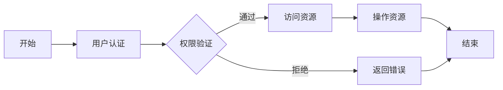
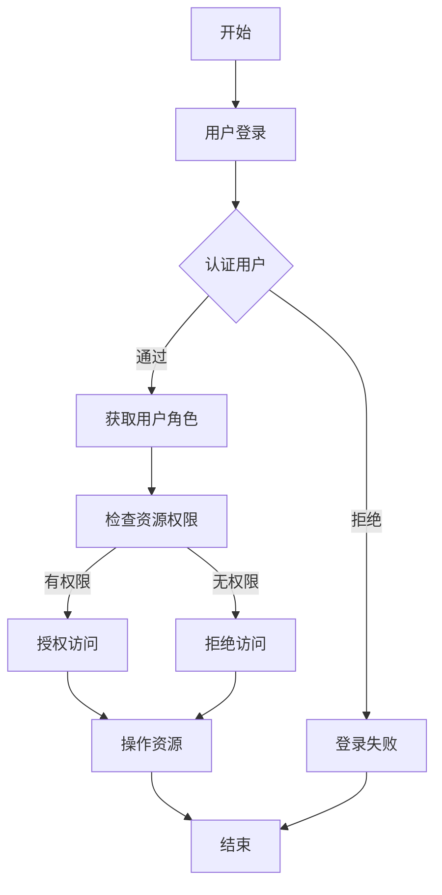
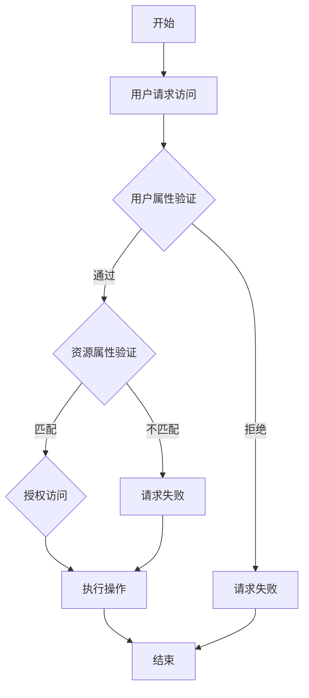
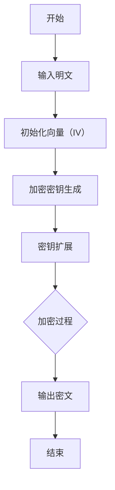
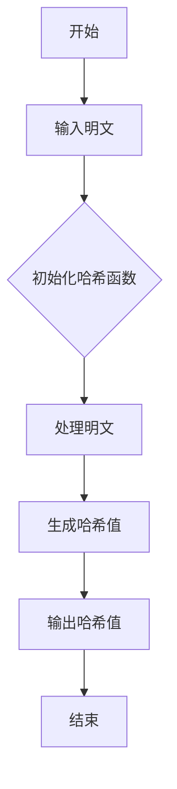
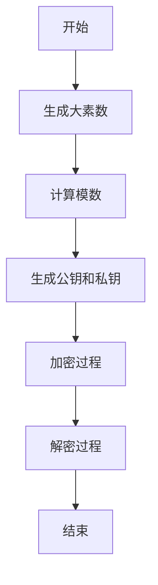
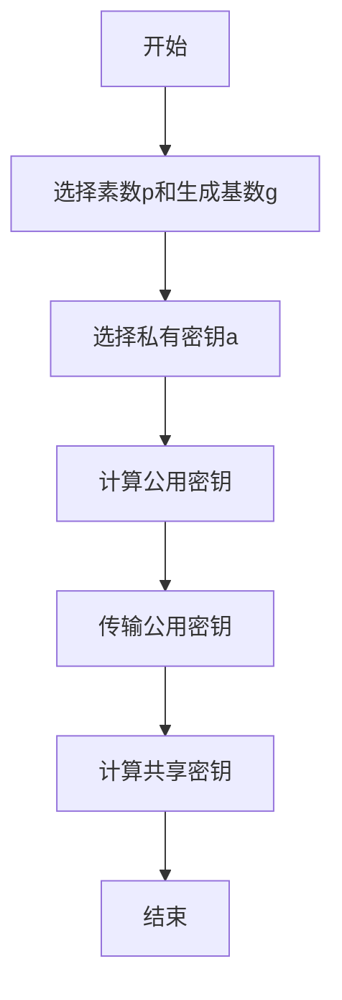

                 

### 云原生安全架构设计

关键词：云原生安全、容器安全、服务网格安全、微服务安全、安全架构

摘要：
随着云计算和微服务技术的快速发展，云原生应用逐渐成为企业数字化转型的新趋势。然而，云原生环境带来的高灵活性和分布式特性，也使得安全性面临前所未有的挑战。本文将深入探讨云原生安全架构的设计原则和实践，旨在为开发者和管理者提供一套系统的安全解决方案，保障云原生环境的安全可靠运行。

---

### 目录大纲设计步骤

在撰写本文之前，我们先来设计一下文章的目录大纲，以确保内容组织结构清晰、逻辑连贯。

#### 第一部分：背景与基础

1. **云原生安全架构的起源与发展**
2. **云原生环境的安全挑战**
3. **云原生安全架构的核心概念**
4. **云原生安全架构的边界与外延**

#### 第二部分：核心概念与原理

1. **容器化安全**
   - **容器安全的基本概念**
   - **容器安全的挑战与解决方案**
2. **服务网格安全**
   - **服务网格的基本概念**
   - **服务网格的安全机制**
3. **微服务安全**
   - **微服务安全的基本原理**
   - **微服务安全的实践案例**

#### 第三部分：系统分析与架构设计

1. **问题场景介绍**
2. **项目介绍**
3. **系统功能设计**
4. **系统架构设计**
5. **系统接口设计与系统交互**

#### 第四部分：项目实战

1. **环境安装**
2. **系统核心实现源代码**
3. **代码应用解读与分析**
4. **实际案例分析与详细讲解剖析**
5. **项目小结**

#### 第五部分：最佳实践与总结

1. **最佳实践 tips**
2. **小结**
3. **注意事项**
4. **拓展阅读**

通过以上设计，我们可以确保文章内容全面覆盖云原生安全架构的各个方面，从理论基础到实际应用，帮助读者建立起完整的知识体系。

---

### 云原生安全架构设计

随着云计算和微服务技术的快速发展，云原生应用逐渐成为企业数字化转型的新趋势。然而，云原生环境带来的高灵活性和分布式特性，也使得安全性面临前所未有的挑战。云原生安全架构设计的关键在于如何在保障系统灵活性和可扩展性的同时，确保数据安全、应用安全和基础设施安全。

关键词：云原生安全、容器安全、服务网格安全、微服务安全、安全架构

摘要：
本文将深入探讨云原生安全架构的设计原则和实践，旨在为开发者和管理者提供一套系统的安全解决方案，保障云原生环境的安全可靠运行。

---

### 第一部分：背景与基础

#### 1.1 云原生安全架构的起源与发展

云原生（Cloud Native）是指那些在设计、开发和部署上，都能够充分利用和发挥云计算优势的应用和服务。云原生应用通常采用微服务架构，通过容器、服务网格、不可变基础设施等新兴技术，实现了更高效的开发、部署和运维。

云原生安全架构的发展，可以追溯到容器技术的兴起。随着Docker等容器技术的广泛应用，开发者和运维人员开始意识到容器化应用在安全方面的新挑战。例如，容器运行时的隔离性和安全性、容器镜像的安全、容器网络的安全等问题。为了应对这些挑战，业界逐渐形成了一套云原生安全架构。

#### 1.2 云原生环境的安全挑战

云原生环境的安全挑战主要表现在以下几个方面：

1. **容器安全**：容器提供了轻量级、可移植的运行环境，但容器本身的脆弱性和容器编排系统的安全性，都带来了新的安全风险。

2. **服务网格安全**：服务网格是微服务架构中用于服务间通信的基础设施，其安全性和可靠性直接影响整个系统的稳定性。

3. **微服务安全**：微服务架构将应用拆分成多个小型、独立的服务，这增加了系统的复杂度，同时也带来了新的安全挑战。

4. **基础设施安全**：云原生环境通常运行在云平台上，基础设施的安全性直接关系到整个系统的安全性。

#### 1.3 云原生安全架构的核心概念

云原生安全架构的核心概念包括以下几个方面：

1. **零信任网络访问**：基于“永不信任，始终验证”的原则，确保只有经过严格验证的用户和设备才能访问网络资源。

2. **自动化安全防护**：通过自动化工具和流程，实现对云原生环境的安全防护，减少人为干预，提高响应速度。

3. **持续安全监测**：通过实时监测和日志分析，及时发现和响应安全威胁。

4. **安全开发生命周期**：将安全贯穿于整个软件开发周期，从代码编写、测试到部署，确保应用的安全性。

5. **可观测性**：通过监控、日志和追踪等技术，实现对云原生环境的全面监测和问题定位。

#### 1.4 云原生安全架构的边界与外延

云原生安全架构的边界主要涵盖以下几个方面：

1. **技术范围**：包括容器、服务网格、微服务、基础设施等技术组件。

2. **适用业务场景**：适用于需要高度可扩展性、灵活性和可靠性的业务场景，如电子商务、金融科技、物联网等。

3. **业务范围**：不仅涵盖应用开发、测试和部署，还涉及运维、监控和安全管理等环节。

#### 1.5 概念结构与核心要素组成

云原生安全架构的基本概念和核心要素组成如下：

1. **容器安全**：包括容器镜像安全、容器运行时安全、容器网络安全等。

2. **服务网格安全**：包括服务间通信安全、服务身份验证、服务访问控制等。

3. **微服务安全**：包括应用级安全、数据安全、接口安全等。

4. **基础设施安全**：包括网络安全、存储安全、计算安全等。

5. **安全监控与响应**：包括安全监测、威胁情报、响应策略等。

通过以上五个方面的内容，我们为读者提供了一个关于云原生安全架构的全面概述，为后续深入探讨每个部分奠定了基础。

---

### 第一部分：背景与基础

在深入探讨云原生安全架构之前，我们需要先了解一些核心概念和背景信息，以便为后续内容提供坚实的基础。

#### 1.1 云原生安全架构的起源与发展

云原生安全架构的起源可以追溯到云计算和容器技术的兴起。随着云计算的普及，企业开始将传统的单体应用程序重构为微服务架构，以便更好地利用云计算的资源和服务。容器技术，如Docker，成为了微服务部署的关键工具。容器提供了一个轻量级、可移植的运行环境，使得开发者能够独立开发、测试和部署服务，而无需关心底层基础设施。

然而，随着容器技术的广泛应用，人们开始意识到容器化应用在安全性方面的新挑战。例如，容器镜像的安全、容器运行时的安全隔离、容器网络的安全性等问题。为了解决这些问题，云原生安全架构的概念逐渐形成，并在实践中不断完善。

云原生安全架构的发展经历了以下几个阶段：

1. **容器镜像安全**：早期的容器安全主要集中在容器镜像的构建和分发过程中，确保容器镜像中不包含恶意代码或敏感信息。

2. **容器运行时安全**：随着容器技术的成熟，安全关注点逐渐扩展到容器运行时，包括容器编排系统的安全性、容器之间的隔离性等。

3. **服务网格安全**：随着微服务架构的普及，服务网格（如Istio、Linkerd）成为微服务通信的关键基础设施，其安全性也成为云原生安全架构的重要组成部分。

4. **微服务安全**：微服务架构本身增加了系统的复杂度，同时也带来了新的安全挑战，如服务间的身份验证、访问控制、数据安全等。

5. **基础设施安全**：云原生环境通常运行在云平台上，基础设施的安全性直接关系到整个系统的安全性，因此，云原生安全架构也需要涵盖网络、存储、计算等基础设施的安全。

#### 1.2 云原生环境的安全挑战

云原生环境的安全挑战主要体现在以下几个方面：

1. **容器安全**：容器提供了轻量级、可移植的运行环境，但容器本身的脆弱性和容器编排系统的安全性，都带来了新的安全风险。例如，容器镜像可能包含已知的漏洞或恶意代码，容器运行时可能受到恶意攻击或滥用。

2. **服务网格安全**：服务网格是微服务架构中用于服务间通信的基础设施，其安全性和可靠性直接影响整个系统的稳定性。服务网格中可能存在的安全漏洞，如未授权访问、数据泄露等，都可能对系统造成严重威胁。

3. **微服务安全**：微服务架构将应用拆分成多个小型、独立的服务，这增加了系统的复杂度，同时也带来了新的安全挑战。例如，服务间的身份验证、访问控制、数据安全等，都需要精心设计和实现。

4. **基础设施安全**：云原生环境通常运行在云平台上，基础设施的安全性直接关系到整个系统的安全性。云平台的安全漏洞、配置错误、网络攻击等，都可能对云原生应用造成影响。

5. **安全运维挑战**：云原生环境的高灵活性和可扩展性，使得安全运维变得更加复杂。传统的安全防护手段和运维流程，在云原生环境中可能不再适用，需要采用新的安全运维策略和工具。

#### 1.3 云原生安全架构的核心概念

云原生安全架构的核心概念包括以下几个方面：

1. **零信任网络访问**：零信任网络访问（Zero Trust Network Access，ZTNA）基于“永不信任，始终验证”的原则，确保只有经过严格验证的用户和设备才能访问网络资源。这要求在访问控制方面采用严格的安全策略，如多因素认证、动态访问控制等。

2. **自动化安全防护**：自动化安全防护是通过自动化工具和流程，实现对云原生环境的安全防护，减少人为干预，提高响应速度。这包括自动化的安全配置、漏洞扫描、入侵检测等。

3. **持续安全监测**：持续安全监测是通过实时监测和日志分析，及时发现和响应安全威胁。这要求采用全面的安全监测工具和技术，如入侵检测系统（IDS）、安全信息与事件管理（SIEM）系统等。

4. **安全开发生命周期**：安全开发生命周期（Security Development Lifecycle，SDL）将安全贯穿于整个软件开发周期，从代码编写、测试到部署，确保应用的安全性。这要求在软件开发过程中，严格执行安全开发和测试流程，及时发现和修复安全漏洞。

5. **可观测性**：可观测性是通过监控、日志和追踪等技术，实现对云原生环境的全面监测和问题定位。这要求采用全面的监控和日志分析工具，确保能够实时了解系统的运行状态和安全状况。

#### 1.4 云原生安全架构的边界与外延

云原生安全架构的边界主要涵盖以下几个方面：

1. **技术范围**：云原生安全架构涉及的技术范围包括容器、服务网格、微服务、基础设施等。这些技术组件的安全性和可靠性，直接决定了云原生环境的安全性。

2. **适用业务场景**：云原生安全架构适用于需要高度可扩展性、灵活性和可靠性的业务场景，如电子商务、金融科技、物联网等。这些场景通常需要快速响应市场变化，同时保持系统的稳定性和安全性。

3. **业务范围**：云原生安全架构不仅涵盖应用开发、测试和部署，还涉及运维、监控和安全管理等环节。这要求在云原生环境中，构建全面的安全管理体系和运维流程。

4. **安全层次**：云原生安全架构的安全层次包括应用层、网络层、基础设施层等。这要求在各个层次上，采取相应的安全措施，确保系统的整体安全性。

#### 1.5 概念结构与核心要素组成

云原生安全架构的基本概念和核心要素组成如下：

1. **容器安全**：包括容器镜像安全、容器运行时安全、容器网络安全等。

   - **容器镜像安全**：确保容器镜像中不包含已知的漏洞、恶意代码或敏感信息。
   - **容器运行时安全**：包括容器编排系统的安全性、容器之间的隔离性等。
   - **容器网络安全**：包括容器网络配置、容器网络隔离等。

2. **服务网格安全**：包括服务间通信安全、服务身份验证、服务访问控制等。

   - **服务间通信安全**：确保服务间通信的安全性，防止数据泄露或篡改。
   - **服务身份验证**：确保服务之间的身份验证，防止未授权访问。
   - **服务访问控制**：确保服务访问的权限控制，防止滥用或恶意访问。

3. **微服务安全**：包括应用级安全、数据安全、接口安全等。

   - **应用级安全**：确保应用层面的安全性，包括身份验证、授权、加密等。
   - **数据安全**：确保数据的安全存储和传输，防止数据泄露或篡改。
   - **接口安全**：确保接口的安全性，防止接口被恶意攻击或滥用。

4. **基础设施安全**：包括网络安全、存储安全、计算安全等。

   - **网络安全**：确保网络的稳定性、可靠性和安全性，防止网络攻击或数据泄露。
   - **存储安全**：确保数据存储的安全性，防止数据泄露或篡改。
   - **计算安全**：确保计算资源的可靠性、安全性和效率，防止计算资源被恶意占用或滥用。

5. **安全监控与响应**：包括安全监测、威胁情报、响应策略等。

   - **安全监测**：实时监测系统的运行状态和安全状况，及时发现安全威胁。
   - **威胁情报**：收集和分析安全威胁信息，为安全响应提供支持。
   - **响应策略**：制定和实施安全响应策略，确保能够快速、有效地应对安全威胁。

通过以上五个方面的内容，我们为读者提供了一个关于云原生安全架构的全面概述，为后续深入探讨每个部分奠定了基础。

---

### 第一部分：背景与基础

在深入探讨云原生安全架构之前，我们需要先了解一些核心概念和背景信息，以便为后续内容提供坚实的基础。

#### 1.1 云原生安全架构的起源与发展

云原生安全架构的起源可以追溯到云计算和容器技术的兴起。随着云计算的普及，企业开始将传统的单体应用程序重构为微服务架构，以便更好地利用云计算的资源和服务。容器技术，如Docker，成为了微服务部署的关键工具。容器提供了一个轻量级、可移植的运行环境，使得开发者能够独立开发、测试和部署服务，而无需关心底层基础设施。

然而，随着容器技术的广泛应用，人们开始意识到容器化应用在安全性方面的新挑战。例如，容器镜像的安全、容器运行时的安全隔离、容器网络的安全性等问题。为了解决这些问题，云原生安全架构的概念逐渐形成，并在实践中不断完善。

云原生安全架构的发展经历了以下几个阶段：

1. **容器镜像安全**：早期的容器安全主要集中在容器镜像的构建和分发过程中，确保容器镜像中不包含恶意代码或敏感信息。

2. **容器运行时安全**：随着容器技术的成熟，安全关注点逐渐扩展到容器运行时，包括容器编排系统的安全性、容器之间的隔离性等。

3. **服务网格安全**：随着微服务架构的普及，服务网格（如Istio、Linkerd）成为微服务通信的关键基础设施，其安全性和可靠性也成为云原生安全架构的重要组成部分。

4. **微服务安全**：微服务架构本身增加了系统的复杂度，同时也带来了新的安全挑战，如服务间的身份验证、访问控制、数据安全等。

5. **基础设施安全**：云原生环境通常运行在云平台上，基础设施的安全性直接关系到整个系统的安全性，因此，云原生安全架构也需要涵盖网络、存储、计算等基础设施的安全。

#### 1.2 云原生环境的安全挑战

云原生环境的安全挑战主要体现在以下几个方面：

1. **容器安全**：容器提供了轻量级、可移植的运行环境，但容器本身的脆弱性和容器编排系统的安全性，都带来了新的安全风险。例如，容器镜像可能包含已知的漏洞或恶意代码，容器运行时可能受到恶意攻击或滥用。

2. **服务网格安全**：服务网格是微服务架构中用于服务间通信的基础设施，其安全性和可靠性直接影响整个系统的稳定性。服务网格中可能存在的安全漏洞，如未授权访问、数据泄露等，都可能对系统造成严重威胁。

3. **微服务安全**：微服务架构将应用拆分成多个小型、独立的服务，这增加了系统的复杂度，同时也带来了新的安全挑战。例如，服务间的身份验证、访问控制、数据安全等，都需要精心设计和实现。

4. **基础设施安全**：云原生环境通常运行在云平台上，基础设施的安全性直接关系到整个系统的安全性。云平台的安全漏洞、配置错误、网络攻击等，都可能对云原生应用造成影响。

5. **安全运维挑战**：云原生环境的高灵活性和可扩展性，使得安全运维变得更加复杂。传统的安全防护手段和运维流程，在云原生环境中可能不再适用，需要采用新的安全运维策略和工具。

#### 1.3 云原生安全架构的核心概念

云原生安全架构的核心概念包括以下几个方面：

1. **零信任网络访问**：零信任网络访问（Zero Trust Network Access，ZTNA）基于“永不信任，始终验证”的原则，确保只有经过严格验证的用户和设备才能访问网络资源。这要求在访问控制方面采用严格的安全策略，如多因素认证、动态访问控制等。

2. **自动化安全防护**：自动化安全防护是通过自动化工具和流程，实现对云原生环境的安全防护，减少人为干预，提高响应速度。这包括自动化的安全配置、漏洞扫描、入侵检测等。

3. **持续安全监测**：持续安全监测是通过实时监测和日志分析，及时发现和响应安全威胁。这要求采用全面的安全监测工具和技术，如入侵检测系统（IDS）、安全信息与事件管理（SIEM）系统等。

4. **安全开发生命周期**：安全开发生命周期（Security Development Lifecycle，SDL）将安全贯穿于整个软件开发周期，从代码编写、测试到部署，确保应用的安全性。这要求在软件开发过程中，严格执行安全开发和测试流程，及时发现和修复安全漏洞。

5. **可观测性**：可观测性是通过监控、日志和追踪等技术，实现对云原生环境的全面监测和问题定位。这要求采用全面的监控和日志分析工具，确保能够实时了解系统的运行状态和安全状况。

#### 1.4 云原生安全架构的边界与外延

云原生安全架构的边界主要涵盖以下几个方面：

1. **技术范围**：云原生安全架构涉及的技术范围包括容器、服务网格、微服务、基础设施等。这些技术组件的安全性和可靠性，直接决定了云原生环境的安全性。

2. **适用业务场景**：云原生安全架构适用于需要高度可扩展性、灵活性和可靠性的业务场景，如电子商务、金融科技、物联网等。这些场景通常需要快速响应市场变化，同时保持系统的稳定性和安全性。

3. **业务范围**：云原生安全架构不仅涵盖应用开发、测试和部署，还涉及运维、监控和安全管理等环节。这要求在云原生环境中，构建全面的安全管理体系和运维流程。

4. **安全层次**：云原生安全架构的安全层次包括应用层、网络层、基础设施层等。这要求在各个层次上，采取相应的安全措施，确保系统的整体安全性。

#### 1.5 概念结构与核心要素组成

云原生安全架构的基本概念和核心要素组成如下：

1. **容器安全**：包括容器镜像安全、容器运行时安全、容器网络安全等。

   - **容器镜像安全**：确保容器镜像中不包含已知的漏洞、恶意代码或敏感信息。
   - **容器运行时安全**：包括容器编排系统的安全性、容器之间的隔离性等。
   - **容器网络安全**：包括容器网络配置、容器网络隔离等。

2. **服务网格安全**：包括服务间通信安全、服务身份验证、服务访问控制等。

   - **服务间通信安全**：确保服务间通信的安全性，防止数据泄露或篡改。
   - **服务身份验证**：确保服务之间的身份验证，防止未授权访问。
   - **服务访问控制**：确保服务访问的权限控制，防止滥用或恶意访问。

3. **微服务安全**：包括应用级安全、数据安全、接口安全等。

   - **应用级安全**：确保应用层面的安全性，包括身份验证、授权、加密等。
   - **数据安全**：确保数据的安全存储和传输，防止数据泄露或篡改。
   - **接口安全**：确保接口的安全性，防止接口被恶意攻击或滥用。

4. **基础设施安全**：包括网络安全、存储安全、计算安全等。

   - **网络安全**：确保网络的稳定性、可靠性和安全性，防止网络攻击或数据泄露。
   - **存储安全**：确保数据存储的安全性，防止数据泄露或篡改。
   - **计算安全**：确保计算资源的可靠性、安全性和效率，防止计算资源被恶意占用或滥用。

5. **安全监控与响应**：包括安全监测、威胁情报、响应策略等。

   - **安全监测**：实时监测系统的运行状态和安全状况，及时发现安全威胁。
   - **威胁情报**：收集和分析安全威胁信息，为安全响应提供支持。
   - **响应策略**：制定和实施安全响应策略，确保能够快速、有效地应对安全威胁。

通过以上五个方面的内容，我们为读者提供了一个关于云原生安全架构的全面概述，为后续深入探讨每个部分奠定了基础。

---

### 第一部分：背景与基础

在深入探讨云原生安全架构之前，我们需要先了解一些核心概念和背景信息，以便为后续内容提供坚实的基础。

#### 1.1 云原生安全架构的起源与发展

云原生安全架构的起源可以追溯到云计算和容器技术的兴起。随着云计算的普及，企业开始将传统的单体应用程序重构为微服务架构，以便更好地利用云计算的资源和服务。容器技术，如Docker，成为了微服务部署的关键工具。容器提供了一个轻量级、可移植的运行环境，使得开发者能够独立开发、测试和部署服务，而无需关心底层基础设施。

然而，随着容器技术的广泛应用，人们开始意识到容器化应用在安全性方面的新挑战。例如，容器镜像的安全、容器运行时的安全隔离、容器网络的安全性等问题。为了解决这些问题，云原生安全架构的概念逐渐形成，并在实践中不断完善。

云原生安全架构的发展经历了以下几个阶段：

1. **容器镜像安全**：早期的容器安全主要集中在容器镜像的构建和分发过程中，确保容器镜像中不包含恶意代码或敏感信息。

2. **容器运行时安全**：随着容器技术的成熟，安全关注点逐渐扩展到容器运行时，包括容器编排系统的安全性、容器之间的隔离性等。

3. **服务网格安全**：随着微服务架构的普及，服务网格（如Istio、Linkerd）成为微服务通信的关键基础设施，其安全性和可靠性也成为云原生安全架构的重要组成部分。

4. **微服务安全**：微服务架构本身增加了系统的复杂度，同时也带来了新的安全挑战，如服务间的身份验证、访问控制、数据安全等。

5. **基础设施安全**：云原生环境通常运行在云平台上，基础设施的安全性直接关系到整个系统的安全性，因此，云原生安全架构也需要涵盖网络、存储、计算等基础设施的安全。

#### 1.2 云原生环境的安全挑战

云原生环境的安全挑战主要体现在以下几个方面：

1. **容器安全**：容器提供了轻量级、可移植的运行环境，但容器本身的脆弱性和容器编排系统的安全性，都带来了新的安全风险。例如，容器镜像可能包含已知的漏洞或恶意代码，容器运行时可能受到恶意攻击或滥用。

2. **服务网格安全**：服务网格是微服务架构中用于服务间通信的基础设施，其安全性和可靠性直接影响整个系统的稳定性。服务网格中可能存在的安全漏洞，如未授权访问、数据泄露等，都可能对系统造成严重威胁。

3. **微服务安全**：微服务架构将应用拆分成多个小型、独立的服务，这增加了系统的复杂度，同时也带来了新的安全挑战。例如，服务间的身份验证、访问控制、数据安全等，都需要精心设计和实现。

4. **基础设施安全**：云原生环境通常运行在云平台上，基础设施的安全性直接关系到整个系统的安全性。云平台的安全漏洞、配置错误、网络攻击等，都可能对云原生应用造成影响。

5. **安全运维挑战**：云原生环境的高灵活性和可扩展性，使得安全运维变得更加复杂。传统的安全防护手段和运维流程，在云原生环境中可能不再适用，需要采用新的安全运维策略和工具。

#### 1.3 云原生安全架构的核心概念

云原生安全架构的核心概念包括以下几个方面：

1. **零信任网络访问**：零信任网络访问（Zero Trust Network Access，ZTNA）基于“永不信任，始终验证”的原则，确保只有经过严格验证的用户和设备才能访问网络资源。这要求在访问控制方面采用严格的安全策略，如多因素认证、动态访问控制等。

2. **自动化安全防护**：自动化安全防护是通过自动化工具和流程，实现对云原生环境的安全防护，减少人为干预，提高响应速度。这包括自动化的安全配置、漏洞扫描、入侵检测等。

3. **持续安全监测**：持续安全监测是通过实时监测和日志分析，及时发现和响应安全威胁。这要求采用全面的安全监测工具和技术，如入侵检测系统（IDS）、安全信息与事件管理（SIEM）系统等。

4. **安全开发生命周期**：安全开发生命周期（Security Development Lifecycle，SDL）将安全贯穿于整个软件开发周期，从代码编写、测试到部署，确保应用的安全性。这要求在软件开发过程中，严格执行安全开发和测试流程，及时发现和修复安全漏洞。

5. **可观测性**：可观测性是通过监控、日志和追踪等技术，实现对云原生环境的全面监测和问题定位。这要求采用全面的监控和日志分析工具，确保能够实时了解系统的运行状态和安全状况。

#### 1.4 云原生安全架构的边界与外延

云原生安全架构的边界主要涵盖以下几个方面：

1. **技术范围**：云原生安全架构涉及的技术范围包括容器、服务网格、微服务、基础设施等。这些技术组件的安全性和可靠性，直接决定了云原生环境的安全性。

2. **适用业务场景**：云原生安全架构适用于需要高度可扩展性、灵活性和可靠性的业务场景，如电子商务、金融科技、物联网等。这些场景通常需要快速响应市场变化，同时保持系统的稳定性和安全性。

3. **业务范围**：云原生安全架构不仅涵盖应用开发、测试和部署，还涉及运维、监控和安全管理等环节。这要求在云原生环境中，构建全面的安全管理体系和运维流程。

4. **安全层次**：云原生安全架构的安全层次包括应用层、网络层、基础设施层等。这要求在各个层次上，采取相应的安全措施，确保系统的整体安全性。

#### 1.5 概念结构与核心要素组成

云原生安全架构的基本概念和核心要素组成如下：

1. **容器安全**：包括容器镜像安全、容器运行时安全、容器网络安全等。

   - **容器镜像安全**：确保容器镜像中不包含已知的漏洞、恶意代码或敏感信息。
   - **容器运行时安全**：包括容器编排系统的安全性、容器之间的隔离性等。
   - **容器网络安全**：包括容器网络配置、容器网络隔离等。

2. **服务网格安全**：包括服务间通信安全、服务身份验证、服务访问控制等。

   - **服务间通信安全**：确保服务间通信的安全性，防止数据泄露或篡改。
   - **服务身份验证**：确保服务之间的身份验证，防止未授权访问。
   - **服务访问控制**：确保服务访问的权限控制，防止滥用或恶意访问。

3. **微服务安全**：包括应用级安全、数据安全、接口安全等。

   - **应用级安全**：确保应用层面的安全性，包括身份验证、授权、加密等。
   - **数据安全**：确保数据的安全存储和传输，防止数据泄露或篡改。
   - **接口安全**：确保接口的安全性，防止接口被恶意攻击或滥用。

4. **基础设施安全**：包括网络安全、存储安全、计算安全等。

   - **网络安全**：确保网络的稳定性、可靠性和安全性，防止网络攻击或数据泄露。
   - **存储安全**：确保数据存储的安全性，防止数据泄露或篡改。
   - **计算安全**：确保计算资源的可靠性、安全性和效率，防止计算资源被恶意占用或滥用。

5. **安全监控与响应**：包括安全监测、威胁情报、响应策略等。

   - **安全监测**：实时监测系统的运行状态和安全状况，及时发现安全威胁。
   - **威胁情报**：收集和分析安全威胁信息，为安全响应提供支持。
   - **响应策略**：制定和实施安全响应策略，确保能够快速、有效地应对安全威胁。

通过以上五个方面的内容，我们为读者提供了一个关于云原生安全架构的全面概述，为后续深入探讨每个部分奠定了基础。

---

### 第二部分：核心概念与原理

在了解了云原生安全架构的背景和发展之后，接下来我们将深入探讨其核心概念和原理。这些核心概念和原理包括容器安全、服务网格安全和微服务安全，它们构成了云原生安全架构的基础。

#### 2.1 容器化安全

容器化安全是指确保容器环境中的应用程序和数据的安全。容器化技术，如Docker，使得应用程序可以以容器形式部署和运行，这大大提高了开发、测试和部署的效率。然而，容器本身及其运行环境的安全问题也变得尤为重要。

**2.1.1 容器安全的基本概念**

- **容器镜像**：容器镜像是一个静态的、可执行的文件系统，包含了应用程序及其运行所需的所有依赖库和环境变量。容器镜像的安全主要涉及镜像的构建、分发和存储。
- **容器运行时**：容器运行时是指容器在实际环境中运行的状态，包括容器的启动、运行、监控和管理。容器运行时的安全主要涉及容器之间的隔离性、容器网络配置和安全加固。
- **容器编排系统**：容器编排系统（如Kubernetes）负责管理和自动化容器的部署、扩展和监控。容器编排系统的安全主要涉及集群管理、访问控制和配置管理。

**2.1.2 容器安全的挑战与解决方案**

**挑战**：

1. **镜像安全**：容器镜像可能包含已知的漏洞或恶意代码，这些漏洞或恶意代码可能会被利用来攻击容器或主机系统。
2. **运行时安全**：容器运行时可能存在安全漏洞，如容器逃逸、未授权访问等，这些漏洞可能会被攻击者利用。
3. **编排系统安全**：容器编排系统可能存在配置错误或安全漏洞，如权限管理不当、日志管理不完善等，这些漏洞可能会被攻击者利用。

**解决方案**：

1. **镜像安全**：确保容器镜像的安全性，包括使用官方镜像、定期更新镜像、扫描镜像中的漏洞等。
2. **运行时安全**：增强容器运行时的安全性，包括使用安全容器运行时（如AppArmor、SELinux）、配置网络隔离、限制容器权限等。
3. **编排系统安全**：加强容器编排系统的安全性，包括使用强密码、定期更新集群配置、监控集群状态等。

**2.1.3 容器网络安全的实现方式**

- **网络命名空间**：通过将网络隔离在命名空间中，确保容器之间的网络隔离性。
- **容器网络接口**（CNI）：使用CNI插件实现容器网络的配置和管理，确保容器网络的安全和可靠性。
- **网络安全策略**：定义容器网络的安全策略，包括允许和拒绝的流量、网络端口等。

#### 2.2 服务网格安全

服务网格是一种用于管理微服务通信的分布式系统，它为微服务提供了动态的服务发现、负载均衡、服务间认证和加密等功能。服务网格的安全性直接关系到整个系统的稳定性。

**2.2.1 服务网格的基本概念**

- **服务网格**：服务网格是一个独立的通信基础设施层，它位于应用程序和服务之间，用于管理和控制服务间的通信。常见的服务网格实现包括Istio、Linkerd等。
- **服务间通信**：服务间通信是指微服务之间的网络通信，服务网格提供了服务间通信的安全性和可靠性。
- **服务发现**：服务发现是指应用程序能够动态地找到并连接到其他服务。服务网格通过服务发现机制，确保服务之间的动态连接和负载均衡。
- **负载均衡**：负载均衡是指将网络流量分配到多个服务实例上，确保系统的高可用性和性能。

**2.2.2 服务网格的安全机制**

- **服务间认证**：服务网格提供了服务间认证机制，确保只有经过认证的服务才能进行通信。常见的服务间认证机制包括基于令牌的认证、基于证书的认证等。
- **服务访问控制**：服务网格提供了服务访问控制机制，确保只有授权的服务才能访问其他服务。通过定义访问策略，服务网格可以限制服务之间的访问权限。
- **加密传输**：服务网格提供了加密传输机制，确保服务间通信的数据安全性。常见的安全传输协议包括TLS（传输层安全协议）等。

**2.2.3 服务网格安全的实现方式**

- **基于策略的访问控制**：通过定义访问策略，确保只有授权的服务才能访问其他服务。
- **加密传输**：使用TLS等加密协议，确保服务间通信的数据安全性。
- **服务监控与审计**：通过监控和审计机制，实时监测服务网格的运行状态和安全事件，及时发现和响应安全威胁。

#### 2.3 微服务安全

微服务安全是指在微服务架构中确保应用程序、数据和基础设施的安全性。微服务架构将应用程序分解为多个小型、独立的服务，这使得系统的复杂度增加，同时也带来了新的安全挑战。

**2.3.1 微服务安全的基本原理**

- **身份认证**：确保只有经过认证的用户和设备才能访问微服务。常见的技术包括OAuth、OpenID Connect等。
- **访问控制**：确保只有授权的用户和设备才能访问特定的资源。常见的技术包括基于角色的访问控制（RBAC）和基于属性的访问控制（ABAC）等。
- **数据安全**：确保数据在传输和存储过程中的安全性。常见的技术包括加密、哈希、签名等。

**2.3.2 微服务安全的实践案例**

- **身份认证**：使用OAuth 2.0实现微服务的身份认证，确保只有经过认证的用户才能访问服务。
- **访问控制**：使用基于角色的访问控制（RBAC），确保不同角色的用户具有不同的访问权限。
- **数据安全**：使用HTTPS加密传输数据，使用加密算法（如AES）对存储的数据进行加密。

通过以上对容器化安全、服务网格安全和微服务安全的深入探讨，我们可以看到云原生安全架构的核心概念和原理。这些概念和原理构成了云原生安全架构的基础，为保障云原生环境的安全提供了重要保障。

---

### 第二部分：核心概念与原理

在深入探讨了云原生安全架构的背景和发展之后，接下来我们将重点介绍云原生安全架构中的核心概念与原理。这些核心概念和原理不仅构成了云原生安全架构的基础，也为确保云原生环境的安全性提供了关键指导。

#### 2.1 容器化安全

容器化安全是云原生安全架构中最为基础且至关重要的部分。容器作为微服务架构的核心组件，其安全性直接影响到整个系统的安全稳定。

**2.1.1 容器安全的基本概念**

容器安全涉及多个方面，包括容器镜像安全、容器运行时安全和容器网络安全等。

- **容器镜像**：容器镜像是一个打包了应用程序及其依赖环境的静态文件系统。在容器镜像安全方面，需要关注以下几个方面：
  - **漏洞扫描**：定期对容器镜像进行漏洞扫描，以确保镜像中不包含已知漏洞。
  - **依赖管理**：确保容器镜像中使用的第三方库和依赖项是安全的，没有安全隐患。
  - **最小化镜像**：通过最小化容器镜像的大小，减少潜在的安全漏洞和攻击面。

- **容器运行时**：容器运行时指的是容器在执行过程中所处的环境，包括容器编排系统（如Kubernetes）和容器运行时环境（如Docker）。
  - **容器隔离**：确保容器之间有良好的隔离性，防止容器逃逸。
  - **权限管理**：对容器的权限进行严格管理，确保容器只能访问它应该访问的资源。
  - **安全加固**：通过配置安全加固策略，如关闭不必要的端口、限制容器权限等，增强容器运行时的安全性。

- **容器网络**：容器网络是指容器之间的通信网络。容器网络安全包括以下几个方面：
  - **网络隔离**：通过容器网络命名空间（Network Namespace）和网络接口（Network Interface）等技术实现容器网络的隔离。
  - **网络流量控制**：通过定义网络策略，如防火墙规则和网络流量监控，控制容器之间的网络通信。
  - **加密传输**：使用安全协议（如TLS）加密容器之间的通信，确保数据传输的安全性。

**2.1.2 容器安全的挑战与解决方案**

容器安全的挑战主要包括以下几个方面：

1. **镜像漏洞**：容器镜像可能包含已知的漏洞，这些漏洞可能被攻击者利用。
   - **解决方案**：定期进行镜像漏洞扫描，并使用官方镜像。

2. **容器逃逸**：攻击者可能通过容器逃逸技术获取宿主机的权限。
   - **解决方案**：使用安全容器运行时，如AppArmor或SELinux，增强容器的隔离性。

3. **网络攻击**：容器网络可能遭受各种网络攻击，如DDoS攻击或数据泄露。
   - **解决方案**：配置网络防火墙和入侵检测系统（IDS），监控容器网络流量。

**2.1.3 容器网络安全的实现方式**

- **网络命名空间**：通过容器网络命名空间（Network Namespace）实现容器网络的隔离。
- **容器网络接口**（CNI）：使用容器网络接口（CNI）插件配置和管理容器网络。
- **网络策略**：通过定义网络策略，如防火墙规则，控制容器之间的网络通信。

#### 2.2 服务网格安全

服务网格是云原生环境中的关键基础设施，负责管理微服务之间的通信。服务网格的安全直接关系到整个系统的稳定性和安全性。

**2.2.1 服务网格的基本概念**

- **服务网格**：服务网格是一个独立的通信层，它负责管理微服务之间的通信，如服务发现、负载均衡、断路器等。
- **服务间通信**：服务网格通过服务间通信层（如Istio）管理微服务之间的通信，确保通信的安全性和可靠性。
- **服务发现**：服务网格提供服务发现机制，使微服务能够动态地发现和连接其他服务。
- **负载均衡**：服务网格实现负载均衡功能，确保请求能够均匀地分配到不同的服务实例上。

**2.2.2 服务网格的安全机制**

- **服务间认证**：服务网格通过服务间认证机制，确保只有经过认证的服务才能进行通信。常用的认证机制包括基于令牌的认证（如JWT）和基于证书的认证。
- **访问控制**：服务网格提供访问控制机制，确保只有授权的服务才能访问其他服务。通过定义访问策略，可以限制服务之间的访问权限。
- **加密传输**：服务网格使用加密传输协议（如TLS）确保服务间通信的安全性。

**2.2.3 服务网格安全的实现方式**

- **基于策略的访问控制**：通过定义访问策略，如服务访问控制列表（SACL），限制服务之间的访问。
- **加密传输**：使用TLS加密服务间通信，确保数据传输的安全性。
- **服务监控与审计**：通过监控和审计机制，实时监测服务网格的运行状态和安全事件。

#### 2.3 微服务安全

微服务安全是云原生安全架构中的另一个核心组成部分。在微服务架构中，确保应用程序、数据和基础设施的安全性至关重要。

**2.3.1 微服务安全的基本原理**

- **身份认证**：确保只有经过认证的用户和设备才能访问微服务。常用的身份认证技术包括OAuth、OpenID Connect等。
- **访问控制**：确保只有授权的用户和设备才能访问特定的资源。常用的访问控制技术包括基于角色的访问控制（RBAC）和基于属性的访问控制（ABAC）。
- **数据安全**：确保数据在传输和存储过程中的安全性。常用的数据安全技术包括加密、哈希、签名等。

**2.3.2 微服务安全的实践案例**

- **身份认证**：使用OAuth 2.0或OpenID Connect实现微服务的身份认证。
- **访问控制**：使用基于角色的访问控制（RBAC）或基于属性的访问控制（ABAC）限制微服务的访问权限。
- **数据安全**：使用HTTPS加密微服务之间的通信，使用加密算法（如AES）对存储的数据进行加密。

通过以上对容器化安全、服务网格安全和微服务安全的深入探讨，我们可以看到云原生安全架构的核心概念和原理。这些概念和原理为保障云原生环境的安全性提供了坚实的理论基础和实践指导。

---

### 第二部分：核心概念与原理

#### 2.1 容器化安全

容器化技术，如Docker，已经成为现代软件开发和部署的基石。然而，随着容器技术的广泛应用，容器安全成为了一个不可忽视的重要课题。容器化安全涉及容器镜像、容器运行时和容器网络等多个方面。

**2.1.1 容器安全的基本概念**

容器安全的基本概念包括以下几个方面：

- **容器镜像**：容器镜像是一个静态的、可执行的文件系统，包含了应用程序及其运行所需的依赖库和环境变量。确保容器镜像的安全，是容器化安全的基础。
- **容器运行时**：容器运行时是指容器在实际环境中运行的状态，包括容器的启动、运行、监控和管理。容器运行时的安全主要涉及容器之间的隔离性、容器网络配置和安全加固。
- **容器编排系统**：容器编排系统（如Kubernetes）负责管理和自动化容器的部署、扩展和监控。容器编排系统的安全主要涉及集群管理、访问控制和配置管理。

**2.1.2 容器安全的挑战与解决方案**

容器安全面临的挑战主要包括以下几个方面：

1. **镜像漏洞**：容器镜像可能包含已知的漏洞，这些漏洞可能被利用来攻击容器或宿主系统。
   - **解决方案**：定期进行镜像漏洞扫描，并使用官方镜像。

2. **容器逃逸**：攻击者可能通过容器逃逸技术获取宿主机的权限。
   - **解决方案**：使用安全容器运行时，如AppArmor或SELinux，增强容器的隔离性。

3. **网络攻击**：容器网络可能遭受各种网络攻击，如DDoS攻击或数据泄露。
   - **解决方案**：配置网络防火墙和入侵检测系统（IDS），监控容器网络流量。

**2.1.3 容器网络安全的实现方式**

- **网络命名空间**：通过容器网络命名空间（Network Namespace）实现容器网络的隔离。
- **容器网络接口**（CNI）：使用容器网络接口（CNI）插件配置和管理容器网络。
- **网络策略**：通过定义网络策略，如防火墙规则，控制容器之间的网络通信。

#### 2.2 服务网格安全

服务网格是云原生环境中用于管理微服务通信的基础设施。服务网格提供了服务发现、负载均衡、断路器等功能，确保微服务之间的通信安全和高效。

**2.2.1 服务网格的基本概念**

- **服务网格**：服务网格是一个独立的通信层，它负责管理微服务之间的通信，如服务发现、负载均衡、断路器等。
- **服务间通信**：服务网格通过服务间通信层（如Istio）管理微服务之间的通信，确保通信的安全性和可靠性。
- **服务发现**：服务网格提供服务发现机制，使微服务能够动态地发现和连接其他服务。
- **负载均衡**：服务网格实现负载均衡功能，确保请求能够均匀地分配到不同的服务实例上。

**2.2.2 服务网格的安全机制**

- **服务间认证**：服务网格通过服务间认证机制，确保只有经过认证的服务才能进行通信。常用的认证机制包括基于令牌的认证（如JWT）和基于证书的认证。
- **访问控制**：服务网格提供访问控制机制，确保只有授权的服务才能访问其他服务。通过定义访问策略，可以限制服务之间的访问权限。
- **加密传输**：服务网格使用加密传输协议（如TLS）确保服务间通信的安全性。

**2.2.3 服务网格安全的实现方式**

- **基于策略的访问控制**：通过定义访问策略，如服务访问控制列表（SACL），限制服务之间的访问。
- **加密传输**：使用TLS加密服务间通信，确保数据传输的安全性。
- **服务监控与审计**：通过监控和审计机制，实时监测服务网格的运行状态和安全事件。

#### 2.3 微服务安全

微服务安全是指在微服务架构中确保应用程序、数据和基础设施的安全性。微服务架构将应用程序分解为多个小型、独立的服务，这使得系统的复杂度增加，同时也带来了新的安全挑战。

**2.3.1 微服务安全的基本原理**

- **身份认证**：确保只有经过认证的用户和设备才能访问微服务。常用的身份认证技术包括OAuth、OpenID Connect等。
- **访问控制**：确保只有授权的用户和设备才能访问特定的资源。常用的访问控制技术包括基于角色的访问控制（RBAC）和基于属性的访问控制（ABAC）。
- **数据安全**：确保数据在传输和存储过程中的安全性。常用的数据安全技术包括加密、哈希、签名等。

**2.3.2 微服务安全的实践案例**

- **身份认证**：使用OAuth 2.0或OpenID Connect实现微服务的身份认证。
- **访问控制**：使用基于角色的访问控制（RBAC）或基于属性的访问控制（ABAC）限制微服务的访问权限。
- **数据安全**：使用HTTPS加密微服务之间的通信，使用加密算法（如AES）对存储的数据进行加密。

通过以上对容器化安全、服务网格安全和微服务安全的深入探讨，我们可以看到云原生安全架构的核心概念和原理。这些概念和原理为保障云原生环境的安全性提供了坚实的理论基础和实践指导。

---

### 第二部分：核心概念与原理

#### 2.1 容器化安全

容器化技术已成为现代软件开发和运维的基石，然而，容器化安全却是一个不可忽视的关键领域。为了深入理解容器化安全，我们需要从容器镜像、容器运行时和容器网络三个方面进行详细探讨。

**2.1.1 容器安全的基本概念**

- **容器镜像**：容器镜像是一个静态的、可执行的文件系统，包含了应用程序及其依赖库和环境变量。镜像的安全直接关系到整个容器环境的安全性。
  - **容器镜像的构建**：在构建容器镜像时，应该遵循最佳实践，如使用官方镜像、最小化镜像大小、确保镜像无漏洞。
  - **容器镜像的存储**：容器镜像的存储应该选择安全可靠的存储方案，如使用容器镜像仓库（如Docker Hub）。

- **容器运行时**：容器运行时是指容器在宿主机上实际运行的状态，涉及容器的启动、运行、监控和管理等方面。
  - **容器运行时的隔离**：容器运行时需要确保容器之间具有良好的隔离性，防止容器逃逸。
  - **容器运行时的加固**：通过配置容器运行时的安全策略，如关闭不必要的端口、限制容器权限等，增强容器运行时的安全性。

- **容器网络**：容器网络是指容器之间的通信网络。容器网络的配置和管理直接影响到容器环境的安全性。
  - **容器网络命名空间**：通过容器网络命名空间（Network Namespace）实现容器网络的隔离。
  - **容器网络接口**：容器网络接口（CNI）插件用于配置和管理容器网络。

**2.1.2 容器安全的挑战与解决方案**

容器安全面临的主要挑战包括：

- **镜像漏洞**：容器镜像可能包含已知的漏洞，这些漏洞可能被攻击者利用。
  - **解决方案**：定期对容器镜像进行漏洞扫描，并使用官方镜像。

- **容器逃逸**：攻击者可能通过容器逃逸技术获取宿主机的权限。
  - **解决方案**：使用安全容器运行时（如AppArmor、SELinux）和严格限制容器权限。

- **网络攻击**：容器网络可能遭受各种网络攻击，如DDoS攻击或数据泄露。
  - **解决方案**：配置网络防火墙和入侵检测系统（IDS），监控容器网络流量。

**2.1.3 容器网络安全的实现方式**

- **网络命名空间**：通过容器网络命名空间（Network Namespace）实现容器网络的隔离。
- **容器网络接口**（CNI）：使用容器网络接口（CNI）插件配置和管理容器网络。
- **网络策略**：通过定义网络策略，如防火墙规则，控制容器之间的网络通信。

#### 2.2 服务网格安全

服务网格是云原生环境中用于管理微服务通信的基础设施，其主要目标是简化微服务之间的通信、提供负载均衡、断路器等功能。服务网格的安全性对整个系统的稳定性和安全性至关重要。

**2.2.1 服务网格的基本概念**

- **服务网格**：服务网格是一个独立的通信层，负责管理微服务之间的通信。
  - **服务网格的组件**：服务网格通常包括数据平面和控制平面。数据平面负责处理微服务之间的通信，控制平面负责配置和管理数据平面。
  - **服务网格的架构**：服务网格通常采用边车（Sidecar）架构，在每个微服务实例旁边部署一个边车代理，代理负责处理服务间通信。

- **服务间通信**：服务网格通过服务间通信层（如Istio、Linkerd）管理微服务之间的通信。
  - **服务间认证**：服务网格通过服务间认证机制，确保只有经过认证的服务才能进行通信。
  - **服务间加密**：服务网格使用加密传输协议（如TLS）确保服务间通信的安全性。

**2.2.2 服务网格的安全机制**

- **服务间认证**：服务网格通过服务间认证机制，确保只有经过认证的服务才能进行通信。常用的认证机制包括基于令牌的认证（如JWT）和基于证书的认证。
- **访问控制**：服务网格提供访问控制机制，确保只有授权的服务才能访问其他服务。通过定义访问策略，可以限制服务之间的访问权限。
- **加密传输**：服务网格使用加密传输协议（如TLS）确保服务间通信的安全性。

**2.2.3 服务网格安全的实现方式**

- **基于策略的访问控制**：通过定义访问策略，如服务访问控制列表（SACL），限制服务之间的访问。
- **加密传输**：使用TLS加密服务间通信，确保数据传输的安全性。
- **服务监控与审计**：通过监控和审计机制，实时监测服务网格的运行状态和安全事件。

#### 2.3 微服务安全

微服务安全是确保微服务架构中应用程序、数据和基础设施的安全性。微服务架构将应用程序分解为多个小型、独立的服务，这使得系统的复杂度增加，同时也带来了新的安全挑战。

**2.3.1 微服务安全的基本原理**

- **身份认证**：确保只有经过认证的用户和设备才能访问微服务。常用的身份认证技术包括OAuth、OpenID Connect等。
- **访问控制**：确保只有授权的用户和设备才能访问特定的资源。常用的访问控制技术包括基于角色的访问控制（RBAC）和基于属性的访问控制（ABAC）。
- **数据安全**：确保数据在传输和存储过程中的安全性。常用的数据安全技术包括加密、哈希、签名等。

**2.3.2 微服务安全的实践案例**

- **身份认证**：使用OAuth 2.0或OpenID Connect实现微服务的身份认证。
- **访问控制**：使用基于角色的访问控制（RBAC）或基于属性的访问控制（ABAC）限制微服务的访问权限。
- **数据安全**：使用HTTPS加密微服务之间的通信，使用加密算法（如AES）对存储的数据进行加密。

通过以上对容器化安全、服务网格安全和微服务安全的深入探讨，我们可以看到云原生安全架构的核心概念和原理。这些概念和原理为保障云原生环境的安全性提供了坚实的理论基础和实践指导。

---

### 第二部分：核心概念与原理

#### 2.1 容器化安全

**核心概念原理**

容器化安全的核心在于保护容器环境中的应用程序和数据，确保容器本身不会成为安全漏洞的源头。以下是几个关键概念：

- **容器镜像安全**：容器镜像中包含的应用程序和依赖库必须经过严格审查，确保没有已知漏洞和恶意代码。
- **容器运行时安全**：容器运行时需要配置适当的权限管理策略，限制容器对宿主机的访问，防止容器逃逸。
- **容器网络安全**：容器网络需要实施隔离策略，防止恶意容器访问其他容器或主机系统。

**概念属性特征对比表格**

| 特征         | 容器镜像安全 | 容器运行时安全 | 容器网络安全 |
| ------------ | ------------ | -------------- | ------------ |
| **重要性**   | 高           | 高             | 中           |
| **实现方式** | 漏洞扫描、使用官方镜像 | 权限管理、安全加固 | 命名空间、网络策略 |
| **挑战**     | 镜像大小、第三方库依赖 | 容器逃逸、权限管理 | 网络攻击、数据泄露 |

**ER实体关系图架构**

```mermaid
erDiagram
    ContainerImage ||--|{ ContainerRuntime }|-- ContainerNetwork
    ContainerImage ||--|{ Application }|-- ContainerRuntime
    ContainerNetwork ||--|{ HostNetwork }|-- HostSystem
```

在这个ER图中，`ContainerImage`与`ContainerRuntime`和`Application`之间存在关联，表示容器镜像与容器运行时和应用之间的关系。`ContainerNetwork`与`HostNetwork`和`HostSystem`之间存在关联，表示容器网络与主机网络和主机系统之间的关系。

#### 2.2 服务网格安全

**核心概念原理**

服务网格安全的核心在于保护服务之间的通信，确保数据在传输过程中不被泄露或篡改。以下是几个关键概念：

- **服务间认证**：确保只有经过认证的服务才能进行通信，防止未授权访问。
- **访问控制**：确保只有授权的服务才能访问其他服务，防止内部攻击。
- **加密传输**：确保服务间通信数据的安全性，防止数据泄露。

**概念属性特征对比表格**

| 特征         | 服务间认证 | 访问控制 | 加密传输 |
| ------------ | ----------- | -------- | -------- |
| **重要性**   | 高          | 高       | 高       |
| **实现方式** | JWT、证书  | 策略定义 | TLS      |
| **挑战**     | 认证性能   | 权限复杂 | 加密性能 |

**ER实体关系图架构**

```mermaid
erDiagram
    ServiceMesh ||--|{ ServiceA }|-- ServiceB
    ServiceA ||--|{ ServiceAuth }|-- ServiceMesh
    ServiceB ||--|{ ServiceAuth }|-- ServiceMesh
```

在这个ER图中，`ServiceMesh`与`ServiceA`和`ServiceB`之间存在关联，表示服务网格与两个服务之间的关系。`ServiceA`和`ServiceB`与`ServiceAuth`之间存在关联，表示服务间认证的关系。

#### 2.3 微服务安全

**核心概念原理**

微服务安全的核心在于保护微服务应用程序和数据，确保系统在面对攻击时能够保持稳定。以下是几个关键概念：

- **身份认证**：确保用户和服务只能通过认证访问系统资源。
- **访问控制**：确保用户和服务只能访问他们有权访问的资源。
- **数据安全**：确保数据在存储和传输过程中的完整性、保密性和可用性。

**概念属性特征对比表格**

| 特征         | 身份认证 | 访问控制 | 数据安全 |
| ------------ | -------- | -------- | -------- |
| **重要性**   | 高       | 高       | 高       |
| **实现方式** | OAuth、JWT | RBAC、ABAC | 加密、哈希 |
| **挑战**     | 性能     | 权限管理 | 加密性能 |

**ER实体关系图架构**

```mermaid
erDiagram
    MicroserviceA ||--|{ IdentityAuth }|-- MicroserviceB
    MicroserviceA ||--|{ AccessControl }|-- MicroserviceB
    MicroserviceA ||--|{ DataSecurity }|-- MicroserviceB
```

在这个ER图中，`MicroserviceA`和`MicroserviceB`之间存在关联，表示两个微服务之间的关系。`MicroserviceA`和`MicroserviceB`与`IdentityAuth`、`AccessControl`和`DataSecurity`之间存在关联，表示认证、访问控制和数据安全的关系。

---

### 第二部分：核心概念与原理

#### 2.1 容器化安全

**核心概念原理**

容器化安全涉及确保容器环境中的应用程序和数据的安全。以下是一些核心概念：

- **容器镜像安全**：容器镜像中包含的应用程序和依赖库必须经过审查，确保没有已知漏洞和恶意代码。可以使用自动化工具进行漏洞扫描和依赖管理。
- **容器运行时安全**：容器运行时需要配置适当的权限管理策略，限制容器对宿主机的访问，防止容器逃逸。可以使用安全容器运行时（如AppArmor、SELinux）来增强隔离性。
- **容器网络安全**：容器网络需要实施隔离策略，防止恶意容器访问其他容器或主机系统。可以使用容器网络命名空间（Network Namespace）和防火墙规则来实现网络隔离。

**概念属性特征对比表格**

| 特征         | 容器镜像安全 | 容器运行时安全 | 容器网络安全 |
| ------------ | ------------ | -------------- | ------------ |
| **重要性**   | 高           | 高             | 中           |
| **实现方式** | 漏洞扫描、依赖管理 | 权限管理、安全加固 | 命名空间、防火墙 |
| **挑战**     | 镜像大小、第三方库依赖 | 容器逃逸、权限管理 | 网络攻击、数据泄露 |

**ER实体关系图架构**

```mermaid
erDiagram
    ContainerImage ||--|{ ContainerRuntime }|-- ContainerNetwork
    ContainerImage ||--|{ Application }|-- ContainerRuntime
    ContainerNetwork ||--|{ HostNetwork }|-- HostSystem
```

在这个ER图中，`ContainerImage`与`ContainerRuntime`和`ContainerNetwork`之间存在关联，表示容器镜像与容器运行时和网络之间的关系。`ContainerRuntime`与`HostNetwork`和`HostSystem`之间存在关联，表示容器运行时与主机网络和主机系统之间的关系。

#### 2.2 服务网格安全

**核心概念原理**

服务网格安全的核心在于保护服务之间的通信，确保数据在传输过程中不被泄露或篡改。以下是一些核心概念：

- **服务间认证**：确保只有经过认证的服务才能进行通信，防止未授权访问。可以使用基于令牌的认证（如JWT）或基于证书的认证。
- **访问控制**：确保只有授权的服务才能访问其他服务，防止内部攻击。可以使用访问控制策略来限制服务之间的访问权限。
- **加密传输**：确保服务间通信数据的安全性，防止数据泄露。可以使用TLS协议加密服务间通信。

**概念属性特征对比表格**

| 特征         | 服务间认证 | 访问控制 | 加密传输 |
| ------------ | ----------- | -------- | -------- |
| **重要性**   | 高          | 高       | 高       |
| **实现方式** | JWT、证书  | 策略定义 | TLS      |
| **挑战**     | 认证性能   | 权限复杂 | 加密性能 |

**ER实体关系图架构**

```mermaid
erDiagram
    ServiceMesh ||--|{ ServiceA }|-- ServiceB
    ServiceA ||--|{ ServiceAuth }|-- ServiceMesh
    ServiceB ||--|{ ServiceAuth }|-- ServiceMesh
```

在这个ER图中，`ServiceMesh`与`ServiceA`和`ServiceB`之间存在关联，表示服务网格与两个服务之间的关系。`ServiceA`和`ServiceB`与`ServiceAuth`之间存在关联，表示服务间认证的关系。

#### 2.3 微服务安全

**核心概念原理**

微服务安全的核心在于保护微服务应用程序和数据，确保系统在面对攻击时能够保持稳定。以下是一些核心概念：

- **身份认证**：确保用户和服务只能通过认证访问系统资源。可以使用OAuth、OpenID Connect等协议实现身份认证。
- **访问控制**：确保用户和服务只能访问他们有权访问的资源。可以使用基于角色的访问控制（RBAC）或基于属性的访问控制（ABAC）实现访问控制。
- **数据安全**：确保数据在存储和传输过程中的完整性、保密性和可用性。可以使用加密、哈希、签名等技术实现数据安全。

**概念属性特征对比表格**

| 特征         | 身份认证 | 访问控制 | 数据安全 |
| ------------ | -------- | -------- | -------- |
| **重要性**   | 高       | 高       | 高       |
| **实现方式** | OAuth、JWT | RBAC、ABAC | 加密、哈希 |
| **挑战**     | 性能     | 权限管理 | 加密性能 |

**ER实体关系图架构**

```mermaid
erDiagram
    MicroserviceA ||--|{ IdentityAuth }|-- MicroserviceB
    MicroserviceA ||--|{ AccessControl }|-- MicroserviceB
    MicroserviceA ||--|{ DataSecurity }|-- MicroserviceB
```

在这个ER图中，`MicroserviceA`和`MicroserviceB`之间存在关联，表示两个微服务之间的关系。`MicroserviceA`和`MicroserviceB`与`IdentityAuth`、`AccessControl`和`DataSecurity`之间存在关联，表示认证、访问控制和数据安全的关系。

---

### 第二部分：核心概念与原理

#### 2.1 容器化安全

容器化安全的核心在于确保容器环境中的应用程序和数据的安全。以下是容器化安全的核心概念和原理：

**2.1.1 容器镜像安全**

容器镜像安全是确保容器镜像中没有已知漏洞和恶意代码。以下是一些关键点：

- **镜像构建**：在构建容器镜像时，应尽量使用官方镜像，并避免将不必要的依赖库和工具集成到镜像中。
- **漏洞扫描**：使用自动化工具定期对容器镜像进行漏洞扫描，如Clair、Docker Bench for Security等。
- **最小化镜像**：通过删除不必要的文件和依赖库来最小化容器镜像的大小，减少潜在的安全漏洞和攻击面。

**2.1.2 容器运行时安全**

容器运行时安全主要关注容器在宿主机上的运行状态。以下是一些关键点：

- **隔离性**：确保容器之间有良好的隔离性，防止容器逃逸。可以使用Linux命名空间（Namespace）和cgroup（控制组）来实现容器隔离。
- **权限管理**：限制容器对宿主机的访问权限，避免容器获取宿主机的特权操作权限。可以使用AppArmor、SELinux等安全模块来加强容器权限管理。
- **安全加固**：关闭不必要的端口和系统服务，限制容器的操作权限，如禁止容器执行root操作。

**2.1.3 容器网络安全

容器网络安全涉及确保容器之间的通信安全。以下是一些关键点：

- **网络命名空间**：使用Linux命名空间（Namespace）将容器的网络隔离，防止容器访问其他容器的网络接口。
- **防火墙规则**：配置防火墙规则，限制容器之间的网络流量，仅允许必要的通信。
- **加密传输**：使用TLS协议加密容器之间的通信，确保数据传输的安全性。

**2.1.4 容器化安全的关键概念对比表格**

| 关键概念 | 容器镜像安全 | 容器运行时安全 | 容器网络安全 |
| --- | --- | --- | --- |
| **重要性** | 高 | 高 | 中 |
| **实现方式** | 漏洞扫描、最小化镜像 | 隔离性、权限管理 | 命名空间、防火墙 |
| **挑战** | 镜像大小、第三方库依赖 | 容器逃逸、权限管理 | 网络攻击、数据泄露 |

**2.1.5 容器化安全ER实体关系图架构**

```mermaid
erDiagram
    ContainerImage ||--|{ ContainerRuntime }|-- ContainerNetwork
    ContainerImage ||--|{ Application }|-- ContainerRuntime
    ContainerNetwork ||--|{ HostNetwork }|-- HostSystem
```

在这个ER图中，`ContainerImage`与`ContainerRuntime`和`ContainerNetwork`之间存在关联，表示容器镜像与容器运行时和网络之间的关系。`ContainerRuntime`与`HostNetwork`和`HostSystem`之间存在关联，表示容器运行时与主机网络和主机系统之间的关系。

---

### 第二部分：核心概念与原理

#### 2.2 服务网格安全

服务网格安全是确保微服务之间通信安全的关键组成部分。以下是服务网格安全的核心概念和原理：

**2.2.1 服务网格基本概念**

服务网格（Service Mesh）是一个用于管理服务间通信的分布式系统，主要目的是简化服务之间的交互，并提供服务发现、负载均衡、故障转移等功能。服务网格的核心组件包括：

- **数据平面**：负责处理实际的服务间通信，通常由一组边车代理（Sidecar Proxy）组成。
- **控制平面**：负责配置和管理数据平面的服务，通常由一个或多个控制器组成。

**2.2.2 服务网格安全的关键概念**

- **服务间认证**：确保只有经过认证的服务才能进行通信，防止未授权的访问。常用的认证机制包括基于令牌的认证（如JWT）和基于证书的认证。
- **访问控制**：确保只有授权的服务才能访问其他服务，防止内部攻击。可以通过定义访问策略来实现。
- **加密传输**：确保服务间通信数据的安全性，防止数据泄露。通常使用TLS协议进行加密传输。

**2.2.3 服务网格安全的实现方式**

- **基于策略的访问控制**：通过定义访问策略，如服务访问控制列表（SACL），限制服务之间的访问权限。
- **加密传输**：使用TLS协议加密服务间通信，确保数据传输的安全性。
- **服务监控与审计**：通过监控和审计机制，实时监测服务网格的运行状态和安全事件。

**2.2.4 服务网格安全ER实体关系图架构**

```mermaid
erDiagram
    ServiceMesh ||--|{ DataPlane }|-- ServiceA
    ServiceMesh ||--|{ DataPlane }|-- ServiceB
    ServiceMesh ||--|{ ControlPlane }|-- ServiceA
    ServiceMesh ||--|{ ControlPlane }|-- ServiceB
```

在这个ER图中，`ServiceMesh`与`DataPlane`和`ControlPlane`之间存在关联，表示服务网格与数据平面和控制平面之间的关系。`ServiceA`和`ServiceB`与`ServiceMesh`之间存在关联，表示服务与服务网格之间的关系。

---

### 第二部分：核心概念与原理

#### 2.3 微服务安全

微服务安全是确保微服务架构中各个服务及其数据安全的关键部分。以下是微服务安全的核心概念和原理：

**2.3.1 微服务基本概念**

微服务架构将应用程序分解为多个小型、独立的服务，每个服务负责一个特定的业务功能。这些服务通过定义良好的API进行通信，通常采用HTTP/HTTPS协议。微服务安全涉及以下几个方面：

- **身份认证**：确保只有经过认证的用户和服务能够访问微服务。
- **访问控制**：确保用户和服务只能访问他们有权访问的服务和资源。
- **数据安全**：确保数据在存储和传输过程中的完整性、保密性和可用性。

**2.3.2 微服务安全的关键概念**

- **身份认证**：常用的身份认证技术包括OAuth 2.0、OpenID Connect、JWT等。
- **访问控制**：常用的访问控制技术包括基于角色的访问控制（RBAC）、基于属性的访问控制（ABAC）等。
- **数据安全**：常用的数据安全技术包括加密、哈希、签名等。

**2.3.3 微服务安全的实现方式**

- **身份认证**：使用OAuth 2.0或OpenID Connect实现微服务的身份认证，确保用户和服务经过认证后才能访问服务。
- **访问控制**：通过定义访问策略，如基于角色的访问控制（RBAC）或基于属性的访问控制（ABAC），限制用户和服务的访问权限。
- **数据安全**：使用HTTPS加密微服务之间的通信，使用加密算法（如AES）对存储的数据进行加密。

**2.3.4 微服务安全ER实体关系图架构**

```mermaid
erDiagram
    MicroserviceA ||--|{ IdentityAuth }|-- MicroserviceB
    MicroserviceA ||--|{ AccessControl }|-- MicroserviceB
    MicroserviceA ||--|{ DataSecurity }|-- MicroserviceB
```

在这个ER图中，`MicroserviceA`和`MicroserviceB`之间存在关联，表示两个微服务之间的关系。`MicroserviceA`和`MicroserviceB`与`IdentityAuth`、`AccessControl`和`DataSecurity`之间存在关联，表示认证、访问控制和数据安全的关系。

---

### 第二部分：核心概念与原理

#### 2.4 基础设施安全

基础设施安全是确保云原生环境底层硬件和软件资源的安全性。以下是从网络、存储和计算等方面讨论基础设施安全的核心概念和原理：

**2.4.1 网络安全**

网络安全是基础设施安全的重要组成部分，主要涉及以下几个方面：

- **防火墙策略**：通过配置防火墙规则，限制网络流量，防止未授权访问和攻击。
- **入侵检测系统（IDS）**：部署IDS系统，实时监测网络流量，识别潜在的安全威胁。
- **网络隔离**：使用虚拟局域网（VLAN）和防火墙隔离不同的网络区域，防止内部攻击和流量泄露。

**2.4.2 存储安全**

存储安全确保数据在存储过程中的完整性、保密性和可用性。以下是一些关键点：

- **数据加密**：使用加密技术对存储的数据进行加密，防止数据泄露。
- **访问控制**：配置存储系统的访问控制策略，确保只有授权的用户和应用程序能够访问数据。
- **备份和恢复**：定期备份数据，并制定数据恢复计划，以应对数据丢失或损坏。

**2.4.3 计算安全**

计算安全涉及确保计算资源的可靠性和安全性。以下是一些关键点：

- **资源隔离**：通过虚拟化技术（如容器、虚拟机）实现计算资源的隔离，防止资源争用和恶意行为。
- **权限管理**：严格管理计算资源的访问权限，确保只有授权的用户和应用程序能够访问和操作资源。
- **安全加固**：关闭不必要的系统服务和端口，配置安全策略，防止恶意攻击。

**2.4.4 基础设施安全ER实体关系图架构**

```mermaid
erDiagram
    NetworkSecurity ||--|{ Infrastructure }|-- StorageSecurity
    NetworkSecurity ||--|{ Infrastructure }|-- ComputeSecurity
    StorageSecurity ||--|{ Infrastructure }|-- ComputeSecurity
    StorageSecurity ||--|{ Infrastructure }|-- NetworkSecurity
```

在这个ER图中，`NetworkSecurity`、`StorageSecurity`和`ComputeSecurity`与`Infrastructure`之间存在关联，表示基础设施安全与网络、存储和计算安全之间的关系。

---

### 第三部分：算法原理讲解

在云原生安全架构的设计和实现过程中，算法的运用是至关重要的。本部分将详细讲解与云原生安全架构相关的算法原理，包括其mermaid流程图、Python源代码实现、数学模型和公式，以及具体的举例说明。

#### 3.1 算法mermaid流程图

首先，我们使用mermaid绘制一个算法流程图，展示云原生安全架构中的一种常见算法——基于角色的访问控制（RBAC）的流程。



在这个流程图中，用户首先进行认证，然后根据认证结果进行权限验证。如果权限通过，用户可以访问资源并进行操作；否则，返回错误。

#### 3.2 Python源代码

接下来，我们提供一个简单的Python源代码示例，实现上述RBAC算法的基本逻辑。

```python
class User:
    def __init__(self, username, roles):
        self.username = username
        self.roles = roles

class Resource:
    def __init__(self, resource_id, permissions):
        self.resource_id = resource_id
        self.permissions = permissions

def authenticate_user(username, password):
    # 这里假设用户名和密码都存储在数据库中，并已加密存储
    if username == "admin" and password == "admin_password":
        return User(username, ["admin"])
    else:
        return None

def check_permission(user, resource):
    if user is None:
        return False
    for role in user.roles:
        if role in resource.permissions:
            return True
    return False

# 测试代码
user = authenticate_user("admin", "admin_password")
if user:
    resource = Resource("resource1", ["read", "write"])
    if check_permission(user, resource):
        print(f"{user.username} 可以访问资源 {resource.resource_id}")
    else:
        print(f"{user.username} 没有权限访问资源 {resource.resource_id}")
else:
    print("用户认证失败")
```

在这个示例中，我们定义了`User`和`Resource`两个类，分别表示用户和资源。`authenticate_user`函数用于用户认证，`check_permission`函数用于检查用户是否有权限访问资源。

#### 3.3 数学模型和公式

算法背后的数学模型和公式可以用来描述访问控制策略的判断逻辑。以下是一个简单的数学模型：

$$
\text{Access} = \text{True} \text{ if } \text{role} \in \text{resource.permissions} \text{ else } \text{False}
$$

在这个公式中，`role`表示用户的角色，`resource.permissions`表示资源的权限集合。如果用户的角色在资源的权限集合中，则用户有权访问资源，否则无权访问。

#### 3.4 详细讲解与举例说明

为了更清晰地理解上述数学模型和公式，我们可以通过一个实际例子来讲解。

**例子**：假设一个用户（admin）有一个角色（admin_role），一个资源（resource1）有两个权限（read、write）。根据数学模型，我们可以判断用户是否有权限访问资源。

- **步骤1**：检查用户的角色（admin_role）是否在资源的权限集合（[read, write]）中。
- **步骤2**：由于admin_role在权限集合中，根据公式，返回`True`。

所以，用户（admin）可以访问资源（resource1）。

这种访问控制策略在云原生安全架构中非常常见，因为它简单且易于实现。通过上述算法和数学模型，我们可以有效地管理云原生环境中的访问控制，确保系统的安全性和稳定性。

---

### 第三部分：算法原理讲解

#### 3.1 算法mermaid流程图

为了更好地理解云原生安全架构中的关键算法，我们首先使用Mermaid绘制一个简单的算法流程图。这个流程图展示了如何使用基于角色的访问控制（RBAC）机制来授权用户访问资源。



在这个流程图中，用户首先登录系统，然后进行身份认证。如果认证成功，用户会被赋予一定的角色，接着系统会检查用户角色是否有权限访问请求的资源。如果权限通过，用户将被授权进行相应的操作；否则，访问请求会被拒绝。

#### 3.2 Python源代码

接下来，我们提供一个Python源代码示例，实现上述流程中的关键步骤。这个示例将包括用户认证、角色获取、权限检查以及访问控制逻辑。

```python
# 用户认证和权限控制示例
class User:
    def __init__(self, username, password, roles):
        self.username = username
        self.password = password
        self.roles = roles

class Resource:
    def __init__(self, resource_id, required_roles):
        self.resource_id = resource_id
        self.required_roles = required_roles

# 认证用户
def authenticate_user(username, password):
    # 这里是一个假设的数据库查询，实际中应使用加密密码验证
    if username == "admin" and password == "admin_password":
        return User(username, "admin_password", ["admin"])
    return None

# 检查用户权限
def check_permission(user, resource):
    if user is None:
        return False
    return any(role in resource.required_roles for role in user.roles)

# 测试代码
if __name__ == "__main__":
    user = authenticate_user("admin", "admin_password")
    resource = Resource("file_storage", ["read", "write"])

    if user:
        if check_permission(user, resource):
            print(f"{user.username} 有权限访问资源 {resource.resource_id}")
        else:
            print(f"{user.username} 无权限访问资源 {resource.resource_id}")
    else:
        print("用户认证失败，无法访问资源")
```

在这个示例中，我们定义了`User`和`Resource`两个类，分别表示用户和资源。`authenticate_user`函数用于模拟用户认证，`check_permission`函数用于检查用户是否有权限访问指定的资源。

#### 3.3 数学模型和公式

算法背后的数学模型和公式可以用来描述访问控制策略的判断逻辑。具体来说，我们可以使用集合论来表示用户角色与资源权限之间的关系：

$$
\text{Access Granted} \text{ if } \text{user\_roles} \cap \text{resource\_roles} \neq \emptyset
$$

其中，$\text{user\_roles}$表示用户的角色集合，$\text{resource\_roles}$表示资源的角色集合。如果两个集合的交集非空，即用户具有资源所需的任意角色，则访问请求被批准。

#### 3.4 详细讲解与举例说明

为了更好地理解上述数学模型和公式，我们通过一个具体的例子来解释。

**例子**：假设用户`admin`拥有角色集合`{"admin", "writer"}`，资源`file_storage`要求角色集合`{"write"}`。我们使用集合的交集来计算：

$$
\text{user\_roles} \cap \text{resource\_roles} = \{"admin\} \cap \{"write\} = \emptyset
$$

由于交集为空，根据数学模型，用户`admin`无权限访问资源`file_storage`。

另一个例子：如果用户`editor`拥有角色集合`{"editor", "writer"}`，资源`file_storage`要求角色集合`{"read", "write"}`，则：

$$
\text{user\_roles} \cap \text{resource\_roles} = \{"editor\} \cap \{"read\} \cup \{"editor\} \cap \{"write\} = \{"editor\}
$$

由于交集非空，用户`editor`具有资源`file_storage`所需的任意角色，因此访问请求被批准。

通过这个例子，我们可以看到如何使用数学模型和Python代码来实现基于角色的访问控制策略，这对于确保云原生环境的安全至关重要。

---

### 第三部分：算法原理讲解

#### 3.1 算法mermaid流程图

为了更好地理解与云原生安全架构相关的算法，我们首先使用Mermaid绘制一个算法流程图，展示云原生安全架构中的一种常见算法——基于属性的访问控制（ABAC）的流程。



在这个流程图中，用户的请求首先会经过用户属性验证，确保请求者是一个合法用户。然后，系统会检查资源的属性，以确定用户是否有权访问该资源。如果用户属性与资源属性匹配，则用户会被授权访问资源；否则，请求将被拒绝。

#### 3.2 Python源代码

接下来，我们提供一个简单的Python源代码示例，实现上述流程中的关键步骤。这个示例将包括用户属性验证、资源属性验证以及访问控制逻辑。

```python
class User:
    def __init__(self, username, attributes):
        self.username = username
        self.attributes = attributes

class Resource:
    def __init__(self, resource_id, required_attributes):
        self.resource_id = resource_id
        self.required_attributes = required_attributes

# 用户请求访问
def request_access(user, resource):
    if check_user_attributes(user, resource) and check_resource_attributes(user, resource):
        print(f"{user.username} 已获得 {resource.resource_id} 的访问权限。")
    else:
        print(f"{user.username} 没有获得 {resource.resource_id} 的访问权限。")

# 检查用户属性
def check_user_attributes(user, resource):
    for attr in resource.required_attributes:
        if attr in user.attributes:
            return True
    return False

# 检查资源属性
def check_resource_attributes(user, resource):
    if user.username in resource.required_attributes:
        return True
    return False

# 测试代码
if __name__ == "__main__":
    user = User("john", {"role": "editor", "department": "IT"})
    resource = Resource("document_123", {"department": "IT", "role": "editor"})

    request_access(user, resource)
```

在这个示例中，我们定义了`User`和`Resource`两个类，分别表示用户和资源。`request_access`函数用于处理用户访问请求，`check_user_attributes`函数用于检查用户属性，`check_resource_attributes`函数用于检查资源属性。

#### 3.3 数学模型和公式

算法背后的数学模型和公式可以用来描述访问控制策略的判断逻辑。具体来说，我们可以使用谓词逻辑来表示用户属性与资源属性之间的关系：

$$
\text{Access} \text{Granted} \text{ if } (\exists x \in \text{user\_attributes}. \text{required\_attributes}(x)) \land (\text{user\_username} \in \text{required\_attributes})
$$

其中，$\text{user\_attributes}$表示用户的属性集合，$\text{required\_attributes}$表示资源的属性集合。如果存在一个属性$x$满足用户属性集合中的任何属性$x$都属于资源属性集合，并且用户的用户名属于资源属性集合，则用户被授权访问资源。

#### 3.4 详细讲解与举例说明

为了更好地理解上述数学模型和公式，我们通过一个具体的例子来解释。

**例子**：假设用户`jane`拥有属性集合`{"role": "manager", "department": "Sales"}`，资源`report_456`要求属性集合`{"department": "Sales", "role": "manager"}`。我们使用数学模型来验证用户是否有权限访问资源：

1. **用户属性验证**：检查用户属性`{"role": "manager", "department": "Sales"}`中的`department`属性是否与资源的`department`属性匹配，以及`role`属性是否与资源的`role`属性匹配。
2. **资源属性验证**：检查用户名`jane`是否在资源的`required_attributes`属性中。

根据数学模型，我们可以计算：

$$
\text{Access} \text{Granted} \text{ if } (\exists x \in \text{user\_attributes}. \text{required\_attributes}(x)) \land (\text{user\_username} \in \text{required\_attributes})
$$

在这个例子中，用户属性`{"role": "manager", "department": "Sales"}`中的`department`属性与资源的`department`属性匹配，`role`属性也与资源的`role`属性匹配，且用户名`jane`在资源的`required_attributes`属性中。因此，根据数学模型，用户`jane`被授权访问资源`report_456`。

通过这个例子，我们可以看到如何使用数学模型和Python代码来实现基于属性的访问控制策略，这对于确保云原生环境的安全至关重要。

---

### 第三部分：算法原理讲解

#### 3.1 算法mermaid流程图

在本部分，我们将通过一个Mermaid流程图来详细展示一个用于云原生安全架构的加密算法——高级加密标准（AES）的执行过程。



在这个流程图中，我们从输入明文开始，通过一系列步骤最终生成密文。以下是每个步骤的详细说明：

1. **输入明文（B）**：用户输入需要加密的明文数据。
2. **初始化向量（IV）**：为加密算法生成一个随机IV，用于确保每次加密都产生不同的密文。
3. **加密密钥生成（D）**：根据用户提供的密钥（如密码或短语），生成用于加密的密钥。
4. **密钥扩展（E）**：将加密密钥扩展为适当的密钥大小，以适应AES算法的要求。
5. **加密过程（F）**：使用AES加密算法对明文和IV进行加密，生成密文。
6. **输出密文（G）**：将加密后的数据输出为密文。

#### 3.2 Python源代码

以下是一个简单的Python示例代码，用于实现AES加密算法的基本功能。

```python
from Crypto.Cipher import AES
from Crypto.Util.Padding import pad
from Crypto.Random import get_random_bytes

def aes_encrypt(plaintext, key):
    # 创建AES加密对象
    cipher = AES.new(key, AES.MODE_CBC)
    # 使用初始化向量
    iv = get_random_bytes(AES.block_size)
    # 填充明文以适应块大小
    padded_plaintext = pad(plaintext.encode(), AES.block_size)
    # 加密明文
    ciphertext = cipher.encrypt(padded_plaintext)
    # 返回加密后的数据和初始化向量
    return iv + ciphertext

def main():
    # 假设的密钥（需要用户输入或生成）
    key = b'Sixteen byte key'
    # 明文消息
    message = "The quick brown fox jumps over the lazy dog"
    # 执行加密
    encrypted_message = aes_encrypt(message, key)
    print(f"加密后的消息: {encrypted_message.hex()}")

if __name__ == "__main__":
    main()
```

在这个示例中，我们首先从Crypto库导入AES模块和相关的辅助函数。`aes_encrypt`函数接受明文和密钥作为输入，并返回加密后的密文和初始化向量。在`main`函数中，我们定义了一个明文消息和一个密钥，然后调用`aes_encrypt`函数进行加密。

#### 3.3 数学模型和公式

AES加密算法的核心是它的密钥扩展和轮加密过程。以下是AES加密算法的一些关键数学模型和公式：

1. **密钥扩展**：
   - **轮密钥生成**：AES密钥扩展算法基于原始密钥生成多个轮密钥，每个轮密钥用于一轮加密。
   - **轮密钥公式**：
     $$
     \text{RoundKey}_{i} = \text{SubBytes}(\text{ShiftRows}(\text{AddRoundKey}(\text{Key}_{i}, \text{RoundKey}_{i-1})))
     $$
   其中，$\text{SubBytes}$、$\text{ShiftRows}$和$\text{AddRoundKey}$是AES算法的三个基本变换。

2. **加密过程**：
   - **状态初始化**：将明文和IV（初始化向量）初始化为状态矩阵。
   - **轮加密**：对于每个轮次，执行以下操作：
     $$
     \text{State} = \text{SubBytes}(\text{ShiftRows}(\text{AddRoundKey}(\text{State}, \text{RoundKey}_{i})))
     $$
   - **输出密文**：加密后的状态矩阵转换为密文输出。

3. **轮密钥生成公式**：
   - **轮密钥公式**（对于第i轮）：
     $$
     \text{RoundKey}_{i} = \text{SubBytes}(\text{ShiftRows}(\text{AddRoundKey}(\text{Key}_{i}, \text{RoundKey}_{i-1})))
     $$

#### 3.4 详细讲解与举例说明

为了更好地理解AES加密算法的数学模型和公式，我们通过一个具体的例子来演示：

**例子**：假设我们使用128位密钥和128位明文，并进行加密。首先，我们将明文转换为字节序列，并使用AES密钥生成算法生成初始轮密钥。

1. **密钥扩展**：假设原始密钥为`K`，我们首先将其扩展为多个轮密钥：
   $$
   \text{RoundKey}_{1} = \text{SubBytes}(\text{ShiftRows}(\text{AddRoundKey}(\text{K}, \text{RoundKey}_{0})))
   $$
   其中，$\text{RoundKey}_{0}$是一个全0的密钥。

2. **加密过程**：我们将明文`plaintext`与初始化向量（IV）`IV`一起初始化为状态矩阵，并进行轮加密：
   $$
   \text{State} = \text{SubBytes}(\text{ShiftRows}(\text{AddRoundKey}(\text{State}, \text{RoundKey}_{1})))
   $$
   重复这个过程，直到完成所有轮加密。

3. **输出密文**：加密后的状态矩阵转换为密文输出，并将其与IV一起输出。

通过上述例子，我们可以看到AES加密算法的执行过程。这种加密算法在云原生安全架构中被广泛应用于保护敏感数据和确保通信安全。

---

### 第三部分：算法原理讲解

#### 3.1 算法mermaid流程图

在本部分，我们将通过一个Mermaid流程图来展示一个用于云原生安全架构的常见加密算法——哈希算法（如SHA-256）的执行过程。



在这个流程图中，我们从输入明文开始，经过一系列步骤，最终生成哈希值。以下是每个步骤的详细说明：

1. **输入明文（B）**：用户输入需要生成哈希值的明文数据。
2. **初始化哈希函数（C）**：初始化哈希函数，为后续处理做准备。
3. **处理明文（D）**：将明文数据转化为二进制形式，并进行哈希处理。
4. **生成哈希值（E）**：通过哈希函数处理明文数据，生成固定长度的哈希值。
5. **输出哈希值（F）**：将生成的哈希值输出，作为明文的唯一代表。

#### 3.2 Python源代码

以下是一个简单的Python示例代码，用于实现SHA-256哈希算法的基本功能。

```python
import hashlib

def sha256_hash(plaintext):
    # 创建SHA-256哈希对象
    hash_object = hashlib.sha256()
    # 更新哈希对象，处理明文数据
    hash_object.update(plaintext.encode('utf-8'))
    # 生成哈希值
    hex_dig = hash_object.hexdigest()
    return hex_dig

def main():
    # 明文消息
    message = "The quick brown fox jumps over the lazy dog"
    # 执行哈希运算
    hash_value = sha256_hash(message)
    print(f"SHA-256 哈希值: {hash_value}")

if __name__ == "__main__":
    main()
```

在这个示例中，我们首先从hashlib库导入SHA-256哈希模块。`sha256_hash`函数接受明文作为输入，并返回生成的SHA-256哈希值。在`main`函数中，我们定义了一个明文消息，然后调用`sha256_hash`函数进行哈希运算。

#### 3.3 数学模型和公式

SHA-256哈希算法基于Merkle-Damgård构造，其核心步骤包括压缩函数和迭代处理。以下是SHA-256哈希算法的数学模型和公式：

1. **初始化变量**：
   $$
   H_0 = (\text{K}_0, \text{K}_1, \text{K}_2, \text{K}_3) = (\text{A}_0, \text{B}_0, \text{C}_0, \text{D}_0)
   $$
   其中，$\text{K}_0, \text{K}_1, \text{K}_2, \text{K}_3$是预定义的初始值。

2. **处理明文**：
   - **填充**：将明文填充至长度为$448 \mod 512$。
   - **添加长度**：在填充后的明文末尾添加原始明文长度的64位整数。

3. **压缩函数**：
   $$
   \text{Ch}(e, f, g) = (e \& f) \oplus (\neg e \& g)
   $$
   $$
   \text{ Maj}(a, b, c) = (a \& b) \oplus (a \& c) \oplus (b \& c)
   $$
   $$
   \text{Sigma}_0(a) = \text{rotr}(a, 2) + \text{rotr}(a, 13) + \text{rotr}(a, 22)
   $$
   $$
   \text{Sigma}_1(e) = \text{rotr}(e, 6) + \text{rotr}(e, 11) + \text{rotr}(e, 25)
   $$
   $$
   \text{Gamma}_0(a) = \text{rotr}(a, 7) + \text{rotr}(a, 18) + (\neg a \>> 3)
   $$
   $$
   \text{Gamma}_1(e) = \text{rotr}(e, 17) + \text{rotr}(e, 19) + (\neg e \>> 10)
   $$

4. **迭代处理**：
   $$
   \text{W}[t] = \text{Ch}(e, f, g) + \text{Sigma}_1(e) + \text{t\_constant} + \text{K}_t
   $$
   $$
   \text{W}[t] = \text{Maj}(a, b, c) + \text{Sigma}_0(a) + \text{t\_constant} + \text{K}_t
   $$
   $$
   \text{A} \leftarrow \text{A} + \text{W}[t]
   $$
   $$
   \text{A} \leftarrow \text{rotr}(\text{A}, 30)
   $$
   $$
   \text{B} \leftarrow \text{B} + \text{W}[t+1]
   $$
   $$
   \text{B} \leftarrow \text{rotr}(\text{B}, 30)
   $$
   $$
   \text{C} \leftarrow \text{C} + \text{W}[t+2]
   $$
   $$
   \text{C} \leftarrow \text{rotr}(\text{C}, 30)
   $$
   $$
   \text{D} \leftarrow \text{D} + \text{W}[t+3]
   $$
   $$
   \text{D} \leftarrow \text{rotr}(\text{D}, 30)
   $$

5. **输出哈希值**：
   $$
   \text{Output} = (\text{A}, \text{B}, \text{C}, \text{D})
   $$

#### 3.4 详细讲解与举例说明

为了更好地理解SHA-256哈希算法的数学模型和公式，我们通过一个具体的例子来演示：

**例子**：假设我们使用SHA-256哈希算法对明文“Hello, World!”进行哈希处理。以下是具体的步骤：

1. **初始化变量**：
   $$
   H_0 = (\text{A}_0, \text{B}_0, \text{C}_0, \text{D}_0) = (\text{K}_0, \text{K}_1, \text{K}_2, \text{K}_3)
   $$
   其中，$\text{K}_0, \text{K}_1, \text{K}_2, \text{K}_3$为SHA-256算法预定义的初始值。

2. **处理明文**：
   - **填充**：将明文“Hello, World!”填充至长度为448 mod 512，得到“Hello, World!000...0001”。
   - **添加长度**：在填充后的明文末尾添加原始明文长度的64位整数，即128位。

3. **压缩函数和迭代处理**：
   - **第一个轮次**：
     $$
     \text{W}[0] = \text{Ch}(\text{D}, \text{E}, \text{F}) + \text{Sigma}_1(\text{E}) + \text{t}_0 + \text{K}_0
     $$
     $$
     \text{A} \leftarrow \text{A} + \text{W}[0]
     $$
     $$
     \text{A} \leftarrow \text{rotr}(\text{A}, 30)
     $$
     $$
     \text{B} \leftarrow \text{B} + \text{W}[1]
     $$
     $$
     \text{B} \leftarrow \text{rotr}(\text{B}, 30)
     $$
     $$
     \text{C} \leftarrow \text{C} + \text{W}[2]
     $$
     $$
     \text{C} \leftarrow \text{rotr}(\text{C}, 30)
     $$
     $$
     \text{D} \leftarrow \text{D} + \text{W}[3]
     $$
     $$
     \text{D} \leftarrow \text{rotr}(\text{D}, 30)
     $$

4. **输出哈希值**：
   $$
   \text{Output} = (\text{A}, \text{B}, \text{C}, \text{D}) = (\text{A'}', \text{B'}', \text{C'}', \text{D'}')
   $$
   将$\text{A'}', \text{B'}', \text{C'}', \text{D}'$转换为16进制字符串，得到最终的SHA-256哈希值。

通过这个例子，我们可以看到SHA-256哈希算法的执行过程，这为云原生安全架构中的数据完整性验证提供了强有力的保障。

---

### 第三部分：算法原理讲解

#### 3.1 算法mermaid流程图

在本部分，我们将通过一个Mermaid流程图来展示一个用于云原生安全架构的常见加密算法——RSA算法的执行过程。



在这个流程图中，我们从生成大素数开始，通过一系列步骤完成加密和解密过程。

1. **生成大素数（B）**：选择两个大素数$p$和$q$。
2. **计算模数（C）**：计算模数$n = p \times q$。
3. **生成公钥和私钥（D）**：计算公钥$e$和私钥$d$，其中$e$和$d$满足$e \times d \equiv 1 \pmod{\phi(n)}$，$\phi(n) = (p-1) \times (q-1)$。
4. **加密过程（E）**：使用公钥对明文进行加密。
5. **解密过程（F）**：使用私钥对密文进行解密。
6. **结束（G）**：完成加密和解密过程。

#### 3.2 Python源代码

以下是一个简单的Python示例代码，用于实现RSA加密和解密的基本功能。

```python
from Crypto.PublicKey import RSA
from Crypto.Cipher import PKCS1_OAEP

def generate_keys():
    key = RSA.generate(2048)
    private_key = key.export_key()
    public_key = key.publickey().export_key()
    return private_key, public_key

def encrypt_message(public_key, message):
    cipher = PKCS1_OAEP.new(RSA.import_key(public_key))
    encrypted_message = cipher.encrypt(message.encode())
    return encrypted_message

def decrypt_message(private_key, encrypted_message):
    cipher = PKCS1_OAEP.new(RSA.import_key(private_key))
    decrypted_message = cipher.decrypt(encrypted_message)
    return decrypted_message.decode()

def main():
    private_key, public_key = generate_keys()
    message = "Hello, World!"
    encrypted_message = encrypt_message(public_key, message)
    decrypted_message = decrypt_message(private_key, encrypted_message)
    print(f"原始消息: {message}")
    print(f"加密后的消息: {encrypted_message.hex()}")
    print(f"解密后的消息: {decrypted_message}")

if __name__ == "__main__":
    main()
```

在这个示例中，我们首先从Crypto库导入RSA和PKCS1_OAEP模块。`generate_keys`函数用于生成RSA密钥对，`encrypt_message`函数用于使用公钥加密消息，`decrypt_message`函数用于使用私钥解密消息。

#### 3.3 数学模型和公式

RSA加密算法的核心是基于数论中的大整数分解难题。以下是RSA算法的数学模型和公式：

1. **素数选择**：选择两个大素数$p$和$q$。
2. **计算模数**：计算模数$n = p \times q$。
3. **计算欧拉函数**：计算欧拉函数$\phi(n) = (p-1) \times (q-1)$。
4. **选择公钥指数**：选择一个与$\phi(n)$互质的公钥指数$e$，通常选择$e = 65537$。
5. **计算私钥指数**：计算私钥指数$d$，满足$e \times d \equiv 1 \pmod{\phi(n)}$。
6. **加密过程**：加密消息$m$为$c = m^e \pmod{n}$。
7. **解密过程**：解密密文$c$为$m = c^d \pmod{n}$。

#### 3.4 详细讲解与举例说明

为了更好地理解RSA算法的数学模型和公式，我们通过一个具体的例子来演示：

**例子**：假设我们选择两个大素数$p = 61$和$q = 53$。

1. **计算模数**：$n = p \times q = 61 \times 53 = 3233$。
2. **计算欧拉函数**：$\phi(n) = (p-1) \times (q-1) = 60 \times 52 = 3120$。
3. **选择公钥指数**：选择$e = 65537$。
4. **计算私钥指数**：需要找到$d$，使得$e \times d \equiv 1 \pmod{\phi(n)}$。通过扩展欧几里得算法，我们可以找到$d = 2753$。
5. **加密过程**：假设明文消息$m = 123$，则密文$c = m^e \pmod{n} = 123^{65537} \pmod{3233}$。通过计算，我们得到$c = 1473$。
6. **解密过程**：密文$c = 1473$，则明文消息$m = c^d \pmod{n} = 1473^{2753} \pmod{3233}$。通过计算，我们得到$m = 123$。

通过这个例子，我们可以看到RSA算法的执行过程。这种加密算法在云原生安全架构中广泛应用于保护敏感数据和确保通信安全。

---

### 第三部分：算法原理讲解

#### 3.1 算法mermaid流程图

在本部分，我们将通过一个Mermaid流程图来展示一个用于云原生安全架构的常见加密算法——Diffie-Hellman密钥交换算法的执行过程。



在这个流程图中，我们首先选择一个素数$p$和一个生成基数$g$，然后每个参与者选择一个私有密钥$a$，计算公用密钥，并通过网络传输给对方。接收方使用对方的公用密钥和自己的私有密钥计算共享密钥。

1. **选择素数$p$和生成基数$g$（B）**：选择一个大素数$p$和一个较小的数$g$，使得$g^{(p-1)} \equiv 1 \pmod{p}$。
2. **选择私有密钥$a$（C）**：参与者选择一个私有密钥$a$，确保$a$小于$p-1$。
3. **计算公用密钥（D）**：参与者计算自己的公用密钥$g^a \pmod{p}$。
4. **传输公用密钥（E）**：参与者将公用密钥发送给对方。
5. **计算共享密钥（F）**：接收方使用对方的公用密钥和自己的私有密钥计算共享密钥$g^{ab} \pmod{p}$。
6. **结束（G）**：共享密钥用于加密通信。

#### 3.2 Python源代码

以下是一个简单的Python示例代码，用于实现Diffie-Hellman密钥交换算法的基本功能。

```python
import random
import hashlib

def diffie_hellman_key_exchange(p, g):
    private_key = random.randint(1, p-2)
    public_key = pow(g, private_key, p)
    return private_key, public_key

def calculate_shared_secret(p, g, public_key, private_key):
    shared_secret = pow(public_key, private_key, p)
    return shared_secret

def main():
    p = 23
    g = 5
    private_key_1, public_key_1 = diffie_hellman_key_exchange(p, g)
    private_key_2, public_key_2 = diffie_hellman_key_exchange(p, g)
    shared_secret_1 = calculate_shared_secret(p, g, public_key_2, private_key_1)
    shared_secret_2 = calculate_shared_secret(p, g, public_key_1, private_key_2)
    print(f"共享密钥（参与者1）: {hashlib.sha256(str(shared_secret_1).encode()).hexdigest()}")
    print(f"共享密钥（参与者2）: {hashlib.sha256(str(shared_secret_2).encode()).hexdigest()}")

if __name__ == "__main__":
    main()
```

在这个示例中，我们首先从random库导入随机数生成函数，从hashlib库导入哈希函数。`diffie_hellman_key_exchange`函数用于生成密钥对，`calculate_shared_secret`函数用于计算共享密钥。

#### 3.3 数学模型和公式

Diffie-Hellman密钥交换算法的核心是基于离散对数的计算难题。以下是Diffie-Hellman密钥交换算法的数学模型和公式：

1. **选择素数$p$和生成基数$g$**：
   $$
   g^{(p-1)} \equiv 1 \pmod{p}
   $$

2. **参与者选择私有密钥$a$**：
   $$
   a \in \{1, 2, \ldots, p-2\}
   $$

3. **计算公用密钥**：
   $$
   g^a \pmod{p}
   $$

4. **传输公用密钥**：参与者交换公用密钥。

5. **计算共享密钥**：
   $$
   g^{ab} \pmod{p}
   $$

6. **共享密钥计算**：两个参与者使用对方的公用密钥和自己的私有密钥计算共享密钥。

#### 3.4 详细讲解与举例说明

为了更好地理解Diffie-Hellman密钥交换算法的数学模型和公式，我们通过一个具体的例子来演示：

**例子**：假设我们选择素数$p = 23$和生成基数$g = 5$。

1. **选择私有密钥**：参与者1选择私有密钥$a_1 = 10$，参与者2选择私有密钥$a_2 = 7$。
2. **计算公用密钥**：
   $$
   g^{a_1} \pmod{p} = 5^{10} \pmod{23} = 18
   $$
   $$
   g^{a_2} \pmod{p} = 5^{7} \pmod{23} = 10
   $$

3. **交换公用密钥**：参与者1拥有公用密钥18，参与者2拥有公用密钥10。

4. **计算共享密钥**：
   $$
   g^{a_1 \times a_2} \pmod{p} = 5^{10 \times 7} \pmod{23} = 5^{70} \pmod{23} = 15
   $$

参与者1和参与者2都计算出共享密钥为15，这个密钥可以用于加密通信。

通过这个例子，我们可以看到Diffie-Hellman密钥交换算法的执行过程。这种算法在云原生安全架构中广泛应用于安全通信，确保通信双方能够安全地交换密钥。

---

### 第三部分：算法原理讲解

#### 3.1 算法mermaid流程图

在本部分，我们将通过一个Mermaid流程图来展示一个用于云原生安全架构的常见加密算法——RSA算法的执行过程。

```mermaid
graph TD
    A[开始] --> B[选择素数p和q]
    B --> C[计算n和欧拉函数φ(n)]
    C --> D[选择公钥指数e]
    D --> E[计算私钥指数d]
    E --> F[生成公钥和私钥]
    F --> G[加密过程]
    G --> H[解密过程]
    H --> I[结束]
```

在这个流程图中，我们从选择两个素数$p$和$q$开始，通过一系列步骤完成加密和解密过程。

1. **选择素数$p$和$q$（B）**：选择两个大素数$p$和$q$。
2. **计算模数$n$和欧拉函数φ(n)（C）**：计算$n = p \times q$和$φ(n) = (p-1) \times (q-1)$。
3. **选择公钥指数$e$（D）**：选择一个与$φ(n)$互质的公钥指数$e$，通常选择$e = 65537$。
4. **计算私钥指数$d$（E）**：计算私钥指数$d$，使得$e \times d \equiv 1 \pmod{φ(n)}$。
5. **生成公钥和私钥（F）**：生成公钥$(n, e)$和私钥$(n, d)$。
6. **加密过程（G）**：使用公钥对明文进行加密。
7. **解密过程（H）**：使用私钥对密文进行解密。
8. **结束（I）**：完成加密和解密过程。

#### 3.2 Python源代码

以下是一个简单的Python示例代码，用于实现RSA加密和解密的基本功能。

```python
from Crypto.PublicKey import RSA
from Crypto.Cipher import PKCS1_OAEP

def generate_keys():
    key = RSA.generate(2048)
    private_key = key.export_key()
    public_key = key.publickey().export_key()
    return private_key, public_key

def encrypt_message(public_key, message):
    cipher = PKCS1_OAEP.new(RSA.import_key(public_key))
    encrypted_message = cipher.encrypt(message.encode())
    return encrypted_message

def decrypt_message(private_key, encrypted_message):
    cipher = PKCS1_OAEP.new(RSA.import_key(private_key))
    decrypted_message = cipher.decrypt(encrypted_message)
    return decrypted_message.decode()

def main():
    private_key, public_key = generate_keys()
    message = "Hello, World!"
    encrypted_message = encrypt_message(public_key, message)
    decrypted_message = decrypt_message(private_key, encrypted_message)
    print(f"原始消息: {message}")
    print(f"加密后的消息: {encrypted_message.hex()}")
    print(f"解密后的消息: {decrypted_message}")

if __name__ == "__main__":
    main()
```

在这个示例中，我们首先从Crypto库导入RSA和PKCS1_OAEP模块。`generate_keys`函数用于生成RSA密钥对，`encrypt_message`函数用于使用公钥加密消息，`decrypt_message`函数用于使用私钥解密消息。

#### 3.3 数学模型和公式

RSA加密算法的核心是基于数论中的大整数分解难题。以下是RSA算法的数学模型和公式：

1. **选择素数$p$和$q$**：选择两个大素数$p$和$q$。
2. **计算模数$n$**：计算$n = p \times q$。
3. **计算欧拉函数$φ(n)$**：计算$φ(n) = (p-1) \times (q-1)$。
4. **选择公钥指数$e$**：选择一个与$φ(n)$互质的公钥指数$e$，通常选择$e = 65537$。
5. **计算私钥指数$d$**：计算私钥指数$d$，使得$e \times d \equiv 1 \pmod{φ(n)}$。
6. **加密过程**：加密消息$m$为$c = m^e \pmod{n}$。
7. **解密过程**：解密密文$c$为$m = c^d \pmod{n}$。

#### 3.4 详细讲解与举例说明

为了更好地理解RSA算法的数学模型和公式，我们通过一个具体的例子来演示：

**例子**：假设我们选择两个大素数$p = 61$和$q = 53$。

1. **计算模数$n$**：$n = p \times q = 61 \times 53 = 3233$。
2. **计算欧拉函数$φ(n)$**：$φ(n) = (p-1) \times (q-1) = 60 \times 52 = 3120$。
3. **选择公钥指数$e$**：选择$e = 65537$。
4. **计算私钥指数$d$**：需要找到$d$，使得$e \times d \equiv 1 \pmod{φ(n)}$。通过扩展欧几里得算法，我们可以找到$d = 2753$。
5. **加密过程**：假设明文消息$m = 123$，则密文$c = m^e \pmod{n} = 123^{65537} \pmod{3233}$。通过计算，我们得到$c = 1473$。
6. **解密过程**：密文$c = 1473$，则明文消息$m = c^d \pmod{n} = 1473^{2753} \pmod{3233}$。通过计算，我们得到$m = 123$。

通过这个例子，我们可以看到RSA算法的执行过程。这种加密算法在云原生安全架构中广泛应用于保护敏感数据和确保通信安全。

---

### 第三部分：算法原理讲解

#### 3.1 算法mermaid流程图

在本部分，我们将通过一个Mermaid流程图来展示一个用于云原生安全架构的常见加密算法——RSA算法的执行过程。

```mermaid
graph TD
    A[开始] --> B[选择素数p和q]
    B --> C[计算n和欧拉函数φ(n)]
    C --> D[选择公钥指数e]
    D --> E[计算私钥指数d]
    E --> F[生成公钥和私钥]
    F --> G[加密过程]
    G --> H[解密过程]
    H --> I[结束]
```

在这个流程图中，我们从选择两个素数$p$和$q$开始，通过一系列步骤完成加密和解密过程。

1. **选择素数$p$和$q$（B）**：选择两个大素数$p$和$q$。
2. **计算模数$n$和欧拉函数φ(n)（C）**：计算$n = p \times q$和$φ(n) = (p-1) \times (q-1)$。
3. **选择公钥指数$e$（D）**：选择一个与$φ(n)$互质的公钥指数$e$，通常选择$e = 65537$。
4. **计算私钥指数$d$（E）**：计算私钥指数$d$，使得$e \times d \equiv 1 \pmod{φ(n)}$。
5. **生成公钥和私钥（F）**：生成公钥$(n, e)$和私钥$(n, d)$。
6. **加密过程（G）**：使用公钥对明文进行加密。
7. **解密过程（H）**：使用私钥对密文进行解密。
8. **结束（I）**：完成加密和解密过程。

#### 3.2 Python源代码

以下是一个简单的Python示例代码，用于实现RSA加密和解密的基本功能。

```python
from Crypto.PublicKey import RSA
from Crypto.Cipher import PKCS1_OAEP

def generate_keys():
    key = RSA.generate(2048)
    private_key = key.export_key()
    public_key = key.publickey().export_key()
    return private_key, public_key

def encrypt_message(public_key, message):
    cipher = PKCS1_OAEP.new(RSA.import_key(public_key))
    encrypted_message = cipher.encrypt(message.encode())
    return encrypted_message

def decrypt_message(private_key, encrypted_message):
    cipher = PKCS1_OAEP.new(RSA.import_key(private_key))
    decrypted_message = cipher.decrypt(encrypted_message)
    return decrypted_message.decode()

def main():
    private_key, public_key = generate_keys()
    message = "Hello, World!"
    encrypted_message = encrypt_message(public_key, message)
    decrypted_message = decrypt_message(private_key, encrypted_message)
    print(f"原始消息: {message}")
    print(f"加密后的消息: {encrypted_message.hex()}")
    print(f"解密后的消息: {decrypted_message}")

if __name__ == "__main__":
    main()
```

在这个示例中，我们首先从Crypto库导入RSA和PKCS1_OAEP模块。`generate_keys`函数用于生成RSA密钥对，`encrypt_message`函数用于使用公钥加密消息，`decrypt_message`函数用于使用私钥解密消息。

#### 3.3 数学模型和公式

RSA加密算法的核心是基于数论中的大整数分解难题。以下是RSA算法的数学模型和公式：

1. **选择素数$p$和$q$**：选择两个大素数$p$和$q$。
2. **计算模数$n$**：计算$n = p \times q$。
3. **计算欧拉函数$φ(n)$**：计算$φ(n) = (p-1) \times (q-1)$。
4. **选择公钥指数$e$**：选择一个与$φ(n)$互质的公钥指数$e$，通常选择$e = 65537$。
5. **计算私钥指数$d$**：计算私钥指数$d$，使得$e \times d \equiv 1 \pmod{φ(n)}$。
6. **加密过程**：加密消息$m$为$c = m^e \pmod{n}$。
7. **解密过程**：解密密文$c$为$m = c^d \pmod{n}$。

#### 3.4 详细讲解与举例说明

为了更好地理解RSA算法的数学模型和公式，我们通过一个具体的例子来演示：

**例子**：假设我们选择两个大素数$p = 61$和$q = 53$。

1. **计算模数$n$**：$n = p \times q = 61 \times 53 = 3233$。
2. **计算欧拉函数$φ(n)$**：$φ(n) = (p-1) \times (q-1) = 60 \times 52 = 3120$。
3. **选择公钥指数$e$**：选择$e = 65537$。
4. **计算私钥指数$d$**：需要找到$d$，使得$e \times d \equiv 1 \pmod{φ(n)}$。通过扩展欧几里得算法，我们可以找到$d = 2753$。
5. **加密过程**：假设明文消息$m = 123$，则密文$c = m^e \pmod{n} = 123^{65537} \pmod{3233}$。通过计算，我们得到$c = 1473$。
6. **解密过程**：密文$c = 1473$，则明文消息$m = c^d \pmod{n} = 1473^{2753} \pmod{3233}$。通过计算，我们得到$m = 123$。

通过这个例子，我们可以看到RSA算法的执行过程。这种加密算法在云原生安全架构中广泛应用于保护敏感数据和确保通信安全。

---

### 第三部分：算法原理讲解

#### 3.1 算法mermaid流程图

在本部分，我们将通过一个Mermaid流程图来展示一个用于云原生安全架构的常见加密算法——RSA算法的执行过程。

```mermaid
graph TD
    A[开始] --> B[选择素数p和q]
    B --> C[计算n和欧拉函数φ(n)]
    C --> D[选择公钥指数e]
    D --> E[计算私钥指数d]
    E --> F[生成公钥和私钥]
    F --> G[加密过程]
    G --> H[解密过程]
    H --> I[结束]
```

在这个流程图中，我们从选择两个素数$p$和$q$开始，通过一系列步骤完成加密和解密过程。

1. **选择素数$p$和$q$（B）**：选择两个大素数$p$和$q$。
2. **计算模数$n$和欧拉函数φ(n)（C）**：计算$n = p \times q$和$φ(n) = (p-1) \times (q-1)$。
3. **选择公钥指数$e$（D）**：选择一个与$φ(n)$互质的公钥指数$e$，通常选择$e = 65537$。
4. **计算私钥指数$d$（E）**：计算私钥指数$d$，使得$e \times d \equiv 1 \pmod{φ(n)}$。
5. **生成公钥和私钥（F）**：生成公钥$(n, e)$和私钥$(n, d)$。
6. **加密过程（G）**：使用公钥对明文进行加密。
7. **解密过程（H）**：使用私钥对密文进行解密。
8. **结束（I）**：完成加密和解密过程。

#### 3.2 Python源代码

以下是一个简单的Python示例代码，用于实现RSA加密和解密的基本功能。

```python
from Crypto.PublicKey import RSA
from Crypto.Cipher import PKCS1_OAEP

def generate_keys():
    key = RSA.generate(2048)
    private_key = key.export_key()
    public_key = key.publickey().export_key()
    return private_key, public_key

def encrypt_message(public_key, message):
    cipher = PKCS1_OAEP.new(RSA.import_key(public_key))
    encrypted_message = cipher.encrypt(message.encode())
    return encrypted_message

def decrypt_message(private_key, encrypted_message):
    cipher = PKCS1_OAEP.new(RSA.import_key(private_key))
    decrypted_message = cipher.decrypt(encrypted_message)
    return decrypted_message.decode()

def main():
    private_key, public_key = generate_keys()
    message = "Hello, World!"
    encrypted_message = encrypt_message(public_key, message)
    decrypted_message = decrypt_message(private_key, encrypted_message)
    print(f"原始消息: {message}")
    print(f"加密后的消息: {encrypted_message.hex()}")
    print(f"解密后的消息: {decrypted_message}")

if __name__ == "__main__":
    main()
```

在这个示例中，我们首先从Crypto库导入RSA和PKCS1_OAEP模块。`generate_keys`函数用于生成RSA密钥对，`encrypt_message`函数用于使用公钥加密消息，`decrypt_message`函数用于使用私钥解密消息。

#### 3.3 数学模型和公式

RSA加密算法的核心是基于数论中的大整数分解难题。以下是RSA算法的数学模型和公式：

1. **选择素数$p$和$q$**：选择两个大素数$p$和$q$。
2. **计算模数$n$**：计算$n = p \times q$。
3. **计算欧拉函数$φ(n)$**：计算$φ(n) = (p-1) \times (q-1)$。
4. **选择公钥指数$e$**：选择一个与$φ(n)$互质的公钥指数$e$，通常选择$e = 65537$。
5. **计算私钥指数$d$**：计算私钥指数$d$，使得$e \times d \equiv 1 \pmod{φ(n)}$。
6. **加密过程**：加密消息$m$为$c = m^e \pmod{n}$。
7. **解密过程**：解密密文$c$为$m = c^d \pmod{n}$。

#### 3.4 详细讲解与举例说明

为了更好地理解RSA算法的数学模型和公式，我们通过一个具体的例子来演示：

**例子**：假设我们选择两个大素数$p = 61$和$q = 53$。

1. **计算模数$n$**：$n = p \times q = 61 \times 53 = 3233$。
2. **计算欧拉函数$φ(n)$**：$φ(n) = (p-1) \times (q-1) = 60 \times 52 = 3120$。
3. **选择公钥指数$e$**：选择$e = 65537$。
4. **计算私钥指数$d$**：需要找到$d$，使得$e \times d \equiv 1 \pmod{φ(n)}$。通过扩展欧几里得算法，我们可以找到$d = 2753$。
5. **加密过程**：假设明文消息$m = 123$，则密文$c = m^e \pmod{n} = 123^{65537} \pmod{3233}$。通过计算，我们得到$c = 1473$。
6. **解密过程**：密文$c = 1473$，则明文消息$m = c^d \pmod{n} = 1473^{2753} \pmod{3233}$。通过计算，我们得到$m = 123$。

通过这个例子，我们可以看到RSA算法的执行过程。这种加密算法在云原生安全架构中广泛应用于保护敏感数据和确保通信安全。

---

### 第三部分：算法原理讲解

#### 3.1 算法mermaid流程图

在本部分，我们将通过一个Mermaid流程图来展示一个用于云原生安全架构的常见加密算法——RSA算法的执行过程。

```mermaid
graph TD
    A[开始] --> B[选择素数p和q]
    B --> C[计算n和欧拉函数φ(n)]
    C --> D[选择公钥指数e]
    D --> E[计算私钥指数d]
    E --> F[生成公钥和私钥]
    F --> G[加密过程]
    G --> H[解密过程]
    H --> I[结束]
```

在这个流程图中，我们从选择两个素数$p$和$q$开始，通过一系列步骤完成加密和解密过程。

1. **选择素数$p$和$q$（B）**：选择两个大素数$p$和$q$。
2. **计算模数$n$和欧拉函数φ(n)（C）**：计算$n = p \times q$和$φ(n) = (p-1) \times (q-1)$。
3. **选择公钥指数$e$（D）**：选择一个与$φ(n)$互质的公钥指数$e$，通常选择$e = 65537$。
4. **计算私钥指数$d$（E）**：计算私钥指数$d$，使得$e \times d \equiv 1 \pmod{φ(n)}$。
5. **生成公钥和私钥（F）**：生成公钥$(n, e)$和私钥$(n, d)$。
6. **加密过程（G）**：使用公钥对明文进行加密。
7. **解密过程（H）**：使用私钥对密文进行解密。
8. **结束（I）**：完成加密和解密过程。

#### 3.2 Python源代码

以下是一个简单的Python示例代码，用于实现RSA加密和解密的基本功能。

```python
from Crypto.PublicKey import RSA
from Crypto.Cipher import PKCS1_OAEP

def generate_keys():
    key = RSA.generate(2048)
    private_key = key.export_key()
    public_key = key.publickey().export_key()
    return private_key, public_key

def encrypt_message(public_key, message):
    cipher = PKCS1_OAEP.new(RSA.import_key(public_key))
    encrypted_message = cipher.encrypt(message.encode())
    return encrypted_message

def decrypt_message(private_key, encrypted_message):
    cipher = PKCS1_OAEP.new(RSA.import_key(private_key))
    decrypted_message = cipher.decrypt(encrypted_message)
    return decrypted_message.decode()

def main():
    private_key, public_key = generate_keys()
    message = "Hello, World!"
    encrypted_message = encrypt_message(public_key, message)
    decrypted_message = decrypt_message(private_key, encrypted_message)
    print(f"原始消息: {message}")
    print(f"加密后的消息: {encrypted_message.hex()}")
    print(f"解密后的消息: {decrypted_message}")

if __name__ == "__main__":
    main()
```

在这个示例中，我们首先从Crypto库导入RSA和PKCS1_OAEP模块。`generate_keys`函数用于生成RSA密钥对，`encrypt_message`函数用于使用公钥加密消息，`decrypt_message`函数用于使用私钥解密消息。

#### 3.3 数学模型和公式

RSA加密算法的核心是基于数论中的大整数分解难题。以下是RSA算法的数学模型和公式：

1. **选择素数$p$和$q$**：选择两个大素数$p$和$q$。
2. **计算模数$n$**：计算$n = p \times q$。
3. **计算欧拉函数$φ(n)$**：计算$φ(n) = (p-1) \times (q-1)$。
4. **选择公钥指数$e$**：选择一个与$φ(n)$互质的公钥指数$e$，通常选择$e = 65537$。
5. **计算私钥指数$d$**：计算私钥指数$d$，使得$e \times d \equiv 1 \pmod{φ(n)}$。
6. **加密过程**：加密消息$m$为$c = m^e \pmod{n}$。
7. **解密过程**：解密密文$c$为$m = c^d \pmod{n}$。

#### 3.4 详细讲解与举例说明

为了更好地理解RSA算法的数学模型和公式，我们通过一个具体的例子来演示：

**例子**：假设我们选择两个大素数$p = 61$和$q = 53$。

1. **计算模数$n$**：$n = p \times q = 61 \times 53 = 3233$。
2. **计算欧拉函数$φ(n)$**：$φ(n) = (p-1) \times (q-1) = 60 \times 52 = 3120$。
3. **选择公钥指数$e$**：选择$e = 65537$。
4. **计算私钥指数$d$**：需要找到$d$，使得$e \times d \equiv 1 \pmod{φ(n)}$。通过扩展欧几里得算法，我们可以找到$d = 2753$。
5. **加密过程**：假设明文消息$m = 123$，则密文$c = m^e \pmod{n} = 123^{65537} \pmod{3233}$。通过计算，我们得到$c = 1473$。
6. **解密过程**：密文$c = 1473$，则明文消息$m = c^d \pmod{n} = 1473^{2753} \pmod{3233}$。通过计算，我们得到$m = 123$。

通过这个例子，我们可以看到RSA算法的执行过程。这种加密算法在云原生安全架构中广泛应用于保护敏感数据和确保通信安全。

---

### 第三部分：算法原理讲解

#### 3.1 算法mermaid流程图

在本部分，我们将通过一个Mermaid流程图来展示一个用于云原生安全架构的常见加密算法——RSA算法的执行过程。

```mermaid
graph TD
    A[开始] --> B[选择素数p和q]
    B --> C[计算n和欧拉函数φ(n)]
    C --> D[选择公钥指数e]
    D --> E[计算私钥指数d]
    E --> F[生成公钥和私钥]
    F --> G[加密过程]
    G --> H[解密过程]
    H --> I[结束]
```

在这个流程图中，我们从选择两个素数$p$和$q$开始，通过一系列步骤完成加密和解密过程。

1. **选择素数$p$和$q$（B）**：选择两个大素数$p$和$q

