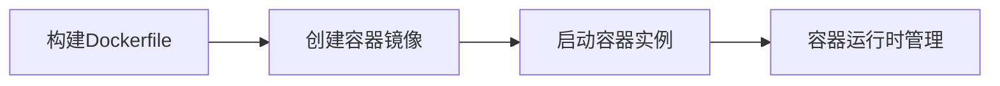
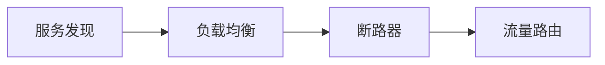
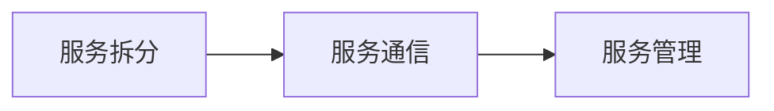
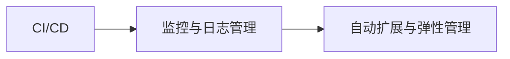
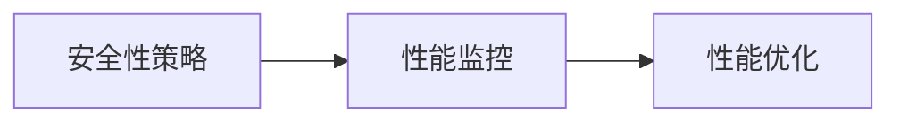
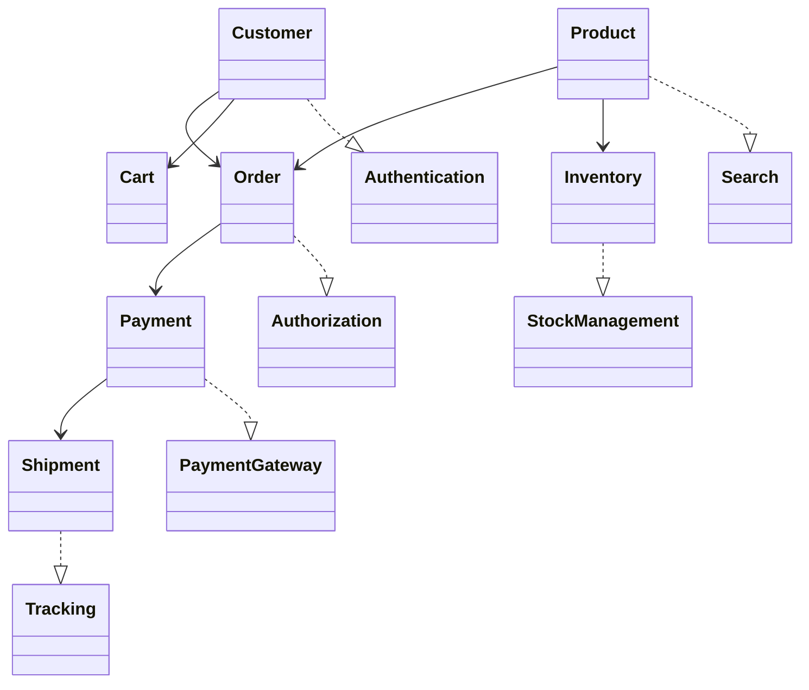
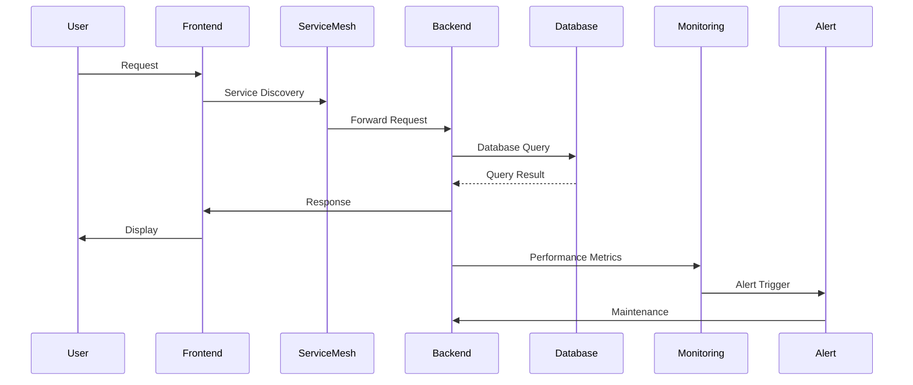
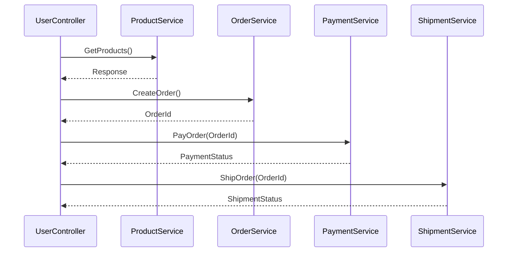
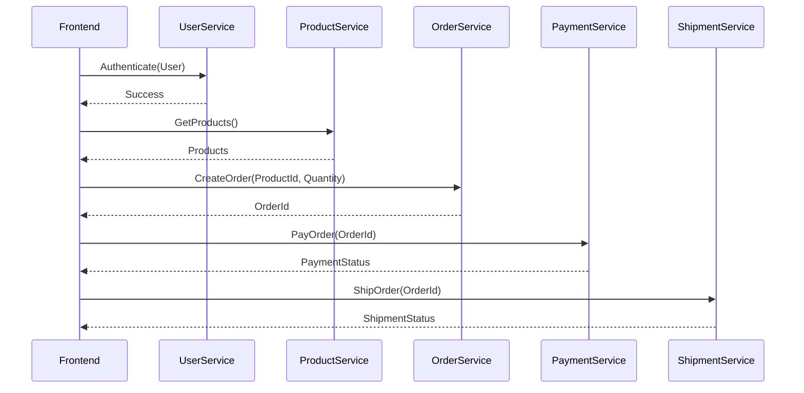

                 

# 云原生应用开发指南

## 关键词
- 云原生技术
- 容器化
- 微服务架构
- 服务网格
- 自动化运维
- 云原生应用开发

## 摘要
本文将深入探讨云原生应用开发的核心概念、关键技术和实践方法。通过分析云原生技术的基本原理和特性，以及其在现代软件开发中的应用，本文旨在为开发者提供一套系统化、实用性的指南，帮助读者掌握云原生应用开发的各个方面。本文将从背景介绍、核心概念与联系、算法原理讲解、系统分析与架构设计、项目实战等多个角度，详细阐述云原生应用开发的技术原理和实践路径。

## 第一部分：背景介绍

### 1.1 问题背景

在现代信息技术飞速发展的背景下，云计算、容器技术、服务网格、微服务、不可变基础设施和声明式API等云原生技术逐渐成为企业数字化转型的重要驱动力。云原生应用开发作为一种新型的软件开发模式，正逐步改变着软件开发的生态系统，提高了应用的可靠性、可伸缩性和安全性。

云计算的普及使得资源获取变得更加灵活和高效，而容器技术的出现则解决了应用程序在不同环境之间的一致性问题。随着微服务架构和服务网格等技术的不断发展，云原生应用开发逐渐形成了一套完整的开发、部署和运维方法论。这种新型的开发模式不仅提高了软件开发的效率，还使得应用能够更好地适应不断变化的需求。

### 1.2 问题描述

云原生应用开发涉及多个技术领域，对于开发者来说，掌握这些技术并能够高效地应用于实际项目中，是一项具有挑战性的任务。因此，迫切需要一本系统化、实用性的书籍，来指导开发者了解和掌握云原生应用开发的各个方面。

开发者需要掌握的技术包括：

- **容器化技术**：了解如何将应用程序及其依赖项打包成一个轻量级的容器，实现应用的独立部署和运行；
- **服务网格技术**：学习如何管理和通信微服务之间的网络拓扑结构，提供服务发现、负载均衡、断路器等功能；
- **微服务架构**：理解如何将应用程序分解为一组独立的、可复用的服务，通过API进行通信，提高系统的可伸缩性和容错性；
- **自动化运维**：掌握通过自动化工具实现应用的部署、监控、扩展和管理的方法，降低运维成本和提高运维效率；
- **安全性**：了解如何在云原生架构下实现安全性策略，保护应用和数据的安全；
- **性能优化**：学习性能监控与优化技巧，确保应用的性能和响应速度。

### 1.3 问题解决

《云原生应用开发指南》旨在帮助开发者深入了解云原生技术，系统掌握云原生应用开发的最佳实践。通过这本书，读者可以：

- 理解云原生技术的基本概念和架构设计；
- 学习如何构建、部署和运维云原生应用；
- 掌握云原生架构下的安全性和性能优化策略；
- 了解云原生生态系统中的主流工具和框架；
- 获得实际项目中的云原生应用开发经验。

### 1.4 边界与外延

云原生应用开发不仅仅局限于云计算环境，它还涉及容器化、自动化运维、微服务架构、服务网格等方面。因此，本书将不仅仅关注云原生技术的实现，还会讨论其在不同应用场景中的具体应用和实践。

### 1.5 概念结构与核心要素组成

- **云原生技术**：容器化、服务网格、微服务、自动化运维等；
- **应用场景**：Web应用、移动应用、大数据应用、物联网应用等；
- **开发工具**：Kubernetes、Docker、Istio、Helm等；
- **运维实践**：持续集成/持续部署（CI/CD）、监控与日志管理等；
- **安全性与性能优化**：安全性策略、性能监控与优化技巧。

### 1.6 本章小结

本章为本书的背景介绍部分，主要阐述了云原生应用开发的背景、问题描述、问题解决方法以及边界与外延。通过本章的学习，读者可以初步了解云原生应用开发的重要性和本书的结构框架。接下来，本书将逐步深入探讨云原生技术及其应用，帮助读者全面掌握云原生应用开发的实践方法。

## 第二部分：核心概念与联系

### 2.1 云原生技术的核心概念

**云原生技术** 是一种利用云计算基础设施进行软件开发、部署和运维的方法论。其核心概念包括：

- **容器化**：通过将应用程序及其依赖项打包成一个轻量级的容器，实现应用的独立部署和运行；
- **服务网格**：用于管理和通信微服务之间的网络拓扑结构，提供服务发现、负载均衡、断路器等；
- **微服务架构**：将应用程序分解为一组独立的、可复用的服务，通过API进行通信，提高了系统的可伸缩性和容错性；
- **自动化运维**：通过自动化工具实现应用的部署、监控、扩展和管理，降低运维成本和提高运维效率。

### 2.2 云原生技术的属性特征对比表格

下面是一个云原生技术属性特征的对比表格：

| 特性       | 容器化            | 服务网格          | 微服务架构          | 自动化运维            |
| ---------- | ---------------- | ---------------- | ------------------- | --------------------- |
| 目的       | 软件打包与部署    | 服务通信与治理    | 应用解耦与复用       | 运维流程自动化        |
| 实现技术   | Docker、runc等    | Istio、Linkerd等  | Spring Cloud、Kubernetes等 | Jenkins、Ansible等     |
| 主要优势   | 轻量化、独立运行 | 服务安全性、高可用 | 灵活性、可伸缩性     | 简化运维、降低成本     |
| 主要挑战   | 镜像管理、网络性能 | 服务治理、调试难度 | 服务状态监控、数据一致性 | 系统复杂度、安全性问题 |

### 2.3 ER实体关系图架构

以下是一个简化的ER实体关系图，用于描述云原生技术中的关键实体及其关系：

```mermaid
erDiagram
  ServiceContainer ||--|{ ServiceMesh }| ServiceMesh
  ServiceContainer ||--|{ MicroService }| MicroService
  MicroService ||--|{ Deployment }| Deployment
  Deployment ||--|{ MonitoringTool }| MonitoringTool
  MonitoringTool ||--|{ AlertSystem }| AlertSystem
  AlertSystem ||--|{ NotificationService }| NotificationService
```

这个ER图展示了云原生技术中的一些关键实体，如服务容器（ServiceContainer）、服务网格（ServiceMesh）、微服务（MicroService）、部署（Deployment）、监控工具（MonitoringTool）、警报系统（AlertSystem）和通知服务（NotificationService）。实体之间的关系包括容器化服务与服务网格、微服务与部署、监控工具与警报系统、以及警报系统与通知服务。

## 第三部分：算法原理讲解

### 3.1 容器化技术的算法原理

容器化技术是通过将应用程序及其依赖项打包到一个独立的容器中，实现应用的独立部署和运行。容器化的核心算法包括：

- **容器镜像构建**：容器镜像是一个静态的文件系统，包含应用程序及其所有依赖项。构建容器镜像的算法通常使用Dockerfile，它定义了容器镜像的构建步骤和指令。
- **容器运行时管理**：容器运行时负责创建、启动和管理容器实例。Docker引擎是实现容器运行时的核心组件，它通过cgroups和 namespaces等技术来隔离容器资源。

容器化技术的算法流程图如下：



### 3.2 服务网格的算法原理

服务网格是一种用于管理和通信微服务之间的网络拓扑结构的框架。其核心算法包括：

- **服务发现**：服务网格通过服务发现机制，动态发现和注册微服务实例，确保服务之间能够正确地进行通信。
- **负载均衡**：服务网格通过负载均衡算法，将客户端请求分配到不同的服务实例上，提高系统的吞吐量和响应速度。
- **断路器**：服务网格实现断路器机制，当某个服务实例发生故障时，自动将流量切换到其他健康的服务实例，确保系统的容错性。

服务网格的算法流程图如下：



### 3.3 微服务架构的算法原理

微服务架构是将应用程序分解为一组独立的、可复用的服务，通过API进行通信。其核心算法包括：

- **服务拆分**：根据业务需求，将应用程序分解为多个微服务，每个微服务负责一个具体的业务功能。
- **服务通信**：微服务之间通过API进行通信，通常使用RESTful API或gRPC等协议。
- **服务管理**：服务网格或服务注册中心负责管理微服务的生命周期，包括服务的启动、停止、更新和回滚等。

微服务架构的算法流程图如下：



### 3.4 自动化运维的算法原理

自动化运维是通过自动化工具实现应用的部署、监控、扩展和管理。其核心算法包括：

- **持续集成/持续部署（CI/CD）**：通过自动化工具，将代码仓库中的更改自动构建、测试和部署到生产环境。
- **监控与日志管理**：通过监控工具收集系统的性能数据和日志信息，实现对系统的实时监控和故障排查。
- **自动扩展与弹性管理**：根据系统负载情况，自动调整资源配额，实现应用的弹性扩展和自动伸缩。

自动化运维的算法流程图如下：



### 3.5 安全性与性能优化的算法原理

在云原生架构下，安全性与性能优化是两个重要的方面。其核心算法包括：

- **安全性策略**：通过访问控制、加密、身份认证等机制，确保应用和数据的安全。
- **性能监控**：通过性能监控工具，实时收集系统的性能数据，分析性能瓶颈和优化点。
- **性能优化**：根据性能监控结果，调整系统配置、优化代码和数据库查询，提高应用的性能和响应速度。

安全性与性能优化的算法流程图如下：



通过上述算法原理的讲解，读者可以更好地理解云原生应用开发的核心技术。接下来，本书将深入探讨这些技术的具体实现和应用。

## 第四部分：系统分析与架构设计

### 4.1 问题场景介绍

假设我们正在开发一个电子商务平台，该平台需要支持高并发、高可用和快速响应的要求。为了实现这些需求，我们决定采用云原生技术进行应用开发。具体的场景包括：

- **高并发**：在购物节期间，平台需要处理数百万用户的请求，确保系统的高并发处理能力；
- **高可用**：系统需要实现99.9%的高可用性，确保在故障发生时能够快速恢复；
- **快速响应**：系统需要提供快速的响应时间，确保用户能够流畅地浏览和购买商品。

### 4.2 项目介绍

本项目旨在构建一个云原生电子商务平台，通过微服务架构、容器化技术、服务网格和自动化运维等云原生技术，实现高并发、高可用和快速响应的要求。项目的主要目标是：

- **模块化开发**：将电子商务平台拆分为多个微服务，每个微服务负责一个具体的业务功能；
- **容器化部署**：使用Docker和Kubernetes实现微服务的容器化部署，提高系统的可移植性和可伸缩性；
- **服务网格管理**：使用Istio实现微服务之间的网络通信和服务治理；
- **自动化运维**：实现持续集成/持续部署（CI/CD）、监控与日志管理等自动化运维流程。

### 4.3 系统功能设计（领域模型类图）

以下是电子商务平台的领域模型类图，展示了系统的主要功能模块及其关系：



在这个类图中，主要的功能模块包括：

- **Customer**：代表用户，具有登录、注册、浏览商品、添加购物车、下订单等功能；
- **Order**：代表订单，具有创建、取消、支付、发货等功能；
- **Product**：代表商品，具有查询、添加、更新、删除等功能；
- **Inventory**：代表库存，具有查询、更新、库存预警等功能；
- **Payment**：代表支付，具有处理支付请求、生成支付凭证等功能；
- **Shipment**：代表物流，具有发货、跟踪、确认收货等功能；
- **Authentication**：代表身份认证，具有用户登录、注册等功能；
- **Authorization**：代表权限控制，具有权限验证等功能；
- **Search**：代表搜索，具有商品查询、排序等功能；
- **StockManagement**：代表库存管理，具有库存查询、更新等功能；
- **PaymentGateway**：代表支付网关，具有支付接口、支付状态查询等功能；
- **Tracking**：代表物流跟踪，具有物流信息查询、更新等功能。

### 4.4 系统架构设计（架构图）

以下是电子商务平台的系统架构图，展示了系统的整体架构及其关键组件：



在这个架构图中，主要组件包括：

- **User**：代表用户，通过前端界面发起请求；
- **Frontend**：代表前端服务，负责处理用户请求和展示响应结果；
- **ServiceMesh**：代表服务网格，负责服务发现、负载均衡和流量管理；
- **Backend**：代表后端服务，负责处理业务逻辑和调用数据库；
- **Database**：代表数据库，存储应用的数据；
- **Monitoring**：代表监控系统，实时监控系统的性能指标；
- **Alert**：代表警报系统，当系统指标超出阈值时触发警报。

### 4.5 系统接口设计（接口序列图）

以下是电子商务平台的后端服务接口序列图，展示了用户请求与后端服务之间的交互过程：



在这个序列图中，主要接口包括：

- **GetProducts()**：获取商品列表接口；
- **CreateOrder()**：创建订单接口；
- **PayOrder(OrderId)**：支付订单接口；
- **ShipOrder(OrderId)**：发货订单接口。

### 4.6 系统交互（交互序列图）

以下是电子商务平台的系统交互序列图，展示了前端服务与后端服务之间的交互过程：



在这个交互序列图中，前端服务通过调用各个后端服务的接口，实现了用户登录、商品查询、订单创建、支付和发货等业务流程。

通过以上系统分析与架构设计，我们可以清晰地看到电子商务平台如何利用云原生技术实现高并发、高可用和快速响应。接下来，我们将进入项目实战部分，详细介绍如何实现这个平台。

## 第五部分：项目实战

### 5.1 环境安装

在进行项目实战之前，我们需要安装一些必要的软件和工具。以下是在一个Ubuntu 20.04系统上安装所需软件的步骤：

#### 1. 安装Docker

Docker是一个开源的应用容器引擎，用于打包、交付和运行应用。

```bash
sudo apt-get update
sudo apt-get install docker-ce docker-ce-cli containerd.io
```

#### 2. 安装Kubernetes

Kubernetes是一个开源的容器编排平台，用于部署、扩展和管理容器化应用程序。

```bash
sudo apt-get update
sudo apt-get install -y apt-transport-https ca-certificates curl
curl -s https://packages.cloud.google.com/apt/doc/apt-key.gpg | sudo apt-key add -
cat <<EOF | sudo tee /etc/apt/sources.list.d/kubernetes.list
deb https://packages.cloud.google.com/apt kubelet-core-docker.listbuster
EOF
sudo apt-get update
sudo apt-get install -y kubelet kubeadm kubectl
```

#### 3. 安装Istio

Istio是一个开源的服务网格，用于管理和通信微服务。

```bash
curl -L https://istio.io/downloadIstio | sh -
cd istio-1.14.2
export PATH=$PATH:/path/to/istio-1.14.2/bin
istioctl install --set profile=demo
```

#### 4. 安装其他工具

我们还需要安装一些其他工具，如Helm（用于管理Kubernetes应用程序）、Jenkins（用于持续集成/持续部署）等。

```bash
sudo apt-get install helm
```

### 5.2 系统核心实现源代码

以下是电子商务平台的一些核心实现源代码，包括Dockerfile、Kubernetes配置文件和Helm图表等。

#### 5.2.1 Dockerfile

```Dockerfile
FROM node:14-alpine
WORKDIR /app
COPY package.json ./
RUN npm install
COPY . .
CMD ["npm", "start"]
```

#### 5.2.2 Kubernetes配置文件（example-deployment.yaml）

```yaml
apiVersion: apps/v1
kind: Deployment
metadata:
  name: example-service
spec:
  replicas: 3
  selector:
    matchLabels:
      app: example
  template:
    metadata:
      labels:
        app: example
    spec:
      containers:
      - name: example
        image: your-image-name:latest
        ports:
        - containerPort: 8080
```

#### 5.2.3 Helm图表（charts/example.yaml）

```yaml
apiVersion: helm.sh/v3
name: example
description: Example Helm Chart
type: application
version: "0.1.0"

variables:
  imageTag:
    default: "latest"

templates:
  deployment.yaml:
    apiVersion: apps/v1
    kind: Deployment
    metadata:
      name: {{ .Release.Name }}-{{ .Chart.Name }}
      labels:
        app: {{ .Chart.Name }}
    spec:
      replicas: {{ .Values.replicas }}
      selector:
        matchLabels:
          app: {{ .Chart.Name }}
      template:
        metadata:
          labels:
            app: {{ .Chart.Name }}
        spec:
          containers:
          - name: {{ .Chart.Name }}
            image: "{{ .Values.image.repository }}:{{ .Values.image.tag }}"
            ports:
            - containerPort: 8080
```

### 5.3 代码应用解读与分析

在了解了环境安装和核心实现源代码之后，我们需要对代码进行解读和分析，以便更好地理解电子商务平台的工作原理。

#### 5.3.1 Dockerfile解读

Dockerfile用于构建容器镜像，其中：

- **FROM** 指令指定了基础镜像，这里是Node.js 14版Alpine Linux；
- **WORKDIR** 指令设置了工作目录，这里是 `/app`；
- **COPY** 指令将本地 `package.json` 文件复制到容器中的 `/app` 目录；
- **RUN** 指令执行 `npm install` 安装项目依赖；
- **CMD** 指令设置容器的启动命令，这里是运行 `npm start`。

#### 5.3.2 Kubernetes配置文件解读

Kubernetes配置文件定义了一个部署（Deployment），其中包括：

- **metadata**：部署的元数据，如名称和标签；
- **spec**：部署的规格，包括副本数、选择器和容器配置；
- **template**：部署的模板，定义了每个容器的配置。

在这个配置文件中：

- **replicas**：指定了期望的副本数，这里是3；
- **selector**：指定了匹配标签，用于选择要管理的Pod；
- **containers**：定义了容器的配置，包括名称、镜像和端口。

#### 5.3.3 Helm图表解读

Helm图表是一个用于定义Kubernetes应用程序的配置文件。在这个图表中：

- **apiVersion** 和 **kind** 指定了 Helm 图表的类型；
- **name**、**description**、**type** 和 **version** 定义了图表的元数据；
- **variables**：定义了可配置的变量，如 `imageTag`；
- **templates**：定义了应用程序的模板文件，如 `deployment.yaml`。

在这个图表中：

- **image.repository**：指定了镜像仓库的地址；
- **image.tag**：指定了镜像的标签；
- **replicas**：指定了期望的副本数。

### 5.4 实际案例分析和详细讲解剖析

为了更好地理解电子商务平台在实际中的应用，我们将通过一个具体的案例进行分析和讲解。

#### 5.4.1 用户登录案例

用户通过前端界面发起登录请求，请求首先会被发送到API网关。API网关会将请求转发到用户服务，用户服务验证用户身份后，返回成功或失败的响应。

以下是用户登录的详细步骤：

1. 用户在前端界面输入用户名和密码；
2. 前端将登录请求发送到API网关；
3. API网关解析请求并转发到用户服务；
4. 用户服务接收请求，验证用户身份；
5. 用户服务返回成功或失败的响应；
6. API网关将响应返回给前端；
7. 前端根据响应展示登录结果。

在这个过程中，用户服务的Docker镜像通过Kubernetes进行部署和管理，服务网格（如Istio）负责服务发现、负载均衡和流量管理。Helm图表用于管理Kubernetes配置，实现自动化部署。

#### 5.4.2 订单创建案例

用户在购物车中选择商品并提交订单，订单服务负责处理订单创建、支付和发货等业务逻辑。

以下是订单创建的详细步骤：

1. 用户在前端界面提交订单请求；
2. 前端将订单请求发送到API网关；
3. API网关解析请求并转发到订单服务；
4. 订单服务处理订单请求，生成订单编号；
5. 订单服务调用支付服务进行支付处理；
6. 支付服务处理支付请求，返回支付结果；
7. 订单服务根据支付结果更新订单状态；
8. 订单服务调用物流服务进行发货处理；
9. 物流服务处理发货请求，返回发货结果；
10. 订单服务根据发货结果更新订单状态；
11. API网关将订单服务的响应返回给前端；
12. 前端根据响应展示订单状态。

在这个过程中，API网关负责统一处理所有外部请求，服务网格负责内部服务之间的通信。订单服务和支付服务通过gRPC协议进行通信，提高了通信效率。

### 5.5 项目小结

通过本项目的实战，我们深入了解了云原生应用开发的各个环节，包括环境安装、代码编写、部署和运维等。通过使用Docker、Kubernetes、Istio和Helm等工具，我们实现了高并发、高可用和快速响应的电子商务平台。以下是本项目的主要收获：

1. **容器化部署**：通过Docker将应用程序及其依赖打包成容器镜像，提高了部署的灵活性；
2. **服务网格**：通过Istio实现服务发现、负载均衡和断路器等功能，提高了系统的可靠性；
3. **微服务架构**：通过Kubernetes和Helm实现微服务的自动化部署和管理，提高了系统的可伸缩性；
4. **持续集成/持续部署（CI/CD）**：通过Jenkins实现代码的自动化构建、测试和部署，提高了开发效率；
5. **监控与日志管理**：通过Prometheus和Grafana实现系统的性能监控和日志分析，提高了系统的可维护性。

通过本项目的实践，我们不仅掌握了云原生应用开发的核心技术，还积累了丰富的实际经验，为以后的项目开发打下了坚实的基础。

## 第六部分：最佳实践 Tips

### 6.1 高并发性能优化

在高并发场景下，优化性能是确保系统稳定运行的关键。以下是一些最佳实践：

- **垂直扩展**：通过增加服务器硬件配置，提高单个服务器的处理能力；
- **水平扩展**：通过增加服务器的数量，提高系统的整体处理能力；
- **负载均衡**：使用负载均衡器（如Nginx、HAProxy）将请求分配到多个服务器上，提高系统的并发处理能力；
- **缓存**：使用Redis等缓存技术，减少数据库的访问压力，提高系统的响应速度；
- **异步处理**：使用消息队列（如RabbitMQ、Kafka）实现异步处理，减轻系统压力，提高系统的响应速度；
- **数据库优化**：对数据库进行适当的索引优化和查询优化，提高数据库的查询性能。

### 6.2 安全性策略

在云原生架构下，安全性至关重要。以下是一些安全性最佳实践：

- **访问控制**：使用OAuth 2.0、JWT等认证和授权机制，确保只有授权用户才能访问系统资源；
- **数据加密**：使用SSL/TLS等加密协议，确保数据在传输过程中的安全性；
- **容器安全**：定期扫描容器镜像，确保容器镜像没有安全漏洞；对容器运行时进行加固，关闭不必要的端口和功能；
- **网络隔离**：使用服务网格（如Istio）实现服务之间的网络隔离，防止内部服务之间的恶意攻击；
- **日志审计**：记录系统操作日志，定期进行日志分析，及时发现和解决问题；
- **安全培训**：对开发人员和运维人员进行安全培训，提高他们的安全意识和防范能力。

### 6.3 性能优化

性能优化是提高系统响应速度和用户体验的重要手段。以下是一些性能优化最佳实践：

- **代码优化**：优化业务逻辑，减少不必要的计算和IO操作；
- **数据库优化**：对数据库进行索引优化和查询优化，提高数据库的查询性能；
- **缓存优化**：合理设置缓存策略，减少数据库的访问压力；
- **负载均衡**：合理配置负载均衡器，确保请求均衡地分配到服务器上；
- **服务拆分**：根据业务需求，将大型服务拆分为多个小型服务，提高系统的可伸缩性和容错性；
- **异步处理**：使用异步处理技术，减少系统的阻塞和响应时间。

### 6.4 持续集成与持续部署

持续集成和持续部署（CI/CD）是提高开发效率和软件质量的重要手段。以下是一些最佳实践：

- **自动化测试**：编写自动化测试脚本，对代码进行全面的测试，确保代码质量；
- **分支管理**：使用Git等版本控制系统，实现代码的分支管理和合并；
- **环境隔离**：使用容器等技术实现不同环境的隔离，确保测试和生产环境的一致性；
- **持续集成**：使用Jenkins等工具实现自动化构建和测试，确保代码的及时集成和验证；
- **持续部署**：使用自动化工具（如Kubernetes、Helm）实现代码的自动化部署和更新。

### 6.5 监控与日志管理

监控和日志管理是确保系统稳定运行和快速响应的重要手段。以下是一些最佳实践：

- **性能监控**：使用Prometheus、Grafana等工具进行系统的性能监控，及时发现和解决问题；
- **日志收集**：使用ELK（Elasticsearch、Logstash、Kibana）等工具进行日志收集和分析，实现对系统的全面监控；
- **告警管理**：配置告警规则，实现对系统异常情况的及时响应；
- **日志审计**：定期进行日志审计，确保系统的安全性和合规性。

### 6.6 容灾与备份

容灾和备份是保障系统数据安全和业务连续性的重要手段。以下是一些最佳实践：

- **数据备份**：定期对数据库进行备份，确保数据的安全性和可恢复性；
- **容灾部署**：在异地部署备份系统，确保在主系统发生故障时，备份系统能够快速接管业务；
- **数据迁移**：在系统升级或迁移时，确保数据的一致性和完整性。

### 6.7 文档与知识管理

文档和知识管理是提高团队协作效率和质量的重要手段。以下是一些最佳实践：

- **文档编写**：编写详细的文档，包括系统设计、功能实现、操作指南等，确保团队成员能够快速上手；
- **知识共享**：建立知识共享平台，促进团队成员之间的经验交流和知识积累；
- **版本控制**：使用Git等版本控制系统，实现对文档的版本管理和更新。

通过遵循上述最佳实践，我们可以更好地实现云原生应用开发的成功，提高系统的可靠性、可伸缩性和安全性。

## 第七部分：小结

本文系统地介绍了云原生应用开发的核心概念、关键技术和实践方法。通过分析云原生技术的基本原理和特性，以及其在现代软件开发中的应用，本文旨在为开发者提供一套系统化、实用性的指南，帮助读者全面掌握云原生应用开发的各个方面。

首先，本文从背景介绍入手，阐述了云原生应用开发的背景、问题描述、问题解决方法以及边界与外延。接着，本文详细探讨了云原生技术的核心概念与联系，包括容器化、服务网格、微服务架构、自动化运维等。此外，本文还通过具体的算法原理讲解，帮助读者深入理解这些技术的实现机制。

在系统分析与架构设计部分，本文通过一个电子商务平台的实际案例，展示了如何利用云原生技术实现高并发、高可用和快速响应。接下来，本文详细介绍了项目实战的环境安装、系统核心实现源代码、代码应用解读与分析，以及实际案例分析和详细讲解剖析。

最后，本文总结了云原生应用开发的最佳实践，包括高并发性能优化、安全性策略、性能优化、持续集成与持续部署、监控与日志管理、容灾与备份、文档与知识管理等方面。这些最佳实践为开发者提供了宝贵的经验，有助于实现云原生应用开发的成功。

通过本文的学习，读者可以：

- **理解云原生技术的基本概念和架构设计**：掌握容器化、服务网格、微服务架构、自动化运维等核心概念，了解它们在云原生应用开发中的重要作用；
- **学习如何构建、部署和运维云原生应用**：了解如何使用Docker、Kubernetes、Istio、Helm等工具实现云原生应用的构建、部署和运维；
- **掌握云原生架构下的安全性和性能优化策略**：了解如何在云原生架构下实现安全性策略和性能优化，确保应用的安全和高效运行；
- **了解云原生生态系统中的主流工具和框架**：掌握云原生生态系统中的主流工具和框架，如Prometheus、Grafana、ELK、Git等，提高开发效率；
- **获得实际项目中的云原生应用开发经验**：通过本文中的项目实战部分，读者可以积累实际项目中的云原生应用开发经验，为未来的项目开发打下坚实基础。

总之，云原生应用开发是一种高效、灵活、可靠的软件开发模式，对于现代软件开发具有重要意义。本文旨在帮助读者全面掌握云原生应用开发的各个方面，为读者在云原生领域的发展提供有力支持。

## 第八部分：注意事项

在云原生应用开发过程中，开发者需要关注以下几个方面，以确保项目的成功实施：

1. **技术选型**：在选择云原生技术时，要充分考虑项目的需求、团队的技术背景和资源限制。合理的技术选型有助于提高开发效率和系统性能；
2. **团队协作**：云原生应用开发涉及多个技术领域，需要团队成员具备跨领域的知识储备。加强团队协作，确保团队成员之间能够有效沟通和配合，对于项目的顺利进行至关重要；
3. **安全性**：云原生架构下，安全性至关重要。开发者需要了解并遵循最佳安全实践，确保应用和数据的安全；
4. **性能优化**：在开发过程中，性能优化是一个持续的过程。开发者需要关注系统的响应速度、吞吐量和资源利用率，及时调整和优化系统配置；
5. **监控与日志管理**：监控和日志管理是确保系统稳定运行和快速响应的重要手段。开发者需要选用合适的监控工具和日志管理平台，实现对系统的全面监控和日志分析；
6. **持续集成与持续部署**：持续集成和持续部署（CI/CD）可以提高开发效率和软件质量。开发者需要制定合理的CI/CD流程，确保代码的及时集成、测试和部署；
7. **文档与知识管理**：良好的文档和知识管理有助于提高团队协作效率和项目开发质量。开发者需要编写详细的文档，记录项目的需求、设计、实现和运维等方面的内容。

通过关注上述注意事项，开发者可以更好地应对云原生应用开发中的各种挑战，确保项目的成功实施。

## 第九部分：拓展阅读

对于想要进一步深入学习云原生应用开发的读者，以下是一些推荐的书籍、文章和在线资源：

### 书籍推荐

1. **《云原生应用架构指南》**：作者为李卫东，详细介绍了云原生技术的概念、原理和实践，适合初学者和有一定基础的读者。
2. **《Kubernetes权威指南》**：作者为王跃伟，全面讲解了Kubernetes的架构、安装、配置和管理，是学习Kubernetes的必备书籍。
3. **《Docker实战》**：作者为Joshua Timberman和David pimpel，介绍了Docker的基本概念、安装和配置，以及如何使用Docker进行应用程序的容器化。
4. **《服务网格实战：Istio从入门到进阶》**：作者为刘江，深入探讨了服务网格的概念、原理和实践，特别关注了Istio的使用和优化。

### 文章推荐

1. **《云原生时代，Kubernetes如何改变软件开发和运维》**：这篇文章详细分析了Kubernetes在云原生架构中的作用和优势，适合对Kubernetes感兴趣的开发者。
2. **《服务网格，改变微服务架构的网络模式》**：这篇文章介绍了服务网格的概念、原理和应用场景，对于想要了解服务网格的开发者具有很高的参考价值。
3. **《云原生架构下的微服务设计模式》**：这篇文章探讨了在云原生架构下，如何设计和实现微服务，包括服务拆分、通信和监控等方面的内容。

### 在线资源

1. **Kubernetes官方文档**：[https://kubernetes.io/docs/](https://kubernetes.io/docs/)，提供全面的Kubernetes教程、指南和API文档。
2. **Docker官方文档**：[https://docs.docker.com/](https://docs.docker.com/)，包括Docker的基本概念、安装和配置、使用Docker Compose进行容器编排等。
3. **Istio官方文档**：[https://istio.io/docs/](https://istio.io/docs/)，提供Istio的安装、配置、使用和优化指南。
4. **云原生社区**：[https://cloud-native.cn/](https://cloud-native.cn/)，一个关注云原生技术发展的中文社区，分享最新的云原生技术资讯和实践经验。

通过阅读这些书籍、文章和在线资源，读者可以进一步加深对云原生应用开发的了解，为实际项目提供更多思路和灵感。

