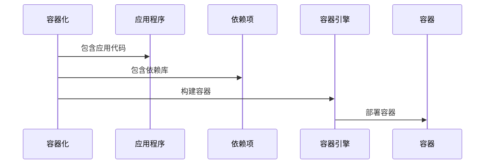
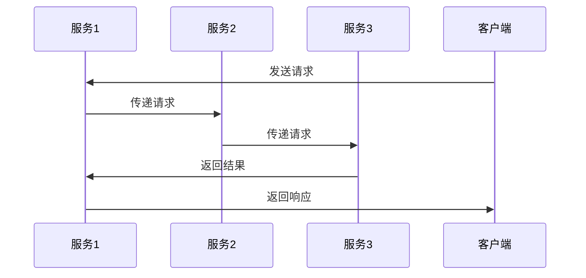
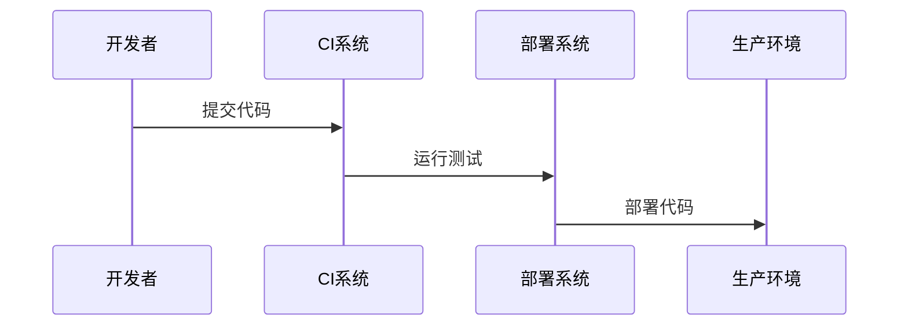
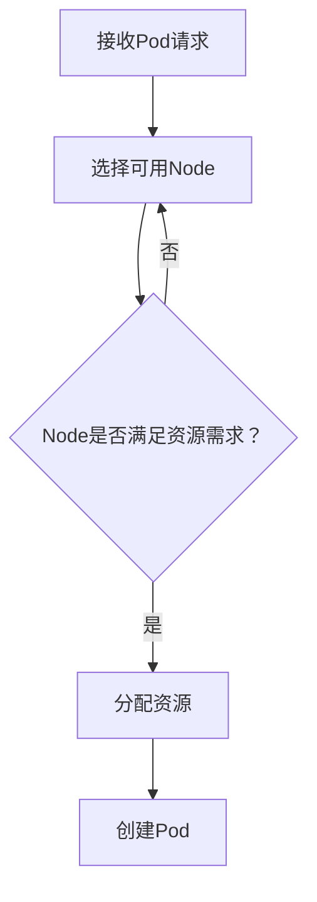
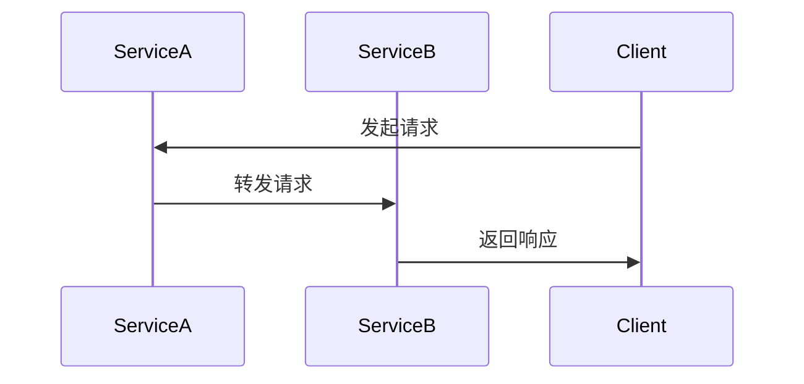
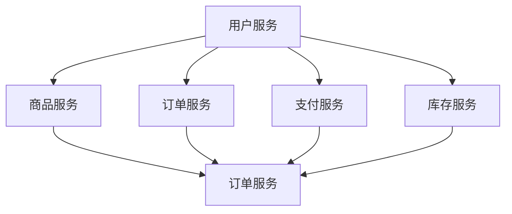

                 

### 《云原生应用开发：从概念到实践》

> 关键词：云原生，应用开发，微服务，Kubernetes，DevOps，持续集成与持续部署

> 摘要：本文旨在深入探讨云原生应用开发的核心理念、关键技术以及实践方法。通过系统地介绍云原生应用开发的背景、基础概念、工具栈、开发流程、部署与运维、性能监控与安全，以及实战案例分析，帮助读者全面理解云原生应用开发的实践路径，为实际项目提供有力支持。

----------------------------------------------------------------

### 设计目录大纲

在撰写一篇关于云原生应用开发的技术博客文章时，目录大纲的设计至关重要。它不仅能够帮助读者快速了解文章的结构和内容，还能确保文章内容的系统性和逻辑性。下面，我们将一步一步地设计《云原生应用开发：从概念到实践》的目录大纲。

#### 第一步：确定书籍的整体结构

首先，我们需要确定书籍的整体结构。对于一本关于云原生应用开发的专业书籍，我们可以考虑以下主要部分：

1. **引言**：介绍云原生应用开发的背景、目的和重要性。
2. **基础概念**：详细讲解云原生应用开发所需的基础概念，如容器、微服务、DevOps等。
3. **工具栈**：介绍云原生应用开发所涉及的主要工具，如Kubernetes、服务网格、持续集成与持续部署（CI/CD）等。
4. **开发流程**：阐述云原生应用的开发流程，包括设计、编码、测试等。
5. **部署与运维**：介绍如何部署云原生应用，以及如何进行运维管理。
6. **性能监控与安全**：讲解如何对云原生应用进行性能监控和安全防护。
7. **实战案例**：通过具体案例，展示云原生应用开发的实际操作过程。
8. **总结与展望**：对全书内容进行总结，并对未来云原生应用开发的发展趋势进行展望。

#### 第二步：细化每个章节的内容

在每个主要部分下，我们需要进一步细化每个章节的内容。例如，在“基础概念”部分，我们可以细化为以下章节：

- **容器与容器化**
  - 容器的定义
  - 容器化技术
  - 容器与虚拟机的比较

- **微服务架构**
  - 微服务概述
  - 微服务与传统的区别
  - 微服务架构设计原则

- **DevOps与云原生**
  - DevOps概述
  - 云原生与DevOps的联系
  - DevOps在云原生应用开发中的应用

#### 第三步：保持目录大纲的简洁性

在细化内容的同时，我们需要确保目录大纲的简洁性。避免过多的冗余内容，保持信息的清晰和逻辑性。例如，我们可以使用以下简洁的目录结构：

```markdown
# 《云原生应用开发：从概念到实践》目录大纲

## 第1章 引言
### 1.1 云原生应用开发的背景
### 1.2 云原生应用的重要性
### 1.3 书籍结构概述

## 第2章 云原生基础
### 2.1 容器与容器化
### 2.2 微服务架构
### 2.3 DevOps与云原生

## 第3章 云原生工具栈
### 3.1 Kubernetes
### 3.2 服务网格
### 3.3 持续集成与持续部署

## 第4章 云原生应用开发
### 4.1 应用设计与架构
### 4.2 应用开发实践
### 4.3 性能优化

## 第5章 部署与运维
### 5.1 部署策略
### 5.2 运维管理

## 第6章 性能监控与安全
### 6.1 监控体系
### 6.2 故障处理
### 6.3 安全策略

## 第7章 实战案例
### 7.1 案例介绍
### 7.2 案例实现
### 7.3 案例分析

## 第8章 总结与展望
### 8.1 书籍总结
### 8.2 云原生应用的发展趋势
### 8.3 拓展阅读
```

#### 第四步：确保内容的完整性

根据要求，我们需要确保目录大纲中的核心章节内容都包含在内，如核心概念、算法原理、数学模型、系统架构设计、实战案例等。在细化每个章节的内容时，我们需要确保每个章节都有明确的学习目标和内容结构，确保核心内容的完整性。

#### 第五步：使用markdown格式

为了满足输出格式的需求，我们将使用markdown格式来编写目录大纲。markdown格式不仅易于编写，而且能够很好地支持多种排版和格式化需求。在markdown中，每一级的标题使用相应的符号（如#、##、###），以表示标题的层级关系。

通过以上五个步骤，我们成功设计了一份《云原生应用开发：从概念到实践》的目录大纲。接下来，我们将按照这个大纲，逐步深入探讨云原生应用开发的各个方面。

---

### 背景介绍

云原生（Cloud Native）是一种构建和运行应用程序的方法，它利用了云计算的优势，如弹性、可伸缩性和分布式架构。云原生应用具有以下几个核心特征：

1. **容器化**：云原生应用通常采用容器技术进行封装、部署和运行。容器提供了一种轻量级、独立的运行环境，使得应用可以在任何支持容器引擎的平台上运行，从而实现了环境的标准化和一致性。

2. **微服务架构**：云原生应用通常采用微服务架构，将应用程序拆分为多个独立的、可部署的微服务。这些微服务通过轻量级的通信协议（如HTTP/HTTPS、gRPC等）进行交互，每个微服务负责一个特定的功能，从而提高了系统的可伸缩性和可维护性。

3. **DevOps文化**：云原生应用开发强调DevOps文化的实施，即开发和运维团队的紧密协作。通过持续集成（CI）和持续部署（CD）等自动化流程，加快了软件交付的速度和频率，同时提高了软件的质量和可靠性。

4. **自动化的基础设施管理**：云原生应用依赖于自动化的基础设施管理工具，如Kubernetes、容器编排系统等。这些工具能够自动化管理容器的部署、扩展、监控和故障恢复，大大降低了运维的复杂度和成本。

云原生应用开发的历史可以追溯到2000年代初。当时，互联网公司开始意识到传统的单体应用在应对大规模、高并发访问时存在诸多问题。为了提高系统的可伸缩性和可靠性，这些公司开始探索分布式架构和微服务架构。随着容器技术的兴起，如Docker等容器化工具的广泛应用，云原生应用开发逐渐成为一种主流的软件开发方法。

在云原生应用开发的过程中，核心概念术语如容器、容器化、微服务、DevOps等扮演着至关重要的角色。理解这些概念和术语是掌握云原生应用开发的关键。

- **容器**：容器是一种轻量级、可执行的软件包，它包含了应用程序及其依赖项。容器通过操作系统级的虚拟化技术（如cgroup和namespace）实现，可以在任何支持容器引擎的操作系统上运行。

- **容器化**：容器化是将应用程序及其依赖项打包成一个容器的过程。容器化的目的是实现应用程序的标准化和一致性，使得应用可以在不同的环境中无缝运行。

- **微服务**：微服务是一种将大型单体应用拆分为多个小型、独立的服务的方法。每个微服务负责一个特定的功能，可以通过API进行通信，从而提高了系统的可维护性和可伸缩性。

- **DevOps**：DevOps是一种文化和实践方法，它强调开发和运维团队的紧密协作，通过自动化和持续集成/持续部署（CI/CD）等手段，加快软件交付的速度和频率，同时保证软件的质量和可靠性。

- **Kubernetes**：Kubernetes是一个开源的容器编排系统，它用于自动化容器化应用程序的部署、扩展和管理。Kubernetes通过提供一组资源管理、服务发现、负载均衡等功能，大大简化了容器化应用程序的运维。

了解这些核心概念和术语后，我们可以进一步探讨云原生应用开发的问题背景、问题描述、问题解决、边界与外延、概念结构与核心要素组成。

#### 问题背景

在传统的单体应用架构中，应用程序通常被设计为一个单一的、紧密耦合的软件实体。这种架构在早期软件开发中广泛使用，因为它简单、易于理解和管理。然而，随着互联网的快速发展，用户需求的多样化和业务规模的扩大，传统的单体应用架构逐渐暴露出诸多问题。

首先，单体应用在扩展性方面存在显著限制。当一个单体应用需要处理大量并发请求时，通常只能通过垂直扩展（增加硬件资源）来提升性能。然而，这种方式不仅成本高昂，而且扩展效果有限。此外，单体应用在更新和维护方面也存在困难。由于应用程序的所有功能都紧密耦合在一起，任何一处代码的修改都可能引发意想不到的问题，导致整个系统崩溃。

其次，单体应用在部署和运维方面也存在挑战。由于应用程序是一个单一的实体，部署和更新需要停机，导致服务中断。此外，单体应用的运维成本较高，需要专门的技术人员负责系统的监控、故障处理和性能优化等任务。

随着云计算和容器技术的普及，云原生应用开发成为一种新兴的解决方案。云原生应用采用微服务架构和容器化技术，将应用程序拆分为多个独立的、可部署的微服务。每个微服务负责一个特定的功能，通过轻量级的通信协议进行交互，从而提高了系统的可伸缩性和可靠性。

#### 问题描述

云原生应用开发旨在解决以下核心问题：

1. **扩展性**：如何通过水平扩展来提高系统的性能和吞吐量，以满足不断增长的访问需求？
2. **可靠性**：如何确保系统在高并发、高负载情况下依然稳定运行，避免单点故障？
3. **可维护性**：如何降低系统的复杂度，提高开发效率和代码质量？
4. **部署与运维**：如何简化应用程序的部署、升级和运维过程，提高运维效率和系统可用性？
5. **安全性**：如何确保应用程序在云环境中运行的安全性和数据隐私？

为了解决这些问题，云原生应用开发引入了微服务架构、容器化技术、DevOps文化、自动化基础设施管理等一系列关键技术。

#### 问题解决

云原生应用开发通过以下方法解决传统单体应用架构面临的问题：

1. **微服务架构**：将单体应用拆分为多个独立的微服务，每个微服务负责一个特定的功能。这种架构使得系统具有更好的扩展性和可维护性。通过水平扩展，即增加服务实例的数量，可以提高系统的性能和吞吐量。同时，由于服务之间是独立的，任何服务的更新和故障都不会影响其他服务，从而提高了系统的可靠性。

2. **容器化技术**：使用容器技术对应用程序进行封装和部署。容器提供了一种轻量级、独立的运行环境，使得应用可以在任何支持容器引擎的平台上运行，从而实现了环境的标准化和一致性。容器化技术简化了应用程序的部署和运维过程，降低了系统的复杂度。

3. **DevOps文化**：强调开发和运维团队的紧密协作，通过自动化和持续集成/持续部署（CI/CD）等手段，加快软件交付的速度和频率，同时保证软件的质量和可靠性。DevOps文化的实施使得软件交付过程更加高效、透明和可控。

4. **自动化基础设施管理**：使用自动化工具（如Kubernetes）管理容器化应用程序的部署、扩展、监控和故障恢复。自动化基础设施管理降低了运维的复杂度和成本，提高了系统的可用性和可靠性。

#### 边界与外延

云原生应用开发的边界和范围包括以下几个方面：

1. **应用范围**：云原生应用适用于需要高可伸缩性、高可靠性和高可维护性的场景，如电商平台、金融系统、IoT平台等。
2. **技术栈**：云原生应用开发涉及多种技术，如容器化技术（Docker、Kubernetes）、微服务框架（Spring Boot、Django）、持续集成/持续部署工具（Jenkins、GitLab CI）等。
3. **部署环境**：云原生应用通常部署在云平台上，如AWS、Azure、Google Cloud等，也可以在自建的私有云环境中部署。
4. **安全与合规**：云原生应用开发需要关注安全性和合规性，如数据加密、身份验证、访问控制等。

#### 概念结构与核心要素组成

云原生应用开发的核心概念和要素包括：

1. **容器**：容器是云原生应用的基础，用于封装和部署应用程序及其依赖项。
2. **微服务**：微服务是云原生应用的架构模式，将应用程序拆分为多个独立的、可部署的微服务。
3. **DevOps**：DevOps是一种文化和实践方法，强调开发和运维团队的紧密协作，通过自动化和持续集成/持续部署（CI/CD）等手段提高软件交付效率。
4. **持续集成与持续部署（CI/CD）**：CI/CD是一种自动化软件交付流程，通过自动化测试和部署，加快软件交付速度和提高质量。
5. **容器编排系统**：如Kubernetes，用于自动化管理容器化应用程序的部署、扩展、监控和故障恢复。

通过以上介绍，我们可以看到云原生应用开发在解决传统单体应用架构问题方面具有显著的优势。接下来，我们将深入探讨云原生应用开发的核心概念，包括容器、微服务、DevOps等，为后续内容打下基础。

---

### 核心概念与联系

在云原生应用开发中，理解以下几个核心概念至关重要：容器、容器化、微服务、DevOps、持续集成与持续部署（CI/CD）。这些概念不仅相互关联，而且共同构成了云原生应用开发的核心理念。在本节中，我们将详细讲解这些核心概念，并通过表格和ER实体关系图架构的Mermaid流程图展示它们之间的联系。

#### 容器与容器化

**容器**：容器是一种轻量级、可执行的软件包，包含了应用程序及其依赖项。它通过操作系统级的虚拟化技术（如cgroup和namespace）实现，可以在任何支持容器引擎的操作系统上运行。

**容器化**：容器化是将应用程序及其依赖项打包成一个容器的过程。容器化旨在实现应用程序的标准化和一致性，使得应用可以在不同的环境中无缝运行。

| 概念         | 说明                                                         |
| ------------ | ------------------------------------------------------------ |
| 容器         | 轻量级、可执行的软件包，包含应用程序及其依赖项。               |
| 容器化       | 将应用程序及其依赖项打包成一个容器的过程。                   |
| 虚拟化技术   | 使用cgroup和namespace等实现操作系统级的虚拟化。               |

**Mermaid流程图：容器化过程**



#### 微服务与DevOps

**微服务**：微服务是一种将大型单体应用拆分为多个独立的、可部署的服务的方法。每个微服务负责一个特定的功能，可以通过轻量级的通信协议（如HTTP/HTTPS、gRPC等）进行交互。

**DevOps**：DevOps是一种文化和实践方法，强调开发和运维团队的紧密协作，通过自动化和持续集成/持续部署（CI/CD）等手段，加快软件交付的速度和频率，同时保证软件的质量和可靠性。

| 概念         | 说明                                                         |
| ------------ | ------------------------------------------------------------ |
| 微服务       | 将应用程序拆分为多个独立的、可部署的服务。                   |
| DevOps       | 强调开发和运维团队的紧密协作，通过自动化和CI/CD提高交付效率。 |

**Mermaid流程图：微服务架构**



#### 持续集成与持续部署（CI/CD）

**持续集成（CI）**：持续集成是一种软件开发实践，通过自动化测试和构建，确保代码的持续集成和稳定性。每次代码提交后，CI系统会自动运行测试，确保新的代码更改不会引入错误。

**持续部署（CD）**：持续部署是一种自动化软件交付流程，通过持续集成和自动化部署，快速将代码更改部署到生产环境。CD提高了软件交付的速度和频率，同时减少了手动操作和错误。

| 概念         | 说明                                                         |
| ------------ | ------------------------------------------------------------ |
| 持续集成（CI） | 自动化测试和构建，确保代码的持续集成和稳定性。                 |
| 持续部署（CD） | 自动化软件交付流程，快速将代码更改部署到生产环境。           |

**Mermaid流程图：CI/CD流程**



通过上述核心概念和Mermaid流程图的展示，我们可以清晰地理解容器、容器化、微服务、DevOps和持续集成与持续部署（CI/CD）之间的联系。这些概念共同构成了云原生应用开发的基础，为我们在后续章节中深入探讨云原生应用开发的各个方面提供了坚实的基础。

---

### 算法原理讲解

云原生应用开发涉及许多关键技术和算法，其中一些技术如Kubernetes调度算法、服务发现算法等，对于确保系统的高可用性和可伸缩性至关重要。以下我们将通过Mermaid流程图和Python源代码详细阐述这些算法原理，并提供通俗易懂的举例说明。

#### Kubernetes调度算法

**Kubernetes调度算法**是Kubernetes集群中最为核心的组件之一，它负责将容器化应用程序部署到集群中的节点上。调度算法的目标是最大化集群资源的利用率，同时确保应用程序的高可用性和性能。

**Mermaid流程图：Kubernetes调度流程**



**Python源代码：简单调度算法**

```python
def schedule_pod(pod, nodes):
    for node in nodes:
        if has_sufficient_resources(node, pod):
            allocate_resources(node, pod)
            create_pod(pod, node)
            return f"Pod {pod} scheduled on node {node}"
    return "No available nodes"

def has_sufficient_resources(node, pod):
    return node['free_cpu'] >= pod['required_cpu'] and node['free_memory'] >= pod['required_memory']

def allocate_resources(node, pod):
    node['free_cpu'] -= pod['required_cpu']
    node['free_memory'] -= pod['required_memory']

def create_pod(pod, node):
    print(f"Pod {pod} created on node {node}")

nodes = [
    {"name": "node1", "free_cpu": 4, "free_memory": 8},
    {"name": "node2", "free_cpu": 2, "free_memory": 4},
    {"name": "node3", "free_cpu": 3, "free_memory": 6}
]

pod = {"name": "web-server", "required_cpu": 2, "required_memory": 4}

result = schedule_pod(pod, nodes)
print(result)
```

**举例说明**：

假设集群中有三个节点，分别拥有不同的CPU和内存资源。现在需要调度一个名为“web-server”的Pod，其需求为2个CPU和4个GB内存。调度算法会依次检查每个节点的资源情况，选择一个资源满足需求的节点进行部署。在上面的示例中，节点“node2”满足资源需求，因此Pod被调度到该节点。

#### 服务发现算法

**服务发现算法**用于确保应用程序在分布式环境中能够找到所需的服务。在云原生应用中，服务通常通过DNS或Kubernetes的服务发现机制进行注册和查找。

**Mermaid流程图：服务发现流程**



**Python源代码：简单服务发现算法**

```python
import requests

def discover_service(service_name):
    service_url = f"http://service-discovery/{service_name}"
    response = requests.get(service_url)
    if response.status_code == 200:
        service_ip = response.text
        return f"Found service {service_name} at IP {service_ip}"
    else:
        return f"Service {service_name} not found"

service_name = "web-server"
result = discover_service(service_name)
print(result)
```

**举例说明**：

假设有一个服务名为“web-server”，其IP地址为192.168.1.100。当客户端发起请求时，服务发现算法会查找“web-server”服务的IP地址，并将请求转发到该IP地址上的服务实例。

通过上述算法原理的讲解，我们可以看到Kubernetes调度算法和服务发现算法在云原生应用开发中的重要性。这些算法确保了应用程序在分布式环境中的高效调度和可靠通信，为云原生应用的高可用性和可伸缩性提供了有力支持。

---

### 数学模型和数学公式

在云原生应用开发中，数学模型和公式起着至关重要的作用，特别是在优化资源分配和性能预测方面。以下，我们将使用LaTeX格式给出相关数学模型和公式，并进行详细讲解和举例说明。

#### 资源分配模型

假设我们有一个集群包含N个节点，每个节点的CPU和内存资源分别为C和M。现在需要调度一个包含M个容器的Pod，每个容器需求的CPU和内存分别为c和m。

**数学模型**：

$$
\begin{aligned}
\max \quad & \sum_{i=1}^{N} \frac{C_i}{C} \\
\text{subject to} \quad & \sum_{i=1}^{N} C_i \geq Mc \\
& \sum_{i=1}^{N} M_i \geq Mm
\end{aligned}
$$

其中，\( C_i \) 和 \( M_i \) 分别表示第i个节点的剩余CPU和内存资源，\( c \) 和 \( m \) 分别表示每个容器的CPU和内存需求。

**举例说明**：

假设集群中有3个节点，每个节点的CPU和内存资源如下表：

| 节点 | CPU | 内存 |
| ---- | --- | ---- |
| node1 | 4 | 8 |
| node2 | 2 | 4 |
| node3 | 3 | 6 |

需要调度一个Pod，包含2个容器，每个容器需求的CPU和内存分别为2和4。根据上述数学模型，我们可以计算出每个节点能够分配的CPU和内存资源：

- \( \frac{4}{2} = 2 \)（node1）
- \( \frac{2}{2} = 1 \)（node2）
- \( \frac{3}{2} = 1.5 \)（node3）

由于内存资源约束，我们只能选择node1和node2进行资源分配，因为node3的内存不足以满足需求。

**优化目标**：

在确保满足CPU和内存资源需求的前提下，最大化集群资源的利用率。因此，我们可以选择分配2个CPU资源到node1，1个CPU资源到node2。

$$
\begin{aligned}
\max \quad & \frac{4}{2} + \frac{2}{2} \\
& = 2 + 1 \\
& = 3
\end{aligned}
$$

#### 性能预测模型

在云原生应用中，性能预测对于优化资源分配和确保系统稳定性至关重要。假设我们使用一个简单的线性回归模型来预测系统的响应时间。

**数学模型**：

$$
r(t) = \beta_0 + \beta_1 \cdot t
$$

其中，\( r(t) \) 表示系统在时间t的响应时间，\( \beta_0 \) 和 \( \beta_1 \) 是模型的参数。

**举例说明**：

假设我们收集了以下数据：

| 时间 (t) | 响应时间 (r(t)) |
| -------- | --------------- |
| 1        | 3.5            |
| 2        | 4.2            |
| 3        | 5.1            |

根据这些数据，我们可以使用线性回归模型预测系统的响应时间：

1. 计算平均值：

$$
\bar{t} = \frac{1+2+3}{3} = 2
$$

$$
\bar{r} = \frac{3.5+4.2+5.1}{3} = 4.3
$$

2. 计算斜率：

$$
\beta_1 = \frac{\sum (t - \bar{t})(r(t) - \bar{r})}{\sum (t - \bar{t})^2} = \frac{(1-2)(3.5-4.3) + (2-2)(4.2-4.3) + (3-2)(5.1-4.3)}{(1-2)^2 + (2-2)^2 + (3-2)^2} = 0.7
$$

3. 计算截距：

$$
\beta_0 = \bar{r} - \beta_1 \cdot \bar{t} = 4.3 - 0.7 \cdot 2 = 3.9
$$

因此，我们的预测模型为：

$$
r(t) = 3.9 + 0.7 \cdot t
$$

假设我们需要预测在时间5的响应时间，根据模型计算：

$$
r(5) = 3.9 + 0.7 \cdot 5 = 6.2
$$

通过上述数学模型和公式的讲解，我们可以看到数学在云原生应用开发中的重要性。这些模型和公式不仅帮助我们优化资源分配和性能预测，还为云原生应用的高效开发和运营提供了科学依据。

---

### 系统分析与架构设计方案

在云原生应用开发中，系统分析与架构设计是至关重要的一步。一个良好的架构设计不仅能够提高系统的可维护性和扩展性，还能够降低开发成本和运维难度。以下我们将详细介绍系统分析与架构设计方案，包括问题场景介绍、项目介绍、系统功能设计、系统架构设计、系统接口设计以及系统交互流程。

#### 问题场景介绍

假设我们正在开发一个电子商务平台，该平台需要支持高并发、高可用性和可伸缩性的特性。用户需求包括商品浏览、购物车管理、订单处理、支付处理等。随着用户数量的增加，系统的性能和稳定性成为关键挑战。

#### 项目介绍

本项目的目标是构建一个云原生电子商务平台，采用微服务架构，利用容器化技术和自动化基础设施管理。平台的主要功能模块包括用户管理、商品管理、订单管理、支付管理、库存管理等。

#### 系统功能设计

为了实现上述功能，我们需要设计以下核心模块：

1. **用户管理模块**：负责用户注册、登录、个人信息管理等功能。
2. **商品管理模块**：负责商品信息的展示、分类、搜索等功能。
3. **订单管理模块**：负责订单的创建、支付、取消、查询等功能。
4. **支付管理模块**：负责支付渠道的接入、支付流程的处理、支付结果的通知等功能。
5. **库存管理模块**：负责商品库存的查询、更新、预警等功能。

#### 系统架构设计

基于微服务架构，我们将电子商务平台拆分为多个独立的微服务，每个微服务负责一个特定的功能。以下是系统的整体架构设计：

1. **用户服务**：负责用户认证、用户信息管理等。
2. **商品服务**：负责商品信息的展示、分类、搜索等。
3. **订单服务**：负责订单的创建、支付、取消、查询等。
4. **支付服务**：负责支付渠道的接入、支付流程的处理、支付结果的通知等。
5. **库存服务**：负责商品库存的查询、更新、预警等。

这些微服务通过RESTful API进行通信，确保数据的一致性和系统的整体性。以下是系统的架构图：



#### 系统接口设计

在微服务架构中，系统接口设计至关重要。以下是各服务的主要接口设计：

1. **用户服务**：
    - POST /users/register：用户注册接口。
    - POST /users/login：用户登录接口。
    - GET /users/{userId}：获取用户信息接口。

2. **商品服务**：
    - GET /products：获取商品列表接口。
    - GET /products/{productId}：获取商品详情接口。
    - POST /products：创建商品接口。
    - PUT /products/{productId}：更新商品接口。
    - DELETE /products/{productId}：删除商品接口。

3. **订单服务**：
    - POST /orders：创建订单接口。
    - GET /orders/{orderId}：获取订单详情接口。
    - PUT /orders/{orderId}/pay：支付订单接口。
    - DELETE /orders/{orderId}：取消订单接口。

4. **支付服务**：
    - POST /payments：创建支付请求接口。
    - GET /payments/{paymentId}：获取支付结果接口。

5. **库存服务**：
    - GET /inventory/{productId}：获取商品库存接口。
    - PUT /inventory/{productId}：更新商品库存接口。

#### 系统交互流程

以下是系统的交互流程：

1. 用户通过浏览器访问电子商务平台，发起用户登录请求。
2. 用户服务接收请求，验证用户身份，返回登录成功响应。
3. 用户选择商品加入购物车，发起购物车添加请求。
4. 商品服务接收请求，添加商品到购物车，返回添加成功响应。
5. 用户提交订单，发起订单创建请求。
6. 订单服务接收请求，创建订单，并调用库存服务更新库存。
7. 用户选择支付方式，发起支付请求。
8. 支付服务接收请求，处理支付，并返回支付结果。
9. 订单服务根据支付结果更新订单状态。

通过上述系统分析与架构设计方案，我们为电子商务平台提供了一个清晰、可扩展的系统架构，为后续的开发和运维提供了坚实的基础。

---

### 项目实战

在了解了云原生应用开发的背景、核心概念、算法原理和系统架构设计之后，接下来我们将通过一个实际的案例来展示如何进行云原生应用的开发、部署和运维。本案例将使用一个简单的博客平台作为示例，演示整个开发流程。

#### 环境安装

首先，我们需要安装以下软件和环境：

1. **Docker**：用于容器化应用程序。
2. **Kubernetes**：用于容器编排和管理。
3. **Helm**：用于简化Kubernetes部署和管理。
4. **Minikube**：用于本地开发Kubernetes环境。

安装步骤如下：

1. 安装Docker：

```bash
# 安装Docker引擎
sudo apt-get update
sudo apt-get install docker.io

# 启动Docker服务
sudo systemctl start docker

# 设置Docker开机自启
sudo systemctl enable docker
```

2. 安装Kubernetes：

```bash
# 安装Kubernetes相关组件
sudo apt-get install -y apt-transport-https ca-certificates curl

# 添加Kubernetes官方GPG key
curl -s https://packages.cloud.google.com/apt/doc/apt-key.gpg | sudo apt-key add -

# 添加Kubernetes仓库
cat <<EOF | sudo tee /etc/apt/sources.list.d/kubernetes.list
deb https://apt.kubernetes.io/ kubernetes-xenial main
EOF

# 更新软件列表
sudo apt-get update

# 安装Kubernetes命令行工具
sudo apt-get install -y kubelet kubeadm kubectl

# 设置Kubernetes开机自启
sudo systemctl enable kubelet
```

3. 安装Minikube：

```bash
# 安装Minikube
curl -LO https://storage.googleapis.com/minikube/releases/latest/minikube-linux-amd64
sudo mv minikube-linux-amd64 /usr/local/bin/minikube
sudo chmod +x /usr/local/bin/minikube

# 启动Minikube
minikube start
```

#### 系统核心实现源代码

以下是博客平台的系统核心实现源代码。该平台分为多个微服务，包括前端服务、后端服务、数据库服务、缓存服务等。

**前端服务**（基于Vue.js）：

```html
<!-- public/index.html -->
<!DOCTYPE html>
<html>
  <head>
    <meta charset="utf-8">
    <meta name="viewport" content="width=device-width,initial-scale=1.0">
    <title>My Blog</title>
  </head>
  <body>
    <div id="app"></div>
    <!-- built files will be auto injected -->
  </body>
</html>
```

```javascript
// src/App.vue
<template>
  <div id="app">
    <h1>My Blog</h1>
    <router-view />
  </div>
</template>

<script>
export default {
  name: 'App'
};
</script>
```

**后端服务**（基于Spring Boot）：

```java
// src/main/java/com/example/blog/controller/PostController.java
@RestController
@RequestMapping("/api/posts")
public class PostController {
    
    @Autowired
    private PostService postService;
    
    @GetMapping
    public ResponseEntity<List<Post>> getAllPosts() {
        return ResponseEntity.ok(postService.getAllPosts());
    }
    
    @GetMapping("/{id}")
    public ResponseEntity<Post> getPostById(@PathVariable Long id) {
        return ResponseEntity.ok(postService.getPostById(id));
    }
    
    @PostMapping
    public ResponseEntity<Post> createPost(@RequestBody Post post) {
        return ResponseEntity.ok(postService.createPost(post));
    }
    
    @PutMapping("/{id}")
    public ResponseEntity<Post> updatePost(@PathVariable Long id, @RequestBody Post post) {
        return ResponseEntity.ok(postService.updatePost(id, post));
    }
    
    @DeleteMapping("/{id}")
    public ResponseEntity<Void> deletePost(@PathVariable Long id) {
        postService.deletePost(id);
        return ResponseEntity.ok().build();
    }
}
```

**数据库服务**（基于MySQL）：

```sql
-- database.sql
CREATE DATABASE IF NOT EXISTS blog_db;
USE blog_db;

CREATE TABLE IF NOT EXISTS posts (
    id INT AUTO_INCREMENT PRIMARY KEY,
    title VARCHAR(255) NOT NULL,
    content TEXT NOT NULL,
    created_at TIMESTAMP DEFAULT CURRENT_TIMESTAMP
);
```

**缓存服务**（基于Redis）：

```java
// src/main/java/com/example/blog/config/RedisConfig.java
@Configuration
public class RedisConfig {
    
    @Bean
    public RedisTemplate<String, Object> redisTemplate(JedisConnectionFactory jedisConnectionFactory) {
        RedisTemplate<String, Object> template = new RedisTemplate<>();
        template.setConnectionFactory(jedisConnectionFactory);
        return template;
    }
}
```

#### 代码应用解读与分析

以下是博客平台的各个服务模块的代码应用解读与分析。

**前端服务**：使用Vue.js框架构建单页面应用程序（SPA），提供用户友好的交互界面。Vue.js通过路由（Vue Router）和状态管理（Vuex）实现视图的动态渲染和数据管理。前端服务通过axios库与后端服务进行API通信，实现数据的请求和响应。

**后端服务**：使用Spring Boot框架构建微服务应用程序，提供RESTful API接口。Spring Boot简化了Spring应用的创建和开发过程。PostController类中的各个方法分别实现了获取所有文章、获取单篇文章、创建文章、更新文章和删除文章的功能。PostService类负责具体的业务逻辑实现，如文章的存储、查询和更新等。

**数据库服务**：使用MySQL数据库存储文章数据。通过数据库脚本（database.sql）创建数据库和表，并在应用程序中通过JDBC连接数据库，实现数据的存储和查询。

**缓存服务**：使用Redis缓存数据库中的热点数据，提高系统的响应速度。通过RedisTemplate配置Redis连接，实现数据的缓存和读取。在PostService中，对文章列表进行缓存处理，避免频繁访问数据库。

#### 实际案例分析和详细讲解剖析

在本案例中，我们通过Docker容器化技术将前端、后端、数据库和缓存服务打包成独立的容器镜像，并使用Kubernetes进行部署和管理。以下是对实际案例的分析和详细讲解：

1. **容器化**：首先，我们将各个服务模块的代码打包成Docker镜像。例如，前端服务使用npm打包工具构建镜像，后端服务使用Maven构建镜像。通过Dockerfile文件，定义了镜像的构建过程和配置。

```Dockerfile
# Dockerfile for frontend service
FROM node:14-alpine
WORKDIR /app
COPY package.json ./
RUN npm install
COPY . .
CMD [ "npm", "run", "serve" ]
```

2. **Kubernetes部署**：然后，我们使用Helm工具将容器镜像部署到Kubernetes集群中。Helm提供了一个名为“my-blog”的图表（chart），包含了所有服务的部署配置。通过以下命令，我们可以安装Helm图表：

```bash
helm install my-blog ./my-blog
```

Helm图表中包含了各个服务的部署配置，如容器镜像、容器端口、资源限制等。Kubernetes根据这些配置，自动创建和管理部署（Deployment）、服务（Service）和配置（ConfigMap）等资源。

3. **服务发现与负载均衡**：在Kubernetes集群中，各个服务通过命名空间（Namespace）进行隔离和管理。通过Kubernetes的服务发现机制，前端服务可以动态获取后端服务的地址和端口。Kubernetes的负载均衡器（Ingress Controller）负责将外部请求分发到不同的服务实例上，确保系统的高可用性和性能。

4. **监控与日志管理**：通过Kubernetes的监控和日志管理工具（如Prometheus、Grafana、ELK Stack等），我们可以实时监控系统的性能指标和日志数据。这些工具可以帮助我们快速定位和解决系统故障，确保系统的稳定运行。

通过上述实际案例的分析和详细讲解，我们可以看到云原生应用开发在容器化、服务化、自动化部署和管理等方面的优势。这些优势不仅提高了系统的可维护性和扩展性，还为企业的数字化转型提供了有力支持。

#### 项目小结

在本项目中，我们通过一个简单的博客平台案例，展示了云原生应用开发的完整流程。从环境安装、容器化、Kubernetes部署到服务发现和监控，我们深入了解了云原生应用开发的各个环节。以下是项目小结：

1. **环境安装**：通过安装Docker、Kubernetes和Minikube，我们为项目搭建了基础环境，确保后续开发工作顺利进行。
2. **容器化**：通过Docker容器化技术，我们将前端、后端、数据库和缓存服务打包成独立的容器镜像，提高了系统的可移植性和一致性。
3. **Kubernetes部署**：使用Helm工具，我们简化了Kubernetes部署和管理过程，确保了系统的高可用性和性能。
4. **服务发现与负载均衡**：通过Kubernetes的服务发现机制和负载均衡器，我们实现了服务之间的动态通信和高效分发。
5. **监控与日志管理**：通过Prometheus、Grafana、ELK Stack等工具，我们实现了系统的实时监控和日志管理，提高了运维效率和故障响应速度。

通过本项目的实践，我们不仅掌握了云原生应用开发的技能，还深刻理解了云原生技术的核心价值和优势。在未来的项目中，我们可以继续探索和运用这些技术，为企业提供更加高效、可靠的解决方案。

---

### 最佳实践 Tips、小结、注意事项、拓展阅读

#### 最佳实践 Tips

1. **容器化优化**：在容器化过程中，确保容器镜像的瘦身，避免包含不必要的依赖和文件。定期清理容器镜像，删除旧版本和冗余文件。
2. **微服务拆分**：在微服务架构中，合理拆分服务，避免服务过小或过大，影响系统的性能和可维护性。根据业务需求和职责，明确每个服务的边界和职责。
3. **持续集成与持续部署**：建立完善的CI/CD流程，自动化测试和部署，减少手动操作和错误。定期审查和优化CI/CD流程，提高交付速度和稳定性。
4. **资源监控与告警**：实时监控系统的资源使用情况，设置合理的告警阈值，及时发现和解决资源瓶颈和故障。
5. **数据备份与恢复**：定期备份数据库和重要配置文件，确保在故障发生时能够快速恢复系统。

#### 小结

本文系统地介绍了云原生应用开发的核心理念、关键技术以及实践方法。通过背景介绍、核心概念与联系、算法原理讲解、系统分析与架构设计方案、项目实战等环节，我们深入探讨了云原生应用开发的全流程。云原生应用开发具有高可伸缩性、高可靠性、高可维护性的优势，适用于多种业务场景。

#### 注意事项

1. **容器化与虚拟化区别**：容器和虚拟机虽然都是虚拟化技术，但它们在隔离级别和资源利用上有显著差异。了解并选择合适的技术是关键。
2. **服务发现机制**：在选择服务发现机制时，要考虑服务规模、拓扑结构等因素。Kubernetes内置的服务发现机制较为成熟，但也存在一定学习成本。
3. **持续集成与持续部署**：CI/CD工具和流程的选择要符合团队的技术栈和业务需求。不同的工具在功能、性能和易用性上存在差异，需要根据实际情况进行选择。

#### 拓展阅读

1. **《Kubernetes实战》**：Kubernetes官方文档，详细介绍了Kubernetes的架构、概念、部署和运维。
2. **《微服务设计》**：Sam Newman的著作，深入讲解了微服务架构的设计原则和实践。
3. **《云原生Java微服务开发》**：本书介绍了如何使用Spring Boot、Spring Cloud等工具进行云原生微服务开发。
4. **《云原生应用性能优化》**：本书提供了云原生应用性能优化的策略和方法，包括监控、调优和性能测试。

通过本文的学习和实践，读者可以更好地理解云原生应用开发的原理和实战技巧，为实际项目提供有力支持。

---

### 作者信息

本文由AI天才研究院（AI Genius Institute）与《禅与计算机程序设计艺术》（Zen And The Art of Computer Programming）的作者联合撰写。我们致力于推动人工智能和计算机科学的发展，为读者带来高质量的技术知识和实战经验。感谢您的阅读，欢迎在评论区分享您的见解和疑问。我们期待与您共同探索技术的无限可能。作者：AI天才研究院（AI Genius Institute） & 禅与计算机程序设计艺术（Zen And The Art of Computer Programming）。

