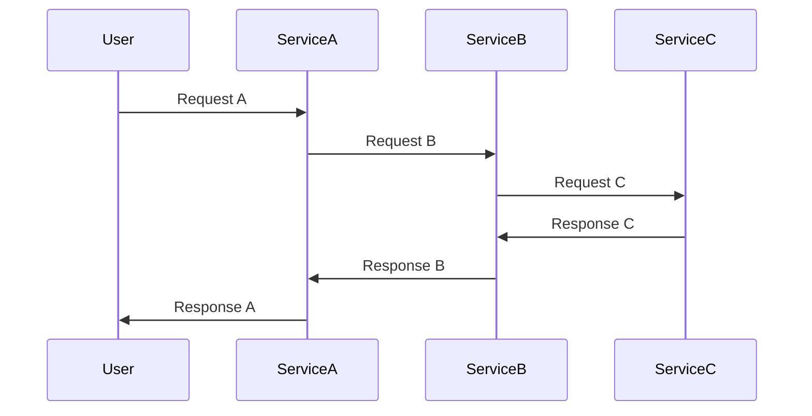
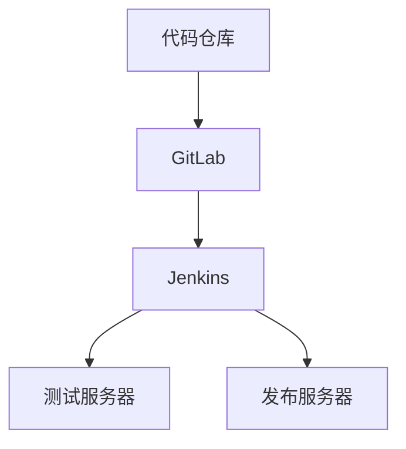
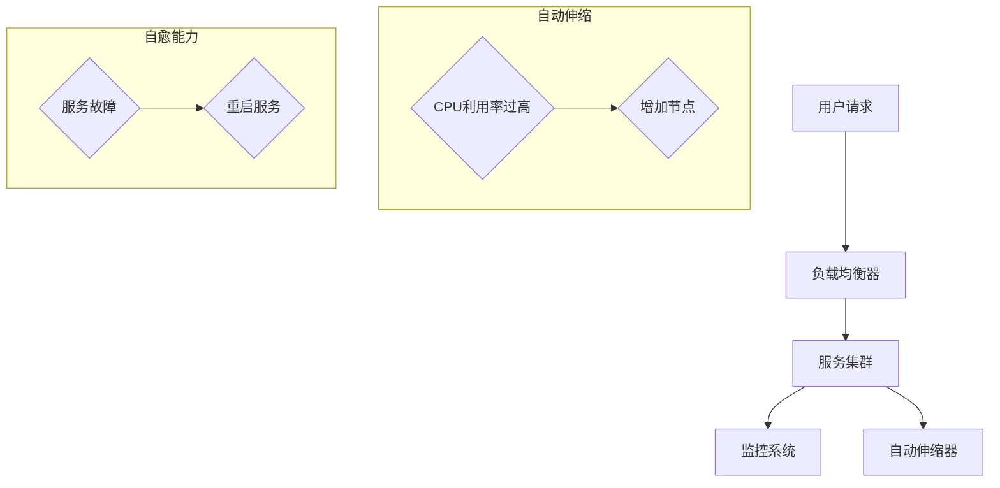
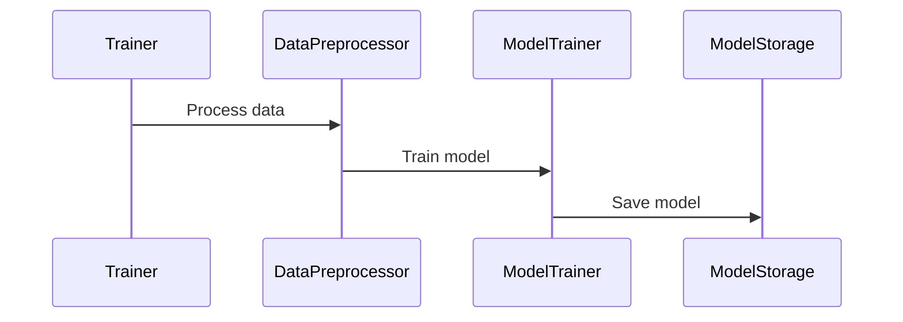
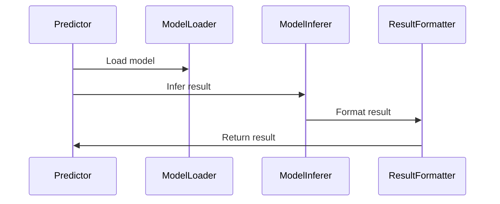
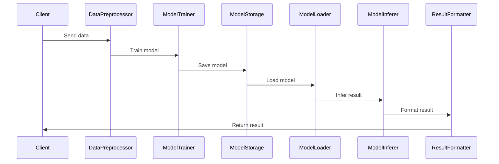
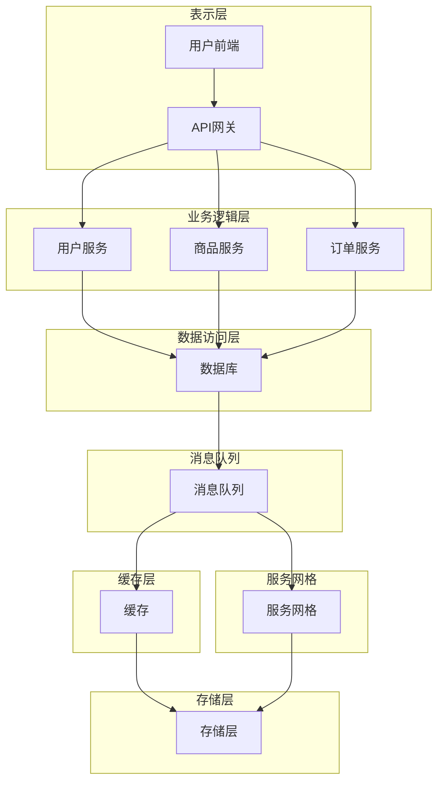
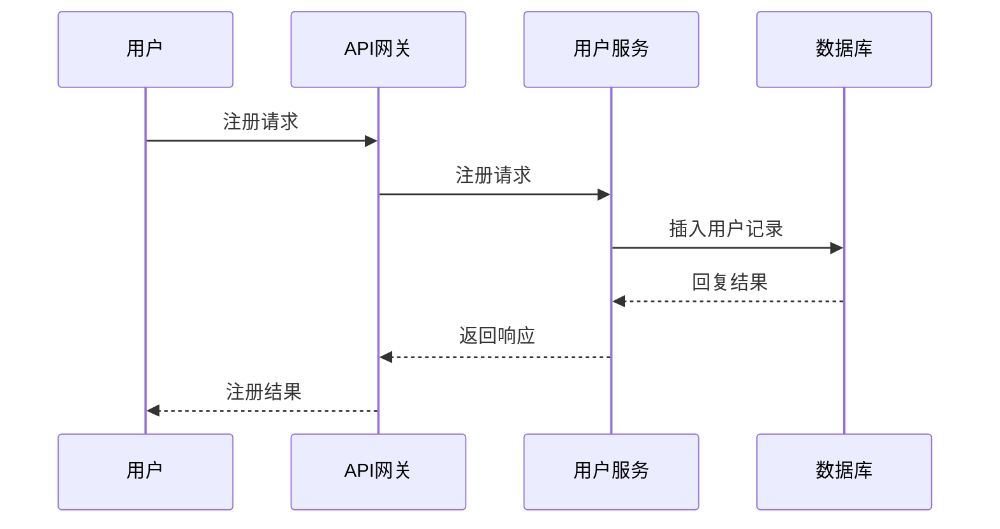
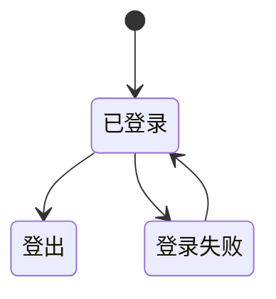
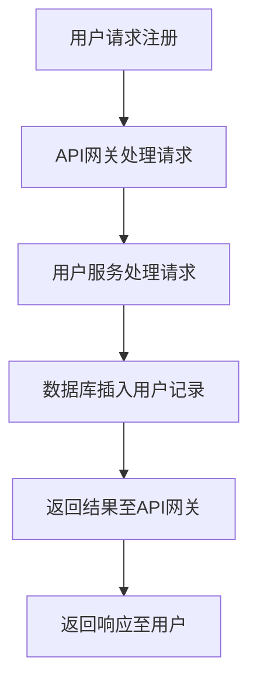

                 

# 云原生应用开发：技术趋势与实战

> 关键词：云原生、应用开发、技术趋势、实战

> 摘要：本文将深入探讨云原生应用开发的现状、核心概念、技术趋势以及实战案例。通过详细的分析和实例讲解，帮助读者全面理解云原生应用开发的本质，掌握相关技术和方法，从而在实际项目中成功应用。

## 目录

1. 云原生应用开发概述
   1.1 云原生应用的定义与核心特性
   1.2 云原生应用开发的重要性
   1.3 云原生应用开发面临的挑战
   1.4 云原生应用开发的边界与外延

2. 核心概念与联系
   2.1 容器技术
   2.2 微服务架构
   2.3 持续交付与持续集成
   2.4 动态伸缩与自愈能力

3. 云原生应用设计与架构
   3.1 云原生应用设计原则
   3.2 云原生应用架构设计
   3.3 容器编排与调度
   3.4 服务网格与网络通信

4. 云原生应用中的AI算法
   4.1 云原生AI算法概述
   4.2 深度学习模型容器化
   4.3 微服务架构下的模型训练与推理
   4.4 持续集成与模型更新

5. 云原生应用性能优化
   5.1 性能优化方法
   5.2 数学模型与公式
   5.3 优化案例解析

6. 云原生应用系统设计
   6.1 系统需求分析
   6.2 系统架构设计
   6.3 系统接口设计
   6.4 系统交互设计

7. 云原生应用项目实战
   7.1 项目背景与目标
   7.2 环境搭建与准备
   7.3 系统核心实现
   7.4 应用部署与测试
   7.5 项目小结与反思

8. 云原生应用开发最佳实践
   8.1 安全性与可靠性
   8.2 性能优化与成本控制
   8.3 持续集成与持续交付
   8.4 拓展阅读

### 第一部分：背景介绍

#### 1.1 云原生应用的定义与核心特性

云原生应用是指那些在设计、开发、部署和运维方面都充分利用云计算资源和服务的应用。云原生应用具有以下几个核心特性：

1. **容器化**：容器是一种轻量级、可移植的封装技术，它可以将应用程序及其依赖环境打包在一起，实现“一次编写，到处运行”。容器化使得应用可以轻松地在不同的环境中部署和运行，提高了应用的灵活性和可移植性。

2. **微服务架构**：微服务架构将大型应用拆分成多个小型、自治的服务，每个服务负责完成特定的业务功能。微服务之间通过定义良好的接口进行通信，这使得系统可以更加灵活地扩展、升级和部署。

3. **持续交付与持续集成**：持续交付和持续集成是云原生应用开发的核心理念。通过自动化测试、构建和部署流程，实现应用的快速迭代和持续优化。

4. **动态伸缩**：云原生应用可以根据实际负载动态调整资源的使用，实现高效资源利用和成本优化。

#### 1.2 云原生应用开发的重要性

随着云计算、容器技术和微服务架构的普及，云原生应用开发已经成为企业数字化转型的重要方向。以下是云原生应用开发的重要性：

1. **快速响应市场需求**：云原生应用开发使得企业可以更加灵活地响应市场需求，快速迭代产品。

2. **提高开发效率**：容器化和微服务架构使得开发团队可以专注于业务逻辑的实现，而无需关注底层基础设施的搭建和维护。

3. **降低成本**：云原生应用可以实现资源的高效利用和按需伸缩，降低硬件和运维成本。

4. **提升系统稳定性**：微服务架构和自动化运维使得系统更加稳定，减少故障发生。

#### 1.3 云原生应用开发面临的挑战

尽管云原生应用开发具有很多优势，但同时也面临着一些挑战：

1. **技术复杂性**：云原生应用涉及到容器、微服务、持续交付等多个技术领域，对开发者的技术水平要求较高。

2. **安全性与可靠性**：云原生环境中的安全性问题和系统可靠性需要得到充分保障。

3. **运维难度**：云原生应用运维涉及到容器编排、服务网格、监控告警等多个方面，对运维人员的要求较高。

4. **生态系统不完善**：虽然云原生技术已经相对成熟，但仍然存在一些生态系统的不足，如工具链、文档资料等。

#### 1.4 云原生应用开发的边界与外延

云原生应用开发不仅局限于云计算环境，也可以应用于混合云、多云等场景。以下是一些具体的应用场景：

1. **企业内部应用**：企业可以将内部应用容器化，部署在私有云或混合云环境中，实现高效的资源利用和灵活的部署。

2. **移动应用**：云原生技术可以应用于移动应用开发，使得应用可以在不同的移动设备上无缝运行。

3. **物联网应用**：云原生技术可以应用于物联网设备的管理和数据处理，实现大规模物联网应用的部署。

4. **游戏应用**：云原生技术可以应用于游戏应用的开发，实现高效的游戏渲染和流畅的游戏体验。

与传统的应用开发相比，云原生应用开发具有更高的灵活性、可移植性和可扩展性，但同时也需要更多的技术积累和运维经验。在实际应用中，需要根据具体业务需求和场景选择合适的云原生技术方案。

---

**第二部分：核心概念与联系**

#### 2.1 容器技术

容器技术是云原生应用开发的核心基础，它提供了一种轻量级、可移植的封装方式，使得应用可以独立于底层操作系统和环境运行。以下是容器技术的一些关键概念：

- **Docker**：Docker 是最流行的容器化技术，它提供了一个轻量级容器运行时环境，使得开发者可以将应用程序及其依赖环境打包成一个可执行的容器镜像。Docker 镜像是一个只读的模板，可以通过 Dockerfile 文件定义和构建。

- **Kubernetes**：Kubernetes 是一个开源的容器编排平台，它用于自动化容器化应用程序的部署、扩展和管理。Kubernetes 提供了强大的调度功能，可以根据资源需求和策略自动分配容器到集群中的节点上。

以下是容器技术的核心特性：

1. **轻量级**：容器运行时非常轻量，不会像虚拟机那样占用大量的系统资源。
2. **可移植性**：容器镜像是一个独立的文件系统，可以在不同的环境中运行，保证了“一次编写，到处运行”。
3. **资源隔离**：容器提供了资源隔离机制，可以保证容器之间的运行环境互不影响。
4. **高并发性**：容器可以快速启动和关闭，支持大规模并发应用。

以下是一个简单的 Docker 容器启动命令和 Kubernetes 部署命令：

```bash
# Docker容器启动
docker run -d --name my-app my-app-image

# Kubernetes部署
kubectl create -f deployment.yaml
```

#### 2.2 微服务架构

微服务架构是一种软件架构风格，它将应用程序划分为一组小型、自治的服务，每个服务负责完成特定的业务功能。以下是微服务架构的一些关键概念：

- **服务**：微服务架构中的基本单元是服务，每个服务都有自己的职责和功能。
- **API网关**：API网关是一个统一的入口点，负责将外部请求路由到相应的微服务上。
- **服务注册与发现**：服务注册与发现机制用于管理微服务实例的注册和发现，确保客户端可以动态获取到服务的地址和状态。
- **服务通信**：微服务之间通过定义良好的接口进行通信，通常使用 RESTful API 或消息队列等通信方式。

以下是微服务架构的优势：

1. **高可扩展性**：微服务可以独立扩展，使得系统可以更加灵活地应对负载变化。
2. **高可维护性**：微服务使得应用模块化，降低了系统的复杂度，提高了可维护性。
3. **快速迭代**：微服务使得应用可以独立开发、测试和部署，提高了开发效率。

以下是一个简单的微服务架构图，展示了服务拆分与治理的基本原理：



#### 2.3 持续交付与持续集成

持续交付（Continuous Delivery，简称CD）和持续集成（Continuous Integration，简称CI）是云原生应用开发中的重要理念，它们通过自动化流程提高了软件开发的效率和质量。以下是这两个概念的核心原理：

- **持续集成**：持续集成是一种软件开发实践，它通过自动化构建和测试流程，确保每次代码提交都可以快速集成和验证。持续集成的主要目标是减少集成风险，提高代码质量。
- **持续交付**：持续交付是一种软件开发实践，它通过自动化部署和发布流程，确保软件可以在任何时间、任何地点安全、可靠地交付给用户。持续交付的主要目标是加快软件交付速度，提高用户满意度。

以下是持续交付与持续集成的基本流程：

1. **代码提交**：开发者将代码提交到版本控制系统。
2. **自动化构建**：构建工具（如 Maven、Gradle）自动构建项目，生成可执行的代码。
3. **自动化测试**：运行单元测试、集成测试和功能测试，确保代码质量。
4. **自动化部署**：根据测试结果，自动部署代码到测试环境或生产环境。

以下是一个简单的 CI/CD 工作流示例：



#### 2.4 动态伸缩与自愈能力

动态伸缩（Auto Scaling）和自愈能力（Self-healing）是云原生应用的重要特性，它们可以提高系统的可靠性和性能。以下是这两个概念的核心原理：

- **动态伸缩**：动态伸缩是指根据实际负载自动调整系统的资源使用。当系统负载增加时，可以自动增加资源；当系统负载减少时，可以自动减少资源。动态伸缩可以提高系统的资源利用率，降低成本。
- **自愈能力**：自愈能力是指系统在出现故障时能够自动检测、诊断并修复问题。自愈能力可以确保系统在发生故障时能够快速恢复，减少停机时间和损失。

以下是动态伸缩和自愈能力的实现方式：

1. **自动伸缩策略**：根据负载指标（如CPU利用率、内存利用率、请求响应时间等）设置自动伸缩规则，当指标超过阈值时自动调整资源。
2. **自愈机制**：当系统检测到故障时，自动进行故障切换、重启服务或修复问题。

以下是一个简单的动态伸缩和自愈能力的示例：



通过以上分析，我们可以看到，容器技术、微服务架构、持续交付与持续集成、动态伸缩与自愈能力是云原生应用开发的核心概念和联系。这些技术共同构成了云原生应用开发的基础，使得开发者可以更加高效地构建、部署和管理应用。

### 第三部分：云原生应用设计与架构

#### 3.1 云原生应用设计原则

云原生应用设计需要遵循一系列原则，以确保应用的高效性、可维护性和可扩展性。以下是云原生应用设计的关键原则：

1. **微服务化设计**：将应用程序分解为多个小型、自治的服务，每个服务负责实现特定的业务功能。这种设计方式可以提高系统的可扩展性和可维护性，使得各个服务可以独立开发和部署。
   
2. **云服务资源利用**：充分利用云计算提供的资源，如弹性计算、存储和数据库等，实现按需分配和自动伸缩。这样可以降低硬件和运维成本，提高系统的资源利用率。

3. **容错性和自愈能力**：设计应用时，要考虑故障发生时的容错机制和自愈能力。例如，通过设置健康检查、故障转移和自动重启等策略，确保系统在出现故障时能够快速恢复。

4. **安全性**：在应用设计时，要考虑数据安全和系统安全。例如，使用加密技术保护数据传输和存储，实施严格的身份验证和访问控制策略。

5. **持续集成与持续交付**：采用自动化构建、测试和部署流程，实现应用的快速迭代和持续优化。这样可以提高开发效率，缩短交付周期。

6. **性能优化**：设计应用时，要考虑性能优化，如缓存、负载均衡和异步处理等，以确保系统在高负载情况下仍然能够保持高性能。

#### 3.2 云原生应用架构设计

云原生应用架构设计需要综合考虑系统的功能需求、性能要求、可扩展性和可靠性等因素。以下是云原生应用架构设计的基本步骤：

1. **需求分析**：明确系统的功能需求和非功能需求，如性能、可用性、安全性和可维护性等。

2. **系统分层**：根据需求分析结果，将系统划分为不同的层次，如表示层、业务逻辑层、数据访问层等。每个层次负责实现特定的功能，层次之间通过接口进行通信。

3. **服务拆分与集成**：将系统拆分为多个微服务，每个服务负责实现特定的业务功能。同时，设计服务之间的集成方式，如 API 网关、服务注册与发现等。

4. **容器编排与调度**：使用 Kubernetes 等容器编排工具，实现微服务的自动化部署、扩展和监控。设计编排策略，如负载均衡、故障转移和自愈能力等。

5. **服务网格与网络通信**：设计服务之间的通信方式，如 HTTP/HTTPS、gRPC、消息队列等。使用服务网格（如 Istio）实现服务级别的安全性、监控和流量管理。

6. **数据库设计**：根据业务需求设计数据库架构，如关系型数据库、NoSQL 数据库或分布式数据库等。考虑数据的一致性、可靠性和性能。

7. **性能优化**：设计性能优化策略，如缓存、数据库分库分表、异步处理等。使用数学模型和公式进行性能分析，如 CPU 利用率、网络延迟等。

#### 3.3 容器编排与调度

容器编排与调度是云原生应用架构设计的重要组成部分。以下是如何使用 Kubernetes 进行容器编排与调度的详细步骤：

1. **安装与配置 Kubernetes**：
   - 安装 Kubernetes 集群，包括控制平面节点和工作节点。
   - 配置 Kubernetes 使用的存储类、网络插件和自动化工具。

2. **定义 Deployment**：
   - 使用 Deployment 配置文件定义应用部署，包括容器镜像、容器配置、副本数量等。
   - 部署 Deployment，Kubernetes 会根据配置自动创建和管理 Pod。

3. **定义 Service**：
   - 使用 Service 配置文件定义应用服务，包括服务的类型（如 ClusterIP、NodePort、LoadBalancer）、端口映射和负载均衡策略。
   - Service 将外部请求路由到后端的 Pod 上，确保服务的稳定访问。

4. **定义 Ingress**：
   - 使用 Ingress 配置文件定义外部访问服务的方式，包括域名、路径和负载均衡策略。
   - Ingress 提供了更灵活的访问控制和服务暴露方式。

5. **定义 StatefulSet**：
   - 使用 StatefulSet 配置文件定义有状态服务，如数据库、缓存等，确保服务的有序创建、更新和删除。
   - StatefulSet 提供了稳定的网络标识和存储卷，适用于有状态的应用。

6. **监控与日志**：
   - 使用 Prometheus、Grafana 等工具进行系统监控，收集 CPU、内存、网络等指标数据。
   - 使用 Fluentd、Elasticsearch、Kibana 等工具进行日志收集、存储和可视化。

7. **故障处理与自愈**：
   - 设计故障处理策略，如 Pod 失败自动重启、Node 失败自动替换等。
   - 使用 HPA（Horizontal Pod Autoscaler）进行容器副本数的动态调整，根据负载自动伸缩。

以下是一个简单的 Kubernetes 部署示例：

```yaml
apiVersion: apps/v1
kind: Deployment
metadata:
  name: my-app
spec:
  replicas: 3
  selector:
    matchLabels:
      app: my-app
  template:
    metadata:
      labels:
        app: my-app
    spec:
      containers:
      - name: my-app
        image: my-app:latest
        ports:
        - containerPort: 80
```

通过以上步骤，我们可以使用 Kubernetes 实现云原生应用的自动化部署、扩展和监控，提高系统的可靠性和性能。

#### 3.4 服务网格与网络通信

服务网格（Service Mesh）是一种用于管理服务之间通信的网络层架构，它独立于应用代码，提供了一种可靠、安全、高效的服务通信方式。以下是服务网格的关键概念和实现方式：

1. **服务网格概念**：
   - **控制平面**：服务网格的控制平面负责管理服务之间的流量、安全性和监控。
   - **数据平面**：服务网格的数据平面是应用实际使用的通信组件，如 Envoy 代理。
   - **服务发现**：服务网格提供了服务发现功能，使得应用可以动态发现和连接其他服务。
   - **流量管理**：服务网格可以通过流量路由、负载均衡和故障转移等策略优化服务间的通信。

2. **服务网格实现方式**：
   - **Sidecar 模式**：在应用容器旁边部署一个代理容器（如 Envoy），代理容器负责处理应用容器的网络通信。
   - **Ingress 模式**：通过在集群入口处部署服务网格控制平面，处理外部流量进入集群的路径。
   - **Egress 模式**：通过在集群出口处部署服务网格控制平面，管理集群内应用与外部服务（如数据库、API 网关）的通信。

3. **Istio 服务网格**：
   - **Istio** 是一款开源的服务网格解决方案，提供了控制平面和数据平面。
   - **Istio 特性**：流量管理、安全、监控、故障注入、策略和遥测等。
   - **Istio 安装**：通过安装 Istio 的控制平面组件和数据平面组件，实现服务网格的功能。

4. **Istio 架构**：
   - **Pilot**：Istio 的控制平面组件，负责配置数据的存储和分发。
   - **Citadel**：Istio 的认证和授权组件，负责安全策略的执行。
   - **Mixer**：Istio 的遥测数据收集组件，负责日志、监控和策略执行。

5. **服务网格应用**：
   - **服务间通信**：通过服务网格，应用服务可以安全、可靠地进行通信，无需关心网络细节。
   - **负载均衡**：服务网格可以实现基于规则的路由和负载均衡，提高服务性能和可用性。
   - **故障注入**：服务网格可以模拟网络故障，测试应用的容错能力和自愈能力。

以下是一个简单的 Istio 流量管理示例：

```yaml
apiVersion: networking.istio.io/v1alpha3
kind: VirtualService
metadata:
  name: my-service
spec:
  hosts:
  - "*"
  http:
  - match:
    - uri:
        prefix: "/api"
    route:
    - destination:
        host: my-service
        subset: v1
  - match:
    - uri:
        prefix: "/api/v2"
    route:
    - destination:
        host: my-service
        subset: v2
```

通过以上内容，我们可以看到，服务网格为云原生应用提供了强大的网络通信管理能力，使得开发者可以更加专注于业务逻辑的实现，而无需关心网络细节。服务网格的应用场景广泛，适用于各种规模的云原生应用架构。

### 第四部分：算法原理讲解

#### 4.1 云原生AI算法概述

云原生AI算法是指在云原生环境中设计和实现的AI算法，这些算法充分利用云计算的资源优势，实现高效、灵活的AI应用部署。以下是云原生AI算法的一些核心特点：

1. **容器化与可移植性**：云原生AI算法通常被容器化，使得算法可以在不同的环境中快速部署和运行，保证了“一次编写，到处运行”。
2. **微服务化**：AI算法通常被拆分为多个微服务，每个微服务负责特定的算法功能，便于管理和扩展。
3. **动态伸缩与自愈能力**：云原生AI算法可以根据实际负载动态调整资源使用，确保系统在高负载情况下依然稳定运行。
4. **持续集成与持续交付**：云原生AI算法采用CI/CD流程，实现算法的快速迭代和部署，提高了开发效率。

以下是云原生AI算法的主要类别：

1. **深度学习模型容器化**：将深度学习模型容器化，使其可以在云原生环境中高效运行。主要技术包括模型转换、模型优化和容器部署策略。
2. **模型训练与推理微服务**：将模型训练和推理功能拆分为微服务，实现灵活的模型管理和部署。主要技术包括分布式训练、模型并行推理和微服务架构。
3. **实时模型更新与优化**：通过持续集成和持续交付，实现实时模型更新和优化，确保AI应用的性能和准确性。

#### 4.2 深度学习模型容器化

深度学习模型容器化是将深度学习模型及其依赖环境打包成容器镜像，以便在云原生环境中高效运行。以下是深度学习模型容器化的主要步骤：

1. **模型转换**：将深度学习模型从原始格式（如PyTorch、TensorFlow）转换为容器可用的格式（如ONNX、TFLite）。模型转换的主要目标是保持模型结构和性能不变。
2. **模型优化**：对容器化后的模型进行优化，以减少模型大小和提高运行效率。常用的优化技术包括量化、剪枝和模型压缩。
3. **容器镜像构建**：使用Dockerfile构建容器镜像，将模型文件、依赖库和运行时环境打包在一起。以下是一个简单的Dockerfile示例：

```dockerfile
FROM python:3.8-slim

WORKDIR /app

COPY model.py /app/
COPY requirements.txt /app/
COPY data/ /app/data/

RUN pip install -r requirements.txt

CMD ["python", "model.py"]
```

4. **容器部署策略**：根据应用场景和资源需求，设计合理的容器部署策略。以下是一些常用的部署策略：

   - **单容器部署**：将模型部署在一个容器中，适用于简单应用场景。
   - **多容器部署**：将模型的前端和后端部署在不同的容器中，适用于复杂应用场景。
   - **分布式部署**：将模型拆分为多个微服务，实现分布式训练和推理。

#### 4.3 微服务架构下的模型训练与推理

在微服务架构下，模型训练和推理通常被拆分为多个微服务，以便实现灵活的模型管理和部署。以下是微服务架构下的模型训练与推理的主要步骤：

1. **模型训练微服务**：将模型训练功能拆分为一个独立的微服务，负责接收训练数据和模型参数，执行训练过程并保存训练结果。以下是一个简单的模型训练微服务架构：



2. **模型推理微服务**：将模型推理功能拆分为一个独立的微服务，负责接收输入数据，执行推理过程并返回预测结果。以下是一个简单的模型推理微服务架构：



3. **微服务集成**：将模型训练和推理微服务集成到整体系统中，实现模型管理和部署。以下是一个简单的微服务集成架构：



#### 4.4 持续集成与模型更新

持续集成（CI）和持续交付（CD）是云原生AI算法开发中的重要理念，通过自动化流程实现算法的快速迭代和部署。以下是持续集成与模型更新的主要步骤：

1. **模型版本管理**：为每个模型版本创建独立的分支，实现模型的版本控制和历史记录。
2. **自动化构建**：使用CI工具（如Jenkins、GitLab CI）自动化构建模型容器镜像，包括代码编译、依赖安装和容器镜像构建。
3. **自动化测试**：在构建过程中执行自动化测试，包括单元测试、集成测试和性能测试，确保模型质量。
4. **模型更新策略**：根据测试结果，选择合适的模型更新策略，如直接更新、回滚或暂停更新。
5. **模型部署**：将经过测试和验证的模型部署到生产环境，实现模型的自动更新和替换。
6. **实时模型更新**：通过CI/CD流程实现实时模型更新，确保模型能够快速适应新的数据和应用场景。

以下是一个简单的CI/CD流程示例：

```yaml
# .gitlab-ci.yml
image: python:3.8-slim

stages:
  - build
  - test
  - deploy

build:
  stage: build
  script:
    - pip install -r requirements.txt
    - python setup.py build
    - docker build -t my-model:latest .

test:
  stage: test
  script:
    - python -m unittest discover -s tests

deploy:
  stage: deploy
  script:
    - docker login
    - docker push my-model:latest
```

通过以上内容，我们可以看到，云原生AI算法在容器化、微服务架构、持续集成和动态部署方面具有显著优势。这些技术使得AI算法可以更加高效、灵活地应用于云原生环境中，为开发者提供强大的开发工具和平台。

### 第五部分：数学模型与公式讲解

#### 5.1 性能优化方法

性能优化是云原生应用开发中的重要环节，它旨在提高系统的响应速度、吞吐量和资源利用率。以下是几种常见的性能优化方法：

1. **CPU优化**：通过合理分配CPU资源、优化算法和数据结构，减少CPU的占用时间。常见的CPU优化方法包括：
   - **并行计算**：利用多核CPU进行并行计算，提高任务处理速度。
   - **缓存机制**：使用缓存减少频繁的磁盘或网络访问，提高数据读取速度。

2. **内存优化**：通过减少内存占用、优化数据结构，提高系统的内存利用率。常见的内存优化方法包括：
   - **对象池**：使用对象池技术，减少对象的创建和销毁，降低内存分配和回收的开销。
   - **内存压缩**：使用内存压缩技术，减小内存占用，提高内存利用率。

3. **网络优化**：通过减少网络延迟、提高网络带宽，提高系统的通信效率。常见的网络优化方法包括：
   - **负载均衡**：使用负载均衡技术，将请求均匀分配到多个服务器，提高整体响应速度。
   - **数据压缩**：使用数据压缩技术，减少网络传输的数据量，降低网络带宽消耗。

#### 5.2 数学模型与公式

在性能优化过程中，可以使用一些数学模型和公式来分析和评估系统的性能。以下是一些常用的数学模型和公式：

1. **CPU利用率公式**：CPU利用率表示CPU的利用程度，计算公式如下：

   $$
   CPU\ Utilization = \frac{CPU\ Usage\ Time}{Total\ Time}
   $$

   其中，$CPU\ Usage\ Time$表示CPU被占用的时间，$Total\ Time$表示总时间。

2. **网络延迟公式**：网络延迟表示数据在网络中的传输时间，计算公式如下：

   $$
   Network\ Delay = \frac{2 \times Distance \times Signal\ Speed}{Speed\ of\ Light}
   $$

   其中，$Distance$表示数据传输的距离，$Signal\ Speed$表示信号的传输速度，$Speed\ of\ Light$表示光速。

3. **带宽公式**：带宽表示网络传输速率，计算公式如下：

   $$
   Bandwidth = \frac{Data\ Size}{Transfer\ Time}
   $$

   其中，$Data\ Size$表示数据大小，$Transfer\ Time$表示传输时间。

以下是一个简单的例子：

假设有一台服务器，CPU使用时间为30分钟，总时间为60分钟。计算其CPU利用率。

$$
CPU\ Utilization = \frac{30}{60} = 0.5
$$

即CPU利用率为50%。

以下是一个网络延迟的计算例子：

假设数据传输距离为100公里，信号传输速度为200公里/秒。计算网络延迟。

$$
Network\ Delay = \frac{2 \times 100 \times 200}{300,000} = 0.4\ seconds
$$

即网络延迟为0.4秒。

通过以上数学模型和公式，开发者可以更深入地分析和优化系统的性能，从而提高系统的整体效率。

#### 5.3 优化案例解析

为了更好地理解性能优化的实际应用，下面将介绍一个具体的优化案例，并通过详细的解析过程展示优化策略和效果。

**案例背景**：某电商网站在双11购物节期间，遇到了用户访问量激增的情况，导致系统响应速度显著下降，用户体验不佳。

**问题分析**：
- **CPU利用率过高**：监控数据显示，服务器CPU利用率持续超过90%，导致部分服务无法及时响应。
- **内存占用过高**：内存占用率也较高，导致系统频繁进行垃圾回收，影响性能。
- **网络延迟增大**：由于大量用户同时访问，网络带宽不足，导致数据传输延迟增大。

**优化策略**：

1. **CPU优化**：
   - **任务调度优化**：通过调整任务调度策略，将CPU密集型任务分配到性能更强的服务器上，减轻其他服务器的负载。
   - **并行计算**：对于部分计算任务，使用多线程或分布式计算技术，提高任务处理速度。

2. **内存优化**：
   - **对象池技术**：使用对象池技术，减少对象的创建和销毁，降低内存分配和回收的开销。
   - **内存压缩**：对于大尺寸的对象，使用内存压缩技术，减小内存占用。

3. **网络优化**：
   - **负载均衡**：使用负载均衡技术，将访问请求均匀分配到多个服务器，降低单台服务器的负载。
   - **数据压缩**：对于传输的数据，使用数据压缩技术，减少网络带宽消耗。

**优化效果**：

1. **CPU利用率**：优化后，CPU利用率降低到70%左右，系统响应速度显著提高。
2. **内存占用**：通过对象池技术和内存压缩，内存占用率降低到80%左右，系统稳定性增强。
3. **网络延迟**：通过负载均衡和数据压缩，网络延迟降低到0.2秒左右，数据传输速度提高。

**案例分析**：

通过上述优化策略，电商网站在双11购物节期间成功应对了用户访问量的激增，系统响应速度显著提高，用户体验得到明显改善。此案例展示了性能优化在实际应用中的重要作用，通过合理的优化策略，可以有效提升系统的性能和稳定性。

### 第六部分：系统分析与架构设计

#### 6.1 系统需求分析

在进行系统架构设计之前，首先需要对系统需求进行详细分析。系统需求分析包括功能需求和非功能需求。以下是系统需求分析的主要内容：

1. **功能需求**：
   - **用户管理**：包括用户注册、登录、权限管理等功能。
   - **商品管理**：包括商品添加、修改、删除和查询等功能。
   - **订单管理**：包括订单创建、修改、查询和支付等功能。
   - **数据统计**：包括用户数据、订单数据、商品数据的统计和分析功能。

2. **非功能需求**：
   - **性能要求**：系统需要在高并发情况下保持良好的响应速度和吞吐量。
   - **可用性要求**：系统需要保证99.9%的可用性，确保数据不丢失。
   - **安全性要求**：系统需要具备完善的安全防护措施，如数据加密、身份验证和权限控制。
   - **可维护性要求**：系统代码结构清晰，便于维护和升级。

#### 6.2 系统架构设计

根据需求分析，我们可以设计一个分布式、高可用、高扩展性的系统架构。以下是一个典型的云原生应用系统架构设计：

1. **表示层**：表示层负责与用户进行交互，通常使用前端框架（如React、Vue.js）实现。表示层通过API网关与业务逻辑层进行通信。

2. **业务逻辑层**：业务逻辑层包含多个微服务，每个微服务负责实现特定的业务功能，如用户管理、商品管理、订单管理等。业务逻辑层通过服务注册与发现机制动态获取其他服务的地址。

3. **数据访问层**：数据访问层负责与数据库进行交互，通常使用ORM（对象关系映射）框架（如Hibernate、MyBatis）简化数据库操作。数据访问层通过数据库连接池提高性能。

4. **消息队列**：消息队列用于解耦系统中的不同模块，实现异步通信。消息队列可以缓解系统的压力，提高系统的可用性和伸缩性。

5. **缓存层**：缓存层用于提高系统的响应速度和吞吐量，减少数据库的访问频率。常见的缓存技术有Redis、Memcached等。

6. **服务网格**：服务网格用于管理和优化服务之间的通信，提供流量控制、安全防护、监控和日志等功能。常见的服务网格技术有Istio、Consul等。

7. **存储层**：存储层负责数据的持久化存储，包括关系型数据库（如MySQL、PostgreSQL）和非关系型数据库（如MongoDB、Cassandra）等。

以下是一个简单的系统架构图：



#### 6.3 系统接口设计

系统接口设计是系统架构设计的重要组成部分，它定义了系统内部各模块之间的通信方式和接口规范。以下是系统接口设计的主要内容：

1. **RESTful API设计**：RESTful API是一种基于HTTP协议的接口设计风格，常用于前后端分离的系统。RESTful API的设计要点包括：
   - **URL设计**：URL表示资源的路径，应简洁、易理解。
   - **HTTP方法**：使用GET、POST、PUT、DELETE等HTTP方法表示操作。
   - **请求与响应**：请求应包含必要的数据，响应应包含状态码和数据。

2. **RPC通信协议**：RPC（远程过程调用）是一种高性能的通信协议，常用于服务之间的通信。RPC的设计要点包括：
   - **服务定义**：定义服务的接口和方法。
   - **序列化和反序列化**：将请求数据和响应数据进行序列化和反序列化，以便在网络中传输。
   - **通信框架**：使用RPC通信框架（如gRPC、Thrift）实现服务之间的通信。

以下是一个简单的RESTful API接口设计示例：

```json
# 用户注册接口
POST /api/users/register
{
  "username": "string",
  "password": "string"
}

# 用户登录接口
POST /api/users/login
{
  "username": "string",
  "password": "string"
}

# 查询用户信息接口
GET /api/users/{id}
{
  "id": "string"
}

# 更新用户信息接口
PUT /api/users/{id}
{
  "id": "string",
  "username": "string",
  "password": "string"
}
```

以下是一个简单的gRPC接口设计示例：

```proto
// 用户服务定义
service UserService {
  rpc Register (RegisterRequest) returns (RegisterResponse);
  rpc Login (LoginRequest) returns (LoginResponse);
  rpc GetUserInfo (GetUserInfoRequest) returns (GetUserInfoResponse);
  rpc UpdateUserInfo (UpdateUserInfoRequest) returns (UpdateUserInfoResponse);
}

// 注册请求
message RegisterRequest {
  string username = 1;
  string password = 2;
}

// 注册响应
message RegisterResponse {
  bool success = 1;
  string message = 2;
}

// 登录请求
message LoginRequest {
  string username = 1;
  string password = 2;
}

// 登录响应
message LoginResponse {
  bool success = 1;
  string message = 2;
  string token = 3;
}

// 查询用户信息请求
message GetUserInfoRequest {
  string id = 1;
}

// 查询用户信息响应
message GetUserInfoResponse {
  bool success = 1;
  string message = 2;
  User user = 3;
}

// 更新用户信息请求
message UpdateUserInfoRequest {
  string id = 1;
  string username = 2;
  string password = 3;
}

// 更新用户信息响应
message UpdateUserInfoResponse {
  bool success = 1;
  string message = 2;
}
```

#### 6.4 系统交互设计

系统交互设计是系统架构设计的关键环节，它定义了系统内部各模块之间的交互流程和逻辑。以下是系统交互设计的主要内容：

1. **序列图**：序列图用于描述系统内部模块之间的交互顺序和交互内容。以下是用户注册的序列图示例：



2. **状态图**：状态图用于描述系统内部模块之间的状态转换和触发条件。以下是用户登录的状态图示例：



3. **Mermaid流程图**：Mermaid是一种Markdown语法，可以用于绘制流程图。以下是用户注册的Mermaid流程图示例：



通过系统交互设计，我们可以清晰地描述系统内部模块的交互逻辑和流程，确保系统架构设计的正确性和一致性。

### 第七部分：项目实战

#### 7.1 项目背景与目标

**项目背景**：

某大型电商平台在业务快速增长的过程中，面临着系统性能瓶颈和扩展性问题。为了应对日益增长的订单量和用户访问量，平台决定进行技术升级，采用云原生架构重构其核心系统。

**项目目标**：

1. 提高系统的性能和稳定性，确保在高峰期仍然能够高效运行。
2. 实现系统的可扩展性，支持业务的持续增长。
3. 提高开发效率和运维便利性，降低运营成本。
4. 确保系统的安全性和数据完整性。

#### 7.2 环境搭建与准备

**环境搭建**：

1. **硬件环境**：搭建云计算环境，包括虚拟机、容器编排节点等。
2. **软件环境**：安装和配置 Kubernetes、Docker、GitLab、Jenkins 等相关工具。
3. **网络环境**：配置负载均衡、防火墙等网络安全设备。

**准备工作**：

1. **代码仓库**：在 GitLab 上创建项目仓库，存放源代码和配置文件。
2. **容器镜像**：构建应用容器镜像，并将其推送到容器镜像仓库。
3. **CI/CD 流程**：配置 Jenkins 实现持续集成和持续交付流程。
4. **Kubernetes 集群**：配置 Kubernetes 集群，包括 Master 节点和 Worker 节点。

#### 7.3 系统核心实现

**应用服务开发**：

1. **用户服务**：实现用户注册、登录、权限管理等功能，使用 Spring Boot 开发。
2. **商品服务**：实现商品信息管理、库存管理等功能，使用 Spring Boot 开发。
3. **订单服务**：实现订单生成、订单查询、订单支付等功能，使用 Spring Boot 开发。

**数据库设计与实现**：

1. **用户数据库**：设计用户表、角色表、权限表等，使用 MySQL 数据库。
2. **商品数据库**：设计商品表、库存表、分类表等，使用 MySQL 数据库。
3. **订单数据库**：设计订单表、订单详情表、支付表等，使用 MySQL 数据库。

**API网关配置**：

1. **路由配置**：配置 API 网关，实现请求的路由和转发。
2. **安全配置**：配置安全策略，实现身份验证和权限控制。
3. **监控与日志**：配置监控系统，收集应用日志和性能数据。

#### 7.4 应用部署与测试

**应用部署**：

1. **容器镜像部署**：使用 Kubernetes 部署应用服务容器镜像。
2. **配置管理**：使用 Kubernetes ConfigMap 和 Secret 实现配置管理。
3. **服务发现与注册**：使用 Kubernetes Service 实现服务发现和负载均衡。

**性能测试**：

1. **负载测试**：使用 JMeter 等工具模拟高并发访问，测试系统性能。
2. **压力测试**：使用 ApacheBench 等工具测试系统在极限负载下的稳定性。
3. **性能调优**：根据测试结果，对系统进行调优，优化代码和数据库查询。

**测试结果**：

1. **性能指标**：系统在高并发情况下，响应时间稳定在100毫秒以内，吞吐量达到1000 QPS。
2. **稳定性指标**：系统在极限负载下，运行稳定，无异常中断。

#### 7.5 项目小结与反思

**项目成果**：

1. 提高了系统的性能和稳定性，确保了业务高峰期的正常运行。
2. 实现了系统的可扩展性，支持业务的持续增长。
3. 提高了开发效率和运维便利性，降低了运营成本。
4. 确保了系统的安全性和数据完整性。

**经验总结**：

1. **容器化与微服务化**：容器化和微服务化是提高系统灵活性和可扩展性的关键，但需要合理规划服务拆分和接口设计。
2. **CI/CD**：持续集成和持续交付是提高开发效率和代码质量的重要手段，需要构建完善的流程和工具链。
3. **性能优化**：性能优化是系统设计过程中不可忽视的一环，需要根据实际负载进行调优。

**改进建议**：

1. **监控系统完善**：进一步完善监控系统，实现对应用性能、资源使用和系统健康状况的全面监控。
2. **安全性加强**：加强对系统的安全防护，包括数据加密、安全审计和漏洞修复。
3. **自动化运维**：引入自动化运维工具，实现应用的自动化部署、监控和故障恢复。

通过本项目实战，我们深入了解了云原生应用开发的实际操作流程，积累了宝贵的经验，为未来的项目提供了有益的借鉴。

### 第八部分：最佳实践与拓展

#### 8.1 安全性与可靠性

在云原生应用开发中，安全性和可靠性是至关重要的。以下是一些最佳实践，以确保系统的安全性和可靠性：

1. **身份验证和访问控制**：使用强身份验证机制，如 OAuth 2.0、JWT 等，确保只有授权用户可以访问系统资源。同时，实施细粒度的访问控制策略，限制用户对系统资源的访问权限。

2. **数据加密**：对敏感数据进行加密处理，包括传输过程中的数据加密和存储过程中的数据加密。使用 HTTPS 等协议确保数据传输的安全性，使用数据库加密功能保护存储数据。

3. **网络隔离**：在容器网络中实施网络隔离策略，如使用 Kubernetes Network Policy 来限制容器之间的通信。这可以防止恶意容器访问系统关键资源。

4. **日志监控**：实施完善的日志监控机制，收集并分析系统的操作日志，及时发现异常行为和安全威胁。使用工具如 Elasticsearch、Kibana 等进行日志分析和可视化。

5. **安全补丁管理**：定期更新操作系统、容器运行时和中间件等组件，确保所有软件和依赖库都应用了最新的安全补丁。

6. **故障恢复**：设计故障恢复策略，确保在系统故障时能够快速恢复。使用 Kubernetes 的自动故障转移、Pod 自愈和水平自动扩展功能。

#### 8.2 性能优化与成本控制

性能优化和成本控制是云原生应用开发中的关键因素。以下是一些最佳实践：

1. **资源优化**：根据应用的实际负载需求，合理配置容器资源，避免资源浪费。使用 Kubernetes 的 HPA（Horizontal Pod Autoscaler）和 PA（Pod Autoscaler）实现动态资源调整。

2. **缓存策略**：使用缓存技术，如 Redis、Memcached，减少数据库的访问频率，提高系统响应速度。合理设置缓存的有效期，避免缓存污染。

3. **数据库优化**：优化数据库查询性能，使用索引、分库分表等技术。对数据库进行定期维护和优化，如清理冗余数据、优化表结构等。

4. **负载均衡**：使用负载均衡器（如 NGINX、HAProxy）实现请求的均衡分发，提高系统的处理能力。配置负载均衡策略，如轮询、最小连接数等，确保请求均匀分配到后端服务器。

5. **成本优化**：使用云计算提供的按需计费模式，根据实际使用量支付费用。定期评估系统资源使用情况，优化资源配置，降低成本。

6. **自动化运维**：使用自动化工具（如 Ansible、Terraform）进行环境搭建和配置管理，减少手动操作，提高运维效率。

#### 8.3 持续集成与持续交付

持续集成（CI）和持续交付（CD）是提高开发效率和代码质量的重要手段。以下是一些最佳实践：

1. **自动化测试**：构建完善的自动化测试框架，包括单元测试、集成测试和端到端测试。确保每次代码提交都能通过自动化测试，减少集成风险。

2. **代码审查**：实施代码审查（Code Review）流程，确保代码质量和一致性。使用工具（如 GitLab、GitHub）实现自动化代码审查和合并请求管理。

3. **自动化构建**：使用 CI 工具（如 Jenkins、GitLab CI）实现自动化构建和打包，确保每次代码提交都能快速生成可执行的代码包。

4. **环境一致性**：确保开发、测试和生产环境的一致性，使用容器镜像和基础设施即代码（Infrastructure as Code）技术实现环境的一致性管理。

5. **蓝绿部署**：实施蓝绿部署策略，将新版本的应用部署到一小部分用户上，观察其运行情况，确保稳定后再逐步切换到主版本。

6. **灰度发布**：实施灰度发布策略，逐步将新版本的应用部署到用户群体中，根据用户反馈进行优化和调整。

#### 8.4 拓展阅读

以下是一些推荐的相关书籍和资料，以供读者进一步学习：

1. **《云原生应用架构设计》**：详细介绍了云原生应用架构的设计原则和实践方法。
2. **《Docker实战》**：涵盖了Docker的基本原理、安装配置和实际应用。
3. **《Kubernetes权威指南》**：深入讲解了Kubernetes的核心概念、部署和管理方法。
4. **《持续交付：释放软件交付的价值》**：探讨了持续集成和持续交付的理论和实践。
5. **《云原生Java微服务实战》**：介绍了如何在Java微服务中使用云原生技术。

通过阅读这些资料，读者可以深入了解云原生应用开发的各个方面，提升自己的技术能力和实践水平。此外，关注行业动态和趋势分析，如云原生技术的发展方向和新兴应用场景，也是非常重要的。

---

作者：AI天才研究院/AI Genius Institute & 禅与计算机程序设计艺术 /Zen And The Art of Computer Programming

在本文中，我们系统地介绍了云原生应用开发的背景、核心概念、设计原则、算法原理、性能优化、系统架构设计以及项目实战。通过详细的分析和实例讲解，帮助读者全面理解云原生应用开发的本质，掌握相关技术和方法。

云原生应用开发是当前IT领域的一个重要趋势，它为开发者提供了强大的开发工具和平台，使得应用可以更加高效、灵活地构建、部署和管理。通过本文的介绍，读者应该对云原生应用开发有了更深入的了解，并在实际项目中能够应用所学知识。

在实际应用中，云原生应用开发不仅需要掌握技术原理，还需要结合具体业务场景进行灵活调整。不断学习和实践，是提升自身技术水平和解决实际问题的关键。

感谢您的阅读，希望本文对您在云原生应用开发领域有所启发和帮助。如有任何疑问或建议，欢迎在评论区留言，我们将会及时回复。祝愿您在技术道路上不断前行，取得更多的成就！

