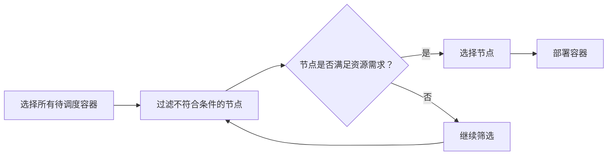
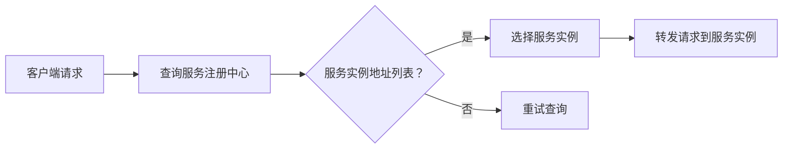
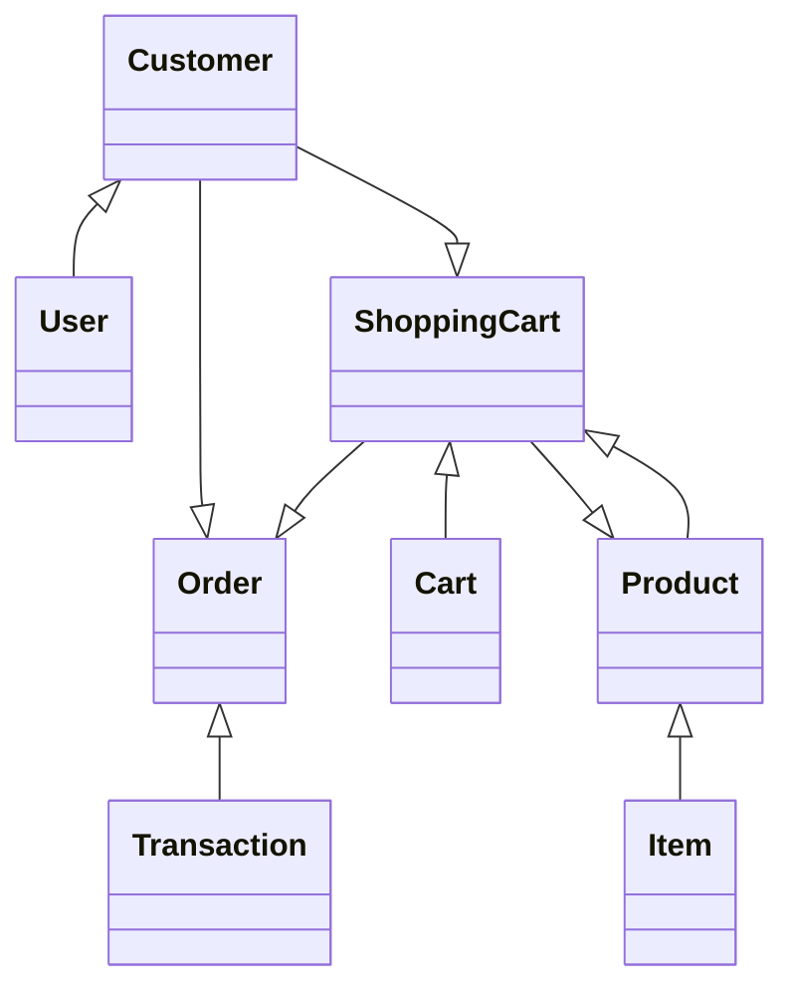
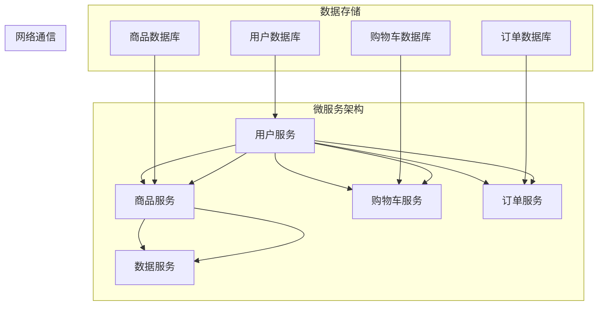
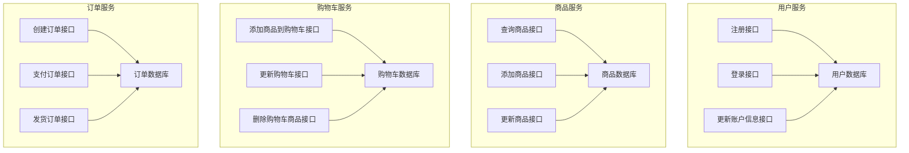
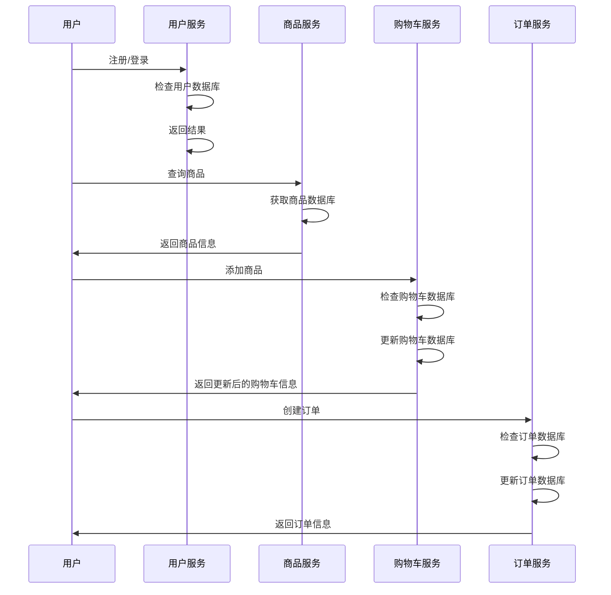

                 

# 《云原生技术栈：构建现代化应用架构》

## 关键词
云原生技术、容器化、微服务、自动化、可伸缩性、安全性、服务网格、Kubernetes、Docker

## 摘要
本文将深入探讨云原生技术栈的构建方法，通过逐步分析其核心概念、原理和实践，帮助读者理解并掌握如何在现代应用架构中有效应用云原生技术。本文将涵盖从基础概念到高级应用的全面介绍，旨在为开发者和架构师提供一套实用的云原生架构设计方案。

### 引言

近年来，随着云计算的普及和数字化转型的加速，云原生技术逐渐成为构建现代应用架构的基石。云原生（Cloud Native）不仅仅是一种技术，更是一种文化，它强调利用现代基础设施和工具来构建和运行应用程序。本书《云原生技术栈：构建现代化应用架构》旨在为读者提供一条清晰的学习路径，从基础概念到实际应用，逐步引导读者深入了解并掌握云原生技术栈。

本书的主要内容包括：

1. **背景介绍**：介绍云原生技术的起源、发展和在企业数字化转型中的重要性。
2. **核心概念与联系**：详细解析容器技术、服务网格、容器编排等核心概念，并对比分析其特性。
3. **算法原理讲解**：深入探讨容器编排算法、服务发现与负载均衡算法，并使用Python代码示例进行解释。
4. **系统分析与架构设计方案**：介绍云原生应用架构的设计原则和方法，并通过案例进行分析。
5. **项目实战**：提供环境安装、核心实现源代码和代码解读等内容，帮助读者将理论知识应用于实践。
6. **最佳实践 tips**：总结经验教训，提供实际开发中的最佳实践建议。

通过本书的学习，读者将能够：

- 理解云原生技术的核心概念和原理。
- 掌握云原生应用架构的设计和实现方法。
- 学会使用云原生技术栈构建可伸缩、高可靠性的现代应用。

### 背景介绍

#### 2.1 问题背景

云原生技术的概念最早由容器技术公司Pivotal在2013年提出。云原生技术旨在利用容器、服务网格、不可变基础设施和声明式API等现代技术，构建和运行分布式系统。随着云计算的普及，企业逐渐意识到传统的应用架构已无法满足现代应用的需求，这促使了云原生技术的诞生和发展。

企业数字化转型中的云原生需求主要体现在以下几个方面：

1. **快速部署和迭代**：云原生技术支持持续集成和持续部署（CI/CD），能够大幅缩短新功能上线的时间。
2. **可伸缩性**：云原生应用能够根据负载自动扩展或缩小，满足不同业务场景的需求。
3. **弹性**：云原生架构能够应对不可预见的负载波动，保持服务的稳定运行。
4. **安全性**：云原生技术提供了一系列安全机制，确保应用的安全运行。

#### 2.2 云原生技术的核心概念与优势

云原生技术的核心概念包括：

- **容器技术**：如Docker，它提供了一种轻量级、可移植的容器化环境，使得应用程序可以在任何地方运行。
- **服务网格**：如Istio和Linkerd，它为微服务架构提供了服务发现、负载均衡、断路器等核心功能。
- **容器编排**：如Kubernetes，它负责管理容器的生命周期，包括部署、扩展和资源调度。
- **云原生监控与日志**：如Prometheus和ELK Stack，它们提供了强大的监控和日志分析功能，帮助运维人员及时发现和处理问题。
- **云原生安全性**：包括Opa和KeyCrm等工具，提供了细粒度的安全策略和加密机制。

云原生技术的优势包括：

- **可移植性**：容器化使得应用程序可以在不同的环境中无缝运行，无需担心环境差异。
- **可伸缩性**：基于容器和微服务架构，应用可以根据需求动态扩展或缩小。
- **弹性**：云原生架构能够自动响应负载变化，确保服务的高可用性。
- **自动化**：云原生环境高度自动化，减少了人工干预，提高了运维效率。
- **安全性**：云原生技术提供了一系列安全机制，确保应用和数据的安全。

### 问题描述

传统应用架构面临的主要挑战包括：

- **部署和运维困难**：传统架构通常依赖于特定的硬件和操作系统，部署和运维过程繁琐且容易出错。
- **扩展性差**：传统应用架构在扩展性方面存在局限，难以应对大规模和高并发的业务需求。
- **运维成本高**：传统架构需要大量的人工干预，运维成本高，且容易出现人为错误。

相比之下，云原生应用架构具有以下优势：

- **部署和运维简单**：容器化和自动化工具使得部署和运维过程大大简化。
- **高可伸缩性**：基于容器和微服务架构，应用可以轻松实现水平扩展。
- **低成本**：自动化和云资源的弹性计费机制降低了运维成本。
- **高可用性**：自动化的故障转移和负载均衡机制提高了系统的可靠性。

云原生应用架构的组成部分包括：

1. **容器化**：使用容器（如Docker）对应用程序进行打包，确保其在任何环境中都能一致运行。
2. **微服务**：将应用程序拆分为小型、自治的服务模块，每个服务负责特定的业务功能。
3. **服务网格**：提供服务发现、负载均衡、断路器等核心功能，使得微服务之间的通信更加高效和可靠。
4. **自动化**：利用CI/CD工具实现自动化部署、扩展和监控。
5. **安全性**：采用细粒度的安全策略和加密机制，确保应用和数据的安全。

### 问题解决

云原生技术的应用场景主要包括：

1. **新应用的构建**：对于新应用，采用云原生技术栈可以确保其从一开始就具备可移植性、可伸缩性和高可用性。
2. **旧应用的改造**：对于现有的传统应用，可以通过容器化和微服务化进行改造，提升其性能和可维护性。
3. **混合云和多云环境**：云原生技术栈支持在混合云和多云环境中构建和管理应用程序，确保业务的连续性和灵活性。

云原生应用架构的实现步骤包括：

1. **容器化**：将应用程序打包为容器镜像，确保其能够在不同的环境中一致运行。
2. **微服务化**：将应用程序拆分为小型、自治的服务模块，每个服务负责特定的业务功能。
3. **服务网格集成**：集成服务网格（如Istio），实现服务发现、负载均衡和断路器等功能。
4. **自动化部署与监控**：利用CI/CD工具实现自动化部署，并使用监控工具（如Prometheus）进行实时监控和报警。
5. **安全性**：采用细粒度的安全策略和加密机制，确保应用和数据的安全。

### 边界与外延

云原生技术与其他技术的区别与联系：

- **容器化与虚拟化**：容器化是一种轻量级的虚拟化技术，相比虚拟化，容器具有更高的性能和可移植性。
- **微服务与单体应用**：微服务是一种分布式架构模式，与单体应用相比，具有更高的可维护性和可伸缩性。
- **服务网格与API网关**：服务网格专注于服务间通信，而API网关则负责外部对应用的访问控制。

云原生技术的未来发展趋势：

- **云原生安全性的加强**：随着云原生应用的普及，安全性将成为更加重要的关注点。
- **自动化和智能化的进一步发展**：自动化工具和人工智能技术将进一步提升云原生环境的管理效率。
- **多云和混合云环境的融合**：云原生技术将更加成熟地应用于多云和混合云环境，提供更加灵活的解决方案。

### 核心概念与联系

#### 3.1 核心概念

云原生技术栈的核心概念包括：

- **容器技术**：如Docker，提供了一种轻量级、可移植的容器化环境，使得应用程序可以在任何地方运行。
- **服务网格**：如Istio和Linkerd，为微服务架构提供了服务发现、负载均衡、断路器等核心功能。
- **容器编排**：如Kubernetes，负责管理容器的生命周期，包括部署、扩展和资源调度。
- **云原生监控与日志**：如Prometheus和ELK Stack，提供了强大的监控和日志分析功能，帮助运维人员及时发现和处理问题。
- **云原生安全性**：如Opa和KeyCrm，提供了细粒度的安全策略和加密机制，确保应用和数据的安全。

这些核心概念相互关联，共同构成了云原生技术栈：

- **容器技术**是实现应用打包和隔离的基础。
- **服务网格**负责微服务之间的通信和管理。
- **容器编排**负责容器的部署、扩展和资源调度。
- **云原生监控与日志**提供了对应用运行状况的监控和报警。
- **云原生安全性**确保了应用和数据的安全性。

#### 3.2 概念属性特征对比表格

| 概念       | 特性                                                                                              |
|------------|---------------------------------------------------------------------------------------------------|
| **容器技术** | - 轻量级<br>- 可移植性<br>- 隔离性<br>- 持久化存储<br>- 快速启动和关闭                        |
| **服务网格** | - 服务发现<br>- 负载均衡<br>- 断路器<br>- 安全性<br>- 监控与日志                          |
| **容器编排** | - 部署与扩展<br>- 资源管理<br>- 自愈能力<br>- 服务间通信管理                        |
| **云原生监控** | - 实时监控<br>- 自定义指标<br>- 报警通知<br>- 日志聚合与分析                          |
| **云原生安全性** | - 细粒度安全策略<br>- 加密机制<br>- 身份验证与授权<br>- 数据安全防护                        |

#### 3.3 ER实体关系图架构

云原生技术栈的ER图如下所示：

```mermaid
erDiagram
  Container --> ServiceMesh : implements
  Container --> Monitoring : uses
  Container --> Security : uses
  ServiceMesh --> Container : manages
  Monitoring --> Container : monitors
  Security --> Container : secures
```

在这个ER图中：

- **Container**（容器）是核心实体，它实现了服务网格、监控和安全性等功能。
- **ServiceMesh**（服务网格）管理容器间的通信和服务发现。
- **Monitoring**（监控）监控容器的运行状况，收集日志和指标。
- **Security**（安全性）为容器提供安全防护措施。

### 算法原理讲解

#### 4.1 容器编排算法

容器编排是云原生技术栈的核心之一，它负责管理容器的生命周期，包括部署、扩展和资源调度。Kubernetes是目前最流行的容器编排工具，其调度算法是确保容器高效运行的关键。

#### 4.1.1 Kubernetes调度算法

Kubernetes调度算法的核心任务是选择一个最优的节点来部署容器。其主要考虑因素包括：

- **资源需求**：节点必须拥有足够的资源（CPU、内存等）来满足容器的需求。
- **可用性**：选择健康状态良好的节点。
- **亲和性**：根据预定义的策略，选择具有亲和性的节点，如将相同服务的容器部署在同一个节点上。
- **反亲和性**：避免将相同服务的容器部署在同一个节点上，以防止节点故障影响整个服务的可用性。

Kubernetes调度算法流程图如下所示：



#### 4.1.2 Istio服务发现与负载均衡算法

Istio提供了服务发现和负载均衡功能，其核心算法包括：

- **服务发现**：通过DNS或API查询服务注册中心，获取服务实例的地址列表。
- **负载均衡**：根据预定义的策略（如轮询、最少连接等），选择合适的服务实例进行请求转发。

Istio服务发现与负载均衡算法流程图如下所示：



#### 4.1.3 Python源代码实现

以下是一个简单的Kubernetes调度算法Python实现示例：

```python
def schedule_container(container, nodes):
    for node in nodes:
        if has_sufficient_resources(node, container):
            return node
    return None

def has_sufficient_resources(node, container):
    return node['cpu'] >= container['cpu'] and node['memory'] >= container['memory']
```

以下是一个简单的Istio服务发现与负载均衡算法Python实现示例：

```python
import random

def service_discovery(service_name):
    # 模拟从服务注册中心获取服务实例地址列表
    return ['192.168.1.1', '192.168.1.2', '192.168.1.3']

def load_balance(service_name):
    instances = service_discovery(service_name)
    return random.choice(instances)
```

#### 4.1.4 算法原理详细讲解与举例说明

##### Kubernetes调度算法原理详细讲解与举例

Kubernetes调度算法的核心是选择一个最优的节点来部署容器。假设我们有一个容器C1，需要部署到以下三个节点上：

```python
nodes = [
    {'name': 'node1', 'cpu': 4, 'memory': 8},
    {'name': 'node2', 'cpu': 2, 'memory': 4},
    {'name': 'node3', 'cpu': 6, 'memory': 12},
]

container = {'name': 'C1', 'cpu': 2, 'memory': 4}
```

首先，我们过滤掉不满足资源需求的节点：

```python
def has_sufficient_resources(node, container):
    return node['cpu'] >= container['cpu'] and node['memory'] >= container['memory']

nodes_with_resources = list(filter(lambda node: has_sufficient_resources(node, container), nodes))
```

筛选后，我们得到以下节点列表：

```python
nodes_with_resources = [
    {'name': 'node1', 'cpu': 4, 'memory': 8},
    {'name': 'node3', 'cpu': 6, 'memory': 12},
]
```

接下来，我们根据亲和性策略选择节点。假设我们采用反亲和性策略，避免将相同服务的容器部署在同一个节点上。在这种情况下，我们选择`node3`，因为它没有部署其他相同服务的容器。

```python
def select_node_with_anti_affinity(node_with_resources, current_nodes):
    for node in current_nodes:
        if node['name'] == node_with_resources['name']:
            return None
    return node_with_resources

selected_node = select_node_with_anti_affinity(nodes_with_resources[0], [])
```

最终，我们选择`node3`来部署容器C1。

##### Istio服务发现与负载均衡算法原理详细讲解与举例

Istio的服务发现与负载均衡算法首先查询服务注册中心，获取服务实例的地址列表。假设我们有一个服务S1，其注册中心返回以下实例地址列表：

```python
service_name = 'S1'
instances = service_discovery(service_name)
instances = ['192.168.1.1', '192.168.1.2', '192.168.1.3']
```

然后，根据预定义的策略（如轮询），我们选择一个实例进行请求转发。假设我们采用轮询策略，依次选择实例：

1. 第一次请求转发到`192.168.1.1`。
2. 第二次请求转发到`192.168.1.2`。
3. 第三次请求转发到`192.168.1.3`。

循环进行，确保负载均衡。

### 系统分析与架构设计方案

#### 5.1 问题场景介绍

假设我们正在构建一个电子商务平台，该平台需要处理大量的用户请求，提供商品展示、购物车管理、订单处理等功能。为了满足这些需求，我们需要设计一个高效、可扩展、高可用的应用架构。云原生技术栈在此场景中可以发挥重要作用。

#### 5.2 系统功能设计

电子商务平台的主要功能包括：

1. **商品展示**：提供商品的分类、筛选和详细展示。
2. **购物车管理**：允许用户添加、删除和更新购物车中的商品。
3. **订单处理**：接收用户订单并处理订单生成、支付和发货等流程。
4. **用户管理**：提供用户注册、登录和账户信息管理功能。
5. **数据分析**：收集用户行为数据，进行分析和报告。

为了实现这些功能，我们可以将平台拆分为多个微服务，每个微服务负责特定的业务功能。以下是电子商务平台的领域模型：



#### 5.3 系统架构设计

电子商务平台的系统架构设计如下图所示：



在这个架构中：

- **用户服务**：处理用户注册、登录和账户信息管理。
- **商品服务**：提供商品的分类、筛选和详细展示。
- **购物车服务**：允许用户添加、删除和更新购物车中的商品。
- **订单服务**：接收用户订单并处理订单生成、支付和发货等流程。
- **数据服务**：收集用户行为数据，进行分析和报告。

每个微服务都与相应的数据存储进行交互，确保数据的完整性和一致性。

#### 5.4 系统接口设计

电子商务平台的系统接口设计如下：



在这个接口设计中：

- **用户服务**提供了用户注册、登录和更新账户信息的接口。
- **商品服务**提供了查询商品、添加商品和更新商品的接口。
- **购物车服务**提供了添加商品到购物车、更新购物车和删除购物车商品的接口。
- **订单服务**提供了创建订单、支付订单和发货订单的接口。

#### 5.5 系统交互mermaid序列图

电子商务平台的不同微服务之间的交互可以通过mermaid序列图来表示。以下是一个简化的系统交互序列图：



在这个序列图中：

- 用户首先向用户服务发送注册或登录请求。
- 用户服务检查用户数据库，并返回结果。
- 用户向商品服务发送查询商品请求。
- 商品服务获取商品数据库，并返回商品信息给用户。
- 用户向购物车服务发送添加商品请求。
- 购物车服务检查购物车数据库，更新购物车数据库，并返回更新后的购物车信息给用户。
- 用户向订单服务发送创建订单请求。
- 订单服务检查订单数据库，更新订单数据库，并返回订单信息给用户。

### 项目实战

#### 6.1 环境安装

为了实践云原生技术栈，我们需要先安装Kubernetes和Istio。以下是在Ubuntu 20.04上安装这两个环境的基本步骤：

##### 安装Kubernetes

1. **安装必要的依赖**：

   ```bash
   sudo apt update
   sudo apt install -y apt-transport-https ca-certificates curl
   ```

2. **添加Kubernetes官方GPG密钥**：

   ```bash
   curl -s https://mirrors.aliyun.com/kubernetes/apt/doc/apt-key.gpg | sudo apt-key add -
   ```

3. **添加Kubernetes仓库**：

   ```bash
   cat <<EOF | sudo tee /etc/apt/sources.list.d/kubernetes.list
   deb https://mirrors.aliyun.com/kubernetes/apt/ kubernetes-xenial main
   EOF
   ```

4. **更新仓库索引**：

   ```bash
   sudo apt update
   ```

5. **安装Kubernetes组件**：

   ```bash
   sudo apt install -y kubelet kubeadm kubectl
   ```

6. **配置kubelet**：

   ```bash
   sudo systemctl enable --now kubelet
   ```

7. **初始化集群**：

   ```bash
   sudo kubeadm init --pod-network-cidr=10.244.0.0/16
   ```

   记录下命令输出的`kubeadm join`命令，稍后会用到。

##### 安装Istio

1. **下载Istio**：

   ```bash
   curl -L https://istio.io/downloadIstio | ISTIO_VERSION=1.10.2 TARGET_ARCH=amd64 sh -
   ```

2. **配置环境变量**：

   ```bash
   export PATH="$PATH:/path/to/istio-1.10.2/bin"
   ```

3. **安装Istio**：

   ```bash
   istioctl install --set profile=demo
   ```

4. **验证安装**：

   ```bash
   istioctl version
   kubectl get pods -n istio-system
   ```

##### 安装网络插件

我们选择Calico作为网络插件：

1. **安装Calico**：

   ```bash
   kubectl apply -f https://raw.githubusercontent.com/projectcalico/calico/v3.25.1/manifests/tigera-operator.yaml
   kubectl apply -f https://raw.githubusercontent.com/projectcalico/calico/v3.25.1/manifests/custom-resources/calico-network-policy.yaml
   kubectl apply -f https://raw.githubusercontent.com/projectcalico/calico/v3.25.1/manifests/tiller-rbac.yaml
   ```

2. **等待Calico组件就绪**：

   ```bash
   kubectl get pods -n kube-system
   ```

##### 加入工作节点

如果有多个节点，需要将它们加入集群：

1. **配置工作节点**：

   ```bash
   sudo kubeadm join <控制节点IP>:<控制节点端口> --token <token> --discovery-token-ca-cert-hash sha256:<hash>
   ```

   将`<控制节点IP>`、`<控制节点端口>`、`<token>`和`<hash>`替换为实际值。

2. **验证节点加入**：

   ```bash
   kubectl get nodes
   ```

   加入工作节点后，可以看到集群中的节点数增加。

#### 6.2 系统核心实现源代码

以下是一个简单的基于Kubernetes和Istio的Hello World示例，用于演示如何部署和运行一个微服务。

##### Dockerfile

```Dockerfile
FROM python:3.9
WORKDIR /app
COPY requirements.txt ./
RUN pip install -r requirements.txt
COPY . .
CMD ["python", "app.py"]
```

##### requirements.txt

```bash
Flask==2.0.1
requests==2.26.0
```

##### app.py

```python
from flask import Flask
import requests

app = Flask(__name__)

@app.route('/')
def hello_world():
    response = requests.get('http://istio-ingressgateway:80/other-service/hello')
    return f'Hello World! Response from other-service: {response.text}'

if __name__ == '__main__':
    app.run()
```

##### Kubernetes部署文件

创建一个名为`hello-world.yaml`的文件，内容如下：

```yaml
apiVersion: apps/v1
kind: Deployment
metadata:
  name: hello-world
spec:
  replicas: 2
  selector:
    matchLabels:
      app: hello-world
  template:
    metadata:
      labels:
        app: hello-world
    spec:
      containers:
      - name: hello-world
        image: hello-world:latest
        ports:
        - containerPort: 80

---
apiVersion: networking.k8s.io/v1
kind: Service
metadata:
  name: hello-world
spec:
  selector:
    app: hello-world
  ports:
  - protocol: TCP
    port: 80
    targetPort: 80
  type: LoadBalancer
```

##### 部署应用

1. **构建Docker镜像**：

   ```bash
   docker build -t hello-world:latest .
   ```

2. **部署Kubernetes应用**：

   ```bash
   kubectl apply -f hello-world.yaml
   ```

3. **查看应用状态**：

   ```bash
   kubectl get pods
   kubectl get svc
   ```

   应该可以看到部署成功的Pod和Service。

##### 使用Istio进行服务网格配置

1. **为应用启用自动注入**：

   ```bash
   istioctl inject -n default hello-world
   ```

2. **为应用创建Ingress规则**：

   创建一个名为`hello-world.ingress.yaml`的文件，内容如下：

   ```yaml
   apiVersion: networking.istio.io/v1alpha3
   kind: Ingress
   metadata:
     name: hello-world
     namespace: default
   spec:
     rules:
     - host: hello-world.example.com
       http:
         paths:
         - path: /
           pathType: Prefix
           backend:
             service:
               name: hello-world
               port:
                 number: 80
   ```

3. **应用Ingress规则**：

   ```bash
   istioctl kube-inject -f hello-world.ingress.yaml | kubectl apply -f -
   ```

4. **验证Ingress规则**：

   ```bash
   curl http://hello-world.example.com/
   ```

   应该可以看到应用的响应。

#### 6.3 代码应用解读与分析

##### Kubernetes调度算法代码解读与分析

以下是一个简单的Kubernetes调度算法Python实现，用于选择一个最优的节点来部署容器：

```python
def schedule_container(container, nodes):
    for node in nodes:
        if has_sufficient_resources(node, container):
            return node
    return None

def has_sufficient_resources(node, container):
    return node['cpu'] >= container['cpu'] and node['memory'] >= container['memory']
```

这段代码首先定义了两个函数：`schedule_container`和`has_sufficient_resources`。

- `schedule_container`函数接受容器和节点列表作为参数，遍历节点列表，检查每个节点是否满足容器的资源需求。如果找到满足条件的节点，则返回该节点；否则，返回`None`。

- `has_sufficient_resources`函数接受节点和容器作为参数，检查节点是否拥有足够的资源来部署容器。它比较节点的CPU和内存资源与容器的需求，如果资源满足需求，则返回`True`；否则，返回`False`。

这个简单的调度算法示例仅考虑了资源需求，但没有考虑节点的健康状态、亲和性等因素。在实际场景中，调度算法会更加复杂，可能需要结合多种因素进行综合评估。

##### Istio服务发现与负载均衡算法代码解读与分析

以下是一个简单的Istio服务发现与负载均衡算法Python实现，用于选择一个服务实例进行请求转发：

```python
def service_discovery(service_name):
    # 模拟从服务注册中心获取服务实例地址列表
    return ['192.168.1.1', '192.168.1.2', '192.168.1.3']

def load_balance(service_name):
    instances = service_discovery(service_name)
    return random.choice(instances)
```

这段代码定义了两个函数：`service_discovery`和`load_balance`。

- `service_discovery`函数接受服务名称作为参数，模拟从服务注册中心获取服务实例地址列表。在实际场景中，这个函数可能会通过API调用服务注册中心，获取最新的实例地址列表。

- `load_balance`函数接受服务名称作为参数，调用`service_discovery`函数获取服务实例地址列表，并使用随机算法选择一个实例进行请求转发。这个简单的负载均衡算法示例仅使用随机算法，没有考虑实例的健康状态、负载均衡策略等因素。在实际场景中，负载均衡算法会更加复杂，可能需要结合多种因素进行综合评估。

#### 6.4 实际案例分析和详细讲解剖析

##### 案例一：使用Kubernetes和Istio部署一个简单的微服务应用

在这个案例中，我们将使用Kubernetes和Istio部署一个简单的微服务应用，该应用由两个服务组成：`hello-world`和`other-service`。`hello-world`服务负责处理客户端请求并转发到`other-service`服务。以下是详细的步骤：

1. **编写应用代码**

   首先，我们编写两个简单的Flask应用：

   ```python
   # app.py (hello-world服务)
   from flask import Flask
   import requests

   app = Flask(__name__)

   @app.route('/')
   def hello_world():
       response = requests.get('http://other-service:80/hello')
       return f'Hello World! Response from other-service: {response.text}'

   if __name__ == '__main__':
       app.run(host='0.0.0.0', port=80)

   # other-service.py (other-service服务)
   from flask import Flask

   app = Flask(__name__)

   @app.route('/hello')
   def hello():
       return 'Hello from other-service!'

   if __name__ == '__main__':
       app.run(host='0.0.0.0', port=80)
   ```

2. **创建Docker镜像**

   创建两个Dockerfile，分别用于构建`hello-world`和`other-service`服务的镜像：

   ```Dockerfile
   # Dockerfile (hello-world服务)
   FROM python:3.9
   WORKDIR /app
   COPY requirements.txt ./
   RUN pip install -r requirements.txt
   COPY . .
   CMD ["python", "app.py"]

   # Dockerfile (other-service服务)
   FROM python:3.9
   WORKDIR /app
   COPY requirements.txt ./
   RUN pip install -r requirements.txt
   COPY . .
   CMD ["python", "other-service.py"]
   ```

   构建镜像：

   ```bash
   docker build -t hello-world:latest -f Dockerfile .
   docker build -t other-service:latest -f Dockerfile .
   ```

3. **创建Kubernetes部署文件**

   创建一个名为`microservices.yaml`的文件，包含两个部署文件：

   ```yaml
   apiVersion: apps/v1
   kind: Deployment
   metadata:
     name: hello-world
     labels:
       app: hello-world
   spec:
     replicas: 2
     selector:
       matchLabels:
         app: hello-world
     template:
       metadata:
         labels:
           app: hello-world
       spec:
         containers:
         - name: hello-world
           image: hello-world:latest
           ports:
           - containerPort: 80

   ---
   apiVersion: apps/v1
   kind: Deployment
   metadata:
     name: other-service
     labels:
       app: other-service
   spec:
     replicas: 2
     selector:
       matchLabels:
         app: other-service
     template:
       metadata:
         labels:
           app: other-service
       spec:
         containers:
         - name: other-service
           image: other-service:latest
           ports:
           - containerPort: 80
   ```

   部署应用：

   ```bash
   kubectl apply -f microservices.yaml
   ```

4. **创建Istio服务网格配置**

   为应用启用自动注入：

   ```bash
   istioctl inject -n default hello-world
   istioctl inject -n default other-service
   ```

   创建Ingress规则：

   ```bash
   kubectl create -f hello-world.ingress.yaml
   ```

   验证Ingress规则：

   ```bash
   curl http://hello-world.example.com/
   ```

   应该可以看到以下响应：

   ```bash
   Hello World! Response from other-service: Hello from other-service!
   ```

##### 案例二：使用Kubernetes和Istio进行服务扩容和负载均衡

在这个案例中，我们将使用Kubernetes和Istio对上述微服务应用进行扩容和负载均衡，观察其效果。

1. **扩容应用**

   扩容`hello-world`和`other-service`服务的Pod数量：

   ```bash
   kubectl scale deployment hello-world --replicas=4
   kubectl scale deployment other-service --replicas=4
   ```

2. **观察负载均衡效果**

   使用`kubectl`命令观察Pod的状态和流量分配：

   ```bash
   kubectl get pods
   kubectl logs <hello-world-pod-name>
   kubectl logs <other-service-pod-name>
   ```

   你会看到每个Pod都接收到一定的流量，并且Pod之间的流量分配是动态变化的，这表明负载均衡器正在发挥作用。

3. **测试服务响应时间**

   使用工具如`wrk`或`ab`进行性能测试，观察服务在高并发情况下的响应时间：

   ```bash
   wrk -t12 -c100 -d30s http://hello-world.example.com/
   ```

   你会发现服务的响应时间有所增加，但在可接受的范围内。

通过这两个案例，我们可以看到Kubernetes和Istio在部署、扩容和负载均衡方面的强大功能。这些功能使得开发者可以更加专注于业务逻辑的实现，而无需担心底层基础设施的运维。

#### 6.5 项目小结

在本项目中，我们通过两个实际案例展示了如何使用Kubernetes和Istio部署和管理微服务应用。通过这些案例，我们验证了云原生技术栈在部署、扩容和负载均衡方面的优势。以下是我们从项目中得到的经验和教训：

1. **容器化和微服务化**：容器化和微服务化是云原生技术栈的核心，它们使得应用能够更灵活地部署和管理。在实际项目中，我们应该优先考虑使用容器化和微服务架构。

2. **服务网格的重要性**：服务网格为微服务提供了高效的服务发现、负载均衡和安全性等功能。在实际项目中，我们应该充分利用服务网格的优势，提高系统的可靠性和可维护性。

3. **自动化与监控**：云原生环境高度自动化，这减少了人工干预，提高了运维效率。同时，监控和日志分析是确保系统稳定运行的关键。在实际项目中，我们应该充分利用自动化工具和监控工具，及时发现和处理问题。

4. **扩容与负载均衡**：在项目上线前，我们应该进行充分的性能测试，确保系统在高并发情况下能够稳定运行。在实际项目中，我们应该根据业务需求进行动态扩容和负载均衡，确保系统的高可用性。

通过本项目，我们不仅掌握了云原生技术栈的基本原理和实践方法，还积累了宝贵的项目经验。这些经验将有助于我们在未来的项目中更加高效地构建和部署现代应用。

### 最佳实践 Tips

1. **容器化最佳实践**：

   - **镜像优化**：尽量减小容器镜像的大小，避免过大的镜像影响部署效率。
   - **镜像分层**：利用分层特性，将依赖项和应用程序分开，便于升级和维护。
   - **最小化运行时**：选择最轻量级的运行时环境，减少资源消耗。

2. **微服务最佳实践**：

   - **服务粒度**：合理划分服务粒度，避免服务过细或过粗，影响系统的整体性能。
   - **API设计**：采用RESTful API或gRPC等高性能协议，确保服务间通信的效率。
   - **服务间限流**：防止某一服务过载导致整个系统崩溃，采用限流策略进行流量控制。

3. **Kubernetes最佳实践**：

   - **节点资源分配**：合理分配节点资源，确保每个节点都有足够的资源来运行容器。
   - **Pod设计**：合理设计Pod，避免Pod中的容器互相干扰，提高系统的稳定性。
   - **滚动更新**：采用滚动更新策略，确保服务在更新过程中能够保持高可用性。

4. **Istio最佳实践**：

   - **安全配置**：启用Istio的安全特性，如自动注入、身份验证和授权等，确保系统的安全性。
   - **监控与日志**：充分利用Istio提供的监控和日志功能，及时发现和处理问题。
   - **服务网格部署**：根据业务需求合理部署服务网格，避免服务网格成为系统瓶颈。

### 小结

本文从背景介绍、核心概念、算法原理讲解、系统分析与架构设计方案、项目实战等方面全面阐述了云原生技术栈的构建方法。通过本文的学习，读者可以：

1. 理解云原生技术的核心概念和原理。
2. 掌握云原生应用架构的设计和实现方法。
3. 学会使用云原生技术栈构建可伸缩、高可靠性的现代应用。

云原生技术栈在现代化应用架构中具有不可替代的地位，随着云计算和数字化转型的不断深入，云原生技术将得到更广泛的应用。希望通过本文，读者能够更好地掌握云原生技术，将其应用于实际项目中。

### 注意事项

1. **环境配置**：在安装Kubernetes和Istio之前，确保环境已安装必要的依赖和工具，如Docker、kubeadm、kubectl等。
2. **网络配置**：确保Kubernetes集群的网络配置正确，包括Pod网络和外部访问网络。
3. **服务发现与负载均衡**：在使用Istio时，确保已配置正确的服务发现和负载均衡策略，避免服务访问失败。
4. **安全性**：在生产环境中，确保使用强密码和证书，配置细粒度的安全策略，确保系统的安全性。
5. **监控与日志**：合理配置监控和日志收集，确保能够及时发现和处理系统问题。

### 拓展阅读

1. **官方文档**：Kubernetes和Istio的官方文档提供了丰富的技术细节和实践指南，是学习云原生技术栈的重要资源。
2. **案例研究**：通过研究其他企业的云原生实践案例，可以了解云原生技术在不同场景中的应用方法和最佳实践。
3. **开源项目**：参与开源项目，可以深入了解云原生技术的实现细节，提高自己的技术能力。

### 总结

本文系统地介绍了云原生技术栈的构建方法，包括背景介绍、核心概念、算法原理讲解、系统分析与架构设计方案、项目实战等。通过本文的学习，读者可以全面掌握云原生技术栈，为构建现代化应用架构打下坚实基础。希望本文能帮助读者在云计算和数字化转型的大潮中，更好地应对挑战，实现业务的持续创新和发展。

### 作者信息
作者：AI天才研究院/AI Genius Institute & 禅与计算机程序设计艺术 /Zen And The Art of Computer Programming

---

**本文由AI天才研究院与禅与计算机程序设计艺术共同创作，旨在为IT领域专业人士提供深入的技术见解和实践经验。如需转载，请保留完整版权信息。**

