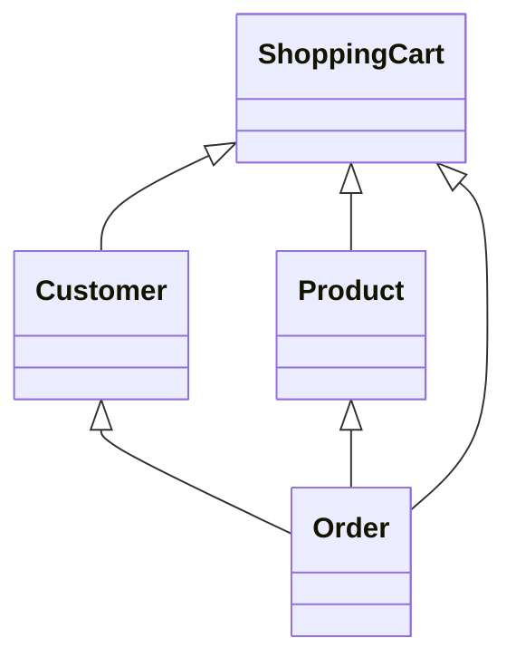
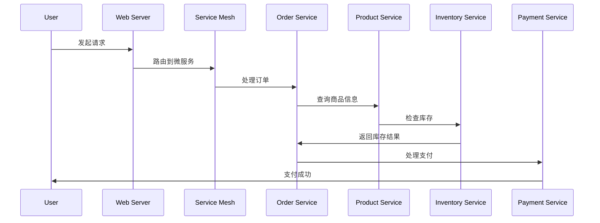

                 

# 云原生架构设计模式与实践

## 关键词：云原生，架构设计，容器化，微服务，服务网格，实践案例

> 摘要：本文将深入探讨云原生架构的设计模式与实践，首先介绍云原生架构的基础概念和核心要素，然后分析容器化与微服务设计模式，接着通过实际案例展示云原生架构在企业中的应用，最后总结最佳实践和未来趋势，为读者提供全面的技术参考。

----------------------------------------------------------------

## 第一部分：云原生架构基础

### 第1章：云原生架构概述

### 1.1 问题背景与现状

#### 1.1.1 云计算的兴起与发展

云计算作为信息技术领域的重要创新，改变了传统的IT基础设施部署方式，使得企业能够更加灵活、高效地利用计算资源。随着云计算的普及，企业开始意识到传统的单体应用架构无法满足快速变化的市场需求，这就催生了云原生架构的诞生。

#### 1.1.2 云原生架构的概念与特点

云原生（Cloud Native）是指一种利用云计算环境设计的系统，它利用容器、服务网格、微服务、不可变基础设施和声明式API等技术，实现应用的动态管理、自动化和持续集成部署。

**云原生架构的特点**：
- **容器化**：使用容器封装应用，实现环境的一致性。
- **微服务架构**：将应用程序拆分为独立的微服务，实现模块化和可扩展性。
- **服务网格**：提供服务间通信和服务发现机制，降低服务耦合。
- **自动化部署与运维**：实现自动化的应用部署、扩展和监控。

#### 1.1.3 企业对云原生架构的需求

随着市场竞争的加剧，企业需要快速响应市场变化，提高业务灵活性。云原生架构能够帮助企业实现：
- **快速迭代**：通过微服务架构和自动化部署，缩短开发周期。
- **弹性扩展**：根据业务需求动态调整资源，提高资源利用率。
- **高可用性**：通过分布式部署和容错机制，保证系统高可用。
- **成本优化**：利用云资源，实现成本优化。

### 1.2 云原生架构的核心概念

#### 1.2.1 容器化技术

**容器化技术**是一种轻量级虚拟化技术，它通过将应用程序及其依赖打包到一个容器中，实现了环境的一致性。常用的容器化技术包括Docker和Kubernetes。

**容器化优势**：
- **环境一致性**：容器化保证了应用在不同环境间的一致性。
- **资源隔离**：容器提供了资源隔离，提高了系统的稳定性和安全性。
- **快速部署**：容器可以快速启动和停止，提高了部署速度。

**容器化设计模式**包括：
- **单容器应用**：将应用程序打包为一个容器。
- **多容器应用**：将多个应用程序打包为不同的容器，实现协同工作。

#### 1.2.2 微服务架构

**微服务架构**是一种将应用程序拆分为多个独立服务的架构模式，每个服务专注于完成特定的功能，并通过API进行通信。

**微服务优势**：
- **模块化**：服务独立部署，易于维护和扩展。
- **可扩展性**：可以根据需求独立扩展某个服务。
- **高可用性**：某个服务故障不会影响其他服务的正常运行。

**微服务设计模式**包括：
- **单体拆分**：将传统的单体应用拆分为多个微服务。
- **业务驱动**：根据业务需求拆分微服务。
- **API网关**：为微服务提供统一的接口，简化调用。

#### 1.2.3 服务网格

**服务网格**是一种用于处理微服务间通信的基础设施，它提供了一种灵活、可扩展的通信方式，包括服务发现、负载均衡、故障转移等功能。

**服务网格优势**：
- **服务解耦**：服务网格降低了服务之间的耦合，提高了系统的灵活性。
- **服务监控**：服务网格提供了服务监控和日志收集功能，方便运维。
- **安全控制**：服务网格可以实现细粒度的安全控制。

**服务网格设计模式**包括：
- **边车模式**：在服务实例旁边部署代理，处理服务间通信。
- **集成模式**：将服务网格功能集成到应用程序中。

#### 1.2.4 自动化部署与运维

**自动化部署与运维**是云原生架构的重要组成部分，它通过自动化工具实现应用的快速部署、监控和运维。

**自动化部署与运维优势**：
- **效率提升**：自动化减少了手动操作，提高了运维效率。
- **可靠性增强**：自动化部署和监控可以及时发现和解决故障。
- **成本降低**：自动化降低了人力成本和资源浪费。

**自动化部署与运维实践**包括：
- **CI/CD**：使用持续集成和持续部署工具，实现自动化部署。
- **监控与日志**：使用监控和日志工具，实现自动化监控和故障处理。

### 1.3 云原生技术栈介绍

#### 1.3.1 Kubernetes

**Kubernetes**是一个开源的容器编排平台，它负责管理容器的生命周期，包括部署、扩展和运维。

**Kubernetes特点**：
- **自动化部署和扩展**：Kubernetes可以自动化部署和扩展容器应用程序。
- **服务发现和负载均衡**：Kubernetes提供了服务发现和负载均衡功能，提高了系统的可用性。
- **自动化恢复**：Kubernetes可以自动化处理容器的故障，确保系统的稳定性。

**Kubernetes实践**包括：
- **集群搭建**：使用Kubernetes搭建容器集群。
- **部署应用**：使用Kubernetes部署容器应用程序。

#### 1.3.2 Docker

**Docker**是一个开源的容器引擎，它负责将应用程序及其依赖打包到容器中。

**Docker特点**：
- **轻量级**：Docker容器非常轻量，可以实现快速启动和停止。
- **一致性**：Docker容器保证了应用程序在不同环境间的一致性。
- **可移植性**：Docker容器可以轻松地在不同操作系统和云平台上部署。

**Docker实践**包括：
- **容器创建**：使用Docker创建容器。
- **容器管理**：使用Docker管理容器。

#### 1.3.3 Service Mesh

**Service Mesh**是一种用于管理微服务间通信的基础设施，它提供了服务发现、负载均衡、故障转移等功能。

**Service Mesh特点**：
- **服务解耦**：Service Mesh降低了服务之间的耦合，提高了系统的灵活性。
- **可监控性**：Service Mesh提供了服务监控和日志收集功能，方便运维。
- **安全性**：Service Mesh可以实现细粒度的安全控制。

**Service Mesh实践**包括：
- **Istio**：使用Istio构建Service Mesh。
- **Consul**：使用Consul实现服务网格。

### 1.4 云原生架构的优势与挑战

#### 1.4.1 优势

**云原生架构的优势**包括：
- **快速迭代**：通过微服务架构和自动化部署，缩短开发周期。
- **弹性扩展**：根据业务需求动态调整资源，提高资源利用率。
- **高可用性**：通过分布式部署和容错机制，保证系统高可用。
- **成本优化**：利用云资源，实现成本优化。

#### 1.4.2 挑战

**云原生架构的挑战**包括：
- **技术复杂性**：云原生架构涉及多种技术和工具，需要团队具备一定的技术能力。
- **运维压力**：云原生架构的自动化部署和运维增加了运维压力。
- **安全性**：云原生架构面临更高的安全风险，需要采取有效的安全措施。

#### 1.4.3 应对策略

**应对策略**包括：
- **技术培训**：加强团队对云原生技术的培训，提高技术能力。
- **自动化工具**：使用自动化工具简化运维流程，降低运维压力。
- **安全措施**：加强安全设计和防护，提高系统的安全性。

### 1.5 本章小结

本章介绍了云原生架构的基础概念和核心要素，包括容器化技术、微服务架构、服务网格和自动化部署与运维。通过理解这些核心概念，读者可以更好地掌握云原生架构的设计原则和实践方法。

----------------------------------------------------------------

## 第二部分：云原生架构设计模式

### 第2章：容器化与微服务设计模式

### 2.1 容器化设计模式

#### 2.1.1 容器化优势

容器化技术具有以下优势：
- **环境一致性**：容器封装了应用程序及其运行环境，保证了环境的一致性。
- **资源隔离**：容器提供了资源隔离，提高了系统的稳定性和安全性。
- **快速部署**：容器可以快速启动和停止，提高了部署速度。

#### 2.1.2 容器化设计模式

容器化设计模式包括：
- **单容器应用**：将应用程序打包为一个容器。
- **多容器应用**：将多个应用程序打包为不同的容器，实现协同工作。

#### 2.1.3 容器化实践案例

**案例一：使用Docker容器化一个Web应用**
```python
# Dockerfile
FROM python:3.8

WORKDIR /app

COPY . .

RUN pip install -r requirements.txt

EXPOSE 8080

CMD ["python", "app.py"]
```
**案例二：使用Kubernetes部署容器化应用**
```yaml
# k8s-deployment.yaml
apiVersion: apps/v1
kind: Deployment
metadata:
  name: web-app
spec:
  replicas: 3
  selector:
    matchLabels:
      app: web-app
  template:
    metadata:
      labels:
        app: web-app
    spec:
      containers:
      - name: web-app
        image: web-app:latest
        ports:
        - containerPort: 8080
```

### 2.2 微服务设计模式

#### 2.2.1 微服务优势

微服务架构具有以下优势：
- **模块化**：服务独立部署，易于维护和扩展。
- **可扩展性**：可以根据需求独立扩展某个服务。
- **高可用性**：某个服务故障不会影响其他服务的正常运行。

#### 2.2.2 微服务设计模式

微服务设计模式包括：
- **单体拆分**：将传统的单体应用拆分为多个微服务。
- **业务驱动**：根据业务需求拆分微服务。
- **API网关**：为微服务提供统一的接口，简化调用。

#### 2.2.3 微服务实践案例

**案例一：使用Spring Cloud构建微服务**
```java
@SpringBootApplication
@EnableDiscoveryClient
public class MicroserviceApplication {
    public static void main(String[] args) {
        SpringApplication.run(MicroserviceApplication.class, args);
    }
}
```

**案例二：使用API网关简化微服务调用**
```yaml
# gateway.yaml
spring:
  application:
    name: gateway
  cloud:
    nacos:
      discovery:
        server-addr: 127.0.0.1:8848

router:
  routes:
    - id: user-service
      uri: lb://user-service
      predicates:
        - Path=/user/**
```

### 2.3 服务网格设计模式

#### 2.3.1 服务网格优势

服务网格具有以下优势：
- **服务解耦**：服务网格降低了服务之间的耦合，提高了系统的灵活性。
- **可监控性**：服务网格提供了服务监控和日志收集功能，方便运维。
- **安全性**：服务网格可以实现细粒度的安全控制。

#### 2.3.2 服务网格设计模式

服务网格设计模式包括：
- **边车模式**：在服务实例旁边部署代理，处理服务间通信。
- **集成模式**：将服务网格功能集成到应用程序中。

#### 2.3.3 服务网格实践案例

**案例一：使用Istio构建服务网格**
```shell
# 安装Istio
istioctl install --set profile=demo

# 暴露服务
istioctl kube-inject -f <服务配置文件>
```

**案例二：使用Consul实现服务网格**
```shell
# 安装Consul
docker run -d -p 8500:8500 -h consul consul agent -server -client=0.0.0.0
```

### 2.4 设计模式总结

容器化、微服务和服务网格是云原生架构的核心设计模式，它们各自提供了不同的优势和功能。通过结合这些设计模式，企业可以构建高效、可扩展、高可用的云原生系统。

----------------------------------------------------------------

## 第三部分：云原生架构实践案例

### 第3章：某企业云原生架构实践

### 3.1 企业背景与需求

#### 3.1.1 企业背景

某大型互联网企业，业务范围涵盖电商、金融、教育等多个领域。随着业务的快速发展，企业面临以下需求：
- **快速迭代**：支持快速业务创新和产品迭代。
- **弹性扩展**：根据业务需求动态调整资源。
- **高可用性**：保证系统稳定运行，降低故障率。
- **成本优化**：合理利用云资源，降低运维成本。

#### 3.1.2 需求分析

企业希望通过云原生架构实现以下目标：
- **应用容器化**：将现有应用容器化，提高部署和运维效率。
- **微服务架构**：将传统单体应用拆分为微服务，提高系统的可扩展性和可维护性。
- **服务网格**：实现微服务间的通信和服务发现，提高系统的可靠性。
- **自动化部署与运维**：实现自动化部署、监控和故障处理，降低运维压力。

### 3.2 系统架构设计

#### 3.2.1 领域模型设计

根据企业需求，设计领域模型如下：


#### 3.2.2 系统架构设计

系统架构设计如下：


#### 3.2.3 接口设计与交互

接口设计如下：
```yaml
# Order Service API
GET /orders/{id}
POST /orders
PUT /orders/{id}
DELETE /orders/{id}

# Product Service API
GET /products/{id}
POST /products
PUT /products/{id}
DELETE /products/{id}

# Payment Service API
GET /payments/{id}
POST /payments
PUT /payments/{id}
DELETE /payments/{id}
```

### 3.3 实践过程与挑战

#### 3.3.1 实践过程

1. **容器化**：使用Docker将现有应用容器化，实现环境一致性。
2. **微服务架构**：将传统单体应用拆分为微服务，提高系统的可维护性和可扩展性。
3. **服务网格**：使用Istio构建服务网格，实现微服务间的通信和服务发现。
4. **自动化部署与运维**：使用Kubernetes和CI/CD工具实现自动化部署、监控和故障处理。

#### 3.3.2 挑战与解决方案

**挑战一：技术复杂性**

**解决方案**：加强团队对云原生技术的培训，提高技术能力。

**挑战二：运维压力**

**解决方案**：使用自动化工具简化运维流程，降低运维压力。

**挑战三：安全性**

**解决方案**：加强安全设计和防护，提高系统的安全性。

### 3.4 实践总结

通过云原生架构的实施，企业实现了快速迭代、弹性扩展、高可用性和成本优化。同时，实践过程中也遇到了一些挑战，通过有效的解决方案，企业成功克服了这些挑战，为未来的发展奠定了基础。

----------------------------------------------------------------

## 第四部分：云原生架构最佳实践

### 第4章：云原生架构最佳实践与优化

### 4.1 最佳实践

#### 4.1.1 容器化最佳实践

- **环境一致性**：使用Docker镜像构建一致的环境。
- **资源优化**：合理配置容器资源，避免资源浪费。
- **版本控制**：使用Docker标签管理容器版本，便于升级和回滚。

#### 4.1.2 微服务最佳实践

- **服务拆分**：根据业务功能拆分微服务，提高系统可维护性。
- **API设计**：设计简洁、清晰的API接口，提高调用效率。
- **服务发现**：使用服务网格实现服务发现和负载均衡。

#### 4.1.3 服务网格最佳实践

- **流量管理**：使用服务网格实现流量管理和监控。
- **安全控制**：在服务网格中实现细粒度的安全控制。
- **故障处理**：使用服务网格实现故障检测和恢复。

### 4.2 性能优化

#### 4.2.1 性能优化策略

- **负载均衡**：使用负载均衡器实现流量的合理分配。
- **缓存策略**：使用缓存技术减少数据库访问。
- **数据库优化**：优化数据库查询，提高查询效率。

#### 4.2.2 性能监控与调优

- **监控指标**：监控系统的关键性能指标，如CPU、内存、网络等。
- **性能测试**：定期进行性能测试，发现潜在问题。
- **调优建议**：根据监控数据和性能测试结果，提出优化建议。

### 4.3 安全性保障

#### 4.3.1 安全性设计原则

- **最小权限原则**：服务间通信使用最小权限。
- **安全传输**：使用TLS加密服务间通信。
- **访问控制**：实现细粒度的访问控制。

#### 4.3.2 安全防护实践

- **安全审计**：定期进行安全审计，发现潜在风险。
- **入侵检测**：使用入侵检测系统（IDS）监控异常行为。
- **应急响应**：制定应急响应计划，快速应对安全事件。

### 4.4 持续集成与持续部署

#### 4.4.1 CI/CD 工具与流程

- **CI/CD工具**：使用Jenkins、GitLab CI等工具实现持续集成和持续部署。
- **CI/CD流程**：定义CI/CD流程，实现自动化构建、测试和部署。

#### 4.4.2 持续集成与持续部署实践

- **自动化构建**：使用Maven、Gradle等工具实现自动化构建。
- **自动化测试**：使用JUnit、TestNG等框架实现自动化测试。
- **自动化部署**：使用Kubernetes、Ansible等工具实现自动化部署。

### 4.5 小结

云原生架构的最佳实践包括容器化、微服务和服务网格等方面的最佳实践，以及性能优化、安全性保障和持续集成与持续部署。通过遵循这些最佳实践，企业可以构建高效、可靠、安全的云原生系统。

----------------------------------------------------------------

## 第五部分：云原生架构未来趋势与挑战

### 第5章：云原生架构的未来发展

### 5.1 云原生架构的未来趋势

#### 5.1.1 技术趋势

- **Serverless**：Serverless架构将更加流行，简化开发者的工作。
- **边缘计算**：随着5G技术的发展，边缘计算将在云原生架构中发挥重要作用。
- **混合云与多云**：混合云与多云架构将得到更广泛的应用，提供更灵活的部署方案。

#### 5.1.2 应用趋势

- **行业应用**：云原生架构将在更多行业得到应用，如金融、医疗、制造等。
- **开源生态**：云原生开源生态将不断成熟，提供更多工具和框架。

### 5.2 云原生架构的挑战

#### 5.2.1 技术挑战

- **复杂性**：云原生架构涉及多种技术和工具，需要团队具备较高的技术水平。
- **安全性**：云原生架构面临更高的安全风险，需要采取有效的安全措施。

#### 5.2.2 运维挑战

- **运维复杂性**：云原生架构的自动化部署和运维增加了运维压力。
- **监控与故障处理**：如何高效地进行监控和故障处理，是运维面临的挑战。

#### 5.2.3 安全挑战

- **服务间通信**：服务间通信的安全性如何保障，是云原生架构面临的安全挑战。
- **数据安全**：如何在云原生环境中保障数据安全，是企业和开发者需要关注的问题。

### 5.3 应对策略与建议

#### 5.3.1 技术层面

- **技术培训**：加强团队对云原生技术的培训，提高技术能力。
- **技术选型**：选择成熟、可靠的云原生技术和工具。

#### 5.3.2 运维层面

- **自动化运维**：使用自动化工具简化运维流程，降低运维压力。
- **监控与故障处理**：建立高效的监控和故障处理机制。

#### 5.3.3 安全层面

- **安全设计**：在架构设计阶段考虑安全性，采用安全最佳实践。
- **安全防护**：采用有效的安全防护措施，如加密、访问控制等。

### 5.4 小结

云原生架构的未来发展趋势包括技术趋势和应用趋势，同时也面临技术、运维和安全等挑战。通过合理的应对策略和最佳实践，企业可以克服这些挑战，实现云原生架构的成功应用。

----------------------------------------------------------------

## 第六部分：附录

### 附录A：相关技术术语解释

- **云原生**：一种利用云计算环境设计的系统，它利用容器、服务网格、微服务、不可变基础设施和声明式API等技术，实现应用的动态管理、自动化和持续集成部署。
- **容器化**：一种轻量级虚拟化技术，它通过将应用程序及其依赖打包到一个容器中，实现了环境的一致性。
- **微服务**：一种将应用程序拆分为多个独立服务的架构模式，每个服务专注于完成特定的功能，并通过API进行通信。
- **服务网格**：一种用于处理微服务间通信的基础设施，它提供了一种灵活、可扩展的通信方式，包括服务发现、负载均衡、故障转移等功能。
- **Kubernetes**：一个开源的容器编排平台，它负责管理容器的生命周期，包括部署、扩展和运维。
- **Docker**：一个开源的容器引擎，它负责将应用程序及其依赖打包到容器中。
- **CI/CD**：持续集成和持续部署，是一种通过自动化构建、测试和部署流程来提高软件交付效率的方法。

### 附录B：云原生工具推荐

- **Kubernetes**：用于容器编排和集群管理的工具。
- **Docker**：用于容器化应用程序的引擎。
- **Istio**：用于构建服务网格的工具。
- **Nginx**：用于反向代理和负载均衡的Web服务器。
- **Prometheus**：用于监控和告警的工具。
- **Grafana**：用于可视化监控数据的工具。
- **Ansible**：用于自动化运维的工具。

### 附录C：云原生架构常见问题与解答

- **什么是云原生架构？**
  云原生架构是一种利用云计算环境设计的系统，它利用容器、服务网格、微服务、不可变基础设施和声明式API等技术，实现应用的动态管理、自动化和持续集成部署。

- **云原生架构的优势是什么？**
  云原生架构的优势包括快速迭代、弹性扩展、高可用性和成本优化。

- **如何实现容器化？**
  实现容器化可以使用Docker等容器引擎，将应用程序及其依赖打包到容器中。

- **什么是微服务？**
  微服务是一种将应用程序拆分为多个独立服务的架构模式，每个服务专注于完成特定的功能，并通过API进行通信。

- **什么是服务网格？**
  服务网格是一种用于处理微服务间通信的基础设施，它提供了一种灵活、可扩展的通信方式，包括服务发现、负载均衡、故障转移等功能。

### 附录D：云原生架构学习资源推荐

- **书籍**：
  - 《云原生架构》
  - 《Kubernetes权威指南》
  - 《Docker实战》

- **在线课程**：
  - Udemy：Kubernetes权威课程
  - Pluralsight：容器化与微服务架构
  - Coursera：云原生架构与云计算

- **社区与论坛**：
  - Kubernetes社区
  - Docker社区
  - Cloud Native Computing Foundation

### 附录E：云原生架构参考架构与案例

- **参考架构**：
  - 某大型电商平台云原生架构参考架构
  - 某金融机构云原生架构参考架构

- **案例**：
  - 某企业使用Kubernetes和Docker构建云原生架构
  - 某初创公司使用Istio构建服务网格

通过附录部分的内容，读者可以进一步了解云原生架构的相关技术术语、工具推荐、常见问题与解答，以及学习资源和参考架构与案例，从而更好地掌握云原生架构的设计和实现。

----------------------------------------------------------------

# 作者：AI天才研究院/AI Genius Institute & 禅与计算机程序设计艺术 /Zen And The Art of Computer Programming

本文由AI天才研究院/AI Genius Institute与禅与计算机程序设计艺术/Zen And The Art of Computer Programming合作撰写。我们致力于探索计算机科学领域的前沿技术和思想，通过深入的分析和讲解，帮助读者掌握技术本质，提升编程能力。感谢您的阅读，期待与您共同探讨计算机科学的未来。

