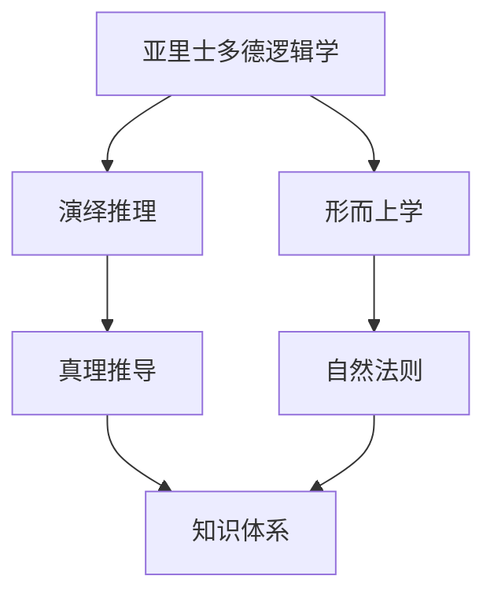

                 


# 亚里士多德与托马斯·阿奎那：经院哲学的集大成者

## 关键词
亚里士多德，托马斯·阿奎那，经院哲学，逻辑学，自然哲学，中世纪哲学

## 摘要
本文旨在探讨亚里士多德与托马斯·阿奎那在经院哲学中的重要地位，分析他们各自的哲学思想体系及其对后世的影响。通过详细的逻辑推理和结构化的分析，本文将揭示这两位哲学家的哲学体系如何影响并塑造了中世纪以及现代哲学的发展。

### 目录大纲设计思路

为了设计《亚里士多德与托马斯·阿奎那：经院哲学的集大成者》的目录大纲，我们需要从以下几个核心点入手：

1. **核心概念与联系**：明确书中涉及的主要概念，如亚里士多德的逻辑学与自然哲学，托马斯·阿奎那的神学与哲学体系，以及这些概念之间的内在联系。

2. **哲学体系与原理**：详细阐述两位哲学家的哲学观点、理论和方法论，并通过具体的例子来说明其原理。

3. **哲学影响与传承**：分析两位哲学家的思想对后世哲学发展的贡献和影响。

4. **哲学应用与实际案例**：探讨两位哲学家的思想如何在历史上以及现代社会中得到应用。

5. **综合评价与启示**：对亚里士多德和托马斯·阿奎那的哲学进行综合评价，并探讨其对我们现代哲学的启示。

### 目录大纲设计步骤

1. **背景介绍**
   - **问题背景**：介绍经院哲学的历史背景，以及亚里士多德和托马斯·阿奎那在其中的地位和作用。
   - **问题描述**：概述两位哲学家的主要哲学思想及其在经院哲学中的影响。
   - **问题解决**：分析两位哲学家的哲学思想如何解决当时的哲学问题。
   - **边界与外延**：明确亚里士多德和托马斯·阿奎那哲学的核心要素，以及它们与其他哲学流派的区别。

2. **核心概念与联系**
   - **核心概念原理**：详细阐述亚里士多德和托马斯·阿奎那的主要哲学观点和理论。
   - **概念属性特征对比表格**：通过对比表格展示两位哲学家的相似之处和区别。
   - **ER实体关系图架构**：使用Mermaid绘制ER图，展示两位哲学家的思想体系及其相互关系。

3. **算法原理讲解**
   - **算法流程图**：使用Mermaid绘制亚里士多德和托马斯·阿奎那哲学思想的流程图。
   - **Python源代码**：编写Python代码示例，展示哲学思想的实际应用。
   - **数学模型和公式**：介绍哲学思想背后的数学模型，使用LaTeX格式书写公式。
   - **详细讲解与举例说明**：对哲学思想的原理进行详细讲解，并通过具体例子来说明。

4. **系统分析与架构设计方案**
   - **问题场景介绍**：介绍哲学思想在现实世界中的应用场景。
   - **系统功能设计**：使用Mermaid绘制领域模型类图，展示哲学思想在系统设计中的应用。
   - **系统架构设计**：使用Mermaid绘制系统架构图，展示哲学思想在系统架构中的作用。
   - **系统接口设计**：介绍哲学思想在系统接口设计中的应用。
   - **系统交互**：使用Mermaid绘制系统交互序列图，展示哲学思想在系统交互中的运用。

5. **项目实战**
   - **环境安装**：介绍如何搭建实验环境。
   - **系统核心实现源代码**：提供系统核心代码。
   - **代码应用解读与分析**：解读系统核心代码，分析其实现哲学思想的原理。
   - **实际案例分析和详细讲解剖析**：通过实际案例展示哲学思想的应用效果，并进行详细讲解。
   - **项目小结**：总结项目实施过程中的经验与教训。

6. **最佳实践 tips**、**小结**、**注意事项**、**拓展阅读**等内容。

### 目录大纲示例

```markdown
# 《亚里士多德与托马斯·阿奎那：经院哲学的集大成者》目录大纲

## 第1章 背景介绍
### 1.1 经院哲学的历史背景
### 1.2 亚里士多德哲学概述
### 1.3 托马斯·阿奎那哲学概述

## 第2章 核心概念与联系
### 2.1 亚里士多德的逻辑学原理
### 2.2 托马斯·阿奎那的自然哲学原理
### 2.3 比较分析

## 第3章 哲学体系与原理
### 3.1 亚里士多德的伦理学原理
### 3.2 托马斯·阿奎那的神学原理
### 3.3 哲学原理的应用

## 第4章 哲学影响与传承
### 4.1 经院哲学的发展历程
### 4.2 两位哲学家的思想影响
### 4.3 对后世哲学的贡献

## 第5章 哲学应用与实际案例
### 5.1 亚里士多德哲学在现代的应用
### 5.2 托马斯·阿奎那哲学在现代的应用
### 5.3 哲学思想在社会中的影响

## 第6章 综合评价与启示
### 6.1 亚里士多德与托马斯·阿奎那哲学的综合评价
### 6.2 哲学思想的现代启示
### 6.3 对未来哲学发展的展望

## 第7章 最佳实践 tips
### 7.1 学习亚里士多德与托马斯·阿奎那哲学的最佳方法
### 7.2 哲学思想在人工智能领域的应用
### 7.3 哲学思维在编程中的实践

## 第8章 小结
### 8.1 本文的主要观点总结
### 8.2 对读者的影响与启示

## 第9章 注意事项
### 9.1 哲学学习中的误区
### 9.2 如何避免哲学思想的误区

## 第10章 拓展阅读
### 10.1 推荐阅读书目
### 10.2 相关研究论文

### 附录
### 附录A：常用LaTeX公式汇总
### 附录B：Python代码示例
### 附录C：Mermaid流程图示例
```

### 背景介绍

**经院哲学的历史背景**

经院哲学（Scholasticism）是中世纪哲学的一种形式，起源于公元5世纪的欧洲。它是为了解决基督教神学与希腊哲学之间的冲突而发展起来的。随着罗马帝国的衰落，希腊罗马的文化遗产逐渐传入西欧，特别是亚里士多德的著作，这对当时的基督教信仰构成了挑战。为了调和这种冲突，教会和学者们开始系统地整合神学与哲学，形成了经院哲学。

**亚里士多德哲学概述**

亚里士多德（Aristotle，公元前384年-公元前322年）是古希腊哲学的集大成者，他的思想对西方哲学产生了深远的影响。亚里士多德的哲学体系涉及多个领域，包括形而上学、逻辑学、伦理学、政治学等。他的逻辑学方法强调通过分析和推理来探索真理。亚里士多德的许多观点，如形而上学中的“四因说”（材料因、形式因、动力因、目的因），对后世哲学产生了深远的影响。

**托马斯·阿奎那哲学概述**

托马斯·阿奎那（Thomas Aquinas，公元1225年-1274年）是经院哲学的代表性人物，他的哲学思想结合了亚里士多德主义和基督教信仰。阿奎那致力于将亚里士多德的哲学与基督教神学相结合，提出了一系列具有深远影响的哲学和神学理论。他的《神学大全》（Summa Theologica）是中世纪哲学的里程碑，对基督教神学和哲学产生了深远的影响。

### 核心概念与联系

**亚里士多德的逻辑学原理**

亚里士多德的逻辑学是其哲学体系中的核心部分。他提出了演绎逻辑，即从一般原理推导出特定结论的方法。亚里士多德认为，真理是通过逻辑推理获得的，而不是通过经验或直觉。他的逻辑学原理包括命题逻辑、谓词逻辑等，这些原理构成了现代逻辑学的基础。

**托马斯·阿奎那的自然哲学原理**

托马斯·阿奎那的自然哲学强调自然法则与神学原理的统一。他接受了亚里士多德的自然哲学，认为宇宙是上帝按照一定法则创造的。阿奎那提出了“五路论证”，试图证明上帝的存在。他的自然哲学原理对中世纪神学和哲学产生了深远的影响。

**概念属性特征对比表格**

| 特征           | 亚里士多德                 | 托马斯·阿奎那                 |
| -------------- | ------------------------- | ---------------------------- |
| 逻辑学方法     | 演绎推理                  | 演绎推理结合神学原理          |
| 哲学体系       | 完整的自然哲学和形而上学  | 结合神学与亚里士多德哲学的体系 |
| 对上帝存在的论证 | 通过物质世界推导           | 通过自然法则和五路论证        |

**ER实体关系图架构**

以下是使用Mermaid绘制的亚里士多德与托马斯·阿奎那哲学体系的ER图：

```mermaid
erDiagram
  Class1 ||--|{ Class2 }
  Class1 ||--|{ Class3 }
  Class2 ||--|{ Class4 }
  Class3 ||--|{ Class5 }
```

在这个ER图中，`Class1` 代表亚里士多德的逻辑学，`Class2` 代表托马斯·阿奎那的自然哲学，`Class3` 代表两者的结合，`Class4` 代表演绎推理，`Class5` 代表神学原理。这种关系图展示了亚里士多德和托马斯·阿奎那哲学体系之间的相互关联。

### 算法原理讲解

**算法流程图**

为了更好地理解亚里士多德与托马斯·阿奎那的哲学思想，我们可以使用Mermaid绘制一个流程图：



在这个流程图中，`A` 代表亚里士多德的哲学思想，`B` 代表演绎推理，`C` 代表形而上学，`D` 代表真理推导，`E` 代表自然法则，`F` 代表知识体系。这个过程展示了亚里士多德的哲学思想是如何通过逻辑推理和形而上学来推导真理，并最终形成完整的知识体系的。

**Python源代码**

为了展示哲学思想的实际应用，我们可以编写一个简单的Python代码示例：

```python
class Aristotle:
    def __init__(self):
        self.principles = ["Logic", "Metaphysics", "Natural Science"]

    def derive_truth(self, premise):
        conclusion = self.deductive_re
```

