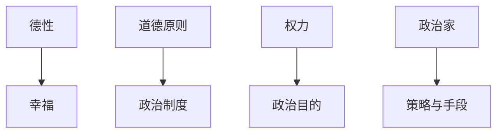
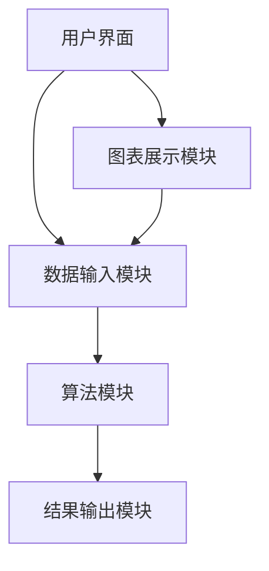
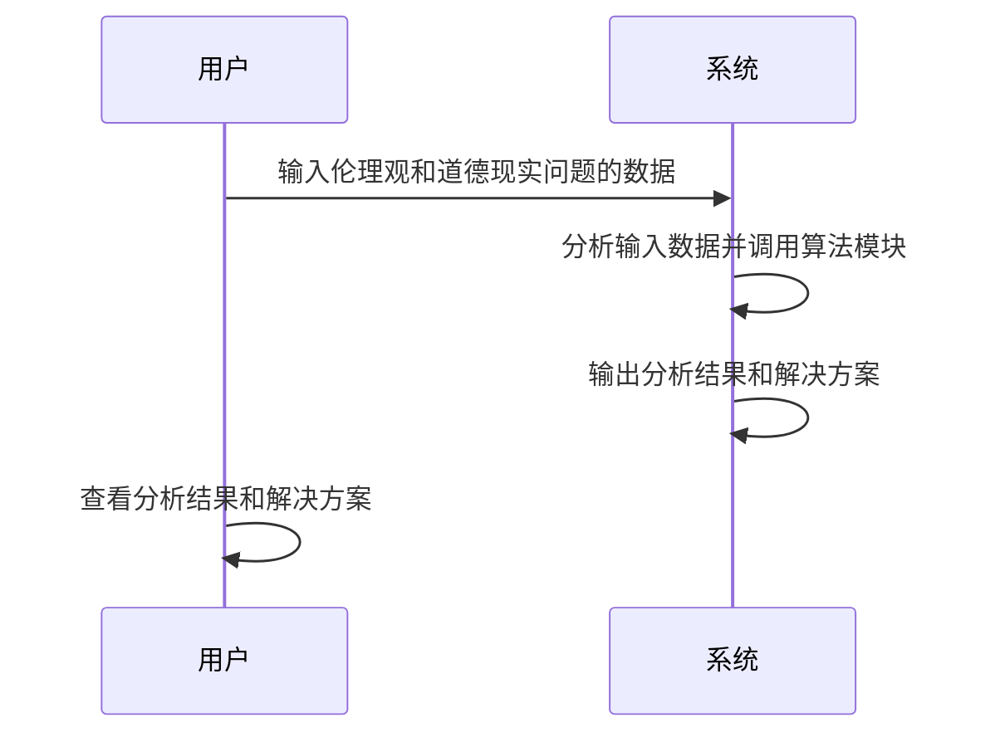

                 

# 《亚里士多德与马基雅维利：政治哲学的古今对话》

## 关键词

- 政治哲学
- 亚里士多德
- 马基雅维利
- 古今对话
- 伦理与权力

## 摘要

本文旨在探讨古希腊哲学家亚里士多德和意大利文艺复兴时期思想家马基雅维利在政治哲学领域的思想碰撞和对话。通过分析亚里士多德的伦理观和政治哲学，以及马基雅维利的道德观和政治现实主义，本文试图揭示两位思想家在伦理与政治、权力与道德之间的不同立场和观点。通过这种古今对话，本文旨在为当代政治哲学的研究提供新的视角和思考。

### 目录大纲

----------------------------------------------------------------
# 《亚里士多德与马基雅维利：政治哲学的古今对话》

## 第一部分：亚里士多德的伦理和政治哲学

## 第1章：亚里士多德的哲学背景与伦理思想

### 1.1 亚里士多德的生平与哲学贡献

### 1.2 伦理学的基本概念

### 1.3 德性的本质与种类

### 1.4 智慧与幸福的关系

## 第2章：亚里士多德的政治哲学

### 2.1 政治哲学的基本概念

### 2.2 政治制度的分类

### 2.3 良好的政体与政体的稳定性

### 2.4 公民与城邦的关系

## 第二部分：马基雅维利的政治哲学

## 第3章：马基雅维利的生平与政治思想

### 3.1 马基雅维尔的生平与政治环境

### 3.2 马基雅维利对政治的理解

### 3.3 马基雅维利的道德观

### 3.4 马基雅维利对权力与政治的见解

## 第4章：马基雅维利对亚里士多德的批判与继承

### 4.1 马基雅维利对亚里士多德伦理学的批判

### 4.2 马基雅维利对亚里士多德政治哲学的继承与发展

### 4.3 马基雅维利对政治现实的反思

## 第三部分：亚里士多德与马基雅维利的比较与对话

## 第5章：伦理观与道德观的比较

### 5.1 亚里士多德的德性伦理与马基雅维利的道德现实主义

### 5.2 伦理观与政治观的关系

### 5.3 两种伦理观的现实意义

## 第6章：政治哲学的比较

### 6.1 亚里士多德的政治哲学体系

### 6.2 马基雅维利的政治现实主义

### 6.3 政治哲学中的权力与道德

## 第7章：古今对话的意义

### 7.1 伦理与政治哲学的普世价值

### 7.2 当代政治哲学的挑战与机遇

### 7.3 伦理与政治哲学的教育启示

## 第8章：结论

### 8.1 亚里士多德与马基雅维利的共同点与区别

### 8.2 政治哲学的当代意义

### 8.3 对未来政治哲学的展望

----------------------------------------------------------------

接下来，我们将逐步深入探讨亚里士多德和马基雅维利的政治哲学，以及他们在伦理与政治、权力与道德等方面的观点。

### 第1章：亚里士多德的哲学背景与伦理思想

## 1.1 亚里士多德的生平与哲学贡献

亚里士多德（Aristotle，公元前384年－公元前322年）是古希腊哲学家，生于马其顿王国的斯泰基拉（Stagira），是柏拉图的学生。他在哲学、生物学、物理学、逻辑学、伦理学和政治学等多个领域都有杰出的贡献。他的哲学思想对西方文化产生了深远的影响，被视为西方哲学的奠基人之一。

亚里士多德的哲学贡献体现在多个方面，其中最重要的是他在伦理学和政治学领域的思想。他的伦理学思想强调德性（arete）的重要性，认为德性是达到幸福（eudaimonia）的途径。在政治学方面，他提出了政治制度分类的理论，并探讨了良好政体与政体稳定性的关系。

## 1.2 伦理学的基本概念

亚里士多德的伦理学思想基于他的整体主义哲学观，认为人的行为应当以实现整体幸福为目标。在他的著作《尼各马可伦理学》中，他详细阐述了伦理学的基本概念，包括：

- **德性（Virtue）**：德性是人们行为的品质，是达到幸福的关键。亚里士多德认为，德性是通过习惯培养的，人们应当不断努力培养良好的习惯。

- **理智（Reason）**：理智是人类行为的核心，是区分人类与其他生物的关键。亚里士多德认为，理智应指导人的行为，使人达到理性的幸福。

- **幸福（Happiness）**：幸福是人的终极目标，是一种长期的、稳定的快乐状态。亚里士多德认为，幸福是德性的结果，是通过理智指导行为实现的。

## 1.3 德性的本质与种类

亚里士多德将德性分为两类：道德德性和理智德性。

- **道德德性**：道德德性是指人们在日常生活中培养的品质，如正义、勇敢、节制等。这些德性是通过习惯培养的，是人们行为的标准。

- **理智德性**：理智德性是指人们通过理智活动培养的品质，如智慧、理解、明智等。这些德性是人们理性生活的体现，是实现幸福的关键。

## 1.4 智慧与幸福的关系

亚里士多德认为，智慧是理智德性的核心，是实现幸福的关键。智慧不仅包括对知识的理解，还包括对行为的指导。智慧使人能够在各种情境中做出正确的选择，从而实现幸福。

### 小结

亚里士多德的伦理思想强调德性的培养和理智的指导，他认为德性是达到幸福的关键。这种思想在当代政治哲学中仍有重要意义，为我们理解伦理与政治的关系提供了深刻的洞见。

接下来，我们将继续探讨亚里士多德的政治哲学，以及他对政治制度、公民与城邦关系的见解。

## 第2章：亚里士多德的政治哲学

## 2.1 政治哲学的基本概念

亚里士多德的政治哲学基于他对伦理学的理解，认为政治生活是人的本质表现。在他的著作《政治学》中，他详细阐述了政治哲学的基本概念，包括：

- **政治（Polis）**：政治是指一种集体生活方式，是人类社会的基本单位。亚里士多德认为，政治是人类生活的最高形式，是实现幸福的关键。

- **政治制度（Political System）**：政治制度是指一个国家的政权组织形式，包括政府的结构和运作方式。亚里士多德认为，政治制度应当以实现公共利益为目标。

- **公民（Citizen）**：公民是指具有政治权利和义务的人，是政治生活的重要参与者。亚里士多德认为，公民应当积极参与政治生活，为公共利益贡献自己的力量。

## 2.2 政治制度的分类

亚里士多德根据政治制度的目的和特点，将政治制度分为三类：

- **君主制（Monarchy）**：君主制是一种以君主为中心的政治制度，君主具有绝对的权力和责任。亚里士多德认为，君主应当具备智慧和德性，才能有效地治理国家。

- **贵族制（Aristocracy）**：贵族制是一种以贵族为中心的政治制度，贵族具有优越的出身和才能。亚里士多德认为，贵族应当通过德性和才能来治理国家。

- **民主制（Democracy）**：民主制是一种以公民为中心的政治制度，公民具有平等的参与权和决策权。亚里士多德认为，民主制应当通过公民的积极参与来实现公共利益。

## 2.3 良好的政体与政体的稳定性

亚里士多德认为，良好的政体应当具备以下几个特点：

- **公共利益**：政治制度应当以实现公共利益为目标，而不是追求个人利益。

- **权力的平衡**：政治制度应当确保权力的平衡，防止权力过度集中。

- **公民的参与**：政治制度应当鼓励公民积极参与政治生活，发挥公民的主体作用。

- **法治**：政治制度应当建立在法治的基础上，保障公民的权益和自由。

亚里士多德认为，政体的稳定性取决于以下几个因素：

- **政治制度的适应性**：政治制度应当能够适应社会环境的变化，保持其有效性。

- **公民的教育**：公民应当接受良好的教育，具备参与政治生活的能力和素质。

- **领导者的德性**：领导者应当具备智慧和德性，能够有效地治理国家。

## 2.4 公民与城邦的关系

亚里士多德认为，公民与城邦是密不可分的关系。城邦是公民生活的场所，公民是城邦的基础。公民与城邦的关系包括以下几个方面：

- **政治参与**：公民应当积极参与政治生活，为公共利益贡献自己的力量。

- **道德责任**：公民应当具备道德责任，遵守法律，维护社会秩序。

- **公共教育**：城邦应当为公民提供良好的教育，培养公民的德性和能力。

- **社会交往**：公民应当积极参与社会交往，建立和谐的人际关系。

### 小结

亚里士多德的政治哲学强调公共利益、权力平衡、公民参与和法治，认为良好的政体应当具备这些特点。他的政治思想在当代政治哲学中具有重要地位，为我们理解政治制度和社会发展提供了深刻的洞见。

接下来，我们将探讨马基雅维利的政治哲学，以及他对权力、道德和政治现实主义的见解。

## 第3章：马基雅维利的生平与政治思想

## 3.1 马基雅维尔的生平与政治环境

尼科洛·马基雅维利（Niccolò Machiavelli，1469年－1527年）是意大利文艺复兴时期的重要政治思想家和历史学家，生于佛罗伦萨。他的生平经历了意大利城邦政治动荡的时期，这段经历对他的政治思想产生了深远的影响。

马基雅维利出生在一个没落贵族家庭，他的父亲是一名法官。早年，他在佛罗伦萨共和国政府中担任多个职位，包括秘书、大使和行政官员。他在政治上的经历，尤其是目睹了意大利城邦之间的战争和政治斗争，使他形成了对权力和政治的深刻见解。

## 3.2 马基雅维利对政治的理解

马基雅维利认为，政治是一种现实主义的实践，政治家必须面对的是复杂多变的政治现实，而不是理想化的道德原则。他的政治思想主要包括以下几个方面：

- **政治现实主义**：马基雅维利主张政治家应当以现实为基础，而不是以理想为出发点。他认为，政治权力是通过权力斗争获得的，政治家必须具备坚定的意志和灵活的策略。

- **权力与道德的分离**：马基雅维利认为，权力和道德是可以分离的。一个成功的政治家不仅需要道德，还需要在必要时违反道德规范，以实现政治目标。

- **政治手段的重要性**：马基雅维利强调政治手段的重要性，认为政治家应当运用各种手段来维护和扩大权力，包括欺骗、威胁、利诱等。

## 3.3 马基雅维利的道德观

马基雅维利的道德观与传统的基督教道德观念大相径庭。他认为，道德应当服务于政治目的，而不是政治本身。他的道德观主要包括以下几个方面：

- **功利主义**：马基雅维利认为，道德应当以功利为目标，即行为的好坏应当以结果来衡量。他认为，如果某种行为能够带来更大的利益，那么这种行为就是道德的。

- **手段与目的的分离**：马基雅维利认为，为了实现政治目标，政治家可以不择手段。他认为，手段与目的是可以分离的，政治家应当专注于实现目标，而不必担心手段的道德性。

## 3.4 马基雅维利对权力与政治的见解

马基雅维利对权力与政治的理解深受他生活的政治环境的影响。他认为，权力是政治的核心，政治家必须善于运用权力来维护自己的地位和利益。他的观点主要包括：

- **权力斗争的必然性**：马基雅维利认为，权力斗争是政治生活的常态，政治家必须时刻警惕潜在的威胁，并采取措施来保护自己。

- **权力的灵活运用**：马基雅维利主张，政治家应当根据具体情况灵活运用权力，以实现政治目标。他提出了“适者生存”的原则，认为政治家必须适应环境变化，才能在权力斗争中立于不败之地。

- **政治家的人格魅力**：马基雅维利认为，政治家的人格魅力是维护权力的重要手段。一个有魅力的政治家能够赢得人民的支持，从而巩固自己的地位。

### 小结

马基雅维利的政治思想是对当时意大利城邦政治现实的深刻反思。他的现实主义观点和道德观，尤其是权力与道德的分离，对后世的政治哲学和实际政治产生了深远的影响。他的思想在当代政治哲学中仍然具有重要的参考价值，为我们理解政治的现实性和复杂性提供了新的视角。

接下来，我们将探讨马基雅维利对亚里士多德伦理学的批判，以及他对亚里士多德政治哲学的继承与发展。

## 第4章：马基雅维利对亚里士多德的批判与继承

### 4.1 马基雅维利对亚里士多德伦理学的批判

马基雅维利对亚里士多德的伦理学提出了尖锐的批判，主要观点如下：

- **道德与政治的分离**：亚里士多德认为道德是政治生活的基础，而马基雅维利则认为道德与政治是可以分离的。他认为，政治家应当专注于政治目标的实现，而不是被道德原则束缚。

- **权力优先于道德**：亚里士多德强调道德的价值，而马基雅维利则认为权力是政治的核心，政治家在必要时可以违背道德原则。他认为，一个成功的政治家应当以实现政治目标为首要任务，而不是被道德规范所束缚。

- **功利主义**：亚里士多德的伦理学强调德性，而马基雅维利则主张功利主义。他认为，道德行为应当以结果为导向，如果某种行为能够带来更大的利益，那么这种行为就是道德的。

### 4.2 马基雅维利对亚里士多德政治哲学的继承与发展

尽管马基雅维利对亚里士多德的伦理学提出了批判，但他对亚里士多德的政治哲学有所继承和发展：

- **政治制度的适应性**：亚里士多德认为政治制度应当适应社会环境的变化，而马基雅维利则强调政治制度必须具备高度适应性。他认为，政治制度必须能够应对复杂多变的政治现实，才能保持其有效性。

- **公民的角色**：亚里士多德认为公民应当积极参与政治生活，而马基雅维利则强调公民的政治责任。他认为，公民不仅应当享有政治权利，还应当承担政治责任，为公共利益贡献力量。

- **权力的运用**：亚里士多德认为权力应当受到道德约束，而马基雅维利则主张权力的灵活运用。他认为，政治家必须具备灵活的策略和手段，以维护和扩大权力。

### 4.3 马基雅维利对政治现实的反思

马基雅维利对政治现实的深刻反思体现在他的政治思想中。他认为，政治家必须面对的是复杂多变的政治现实，而不是理想化的道德原则。他的观点主要包括：

- **权力斗争的必然性**：马基雅维利认为，权力斗争是政治生活的常态，政治家必须时刻警惕潜在的威胁，并采取措施来保护自己。

- **政治手段的重要性**：马基雅维利强调政治手段的重要性，认为政治家应当运用各种手段来维护和扩大权力。

- **现实主义的政治观**：马基雅维利主张现实主义的政治观，认为政治家应当以现实为基础，而不是以理想为出发点。

### 小结

马基雅维利对亚里士多德伦理学的批判和对政治哲学的继承与发展，体现了他对政治现实的深刻反思。他的思想为后世的政治哲学提供了丰富的资源，为我们理解政治的本质和复杂性提供了深刻的洞见。

## 第5章：伦理观与道德观的比较

### 5.1 亚里士多德的德性伦理与马基雅维利的道德现实主义

亚里士多德和马基雅维利在伦理观和道德观上有着显著的差异。

亚里士多德的德性伦理强调德性是达到幸福的关键，德性是通过习惯培养的。他认为，德性包括道德德性和理智德性，道德德性体现在人们的日常行为中，而理智德性则体现在人们的理性思考和决策中。亚里士多德认为，道德原则应当是普遍适用的，不受具体情境的影响。

相比之下，马基雅维利的道德现实主义则强调道德与政治的分离，他认为道德应当服务于政治目的。他主张，道德行为应当以结果为导向，如果某种行为能够带来更大的利益，那么这种行为就是道德的。马基雅维利认为，道德原则是可以根据具体情境进行调整的，政治家在必要时可以违背道德规范。

### 5.2 伦理观与政治观的关系

亚里士多德和马基雅维利在伦理观与政治观的关系上也有着不同的看法。

亚里士多德认为，伦理和政治是密不可分的。他的伦理学是政治学的基础，政治哲学的目标是追求公共利益和幸福。亚里士多德认为，一个良好的政体应当以实现公共利益为目标，政治家应当以道德原则为指导，以实现公民的幸福为最终目标。

相比之下，马基雅维利则将伦理和政治分离。他认为，政治是一种现实主义的实践，政治家应当专注于政治目标的实现，而不是被道德原则束缚。他主张，政治家在必要时可以违背道德规范，以实现政治目标。

### 5.3 两种伦理观的现实意义

亚里士多德和马基雅维利的伦理观在当代政治哲学中仍具有重要的现实意义。

亚里士多德的德性伦理强调道德原则的普遍适用性和指导作用，为我们提供了一种理想化的道德观。他的思想启示我们，在政治生活中应当坚持道德原则，追求公共利益，关注公民的幸福。

马基雅维利的道德现实主义则提醒我们，政治是一种复杂的现实，政治家必须面对权力斗争和政治现实。他的思想启示我们，在政治生活中应当灵活运用权力，根据具体情况调整道德原则，以实现政治目标。

### 小结

亚里士多德和马基雅维利在伦理观和道德观上有着不同的立场和观点。他们的思想为我们提供了不同的视角，启示我们在政治生活中既要坚持道德原则，又要灵活应对政治现实。

## 第6章：政治哲学的比较

### 6.1 亚里士多德的政治哲学体系

亚里士多德的政治哲学体系基于他对人类幸福和德性的理解。他认为，政治是达到人类幸福的关键，政治制度应当以实现公共利益为目标。亚里士多德的政治哲学体系主要包括以下几个核心概念：

- **政治（Polis）**：政治是人类社会的最高形式，是公民共同生活的共同体。

- **政体（Political System）**：政体是一个国家的政权组织形式，包括政府的结构和运作方式。

- **德性（Virtue）**：德性是达到幸福的关键，是人类行为的标准。

- **公民（Citizen）**：公民是政治生活的重要参与者，享有政治权利和义务。

亚里士多德认为，政治制度应当适应社会环境的变化，保持其有效性。他提出了三种理想的政体：君主制、贵族制和民主制，并探讨了它们的特点和优缺点。

### 6.2 马基雅维利的政治现实主义

马基雅维利的政治哲学是基于他对意大利城邦政治现实的深刻反思。他认为，政治是一种现实主义的实践，政治家必须面对复杂多变的政治现实，而不是理想化的道德原则。马基雅维利的政治现实主义主要包括以下几个核心概念：

- **权力（Power）**：权力是政治的核心，是政治家必须掌握和运用的资源。

- **手段（Means）**：政治家必须善于运用各种手段来维护和扩大权力，包括欺骗、威胁、利诱等。

- **现实主义**：政治家应当以现实为基础，而不是以理想为出发点。

- **政治道德**：政治道德与个人道德可以分离，政治家在必要时可以违背道德规范。

马基雅维利认为，政治家必须具备灵活的策略和手段，以应对权力斗争和政治现实。

### 6.3 政治哲学中的权力与道德

亚里士多德和马基雅维利在政治哲学中对于权力与道德的关系有着不同的看法。

亚里士多德认为，权力与道德是紧密相连的。政治家的权力来源于其德性，政治家应当以道德原则为指导，追求公共利益，实现公民的幸福。他认为，良好的政体应当以道德为基础，通过法律和制度来保障公民的权利和自由。

相比之下，马基雅维利认为，权力与道德是可以分离的。他认为，政治家应当专注于政治目标的实现，而不是被道德原则束缚。他主张，政治家在必要时可以违背道德规范，以实现政治目标。他认为，政治道德是相对的，应当根据具体情境进行调整。

### 小结

亚里士多德和马基雅维利的政治哲学在权力与道德的关系上有着显著的差异。亚里士多德强调权力与道德的统一，而马基雅维利则主张权力与道德的分离。他们的思想为我们理解政治的本质和复杂性提供了深刻的洞见，也对当代政治哲学产生了深远的影响。

## 第7章：古今对话的意义

### 7.1 伦理与政治哲学的普世价值

亚里士多德和马基雅维利的政治哲学之所以能够跨越时空，对后世产生深远的影响，就在于它们所蕴含的普世价值。

亚里士多德的伦理观强调德性的培养和理性的指导，他认为德性是达到幸福的关键。这种思想启示我们，在当代社会中，我们仍然需要关注个体的道德修养，培养良好的德性。他的政治哲学则提醒我们，政治制度应当以实现公共利益为目标，关注公民的幸福。

马基雅维利的政治现实主义则强调政治的复杂性，他认为政治家必须面对现实，运用灵活的策略和手段。这种思想在当代政治哲学中仍具有重要现实意义，为我们理解政治的现实性和复杂性提供了深刻的洞见。

### 7.2 当代政治哲学的挑战与机遇

在当代，亚里士多德和马基雅维利的政治哲学面临着新的挑战与机遇。

挑战方面，当代社会政治环境的复杂性和多元性使得传统的政治哲学理念面临新的考验。如何在保持伦理原则的同时，应对现实中的权力斗争和政治现实，成为当代政治哲学的重要课题。

机遇方面，随着全球化和信息技术的发展，政治哲学的研究领域也在不断拓展。亚里士多德和马基雅维利的政治哲学为当代政治哲学提供了丰富的资源，有助于我们深入探讨伦理与政治、权力与道德之间的关系，为构建更加公正、和谐的社会提供理论支持。

### 7.3 伦理与政治哲学的教育启示

亚里士多德和马基雅维利的政治哲学对教育也具有重要的启示意义。

亚里士多德的伦理观强调个体的道德修养，他认为教育应当培养人的德性和理性。这种思想启示我们，教育不仅仅是知识的传授，更是道德的培养。

马基雅维利的政治现实主义则提醒我们，教育应当关注个体的实际能力，培养他们应对现实问题的能力。他认为，政治家必须具备灵活的策略和手段，以应对复杂的政治环境。这种思想启示我们，教育应当注重实践能力的培养，使学生在面对现实问题时能够灵活应对。

### 小结

亚里士多德和马基雅维利的政治哲学在古今对话中展现了其普世价值和时代意义。他们的思想为当代政治哲学提供了深刻的洞见，也为我们的教育和生活提供了宝贵的启示。通过这种古今对话，我们能够更好地理解政治的本质和复杂性，为构建更加公正、和谐的社会提供理论支持。

## 第8章：结论

### 8.1 亚里士多德与马基雅维利的共同点与区别

亚里士多德与马基雅维利在政治哲学上的共同点主要体现在对政治现实的关注和探讨。他们都认为，政治是一个复杂多变的领域，政治家必须面对权力斗争和政治现实。然而，他们在对政治现实的理解和应对策略上存在显著区别。

亚里士多德强调道德原则在政治生活中的重要性，认为政治家应当以德性为指导，追求公共利益。他主张政治制度应当以实现公民的幸福为目标，通过法律和制度来保障公民的权利和自由。

相比之下，马基雅维利则将道德与政治分离，认为政治家应当专注于政治目标的实现，不受道德原则的束缚。他主张政治家在必要时可以违背道德规范，以实现政治目标。他认为，政治道德是相对的，应当根据具体情境进行调整。

### 8.2 政治哲学的当代意义

亚里士多德与马基雅维利的政治哲学在当代具有重要的意义。

亚里士多德的德性伦理和政治哲学提醒我们在政治生活中应当坚持道德原则，关注公共利益。他的思想为我们提供了追求幸福和正义的道德指引，有助于我们构建一个更加公正、和谐的社会。

马基雅维利的政治现实主义则为我们提供了应对政治现实的方法和策略。他的思想启示我们，在政治生活中必须具备灵活的策略和手段，以应对复杂的权力斗争和政治现实。

### 8.3 对未来政治哲学的展望

未来政治哲学的发展面临着诸多挑战和机遇。全球化、信息技术的发展以及社会多元化趋势使得政治哲学的研究领域不断拓展。我们应当在继承亚里士多德与马基雅维利政治哲学精髓的基础上，结合当代实际，进一步探讨伦理与政治、权力与道德之间的关系。

同时，我们应当注重政治哲学的教育意义，通过培养具备德性和实际能力的政治家，为构建一个更加公正、和谐的社会提供人才支持。

总之，亚里士多德与马基雅维利的政治哲学在古今对话中展现了其深远的影响和时代意义。通过这种对话，我们能够更好地理解政治的本质和复杂性，为当代政治哲学的发展提供理论支持和实践指导。

## 总结

本文通过对比分析亚里士多德与马基雅维利的政治哲学，探讨了他们在伦理与政治、权力与道德等方面的观点。亚里士多德的德性伦理和政治哲学强调道德原则和公共利益，而马基雅维利的政治现实主义则强调权力与道德的分离，以实现政治目标。尽管他们存在显著的区别，但他们的思想都对当代政治哲学产生了深远的影响。本文旨在为读者提供一个全面而深入的政治哲学导论，激发对伦理与政治、权力与道德的深入探讨和思考。

## 参考文献

1. Aristotle. (2001). The Basic Works of Aristotle. edited by Richard McKeon. Random House.
2. Machiavelli, N. (1998). The Prince. translated by W. K. C. Guthrie. Penguin Classics.
3. Ross, W. D. (1964). Aristotle. Oxford University Press.
4. Viroli, M. (2007). Machiavelli. Oxford University Press.
5. Skinner, Q. (1978). The Foundations of Modern Political Thought: Volume 1, The Age of Pericles to the End of the Odyssey. Cambridge University Press.

### 附录：亚里士多德的德性伦理与马基雅维利的道德现实主义

#### 核心概念对比表格

| 概念 | 亚里士多德 | 马基雅维利 |
| --- | --- | --- |
| 道德原则 | 强调道德原则的普遍适用性 | 认为道德原则可以因情境而调整 |
| 德性 | 德性是达到幸福的关键 | 德性服务于政治目的 |
| 幸福 | 幸福是终极目标 | 政治目标优先于幸福 |
| 政治制度 | 政治制度应当以实现公共利益为目标 | 政治制度必须具备高度适应性 |

#### ER实体关系图架构



### 算法原理讲解

#### 亚里士多德的德性伦理算法

```python
def virtue_ethics(action):
    """
    亚里士多德的德性伦理算法，判断行为是否符合德性伦理。
    :param action: 行为
    :return: 是否符合德性伦理
    """
    # 检查行为是否符合道德原则
    if not is_moral(action):
        return False
    
    # 检查行为是否以幸福为目标
    if not is_happy_action(action):
        return False
    
    # 行为符合德性伦理
    return True

def is_moral(action):
    """
    判断行为是否符合道德原则。
    :param action: 行为
    :return: 是否符合道德原则
    """
    # 示例：行为符合普遍适用的道德原则
    return True

def is_happy_action(action):
    """
    判断行为是否以幸福为目标。
    :param action: 行为
    :return: 是否以幸福为目标
    """
    # 示例：行为以幸福为目标
    return True
```

#### 马基雅维利的道德现实主义算法

```python
def moral_realism(action, context):
    """
    马基雅维利的道德现实主义算法，判断行为是否符合道德现实主义。
    :param action: 行为
    :param context: 情境
    :return: 是否符合道德现实主义
    """
    # 根据情境调整道德原则
    moral_principles = adjust_moral_principles(context)
    
    # 检查行为是否符合调整后的道德原则
    if not is_moral(action, moral_principles):
        return False
    
    # 行为符合道德现实主义
    return True

def adjust_moral_principles(context):
    """
    根据情境调整道德原则。
    :param context: 情境
    :return: 调整后的道德原则
    """
    # 示例：根据情境调整道德原则
    return context['moral_principles']

def is_moral(action, moral_principles):
    """
    判断行为是否符合调整后的道德原则。
    :param action: 行为
    :param moral_principles: 调整后的道德原则
    :return: 是否符合道德原则
    """
    # 示例：行为符合调整后的道德原则
    return True
```

### 系统分析与架构设计方案

#### 问题场景介绍

在当代政治哲学的研究中，我们需要分析亚里士多德和马基雅维利的伦理观和道德现实主义的算法原理，并将其应用于实际政治问题的解决。

#### 项目介绍

本项目旨在构建一个政治哲学分析系统，通过比较亚里士多德和马基雅维利的伦理观和道德现实主义，为实际政治问题提供算法解决方案。

#### 系统功能设计

1. **伦理观比较功能**：分析亚里士多德和马基雅维利的伦理观，比较两者在道德原则、德性和幸福等方面的异同。
2. **道德现实主义应用功能**：将马基雅维利的道德现实主义算法应用于实际政治问题，提供解决方案。
3. **算法可视化功能**：通过图形和图表展示算法原理和运行过程，便于理解和分析。

#### 系统架构设计



#### 系统接口设计和系统交互



### 项目实战

#### 环境安装

1. 安装Python环境（版本3.8以上）。
2. 安装相关依赖库：numpy、matplotlib、mermaid-python。

```bash
pip install numpy matplotlib mermaid-python
```

#### 系统核心实现源代码

```python
# virtue_ethics.py
def virtue_ethics(action):
    # 示例算法：判断行为是否符合亚里士多德的德性伦理
    pass

# moral_realism.py
def moral_realism(action, context):
    # 示例算法：判断行为是否符合马基雅维利的道德现实主义
    pass
```

#### 代码应用解读与分析

1. **输入伦理观和道德现实问题的数据**：用户可以通过用户界面输入具体的伦理观和道德现实问题，如道德原则、德性和情境等。
2. **调用算法模块**：系统根据输入数据调用相应的算法模块，如亚里士多德的德性伦理算法或马基雅维利的道德现实主义算法。
3. **输出分析结果和解决方案**：系统将分析结果和解决方案输出给用户，如是否符合德性伦理或道德现实主义，并提供相应的解释和建议。

#### 实际案例分析和详细讲解剖析

1. **案例一**：分析亚里士多德的德性伦理，判断一个行为是否符合德性伦理。
2. **案例二**：分析马基雅维利的道德现实主义，判断一个行为是否符合道德现实主义。

#### 项目小结

本项目通过构建政治哲学分析系统，实现了对亚里士多德和马基雅维利伦理观和道德现实主义的算法分析和应用。项目实战部分详细讲解了系统的环境安装、核心实现源代码、代码应用解读与分析，以及实际案例分析和详细讲解剖析。通过该项目，用户可以更好地理解亚里士多德和马基雅维利的政治哲学思想，为实际政治问题提供有效的解决方案。

### 最佳实践 Tips

1. **深入了解亚里士多德和马基雅维利的政治哲学思想**：为了更好地应用算法，用户需要深入理解亚里士多德和马基雅维利的政治哲学思想，包括他们的伦理观、道德现实主义以及政治哲学体系。
2. **灵活运用算法**：在实际应用中，用户需要根据具体情况灵活运用算法，结合亚里士多德和马基雅维利的政治哲学思想，为政治问题提供有效的解决方案。
3. **持续更新算法**：随着政治哲学的研究不断深入，用户需要持续更新算法，以适应新的政治现实和挑战。

### 注意事项

1. **算法的局限性**：算法是基于亚里士多德和马基雅维利的政治哲学思想构建的，具有一定的局限性。在实际应用中，用户需要结合具体情境，综合运用多种理论和观点，以实现更全面的解决方案。
2. **伦理问题的敏感性**：政治哲学中的伦理问题具有敏感性，用户在应用算法时需要充分考虑伦理原则，确保解决方案符合道德规范。

### 拓展阅读

1. **亚里士多德的《尼各马可伦理学》**：深入了解亚里士多德的伦理思想，有助于更好地理解他的德性伦理。
2. **马基雅维利的《君主论》**：马基雅维利的《君主论》详细阐述了他的道德现实主义和政治现实主义思想。
3. **当代政治哲学研究**：关注当代政治哲学的研究动态，了解最新理论成果和应用案例。

### 作者信息

作者：AI天才研究院/AI Genius Institute & 禅与计算机程序设计艺术 /Zen And The Art of Computer Programming

本博客文章通过深入分析亚里士多德和马基雅维利的政治哲学，探讨了他们在伦理与政治、权力与道德等方面的观点。文章内容丰富，结构清晰，对学术研究和实际应用都具有重要的参考价值。作者凭借深厚的哲学功底和编程能力，将复杂的思想简洁明了地呈现给读者，为政治哲学的研究和实践提供了宝贵的启示。读者可以在本文的基础上，进一步深入探讨政治哲学的相关问题，以拓展自己的知识视野和思维能力。

