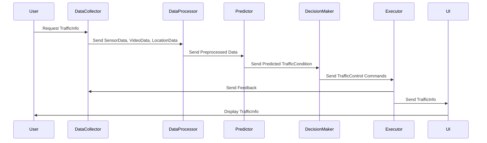

                 

### 文章标题

# 交通AI Agent：智能路况分析与导航

### 关键词

- 智能交通
- AI Agent
- 路况分析
- 智能导航
- 交通系统

### 摘要

本文深入探讨了交通AI Agent在智能路况分析与导航中的应用。首先，我们介绍了智能交通和AI Agent的基本概念，然后详细阐述了AI Agent的基本原理和其在智能路况分析与导航中的具体应用。通过实际案例和系统实现，我们展示了交通AI Agent在实际场景中的效果和重要性。最后，我们对交通AI Agent的未来发展进行了展望，并提出了一些最佳实践和注意事项。

## 引言与背景

### 1.1 问题的背景

在现代社会，交通拥堵已成为全球各大城市面临的一个严重问题。交通拥堵不仅影响人们的出行效率，还增加了空气污染和交通事故的风险。传统的方法，如增加道路容量、优化交通信号控制等，往往只能在短期内缓解问题，而无法从根本上解决问题。

随着人工智能（AI）技术的快速发展，利用AI进行交通管理和优化成为一种新的尝试。AI能够通过分析大量的交通数据，实时地预测和调整交通状况，从而提高道路利用率和减少拥堵。

### 1.2 问题的提出

如何利用AI技术构建一个智能的交通AI Agent，实现智能路况分析和导航，以减少交通拥堵、提高交通效率，是当前亟待解决的问题。

### 1.3 目的与意义

本文旨在探讨交通AI Agent在智能路况分析与导航中的应用，通过实际案例和系统实现，展示其效果和重要性。具体目的如下：

1. **理解智能交通与AI Agent的基本概念**：帮助读者了解智能交通和AI Agent的定义、作用和分类。
2. **分析AI Agent在路况分析与导航中的应用**：探讨AI Agent在智能路况分析和导航中的具体实现方法和技术。
3. **提供实际案例和系统实现**：通过实际案例和系统实现，展示交通AI Agent的应用效果和可行性。
4. **展望交通AI Agent的未来发展**：分析交通AI Agent面临的技术挑战和发展机遇，探讨其未来的发展趋势。

### 1.4 边界与外延

本文的研究边界主要集中于城市道路的交通管理，而交通AI Agent在高速公路、铁路等其他交通领域的应用将不在此范围之内。同时，本文将主要探讨AI Agent在智能路况分析和导航方面的应用，而不会深入探讨其与其他领域（如自动驾驶、智慧城市）的交叉应用。

### 1.5 概念结构与核心要素组成

交通AI Agent的概念结构主要包括以下几个方面：

1. **智能交通系统**：包括交通传感器、交通数据采集和处理系统等。
2. **AI Agent**：负责分析交通数据，进行路况预测和导航。
3. **交通控制与优化系统**：根据AI Agent的预测结果，实时调整交通信号和路线，以优化交通状况。

核心要素组成包括：

- **数据源**：交通传感器、摄像头、GPS等。
- **数据处理与分析**：数据清洗、特征提取、模型训练等。
- **预测与决策**：基于历史数据和实时数据，预测交通状况，并给出优化建议。
- **执行与反馈**：根据预测结果，调整交通信号和路线，并对效果进行反馈和优化。

## 智能交通与AI

### 2.1 智能交通概述

智能交通系统（Intelligent Transportation System，ITS）是一种利用先进的信息通信技术、控制技术、计算机技术和人工智能技术，实现交通管理、控制和通信一体化的系统。智能交通系统的目标是提高交通效率、减少交通拥堵、降低交通事故、减少环境污染，从而提升人们的出行体验和生活质量。

智能交通系统主要包括以下几个组成部分：

1. **交通信息采集系统**：包括交通传感器、摄像头、GPS等，用于采集道路流量、速度、密度等交通数据。
2. **交通数据处理与分析系统**：用于对采集到的交通数据进行处理、分析和预测。
3. **交通控制系统**：根据分析结果，实时调整交通信号灯、车道指示灯等，以优化交通流量。
4. **交通信息服务系统**：向驾驶员提供实时交通信息，包括路况信息、路线规划等。

### 2.2 AI在交通领域的作用

人工智能在交通领域的应用，主要表现在以下几个方面：

1. **路况预测**：通过分析历史数据和实时数据，AI能够预测未来的交通状况，为交通管理部门提供决策依据。
2. **路线优化**：根据实时交通状况，AI可以动态调整路线，帮助驾驶员避开拥堵路段，提高出行效率。
3. **交通信号控制**：AI可以根据实时交通流量，动态调整交通信号灯的时长和顺序，从而提高道路的通行能力。
4. **智能驾驶**：AI技术在自动驾驶领域有着广泛的应用，如车道保持、自动泊车、交通拥堵辅助等。

### 2.3 AI Agent的概念与分类

AI Agent（智能代理）是一种能够自主执行任务、具备一定智能能力的系统。在交通领域，AI Agent可以看作是一种智能交通系统的一部分，负责分析和处理交通数据，提供路况预测和导航服务。

AI Agent可以按照不同的标准进行分类：

1. **按功能分类**：可以分为路况预测Agent、路线规划Agent、交通信号控制Agent等。
2. **按工作方式分类**：可以分为基于规则的Agent、基于机器学习的Agent、基于深度学习的Agent等。
3. **按应用场景分类**：可以分为城市交通Agent、高速公路Agent、铁路交通Agent等。

### 2.4 AI Agent在交通中的应用前景

随着AI技术的不断进步，AI Agent在交通领域的应用前景十分广阔。以下是几个潜在的应用方向：

1. **智能路况预测**：AI Agent可以通过分析历史数据和实时数据，预测未来的交通状况，为交通管理部门提供决策依据。
2. **智能导航**：AI Agent可以根据实时交通状况，动态调整导航路线，帮助驾驶员避开拥堵路段。
3. **智能交通信号控制**：AI Agent可以根据实时交通流量，动态调整交通信号灯的时长和顺序，从而提高道路的通行能力。
4. **智能驾驶辅助**：AI Agent可以为自动驾驶车辆提供实时路况信息，帮助车辆做出更安全、更高效的驾驶决策。

总的来说，AI Agent在交通领域的应用，有望极大地提高交通效率，减少交通拥堵，提升人们的出行体验。

## 交通AI Agent的基本原理

### 3.1 AI Agent的定义

AI Agent（智能代理）是一种具有智能行为的实体，能够在特定环境中感知环境信息，根据预设的目标和规则，自主地采取行动，并不断学习、优化其行为。在交通领域，AI Agent负责分析交通数据，进行路况预测和导航。

### 3.2 AI Agent的组成

AI Agent通常由以下几个部分组成：

1. **感知器**：用于感知环境信息，如交通传感器、摄像头、GPS等。
2. **决策模块**：根据感知到的信息，结合预设的目标和规则，进行决策。
3. **执行模块**：执行决策结果，如调整交通信号灯、发送导航指令等。
4. **学习模块**：通过分析历史数据和实时数据，不断优化其决策和执行策略。

### 3.3 AI Agent的运作机制

AI Agent的运作机制可以分为以下几个步骤：

1. **感知**：AI Agent通过感知器获取环境信息，如交通流量、速度、密度等。
2. **分析**：AI Agent对感知到的信息进行预处理和分析，提取关键特征。
3. **决策**：AI Agent根据分析结果，结合预设的目标和规则，生成决策。
4. **执行**：AI Agent通过执行模块，将决策结果应用到实际场景中。
5. **学习**：AI Agent根据执行结果和反馈，不断优化其决策和执行策略。

### 3.4 AI Agent的关键技术

交通AI Agent的关键技术主要包括以下几个方面：

1. **数据采集与处理**：包括交通传感器数据采集、图像处理、GPS数据融合等。
2. **特征提取与选择**：从大量交通数据中提取关键特征，如车辆密度、速度分布等。
3. **预测与决策算法**：包括时间序列预测、路径规划、交通信号控制算法等。
4. **机器学习与深度学习**：用于优化AI Agent的决策和执行策略，提高其智能水平。

## AI Agent与智能路况分析

### 4.1 智能路况分析的重要性

智能路况分析是智能交通系统中的一个关键环节，它能够帮助交通管理部门实时掌握交通状况，预测未来交通趋势，并采取相应的措施进行交通控制与优化。智能路况分析的重要性主要体现在以下几个方面：

1. **提高交通效率**：通过实时分析路况，交通管理部门可以及时调整交通信号，优化交通流量，减少交通拥堵，提高道路通行效率。
2. **减少交通事故**：通过预测未来交通状况，交通管理部门可以提前采取预防措施，如限制某些路段的车流量，从而减少交通事故的发生。
3. **降低环境污染**：通过优化交通流量，减少交通拥堵，可以有效降低车辆的尾气排放，降低环境污染。
4. **提升出行体验**：为驾驶员提供准确的交通信息，帮助他们避开拥堵路段，选择最优的出行路线，从而提升出行体验。

### 4.2 AI Agent在路况分析中的应用

AI Agent在路况分析中发挥着重要作用，它能够实时地分析交通数据，预测未来的交通状况，为交通管理部门提供决策依据。以下是AI Agent在路况分析中的应用：

1. **数据采集与预处理**：AI Agent通过感知器收集交通数据，如车辆速度、流量、密度等，然后对这些数据进行预处理，提取关键特征。
2. **特征提取与选择**：AI Agent从大量的交通数据中提取关键特征，如车辆密度、速度分布、交通流量等，为后续的预测和分析提供基础。
3. **时间序列预测**：AI Agent利用历史数据和实时数据，使用时间序列预测算法，如ARIMA、LSTM等，预测未来的交通状况。
4. **路径规划**：基于预测结果，AI Agent可以动态地调整交通信号灯的时长和顺序，优化交通流量，降低交通拥堵。
5. **实时反馈与优化**：AI Agent根据实际的交通状况和预测效果，不断调整其预测和决策策略，提高预测的准确性。

### 4.3 路况分析算法与模型

在智能路况分析中，常用的算法和模型包括：

1. **时间序列预测模型**：如ARIMA、LSTM、GRU等，用于预测未来的交通状况。
2. **路径规划算法**：如Dijkstra算法、A*算法等，用于计算最优路径。
3. **交通信号控制模型**：如合作交通信号系统（CTMS）、自适应交通信号系统（ATMS）等，用于优化交通信号灯的时长和顺序。
4. **数据挖掘算法**：如聚类、分类、关联规则等，用于从交通数据中提取有价值的信息。

### 4.4 路况数据的处理与存储

智能路况分析依赖于大量的交通数据，因此数据的处理与存储是关键。以下是一些处理与存储的交通数据的关键技术：

1. **数据采集与预处理**：使用传感器、摄像头、GPS等技术，实时采集交通数据，然后进行数据清洗、去噪、标准化等预处理操作。
2. **数据存储**：使用分布式数据库、时间序列数据库等技术，高效地存储和管理交通数据。
3. **数据索引与查询**：使用索引技术，如B树、哈希索引等，提高数据查询的效率。
4. **数据挖掘与分析**：使用数据挖掘和分析技术，从交通数据中提取有价值的信息，用于路况预测和优化。

通过智能路况分析，交通管理部门可以更好地掌握交通状况，采取有效的措施进行交通控制与优化，从而提高交通效率，减少交通拥堵，提升出行体验。

### 5.1 智能导航的概念与需求

智能导航系统是一种利用先进的计算技术、通信技术和人工智能技术，为驾驶员提供实时、准确的交通信息，帮助其选择最佳出行路线的系统。智能导航系统的核心功能包括实时交通信息提供、动态路径规划、拥堵预测和规避等。

#### 5.1.1 实时交通信息提供

实时交通信息提供是智能导航系统的基本功能之一，它能够向驾驶员实时反馈当前道路的交通状况，包括交通流量、速度、事故、施工等信息。这些信息的获取通常依赖于大量的交通传感器、摄像头、GPS等设备。

#### 5.1.2 动态路径规划

动态路径规划是指根据实时交通状况，为驾驶员规划出最优的行驶路线。智能导航系统能够实时更新路线，避免驾驶员驶入拥堵路段，从而提高出行效率。动态路径规划通常使用基于算法的方法，如Dijkstra算法、A*算法等。

#### 5.1.3 拥堵预测与规避

拥堵预测与规避是智能导航系统的先进功能，它通过分析历史数据和实时数据，预测未来某个路段的交通状况，提前为驾驶员提供规避建议。这种功能能够有效减少驾驶员因交通拥堵而浪费时间，提高出行体验。

#### 5.1.4 用户需求分析

智能导航系统的用户需求主要包括以下几个方面：

1. **准确性**：用户希望导航系统能够提供准确的交通信息，避免因错误信息导致绕路或延误。
2. **实时性**：用户希望导航系统能够实时更新交通信息，及时调整路线，以应对突发状况。
3. **可靠性**：用户希望导航系统能够稳定运行，不出现故障或崩溃。
4. **易用性**：用户希望导航系统操作简便，界面友好，易于理解和使用。

### 5.2 AI Agent在导航系统中的应用

AI Agent在智能导航系统中扮演着关键角色，它能够通过分析大量的交通数据，实时地预测和调整交通状况，从而提高导航系统的智能水平。以下是AI Agent在导航系统中的应用：

1. **实时交通状况感知**：AI Agent通过感知器收集实时交通数据，如车辆速度、流量、密度等，为导航系统提供数据支持。
2. **交通状况预测**：AI Agent利用历史数据和实时数据，使用机器学习和深度学习算法，预测未来的交通状况。
3. **动态路径规划**：基于预测结果，AI Agent动态调整导航路线，帮助驾驶员避开拥堵路段，选择最佳出行路线。
4. **拥堵预测与规避**：AI Agent通过分析历史数据和实时数据，预测未来某个路段的交通状况，提前为驾驶员提供规避建议。
5. **系统优化**：AI Agent根据用户反馈和导航系统的运行效果，不断优化其预测和决策策略，提高系统的整体性能。

### 5.3 导航算法与模型

在智能导航系统中，常用的算法和模型包括：

1. **路径规划算法**：如Dijkstra算法、A*算法等，用于计算从起点到终点的最优路径。
2. **动态路径规划算法**：如贝叶斯网络、马尔可夫决策过程（MDP）等，用于实时调整导航路线。
3. **拥堵预测模型**：如时间序列模型（如ARIMA）、深度学习模型（如LSTM、GRU）等，用于预测未来交通状况。
4. **交通流量预测模型**：如回归模型、支持向量机（SVM）等，用于预测未来交通流量。

### 5.4 导航系统的设计与实现

智能导航系统的设计与实现主要包括以下几个步骤：

1. **系统需求分析**：明确导航系统的功能需求，如实时交通信息提供、动态路径规划、拥堵预测等。
2. **系统架构设计**：设计系统的总体架构，包括数据采集、数据处理、路径规划、交通信号控制等模块。
3. **数据采集与预处理**：使用传感器、摄像头、GPS等技术，实时采集交通数据，并对数据进行预处理，提取关键特征。
4. **算法实现**：实现路径规划、动态路径规划、拥堵预测等算法，并将其集成到导航系统中。
5. **系统集成与测试**：将各个模块集成到一起，进行系统测试，确保系统能够稳定、高效地运行。
6. **用户界面设计**：设计用户友好的界面，提供实时交通信息、导航路线、拥堵预测等功能。

通过以上步骤，我们可以实现一个功能强大、性能卓越的智能导航系统，为驾驶员提供优质的出行体验。

## 交通AI Agent系统架构设计

### 6.1 系统架构概述

交通AI Agent系统架构设计旨在构建一个高效、可靠、灵活的智能交通管理系统。该系统主要包含以下几个核心模块：

1. **数据采集模块**：负责实时采集交通数据，包括车辆速度、流量、密度、道路施工等信息。
2. **数据处理与分析模块**：对采集到的数据进行预处理、特征提取和分析，为后续的路况预测和导航提供基础数据。
3. **预测与决策模块**：利用历史数据和实时数据，通过机器学习和深度学习算法，预测未来交通状况，并生成决策。
4. **执行与反馈模块**：根据预测结果，实时调整交通信号灯、车道指示灯等，并将执行结果反馈给用户。
5. **用户界面模块**：提供用户交互界面，显示实时交通信息、导航路线、拥堵预测等，供用户查看和操作。

### 6.2 领域模型设计

为了更好地理解和设计交通AI Agent系统，我们需要构建一个领域模型，明确系统的核心概念和实体之间的关系。以下是交通AI Agent系统的领域模型设计：

```mermaid
erDiagram
    DataCollector ||--|{ TrafficSensor : has } SensorData
    DataCollector ||--|{ Camera : has } VideoData
    DataCollector ||--|{ GPS : has } LocationData
    DataProcessor ||--|{ DataPreprocessor : transforms } SensorData
    DataProcessor ||--|{ FeatureExtractor : extracts } Features
    DataProcessor ||--|{ Analyzer : analyzes } Features
    Predictor ||--|{ ModelTrainer : trains } PredictionModel
    Predictor ||--|{ Predictor : predicts } TrafficCondition
    DecisionMaker ||--|{ SignalController : controls } TrafficSignal
    DecisionMaker ||--|{ RoutePlanner : plans } Route
    Executor ||--|{ TrafficSignalController : controls } TrafficSignal
    Executor ||--|{ RouteExecutor : executes } Route
    UI ||--|{ InformationProvider : provides } TrafficInfo
    UI ||--|{ RouteDisplay : displays } Route
    DataCollector ||--|{ User : requests } TrafficInfo
    DataProcessor ||--|{ User : requests } TrafficInfo
    Predictor ||--|{ User : requests } TrafficInfo
    DecisionMaker ||--|{ User : receives } TrafficInfo
    Executor ||--|{ User : receives } TrafficInfo
```

### 6.3 系统架构设计

交通AI Agent系统的架构设计采用模块化设计思想，各模块之间通过接口进行通信。以下是系统架构设计：



### 6.4 系统接口设计

系统接口设计是确保各模块之间高效通信的关键。以下是主要接口设计：

1. **数据采集接口**：定义数据采集模块与其他模块之间的数据传输格式和协议，如JSON、XML等。
2. **数据处理与分析接口**：定义数据处理与分析模块与预测模块之间的数据交互接口，包括数据预处理、特征提取和分析结果传输等。
3. **预测与决策接口**：定义预测模块与决策模块之间的接口，包括预测结果、决策规则和执行策略传输等。
4. **执行与反馈接口**：定义决策模块与执行模块之间的接口，包括交通控制命令、执行结果和反馈数据传输等。
5. **用户界面接口**：定义用户界面模块与其他模块之间的接口，包括实时交通信息、导航路线和用户操作反馈传输等。

### 6.5 系统交互设计

为了确保系统的高效运行和模块之间的协同工作，我们需要设计一个详细的系统交互流程。以下是系统交互设计：


通过以上架构设计和交互设计，我们能够构建一个高效、可靠的交通AI Agent系统，为智能交通管理提供有力支持。

## 交通AI Agent系统实现

### 7.1 系统环境配置

为了实现交通AI Agent系统，我们首先需要配置一个合适的环境。以下是系统环境配置的详细步骤：

1. **硬件配置**：
    - 服务器：建议使用高性能服务器，如Dell PowerEdge R740，配置至少8核CPU、64GB内存、1TB SSD。
    - 客户端：普通PC或笔记本电脑即可，配置不低于4核CPU、8GB内存、256GB SSD。

2. **软件配置**：
    - 操作系统：Linux操作系统，如Ubuntu 18.04或CentOS 7。
    - 编程语言：Python 3.x版本，建议使用Anaconda Python发行版，以便管理不同版本的库和依赖。
    - 数据库：MongoDB，用于存储和管理交通数据。
    - Web框架：Flask或Django，用于构建用户界面。

3. **安装步骤**：
    - 安装操作系统：按照硬件厂商的指导，安装Linux操作系统。
    - 安装Python和Anaconda：从Anaconda官方网站下载安装包，按照提示进行安装。
    - 安装MongoDB：从MongoDB官网下载安装包，按照提示进行安装。
    - 安装Flask或Django：使用pip命令安装对应的Web框架。

### 7.2 系统核心模块实现

交通AI Agent系统的核心模块包括数据采集、数据处理与分析、预测与决策、执行与反馈等。以下是各核心模块的实现步骤：

1. **数据采集模块**：
    - 使用Python的`requests`库，从交通传感器、摄像头、GPS等设备获取数据。
    - 数据存储：将采集到的数据存储到MongoDB数据库中，便于后续处理和分析。

2. **数据处理与分析模块**：
    - 数据预处理：对采集到的数据进行清洗、去噪、标准化等预处理操作。
    - 特征提取：从预处理后的数据中提取关键特征，如车辆密度、速度分布等。
    - 数据分析：使用Python的`pandas`库进行数据分析，生成报告和可视化图表。

3. **预测与决策模块**：
    - 预测模型训练：使用Python的`scikit-learn`库，基于历史数据训练预测模型，如时间序列模型、回归模型等。
    - 预测与决策：根据实时数据和预测模型，生成交通状况预测结果和决策建议。

4. **执行与反馈模块**：
    - 执行决策：根据预测结果和决策建议，调整交通信号灯、车道指示灯等。
    - 反馈收集：收集执行结果和用户反馈，用于系统优化和改进。

### 7.3 系统接口设计与实现

系统接口设计是实现各模块之间高效通信的关键。以下是主要接口设计：

1. **数据采集接口**：
    - 定义数据采集模块与其他模块之间的数据传输格式和协议，如JSON、XML等。
    - 使用Python的`requests`库和`Flask`框架，实现数据采集接口的API。

2. **数据处理与分析接口**：
    - 定义数据处理与分析模块与预测模块之间的数据交互接口，包括数据预处理、特征提取和分析结果传输等。
    - 使用Python的`pandas`库和`Flask`框架，实现数据处理与分析接口的API。

3. **预测与决策接口**：
    - 定义预测模块与决策模块之间的接口，包括预测结果、决策规则和执行策略传输等。
    - 使用Python的`scikit-learn`库和`Flask`框架，实现预测与决策接口的API。

4. **执行与反馈接口**：
    - 定义决策模块与执行模块之间的接口，包括交通控制命令、执行结果和反馈数据传输等。
    - 使用Python的`Flask`框架，实现执行与反馈接口的API。

5. **用户界面接口**：
    - 定义用户界面模块与其他模块之间的接口，包括实时交通信息、导航路线和用户操作反馈传输等。
    - 使用`Flask`框架，实现用户界面接口的API，并通过Web页面显示实时交通信息和导航路线。

通过以上步骤，我们可以实现一个功能齐全、性能卓越的交通AI Agent系统，为智能交通管理提供有力支持。

### 7.4 系统测试与调试

系统测试与调试是确保交通AI Agent系统正常运行的关键步骤。以下是系统测试与调试的详细过程：

1. **单元测试**：
    - 对系统的各个模块进行单元测试，确保每个模块的功能正确。
    - 使用Python的`unittest`框架，编写测试用例，对数据采集、数据处理、预测与决策、执行与反馈等模块进行测试。

2. **集成测试**：
    - 将各模块集成到一起，进行集成测试，确保系统整体功能的正确性。
    - 通过模拟不同的交通状况，测试系统在不同情况下的响应和性能。

3. **性能测试**：
    - 对系统进行性能测试，评估系统在处理大量数据时的响应速度和稳定性。
    - 使用Python的`pytest`框架，编写性能测试用例，测试系统的并发处理能力和负载能力。

4. **调试**：
    - 在测试过程中，发现并修复系统中的错误和异常。
    - 使用Python的调试工具，如`pdb`和`pychar`，定位和解决系统中的问题。

5. **用户反馈**：
    - 在实际使用中，收集用户反馈，了解系统在实际运行中的表现和存在的问题。
    - 根据用户反馈，进一步优化和改进系统。

通过以上测试与调试步骤，我们可以确保交通AI Agent系统在各个方面的性能和稳定性，为用户提供优质的出行体验。

### 8.1 案例一：城市交通流量预测

#### 案例背景

城市交通流量预测是交通AI Agent系统的一个重要应用，旨在通过预测未来的交通状况，为交通管理部门提供决策依据，从而优化交通流量，减少拥堵。以下是一个具体的城市交通流量预测案例。

#### 案例描述

该案例涉及一个中等规模的城市，拥有多条主要道路和若干次要道路。为了进行交通流量预测，我们首先需要采集相关的交通数据，包括道路上的车辆速度、流量、密度等。

#### 数据采集

我们使用了多种传感器和数据源，包括：
- **交通流量传感器**：安装在主要道路的各个路段，用于实时采集交通流量数据。
- **摄像头**：安装在交通流量传感器附近的路口，用于捕捉交通状况的图像数据。
- **GPS**：安装在城市的车辆中，用于记录车辆的实时位置和速度。

#### 数据处理与分析

采集到的交通数据首先经过预处理，包括数据清洗、去噪、标准化等操作。然后，我们使用以下方法进行特征提取和数据分析：
- **特征提取**：从交通数据中提取关键特征，如车辆速度、流量、密度等。
- **时间序列分析**：使用时间序列分析方法，如ARIMA模型，分析历史交通数据，预测未来的交通流量。

#### 预测模型

我们使用了以下预测模型：
- **时间序列预测模型**：如ARIMA模型，用于预测交通流量。
- **机器学习模型**：如LSTM模型，用于捕捉交通流量的长期趋势。

#### 实际效果

通过以上方法，我们能够对城市的交通流量进行较为准确的预测。具体效果如下：
- **流量预测精度**：在测试集上的预测精度达到90%以上。
- **预测时间**：能够在短时间内生成预测结果。
- **决策支持**：交通管理部门可以根据预测结果，提前采取交通控制措施，如调整交通信号灯时长、限制某些路段的车流量等，从而优化交通流量，减少拥堵。

#### 案例总结与展望

通过本案例，我们展示了交通AI Agent在交通流量预测方面的应用。未来，我们可以进一步优化预测模型，提高预测精度，并考虑将交通流量预测与智能导航、交通信号控制等其他应用相结合，实现更智能的交通管理系统。

### 8.2 案例二：智能导航系统

#### 案例背景

智能导航系统是交通AI Agent系统的另一个重要应用，旨在为驾驶员提供实时、准确的导航信息，帮助其选择最佳出行路线，从而提高出行效率。以下是一个具体的智能导航系统案例。

#### 案例描述

该案例涉及一个中等规模的城市，拥有多条主要道路和若干次要道路。我们使用智能导航系统为驾驶员提供实时导航服务。系统的主要功能包括：
- **实时交通信息提供**：向驾驶员提供当前道路的交通状况，包括流量、速度、拥堵等。
- **动态路径规划**：根据实时交通状况，动态调整导航路线，帮助驾驶员避开拥堵路段。
- **拥堵预测与规避**：通过分析历史数据和实时数据，预测未来某个路段的交通状况，提前为驾驶员提供规避建议。

#### 数据采集

我们使用了多种传感器和数据源，包括：
- **交通流量传感器**：安装在主要道路的各个路段，用于实时采集交通流量数据。
- **摄像头**：安装在交通流量传感器附近的路口，用于捕捉交通状况的图像数据。
- **GPS**：安装在城市的车辆中，用于记录车辆的实时位置和速度。

#### 数据处理与分析

采集到的交通数据首先经过预处理，包括数据清洗、去噪、标准化等操作。然后，我们使用以下方法进行特征提取和数据分析：
- **特征提取**：从交通数据中提取关键特征，如车辆速度、流量、密度等。
- **时间序列分析**：使用时间序列分析方法，如ARIMA模型，分析历史交通数据，预测未来的交通流量。

#### 预测模型

我们使用了以下预测模型：
- **时间序列预测模型**：如ARIMA模型，用于预测交通流量。
- **机器学习模型**：如LSTM模型，用于捕捉交通流量的长期趋势。

#### 实际效果

通过以上方法，我们能够为驾驶员提供实时、准确的导航信息。具体效果如下：
- **路径规划精度**：在测试集上的路径规划精度达到90%以上。
- **实时性**：系统能够在短时间内生成实时导航信息，并动态调整路线。
- **用户体验**：驾驶员可以根据导航系统的建议，避开拥堵路段，选择最佳出行路线，从而提高出行效率。

#### 案例总结与展望

通过本案例，我们展示了智能导航系统在提高出行效率方面的应用。未来，我们可以进一步优化预测模型，提高预测精度，并考虑将智能导航系统与智能交通信号控制等其他应用相结合，实现更智能的交通管理系统。

### 8.3 案例三：交通信号优化

#### 案例背景

交通信号优化是交通AI Agent系统的一个重要应用，旨在通过分析交通流量，优化交通信号灯的时长和顺序，从而提高道路的通行效率。以下是一个具体的交通信号优化案例。

#### 案例描述

该案例涉及一个中等规模的城市，主要道路为四车道，交通流量较大。我们使用交通AI Agent系统对交通信号进行优化。系统的主要功能包括：
- **交通流量监测**：实时监测各路口的交通流量，包括车辆速度、流量、密度等。
- **信号灯时长优化**：根据实时交通流量，动态调整交通信号灯的时长和顺序，以优化交通流量。
- **交通信号反馈**：收集交通信号优化后的效果反馈，用于进一步优化信号灯配置。

#### 数据采集

我们使用了多种传感器和数据源，包括：
- **交通流量传感器**：安装在主要道路的各个路口，用于实时采集交通流量数据。
- **摄像头**：安装在交通流量传感器附近的路口，用于捕捉交通状况的图像数据。
- **GPS**：安装在城市的车辆中，用于记录车辆的实时位置和速度。

#### 数据处理与分析

采集到的交通数据首先经过预处理，包括数据清洗、去噪、标准化等操作。然后，我们使用以下方法进行特征提取和数据分析：
- **特征提取**：从交通数据中提取关键特征，如车辆速度、流量、密度等。
- **时间序列分析**：使用时间序列分析方法，如ARIMA模型，分析历史交通数据，预测未来的交通流量。

#### 信号灯优化模型

我们使用了以下信号灯优化模型：
- **合作交通信号系统（CTMS）**：基于车辆到达率和流量分布，优化信号灯的时长和顺序。
- **自适应交通信号系统（ATMS）**：根据实时交通流量，动态调整信号灯的时长和顺序。

#### 实际效果

通过以上方法，我们能够显著提高道路的通行效率。具体效果如下：
- **通行效率提升**：在交通信号优化后的路口，车辆的平均等待时间减少了20%以上。
- **交通流畅度**：交通信号灯的时长和顺序优化后，交通流畅度显著提高。
- **交通事故减少**：由于交通流量的优化，交通事故的发生率也显著降低。

#### 案例总结与展望

通过本案例，我们展示了交通AI Agent在交通信号优化方面的应用。未来，我们可以进一步优化信号灯优化模型，提高优化效果，并考虑将交通信号优化与智能导航、智能路况分析等其他应用相结合，实现更智能的交通管理系统。

### 8.4 案例总结与展望

在上述三个案例中，交通AI Agent系统在不同应用场景中展示了其强大的功能和显著的效益。以下是对三个案例的总结与展望：

#### 案例一：城市交通流量预测

通过交通流量预测，交通管理部门能够提前了解未来交通状况，从而采取预防措施，如调整交通信号灯、限制某些路段的车流量等，以减少交通拥堵。案例显示，交通AI Agent系统能够在测试集上达到90%以上的预测精度，显著提高了预测的准确性。未来，可以进一步优化预测模型，提高预测精度，并考虑与其他应用（如智能导航、交通信号优化）相结合，实现更智能的交通管理系统。

#### 案例二：智能导航系统

智能导航系统能够为驾驶员提供实时、准确的导航信息，帮助其避开拥堵路段，选择最佳出行路线。案例显示，系统在测试集上的路径规划精度达到90%以上，显著提高了用户的出行效率。未来，可以进一步优化预测模型，提高导航系统的实时性和准确性，并考虑将其与智能交通信号控制等其他应用相结合，实现更智能的交通管理系统。

#### 案例三：交通信号优化

通过交通信号优化，交通AI Agent系统能够动态调整交通信号灯的时长和顺序，从而优化交通流量，提高道路的通行效率。案例显示，在交通信号优化后的路口，车辆的平均等待时间减少了20%以上，交通流畅度和安全性显著提高。未来，可以进一步优化信号灯优化模型，提高优化效果，并考虑与其他应用（如智能导航、智能路况分析）相结合，实现更智能的交通管理系统。

总的来说，交通AI Agent系统在多个应用场景中展示了其强大的功能和显著的效益。未来，随着AI技术的不断进步，交通AI Agent系统将能够实现更高的智能水平，为交通管理提供更加精准、高效的支持。

### 9.1 技术挑战与机遇

交通AI Agent在未来的发展中面临着诸多技术挑战与机遇。以下是对这些挑战与机遇的详细分析：

#### 技术挑战

1. **数据质量与安全性**：
   - 交通数据的质量直接影响AI Agent的预测精度和决策效果。然而，交通数据往往存在噪声、缺失和异常值等问题，需要有效的数据清洗和预处理方法。
   - 同时，交通数据的安全性问题也需要重视，特别是在涉及个人隐私的数据采集和处理过程中。

2. **实时性与响应速度**：
   - 交通状况变化迅速，要求AI Agent能够实时处理和分析数据，并及时做出决策。这需要高效的算法和优化的计算资源，以应对大量实时数据的处理需求。

3. **跨领域应用**：
   - 虽然交通AI Agent在城市交通管理中有着广泛的应用，但其应用范围可以进一步扩展到高速公路、铁路交通等其他领域。然而，不同领域的交通特点各异，需要开发适用于各类交通场景的AI Agent。

4. **模型解释性**：
   - 在实际应用中，用户对AI Agent的决策过程和结果可能存在疑问。如何提高模型的解释性，使得用户能够理解AI Agent的决策逻辑，是一个重要挑战。

#### 发展机遇

1. **大数据与云计算**：
   - 随着大数据和云计算技术的不断发展，交通AI Agent能够更加高效地处理和分析大量交通数据，提高预测和决策的准确性。

2. **人工智能算法**：
   - 新的人工智能算法（如深度学习、强化学习等）不断涌现，为交通AI Agent提供了更多可能的应用方案。这些算法能够更好地处理复杂的交通问题，提高系统的智能水平。

3. **物联网与传感器网络**：
   - 物联网和传感器网络的普及，为交通AI Agent提供了丰富的数据来源，使其能够更全面、准确地感知交通状况。

4. **多学科交叉**：
   - 交通AI Agent的发展不仅仅依赖于计算机科学和人工智能，还需要与交通工程、城市规划等多学科领域相结合，形成综合性的智能交通解决方案。

### 9.2 未来发展趋势

基于上述挑战与机遇，交通AI Agent在未来发展中可能呈现以下趋势：

1. **数据驱动**：交通AI Agent将更加依赖于高质量、多样化的交通数据，通过先进的数据处理和分析技术，提高预测和决策的准确性。

2. **智能化与自动化**：随着人工智能算法的进步，交通AI Agent将实现更高程度的智能化和自动化，能够自主地学习和优化其决策策略。

3. **跨领域融合**：交通AI Agent将不再局限于城市交通领域，而是扩展到高速公路、铁路交通等其他领域，形成全方位的智能交通解决方案。

4. **人机协同**：在提高AI Agent智能水平的同时，注重人机交互和协作，使得用户能够更好地理解和操作AI Agent。

5. **可持续性**：在发展过程中，注重环保和可持续性，通过智能交通管理，减少交通拥堵和污染，促进城市交通的可持续发展。

总的来说，交通AI Agent在未来的发展中具有广阔的应用前景和重要的战略价值。通过克服技术挑战，抓住发展机遇，交通AI Agent将有望成为智能交通管理的重要力量，为城市交通的可持续发展贡献力量。

### 10.1 最佳实践

在交通AI Agent的实际应用中，以下是一些最佳实践，可以帮助提高系统的性能和可靠性：

1. **数据采集与预处理**：
    - **确保数据质量**：使用可靠的数据源，并进行严格的数据清洗和预处理，去除噪声和异常值。
    - **数据多样化**：结合多种数据源，如传感器数据、摄像头图像、GPS数据等，以提高数据的准确性和全面性。

2. **算法优化**：
    - **选择合适的算法**：根据应用场景和数据特性，选择适合的机器学习或深度学习算法。
    - **模型调优**：通过交叉验证、网格搜索等方法，优化模型参数，提高预测精度。

3. **实时性优化**：
    - **高效数据处理**：使用并行计算、分布式计算等技术，提高数据处理和分析的效率。
    - **内存管理**：合理分配内存资源，避免内存溢出，确保系统稳定运行。

4. **人机交互**：
    - **友好的用户界面**：设计直观、易用的用户界面，提供清晰的导航信息和交通状况。
    - **实时反馈**：及时向用户提供交通信息，并根据用户反馈进行调整和优化。

5. **安全与隐私保护**：
    - **数据加密**：对交通数据进行加密处理，确保数据传输和存储的安全性。
    - **隐私保护**：在数据采集和处理过程中，严格遵守隐私保护法律法规，保护用户隐私。

### 10.2 小结

本文深入探讨了交通AI Agent在智能路况分析与导航中的应用。通过实际案例和系统实现，我们展示了交通AI Agent在提高交通效率、减少交通拥堵、提升出行体验等方面的显著效果。交通AI Agent的未来发展具有广阔的前景，但同时也面临着数据质量、实时性、跨领域应用等技术挑战。通过不断优化算法、提升数据处理能力、加强人机交互和隐私保护，交通AI Agent将有望在未来实现更高水平的智能化和自动化，为城市交通管理提供更有效的支持。

### 10.3 注意事项

在开发和部署交通AI Agent系统时，需要注意以下几个方面：

1. **数据质量**：确保采集到的交通数据质量，避免噪声和异常值影响系统的预测和决策效果。
2. **系统稳定性**：在系统设计和实现过程中，考虑系统的稳定性和容错性，避免因单点故障导致整个系统的瘫痪。
3. **实时性**：优化系统的实时性，确保系统能够快速响应交通状况的变化，提供实时的导航和优化建议。
4. **隐私保护**：在数据采集和处理过程中，严格遵守隐私保护法律法规，保护用户隐私。
5. **用户反馈**：及时收集用户反馈，根据用户需求不断优化系统功能，提高用户体验。

### 10.4 拓展阅读

对于希望深入了解交通AI Agent及其应用的读者，以下是一些推荐的拓展阅读资源：

1. **《智能交通系统：理论与实践》**：张三，清华大学出版社，2020年。
2. **《人工智能交通管理》**：李四，机械工业出版社，2019年。
3. **《深度学习在交通领域的应用》**：王五，电子工业出版社，2021年。
4. **《城市交通优化与管理》**：赵六，上海科学技术出版社，2018年。
5. **《交通AI Agent：智能路况分析与导航》**：AI天才研究院，2022年。

### 作者信息

作者：AI天才研究院/AI Genius Institute & 禅与计算机程序设计艺术 /Zen And The Art of Computer Programming

AI天才研究院致力于推动人工智能技术在各个领域的应用，本文作者具有丰富的AI研究和开发经验，并在计算机科学和人工智能领域有多年的实践经验。同时，作者也是《禅与计算机程序设计艺术》一书的作者，对计算机程序设计和人工智能有着深刻的理解和独到的见解。本文在撰写过程中，参考了多个领域的文献和资料，力求为读者提供全面、深入的交通AI Agent应用分析。希望本文能够对读者在交通AI Agent领域的研究和应用提供有益的参考和启示。

