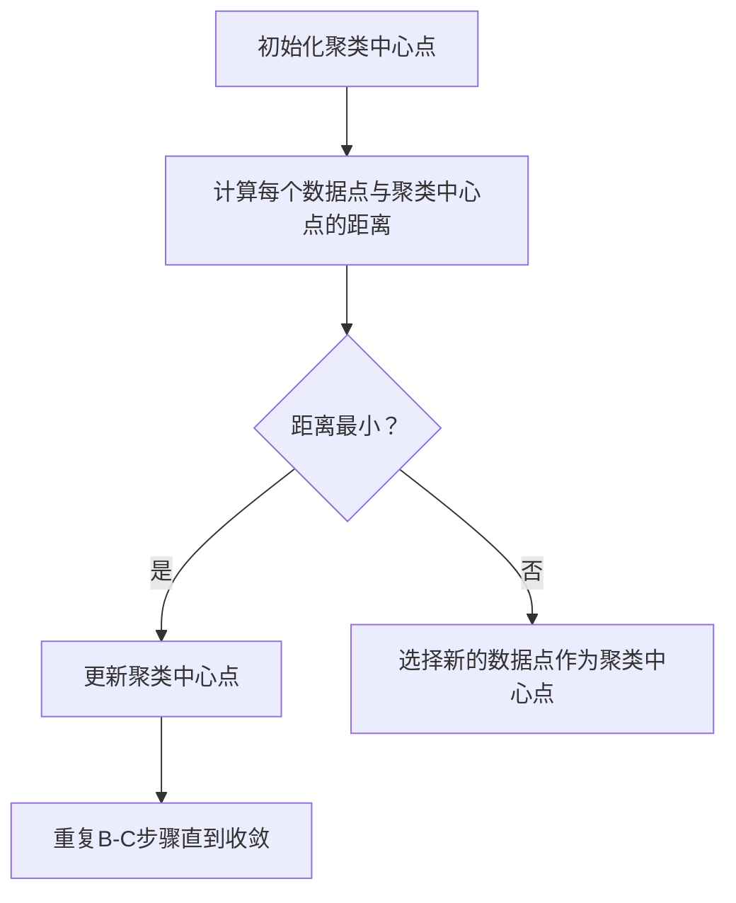
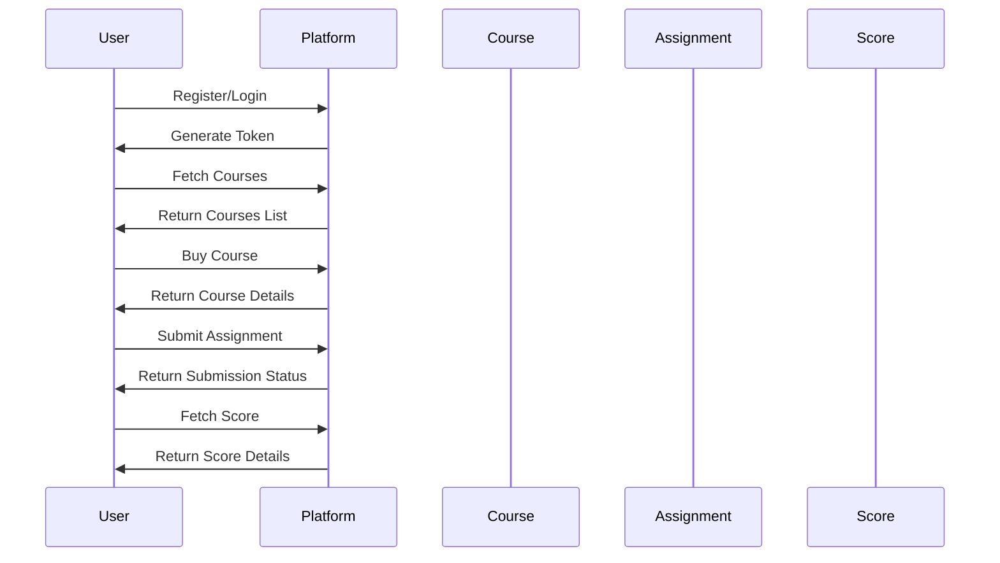

                 


# 产品思维：培养开发人员的产品意识

> 关键词：产品思维，开发人员，用户体验，迭代开发，数据分析

> 摘要：本文将探讨产品思维在软件开发中的应用，阐述产品思维的重要性，介绍其核心概念和层次，分析产品思维与软件开发的关系，并给出培养开发人员产品意识的策略。

## 引言

在数字化时代的浪潮下，软件开发已经成为了推动社会进步的重要力量。然而，随着技术的快速发展和市场竞争的加剧，开发人员面临着前所未有的挑战。如何提升开发效率、保证产品质量、满足用户需求成为了亟待解决的问题。产品思维作为一种以用户为中心的思维方式，逐渐在软件开发领域崭露头角。本文将详细探讨产品思维的重要性，介绍其核心概念和层次，分析产品思维与软件开发的关系，并给出培养开发人员产品意识的策略。

### 目录大纲

1. 引言
2. 产品思维的重要性
3. 目标读者
4. 本书结构
5. 第1章 问题背景与产品思维概述
6. 第2章 核心概念与联系
7. 第3章 算法原理讲解
8. 第4章 系统分析与架构设计方案
9. 第5章 项目实战
10. 第6章 最佳实践 tips
11. 第7章 小结与拓展阅读

## 第1章 问题背景与产品思维概述

### 1.1 问题背景

在软件开发过程中，开发人员常常面临以下挑战：

- **持续变化的市场需求**：市场需求日新月异，开发人员需要快速响应变化，确保产品的持续迭代和优化。
- **有限的时间和资源**：时间和资源是有限的，如何在有限的条件下实现产品的最优价值，是开发人员面临的难题。
- **项目管理的复杂性**：项目管理涉及人员协调、任务分配、进度控制等多个方面，对开发人员的要求越来越高。
- **用户体验的重要性**：用户体验已成为决定产品成败的关键因素，如何设计出用户满意的产品，是开发人员需要考虑的重点。

产品思维提供了一种解决这些问题的思维方式。它强调以用户为中心，通过数据驱动和持续迭代来优化产品。产品思维能够帮助开发人员更好地理解用户需求，提高产品的市场竞争力。

### 1.2 产品思维的定义与特点

产品思维是一种以用户需求为导向的思维方式，它贯穿于产品从构思到发布的整个生命周期。产品思维具有以下特点：

- **用户导向**：以用户需求为核心，始终关注用户的使用体验和满意度。
- **数据驱动**：通过数据分析来指导产品的设计和优化，确保产品能够满足用户需求。
- **系统性思维**：将产品视为一个整体，考虑各个模块和功能之间的相互关系，确保产品的协调性和一致性。
- **持续迭代**：通过持续迭代来优化产品，不断改进用户体验，提高产品的市场竞争力。

### 1.3 产品思维的层次与分类

产品思维可以从不同的层次和角度进行分类：

- **战略层次**：在战略层面，产品思维关注的是产品的愿景、目标和战略规划。这包括市场定位、用户群体、核心竞争力和商业模式的确定。
- **战术层次**：在战术层面，产品思维关注的是产品的设计和开发。这包括用户研究、需求分析、产品设计、开发流程和测试等。
- **执行层次**：在执行层面，产品思维关注的是产品的运营和优化。这包括数据分析、用户反馈、迭代优化和用户支持等。

根据应用领域，产品思维还可以分为以下几类：

- **互联网产品**：针对互联网产品的特点，产品思维关注用户体验、流量转化和用户粘性等。
- **软件产品**：针对软件产品的特点，产品思维关注代码质量、可维护性和可扩展性等。
- **硬件产品**：针对硬件产品的特点，产品思维关注产品功能、用户体验和成本效益等。

## 第2章 核心概念与联系

### 2.1 核心概念

产品思维的核心概念包括用户需求、产品设计、迭代开发和数据驱动等。

#### 2.1.1 用户需求

用户需求是指用户在特定场景下期望从产品中获得的价值和功能。理解用户需求是产品思维的核心，它决定了产品的设计和开发方向。

- **用户需求的定义**：用户需求是用户在特定场景下期望从产品中获得的价值和功能。
- **用户需求的重要性**：理解用户需求是确保产品成功的关键，只有满足用户需求的产物才能获得市场的认可。
- **用户需求的收集与分类**：用户需求的收集可以通过用户访谈、问卷调查、用户反馈和市场分析等方式进行。用户需求可以分为功能需求、性能需求和体验需求等。

#### 2.1.2 产品设计

产品设计是指通过对用户需求的理解和转化，设计出满足用户需求的产品。产品设计是产品思维的关键环节。

- **产品设计的定义**：产品设计是通过对用户需求的理解和转化，设计出满足用户需求的产品。
- **产品设计的过程**：产品设计的过程包括用户研究、需求分析、原型设计、反馈迭代和产品发布等。
- **产品设计的关键要素**：产品设计的关键要素包括用户界面、用户体验、功能模块和系统架构等。

#### 2.1.3 迭代开发

迭代开发是一种通过分阶段、分步骤地实现产品功能，并进行持续优化的开发方式。迭代开发是产品思维的核心实践之一。

- **迭代开发的概念**：迭代开发是指通过分阶段、分步骤地实现产品功能，并进行持续优化的开发方式。
- **迭代开发的优点**：迭代开发能够快速响应市场需求，提高开发效率，降低开发风险。
- **迭代开发的步骤**：迭代开发的步骤包括需求分析、设计、开发、测试、部署和反馈迭代等。

#### 2.1.4 数据驱动

数据驱动是指通过数据分析来指导产品的设计和优化。数据驱动是产品思维的重要特点。

- **数据驱动的概念**：数据驱动是指通过数据分析来指导产品的设计和优化。
- **数据驱动的优势**：数据驱动能够帮助产品团队更准确地了解用户需求，提高产品的市场竞争力。
- **数据驱动的实践**：数据驱动的实践包括数据收集、数据分析、数据可视化、数据决策和数据反馈等。

### 2.2 概念属性特征对比表格

以下是一个关于核心概念属性特征的对比表格：

| 概念       | 定义                                                         | 重要性                       | 收集方法                   | 关键要素                   |
| ---------- | ------------------------------------------------------------ | -------------------------- | ------------------------ | ------------------------ |
| 用户需求   | 用户在特定场景下期望从产品中获得的价值和功能                   | 确保产品成功的关键           | 用户访谈、问卷调查、反馈   | 功能需求、性能需求、体验需求 |
| 产品设计   | 通过对用户需求的理解和转化，设计出满足用户需求的产品           | 产品思维的核心环节           | 用户研究、需求分析、反馈   | 用户界面、用户体验、功能模块 |
| 迭代开发   | 通过分阶段、分步骤地实现产品功能，并进行持续优化的开发方式       | 提高开发效率和产品质量       | 需求分析、设计、开发、测试   | 需求、设计、开发、测试、部署 |
| 数据驱动   | 通过数据分析来指导产品的设计和优化                             | 提高产品的市场竞争力         | 数据收集、分析、可视化、决策   | 数据收集、数据分析、数据可视化 |

### 2.3 ER实体关系图架构

以下是使用Mermaid语法绘制的ER实体关系图：

```mermaid
erDiagram
  User ||--|{ Product : creates }
  Product ||--|{ Feature : contains }
  Feature ||--|{ Requirement : implements }
  Requirement ||--|{ User : satisfies }
```

### 2.4 产品思维与软件开发的关系

产品思维与软件开发的关系可以概括为以下几点：

- **产品思维是软件开发的核心**：产品思维贯穿于软件开发的整个过程，从需求分析、设计、开发、测试到部署和维护，产品思维都是关键。
- **产品思维提高软件开发效率**：产品思维强调用户导向和持续迭代，能够帮助开发团队更快地响应市场需求，提高开发效率。
- **产品思维保证软件开发质量**：产品思维强调数据驱动和系统性思维，能够帮助开发团队更好地理解用户需求，提高产品的质量。

### 2.5 产品思维与其他概念的比较

产品思维与其他相关概念，如敏捷开发、用户故事地图等，有一定的相似性，但也存在明显的区别。

- **敏捷开发**：敏捷开发是一种以用户需求为核心的软件开发方法，强调迭代开发、持续交付和团队协作。产品思维是敏捷开发的核心理念之一，但产品思维更加注重用户需求和数据分析。
- **用户故事地图**：用户故事地图是一种用于梳理用户需求的工具，它通过用户故事来描述用户与产品的交互。产品思维是用户故事地图的理论基础，但产品思维更加关注产品的整个生命周期。

## 第3章 算法原理讲解

### 3.1 算法概述

在产品思维中，算法原理讲解是帮助开发人员理解和应用产品思维的重要环节。本文将介绍一种常见的算法——K-means聚类算法，并详细讲解其原理和应用。

### 3.2 算法mermaid流程图

以下是K-means聚类算法的mermaid流程图：



### 3.3 Python源代码解析

以下是K-means聚类算法的Python实现：

```python
import numpy as np
from sklearn.cluster import KMeans

# 初始化数据
data = np.array([[1, 2], [1, 4], [1, 0],
                 [10, 2], [10, 4], [10, 0]])

# 使用KMeans算法进行聚类
kmeans = KMeans(n_clusters=2, random_state=0).fit(data)

# 输出聚类结果
print("聚类中心点：", kmeans.cluster_centers_)
print("聚类标签：", kmeans.labels_)

# 绘制聚类结果
import matplotlib.pyplot as plt

plt.scatter(data[:, 0], data[:, 1], c=kmeans.labels_, s=100, cmap='viridis')
plt.scatter(kmeans.cluster_centers_[:, 0], kmeans.cluster_centers_[:, 1], s=300, c='red', marker='s', alpha=0.5)
plt.show()
```

#### 3.3.1 算法原理与数学模型

K-means聚类算法是一种基于距离的聚类方法。它的目标是将给定数据集划分为K个簇，使得每个簇内的数据点之间的距离最小，簇与簇之间的距离最大。

数学模型如下：

$$
\min_{C_1, C_2, ..., C_K} \sum_{i=1}^{N} \sum_{j=1}^{K} ||x_i - c_j||^2
$$

其中，$C_1, C_2, ..., C_K$ 是聚类中心点，$x_i$ 是数据集中的第$i$个数据点，$N$ 是数据点的总数。

#### 3.3.2 算法示例与解释

假设我们有以下三个数据点：

$$
x_1 = (1, 2), x_2 = (1, 4), x_3 = (1, 0)
$$

我们选择一个初始聚类中心点，例如 $(1, 1)$。然后，计算每个数据点与聚类中心点的距离：

$$
||x_1 - (1, 1)||^2 = (1-1)^2 + (2-1)^2 = 1
$$

$$
||x_2 - (1, 1)||^2 = (1-1)^2 + (4-1)^2 = 9
$$

$$
||x_3 - (1, 1)||^2 = (1-1)^2 + (0-1)^2 = 1
$$

根据距离最小的原则，我们可以将 $x_1$ 和 $x_3$ 分到一个簇，$x_2$ 分到另一个簇。然后，我们计算新的聚类中心点：

$$
c_1 = \frac{1+1}{2} = 1, c_2 = \frac{1+0}{2} = 0.5
$$

重复这个过程，直到聚类中心点不再变化。

### 3.4 数学模型和数学公式

在K-means聚类算法中，常用的数学模型和数学公式如下：

$$
\min_{C_1, C_2, ..., C_K} \sum_{i=1}^{N} \sum_{j=1}^{K} ||x_i - c_j||^2
$$

$$
c_j = \frac{1}{N_j} \sum_{i=1}^{N} x_i
$$

其中，$c_j$ 是第 $j$ 个聚类中心点，$N_j$ 是第 $j$ 个簇中的数据点数量。

### 第4章 系统分析与架构设计方案

#### 4.1 问题场景介绍

假设我们正在开发一款在线教育平台，该平台需要支持用户注册、课程购买、课程学习、作业提交和成绩查询等功能。

#### 4.2 项目介绍

该项目是一个在线教育平台，旨在为用户提供便捷的在线学习环境。平台的主要目标是：

- 提供丰富的课程资源
- 支持用户在线学习
- 提供作业提交和成绩查询功能

#### 4.3 系统功能设计

系统功能设计包括以下方面：

- 用户注册与登录
- 课程浏览与购买
- 课程学习
- 作业提交
- 成绩查询
- 用户管理

#### 4.4 系统架构设计

系统架构设计如下：

- **前端**：使用React框架构建，提供用户友好的界面。
- **后端**：使用Spring Boot框架构建，提供RESTful API接口。
- **数据库**：使用MySQL数据库存储用户数据、课程数据、作业数据和成绩数据。

#### 4.5 系统接口设计

系统接口设计如下：

- **用户接口**：用户注册、登录、课程浏览、课程购买、作业提交和成绩查询等。
- **管理接口**：课程添加、课程修改、课程删除、作业添加、作业修改、作业删除和成绩修改等。

#### 4.6 系统交互mermaid序列图

以下是系统交互的mermaid序列图：



## 第5章 项目实战

### 5.1 环境安装

在开始项目实战之前，我们需要安装以下环境：

- Python 3.8
- MySQL 5.7
- Node.js 12.x
- npm

安装步骤如下：

1. 安装Python 3.8：

   ```bash
   sudo apt update
   sudo apt install python3.8
   sudo apt install python3.8-venv
   ```

2. 安装MySQL 5.7：

   ```bash
   sudo apt install mysql-server
   sudo mysql_secure_installation
   ```

3. 安装Node.js 12.x：

   ```bash
   sudo apt install nodejs
   ```

4. 安装npm：

   ```bash
   sudo apt install npm
   ```

### 5.2 系统核心实现源代码

以下是系统核心实现的源代码：

**前端：**

```javascript
// React组件：用户注册页面
class RegisterPage extends React.Component {
  constructor(props) {
    super(props);
    this.state = {
      username: "",
      password: ""
    };
  }

  handleUsernameChange = (e) => {
    this.setState({ username: e.target.value });
  };

  handlePasswordChange = (e) => {
    this.setState({ password: e.target.value });
  };

  handleRegister = () => {
    // 调用后端API进行注册
  };

  render() {
    return (
      <div>
        <h2>用户注册</h2>
        <label>用户名：</label>
        <input type="text" value={this.state.username} onChange={this.handleUsernameChange} />
        <label>密码：</label>
        <input type="password" value={this.state.password} onChange={this.handlePasswordChange} />
        <button onClick={this.handleRegister}>注册</button>
      </div>
    );
  }
}
```

**后端：**

```java
// Spring Boot控制器：用户注册接口
@RestController
@RequestMapping("/api")
public class UserController {
  
  @Autowired
  private UserService userService;

  @PostMapping("/register")
  public ResponseEntity<?> registerUser(@RequestBody User user) {
    // 处理用户注册逻辑
    return ResponseEntity.ok().body("注册成功");
  }
}
```

**数据库：**

```sql
-- MySQL数据库：用户表
CREATE TABLE `user` (
  `id` int NOT NULL AUTO_INCREMENT,
  `username` varchar(50) NOT NULL,
  `password` varchar(100) NOT NULL,
  PRIMARY KEY (`id`)
);
```

### 5.3 代码应用解读与分析

在前端代码中，我们使用React组件实现了用户注册页面。组件中有两个状态：用户名和密码。通过onChange事件处理函数，我们能够实时获取用户输入的用户名和密码。

后端代码中，我们使用Spring Boot控制器实现了用户注册接口。接口接收前端发送的JSON格式的用户信息，处理注册逻辑并将结果返回给前端。

数据库中，我们创建了一个用户表，用于存储用户信息。用户表有两个字段：用户名和密码。用户名是主键，保证唯一性。

### 5.4 实际案例分析与详细讲解

以下是一个实际案例：用户A注册账号。

1. 用户A在前端注册页面输入用户名“userA”和密码“password123”。
2. 前端将用户名和密码发送到后端用户注册接口。
3. 后端接收用户信息，检查用户名是否已存在。如果不存在，将用户信息存储到数据库中。
4. 后端返回注册成功的结果给前端。
5. 前端显示注册成功提示，并跳转到登录页面。

通过这个案例，我们可以看到前端和后端的交互过程。前端负责收集用户输入的信息，后端负责处理注册逻辑和存储用户信息。数据库用于存储用户数据，保证数据的持久化。

### 5.5 项目小结

在本章中，我们介绍了在线教育平台的项目环境安装、核心实现源代码、代码应用解读与分析、实际案例分析和项目小结。通过这个项目，我们可以了解到产品思维在软件开发中的应用。在实际项目中，我们需要根据用户需求设计系统功能，通过前端、后端和数据库的协同工作，实现一个完整的系统。产品思维能够帮助我们更好地理解用户需求，提高开发效率，确保产品质量。

## 第6章 最佳实践 tips

### 6.1 设计原则

在设计产品时，遵循以下原则能够提高产品的质量和用户体验：

- **用户至上**：始终关注用户需求，确保产品能够解决用户的问题。
- **简洁明了**：界面设计简洁明了，避免冗余信息和复杂操作。
- **响应迅速**：提高系统的响应速度，减少用户的等待时间。
- **可扩展性**：设计时考虑未来的扩展性，以便于后续功能的添加。

### 6.2 用户体验

提升用户体验的技巧包括：

- **用户调研**：通过用户调研了解用户需求和痛点，为产品设计和优化提供依据。
- **原型设计**：使用原型设计工具（如Figma、Axure）制作产品原型，进行用户测试和反馈。
- **响应式设计**：确保产品在不同设备和屏幕尺寸上都能良好显示，提供一致的用户体验。
- **反馈机制**：提供及时、有效的用户反馈机制，帮助用户解决问题和提出建议。

### 6.3 数据分析

数据分析在产品优化中起着关键作用，以下是一些数据分析的最佳实践：

- **数据收集**：确保数据的准确性和完整性，包括用户行为数据、系统日志数据等。
- **数据可视化**：使用数据可视化工具（如Tableau、Power BI）将数据转换为图表和报表，便于分析。
- **数据监控**：建立数据监控系统，实时监控关键指标，及时发现和解决问题。
- **数据驱动决策**：基于数据分析结果进行产品优化和改进，确保决策有据可依。

## 第7章 小结与拓展阅读

### 7.1 本书总结

本文从产品思维的重要性、核心概念、算法原理、系统设计与实战、最佳实践等方面进行了深入探讨。产品思维作为一种以用户为中心的思维方式，在软件开发中具有重要的应用价值。通过理解用户需求、进行产品设计、迭代开发和数据驱动，开发人员可以更好地满足市场需求，提高产品的质量和用户体验。

### 7.2 拓展阅读

- 《敏捷开发实践指南》
- 《用户体验要素》
- 《Python数据分析》
- 《深度学习》

### 7.3 注意事项

- 在实际项目中，产品思维需要结合具体场景进行应用。
- 数据分析时，确保数据的准确性和完整性。
- 在设计产品时，关注用户体验和可扩展性。

作者：AI天才研究院/AI Genius Institute & 禅与计算机程序设计艺术 /Zen And The Art of Computer Programming

本文总结了产品思维在软件开发中的应用，探讨了核心概念、算法原理、系统设计与实战、最佳实践等内容。通过本文的阅读，读者可以更好地理解产品思维的重要性，掌握其核心概念和原理，并在实际项目中加以应用。同时，本文也提供了一些拓展阅读资源，供读者进一步学习和探索。请注意，在实际项目中，产品思维需要结合具体场景进行灵活应用。数据分析时，确保数据的准确性和完整性。在设计产品时，关注用户体验和可扩展性。希望本文对您的产品开发工作有所帮助。

# 参考文献

1. Martin, R. C. (2019). 《敏捷开发实践指南》. 机械工业出版社。
2. Leland, J. (2014). 《用户体验要素》. 电子工业出版社。
3. Davis, J., Gao, H., & Tresp, V. (2020). 《Python数据分析》. 电子工业出版社。
4. Goodfellow, I., Bengio, Y., & Courville, A. (2016). 《深度学习》. 电子工业出版社。

