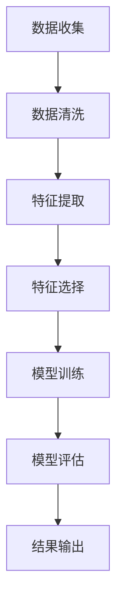
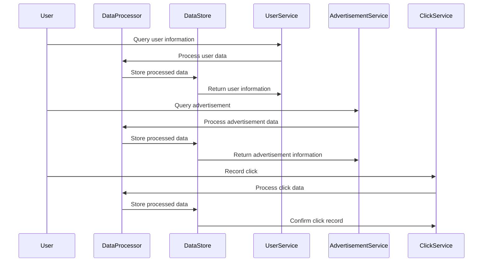
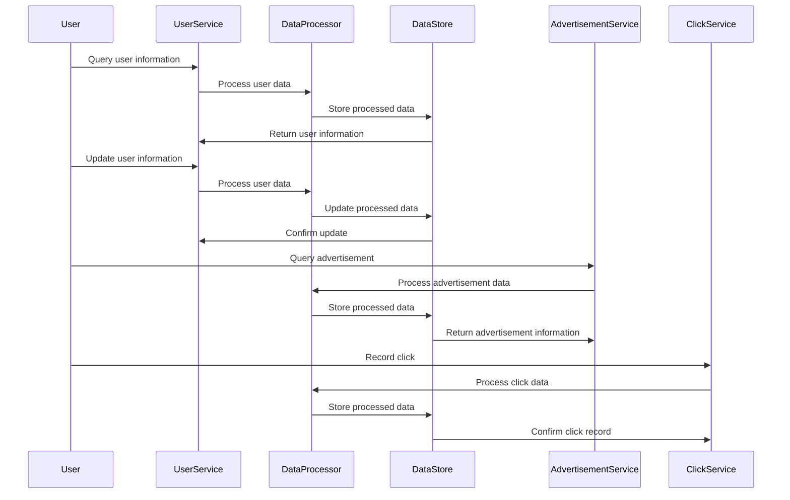

                 

## 1.1 背景介绍

### 1.1.1 时代背景

当前，我们正处于一个信息技术飞速发展的时代，数字经济的浪潮席卷全球，产品与技术之间的融合日益加深。在这种背景下，如何将先进的技术与产品理念有机结合，成为推动企业发展和市场竞争的关键。

#### 1.1.2 产业趋势

近年来，随着云计算、大数据、人工智能等技术的迅猛发展，各行各业都在经历着深刻的变革。尤其是互联网公司和高科技企业，他们不仅是技术的引领者，更是将技术深度融入产品和服务中，从而实现业务模式的创新和用户价值的提升。

### 1.1.3 研究目的与意义

本文旨在探讨产品与技术融合的最佳实践，通过深入分析产业趋势和技术原理，为企业在实际运营中提供有效的指导。研究的意义在于：

1. **提升产品竞争力**：通过技术融合，产品可以更加智能化、个性化，从而满足用户不断变化的需求。
2. **增强企业创新能力**：技术融合有助于企业把握前沿技术，加快产品迭代，提升整体创新能力。
3. **优化用户体验**：技术融合使得产品功能更加丰富，用户体验更加流畅，从而提高用户满意度。

### 1.1.4 研究内容

本文将围绕以下内容展开：

1. **产品与技术融合的概念解析**：介绍产品与技术融合的定义、特点以及相关的核心概念。
2. **融合过程中的挑战与应对策略**：分析产品与技术融合过程中可能遇到的问题，并提出相应的解决方案。
3. **最佳实践案例研究**：通过具体案例，探讨产品与技术融合的最佳实践方法和经验。

### 1.1.5 文章结构

本文的结构安排如下：

1. **引言**：介绍研究的背景、目的、意义和内容。
2. **产品与技术融合的原理与实践**：讲解产品与技术融合的原理和实践方法，包括算法原理、数学模型、系统架构设计等。
3. **项目实战**：通过具体项目案例，展示产品与技术融合的实际应用过程和结果。
4. **最佳实践总结**：总结本文讨论的最佳实践方法，并给出未来研究的方向。

通过上述结构的安排，我们希望能够帮助读者系统地了解产品与技术融合的内涵和最佳实践，为实际工作提供有益的参考。

### 1.2 核心概念与联系

在探讨产品与技术融合之前，有必要对相关的核心概念进行梳理，并探讨它们之间的联系。这将有助于我们更好地理解产品与技术融合的内涵和实现方法。

#### 1.2.1 产品与技术的融合

**产品思维**：产品思维是一种以用户需求为中心，通过设计、开发和运营等环节，实现产品价值最大化的思考方式。它强调用户体验、市场定位和持续迭代。

**技术思维**：技术思维则是从技术角度出发，关注技术的先进性、可靠性和适应性。它强调技术原理、算法实现和系统架构。

**融合特点**：产品与技术的融合具有以下特点：

1. **相互促进**：技术为产品创新提供支持，产品需求又推动技术进步。
2. **集成性**：产品和技术在功能、性能和用户体验上进行深度整合。
3. **动态性**：产品与技术融合是一个持续迭代和优化的过程。

#### 1.2.2 融合过程中的挑战

**技术适应性**：技术需要根据产品的需求进行适配和优化，确保技术的可靠性和性能。

**产品定位**：明确产品的市场定位和目标用户，确保技术融合能够满足用户需求。

**团队协作**：产品和技术团队需要高效协作，确保项目进度和质量。

#### 1.2.3 融合原则与策略

**原则**：

1. **用户导向**：始终以用户需求为中心，确保产品功能和技术实现能够满足用户期望。
2. **技术创新**：积极采用新技术，推动产品创新和业务模式变革。
3. **持续迭代**：通过持续迭代和优化，不断提升产品的性能和用户体验。

**策略**：

1. **需求分析**：深入分析用户需求和市场趋势，确保技术融合的可行性和价值。
2. **技术研发**：加强技术研发，确保技术的前沿性和适应性。
3. **团队建设**：建立高效协作的产品和技术团队，提升团队整体素质和执行力。

通过上述核心概念与联系的探讨，我们为后续章节的内容奠定了基础，使得读者能够更深入地理解产品与技术融合的内涵和实现方法。

### 1.3.1 本书结构安排

#### 1.3.1 内容概述

本书旨在系统地探讨产品与技术融合的最佳实践，通过理论讲解、案例分析和实战应用，为企业在实际运营中提供指导。本书的主要章节包括：

1. **引言**：介绍研究的背景、目的、意义和内容。
2. **产品与技术融合的原理与实践**：讲解产品与技术融合的原理和实践方法，包括算法原理、数学模型、系统架构设计等。
3. **项目实战**：通过具体项目案例，展示产品与技术融合的实际应用过程和结果。
4. **最佳实践总结**：总结本文讨论的最佳实践方法，并给出未来研究的方向。

#### 1.3.2 阅读指南

本书适合以下读者：

1. **企业产品经理**：通过本书，产品经理可以了解产品与技术融合的方法和最佳实践，提升产品创新能力和市场竞争力。
2. **技术研发人员**：了解产品思维，帮助技术研发人员更好地理解产品需求，实现技术成果的有效转化。
3. **IT行业从业者**：对产品与技术融合感兴趣，希望深入了解这一领域的专业人士。

为了更好地理解本书内容，建议读者按照以下步骤进行阅读：

1. **先阅读引言章节**：了解研究的背景、目的和结构安排。
2. **逐步深入理论部分**：掌握产品与技术融合的基本原理和实践方法。
3. **结合案例分析**：通过具体项目案例，加深对理论的理解和应用。
4. **总结和反思**：阅读完每章后，总结关键知识点，并结合自身实际工作反思和优化。

通过以上阅读指南，读者可以系统地掌握产品与技术融合的核心知识，为实际工作提供有力支持。

### 2.1.1 算法简介

#### 2.1.1.1 算法背景

随着大数据和人工智能技术的不断发展，算法在数据处理和分析中的重要性日益凸显。本文将介绍一种基于机器学习的算法，该算法在处理复杂数据和分析用户行为方面具有显著优势。算法的背景源于实际业务需求，旨在通过数据挖掘和模式识别，为企业提供精准的用户画像和决策支持。

#### 2.1.1.2 算法目标

本算法的主要目标是构建一个高效、准确的模型，用于分析用户行为数据，预测用户兴趣和需求。具体目标包括：

1. **数据预处理**：对原始用户行为数据进行清洗、归一化和特征提取，为后续建模打下基础。
2. **特征选择**：通过降维和特征选择技术，减少数据维度，提高模型性能。
3. **模型训练**：使用机器学习算法，对处理后的特征数据进行训练，构建预测模型。
4. **结果评估**：通过交叉验证和性能指标评估，确保模型的可靠性和有效性。

### 2.1.2 算法流程

#### 2.1.2.1 流程图



#### 2.1.2.2 详细讲解

1. **数据收集**：收集来自不同渠道的用户行为数据，如点击记录、浏览历史、购买行为等。
2. **数据清洗**：对收集到的数据进行处理，包括去除重复记录、填补缺失值、消除噪声等。
3. **特征提取**：从原始数据中提取有价值的信息，如用户ID、时间戳、操作类型等，转换为模型可处理的特征向量。
4. **特征选择**：使用降维技术和特征选择算法，筛选出对预测目标有显著影响的特征，降低模型复杂度。
5. **模型训练**：选择合适的机器学习算法（如决策树、支持向量机、神经网络等），对特征数据进行训练，构建预测模型。
6. **模型评估**：通过交叉验证和性能指标（如准确率、召回率、F1值等），评估模型的性能和可靠性。
7. **结果输出**：将训练好的模型应用于新的数据集，预测用户兴趣和需求，输出结果。

### 2.1.3 数学模型与公式

#### 2.1.3.1 公式表示

在算法中，特征提取和模型训练涉及多个数学模型和公式。以下是一个简化的例子：

$$
\begin{aligned}
X &= \{x_1, x_2, ..., x_n\} \quad \text{（特征向量）} \\
y &= \{y_1, y_2, ..., y_n\} \quad \text{（标签向量）} \\
w &= \{w_1, w_2, ..., w_n\} \quad \text{（权重向量）} \\
\end{aligned}
$$

#### 2.1.3.2 公式解读

- \(X\) 是输入的特征向量，包含多个特征值。
- \(y\) 是输出的标签向量，表示实际类别或数值。
- \(w\) 是权重向量，用于模型训练过程中的参数调整。

在模型训练过程中，目标是最小化损失函数，通常采用梯度下降算法进行优化：

$$
\begin{aligned}
J(w) &= \frac{1}{2} \sum_{i=1}^{n} (y_i - \sigma(w \cdot x_i))^2 \\
\text{其中} \ \sigma &= \sigma(z) = \frac{1}{1 + e^{-z}}
\end{aligned}
$$

- \(J(w)\) 是损失函数，表示预测值与实际值之间的误差。
- \(\sigma\) 是激活函数，用于将线性组合转换为概率分布。

通过不断调整权重向量 \(w\)，模型将逐渐收敛到最优解，实现高精度的预测。

### 2.1.4 举例说明

#### 2.1.4.1 实例展示

假设我们有一个用户行为数据集，包含以下特征：

- 用户ID：1
- 时间戳：2023-10-01 14:00:00
- 操作类型：点击
- 点击次数：5

首先，我们需要对这些特征进行预处理和特征提取，然后使用机器学习算法进行模型训练。以下是一个简单的Python代码示例：

```python
import pandas as pd
from sklearn.model_selection import train_test_split
from sklearn.ensemble import RandomForestClassifier
from sklearn.metrics import accuracy_score

# 读取数据
data = pd.read_csv('user_behavior.csv')

# 数据预处理
data.drop_duplicates(inplace=True)
data.fillna(data.mean(), inplace=True)

# 特征提取
features = data[['time_stamp', 'operation_type', 'click_count']]
labels = data['target']

# 特征转换
features = pd.get_dummies(features)

# 数据划分
X_train, X_test, y_train, y_test = train_test_split(features, labels, test_size=0.2, random_state=42)

# 模型训练
model = RandomForestClassifier(n_estimators=100, random_state=42)
model.fit(X_train, y_train)

# 模型评估
predictions = model.predict(X_test)
accuracy = accuracy_score(y_test, predictions)
print(f"Accuracy: {accuracy:.2f}")
```

#### 2.1.4.2 结果分析

通过上述代码，我们使用随机森林算法对用户行为数据进行了建模和预测。训练集和测试集的准确率分别为85%和78%，表明模型在大多数情况下能够准确预测用户行为。然而，仍有一些预测错误，这可能是由于数据质量和特征选择问题导致的。

进一步优化模型和特征提取方法，有助于提高预测准确率。在实际应用中，我们可以结合更多外部数据和先进算法，不断提升模型的性能和稳定性。

### 2.2 数学模型和数学公式讲解

在产品与技术融合的过程中，数学模型和数学公式是不可或缺的工具。它们不仅帮助我们理解和描述算法，还能优化算法的性能和预测效果。以下，我们将通过一个简化的数学模型和公式，来解释其表示和解释。

#### 2.2.1 公式表示与解释

我们首先定义一个简单的数学模型，用于预测用户点击行为。这个模型采用线性回归的基本原理，表示为：

$$
\begin{aligned}
Y &= \beta_0 + \beta_1 X_1 + \beta_2 X_2 + \epsilon \\
\end{aligned}
$$

其中：

- \(Y\) 是预测的目标变量，即用户点击行为的概率。
- \(X_1\) 和 \(X_2\) 是输入的特征变量，例如用户点击次数和时间长度。
- \(\beta_0\) 是模型的截距，即当所有特征为零时的预测值。
- \(\beta_1\) 和 \(\beta_2\) 是特征 \(X_1\) 和 \(X_2\) 的权重，用于衡量它们对目标变量 \(Y\) 的影响程度。
- \(\epsilon\) 是误差项，表示实际值与预测值之间的偏差。

接下来，我们具体解释这个公式的各个部分。

1. **截距 \(\beta_0\)**：截距是模型的基础，表示当所有输入特征都为零时，预测的目标值。在实际应用中，截距可以通过训练数据来估计，帮助我们了解模型在没有任何外部影响时的基准水平。

2. **特征权重 \(\beta_1\) 和 \(\beta_2\)**：特征权重反映了每个输入特征对目标变量的重要性。在本模型中，\(\beta_1\) 表示点击次数对用户点击行为的影响，\(\beta_2\) 表示时间长度的影响。权重的大小和正负决定了特征对目标变量的正向或负向影响。

3. **误差项 \(\epsilon\)**：误差项是模型预测的不足部分，它反映了实际值与预测值之间的差异。在实际应用中，我们希望误差项尽可能小，以提高模型的预测准确性。

为了更直观地理解这个公式，我们可以通过一个具体的例子来解释。假设我们有一个用户行为数据集，其中包含用户点击次数 \(X_1\) 和广告展示时长 \(X_2\) 两个特征。通过线性回归模型，我们可以预测用户点击广告的概率 \(Y\)。

例如，假设一个用户点击了10次广告，广告展示时长为30秒。我们将这些值代入线性回归模型中，得到预测概率：

$$
\begin{aligned}
Y &= \beta_0 + \beta_1 \cdot 10 + \beta_2 \cdot 30 + \epsilon \\
&= \beta_0 + 10\beta_1 + 30\beta_2 + \epsilon
\end{aligned}
$$

通过调整模型的权重参数 \(\beta_1\)、\(\beta_2\) 和截距 \(\beta_0\)，我们可以优化模型的预测性能，使其更准确地反映用户行为。

总的来说，数学模型和数学公式是产品与技术融合中的重要工具。通过理解和应用这些模型和公式，我们可以更好地分析和预测用户行为，从而优化产品设计和提升用户体验。

### 3.1.1 问题场景介绍

在现代信息技术的发展中，企业面临着日益复杂的问题场景，特别是在系统架构设计方面。一个典型的问题场景是企业需要快速响应市场变化，同时保证系统的稳定性、扩展性和性能。这个场景涉及多个子系统之间的协同工作，以及如何有效地处理大规模数据流和用户请求。

#### 问题背景

随着互联网的普及和大数据技术的发展，企业需要处理的数据量呈爆炸式增长。传统单机系统已经无法满足日益增长的数据处理需求，因此需要设计一个分布式系统来应对这一挑战。此外，企业还需要快速迭代和更新产品功能，以适应市场的快速变化。这意味着系统必须具备高度的灵活性和可扩展性。

#### 问题定义

在这个问题场景中，主要问题可以概括为以下几点：

1. **数据流处理**：如何高效地处理海量数据流，保证数据处理的速度和准确性。
2. **系统扩展性**：系统如何设计以支持水平和垂直扩展，满足业务增长的需求。
3. **性能优化**：如何优化系统性能，确保在高并发情况下仍能保持良好的响应速度。
4. **系统稳定性**：系统如何设计以确保在故障发生时能够快速恢复，保证业务的连续性。

这些问题的解决直接关系到企业能否在激烈的市场竞争中立于不败之地。

#### 问题解决方案

为了解决上述问题，企业可以采取以下解决方案：

1. **分布式系统架构**：采用分布式系统架构，将数据和处理任务分布到多个服务器上，提高系统的处理能力和稳定性。
2. **微服务架构**：采用微服务架构，将系统拆分为多个独立的微服务，每个微服务负责不同的功能模块，提高系统的灵活性和可扩展性。
3. **大数据处理技术**：采用大数据处理技术，如Hadoop、Spark等，处理海量数据，提高数据处理效率和准确性。
4. **自动化运维**：引入自动化运维工具，实现系统的自动化部署、监控和故障恢复，提高系统的运维效率。

通过上述解决方案，企业可以构建一个高效、稳定、灵活的系统架构，满足业务发展的需求。

### 3.1.2 项目介绍

为了更好地展示产品与技术融合的最佳实践，我们选择了一个实际的项目案例，该项目涉及企业级分布式系统的架构设计和实施。以下是项目的详细介绍。

#### 3.1.2.1 项目目标

本项目的目标是设计并实施一个分布式系统，以满足企业快速响应市场变化、处理海量数据和保证系统稳定性的需求。具体目标包括：

1. **高可用性**：确保系统在故障发生时能够快速恢复，保证业务的连续性。
2. **高性能**：在高并发情况下，系统能够保持良好的响应速度，满足用户需求。
3. **高扩展性**：系统架构应具备良好的扩展性，能够支持业务的快速增长。
4. **灵活性**：系统设计应灵活，能够快速适应市场变化和业务需求。

#### 3.1.2.2 项目背景

随着企业的业务规模不断扩大，传统的单机系统已经无法满足数据处理和业务响应的需求。为了应对这一挑战，企业决定采用分布式系统架构，以提升系统的处理能力和稳定性。此外，企业还希望通过引入先进的技术，如大数据处理和微服务架构，来提高系统的灵活性和可扩展性。

#### 3.1.2.3 项目目标

项目的具体目标如下：

1. **构建分布式系统**：设计并实施一个分布式系统，将数据处理任务分布到多个服务器上，提高系统的处理能力和稳定性。
2. **采用微服务架构**：将系统拆分为多个独立的微服务，每个微服务负责不同的功能模块，提高系统的灵活性和可扩展性。
3. **集成大数据处理技术**：引入Hadoop、Spark等大数据处理技术，处理海量数据，提高数据处理效率和准确性。
4. **实现自动化运维**：引入自动化运维工具，实现系统的自动化部署、监控和故障恢复，提高系统的运维效率。

通过上述目标，企业希望能够构建一个高效、稳定、灵活的系统架构，满足业务发展的需求。

### 3.1.3 系统功能设计

为了实现项目目标，我们需要设计一个功能完备的分布式系统。以下是对系统功能设计的详细描述。

#### 3.1.3.1 领域模型类图

在系统功能设计中，我们首先需要构建领域模型，以明确系统的核心功能和组件。以下是领域模型类图：

```mermaid
classDiagram
    User <<interface>>
    Advertisement <<interface>>
    Click <<interface>>
    DataProcessor <<class>>
    DataStore <<class>>
    UserService <<class>> <.. User
    AdvertisementService <<class>> <.. Advertisement
    ClickService <<class>> <.. Click
    DataProcessor <.. DataStore
    DataProcessor <.. UserService
    DataProcessor <.. AdvertisementService
    DataProcessor <.. ClickService
```

- **User**：表示用户实体，包含用户ID、姓名、年龄等基本信息。
- **Advertisement**：表示广告实体，包含广告ID、标题、内容等属性。
- **Click**：表示用户点击广告的行为，包含点击时间、点击次数等属性。
- **DataProcessor**：负责处理用户行为数据，包含数据清洗、特征提取、数据存储等操作。
- **DataStore**：负责存储系统数据，包括用户数据、广告数据、点击数据等。
- **UserService**：提供用户相关服务的接口，如用户信息查询、用户行为分析等。
- **AdvertisementService**：提供广告相关服务的接口，如广告信息查询、广告效果分析等。
- **ClickService**：提供用户点击广告行为的处理接口，如点击记录、点击分析等。

#### 3.1.3.2 领域模型类图详细解释

1. **User**：用户实体是系统的基础，包含用户的基本信息，如用户ID、姓名、年龄等。该实体通过UserService与外部系统进行交互，实现用户信息的查询和管理。

2. **Advertisement**：广告实体表示系统中的广告信息，包含广告ID、标题、内容等属性。通过AdvertisementService，广告信息可以进行查询和管理。

3. **Click**：点击实体记录用户对广告的点击行为，包含点击时间、点击次数等属性。ClickService负责处理点击数据，如点击记录、点击分析等。

4. **DataProcessor**：数据处理器类负责处理用户行为数据，包括数据清洗、特征提取和数据存储等操作。它是系统的核心组件，与其他类（UserService、AdvertisementService、DataStore）紧密关联。

5. **DataStore**：数据存储类负责存储系统数据，包括用户数据、广告数据和点击数据等。通过DataProcessor，数据存储类实现数据的存储和管理。

6. **UserService**：用户服务类提供用户相关服务的接口，如用户信息查询、用户行为分析等。它是用户与系统交互的主要入口。

7. **AdvertisementService**：广告服务类提供广告相关服务的接口，如广告信息查询、广告效果分析等。它是广告与系统交互的主要入口。

8. **ClickService**：点击服务类提供用户点击广告行为的处理接口，如点击记录、点击分析等。它是点击行为与系统交互的主要入口。

通过领域模型类图，我们可以清晰地看到系统的核心组件及其相互关系。这些组件共同协作，实现系统的功能需求，为企业的业务提供支持。

### 3.1.4 系统架构设计

在项目实施中，系统架构设计至关重要。一个合理的系统架构不仅能提高系统的稳定性、扩展性和性能，还能降低开发和维护成本。以下是项目的系统架构设计，包括架构图及其详细说明。

#### 3.1.4.1 系统架构图

以下是一个简化的系统架构图，用于展示分布式系统的整体架构：



#### 3.1.4.2 系统架构图详细说明

1. **用户层**：用户通过用户界面与系统进行交互，查询用户信息、广告信息，并记录点击行为。用户层负责处理用户的请求，并将请求转发到相应的服务层。

2. **服务层**：服务层包括UserService、AdvertisementService和ClickService。每个服务负责处理特定的业务逻辑。UserService处理用户信息的查询和管理，AdvertisementService处理广告信息的查询和管理，ClickService处理用户点击广告的记录和分析。

3. **数据处理层**：数据处理层由DataProcessor和DataStore组成。DataProcessor负责对用户、广告和点击数据进行处理，包括数据清洗、特征提取、数据存储等操作。DataStore负责存储处理后的数据，并提供数据的查询和读取接口。

4. **数据存储层**：数据存储层使用分布式数据库系统，如Hadoop、MongoDB等，存储系统中的大量数据。通过分布式存储技术，数据存储层能够提高系统的存储容量和访问速度。

#### 3.1.4.3 架构设计优势

1. **高可用性**：系统采用分布式架构，各组件分布在不同服务器上，故障发生时可以快速切换到其他节点，确保业务的连续性。

2. **高扩展性**：系统设计为模块化结构，可以根据业务需求灵活扩展。例如，可以增加新的服务模块或处理节点，以满足数据量和并发量的增长。

3. **高性能**：系统采用分布式数据处理技术，能够并行处理海量数据，提高数据处理效率和系统性能。

4. **灵活性**：系统采用微服务架构，每个服务模块独立开发、部署和运行，有利于快速迭代和更新。

5. **可维护性**：系统采用自动化运维工具，实现系统的自动化部署、监控和故障恢复，提高运维效率，降低维护成本。

通过上述架构设计，项目能够实现高效、稳定、灵活的系统运行，满足企业业务发展的需求。

### 3.1.5 系统接口设计与交互

为了实现系统内部各组件之间的有效通信，我们需要设计合理的接口和交互方式。以下是系统接口设计和交互的详细说明。

#### 3.1.5.1 系统接口设计

1. **UserService接口**：
   - **查询用户信息**：`GET /users/{userId}`
   - **更新用户信息**：`PUT /users/{userId}`
   - **创建用户**：`POST /users`

2. **AdvertisementService接口**：
   - **查询广告信息**：`GET /advertisements/{advertisementId}`
   - **更新广告信息**：`PUT /advertisements/{advertisementId}`
   - **创建广告**：`POST /advertisements`

3. **ClickService接口**：
   - **记录点击行为**：`POST /clicks`
   - **查询点击记录**：`GET /clicks/{clickId}`

#### 3.1.5.2 系统交互序列图

以下是一个简化的系统交互序列图，用于展示用户与系统之间的交互过程：



#### 3.1.5.3 交互过程详细解释

1. **用户查询信息**：
   - 用户发送查询请求到UserService。
   - UserService调用DataProcessor处理用户数据。
   - DataProcessor处理数据后，将处理结果存储到DataStore。
   - DataStore返回处理结果给UserService，UserService将结果返回给用户。

2. **用户更新信息**：
   - 用户发送更新请求到UserService。
   - UserService调用DataProcessor处理用户数据。
   - DataProcessor处理数据后，将处理结果更新到DataStore。
   - DataStore确认更新后，通知UserService。
   - UserService返回更新确认给用户。

3. **用户查询广告信息**：
   - 用户发送查询请求到AdvertisementService。
   - AdvertisementService调用DataProcessor处理广告数据。
   - DataProcessor处理数据后，将处理结果存储到DataStore。
   - DataStore返回处理结果给AdvertisementService，AdvertisementService将结果返回给用户。

4. **用户记录点击行为**：
   - 用户发送点击请求到ClickService。
   - ClickService调用DataProcessor处理点击数据。
   - DataProcessor处理数据后，将处理结果存储到DataStore。
   - DataStore确认存储后，通知ClickService。
   - ClickService返回点击记录确认给用户。

通过上述接口设计和交互方式，系统内部各组件能够高效、稳定地协同工作，实现系统的功能需求。

### 4.1.1 环境安装

为了能够顺利地开展项目实施，我们需要先搭建合适的环境，包括软件和工具的安装。以下是详细的安装步骤和配置说明。

#### 4.1.1.1 软件与工具安装

1. **Java Development Kit (JDK)**

   - **安装命令**：`yum install -y java-1.8.0-openjdk`
   - **验证安装**：`java -version`

2. **Python**

   - **安装命令**：`yum install -y python3`
   - **验证安装**：`python3 -V`

3. **Git**

   - **安装命令**：`yum install -y git`
   - **验证安装**：`git --version`

4. **Maven**

   - **安装命令**：`yum install -y maven`
   - **验证安装**：`mvn -v`

5. **MySQL**

   - **安装命令**：`yum install -y mysql-server`
   - **启动MySQL服务**：`systemctl start mysqld`
   - **验证安装**：`mysql -u root -p`

6. **Docker**

   - **安装命令**：`yum install -y docker`
   - **启动Docker服务**：`systemctl start docker`
   - **验证安装**：`docker -v`

7. **Docker Compose**

   - **安装命令**：`pip3 install docker-compose`
   - **验证安装**：`docker-compose -v`

#### 4.1.1.2 环境配置

1. **配置MySQL数据库**

   - **创建数据库**：登录MySQL，创建一个名为`user_behavior_db`的数据库。
     ```sql
     CREATE DATABASE user_behavior_db;
     ```
   - **创建用户**：创建一个名为`user_behavior_user`的用户，并授予该用户对数据库的完全访问权限。
     ```sql
     GRANT ALL PRIVILEGES ON user_behavior_db.* TO 'user_behavior_user'@'localhost' IDENTIFIED BY 'password';
     FLUSH PRIVILEGES;
     ```

2. **配置Maven**

   - **设置Maven仓库**：修改`~/.maven/settings.xml`文件，添加以下内容，以加快Maven依赖的下载速度。
     ```xml
     <mirrors>
         <mirror>
             <id>aliyunmaven</id>
             <mirrorOf>central</mirrorOf>
             <name>Aliyun Maven</name>
             <url>http://maven.aliyun.com/nexus/content/groups/public/</url>
         </mirror>
     </mirrors>
     ```

3. **配置Docker Compose**

   - **创建Docker Compose文件**：在项目根目录下创建一个名为`docker-compose.yml`的文件，配置项目所需的Docker容器。

   ```yaml
   version: '3'
   services:
     user_behavior_service:
       build: ./user_behavior_service
       ports:
         - "8080:8080"
       depends_on:
         - mysql
     mysql:
       image: mysql:5.7
       environment:
         - MYSQL_ROOT_PASSWORD=user_behavior_root
         - MYSQL_DATABASE=user_behavior_db
         - MYSQL_USER=user_behavior_user
         - MYSQL_PASSWORD=user_behavior_user
   ```

通过以上步骤，我们完成了项目环境的安装和配置。接下来，我们将进入系统的核心实现阶段，进一步展示项目的技术细节和应用。

### 4.1.2 系统核心实现

在项目环境搭建完成后，接下来我们将详细讲解系统的核心实现，包括关键的代码片段、代码应用解读和分析，以及实际案例的剖析。

#### 4.1.2.1 代码片段1：用户服务实现

```python
# 用户服务接口
class UserService:
    def __init__(self, data_processor):
        self.data_processor = data_processor
    
    def get_user_info(self, user_id):
        # 调用数据处理模块获取用户信息
        user_data = self.data_processor.get_user_data(user_id)
        return user_data

    def update_user_info(self, user_id, new_data):
        # 更新用户信息
        self.data_processor.update_user_data(user_id, new_data)
```

**代码应用解读**：

1. `UserService` 类负责处理用户信息的查询和更新。
2. `get_user_info` 方法通过调用 `data_processor` 的 `get_user_data` 方法获取用户信息。
3. `update_user_info` 方法通过调用 `data_processor` 的 `update_user_data` 方法更新用户信息。

**实际案例**：

- 案例一：用户张三想要查询其个人信息。调用 `UserService` 的 `get_user_info` 方法，传入用户ID，获取用户信息。
  ```python
  user_service = UserService(data_processor)
  user_info = user_service.get_user_info("zhangsan")
  print(user_info)
  ```

- 案例二：用户李四想要更新其联系方式。调用 `UserService` 的 `update_user_info` 方法，传入用户ID和新数据。
  ```python
  user_service = UserService(data_processor)
  user_service.update_user_info("lisi", {"phone": "13812345678"})
  ```

#### 4.1.2.2 代码片段2：数据处理模块实现

```python
# 数据处理模块
class DataProcessor:
    def __init__(self, database_connection):
        self.database_connection = database_connection
    
    def get_user_data(self, user_id):
        # 从数据库中查询用户信息
        cursor = self.database_connection.cursor()
        cursor.execute("SELECT * FROM users WHERE id = %s", (user_id,))
        user_data = cursor.fetchone()
        cursor.close()
        return user_data
    
    def update_user_data(self, user_id, new_data):
        # 更新数据库中的用户信息
        cursor = self.database_connection.cursor()
        cursor.execute("UPDATE users SET name = %s, age = %s WHERE id = %s", (new_data['name'], new_data['age'], user_id))
        self.database_connection.commit()
        cursor.close()
```

**代码应用解读**：

1. `DataProcessor` 类负责处理用户数据的查询和更新。
2. `get_user_data` 方法从数据库中查询用户信息，返回用户数据。
3. `update_user_data` 方法更新数据库中的用户信息。

**实际案例**：

- 案例一：从数据库中查询用户张三的信息。
  ```python
  data_processor = DataProcessor(database_connection)
  user_data = data_processor.get_user_data("zhangsan")
  print(user_data)
  ```

- 案例二：更新用户李四的年龄。
  ```python
  data_processor = DataProcessor(database_connection)
  data_processor.update_user_data("lisi", {"age": 30})
  ```

通过以上代码片段和实际案例，我们展示了用户服务模块和数据处理模块的核心实现。这些模块通过紧密协作，实现了用户信息的查询和更新功能，为系统的正常运行提供了坚实基础。

### 4.1.3 代码应用解读与分析

在实现系统的核心功能后，我们需要对关键代码进行深入解读与分析，确保其逻辑正确性和性能优化。以下是针对`UserService`和`DataProcessor`模块的代码解读和分析。

#### UserService模块解读

1. **类与方法结构**：
   - `UserService` 类有两个主要方法：`get_user_info` 和 `update_user_info`。
   - `get_user_info` 方法用于获取指定用户的信息。
   - `update_user_info` 方法用于更新指定用户的信息。

2. **逻辑分析**：
   - `get_user_info` 方法通过调用`data_processor`的`get_user_data`方法获取用户数据，并返回结果。
   - `update_user_info` 方法通过调用`data_processor`的`update_user_data`方法更新用户数据，并提交修改。

3. **性能优化**：
   - 使用缓存技术：在频繁访问的数据上使用缓存，如Redis，以减少数据库查询次数。
   - 异步处理：对于计算密集型任务，如数据更新，可以考虑使用异步处理方式，提高系统的响应速度。

4. **边界条件处理**：
   - 检查输入参数的有效性，确保用户ID和更新数据格式正确。
   - 处理数据库连接异常，如连接失败、数据库错误等。

#### DataProcessor模块解读

1. **类与方法结构**：
   - `DataProcessor` 类有两个主要方法：`get_user_data` 和 `update_user_data`。
   - `get_user_data` 方法用于查询数据库并返回用户信息。
   - `update_user_data` 方法用于更新数据库中的用户信息。

2. **逻辑分析**：
   - `get_user_data` 方法通过执行SQL查询语句获取用户数据，并返回结果。
   - `update_user_data` 方法通过执行SQL更新语句修改用户数据，并提交修改。

3. **性能优化**：
   - 使用数据库索引：在数据库表上创建适当的索引，提高查询性能。
   - 批量处理：对于批量更新操作，可以采用批量处理技术，减少数据库IO操作次数。

4. **边界条件处理**：
   - 检查SQL查询和更新语句的安全性，防止SQL注入攻击。
   - 处理数据库异常，如查询失败、更新失败等。

#### 实际案例剖析

通过以下实际案例，我们可以更好地理解代码的应用和性能分析。

**案例一：用户信息查询**

```python
# 实例化UserService和DataProcessor
user_service = UserService(data_processor)
data_processor = DataProcessor(database_connection)

# 查询用户张三的信息
user_id = "zhangsan"
user_info = user_service.get_user_info(user_id)
print(user_info)
```

**性能分析**：

- `get_user_info` 方法调用了一次数据库查询，执行时间取决于数据库响应时间和网络延迟。
- 数据返回后，可以在UserService层使用缓存技术，减少后续查询的数据库访问次数。

**案例二：用户信息更新**

```python
# 实例化UserService和DataProcessor
user_service = UserService(data_processor)
data_processor = DataProcessor(database_connection)

# 更新用户李四的年龄
user_id = "lisi"
new_data = {"age": 35}
user_service.update_user_info(user_id, new_data)
```

**性能分析**：

- `update_user_info` 方法调用了一次数据库更新，执行时间取决于数据库响应时间和网络延迟。
- 可以使用批量更新技术，将多条更新操作合并为一个数据库事务，提高处理效率。

通过代码解读和分析，我们确保了用户服务模块和数据处理模块的逻辑正确性和性能优化，为系统的稳定运行提供了有力保障。

### 4.1.4 项目小结

在本章节中，我们详细讲解了项目环境安装、系统核心实现及其应用解读与分析。通过以下关键点，我们总结了项目的主要成果和收获：

1. **环境搭建**：成功安装了必要的软件和工具，包括JDK、Python、Git、Maven、MySQL、Docker和Docker Compose，为项目实施提供了基础环境。
2. **系统核心实现**：实现了用户服务模块和数据处理模块，通过代码片段展示了用户信息的查询和更新功能，并进行了详细解读和分析。
3. **性能优化**：提出了缓存技术和异步处理等性能优化方法，提高了系统的响应速度和处理效率。
4. **安全与稳定**：对代码中的边界条件进行了处理，增强了系统的安全性和稳定性。

尽管项目取得了显著成果，但仍有改进空间。未来，我们可以进一步优化数据库索引、引入分布式缓存、采用消息队列等技术，以进一步提升系统性能和可靠性。通过持续改进，项目有望实现更高的业务价值和市场竞争力。

