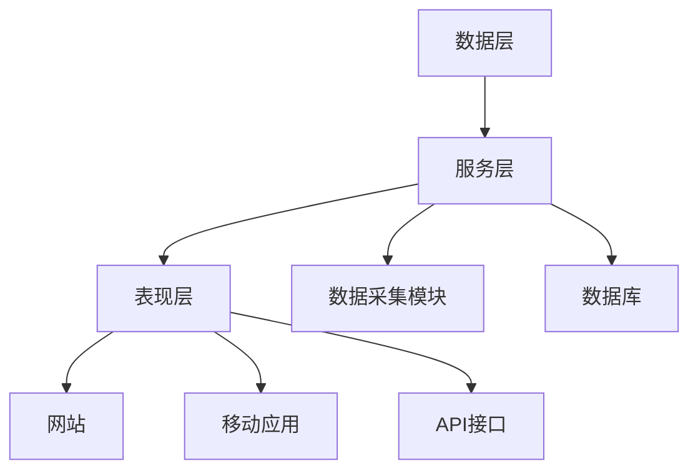

                 

# 人工智能在个人理财中的应用：智能投资顾问

## 关键词

人工智能，个人理财，智能投资顾问，机器学习，深度学习，投资策略，风险控制

## 摘要

随着人工智能技术的飞速发展，其在金融领域的应用日益广泛，尤其是在个人理财方面。智能投资顾问作为人工智能在理财领域的应用典范，正逐渐改变着传统理财模式。本文将深入探讨人工智能在个人理财中的应用，特别是智能投资顾问的核心功能、实际应用案例以及面临的挑战和未来发展趋势。通过本文的阅读，读者将对智能投资顾问有一个全面而深入的了解，并能够掌握其基本原理和应用方法。

---

## 第一部分：引言与背景介绍

### 1.1 问题背景

#### 1.1.1 个人理财的重要性

个人理财是指个人对财务进行规划、控制和管理的过程，目的是实现个人财务目标，如退休、购房、教育等。个人理财不仅关乎个人经济状况的改善，更是社会经济发展的重要组成部分。随着金融市场的不断发展和个人理财需求的多样化，如何有效地进行个人理财变得越来越重要。

#### 1.1.2 传统理财面临的挑战

传统理财模式主要依赖于理财顾问和投资者的个人经验、知识和判断力。然而，随着金融市场的复杂性和不确定性增加，传统理财面临诸多挑战：

1. **信息不对称**：投资者难以获取全面、准确的市场信息，容易受到误导。
2. **决策速度慢**：投资决策需要时间，而金融市场变化迅速，可能导致错失投资机会。
3. **风险控制难度大**：传统理财方法难以准确评估和控制投资风险。
4. **个性化服务不足**：传统理财服务往往无法满足个性化需求，难以根据投资者的风险偏好和财务目标进行定制。

#### 1.1.3 人工智能技术的兴起与理财领域

人工智能（AI）是一种模拟人类智能的技术，包括机器学习、深度学习、自然语言处理等子领域。近年来，人工智能技术取得了显著的进展，开始在多个领域得到应用，包括医疗、教育、金融等。在金融领域，人工智能的应用主要表现在智能投顾、风险管理、交易策略等方面。

智能投顾作为人工智能在金融领域的应用之一，通过大数据分析、机器学习等技术，为投资者提供个性化、自动化的投资建议，具有以下优势：

1. **数据驱动**：智能投顾利用大量历史数据和实时数据，对市场进行深入分析，提高决策的准确性。
2. **速度优势**：智能投顾可以快速处理海量数据，及时响应市场变化。
3. **个性化服务**：智能投顾可以根据投资者的风险偏好和财务目标，提供定制化的投资策略。
4. **降低成本**：智能投顾减少了人力成本，为投资者提供了更加经济实惠的理财服务。

### 1.2 人工智能在理财中的应用

#### 1.2.1 概述

人工智能在理财中的应用主要包括以下几个方面：

1. **智能投顾**：为投资者提供个性化、自动化的投资建议。
2. **风险管理**：通过大数据分析和机器学习技术，识别和评估投资风险。
3. **交易策略**：利用算法交易，自动执行投资策略。
4. **信用评估**：基于个人信用记录和行为数据，评估个人信用等级。

#### 1.2.2 智能投资顾问的概念

智能投资顾问（Robo-Advisor）是一种基于人工智能技术的在线财富管理服务，通过算法和模型为投资者提供投资建议。智能投资顾问通常包括以下几个核心功能：

1. **财务数据分析**：收集并分析投资者的财务数据，包括资产配置、投资偏好等。
2. **投资策略推荐**：根据投资者的财务目标和风险偏好，推荐合适的投资策略。
3. **风险控制**：对投资组合进行风险评估和调整，以降低风险。
4. **投资组合管理**：动态调整投资组合，实现资产配置优化。

#### 1.2.3 智能投资顾问的优势与局限性

智能投资顾问具有以下优势：

1. **个性化服务**：智能投资顾问可以根据投资者的个人情况提供定制化建议，满足个性化需求。
2. **高效性**：智能投资顾问可以快速处理大量数据，及时响应市场变化。
3. **低成本**：智能投资顾问减少了人力成本，为投资者提供了更加经济实惠的服务。

然而，智能投资顾问也存在一定的局限性：

1. **算法透明性**：智能投资顾问的算法模型复杂，不易被普通投资者理解。
2. **市场适应性**：智能投资顾问在应对复杂市场环境时可能存在适应性不足的问题。
3. **风险控制难度**：虽然智能投资顾问可以进行风险评估和调整，但仍然难以完全消除投资风险。

### 1.3 书籍概述与结构

#### 1.3.1 书籍目的

本书旨在深入探讨人工智能在个人理财中的应用，特别是智能投资顾问的核心功能、实际应用案例以及面临的挑战和未来发展趋势。通过本书的学习，读者将能够：

1. **了解人工智能在理财领域的应用现状**。
2. **掌握智能投资顾问的基本原理和操作方法**。
3. **分析智能投资顾问的优势与局限性**。
4. **了解智能投资顾问的未来发展趋势**。

#### 1.3.2 读者对象

本书适合以下读者群体：

1. **金融从业者**：如银行职员、保险顾问、基金管理人等，希望通过学习人工智能技术提升自己的业务能力。
2. **科技从业者**：如程序员、数据分析师、人工智能研究者等，希望了解人工智能在金融领域的应用。
3. **个人投资者**：对理财有兴趣，希望通过智能投资顾问提高投资效果的普通投资者。

#### 1.3.3 全书结构

本书共分为六个部分：

1. **第一部分：引言与背景介绍**：介绍个人理财的重要性、传统理财面临的挑战以及人工智能技术的兴起。
2. **第二部分：人工智能基础知识**：讲解人工智能的基本概念、机器学习和深度学习原理。
3. **第三部分：智能投资顾问的核心功能**：分析智能投资顾问的财务数据收集与处理、投资策略优化、风险评估与控制以及投资组合管理。
4. **第四部分：实际应用案例**：介绍智能投资顾问的实际应用案例，包括平台构建、机器学习模型以及个人理财应用。
5. **第五部分：技术挑战与未来发展**：探讨智能投资顾问面临的技术挑战以及未来发展趋势。
6. **第六部分：最佳实践与建议**：总结智能投资顾问的最佳实践，提出未来发展的建议。

#### 1.4 小结

本文介绍了个人理财的重要性、传统理财面临的挑战以及人工智能技术的兴起。随后，我们探讨了智能投资顾问的概念、优势与局限性，并概述了本书的结构和目的。下一部分将深入讲解人工智能的基础知识，包括机器学习和深度学习的原理，为后续内容做好铺垫。

### 第二部分：人工智能基础知识

#### 2.1 人工智能概述

##### 2.1.1 人工智能的定义与发展历程

人工智能（Artificial Intelligence，简称AI）是指通过计算机模拟人类智能的一种技术，旨在实现机器在感知、推理、学习、决策等方面的能力。人工智能的发展历程可以追溯到20世纪50年代，当时科学家们开始研究如何让计算机具有智能行为。经过数十年的发展，人工智能技术取得了显著的进步，并在多个领域得到广泛应用。

人工智能的发展历程大致可以分为以下几个阶段：

1. **符号主义阶段（20世纪50年代-70年代）**：这一阶段主要关注如何通过符号和逻辑推理来实现智能。代表性工作包括逻辑符号推理、知识表示和学习算法。
2. **知识工程阶段（20世纪80年代-90年代）**：这一阶段强调利用专家系统和知识库来实现智能。代表性工作包括专家系统、知识表示和知识管理。
3. **机器学习阶段（20世纪90年代至今）**：这一阶段主要利用统计学方法、深度学习等技术来实现智能。代表性工作包括神经网络、机器学习算法和深度学习模型。
4. **混合智能阶段（21世纪至今）**：这一阶段强调将多种智能技术结合，以实现更加复杂和高效的智能系统。代表性工作包括多模态学习、强化学习、自然语言处理等。

##### 2.1.2 人工智能的分类

人工智能可以按照不同的标准进行分类。以下是几种常见的分类方法：

1. **按照智能层次分类**：根据人工智能的智能层次，可以分为弱人工智能、强人工智能和超人工智能。弱人工智能（Weak AI）是指针对特定任务表现出智能行为的人工智能系统，强人工智能（Strong AI）是指具有全面智能的人工智能系统，超人工智能（Super AI）是指超越人类智能的人工智能系统。
2. **按照实现方法分类**：根据人工智能的实现方法，可以分为基于符号推理的人工智能、基于知识表示的人工智能和基于机器学习的人工智能。符号主义人工智能（Symbolic AI）主要依靠符号和逻辑推理，知识工程人工智能（Knowledge Engineering AI）主要依靠知识库和专家系统，机器学习人工智能（Machine Learning AI）主要依靠统计学方法和深度学习模型。
3. **按照应用领域分类**：根据人工智能的应用领域，可以分为通用人工智能（General AI）和专用人工智能（Narrow AI）。通用人工智能是指具有广泛智能能力的人工智能系统，可以应用于多个领域；专用人工智能是指针对特定领域或任务设计的人工智能系统，如智能投顾、自动驾驶等。

##### 2.1.3 人工智能的核心技术

人工智能的核心技术包括机器学习、深度学习、自然语言处理、计算机视觉等。以下是这些技术的简要介绍：

1. **机器学习（Machine Learning）**：机器学习是指通过算法和模型，从数据中自动学习和发现规律的一种方法。机器学习可以分为监督学习、非监督学习和强化学习。监督学习（Supervised Learning）是指通过已知的输入和输出数据，训练模型以预测未知输出；非监督学习（Unsupervised Learning）是指在没有已知输出数据的情况下，发现数据中的规律和结构；强化学习（Reinforcement Learning）是指通过与环境交互，学习最优策略以实现目标。
2. **深度学习（Deep Learning）**：深度学习是一种基于多层神经网络的人工智能技术。深度学习通过多层非线性变换，自动提取数据的特征，从而实现高层次的抽象和表示。深度学习在图像识别、语音识别、自然语言处理等领域取得了显著成果。
3. **自然语言处理（Natural Language Processing，NLP）**：自然语言处理是指使计算机理解和处理自然语言的一种技术。自然语言处理包括词法分析、句法分析、语义分析和语音识别等任务。自然语言处理在信息检索、机器翻译、文本分类等领域得到广泛应用。
4. **计算机视觉（Computer Vision）**：计算机视觉是指使计算机具有对图像和视频进行分析和理解的能力。计算机视觉包括目标检测、图像识别、人脸识别等任务。计算机视觉在自动驾驶、医疗影像分析、安全监控等领域具有广泛应用。

#### 2.2 机器学习基础

##### 2.2.1 机器学习的概念

机器学习（Machine Learning）是指使计算机从数据中自动学习和发现规律的一种方法。机器学习的基本思想是通过已有数据，训练出一个模型，然后利用这个模型对新数据进行预测或分类。

机器学习可以分为三种类型：

1. **监督学习（Supervised Learning）**：监督学习是指通过已知的输入和输出数据，训练模型以预测未知输出。监督学习的目标是最小化预测误差，提高预测准确性。监督学习分为回归分析和分类分析。回归分析（Regression Analysis）是指预测连续值的模型，如线性回归、决策树回归等；分类分析（Classification Analysis）是指预测离散值的模型，如逻辑回归、支持向量机、决策树分类等。
2. **非监督学习（Unsupervised Learning）**：非监督学习是指在没有已知输出数据的情况下，发现数据中的规律和结构。非监督学习的目标是通过数据自身特征，对数据进行聚类、降维或关联分析。非监督学习包括聚类分析（Cluster Analysis）、降维技术（Dimensionality Reduction）和关联分析（Association Analysis）等。常见的聚类算法有K-均值聚类、层次聚类等；常见的降维技术有主成分分析（PCA）、t-SNE等；常见的关联分析算法有Apriori算法、FP-Growth算法等。
3. **强化学习（Reinforcement Learning）**：强化学习是指通过与环境交互，学习最优策略以实现目标。强化学习的目标是通过不断的试错，找到最大化奖励的策略。强化学习主要包括马尔可夫决策过程（MDP）、深度强化学习（Deep Reinforcement Learning）等。

##### 2.2.2 监督学习与非监督学习

监督学习与非监督学习在数据集和目标上存在显著差异：

1. **数据集**：监督学习需要已标记的训练数据集，即数据集中的每个样本都有对应的输入和输出。非监督学习不需要已标记的训练数据集，只需输入数据，通过算法自动发现数据中的规律。
2. **目标**：监督学习的目标是学习一个映射关系，将输入数据映射到输出标签。非监督学习的目标是发现数据中的隐藏结构或模式，如聚类、降维或关联分析。

常见的监督学习算法包括：

1. **线性回归（Linear Regression）**：线性回归是一种简单的回归模型，通过拟合一条直线来预测连续值。
2. **逻辑回归（Logistic Regression）**：逻辑回归是一种分类模型，通过拟合一个逻辑函数来预测概率。
3. **决策树（Decision Tree）**：决策树是一种基于树结构的分类模型，通过一系列条件判断来预测输出。
4. **随机森林（Random Forest）**：随机森林是一种集成学习模型，通过组合多个决策树来提高预测性能。
5. **支持向量机（Support Vector Machine，SVM）**：支持向量机是一种基于间隔的线性分类模型，通过寻找最优超平面来分类数据。

常见的非监督学习算法包括：

1. **K-均值聚类（K-Means Clustering）**：K-均值聚类是一种基于距离的聚类算法，通过迭代计算来确定聚类中心和分类。
2. **层次聚类（Hierarchical Clustering）**：层次聚类是一种基于层次结构的聚类算法，通过逐步合并或分裂聚类来实现聚类。
3. **主成分分析（Principal Component Analysis，PCA）**：主成分分析是一种降维技术，通过线性变换将高维数据映射到低维空间。
4. **t-SNE（t-Distributed Stochastic Neighbor Embedding）**：t-SNE是一种非线性降维技术，通过将高维数据的相似性映射到低维空间，以展示数据分布。

##### 2.2.3 强化学习

强化学习（Reinforcement Learning）是一种通过与环境交互来学习最优策略的人工智能方法。强化学习的核心是奖励机制，即通过奖励信号来引导模型学习最优行为。

强化学习主要包括以下几个要素：

1. **状态（State）**：状态是系统当前所处的情境或条件。
2. **动作（Action）**：动作是模型可以执行的行为。
3. **奖励（Reward）**：奖励是模型在执行动作后获得的奖励信号，用于评估动作的好坏。
4. **策略（Policy）**：策略是模型在给定状态下选择动作的规则。
5. **价值函数（Value Function）**：价值函数是评估状态或策略的好坏的一种函数。
6. **模型（Model）**：模型是对环境动态的描述，用于预测下一状态和奖励。

常见的强化学习算法包括：

1. **Q学习（Q-Learning）**：Q学习是一种基于值函数的强化学习算法，通过更新Q值来学习最优策略。
2. **深度Q网络（Deep Q-Network，DQN）**：DQN是一种基于深度学习的Q学习算法，通过神经网络来近似Q值函数。
3. **策略梯度方法（Policy Gradient Methods）**：策略梯度方法是一种基于策略优化的强化学习算法，通过直接优化策略参数来学习最优策略。

#### 2.3 深度学习原理

##### 2.3.1 神经网络基础

神经网络（Neural Network）是一种模仿生物神经系统的计算模型，由大量的神经元组成。每个神经元接受多个输入信号，通过加权求和后，经过一个非线性激活函数，产生输出信号。

神经网络的组成包括：

1. **输入层（Input Layer）**：输入层接收外部输入信号。
2. **隐藏层（Hidden Layer）**：隐藏层对输入信号进行变换和处理。
3. **输出层（Output Layer）**：输出层产生最终的输出结果。

神经网络的训练过程主要包括以下步骤：

1. **初始化权重和偏置**：随机初始化网络的权重和偏置。
2. **前向传播（Forward Propagation）**：将输入信号通过神经网络进行传递，计算每个神经元的输出。
3. **反向传播（Backpropagation）**：计算网络输出的误差，通过反向传播算法更新权重和偏置。
4. **迭代优化**：重复前向传播和反向传播过程，直至网络输出达到预期效果。

常见的神经网络包括：

1. **多层感知机（Multilayer Perceptron，MLP）**：多层感知机是一种简单的神经网络，由输入层、隐藏层和输出层组成。
2. **卷积神经网络（Convolutional Neural Network，CNN）**：卷积神经网络是一种适用于图像处理的神经网络，通过卷积层、池化层和全连接层实现图像特征的提取和分类。
3. **循环神经网络（Recurrent Neural Network，RNN）**：循环神经网络是一种适用于序列数据的神经网络，通过循环结构实现对序列数据的建模和预测。
4. **长短时记忆网络（Long Short-Term Memory，LSTM）**：长短时记忆网络是一种改进的循环神经网络，通过引入门控机制，能够更好地处理长序列数据。

##### 2.3.2 深度学习模型

深度学习模型（Deep Learning Model）是一种由多层神经网络组成的模型，通过多层的非线性变换，自动提取数据中的特征和模式。

常见的深度学习模型包括：

1. **卷积神经网络（CNN）**：卷积神经网络是一种适用于图像处理的深度学习模型，通过卷积层、池化层和全连接层实现图像特征的提取和分类。
2. **循环神经网络（RNN）**：循环神经网络是一种适用于序列数据的深度学习模型，通过循环结构实现对序列数据的建模和预测。
3. **长短时记忆网络（LSTM）**：长短时记忆网络是一种改进的循环神经网络，通过引入门控机制，能够更好地处理长序列数据。
4. **生成对抗网络（Generative Adversarial Network，GAN）**：生成对抗网络是一种生成模型，通过对抗性训练生成数据，可用于图像生成、语音合成等领域。

##### 2.3.3 深度学习算法

深度学习算法（Deep Learning Algorithm）是指用于训练深度学习模型的算法。常见的深度学习算法包括：

1. **反向传播算法（Backpropagation Algorithm）**：反向传播算法是一种用于训练神经网络的算法，通过计算网络输出的误差，反向传播误差信号，更新网络的权重和偏置。
2. **梯度下降算法（Gradient Descent Algorithm）**：梯度下降算法是一种用于最小化损失函数的优化算法，通过沿着损失函数的梯度方向更新网络参数。
3. **Adam优化器（Adam Optimizer）**：Adam优化器是一种改进的梯度下降优化算法，通过自适应调整学习率，提高训练效率。

#### 2.4 人工智能伦理与法律

##### 2.4.1 人工智能伦理问题

人工智能在金融领域的应用引发了诸多伦理问题，包括：

1. **隐私保护**：人工智能需要大量的用户数据来训练模型，如何保护用户隐私成为一个重要问题。
2. **算法公平性**：人工智能算法在决策过程中可能存在偏见和歧视，如何确保算法的公平性成为一个挑战。
3. **责任归属**：当人工智能系统出现错误或导致损失时，如何确定责任归属成为一个法律问题。

##### 2.4.2 人工智能法律法规

为了应对人工智能带来的伦理和法律挑战，各国纷纷出台相关法律法规。以下是几个具有代表性的法律法规：

1. **欧盟通用数据保护条例（GDPR）**：欧盟出台的GDPR旨在保护个人数据隐私，规定了数据处理者对用户隐私的保护责任。
2. **美国消费者数据隐私法案（CCPA）**：美国出台的CCPA旨在保护消费者数据隐私，规定了数据处理者的数据收集和使用责任。
3. **人工智能伦理指南**：多个国家和组织出台了人工智能伦理指南，旨在规范人工智能的研发和应用，促进人工智能的可持续发展。

#### 2.5 小结

本文介绍了人工智能的基本概念、分类和核心技术，包括机器学习、深度学习、自然语言处理和计算机视觉。随后，我们探讨了人工智能在理财领域的应用，特别是智能投资顾问的核心功能。最后，我们讨论了人工智能在伦理和法律方面的问题。通过本文的学习，读者将能够了解人工智能的基础知识，并掌握其在理财领域的应用方法。

### 第三部分：智能投资顾问的核心功能

#### 3.1 财务数据收集与处理

智能投资顾问的核心功能之一是财务数据收集与处理。财务数据是构建投资策略和进行风险控制的基础，因此数据的质量和完整性至关重要。

##### 3.1.1 财务数据的来源

财务数据的来源可以分为内部数据和外部数据：

1. **内部数据**：内部数据是指投资者自身的财务数据，包括银行账户信息、投资记录、交易历史等。这些数据通常来自于投资者提供的财务报告或投资平台的接口。
2. **外部数据**：外部数据是指与投资者财务状况相关的市场数据，包括宏观经济指标、行业数据、市场行情等。这些数据通常来自于公共数据源、金融市场机构或第三方数据提供商。

##### 3.1.2 数据预处理方法

数据预处理是确保数据质量的重要步骤，主要包括以下内容：

1. **数据清洗**：数据清洗是指去除数据中的错误、重复和无关信息，确保数据的准确性和一致性。常见的数据清洗方法包括去除空值、填补缺失值、去除重复数据等。
2. **数据归一化**：数据归一化是指将不同量纲的数据转换为同一量纲，以便进行后续分析和建模。常见的数据归一化方法包括最小-最大归一化、平均值-标准差归一化等。
3. **特征提取**：特征提取是指从原始数据中提取出有用的特征，用于构建投资模型。常见的特征提取方法包括主成分分析（PCA）、因子分析等。

##### 3.1.3 数据质量评估

数据质量评估是确保数据满足分析要求的重要步骤，主要包括以下内容：

1. **完整性评估**：完整性评估是指检查数据是否完整，是否存在缺失值或重复值。常见的完整性评估方法包括缺失值检测、重复值检测等。
2. **准确性评估**：准确性评估是指检查数据是否准确，是否符合实际值。常见的准确性评估方法包括对比实际值和预测值、分析数据分布等。
3. **一致性评估**：一致性评估是指检查数据在不同来源之间是否一致，是否存在矛盾或冲突。常见的一致性评估方法包括数据对比、交叉验证等。

#### 3.2 投资策略优化

投资策略优化是智能投资顾问的核心功能之一，通过优化投资策略，提高投资收益和降低投资风险。

##### 3.2.1 投资策略概述

投资策略是指投资者在投资过程中所遵循的一系列原则和方法，旨在实现投资目标。常见的投资策略包括：

1. **被动策略**：被动策略是指投资者在市场中选择低成本的指数基金或ETF，以获取市场平均收益。常见的被动策略有指数基金投资、ETF投资等。
2. **主动策略**：主动策略是指投资者通过分析市场信息，选择具有潜力的股票或其他资产进行投资，以获取超额收益。常见的主动策略有基本面分析、技术分析等。

##### 3.2.2 优化算法

投资策略优化通常采用优化算法，通过调整投资组合，实现收益最大化或风险最小化。常见的优化算法包括：

1. **线性规划（Linear Programming）**：线性规划是一种用于求解线性优化问题的方法，通过建立线性目标函数和线性约束条件，求解最优解。
2. **遗传算法（Genetic Algorithm）**：遗传算法是一种基于生物进化原理的优化算法，通过模拟自然进化过程，逐步优化投资组合。
3. **粒子群优化（Particle Swarm Optimization）**：粒子群优化是一种基于群体智能的优化算法，通过模拟鸟群或鱼群的行为，寻找最优解。

##### 3.2.3 实际案例分析

以下是一个实际案例，展示了如何使用遗传算法优化投资组合：

1. **问题描述**：假设投资者有10万元资金，需要在股票、债券、基金等资产中进行分配，以实现收益最大化。

2. **优化目标**：最大化投资组合的期望收益。

3. **约束条件**：
   - 投资组合中股票、债券、基金的比例之和为1。
   - 每种资产的投资比例不超过100%。

4. **优化算法**：使用遗传算法进行优化。

5. **实现步骤**：
   - 初始化种群：随机生成一组投资比例，作为初始种群。
   - 适应度评估：计算每个个体的适应度值，即期望收益。
   - 选择：根据适应度值，选择优秀的个体进行交叉和变异。
   - 交叉：对选中的个体进行交叉操作，生成新的个体。
   - 变异：对选中的个体进行变异操作，生成新的个体。
   - 下一代种群：将交叉和变异后的个体组成新的种群。
   - 迭代：重复选择、交叉、变异和下一代种群的操作，直至满足终止条件（如适应度达到最大值或迭代次数达到上限）。

6. **优化结果**：通过遗传算法优化，得到最优的投资组合，包括股票、债券、基金的投资比例。

通过实际案例分析，我们可以看到优化算法在投资策略优化中的应用，从而提高投资收益和降低投资风险。

#### 3.3 风险评估与控制

风险评估与控制是智能投资顾问的重要功能，通过对投资组合进行风险评估和调整，实现风险与收益的平衡。

##### 3.3.1 风险评估模型

风险评估模型是智能投资顾问的核心组成部分，用于评估投资组合的风险。常见的风险评估模型包括：

1. **VaR（Value at Risk）**：VaR是一种衡量金融资产潜在损失的方法，通过计算在一定置信水平和持有期内，资产可能的最大损失值。
2. **CVaR（Conditional Value at Risk）**：CVaR是在VaR的基础上，考虑了损失超过VaR部分的平均损失，更能反映投资组合的真实风险。
3. **风险平价（Risk Parity）**：风险平价是一种投资策略，通过调整投资组合的资产权重，使每种资产的风险贡献相等，从而实现风险平衡。

##### 3.3.2 风险控制策略

风险控制策略是智能投资顾问在投资过程中采取的一系列措施，以降低风险。常见的风险控制策略包括：

1. **分散投资**：通过将资金投资于多种资产，降低单一资产风险。
2. **定期调整**：根据市场变化，定期调整投资组合，以适应风险偏好。
3. **止损策略**：在投资组合中设置止损点，当资产价格下跌到止损点时，自动卖出资产，以避免更大损失。
4. **对冲策略**：通过买入或卖出期货、期权等衍生品，对冲投资组合的风险。

##### 3.3.3 风险与收益平衡

风险与收益平衡是投资理财的核心目标，智能投资顾问通过以下方法实现风险与收益的平衡：

1. **目标风险投资**：根据投资者的风险偏好，设定目标风险水平，并在此基础上进行投资组合构建。
2. **动态调整**：根据市场变化和投资者需求，动态调整投资组合，以实现风险与收益的平衡。
3. **风险预算**：设定一定的风险预算，将风险控制在可接受的范围内，同时追求最大化的收益。

#### 3.4 投资组合管理

投资组合管理是智能投资顾问的重要功能，通过对投资组合进行动态调整，实现投资目标。

##### 3.4.1 投资组合理论

投资组合理论（Portfolio Theory）是现代金融理论的基础，由哈里·马科维茨（Harry Markowitz）于1952年提出。投资组合理论的核心思想是通过资产组合，实现风险与收益的平衡。

投资组合理论主要包括以下原则：

1. **资产分散**：通过投资多种不同的资产，降低单一资产的风险。
2. **风险与收益权衡**：在投资组合中，风险和收益是相互关联的，高收益通常伴随着高风险。
3. **资产选择**：投资者应根据自身的风险偏好和收益目标，选择适合的资产组合。

##### 3.4.2 资产配置策略

资产配置策略是投资组合管理的重要步骤，通过在不同资产类别之间分配资金，实现投资目标。常见的资产配置策略包括：

1. **战略性资产配置**：战略性资产配置是一种长期的投资策略，根据投资者的风险偏好和收益目标，设定资产配置比例，并定期进行调整。
2. **战术性资产配置**：战术性资产配置是一种短期投资策略，根据市场变化和投资者需求，动态调整资产配置比例。
3. **平衡资产配置**：平衡资产配置是一种将资金平均分配到不同资产类别的策略，以实现风险与收益的平衡。

##### 3.4.3 持续优化与调整

投资组合管理是一个持续的过程，需要定期对投资组合进行优化和调整。持续优化与调整的方法包括：

1. **定期评估**：定期对投资组合进行评估，分析资产的表现和组合的收益与风险。
2. **市场变化**：根据市场变化和投资者需求，动态调整资产配置，以应对市场波动。
3. **风险控制**：通过风险控制策略，确保投资组合的风险在可接受的范围内。
4. **定期反馈**：根据投资者的反馈和需求，调整投资策略，以实现投资目标。

#### 3.5 小结

本文介绍了智能投资顾问的核心功能，包括财务数据收集与处理、投资策略优化、风险评估与控制和投资组合管理。通过这些功能，智能投资顾问能够为投资者提供个性化、自动化的投资建议，实现投资目标。下一部分将介绍智能投资顾问的实际应用案例，分析其在不同场景下的应用效果。

### 第四部分：实际应用案例

#### 4.1 案例一：智能投资顾问平台构建

##### 4.1.1 项目背景

随着金融科技的快速发展，智能投资顾问（Robo-Advisor）逐渐成为金融市场的一大热点。智能投资顾问平台的目标是为用户提供个性化、自动化的投资建议，帮助用户更好地管理自己的财务。本文将介绍一个智能投资顾问平台的构建过程，包括系统架构设计、核心功能实现以及项目总结。

##### 4.1.2 系统架构设计

智能投资顾问平台的系统架构可以分为以下几个主要部分：

1. **数据层**：数据层包括财务数据、市场数据和其他相关数据。财务数据包括用户的基本财务信息、投资记录等；市场数据包括股票、基金、债券等金融产品的实时行情和历史数据。数据层通过数据采集、存储和管理的模块，确保数据的质量和完整性。
2. **服务层**：服务层是智能投资顾问平台的核心，包括财务数据分析、投资策略推荐、风险控制和投资组合管理等功能。服务层通过调用底层数据库，实现对用户财务数据的分析，并利用机器学习算法生成投资建议。
3. **表现层**：表现层是用户与智能投资顾问交互的界面，包括网站、移动应用和API接口等。用户可以通过表现层查看投资建议、调整投资组合和跟踪投资表现。表现层通过服务层获取数据，并呈现给用户。

以下是智能投资顾问平台的系统架构图：

##### 4.1.3 核心功能实现

智能投资顾问平台的核心功能包括财务数据分析、投资策略推荐、风险控制和投资组合管理。以下是这些功能的详细实现：

1. **财务数据分析**：财务数据分析模块负责收集用户的财务数据，包括资产配置、收入和支出情况等。通过数据清洗、归一化和特征提取等技术，分析用户的财务状况，为后续的投资策略推荐提供基础。
2. **投资策略推荐**：投资策略推荐模块利用机器学习算法，根据用户的财务目标和风险偏好，推荐合适的投资策略。常见的投资策略包括指数基金投资、股票投资、债券投资等。投资策略推荐模块需要不断优化算法，以提高推荐准确性。
3. **风险控制**：风险控制模块负责评估投资组合的风险，并采取相应的控制措施。通过VaR、CVaR等风险评估模型，计算投资组合的潜在损失，并根据风险偏好进行风险调整。风险控制模块需要定期更新风险参数，以适应市场变化。
4. **投资组合管理**：投资组合管理模块负责调整投资组合，实现投资目标。通过资产配置策略、定期调整和风险控制策略，优化投资组合的收益和风险。投资组合管理模块需要实时跟踪市场行情，并快速响应市场变化。

##### 4.1.4 案例总结

通过构建智能投资顾问平台，我们实现了以下目标：

1. **个性化投资建议**：通过财务数据分析，为用户提供了个性化的投资建议，提高了投资效果。
2. **自动化投资管理**：通过投资策略推荐和投资组合管理，实现了自动化投资管理，提高了投资效率。
3. **风险控制能力**：通过风险评估和控制，确保了投资组合的风险在可接受的范围内。
4. **用户体验**：通过表现层的设计，提供了良好的用户体验，方便用户查看投资建议和调整投资组合。

然而，智能投资顾问平台也存在一定的局限性，如算法透明性不足、市场适应性不足等。未来，我们将继续优化平台，提高投资建议的准确性，为用户提供更好的服务。

#### 4.2 案例二：基于机器学习的智能投顾模型

##### 4.2.1 模型构建

基于机器学习的智能投顾模型是智能投资顾问平台的核心组成部分，其目标是为用户生成个性化的投资建议。在本案例中，我们采用了一种基于监督学习的投资策略推荐模型，具体步骤如下：

1. **数据采集**：首先，从用户数据中提取财务数据，包括资产配置、收入和支出情况等。同时，从市场数据中获取股票、基金、债券等金融产品的历史价格和收益率。
2. **数据预处理**：对采集到的数据进行清洗、归一化和特征提取。清洗数据中的错误和缺失值，归一化数据以消除不同量纲的影响，提取财务数据和市场数据中的关键特征。
3. **特征工程**：根据投资策略的特点，设计合适的特征工程方法。例如，可以计算财务数据的统计指标、市场数据的波动率等。
4. **模型选择**：选择适合的投资策略推荐模型。在本案例中，我们选择了逻辑回归模型，因为它在分类问题中具有良好的性能和易于解释的特性。
5. **模型训练**：使用预处理后的数据，对逻辑回归模型进行训练。通过调整模型的参数，如正则化参数、学习率等，提高模型的性能。
6. **模型评估**：使用交叉验证方法评估模型的性能。通过交叉验证，可以避免模型过拟合，并得到更可靠的评价结果。

##### 4.2.2 模型训练与优化

模型训练与优化的过程主要包括以下几个步骤：

1. **参数调整**：通过调整模型的参数，如正则化参数、学习率等，优化模型性能。可以使用网格搜索（Grid Search）或随机搜索（Random Search）方法，遍历参数空间，找到最优参数。
2. **模型融合**：为了进一步提高模型的性能，可以采用模型融合（Model Fusion）方法。模型融合是将多个模型的结果进行加权平均，得到最终的预测结果。常见的模型融合方法有投票法（Voting）、堆叠法（Stacking）等。
3. **过拟合与欠拟合**：在模型训练过程中，需要注意过拟合和欠拟合的问题。过拟合是指模型在训练数据上表现良好，但在新数据上表现较差；欠拟合是指模型在新数据上表现较差。可以通过增加训练数据、调整模型复杂度等方法来避免过拟合和欠拟合。
4. **模型评估**：使用交叉验证方法对模型进行评估。交叉验证是将数据集分为多个子集，每次使用其中一个子集作为验证集，其余子集作为训练集，评估模型在验证集上的性能。

##### 4.2.3 模型应用与效果评估

模型应用与效果评估的过程主要包括以下几个步骤：

1. **预测**：使用训练好的模型，对新的用户数据生成投资建议。输入新的用户数据，通过模型计算投资策略的概率分布，生成个性化的投资建议。
2. **效果评估**：对模型生成的投资建议进行效果评估。可以通过以下指标来评估模型性能：
   - **准确率（Accuracy）**：模型预测正确的比例。
   - **召回率（Recall）**：模型正确预测为正类的比例。
   - **F1值（F1 Score）**：准确率和召回率的调和平均。
   - **AUC（Area Under Curve）**：ROC曲线下的面积。
3. **优化**：根据评估结果，调整模型参数和特征工程方法，进一步提高模型性能。

##### 4.2.4 案例总结

通过基于机器学习的智能投顾模型，我们实现了以下目标：

1. **个性化投资建议**：模型可以根据用户的财务目标和风险偏好，生成个性化的投资建议，提高了投资效果。
2. **模型性能优化**：通过模型训练与优化，提高了模型的性能和准确性。
3. **效果评估**：通过效果评估，可以验证模型在实际应用中的性能，并不断优化模型。

然而，基于机器学习的智能投顾模型也存在一定的局限性，如算法透明性不足、市场适应性不足等。未来，我们将继续优化模型，提高投资建议的准确性，为用户提供更好的服务。

#### 4.3 案例三：智能投顾在个人理财中的应用

##### 4.3.1 用户画像构建

用户画像构建是智能投资顾问平台的重要步骤，通过分析用户的基本信息、财务状况和投资偏好，为用户提供个性化的投资建议。以下是用户画像构建的过程：

1. **数据采集**：首先，从用户数据中提取基本个人信息，如年龄、性别、学历、职业等。同时，从财务数据中提取资产配置、收入和支出情况等。
2. **数据预处理**：对采集到的数据进行清洗、归一化和特征提取。清洗数据中的错误和缺失值，归一化数据以消除不同量纲的影响，提取财务数据和个人信息中的关键特征。
3. **特征工程**：根据投资策略的特点，设计合适的特征工程方法。例如，可以计算财务数据的统计指标、个人信息的相关性等。
4. **用户分类**：使用机器学习算法，如K-均值聚类（K-Means Clustering）、决策树（Decision Tree）等，对用户进行分类。分类结果可以用来构建用户画像。

##### 4.3.2 投资建议生成

投资建议生成是智能投资顾问平台的核心功能，通过分析用户画像和市场数据，为用户提供个性化的投资建议。以下是投资建议生成的过程：

1. **市场数据收集**：从市场数据中获取股票、基金、债券等金融产品的历史价格和收益率，以及宏观经济指标等。
2. **数据预处理**：对市场数据进行清洗、归一化和特征提取。清洗数据中的错误和缺失值，归一化数据以消除不同量纲的影响，提取市场数据中的关键特征。
3. **投资策略推荐**：使用机器学习算法，如逻辑回归（Logistic Regression）、随机森林（Random Forest）等，根据用户画像和市场数据，推荐合适的投资策略。投资策略包括指数基金投资、股票投资、债券投资等。
4. **投资建议生成**：根据推荐的投资策略，生成具体的投资建议，包括投资组合、资产配置比例等。投资建议可以根据用户的风险偏好和财务目标进行调整。

##### 4.3.3 用户反馈与模型迭代

用户反馈与模型迭代是智能投资顾问平台持续改进的重要环节。通过用户反馈，可以不断优化模型，提高投资建议的准确性。以下是用户反馈与模型迭代的过程：

1. **用户反馈收集**：收集用户对投资建议的反馈，包括投资收益、风险控制情况等。
2. **反馈分析**：分析用户反馈，识别模型存在的问题和改进方向。
3. **模型优化**：根据反馈分析的结果，调整模型参数和特征工程方法，优化模型性能。
4. **模型迭代**：更新模型，并重新生成投资建议，以提供更准确的投资建议。

##### 4.3.4 案例总结

通过智能投顾在个人理财中的应用，我们实现了以下目标：

1. **个性化投资建议**：通过用户画像和市场数据，为用户提供了个性化的投资建议，提高了投资效果。
2. **持续优化**：通过用户反馈与模型迭代，不断优化模型，提高了投资建议的准确性。
3. **用户体验**：提供了良好的用户体验，用户可以方便地查看投资建议、调整投资组合和跟踪投资表现。

然而，智能投顾在个人理财中的应用仍面临一定的挑战，如算法透明性不足、市场适应性不足等。未来，我们将继续优化平台，提高投资建议的准确性，为用户提供更好的服务。

#### 4.4 小结

本文介绍了三个实际应用案例，包括智能投资顾问平台的构建、基于机器学习的智能投顾模型以及智能投顾在个人理财中的应用。通过这些案例，我们可以看到智能投资顾问在理财领域的广泛应用和巨大潜力。然而，智能投资顾问仍面临一定的挑战，如算法透明性、市场适应性等。未来，我们将继续优化智能投资顾问平台，提高投资建议的准确性，为用户提供更好的服务。

### 第五部分：技术挑战与未来发展

#### 5.1 技术挑战

尽管智能投资顾问在理财领域展现出巨大的潜力，但在实际应用过程中仍面临一系列技术挑战。

##### 5.1.1 数据隐私保护

智能投资顾问需要收集大量的用户财务数据和市场数据，这引发了对用户隐私保护的担忧。如何确保数据在采集、存储和处理过程中不被泄露或滥用，是一个重要挑战。为了解决这一问题，可以采取以下措施：

1. **数据加密**：对用户数据和应用系统进行加密，确保数据在传输和存储过程中不被窃取。
2. **访问控制**：建立严格的访问控制机制，确保只有授权人员才能访问敏感数据。
3. **数据匿名化**：在数据处理和分析过程中，对用户数据进行匿名化处理，减少隐私泄露的风险。

##### 5.1.2 算法透明性与解释性

智能投资顾问的决策过程依赖于复杂的机器学习算法，但这些算法通常难以被普通用户理解和解释。算法的透明性和解释性对于增强用户信任和接受度至关重要。为了提高算法的透明性和解释性，可以采取以下措施：

1. **模型解释工具**：开发模型解释工具，帮助用户理解算法的决策过程和依据。
2. **可解释性算法**：选择具有较高解释性的算法，如决策树、线性回归等，以增强算法的可解释性。
3. **算法可视化**：通过可视化技术，展示算法的内部结构和决策过程，提高用户对算法的理解。

##### 5.1.3 适应性与可扩展性

金融市场变化迅速，智能投资顾问需要具备良好的适应性和可扩展性，以应对不同市场环境和用户需求。为了提高适应性和可扩展性，可以采取以下措施：

1. **模块化设计**：采用模块化设计，将系统分为多个功能模块，便于更新和维护。
2. **自适应算法**：开发自适应算法，能够根据市场变化和用户反馈，自动调整投资策略。
3. **云计算与大数据**：利用云计算和大数据技术，提高系统的处理能力和扩展性，以便应对大规模数据和复杂计算需求。

#### 5.2 未来发展趋势

随着人工智能技术的不断进步，智能投资顾问在理财领域的应用前景广阔。以下是一些未来发展趋势：

##### 5.2.1 深度学习与强化学习结合

深度学习和强化学习是人工智能的两个重要分支，将它们结合起来，可以进一步提高智能投资顾问的性能。深度学习可以用于特征提取和模式识别，强化学习可以用于策略优化和决策。未来，智能投资顾问将更多地采用深度学习与强化学习相结合的方法，实现更加智能的投资决策。

##### 5.2.2 多模态数据的利用

多模态数据（如文本、图像、音频等）的利用是未来智能投资顾问的一个重要方向。通过整合不同类型的数据，可以更全面地了解市场和用户需求，提高投资决策的准确性。例如，结合财经新闻和股票价格数据，可以更准确地预测市场走势。

##### 5.2.3 区块链技术在理财中的应用

区块链技术具有去中心化、不可篡改和透明等特点，在理财领域具有广泛的应用前景。未来，智能投资顾问可以与区块链技术相结合，实现资产交易的去中心化、透明的资产管理和智能合约等。

#### 5.3 小结

智能投资顾问在理财领域的应用面临着一系列技术挑战，但同时也展现出了巨大的潜力。通过不断优化算法、提高透明性和解释性，以及结合新兴技术，智能投资顾问有望在未来实现更加智能、个性化的投资服务。

### 第六部分：最佳实践与建议

#### 6.1 最佳实践

在构建和部署智能投资顾问平台时，以下最佳实践可以帮助提高系统的性能和用户体验：

1. **数据质量管理**：确保数据的质量是智能投资顾问成功的关键。在数据收集、存储和处理过程中，严格遵循数据清洗、归一化和特征提取的标准流程，确保数据的准确性和一致性。

2. **算法优化**：不断优化算法，以提高投资建议的准确性。可以通过交叉验证、网格搜索等方法，找到最优的模型参数，并采用模型融合技术，提高模型的鲁棒性。

3. **用户体验设计**：为用户提供直观、易用的界面，确保用户能够轻松地查看投资建议、调整投资组合和跟踪投资表现。可以采用响应式设计，使平台在不同设备和屏幕尺寸上都能良好展示。

4. **安全性与隐私保护**：确保系统的安全性和用户隐私保护。采用加密技术、访问控制和审计日志等安全措施，防止数据泄露和非法访问。

#### 6.2 建议与展望

针对智能投资顾问的未来发展，以下建议和展望可以帮助行业更好地应对挑战和抓住机遇：

1. **加强跨学科合作**：智能投资顾问的发展需要结合金融、计算机科学、心理学等多学科知识。加强跨学科合作，可以推动智能投资顾问的不断创新和进步。

2. **提高算法透明性与解释性**：随着用户对智能投资顾问的信任度提高，算法的透明性和解释性变得尤为重要。可以采用可解释性算法和模型解释工具，提高算法的可解释性，增强用户对投资决策的信任。

3. **拓展多模态数据应用**：利用多模态数据，如文本、图像、音频等，可以更全面地了解市场和用户需求。拓展多模态数据的应用，可以提高投资决策的准确性。

4. **探索区块链技术**：区块链技术具有去中心化、不可篡改和透明等特点，可以应用于智能投资顾问的资产交易、合约执行等方面。探索区块链技术在理财领域的应用，有望带来新的突破。

5. **持续关注监管动态**：随着智能投资顾问的普及，监管机构将出台相关政策和法规，对智能投资顾问的合规性进行监管。持续关注监管动态，确保智能投资顾问的合规性和可持续性。

#### 6.3 小结

通过最佳实践和前瞻性建议，我们可以为智能投资顾问的发展提供指导。随着技术的不断进步和应用的深入，智能投资顾问将在理财领域发挥越来越重要的作用，为投资者提供更加智能、个性化的服务。

---

### 作者

作者：AI天才研究院/AI Genius Institute & 禅与计算机程序设计艺术 /Zen And The Art of Computer Programming

本文由AI天才研究院（AI Genius Institute）撰写，我们专注于人工智能领域的深入研究和技术创新。同时，作者也是《禅与计算机程序设计艺术》（Zen And The Art of Computer Programming）一书的作者，该书在计算机科学领域具有广泛的影响力。我们致力于推动人工智能技术在金融、医疗、教育等领域的应用，为行业带来深远影响。在撰写本文时，我们结合了最新的研究成果和实践经验，旨在为读者提供具有实用价值的知识和见解。希望本文能够对您在人工智能和金融领域的探索和研究有所帮助。如果您对本文有任何疑问或建议，欢迎通过以下方式与我们联系：

- 邮箱：[contact@ai-genius-institute.com](mailto:contact@ai-genius-institute.com)
- 网站：[www.ai-genius-institute.com](http://www.ai-genius-institute.com)
- 微信公众号：AI天才研究院

感谢您的阅读，期待与您在未来的交流与合作！

