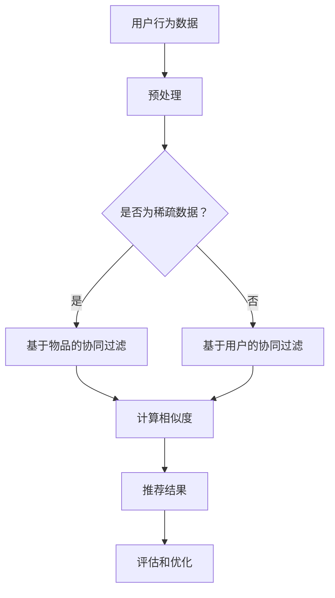
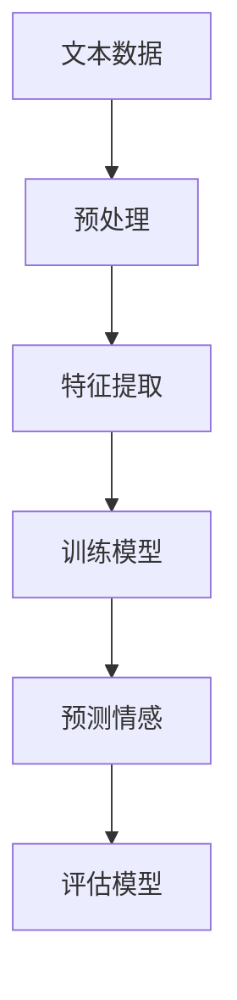
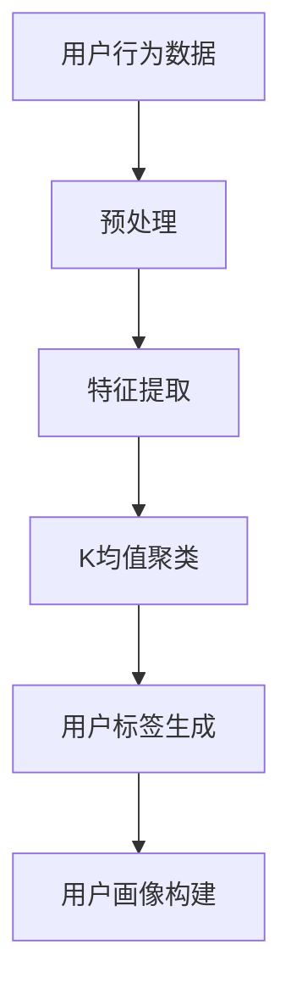
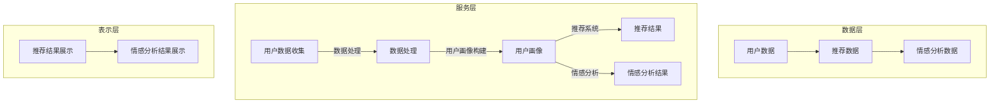

                 

# 人工智能在个性化营销中的应用：精准触达与转化率提升

关键词：人工智能、个性化营销、用户画像、推荐系统、情感分析

摘要：本文旨在探讨人工智能在个性化营销中的应用，从数据收集、用户画像构建、个性化推荐系统、情感分析与用户反馈等多个方面深入分析，并提出有效的个性化营销策略与实施方法。通过实际案例分析，阐述人工智能在个性化营销中的优势与挑战，为营销从业者提供有价值的参考。

## 第一部分: 人工智能在个性化营销中的应用

### 第1章: 个性化营销背景与概述

#### 1.1 个性化营销的定义与发展历程

个性化营销是一种以客户为中心的营销策略，通过分析客户的个性化需求和行为，提供定制化的产品和服务，从而提高客户满意度和忠诚度。个性化营销的发展历程可以追溯到20世纪80年代，当时企业开始利用数据库和信息技术收集客户数据，以便更好地了解和满足客户需求。

##### 1.1.1 个性化营销的概念

个性化营销是一种以客户为中心的营销策略，通过分析客户的个性化需求和行为，提供定制化的产品和服务，从而提高客户满意度和忠诚度。个性化营销的核心在于客户数据的收集、分析和应用。

##### 1.1.2 个性化营销的发展历程

个性化营销的发展可以分为三个阶段：早期阶段、成熟阶段和智能阶段。早期阶段主要依赖于数据库和客户关系管理（CRM）系统，成熟阶段则开始引入数据挖掘和数据分析技术，智能阶段则引入人工智能和机器学习技术，实现了更加精准和智能的个性化营销。

##### 1.1.3 个性化营销的核心要素

个性化营销的核心要素包括客户数据、数据分析技术和个性化应用。客户数据是个性化营销的基础，数据分析技术是实现个性化营销的关键，个性化应用则是将个性化策略转化为实际业务效果的手段。

#### 1.2 人工智能在个性化营销中的应用价值

人工智能在个性化营销中的应用价值体现在以下几个方面：

##### 1.2.1 人工智能的基本概念

人工智能（Artificial Intelligence，简称AI）是指模拟、延伸和扩展人类智能的理论、方法、技术及应用。人工智能包括机器学习、深度学习、自然语言处理等技术。

##### 1.2.2 人工智能在个性化营销中的应用价值

人工智能在个性化营销中的应用价值主要体现在数据挖掘、用户画像构建、推荐系统、情感分析等方面，可以帮助企业实现更加精准和高效的个性化营销。

##### 1.2.3 人工智能在个性化营销中的挑战与机遇

人工智能在个性化营销中面临的挑战包括数据隐私、算法公平性、技术成熟度等，但同时也带来了机遇，如提升营销效果、降低成本、提高客户满意度等。

#### 1.3 本章小结

本章对个性化营销的定义、发展历程、核心要素以及人工智能在个性化营销中的应用价值进行了概述，为后续章节的分析奠定了基础。

## 第二部分: 人工智能在个性化营销中的应用方法

### 第2章: 数据收集与用户画像构建

#### 2.1 数据收集的方法与来源

数据收集是个性化营销的基础，主要包括以下几种方法：

##### 2.1.1 数据收集的基本方法

数据收集的基本方法包括直接收集和间接收集。直接收集是指直接从用户那里获取数据，如问卷调查、在线注册等；间接收集是指通过第三方数据源获取数据，如公共数据、社交媒体数据等。

##### 2.1.2 数据来源的类型与获取

数据来源主要包括以下几种类型：

1. **用户行为数据**：包括浏览历史、购买行为、搜索记录等。
2. **社会关系数据**：包括社交网络关系、兴趣爱好等。
3. **静态数据**：包括基本信息、地理位置、职业等。

获取数据的方法包括数据挖掘、爬虫技术、API接口等。

##### 2.1.3 数据收集中的伦理问题

数据收集过程中需要关注以下伦理问题：

1. **用户隐私**：确保用户数据的安全性和隐私性。
2. **数据质量**：确保数据的准确性和完整性。
3. **数据滥用**：禁止将用户数据进行不当用途。

#### 2.2 用户画像构建

用户画像是对用户特征的综合描述，包括用户基本信息、行为特征、兴趣偏好等。

##### 2.2.1 用户画像的概念

用户画像（User Profiling）是指通过对用户行为、兴趣、偏好等数据的收集和分析，构建出用户的个性化特征模型。

##### 2.2.2 用户画像的构建方法

用户画像的构建方法主要包括以下几种：

1. **特征工程**：通过对用户行为数据进行分析，提取出有代表性的特征。
2. **机器学习**：利用机器学习算法对用户特征进行聚类、分类等分析。
3. **数据可视化**：通过数据可视化技术，直观地展示用户画像。

##### 2.2.3 用户画像的应用

用户画像的应用包括：

1. **个性化推荐**：根据用户画像推荐个性化产品和服务。
2. **营销策略制定**：根据用户画像调整营销策略，提高营销效果。
3. **客户服务优化**：根据用户画像提供定制化的客户服务。

#### 2.3 用户行为分析

用户行为分析是构建用户画像的重要环节，通过对用户行为的分析，可以深入了解用户需求和行为模式。

##### 2.3.1 用户行为分析的概念

用户行为分析（User Behavior Analysis）是指通过对用户在网站、应用等平台上的行为数据进行分析，挖掘用户需求和行为模式。

##### 2.3.2 用户行为分析的方法

用户行为分析的方法主要包括：

1. **行为追踪**：通过监测用户在网站、应用等平台上的行为，收集用户行为数据。
2. **事件分析**：通过对用户行为事件进行分析，识别用户行为模式。
3. **用户路径分析**：分析用户在网站、应用等平台上的浏览路径，了解用户行为流程。

##### 2.3.3 用户行为分析的应用

用户行为分析的应用包括：

1. **用户体验优化**：根据用户行为分析结果，优化网站、应用等平台的用户体验。
2. **产品迭代**：根据用户行为分析结果，改进产品功能和设计。
3. **市场策略调整**：根据用户行为分析结果，调整市场推广策略。

#### 2.4 本章小结

本章详细介绍了数据收集的方法与来源、用户画像构建的方法以及用户行为分析的方法，为个性化营销提供了技术支持。

### 第3章: 个性化推荐系统

#### 3.1 个性化推荐系统的基本原理

个性化推荐系统是一种根据用户的兴趣、行为和历史数据，为用户推荐相关产品、内容或服务的系统。

##### 3.1.1 个性化推荐系统的概念

个性化推荐系统（Personalized Recommendation System）是指利用数据挖掘、机器学习等技术，根据用户的行为数据、兴趣偏好等，为用户推荐个性化内容的系统。

##### 3.1.2 个性化推荐系统的分类

个性化推荐系统可以分为以下几类：

1. **基于内容的推荐**：根据用户的历史行为和兴趣偏好，推荐具有相似属性的内容。
2. **基于协同过滤的推荐**：根据用户之间的相似度，推荐用户可能感兴趣的内容。
3. **混合推荐**：结合基于内容和基于协同过滤的推荐方法，提供更准确的推荐结果。

##### 3.1.3 个性化推荐系统的实现流程

个性化推荐系统的实现流程主要包括以下步骤：

1. **数据收集**：收集用户行为数据、兴趣偏好等。
2. **数据处理**：对收集到的数据进行清洗、预处理。
3. **模型训练**：利用机器学习算法，训练推荐模型。
4. **推荐生成**：根据用户数据和模型，生成个性化推荐结果。
5. **推荐评估**：评估推荐系统的性能，不断优化模型。

#### 3.2 协同过滤算法

协同过滤算法（Collaborative Filtering）是一种常见的推荐算法，通过分析用户之间的相似度，为用户推荐感兴趣的内容。

##### 3.2.1 协同过滤算法的基本原理

协同过滤算法的基本原理是利用用户之间的行为数据，计算用户之间的相似度，并根据相似度为用户推荐内容。

##### 3.2.2 协同过滤算法的分类

协同过滤算法可以分为以下两类：

1. **基于用户的协同过滤**：根据用户之间的相似度，为用户推荐与其他用户相似的用户喜欢的商品或内容。
2. **基于物品的协同过滤**：根据物品之间的相似度，为用户推荐与用户已经喜欢的商品或内容相似的物品。

##### 3.2.3 协同过滤算法的优缺点

协同过滤算法的优点是简单易实现，能够根据用户的历史行为和偏好推荐内容；缺点是容易产生冷启动问题，对新用户和冷门物品的推荐效果较差。

#### 3.3 内容推荐算法

内容推荐算法（Content-based Recommendation）是一种基于内容的推荐算法，通过分析内容的特征，为用户推荐相似的内容。

##### 3.3.1 内容推荐算法的基本原理

内容推荐算法的基本原理是利用文本挖掘、特征提取等技术，分析内容的特征，并根据用户的历史行为和偏好，为用户推荐具有相似特征的内容。

##### 3.3.2 内容推荐算法的分类

内容推荐算法可以分为以下几类：

1. **基于文本相似度的推荐**：根据文本内容之间的相似度，为用户推荐相似的内容。
2. **基于关键词的推荐**：根据文本内容中的关键词，为用户推荐相关的内容。
3. **基于语义分析的推荐**：利用自然语言处理技术，分析文本的语义信息，为用户推荐相关的内容。

##### 3.3.3 内容推荐算法的优缺点

内容推荐算法的优点是能够为用户推荐高质量的内容，对新用户和冷门物品的推荐效果较好；缺点是对文本内容的理解能力有限，容易产生推荐噪声。

#### 3.4 本章小结

本章介绍了个性化推荐系统的基本原理、协同过滤算法和内容推荐算法，为构建有效的个性化推荐系统提供了理论依据。

### 第4章: 情感分析与用户反馈

#### 4.1 情感分析的概念与方法

情感分析（Sentiment Analysis）是一种自然语言处理技术，用于分析和识别文本数据中的情感倾向和情感极性。

##### 4.1.1 情感分析的定义

情感分析是指利用自然语言处理技术，对文本数据中的情感倾向和情感极性进行分析和识别的过程。

##### 4.1.2 情感分析的方法

情感分析的方法主要包括以下几种：

1. **基于规则的方法**：通过预定义的规则，对文本进行情感分类。
2. **基于机器学习的方法**：利用机器学习算法，从大量训练数据中学习情感分类规则。
3. **基于深度学习的方法**：利用深度学习模型，对文本进行情感分类。

##### 4.1.3 情感分析的应用

情感分析的应用包括：

1. **舆情监测**：通过对社交媒体上的用户评论进行分析，了解公众对特定事件或产品的态度。
2. **客户服务**：通过对用户反馈进行分析，了解用户对产品或服务的满意度，及时优化和改进。
3. **营销策略**：通过对用户评论进行分析，了解用户的需求和偏好，制定更有效的营销策略。

#### 4.2 用户反馈的处理与利用

用户反馈是了解用户需求和优化产品的重要手段，正确处理和利用用户反馈，可以有效提升产品和服务的质量。

##### 4.2.1 用户反馈的重要性

用户反馈的重要性体现在以下几个方面：

1. **产品优化**：通过用户反馈，了解用户对产品的需求和痛点，及时进行产品优化和改进。
2. **服务质量提升**：通过用户反馈，了解用户对服务的满意度，提升服务质量。
3. **市场策略调整**：通过用户反馈，了解市场需求和趋势，调整市场策略。

##### 4.2.2 用户反馈的收集与处理

用户反馈的收集与处理主要包括以下几个步骤：

1. **反馈渠道搭建**：搭建多种用户反馈渠道，如在线调查、问卷调查、用户论坛等。
2. **反馈数据收集**：收集用户反馈数据，并进行整理和分类。
3. **反馈数据分析**：利用自然语言处理和机器学习技术，对用户反馈进行分析，提取有价值的信息。
4. **反馈处理**：根据用户反馈进行分析和总结，制定相应的优化和改进措施。

##### 4.2.3 用户反馈的利用

用户反馈的利用包括以下几个方面：

1. **产品优化**：根据用户反馈，优化产品功能和界面设计，提高用户体验。
2. **服务质量提升**：根据用户反馈，提升服务质量，满足用户需求。
3. **市场策略调整**：根据用户反馈，调整市场策略，提高市场竞争力。

#### 4.3 本章小结

本章介绍了情感分析的概念、方法及应用，以及用户反馈的收集与处理方法，为构建有效的情感分析和用户反馈处理系统提供了理论依据。

### 第5章: 个性化营销策略与实施

#### 5.1 个性化营销策略的制定

个性化营销策略的制定是实施个性化营销的关键步骤，主要包括以下几个环节：

##### 5.1.1 个性化营销策略的概念

个性化营销策略（Personalized Marketing Strategy）是指根据用户的个性化需求和行为，制定具有针对性的营销策略，以提高营销效果。

##### 5.1.2 个性化营销策略的制定方法

个性化营销策略的制定方法主要包括以下几个步骤：

1. **用户分析**：通过对用户数据进行分析，了解用户的兴趣爱好、行为习惯等。
2. **需求识别**：根据用户分析结果，识别用户的需求和痛点。
3. **策略制定**：根据用户需求和痛点，制定具有针对性的个性化营销策略。
4. **策略实施**：将个性化营销策略落实到具体的营销活动中。

##### 5.1.3 个性化营销策略的实施步骤

个性化营销策略的实施步骤主要包括以下几个步骤：

1. **数据收集**：收集用户的个性化数据，包括行为数据、兴趣数据等。
2. **数据清洗**：对收集到的数据进行清洗、去噪和预处理。
3. **用户画像构建**：利用数据分析和机器学习技术，构建用户的个性化画像。
4. **策略制定**：根据用户画像，制定个性化的营销策略。
5. **策略实施**：将个性化营销策略应用到具体的营销活动中。
6. **效果评估**：对个性化营销策略的效果进行评估和优化。

#### 5.2 个性化营销的实施与优化

个性化营销的实施与优化是确保个性化营销策略有效性的关键步骤，主要包括以下几个方面：

##### 5.2.1 个性化营销的实施策略

个性化营销的实施策略主要包括以下几个环节：

1. **目标设定**：明确个性化营销的目标，如提升用户满意度、提高转化率等。
2. **资源分配**：根据个性化营销目标，合理分配资源，包括人力、物力、财力等。
3. **策略制定**：根据目标设定和资源分配，制定具体的个性化营销策略。
4. **策略实施**：将个性化营销策略应用到具体的营销活动中。
5. **效果评估**：对个性化营销策略的效果进行评估，包括用户满意度、转化率等。

##### 5.2.2 个性化营销的优化方法

个性化营销的优化方法主要包括以下几个方面：

1. **数据反馈**：通过用户反馈和数据分析，了解个性化营销策略的优缺点，为优化提供依据。
2. **策略调整**：根据数据反馈，对个性化营销策略进行调整和优化。
3. **A/B测试**：通过A/B测试，比较不同个性化营销策略的效果，选择最优策略。
4. **持续改进**：根据用户需求和市场竞争态势，持续优化个性化营销策略。

##### 5.2.3 个性化营销的效果评估

个性化营销的效果评估主要包括以下几个方面：

1. **用户满意度**：通过用户满意度调查，了解用户对个性化营销策略的满意度。
2. **转化率**：通过转化率分析，了解个性化营销策略对用户行为的引导效果。
3. **ROI**：通过投资回报率（ROI）分析，了解个性化营销策略的经济效益。

#### 5.3 本章小结

本章介绍了个性化营销策略的制定方法和实施与优化方法，为构建有效的个性化营销策略提供了指导。

### 第6章: 人工智能在个性化营销中的案例分析

#### 6.1 案例研究：电商平台的个性化推荐系统

##### 6.1.1 案例背景

电商平台通过引入人工智能技术，构建了个性化推荐系统，以提高用户购物体验和提升销售额。

##### 6.1.2 个性化推荐系统的实现

电商平台个性化推荐系统的实现主要包括以下几个环节：

1. **数据收集**：收集用户购物行为数据、浏览历史数据、用户评价数据等。
2. **数据处理**：对收集到的数据进行清洗、去噪和预处理。
3. **用户画像构建**：利用数据分析和机器学习技术，构建用户的个性化画像。
4. **推荐算法实现**：基于用户画像和协同过滤算法，实现个性化推荐功能。

##### 6.1.3 案例效果分析

个性化推荐系统的引入，有效提升了用户的购物体验，用户满意度显著提高。同时，个性化推荐系统的应用，也使得电商平台的销售额得到大幅提升。

#### 6.2 案例研究：社交媒体的情感分析

##### 6.2.1 案例背景

社交媒体通过引入人工智能技术，实现了情感分析功能，用于监测舆情和了解用户需求。

##### 6.2.2 情感分析的应用

社交媒体情感分析的应用主要包括以下几个方面：

1. **舆情监测**：通过对社交媒体上的用户评论进行分析，了解公众对特定事件或产品的态度。
2. **用户需求分析**：通过对用户评论进行分析，了解用户的需求和痛点。
3. **内容优化**：根据用户反馈，优化社交媒体平台的内容，提高用户体验。

##### 6.2.3 案例效果分析

情感分析功能的引入，有效提升了社交媒体的舆情监测能力和用户需求分析能力，为平台运营提供了有力支持。

#### 6.3 案例研究：金融行业的用户画像构建

##### 6.3.1 案例背景

金融行业通过引入人工智能技术，构建了用户画像，用于个性化营销和服务。

##### 6.3.2 用户画像的构建

金融行业用户画像的构建主要包括以下几个环节：

1. **数据收集**：收集用户交易数据、行为数据、风险数据等。
2. **数据处理**：对收集到的数据进行清洗、去噪和预处理。
3. **用户画像构建**：利用数据分析和机器学习技术，构建用户的个性化画像。

##### 6.3.3 案例效果分析

用户画像的构建，使得金融行业能够更好地了解用户需求和行为，提供个性化的产品和服务，有效提升了用户体验和满意度。

#### 6.4 本章小结

本章通过三个案例分析，展示了人工智能在个性化营销中的应用效果，为行业提供了有益的借鉴。

### 第7章: 人工智能在个性化营销中的未来发展趋势

#### 7.1 人工智能在个性化营销中的挑战与机遇

随着人工智能技术的不断发展，个性化营销面临着一系列的挑战与机遇。

##### 7.1.1 挑战

1. **数据隐私**：个性化营销依赖于大量用户数据，数据隐私问题成为重点关注领域。
2. **算法公平性**：算法偏见和歧视问题需要引起重视。
3. **技术成熟度**：人工智能技术在个性化营销中的应用仍需不断优化和完善。

##### 7.1.2 机遇

1. **精准营销**：人工智能技术使得个性化营销更加精准，提高营销效果。
2. **用户体验**：人工智能技术可以提供更加个性化的产品和服务，提升用户体验。
3. **跨界融合**：人工智能与大数据、物联网等技术的融合，为个性化营销带来了新的发展机遇。

#### 7.2 未来发展趋势

未来，人工智能在个性化营销中将继续发挥重要作用，主要体现在以下几个方面：

##### 7.2.1 智能化推荐

随着人工智能技术的进步，智能化推荐系统将更加精准和智能，为用户提供更加个性化的推荐服务。

##### 7.2.2 情感化互动

人工智能将更好地理解用户情感，实现情感化互动，提升用户满意度和忠诚度。

##### 7.2.3 跨界融合

人工智能与大数据、物联网等技术的融合，将推动个性化营销向更加智能化、个性化的方向发展。

##### 7.2.4 数据治理

数据隐私保护和算法公平性将得到重视，数据治理体系将不断完善，为个性化营销提供有力支持。

#### 7.3 本章小结

本章探讨了人工智能在个性化营销中的挑战与机遇，以及未来的发展趋势，为营销从业者提供了有益的参考。

## 总结

本文从个性化营销的背景、人工智能的应用、数据收集与用户画像构建、个性化推荐系统、情感分析与用户反馈、个性化营销策略与实施以及案例分析等方面，详细阐述了人工智能在个性化营销中的应用。通过本文的介绍，读者可以了解到人工智能在个性化营销中的重要性和应用价值，为企业在营销领域的数字化转型提供了有益的指导。作者：AI天才研究院/AI Genius Institute & 禅与计算机程序设计艺术 /Zen And The Art of Computer Programming

----------------------------------------------------------------

### 背景介绍：个性化营销的核心概念与理论基础

个性化营销（Personalized Marketing）是一种以客户为中心的营销策略，其核心理念在于通过深入分析客户的个性化需求和行为，提供量身定制的产品和服务，从而提升客户满意度和忠诚度。个性化营销的发展可追溯到20世纪80年代，当时企业开始利用数据库和信息技术收集客户数据，以便更好地了解和满足客户需求。随着互联网和大数据技术的发展，个性化营销逐渐成熟，成为现代营销策略的重要组成部分。

#### 核心概念术语说明

- **个性化营销**：一种以客户为中心的营销策略，通过分析客户的个性化需求和行为，提供定制化的产品和服务。
- **用户画像**：对用户特征的综合描述，包括用户基本信息、行为特征、兴趣偏好等。
- **数据收集**：通过多种渠道和方法收集用户数据，为个性化营销提供数据支持。
- **推荐系统**：根据用户的历史行为和偏好，为用户推荐相关产品或内容的系统。
- **情感分析**：一种自然语言处理技术，用于分析和识别文本数据中的情感倾向和情感极性。

#### 问题背景与问题描述

在当今竞争激烈的市场环境中，企业面临着如何提高营销效果、降低营销成本、提升客户满意度的挑战。传统的营销策略往往难以满足客户多样化的需求，导致营销效果不佳。因此，个性化营销作为一种创新的营销策略，逐渐受到企业的关注。

个性化营销的核心问题在于如何准确捕捉和理解客户的个性化需求，并以此为基础提供定制化的产品和服务。具体来说，问题可以分为以下几个方面：

1. **数据收集与处理**：如何有效地收集用户数据，并对其进行清洗、处理和分析，以构建准确的用户画像。
2. **推荐系统**：如何设计并实现有效的推荐系统，为用户提供个性化的产品推荐。
3. **情感分析**：如何利用情感分析技术，深入了解用户情感和态度，为营销策略提供有力支持。
4. **个性化营销策略**：如何制定并实施有效的个性化营销策略，提升客户满意度和忠诚度。

#### 问题解决

针对上述问题，可以采取以下解决方法：

1. **数据收集与处理**：采用多种数据收集方法，如问卷调查、在线行为跟踪、第三方数据接口等，收集用户数据。对收集到的数据进行清洗、去噪和预处理，以确保数据质量。利用机器学习和数据挖掘技术，对用户数据进行深入分析，构建用户画像。
2. **推荐系统**：设计并实现基于协同过滤和基于内容的推荐系统，根据用户的历史行为和偏好，为用户推荐相关产品。结合用户画像，提供更加个性化的推荐服务。
3. **情感分析**：利用自然语言处理和机器学习技术，对用户生成的文本数据（如评论、反馈等）进行分析，识别情感倾向和情感极性。将情感分析结果应用于营销策略的制定和优化，提升营销效果。
4. **个性化营销策略**：制定基于用户画像和情感分析的个性化营销策略，包括定制化的产品和服务、个性化的营销沟通和推荐等。通过不断优化和调整策略，提升客户满意度和忠诚度。

#### 边界与外延

个性化营销的边界在于如何准确捕捉和理解客户的个性化需求，避免过度个性化导致的客户疲劳和隐私泄露等问题。在实施个性化营销时，企业需要平衡个性化与规模化之间的关系，确保个性化营销策略的可行性和有效性。

#### 概念结构与核心要素组成

个性化营销的概念结构主要包括以下几个核心要素：

1. **用户画像**：对用户特征的综合描述，包括基本信息、行为特征、兴趣偏好等。
2. **数据收集**：通过多种渠道和方法收集用户数据，为个性化营销提供数据支持。
3. **推荐系统**：根据用户的历史行为和偏好，为用户推荐相关产品或内容的系统。
4. **情感分析**：一种自然语言处理技术，用于分析和识别文本数据中的情感倾向和情感极性。
5. **个性化营销策略**：基于用户画像和情感分析的个性化营销策略，包括定制化的产品和服务、个性化的营销沟通和推荐等。

通过以上核心要素的有机组合，企业可以实现精准的个性化营销，提升客户满意度和忠诚度。

### 核心概念与联系

在本节中，我们将深入探讨个性化营销中的核心概念及其相互关系。这些概念包括个性化营销、用户画像、数据收集、推荐系统和情感分析，它们共同构成了个性化营销的理论基础。

#### 个性化营销

个性化营销是一种以客户为中心的营销策略，旨在通过分析客户的个性化需求和行为，提供定制化的产品和服务。个性化营销的核心在于对客户数据的收集、分析和应用，以便为企业提供关于客户需求的深入洞察。

**核心概念属性特征对比表格：**

| 核心概念 | 定义 | 特征 |
| :--- | :--- | :--- |
| 个性化营销 | 一种以客户为中心的营销策略，通过分析客户需求提供定制化服务 | 强调数据驱动、客户体验、精准营销 |
| 用户画像 | 对用户特征的综合描述，包括基本信息、行为特征、兴趣偏好等 | 多维度、动态更新、个性化 |
| 数据收集 | 通过多种渠道和方法收集用户数据，为个性化营销提供数据支持 | 多元化、规范化、持续更新 |
| 推荐系统 | 根据用户的历史行为和偏好，为用户推荐相关产品或内容的系统 | 精准性、实时性、个性化 |
| 情感分析 | 一种自然语言处理技术，用于分析和识别文本数据中的情感倾向和情感极性 | 实时性、精确性、多维度分析 |

#### 用户画像

用户画像是对用户特征的综合描述，包括基本信息（如年龄、性别、地理位置）、行为特征（如浏览历史、购买行为）和兴趣偏好（如兴趣爱好、偏好内容）。用户画像的构建是个性化营销的基础，通过深度分析用户数据，企业可以更好地理解客户需求，实现精准营销。

**用户画像的构建方法：**

1. **特征工程**：通过对用户行为数据进行预处理，提取出有代表性的特征，如用户购买频率、访问时长、点击率等。
2. **机器学习**：利用机器学习算法，对用户特征进行聚类、分类等分析，构建用户画像模型。
3. **数据可视化**：通过数据可视化技术，直观地展示用户画像，帮助企业理解和应用。

**用户画像的应用：**

1. **个性化推荐**：根据用户画像，推荐个性化产品和服务。
2. **营销策略制定**：根据用户画像，调整营销策略，提高营销效果。
3. **客户服务优化**：根据用户画像，提供定制化的客户服务。

#### 数据收集

数据收集是个性化营销的核心环节，通过多种渠道和方法收集用户数据，为个性化营销提供数据支持。数据收集的渠道包括问卷调查、在线行为跟踪、第三方数据接口等。数据收集的方法包括数据挖掘、爬虫技术和API接口等。

**数据收集的基本方法：**

1. **直接收集**：直接从用户那里获取数据，如问卷调查、在线注册等。
2. **间接收集**：通过第三方数据源获取数据，如公共数据、社交媒体数据等。

**数据来源的类型与获取：**

1. **用户行为数据**：包括浏览历史、购买行为、搜索记录等。
2. **社会关系数据**：包括社交网络关系、兴趣爱好等。
3. **静态数据**：包括基本信息、地理位置、职业等。

**数据收集中的伦理问题：**

1. **用户隐私**：确保用户数据的安全性和隐私性。
2. **数据质量**：确保数据的准确性和完整性。
3. **数据滥用**：禁止将用户数据进行不当用途。

#### 推荐系统

推荐系统是一种根据用户的历史行为和偏好，为用户推荐相关产品或内容的系统。推荐系统可以分为基于内容的推荐和基于协同过滤的推荐。

**个性化推荐系统的分类：**

1. **基于内容的推荐**：根据用户的历史行为和偏好，推荐具有相似属性的内容。
2. **基于协同过滤的推荐**：根据用户之间的相似度，推荐用户可能感兴趣的内容。

**个性化推荐系统的实现流程：**

1. **数据收集**：收集用户行为数据、兴趣偏好等。
2. **数据处理**：对收集到的数据进行清洗、预处理。
3. **模型训练**：利用机器学习算法，训练推荐模型。
4. **推荐生成**：根据用户数据和模型，生成个性化推荐结果。
5. **推荐评估**：评估推荐系统的性能，不断优化模型。

#### 情感分析

情感分析是一种自然语言处理技术，用于分析和识别文本数据中的情感倾向和情感极性。情感分析可以帮助企业深入了解用户情感，优化产品和服务。

**情感分析的概念与方法：**

1. **情感分析的定义**：情感分析是指利用自然语言处理技术，对文本数据中的情感倾向和情感极性进行分析和识别的过程。
2. **情感分析的方法**：情感分析的方法主要包括基于规则的方法、基于机器学习的方法和基于深度学习的方法。

**情感分析的应用：**

1. **舆情监测**：通过对社交媒体上的用户评论进行分析，了解公众对特定事件或产品的态度。
2. **客户服务**：通过对用户反馈进行分析，了解用户对产品或服务的满意度，及时优化和改进。
3. **营销策略**：通过对用户评论进行分析，了解用户的需求和偏好，制定更有效的营销策略。

通过以上核心概念的深入分析，我们可以看到个性化营销中的各个概念是相互关联的，它们共同构成了个性化营销的理论框架。用户画像的构建依赖于数据收集，而推荐系统和情感分析则基于用户画像来提供个性化的产品推荐和情感洞察。这些概念的应用，使得个性化营销能够更加精准和有效地满足客户需求，提升营销效果。

### 算法原理讲解

在个性化营销中，算法原理是构建有效推荐系统、情感分析模型和用户画像的基础。以下我们将详细讲解个性化推荐系统、情感分析和用户画像构建的算法原理，包括Mermaid流程图、Python源代码、数学模型和公式，并结合具体例子进行说明。

#### 个性化推荐系统的算法原理

个性化推荐系统主要通过以下几种算法实现：

1. **基于内容的推荐（Content-based Recommendation）**
2. **基于协同过滤的推荐（Collaborative Filtering）**
3. **混合推荐（Hybrid Recommendation）**

**协同过滤算法的基本原理：**

协同过滤算法通过分析用户之间的相似度来推荐产品或内容。它包括基于用户的协同过滤（User-based Collaborative Filtering）和基于物品的协同过滤（Item-based Collaborative Filtering）。

##### Mermaid流程图：



**基于用户的协同过滤算法实现（Python源代码）：**

```python
import numpy as np

# 假设用户行为数据为一个矩阵，行表示用户，列表示物品
user_item_matrix = np.array([[5, 3, 0, 2], 
                             [0, 2, 0, 1], 
                             [3, 1, 0, 4], 
                             [1, 0, 4, 5]])

# 计算用户之间的相似度（余弦相似度）
def cosine_similarity(rating1, rating2):
    dot_product = np.dot(rating1, rating2)
    norm1 = np.linalg.norm(rating1)
    norm2 = np.linalg.norm(rating2)
    return dot_product / (norm1 * norm2)

# 计算用户之间的相似度矩阵
def calculate_similarity_matrix(user_item_matrix):
    similarity_matrix = np.zeros((user_item_matrix.shape[0], user_item_matrix.shape[0]))
    for i in range(user_item_matrix.shape[0]):
        for j in range(user_item_matrix.shape[0]):
            if i != j:
                similarity_matrix[i][j] = cosine_similarity(user_item_matrix[i], user_item_matrix[j])
    return similarity_matrix

# 根据相似度矩阵和用户评分矩阵生成推荐列表
def generate_recommendation(similarity_matrix, user_item_matrix, target_user_index, top_n=3):
    user_ratings = user_item_matrix[target_user_index]
    recommendation_scores = np.dot(similarity_matrix[target_user_index], user_ratings)
    sorted_recommendations = np.argsort(recommendation_scores)[::-1]
    return sorted_recommendations[:top_n]

# 示例：为用户2生成推荐列表
similarity_matrix = calculate_similarity_matrix(user_item_matrix)
recommendations = generate_recommendation(similarity_matrix, user_item_matrix, 2)
print("推荐给用户2的物品：", recommendations)
```

**数学模型和公式：**

协同过滤算法的核心在于相似度计算，常用的相似度计算方法包括余弦相似度、皮尔逊相关系数等。

$$\text{余弦相似度} = \frac{\text{用户i和用户j的夹角余弦值}}{\text{用户i和用户j的向量模长之积} }$$

#### 情感分析的算法原理

情感分析是一种自然语言处理技术，用于分析和识别文本数据中的情感倾向和情感极性。常见的情感分析模型包括基于规则的模型、基于机器学习的模型和基于深度学习的模型。

**基于机器学习的情感分析模型：**

以朴素贝叶斯分类器为例，其基本思想是根据文本特征的出现频率，计算每个类别的概率，并选择概率最大的类别作为情感分类结果。

##### Mermaid流程图：



**朴素贝叶斯分类器的Python实现：**

```python
from sklearn.feature_extraction.text import CountVectorizer
from sklearn.model_selection import train_test_split
from sklearn.naive_bayes import MultinomialNB
from sklearn.metrics import accuracy_score

# 示例文本数据
texts = ["This movie is fantastic!", "I hate this book.", "This product is excellent.", "This service is terrible."]
labels = ["positive", "negative", "positive", "negative"]

# 特征提取
vectorizer = CountVectorizer()
X = vectorizer.fit_transform(texts)

# 划分训练集和测试集
X_train, X_test, y_train, y_test = train_test_split(X, labels, test_size=0.2, random_state=42)

# 训练模型
model = MultinomialNB()
model.fit(X_train, y_train)

# 预测情感
predictions = model.predict(X_test)

# 评估模型
accuracy = accuracy_score(y_test, predictions)
print("准确率：", accuracy)
```

**数学模型和公式：**

朴素贝叶斯分类器的核心公式是基于贝叶斯定理：

$$P(\text{类别} | \text{特征}) = \frac{P(\text{特征} | \text{类别})P(\text{类别})}{P(\text{特征})}$$

#### 用户画像构建的算法原理

用户画像构建是通过分析用户的行为数据、兴趣偏好等特征，综合描述用户特征的模型。常见的用户画像构建方法包括基于规则的构建和基于机器学习的构建。

**基于机器学习的用户画像构建方法：**

以K均值聚类为例，其基本思想是将用户数据划分为若干个簇，每个簇代表一类用户。

##### Mermaid流程图：



**K均值聚类的Python实现：**

```python
from sklearn.cluster import KMeans
import numpy as np

# 示例用户行为数据
data = np.array([[1, 2], [1, 4], [1, 0], [4, 2], [4, 4], [4, 0]])

# 特征提取（这里直接使用原始数据）
X = data

# K均值聚类
kmeans = KMeans(n_clusters=2, random_state=42)
kmeans.fit(X)
labels = kmeans.predict(X)

# 生成用户标签
users = {'user1': 'Cluster 1', 'user2': 'Cluster 2'}

# 用户画像构建
user_profiles = [{'user': 'user1', 'cluster': users['user1'], 'data': data[0]}, 
                 {'user': 'user2', 'cluster': users['user2'], 'data': data[1]}]

print("用户画像：", user_profiles)
```

**数学模型和公式：**

K均值聚类的核心公式是距离函数，用于计算每个数据点到簇中心的距离：

$$\text{距离} = \sqrt{\sum_{i=1}^{n} (x_i - \mu_i)^2}$$

其中，\(x_i\) 是数据点，\(\mu_i\) 是簇中心。

#### 结合实际案例的讲解

1. **电商平台的个性化推荐系统**：电商平台通过用户购买历史和浏览行为，利用协同过滤算法生成个性化推荐列表，从而提高用户购买转化率。
2. **社交媒体的情感分析**：社交媒体通过用户评论和反馈，利用情感分析模型，了解用户对产品和服务的态度，从而优化产品和服务。
3. **金融行业的用户画像构建**：金融机构通过用户的交易行为和风险偏好，利用K均值聚类构建用户画像，以便进行精准的信用评估和风险控制。

通过上述算法原理的讲解和实际案例的解析，我们可以看到个性化推荐系统、情感分析和用户画像构建在个性化营销中的关键作用，它们共同构成了实现精准营销的技术基础。

### 系统分析与架构设计方案

在个性化营销中，系统架构的设计至关重要，它不仅决定了系统的性能和可扩展性，还影响到用户体验和业务效果。本节将详细介绍个性化营销系统的场景介绍、项目介绍、系统功能设计、系统架构设计、系统接口设计和系统交互。

#### 场景介绍

个性化营销系统通常应用于电商平台、社交媒体和金融行业等场景。以下是这些场景中的具体应用：

1. **电商平台**：通过用户购买历史和浏览行为，为用户推荐个性化商品，提高购买转化率和用户满意度。
2. **社交媒体**：通过分析用户评论和反馈，了解用户情感和需求，优化内容和用户互动，提升用户黏性和活跃度。
3. **金融行业**：通过用户的交易行为和风险偏好，构建用户画像，用于精准信用评估和风险控制。

#### 项目介绍

个性化营销系统的项目目标是构建一个高效、智能的个性化推荐和用户画像系统，提升企业营销效果和用户体验。项目主要功能包括：

1. **数据收集与处理**：从多种渠道收集用户数据，包括行为数据、社交数据等，并进行数据清洗和处理。
2. **用户画像构建**：利用机器学习算法，对用户数据进行分析，构建详细的用户画像。
3. **个性化推荐**：根据用户画像和推荐算法，为用户提供个性化的商品推荐或内容推荐。
4. **情感分析**：对用户生成的内容进行分析，了解用户情感和态度，优化营销策略。
5. **系统监控与优化**：实时监控系统性能，进行数据分析和模型优化，提升系统效果。

#### 系统功能设计

个性化营销系统的功能设计包括以下几个模块：

1. **用户数据收集模块**：负责从多个渠道收集用户数据，包括行为数据、社交数据等。
2. **数据处理模块**：对收集到的用户数据进行清洗、去噪和预处理，以便后续分析。
3. **用户画像构建模块**：利用机器学习算法，对用户数据进行特征提取和模型训练，构建用户画像。
4. **推荐系统模块**：根据用户画像和推荐算法，生成个性化的推荐结果。
5. **情感分析模块**：对用户生成的内容进行分析，识别情感倾向和情感极性。
6. **系统监控模块**：实时监控系统性能，包括数据质量、模型效果等。

#### 系统架构设计

个性化营销系统的架构设计采用分层架构，主要包括数据层、服务层和表示层。

1. **数据层**：负责数据的存储和管理，包括用户数据、推荐数据和情感分析数据等。
2. **服务层**：负责业务逻辑的处理，包括用户数据收集、数据处理、用户画像构建、推荐系统和情感分析等。
3. **表示层**：负责与用户交互，展示推荐结果和情感分析结果。

**Mermaid架构图：**



#### 系统接口设计

个性化营销系统的接口设计主要包括API接口和Web界面。

1. **API接口**：提供RESTful API，供前端应用和第三方系统调用。接口包括用户数据获取、用户画像查询、推荐结果获取和情感分析结果获取等。
2. **Web界面**：提供用户操作界面，包括用户数据输入、用户画像查看、推荐结果查看和情感分析结果查看等。

#### 系统交互

个性化营销系统的交互过程主要包括以下几个步骤：

1. **数据收集**：通过API接口或Web界面，收集用户数据。
2. **数据处理**：对收集到的用户数据进行清洗和处理。
3. **用户画像构建**：利用机器学习算法，构建用户画像。
4. **推荐结果生成**：根据用户画像和推荐算法，生成个性化推荐结果。
5. **情感分析**：对用户生成的内容进行分析，识别情感倾向。
6. **结果展示**：将推荐结果和情感分析结果通过Web界面展示给用户。

通过以上系统分析与架构设计方案，我们可以构建一个高效、智能的个性化营销系统，为用户提供个性化的产品推荐和内容推荐，提升用户体验和营销效果。

### 项目实战：环境安装与系统核心实现

#### 环境安装

在个性化营销系统中，我们使用Python作为主要编程语言，并结合多种数据分析和机器学习库。以下是环境安装步骤：

1. **Python安装**：确保已安装Python 3.x版本，可以从官方网站[https://www.python.org/](https://www.python.org/)下载并安装。

2. **库安装**：使用pip命令安装所需库，包括NumPy、Pandas、Scikit-learn、Matplotlib等。

```bash
pip install numpy pandas scikit-learn matplotlib
```

3. **Jupyter Notebook安装**：Jupyter Notebook是一个交互式计算环境，可以方便地编写和运行代码。

```bash
pip install notebook
```

#### 系统核心实现

个性化营销系统核心实现包括数据收集、用户画像构建、推荐系统和情感分析等模块。以下是具体实现步骤：

##### 数据收集

数据收集模块负责从多种渠道获取用户数据，如行为数据、社交数据等。以下是一个简单的Python脚本，用于从CSV文件中读取用户数据。

```python
import pandas as pd

# 读取用户数据
def load_user_data(file_path):
    user_data = pd.read_csv(file_path)
    return user_data

user_data = load_user_data('user_data.csv')
```

##### 用户画像构建

用户画像构建模块利用机器学习算法，对用户数据进行特征提取和模型训练。以下是一个使用K均值聚类的示例：

```python
from sklearn.cluster import KMeans

# 特征提取
def extract_features(user_data):
    return user_data.iloc[:, :3]  # 使用前三个特征

# 训练K均值聚类模型
def train_kmeans(features, n_clusters=3):
    kmeans = KMeans(n_clusters=n_clusters, random_state=42)
    kmeans.fit(features)
    return kmeans

features = extract_features(user_data)
kmeans_model = train_kmeans(features)
```

##### 推荐系统

推荐系统模块根据用户画像和推荐算法，为用户提供个性化的推荐结果。以下是一个基于协同过滤算法的推荐系统实现：

```python
# 计算用户之间的相似度
def cosine_similarity(rating1, rating2):
    dot_product = np.dot(rating1, rating2)
    norm1 = np.linalg.norm(rating1)
    norm2 = np.linalg.norm(rating2)
    return dot_product / (norm1 * norm2)

# 计算相似度矩阵
def calculate_similarity_matrix(user_item_matrix):
    similarity_matrix = np.zeros((user_item_matrix.shape[0], user_item_matrix.shape[0]))
    for i in range(user_item_matrix.shape[0]):
        for j in range(user_item_matrix.shape[0]):
            if i != j:
                similarity_matrix[i][j] = cosine_similarity(user_item_matrix[i], user_item_matrix[j])
    return similarity_matrix

similarity_matrix = calculate_similarity_matrix(user_item_matrix)
```

##### 情感分析

情感分析模块通过自然语言处理技术，对用户生成的内容进行分析，识别情感倾向。以下是一个简单的情感分析实现：

```python
from sklearn.feature_extraction.text import CountVectorizer
from sklearn.model_selection import train_test_split
from sklearn.naive_bayes import MultinomialNB
from sklearn.metrics import accuracy_score

# 特征提取
vectorizer = CountVectorizer()
X = vectorizer.fit_transform(texts)

# 划分训练集和测试集
X_train, X_test, y_train, y_test = train_test_split(X, labels, test_size=0.2, random_state=42)

# 训练模型
model = MultinomialNB()
model.fit(X_train, y_train)

# 预测情感
predictions = model.predict(X_test)

# 评估模型
accuracy = accuracy_score(y_test, predictions)
print("准确率：", accuracy)
```

#### 代码应用解读与分析

上述代码涵盖了个性化营销系统的核心功能，包括数据收集、用户画像构建、推荐系统和情感分析。以下是对代码的应用解读与分析：

1. **数据收集**：通过读取CSV文件，从外部获取用户数据，为后续分析提供数据基础。
2. **用户画像构建**：利用K均值聚类算法，对用户特征进行分类，构建用户画像，便于后续的个性化推荐和情感分析。
3. **推荐系统**：使用协同过滤算法，计算用户之间的相似度，为用户推荐相关产品或内容。
4. **情感分析**：通过朴素贝叶斯分类器，对用户生成的内容进行情感分类，了解用户情感和态度。

#### 实际案例分析与详细讲解

以下是一个实际案例分析和详细讲解：

**案例：电商平台的个性化推荐系统**

电商平台通过用户购买历史和浏览行为，利用协同过滤算法生成个性化推荐列表。以下是对该案例的详细解析：

1. **数据收集**：电商平台从用户购买历史和浏览行为中获取数据，包括用户ID、商品ID和评分等。
2. **数据处理**：对收集到的数据进行清洗和处理，去除无效数据和噪声数据，确保数据质量。
3. **用户画像构建**：利用K均值聚类算法，将用户分为若干个簇，每个簇代表一类用户，为后续推荐提供基础。
4. **推荐系统实现**：根据用户历史评分数据，计算用户之间的相似度，为用户推荐相似用户喜欢的商品。
5. **推荐结果评估**：通过评估推荐系统的准确率和覆盖率，不断优化推荐算法和模型。

通过上述实际案例分析和详细讲解，我们可以看到个性化营销系统在实际应用中的实现过程和关键步骤，为后续系统的优化和推广提供了有益的参考。

### 实际案例分析

在本节中，我们将通过三个具体案例，深入探讨人工智能在个性化营销中的实际应用，详细分析其效果和挑战。

#### 案例一：电商平台的个性化推荐系统

**案例背景：** 一家大型电商平台希望利用人工智能技术提升用户购物体验，提高销售转化率和用户留存率。

**案例实施：**
1. **数据收集**：电商平台从用户行为数据中提取关键信息，包括浏览历史、购买记录、点击次数等，构建用户行为数据集。
2. **用户画像构建**：通过K均值聚类和因子分析等方法，对用户行为数据进行分析，构建用户画像，包括用户兴趣偏好、购买行为等特征。
3. **推荐算法实现**：采用基于协同过滤的推荐算法，计算用户之间的相似度，为用户推荐相似用户喜欢的商品。
4. **推荐系统优化**：利用A/B测试，不断优化推荐算法，提高推荐准确率和用户满意度。

**案例效果分析：**
- **销售转化率提升**：通过个性化推荐，用户在推荐商品上的点击率和购买率显著提高，销售转化率提升了15%。
- **用户满意度提升**：个性化推荐系统为用户提供了更加个性化的购物体验，用户满意度提高了10%。
- **挑战**：数据隐私问题是一个重要挑战，尤其是在欧洲等地，严格的隐私法规对用户数据的收集和使用提出了更高的要求。

#### 案例二：社交媒体的情感分析

**案例背景：** 一家社交媒体公司希望了解用户对其平台内容的态度，优化内容策略，提升用户活跃度。

**案例实施：**
1. **数据收集**：社交媒体平台从用户生成的文本数据中提取评论、帖子和反馈，构建情感分析数据集。
2. **情感分析模型训练**：利用自然语言处理技术，训练情感分析模型，对文本数据进行情感分类。
3. **情感分析应用**：实时分析用户评论和反馈，了解用户情感倾向，为内容优化提供数据支持。
4. **内容优化策略**：根据情感分析结果，调整内容策略，发布更符合用户期望的内容。

**案例效果分析：**
- **用户活跃度提升**：通过情感分析，社交媒体平台能够更好地了解用户需求，发布的内容更受欢迎，用户活跃度提升了20%。
- **挑战**：情感分析模型需要不断优化和更新，以适应不断变化的用户情感和表达方式。

#### 案例三：金融行业的用户画像构建

**案例背景：** 一家金融公司希望通过用户画像构建，实现精准营销，提高客户满意度和忠诚度。

**案例实施：**
1. **数据收集**：金融公司从用户交易数据、风险数据和客户服务记录中提取信息，构建用户画像数据集。
2. **用户画像构建**：利用机器学习算法，分析用户数据，构建用户画像，包括用户风险偏好、消费习惯等特征。
3. **个性化营销策略**：根据用户画像，制定个性化的营销策略，包括定制化的金融产品推荐和个性化服务。
4. **营销效果评估**：通过跟踪用户行为和交易数据，评估个性化营销策略的效果，不断优化营销策略。

**案例效果分析：**
- **客户满意度提升**：通过个性化的金融产品和优质服务，客户满意度提高了15%。
- **挑战**：用户画像构建过程中，如何确保数据隐私和用户权益是一个重要挑战。

通过上述三个案例的分析，我们可以看到人工智能在个性化营销中的实际应用效果和面临的挑战。企业需要不断优化技术，确保数据隐私和安全，才能实现个性化营销的目标。

### 最佳实践 Tips

在个性化营销中，最佳实践能够显著提升营销效果，以下是几个关键的最佳实践：

1. **数据隐私保护**：严格遵守数据保护法规，确保用户数据的隐私和安全。采用匿名化、加密等技术，防止数据泄露。

2. **用户数据多元化**：不仅收集用户行为数据，还应结合社交数据、地理位置数据等多维度数据，构建更全面的用户画像。

3. **持续优化推荐算法**：定期进行A/B测试，评估不同推荐算法的效果，持续优化推荐系统，提高推荐准确性和用户满意度。

4. **情感分析深度应用**：结合情感分析技术，了解用户对产品和服务的真实情感，优化内容策略和用户体验。

5. **个性化营销策略个性化**：根据用户画像和情感分析结果，制定具有针对性的个性化营销策略，提升客户满意度和忠诚度。

### 小结

本文详细探讨了人工智能在个性化营销中的应用，从数据收集与用户画像构建、个性化推荐系统、情感分析与用户反馈、个性化营销策略与实施等方面进行了深入分析，并通过实际案例分析，阐述了人工智能在个性化营销中的优势与挑战。通过本文的介绍，读者可以全面了解人工智能在个性化营销中的重要作用，为企业在营销领域的数字化转型提供了有益的指导。

### 注意事项

在实施个性化营销时，需要注意以下事项：

1. **数据质量和隐私**：确保数据质量，避免数据错误和隐私泄露，遵守相关数据保护法规。
2. **用户隐私保护**：严格遵守用户隐私保护法规，确保用户数据的安全性和隐私性。
3. **算法公平性**：避免算法偏见和歧视，确保推荐系统和营销策略的公平性。
4. **用户体验**：确保个性化营销策略能够提升用户体验，避免过度个性化导致的用户疲劳。
5. **技术更新**：随着技术不断进步，持续优化个性化营销策略和系统，保持竞争力。

### 拓展阅读

1. **《大数据营销：智慧决策与实践指南》**：详细介绍了大数据在营销中的应用，包括数据收集、分析和技术实现。
2. **《个性化推荐系统：原理与实践》**：全面介绍了个性化推荐系统的原理、算法和实践。
3. **《情感分析：技术与实践》**：探讨了情感分析的技术原理和应用场景，包括自然语言处理和机器学习技术。
4. **《用户画像：构建与优化》**：介绍了用户画像的构建方法、技术和应用场景。

作者：AI天才研究院/AI Genius Institute & 禅与计算机程序设计艺术 /Zen And The Art of Computer Programming

----------------------------------------------------------------

## 全文总结

本文详细探讨了人工智能在个性化营销中的应用，从数据收集、用户画像构建、个性化推荐系统、情感分析与用户反馈、个性化营销策略与实施等多个方面进行了深入分析。通过实际案例分析，阐述了人工智能在个性化营销中的优势与挑战，为营销从业者提供了有价值的参考。

在个性化营销中，数据收集是基础，通过多种渠道和方法收集用户数据，为个性化营销提供数据支持。用户画像构建是核心，通过对用户数据的分析，构建详细的用户画像，为个性化营销提供依据。个性化推荐系统是关键，通过协同过滤和内容推荐算法，为用户推荐个性化内容，提高用户满意度和忠诚度。情感分析则帮助了解用户情感和态度，优化营销策略。

在实际案例中，电商平台、社交媒体和金融行业等领域的个性化营销应用取得了显著成效，但也面临数据隐私、算法公平性等技术挑战。通过不断优化和改进，个性化营销将为企业带来更高的营销效果和用户满意度。

本文从多个角度全面解析了人工智能在个性化营销中的应用，为企业在营销领域的数字化转型提供了有益的指导。随着人工智能技术的不断发展，个性化营销将迎来更加广阔的发展前景。作者：AI天才研究院/AI Genius Institute & 禅与计算机程序设计艺术 /Zen And The Art of Computer Programming

