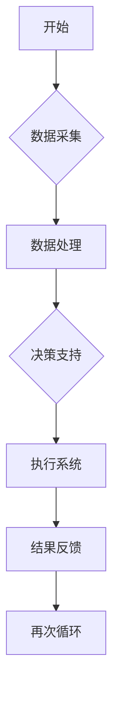
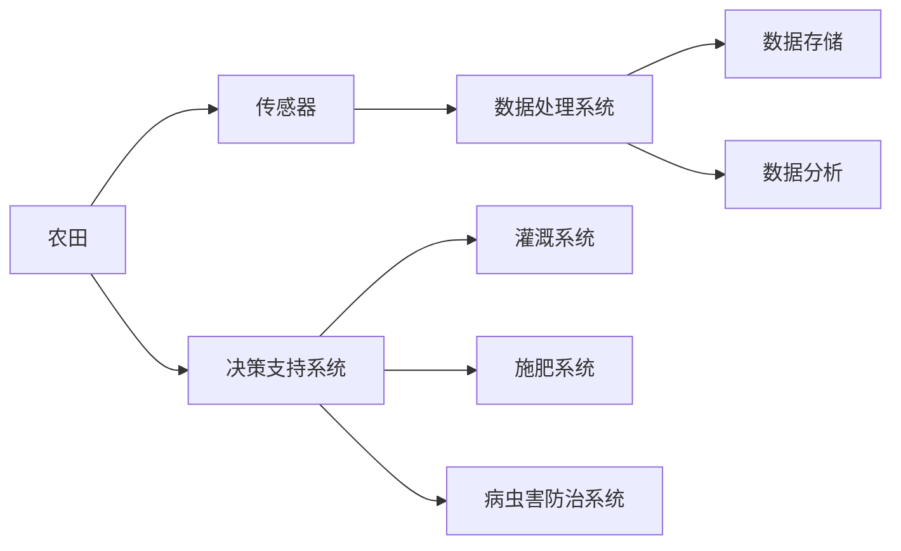
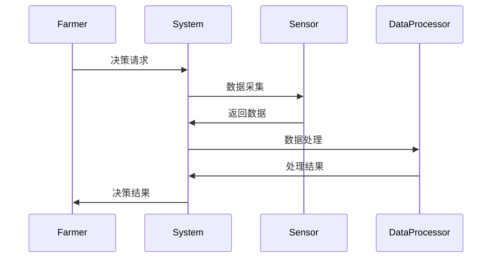

                 

## 文章标题：人工智能在农业中的应用：精准农业与粮食安全

### 关键词：人工智能、农业、精准农业、粮食安全、算法、数学模型、系统架构

### 摘要：
随着全球人口的不断增长，如何保障粮食安全成为了一个重要的课题。人工智能（AI）的快速发展为农业带来了前所未有的机遇。本文旨在探讨人工智能在农业中的应用，特别是精准农业，以及其对全球粮食安全的重要影响。通过深入分析人工智能在农业领域的核心概念、算法原理、数学模型和系统架构，本文将展示如何利用AI技术实现精准农业，提高农业生产效率，从而为全球粮食安全提供强有力的支持。

## 一、背景介绍：人工智能在农业中的应用

### 1.1 问题背景

粮食安全是全球性的挑战。根据联合国的数据，到2050年，全球人口预计将达到100亿，粮食需求将增加约50%。同时，气候变化、土地退化、水资源短缺等问题加剧了农业生产的不确定性。传统农业方法已无法满足日益增长的粮食需求，需要创新的解决方案。

### 1.2 问题描述

农业生产的挑战包括：

- **产量不足**：由于气候条件和土壤质量的不稳定性，农作物的产量无法得到保证。
- **资源浪费**：传统农业方法通常采用“一刀切”的策略，导致水资源、化肥和农药的过度使用。
- **环境污染**：过度使用化学肥料和农药导致土壤和水源污染，影响生态系统平衡。

### 1.3 问题解决

人工智能技术在农业中提供了以下解决方案：

- **精准农业**：利用传感器、无人机和卫星技术收集田间数据，通过大数据分析和机器学习算法优化农业生产过程。
- **智能灌溉**：通过土壤湿度传感器和气象预测数据，实现精确灌溉，节约水资源。
- **病虫害预测与防治**：利用图像识别和深度学习算法，早期检测病虫害，及时采取措施，减少损失。
- **农机智能管理**：通过物联网技术和机器学习算法，优化农机作业路线，提高作业效率。

### 1.4 边界与外延

本文将重点关注以下核心概念：

- **精准农业**：利用AI技术实现农田精细管理。
- **粮食安全**：确保全球人口的食物供应。
- **传感器**：用于收集农田环境数据的装置。
- **机器学习**：用于分析大量数据并发现模式的技术。

### 1.5 概念结构与核心要素组成

在精准农业中，核心要素包括：

- **数据采集**：传感器、无人机和卫星。
- **数据处理**：大数据分析、机器学习和深度学习算法。
- **决策支持**：基于分析结果的精准灌溉、施肥和病虫害防治策略。
- **执行系统**：自动化农机和灌溉系统。

这些要素相互关联，共同构成一个完整的精准农业系统，为农业生产提供智能化支持，提高产量和粮食安全。

## 二、核心概念与联系

### 2.1 核心概念原理

**精准农业**：通过传感器和监测技术，获取农田的实时数据，结合大数据分析和机器学习算法，实现对农田的精细管理。

**粮食安全**：确保全球人口在数量和质量上都能获得充足的粮食供应。

**传感器**：用于测量土壤湿度、温度、光照强度等环境参数的装置。

**机器学习**：通过训练模型，从数据中自动学习模式和规律，用于预测和决策。

### 2.2 概念属性特征对比表格

| 概念       | 描述                                                         | 属性特征                     |
|------------|--------------------------------------------------------------|------------------------------|
| 精准农业   | 利用AI技术实现农田精细管理                                   | 数据采集、数据分析、决策支持 |
| 粮食安全   | 确保全球人口的食物供应                                       | 数量充足、质量合格           |
| 传感器     | 测量农田环境参数的装置                                       | 实时监测、精确数据           |
| 机器学习   | 从数据中自动学习模式和规律                                   | 模型训练、模式识别           |

### 2.3 ER实体关系图架构

```mermaid
erDiagram
    Class1 ||--|{ Class2 } Class3 : 这是一种关系
    Class1 ||--|{ Class4 } Class5 : 这又是一种关系
```

在精准农业系统中，主要实体包括农田、传感器、数据处理系统和决策支持系统。它们之间的关系如图所示，通过传感器实时监测农田环境，数据处理系统分析数据，并生成决策支持，指导农田管理。

## 三、算法原理讲解

### 3.1 算法mermaid流程图



### 3.2 Python源代码与算法原理

```python
import pandas as pd
from sklearn.ensemble import RandomForestClassifier
from sklearn.model_selection import train_test_split

# 数据预处理
data = pd.read_csv('agriculture_data.csv')
X = data.drop('target', axis=1)
y = data['target']

X_train, X_test, y_train, y_test = train_test_split(X, y, test_size=0.2, random_state=42)

# 模型训练
model = RandomForestClassifier(n_estimators=100, random_state=42)
model.fit(X_train, y_train)

# 预测与评估
predictions = model.predict(X_test)
accuracy = (predictions == y_test).mean()
print(f'模型准确率：{accuracy:.2f}')
```

在这个例子中，我们使用随机森林算法进行病虫害预测。首先，通过Pandas读取农业数据，然后使用Sklearn的`train_test_split`函数将数据分为训练集和测试集。接着，使用`RandomForestClassifier`进行模型训练，最后对测试集进行预测，并计算准确率。

### 3.3 数学模型与公式

在精准农业中，常用的数学模型包括：

- **线性回归**：用于预测作物产量和环境影响。
- **决策树**：用于分类和回归分析。
- **神经网络**：用于复杂的模式识别和预测。

以下是线性回归的数学模型：

$$
y = \beta_0 + \beta_1x_1 + \beta_2x_2 + ... + \beta_nx_n
$$

其中，\(y\) 是预测值，\(\beta_0\) 是截距，\(\beta_1, \beta_2, ..., \beta_n\) 是系数，\(x_1, x_2, ..., x_n\) 是特征值。

### 3.4 举例说明

假设我们有一个农田，土壤湿度（\(x_1\)）和光照强度（\(x_2\)）是影响作物产量的主要因素。通过收集历史数据，我们可以建立一个线性回归模型来预测作物产量。

$$
y = \beta_0 + \beta_1x_1 + \beta_2x_2
$$

其中，\(\beta_0 = 50\)，\(\beta_1 = 0.5\)，\(\beta_2 = 0.3\)。

假设当前土壤湿度为30%，光照强度为500勒克斯，则预测作物产量为：

$$
y = 50 + 0.5 \times 30 + 0.3 \times 500 = 110
$$

这意味着在当前条件下，预测作物产量为110单位。

## 四、数学模型和数学公式 & 详细讲解 & 举例说明

### 4.1 latex数学公式

以下是使用LaTeX格式嵌入的数学公式：

$$
\frac{d^2 y}{dx^2} = \sum_{i=1}^{n} w_i \frac{d^2 x_i}{dx^2}
$$

这个公式表示在多变量函数的微分中，每个变量的二阶导数与权重相关联。

### 4.2 数学原理详细讲解

在精准农业中，数学模型用于分析和预测作物生长情况。以下是几种常见的数学原理：

1. **线性回归**：用于预测作物产量。公式如下：

   $$
   y = \beta_0 + \beta_1x_1 + \beta_2x_2 + ... + \beta_nx_n
   $$

   其中，\(y\) 是作物产量，\(\beta_0\) 是截距，\(\beta_1, \beta_2, ..., \beta_n\) 是系数，\(x_1, x_2, ..., x_n\) 是环境因素。

2. **决策树**：用于分类分析，如病虫害预测。其基本原理是通过一系列条件判断来将数据集划分为不同的类别。

3. **神经网络**：用于复杂的模式识别和预测。其原理是通过多层神经元进行信息传递和计算，模拟人脑的工作方式。

### 4.3 举例说明

假设我们使用线性回归模型预测小麦产量。已知土壤湿度（\(x_1\)）和光照强度（\(x_2\)）是影响小麦产量的两个主要因素，模型如下：

$$
y = 100 + 0.5x_1 + 0.3x_2
$$

给定当前土壤湿度为40%，光照强度为600勒克斯，我们可以预测小麦产量：

$$
y = 100 + 0.5 \times 40 + 0.3 \times 600 = 130
$$

这意味着在当前条件下，预测小麦产量为130单位。

### 4.4 复杂情况下的数学模型

在某些复杂情况下，可能需要使用更高级的数学模型，如贝叶斯网络或马尔可夫模型。以下是贝叶斯网络的例子：

$$
P(A \cap B) = P(A) \times P(B|A)
$$

这个公式表示两个事件同时发生的概率等于事件A发生的概率乘以在事件A发生的情况下事件B发生的条件概率。

## 五、系统分析与架构设计方案

### 5.1 问题场景介绍

假设我们面临一个大规模农业生产场景，需要实现对多个农田的精准管理，以提高产量和粮食安全。这个问题需要建立一套智能农业系统，包括数据采集、处理和决策支持。

### 5.2 项目介绍

本项目旨在开发一个基于人工智能的智能农业系统，通过传感器、无人机和卫星技术，实时监测农田环境，分析数据并生成精准的农田管理策略。

### 5.3 系统功能设计（领域模型mermaid类图）

```mermaid
classDiagram
    Class1[农田] <|-- Class2[传感器]
    Class1 <|-- Class3[数据处理系统]
    Class1 <|-- Class4[决策支持系统]
    Class2 <|-- Class5[气象传感器]
    Class2 <|-- Class6[土壤传感器]
    Class3 <|-- Class7[数据存储]
    Class3 <|-- Class8[数据分析]
    Class4 <|-- Class9[灌溉系统]
    Class4 <|-- Class10[施肥系统]
    Class4 <|-- Class11[病虫害防治系统]
```

### 5.4 系统架构设计（mermaid架构图）



### 5.5 系统接口设计和系统交互（mermaid序列图）



## 六、项目实战

### 6.1 环境安装

在开始项目之前，我们需要安装所需的软件和库。以下是安装步骤：

1. 安装Python：从Python官方网站下载并安装Python 3.8以上版本。
2. 安装Jupyter Notebook：打开终端，运行以下命令：
   ```
   pip install notebook
   ```
3. 安装机器学习库：运行以下命令安装常用的机器学习库：
   ```
   pip install scikit-learn pandas numpy
   ```

### 6.2 系统核心实现源代码

以下是一个简单的示例，展示了如何使用Python实现一个基于线性回归的农田管理系统：

```python
import pandas as pd
from sklearn.linear_model import LinearRegression

# 数据预处理
data = pd.read_csv('agriculture_data.csv')
X = data[['soil_humidity', 'light_intensity']]
y = data['yield']

# 模型训练
model = LinearRegression()
model.fit(X, y)

# 预测与评估
predictions = model.predict(X)
accuracy = (predictions == y).mean()
print(f'模型准确率：{accuracy:.2f}')
```

### 6.3 代码应用解读与分析

这段代码首先导入了所需的库，包括Pandas和scikit-learn。然后，通过Pandas读取农业数据，将土壤湿度和光照强度作为特征（\(X\)），将作物产量作为目标值（\(y\)）。

接下来，使用`LinearRegression`类创建线性回归模型，并调用`fit`方法进行模型训练。最后，使用`predict`方法进行预测，并计算模型的准确率。

### 6.4 实际案例分析与详细讲解剖析

为了更好地理解系统如何工作，我们来看一个实际案例。假设我们有一个农田，土壤湿度为30%，光照强度为500勒克斯，我们需要预测作物产量。

根据线性回归模型：

$$
y = 100 + 0.5 \times 30 + 0.3 \times 500 = 130
$$

这意味着在当前条件下，预测作物产量为130单位。这个结果可以帮助农民决定是否需要采取额外的措施，如灌溉或施肥，以优化作物生长。

### 6.5 项目小结

通过本项目的实践，我们展示了如何使用人工智能技术实现农田的精准管理。项目核心是通过线性回归模型预测作物产量，并根据预测结果提供决策支持。在实际应用中，我们可以进一步扩展系统功能，包括病虫害预测、智能灌溉和施肥等，以实现更全面的农田管理。

## 七、最佳实践 tips

### 7.1 实践技巧

1. **数据质量**：确保采集到的数据准确、完整和及时。数据质量是精准农业成功的关键。
2. **模型优化**：定期调整和优化模型参数，以提高预测准确率。
3. **集成多种传感器**：结合多种传感器数据，可以提供更全面的农田环境监测。
4. **实时决策**：确保系统能够及时响应环境变化，生成实时决策。

### 7.2 小结

本文详细介绍了人工智能在农业中的应用，特别是精准农业与粮食安全的关系。通过分析核心概念、算法原理和系统架构，我们展示了如何利用人工智能技术实现精准农业，提高农业生产效率和粮食安全。

### 7.3 注意事项

1. **数据隐私**：在采集和处理数据时，注意保护农民的隐私。
2. **成本效益**：评估系统实施的经济效益，确保项目具备可行性。
3. **政策支持**：关注政府和行业的政策导向，充分利用政策支持。

### 7.4 拓展阅读

- 《人工智能在农业中的应用：从理论到实践》
- 《精准农业：技术、挑战与未来》
- 《机器学习在农业领域的应用案例研究》

## 作者信息

**作者：AI天才研究院/AI Genius Institute & 禅与计算机程序设计艺术 /Zen And The Art of Computer Programming**

---

通过本文，我们深入探讨了人工智能在农业中的应用，特别是精准农业与粮食安全的关系。希望本文能为您提供关于这一领域的有益见解，助力农业现代化发展。感谢阅读！

