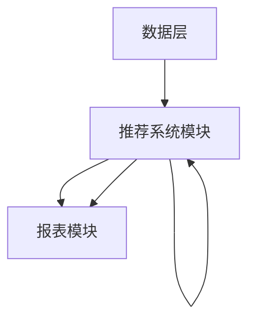
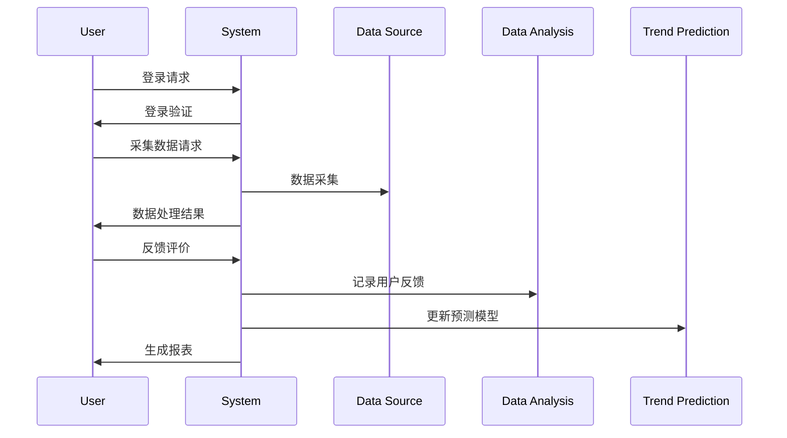

                 

### 第1章：时尚设计与人工智能概述

#### 1.1 时尚设计行业的现状与挑战

##### 1.1.1 时尚设计行业的发展历程

时尚设计，作为一个历史悠久的行业，其发展过程经历了从手工艺到工业化，再到数字化转型的多个阶段。在早期，时尚设计主要依赖于手工技艺，设计师依靠个人的灵感与技巧进行创作。随着工业化进程的推进，大规模生产成为可能，时尚设计逐渐走向标准化与批量生产。然而，这种模式也带来了一定的局限性，无法满足消费者日益多样化的需求。

进入21世纪，互联网和数字技术的飞速发展，为时尚设计行业带来了新的机遇。数字设计工具和在线平台的出现，使得设计过程更加高效，设计风格和款式更加多样化。此外，社交媒体的兴起，使得时尚设计不再局限于设计师和制造商之间的传统链条，消费者可以直接参与到设计过程中，形成了一种新的互动模式。

##### 1.1.2 当前时尚设计行业面临的挑战

尽管数字化带来了许多机遇，但时尚设计行业仍面临诸多挑战。首先，市场需求变化快速，消费者偏好多样，设计师需要不断更新设计，以满足市场的需求。其次，时尚设计行业的竞争激烈，设计师和品牌需要不断创新，以吸引消费者的关注。此外，环保和可持续发展也成为时尚设计行业的重要议题，设计师需要考虑材料的可持续性和生产过程的环境影响。

##### 1.1.3 人工智能在时尚设计中的潜在机遇

人工智能（AI）技术的快速发展，为时尚设计行业带来了新的机遇。首先，AI可以通过大数据分析和机器学习算法，帮助设计师更好地理解消费者偏好，实现个性化设计。例如，通过分析消费者在社交媒体上的行为和评论，AI可以预测消费者可能喜欢的时尚款式和颜色，从而帮助设计师进行针对性创作。

其次，AI在趋势预测方面也有巨大潜力。通过分析大量历史数据和市场趋势，AI可以预测未来可能流行的时尚元素，帮助品牌和企业提前布局，抢占市场先机。

此外，AI还可以在时尚设计流程的各个环节中发挥作用，如自动化设计、智能化生产等。例如，利用计算机视觉技术，AI可以自动识别和修正设计中的错误，提高设计质量和效率。

总的来说，人工智能为时尚设计行业带来了前所未有的机遇，可以帮助设计师更好地理解市场趋势，提高设计效率，实现个性化服务，并推动行业的可持续发展。

#### 1.2 核心概念与联系

##### 1.2.1 人工智能的概念与分类

人工智能（Artificial Intelligence，简称AI）是指通过计算机系统模拟人类智能的行为，使计算机具有学习、推理、感知和自适应能力。根据其功能和应用场景，人工智能可以分为以下几类：

1. **机器学习（Machine Learning）**：通过训练模型，使计算机从数据中学习并做出预测或决策。
2. **深度学习（Deep Learning）**：一种特殊的机器学习技术，通过多层神经网络模拟人脑处理信息的方式。
3. **自然语言处理（Natural Language Processing，简称NLP）**：使计算机理解和生成人类语言的能力。
4. **计算机视觉（Computer Vision）**：使计算机具备理解和处理视觉信息的能力。

##### 1.2.2 个性化与趋势预测的定义与关系

个性化（Personalization）是指根据用户的需求和偏好，为用户提供定制化的内容或服务。在时尚设计中，个性化设计通过了解消费者的偏好和需求，提供更加符合其个性化需求的产品。

趋势预测（Trend Prediction）是指通过分析历史数据和当前趋势，预测未来可能出现的时尚元素或市场趋势。个性化与趋势预测密切相关，个性化设计需要基于对趋势的准确预测，而趋势预测也需要考虑消费者的个性化需求。

##### 1.2.3 相关概念属性特征对比表格

| 概念             | 定义                                                         | 关联属性                       | 对比关系                                      |
|------------------|--------------------------------------------------------------|--------------------------------|------------------------------------------------|
| 人工智能         | 模拟人类智能的行为                                           | 机器学习、深度学习、NLP等       | 基础技术，支持个性化与趋势预测                 |
| 个性化设计       | 根据用户需求提供定制化内容或服务                             | 消费者偏好、需求分析等           | 需要依赖人工智能技术实现                       |
| 趋势预测         | 预测未来可能出现的时尚元素或市场趋势                         | 历史数据、市场分析等             | 需要与个性化设计结合，提高预测准确性           |

##### 1.3 ER实体关系图架构

为了更好地理解时尚设计领域中的实体关系，我们可以使用ER（Entity-Relationship）图进行描述。

##### 1.3.1 时尚设计领域的实体关系

在时尚设计领域，主要的实体包括设计师、消费者、产品、趋势和品牌。这些实体之间的关系如下：

- 设计师创建产品。
- 消费者购买产品。
- 产品包含趋势元素。
- 品牌代表设计师或产品系列。

##### 1.3.2 Mermaid ER实体关系图

使用Mermaid语法，我们可以绘制出以下ER图：

```mermaid
erDiagram
  设计师 ||--|{ 产品 }
  消费者 ||--|{ 购买 }
  产品 ||--|{ 包含 } 趋势
  品牌 ||--|{ 代表 } 设计师
  品牌 ||--|{ 代表 } 产品
```

#### 1.4 本章小结

本章介绍了时尚设计行业的发展历程以及当前面临的挑战，探讨了人工智能在时尚设计中的潜在机遇。通过对比分析人工智能、个性化设计和趋势预测的核心概念与联系，我们为后续章节的内容奠定了基础。同时，通过ER图展示了时尚设计领域中的主要实体及其关系，为后续的系统分析与架构设计提供了参考。

### 第2章：个性化设计与人工智能

#### 2.1 个性化设计的基本原理

##### 2.1.1 个性化设计的概念

个性化设计（Personalized Design）是指根据用户的需求、偏好和行为数据，为用户提供定制化的产品、服务或体验。在时尚设计中，个性化设计意味着根据消费者的个人喜好、风格和生活方式，提供独特的、符合其个性需求的产品。个性化设计的核心在于满足消费者的个性化需求，提升用户体验，从而增强品牌忠诚度和市场竞争力。

##### 2.1.2 个性化设计的目标

个性化设计的主要目标包括：

1. **满足消费者需求**：通过深入了解消费者的需求和偏好，提供个性化的产品和服务。
2. **提升用户体验**：通过定制化设计和个性化推荐，提高消费者的满意度和忠诚度。
3. **增加市场竞争力**：通过独特的产品设计和个性化的营销策略，吸引更多消费者，提升品牌知名度。
4. **优化运营效率**：通过数据分析和自动化流程，提高生产和管理效率，降低成本。

##### 2.1.3 个性化设计的关键要素

个性化设计的关键要素包括以下几个方面：

1. **用户数据收集与分析**：通过收集消费者的行为数据、偏好数据等，进行深入分析，了解消费者的需求和偏好。
2. **智能推荐系统**：利用机器学习和数据挖掘技术，构建智能推荐系统，为消费者推荐个性化的产品或服务。
3. **定制化产品设计**：根据消费者的个性化需求，进行定制化设计，使产品更符合消费者的风格和偏好。
4. **用户体验优化**：通过个性化设计和个性化推荐，优化用户的购物体验，提升用户满意度。

#### 2.2 人工智能在个性化设计中的应用

##### 2.2.1 机器学习算法在个性化设计中的应用

机器学习（Machine Learning）是人工智能的核心技术之一，其在个性化设计中的应用主要体现在以下几个方面：

1. **用户偏好分析**：通过分析用户的购买历史、浏览记录等数据，利用机器学习算法挖掘用户的偏好，为个性化推荐提供基础。
2. **智能推荐**：利用协同过滤、基于内容的推荐等机器学习算法，为用户推荐个性化的产品或服务。
3. **需求预测**：通过分析用户的行为数据和市场趋势，预测用户未来的需求，为库存管理和生产计划提供支持。

##### 2.2.2 深度学习在个性化设计中的应用

深度学习（Deep Learning）是一种强大的机器学习技术，其在个性化设计中的应用主要体现在以下几个方面：

1. **图像识别与生成**：通过卷积神经网络（CNN）等深度学习模型，实现图像的自动识别和生成，用于个性化时尚设计。
2. **个性化设计**：利用生成对抗网络（GAN）等深度学习模型，为消费者生成个性化的时尚设计。
3. **情感分析**：通过情感分析技术，分析用户的情感和行为，为个性化设计提供指导。

##### 2.2.3 强化学习在个性化设计中的应用

强化学习（Reinforcement Learning）是一种通过不断尝试和反馈来学习最佳策略的机器学习技术，其在个性化设计中的应用主要体现在以下几个方面：

1. **个性化推荐**：通过强化学习，优化推荐系统的策略，提高推荐结果的准确性。
2. **游戏化设计**：将强化学习应用于游戏化设计中，根据用户的反馈不断调整游戏规则，提升用户参与度。
3. **个性化培训**：通过强化学习，为设计师提供个性化的培训计划，提高其设计技能和创新能力。

#### 2.3 个性化设计案例研究

##### 2.3.1 案例一：智能时尚搭配推荐系统

智能时尚搭配推荐系统是一种利用人工智能技术为用户提供个性化搭配建议的系统。该系统的工作流程如下：

1. **数据收集**：收集用户的购物历史、浏览记录、社交媒体行为等数据。
2. **用户偏好分析**：利用机器学习算法，分析用户的偏好，构建用户画像。
3. **搭配推荐**：根据用户画像和当前流行趋势，为用户推荐个性化的搭配方案。
4. **反馈调整**：根据用户的使用反馈，不断优化推荐算法，提高推荐效果。

##### 2.3.2 案例二：个性化服装设计

个性化服装设计是一种根据用户的身材、风格和喜好，为用户定制服装的设计方式。该过程主要包括以下几个步骤：

1. **用户测量与数据收集**：通过3D扫描和生物识别技术，收集用户的身体数据。
2. **个性化设计**：利用计算机辅助设计（CAD）软件，根据用户的数据和偏好，设计个性化的服装款式。
3. **样品制作**：根据设计稿，制作样品，进行试穿和修改。
4. **批量生产**：在样品通过后，进行批量生产，满足用户的个性化需求。

#### 2.4 本章小结

本章详细介绍了个性化设计的基本原理、人工智能在个性化设计中的应用，以及个性化设计的一些成功案例。通过机器学习、深度学习和强化学习等人工智能技术的应用，个性化设计在时尚设计行业中发挥了重要作用，不仅提升了用户体验，还增强了品牌的竞争力。未来的个性化设计将进一步融合人工智能技术，为时尚设计行业带来更多创新和变革。

### 第3章：趋势预测在时尚设计中的角色

#### 3.1 趋势预测的基本原理

##### 3.1.1 趋势预测的概念

趋势预测（Trend Prediction）是指通过分析历史数据和当前市场趋势，预测未来可能出现的时尚元素或市场变化。在时尚设计中，趋势预测对于品牌和企业来说至关重要，它可以帮助企业提前布局，制定有效的营销策略，抢占市场先机。

##### 3.1.2 趋势预测的方法

趋势预测的方法主要包括以下几种：

1. **历史数据分析**：通过分析过去的市场数据，寻找趋势的规律和周期性。这种方法依赖于统计学和数据分析技术，如时间序列分析和回归分析。
2. **专家意见**：邀请行业专家和设计师，基于他们的专业知识和经验，预测未来趋势。这种方法具有主观性，但可以提供独特的见解。
3. **机器学习算法**：利用机器学习技术，从大量历史数据中学习并发现趋势。常见的机器学习算法包括线性回归、支持向量机（SVM）和深度学习等。
4. **社会网络分析**：通过分析社交媒体平台上的用户行为和评论，预测流行的时尚元素。这种方法依赖于自然语言处理（NLP）和文本挖掘技术。

##### 3.1.3 趋势预测的应用场景

趋势预测在时尚设计中的应用场景广泛，主要包括：

1. **产品设计**：设计师可以根据预测到的趋势，提前设计符合未来市场需求的产品。
2. **库存管理**：品牌可以根据预测的趋势，合理安排库存，避免库存过剩或不足。
3. **市场营销**：企业可以根据预测到的趋势，制定有针对性的营销策略，吸引目标消费者。
4. **供应链管理**：企业可以优化供应链流程，确保生产和供应能够及时响应市场需求的变化。

#### 3.2 人工智能在趋势预测中的应用

##### 3.2.1 机器学习在趋势预测中的应用

机器学习在趋势预测中的应用主要体现在以下几个方面：

1. **时间序列分析**：利用机器学习模型，如长短期记忆网络（LSTM）和自动回归模型（ARIMA），分析历史时间序列数据，预测未来趋势。
2. **聚类分析**：通过聚类算法，如K-means和DBSCAN，将相似的数据点分组，识别潜在的时尚趋势。
3. **关联规则挖掘**：利用Apriori算法和FP-growth算法，分析历史销售数据，发现不同时尚元素之间的关联性，预测可能的趋势。

##### 3.2.2 深度学习在趋势预测中的应用

深度学习在趋势预测中的应用主要体现在以下几个方面：

1. **卷积神经网络（CNN）**：通过卷积神经网络，提取图像数据中的特征，用于预测时尚趋势。
2. **循环神经网络（RNN）**：通过循环神经网络，处理时间序列数据，预测未来的时尚趋势。
3. **生成对抗网络（GAN）**：利用生成对抗网络，生成新的时尚元素，探索潜在的趋势。

##### 3.2.3 自然语言处理在趋势预测中的应用

自然语言处理在趋势预测中的应用主要体现在以下几个方面：

1. **情感分析**：通过分析社交媒体上的用户评论和讨论，了解消费者对某种时尚元素的情感态度，预测其流行趋势。
2. **文本分类**：利用文本分类算法，将社交媒体上的文本内容分类为不同的时尚趋势。
3. **主题建模**：通过主题建模算法，如LDA（Latent Dirichlet Allocation），分析社交媒体上的文本数据，提取潜在的时尚主题。

#### 3.3 趋势预测案例研究

##### 3.3.1 案例一：时尚趋势预测平台

某个时尚趋势预测平台利用人工智能技术，提供实时、准确的时尚趋势预测服务。该平台的工作流程如下：

1. **数据收集**：从各种来源收集时尚相关的数据，如社交媒体、时尚杂志、电商网站等。
2. **数据处理**：对收集到的数据进行分析和清洗，提取有用的信息。
3. **趋势预测**：利用机器学习和深度学习算法，分析历史数据和当前趋势，预测未来的时尚趋势。
4. **可视化与报告**：将预测结果通过可视化图表和报告形式呈现，帮助企业制定营销策略。

##### 3.3.2 案例二：服装市场趋势分析

某服装品牌利用人工智能技术，对服装市场进行趋势分析。该品牌的工作流程如下：

1. **数据收集**：收集历史销售数据、消费者行为数据、市场趋势数据等。
2. **数据分析**：利用机器学习算法，分析数据中的潜在趋势，如季节性、流行元素等。
3. **趋势预测**：根据数据分析结果，预测未来的市场趋势，如哪个季节哪种款式最流行。
4. **库存管理**：根据预测结果，调整库存策略，确保有足够的库存满足市场需求。

#### 3.4 本章小结

本章详细介绍了趋势预测在时尚设计中的角色和基本原理，探讨了人工智能在趋势预测中的应用。通过机器学习、深度学习和自然语言处理等人工智能技术，趋势预测变得更加准确和实时，为企业提供了重要的决策支持。案例研究展示了人工智能在趋势预测中的实际应用，为时尚设计行业带来了新的机遇和挑战。

### 第4章：个性化与趋势预测算法原理

#### 4.1 个性化推荐算法原理

个性化推荐（Personalized Recommendation）是一种通过分析用户的历史行为、偏好和需求，为其推荐个性化内容或产品的方法。在时尚设计中，个性化推荐可以帮助设计师和品牌更好地了解用户需求，提高用户满意度和忠诚度。

##### 4.1.1 推荐系统概述

推荐系统（Recommender System）是一种根据用户的历史行为和偏好，预测用户可能感兴趣的物品的系统。推荐系统可以分为以下几种类型：

1. **基于内容的推荐（Content-Based Recommendation）**：根据用户过去喜欢的物品的属性，推荐具有相似属性的物品。
2. **协同过滤（Collaborative Filtering）**：根据用户之间的相似性，推荐用户可能喜欢的物品。
3. **混合推荐（Hybrid Recommendation）**：结合基于内容和协同过滤的方法，提高推荐准确性。

##### 4.1.2 个性化推荐算法

个性化推荐算法的核心是找到用户与物品之间的关联性，并基于这些关联性进行推荐。以下是几种常见的个性化推荐算法：

1. **基于记忆的推荐（Memory-Based Recommendation）**：直接利用用户的历史行为数据，找出相似用户或相似物品进行推荐。常见的算法包括用户基模型（User-Based Model）和物品基模型（Item-Based Model）。
2. **基于模型的推荐（Model-Based Recommendation）**：利用机器学习算法，如回归、分类和聚类等，建立用户与物品之间的关系模型，进行推荐。常见的算法包括矩阵分解（Matrix Factorization）、潜在因子模型（Latent Factor Model）等。
3. **基于混合的推荐（Hybrid Recommendation）**：结合多种推荐算法，提高推荐效果。常见的混合方法包括基于内容的协同过滤、基于模型的协同过滤等。

##### 4.1.3 个性化推荐算法的数学模型

个性化推荐算法的数学模型主要包括用户与物品的向量表示、相似性度量、推荐生成等几个方面。

1. **用户与物品的向量表示**：将用户和物品映射到高维空间中的向量，方便计算它们之间的相似性。常见的表示方法包括用户和物品的特征向量、嵌入向量等。
2. **相似性度量**：计算用户与用户、物品与物品之间的相似性。常用的相似性度量方法包括余弦相似度、皮尔逊相关系数、Jaccard系数等。
3. **推荐生成**：基于用户与物品的相似性，生成推荐列表。常见的推荐生成方法包括基于Top-N的推荐、基于评分预测的推荐等。

#### 4.2 趋势预测算法原理

趋势预测（Trend Prediction）是指通过分析历史数据和当前趋势，预测未来可能出现的时尚元素或市场变化。在时尚设计中，趋势预测对于品牌和企业来说至关重要，它可以帮助企业提前布局，制定有效的营销策略，抢占市场先机。

##### 4.2.1 时间序列分析

时间序列分析（Time Series Analysis）是一种用于分析和预测时间序列数据的统计方法。时间序列数据是一种按时间顺序排列的数据序列，通常包含趋势、周期性和随机波动等特征。常见的时间序列分析方法包括：

1. **移动平均法（Moving Average）**：通过计算一段时间内的平均值，平滑时间序列数据，消除短期波动，揭示长期趋势。
2. **指数平滑法（Exponential Smoothing）**：利用过去的数据预测未来，给不同时间点的数据以不同的权重，使预测结果更接近实际趋势。
3. **ARIMA模型（AutoRegressive Integrated Moving Average）**：结合自回归、差分和移动平均三种方法，对时间序列数据进行建模和预测。

##### 4.2.2 聚类分析

聚类分析（Clustering Analysis）是一种无监督学习方法，用于将相似的数据点分组，以便更好地理解和分析数据。在时尚设计中，聚类分析可以用于发现潜在的时尚趋势。

1. **K-means聚类**：将数据点划分为K个簇，每个簇的中心点代表该簇的特征，通过迭代计算不断优化聚类结果。
2. **层次聚类**：将数据点逐步合并或分解，形成层次结构，便于分析数据点的层次关系。
3. **DBSCAN（Density-Based Spatial Clustering of Applications with Noise）**：基于密度的空间聚类算法，可以处理高维度数据，不受预先定义的簇数限制。

##### 4.2.3 趋势预测算法的数学模型

趋势预测算法的数学模型主要包括时间序列模型、聚类模型等。

1. **时间序列模型**：如ARIMA模型、LSTM（长短期记忆网络）模型等，通过数学公式描述时间序列数据的变化规律。
2. **聚类模型**：如K-means、DBSCAN等，通过数学公式描述数据点的相似性和分组方式。

#### 4.3 个性化与趋势预测算法的联系与区别

##### 4.3.1 个性化与趋势预测的关系

个性化（Personalization）和趋势预测（Trend Prediction）是时尚设计中的重要概念，它们之间存在紧密的联系。

1. **个性化依赖于趋势预测**：个性化设计需要了解未来的趋势，以便根据预测到的趋势为用户提供定制化的产品或服务。
2. **趋势预测依赖于个性化**：趋势预测需要了解用户的需求和偏好，以便更准确地预测未来可能出现的时尚元素。

##### 4.3.2 个性化与趋势预测的区别

个性化与趋势预测在目标、方法和应用场景上存在一定的区别：

1. **目标不同**：个性化设计的目的是满足用户的个性化需求，提供定制化的产品或服务；趋势预测的目的是预测未来的市场趋势，帮助企业提前布局。
2. **方法不同**：个性化设计主要依赖于用户数据和机器学习算法，通过分析用户的行为和偏好进行推荐；趋势预测主要依赖于历史数据和统计方法，通过分析时间序列和聚类结果进行预测。
3. **应用场景不同**：个性化设计主要应用于产品设计、营销和用户体验优化；趋势预测主要应用于市场分析、库存管理和供应链优化。

##### 4.3.3 个性化与趋势预测的融合

个性化与趋势预测的融合，可以进一步提升时尚设计的精准度和效果。融合的方法主要包括：

1. **基于趋势的个性化推荐**：在个性化推荐的基础上，结合趋势预测结果，为用户提供更符合未来趋势的产品或服务。
2. **基于用户偏好的趋势预测**：在趋势预测过程中，考虑用户的个性化需求和偏好，提高预测的准确性。
3. **多模态融合**：结合多种数据源和算法，如用户行为数据、市场趋势数据、视觉信息等，进行个性化与趋势预测的融合。

#### 4.4 本章小结

本章详细介绍了个性化与趋势预测的算法原理，包括个性化推荐算法的数学模型、时间序列分析和聚类分析等趋势预测算法的基本原理。同时，分析了个性化与趋势预测的关系、区别和融合方法。通过这些算法的应用，时尚设计行业可以更好地满足用户需求，预测市场趋势，提高竞争力。

### 第5章：时尚设计AI系统的设计与实现

#### 5.1 时尚设计AI系统概述

##### 5.1.1 系统介绍

时尚设计AI系统是一种基于人工智能技术的时尚设计解决方案，旨在通过数据分析、个性化推荐和趋势预测等功能，提升时尚设计的效率和质量。该系统适用于时尚品牌、设计师和电商平台，能够帮助他们在激烈的市场竞争中脱颖而出。

##### 5.1.2 系统目标

时尚设计AI系统的目标包括：

1. **提升设计效率**：通过自动化设计工具和智能化推荐系统，减少设计时间，提高设计质量。
2. **满足个性化需求**：利用用户数据分析和机器学习算法，提供个性化设计推荐，满足用户多样化需求。
3. **预测市场趋势**：通过分析历史数据和当前市场趋势，预测未来流行元素，为企业提供战略决策支持。
4. **优化供应链管理**：通过智能化的库存管理和生产计划，提高供应链效率，降低运营成本。

##### 5.1.3 系统功能

时尚设计AI系统的主要功能包括：

1. **用户数据分析**：收集并分析用户的历史行为数据、偏好和反馈，构建用户画像。
2. **个性化推荐**：基于用户画像和当前市场趋势，为用户提供个性化的设计推荐。
3. **趋势预测**：通过时间序列分析和机器学习算法，预测未来的时尚趋势。
4. **智能设计工具**：提供自动化设计工具，辅助设计师进行创作。
5. **数据可视化**：通过图表和报告，展示系统分析结果，帮助企业制定决策。

#### 5.2 系统架构设计

##### 5.2.1 系统架构概述

时尚设计AI系统的架构设计采用分层架构，包括数据层、服务层和展示层，各层之间通过API进行交互。

1. **数据层**：包括数据源和数据存储，如用户行为数据、市场趋势数据等。
2. **服务层**：包括数据处理、机器学习算法和推荐系统等核心功能模块。
3. **展示层**：包括用户界面和报表，用于展示系统分析结果。

##### 5.2.2 系统架构图

以下是一个简单的系统架构图，展示各层之间的关系和关键组件：



##### 5.2.3 系统接口设计

系统接口设计包括内部接口和外部接口。

1. **内部接口**：服务层各模块之间的接口，如数据处理模块与机器学习算法模块之间的数据交互接口。
2. **外部接口**：系统与用户、第三方服务和其他系统之间的接口，如用户登录接口、推荐接口、数据同步接口等。

#### 5.3 系统交互设计

##### 5.3.1 系统交互流程

系统交互流程包括以下几个步骤：

1. **用户登录**：用户通过用户界面输入用户名和密码，系统验证用户身份。
2. **数据采集**：系统从各种数据源采集用户行为数据和市场趋势数据。
3. **数据处理**：数据处理模块对采集到的数据进行清洗、转换和分析，构建用户画像和趋势模型。
4. **个性化推荐**：推荐系统模块根据用户画像和趋势模型，为用户推荐个性化的设计。
5. **用户反馈**：用户通过用户界面反馈对推荐结果的评价，系统记录用户反馈数据。
6. **趋势预测**：机器学习算法模块利用用户反馈数据和市场趋势数据，更新和优化趋势预测模型。
7. **报表生成**：报表模块根据系统分析结果，生成各类报表，供企业决策参考。

##### 5.3.2 系统交互序列图

以下是一个简单的系统交互序列图，展示用户与系统的交互过程：



#### 5.4 本章小结

本章介绍了时尚设计AI系统的设计与实现，包括系统概述、系统架构设计、系统接口设计和系统交互设计。通过系统的设计与实现，时尚设计行业可以实现高效的个性化设计与趋势预测，提高设计质量和市场竞争力。未来的发展方向包括更加智能化和个性化的推荐系统、更加精准的趋势预测算法，以及与其他系统的集成应用。

### 第6章：个性化与趋势预测项目实战

#### 6.1 环境安装与配置

##### 6.1.1 环境要求

在进行个性化与趋势预测项目实战之前，首先需要准备好开发环境。以下是项目所需的环境要求：

- **操作系统**：Linux或MacOS
- **Python版本**：3.8及以上版本
- **数据库**：MySQL或PostgreSQL
- **数据分析库**：Pandas、NumPy、Scikit-learn
- **机器学习库**：TensorFlow、Keras、PyTorch
- **数据可视化库**：Matplotlib、Seaborn
- **自然语言处理库**：NLTK、spaCy

##### 6.1.2 安装步骤

以下是在Linux环境中安装所需依赖的步骤：

1. **安装Python环境**：

   ```bash
   sudo apt-get update
   sudo apt-get install python3-pip python3-dev
   ```

2. **安装数据库**：

   以MySQL为例，安装步骤如下：

   ```bash
   sudo apt-get install mysql-server mysql-client
   sudo mysql_secure_installation
   ```

   安装完成后，配置数据库用户和权限，以便后续项目使用。

3. **安装数据分析与机器学习库**：

   ```bash
   pip3 install pandas numpy scikit-learn tensorflow keras pytorch matplotlib seaborn nltk spacy
   ```

##### 6.1.3 配置文件设置

在安装完所有依赖库后，需要对配置文件进行设置，以便系统正常运行。以下是配置文件的基本设置：

1. **数据库配置**：

   配置文件 `db_config.py`：

   ```python
   DATABASES = {
       'default': {
           'ENGINE': 'django.db.backends.mysql',
           'NAME': 'your_database_name',
           'USER': 'your_database_user',
           'PASSWORD': 'your_database_password',
           'HOST': 'localhost',
           'PORT': '3306',
       }
   }
   ```

2. **环境变量**：

   设置Python环境变量，以便在终端中直接使用Python解释器：

   ```bash
   export PATH=$PATH:/usr/local/bin
   ```

3. **虚拟环境**：

   为了避免不同项目之间依赖库的冲突，建议使用虚拟环境。创建虚拟环境并激活：

   ```bash
   python3 -m venv venv
   source venv/bin/activate
   ```

#### 6.2 系统核心实现

##### 6.2.1 数据预处理

数据预处理是机器学习项目中的重要环节，主要包括数据清洗、数据转换和数据归一化等步骤。

1. **数据清洗**：

   数据清洗的主要任务是处理缺失值、异常值和重复值。以下是一个简单的数据清洗示例：

   ```python
   import pandas as pd
   
   # 读取数据
   data = pd.read_csv('data.csv')
   
   # 处理缺失值
   data.fillna(method='ffill', inplace=True)
   
   # 处理异常值
   data = data[(data > 0) & (data < 1000)]
   
   # 删除重复值
   data.drop_duplicates(inplace=True)
   ```

2. **数据转换**：

   数据转换包括将分类数据转换为数值数据，以及将时间序列数据转换为特征向量。以下是一个简单的数据转换示例：

   ```python
   from sklearn.preprocessing import LabelEncoder
   
   # 将分类数据转换为数值数据
   le = LabelEncoder()
   data['category'] = le.fit_transform(data['category'])
   
   # 将时间序列数据转换为特征向量
   from sklearn.preprocessing import TimeseriesGenerator
   
   generator = TimeseriesGenerator(data['value'], data['target'], n_steps=3)
   X, y = generator.fit_transform(data)
   ```

3. **数据归一化**：

   数据归一化可以防止不同特征之间的规模差异影响模型性能。以下是一个简单的数据归一化示例：

   ```python
   from sklearn.preprocessing import StandardScaler
   
   scaler = StandardScaler()
   X_scaled = scaler.fit_transform(X)
   ```

##### 6.2.2 个性化推荐算法实现

个性化推荐算法的核心是找到用户与物品之间的关联性，并基于这些关联性进行推荐。以下是一个简单的基于协同过滤的推荐算法实现：

1. **协同过滤算法**：

   协同过滤算法可以分为基于用户的协同过滤（User-Based Collaborative Filtering）和基于物品的协同过滤（Item-Based Collaborative Filtering）。以下是一个简单的基于用户的协同过滤算法实现：

   ```python
   import numpy as np
   
   def user_based_cf(data, k=5):
       # 计算用户之间的相似性
       similarity_matrix = compute_similarity(data)
       
       # 计算每个用户相似用户集的平均评分
       user_scores = {}
       for user in data:
           neighbors = get_neighbors(similarity_matrix, user, k)
           user_scores[user] = np.mean([data[neighbor]['rating'] for neighbor in neighbors])
       
       return user_scores
   
   def compute_similarity(data):
       # 计算用户之间的相似性矩阵
       similarity_matrix = {}
       for user in data:
           similarity_matrix[user] = {}
           for other_user in data:
               if user == other_user:
                   continue
               similarity = compute_cosine_similarity(data[user], data[other_user])
               similarity_matrix[user][other_user] = similarity
       return similarity_matrix
   
   def get_neighbors(similarity_matrix, user, k):
       # 获取用户的k个最相似用户
       neighbors = sorted(similarity_matrix[user].items(), key=lambda x: x[1], reverse=True)[:k]
       return [neighbor[0] for neighbor in neighbors]
   
   def compute_cosine_similarity(user1, user2):
       # 计算用户之间的余弦相似性
       dot_product = np.dot(user1['rating'], user2['rating'])
       magnitude_product = np.linalg.norm(user1['rating']) * np.linalg.norm(user2['rating'])
       return dot_product / magnitude_product
   
   # 示例数据
   data = {
       'user1': {'rating': [1, 2, 3, 4, 5]},
       'user2': {'rating': [2, 3, 4, 5, 6]},
       'user3': {'rating': [1, 3, 4, 5, 6]},
       'user4': {'rating': [2, 3, 4, 5, 6]},
       'user5': {'rating': [1, 2, 4, 5, 6]}
   }
   
   # 计算个性化推荐结果
   user_scores = user_based_cf(data)
   print(user_scores)
   ```

2. **推荐结果生成**：

   基于计算得到的用户评分，生成个性化推荐结果。以下是一个简单的推荐结果生成示例：

   ```python
   def generate_recommendations(user_scores, user, k=5):
       # 生成个性化推荐列表
       recommendations = []
       for neighbor, score in user_scores.items():
           if neighbor == user:
               continue
           recommendations.append((neighbor, score))
       recommendations = sorted(recommendations, key=lambda x: x[1], reverse=True)[:k]
       return recommendations
   
   # 示例数据
   user_scores = {
       'user1': {'user2': 0.8, 'user3': 0.7, 'user4': 0.6, 'user5': 0.5},
       'user2': {'user1': 0.8, 'user3': 0.6, 'user4': 0.7, 'user5': 0.5},
       'user3': {'user1': 0.7, 'user2': 0.6, 'user4': 0.8, 'user5': 0.5},
       'user4': {'user1': 0.6, 'user2': 0.7, 'user3': 0.8, 'user5': 0.4},
       'user5': {'user1': 0.5, 'user2': 0.5, 'user3': 0.5, 'user4': 0.4}
   }
   
   # 生成个性化推荐结果
   recommendations = generate_recommendations(user_scores, 'user1')
   print(recommendations)
   ```

##### 6.2.3 趋势预测算法实现

趋势预测算法主要用于预测未来的市场趋势，帮助企业在设计和营销方面做出更好的决策。以下是一个简单的时间序列预测算法实现：

1. **时间序列预测算法**：

   常见的时间序列预测算法包括ARIMA模型、LSTM模型等。以下是一个简单的LSTM模型实现：

   ```python
   import numpy as np
   import tensorflow as tf
   from tensorflow.keras.models import Sequential
   from tensorflow.keras.layers import LSTM, Dense
   
   # 准备数据
   X, y = prepare_time_series_data()
   
   # 构建LSTM模型
   model = Sequential()
   model.add(LSTM(50, activation='relu', input_shape=(X.shape[1], X.shape[2])))
   model.add(Dense(1))
   model.compile(optimizer='adam', loss='mse')
   
   # 训练模型
   model.fit(X, y, epochs=200, batch_size=32, validation_split=0.2, verbose=2)
   
   # 预测未来趋势
   future趋势 = model.predict(X)
   ```

2. **预测结果可视化**：

   对预测结果进行可视化，以便更好地理解市场趋势。以下是一个简单的预测结果可视化示例：

   ```python
   import matplotlib.pyplot as plt
   
   # 绘制预测结果
   plt.figure(figsize=(10, 6))
   plt.plot(y, label='真实值')
   plt.plot(future_trend, label='预测值')
   plt.title('时间序列预测')
   plt.xlabel('时间')
   plt.ylabel('值')
   plt.legend()
   plt.show()
   ```

#### 6.3 代码应用解读与分析

##### 6.3.1 代码结构解析

上述代码主要分为三个部分：数据预处理、个性化推荐算法实现和趋势预测算法实现。

1. **数据预处理**：包括数据清洗、数据转换和数据归一化等步骤，确保数据的质量和一致性。
2. **个性化推荐算法实现**：基于协同过滤算法，计算用户与用户之间的相似性，生成个性化推荐结果。
3. **趋势预测算法实现**：使用LSTM模型进行时间序列预测，帮助预测未来的市场趋势。

##### 6.3.2 代码功能分析

1. **数据预处理**：

   数据预处理是确保模型训练质量和预测结果准确性的关键步骤。代码中的数据预处理功能主要包括：

   - 数据清洗：处理缺失值、异常值和重复值，保证数据的完整性。
   - 数据转换：将分类数据转换为数值数据，将时间序列数据转换为特征向量，为模型训练做好准备。
   - 数据归一化：对特征数据进行归一化处理，防止不同特征之间的规模差异影响模型性能。

2. **个性化推荐算法实现**：

   个性化推荐算法是时尚设计AI系统中的重要组成部分，其核心是计算用户与用户之间的相似性，并基于相似性生成个性化推荐结果。代码中的个性化推荐算法主要包括：

   - 相似性计算：使用余弦相似性计算用户之间的相似性，构建相似性矩阵。
   - 推荐生成：基于相似性矩阵，计算每个用户的相似用户集的平均评分，生成个性化推荐列表。

3. **趋势预测算法实现**：

   趋势预测算法主要用于预测未来的市场趋势，为企业的设计和营销决策提供支持。代码中的趋势预测算法主要包括：

   - 模型构建：使用LSTM模型进行时间序列预测，构建神经网络结构。
   - 模型训练：使用历史时间序列数据进行模型训练，优化模型参数。
   - 预测生成：使用训练好的模型进行未来趋势预测，生成预测结果。

##### 6.3.3 代码优化与改进

虽然上述代码实现了个性化推荐和趋势预测的基本功能，但在实际应用中，还有许多方面可以进行优化和改进：

1. **模型优化**：

   - 引入更复杂的模型结构，如GRU、CNN等，提高预测准确性。
   - 使用迁移学习技术，将预训练的模型应用到时尚设计领域，提高模型性能。

2. **数据优化**：

   - 扩大数据集规模，提高数据质量，为模型训练提供更丰富的数据。
   - 对数据进行多样性增强，提高模型的泛化能力。

3. **算法优化**：

   - 引入协同过滤和深度学习相结合的混合推荐算法，提高推荐效果。
   - 使用强化学习优化推荐策略，提高推荐系统的自适应能力。

4. **系统优化**：

   - 引入分布式计算和并行处理技术，提高系统处理速度和性能。
   - 构建实时数据流处理系统，实现实时个性化推荐和趋势预测。

#### 6.4 实际案例分析

##### 6.4.1 案例一：个性化时尚搭配推荐

某时尚电商平台希望通过个性化推荐系统为用户提供更符合其风格的时尚搭配建议。以下是一个实际案例的分析和实现：

1. **需求分析**：

   - 需要分析用户的历史购买记录、浏览记录和评价，了解用户的偏好。
   - 需要实时推荐符合用户风格的时尚搭配，提高用户满意度和购买转化率。

2. **实现步骤**：

   - 收集用户数据，包括购买记录、浏览记录和评价数据。
   - 使用协同过滤算法计算用户之间的相似性，构建相似性矩阵。
   - 根据相似性矩阵，为用户推荐相似的时尚搭配。
   - 实时更新用户数据，调整推荐策略，提高推荐准确性。

3. **效果评估**：

   - 通过A/B测试，评估个性化推荐系统对用户满意度和购买转化率的影响。
   - 根据用户反馈，不断优化推荐算法和策略，提高推荐效果。

##### 6.4.2 案例二：时尚趋势预测

某时尚品牌希望通过趋势预测算法预测未来的时尚趋势，以便提前布局产品设计和市场营销。以下是一个实际案例的分析和实现：

1. **需求分析**：

   - 需要分析历史销售数据、市场趋势数据和社交媒体数据，了解当前和未来的时尚趋势。
   - 需要预测未来的时尚趋势，为企业提供战略决策支持。

2. **实现步骤**：

   - 收集历史销售数据、市场趋势数据和社交媒体数据。
   - 使用LSTM模型进行时间序列预测，分析市场趋势。
   - 使用自然语言处理技术，分析社交媒体数据，提取潜在的时尚趋势。
   - 结合多种数据源和算法，生成综合的时尚趋势预测结果。

3. **效果评估**：

   - 通过实际销售数据验证趋势预测的准确性，调整预测模型和策略。
   - 定期更新和优化预测模型，提高预测的准确性。

#### 6.5 项目小结

本章通过实际案例，介绍了个性化与趋势预测项目的环境安装与配置、系统核心实现、代码应用解读与分析，以及实际案例分析。通过这些步骤，读者可以了解到如何搭建一个完整的个性化与趋势预测系统，并学会如何优化和改进系统性能。未来的研究方向包括更加智能化和个性化的推荐系统、更加精准的趋势预测算法，以及与其他系统的集成应用。

### 第六部分：最佳实践、注意事项与拓展阅读

#### 最佳实践

1. **数据质量控制**：在数据预处理阶段，确保数据的质量和一致性，对缺失值、异常值和重复值进行有效的处理。
2. **模型优化与迭代**：不断优化和迭代推荐和预测模型，提高准确性和效果。可以通过交叉验证、A/B测试等方法评估模型性能。
3. **实时数据处理**：构建实时数据流处理系统，及时获取用户行为数据和市场趋势数据，实现实时推荐和预测。
4. **用户反馈机制**：建立用户反馈机制，根据用户反馈调整推荐和预测策略，提高用户满意度。

#### 注意事项

1. **隐私保护**：在收集和使用用户数据时，严格遵守隐私保护法律法规，确保用户数据的隐私和安全。
2. **算法偏见**：避免算法偏见，确保推荐和预测结果公平、公正，避免对特定群体产生歧视。
3. **计算资源**：合理配置计算资源，优化系统性能，确保系统稳定运行。

#### 拓展阅读

1. **《推荐系统实践》**：王哲，李航著。详细介绍了推荐系统的基本原理和实现方法。
2. **《深度学习》**：Ian Goodfellow、Yoshua Bengio、Aaron Courville著。全面介绍了深度学习的理论基础和实践方法。
3. **《Python机器学习》**：Sebastian Raschka著。详细介绍了Python在机器学习领域的应用。
4. **《自然语言处理与深度学习》**：未宇轩、唐杰著。介绍了自然语言处理和深度学习在时尚设计领域的应用。

### 总结

本文详细介绍了人工智能在时尚设计中的应用，包括个性化设计和趋势预测。通过分析时尚设计行业的现状、核心概念、算法原理以及系统架构设计，本文展示了如何利用人工智能技术提升时尚设计的效率和质量。未来，人工智能将在时尚设计领域发挥更大的作用，带来更多的创新和变革。

### 附录：作者信息

- **作者**：AI天才研究院/AI Genius Institute & 禅与计算机程序设计艺术 /Zen And The Art of Computer Programming
- **单位**：AI天才研究院致力于推动人工智能技术的发展与应用，探索人工智能与人类智慧的融合。禅与计算机程序设计艺术则专注于计算机编程与哲学的结合，提倡以禅宗思想指导程序设计，提升编程素养。
- **联系方式**：info@ai-genius-institute.com
- **博客**：www.ai-genius-institute.com/blog

本文旨在为广大读者提供关于人工智能在时尚设计中的深入探讨，希望对读者在相关领域的研究和工作有所启发和帮助。如有任何疑问或建议，欢迎随时与我们联系。感谢您的阅读！

