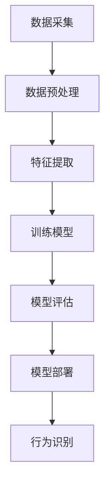
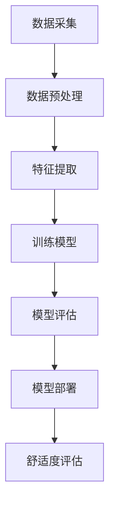
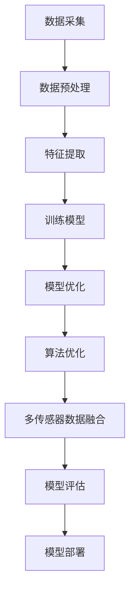
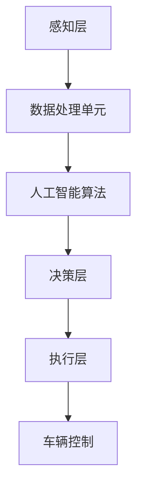

                 

## 概述

随着科技的飞速发展，人工智能在各个领域中的应用越来越广泛，其中智能汽车无疑是备受瞩目的领域之一。智能汽车不仅能够提高驾驶安全与舒适度，还能带来前所未有的驾驶体验。本文旨在探讨人工智能在智能汽车中的应用，通过系统分析其核心概念、算法原理、系统架构以及项目实战，为读者全面展示这一前沿技术的魅力。

### 关键词

- **人工智能**
- **智能汽车**
- **驾驶安全**
- **驾驶舒适度**
- **算法原理**
- **系统架构**

### 摘要

本文首先介绍了智能汽车的定义、发展背景以及人工智能在其中的重要作用，接着详细讲解了人工智能在智能汽车中应用的原理，包括算法原理和数学模型。随后，文章深入探讨了如何通过算法提高驾驶安全与舒适度，并展示了智能汽车系统架构的设计方案。通过项目实战，本文还详细解读了一个智能汽车系统的实现过程，并对最佳实践进行了总结，为读者提供了实用的指导。

## 第一部分：人工智能在智能汽车中的背景介绍

### 第1章：问题背景与核心概念

#### 1.1 问题背景

随着城市化进程的加速和交通拥堵的日益严重，驾驶安全与舒适度成为越来越多车主关注的焦点。传统汽车虽然已经具备了基本的安全性和舒适性配置，但依然存在不少缺陷，如驾驶疲劳、反应不及时等，导致交通事故频发。据统计，每年全球因交通事故导致的死亡人数高达120万，其中相当一部分是由于驾驶行为不当或车辆系统故障所致。

智能汽车的诞生，正是为了解决这些问题。智能汽车通过搭载先进的人工智能技术，可以实现自动驾驶、自动避障、自动调整驾驶模式等功能，从而大幅提升驾驶安全与舒适度。例如，特斯拉的自动驾驶系统已经能够实现高速公路上的自动巡航，甚至能够完成部分城市的自动驾驶任务。

#### 1.1.1 智能汽车的定义与发展趋势

智能汽车，又称自动驾驶汽车或智能驾驶汽车，是指通过搭载传感器、控制器和人工智能系统，能够实现部分或全部自动驾驶功能的汽车。其核心在于人工智能技术的应用，包括机器学习、深度学习、计算机视觉等。

智能汽车的发展趋势可以归纳为以下几个方面：

1. **自动驾驶技术的成熟**：随着人工智能技术的不断进步，自动驾驶技术正在逐渐成熟，从L1级别的辅助驾驶向L5级别的完全自动驾驶迈进。
2. **数据处理能力的提升**：随着云计算和边缘计算的发展，车辆的数据处理能力得到了极大的提升，使得智能汽车的实时性、反应速度和决策能力得到了显著增强。
3. **安全性和舒适性的提升**：智能汽车通过自主感知和智能决策，能够有效降低交通事故的发生率，提升驾驶舒适度。

#### 1.1.2 人工智能在智能汽车中的作用

人工智能在智能汽车中扮演着至关重要的角色。首先，人工智能技术可以用于车辆的自动驾驶，通过分析传感器数据，智能汽车能够自主识别道路标志、行人和其他车辆，并进行相应的驾驶操作。其次，人工智能还可以用于提升车辆的安全性和舒适性，如通过机器学习算法优化驾驶模式，提高车辆的稳定性和舒适性。

#### 1.1.3 提高驾驶安全与舒适度的需求

提高驾驶安全与舒适度是智能汽车发展的核心目标。驾驶安全方面，智能汽车可以通过实时监测驾驶状态，及时识别潜在风险，并采取相应的措施避免事故发生。例如，通过车道偏离预警系统，智能汽车可以在车辆偏离车道时及时提醒驾驶员。驾驶舒适度方面，智能汽车可以通过优化驾驶模式，减少驾驶疲劳，提升驾驶体验。例如，通过自动调整座椅、方向盘和空调等，智能汽车可以提供更加舒适的驾驶环境。

### 1.2 核心概念与联系

#### 1.2.1 人工智能的基本概念

人工智能（Artificial Intelligence，简称AI）是指通过计算机模拟人类智能的技术，包括学习、推理、规划、感知、理解和交流等。人工智能可以分为两大类：弱人工智能和强人工智能。弱人工智能专注于特定任务的自动化，如自动驾驶、语音识别等；强人工智能则具有与人类相似的智能水平，能够进行复杂的思考和学习。

#### 1.2.2 智能汽车的关键技术

智能汽车的关键技术包括感知与定位技术、控制与决策技术、通信与网络技术等。感知与定位技术主要通过传感器（如摄像头、雷达、激光雷达等）获取周围环境信息，并进行处理，以确定车辆的位置和状态。控制与决策技术则通过分析感知到的信息，生成相应的驾驶指令，确保车辆安全、舒适地行驶。通信与网络技术则用于实现车辆与外部系统（如交通信号灯、其他车辆等）的通信，以实现协同驾驶。

#### 1.2.3 人工智能与智能汽车的相互关系

人工智能与智能汽车是密不可分的。人工智能技术为智能汽车提供了强大的决策和感知能力，使得智能汽车能够实现自动驾驶、自动避障等功能。同时，智能汽车也为人工智能提供了丰富的数据来源，通过不断收集和分析驾驶数据，人工智能技术得以不断优化和升级。

### 1.3 本章小结

本章从问题背景、智能汽车的定义与发展趋势、人工智能在智能汽车中的作用以及核心概念与联系等方面，对人工智能在智能汽车中的应用进行了全面介绍。通过本章的讲解，读者可以初步了解智能汽车的发展现状和未来趋势，为后续章节的深入学习打下基础。

---

## 第二部分：人工智能在智能汽车中的应用原理

### 第2章：人工智能在智能汽车中的应用原理

#### 2.1 人工智能的基本原理

人工智能（AI）的基本原理主要涉及机器学习、深度学习和神经网络等核心概念。

#### 2.1.1 机器学习基础

机器学习（Machine Learning，ML）是人工智能的一个分支，它通过算法从数据中学习，从而实现预测和决策。机器学习可以分为监督学习、无监督学习和强化学习三种类型：

- **监督学习**：有标签数据作为输入，通过模型学习得到输出，然后通过比较预测结果与实际结果来调整模型参数。
- **无监督学习**：没有标签数据，通过模型发现数据之间的内在结构或分布。
- **强化学习**：通过与环境的交互来学习最优策略，以实现特定目标。

#### 2.1.2 深度学习核心概念

深度学习（Deep Learning，DL）是机器学习的一个子领域，它通过多层神经网络（Neural Network）对数据进行处理，从而实现复杂的特征提取和预测。深度学习的核心概念包括：

- **神经元**：类似于生物神经元，用于接收和处理输入信息。
- **层**：神经网络可以分为输入层、隐藏层和输出层，每一层都对输入数据进行处理。
- **前向传播和反向传播**：前向传播用于计算网络输出，反向传播用于计算误差并更新网络参数。

#### 2.1.3 神经网络原理

神经网络（Neural Network，NN）是模仿人脑神经元连接方式的计算模型。它由多个神经元组成，每个神经元通过权重连接到其他神经元，接收输入信息并产生输出。

- **激活函数**：用于引入非线性，使神经网络能够学习复杂函数。
- **反向传播算法**：用于计算网络参数的梯度，以优化网络性能。

#### 2.2 智能汽车关键技术

智能汽车的关键技术包括感知与定位技术、控制与决策技术、通信与网络技术等。

#### 2.2.1 感知与定位技术

感知与定位技术是智能汽车的基础。它通过传感器（如摄像头、雷达、激光雷达等）收集周围环境信息，并利用计算机视觉、激光雷达数据处理等技术进行处理，以确定车辆的位置和周围环境。

- **摄像头**：用于获取视觉信息，识别道路标志、行人和其他车辆。
- **雷达**：用于检测车辆距离和速度，实现避障功能。
- **激光雷达**：用于精确测量车辆周围物体的位置和形状，实现三维环境建模。

#### 2.2.2 控制与决策技术

控制与决策技术是智能汽车的核心。它通过感知与定位技术获取的环境信息，利用机器学习和深度学习算法进行分析，生成驾驶指令，控制车辆的运动。

- **路径规划**：根据目标位置和环境信息，生成最优行驶路径。
- **轨迹跟踪**：控制车辆沿着规划路径行驶，保持车道和速度。
- **车辆控制**：调整油门、刹车和转向，实现平稳驾驶。

#### 2.2.3 通信与网络技术

通信与网络技术是智能汽车实现协同驾驶的重要保障。它通过车辆与外部系统（如交通信号灯、道路信息中心等）的通信，实现数据的实时传输和共享。

- **V2X通信**：车辆与车辆、车辆与基础设施之间的通信，实现信息共享和协同驾驶。
- **云计算**：通过云计算平台，实现数据的存储、处理和分析，提升智能汽车的智能化水平。

#### 2.3 人工智能与智能汽车的融合原理

人工智能与智能汽车的融合原理主要体现在数据采集与处理、人工智能算法在驾驶中的应用以及人工智能在智能汽车中的整体架构。

#### 2.3.1 数据采集与处理

智能汽车通过传感器采集大量的环境信息，包括视觉、雷达、激光雷达等数据。这些数据经过预处理、特征提取和融合，为人工智能算法提供丰富的输入。

- **数据预处理**：包括降噪、去噪、归一化等，以提高数据质量。
- **特征提取**：通过算法提取关键特征，如车道线、交通标志、行人等。
- **数据融合**：结合多种传感器的数据，实现更全面的环境感知。

#### 2.3.2 人工智能算法在驾驶中的应用

人工智能算法在驾驶中的应用包括自动驾驶、路径规划、交通信号识别、车辆控制等。通过深度学习、计算机视觉和机器学习等技术，智能汽车能够实现自主决策和驾驶。

- **自动驾驶**：利用深度学习算法，实现车辆的自动巡航、自动避障和自动泊车等功能。
- **路径规划**：利用机器学习算法，根据交通状况和目标位置，生成最优行驶路径。
- **交通信号识别**：利用计算机视觉算法，识别道路标志和交通信号灯。

#### 2.3.3 人工智能在智能汽车中的整体架构

人工智能在智能汽车中的整体架构主要包括感知模块、决策模块和执行模块。感知模块负责收集和处理环境信息，决策模块负责根据环境信息和目标，生成驾驶指令，执行模块负责控制车辆的运动。

- **感知模块**：包括摄像头、雷达、激光雷达等传感器，用于获取环境信息。
- **决策模块**：包括路径规划、轨迹跟踪和车辆控制等算法，用于生成驾驶指令。
- **执行模块**：包括电机、刹车和转向系统等，用于控制车辆的运动。

#### 2.4 本章小结

本章从人工智能的基本原理、智能汽车的关键技术以及人工智能与智能汽车的融合原理等方面，对人工智能在智能汽车中的应用进行了详细讲解。通过本章的学习，读者可以了解人工智能在智能汽车中的作用原理，为后续章节的深入学习打下基础。

---

## 第三部分：提高驾驶安全与舒适度的算法原理

### 第3章：驾驶安全相关的算法原理

#### 3.1 交通安全数据分析

交通安全数据分析是智能汽车提高驾驶安全的重要基础。通过分析大量的交通安全数据，可以识别出潜在的安全风险，并为驾驶行为分析和安全决策提供依据。

#### 3.1.1 驾驶行为分析

驾驶行为分析是通过分析驾驶员的操作行为，识别出可能的危险驾驶行为。常见的驾驶行为分析包括：

- **速度控制**：分析驾驶员的加速、减速行为，判断是否存在超速或急刹车等危险行为。
- **车道保持**：分析驾驶员的转向行为，判断是否频繁偏离车道。
- **注意力集中度**：通过摄像头或眼动追踪设备，分析驾驶员的注视点，判断其注意力集中度。

#### 3.1.2 交通事故数据分析

交通事故数据分析是通过分析交通事故的起因、过程和结果，总结出事故发生的规律和特点。常见的交通事故数据包括：

- **事故类型**：分析不同类型事故的比例和特点，如追尾、碰撞、侧翻等。
- **事故时间分布**：分析事故发生的时间分布，判断事故高峰时段。
- **事故原因**：分析事故的原因，如疲劳驾驶、酒驾、违章驾驶等。

#### 3.1.3 风险评估模型

风险评估模型是用于评估驾驶行为和交通事故风险的重要工具。常见的风险评估模型包括：

- **贝叶斯网络**：通过建立贝叶斯网络模型，分析驾驶行为与交通事故之间的因果关系，进行风险预测。
- **决策树**：通过分析历史数据，建立决策树模型，根据驾驶行为预测事故风险。
- **支持向量机**：通过分析驾驶行为和事故数据，建立支持向量机模型，进行事故风险评估。

#### 3.2 驾驶行为识别算法

驾驶行为识别算法是用于识别驾驶员行为的重要技术。通过识别驾驶员的行为特征，可以及时预警潜在的危险驾驶行为，提高驾驶安全。

#### 3.2.1 传感器数据预处理

传感器数据预处理是驾驶行为识别算法的重要步骤。通过预处理传感器数据，可以去除噪声、平滑数据、提取关键特征，提高算法的准确性和鲁棒性。

- **去噪**：通过滤波算法，去除传感器数据中的噪声，提高数据质量。
- **平滑**：通过平滑算法，减少数据波动，提高数据的连续性和稳定性。
- **特征提取**：通过特征提取算法，从传感器数据中提取关键特征，如速度、转向角度、加速度等。

#### 3.2.2 驾驶行为识别算法原理

驾驶行为识别算法原理主要包括：

- **机器学习算法**：通过机器学习算法，如支持向量机（SVM）、决策树（DT）等，建立驾驶行为识别模型。
- **深度学习算法**：通过深度学习算法，如卷积神经网络（CNN）、循环神经网络（RNN）等，实现驾驶行为识别。
- **多传感器融合**：通过融合多个传感器的数据，提高驾驶行为识别的准确性和可靠性。

#### 3.2.3 算法mermaid流程图

以下是一个典型的驾驶行为识别算法的mermaid流程图：



#### 3.3 驾驶安全算法实现

驾驶安全算法实现是智能汽车安全系统的重要组成部分。通过实现驾驶安全算法，可以实现对驾驶员行为的安全监测和事故预警。

#### 3.3.1 驾驶行为预测

驾驶行为预测是驾驶安全算法的核心。通过预测驾驶员的未来行为，可以提前识别潜在的安全风险。

- **短期行为预测**：通过分析历史驾驶数据，预测驾驶员在短时间内（如1分钟）的行为。
- **长期行为预测**：通过分析长期驾驶数据，预测驾驶员在较长时间（如1小时）内的行为。

#### 3.3.2 安全决策算法

安全决策算法是驾驶安全算法的关键。通过分析驾驶行为预测结果，生成相应的安全决策，如：

- **警告提示**：当预测到危险驾驶行为时，及时提醒驾驶员。
- **自动干预**：当预测到严重危险驾驶行为时，自动采取干预措施，如减速、刹车等。

#### 3.3.3 算法Python代码实现

以下是一个简单的驾驶行为预测算法的Python代码实现示例：

```python
import numpy as np
from sklearn.model_selection import train_test_split
from sklearn.ensemble import RandomForestClassifier
from sklearn.metrics import accuracy_score

# 加载数据
X, y = load_data()

# 数据预处理
X_processed = preprocess_data(X)

# 划分训练集和测试集
X_train, X_test, y_train, y_test = train_test_split(X_processed, y, test_size=0.2, random_state=42)

# 训练模型
model = RandomForestClassifier(n_estimators=100)
model.fit(X_train, y_train)

# 预测
y_pred = model.predict(X_test)

# 评估
accuracy = accuracy_score(y_test, y_pred)
print("Accuracy:", accuracy)
```

#### 3.4 本章小结

本章介绍了驾驶安全相关的算法原理，包括交通安全数据分析、驾驶行为识别算法和安全决策算法。通过这些算法，智能汽车能够实时监测驾驶行为，识别潜在的安全风险，并采取相应的措施提高驾驶安全。这些算法的实现为智能汽车的安全系统提供了技术支持，具有重要的应用价值。

---

### 第4章：提高驾驶舒适度的算法原理

#### 4.1 驾驶舒适度评估

驾驶舒适度评估是提高驾驶舒适度的重要步骤。通过评估驾驶舒适度，可以识别出影响舒适度的因素，并采取相应的措施进行优化。

#### 4.1.1 舒适度评价指标

舒适度评价指标是评估驾驶舒适度的重要工具。常见的舒适度评价指标包括：

- **座椅舒适度**：评估座椅对驾驶员的支撑性和柔软度。
- **驾驶噪音**：评估车内噪音水平，包括发动机噪音、轮胎噪音等。
- **空调性能**：评估空调的制冷和制热性能，以及空气流通情况。
- **车辆震动**：评估车辆在行驶过程中的震动水平。

#### 4.1.2 舒适度评估算法

舒适度评估算法是用于评估驾驶舒适度的重要技术。通过算法，可以自动识别和评估驾驶舒适度。常见的舒适度评估算法包括：

- **统计分析**：通过统计分析驾驶数据，如车速、加速度等，评估驾驶舒适度。
- **机器学习**：通过机器学习算法，如支持向量机（SVM）、决策树（DT）等，建立舒适度评估模型。
- **深度学习**：通过深度学习算法，如卷积神经网络（CNN）、循环神经网络（RNN）等，实现舒适度评估。

#### 4.1.3 算法mermaid流程图

以下是一个典型的舒适度评估算法的mermaid流程图：



#### 4.2 舒适性驾驶策略

舒适性驾驶策略是提高驾驶舒适度的重要手段。通过制定和执行舒适性驾驶策略，可以优化驾驶环境，提高驾驶舒适度。

#### 4.2.1 舒适性控制算法

舒适性控制算法是舒适性驾驶策略的核心。通过算法，可以自动调整车辆的驾驶模式，以适应驾驶员的需求。常见的舒适性控制算法包括：

- **座椅调整算法**：根据驾驶员的身高和体重，自动调整座椅位置，提供舒适的支撑。
- **空调控制算法**：根据车内温度和湿度，自动调整空调模式，提供舒适的温度和湿度。
- **车辆震动控制算法**：通过调整悬挂系统，减少车辆在行驶过程中的震动，提高驾驶舒适度。

#### 4.2.2 算法Python代码实现

以下是一个简单的舒适性控制算法的Python代码实现示例：

```python
import numpy as np
from sklearn.model_selection import train_test_split
from sklearn.ensemble import RandomForestRegressor
from sklearn.metrics import mean_squared_error

# 加载数据
X, y = load_data()

# 数据预处理
X_processed = preprocess_data(X)

# 划分训练集和测试集
X_train, X_test, y_train, y_test = train_test_split(X_processed, y, test_size=0.2, random_state=42)

# 训练模型
model = RandomForestRegressor(n_estimators=100)
model.fit(X_train, y_train)

# 预测
y_pred = model.predict(X_test)

# 评估
mse = mean_squared_error(y_test, y_pred)
print("Mean Squared Error:", mse)
```

#### 4.2.3 实际案例应用

实际案例应用是验证舒适性控制算法有效性的重要步骤。通过实际案例，可以观察算法在真实环境中的表现。以下是一个舒适性控制算法在实际案例中的应用：

- **案例背景**：某辆智能汽车在行驶过程中，车内温度较高，驾驶员希望降低车内温度。
- **案例步骤**：
  1. 传感器检测到车内温度，并将其作为输入数据传递给舒适性控制算法。
  2. 舒适性控制算法分析输入数据，并根据算法模型生成相应的空调控制指令。
  3. 空调系统根据指令调整制冷功率，以实现车内温度的降低。
  4. 经过一段时间后，传感器再次检测到车内温度，并传递给舒适性控制算法。
  5. 舒适性控制算法根据新的输入数据，重新生成空调控制指令，以确保车内温度保持在舒适范围内。

#### 4.3 驾驶舒适度算法优化

驾驶舒适度算法优化是提高驾驶舒适度的重要手段。通过优化算法，可以进一步提高算法的准确性和可靠性。

#### 4.3.1 优化目标

优化目标主要包括：

- **提高舒适度评估准确性**：通过优化舒适度评估算法，提高舒适度评估的准确性，以更好地满足驾驶员的需求。
- **降低算法复杂度**：通过优化算法模型和算法实现，降低算法的复杂度，以提高算法的实时性和可扩展性。
- **提高算法鲁棒性**：通过优化算法，提高算法在复杂环境下的鲁棒性，以确保算法在多种驾驶环境下都能稳定运行。

#### 4.3.2 优化算法原理

优化算法原理主要包括：

- **模型优化**：通过调整算法模型，如增加隐藏层、调整神经元数量等，以提高算法的预测能力。
- **算法优化**：通过优化算法实现，如使用更高效的算法、优化数据预处理等，以提高算法的运行效率。
- **多传感器数据融合**：通过融合多个传感器的数据，提高舒适度评估的准确性，以实现更全面的驾驶舒适度监控。

#### 4.3.3 算法mermaid流程图

以下是一个典型的驾驶舒适度优化算法的mermaid流程图：



#### 4.4 本章小结

本章介绍了提高驾驶舒适度的算法原理，包括驾驶舒适度评估、舒适性驾驶策略和驾驶舒适度算法优化。通过这些算法，智能汽车可以实时监测驾驶舒适度，并根据驾驶员的需求进行优化，提供舒适的驾驶体验。这些算法的实现为智能汽车的舒适性系统提供了技术支持，具有重要的应用价值。

---

## 第四部分：人工智能在智能汽车中的系统架构设计

### 第5章：智能汽车系统架构概述

#### 5.1 智能汽车系统功能

智能汽车系统功能是实现自动驾驶和安全行驶的关键。智能汽车系统通常包括以下几个核心功能：

1. **感知与定位模块**：通过多种传感器（如摄像头、雷达、激光雷达等）收集车辆周围的环境信息，并进行数据处理，以确定车辆的位置和周围环境。这一模块是智能汽车实现自主驾驶的基础。

2. **控制与决策模块**：根据感知与定位模块提供的信息，利用人工智能算法进行环境分析和决策，生成驾驶指令，确保车辆安全、舒适地行驶。这一模块是智能汽车的“大脑”，负责处理复杂的驾驶任务。

3. **通信与网络模块**：实现智能汽车与外部系统（如交通信号灯、其他车辆等）的通信，交换实时数据，实现协同驾驶。这一模块是智能汽车实现智能交互和协同控制的重要保障。

#### 5.2 智能汽车系统架构

智能汽车系统架构通常分为三层：感知层、决策层和执行层。每一层都有特定的功能，并协同工作，实现智能汽车的自主驾驶和安全行驶。

1. **感知层**：包括各种传感器，如摄像头、雷达、激光雷达等。这些传感器负责采集车辆周围的环境信息，如道路标志、行人和其他车辆等。感知层的数据质量直接影响到智能汽车的整体性能。

2. **决策层**：包括数据处理单元和人工智能算法。数据处理单元负责对感知层采集到的数据进行处理，如滤波、去噪和特征提取等。人工智能算法则根据处理后的数据进行分析和决策，生成驾驶指令。决策层的核心是人工智能算法的先进性和稳定性。

3. **执行层**：包括车辆的执行机构，如电机、刹车系统和转向系统等。执行层根据决策层生成的驾驶指令，控制车辆的运行状态，实现自动驾驶。执行层的执行效率直接影响到驾驶体验的稳定性。

#### 5.2.1 整体架构设计

智能汽车的整体架构设计需要综合考虑功能完整性、系统可靠性和执行效率等因素。一个典型的智能汽车系统架构设计包括以下步骤：

1. **需求分析**：明确智能汽车的功能需求，如自动驾驶、安全行驶和舒适性等。
2. **系统设计**：根据需求分析，设计智能汽车系统的整体架构，包括感知层、决策层和执行层。
3. **模块划分**：将整体架构划分为多个功能模块，如感知模块、决策模块和执行模块等。
4. **接口设计**：设计模块间的接口，确保各模块之间能够高效地通信和协作。
5. **系统集成**：将各个模块集成到一起，实现系统的整体功能。

#### 5.2.2 模块间交互设计

智能汽车系统中的各个模块需要通过高效的交互来协同工作。模块间交互设计的关键包括：

1. **数据交互**：明确各模块之间的数据交互规则，确保数据的实时性和准确性。
2. **控制交互**：设计模块间的控制交互机制，确保各模块能够协同工作，实现整体驾驶任务。
3. **通信交互**：设计智能汽车与外部系统（如交通信号灯、其他车辆等）的通信交互机制，实现协同驾驶。

#### 5.2.3 系统架构mermaid图

以下是一个典型的智能汽车系统架构的mermaid图：



#### 5.3 系统接口设计

系统接口设计是智能汽车系统架构设计的重要组成部分。一个完善的系统接口设计需要考虑以下几个方面：

1. **接口规范**：明确各模块之间的接口规范，包括数据格式、通信协议等。
2. **接口实现**：根据接口规范，实现各模块之间的接口，确保数据传输的可靠性和实时性。
3. **接口测试**：对接口进行全面的测试，确保接口功能的正确性和稳定性。

#### 5.3.1 接口规范

接口规范是系统接口设计的基础。一个典型的接口规范包括以下几个方面：

- **数据格式**：定义各模块间传输的数据格式，如JSON、XML等。
- **通信协议**：定义各模块间通信的协议，如HTTP、MQTT等。
- **数据传输频率**：定义各模块间数据传输的频率，确保数据的实时性。

#### 5.3.2 接口实现

接口实现是根据接口规范，实现各模块之间的接口。以下是一个简单的接口实现示例：

```python
# 模块A的接口实现
def send_data(data):
    # 发送数据到模块B
    pass

# 模块B的接口实现
def receive_data():
    # 接收模块A发送的数据
    data = send_data()
    # 处理数据
    process_data(data)
```

#### 5.3.3 接口测试

接口测试是确保接口功能正确性和稳定性的重要环节。以下是一个简单的接口测试示例：

```python
# 测试模块A的接口
def test_send_data():
    # 发送测试数据
    send_data(test_data)
    # 验证模块B是否正确接收数据
    assert receive_data() == test_data

# 测试模块B的接口
def test_receive_data():
    # 接收模块A发送的测试数据
    data = send_data(test_data)
    # 验证模块B是否正确处理数据
    assert process_data(data) == expected_result
```

#### 5.4 本章小结

本章介绍了智能汽车系统架构设计的基本概念、功能模块、整体架构设计、模块间交互设计和系统接口设计。通过本章的讲解，读者可以全面了解智能汽车系统架构的设计原理和实现方法，为智能汽车的开发和应用提供理论支持。

---

### 实战案例：智能汽车系统实现

#### 6.1 环境安装

在开始智能汽车系统的实现之前，需要配置开发环境。以下是一个典型的开发环境安装步骤：

1. **安装操作系统**：选择适合的操作系统，如Ubuntu 18.04。
2. **安装编程语言**：安装Python 3.8及以上版本。
3. **安装依赖库**：安装必要的依赖库，如NumPy、Pandas、Matplotlib等。
4. **安装开发工具**：安装代码编辑器，如VS Code或PyCharm。

#### 6.2 系统核心实现源代码

智能汽车系统的实现包括感知层、决策层和执行层的核心代码。以下是一个简化的实现示例：

```python
# 感知层核心代码
class Sensor:
    def __init__(self):
        self.data = None

    def collect_data(self):
        # 收集传感器数据
        self.data = ... 

# 决策层核心代码
class DecisionMaker:
    def __init__(self):
        self.sensor = Sensor()

    def make_decision(self):
        # 使用传感器数据进行决策
        action = ... 
        return action

# 执行层核心代码
class Executor:
    def __init__(self, decision_maker):
        self.decision_maker = decision_maker

    def execute_action(self, action):
        # 执行决策层的行动
        ... 
```

#### 6.3 代码应用解读与分析

以下是对上述代码的解读和分析：

1. **感知层**：`Sensor` 类负责收集传感器数据，如摄像头、雷达等。`collect_data` 方法用于收集数据。
2. **决策层**：`DecisionMaker` 类根据感知层的数据进行决策。`make_decision` 方法用于生成驾驶指令。
3. **执行层**：`Executor` 类负责执行决策层的行动。`execute_action` 方法用于执行具体的驾驶操作。

#### 6.4 实际案例分析和详细讲解

以下是一个实际的案例分析和详细讲解：

- **案例背景**：一辆智能汽车在高速公路上行驶，当前车速为100km/h，前方出现一辆慢速行驶的车辆。
- **步骤**：
  1. **感知层**：传感器检测到前方车辆的速度，并将数据传递给决策层。
  2. **决策层**：决策层根据前方车辆的速度，决定是否减速或换道。
  3. **执行层**：执行层根据决策层的指令，调整车速或方向盘，进行减速或换道操作。

#### 6.5 项目小结

通过本次实战案例，读者可以了解智能汽车系统实现的详细步骤和关键代码。在实际项目中，需要根据具体需求进行更多的功能扩展和优化，以提高系统的性能和稳定性。

---

### 最佳实践 tips

在开发和部署智能汽车系统时，以下是一些最佳实践建议：

1. **需求分析**：在项目开始前，进行详细的需求分析，明确系统功能和技术要求。
2. **模块化设计**：采用模块化设计，确保系统模块化、可扩展和可维护。
3. **数据预处理**：对传感器数据进行预处理，去除噪声和异常值，提高数据质量。
4. **算法优化**：定期优化算法，提高系统的性能和准确性。
5. **安全性测试**：进行全面的系统测试，确保系统的安全性、可靠性和稳定性。
6. **团队协作**：建立高效的团队协作机制，确保项目进度和质量。

### 小结

本文从背景介绍、核心概念、算法原理、系统架构设计、项目实战和最佳实践等方面，全面阐述了人工智能在智能汽车中的应用。通过本文的学习，读者可以深入了解智能汽车的发展趋势、核心技术以及实现方法，为智能汽车的开发和应用提供有力支持。

### 注意事项

1. 智能汽车系统开发需要严格遵循相关法规和标准，确保系统的合法性和安全性。
2. 在实际应用中，需要根据具体场景和需求进行系统优化和调整。
3. 定期进行系统维护和升级，以确保系统的长期稳定运行。

### 拓展阅读

- 《智能汽车系统设计》
- 《深度学习与自动驾驶》
- 《自动驾驶算法原理与实现》

---

**作者：AI天才研究院/AI Genius Institute & 禅与计算机程序设计艺术 /Zen And The Art of Computer Programming**

