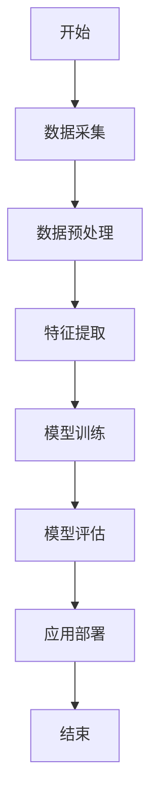
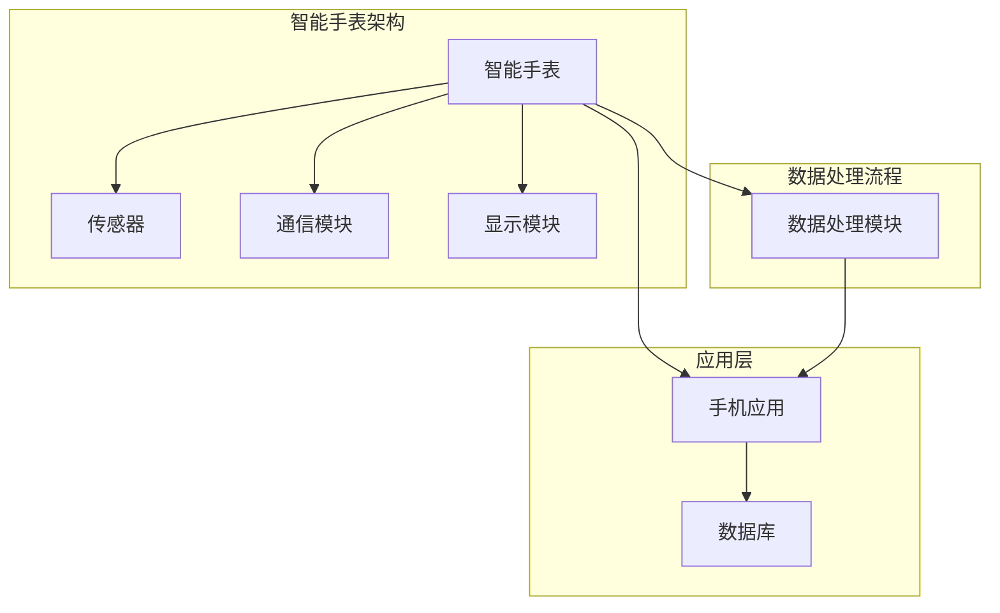
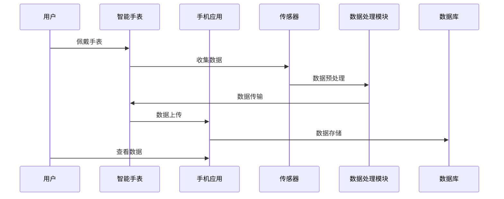

                 


# 人工智能在智能穿戴设备中的应用：健康监测与生活助手

## 关键词
- 人工智能
- 智能穿戴设备
- 健康监测
- 生活助手
- 算法
- 架构设计
- 实战案例

## 摘要
本文将深入探讨人工智能在智能穿戴设备中的应用，重点关注健康监测与生活助手两个领域。我们将逐步分析人工智能的基本原理，介绍智能穿戴设备的组成与功能，并通过具体案例展示如何利用人工智能技术实现精准的健康监测和高效的生活助手服务。本文的目标是帮助读者理解人工智能在智能穿戴设备中的关键应用，提供实用的技术和方法，以推动智能穿戴设备的发展与创新。

## 目录

### 前言

#### 核心概念
- **人工智能（AI）**：介绍人工智能的基本概念、分类和应用领域。
- **智能穿戴设备**：阐述智能穿戴设备的发展历程、类型和主要功能。

#### 问题背景
- **健康监测的现状**：讨论当前健康监测技术的局限性。
- **生活助手的挑战**：分析生活助手在智能穿戴设备中的应用前景和面临的难题。

#### 问题解决
- **人工智能的潜力**：探讨人工智能在健康监测与生活助手中的潜在解决方案。
- **研究意义**：强调人工智能在提升智能穿戴设备性能和用户体验方面的重大意义。

#### 边界与外延
- **讨论范围**：明确本文讨论的智能穿戴设备类型和应用场景。
- **不包括的内容**：列出本文不涉及的相关领域，如智能家居、虚拟现实等。

#### 概念结构与核心要素组成
- **智能穿戴设备的核心要素**：分析智能穿戴设备的关键组成部分，如传感器、数据处理单元等。
- **人工智能与健康监测的联系**：探讨人工智能如何整合进健康监测系统，提高其效率和准确性。
- **人工智能与生活助手的融合**：分析人工智能在提升生活助手智能化水平方面的作用。

### 核心概念与联系

#### 核心概念原理
- **人工智能的基本原理**：详细解释机器学习、深度学习等人工智能技术的核心概念。
- **健康监测的机制**：阐述健康监测的基本原理和常用技术，如心率监测、血压监测等。
- **生活助手的功能**：分析生活助手的主要功能，如日程管理、信息提醒等。

#### 概念属性特征对比表格
| 特性        | 机器学习 | 深度学习 | 传统算法 |
|-------------|----------|----------|----------|
| **学习方式** | **数据驱动** | **数据驱动** | **规则驱动** |
| **计算复杂度** | **高** | **极高** | **低** |
| **适用场景** | **复杂模式识别** | **复杂模式识别** | **确定性问题** |

#### ER实体关系图架构
```mermaid
erDiagram
  ID | Person <<fork>> { HealthData : hasData ; ActivityData : hasActivity }
  ID | Device <<create>> DeviceData : stores
  DeviceData ||--|{ SensorData }
  DeviceData ||--|{ ActuatorData }
  Person ||--|{ PersonalInfo }
```

### 算法原理讲解

#### 算法mermaid流程图


#### Python源代码
```python
import numpy as np
from sklearn.ensemble import RandomForestClassifier
from sklearn.model_selection import train_test_split

# 假设已经收集到数据
X, y = load_data()

# 数据预处理
X = preprocess_data(X)

# 划分训练集和测试集
X_train, X_test, y_train, y_test = train_test_split(X, y, test_size=0.2)

# 模型训练
model = RandomForestClassifier()
model.fit(X_train, y_train)

# 模型评估
accuracy = model.score(X_test, y_test)
print(f"Model accuracy: {accuracy:.2f}")
```

#### 数学模型和公式
$$
J(\theta) = -\frac{1}{m}\sum_{i=1}^{m}y^{(i)}\log(h_\theta(x^{(i)})) + (1 - y^{(i)})\log(1 - h_\theta(x^{(i)}))
$$

#### 详细讲解与举例说明
**机器学习基本原理**：
机器学习是一种通过数据学习规律并做出预测或决策的技术。常见的机器学习算法有监督学习、无监督学习和强化学习。其中，监督学习是最常用的方法，其核心是通过已知的输入输出数据训练模型，从而预测未知数据的输出。

**健康监测应用**：
在健康监测领域，机器学习可以用于预测健康状态、诊断疾病等。例如，通过收集佩戴者的心电信号、运动数据等，利用机器学习算法进行特征提取和模式识别，可以实现对心血管疾病的早期预警。

**生活助手应用**：
生活助手可以根据用户的行为习惯和偏好，提供个性化的服务。例如，通过分析用户的日程安排、地理位置等数据，生活助手可以自动安排行程、提醒用户注意事项等。

### 系统分析与架构设计方案

#### 问题场景介绍
智能穿戴设备在日常生活、运动健身、医疗保健等领域有广泛的应用。例如，在健康监测方面，智能手环可以实时监测心率、步数等健康数据，并提供健康分析报告；在生活助手方面，智能手表可以提醒用户日程安排、接收电话和短信等。

#### 项目介绍
我们以一款智能手表为例，介绍其项目实现。该智能手表具备健康监测、信息提醒、运动追踪等功能，内置多种传感器，如加速度传感器、陀螺仪、心率传感器等，通过蓝牙或其他无线技术连接手机应用。

#### 系统功能设计（领域模型Mermaid类图）
```mermaid
classDiagram
    Device <-|{uses}| Sensor
    Device <-|{uses}| Communicator
    Device <-|{uses}| Display
    Device -> App : communicates with
    App --> Database : stores data
    Sensor --> DataProcessor : processes data
    Communicator --> DataProcessor : sends data
    Display --> DataProcessor : displays data
```

#### 系统架构设计（Mermaid架构图）


#### 系统接口设计和系统交互（Mermaid序列图）


### 项目实战

#### 环境安装
- **开发环境**：安装Python 3.8及以上版本，选择合适的IDE（如PyCharm、VSCode）。
- **依赖库**：安装必要的库，如NumPy、Scikit-learn、Matplotlib等。

#### 系统核心实现源代码
```python
# 示例：智能手表健康监测模块实现
class HealthMonitor:
    def __init__(self):
        self.sensor_data = None
    
    def collect_data(self):
        # 采集传感器数据
        self.sensor_data = get_sensor_data()
    
    def process_data(self):
        # 数据预处理
        processed_data = preprocess_data(self.sensor_data)
        return processed_data
    
    def predict_health_state(self, data):
        # 健康状态预测
        model = load_health_state_model()
        prediction = model.predict(data)
        return prediction

# 示例：手机应用健康状态展示
class HealthApp:
    def __init__(self):
        self.health_monitor = HealthMonitor()
    
    def display_health_state(self):
        data = self.health_monitor.process_data()
        state = self.health_monitor.predict_health_state(data)
        print(f"Your health state is: {state}")
```

#### 代码应用解读与分析
**代码解读**：
- `HealthMonitor` 类：负责健康数据的采集、处理和预测。
- `collect_data` 方法：从传感器获取原始数据。
- `process_data` 方法：对数据进行预处理。
- `predict_health_state` 方法：使用训练好的模型预测健康状态。

**实际应用分析**：
- 在实际应用中，智能手表会实时采集佩戴者的健康数据，如心率、血压等。
- 应用端会接收这些数据，进行预处理后使用机器学习模型进行健康状态预测。
- 预测结果会以可视化形式展示给用户，帮助用户更好地了解自己的健康状况。

#### 实际案例分析和详细讲解剖析
**案例 1**：某用户佩戴智能手表进行日常活动监测，应用端显示其心率在正常范围内，建议保持当前运动强度。

**案例 2**：某用户在剧烈运动后佩戴智能手表，应用端显示其心率过高，建议用户立即休息，并提醒医生。

**详细讲解**：
- **案例 1**：智能手表通过传感器实时监测心率，应用端接收数据后，利用机器学习模型判断心率是否在正常范围内。根据预测结果，应用端提供适当的运动建议。
- **案例 2**：智能手表通过传感器监测到用户心率过高，应用端立即触发预警机制，提醒用户注意休息，并建议联系医生。

#### 项目小结
本项目通过实际案例展示了智能穿戴设备在健康监测方面的应用。智能手表可以实时采集健康数据，应用端使用机器学习模型进行数据分析，为用户提供个性化的健康建议。在未来的发展中，我们应进一步优化算法，提高预测准确性，并丰富智能穿戴设备的功能。

### 最佳实践 tips

- **数据质量**：确保采集到的健康数据质量高，减少误差和噪音。
- **模型优化**：定期更新机器学习模型，以适应不断变化的数据特征。
- **用户隐私**：严格遵守用户隐私保护法规，确保数据安全。

### 小结

本文详细探讨了人工智能在智能穿戴设备中的应用，特别是健康监测和生活助手领域。通过分析核心概念、算法原理、系统架构设计和实战案例，我们展示了如何利用人工智能技术提升智能穿戴设备的性能和用户体验。未来，随着人工智能技术的不断进步，智能穿戴设备将在更多领域发挥重要作用。

### 注意事项

- **技术更新**：关注人工智能领域的技术更新，及时引入新技术。
- **安全防护**：加强数据安全和隐私保护，防止数据泄露。

### 拓展阅读

- **参考文献**：
  1. Goodfellow, I., Bengio, Y., & Courville, A. (2016). *Deep Learning*. MIT Press.
  2. Russell, S., & Norvig, P. (2020). *Artificial Intelligence: A Modern Approach*. Prentice Hall.
- **在线资源**：
  1. TensorFlow：https://www.tensorflow.org/
  2. Scikit-learn：https://scikit-learn.org/stable/

### 作者信息

作者：AI天才研究院/AI Genius Institute & 禅与计算机程序设计艺术 /Zen And The Art of Computer Programming

