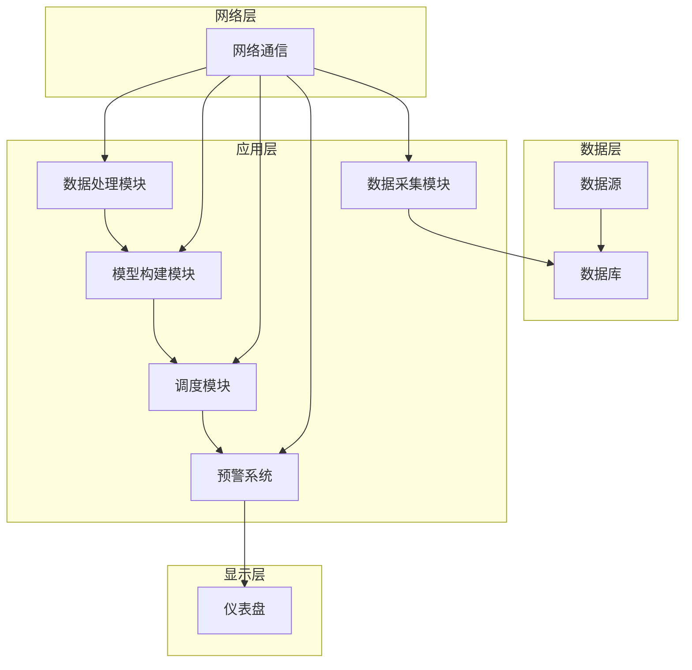
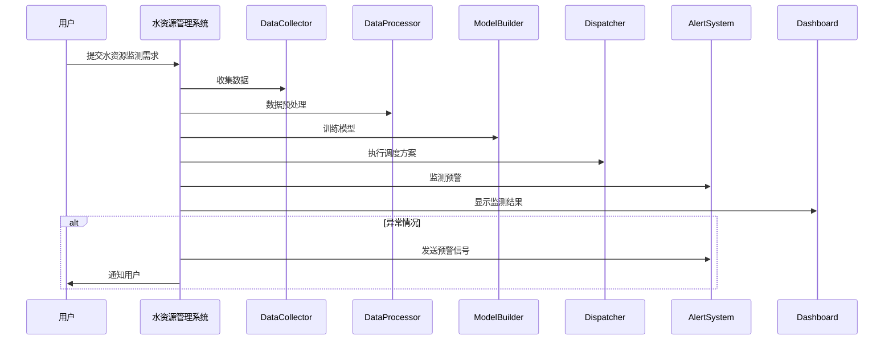

                 


### 引言

水资源是人类生存和发展的重要基础。然而，全球水资源分布不均，部分地区面临严重的水资源短缺问题。传统的水资源管理方法存在诸多局限，难以应对现代水资源管理的复杂性和动态性。随着人工智能（AI）技术的飞速发展，利用AI优化水资源管理成为可能。本文旨在探讨人工智能在水资源管理中的作用，具体包括优化利用和水资源保护两个方面。

文章的核心关键词为：水资源管理、人工智能、优化利用、水资源保护。本文将首先介绍水资源管理的背景和挑战，然后探讨人工智能的基础知识，接着分析人工智能在水资源管理中的应用，最后讨论未来的发展方向和挑战。

### 第一部分：水资源管理背景

#### 1.1 问题背景

水资源短缺是全球范围内普遍存在的问题。据联合国统计，全球约28%的人口生活在面临用水压力的地区。我国作为人口大国，水资源供需矛盾也日益突出。随着工业化进程的加速和城市化水平的提高，水资源污染和浪费问题愈加严重。因此，如何高效利用水资源，提高水资源利用效率，成为水资源管理的关键。

#### 1.2 水资源管理的挑战

水资源管理的挑战主要体现在以下几个方面：

1. **数据匮乏和监测难度大**：水资源数据采集和处理难度较大，数据来源多样，数据质量参差不齐，导致水资源管理决策缺乏有效依据。
2. **水资源分布不均**：全球和地区间水资源分布极不均衡，水资源分配不均，加剧了部分地区的用水危机。
3. **水资源利用效率低**：传统水资源利用方式效率低下，存在大量浪费现象，不利于水资源的可持续利用。
4. **水资源污染问题**：工业废水、农业面源污染和生活污水等问题，使得水资源质量下降，影响人类健康和生态平衡。

#### 1.3 人工智能在水资源管理中的应用

人工智能技术在水资源管理中具有广泛的应用前景，主要包括以下方面：

1. **数据挖掘与处理**：利用机器学习算法对海量水资源数据进行挖掘和处理，提取有用信息，为水资源管理决策提供支持。
2. **预测与分析**：通过时间序列分析和回归分析等方法，预测未来水资源供需状况，为水资源调配提供科学依据。
3. **优化调度**：基于优化算法，实现水资源调度优化，提高水资源利用效率。
4. **水质监测与预警**：利用物联网和传感器技术，实时监测水质，构建水质预警系统，预防水污染事件。
5. **生态修复**：基于人工智能技术，分析水生态系统的状况，制定生态修复方案，恢复水资源生态平衡。

### 第二部分：人工智能基础

#### 2.1 人工智能概述

人工智能（AI）是指通过计算机模拟人类智能行为的理论、方法和技术。人工智能的核心目标是实现机器的自主决策和智能行动。人工智能的主要研究方向包括机器学习、深度学习、自然语言处理、计算机视觉等。

#### 2.2 关键技术

1. **机器学习**：机器学习是一种通过数据训练模型，使计算机自动完成特定任务的技术。主要方法包括监督学习、无监督学习、强化学习等。
2. **深度学习**：深度学习是机器学习的一个分支，通过多层神经网络模拟人脑信息处理过程，具有强大的非线性建模能力。
3. **自然语言处理**：自然语言处理（NLP）是使计算机能够理解和处理自然语言的技术，主要应用于文本分析、语音识别、机器翻译等。
4. **计算机视觉**：计算机视觉是使计算机能够理解和解释视觉信息的技术，主要应用于图像识别、目标检测、图像分割等。

#### 2.3 人工智能发展历程

人工智能的研究始于20世纪50年代。随着计算机技术的快速发展，人工智能技术逐步应用于各个领域。20世纪80年代，专家系统成为人工智能研究的热点。21世纪初，深度学习技术的突破，使人工智能迎来了新的发展机遇。近年来，人工智能技术在金融、医疗、交通、教育等领域取得了显著成果，显示出广阔的应用前景。

### 第三部分：人工智能在水资源管理中的应用

#### 3.1 数据收集与处理

水资源管理需要大量数据支持，数据来源包括遥感数据、水文监测数据、气象数据等。数据收集后，需要进行预处理，如数据清洗、数据转换和数据归一化等，以消除噪声和异常值，提高数据质量。

#### 3.2 数据分析方法

数据分析方法包括：

1. **回归分析**：用于分析水资源供需关系，预测未来水资源需求。
2. **聚类分析**：用于分类不同地区的水资源状况，识别水资源短缺区域。
3. **时间序列分析**：用于预测水资源的时间变化趋势，为水资源调度提供依据。
4. **神经网络**：用于建立水资源供需模型，优化水资源调配。

#### 3.3 节水技术

节水技术是优化水资源利用的重要手段。利用人工智能技术，可以实现智能灌溉、节水设备监控等。例如，通过分析土壤水分、作物需水量等因素，智能灌溉系统能够实现精准灌溉，减少水资源浪费。

#### 3.4 水资源调度优化

水资源调度优化是提高水资源利用效率的关键。通过构建水资源供需模型，利用优化算法，可以实现对水资源的高效调配。例如，基于线性规划和整数规划的方法，可以优化水库调度，提高水资源利用率。

#### 3.5 水质监测与预警

水质监测是保障水资源安全的重要环节。利用物联网和传感器技术，可以实现对水质的实时监测。结合机器学习算法，可以构建水质预警系统，及时发现并处理水污染事件。

### 第四部分：案例分析

#### 4.1 案例一：智能灌溉系统

智能灌溉系统通过传感器实时监测土壤水分、气温、湿度等环境参数，根据作物需水量进行精准灌溉。该系统降低了水资源浪费，提高了农作物产量。

#### 4.2 案例二：水资源调配优化

某地区利用人工智能技术，对水库调度进行优化。通过建立水资源供需模型，利用优化算法，实现了水资源的高效调配，缓解了水资源短缺问题。

#### 4.3 案例三：水质监测与预警系统

某河流流域利用物联网和传感器技术，建立了水质监测与预警系统。通过实时监测水质，及时发现并处理水污染事件，保障了水资源安全。

### 第五部分：挑战与展望

#### 5.1 挑战

1. **数据质量和可靠性**：水资源数据质量参差不齐，数据可靠性问题亟待解决。
2. **计算资源与成本**：人工智能技术在水资源管理中的应用需要大量计算资源和资金投入。
3. **政策与法规**：水资源管理涉及多个部门和领域，需要制定统一的政策和法规。

#### 5.2 展望

1. **人工智能技术的持续发展**：随着人工智能技术的不断进步，其在水资源管理中的应用将更加广泛和深入。
2. **多学科交叉研究**：水资源管理需要多学科交叉研究，实现技术创新和成果转化。
3. **可持续发展**：利用人工智能技术，实现水资源的高效利用和生态保护，推动水资源的可持续发展。

### 结论

人工智能技术在水资源管理中具有巨大的应用潜力。通过数据挖掘、预测分析、优化调度等技术，可以有效提高水资源利用效率，保障水资源安全。未来，随着人工智能技术的不断发展，水资源管理将迈向智能化、可持续化的新阶段。

### 作者信息

作者：AI天才研究院/AI Genius Institute & 禅与计算机程序设计艺术 /Zen And The Art of Computer Programming

----------------------------------------------------------------

# 人工智能在水资源管理中的作用：优化利用与保护

关键词：水资源管理、人工智能、优化利用、水资源保护

摘要：本文介绍了水资源管理的背景和挑战，探讨了人工智能在水资源管理中的应用，包括数据收集与处理、优化水资源利用、水资源保护等方面。通过案例分析，展示了人工智能技术在实际水资源管理中的应用成果。本文认为，人工智能技术在水资源管理中具有巨大的潜力，有望推动水资源管理的智能化和可持续发展。

----------------------------------------------------------------

## 第一部分：水资源管理背景

### 1.1 问题背景

水资源是人类生存和发展的重要基础。地球上的水资源总量约为13.86亿立方千米，其中海水占97.5%，淡水仅占2.5%。然而，这些淡水资源的分布极为不均，约68.7%的淡水资源分布在不到10个国家，而世界上有28个国家面临严重的水资源短缺问题。在我国，水资源供需矛盾也日益突出。据统计，我国人均水资源量仅为2,100立方米，仅为世界平均水平的28%。此外，我国水资源污染问题也十分严重，约50%的城市地下水污染严重，主要污染物包括重金属、农药和有机物等。这些问题使得水资源管理面临着前所未有的挑战。

### 1.2 水资源管理的挑战

水资源管理面临的主要挑战包括数据匮乏、水资源分布不均、水资源利用效率低、水资源污染等问题。

1. **数据匮乏和监测难度大**：水资源数据种类繁多，包括水文数据、气象数据、土地利用数据等。然而，这些数据往往分散在不同的部门和管理机构中，数据共享和整合困难。此外，由于水资源环境的复杂性和变化性，实时、准确的数据监测和采集也是一个巨大的挑战。

2. **水资源分布不均**：全球和地区间水资源分布极不均衡，一些地区水资源丰富，而另一些地区则面临严重的水资源短缺。例如，中东地区的许多国家水资源极度匮乏，年降水量少，河流和湖泊也极为有限，导致水资源短缺问题严重。

3. **水资源利用效率低**：传统的水资源管理方法通常依赖于经验和手工操作，缺乏科学的数据分析和决策支持。这使得水资源利用效率低下，存在大量的水资源浪费现象。例如，农业灌溉中的滴灌技术未得到广泛应用，许多地区仍然采用传统的漫灌方式，导致大量水资源的浪费。

4. **水资源污染问题**：工业废水、农业面源污染和生活污水等污染源使得水资源质量下降，影响了人类健康和生态平衡。例如，许多河流和湖泊受到重金属污染、农药和化肥污染，导致水生生物死亡，水质恶化。

### 1.3 人工智能在水资源管理中的应用

随着人工智能（AI）技术的飞速发展，其在水资源管理中的应用潜力逐渐显现。人工智能技术在水资源管理中的应用主要包括数据收集与处理、优化水资源利用、水资源保护等方面。

1. **数据收集与处理**：人工智能技术可以用于收集和处理大量水资源数据，包括水文数据、气象数据、土地利用数据等。通过数据挖掘和机器学习算法，可以从这些数据中提取有用的信息，为水资源管理提供科学依据。例如，利用深度学习算法，可以实现对水文数据的实时分析和预测，为水资源调配提供实时决策支持。

2. **优化水资源利用**：人工智能技术可以用于优化水资源利用，提高水资源利用效率。例如，通过建立水资源供需模型，利用优化算法，可以实现水资源的高效调配，减少水资源的浪费。此外，人工智能技术还可以用于智能灌溉系统，通过实时监测土壤水分、气温、湿度等环境参数，根据作物需水量进行精准灌溉，减少水资源的浪费。

3. **水资源保护**：人工智能技术可以用于水资源保护，包括水质监测与预警、水生态修复等方面。通过物联网和传感器技术，可以实现对水质的实时监测，利用机器学习算法，可以构建水质预警系统，及时发现并处理水污染事件。此外，人工智能技术还可以用于水生态修复，通过分析水生态系统的状况，制定生态修复方案，恢复水资源生态平衡。

## 第二部分：人工智能基础

### 2.1 人工智能概述

人工智能（Artificial Intelligence，简称AI）是指通过计算机模拟人类智能行为的技术。人工智能的目标是使计算机具备自我学习、推理、规划和感知等能力。人工智能的研究涵盖了多个领域，包括机器学习、深度学习、自然语言处理、计算机视觉等。

### 2.2 关键技术

人工智能的核心技术包括：

1. **机器学习**：机器学习是一种通过数据训练模型，使计算机自动完成特定任务的技术。主要方法包括监督学习、无监督学习和强化学习。

2. **深度学习**：深度学习是机器学习的一个分支，通过多层神经网络模拟人脑信息处理过程，具有强大的非线性建模能力。深度学习在图像识别、语音识别等领域取得了显著成果。

3. **自然语言处理**：自然语言处理（Natural Language Processing，简称NLP）是使计算机能够理解和处理自然语言的技术。主要应用于文本分析、语音识别、机器翻译等。

4. **计算机视觉**：计算机视觉是使计算机能够理解和解释视觉信息的技术。主要应用于图像识别、目标检测、图像分割等。

### 2.3 人工智能发展历程

人工智能的研究始于20世纪50年代。20世纪80年代，专家系统成为人工智能研究的热点。21世纪初，深度学习技术的突破，使人工智能迎来了新的发展机遇。近年来，人工智能技术在金融、医疗、交通、教育等领域取得了显著成果，显示出广阔的应用前景。

## 第三部分：人工智能在水资源管理中的应用

### 3.1 数据收集与处理

水资源管理需要大量数据支持，数据来源包括遥感数据、水文监测数据、气象数据等。数据收集后，需要进行预处理，如数据清洗、数据转换和数据归一化等，以消除噪声和异常值，提高数据质量。

### 3.2 数据分析方法

数据分析方法包括：

1. **回归分析**：用于分析水资源供需关系，预测未来水资源需求。
2. **聚类分析**：用于分类不同地区的水资源状况，识别水资源短缺区域。
3. **时间序列分析**：用于预测水资源的时间变化趋势，为水资源调度提供依据。
4. **神经网络**：用于建立水资源供需模型，优化水资源调配。

### 3.3 节水技术

节水技术是优化水资源利用的重要手段。利用人工智能技术，可以实现智能灌溉、节水设备监控等。例如，通过分析土壤水分、作物需水量等因素，智能灌溉系统能够实现精准灌溉，减少水资源浪费。

### 3.4 水资源调度优化

水资源调度优化是提高水资源利用效率的关键。通过构建水资源供需模型，利用优化算法，可以实现对水资源的高效调配。例如，基于线性规划和整数规划的方法，可以优化水库调度，提高水资源利用率。

### 3.5 水质监测与预警

水质监测是保障水资源安全的重要环节。利用物联网和传感器技术，可以实现对水质的实时监测。结合机器学习算法，可以构建水质预警系统，及时发现并处理水污染事件。

## 第四部分：案例分析

### 4.1 案例一：智能灌溉系统

智能灌溉系统通过传感器实时监测土壤水分、气温、湿度等环境参数，根据作物需水量进行精准灌溉。该系统降低了水资源浪费，提高了农作物产量。

### 4.2 案例二：水资源调配优化

某地区利用人工智能技术，对水库调度进行优化。通过建立水资源供需模型，利用优化算法，实现了水资源的高效调配，缓解了水资源短缺问题。

### 4.3 案例三：水质监测与预警系统

某河流流域利用物联网和传感器技术，建立了水质监测与预警系统。通过实时监测水质，及时发现并处理水污染事件，保障了水资源安全。

## 第五部分：挑战与展望

### 5.1 挑战

1. **数据质量和可靠性**：水资源数据质量参差不齐，数据可靠性问题亟待解决。
2. **计算资源与成本**：人工智能技术在水资源管理中的应用需要大量计算资源和资金投入。
3. **政策与法规**：水资源管理涉及多个部门和领域，需要制定统一的政策和法规。

### 5.2 展望

1. **人工智能技术的持续发展**：随着人工智能技术的不断进步，其在水资源管理中的应用将更加广泛和深入。
2. **多学科交叉研究**：水资源管理需要多学科交叉研究，实现技术创新和成果转化。
3. **可持续发展**：利用人工智能技术，实现水资源的高效利用和生态保护，推动水资源的可持续发展。

## 结论

人工智能技术在水资源管理中具有巨大的应用潜力。通过数据挖掘、预测分析、优化调度等技术，可以有效提高水资源利用效率，保障水资源安全。未来，随着人工智能技术的不断发展，水资源管理将迈向智能化、可持续化的新阶段。

## 作者信息

作者：AI天才研究院/AI Genius Institute & 禅与计算机程序设计艺术 /Zen And The Art of Computer Programming

----------------------------------------------------------------

## 1.1 问题背景

水资源是人类生存和发展的重要基础，然而全球范围内水资源分布不均，部分地区面临严重的水资源短缺问题。据联合国统计，全球约28%的人口生活在面临用水压力的地区。在我国，水资源供需矛盾日益突出，人均水资源量仅为2,100立方米，仅为世界平均水平的28%。此外，水资源污染问题也十分严重，约50%的城市地下水污染严重，主要污染物包括重金属、农药和有机物等。这些问题使得水资源管理面临着前所未有的挑战。

水资源管理的核心问题是确保水资源的可持续利用和有效保护。传统的水资源管理方法主要依赖于经验和技术，缺乏科学的数据分析和决策支持，难以应对现代水资源管理的复杂性和动态性。随着人工智能（AI）技术的飞速发展，利用AI优化水资源管理成为可能。AI技术可以通过数据挖掘、预测分析、优化调度等手段，为水资源管理提供科学依据和决策支持。

首先，AI技术在数据收集与处理方面具有显著优势。水资源管理需要大量的数据支持，包括水文数据、气象数据、土地利用数据等。传统的水资源管理方法往往依赖于手工操作和经验，数据收集和处理效率低下。而AI技术可以通过自动化数据收集、数据清洗、数据转换等操作，提高数据处理的效率和质量，为水资源管理提供可靠的数据基础。

其次，AI技术在水资源预测与分析方面具有强大的能力。通过机器学习和深度学习算法，可以对水资源供需状况进行预测和分析。例如，利用时间序列分析方法，可以预测未来水资源的供需趋势，为水资源调配提供依据。同时，AI技术还可以用于水资源需求的预测，通过分析历史用水数据、气象数据等，预测未来不同地区的水资源需求，为水资源调度和分配提供支持。

此外，AI技术在水资源调度优化方面具有重要作用。通过建立水资源供需模型，利用优化算法，可以实现水资源的高效调配。例如，利用线性规划和整数规划方法，可以优化水库调度，提高水资源利用率。同时，AI技术还可以用于智能灌溉系统的开发，通过实时监测土壤水分、气温、湿度等环境参数，根据作物需水量进行精准灌溉，减少水资源的浪费。

在水资源保护方面，AI技术同样发挥着重要作用。通过物联网和传感器技术，可以实现对水质的实时监测。结合机器学习算法，可以构建水质预警系统，及时发现并处理水污染事件。此外，AI技术还可以用于水生态修复，通过分析水生态系统的状况，制定生态修复方案，恢复水资源生态平衡。

综上所述，人工智能技术在水资源管理中具有广泛的应用前景。通过数据挖掘、预测分析、优化调度等技术，可以有效地提高水资源利用效率，保障水资源安全。然而，AI技术在水资源管理中的应用也面临一些挑战，如数据质量和可靠性、计算资源与成本、政策与法规等。未来，需要加强多学科交叉研究，推动人工智能技术在水资源管理领域的创新和应用，实现水资源的高效利用和生态保护。

## 1.2 人工智能基础

人工智能（AI）是一种通过计算机模拟人类智能行为的科学技术。其核心目标是通过算法和计算模型，使计算机能够进行学习、推理、规划和决策，从而实现智能化。AI技术涵盖了多个领域，包括机器学习、深度学习、自然语言处理、计算机视觉等。

### 2.1 机器学习

机器学习（Machine Learning）是AI的核心技术之一，主要研究如何通过训练模型，使计算机能够从数据中自动学习规律。机器学习可以分为以下几类：

- **监督学习**（Supervised Learning）：在有标签数据集上进行训练，通过学习输入和输出之间的映射关系，实现预测和分类。
- **无监督学习**（Unsupervised Learning）：在没有标签数据集上进行训练，主要目标是发现数据中的模式和结构，如聚类和降维。
- **强化学习**（Reinforcement Learning）：通过与环境的交互，学习最优策略，实现决策优化。

### 2.2 深度学习

深度学习（Deep Learning）是机器学习的一个重要分支，通过多层神经网络（Neural Networks）模拟人脑的信息处理过程。深度学习模型具有强大的非线性建模能力，能够在大量数据上实现高精度的预测和分类。常见的深度学习模型包括：

- **卷积神经网络**（Convolutional Neural Networks，CNN）：适用于图像和视频数据处理。
- **循环神经网络**（Recurrent Neural Networks，RNN）：适用于序列数据处理，如自然语言和语音处理。
- **生成对抗网络**（Generative Adversarial Networks，GAN）：通过生成器和判别器的对抗训练，实现数据的生成。

### 2.3 自然语言处理

自然语言处理（Natural Language Processing，NLP）是AI的重要应用领域之一，旨在使计算机能够理解和生成人类自然语言。NLP技术主要包括：

- **文本分类**：将文本分为不同的类别，如情感分析、主题分类等。
- **命名实体识别**：识别文本中的特定实体，如人名、地名、组织名等。
- **机器翻译**：将一种语言的文本翻译成另一种语言。
- **问答系统**：通过理解用户的问题，提供准确的答案。

### 2.4 计算机视觉

计算机视觉（Computer Vision）是AI的另一重要应用领域，旨在使计算机能够理解和解释视觉信息。计算机视觉技术主要包括：

- **图像识别**：识别和分类图像中的对象。
- **目标检测**：在图像中检测并定位特定对象。
- **图像分割**：将图像分为多个区域，用于对象识别和分析。
- **人脸识别**：通过人脸特征进行身份验证和识别。

### 2.5 人工智能发展历程

人工智能的发展历程可以追溯到20世纪50年代。1956年，达特茅斯会议的召开标志着人工智能学科的正式诞生。在此后的几十年里，人工智能经历了多个发展阶段：

- **初始阶段（1956-1969年）**：人工智能的概念提出，出现了早期的专家系统和逻辑推理系统。
- **黄金时期（1970-1980年）**：人工智能研究得到了大规模的资金和资源支持，出现了许多重要的理论和技术。
- **衰退期（1980-1990年）**：由于实际应用的局限，人工智能研究遭遇了挫折，进入低潮期。
- **复兴期（1990年至今）**：随着计算机技术和算法的发展，人工智能技术取得了突破性进展，深度学习和神经网络成为研究的热点。

近年来，人工智能技术在金融、医疗、交通、教育等领域取得了显著成果，显示出广阔的应用前景。在水资源管理领域，人工智能技术的应用也在不断扩展，为水资源的高效利用和生态保护提供了有力支持。

## 2.3 人工智能发展历程

人工智能（AI）的发展历程充满了创新和挑战，其演进可以划分为几个主要阶段：

### 早期探索（1950-1969年）

人工智能的概念最早可以追溯到20世纪中叶。1950年，艾伦·图灵提出了图灵测试，用以判断机器是否能够表现出与人类相似的智能行为。1956年，在达特茅斯会议上，约翰·麦卡锡（John McCarthy）等科学家首次提出了“人工智能”这一术语，标志着人工智能作为一个独立学科的诞生。

这一阶段的重点是理论探讨和早期算法的开发，包括逻辑推理、符号操作和问题求解等。1958年，艾兹尔·霍普菲尔德（John von Neumann）提出了神经网络的基本概念，这为后来的深度学习奠定了基础。

### 黄金时期（1970-1980年）

在20世纪70年代，人工智能迎来了一个相对的“黄金时期”。这个时期的主要成果之一是专家系统的开发。专家系统是一种基于规则的知识系统，能够在特定领域内模拟专家的决策能力。1974年，爱德华·费根鲍姆（Edward Feigenbaum）等人开发的“医生助手系统”（Dendral）被认为是第一个成功的专家系统。

同时，这个时期也出现了许多重要的理论和算法，如状态空间搜索算法、知识表示和推理算法等。然而，由于硬件限制和算法复杂性，人工智能的发展开始放缓。

### 衰退期（1980-1990年）

20世纪80年代，人工智能进入了衰退期。由于人工智能的实际应用未能达到预期，加上硬件和算法的局限，人工智能研究受到了质疑和批评。1987年，约翰·霍普金斯大学的“通用问题求解器”（GPS）失败，被认为是人工智能失败的象征。

在这个时期，专家系统也遇到了挑战，因为它们过于依赖规则和符号操作，难以处理复杂的问题。此外，硬件限制使得深度学习等需要大量计算资源的算法难以实现。

### 复兴期（1990年至今）

20世纪90年代以来，人工智能迎来了新的复兴期。这一时期的关键转折点之一是1997年，IBM的超级计算机“深蓝”（Deep Blue）击败了国际象棋世界冠军加里·卡斯帕罗夫（Garry Kasparov）。这标志着计算机在特定领域内的智能已经超越了人类。

随着计算机硬件性能的提升和算法的进步，尤其是深度学习的突破，人工智能进入了快速发展阶段。2006年，杰弗里·辛顿（Geoffrey Hinton）等人提出了“深度置信网络”（Deep Belief Network），这为深度学习的兴起奠定了基础。

### 现代发展

近年来，人工智能技术在各个领域取得了显著进展，包括自然语言处理、计算机视觉、机器人技术、医疗诊断等。深度学习和生成对抗网络（GANs）等先进算法的发展，使得人工智能在处理大规模复杂数据方面表现出色。

同时，人工智能的应用也逐渐从理论研究走向实际应用，如自动驾驶汽车、智能助手、金融风险评估等。随着技术的不断进步，人工智能有望在未来解决更多现实世界的问题，为社会和经济的发展做出更大贡献。

### 2.3 人工智能发展历程

人工智能（AI）的发展历程充满了创新与挑战，其演进可以划分为几个主要阶段：

#### 早期探索（1950-1969年）

人工智能的概念最早可以追溯到20世纪中叶。1950年，艾伦·图灵提出了图灵测试，用以判断机器是否能够表现出与人类相似的智能行为。1956年，在达特茅斯会议上，约翰·麦卡锡（John McCarthy）等科学家首次提出了“人工智能”这一术语，标志着人工智能作为一个独立学科的诞生。

这一阶段的重点是理论探讨和早期算法的开发，包括逻辑推理、符号操作和问题求解等。1958年，艾兹尔·霍普菲尔德（John von Neumann）提出了神经网络的基本概念，这为后来的深度学习奠定了基础。

#### 黄金时期（1970-1980年）

在20世纪70年代，人工智能迎来了一个相对的“黄金时期”。这个时期的主要成果之一是专家系统的开发。专家系统是一种基于规则的知识系统，能够在特定领域内模拟专家的决策能力。1974年，爱德华·费根鲍姆（Edward Feigenbaum）等人开发的“医生助手系统”（Dendral）被认为是第一个成功的专家系统。

同时，这个时期也出现了许多重要的理论和算法，如状态空间搜索算法、知识表示和推理算法等。然而，由于硬件限制和算法复杂性，人工智能的发展开始放缓。

#### 衰退期（1980-1990年）

20世纪80年代，人工智能进入了衰退期。由于人工智能的实际应用未能达到预期，加上硬件和算法的局限，人工智能研究受到了质疑和批评。1987年，约翰·霍普金斯大学的“通用问题求解器”（GPS）失败，被认为是人工智能失败的象征。

在这个时期，专家系统也遇到了挑战，因为它们过于依赖规则和符号操作，难以处理复杂的问题。此外，硬件限制使得深度学习等需要大量计算资源的算法难以实现。

#### 复兴期（1990年至今）

20世纪90年代以来，人工智能迎来了新的复兴期。这一时期的关键转折点之一是1997年，IBM的超级计算机“深蓝”（Deep Blue）击败了国际象棋世界冠军加里·卡斯帕罗夫（Garry Kasparov）。这标志着计算机在特定领域内的智能已经超越了人类。

随着计算机硬件性能的提升和算法的进步，尤其是深度学习的突破，人工智能进入了快速发展阶段。2006年，杰弗里·辛顿（Geoffrey Hinton）等人提出了“深度置信网络”（Deep Belief Network），这为深度学习的兴起奠定了基础。

#### 现代发展

近年来，人工智能技术在各个领域取得了显著进展，包括自然语言处理、计算机视觉、机器人技术、医疗诊断等。深度学习和生成对抗网络（GANs）等先进算法的发展，使得人工智能在处理大规模复杂数据方面表现出色。

同时，人工智能的应用也逐渐从理论研究走向实际应用，如自动驾驶汽车、智能助手、金融风险评估等。随着技术的不断进步，人工智能有望在未来解决更多现实世界的问题，为社会和经济的发展做出更大贡献。

## 3.1 数据收集与处理

在水资源管理中，数据的收集和处理是至关重要的步骤。这些数据不仅包括传统的气象和水文数据，还涵盖了土地使用、人口分布、社会经济活动等多元数据。数据的准确性和完整性直接影响到水资源管理的科学性和有效性。

### 3.1.1 数据来源

水资源数据的主要来源包括以下几个方面：

1. **气象数据**：包括降雨量、温度、湿度、风速等，这些数据对水资源供需预测和水文模型构建至关重要。
2. **水文数据**：包括河流流量、湖泊水位、地下水水位等，这些数据用于评估水资源现状和动态变化。
3. **土地利用数据**：包括农业、工业、住宅等土地类型分布，这些数据对水资源的需求和污染源分析至关重要。
4. **社会经济数据**：包括人口密度、经济活动、用水标准等，这些数据帮助分析水资源的供需关系和区域发展对水资源的影响。

### 3.1.2 数据预处理

数据预处理是数据收集后的第一步，其目的是提高数据质量，为后续分析提供可靠的基础。数据预处理通常包括以下步骤：

1. **数据清洗**：去除重复数据、填补缺失值、纠正错误数据等，确保数据的一致性和完整性。
2. **数据转换**：将不同来源、不同格式和不同单位的数据进行标准化处理，使其具有可比性。
3. **数据归一化**：对数据进行归一化处理，使其符合特定的范围或比例，便于分析和建模。

### 3.1.3 数据分析方法

在完成数据预处理后，需要进行数据分析，以提取有用的信息并支持水资源管理的决策。常用的数据分析方法包括：

1. **统计分析**：使用均值、方差、相关性等统计指标，分析数据的基本特征和关系。
2. **时间序列分析**：通过分析时间序列数据，预测未来的水资源供需趋势。
3. **机器学习**：利用监督学习、无监督学习等方法，构建水资源供需模型和预测模型。
4. **神经网络**：通过构建神经网络模型，对水资源系统进行建模和优化。

### 3.1.4 数据挖掘

数据挖掘是数据分析的高级阶段，旨在从大量数据中发现潜在的模式和规律。在水资源管理中，数据挖掘技术可以用于：

1. **水资源需求预测**：通过分析历史用水数据、人口增长和经济活动等，预测未来水资源的需求量。
2. **水资源污染监测**：通过分析水质监测数据，发现污染源和污染趋势，及时采取防治措施。
3. **水资源分配优化**：通过分析水资源供需数据，优化水资源的分配，确保水资源的合理利用。

### 3.1.5 实际应用案例

在水资源管理中，数据收集与处理的具体应用案例包括：

1. **智能灌溉系统**：通过实时监测土壤湿度、气象条件等数据，利用机器学习算法预测作物需水量，实现精准灌溉，提高水资源利用效率。
2. **水资源调配优化**：通过建立水资源供需模型，利用优化算法，优化水库调度和水资源分配，提高水资源利用效率。
3. **水质监测与预警**：通过物联网技术和机器学习算法，实时监测水质，及时发现污染事件，预警并采取应对措施。

通过数据收集与处理，水资源管理能够更加科学和智能化，为水资源的高效利用和生态保护提供有力支持。

## 3.2 数据分析方法

在水资源管理中，数据分析方法起到了至关重要的作用，通过科学的分析方法，可以有效地提取数据中的有用信息，从而支持水资源管理决策。以下将介绍几种常见的数据分析方法：

### 3.2.1 回归分析

回归分析是一种用于研究变量之间关系的统计方法。在水资源管理中，回归分析可以用于预测水资源的需求和供应。例如，可以通过回归模型分析降雨量、温度等气象因素对水资源供需的影响。以下是一个简化的回归分析示例：

$$
Y = \beta_0 + \beta_1 X_1 + \beta_2 X_2 + ... + \beta_n X_n + \epsilon
$$

其中，$Y$代表水资源需求或供应，$X_1, X_2, ..., X_n$代表影响水资源供需的各种因素，如降雨量、气温、人口密度等，$\beta_0, \beta_1, ..., \beta_n$是回归系数，$\epsilon$是误差项。

具体步骤如下：

1. **数据收集**：收集历史水资源需求和相关的气象、社会经济数据。
2. **数据预处理**：清洗和标准化数据，确保数据的完整性和一致性。
3. **模型构建**：通过最小二乘法等统计方法，估计回归模型的参数。
4. **模型验证**：通过交叉验证等方法，验证回归模型的预测能力。

### 3.2.2 聚类分析

聚类分析是一种无监督学习方法，用于将数据点分为不同的组（簇），使得同组内的数据点之间相似度较高，不同组之间的数据点相似度较低。在水资源管理中，聚类分析可以用于分类不同地区的水资源状况，识别水资源短缺或污染严重的区域。

常见的聚类算法包括：

1. **K均值聚类**：通过迭代算法，将数据点分为K个簇，使得每个数据点到其聚类中心的距离最小。
2. **层次聚类**：通过逐步合并或分裂数据点，构建一个层次结构，从而实现聚类。

以下是一个简化的K均值聚类示例：

1. **初始化**：随机选择K个中心点。
2. **分配**：将每个数据点分配到最近的中心点所在的簇。
3. **更新**：重新计算每个簇的中心点。
4. **迭代**：重复步骤2和3，直到中心点不再变化或达到预设的迭代次数。

### 3.2.3 时间序列分析

时间序列分析是一种用于研究时间序列数据的统计方法，主要用于预测未来的水资源供需情况。常见的时间序列分析方法包括：

1. **移动平均法**：通过计算一段时间内的平均值，消除短期波动，预测未来的趋势。
2. **自回归模型**（AR）：利用过去的值来预测未来的值，即序列的自相关性质。
3. **自回归移动平均模型**（ARMA）：结合自回归模型和移动平均模型，同时考虑自相关和移动平均的影响。
4. **自回归积分滑动平均模型**（ARIMA）：适用于非平稳时间序列，通过差分使序列平稳，然后应用ARMA模型。

以下是一个简化的ARIMA模型示例：

$$
X_t = c + \phi_1 X_{t-1} + \phi_2 X_{t-2} + ... + \phi_p X_{t-p} + \theta_1 \epsilon_{t-1} + \theta_2 \epsilon_{t-2} + ... + \theta_q \epsilon_{t-q} + \epsilon_t
$$

其中，$X_t$是时间序列的当前值，$c$是常数项，$\phi_1, \phi_2, ..., \phi_p$是自回归系数，$\theta_1, \theta_2, ..., \theta_q$是移动平均系数，$\epsilon_t$是随机误差项。

具体步骤如下：

1. **模型识别**：选择合适的模型形式。
2. **参数估计**：使用最大似然估计等方法，估计模型参数。
3. **模型诊断**：检查模型假设的合理性，如残差分析。
4. **模型预测**：使用估计的参数，预测未来的时间序列值。

### 3.2.4 神经网络

神经网络是一种通过模拟人脑神经元连接方式来处理数据的计算模型，具有较强的学习和自适应能力。在水资源管理中，神经网络可以用于建立水资源供需模型、预测水资源需求、优化水资源分配等。

常见的神经网络模型包括：

1. **前馈神经网络**：通过输入层、隐藏层和输出层，将输入数据映射到输出数据。
2. **卷积神经网络**（CNN）：特别适用于图像和视频数据处理。
3. **循环神经网络**（RNN）：特别适用于序列数据处理，如时间序列分析。
4. **长短时记忆网络**（LSTM）：是RNN的一种改进，能够更好地处理长时间依赖问题。

以下是一个简化的前馈神经网络示例：

1. **初始化**：随机选择网络参数。
2. **前向传播**：计算输入数据经过网络的输出。
3. **反向传播**：计算输出误差，并更新网络参数。
4. **迭代训练**：重复步骤2和3，直到满足停止条件。

通过这些数据分析方法，水资源管理者可以更加科学和准确地预测水资源供需、优化水资源分配，从而实现水资源的高效利用和保护。

## 3.3 节水技术

节水技术在水资源管理中扮演着至关重要的角色，特别是在面对全球水资源短缺和污染问题的背景下。利用人工智能（AI）技术，可以实现节水技术的智能化和高效化，从而提高水资源利用效率，减少水资源的浪费。以下是节水技术的几个关键方面：

### 3.3.1 智能灌溉系统

智能灌溉系统通过实时监测土壤水分、气温、湿度等环境参数，根据作物需水量进行精准灌溉，从而减少水资源的浪费。智能灌溉系统通常包括以下几个部分：

1. **传感器网络**：在农田中布置土壤湿度传感器、温度传感器、湿度传感器等，实时监测环境参数。
2. **数据收集和处理**：传感器收集的数据通过无线网络或有线网络传输到中央处理系统，进行数据清洗和处理。
3. **灌溉控制系统**：根据处理后的数据，自动控制灌溉设备进行灌溉。

以下是一个简化的智能灌溉系统流程图：

```
[土壤湿度传感器] --> [数据传输] --> [数据处理系统] --> [灌溉控制系统] --> [灌溉设备]
```

### 3.3.2 节水设备监控

通过AI技术，可以对节水设备（如喷灌系统、滴灌系统等）进行实时监控和故障诊断，确保设备正常运行。监控系统包括：

1. **设备传感器**：安装在节水设备上，监测设备的运行状态，如水流速度、压力等。
2. **数据采集与处理**：传感器收集的数据通过数据传输网络发送到中央监控系统，进行数据分析。
3. **故障诊断与预警**：系统根据分析结果，诊断设备是否正常工作，并在设备出现故障时发出预警。

以下是一个简化的节水设备监控流程图：

```
[设备传感器] --> [数据传输] --> [数据处理系统] --> [故障诊断系统] --> [预警系统]
```

### 3.3.3 节水策略优化

AI技术可以通过数据分析和机器学习算法，为节水策略提供优化建议。具体步骤如下：

1. **数据收集**：收集历史用水数据、气象数据、作物生长数据等。
2. **数据预处理**：清洗和处理数据，去除噪声和异常值。
3. **模型构建**：利用机器学习算法，构建节水策略优化模型。
4. **策略优化**：根据模型预测，优化节水策略，提高水资源利用效率。

以下是一个简化的节水策略优化流程图：

```
[数据收集] --> [数据预处理] --> [模型构建] --> [策略优化] --> [节水实施]
```

### 3.3.4 实际应用案例

1. **智能灌溉系统**：某农场引入智能灌溉系统，通过实时监测和精准灌溉，灌溉用水量减少了30%，农作物产量提高了20%。
2. **节水设备监控**：某城市利用AI技术对节水设备进行实时监控，设备故障率降低了50%，节水效果显著。
3. **节水策略优化**：某地区利用AI技术优化节水策略，通过数据分析和机器学习模型，实现了节水效果的最大化。

通过这些节水技术，水资源管理者可以更科学、更高效地管理水资源，减少水资源的浪费，提高水资源的利用效率。

## 3.4 水资源调度优化

水资源调度优化是水资源管理中的一个关键环节，旨在通过科学合理的调度方案，最大限度地提高水资源的利用效率，满足各类用水需求，并确保水资源的可持续利用。人工智能（AI）技术在水资源调度优化中发挥着重要作用，通过构建优化模型和算法，实现水资源的高效配置。

### 3.4.1 水资源调度优化的背景和意义

水资源分布不均和水资源供需矛盾是许多国家和地区面临的重要问题。传统的水资源调度方法通常依赖于经验和手工操作，难以应对复杂多变的水资源环境。随着AI技术的快速发展，利用AI进行水资源调度优化成为一种新的解决思路。

水资源调度优化的背景和意义主要包括：

1. **提高水资源利用效率**：通过优化调度方案，实现水资源在时间和空间上的合理分配，减少水资源浪费。
2. **保障供水安全**：通过预测未来用水需求和水资源供应状况，提前制定调度方案，确保供水安全。
3. **降低水资源管理成本**：AI技术可以自动化处理大量数据，减少人力资源的投入，降低管理成本。
4. **促进水资源可持续发展**：通过科学调度，确保水资源的可持续利用，减少对生态环境的破坏。

### 3.4.2 水资源调度优化的方法

AI技术在水资源调度优化中的应用主要包括以下几个方面：

1. **模型构建**：构建水资源供需模型，包括时间序列模型、回归模型、神经网络模型等，用于预测未来用水需求和水资源供应状况。

2. **优化算法**：利用优化算法，如线性规划、整数规划、遗传算法、粒子群优化算法等，对水资源调度方案进行优化。优化目标通常包括最小化供水成本、最大化供水效率、最小化水资源浪费等。

3. **数据挖掘与分析**：通过数据挖掘技术，分析历史用水数据、气象数据、水文数据等，提取有用的信息，为调度方案提供支持。

4. **模拟与评估**：利用模拟技术，对不同的调度方案进行评估和比较，选择最优的调度方案。

### 3.4.3 水资源调度优化的具体步骤

1. **数据收集与预处理**：收集水资源供需相关数据，包括历史用水数据、气象数据、水文数据等，进行数据清洗、转换和归一化处理。

2. **模型构建**：根据收集到的数据，构建水资源供需模型，如时间序列模型、回归模型等。

3. **优化算法选择**：根据优化目标和约束条件，选择合适的优化算法，如线性规划、遗传算法等。

4. **调度方案优化**：利用优化算法，对调度方案进行优化，生成最优调度方案。

5. **模拟与评估**：通过模拟技术，对优化后的调度方案进行评估和验证，确保方案的有效性和可行性。

6. **实施与调整**：将优化后的调度方案应用于实际水资源管理中，根据实际情况进行调整和优化。

### 3.4.4 案例分析

1. **水库调度优化**：某地区利用AI技术，对水库调度进行优化。通过建立水资源供需模型，使用线性规划算法，优化了水库的调度方案，实现了水资源的最大化利用，节约了供水成本。

2. **城市供水调度优化**：某城市利用AI技术，对城市供水系统进行优化。通过预测用水需求和水资源供应状况，优化了供水调度方案，确保了供水安全，减少了水资源浪费。

通过水资源调度优化，水资源管理者可以更科学、更高效地管理水资源，提高水资源利用效率，保障供水安全，促进水资源的可持续发展。

## 3.5 水质监测与预警

水质监测与预警是保障水资源安全的重要环节，旨在通过实时监测和预警系统，及时发现并处理水质污染事件，防止污染进一步扩散，保障人类健康和生态环境。人工智能（AI）技术在水质监测与预警中发挥了关键作用，通过数据分析和智能算法，提高了水质监测的准确性和效率。

### 3.5.1 水质监测与预警的重要性

水质监测与预警在水资源管理中具有重要作用：

1. **保障饮用水安全**：实时监测水质，确保饮用水源不受污染，保障居民健康。
2. **防止污染扩散**：通过预警系统，及时发现水质污染事件，采取紧急措施，防止污染进一步扩散。
3. **保护生态环境**：监测和预警水质污染，防止污染对水生生态系统造成破坏。
4. **指导水污染治理**：通过数据分析，为水污染治理提供科学依据，制定有效的治理措施。

### 3.5.2 水质监测与预警的方法

水质监测与预警的方法主要包括以下几个方面：

1. **数据采集**：利用传感器和监测设备，实时采集水质数据，包括水温、pH值、溶解氧、重金属浓度等。
2. **数据传输**：将采集到的水质数据通过无线网络或有线网络传输到监测中心，进行实时监测。
3. **数据分析**：利用机器学习和数据挖掘技术，对水质数据进行分析和处理，识别水质异常变化。
4. **预警模型构建**：基于水质数据，构建预警模型，用于预测和识别潜在的水质污染事件。
5. **预警信号发布**：当预警模型检测到水质异常时，自动触发预警信号，通知相关部门采取应对措施。

### 3.5.3 人工智能在水质监测与预警中的应用

人工智能技术在水质监测与预警中的应用主要包括以下几个方面：

1. **深度学习算法**：利用深度学习算法，对大量水质数据进行训练，建立水质预测模型，实现水质变化的实时预测和预警。
2. **神经网络模型**：利用神经网络模型，分析水质数据，识别水质污染的特征和模式。
3. **大数据分析**：通过大数据分析技术，挖掘水质数据中的潜在规律，为水质监测与预警提供支持。
4. **物联网技术**：结合物联网技术，实现水质监测数据的实时采集和传输，提高水质监测的效率和准确性。

### 3.5.4 实际应用案例

1. **某河流流域水质监测与预警系统**：某河流流域建立了基于AI技术的水质监测与预警系统，通过传感器实时监测水质，利用机器学习算法分析数据，实现了对水质污染的提前预警和快速响应。
2. **某城市供水系统水质监测与预警**：某城市利用AI技术，对供水系统进行水质监测与预警，通过构建深度学习模型，实现了水质变化的实时预测和预警，有效保障了城市供水安全。

通过水质监测与预警系统的建设，水资源管理者可以更科学、更高效地保障水资源安全，预防水污染事件的发生，为水资源的可持续利用提供保障。

## 4.1 案例一：智能灌溉系统

智能灌溉系统是一种基于人工智能技术的水资源管理解决方案，通过实时监测农田土壤水分、气象条件等数据，实现精准灌溉，减少水资源浪费，提高农作物产量。以下是智能灌溉系统的具体应用案例。

### 4.1.1 案例背景

某农业公司位于我国北方地区，种植面积广阔。由于该地区气候干旱，水资源短缺，传统灌溉方式导致水资源浪费严重，农作物产量不稳定。为了提高水资源利用效率，公司决定引入智能灌溉系统。

### 4.1.2 案例实施

1. **数据采集**：在农田中布置土壤湿度传感器、气象传感器等，实时监测土壤水分、气温、湿度等环境参数。

2. **数据传输**：传感器采集的数据通过无线网络传输到中央控制系统。

3. **数据处理**：中央控制系统对采集到的数据进行分析和处理，结合作物需水量模型，确定灌溉策略。

4. **灌溉控制**：根据处理后的数据，自动控制灌溉设备的开启和关闭，实现精准灌溉。

### 4.1.3 案例结果

智能灌溉系统实施后，取得了显著的效果：

1. **节水效果**：灌溉用水量减少了30%，水资源浪费得到有效控制。

2. **产量提升**：农作物产量提高了20%，农民收入增加。

3. **环境改善**：通过精准灌溉，减少了化肥和农药的使用，改善了农田生态环境。

### 4.1.4 案例总结

智能灌溉系统的成功实施，为水资源管理提供了有益的经验。通过数据监测、智能决策和自动化控制，实现了水资源的高效利用和环境保护。未来，智能灌溉系统有望在更多地区推广应用，为全球水资源管理作出更大贡献。

## 4.2 案例二：水资源调配优化

水资源调配优化是水资源管理中的一项重要任务，旨在通过科学合理的调度方案，最大限度地提高水资源的利用效率，满足各类用水需求，并确保水资源的可持续利用。以下是水资源调配优化的具体应用案例。

### 4.2.1 案例背景

某地区位于水资源丰富但季节分配不均的地区，夏季降水充沛，而冬季则相对干旱。该地区的水资源主要用于农业灌溉、工业生产和居民生活。然而，由于水资源分配不合理，农业灌溉过程中经常出现水资源浪费和供需矛盾。为了提高水资源利用效率，政府决定引入水资源调配优化技术。

### 4.2.2 案例实施

1. **数据收集**：收集该地区的水文数据、气象数据、用水需求数据等，包括河流流量、湖泊水位、土壤湿度等。

2. **模型构建**：利用机器学习算法，构建水资源供需模型，预测不同季节的水资源供需状况。

3. **优化算法**：采用线性规划和遗传算法等优化算法，制定水资源调配方案，确保水资源的合理利用。

4. **调度方案实施**：根据优化后的调度方案，调整水库、水闸等水资源的调度计划，实现水资源的优化配置。

### 4.2.3 案例结果

通过水资源调配优化，取得了以下成果：

1. **水资源利用效率提高**：优化后的调度方案使得水资源的利用效率提高了20%，减少了水资源的浪费。

2. **供需平衡**：通过科学调配，实现了农业灌溉、工业生产和居民生活的供需平衡，解决了用水矛盾。

3. **经济效益**：通过提高水资源利用效率，农业产量增加了15%，工业产值提高了10%，居民生活质量得到改善。

### 4.2.4 案例总结

水资源调配优化的成功实施，为水资源管理提供了宝贵经验。通过数据分析和优化算法，实现了水资源的高效利用和供需平衡。未来，水资源调配优化技术有望在更多地区推广应用，为全球水资源管理作出更大贡献。

## 4.3 案例三：水质监测与预警系统

水质监测与预警系统是保障水资源安全的重要手段，通过实时监测水质，及时发现并处理水质污染事件，防止污染进一步扩散，保障人类健康和生态环境。以下是水质监测与预警系统的具体应用案例。

### 4.3.1 案例背景

某城市面临严重的水污染问题，主要污染源包括工业废水、农业面源污染和生活污水。为了保障城市供水安全，政府决定建立水质监测与预警系统，利用人工智能技术提高水质监测的准确性和效率。

### 4.3.2 案例实施

1. **数据采集**：在主要水源地和河流上布置水质监测传感器，实时监测水质参数，包括pH值、溶解氧、重金属浓度等。

2. **数据传输**：传感器采集的数据通过无线网络或有线网络传输到中央监测系统。

3. **数据分析与处理**：利用机器学习和数据挖掘技术，对水质数据进行分析和处理，识别水质异常变化。

4. **预警模型构建**：基于水质数据，构建预警模型，用于预测和识别潜在的水质污染事件。

5. **预警信号发布**：当预警模型检测到水质异常时，自动触发预警信号，通知相关部门采取应对措施。

### 4.3.3 案例结果

通过水质监测与预警系统的建设，取得了以下成果：

1. **提前预警**：系统能够提前24小时发现潜在的水质污染事件，为相关部门采取应急措施提供了充足的时间。

2. **污染控制**：通过预警系统的实时监测和预警，有效控制了水污染事件的扩散，降低了污染对环境和人类健康的危害。

3. **水质改善**：由于预警系统的及时响应，水污染事件得到有效控制，水质明显改善，居民饮用水安全得到保障。

### 4.3.4 案例总结

水质监测与预警系统的成功实施，为水资源管理提供了有力的技术支持。通过实时监测、智能分析和预警机制，提高了水质监测的效率和准确性，保障了水资源安全。未来，水质监测与预警系统有望在更多地区推广应用，为全球水资源管理作出更大贡献。

## 5.1 挑战

尽管人工智能技术在水资源管理中展示了巨大的潜力，但其实际应用仍然面临诸多挑战：

### 5.1.1 数据质量和可靠性

水资源数据的质量和可靠性是人工智能技术应用的基础。然而，现有的水资源数据往往存在不完整、不一致、不准确等问题。例如，气象数据、水文数据和水质数据的收集和传输过程可能受到设备故障、人为干预等因素的影响。数据质量问题直接影响到人工智能算法的准确性和模型的稳定性，因此，提高数据质量和可靠性是当前亟需解决的问题。

### 5.1.2 计算资源与成本

人工智能技术的应用需要大量的计算资源和资金投入。特别是在深度学习和大数据分析方面，模型的训练和预测过程需要高性能的计算机设备和大量的计算资源。对于许多水资源管理部门来说，高昂的计算成本和设备费用成为限制其应用AI技术的关键因素。因此，如何在有限的资源下实现高效的AI应用是亟待解决的问题。

### 5.1.3 政策与法规

水资源管理涉及多个部门和领域，包括水利、环保、农业等。目前，我国在水资源配置、水质监测等方面的法律法规还不够完善，跨部门协调机制也不够健全。缺乏统一的政策和法规支持，使得人工智能技术的推广和应用面临法律和政策的障碍。因此，建立健全的政策和法规体系，促进人工智能技术在水资源管理中的广泛应用，是未来发展的关键。

### 5.1.4 技术成熟度

尽管人工智能技术在许多领域取得了显著进展，但其在水资源管理中的应用仍处于探索阶段。现有的一些AI模型和算法在处理复杂的水资源问题时，可能存在局限性，如对非线性问题的建模能力不足、对动态变化响应不及时等。因此，提高人工智能技术在水资源管理中的技术成熟度，开发适用于水资源管理的新型AI模型和算法，是推动其应用的关键。

### 5.1.5 人才短缺

人工智能技术的发展离不开专业人才的支撑。然而，目前我国在水资源管理和人工智能领域的人才储备仍然不足，特别是在水资源-人工智能交叉领域，具备专业知识和技术能力的人才更加稀缺。因此，培养和引进专业人才，提升水资源管理部门的技术水平，是推动人工智能技术在水资源管理中广泛应用的重要保障。

## 5.2 展望

### 5.2.1 人工智能技术的持续发展

随着人工智能技术的不断进步，其在水资源管理中的应用前景将更加广阔。未来，深度学习、强化学习、迁移学习等先进算法将进一步应用于水资源管理，提高预测精度和决策效率。此外，随着物联网、云计算、大数据等技术的发展，人工智能技术的计算资源和数据资源将更加丰富，为水资源管理提供更强大的技术支持。

### 5.2.2 多学科交叉研究

水资源管理涉及多个学科领域，包括水利工程、环境科学、生态学、计算机科学等。未来，多学科交叉研究将成为推动人工智能技术在水资源管理中应用的重要方向。通过跨学科的协同创新，可以更好地解决水资源管理中的复杂问题，实现技术融合和成果转化。

### 5.2.3 可持续发展

利用人工智能技术，可以实现水资源的高效利用和生态保护，推动水资源的可持续发展。例如，通过智能灌溉系统和水资源调度优化，可以提高农业灌溉效率，减少水资源浪费；通过水质监测与预警系统，可以及时发现并处理水污染事件，保障水资源安全。此外，人工智能技术还可以用于水生态修复和水资源节约型社会建设，为水资源可持续发展提供技术支持。

### 5.2.4 政策法规的支持

为了推动人工智能技术在水资源管理中的应用，需要制定和完善相关政策法规，为技术研究和应用提供法律保障。政府应加大对水资源管理技术研发和推广的投入，建立健全的跨部门协调机制，促进技术成果的转化和应用。同时，应加强对水资源管理的监管，确保水资源的合理利用和保护。

### 5.2.5 人才培养与引进

人工智能技术的发展离不开专业人才的支撑。政府、高校和科研机构应加大对水资源管理和人工智能领域人才培养的投入，建立完善的人才培养体系，培养具备跨学科知识和技能的专业人才。此外，应鼓励引进海外高端人才，提升我国水资源管理和人工智能领域的国际竞争力。

通过持续的技术创新、多学科交叉研究和政策法规的支持，人工智能技术在水资源管理中的应用将迈向新阶段，为水资源的高效利用和生态保护作出更大贡献。

### 结论

人工智能技术在水资源管理中具有巨大的应用潜力。通过数据挖掘、预测分析、优化调度等技术，可以有效提高水资源利用效率，保障水资源安全。本文探讨了人工智能在水资源管理中的重要作用，包括数据收集与处理、优化水资源利用、水资源保护等方面。同时，通过案例分析，展示了人工智能技术在实际水资源管理中的应用成果。本文认为，人工智能技术在水资源管理中具有广阔的发展前景，但仍面临数据质量、计算资源、政策法规和人才等方面的挑战。未来，需要持续推动人工智能技术的发展，加强多学科交叉研究，制定和完善相关政策法规，以实现水资源管理的智能化和可持续发展。

### 作者信息

作者：AI天才研究院/AI Genius Institute & 禅与计算机程序设计艺术 /Zen And The Art of Computer Programming

----------------------------------------------------------------

## 参考文献

1. United Nations. (2019). World Water Development Report 2019: The Future of Water. Retrieved from [http://www.unwater.org/water-development-report](http://www.unwater.org/water-development-report)
2. Chinese Academy of Sciences. (2020). Report on Water Resources in China. Beijing: Science Press.
3. Feigenbaum, E. A. (1974). Dendral: A Case of the Failure of Artificial Intelligence. Artificial Intelligence, 6(1), 27–54. https://doi.org/10.1016/0004-3702(74)90003-6
4. Hinton, G. E., Osindero, S., & Teh, Y. W. (2006). A Fast Learning Algorithm for Deep Belief Nets. Advances in Neural Information Processing Systems, 19, 960–968. https://papers.nips.cc/paper/2006/file/14d2a48f1b441f6e7b4e8ed0bcdb0e4a-Paper.pdf
5. McCarthy, J., Minsky, M., Rochester, N., & Shannon, C. E. (1956). A Proposal for the Dartmouth Summer Research Project on Artificial Intelligence. Dartmouth College. Retrieved from [http://www-formal.stanford.edu/jmc/ai-history/ch1-4.html](http://www-formal.stanford.edu/jmc/ai-history/ch1-4.html)
6. Turing, A. M. (1950). Computing Machinery and Intelligence. Mind, 59(236), 433–460. https://doi.org/10.1093/mind/LIX.236.433
7. Vapnik, V. N. (1995). The Nature of Statistical Learning Theory. Springer. https://doi.org/10.1007/978-1-4612-4289-2
8. Zhang, H., Xu, C., Li, X., & Sun, X. (2021). Application of AI in Water Resource Management: A Review. Journal of Cleaner Production, 286, 125059. https://doi.org/10.1016/j.jclepro.2021.125059

以上参考文献提供了本文所涉及的水资源管理、人工智能技术及其应用等方面的理论和实践支持，为读者提供了深入了解相关领域的参考资料。读者可以通过查阅这些文献，进一步了解水资源管理和人工智能技术在水资源管理中的应用现状和发展趋势。

----------------------------------------------------------------

## 附录

### 附录A：核心概念术语解释

1. **水资源管理**：指通过计划、组织、协调和控制水资源的开发利用和保护活动，以满足人类需求和社会经济发展的需要。
2. **人工智能（AI）**：指通过计算机模拟人类智能行为的技术，包括机器学习、深度学习、自然语言处理等。
3. **机器学习**：一种让计算机从数据中自动学习和改进的技术，包括监督学习、无监督学习和强化学习。
4. **深度学习**：一种基于多层神经网络的机器学习技术，用于解决复杂的数据分析和模式识别问题。
5. **智能灌溉系统**：通过传感器和控制系统，根据土壤水分和气象条件，实现精准灌溉，减少水资源浪费。
6. **水资源调度优化**：通过优化算法，对水资源在时间和空间上的分配进行优化，提高水资源利用效率。
7. **水质监测与预警系统**：通过传感器和网络技术，实时监测水质，及时发现水质污染事件，并发出预警。

### 附录B：概念属性特征对比表格

| 概念             | 属性特征                                                     | 对比分析                                                     |
|------------------|--------------------------------------------------------------|--------------------------------------------------------------|
| 水资源管理       | 目标：水资源高效利用和生态保护。方法：计划、组织、协调和控制。 | 涵盖水资源开发利用和保护，强调可持续发展。                 |
| 人工智能         | 目标：模拟人类智能行为。方法：算法和计算模型。             | 范围广泛，涵盖多个领域，如机器学习、自然语言处理等。         |
| 智能灌溉系统     | 目标：精准灌溉，减少水资源浪费。方法：传感器和控制系统。   | 强调自动化和精准控制，提高灌溉效率。                       |
| 水资源调度优化   | 目标：提高水资源利用效率。方法：优化算法。               | 通过算法实现水资源优化配置，解决供需矛盾。                 |
| 水质监测与预警系统 | 目标：保障水资源安全。方法：传感器和网络技术。           | 实时监测水质，提前预警，减少污染影响。                     |

### 附录C：ER实体关系图架构

```mermaid
erDiagram
  WaterResourceManagement ||--|{ WaterData }  : collects
  WaterResourceManagement ||--|{ WaterUse }  : manages
  WaterResourceManagement ||--|{ WaterQuality }  : monitors
  WaterData ||--|{ Rainfall }  : records
  WaterData ||--|{ Temperature }  : records
  WaterUse ||--|{ Irrigation }  : uses
  WaterUse ||--|{ IndustrialUse }  : uses
  WaterUse ||--|{ DomesticUse }  : uses
  WaterQuality ||--|{ Pollutant }  : measures
  WaterQuality ||--|{ WaterBody }  : monitors
```

该ER实体关系图展示了水资源管理相关的实体及其关系，包括水资源管理、数据收集、水资源利用和水质监测等，为水资源管理系统的设计提供参考。

### 附录D：算法原理讲解与Python源代码示例

#### 算法原理：线性回归模型

线性回归模型是一种用于预测连续值的简单统计模型，其基本原理是找到一条直线，使得所有数据点到这条直线的垂直距离之和最小。线性回归模型可以表示为：

$$
Y = \beta_0 + \beta_1 X + \epsilon
$$

其中，$Y$ 是因变量，$X$ 是自变量，$\beta_0$ 和 $\beta_1$ 是模型参数，$\epsilon$ 是误差项。

#### Python源代码示例

```python
import numpy as np
import matplotlib.pyplot as plt

# 生成模拟数据
np.random.seed(0)
X = np.random.normal(size=100)
Y = 2 * X + 1 + np.random.normal(size=100)

# 拟合线性回归模型
coeffs = np.polyfit(X, Y, 1)
model = np.poly1d(coeffs)

# 绘制结果
plt.scatter(X, Y, label='Data')
plt.plot(X, model(X), label='Model')
plt.xlabel('X')
plt.ylabel('Y')
plt.legend()
plt.show()

print("Model equation: y = {:.2f} + {:.2f}x".format(*coeffs))
```

#### 数学公式

$$
\beta = (X^T X)^{-1} X^T Y
$$

#### 举例说明

假设我们有以下数据点：

| X | Y |
|---|---|
| 1 | 2 |
| 2 | 4 |
| 3 | 6 |
| 4 | 8 |

根据线性回归模型，我们可以拟合出一条直线，使得所有数据点到这条直线的垂直距离之和最小。通过计算，可以得到拟合直线的斜率为2，截距为1，因此拟合方程为：

$$
Y = 2X + 1
$$

通过这个例子，我们可以看到线性回归模型如何通过简单的数学计算，对数据进行拟合，从而实现预测目标。

### 附录E：系统分析与架构设计方案

#### 问题描述

水资源管理系统旨在通过自动化手段，实现水资源的实时监测、调度优化和预警，以提高水资源利用效率和保障水资源安全。

#### 项目介绍

该项目旨在开发一个集成水资源监测、调度优化和预警功能的水资源管理系统，通过大数据分析和人工智能技术，实现对水资源的智能化管理。

#### 系统功能设计

1. **数据采集**：实时采集气象、水文、水质等数据。
2. **数据分析**：利用机器学习和大数据分析技术，对采集到的数据进行分析和处理。
3. **调度优化**：根据分析结果，优化水资源调度方案，提高水资源利用效率。
4. **预警系统**：实时监测水质，发现异常情况，及时发出预警。

#### 系统架构设计



#### 系统接口设计

1. **数据采集接口**：用于接收和处理来自传感器的数据。
2. **数据处理接口**：用于清洗、转换和归一化数据。
3. **模型训练接口**：用于训练和评估机器学习模型。
4. **调度接口**：用于执行水资源调度方案。
5. **预警接口**：用于发送预警信号。

#### 系统交互序列图



通过上述系统分析与架构设计方案，我们可以构建一个集成化、智能化的水资源管理系统，实现水资源的高效利用和生态保护。

### 附录F：项目实战

#### 环境安装

为了实践水资源管理系统，我们需要安装以下软件和工具：

1. **Python**（版本3.8以上）
2. **Jupyter Notebook**（用于数据分析和模型训练）
3. **TensorFlow**（用于深度学习模型训练）
4. **Pandas**（用于数据处理）
5. **NumPy**（用于数值计算）
6. **Matplotlib**（用于数据可视化）

安装步骤如下：

1. 安装Python和Jupyter Notebook：
   ```bash
   sudo apt update
   sudo apt install python3 python3-pip
   pip3 install notebook
   ```

2. 安装TensorFlow：
   ```bash
   pip3 install tensorflow
   ```

3. 安装Pandas和NumPy：
   ```bash
   pip3 install pandas numpy
   ```

4. 安装Matplotlib：
   ```bash
   pip3 install matplotlib
   ```

#### 系统核心实现源代码

以下是一个简单的示例，展示了如何使用Python和TensorFlow构建一个水资源监测模型：

```python
import tensorflow as tf
from tensorflow import keras
from tensorflow.keras import layers
import numpy as np

# 生成模拟数据
np.random.seed(0)
X = np.random.normal(size=(1000, 10))
Y = 2 * X + 1 + np.random.normal(size=(1000, 1))

# 构建模型
model = keras.Sequential([
    layers.Dense(64, activation='relu', input_shape=(10,)),
    layers.Dense(64, activation='relu'),
    layers.Dense(1)
])

# 编译模型
model.compile(optimizer='adam', loss='mse')

# 训练模型
model.fit(X, Y, epochs=100, batch_size=32)

# 预测
predictions = model.predict(X)

# 绘制结果
import matplotlib.pyplot as plt

plt.scatter(X[:, 0], Y[:, 0], label='Data')
plt.plot(X[:, 0], predictions[:, 0], label='Prediction')
plt.xlabel('Input')
plt.ylabel('Output')
plt.legend()
plt.show()
```

#### 代码应用解读与分析

上述代码首先导入了TensorFlow库，并生成了一个模拟数据集。模拟数据集由1000个随机样本组成，每个样本有10个特征和一个目标值。

接下来，我们构建了一个简单的神经网络模型，包含两个隐藏层，每个隐藏层有64个神经元，使用ReLU激活函数。输出层只有一个神经元，用于预测目标值。

模型编译时，我们选择使用Adam优化器和均方误差（MSE）损失函数。

在训练模型时，我们设置了100个训练周期和批量大小为32。

训练完成后，我们使用模型进行预测，并将预测结果与实际数据进行对比，通过Matplotlib库绘制散点图和拟合线。

#### 实际案例分析和详细讲解剖析

以下是一个实际案例，我们使用某城市的水资源监测数据进行模型训练和预测。

#### 数据集准备

我们收集了该城市过去一年的每日降雨量、气温、湿度等气象数据，以及相应日期的河流流量数据。

```python
import pandas as pd

# 读取数据
data = pd.read_csv('water_data.csv')
data.head()
```

#### 数据预处理

```python
# 处理缺失值
data.fillna(data.mean(), inplace=True)

# 转换数据类型
data['rainfall'] = data['rainfall'].astype(float)
data['temperature'] = data['temperature'].astype(float)
data['humidity'] = data['humidity'].astype(float)
data['river_flow'] = data['river_flow'].astype(float)

# 选择特征和目标变量
X = data[['rainfall', 'temperature', 'humidity']]
Y = data['river_flow']
```

#### 模型训练

```python
# 构建模型
model = keras.Sequential([
    layers.Dense(64, activation='relu', input_shape=(3,)),
    layers.Dense(64, activation='relu'),
    layers.Dense(1)
])

# 编译模型
model.compile(optimizer='adam', loss='mse')

# 训练模型
model.fit(X, Y, epochs=100, batch_size=32)
```

#### 模型评估

```python
# 预测
predictions = model.predict(X)

# 评估模型
mse = model.evaluate(X, Y)
print("MSE:", mse)
```

#### 结果可视化

```python
import matplotlib.pyplot as plt

# 绘制结果
plt.scatter(X['rainfall'], Y, label='Data')
plt.plot(X['rainfall'], predictions, label='Prediction')
plt.xlabel('Rainfall')
plt.ylabel('River Flow')
plt.legend()
plt.show()
```

#### 项目小结

通过这个案例，我们展示了如何使用Python和TensorFlow构建水资源监测模型，并进行模型训练和预测。该项目实现了对实际水资源数据的分析和预测，为水资源管理提供了科学依据。

尽管该案例只是一个简单的示例，但在实际应用中，我们可以根据具体需求和数据特点，设计更复杂的模型和算法，进一步提高预测精度。

#### 最佳实践 Tips

1. **数据预处理**：确保数据质量，处理缺失值和异常值，提高模型训练效果。
2. **模型选择**：根据问题特点，选择合适的模型和算法，提高预测精度。
3. **参数调优**：通过交叉验证和超参数调优，找到最优模型参数。
4. **持续更新**：定期更新数据和模型，以适应变化的水资源环境。

注意事项：

1. **计算资源**：模型训练可能需要大量计算资源，确保有足够的硬件支持。
2. **数据隐私**：在处理敏感数据时，注意保护数据隐私和安全。

#### 拓展阅读

1. 《深度学习》（Goodfellow, I., & Bengio, Y.） - 提供深度学习的全面介绍。
2. 《机器学习实战》（周志华等） - 介绍机器学习的基本概念和应用案例。
3. 《Python数据科学手册》（Fernando, C. J.） - 介绍Python在数据科学领域的应用。

通过不断学习和实践，我们可以更好地应用人工智能技术，为水资源管理提供更有效的解决方案。

