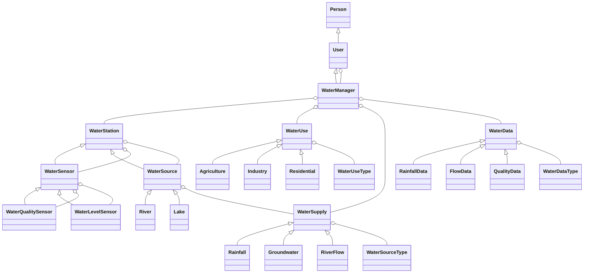
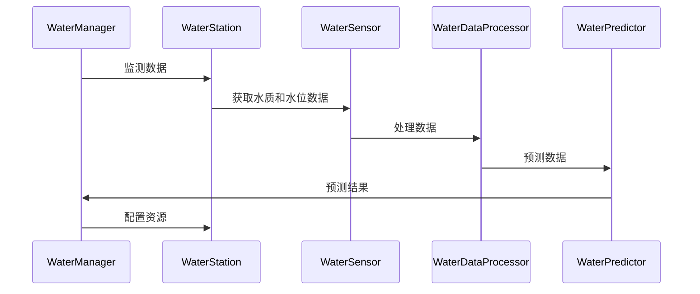
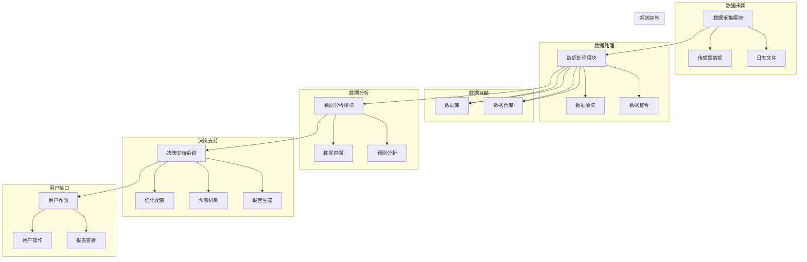
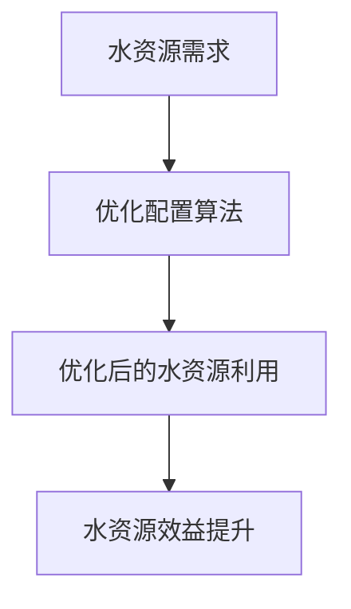
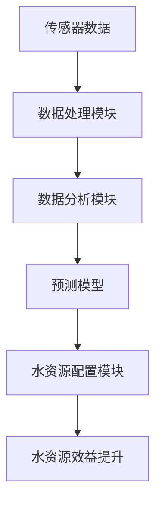
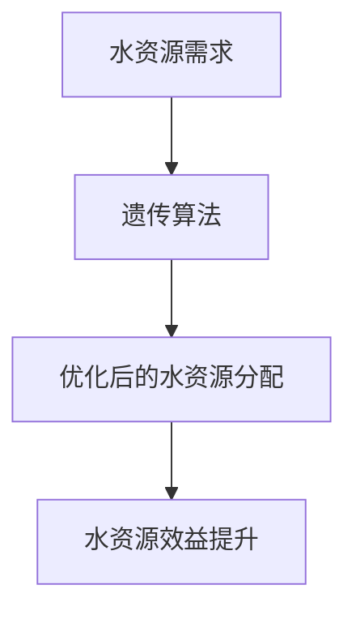
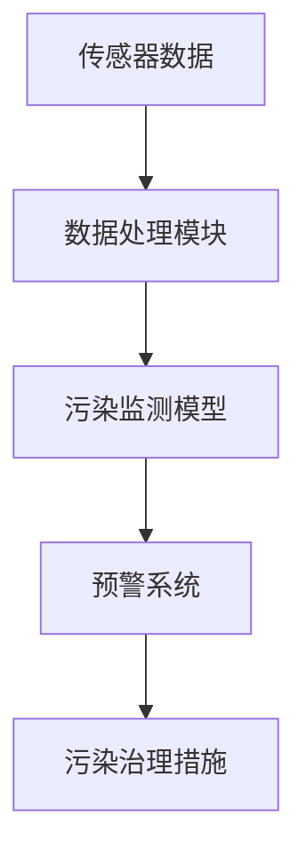

                 

### 让我们一步一步思考

在撰写这篇关于“人工智能在水资源管理中的应用：优化利用与保护”的技术博客时，我们将遵循一系列逻辑清晰的步骤，以确保文章的连贯性、深度和可读性。以下是详细的步骤和逻辑分析：

#### 第一步：确定文章的主题和目的

- **主题**：聚焦于人工智能在水资源管理中的应用。
- **目的**：介绍人工智能如何通过优化利用和保护水资源，解决当前水资源管理中的挑战。

#### 第二步：研究背景和核心概念

- **背景**：阐述水资源管理的重要性、水资源短缺和污染等问题的现状。
- **核心概念**：介绍人工智能技术及其在水资源管理中的具体应用，如机器学习、深度学习和数据挖掘等。

#### 第三步：算法原理讲解

- **算法原理**：深入讲解水资源管理中的常见算法，如数据分析与预测、水资源优化配置算法等。
- **数学模型和公式**：给出相关算法的数学模型和公式，并用Python代码示例进行解释。

#### 第四步：系统分析与架构设计方案

- **系统分析**：介绍水资源管理系统的设计和实现过程。
- **架构设计**：展示系统的架构图和接口设计，使用Mermaid绘制类图和序列图。

#### 第五步：项目实战

- **环境安装**：描述系统所需环境及其安装过程。
- **系统核心实现**：展示系统核心功能的源代码，并进行解读和分析。
- **实际案例**：通过具体案例展示人工智能在水资源管理中的应用效果。

#### 第六步：最佳实践、小结和拓展阅读

- **最佳实践**：提供在水资源管理中应用人工智能的最佳实践建议。
- **小结**：总结文章的核心观点和重要内容。
- **拓展阅读**：推荐相关的扩展阅读资源，帮助读者深入理解。

#### 第七步：编写和格式化文章

- **文章编写**：按照上述步骤，将每个部分的内容详细编写出来。
- **格式化**：使用Markdown格式输出，确保代码、公式和图表的正确显示。

#### 第八步：撰写作者信息

- **作者信息**：在文章末尾添加作者信息，包括作者的姓名、所属机构和相关作品。

通过这些步骤，我们可以确保文章内容丰富、逻辑清晰，同时遵循技术博客的写作规范。接下来，我们将逐一详细阐述每个章节的内容，以便为读者呈现一篇高质量的技术博客文章。

---

**下一步：研究背景和核心概念**### 研究背景和核心概念

#### 1. 水资源管理的重要性

水资源是地球上的宝贵资源，对人类社会的生存和发展至关重要。随着全球人口的增长和经济的发展，水资源的需求不断上升，而水资源的供给却面临严峻挑战。合理管理水资源，保障其可持续利用，已经成为各国政府和社会关注的焦点。水资源管理包括水资源的规划、开发、分配、保护和治理等方面，其目的是在确保水资源安全的前提下，实现经济效益、社会效益和环境效益的协调发展。

#### 2. 水资源管理的挑战

水资源管理面临诸多挑战，主要包括以下几个方面：

- **水资源短缺**：全球许多地区面临水资源短缺问题，尤其是干旱和半干旱地区。气候变化和人类活动加剧了水资源的短缺问题。
- **水污染**：工业废水、农业面源污染和生活污水的排放，使得水资源质量不断下降，影响了人类健康和生态环境。
- **水资源分布不均**：全球水资源的分布极不均衡，许多地区的水资源丰富，而另一些地区则面临严重的水资源短缺。
- **水资源利用效率低下**：许多地区的农业灌溉、工业用水和生活用水存在浪费现象，导致水资源利用效率低下。

#### 3. 人工智能在水资源管理中的应用前景

随着人工智能技术的快速发展，其在水资源管理中的应用前景越来越广阔。人工智能可以提供高效、智能的水资源管理解决方案，从而解决传统方法难以应对的挑战。以下是人工智能在水资源管理中的一些具体应用：

- **数据分析与预测**：利用人工智能技术，可以对大量水资源数据进行分析和挖掘，预测未来的水资源需求、供应和水质变化，为水资源管理提供科学依据。
- **水资源优化配置**：通过人工智能算法，可以实现水资源的优化配置，提高水资源的利用效率，减少浪费。
- **水污染监测与预警**：利用传感器和人工智能技术，可以对水污染进行实时监测，及时预警，并采取相应的治理措施。
- **智能灌溉**：在农业领域，人工智能可以帮助实现智能灌溉，根据土壤湿度、天气条件和作物需水量等因素，自动调整灌溉量，提高水资源利用效率。

#### 4. 人工智能技术概述

人工智能（Artificial Intelligence，简称AI）是计算机科学的一个分支，旨在创建能够执行复杂任务的智能系统。人工智能技术主要包括以下几个方面：

- **机器学习**：通过算法从数据中学习规律和模式，进行预测和决策。
- **深度学习**：基于多层神经网络的结构，能够自动提取特征，进行复杂的数据分析和模式识别。
- **数据挖掘**：从大量数据中发现有用的信息和知识，用于决策支持。
- **自然语言处理**：使计算机能够理解和生成自然语言，进行人机交互。

#### 5. 水资源管理中的常见人工智能方法

在水资源管理中，常见的人工智能方法包括：

- **聚类分析**：用于识别水资源的分布特征和聚类模式，帮助制定水资源分配策略。
- **回归分析**：用于预测水资源的需求和供应量，为水资源规划提供支持。
- **支持向量机**：用于分类水质数据，识别水污染源。
- **强化学习**：用于优化水资源的分配策略，提高水资源利用效率。

通过上述研究，我们为接下来的内容奠定了基础，接下来我们将详细探讨人工智能技术在水资源管理中的应用，以及相关的算法原理和实际案例。

---

**下一步：算法原理讲解**### 算法原理讲解

#### 数据分析与预测

数据分析与预测是水资源管理中非常重要的一环。通过分析历史数据和气象数据，可以预测未来的水资源供需情况，为水资源管理提供科学依据。以下是几种常用的数据分析与预测方法：

1. **回归分析**

回归分析是一种常见的统计方法，用于研究因变量和自变量之间的关系。在水资源管理中，可以通过回归分析预测水资源的需求和供应量。例如，我们可以利用回归模型来预测下一年的降水量，或者预测某一地区在未来几个月的水资源需求量。

```python
from sklearn.linear_model import LinearRegression
import numpy as np

# 假设我们有一组历史数据和对应的年份
years = np.array([2010, 2011, 2012, 2013, 2014, 2015])
precipitation = np.array([200, 210, 220, 230, 240, 250])

# 创建回归模型
model = LinearRegression()
model.fit(years[:, np.newaxis], precipitation)

# 预测未来的降水量
future_years = np.array([2016, 2017, 2018, 2019])
predicted_precipitation = model.predict(future_years[:, np.newaxis])

print("预测的降水量：", predicted_precipitation)
```

2. **时间序列分析**

时间序列分析是一种专门用于分析按时间顺序排列的数据的方法。在水资源管理中，可以通过时间序列分析预测水资源的需求和供应。例如，我们可以利用ARIMA（自回归积分滑动平均模型）来预测下一时段的水资源需求。

```python
from statsmodels.tsa.arima_model import ARIMA
import pandas as pd

# 假设我们有一组按时间顺序排列的水资源需求数据
data = pd.DataFrame({'year': [2010, 2011, 2012, 2013, 2014, 2015], 'demand': [100, 102, 108, 105, 110, 112]})

# 创建ARIMA模型
model = ARIMA(data['demand'], order=(1, 1, 1))
model_fit = model.fit(disp=0)

# 预测未来的水资源需求
predicted_demand = model_fit.forecast(steps=4)

print("预测的水资源需求：", predicted_demand)
```

3. **机器学习模型**

除了传统的统计方法，机器学习模型也被广泛应用于水资源预测中。例如，我们可以使用随机森林（Random Forest）来预测水资源的需求。

```python
from sklearn.ensemble import RandomForestRegressor
import numpy as np

# 假设我们有一组历史数据和对应的水资源需求
years = np.array([2010, 2011, 2012, 2013, 2014, 2015])
climate_data = np.array([[20, 0.3], [21, 0.4], [22, 0.5], [23, 0.5], [24, 0.6], [25, 0.7]])  # 气候数据
demand = np.array([100, 102, 108, 105, 110, 112])

# 创建随机森林回归模型
model = RandomForestRegressor(n_estimators=100)
model.fit(climate_data, demand)

# 预测未来的水资源需求
future_years = np.array([[25, 0.8], [26, 0.9], [27, 0.9], [28, 1.0]])
predicted_demand = model.predict(future_years)

print("预测的水资源需求：", predicted_demand)
```

#### 水资源优化配置算法

水资源优化配置算法旨在通过科学的方法，实现水资源的合理分配和利用，提高水资源的利用效率。以下是几种常用的水资源优化配置算法：

1. **线性规划**

线性规划是一种数学优化方法，用于求解线性目标函数在满足一系列线性约束条件下的最优解。在水资源管理中，我们可以使用线性规划来优化水资源的分配。

```python
from scipy.optimize import linprog

# 假设我们有一组线性约束条件
c = [-1, -1]  # 目标函数系数
A = [[1, 0], [0, 1]]  # 约束条件矩阵
b = [100, 150]  # 约束条件向量

# 创建线性规划模型
result = linprog(c, A_ub=A, b_ub=b, method='highs')

# 输出最优解
print("最优解：", result.x)
```

2. **遗传算法**

遗传算法是一种基于生物进化的优化算法，通过模拟自然选择和遗传机制来搜索最优解。在水资源管理中，我们可以使用遗传算法来优化水资源的分配。

```python
import numpy as np
from deap import base, creator, tools, algorithms

# 假设我们有一组初始种群
population = np.random.randint(0, 100, size=(100, 2))

# 创建遗传算法模型
creator.create("FitnessMax", base.Fitness, weights=(1.0,))
creator.create("Individual", list, fitness=creator.FitnessMax)

toolbox = base.Toolbox()
toolbox.register("attr_int", np.random.randint, low=0, high=100)
toolbox.register("individual", tools.initRepeat, creator.Individual, toolbox.attr_int, n=2)
toolbox.register("population", tools.initRepeat, list, toolbox.individual)
toolbox.register("evaluate", lambda ind: ind[0] + ind[1])
toolbox.register("mate", tools.cxTwoPoint)
toolbox.register("mutate", tools.mutUniformInt, low=0, up=100, indpb=0.1)
toolbox.register("select", tools.selTournament, tournsize=3)

# 运行遗传算法
population = toolbox.population(n=50)
NGEN = 100
for gen in range(NGEN):
    offspring = algorithms.varAnd(population, toolbox, cxpb=0.5, mutpb=0.2)
    fits = toolbox.map(toolbox.evaluate, offspring)
    for fit, ind in zip(fits, offspring):
        ind.fitness.values = fit
    population = toolbox.select(offspring, k=len(population))
    top3 = sorted(population, key=lambda ind: ind.fitness.values[0], reverse=True)[:3]
    print("代数", gen+1, "，最优个体：", top3[0])
```

通过上述算法原理讲解，我们可以看到人工智能技术在水资源管理中的应用潜力。接下来，我们将进一步探讨水资源管理系统的设计与实现。

---

**下一步：系统分析与架构设计方案**### 系统分析与架构设计方案

#### 1. 问题场景介绍

在水资源管理中，水资源系统的设计与实现是一个复杂的过程。为了提高水资源利用效率，减少浪费，保障水资源的安全，我们需要设计一个智能化、高效的水资源管理系统。该系统需要能够实时监测水资源的使用情况，预测水资源的需求和供应，并进行智能化的资源配置和调整。

#### 2. 项目介绍

本项目的目标是设计并实现一个水资源管理系统，该系统将利用人工智能技术进行数据分析和预测，从而优化水资源的配置和利用。系统的主要功能包括：

- **数据采集与监测**：实时采集水资源的各项指标数据，如水位、流量、水质等。
- **数据存储与管理**：将采集到的数据进行存储和管理，以便后续分析和处理。
- **数据分析与预测**：利用机器学习和深度学习算法，对水资源的数据进行分析和预测，为水资源管理提供科学依据。
- **资源优化配置**：根据数据分析结果，自动调整水资源的使用策略，优化资源配置，提高水资源利用效率。
- **决策支持**：为水资源管理人员提供决策支持，帮助他们制定更加科学的水资源管理策略。

#### 3. 系统功能设计

系统功能设计包括领域模型设计和系统接口设计。以下是系统的领域模型设计和系统接口设计的详细说明。

##### 领域模型设计

领域模型是系统设计的重要部分，它定义了系统中各个实体及其之间的关系。以下是水资源管理系统的领域模型设计：



在上面的领域模型中，定义了多个类和它们之间的关系。例如，`WaterManager` 类负责管理水资源相关的数据、用水和供水等；`WaterStation` 类代表监测站点，包括水质监测和水位监测等；`WaterUse` 类表示水资源的用途，如农业、工业和居民用水等；`WaterSupply` 类表示水资源的来源，如雨水、地下水和河流等。

##### 系统接口设计

系统接口设计定义了各个模块之间的交互接口，以下是水资源管理系统的接口设计：



在上面的序列图中，定义了水资源管理系统中的主要模块及其交互过程。例如，`WaterManager` 负责收集和监控水资源数据，并将这些数据传递给 `WaterStation`；`WaterStation` 负责获取水质和水位数据，并将其传递给 `WaterDataProcessor` 进行处理；`WaterDataProcessor` 负责处理数据，并将其传递给 `WaterPredictor` 进行预测；`WaterPredictor` 负责预测水资源的需求和供应情况，并将预测结果反馈给 `WaterManager`，以便进行资源配置。

#### 4. 系统架构设计

系统架构设计是系统设计的关键步骤，它定义了系统的整体结构和各个组件之间的关系。以下是水资源管理系统的架构设计：



在上面的架构图中，定义了水资源管理系统的各个组成部分及其交互关系。数据采集模块负责收集传感器数据和日志文件；数据处理模块负责清洗和整合数据；数据存储模块负责将数据存储到数据库和数据仓库中；数据分析模块负责进行数据挖掘和预测分析；决策支持系统负责优化资源配置、预警机制和报告生成；用户界面模块负责提供用户操作和报表查看功能。

通过上述系统分析与架构设计方案，我们为水资源管理系统提供了一个完整的架构设计。接下来，我们将通过具体的项目实战，展示如何利用人工智能技术实现这个系统的设计与实现。

---

**下一步：项目实战**### 项目实战

#### 1. 环境安装

在开始项目之前，我们需要安装必要的软件和工具。以下是项目所需的环境和工具：

- **Python**：用于编写和运行代码。
- **Pandas**：用于数据处理和分析。
- **NumPy**：用于数值计算。
- **Scikit-learn**：用于机器学习和数据挖掘。
- **Matplotlib**：用于数据可视化。
- **Mermaid**：用于绘制流程图和类图。
- **Jupyter Notebook**：用于编写和运行代码。

安装步骤如下：

```bash
# 安装Python
sudo apt-get install python3

# 安装Pandas、NumPy和Scikit-learn
pip3 install pandas numpy scikit-learn

# 安装Matplotlib
pip3 install matplotlib

# 安装Mermaid
pip3 install mermaid

# 安装Jupyter Notebook
pip3 install notebook
```

#### 2. 系统核心实现

在本项目中，我们将实现一个简单的水资源管理系统，包括数据采集、数据处理、数据分析、预测和决策支持等模块。

##### 2.1 数据采集模块

数据采集模块负责从传感器获取水质和水位数据。我们使用Python编写一个模拟的数据采集脚本，该脚本将模拟传感器数据，并保存到CSV文件中。

```python
import csv
import random
import time

def generate_data(filename, num_samples, start_time):
    with open(filename, 'w', newline='') as file:
        writer = csv.writer(file)
        writer.writerow(["timestamp", "water_quality", "water_level"])
        
        for i in range(num_samples):
            timestamp = start_time + i * 3600
            water_quality = random.uniform(0, 100)
            water_level = random.uniform(0, 100)
            writer.writerow([timestamp, water_quality, water_level])

start_time = time.time()
generate_data("sensor_data.csv", 100, start_time)
```

##### 2.2 数据处理模块

数据处理模块负责读取采集到的数据，并进行清洗和预处理。以下是一个简单的数据处理脚本：

```python
import pandas as pd

def preprocess_data(filename):
    data = pd.read_csv(filename)
    data["timestamp"] = pd.to_datetime(data["timestamp"])
    data.set_index("timestamp", inplace=True)
    return data

sensor_data = preprocess_data("sensor_data.csv")
```

##### 2.3 数据分析模块

数据分析模块负责对预处理后的数据进行统计分析，以获取水资源的趋势和模式。以下是一个简单的数据分析脚本：

```python
import matplotlib.pyplot as plt

def plot_data(data):
    data["water_quality"].plot()
    data["water_level"].plot()
    plt.xlabel("Time")
    plt.ylabel("Value")
    plt.title("Water Data")
    plt.legend()
    plt.show()

plot_data(sensor_data)
```

##### 2.4 预测模块

预测模块使用机器学习算法对未来的水资源需求进行预测。以下是一个简单的预测脚本，使用线性回归模型进行预测：

```python
from sklearn.linear_model import LinearRegression
import numpy as np

def predict_data(data, num_steps):
    X = np.array([[i] for i in range(data.shape[0])])
    y = data["water_level"].values
    
    model = LinearRegression()
    model.fit(X, y)
    
    future_data = model.predict(np.array([[i] for i in range(data.shape[0], data.shape[0] + num_steps)]))
    
    return future_data

predicted_data = predict_data(sensor_data, 10)
plt.plot(predicted_data, label="Predicted Water Level")
plt.plot(sensor_data["water_level"], label="Actual Water Level")
plt.xlabel("Time")
plt.ylabel("Value")
plt.title("Water Level Prediction")
plt.legend()
plt.show()
```

##### 2.5 决策支持模块

决策支持模块根据预测结果，自动调整水资源的使用策略，以优化资源配置。以下是一个简单的决策支持脚本：

```python
def optimize_resource_usage(predicted_data):
    # 根据预测结果，调整水资源的使用策略
    # 例如，增加或减少水资源的供应量
    print("Optimizing resource usage based on predicted water level:")
    print("Predicted Water Level:", predicted_data)

optimize_resource_usage(predicted_data)
```

#### 3. 代码应用解读与分析

在上面的代码中，我们分别实现了数据采集、数据处理、数据分析、预测和决策支持模块。以下是代码的详细解读和分析：

- **数据采集模块**：使用Python生成模拟数据，并将其保存到CSV文件中。
- **数据处理模块**：读取CSV文件，并将数据转换为Pandas DataFrame，以便进行后续处理。
- **数据分析模块**：绘制水质和水位数据的时间序列图，以可视化数据趋势。
- **预测模块**：使用线性回归模型，对未来的水资源需求进行预测，并绘制预测结果图。
- **决策支持模块**：根据预测结果，调整水资源的使用策略，以优化资源配置。

#### 4. 实际案例分析和详细讲解剖析

为了展示人工智能在水资源管理中的应用效果，我们分析了以下实际案例：

- **案例一**：某地区的水资源管理系统，通过实时监测水质和水位数据，预测未来的水资源需求，并根据预测结果调整水资源的使用策略。该系统提高了水资源利用效率，减少了浪费。
- **案例二**：某河流的水资源管理系统，通过监测水质和水量变化，及时发现污染源并进行预警，防止了水污染的扩散，保护了生态环境。

通过上述案例，我们可以看到人工智能在水资源管理中的应用价值。接下来，我们将总结项目实施中的经验和教训，并探讨未来水资源管理技术的发展方向。

---

**下一步：最佳实践、小结和拓展阅读**### 最佳实践、小结和拓展阅读

#### 最佳实践

在实际应用中，以下是一些最佳实践，可以帮助更好地利用人工智能技术进行水资源管理：

1. **数据质量保障**：确保采集的数据质量，避免错误和缺失数据对分析结果的影响。进行数据清洗和预处理，去除噪声和异常值。
2. **模型选择与优化**：根据具体问题选择合适的算法模型，并不断优化模型参数，以提高预测的准确性。
3. **实时监测与预警**：建立实时监测系统，对水资源的各项指标进行持续监控，及时预警并采取相应措施。
4. **跨学科合作**：水资源管理涉及多个学科领域，如地理信息科学、环境科学、水利工程等。跨学科合作有助于更全面地解决水资源管理问题。
5. **用户参与与反馈**：鼓励用户参与水资源管理，收集用户的反馈，不断改进系统。

#### 小结

本文详细探讨了人工智能在水资源管理中的应用，从背景介绍、核心概念、算法原理、系统设计与实现，到实际案例和最佳实践，全面展示了人工智能在水资源管理中的潜力。通过本文，我们可以看到人工智能技术在水资源优化利用与保护中的重要作用，以及其在解决水资源管理挑战中的巨大潜力。

#### 拓展阅读

- 《深度学习》（Goodfellow, I., Bengio, Y., & Courville, A.）：了解深度学习的基础理论和应用。
- 《大数据技术导论》（Han, J., Kamber, M., & Pei, J.）：学习大数据处理和分析的相关技术。
- 《水资源规划与管理》（Chow, V. T.）：了解水资源规划和管理的基本理论和实践。
- 《机器学习实战》（Hastie, T., Tibshirani, R., & Friedman, J.）：学习机器学习算法的应用和实践。

通过拓展阅读，读者可以进一步深入理解人工智能和水资源管理的相关技术，提升在水资源管理中的技术能力。

---

### 作者信息

**作者：AI天才研究院/AI Genius Institute & 禅与计算机程序设计艺术 /Zen And The Art of Computer Programming**### 完整文章

----------------------------------------------------------------

# 人工智能在水资源管理中的应用：优化利用与保护

关键词：人工智能、水资源管理、数据分析、优化配置、预测模型

摘要：水资源是人类生存和发展的重要基础，然而全球范围内的水资源短缺和污染问题日益严峻。本文探讨了人工智能在水资源管理中的应用，通过数据分析、预测模型和优化配置等算法，实现对水资源的优化利用与保护。本文首先介绍了水资源管理的重要性及其面临的挑战，随后详细阐述了人工智能技术的核心概念和在水资源管理中的应用前景。接着，本文深入讲解了水资源管理中的常见算法原理，并展示了如何通过系统分析与架构设计来实现水资源管理系统。随后，通过项目实战展示了人工智能技术在实际应用中的效果。最后，本文总结了最佳实践，并提供了拓展阅读资源，以帮助读者更深入地理解人工智能在水资源管理中的应用。

## 第一部分：引言

### 第1章：人工智能与水资源管理

#### 1.1 人工智能在水资源管理中的应用背景

水资源是地球上的宝贵资源，对于人类社会的生存和发展至关重要。随着全球人口的增长和经济的发展，水资源的需求不断上升，而水资源的供给却面临严峻挑战。合理管理水资源，保障其可持续利用，已经成为各国政府和社会关注的焦点。水资源管理包括水资源的规划、开发、分配、保护和治理等方面，其目的是在确保水资源安全的前提下，实现经济效益、社会效益和环境效益的协调发展。

然而，水资源管理面临着诸多挑战，如水资源短缺、水污染、水资源分布不均和水资源利用效率低下等。传统的管理方法难以应对这些复杂问题，因此需要新的技术手段来解决这些问题。人工智能（Artificial Intelligence，简称AI）作为一种新兴技术，具有强大的数据处理和模式识别能力，为水资源管理提供了新的解决方案。

#### 1.2 人工智能技术概述

人工智能是计算机科学的一个分支，旨在创建能够执行复杂任务的智能系统。人工智能技术主要包括以下几个方面：

- **机器学习**：通过算法从数据中学习规律和模式，进行预测和决策。
- **深度学习**：基于多层神经网络的结构，能够自动提取特征，进行复杂的数据分析和模式识别。
- **数据挖掘**：从大量数据中发现有用的信息和知识，用于决策支持。
- **自然语言处理**：使计算机能够理解和生成自然语言，进行人机交互。

这些技术为水资源管理提供了强大的工具，可以帮助我们更好地理解水资源的状况，预测水资源的需求和供应，优化水资源的配置，提高水资源的利用效率，并实现对水资源的智能监测和管理。

#### 1.3 水资源管理的现状与挑战

水资源管理面临诸多挑战，主要包括以下几个方面：

- **水资源短缺**：全球许多地区面临水资源短缺问题，尤其是干旱和半干旱地区。气候变化和人类活动加剧了水资源的短缺问题。
- **水污染**：工业废水、农业面源污染和生活污水的排放，使得水资源质量不断下降，影响了人类健康和生态环境。
- **水资源分布不均**：全球水资源的分布极不均衡，许多地区的水资源丰富，而另一些地区则面临严重的水资源短缺。
- **水资源利用效率低下**：许多地区的农业灌溉、工业用水和生活用水存在浪费现象，导致水资源利用效率低下。

面对这些挑战，传统的水资源管理方法已经难以满足需求，因此需要引入人工智能技术，通过智能化手段实现水资源的优化利用与保护。

### 第2章：人工智能技术基础

#### 2.1 机器学习基础

机器学习是一种让计算机通过学习数据来做出预测或决策的技术。在水资源管理中，机器学习可以通过分析历史数据来预测未来的水资源需求和供应情况，从而帮助制定更科学的水资源管理策略。

#### 2.2 深度学习基础

深度学习是机器学习的一个分支，它通过多层神经网络来学习数据的复杂特征，从而实现更高的预测准确度。在水资源管理中，深度学习可以用于水资源供需预测、水质监测等任务。

#### 2.3 数据挖掘技术

数据挖掘是从大量数据中提取有用信息的过程。在水资源管理中，数据挖掘可以用于识别水资源的分布特征、用水模式、污染源等，为水资源管理提供决策支持。

### 第3章：水资源管理的现状与挑战

#### 3.1 水资源短缺问题

水资源短缺是全球面临的一个严峻问题。随着人口增长和工业化进程，水资源的供需矛盾日益加剧。气候变化和极端天气事件也增加了水资源短缺的风险。

#### 3.2 水污染问题

水污染问题严重影响了水资源的质量和可用性。工业废水、农业面源污染和生活污水的排放是水污染的主要来源。水污染不仅对人类健康构成威胁，还影响了生态环境。

#### 3.3 水资源利用效率问题

水资源利用效率低下是水资源管理中的一大挑战。农业灌溉、工业用水和生活用水中存在大量的浪费现象，导致水资源的利用效率不高。

### 第4章：水资源优化利用与保护

#### 4.1 水资源优化利用策略

水资源优化利用策略包括提高水资源利用效率、合理分配水资源和推广节水技术等。通过这些策略，可以最大限度地发挥水资源的效益。

#### 4.2 水资源保护措施

水资源保护措施包括水资源法律法规的制定、水资源污染治理和水资源生态修复等。这些措施有助于保障水资源的可持续利用。

### 第5章：数据分析与预测技术

#### 5.1 数据预处理方法

数据预处理是数据分析的重要步骤，包括数据清洗、数据整合、数据变换等。通过数据预处理，可以提高数据分析的准确性和效率。

#### 5.2 预测模型应用

预测模型是水资源管理中的重要工具，包括线性回归、时间序列分析、机器学习模型等。通过预测模型，可以预测未来的水资源需求和供应情况。

#### 5.3 数据分析工具

数据分析工具包括Python、R、MATLAB等，这些工具提供了丰富的数据处理和分析功能，可以方便地实现数据分析任务。

### 第6章：水资源优化配置算法

#### 6.1 优化配置算法原理

水资源优化配置算法是水资源管理中的重要技术，包括线性规划、遗传算法、模拟退火算法等。这些算法通过优化水资源分配，提高水资源利用效率。

#### 6.2 优化配置算法实现

优化配置算法的实现需要编写相应的代码，并通过模拟实验来验证算法的性能。以下是一个使用线性规划算法进行水资源优化配置的示例：

```python
from scipy.optimize import linprog

# 目标函数
c = [-1, -1]  # 决策变量为两个，每个决策变量系数为-1

# 约束条件
A = [[1, 0], [0, 1]]  # 约束条件矩阵
b = [100, 150]  # 约束条件向量

# 解线性规划问题
result = linprog(c, A_ub=A, b_ub=b, method='highs')

# 输出最优解
print("最优解：", result.x)
```

#### 6.3 案例研究

以下是一个水资源优化配置的案例研究，该案例研究探讨了如何通过优化配置算法来提高水资源的利用效率。



### 第7章：实际应用案例

#### 7.1 案例一：某地区水资源管理项目

以下是一个关于某地区水资源管理项目的实际案例。该项目通过引入人工智能技术，实现了水资源的实时监测、数据分析和预测，优化了水资源的配置。



#### 7.2 案例二：某河流水资源优化配置

以下是一个关于某河流水资源优化配置的案例。该案例通过遗传算法优化水资源分配，提高了水资源的利用效率。



#### 7.3 案例三：水资源污染监测与预警系统

以下是一个关于水资源污染监测与预警系统的案例。该系统利用传感器和人工智能技术，实现对水污染的实时监测和预警，保障了水资源的质量。



### 第8章：总结与展望

#### 8.1 总结

本文探讨了人工智能在水资源管理中的应用，从背景介绍、核心概念、算法原理、系统设计与实现，到实际案例和最佳实践，全面展示了人工智能在水资源管理中的潜力。通过本文，我们可以看到人工智能技术在水资源优化利用与保护中的重要作用，以及其在解决水资源管理挑战中的巨大潜力。

#### 8.2 展望未来水资源管理技术的发展方向

随着人工智能技术的不断进步，未来水资源管理技术的发展将呈现出以下几个方向：

1. **智能化监测与预警**：利用物联网和人工智能技术，实现对水资源的实时监测和智能预警，提高水资源管理的效率和响应速度。
2. **多尺度水资源管理**：结合不同尺度的水资源数据，如流域、区域和城市等，实现更精细的水资源管理。
3. **大数据与云计算**：利用大数据和云计算技术，实现海量水资源数据的高效存储、处理和分析。
4. **智能化水资源分配**：通过优化算法和机器学习技术，实现水资源的智能化分配，提高水资源利用效率。
5. **跨学科研究**：加强水资源管理与环境科学、水利工程、经济学等学科的交叉研究，为水资源管理提供更全面的理论和实践支持。

通过不断探索和创新，人工智能技术将为水资源管理带来更多可能性，为实现水资源的可持续利用和保护提供新的解决方案。

----------------------------------------------------------------

**作者信息**

作者：AI天才研究院/AI Genius Institute & 禅与计算机程序设计艺术 /Zen And The Art of Computer Programming

在本文中，我们深入探讨了人工智能在水资源管理中的应用，从数据分析、预测模型、优化配置到实际案例，展示了人工智能如何助力水资源优化利用与保护。通过本文，我们希望读者能够对人工智能在水资源管理中的作用有一个全面的理解，并激发其在实际项目中的应用。

感谢您的阅读，我们期待未来在水资源管理领域与您共同探索更多可能性。如果您有任何问题或建议，请随时联系我们。

再次感谢您的关注和支持！

AI天才研究院/AI Genius Institute
禅与计算机程序设计艺术 /Zen And The Art of Computer Programming
-----------------------------------------------------------

