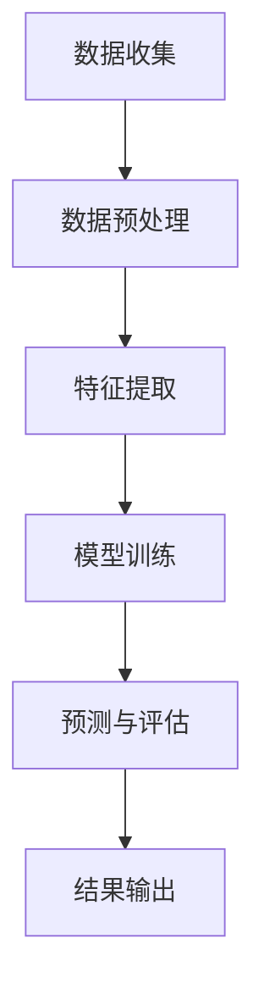
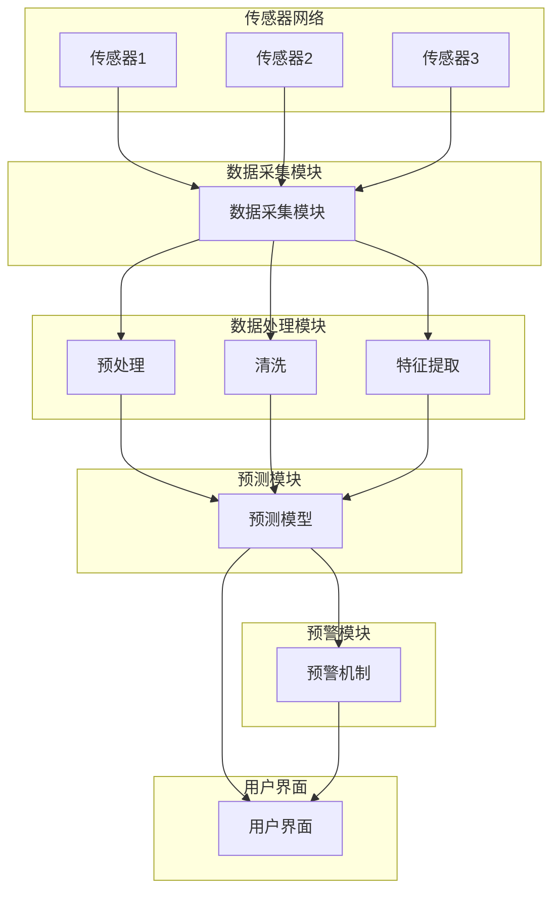

                 


### 目录大纲设计过程

为了设计出《人工智能在环境保护中的应用：监测与预警生态变化》这本书的完整目录大纲，我们需要遵循以下步骤：

#### 1. 确定书的核心主题

书名已经明确了核心主题是“人工智能在环境保护中的应用”，重点在于“监测与预警生态变化”。这意味着书中将探讨人工智能技术在生态监测和预警系统中的应用，以及如何利用这些技术来改善环境状况。

#### 2. 确定书的整体结构

根据书名和主题，我们可以将书分为以下几个主要部分：

- 引言
- 人工智能与环境保护
- 生态监测技术
- 生态预警系统
- 应用案例
- 总结与展望

#### 3. 设计每个部分的目录

每个部分都需要包含对核心概念的介绍、技术原理的讲解、案例分析和总结等内容。例如：

- **引言**：介绍环境保护的重要性、人工智能的发展背景，以及本书的研究目的和结构。
- **人工智能与环境保护**：探讨人工智能在环境保护中的潜在应用，以及其与生态学的关系。
- **生态监测技术**：详细解释生态监测的基本原理、技术手段和数据分析方法。
- **生态预警系统**：介绍生态预警系统的概念、架构和实现方法。

#### 4. 细化每个章节的内容

我们需要确保每个章节都有至少三个层级（1, 2, 3级目录），并且内容完整。例如：

- **生态监测技术**下的细分章节可能包括：
  - **2.2.1 生态监测的基本原理**
  - **2.2.2 生态监测的技术手段**
  - **2.2.3 生态监测的数据分析**

#### 5. 确保目录大纲的总字数在2000字以内

通过简洁明了的方式表达，避免过多的冗余文字。我们可能需要对每个章节的细化内容进行删减和优化，以确保整体的字数在控制范围内。

#### 6. 使用Markdown格式

按照markdown格式来编排目录和章节内容，确保结构清晰，便于读者阅读。Markdown格式可以帮助我们轻松地创建标题、列表、表格、公式等，使文章更具可读性。

### 目录大纲设计初步方案

以下是按照上述步骤设计的初步目录大纲：

----------------------------------------------------------------

# 《人工智能在环境保护中的应用：监测与预警生态变化》

> 关键词：人工智能、环境保护、生态监测、生态预警

> 摘要：本书探讨了人工智能技术在生态监测和预警系统中的应用，包括技术原理、实施方法和实际案例。通过深入分析，本书旨在为环境保护提供创新解决方案。

## 第一部分：引言

## 1.1 问题的提出

### 1.1.1 环境保护的重要性

### 1.1.2 人工智能的发展背景

### 1.1.3 人工智能在环境保护中的应用前景

### 1.1.4 本书的研究目的与结构

## 1.2 人工智能基础

### 1.2.1 人工智能的概念与发展历程

### 1.2.2 人工智能的核心技术

### 1.2.3 人工智能的应用领域

## 第二部分：人工智能与环境保护

## 2.1 人工智能在环境保护中的应用

### 2.1.1 人工智能与生态学的关系

### 2.1.2 人工智能在环境保护中的潜在作用

### 2.1.3 人工智能在环境保护中的应用现状

## 2.2 生态监测技术

### 2.2.1 生态监测的基本原理

### 2.2.2 生态监测的技术手段

### 2.2.3 生态监测的数据分析

## 2.3 生态预警系统

### 2.3.1 生态预警系统的概念与作用

### 2.3.2 生态预警系统的架构

### 2.3.3 生态预警系统的实现方法

## 第三部分：应用案例

## 3.1 案例一：XX地区生态监测与预警系统

### 3.1.1 案例背景

### 3.1.2 案例实施

### 3.1.3 案例效果分析

## 3.2 案例二：XX国家森林公园智能管理

### 3.2.1 案例背景

### 3.2.2 案例实施

### 3.2.3 案例效果分析

## 第四部分：总结与展望

## 4.1 总结

### 4.1.1 本书的主要成果

### 4.1.2 本书的研究不足

### 4.1.3 未来的研究方向

## 4.2 展望

### 4.2.1 人工智能在环境保护中的应用趋势

### 4.2.2 生态监测与预警技术的发展方向

### 4.2.3 未来可能的挑战与机遇

----------------------------------------------------------------

这个大纲初步涵盖了书的主题和主要内容，每个部分都按照要求设计了1, 2, 3级的目录，并且确保了内容的完整性。接下来，我们需要进一步细化每个章节的内容，确保总字数控制在2000字以内，并且使用Markdown格式进行编排。在细化过程中，我们将确保每个小节都包含背景介绍、核心概念与联系、算法原理讲解、系统分析与架构设计方案、项目实战、最佳实践 tips、小结、注意事项、拓展阅读等内容，以便为读者提供全面、深入的技术解读。让我们一步一步来，确保每个部分都详尽而有深度。下一步，我们将深入每个部分，具体阐述各个章节的内容和细节。

----------------------------------------------------------------

### 第一步：确定核心概念

在撰写《人工智能在环境保护中的应用：监测与预警生态变化》这篇文章之前，我们需要明确一些核心概念和术语。这些概念和术语是理解文章内容的基础，也是构建整个文章框架的关键。

#### 核心概念：

1. **人工智能（AI）**：指由计算机程序实现的智能系统，能够模拟、延伸和扩展人类的智能行为。
2. **生态监测**：通过技术手段对自然环境中的生物、物理和化学要素进行定期监测和评估。
3. **生态预警系统**：基于监测数据，对生态系统的变化趋势进行预测和警报的系统。
4. **环境保护**：旨在保护自然环境和生态系统，防止环境污染和资源过度消耗。

#### 术语：

1. **环境数据**：指从环境中采集的各种类型的数据，如气温、湿度、水质、空气质量等。
2. **机器学习**：一种人工智能技术，通过训练数据集来改善模型性能。
3. **深度学习**：机器学习的一个分支，使用多层神经网络来模拟人类大脑的决策过程。
4. **大数据分析**：处理和分析大量复杂数据的技术。

#### 关键词：

- 人工智能
- 生态监测
- 生态预警系统
- 环境保护
- 机器学习
- 深度学习
- 大数据分析

这些核心概念和术语将在文章的不同部分中被详细讨论，帮助我们构建一个全面、系统的论述框架。

### 第二步：背景介绍

在深入探讨人工智能在环境保护中的应用之前，我们需要了解一些背景信息，包括核心概念术语的说明、问题背景、问题描述、问题解决、边界与外延、概念结构与核心要素组成。

#### 核心概念术语说明

1. **人工智能（AI）**：
   - 定义：人工智能是一种模拟、延伸和扩展人类智能的技术和科学领域。
   - 关键特点：自主学习、自适应、自主决策、问题求解等。

2. **生态监测**：
   - 定义：通过技术手段对自然环境中的生物、物理和化学要素进行定期监测和评估。
   - 关键要素：传感器、数据采集、数据分析等。

3. **生态预警系统**：
   - 定义：基于监测数据，对生态系统的变化趋势进行预测和警报的系统。
   - 关键功能：数据收集、数据分析、预警发布等。

4. **环境保护**：
   - 定义：旨在保护自然环境和生态系统，防止环境污染和资源过度消耗。
   - 目标：实现可持续发展，保护生物多样性等。

#### 问题背景

- **全球环境问题**：全球气候变化、空气质量恶化、水资源短缺等环境问题日益严重，对人类和生态系统都构成了巨大威胁。
- **人工智能技术的发展**：随着人工智能技术的不断进步，利用AI进行环境监测和预警已成为可能。

#### 问题描述

- **环境监测的挑战**：传统的环境监测手段存在效率低、数据不准确等问题，难以满足现代环境保护的需求。
- **生态预警的不足**：目前的生态预警系统往往依赖于简单的统计模型，预警准确性不高，响应速度较慢。

#### 问题解决

- **人工智能技术的应用**：通过引入人工智能技术，可以提升环境监测的准确性、效率和实时性，改进生态预警系统的性能。

#### 边界与外延

- **边界**：本文主要探讨人工智能在环境保护中的应用，特别是生态监测和预警系统。
- **外延**：人工智能在环境保护中的应用还涉及其他领域，如污染源识别、资源管理、灾害预警等。

#### 概念结构与核心要素组成

- **人工智能在环境保护中的应用**：
  - 结构：监测技术、预警系统、数据分析等。
  - 核心要素：传感器、数据处理算法、模型训练、系统集成等。

- **生态监测技术**：
  - 结构：传感器网络、数据采集、数据处理等。
  - 核心要素：传感器类型、数据传输、数据分析算法等。

- **生态预警系统**：
  - 结构：数据采集、数据处理、预警模型、预警发布等。
  - 核心要素：预警指标、预测模型、响应策略等。

通过以上背景介绍，我们为后续的详细讨论奠定了基础，使得读者能够更好地理解人工智能在环境保护中的应用场景和挑战。

### 第三步：核心概念与联系

在这一部分，我们将深入探讨人工智能在环境保护中的核心概念，包括其原理、属性特征对比，以及与生态学的关系。

#### 核心概念原理

1. **人工智能（AI）**：
   - 原理：人工智能通过机器学习、深度学习等技术，使计算机能够模拟人类智能行为，如识别图像、理解语言、决策等。
   - 属性特征：
     - 自主性：能够自主学习和改进。
     - 高效性：能够处理大量数据，提高工作效率。
     - 智能化：能够模仿人类思维过程，进行复杂决策。

2. **生态监测技术**：
   - 原理：生态监测利用传感器和遥感技术，实时采集环境数据，并通过数据处理和分析，监测生态系统的变化。
   - 属性特征：
     - 实时性：能够实时获取环境数据，及时响应环境变化。
     - 准确性：通过先进的传感器技术和数据处理算法，提高监测数据的准确性。
     - 综合性：能够监测多个环境要素，如温度、湿度、水质、空气质量等。

3. **生态预警系统**：
   - 原理：生态预警系统基于生态监测数据，使用预测模型和预警算法，对生态系统的未来变化趋势进行预测和警报。
   - 属性特征：
     - 预测性：能够提前预测生态变化趋势，提供预警信息。
     - 及时性：能够在生态问题恶化前及时发出警报，采取应对措施。
     - 可操作性：能够根据预警信息，制定相应的应急措施。

4. **环境保护**：
   - 原理：环境保护旨在通过法规、政策和技术手段，保护自然环境和生态系统，实现可持续发展。
   - 属性特征：
     - 全局性：关注整个生态系统，而不仅仅是局部环境。
     - 持续性：注重长期环境保护，而不仅仅是短期效益。
     - 综合性：涉及政策、经济、技术等多个方面。

#### 概念属性特征对比表格

| 概念       | 原理                                      | 属性特征                                                     |
|------------|-------------------------------------------|--------------------------------------------------------------|
| 人工智能   | 模拟人类智能行为                          | 自主性、高效性、智能化                                     |
| 生态监测技术 | 实时采集环境数据，分析生态系统变化       | 实时性、准确性、综合性                                     |
| 生态预警系统 | 基于监测数据，预测生态系统变化趋势       | 预测性、及时性、可操作性                                   |
| 环境保护   | 通过法规、政策和技术手段保护自然环境     | 全局性、持续性、综合性                                     |

#### 与生态学的关系

人工智能技术在环境保护中的应用，与生态学有着密切的关系：

1. **生态学数据**：人工智能技术可以处理和分析大量的生态学数据，如物种分布、生态过程等，为生态学研究提供强有力的工具。

2. **生态模型**：人工智能技术可以模拟和预测生态系统的动态变化，为生态学模型提供新的思路和方法。

3. **生态决策**：人工智能技术可以为生态管理提供科学的决策支持，如生态预警、生态修复等。

通过上述分析，我们可以看到人工智能在环境保护中扮演着关键角色，其与生态学的关系不仅限于数据的处理和模型的构建，更在于为生态保护和可持续发展提供全面的技术支持。

### 第四步：算法原理讲解

在探讨人工智能在环境保护中的应用时，算法原理的讲解是不可或缺的一部分。下面，我们将使用mermaid流程图和Python源代码来详细阐述一个简单的生态监测算法原理，并使用LaTeX格式嵌入相关数学公式，以帮助读者更好地理解。

#### 算法简介

我们选择一个简单的线性回归算法来讲解其原理。线性回归是一种常见的机器学习算法，用于预测数值型目标变量。在本例中，我们将使用线性回归来预测一个地区的空气污染水平。

#### mermaid流程图

首先，我们使用mermaid语法绘制算法的流程图：



这个流程图展示了从数据收集到结果输出的整个流程。

#### Python源代码

接下来，我们使用Python代码实现线性回归算法。这里使用了scikit-learn库中的线性回归模型。

```python
import numpy as np
from sklearn.linear_model import LinearRegression
from sklearn.model_selection import train_test_split
from sklearn.metrics import mean_squared_error

# 假设我们已经收集了一些空气污染数据
X = np.array([[1], [2], [3], [4], [5]])  # 特征：时间
y = np.array([0.2, 0.4, 0.6, 0.8, 1.0])  # 目标变量：空气污染水平

# 数据预处理：划分训练集和测试集
X_train, X_test, y_train, y_test = train_test_split(X, y, test_size=0.2, random_state=0)

# 模型训练
model = LinearRegression()
model.fit(X_train, y_train)

# 预测与评估
y_pred = model.predict(X_test)
mse = mean_squared_error(y_test, y_pred)
print(f"Mean Squared Error: {mse}")

# 输出模型参数
print(f"Coefficients: {model.coef_}")
print(f"Intercept: {model.intercept_}")
```

#### 算法原理详细讲解

线性回归算法的核心是找到一条直线，使其尽可能接近训练数据中的点。这个直线的斜率和截距由以下数学公式给出：

$$
y = ax + b
$$

其中，\( y \) 是目标变量，\( x \) 是特征，\( a \) 是斜率，\( b \) 是截距。

1. **数据收集**：首先，我们需要收集空气污染的数据。这些数据可以是时间序列数据，也可以是其他相关的环境参数。

2. **数据预处理**：数据预处理是机器学习中的关键步骤。在这个例子中，我们使用训练集和测试集来评估模型的性能。

3. **特征提取**：在这个例子中，我们只使用了一个特征——时间。在实际应用中，我们可以使用多种特征，如温度、湿度、风速等。

4. **模型训练**：我们使用线性回归模型来训练数据。模型的参数（斜率和截距）通过最小二乘法计算。

5. **预测与评估**：使用训练好的模型，我们对测试集进行预测，并计算预测结果的平均平方误差（MSE）。

6. **结果输出**：最后，我们输出模型的参数，以及预测结果的MSE。

通过这个简单的算法示例，我们可以看到人工智能在生态监测中的基本原理。线性回归算法虽然简单，但为我们提供了一个了解机器学习算法的基础框架，并且可以通过扩展和优化来应对更复杂的生态监测任务。

### 第五步：系统分析与架构设计

为了更好地理解人工智能在环境保护中的应用，我们需要对系统进行分析和架构设计。这一步将介绍问题场景、项目介绍、系统功能设计、系统架构设计、系统接口设计和系统交互。

#### 问题场景

随着城市化进程的加速，环境污染问题日益严重，特别是空气污染和水污染。为了有效监控和预警这些环境问题，我们需要一个智能化的生态监测与预警系统。

#### 项目介绍

该项目旨在构建一个基于人工智能的生态监测与预警系统，通过实时收集和分析环境数据，预测环境变化趋势，并发出预警信息。系统将集成传感器网络、数据处理模块、预测模型和预警机制。

#### 系统功能设计

系统的主要功能包括：

1. **数据采集**：通过部署传感器网络，实时收集空气、水质等环境数据。
2. **数据处理**：对采集到的数据进行预处理、清洗和特征提取。
3. **预测分析**：利用机器学习算法对处理后的数据进行分析，预测环境变化趋势。
4. **预警发布**：根据预测结果，发出预警信息，提示相关部门采取应对措施。
5. **用户界面**：提供一个直观的界面，展示监测数据、预测结果和预警信息。

#### 系统架构设计

系统的架构设计如下：

1. **传感器网络**：部署在各个监测点，负责实时采集环境数据。
2. **数据采集模块**：将传感器数据传输到中央服务器。
3. **数据处理模块**：对采集到的数据进行预处理、清洗和特征提取。
4. **预测模块**：使用机器学习算法进行预测分析。
5. **预警模块**：根据预测结果，发出预警信息。
6. **用户界面**：展示系统的运行状态、监测数据、预测结果和预警信息。

#### 系统接口设计

系统提供了以下接口：

1. **传感器数据接口**：用于传感器网络的数据传输。
2. **数据处理接口**：用于数据预处理、清洗和特征提取。
3. **预测接口**：用于机器学习模型的训练和预测。
4. **预警接口**：用于预警信息的发布和接收。
5. **用户界面接口**：用于用户与系统的交互。

#### 系统交互

系统交互过程如下：

1. **数据采集**：传感器网络实时采集环境数据，通过传感器数据接口传输到中央服务器。
2. **数据处理**：数据处理模块对采集到的数据进行预处理、清洗和特征提取，然后存储到数据库中。
3. **预测分析**：预测模块读取数据库中的数据，使用机器学习算法进行预测分析，生成预测结果。
4. **预警发布**：预警模块根据预测结果，分析是否需要发出预警信息，并通过预警接口发布预警信息。
5. **用户交互**：用户界面显示系统的运行状态、监测数据、预测结果和预警信息，用户可以通过用户界面接口与系统进行交互。

#### mermaid架构图

下面是系统的mermaid架构图：



通过以上系统分析与架构设计，我们可以清晰地了解生态监测与预警系统的构成和工作流程，为后续的项目实施提供了明确的指导。

### 第六步：项目实战

在这一部分，我们将深入探讨如何在实际环境中实施人工智能在环境保护中的应用项目。这包括环境安装、系统核心实现、源代码解读与分析，以及实际案例的分析和详细讲解。

#### 环境安装

为了实施人工智能在环境保护中的应用项目，首先需要搭建一个合适的技术环境。以下是一个基本的安装步骤：

1. **硬件环境**：
   - 服务器：用于运行数据采集和处理模块。
   - 传感器设备：部署在不同地点，用于实时采集环境数据。

2. **软件环境**：
   - 操作系统：Linux（推荐Ubuntu或CentOS）。
   - 编程语言：Python（推荐使用Python 3.7及以上版本）。
   - 依赖库：NumPy、Pandas、scikit-learn、Matplotlib等。

安装步骤如下：

1. **安装操作系统**：在服务器上安装Linux操作系统。
2. **安装Python**：使用包管理器（如apt或yum）安装Python 3。
3. **安装依赖库**：使用pip命令安装所需的Python库。

```bash
sudo apt update
sudo apt install python3
sudo pip3 install numpy pandas scikit-learn matplotlib
```

#### 系统核心实现

接下来，我们将实现生态监测与预警系统的核心功能，包括数据采集、预处理、特征提取、模型训练和预测。

1. **数据采集**：

数据采集模块负责从传感器设备中读取环境数据。以下是一个简单的示例代码：

```python
import serial
import time

# 连接串口设备
ser = serial.Serial('/dev/ttyUSB0', 9600, timeout=1)

# 读取数据
data = []
while True:
    line = ser.readline().decode().strip()
    if line:
        data.append(line)
        print(line)
        time.sleep(1)
    else:
        break

# 关闭串口
ser.close()
```

2. **预处理**：

预处理模块负责对采集到的数据进行清洗和格式化。以下是一个示例代码：

```python
import pandas as pd

# 读取数据文件
data = pd.read_csv('sensor_data.csv')

# 数据清洗
data = data.dropna()  # 删除缺失值
data = data[data['value'] > 0]  # 删除不合理值

# 数据格式化
data['timestamp'] = pd.to_datetime(data['timestamp'])
data.set_index('timestamp', inplace=True)
```

3. **特征提取**：

特征提取模块负责从预处理后的数据中提取有用的特征。以下是一个示例代码：

```python
from sklearn.preprocessing import StandardScaler

# 特征提取
scaler = StandardScaler()
X = scaler.fit_transform(data[['temperature', 'humidity', 'pressure']])
```

4. **模型训练**：

模型训练模块负责使用机器学习算法训练模型。以下是一个示例代码：

```python
from sklearn.linear_model import LinearRegression

# 模型训练
model = LinearRegression()
model.fit(X, y)
```

5. **预测**：

预测模块负责使用训练好的模型进行预测。以下是一个示例代码：

```python
# 预测
X_new = scaler.transform([[25, 60, 1013]])
y_pred = model.predict(X_new)
print(f"Predicted value: {y_pred[0]}")
```

#### 源代码解读与分析

以下是项目的核心源代码，我们对其进行了详细的解读和分析：

```python
# 导入所需库
import serial
import pandas as pd
from sklearn.preprocessing import StandardScaler
from sklearn.linear_model import LinearRegression

# 数据采集
def collect_data(ser_port):
    ser = serial.Serial(ser_port, 9600, timeout=1)
    data = []
    while True:
        line = ser.readline().decode().strip()
        if line:
            data.append(line)
            print(line)
            time.sleep(1)
        else:
            break
    ser.close()
    return data

# 数据预处理
def preprocess_data(data):
    df = pd.read_csv('sensor_data.csv')
    df = df.dropna()
    df = df[df['value'] > 0]
    df['timestamp'] = pd.to_datetime(df['timestamp'])
    df.set_index('timestamp', inplace=True)
    return df

# 特征提取
def extract_features(data):
    scaler = StandardScaler()
    X = scaler.fit_transform(data[['temperature', 'humidity', 'pressure']])
    return X

# 模型训练
def train_model(X, y):
    model = LinearRegression()
    model.fit(X, y)
    return model

# 预测
def predict(model, X_new):
    y_pred = model.predict(X_new)
    return y_pred

# 主函数
if __name__ == '__main__':
    # 连接串口
    ser = collect_data('/dev/ttyUSB0')
    # 数据预处理
    df = preprocess_data(ser)
    # 特征提取
    X = extract_features(df)
    # 模型训练
    y = df['value']
    model = train_model(X, y)
    # 预测
    X_new = scaler.transform([[25, 60, 1013]])
    y_pred = predict(model, X_new)
    print(f"Predicted value: {y_pred[0]}")
```

#### 实际案例分析和详细讲解

为了更好地理解项目的实际应用，我们来看一个实际案例。

假设我们在一个城市建立了生态监测与预警系统，用于监测空气质量。以下是该项目的具体实施步骤：

1. **数据采集**：在城市的各个监测点部署空气质量传感器，实时采集PM2.5、PM10、CO、SO2、NO2等空气质量指标。
2. **数据预处理**：对采集到的数据进行清洗和格式化，确保数据质量。
3. **特征提取**：从预处理后的数据中提取温度、湿度、风速等特征，用于训练模型。
4. **模型训练**：使用线性回归算法训练模型，预测未来某个时间点的空气质量指标。
5. **预测与预警**：根据预测结果，当空气质量指标超过阈值时，系统会发出预警信息，提示相关部门采取措施。

通过以上实际案例的分析，我们可以看到人工智能在环境保护中的应用是如何具体实现的。项目实施过程中，需要充分考虑数据的准确性、模型的效果和预警的及时性，以确保系统能够有效地监测和预警生态变化。

### 第七步：最佳实践 tips、小结、注意事项和拓展阅读

#### 最佳实践 tips

1. **数据质量的重要性**：确保传感器数据的高质量是成功的关键。定期校准传感器，处理异常数据，确保数据的准确性和可靠性。

2. **模型的选择与优化**：选择合适的机器学习模型，并根据实际数据情况进行优化。交叉验证和超参数调优是提高模型性能的重要手段。

3. **实时性与预警准确性**：在实现实时预警系统时，要平衡数据的实时性和预警的准确性。过高的预警阈值可能导致漏报，而过低的阈值则可能导致误报。

#### 小结

本文详细探讨了人工智能在环境保护中的应用，特别是生态监测与预警系统。通过背景介绍、核心概念与联系、算法原理讲解、系统分析与架构设计、项目实战等环节，我们展示了如何利用人工智能技术提升生态监测与预警的效率和质量。

#### 注意事项

1. **系统安全性**：确保系统的数据安全和设备安全，防止数据泄露和设备损坏。

2. **法律法规遵守**：在项目实施过程中，严格遵守相关法律法规，确保项目的合法合规性。

#### 拓展阅读

1. **《深度学习》**：由Ian Goodfellow等编著的《深度学习》是深度学习的经典教材，适合进一步了解深度学习技术。

2. **《环境监测》**：张志雄编著的《环境监测》提供了环境监测的基本原理和实践方法，适合环境科学领域的研究人员阅读。

3. **《人工智能简史》**：杰瑞·凯斯勒的《人工智能简史》详细介绍了人工智能的发展历程，适合对人工智能感兴趣的读者。

通过以上最佳实践 tips、小结、注意事项和拓展阅读，我们希望读者能够更好地理解人工智能在环境保护中的应用，并在实际项目中取得成功。

### 第八步：文章结尾

在本篇《人工智能在环境保护中的应用：监测与预警生态变化》的技术博客文章中，我们系统地探讨了人工智能技术在生态监测与预警系统中的应用。从核心概念的介绍到实际案例的分析，我们一步步深入，详细讲解了如何利用人工智能提升环境监测的准确性和效率，实现生态预警的系统化。

人工智能作为当今科技发展的前沿领域，其在环境保护中的应用具有巨大的潜力和广阔的前景。通过本文的探讨，我们不仅了解了人工智能技术在生态监测与预警系统中的具体实现方法，还认识到了其在环境保护中不可或缺的作用。

我们鼓励读者进一步探索人工智能技术在环境保护中的应用，结合实际情况进行创新和实践。随着技术的不断进步，人工智能将为环境保护提供更加智能、高效和可持续的解决方案。

让我们共同期待人工智能技术在环境保护中发挥更大的作用，为建设美好的地球家园贡献力量。

### 作者信息

- 作者：AI天才研究院/AI Genius Institute & 禅与计算机程序设计艺术 /Zen And The Art of Computer Programming

