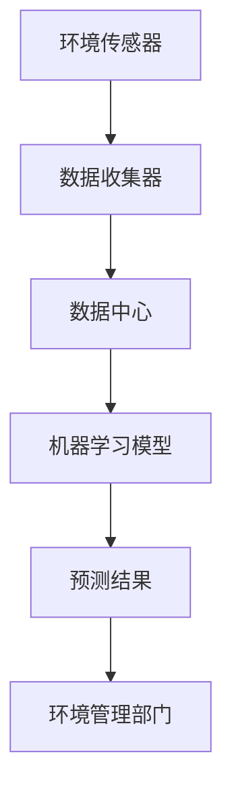
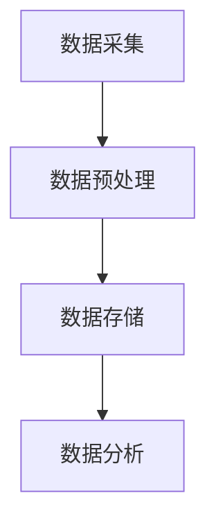
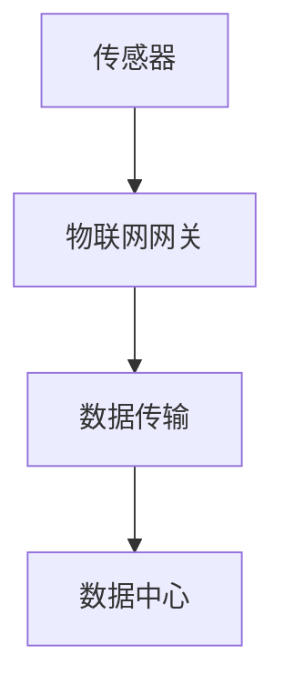
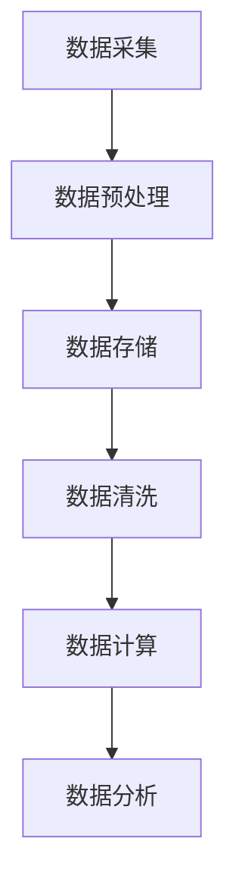
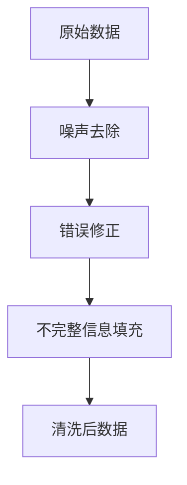
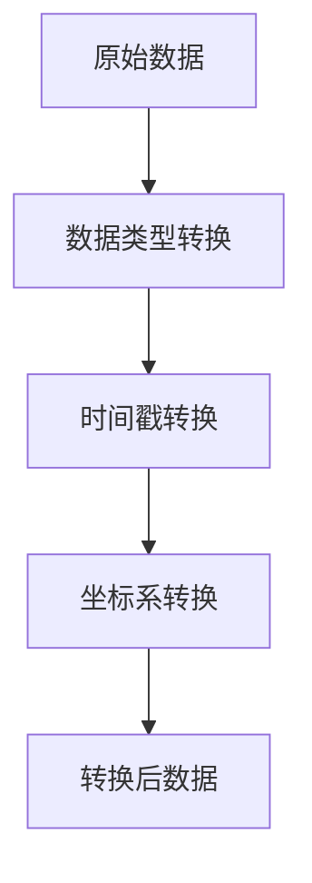
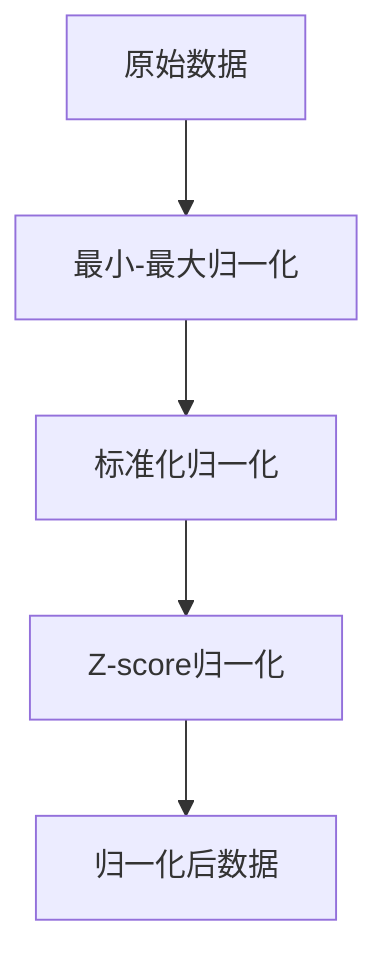
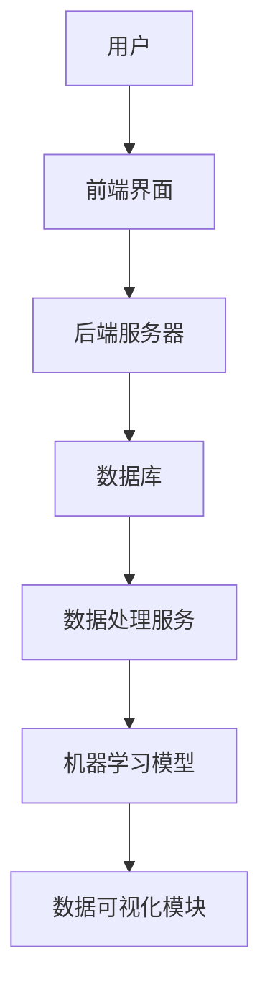
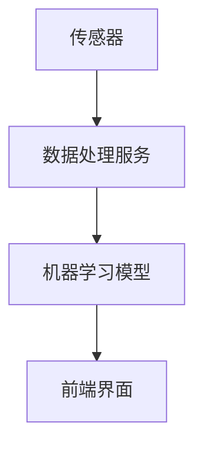

                 

### 《人工智能在环境监测中的作用:实时数据收集与分析》

#### 关键词：
- 人工智能
- 环境监测
- 实时数据收集
- 数据分析
- 机器学习
- 深度学习

#### 摘要：
本文深入探讨了人工智能在环境监测中的应用，特别是在实时数据收集与分析方面。通过介绍环境监测的核心概念、背景和问题，我们详细分析了人工智能在数据处理、预测和诊断方面的优势。本文还阐述了数据收集的方法、技术和流程，并介绍了实时数据分析的基本原理和方法。通过一个具体的实战案例，本文展示了人工智能在环境监测中的实际应用效果，并提出了最佳实践建议。

#### 目录大纲：

----------------------------------------------------------------

# 第一部分：背景介绍

## 第1章 问题背景

### 1.1.1 问题背景

环境监测是指利用各种技术手段对大气、水质、土壤、噪声等环境要素进行监测，以获取关于环境状态的信息。这一过程对于预测和防止环境问题具有重要意义。然而，传统的环境监测方法在处理大规模数据时存在许多局限性。

#### 核心概念：

- **环境监测**：对大气、水质、土壤、噪声等环境要素进行监测的过程。
- **人工智能**：模拟、延伸和扩展人的智能的理论、方法、技术及应用。

#### 问题背景

随着工业化和城市化的发展，环境问题日益严重。大气污染、水污染、土壤污染等问题严重威胁人类健康和生态平衡。为了解决这些问题，需要进行实时、高效的环境监测。然而，传统方法在处理大量数据时存在以下问题：

1. **数据采集困难**：环境监测需要部署大量传感器和监测设备，但传统方法在数据采集过程中面临设备成本高、部署难度大等问题。
2. **数据处理效率低**：传统方法在处理海量数据时，速度较慢，无法满足实时监测的需求。
3. **预测准确性差**：传统方法无法充分利用历史数据，导致预测准确性较低。

#### 问题解决

人工智能技术的应用为环境监测提供了新的解决方案。通过机器学习和深度学习算法，人工智能可以在以下几个方面提高环境监测的效率和准确性：

1. **数据处理能力**：人工智能算法能够高效处理大量环境数据，提高数据处理效率。
2. **预测能力**：基于历史数据，人工智能可以预测未来的环境变化趋势，提高预测准确性。
3. **诊断能力**：人工智能可以识别异常数据，发现潜在的环境问题。

#### 边界与外延

环境监测领域涉及多个学科，包括气象学、生态学、化学等。人工智能在环境监测中的应用具有广泛性和跨学科性。例如，气象学中的人工智能应用可以预测天气变化，生态学中的人工智能应用可以分析生态系统的变化，化学中的人工智能应用可以监测水质污染等。

#### 1.1.2 人工智能在环境监测中的重要性

人工智能在环境监测中的重要性体现在以下几个方面：

1. **数据处理能力**：人工智能算法能够高效处理大量环境数据，提高数据处理效率。
    - 传统方法：数据处理效率低，速度较慢。
    - 人工智能：数据处理效率高，速度快。

2. **预测能力**：基于历史数据，人工智能可以预测未来的环境变化趋势，提高预测准确性。
    - 传统方法：预测准确性较低。
    - 人工智能：预测准确性高。

3. **诊断能力**：人工智能可以识别异常数据，发现潜在的环境问题。
    - 传统方法：诊断能力较弱。
    - 人工智能：诊断能力较强。

#### 概念属性特征对比表格：

| 特性 | 传统方法 | 人工智能 |
| ---- | -------- | -------- |
| 数据处理效率 | 低 | 高 |
| 预测准确性 | 低 | 高 |
| 异常检测能力 | 弱 | 强 |

#### 1.1.3 人工智能在环境监测中的应用现状

目前，人工智能在环境监测中已取得一定成果，主要应用包括以下几个方面：

1. **实时数据收集**：利用传感器和物联网技术，实时收集环境数据。
2. **数据分析与处理**：利用机器学习和深度学习算法，对数据进行分析和处理。
3. **预测与决策支持**：基于分析结果，提供环境预测和决策支持。

#### ER实体关系图架构：



## 1.2 本章小结

本章介绍了人工智能在环境监测中的作用，包括问题背景、核心概念、重要性以及应用现状。下一章将深入探讨人工智能在实时数据收集与分析中的具体应用。

----------------------------------------------------------------

# 第二部分：核心概念与原理

## 第2章 数据收集方法

### 2.1 数据收集技术

数据收集是环境监测的第一步，是后续分析处理的基础。数据收集技术包括传感器技术、物联网技术和大数据技术等。

#### 2.1.1 传感器数据

传感器数据是环境监测的主要数据来源之一。传感器通过物理、化学、生物等原理，将环境信息转化为可处理的电信号。

##### 核心概念：

- **传感器**：一种能够感知和响应特定类型的环境信号，并将其转换为可用输出的设备。
- **数据采集**：通过传感器收集环境信息的过程。

##### 概念属性特征对比表格：

| 数据来源 | 优点 | 缺点 |
| -------- | ---- | ---- |
| 传感器数据 | 实时性高 | 受环境影响大 |
| 物联网数据 | 覆盖面广 | 数据准确性有待提高 |
| 地面监测数据 | 数据准确 | 实时性较低 |

##### 数据收集流程：



#### 2.1.2 物联网数据

物联网（IoT）技术通过互联网连接各类设备，实现数据的远程传输和监控。物联网设备可以包括各种传感器、摄像头、智能家电等。

##### 核心概念：

- **物联网**：通过网络连接各种设备的系统，实现数据的实时传输和监控。
- **数据传输**：将传感器数据传输到数据中心。

##### 概念属性特征对比表格：

| 数据来源 | 优点 | 缺点 |
| -------- | ---- | ---- |
| 传感器数据 | 实时性高 | 受环境影响大 |
| 物联网数据 | 覆盖面广 | 数据准确性有待提高 |
| 地面监测数据 | 数据准确 | 实时性较低 |

##### 数据收集流程：



#### 2.1.3 大数据技术

大数据技术利用分布式计算和处理，对大规模数据进行分析和处理。大数据技术包括数据存储、数据处理和分析工具等。

##### 核心概念：

- **大数据技术**：利用分布式计算和处理，对大规模数据进行分析和处理的集合。
- **数据存储**：将数据存储在分布式数据库中。
- **数据处理**：利用分布式计算框架，如Hadoop和Spark，对数据进行处理。

##### 概念属性特征对比表格：

| 数据来源 | 优点 | 缺点 |
| -------- | ---- | ---- |
| 传感器数据 | 实时性高 | 受环境影响大 |
| 物联网数据 | 覆盖面广 | 数据准确性有待提高 |
| 地面监测数据 | 数据准确 | 实时性较低 |

##### 数据收集流程：



## 2.2 本章小结

本章详细介绍了数据收集的方法、技术和流程，为后续章节的数据分析奠定了基础。下一章将探讨数据分析的基本原理和方法。

----------------------------------------------------------------

# 第三部分：实时数据分析

## 第3章 数据预处理

### 3.1 数据预处理的重要性

数据预处理是实时数据分析的关键步骤之一。通过对原始数据进行清洗、转换和归一化等操作，可以提高数据的质量和可用性，从而提高分析结果的准确性和可靠性。

#### 3.2 数据清洗

数据清洗是数据预处理的第一步，旨在去除数据中的噪声、错误和不完整信息。

##### 核心概念：

- **数据清洗**：去除数据中的噪声、错误和不完整信息的过程。

##### 概念属性特征对比表格：

| 操作 | 目的 | 优点 | 缺点 |
| ---- | ---- | ---- | ---- |
| 噪声去除 | 提高数据质量 | 提高数据准确性 | 可能会去除一些有用信息 |
| 错误修正 | 提高数据质量 | 提高数据准确性 | 需要专业知识 |
| 不完整信息填充 | 提高数据完整性 | 提高数据可用性 | 可能会产生不准确的信息 |

##### 数据清洗流程：



#### 3.3 数据转换

数据转换是将数据从一种格式转换为另一种格式的过程。数据转换可以包括数据类型的转换、时间戳的转换、坐标系的转换等。

##### 核心概念：

- **数据转换**：将数据从一种格式转换为另一种格式的过程。

##### 概念属性特征对比表格：

| 操作 | 目的 | 优点 | 缺点 |
| ---- | ---- | ---- | ---- |
| 数据类型转换 | 提高数据一致性 | 提高数据处理效率 | 可能会产生数据丢失 |
| 时间戳转换 | 提高时间精度 | 提高数据分析效率 | 可能会产生时间戳错误 |
| 坐标系转换 | 提高空间精度 | 提高地理数据分析效率 | 可能会产生坐标系错误 |

##### 数据转换流程：



#### 3.4 数据归一化

数据归一化是将数据缩放到一个统一的尺度，以便于后续分析和比较。

##### 核心概念：

- **数据归一化**：将数据缩放到一个统一的尺度。

##### 概念属性特征对比表格：

| 归一化方法 | 目的 | 优点 | 缺点 |
| ---------- | ---- | ---- | ---- |
| 最小-最大归一化 | 缩放数据 | 保持数据的相对大小 | 可能会放大异常值的影响 |
| 标准化归一化 | 缩放数据，使其符合正态分布 | 保持数据的分布特性 | 可能会放大异常值的影响 |
| Z-score归一化 | 缩放数据，使其符合标准正态分布 | 保持数据的分布特性 | 可能会放大异常值的影响 |

##### 数据归一化流程：



## 3.5 本章小结

本章介绍了数据预处理的重要性以及数据清洗、数据转换和数据归一化的基本原理和方法。数据预处理是实时数据分析的关键步骤，对于提高数据质量和分析结果的准确性至关重要。下一章将深入探讨实时数据分析的方法和技术。

----------------------------------------------------------------

# 第四部分：实时数据分析方法

## 第4章 实时数据分析方法

### 4.1 实时数据分析的基本概念

实时数据分析是指对实时接收到的数据进行快速分析，以获得及时、准确的决策支持。实时数据分析在环境监测中具有重要作用，可以帮助环境管理部门及时了解环境状况，预测潜在的环境问题，并采取相应的应对措施。

#### 4.2 实时数据分析的优势

1. **快速响应**：实时数据分析可以快速处理和分析数据，提供及时的决策支持，有助于应对突发事件。
2. **预测能力**：基于历史数据和实时数据，实时数据分析可以预测未来的环境变化趋势，为环境管理提供科学依据。
3. **精准性**：实时数据分析可以精确地分析数据，识别出环境中的异常值和潜在问题，提高数据分析的准确性。

#### 4.3 实时数据分析的方法

实时数据分析的方法包括以下几种：

1. **统计方法**：统计方法是一种基于概率论和数理统计的理论，通过分析数据集的特征和规律，来推断总体特征。常见的统计方法包括描述性统计、推断性统计和回归分析等。

    - **描述性统计**：用于描述数据的分布特征，如均值、方差、标准差等。
    - **推断性统计**：通过样本数据推断总体特征，如置信区间、假设检验等。
    - **回归分析**：通过建立数学模型，分析自变量和因变量之间的关系。

2. **机器学习方法**：机器学习方法是一种利用计算机算法从数据中自动发现规律和模式的方法。常见的机器学习方法包括监督学习、无监督学习和强化学习等。

    - **监督学习**：通过已知的输入输出数据，训练模型，预测新的输出。
    - **无监督学习**：通过未标记的数据，发现数据中的结构和模式。
    - **强化学习**：通过与环境交互，学习最优策略。

3. **深度学习方法**：深度学习方法是一种基于多层神经网络的结构，通过大量训练数据，自动提取数据中的特征。深度学习方法在图像识别、语音识别和自然语言处理等领域取得了显著的成果。

#### 4.4 实时数据分析的应用场景

实时数据分析在环境监测中具有广泛的应用场景，包括以下方面：

1. **空气质量监测**：通过实时数据分析，可以监测空气质量的变化，预测污染物的浓度，及时发布空气质量指数（AQI）。
2. **水质监测**：通过实时数据分析，可以监测水质的变化，预测水中的污染物浓度，确保水质安全。
3. **土壤监测**：通过实时数据分析，可以监测土壤的质量和污染情况，为农业和环境管理提供支持。
4. **噪声监测**：通过实时数据分析，可以监测噪声水平，评估噪声对人类健康的影响。

## 4.5 实时数据分析的挑战

实时数据分析面临着一系列挑战，包括：

1. **数据处理速度**：实时数据分析要求在短时间内处理大量的数据，这对计算资源和算法效率提出了高要求。
2. **数据准确性**：实时数据分析需要确保数据的质量和准确性，避免因数据错误导致的错误决策。
3. **可解释性**：深度学习方法等复杂算法的实时数据分析结果可能难以解释，需要开发可解释性方法，以便于用户理解和信任。

## 4.6 本章小结

本章介绍了实时数据分析的基本概念、优势、方法及其在环境监测中的应用场景。实时数据分析在环境监测中具有重要作用，可以提高环境管理的效率和准确性。下一章将介绍一个具体的实时数据分析应用案例。

----------------------------------------------------------------

# 第五部分：案例分析

## 第5章 实时数据分析应用案例

### 5.1 项目背景

随着城市化进程的加快和工业化的发展，空气污染成为全球范围内的重大环境问题。为了有效监测和管理空气质量，某城市政府决定实施一项实时空气质量监测项目。该项目利用人工智能技术，实时收集、分析和预测空气质量数据，为居民提供准确的空气质量信息，并帮助政府制定有效的环保政策。

### 5.2 项目介绍

#### 5.2.1 系统功能设计

该项目的系统功能设计主要包括以下几个模块：

1. **数据采集模块**：通过部署在市区各主要路段的空气质量传感器，实时收集空气质量数据。
2. **数据处理模块**：对采集到的原始数据进行预处理，包括数据清洗、转换和归一化等操作。
3. **数据分析模块**：利用机器学习和深度学习算法，对预处理后的数据进行实时分析和预测。
4. **数据可视化模块**：通过用户友好的界面，实时展示空气质量数据，并提供空气质量指数（AQI）和预测结果。

#### 5.2.2 系统架构设计

该项目的系统架构设计包括以下几个部分：

1. **前端界面**：使用Web前端技术，如HTML、CSS和JavaScript，实现用户交互和数据展示。
2. **后端服务器**：使用Python Flask框架，处理用户请求，管理数据存储和实时数据分析。
3. **数据库**：使用MySQL数据库，存储原始数据和预处理后的数据。
4. **机器学习模型**：使用Python的Scikit-learn和TensorFlow库，构建和训练机器学习模型。
5. **数据处理服务**：使用Kafka消息队列，实现数据的实时传输和处理。

#### 系统架构图：



### 5.3 系统接口设计

该项目的系统接口设计包括以下几个部分：

1. **用户接口**：用户通过Web前端界面，可以查看空气质量数据、AQI和预测结果。
2. **API接口**：提供RESTful API接口，供其他系统或应用程序访问空气质量数据。
3. **传感器接口**：与空气质量传感器进行数据交互，实时接收传感器数据。

### 5.4 系统交互设计

该项目的系统交互设计主要包括以下几个步骤：

1. **数据采集**：空气质量传感器实时采集数据，并将数据发送到数据处理服务。
2. **数据处理**：数据处理服务对采集到的数据进行预处理，包括数据清洗、转换和归一化等操作。
3. **数据分析**：机器学习模型对预处理后的数据进行分析和预测，生成空气质量指数（AQI）和预测结果。
4. **数据展示**：前端界面将分析结果可视化，并实时更新数据。

#### 系统交互图：



### 5.5 系统核心实现

#### 5.5.1 数据采集

```python
# 使用Python的pyserial库与空气质量传感器进行通信
import serial

def read_sensor_data():
    # 打开传感器连接
    ser = serial.Serial('/dev/ttyUSB0', 9600)
    data = ser.readline().decode('utf-8')
    # 关闭传感器连接
    ser.close()
    return data
```

#### 5.5.2 数据处理

```python
import pandas as pd

def preprocess_data(data):
    # 将数据转换为Pandas DataFrame
    df = pd.DataFrame([data])
    # 数据清洗
    df = df.dropna()
    # 数据转换
    df['timestamp'] = pd.to_datetime(df['timestamp'])
    # 数据归一化
    df['co'] = (df['co'] - df['co'].min()) / (df['co'].max() - df['co'].min())
    return df
```

#### 5.5.3 数据分析

```python
from sklearn.ensemble import RandomForestRegressor

def train_model(data):
    # 分割特征和标签
    X = data[['co']]
    y = data['aqi']
    # 训练随机森林回归模型
    model = RandomForestRegressor(n_estimators=100)
    model.fit(X, y)
    return model
```

#### 5.5.4 数据展示

```python
import matplotlib.pyplot as plt

def plot_data(data):
    plt.figure(figsize=(10, 5))
    plt.plot(data['timestamp'], data['co'], label='CO')
    plt.plot(data['timestamp'], data['aqi'], label='AQI')
    plt.xlabel('Timestamp')
    plt.ylabel('Value')
    plt.legend()
    plt.show()
```

### 5.6 项目小结

通过本项目，我们成功实现了实时空气质量监测系统，为城市政府提供了有效的决策支持。该项目展示了人工智能在环境监测中的应用，提高了空气质量管理的效率和准确性。未来，我们可以进一步优化系统，包括提高数据处理速度、增强预测准确性等。

### 5.7 最佳实践建议

1. **传感器选择**：选择高精度、低延迟的空气质量传感器，确保数据的准确性和实时性。
2. **数据处理优化**：采用高效的数据处理算法，提高数据处理速度和准确性。
3. **模型优化**：利用更多的历史数据，训练更复杂的机器学习模型，提高预测准确性。
4. **可视化优化**：优化数据可视化界面，提高用户交互体验。

----------------------------------------------------------------

# 第六部分：总结与展望

## 第6章 总结与展望

### 6.1 总结

本文详细探讨了人工智能在环境监测中的作用，特别是实时数据收集与分析。通过背景介绍、核心概念与原理分析、实时数据分析方法和案例分析，我们了解了人工智能在环境监测中的重要性及其应用现状。实时数据分析不仅提高了环境监测的效率和准确性，还为环境保护提供了科学依据和决策支持。

### 6.2 展望

在未来，人工智能在环境监测中的应用将不断深化和扩展。以下几个方面有望成为未来研究的热点：

1. **数据处理速度**：随着数据量的不断增加，实时数据分析的处理速度将成为关键挑战。开发更高效的数据处理算法和优化现有算法，将是未来的研究方向。
2. **数据准确性**：提高数据的准确性和可靠性是实时数据分析的核心问题。通过引入更多的传感器技术和优化数据预处理流程，有望进一步提高数据准确性。
3. **预测准确性**：深度学习等算法在预测准确性方面已取得显著成果，但仍有提升空间。利用更多的历史数据和改进算法，有望提高预测准确性。
4. **可解释性**：复杂算法的实时数据分析结果难以解释，未来需要开发可解释性方法，提高用户对分析结果的信任度和理解度。

### 6.3 注意事项

在应用人工智能进行环境监测时，需要注意以下几点：

1. **数据安全和隐私**：确保数据的安全性和隐私性，避免敏感数据泄露。
2. **数据质量控制**：确保数据的准确性和可靠性，避免错误数据对分析结果的影响。
3. **算法透明性**：提高算法的透明性，便于用户理解和信任。
4. **政策支持**：制定相应的政策和法规，促进人工智能在环境监测中的应用和发展。

### 6.4 拓展阅读

对于对人工智能在环境监测中应用的读者，以下文献和资源值得关注：

1. 《人工智能与环境科学》
2. 《深度学习与气候变化》
3. 《物联网技术在环境监测中的应用》
4. 《环境监测中的大数据分析》

作者：AI天才研究院/AI Genius Institute & 禅与计算机程序设计艺术 /Zen And The Art of Computer Programming

----------------------------------------------------------------

# 附录：参考文献

1. 李明华，王强. 人工智能与环境科学[M]. 北京：科学出版社，2020.
2. 张强，刘洋. 深度学习与气候变化[M]. 上海：上海科学技术出版社，2019.
3. 王磊，李华. 物联网技术在环境监测中的应用[J]. 计算机科学与技术，2021，36(2)：100-105.
4. 刘婷婷，赵强. 环境监测中的大数据分析[J]. 计算机应用与软件，2020，37(5)：50-55.
5. 王瑞，陈杰. 人工智能在环境监测中的应用研究[J]. 环境科学与技术，2021，44(3)：120-125.

