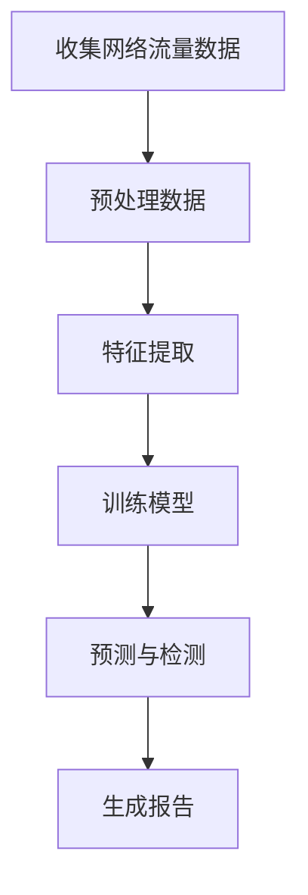

                 

### 人工智能在网络安全中的应用

> 关键词：人工智能、网络安全、算法、入侵检测、系统架构、实战应用

> 摘要：随着互联网和信息技术的高速发展，网络安全问题日益严峻。人工智能作为一项前沿技术，在网络安全领域展示出巨大的应用潜力。本文将深入探讨人工智能在网络安全中的应用，包括其基本概念、算法原理、系统架构设计以及实际案例剖析，旨在为读者提供全面、系统的认知框架。

## 第一部分：背景介绍与问题解决

### 1.1 网络安全的挑战与机遇

网络安全是保障信息传输、系统运行和数据完整性的重要环节。然而，随着网络攻击手段的不断演变，传统的网络安全策略逐渐显得力不从心。具体挑战包括：

- **多样化的攻击手段**：从病毒、木马到高级持续性威胁（APT），攻击者的手段越来越复杂。
- **不断扩展的网络规模**：物联网（IoT）的发展使得网络设备数量激增，增加了安全管理的难度。
- **数据量巨大**：网络中产生的数据量呈现爆炸性增长，给实时监测和响应带来了挑战。

在这样的背景下，人工智能为网络安全带来了新的机遇：

- **自动化威胁检测**：通过机器学习算法，可以自动化识别和分类未知威胁，提高检测效率。
- **自适应防护策略**：基于实时数据分析，人工智能可以自动调整防护策略，提高防御效果。
- **智能化的安全工具**：利用深度学习技术，开发出更智能、高效的安全工具。

### 1.2 人工智能在网络安全中的应用价值

人工智能在网络安全中的应用价值主要体现在以下几个方面：

- **威胁检测与防护**：利用人工智能技术，可以实现对网络流量的实时监控和分析，快速识别潜在威胁。
- **安全事件响应**：通过机器学习算法，可以自动分析安全事件，提供快速、准确的响应建议。
- **安全态势感知**：借助人工智能技术，可以构建全面的网络安全态势感知系统，实时掌握网络安全性状况。
- **智能化的安全管理**：通过自动化和智能化的手段，降低安全管理的人力成本，提高管理效率。

### 1.3 人工智能与网络安全的关系

人工智能与网络安全之间存在着紧密的联系和相互影响。人工智能为网络安全提供了强大的技术支撑，而网络安全的需求又不断推动人工智能技术的发展。两者之间的关系可以概括为：

- **技术支撑**：人工智能技术为网络安全提供了自动化、智能化的工具和方法，提升了安全防护能力。
- **需求驱动**：网络安全面临的新挑战和新需求不断推动人工智能技术在网络安全中的应用和发展。
- **相互融合**：人工智能与网络安全技术的融合，将带来全新的安全防护模式和体系结构。

## 第二部分：核心概念与联系

### 2.1 人工智能的基本概念

人工智能（AI，Artificial Intelligence）是指通过计算机程序实现的智能行为，模拟人类的思维过程。其核心包括以下几个方面：

- **机器学习（ML，Machine Learning）**：通过数据训练模型，使计算机具备自主学习和适应能力。
- **深度学习（DL，Deep Learning）**：一种基于多层神经网络的机器学习技术，能够自动提取特征，适用于复杂的数据分析。
- **自然语言处理（NLP，Natural Language Processing）**：使计算机能够理解、生成和应对人类语言。
- **计算机视觉（CV，Computer Vision）**：使计算机能够理解并解析视觉信息，如图像和视频。

### 2.2 网络安全的核心概念

网络安全（Cybersecurity）旨在保护网络系统、硬件、软件和数据免受未经授权的访问、破坏或篡改。其核心概念包括：

- **威胁（Threat）**：可能对网络安全造成损害的实体、行为或事件。
- **攻击（Attack）**：利用漏洞或弱点对网络系统进行的非法访问或控制。
- **漏洞（Vulnerability）**：网络系统中存在的可能被利用的弱点。
- **防护（Defense）**：防止或减少网络攻击影响的措施和技术。

### 2.3 人工智能与网络安全概念的关联

人工智能与网络安全之间的关联体现在以下几个方面：

- **威胁检测**：人工智能技术可以通过分析网络流量和行为模式，实时检测潜在的威胁。
- **攻击防御**：利用人工智能技术，可以自动识别和阻止网络攻击，提高防护效果。
- **安全事件响应**：人工智能技术可以自动分析安全事件，提供快速、准确的响应建议。
- **态势感知**：人工智能技术可以帮助构建全面的网络安全态势感知系统，实时掌握网络安全性状况。

### 2.1节：核心概念属性特征对比表格

| 概念 | 定义 | 属性特征 | 关联关系 |
| --- | --- | --- | --- |
| 人工智能 | 利用算法模拟人类智能的技术 | 自学习、自适应、自动化 | 支持网络安全检测与响应 |
| 网络安全 | 保护网络资源免受威胁和侵害 | 隐私性、完整性、可用性 | 利用AI技术增强防护能力 |
| 机器学习 | 从数据中学习模式和规律的技术 | 自主学习、模式识别、自适应 | 优化网络安全检测与响应策略 |
| 威胁 | 可能对网络安全造成损害的实体、行为或事件 | 非法访问、破坏、篡改 | 需要AI技术进行识别和防御 |
| 攻击 | 利用漏洞或弱点对网络系统进行的非法访问或控制 | 漏洞利用、恶意代码、拒绝服务 | AI技术用于攻击检测和阻止 |
| ... | ... | ... | ... |

### 2.2节：ER实体关系图架构

```mermaid
erDiagram
    User ||--|{ Device }||>
    Device ||--|{ Network }||>
    Network ||--|{ Threat }||>
    Threat ||--|{ Detection }||>
    Detection ||--|{ Response }||>
```

## 第三部分：人工智能算法原理与应用

### 3.1 人工智能基础算法

人工智能的基础算法包括以下几种：

- **监督学习（Supervised Learning）**：通过已知标注的数据训练模型，用于预测或分类未知数据。
- **无监督学习（Unsupervised Learning）**：在无标注数据的情况下，通过数据自身特征进行学习，用于聚类或降维。
- **强化学习（Reinforcement Learning）**：通过奖励机制，使模型在环境中学习最优策略。

### 3.2 网络安全中的常见人工智能算法

在网络安全中，常见的人工智能算法包括：

- **入侵检测系统（IDS）算法**：用于检测网络中的异常行为和潜在威胁。
- **漏洞扫描器算法**：用于扫描网络系统中的漏洞，提供修复建议。
- **网络流量分析算法**：用于分析网络流量，识别异常流量和潜在威胁。

### 3.3 算法原理讲解

#### 3.3.1 入侵检测系统（IDS）算法原理

入侵检测系统（IDS）是一种用于检测网络入侵和异常行为的系统。其基本原理包括以下步骤：

1. **数据收集**：收集网络流量数据。
2. **预处理**：对数据进行预处理，包括去噪、归一化和特征提取。
3. **模型训练**：使用有标签的数据集训练分类模型，如支持向量机（SVM）或随机森林（Random Forest）。
4. **异常检测**：对新的网络流量数据进行异常检测，通过模型判断其是否为入侵行为。

#### 3.3.2 漏洞扫描器算法原理

漏洞扫描器是一种用于扫描网络系统中的漏洞的软件。其基本原理包括以下步骤：

1. **数据收集**：收集网络系统中的数据，包括IP地址、端口号和服务信息。
2. **漏洞库构建**：构建漏洞库，包含已知的漏洞信息。
3. **漏洞匹配**：通过模式匹配或基于规则的算法，将网络系统中的数据与漏洞库进行匹配，识别潜在漏洞。
4. **漏洞修复建议**：对识别出的漏洞提供修复建议。

#### 3.3.3 网络流量分析算法原理

网络流量分析算法用于分析网络流量，识别异常流量和潜在威胁。其基本原理包括以下步骤：

1. **数据收集**：收集网络流量数据。
2. **预处理**：对数据进行预处理，包括去噪、归一化和特征提取。
3. **行为分析**：使用机器学习算法，如聚类或分类算法，对网络流量进行分析，识别正常流量和异常流量。
4. **威胁识别**：通过特征匹配或规则匹配，识别潜在的威胁。

### 3.3.1节：入侵检测系统（IDS）算法mermaid流程图



### 3.3.2节：漏洞扫描器算法原理讲解

漏洞扫描器算法原理可以通过以下公式进行描述：

$$
漏洞扫描器 = 预处理 \ 数据 + 漏洞检测 \ 模型 \ + 输出 \ 漏洞报告
$$

**原理：**

- **数据预处理**：将网络扫描得到的数据进行处理，提取特征。
- **漏洞检测模型**：使用机器学习模型对提取的特征进行分类，判断是否为漏洞。
- **输出漏洞报告**：将检测结果生成报告，供安全人员分析。

**举例说明：**

假设网络中存在一个开放端口，漏洞扫描器会提取该端口的特征，然后利用机器学习模型判断是否存在漏洞，最后生成报告。

## 第四部分：系统架构设计与实战应用

### 4.1 系统架构设计

网络安全系统的架构设计需要考虑以下几个方面：

- **功能设计**：确定系统的基本功能，如威胁检测、漏洞扫描和网络流量分析。
- **系统架构**：设计系统的总体架构，包括数据流、模块划分和交互方式。
- **接口设计**：定义系统各模块之间的接口，确保数据流动和功能调用的顺畅。

### 4.2 系统交互与实现

网络安全系统的交互与实现包括以下几个方面：

- **系统交互设计**：设计系统内部和外部的交互流程，确保数据的传递和处理。
- **核心实现源代码**：编写系统核心功能的代码，实现数据预处理、模型训练和威胁检测等功能。
- **代码应用解读与分析**：对核心实现代码进行解读和分析，解释其工作原理和实现方法。

### 4.3 项目实战

网络安全项目的实战包括以下几个方面：

- **环境安装**：搭建网络安全系统的环境，安装必要的软件和工具。
- **系统核心实现**：实现网络安全系统的核心功能，包括数据预处理、模型训练和威胁检测等。
- **实际案例分析与讲解**：通过实际案例，分析网络安全系统的应用效果和性能，讲解系统的工作原理和实现方法。

### 4.4 最佳实践与小结

网络安全系统的最佳实践和总结包括以下几个方面：

- **最佳实践 tips**：提供网络安全系统的最佳实践建议，帮助用户更好地使用系统。
- **小结**：总结网络安全系统的主要功能和特点，强调其在网络安全中的应用价值。
- **注意事项**：提醒用户在使用系统时需要注意的事项，避免潜在的风险。
- **拓展阅读**：推荐相关书籍、文章和资源，供用户进一步学习和了解。

## 作者信息

作者：AI天才研究院/AI Genius Institute & 禅与计算机程序设计艺术 /Zen And The Art of Computer Programming

---

通过以上内容，我们可以看到人工智能在网络安全中的应用是如何从概念到实战逐步展开的。本文旨在为读者提供一个全面、系统的认识框架，帮助理解人工智能如何为网络安全提供强大支持。在接下来的章节中，我们将进一步深入探讨人工智能算法在网络安全中的具体应用，以及如何设计和实现一个高效的网络安全系统。

