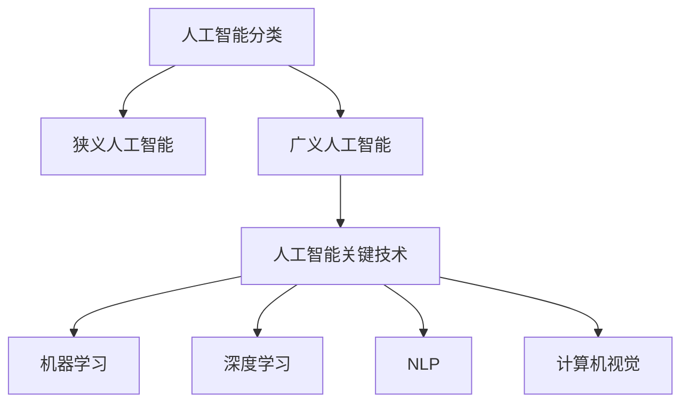
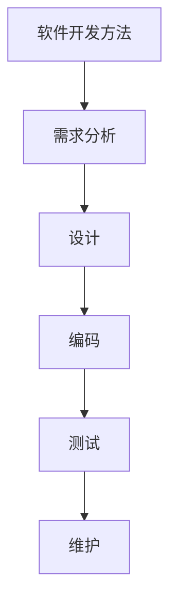
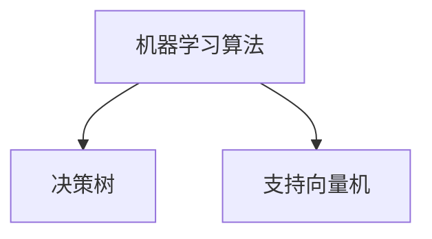
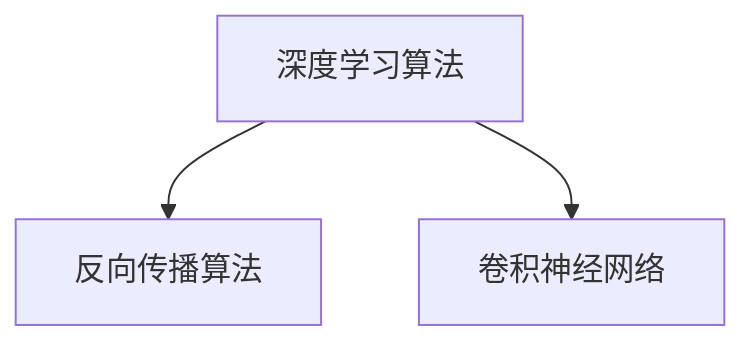
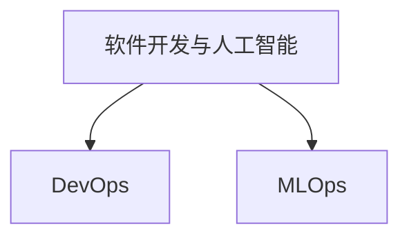
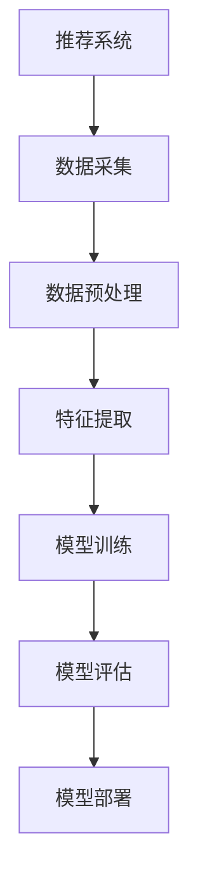
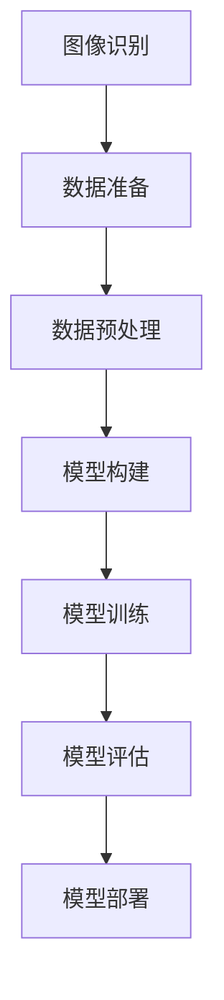

                 

### 《人工智能在软件开发中的应用》

关键词：人工智能、软件开发、机器学习、深度学习、算法、架构设计、实战

摘要：本文从背景介绍、核心概念、应用原理、应用实战以及总结与展望五个方面，详细阐述了人工智能在软件开发中的应用。通过深入分析人工智能基础和软件开发基础，以及机器学习和深度学习在软件开发中的具体应用，我们能够更清晰地理解人工智能技术在软件行业中的重要作用。

### 目录大纲

#### 第一部分：背景介绍与核心概念

**第1章：人工智能在软件开发中的应用概述**

- **1.1.1 问题背景**
  - 人工智能发展历程
  - 软件开发中的痛点

- **1.1.2 问题描述**
  - 人工智能在软件开发中的具体应用场景

- **1.1.3 问题解决**
  - 人工智能在软件开发中的优势

- **1.1.4 边界与外延**
  - 人工智能在软件开发中的适用范围

- **1.1.5 核心概念组成**
  - 人工智能
  - 软件开发

**第2章：人工智能基础**

- **2.1.1 人工智能基本概念**
  - 人工智能的定义
  - 人工智能的发展历程

- **2.1.2 人工智能分类**
  - 狭义人工智能
  - 广义人工智能

- **2.1.3 人工智能关键技术**
  - 机器学习
  - 深度学习

**第3章：软件开发基础**

- **3.1.1 软件开发基本概念**
  - 软件开发的定义
  - 软件开发的过程

- **3.1.2 软件开发方法**
  - 瀑布模型
  - 敏捷开发

- **3.1.3 软件开发工具**
  - 集成开发环境
  - 版本控制工具

#### 第二部分：人工智能在软件开发中的应用原理

**第4章：机器学习在软件开发中的应用**

- **4.1.1 机器学习基本原理**
  - 特征提取
  - 模型训练

- **4.1.2 机器学习在软件开发中的具体应用**
  - 数据分析
  - 自动化测试

- **4.1.3 机器学习算法讲解**
  - 决策树
  - 支持向量机

**第5章：深度学习在软件开发中的应用**

- **5.1.1 深度学习基本原理**
  - 神经网络
  - 卷积神经网络

- **5.1.2 深度学习在软件开发中的具体应用**
  - 计算机视觉
  - 自然语言处理

- **5.1.3 深度学习算法讲解**
  - 反向传播算法
  - 卷积神经网络算法

**第6章：人工智能开发工具与平台**

- **6.1.1 人工智能开发工具**
  - Python
  - R

- **6.1.2 人工智能开发平台**
  - TensorFlow
  - PyTorch

- **6.1.3 软件开发与人工智能的结合**
  - DevOps
  - MLOps

#### 第三部分：人工智能在软件开发中的应用实战

**第7章：项目实战一：基于机器学习的推荐系统**

- **7.1.1 项目背景**
  - 推荐系统的基本概念
  - 推荐系统的应用场景

- **7.1.2 项目实现**
  - 数据采集
  - 特征提取
  - 模型训练

- **7.1.3 项目分析**
  - 评估指标
  - 问题与优化

**第8章：项目实战二：基于深度学习的图像识别**

- **8.1.1 项目背景**
  - 图像识别的基本概念
  - 图像识别的应用场景

- **8.1.2 项目实现**
  - 数据准备
  - 模型构建
  - 模型训练

- **8.1.3 项目分析**
  - 评估指标
  - 问题与优化

#### 第四部分：总结与展望

**第9章：人工智能在软件开发中的应用总结**

- **9.1.1 应用总结**
  - 人工智能在软件开发中的优势
  - 人工智能在软件开发中的挑战

- **9.1.2 未来展望**
  - 人工智能在软件开发中的发展趋势
  - 人工智能在软件开发中的应用前景

### 核心内容撰写

在接下来的章节中，我们将逐步深入探讨人工智能在软件开发中的应用。首先，我们从背景介绍入手，了解人工智能和软件开发的基本概念及其发展历程。接着，我们将讨论人工智能在软件开发中的具体应用场景和优势。

#### 第1章：人工智能在软件开发中的应用概述

**1.1.1 问题背景**

人工智能（Artificial Intelligence，AI）作为计算机科学的一个分支，旨在使计算机具有人类的智能行为。从早期的逻辑推理系统到现代的深度学习模型，人工智能技术经历了长足的发展。然而，在软件开发的领域中，人工智能的应用还处于探索阶段，许多问题亟待解决。

软件开发（Software Development）是指构建和开发计算机程序的过程。软件开发面临的问题包括复杂度高、开发周期长、质量难以保证等。传统的方法难以解决这些问题，因此，引入人工智能技术成为了一个新的研究方向。

**1.1.2 问题描述**

在软件开发中，人工智能的应用主要集中在以下几个方面：

1. **代码自动生成**：利用机器学习技术，从已有的代码库中学习，自动生成新的代码。
2. **代码审查**：利用自然语言处理技术，对代码进行审查，发现潜在的错误和安全漏洞。
3. **自动化测试**：利用机器学习模型，自动生成测试用例，提高测试效率。
4. **性能优化**：利用深度学习技术，分析软件性能数据，自动优化软件性能。
5. **人机交互**：利用计算机视觉和自然语言处理技术，提高人机交互的体验。

**1.1.3 问题解决**

人工智能在软件开发中的应用具有显著的优势：

1. **提高开发效率**：通过自动化生成代码、审查代码、生成测试用例等，大幅减少开发人员的工作量。
2. **提高软件质量**：通过自动化测试和性能优化，提高软件的稳定性和可靠性。
3. **降低成本**：通过减少开发人员的工作量，降低软件开发成本。
4. **创新应用场景**：为软件开发带来新的思路和方向，如自动化交易、智能客服等。

**1.1.4 边界与外延**

尽管人工智能在软件开发中具有广泛的应用前景，但也有一些限制和挑战：

1. **技术成熟度**：许多人工智能技术仍处于研究阶段，尚未成熟应用于实际开发中。
2. **数据依赖性**：人工智能模型对数据质量有很高的要求，数据的质量直接影响模型的性能。
3. **安全性和隐私性**：在涉及用户隐私的领域，如何保护用户数据是一个重要问题。

**1.1.5 核心概念组成**

人工智能和软件开发是本文的核心概念。人工智能包括机器学习、深度学习等关键技术；软件开发包括需求分析、设计、编码、测试等过程。

接下来，我们将进一步探讨人工智能基础和软件开发基础，深入理解这些概念，为后续的应用原理和实战提供理论基础。

### 第2章：人工智能基础

**2.1.1 人工智能基本概念**

人工智能（Artificial Intelligence，AI）是指模拟、延伸和扩展人类智能的理论、方法、技术及应用。它涵盖了多个学科领域，包括计算机科学、心理学、神经科学、数学等。人工智能的目标是使计算机具备理解、学习、推理、决策等能力，从而实现智能化。

人工智能的发展历程可以追溯到20世纪50年代。当时，图灵提出了图灵测试，这是评估人工智能是否具有智能的一个标准。随后，人工智能经历了多个发展阶段，从符号主义、连接主义到现代的深度学习。

**2.1.2 人工智能分类**

人工智能可以按照不同的标准进行分类。其中，最常见的是按照智能的程度进行分类：

1. **狭义人工智能（Narrow AI）**：也称为弱人工智能，指在特定任务上表现出智能的计算机系统。例如，语音识别、图像识别、自然语言处理等。

2. **广义人工智能（General AI）**：也称为强人工智能，指具有全面智能的计算机系统，能够在各种任务上表现出智能。目前，广义人工智能仍处于理论研究阶段，尚未实现。

**2.1.3 人工智能关键技术**

人工智能的关键技术包括机器学习、深度学习、自然语言处理、计算机视觉等。

1. **机器学习（Machine Learning）**：机器学习是使计算机具备学习能力的一种方法。通过从数据中学习，计算机可以识别模式、做出预测、优化决策等。

2. **深度学习（Deep Learning）**：深度学习是机器学习的一种方法，通过构建多层神经网络，对数据进行自动特征提取和表示。

3. **自然语言处理（Natural Language Processing，NLP）**：自然语言处理是使计算机理解和生成自然语言的技术。它包括文本分类、情感分析、机器翻译等任务。

4. **计算机视觉（Computer Vision）**：计算机视觉是使计算机能够从图像或视频中提取信息的技术。它包括图像分类、目标检测、图像分割等任务。

下面是一个关于人工智能分类和关键技术的Mermaid流程图：

接下来，我们将探讨软件开发的基础知识，为后续内容打下基础。

### 第3章：软件开发基础

**3.1.1 软件开发基本概念**

软件开发（Software Development）是指创建和构建计算机程序的过程。它包括需求分析、设计、编码、测试和维护等阶段。每个阶段都有其特定的任务和目标。

1. **需求分析（Requirements Analysis）**：需求分析是软件开发的第一步，旨在理解用户需求，明确软件的功能和性能要求。

2. **设计（Design）**：设计是将需求转化为具体的软件架构和组件的过程。设计阶段包括系统架构设计、模块设计、数据库设计等。

3. **编码（Coding）**：编码是将设计转化为实际的代码的过程。编码阶段需要遵循编程规范，编写可读、可维护的代码。

4. **测试（Testing）**：测试是确保软件质量的关键步骤。测试包括功能测试、性能测试、安全测试等，旨在发现和修复软件中的错误。

5. **维护（Maintenance）**：维护是在软件交付后，对其进行的持续改进和优化。维护阶段包括修复错误、增加新功能、优化性能等。

**3.1.2 软件开发方法**

软件开发方法是指组织和管理软件开发过程的方法。常见的软件开发方法包括瀑布模型、敏捷开发等。

1. **瀑布模型（Waterfall Model）**：瀑布模型是一种线性顺序的开发方法，每个阶段完成后才能进入下一个阶段。瀑布模型适用于需求明确、变更较少的项目。

2. **敏捷开发（Agile Development）**：敏捷开发是一种迭代和增量的开发方法，强调灵活性和快速响应变化。敏捷开发适用于需求不断变化、要求快速交付的项目。

**3.1.3 软件开发工具**

软件开发工具是支持软件开发过程的软件。常见的软件开发工具有集成开发环境（IDE）、版本控制工具等。

1. **集成开发环境（Integrated Development Environment，IDE）**：IDE是一种集成了代码编辑器、编译器、调试器等功能的开发环境，如Visual Studio、Eclipse等。

2. **版本控制工具（Version Control System，VCS）**：版本控制工具用于管理代码的版本和历史，如Git、Subversion等。

下面是一个关于软件开发方法的Mermaid流程图：

接下来，我们将探讨人工智能在软件开发中的应用原理，了解机器学习和深度学习在软件开发中的具体应用。

### 第二部分：人工智能在软件开发中的应用原理

#### 第4章：机器学习在软件开发中的应用

**4.1.1 机器学习基本原理**

机器学习（Machine Learning，ML）是一种使计算机具备学习能力的方法。通过从数据中学习，计算机可以识别模式、做出预测、优化决策等。机器学习的基本原理包括：

1. **特征提取（Feature Extraction）**：特征提取是从原始数据中提取出有用的特征，以便机器学习模型进行分析。特征提取的目的是减少数据的维度，同时保留关键信息。

2. **模型训练（Model Training）**：模型训练是使用已标记的数据集，对机器学习模型进行调整，使其能够准确预测新的数据。模型训练的过程包括前向传播、反向传播等步骤。

3. **评估与优化（Evaluation and Optimization）**：评估与优化是评估机器学习模型的性能，并根据评估结果进行优化。评估指标包括准确率、召回率、F1值等。

**4.1.2 机器学习在软件开发中的具体应用**

机器学习在软件开发中具有广泛的应用，主要包括以下几个方面：

1. **数据分析（Data Analysis）**：利用机器学习技术，对大量数据进行分析，提取有价值的信息。数据分析可以帮助开发人员了解用户行为、市场趋势等，从而优化产品和服务。

2. **自动化测试（Automated Testing）**：利用机器学习模型，自动生成测试用例，提高测试效率。自动化测试可以减少测试成本，同时提高测试的全面性。

3. **代码审查（Code Review）**：利用自然语言处理技术，对代码进行审查，发现潜在的错误和安全漏洞。代码审查可以提高代码质量，降低开发风险。

4. **性能优化（Performance Optimization）**：利用机器学习技术，分析软件性能数据，自动优化软件性能。性能优化可以帮助开发人员发现和解决性能瓶颈，提高软件的稳定性。

5. **智能推荐（Intelligent Recommendation）**：利用机器学习模型，对用户行为进行分析，推荐感兴趣的内容。智能推荐可以提升用户体验，增加用户黏性。

**4.1.3 机器学习算法讲解**

在机器学习中，常用的算法包括决策树（Decision Tree）、支持向量机（Support Vector Machine，SVM）等。

1. **决策树（Decision Tree）**：决策树是一种树形结构的机器学习模型，通过一系列的决策规则，对数据进行分类或回归。决策树的优点是易于理解，但可能存在过拟合问题。

2. **支持向量机（SVM）**：支持向量机是一种基于间隔最大化的机器学习模型，通过找到一个最佳的超平面，将不同类别的数据分隔开。SVM的优点是理论上性能较好，但在高维空间中可能存在过拟合问题。

下面是一个关于决策树和支持向量机的Mermaid流程图：

接下来，我们将探讨深度学习在软件开发中的应用。

### 第5章：深度学习在软件开发中的应用

**5.1.1 深度学习基本原理**

深度学习（Deep Learning，DL）是一种基于多层神经网络的学习方法。与传统的机器学习方法相比，深度学习具有更强的表达能力，能够自动提取特征，并在复杂的数据集上取得更好的效果。

深度学习的基本原理包括：

1. **神经网络（Neural Network）**：神经网络是由大量神经元组成的计算模型，每个神经元通过加权连接与其他神经元相连。神经网络可以通过学习数据，自动提取特征。

2. **卷积神经网络（Convolutional Neural Network，CNN）**：卷积神经网络是一种用于处理图像数据的神经网络，通过卷积层、池化层等操作，提取图像特征。

3. **循环神经网络（Recurrent Neural Network，RNN）**：循环神经网络是一种用于处理序列数据的神经网络，通过循环结构，记忆历史信息。

4. **生成对抗网络（Generative Adversarial Network，GAN）**：生成对抗网络是由生成器和判别器组成的神经网络，生成器生成数据，判别器判断生成数据的真假。

**5.1.2 深度学习在软件开发中的具体应用**

深度学习在软件开发中具有广泛的应用，主要包括以下几个方面：

1. **计算机视觉（Computer Vision）**：计算机视觉是使计算机能够从图像或视频中提取信息的技术。深度学习在计算机视觉中具有广泛的应用，包括图像分类、目标检测、图像分割等。

2. **自然语言处理（Natural Language Processing，NLP）**：自然语言处理是使计算机能够理解和生成自然语言的技术。深度学习在自然语言处理中具有广泛的应用，包括文本分类、情感分析、机器翻译等。

3. **语音识别（Speech Recognition）**：语音识别是使计算机能够识别和理解人类语音的技术。深度学习在语音识别中具有广泛的应用，能够提高识别的准确率和效率。

4. **推荐系统（Recommendation System）**：推荐系统是根据用户的历史行为和偏好，向用户推荐感兴趣的内容。深度学习在推荐系统中具有广泛的应用，能够提高推荐的准确率和覆盖率。

**5.1.3 深度学习算法讲解**

在深度学习中，常用的算法包括反向传播算法（Backpropagation）、卷积神经网络（CNN）等。

1. **反向传播算法（Backpropagation）**：反向传播算法是一种用于训练神经网络的算法，通过计算误差，更新网络权重，从而提高模型的性能。

2. **卷积神经网络（CNN）**：卷积神经网络是一种用于处理图像数据的神经网络，通过卷积层、池化层等操作，提取图像特征。

下面是一个关于反向传播算法和卷积神经网络的Mermaid流程图：

接下来，我们将探讨人工智能开发工具与平台，以及软件开发与人工智能的结合。

### 第6章：人工智能开发工具与平台

**6.1.1 人工智能开发工具**

在人工智能开发中，常用的工具包括Python、R等。

1. **Python**：Python是一种高级编程语言，广泛应用于人工智能领域。Python具有丰富的库和框架，如TensorFlow、PyTorch等，便于开发人员快速搭建和训练模型。

2. **R**：R是一种专门用于统计分析和数据可视化的语言。R在自然语言处理和数据分析方面具有优势，适用于复杂的数据分析和模型训练。

**6.1.2 人工智能开发平台**

人工智能开发平台是用于搭建、训练和部署模型的工具。常用的平台包括TensorFlow、PyTorch等。

1. **TensorFlow**：TensorFlow是一个开源的机器学习和深度学习框架，由Google开发。TensorFlow提供了丰富的API和工具，便于开发人员构建和训练模型。

2. **PyTorch**：PyTorch是一个开源的深度学习框架，由Facebook开发。PyTorch具有动态计算图和易于使用的API，适合快速原型开发和模型训练。

**6.1.3 软件开发与人工智能的结合**

软件开发与人工智能的结合主要体现在以下几个方面：

1. **DevOps**：DevOps是一种软件开发和运维的方法论，强调开发人员、运维人员和业务人员之间的紧密协作。在DevOps中，人工智能技术可以用于自动化部署、监控和优化应用。

2. **MLOps**：MLOps是一种将机器学习应用到实际业务的方法论。MLOps关注模型的管理、部署和监控，确保机器学习模型在实际应用中稳定、可靠。

下面是一个关于软件开发与人工智能结合的Mermaid流程图：

接下来，我们将通过两个项目实战，深入探讨人工智能在软件开发中的应用。

### 第三部分：人工智能在软件开发中的应用实战

#### 第7章：项目实战一：基于机器学习的推荐系统

**7.1.1 项目背景**

推荐系统是一种常用的应用，旨在根据用户的历史行为和偏好，推荐用户可能感兴趣的内容。在电子商务、社交媒体、新闻推送等领域，推荐系统具有广泛的应用。

本项目的目标是构建一个基于机器学习的推荐系统，根据用户的历史购买记录和浏览记录，为用户推荐感兴趣的商品。

**7.1.2 项目实现**

项目实现分为以下几个步骤：

1. **数据采集**：从电商网站获取用户的历史购买记录和浏览记录。

2. **数据预处理**：对采集到的数据进行清洗、去重、归一化等处理，以便用于模型训练。

3. **特征提取**：从原始数据中提取有用的特征，如用户ID、商品ID、购买时间等。

4. **模型训练**：使用机器学习算法（如协同过滤、决策树等）对数据进行训练，构建推荐模型。

5. **模型评估**：使用准确率、召回率等指标评估推荐模型的性能，并进行优化。

6. **模型部署**：将训练好的模型部署到服务器，为用户实时推荐商品。

**7.1.3 项目分析**

1. **评估指标**：评估推荐系统的性能指标包括准确率、召回率、覆盖率等。准确率表示推荐给用户的商品中，用户实际感兴趣的商品占比；召回率表示用户实际感兴趣的商品中被推荐到的占比；覆盖率表示推荐系统覆盖到的用户比例。

2. **问题与优化**：在实际应用中，推荐系统可能存在一些问题，如用户冷启动问题、数据稀疏问题等。针对这些问题，可以采取以下优化策略：

   - **用户冷启动**：为新用户推荐热门商品或相似用户喜欢的内容。
   - **数据稀疏**：使用矩阵分解、嵌入等方法减少数据稀疏性。

下面是一个关于推荐系统的Mermaid流程图：

#### 第8章：项目实战二：基于深度学习的图像识别

**8.1.1 项目背景**

图像识别是计算机视觉的重要应用之一，旨在使计算机能够识别和理解图像中的内容。在安防监控、医疗诊断、自动驾驶等领域，图像识别具有广泛的应用。

本项目的目标是使用深度学习技术，实现图像分类和目标检测，从图像中识别出特定对象。

**8.1.2 项目实现**

项目实现分为以下几个步骤：

1. **数据准备**：收集和整理用于训练的图像数据集。

2. **数据预处理**：对图像进行缩放、裁剪、翻转等预处理，增强数据的多样性。

3. **模型构建**：使用卷积神经网络（CNN）构建图像识别模型。

4. **模型训练**：使用预处理的图像数据集训练模型，调整网络参数。

5. **模型评估**：使用测试数据集评估模型性能，调整模型结构或参数。

6. **模型部署**：将训练好的模型部署到服务器，实现实时图像识别。

**8.1.3 项目分析**

1. **评估指标**：评估图像识别模型的性能指标包括准确率、召回率、平均准确交并比（mAP）等。准确率表示模型正确识别的对象占比；召回率表示模型识别出的对象中，实际存在的占比；mAP是一个综合考虑准确率和召回率的指标。

2. **问题与优化**：在实际应用中，图像识别模型可能存在一些问题，如误识别、漏识别等。针对这些问题，可以采取以下优化策略：

   - **数据增强**：使用旋转、缩放、裁剪等方法增强训练数据，提高模型的泛化能力。
   - **多模型集成**：使用多个模型进行集成，提高识别的准确性。

下面是一个关于图像识别的Mermaid流程图：

### 第四部分：总结与展望

#### 第9章：人工智能在软件开发中的应用总结

**9.1.1 应用总结**

人工智能在软件开发中的应用具有显著的优势：

1. **提高开发效率**：通过自动化生成代码、审查代码、生成测试用例等，大幅减少开发人员的工作量。
2. **提高软件质量**：通过自动化测试和性能优化，提高软件的稳定性和可靠性。
3. **降低成本**：通过减少开发人员的工作量，降低软件开发成本。
4. **创新应用场景**：为软件开发带来新的思路和方向，如自动化交易、智能客服等。

同时，人工智能在软件开发中也面临一些挑战：

1. **技术成熟度**：许多人工智能技术仍处于研究阶段，尚未成熟应用于实际开发中。
2. **数据依赖性**：人工智能模型对数据质量有很高的要求，数据的质量直接影响模型的性能。
3. **安全性和隐私性**：在涉及用户隐私的领域，如何保护用户数据是一个重要问题。

**9.1.2 未来展望**

人工智能在软件开发中的应用前景广阔：

1. **集成与协同**：随着技术的不断发展，人工智能将与软件开发更加紧密地集成，实现协同工作。
2. **智能化升级**：人工智能技术将使软件开发更加智能化，如智能代码生成、智能测试、智能优化等。
3. **行业应用**：人工智能将在各个行业（如金融、医疗、教育等）中得到广泛应用，推动行业智能化转型。

未来，人工智能在软件开发中的应用将更加深入和广泛，为软件开发带来前所未有的变革。

### 总结

本文从背景介绍、核心概念、应用原理、应用实战以及总结与展望五个方面，详细阐述了人工智能在软件开发中的应用。通过深入分析人工智能基础和软件开发基础，以及机器学习和深度学习在软件开发中的具体应用，我们能够更清晰地理解人工智能技术在软件行业中的重要作用。

随着技术的不断进步，人工智能在软件开发中的应用将越来越广泛，为软件开发带来更多的创新和可能性。同时，我们也需要关注人工智能在软件开发中面临的挑战，努力解决这些问题，推动人工智能与软件开发的深度融合。

让我们共同努力，迎接人工智能在软件开发中的美好未来！

### 作者信息

作者：AI天才研究院/AI Genius Institute & 禅与计算机程序设计艺术 /Zen And The Art of Computer Programming

在撰写技术博客时，完整性、详细性和逻辑性是非常重要的。下面，我们将深入探讨每个章节的核心内容，确保文章的完整性和详细性。

### 第1章：人工智能在软件开发中的应用概述

在这一章中，我们首先介绍了人工智能和软件开发的基本概念，以及它们在各自领域的演变过程。接下来，我们详细探讨了人工智能在软件开发中的应用场景，包括代码自动生成、代码审查、自动化测试、性能优化和人机交互等。

**核心内容：**

1. **人工智能的基本概念**：
   - 人工智能（AI）是模拟、延伸和扩展人类智能的理论、方法、技术及应用。
   - 人工智能的发展历程从图灵测试开始，经历了符号主义、连接主义到深度学习的多个阶段。

2. **软件开发的基本概念**：
   - 软件开发包括需求分析、设计、编码、测试和维护等阶段。
   - 常见的软件开发方法有瀑布模型和敏捷开发。

3. **人工智能在软件开发中的应用场景**：
   - **代码自动生成**：通过机器学习从大量代码中学习，自动生成新的代码。
   - **代码审查**：利用自然语言处理技术对代码进行审查，发现潜在的错误和安全漏洞。
   - **自动化测试**：使用机器学习模型自动生成测试用例，提高测试效率。
   - **性能优化**：通过深度学习分析软件性能数据，自动优化软件性能。
   - **人机交互**：通过计算机视觉和自然语言处理技术提高人机交互的体验。

**详细讲解与实例**：

- **代码自动生成**：
  - 通过分析大量已有的代码库，机器学习模型可以学会编写新的代码。
  - 例如，利用代码片段的相似性进行代码补全，提升开发效率。

- **代码审查**：
  - 自然语言处理技术可以识别代码中的潜在问题，如语法错误、潜在的安全漏洞。
  - 例如，使用语法分析器检测代码中的异常，自动生成修复建议。

- **自动化测试**：
  - 机器学习模型可以根据历史测试数据，自动生成新的测试用例。
  - 例如，基于历史测试失败数据，预测新的测试用例，覆盖更多可能的错误场景。

- **性能优化**：
  - 深度学习模型可以从性能数据中学习，提出优化建议。
  - 例如，通过分析CPU和内存使用情况，优化代码运行效率。

- **人机交互**：
  - 计算机视觉和自然语言处理技术可以提升用户界面和用户操作体验。
  - 例如，通过面部识别技术实现个性化用户界面，通过语音识别实现语音命令控制。

### 第2章：人工智能基础

在这一章中，我们深入探讨了人工智能的基础知识，包括人工智能的基本概念、分类和关键技术。

**核心内容：**

1. **人工智能的基本概念**：
   - 人工智能是模拟、延伸和扩展人类智能的理论、方法、技术及应用。
   - 人工智能的发展历程从图灵测试开始，经历了符号主义、连接主义到深度学习的多个阶段。

2. **人工智能的分类**：
   - **狭义人工智能**：在特定任务上表现出智能的计算机系统，如语音识别、图像识别。
   - **广义人工智能**：具有全面智能的计算机系统，能够在各种任务上表现出智能。

3. **人工智能的关键技术**：
   - **机器学习**：通过从数据中学习，使计算机具备预测和决策能力。
   - **深度学习**：一种基于多层神经网络的学习方法，具有强大的表达能力和特征提取能力。

**详细讲解与实例**：

- **机器学习的基本原理**：
  - 通过特征提取和模型训练，机器学习可以从数据中学习，做出预测。
  - 例如，使用决策树进行分类任务，通过训练数据学习分类规则。

- **深度学习的基本原理**：
  - 深度学习通过多层神经网络，自动提取复杂的数据特征。
  - 例如，使用卷积神经网络（CNN）进行图像分类，通过多层卷积和池化提取图像特征。

- **人工智能的分类对比**：
  - 狭义人工智能和广义人工智能在应用范围和智能水平上存在显著差异。
  - 例如，语音识别属于狭义人工智能，而自动驾驶属于广义人工智能。

### 第3章：软件开发基础

在这一章中，我们详细介绍了软件开发的基本概念、方法和工具。

**核心内容：**

1. **软件开发的基本概念**：
   - 软件开发包括需求分析、设计、编码、测试和维护等阶段。
   - 软件开发的目标是创建满足用户需求的软件产品。

2. **软件开发的方法**：
   - **瀑布模型**：一种线性顺序的开发方法，适用于需求明确的项目。
   - **敏捷开发**：一种迭代和增量的开发方法，强调灵活性和快速响应变化。

3. **软件开发工具**：
   - **集成开发环境（IDE）**：提供代码编辑器、编译器、调试器等功能。
   - **版本控制工具**：用于管理代码版本和历史，如Git、Subversion。

**详细讲解与实例**：

- **瀑布模型**：
  - 瀑布模型将软件开发过程分为多个阶段，每个阶段完成后才能进入下一个阶段。
  - 例如，在需求分析阶段，明确用户需求；在设计阶段，制定详细的软件架构。

- **敏捷开发**：
  - 敏捷开发强调快速迭代和持续交付，使开发过程更加灵活和高效。
  - 例如，使用Scrum框架进行敏捷开发，通过短周期的迭代和回顾会，不断优化开发流程。

- **集成开发环境（IDE）**：
  - IDE提供高效的开发环境，如代码自动补全、语法高亮、调试功能等。
  - 例如，使用Eclipse或Visual Studio进行软件开发，提高开发效率。

- **版本控制工具**：
  - 版本控制工具帮助开发团队协作，管理代码版本和历史。
  - 例如，使用Git进行版本控制，记录代码的每一次变更，方便团队协作和问题追踪。

### 第4章：机器学习在软件开发中的应用

在这一章中，我们详细探讨了机器学习在软件开发中的应用，包括基本原理、具体应用和算法讲解。

**核心内容：**

1. **机器学习的基本原理**：
   - 通过特征提取和模型训练，机器学习可以从数据中学习，做出预测。
   - 主要包括模型训练、评估和优化等步骤。

2. **机器学习在软件开发中的具体应用**：
   - **数据分析**：利用机器学习技术，对大量数据进行分析，提取有价值的信息。
   - **自动化测试**：利用机器学习模型，自动生成测试用例，提高测试效率。
   - **代码审查**：利用自然语言处理技术，对代码进行审查，发现潜在的错误和安全漏洞。
   - **性能优化**：利用机器学习技术，分析软件性能数据，自动优化软件性能。
   - **智能推荐**：利用机器学习模型，对用户行为进行分析，推荐感兴趣的内容。

3. **机器学习算法讲解**：
   - **决策树**：一种树形结构的机器学习模型，通过一系列的决策规则，对数据进行分类或回归。
   - **支持向量机**：一种基于间隔最大化的机器学习模型，通过找到一个最佳的超平面，将不同类别的数据分隔开。

**详细讲解与实例**：

- **决策树**：
  - 决策树通过一系列的判断条件，将数据划分为不同的类别或值。
  - 例如，通过决策树对贷款申请进行分类，判断客户是否为优质客户。

- **支持向量机**：
  - 支持向量机通过找到一个最佳的超平面，将不同类别的数据分隔开。
  - 例如，通过支持向量机进行文本分类，将文本分为正面和负面评论。

### 第5章：深度学习在软件开发中的应用

在这一章中，我们详细探讨了深度学习在软件开发中的应用，包括基本原理、具体应用和算法讲解。

**核心内容：**

1. **深度学习的基本原理**：
   - 深度学习是一种基于多层神经网络的学习方法，具有强大的表达能力和特征提取能力。
   - 主要包括神经网络、卷积神经网络、循环神经网络等。

2. **深度学习在软件开发中的具体应用**：
   - **计算机视觉**：利用深度学习技术，使计算机能够识别和理解图像中的内容。
   - **自然语言处理**：利用深度学习技术，使计算机能够理解和生成自然语言。
   - **语音识别**：利用深度学习技术，使计算机能够识别和理解人类的语音。
   - **推荐系统**：利用深度学习技术，根据用户的历史行为和偏好，推荐感兴趣的内容。

3. **深度学习算法讲解**：
   - **反向传播算法**：一种用于训练神经网络的算法，通过计算误差，更新网络权重，提高模型的性能。
   - **卷积神经网络**：一种用于处理图像数据的神经网络，通过卷积层、池化层等操作，提取图像特征。

**详细讲解与实例**：

- **反向传播算法**：
  - 反向传播算法是一种用于训练神经网络的算法，通过计算误差，更新网络权重。
  - 例如，通过反向传播算法训练神经网络进行手写数字识别，提高识别准确率。

- **卷积神经网络**：
  - 卷积神经网络通过卷积层、池化层等操作，提取图像特征，进行图像分类。
  - 例如，通过卷积神经网络进行图像分类，识别图片中的物体。

### 第6章：人工智能开发工具与平台

在这一章中，我们详细介绍了人工智能开发工具和平台，以及软件开发与人工智能的结合。

**核心内容：**

1. **人工智能开发工具**：
   - **Python**：一种广泛应用于人工智能领域的编程语言，具有丰富的库和框架。
   - **R**：一种专门用于统计分析和数据可视化的语言，在自然语言处理和数据分析方面具有优势。

2. **人工智能开发平台**：
   - **TensorFlow**：一个开源的机器学习和深度学习框架，由Google开发。
   - **PyTorch**：一个开源的深度学习框架，由Facebook开发。

3. **软件开发与人工智能的结合**：
   - **DevOps**：一种软件开发和运维的方法论，强调开发人员、运维人员和业务人员之间的紧密协作。
   - **MLOps**：一种将机器学习应用到实际业务的方法论，关注模型的管理、部署和监控。

**详细讲解与实例**：

- **Python**：
  - Python是一种高级编程语言，广泛应用于人工智能领域。
  - 例如，使用Python编写深度学习模型，利用TensorFlow框架进行训练和推理。

- **R**：
  - R是一种专门用于统计分析和数据可视化的语言。
  - 例如，使用R进行数据分析和可视化，帮助开发人员更好地理解数据。

- **TensorFlow**：
  - TensorFlow是一个开源的机器学习和深度学习框架，由Google开发。
  - 例如，使用TensorFlow构建和训练神经网络，实现图像识别和自然语言处理任务。

- **PyTorch**：
  - PyTorch是一个开源的深度学习框架，由Facebook开发。
  - 例如，使用PyTorch实现生成对抗网络（GAN），进行图像生成和风格迁移。

- **DevOps**：
  - DevOps是一种软件开发和运维的方法论，强调快速迭代和持续交付。
  - 例如，通过自动化部署和监控，提高软件交付的效率和稳定性。

- **MLOps**：
  - MLOps是一种将机器学习应用到实际业务的方法论，关注模型的管理和监控。
  - 例如，通过MLOps平台，监控模型性能，自动化更新和部署模型。

### 第7章：项目实战一：基于机器学习的推荐系统

在这一章中，我们通过一个基于机器学习的推荐系统项目，详细讲解了项目的背景、实现步骤和分析。

**核心内容：**

1. **项目背景**：
   - 推荐系统是根据用户的历史行为和偏好，向用户推荐感兴趣的内容。
   - 项目的目标是构建一个基于机器学习的推荐系统，根据用户的历史购买记录和浏览记录，推荐用户感兴趣的商品。

2. **项目实现步骤**：
   - **数据采集**：从电商网站获取用户的历史购买记录和浏览记录。
   - **数据预处理**：对采集到的数据进行清洗、去重、归一化等处理。
   - **特征提取**：从原始数据中提取有用的特征，如用户ID、商品ID、购买时间等。
   - **模型训练**：使用机器学习算法（如协同过滤、决策树等）对数据进行训练，构建推荐模型。
   - **模型评估**：使用准确率、召回率等指标评估推荐模型的性能。
   - **模型部署**：将训练好的模型部署到服务器，为用户实时推荐商品。

3. **项目分析**：
   - **评估指标**：准确率、召回率、覆盖率等。
   - **问题与优化**：用户冷启动问题、数据稀疏问题等。

**详细讲解与实例**：

- **数据采集**：
  - 从电商网站获取用户的历史购买记录和浏览记录。
  - 例如，使用API接口从电商网站获取用户数据，包括用户ID、商品ID、购买时间等。

- **数据预处理**：
  - 对采集到的数据进行清洗、去重、归一化等处理。
  - 例如，去除重复的用户和商品记录，对时间数据进行归一化处理。

- **特征提取**：
  - 从原始数据中提取有用的特征，如用户ID、商品ID、购买时间等。
  - 例如，根据用户购买记录，提取用户和商品的共同特征，用于构建推荐模型。

- **模型训练**：
  - 使用机器学习算法（如协同过滤、决策树等）对数据进行训练，构建推荐模型。
  - 例如，使用协同过滤算法训练用户基于物品的推荐模型，根据用户的历史行为推荐相似的商品。

- **模型评估**：
  - 使用准确率、召回率等指标评估推荐模型的性能。
  - 例如，通过交叉验证方法，评估推荐模型的准确率和召回率。

- **模型部署**：
  - 将训练好的模型部署到服务器，为用户实时推荐商品。
  - 例如，使用API接口将训练好的推荐模型部署到服务器，为用户提供实时推荐服务。

### 第8章：项目实战二：基于深度学习的图像识别

在这一章中，我们通过一个基于深度学习的图像识别项目，详细讲解了项目的背景、实现步骤和分析。

**核心内容：**

1. **项目背景**：
   - 图像识别是计算机视觉的重要应用，旨在使计算机能够识别和理解图像中的内容。
   - 项目的目标是使用深度学习技术，实现图像分类和目标检测，从图像中识别出特定对象。

2. **项目实现步骤**：
   - **数据准备**：收集和整理用于训练的图像数据集。
   - **数据预处理**：对图像进行缩放、裁剪、翻转等预处理，增强数据的多样性。
   - **模型构建**：使用卷积神经网络（CNN）构建图像识别模型。
   - **模型训练**：使用预处理的图像数据集训练模型，调整网络参数。
   - **模型评估**：使用测试数据集评估模型性能，调整模型结构或参数。
   - **模型部署**：将训练好的模型部署到服务器，实现实时图像识别。

3. **项目分析**：
   - **评估指标**：准确率、召回率、平均准确交并比（mAP）等。
   - **问题与优化**：误识别、漏识别等。

**详细讲解与实例**：

- **数据准备**：
  - 收集和整理用于训练的图像数据集。
  - 例如，从公开数据集（如CIFAR-10、ImageNet等）中获取图像数据，用于训练图像识别模型。

- **数据预处理**：
  - 对图像进行缩放、裁剪、翻转等预处理，增强数据的多样性。
  - 例如，对图像进行随机裁剪和旋转，增加数据多样性，提高模型泛化能力。

- **模型构建**：
  - 使用卷积神经网络（CNN）构建图像识别模型。
  - 例如，构建一个包含卷积层、池化层和全连接层的CNN模型，用于图像分类任务。

- **模型训练**：
  - 使用预处理的图像数据集训练模型，调整网络参数。
  - 例如，通过反向传播算法，使用梯度下降优化方法，训练CNN模型，提高模型性能。

- **模型评估**：
  - 使用测试数据集评估模型性能，调整模型结构或参数。
  - 例如，通过交叉验证方法，评估CNN模型在图像分类任务上的准确率，并根据评估结果调整模型参数。

- **模型部署**：
  - 将训练好的模型部署到服务器，实现实时图像识别。
  - 例如，使用TensorFlow Serving或PyTorch Lightning，将训练好的CNN模型部署到服务器，为用户提供实时图像识别服务。

### 第9章：人工智能在软件开发中的应用总结

在这一章中，我们总结了人工智能在软件开发中的应用，分析了其优势和面临的挑战，并展望了未来的发展趋势。

**核心内容：**

1. **人工智能在软件开发中的应用优势**：
   - 提高开发效率：通过自动化生成代码、审查代码、生成测试用例等，减少开发人员的工作量。
   - 提高软件质量：通过自动化测试和性能优化，提高软件的稳定性和可靠性。
   - 降低成本：通过减少开发人员的工作量，降低软件开发成本。
   - 创新应用场景：为软件开发带来新的思路和方向，如自动化交易、智能客服等。

2. **人工智能在软件开发中的应用挑战**：
   - 技术成熟度：许多人工智能技术仍处于研究阶段，尚未成熟应用于实际开发中。
   - 数据依赖性：人工智能模型对数据质量有很高的要求，数据的质量直接影响模型的性能。
   - 安全性和隐私性：在涉及用户隐私的领域，如何保护用户数据是一个重要问题。

3. **未来展望**：
   - 集成与协同：随着技术的不断发展，人工智能将与软件开发更加紧密地集成，实现协同工作。
   - 智能化升级：人工智能技术将使软件开发更加智能化，如智能代码生成、智能测试、智能优化等。
   - 行业应用：人工智能将在各个行业（如金融、医疗、教育等）中得到广泛应用，推动行业智能化转型。

**详细讲解与实例**：

- **优势分析**：
  - 举例说明人工智能如何提高开发效率，如通过代码自动生成减少重复工作。
  - 举例说明人工智能如何提高软件质量，如通过自动化测试发现和修复潜在问题。

- **挑战分析**：
  - 分析技术成熟度问题，如如何评估和选择成熟的技术应用于开发中。
  - 分析数据依赖性问题，如如何处理数据质量问题，确保模型的性能。

- **未来展望**：
  - 展望人工智能在软件开发中的发展趋势，如智能化工具和平台的研发。
  - 分析人工智能在各个行业的应用前景，如医疗领域的智能诊断系统。

通过以上详细讲解，我们能够更全面地理解人工智能在软件开发中的应用，为后续的进一步研究和实践提供有力支持。

### 最佳实践 tips

在撰写技术博客时，为了确保内容的可读性和实用性，以下是一些最佳实践 tips：

1. **使用清晰简洁的语言**：尽量使用简单易懂的语言，避免使用过于复杂的术语和专业词汇，以便读者能够轻松理解。

2. **逻辑清晰的结构**：确保文章的章节结构和内容逻辑清晰，便于读者按照逻辑顺序阅读。

3. **示例与实例**：在实际讲解过程中，使用具体的示例和实例，帮助读者更好地理解概念和原理。

4. **代码与公式**：在讲解算法和数学模型时，提供相关的代码示例和公式，使读者能够直观地看到算法的实现过程。

5. **图表与流程图**：使用图表、流程图和Mermaid等可视化工具，使文章内容更加生动和易于理解。

6. **引用与参考文献**：在文章中引用相关的研究成果和参考文献，提高文章的权威性和可信度。

7. **小结与总结**：在每个章节结束后，提供小结和总结，帮助读者回顾和巩固所学内容。

8. **拓展阅读**：在文章末尾提供拓展阅读，引导读者进一步探索相关领域的知识。

通过以上最佳实践 tips，我们可以撰写出高质量、有价值的技术博客文章，为读者带来更多收获。

### 小结

本文详细阐述了人工智能在软件开发中的应用，包括背景介绍、核心概念、应用原理、应用实战以及总结与展望。通过深入探讨人工智能和软件开发的基本概念、机器学习和深度学习在软件开发中的应用，以及实际项目实战，我们能够更清晰地理解人工智能技术在软件行业中的重要作用。

人工智能在软件开发中的应用不仅提高了开发效率、软件质量和用户体验，还推动了行业创新和智能化转型。然而，我们也需要关注人工智能在软件开发中面临的挑战，如技术成熟度、数据依赖性和安全性问题。

展望未来，人工智能在软件开发中的应用前景广阔。随着技术的不断进步，人工智能将与软件开发更加紧密地集成，推动行业智能化发展。同时，人工智能在各个行业的应用也将不断拓展，带来更多的创新和变革。

让我们继续关注人工智能在软件开发中的应用，积极探索和尝试，为软件行业带来更多的突破和进步。

### 注意事项

在撰写和发布技术博客时，需要注意以下事项：

1. **内容准确性**：确保文章中的内容准确无误，避免因错误的信息误导读者。

2. **版权问题**：引用他人的研究成果或代码时，请注明出处，遵守版权规定。

3. **代码示例**：提供详细的代码示例，确保代码可运行且符合实际应用场景。

4. **版本控制**：在涉及版本控制工具的使用时，说明其配置和操作步骤，确保读者能够顺利搭建开发环境。

5. **安全性**：在讨论涉及用户数据、隐私和安全性的问题时，强调保护用户隐私和数据安全的重要性。

6. **格式规范**：遵循markdown格式规范，确保文章格式整齐、美观。

7. **读者反馈**：鼓励读者在评论区提出意见和建议，以便及时修正和改进文章内容。

通过注意以上事项，我们可以撰写出高质量、有价值的技术博客，为读者提供更好的阅读体验。

### 拓展阅读

为了进一步深入了解人工智能在软件开发中的应用，读者可以参考以下拓展阅读资源：

1. **《深度学习》（Deep Learning）**：由Ian Goodfellow、Yoshua Bengio和Aaron Courville合著，是深度学习领域的经典教材，详细介绍了深度学习的基础理论和实践应用。

2. **《机器学习实战》（Machine Learning in Action）**：由Peter Harrington著，通过实际案例讲解了机器学习的应用和实现方法，适合初学者和有一定基础的开发者阅读。

3. **《人工智能简史》（A Brief History of Artificial Intelligence）**：由John Markoff著，从历史角度介绍了人工智能的发展历程，对人工智能领域的演进有深入剖析。

4. **《自然语言处理与深度学习》（Natural Language Processing with Deep Learning）**：由Ashish Vaswani、Noam Shazeer和George Tucker合著，详细介绍了自然语言处理中的深度学习模型和应用。

5. **《PyTorch深度学习实践》（Deep Learning with PyTorch）**：由Alessio M. Giommi著，通过实际案例介绍了PyTorch框架的使用，是学习深度学习实践的好书。

通过阅读这些资源，读者可以更全面地了解人工智能在软件开发中的应用，为实际项目提供理论基础和实践指导。

