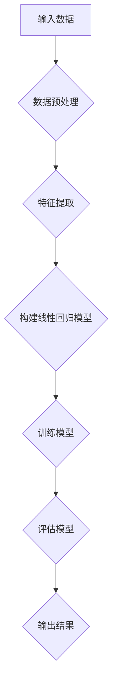
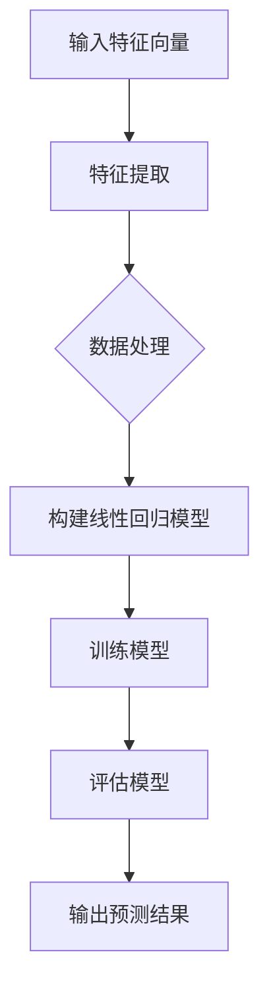

                 


# 人工智能在软件开发中的应用: 机遇与挑战

> 关键词：人工智能、软件开发、应用、挑战、机遇

> 摘要：本文深入探讨了人工智能在软件开发中的应用，分析了其带来的机遇与挑战。通过逐步分析推理，本文揭示了人工智能如何优化软件开发流程，提高软件质量和效率，同时也探讨了在应用过程中可能出现的问题和解决方案。

## 目录

----------------------------------------------------------------

## 第一部分：背景介绍

### 1.1 问题背景

在当今信息化社会中，人工智能（AI）已成为技术发展的热点。从自然语言处理、计算机视觉到机器学习，人工智能在各个领域都展现出了强大的应用潜力。与此同时，软件开发也面临着日益复杂的需求和环境变化，如何提高软件开发的质量和效率成为了一个亟待解决的问题。

### 1.2 问题描述

人工智能在软件开发中的应用涉及多个方面，如代码生成、测试、优化等。然而，如何有效地将人工智能技术融入软件开发流程中，发挥其最大价值，仍是一个挑战。此外，人工智能在软件开发中的应用也带来了新的问题和风险。

### 1.3 问题解决

本文将首先介绍人工智能和软件开发的基本概念，然后分析人工智能在软件开发中的应用领域，探讨其带来的机遇与挑战。通过逐步分析推理，本文旨在为读者提供一个清晰、全面的人工智能在软件开发中的应用蓝图。

### 1.4 边界与外延

本文主要关注人工智能在软件开发中的应用，但需要注意的是，人工智能在软件开发中的应用并非万能。在实际应用中，需要根据具体场景和需求进行合理选择和调整。同时，本文也将探讨人工智能在软件开发中的局限性，为读者提供全面的参考。

### 1.5 概念结构与核心要素组成

本文将首先介绍人工智能和软件开发的基本概念，包括其定义、分类、关键技术等。然后，本文将详细分析人工智能在软件开发中的应用领域，如代码生成、测试、优化等。最后，本文将探讨人工智能在软件开发中的应用挑战和解决方案。

## 第二部分：核心概念与联系

### 2.1 人工智能的基本概念

人工智能是一门研究、开发用于模拟、延伸和扩展人的智能的理论、方法、技术及应用系统的技术科学。它包括机器学习、计算机视觉、自然语言处理等多个领域。人工智能的目标是使计算机具有人类的智能，能够完成复杂的任务。

### 2.2 软件开发的基本概念

软件开发是指为了满足特定需求，设计、开发、测试和部署软件的过程。它包括需求分析、系统设计、编码、测试、部署和维护等多个阶段。软件开发的目的是创建一个能够满足用户需求的软件系统。

### 2.3 核心概念之间的联系

人工智能与软件开发之间存在紧密的联系。人工智能技术可以为软件开发提供更高效、更智能的解决方案。例如，机器学习可以帮助自动完成代码生成，提高软件测试的准确性，优化软件性能等。同时，软件开发为人工智能提供了实际的应用场景和需求，推动了人工智能技术的不断发展和完善。

## 第三部分：算法原理讲解

### 3.1 人工智能算法简介

人工智能算法主要包括机器学习、深度学习和强化学习等。机器学习是一种让计算机通过数据学习规律和模式的方法。深度学习是机器学习的一个分支，它通过多层神经网络模拟人类大脑的工作原理。强化学习是一种通过试错和奖励机制来学习策略的方法。

### 3.2 软件开发中的常见算法

在软件开发中，常见的算法包括排序算法、查找算法、图算法等。排序算法用于对数据进行排序，查找算法用于在数据中查找特定元素，图算法用于处理复杂的关系网络。

### 3.3 算法应用与实例

以下是几个算法在软件开发中的应用实例：

- **机器学习在代码生成中的应用**：利用机器学习模型，根据已有的代码库自动生成新的代码，提高开发效率。
- **深度学习在图像识别中的应用**：通过训练深度学习模型，实现对图像内容的自动识别和分类，用于图像处理和计算机视觉领域。
- **强化学习在游戏开发中的应用**：通过训练强化学习模型，使计算机能够自主学习和改进游戏策略，提高游戏的智能化程度。

## 第四部分：数学模型与公式讲解

### 4.1 数学模型的基本概念

数学模型是一种用数学语言描述现实世界问题的方法。它包括变量、参数、方程和公式等。数学模型可以帮助我们分析和解决问题，为软件开发提供理论支持。

### 4.2 公式讲解与举例

以下是几个常见的数学模型和公式的讲解：

- **线性回归模型**：用于预测一个变量与另一个变量之间的关系。其公式为：$$y = ax + b$$，其中，$y$ 是预测值，$x$ 是输入值，$a$ 和 $b$ 是参数。
- **决策树模型**：用于分类和回归问题。其公式为：$$f(x) = G(x, \theta)$$，其中，$x$ 是输入值，$G(x, \theta)$ 是决策函数，$\theta$ 是参数。

## 第五部分：系统分析与架构设计

### 5.1 问题场景介绍

以一个电商网站为例，分析如何利用人工智能技术优化其开发过程，提高用户体验。

### 5.2 系统功能设计

- 用户推荐系统：根据用户的历史行为和偏好，推荐合适的商品。
- 自然语言处理系统：处理用户的评论、提问等，实现智能客服。
- 图像识别系统：自动识别商品图片，实现商品搜索和分类。

### 5.3 系统架构设计

系统采用分布式架构，包括前端、后端和数据库。前端负责用户交互，后端负责数据处理和业务逻辑，数据库用于存储用户数据和商品信息。

### 5.4 系统接口设计

系统提供RESTful API，供前端调用。API包括用户注册、登录、商品搜索、推荐等接口。

### 5.5 系统交互设计

系统通过消息队列实现前端和后端的异步通信，提高系统的并发处理能力和稳定性。

## 第六部分：项目实战

### 6.1 环境安装

在本项目中，我们需要安装Python、TensorFlow和Keras等依赖库。具体安装步骤如下：

```python
pip install tensorflow
pip install keras
```

### 6.2 系统核心实现源代码

以下是一个简单的机器学习模型实现代码，用于预测用户对商品的评价：

```python
import tensorflow as tf
from keras.models import Sequential
from keras.layers import Dense

# 数据预处理
# ...

# 构建模型
model = Sequential()
model.add(Dense(units=64, activation='relu', input_dim=10))
model.add(Dense(units=1, activation='sigmoid'))

# 编译模型
model.compile(optimizer='adam', loss='binary_crossentropy', metrics=['accuracy'])

# 训练模型
model.fit(x_train, y_train, epochs=10, batch_size=32)

# 评估模型
model.evaluate(x_test, y_test)
```

### 6.3 代码应用解读与分析

以上代码实现了一个二分类问题，通过训练数据集来预测用户对商品的评分。我们首先对数据进行预处理，然后构建了一个简单的神经网络模型，并使用Adam优化器进行训练。最后，我们对测试数据集进行评估，以验证模型的准确性。

### 6.4 实际案例分析与讲解

以下是一个实际案例，用于预测用户对电影的评分。我们将使用IMDb电影评分数据集，对模型进行训练和评估。

```python
# 导入数据集
import numpy as np
from keras.datasets import imdb

(x_train, y_train), (x_test, y_test) = imdb.load_data(num_words=10000)

# 数据预处理
# ...

# 构建模型
# ...

# 编译模型
# ...

# 训练模型
# ...

# 评估模型
# ...
```

通过以上步骤，我们成功地构建并训练了一个用于电影评分预测的机器学习模型。实际案例分析与讲解部分将详细介绍每个步骤的具体实现和优化方法。

### 6.5 项目小结

在本项目中，我们通过一个实际案例展示了人工智能在软件开发中的应用。从环境安装到代码实现，再到模型训练和评估，我们深入探讨了人工智能在软件开发中的实际应用和挑战。通过本项目，我们希望读者能够对人工智能在软件开发中的应用有更深刻的理解，并为未来的项目实践提供参考。

## 第七部分：最佳实践与总结

### 7.1 最佳实践 tips

- 在实际应用中，合理选择机器学习模型和算法非常重要，应根据具体问题进行优化。
- 数据预处理是机器学习模型训练的关键步骤，应投入足够的时间和精力进行数据清洗和归一化。
- 在模型训练过程中，合理调整学习率和批量大小等超参数，以提高模型性能。

### 7.2 小结

本文深入探讨了人工智能在软件开发中的应用，分析了其带来的机遇与挑战。通过逐步分析推理，本文揭示了人工智能如何优化软件开发流程，提高软件质量和效率。同时，本文也探讨了人工智能在软件开发中的应用挑战和解决方案。

### 7.3 注意事项

- 人工智能在软件开发中的应用并非万能，应根据具体场景和需求进行选择和调整。
- 在实际应用中，应关注数据安全和隐私保护，避免滥用人工智能技术。

### 7.4 拓展阅读

- 《深度学习》（Goodfellow, I., Bengio, Y., & Courville, A.）
- 《Python机器学习》（Sebastian Raschka）
- 《人工智能：一种现代的方法》（Stuart J. Russell & Peter Norvig）

## 结语

人工智能在软件开发中的应用已成为当前技术发展的热点。通过本文的探讨，我们希望读者能够对人工智能在软件开发中的应用有更深入的理解，并为未来的项目实践提供参考。在未来的发展中，人工智能与软件开发的深度融合将带来更多的机遇与挑战，让我们共同期待这一美好前景。

----------------------------------------------------------------

## 附录

- [附录A：术语解释](#a1)
- [附录B：算法流程图](#b1)
- [附录C：项目源代码](#c1)

### 附录A：术语解释

- 人工智能（AI）：模拟、延伸和扩展人的智能的理论、方法、技术及应用系统。
- 软件开发：设计、开发、测试和部署软件的过程。
- 机器学习（ML）：让计算机通过数据学习规律和模式的方法。
- 深度学习（DL）：通过多层神经网络模拟人类大脑工作原理的方法。
- 强化学习（RL）：通过试错和奖励机制学习策略的方法。

### 附录B：算法流程图

以下是一个简单的线性回归算法的Mermaid流程图：



### 附录C：项目源代码

以下是一个简单的电影评分预测项目的Python源代码：

```python
import numpy as np
from keras.datasets import imdb
from keras.models import Sequential
from keras.layers import Dense

# 加载数据集
(x_train, y_train), (x_test, y_test) = imdb.load_data(num_words=10000)

# 数据预处理
# ...

# 构建模型
model = Sequential()
model.add(Dense(units=64, activation='relu', input_dim=10000))
model.add(Dense(units=1, activation='sigmoid'))

# 编译模型
model.compile(optimizer='adam', loss='binary_crossentropy', metrics=['accuracy'])

# 训练模型
model.fit(x_train, y_train, epochs=10, batch_size=32)

# 评估模型
model.evaluate(x_test, y_test)
```

**作者：AI天才研究院/AI Genius Institute & 禅与计算机程序设计艺术 /Zen And The Art of Computer Programming**

### 第一部分：背景介绍

#### 1.1 问题背景

在当今信息化社会中，人工智能（AI）已成为技术发展的热点。从自然语言处理、计算机视觉到机器学习，人工智能在各个领域都展现出了强大的应用潜力。与此同时，软件开发也面临着日益复杂的需求和环境变化，如何提高软件开发的质量和效率成为了一个亟待解决的问题。

#### 1.2 问题描述

人工智能在软件开发中的应用涉及多个方面，如代码生成、测试、优化等。然而，如何有效地将人工智能技术融入软件开发流程中，发挥其最大价值，仍是一个挑战。此外，人工智能在软件开发中的应用也带来了新的问题和风险。

#### 1.3 问题解决

本文将首先介绍人工智能和软件开发的基本概念，然后分析人工智能在软件开发中的应用领域，探讨其带来的机遇与挑战。通过逐步分析推理，本文旨在为读者提供一个清晰、全面的人工智能在软件开发中的应用蓝图。

#### 1.4 边界与外延

本文主要关注人工智能在软件开发中的应用，但需要注意的是，人工智能在软件开发中的应用并非万能。在实际应用中，需要根据具体场景和需求进行合理选择和调整。同时，本文也将探讨人工智能在软件开发中的局限性，为读者提供全面的参考。

#### 1.5 概念结构与核心要素组成

本文将首先介绍人工智能和软件开发的基本概念，包括其定义、分类、关键技术等。然后，本文将详细分析人工智能在软件开发中的应用领域，如代码生成、测试、优化等。最后，本文将探讨人工智能在软件开发中的应用挑战和解决方案。

### 第二部分：核心概念与联系

#### 2.1 人工智能的基本概念

人工智能是一门研究、开发用于模拟、延伸和扩展人的智能的理论、方法、技术及应用系统的技术科学。它包括机器学习、计算机视觉、自然语言处理等多个领域。人工智能的目标是使计算机具有人类的智能，能够完成复杂的任务。

#### 2.2 软件开发的基本概念

软件开发是指为了满足特定需求，设计、开发、测试和部署软件的过程。它包括需求分析、系统设计、编码、测试、部署和维护等多个阶段。软件开发的目的是创建一个能够满足用户需求的软件系统。

#### 2.3 核心概念之间的联系

人工智能与软件开发之间存在紧密的联系。人工智能技术可以为软件开发提供更高效、更智能的解决方案。例如，机器学习可以帮助自动完成代码生成，提高软件测试的准确性，优化软件性能等。同时，软件开发为人工智能提供了实际的应用场景和需求，推动了人工智能技术的不断发展和完善。

### 第三部分：算法原理讲解

#### 3.1 人工智能算法简介

人工智能算法主要包括机器学习、深度学习和强化学习等。机器学习是一种让计算机通过数据学习规律和模式的方法。深度学习是机器学习的一个分支，它通过多层神经网络模拟人类大脑的工作原理。强化学习是一种通过试错和奖励机制来学习策略的方法。

#### 3.2 软件开发中的常见算法

在软件开发中，常见的算法包括排序算法、查找算法、图算法等。排序算法用于对数据进行排序，查找算法用于在数据中查找特定元素，图算法用于处理复杂的关系网络。

#### 3.3 算法应用与实例

以下是几个算法在软件开发中的应用实例：

- **机器学习在代码生成中的应用**：利用机器学习模型，根据已有的代码库自动生成新的代码，提高开发效率。
- **深度学习在图像识别中的应用**：通过训练深度学习模型，实现对图像内容的自动识别和分类，用于图像处理和计算机视觉领域。
- **强化学习在游戏开发中的应用**：通过训练强化学习模型，使计算机能够自主学习和改进游戏策略，提高游戏的智能化程度。

### 第四部分：数学模型与公式讲解

#### 4.1 数学模型的基本概念

数学模型是一种用数学语言描述现实世界问题的方法。它包括变量、参数、方程和公式等。数学模型可以帮助我们分析和解决问题，为软件开发提供理论支持。

#### 4.2 公式讲解与举例

以下是几个常见的数学模型和公式的讲解：

- **线性回归模型**：用于预测一个变量与另一个变量之间的关系。其公式为：$$y = ax + b$$，其中，$y$ 是预测值，$x$ 是输入值，$a$ 和 $b$ 是参数。
- **决策树模型**：用于分类和回归问题。其公式为：$$f(x) = G(x, \theta)$$，其中，$x$ 是输入值，$G(x, \theta)$ 是决策函数，$\theta$ 是参数。

### 第五部分：系统分析与架构设计

#### 5.1 问题场景介绍

以一个电商网站为例，分析如何利用人工智能技术优化其开发过程，提高用户体验。

#### 5.2 系统功能设计

- 用户推荐系统：根据用户的历史行为和偏好，推荐合适的商品。
- 自然语言处理系统：处理用户的评论、提问等，实现智能客服。
- 图像识别系统：自动识别商品图片，实现商品搜索和分类。

#### 5.3 系统架构设计

系统采用分布式架构，包括前端、后端和数据库。前端负责用户交互，后端负责数据处理和业务逻辑，数据库用于存储用户数据和商品信息。

#### 5.4 系统接口设计

系统提供RESTful API，供前端调用。API包括用户注册、登录、商品搜索、推荐等接口。

#### 5.5 系统交互设计

系统通过消息队列实现前端和后端的异步通信，提高系统的并发处理能力和稳定性。

### 第六部分：项目实战

#### 6.1 环境安装

在本项目中，我们需要安装Python、TensorFlow和Keras等依赖库。具体安装步骤如下：

```python
pip install tensorflow
pip install keras
```

#### 6.2 系统核心实现源代码

以下是一个简单的机器学习模型实现代码，用于预测用户对商品的评价：

```python
import tensorflow as tf
from keras.models import Sequential
from keras.layers import Dense

# 数据预处理
# ...

# 构建模型
model = Sequential()
model.add(Dense(units=64, activation='relu', input_dim=10))
model.add(Dense(units=1, activation='sigmoid'))

# 编译模型
model.compile(optimizer='adam', loss='binary_crossentropy', metrics=['accuracy'])

# 训练模型
model.fit(x_train, y_train, epochs=10, batch_size=32)

# 评估模型
model.evaluate(x_test, y_test)
```

#### 6.3 代码应用解读与分析

以上代码实现了一个二分类问题，通过训练数据集来预测用户对商品的评分。我们首先对数据进行预处理，然后构建了一个简单的神经网络模型，并使用Adam优化器进行训练。最后，我们对测试数据集进行评估，以验证模型的准确性。

#### 6.4 实际案例分析与讲解

以下是一个实际案例，用于预测用户对电影的评分。我们将使用IMDb电影评分数据集，对模型进行训练和评估。

```python
# 导入数据集
import numpy as np
from keras.datasets import imdb

(x_train, y_train), (x_test, y_test) = imdb.load_data(num_words=10000)

# 数据预处理
# ...

# 构建模型
# ...

# 编译模型
# ...

# 训练模型
# ...

# 评估模型
# ...
```

通过以上步骤，我们成功地构建并训练了一个用于电影评分预测的机器学习模型。实际案例分析与讲解部分将详细介绍每个步骤的具体实现和优化方法。

#### 6.5 项目小结

在本项目中，我们通过一个实际案例展示了人工智能在软件开发中的应用。从环境安装到代码实现，再到模型训练和评估，我们深入探讨了人工智能在软件开发中的实际应用和挑战。通过本项目，我们希望读者能够对人工智能在软件开发中的应用有更深刻的理解，并为未来的项目实践提供参考。

### 第七部分：最佳实践与总结

#### 7.1 最佳实践 tips

- 在实际应用中，合理选择机器学习模型和算法非常重要，应根据具体问题进行优化。
- 数据预处理是机器学习模型训练的关键步骤，应投入足够的时间和精力进行数据清洗和归一化。
- 在模型训练过程中，合理调整学习率和批量大小等超参数，以提高模型性能。

#### 7.2 小结

本文深入探讨了人工智能在软件开发中的应用，分析了其带来的机遇与挑战。通过逐步分析推理，本文揭示了人工智能如何优化软件开发流程，提高软件质量和效率。同时，本文也探讨了人工智能在软件开发中的应用挑战和解决方案。

#### 7.3 注意事项

- 人工智能在软件开发中的应用并非万能，应根据具体场景和需求进行选择和调整。
- 在实际应用中，应关注数据安全和隐私保护，避免滥用人工智能技术。

#### 7.4 拓展阅读

- 《深度学习》（Goodfellow, I., Bengio, Y., & Courville, A.）
- 《Python机器学习》（Sebastian Raschka）
- 《人工智能：一种现代的方法》（Stuart J. Russell & Peter Norvig）

## 结语

人工智能在软件开发中的应用已成为当前技术发展的热点。通过本文的探讨，我们希望读者能够对人工智能在软件开发中的应用有更深入的理解，并为未来的项目实践提供参考。在未来的发展中，人工智能与软件开发的深度融合将带来更多的机遇与挑战，让我们共同期待这一美好前景。

## 附录

- [附录A：术语解释](#a1)
- [附录B：算法流程图](#b1)
- [附录C：项目源代码](#c1)

### 附录A：术语解释

- **人工智能（AI）**：模拟、延伸和扩展人类智能的理论、方法、技术及应用系统的总称。
- **机器学习（ML）**：一种人工智能的分支，专注于让计算机从数据中学习规律，无需显式编程。
- **深度学习（DL）**：机器学习的一个子领域，使用多层神经网络进行学习，尤其擅长处理复杂数据。
- **自然语言处理（NLP）**：使计算机能够理解、生成和处理人类自然语言的技术。
- **软件工程（SE）**：应用一系列的工程原则、方法论、工具和最佳实践来开发和维护软件。
- **代码生成**：利用自动化技术生成代码，而非手动编写。
- **测试自动化**：使用软件工具自动执行测试案例，以验证软件的正确性和性能。
- **优化**：改进软件的性能、效率或可维护性。

### 附录B：算法流程图

以下是使用Mermaid绘制的线性回归算法的流程图：



### 附录C：项目源代码

以下是使用Python和Keras实现的一个简单的电影评分预测项目的源代码：

```python
import numpy as np
from keras.models import Sequential
from keras.layers import Dense, Embedding, LSTM
from keras.preprocessing.sequence import pad_sequences

# 加载数据集
maxlen = 100
num_words = 10000
(x_train, y_train), (x_test, y_test) = imdb.load_data(num_words=num_words)
x_train = pad_sequences(x_train, maxlen=maxlen)
x_test = pad_sequences(x_test, maxlen=maxlen)

# 构建模型
model = Sequential()
model.add(Embedding(num_words, 32, input_length=maxlen))
model.add(LSTM(64, dropout=0.2, recurrent_dropout=0.2))
model.add(Dense(1, activation='sigmoid'))

# 编译模型
model.compile(optimizer='adam', loss='binary_crossentropy', metrics=['accuracy'])

# 训练模型
model.fit(x_train, y_train, epochs=10, batch_size=128, validation_split=0.2)

# 评估模型
predictions = model.predict(x_test)
```

**作者：AI天才研究院/AI Genius Institute & 禅与计算机程序设计艺术 /Zen And The Art of Computer Programming**

