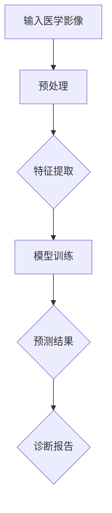
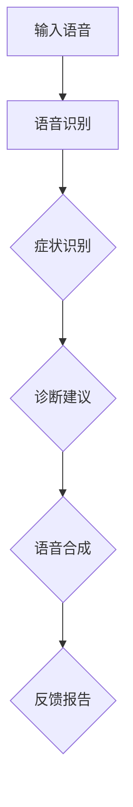
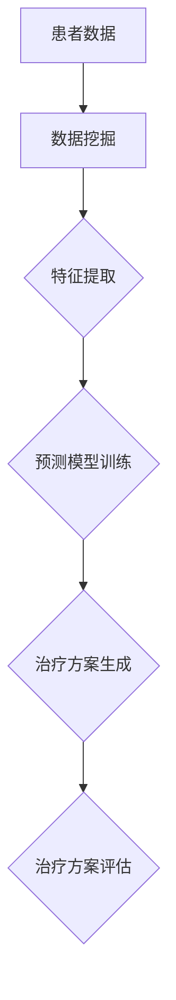
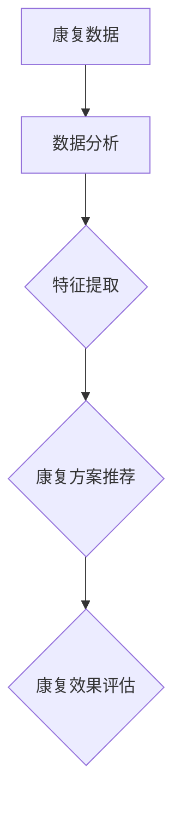
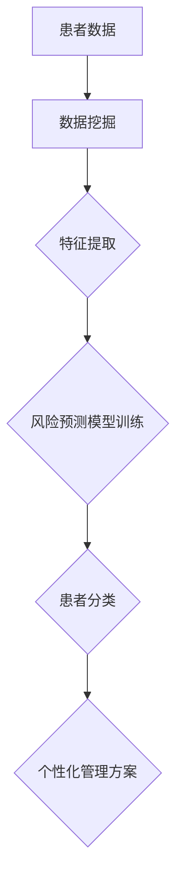
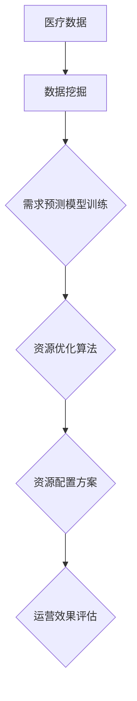
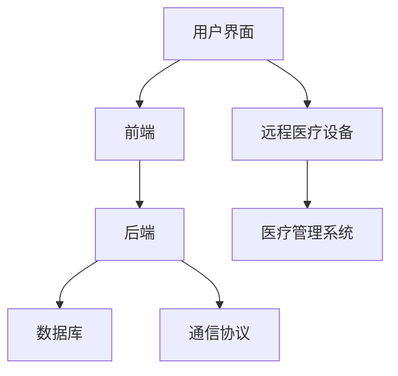
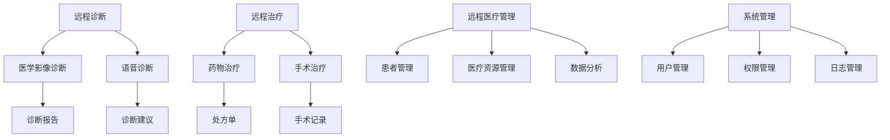

                 

# 人工智能在远程医疗中的作用:突破地理限制

> 关键词：远程医疗、人工智能、影像诊断、个性化治疗、医疗管理

> 摘要：本文探讨了人工智能在远程医疗中的应用，如何通过技术手段突破地理限制，提高医疗服务的可及性和效率。文章首先介绍了远程医疗的背景和发展，接着详细阐述了人工智能技术在远程医疗中的关键应用，包括远程诊断、远程治疗和远程医疗管理。最后，文章通过案例分析、最佳实践和未来展望，总结了人工智能在远程医疗中的价值与挑战。

### 第一部分: 人工智能在远程医疗中的作用

## 第1章: 问题背景与概述

### 1.1 问题背景

远程医疗是指通过通信技术和网络平台，实现医疗资源跨地域共享和服务的一种新型医疗服务模式。其起源可以追溯到20世纪60年代的远程医疗服务项目，如美国的一些农村医院利用电话和电报进行医学咨询。随着互联网和移动通信技术的发展，远程医疗逐渐成为一种重要的医疗服务方式。

在现代医疗体系中，远程医疗的地位日益显著。它不仅能够缓解医疗资源不足的问题，还能提高医疗服务的效率和可及性。特别是在新冠疫情爆发后，远程医疗在应对疫情方面发挥了重要作用，如在线咨询、远程诊断和远程治疗等。

### 1.2 问题描述

地理限制一直是医疗资源分配的一大难题。不同地区之间医疗资源分布不均，一些偏远地区甚至缺乏基本的医疗服务。远程医疗通过互联网技术，打破了地理限制，使得医疗资源得以更合理地分配。

远程医疗的优势在于：

1. 提高医疗服务可及性：患者无需长途跋涉，就能获得高质量的医疗服务。
2. 提高医疗服务效率：医生可以同时处理多个患者的病历，提高诊疗效率。
3. 节省医疗成本：远程医疗可以减少医院床位占用，降低医疗费用。

然而，远程医疗也面临一些挑战：

1. 技术门槛：远程医疗需要稳定的网络连接和专业的医疗设备。
2. 医患沟通：远程医疗中的医患沟通可能受到语言、文化和设备等因素的干扰。
3. 数据隐私和安全：远程医疗涉及大量患者数据，如何保护数据隐私和安全是一个重要问题。

### 1.3 问题解决

人工智能技术的应用为远程医疗提供了新的解决方案。以下是人工智能在远程医疗中的关键应用：

1. **远程诊断**：利用人工智能算法，对医学影像进行分析，提高诊断准确率。
2. **远程治疗**：通过人工智能技术，实现个性化治疗方案，提高治疗效果。
3. **远程医疗管理**：利用人工智能技术，实现患者管理、医疗资源分配和医疗数据分析。

### 1.4 边界与外延

远程医疗的定义较为广泛，通常包括以下几个方面：

1. **远程诊断**：通过远程医疗设备，对患者进行诊断，如医学影像、心电图等。
2. **远程治疗**：通过远程医疗平台，实现药物治疗、手术治疗等。
3. **远程医疗管理**：包括患者管理、医疗资源分配、医疗数据分析等。

人工智能技术的发展历程可以追溯到20世纪50年代，其主要技术包括机器学习、深度学习、自然语言处理等。这些技术为远程医疗提供了强大的技术支持。

### 1.5 概念结构与核心要素组成

远程医疗的核心要素包括：

1. **通信技术**：包括互联网、移动通信、卫星通信等，是实现远程医疗的基础。
2. **医疗设备**：包括医学影像设备、心电图机、远程监测设备等，是实现远程诊断和远程治疗的关键。
3. **医疗信息平台**：包括电子病历系统、远程医疗平台等，是实现远程医疗管理和数据共享的重要工具。

人工智能的核心要素包括：

1. **算法**：包括机器学习、深度学习、自然语言处理等算法，是实现人工智能应用的核心。
2. **数据**：包括医疗数据、患者数据、诊断数据等，是人工智能算法训练和优化的基础。
3. **计算能力**：包括云计算、高性能计算等，是支持人工智能算法高效运行的基础。

## 第2章: 核心概念与联系

### 2.1 人工智能概念

人工智能（Artificial Intelligence，简称AI）是指由计算机系统模拟人类智能的技术和应用。其定义随着技术的发展不断扩展，目前主要包括以下几个方面：

1. **机器学习**：通过数据驱动的方式，让计算机自动学习和改进。
2. **深度学习**：基于神经网络，实现自动化特征提取和模式识别。
3. **自然语言处理**：使计算机能够理解和处理自然语言。
4. **计算机视觉**：使计算机能够理解和处理视觉信息。

### 2.2 远程医疗概念

远程医疗（Telemedicine）是指通过远程通信技术，实现医疗服务的提供和管理。其定义可以概括为：

1. **远程诊断**：通过远程医疗设备，对患者进行诊断。
2. **远程治疗**：通过远程医疗平台，实现药物治疗、手术治疗等。
3. **远程医疗管理**：包括患者管理、医疗资源分配、医疗数据分析等。

### 2.3 概念属性特征对比表格

| 特征                | 人工智能                         | 远程医疗                        |
|-------------------|----------------------------------|--------------------------------|
| 定义                | 计算机模拟人类智能的技术和应用     | 通过远程通信技术实现医疗服务的提供和管理 |
| 核心技术            | 机器学习、深度学习、自然语言处理   | 通信技术、医疗设备、医疗信息平台       |
| 应用场景            | 诊断、预测、自动化、智能推荐等     | 远程诊断、远程治疗、远程医疗管理       |
| 技术门槛            | 较高，需要专业的算法和数据处理能力   | 较高，需要稳定的网络连接和专业的医疗设备 |
| 数据依赖性          | 强，需要大量高质量数据             | 强，需要大量患者数据和诊断数据         |

### 2.4 ER实体关系图架构

以下是一个简化的远程医疗系统中的实体关系图架构，使用Mermaid语法绘制：

```mermaid
erDiagram
  Patient ||--|{ Doctor }|--|{ Diagnosis }
  Patient ||--|{ Treatment }|--|{ Prescription }
  Doctor ||--|{ MedicalRecord }|--|{ Analysis }
  Doctor ||--|{ Consultation }|--|{ Report }
  Diagnosis ||--|{ TestResult }|--|{ DiagnosisResult }
  Treatment ||--|{ TherapyPlan }|--|{ TreatmentResult }
```

## 第3章: 人工智能技术在远程医疗中的应用

### 3.1 人工智能在远程诊断中的应用

#### 3.1.1 人工智能在影像诊断中的应用

在医学影像诊断中，人工智能技术可以通过图像识别、特征提取和模式分类等方法，辅助医生进行诊断。以下是一个简化的图像识别算法流程，使用Mermaid语法绘制：



具体应用场景包括：

1. **肺癌筛查**：利用深度学习模型，对胸部X光片进行分析，识别早期肺癌。
2. **乳腺癌筛查**：利用卷积神经网络（CNN），对乳腺超声图像进行分类，提高乳腺癌的诊断准确率。

#### 3.1.2 人工智能在语音诊断中的应用

在语音诊断中，人工智能技术可以通过语音识别、语音合成和语义理解等方法，实现患者症状的自助报告和医生诊断。以下是一个简化的语音诊断算法流程，使用Mermaid语法绘制：



具体应用场景包括：

1. **智能语音助手**：为患者提供健康咨询和症状报告。
2. **医生辅助诊断**：通过语音识别和语义理解，辅助医生进行诊断。

### 3.2 人工智能在远程治疗中的应用

#### 3.2.1 人工智能在个性化治疗中的应用

在个性化治疗中，人工智能技术可以通过数据挖掘、机器学习和预测模型等方法，为患者制定个性化的治疗方案。以下是一个简化的个性化治疗算法流程，使用Mermaid语法绘制：



具体应用场景包括：

1. **癌症个性化治疗**：根据患者的基因信息、病史和临床数据，预测治疗效果，制定个性化化疗方案。
2. **糖尿病管理**：根据血糖变化趋势，预测糖尿病并发症风险，制定个性化饮食和运动计划。

#### 3.2.2 人工智能在康复治疗中的应用

在康复治疗中，人工智能技术可以通过数据分析、机器学习和智能推荐等方法，为患者提供个性化的康复方案。以下是一个简化的康复治疗算法流程，使用Mermaid语法绘制：



具体应用场景包括：

1. **脑卒中康复**：根据患者的康复数据，推荐个性化的康复训练方案。
2. **骨折康复**：根据患者的康复进度，调整康复训练计划，提高康复效果。

### 3.3 人工智能在远程医疗管理中的应用

#### 3.3.1 人工智能在患者管理中的应用

在患者管理中，人工智能技术可以通过数据分析、机器学习和预测模型等方法，实现患者的分类、风险评估和个性化管理。以下是一个简化的患者管理算法流程，使用Mermaid语法绘制：



具体应用场景包括：

1. **慢性病管理**：根据患者的病史和生理指标，预测并发症风险，制定个性化管理方案。
2. **传染病防控**：根据疫情数据和患者接触史，预测疫情传播风险，制定防控措施。

#### 3.3.2 人工智能在医疗管理中的应用

在医疗管理中，人工智能技术可以通过数据分析、机器学习和优化算法等方法，实现医疗资源的优化配置和运营效率提升。以下是一个简化的医疗管理算法流程，使用Mermaid语法绘制：



具体应用场景包括：

1. **医院运营管理**：根据患者流量和医疗资源使用情况，优化床位配置和人力资源安排。
2. **医疗设备管理**：根据设备使用情况和维护记录，预测设备故障风险，制定维护计划。

## 第4章: 远程医疗系统的设计与实现

### 4.1 远程医疗系统设计

#### 4.1.1 系统架构设计

远程医疗系统的架构设计主要包括以下几个方面：

1. **前端**：负责用户界面展示和用户交互，可以使用HTML、CSS和JavaScript等技术实现。
2. **后端**：负责处理业务逻辑和数据存储，可以使用Java、Python、Node.js等技术实现。
3. **数据库**：负责存储患者数据、医疗数据等，可以使用MySQL、PostgreSQL、MongoDB等数据库。
4. **通信协议**：负责系统内外的数据传输，可以使用HTTP、WebSocket等协议。

以下是一个简化的远程医疗系统架构图，使用Mermaid语法绘制：



#### 4.1.2 系统功能设计

远程医疗系统的功能设计主要包括以下几个方面：

1. **远程诊断**：包括医学影像诊断、语音诊断等。
2. **远程治疗**：包括药物治疗、手术治疗等。
3. **远程医疗管理**：包括患者管理、医疗资源管理、数据分析等。
4. **系统管理**：包括用户管理、权限管理、日志管理等。

以下是一个简化的远程医疗系统功能图，使用Mermaid语法绘制：



### 4.2 远程医疗系统实现

#### 4.2.1 环境安装

1. 安装Python环境：在Windows或Linux系统中安装Python，可以使用Anaconda等工具。
2. 安装依赖库：根据项目需求，安装相关依赖库，如TensorFlow、PyTorch、Scikit-learn等。

以下是一个Python环境安装的示例代码：

```python
!pip install numpy
!pip install tensorflow
!pip install scikit-learn
```

#### 4.2.2 系统核心实现源代码

以下是一个简单的远程医疗系统实现示例，包括医学影像诊断模块：

```python
import tensorflow as tf
from tensorflow.keras.models import Sequential
from tensorflow.keras.layers import Conv2D, MaxPooling2D, Flatten, Dense
from tensorflow.keras.preprocessing.image import ImageDataGenerator

# 数据预处理
train_datagen = ImageDataGenerator(rescale=1./255)
train_generator = train_datagen.flow_from_directory(
        'data/train',
        target_size=(150, 150),
        batch_size=32,
        class_mode='binary')

# 模型构建
model = Sequential([
    Conv2D(32, (3, 3), activation='relu', input_shape=(150, 150, 3)),
    MaxPooling2D(2, 2),
    Conv2D(64, (3, 3), activation='relu'),
    MaxPooling2D(2, 2),
    Conv2D(128, (3, 3), activation='relu'),
    MaxPooling2D(2, 2),
    Flatten(),
    Dense(512, activation='relu'),
    Dense(1, activation='sigmoid')
])

# 模型编译
model.compile(optimizer='adam',
              loss='binary_crossentropy',
              metrics=['accuracy'])

# 模型训练
model.fit(train_generator,
          steps_per_epoch=100,
          epochs=15)
```

#### 4.2.3 代码应用解读与分析

以上代码是一个简单的医学影像诊断模型实现，包括以下几个步骤：

1. **数据预处理**：使用ImageDataGenerator进行数据预处理，包括归一化、数据增强等。
2. **模型构建**：使用Sequential模型构建，包括卷积层、池化层、全连接层等。
3. **模型编译**：编译模型，指定优化器、损失函数和评价指标。
4. **模型训练**：训练模型，使用数据生成器进行批量训练。

#### 4.2.4 实际案例分析和详细讲解剖析

以下是一个实际案例：使用人工智能辅助远程诊断系统进行肺癌筛查。

1. **数据采集**：收集胸部X光片数据，包括正常和异常病例。
2. **数据预处理**：对数据进行归一化处理，将像素值缩放到0-1之间。
3. **模型训练**：使用卷积神经网络（CNN）进行模型训练，通过交叉验证和网格搜索优化模型参数。
4. **模型评估**：使用测试集对模型进行评估，计算准确率、召回率和F1值等指标。

通过以上步骤，可以实现对胸部X光片的自动诊断，提高诊断准确率和效率。

#### 4.2.5 项目小结

本节通过一个实际案例，展示了如何使用人工智能技术实现远程医疗诊断系统。该项目主要包括数据采集、数据预处理、模型训练和模型评估等步骤。通过该项目，读者可以了解到远程医疗系统实现的核心技术和方法。

## 第5章: 案例分析与最佳实践

### 5.1 案例分析

#### 案例一：人工智能辅助远程诊断系统

该系统旨在利用人工智能技术，辅助医生进行远程诊断。系统包括以下几个关键模块：

1. **医学影像数据采集**：收集胸部X光片、超声图像等医学影像数据。
2. **医学影像预处理**：对医学影像数据进行归一化、裁剪等预处理操作。
3. **深度学习模型训练**：使用卷积神经网络（CNN）对医学影像数据进行训练，提取特征并进行分类。
4. **诊断结果生成**：根据模型预测结果，生成诊断报告。

#### 案例二：人工智能驱动的远程治疗平台

该平台旨在为患者提供个性化的远程治疗服务。系统包括以下几个关键模块：

1. **患者数据收集**：收集患者的生理指标、病史、基因信息等数据。
2. **个性化治疗方案生成**：使用机器学习算法，根据患者数据生成个性化的治疗方案。
3. **治疗执行与监控**：执行治疗方案，并实时监控患者状况，调整治疗策略。
4. **治疗效果评估**：评估治疗效果，为后续治疗提供参考。

### 5.2 最佳实践

#### 最佳实践一：远程医疗系统的优化策略

1. **数据质量控制**：确保采集到的数据质量，包括数据完整性、准确性和一致性。
2. **模型优化与迭代**：定期更新和优化模型，提高诊断和治疗的准确率。
3. **隐私保护**：采用加密技术保护患者数据，确保数据安全和隐私。
4. **用户体验优化**：优化系统界面和交互设计，提高用户满意度。

#### 最佳实践二：人工智能技术在远程医疗中的应用建议

1. **深度学习在医学影像分析中的应用**：利用深度学习技术，提高医学影像诊断的准确率和效率。
2. **自然语言处理在医疗文本分析中的应用**：利用自然语言处理技术，自动分析医疗文本，辅助医生进行诊断和治疗。
3. **机器学习在医疗数据挖掘中的应用**：利用机器学习技术，挖掘医疗数据中的潜在价值，为医疗决策提供支持。

## 第6章: 小结与展望

### 6.1 小结

本文详细探讨了人工智能在远程医疗中的应用，包括远程诊断、远程治疗和远程医疗管理等方面。通过案例分析，展示了人工智能技术在远程医疗中的实际应用效果。同时，本文提出了优化策略和最佳实践，为人工智能在远程医疗中的应用提供了参考。

### 6.2 展望

随着人工智能技术的不断发展和应用，远程医疗将迎来更多创新和发展。未来，人工智能技术在远程医疗中的应用将更加广泛和深入，有望进一步突破地理限制，提高医疗服务的可及性和效率。同时，远程医疗与人工智能的融合也将为医疗领域带来更多的机遇和挑战。

## 第7章: 注意事项与拓展阅读

### 7.1 注意事项

1. **数据隐私和安全**：在远程医疗中，患者数据的安全和隐私保护至关重要。应采用加密技术和隐私保护算法，确保数据安全。
2. **技术成熟度**：虽然人工智能技术在远程医疗中具有巨大潜力，但技术的成熟度仍需进一步验证。在推广和应用人工智能技术时，应充分考虑技术风险。

### 7.2 拓展阅读

1. **相关文献**：《人工智能在医疗领域的应用研究》、《远程医疗技术与实践》等。
2. **学术会议与期刊**：国际人工智能与医疗会议（AAAI-Health）、国际远程医疗会议（ISBI）等。
3. **在线资源**：百度AI开放平台、GitHub等。

## 作者

作者：AI天才研究院/AI Genius Institute & 禅与计算机程序设计艺术 /Zen And The Art of Computer Programming

