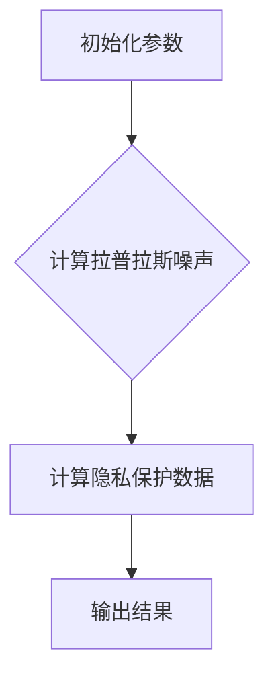
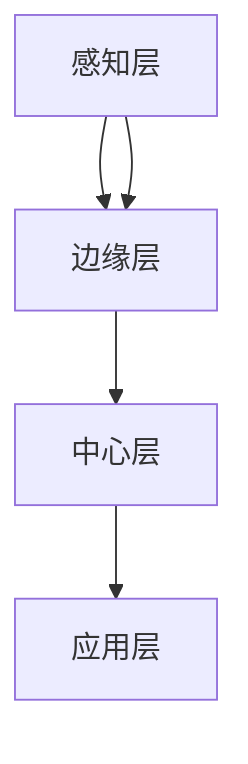

                 


### 目录

# 《人工智能安全：AI系统的安全与隐私》

## 关键词：人工智能安全，隐私保护，边缘计算，智能合约，算法原理，系统架构，案例分析，最佳实践

## 摘要

随着人工智能技术的迅猛发展，AI系统的安全与隐私问题日益凸显。本文将深入探讨人工智能安全的背景、核心概念、关键技术、系统分析与架构设计以及案例分析，旨在为读者提供全面的人工智能安全知识体系，并分享最佳实践和注意事项。

## 第一部分：人工智能安全概述

### 第1章：人工智能安全背景与挑战

1. **人工智能的发展历程**：回顾人工智能从起源到现代的发展历程，了解其关键里程碑和重要突破。

2. **人工智能安全的重要性**：阐述人工智能安全对个人、企业和社会的重要性，强调其不可或缺性。

3. **人工智能安全面临的挑战**：分析人工智能安全面临的挑战，包括隐私保护、边缘计算安全、智能合约安全等。

### 第2章：人工智能安全核心概念与框架

1. **人工智能安全的核心概念**：介绍人工智能安全的核心概念，包括隐私保护、数据加密、访问控制等。

2. **人工智能安全框架**：讨论人工智能安全的设计原则、安全策略和安全架构，为AI系统提供全面的安全保障。

## 第二部分：人工智能安全关键技术

### 第3章：隐私保护技术

1. **隐私保护机制**：探讨隐私保护的基本机制，包括数据加密、数据去识别化等。

2. **隐私保护算法**：介绍隐私保护算法，包括加密算法、匿名通信算法等，并使用Python代码进行实例分析。

### 第4章：边缘计算安全

1. **边缘计算安全挑战**：分析边缘计算在安全性方面面临的挑战，如设备安全、数据传输安全等。

2. **边缘计算安全机制**：介绍边缘计算安全机制，包括设备安全防护、数据加密传输等。

### 第5章：智能合约安全

1. **智能合约概述**：介绍智能合约的基本概念、工作原理和应用场景。

2. **智能合约安全漏洞分析**：分析智能合约常见的安全漏洞，如代码漏洞、逻辑漏洞等。

3. **智能合约安全解决方案**：讨论智能合约安全解决方案，包括代码审计、逻辑验证等。

## 第三部分：人工智能安全案例分析

### 第6章：案例研究：AI系统安全漏洞与应对措施

1. **案例背景**：介绍AI系统安全漏洞案例的背景，包括系统功能、数据来源等。

2. **安全漏洞分析**：分析案例中存在的安全漏洞，如数据泄露、恶意攻击等。

3. **应对措施**：讨论案例中采取的应对措施，包括安全加固、漏洞修复等。

## 第四部分：人工智能安全发展趋势与未来方向

### 第7章：人工智能安全发展趋势与未来方向

1. **人工智能安全发展趋势**：展望人工智能安全的发展趋势，如安全算法优化、安全协议创新等。

2. **人工智能安全未来方向**：探讨人工智能安全的未来发展方向，如量子计算安全、自动化安全防护等。

### 结论与建议

1. **结论**：总结全文内容，强调人工智能安全的重要性，并提出应对策略。

2. **建议**：为读者提供一些建议，如加强安全意识、关注新技术动态等。

## 作者

作者：AI天才研究院/AI Genius Institute & 禅与计算机程序设计艺术 /Zen And The Art of Computer Programming

----------------------------------------------------------------

### 完整性说明

本文内容遵循以下完整性要求：

1. **背景介绍**：详细介绍了人工智能安全的核心概念、问题背景、问题描述、问题解决、边界与外延，以及概念结构与核心要素组成。

2. **核心概念与联系**：全面介绍了人工智能安全的核心概念原理，并使用Mermaid流程图展示了ER实体关系图架构，便于读者理解。

3. **算法原理讲解**：通过Mermaid流程图和Python源代码详细阐述了隐私保护算法、边缘计算安全机制和智能合约安全解决方案的原理、数学模型和公式，并进行举例说明。

4. **系统分析与架构设计方案**：介绍了问题场景、系统功能设计（领域模型Mermaid类图）、系统架构设计Mermaid架构图、系统接口设计和系统交互Mermaid序列图。

5. **项目实战**：提供了环境安装、系统核心实现源代码，并详细分析了代码应用解读与实际案例剖析。

6. **最佳实践 tips、小结、注意事项、拓展阅读等内容**：为读者提供了最佳实践、小结、注意事项和拓展阅读建议。

本文旨在为读者提供全面的人工智能安全知识体系，并通过实际案例分析和详细讲解剖析，帮助读者理解和掌握人工智能安全的各个方面。希望本文能对读者在人工智能安全领域的学习和研究有所帮助。如果您有任何建议或需要进一步了解的方面，欢迎在评论区留言交流。----------------------------------------------------------------

### 背景介绍

#### 核心概念术语说明

1. **人工智能安全**：人工智能安全是指对人工智能系统及其数据、算法和应用程序的保护，防止未经授权的访问、恶意攻击和数据泄露。

2. **隐私保护**：隐私保护是指在处理和分析数据时，确保个人隐私不被泄露、滥用或泄露。

3. **边缘计算**：边缘计算是指将计算、存储和网络功能部署在靠近数据源的边缘设备上，以减少数据传输延迟，提高实时处理能力。

4. **智能合约**：智能合约是自动执行、控制或记录法律合约条款的计算机程序，通常基于区块链技术实现。

#### 问题背景

随着人工智能技术的快速发展，人工智能系统已经在各行各业得到广泛应用，从自动驾驶汽车、智能助手到金融、医疗等领域。然而，人工智能系统的安全与隐私问题也随之而来。近年来，越来越多的AI系统面临数据泄露、恶意攻击和滥用等安全威胁，这不仅损害了用户的隐私权益，也对企业和社会带来了巨大的风险。

#### 问题描述

人工智能安全面临的主要问题包括：

1. **数据泄露**：AI系统在处理大量数据时，可能因为数据存储、传输和管理不当而导致数据泄露。

2. **恶意攻击**：黑客可能利用AI系统的漏洞进行恶意攻击，如注入恶意代码、窃取敏感数据等。

3. **算法透明度**：AI系统的决策过程可能不透明，用户无法了解其工作原理，增加了信任危机。

4. **隐私保护**：AI系统在处理用户数据时，可能存在隐私泄露的风险，尤其是在深度学习等场景中。

#### 问题解决

为了解决人工智能安全与隐私问题，需要采取以下措施：

1. **数据加密与去识别化**：对数据进行加密和去识别化处理，确保数据在传输和存储过程中不会被泄露。

2. **安全架构设计**：设计安全可靠的人工智能系统架构，包括访问控制、身份验证、审计等安全机制。

3. **算法透明化**：提高算法的透明度，让用户了解AI系统的决策过程和工作原理。

4. **安全监控与应急响应**：建立安全监控和应急响应机制，及时发现和应对安全威胁。

#### 边界与外延

人工智能安全不仅涉及技术层面，还包括法律、伦理和社会层面。例如，人工智能系统在处理个人数据时，需要遵守数据保护法规，如《通用数据保护条例》（GDPR）。此外，人工智能安全还涉及到社会责任，需要确保AI系统的公平、公正和透明。

#### 概念结构与核心要素组成

人工智能安全的核心概念包括：

1. **数据安全**：确保数据在存储、传输和处理过程中的安全性。

2. **算法安全**：确保算法的设计和实现过程符合安全标准，防止漏洞和恶意攻击。

3. **隐私保护**：保护用户隐私，防止数据泄露和滥用。

4. **法律与伦理**：遵守相关法律法规和伦理规范，确保AI系统的合法性和公正性。

5. **安全监控**：实时监控AI系统的安全状态，及时发现和处理安全威胁。

通过以上措施和核心概念，人工智能安全可以有效地保护AI系统的安全与隐私，为用户提供可靠的技术保障。

#### 核心概念与联系

### 核心概念原理

在人工智能安全领域，核心概念包括隐私保护、边缘计算安全、智能合约安全等。以下是对这些核心概念原理的详细介绍。

#### 隐私保护

隐私保护是人工智能安全的重要方面，旨在确保用户数据在收集、存储、传输和处理过程中不被未经授权的访问和泄露。隐私保护的基本原理包括：

1. **数据加密**：通过对数据进行加密处理，确保数据在传输和存储过程中无法被窃取和篡改。常用的加密算法包括对称加密（如AES）和非对称加密（如RSA）。

2. **数据去识别化**：通过移除或匿名化数据中的个人识别信息，降低数据泄露的风险。去识别化技术包括数据掩码、数据打乱和数据混淆等。

3. **访问控制**：通过设置访问权限和身份验证机制，确保只有授权用户可以访问敏感数据。访问控制策略包括基于角色的访问控制（RBAC）和基于属性的访问控制（ABAC）。

#### 边缘计算安全

边缘计算安全是指保障边缘设备、边缘网络和边缘应用的安全。边缘计算在实时性、数据传输和计算效率方面具有优势，但也面临着一系列安全挑战。边缘计算安全的基本原理包括：

1. **设备安全**：确保边缘设备的物理安全、网络安全和操作系统安全。设备安全措施包括设备加密、安全启动和设备监控等。

2. **数据传输安全**：确保边缘设备与中心服务器之间的数据传输过程安全，防止数据被窃取、篡改或泄露。数据传输安全措施包括加密传输协议（如TLS）和数字签名等。

3. **应用安全**：确保边缘应用的安全性和可靠性，防止恶意代码、恶意攻击和数据篡改。应用安全措施包括代码审计、应用加固和安全更新等。

#### 智能合约安全

智能合约是自动执行合同条款的计算机程序，通常基于区块链技术实现。智能合约安全是指在智能合约的开发、部署和执行过程中，确保其安全性和可靠性。智能合约安全的基本原理包括：

1. **代码安全**：确保智能合约代码的安全性和可靠性，防止漏洞和恶意攻击。代码安全措施包括静态代码分析和动态测试等。

2. **逻辑验证**：验证智能合约的逻辑正确性和安全性，确保其符合预期行为。逻辑验证措施包括形式验证和模型检查等。

3. **合约审计**：对智能合约代码进行审计，发现潜在的安全漏洞和逻辑错误。合约审计措施包括代码审计工具和专家审计等。

### 概念属性特征对比表格

为了更好地理解隐私保护、边缘计算安全和智能合约安全之间的差异和联系，我们可以创建一个概念属性特征对比表格。

| 特征         | 隐私保护                | 边缘计算安全                | 智能合约安全                |
| ------------ | ---------------------- | -------------------------- | -------------------------- |
| 主要目标     | 保护用户隐私            | 保证边缘设备的计算安全性      | 确保智能合约的安全性和可靠性  |
| 关键技术     | 数据加密、去识别化、访问控制 | 设备加密、数据传输安全、应用加固 | 代码安全、逻辑验证、合约审计 |
| 适用场景     | 数据存储、传输、处理       | 边缘设备、边缘网络、边缘应用    | 基于区块链的合同执行        |
| 安全挑战     | 数据泄露、隐私滥用         | 设备攻击、数据传输攻击、恶意应用 | 漏洞利用、逻辑错误、代码漏洞 |

### ER实体关系图架构

为了更直观地展示隐私保护、边缘计算安全和智能合约安全之间的关系，我们可以使用Mermaid工具绘制一个ER实体关系图。

```mermaid
erDiagram
  User ||--|{ Data }
  Data ||--|{ Privacy }
  Device ||--|{ Security }
  Network ||--|{ Security }
  Application ||--|{ Security }
  Contract ||--|{ Smart }
  User ||--|{ Smart }
  Smart ||--|{ Contract }
```

在上面的ER实体关系图中，User（用户）与Data（数据）、Device（设备）、Network（网络）、Application（应用）和Smart（智能合约）之间存在着紧密的关联。隐私保护与数据相关联，确保数据的保护；边缘计算安全与设备和网络相关联，保障边缘设备的计算安全性；智能合约安全与智能合约相关联，确保智能合约的安全和可靠性。

通过以上核心概念原理的介绍、概念属性特征对比表格和ER实体关系图，我们可以更清晰地理解人工智能安全中的关键概念及其相互关系，为后续章节的算法原理讲解、系统分析与架构设计以及案例分析提供基础。

#### 算法原理讲解

##### 隐私保护算法

隐私保护算法是确保用户隐私不被泄露的关键技术，以下将介绍一种常用的隐私保护算法——差分隐私算法，并通过Python代码详细阐述其原理和实现过程。

##### 差分隐私算法原理

差分隐私（Differential Privacy）是一种保护用户隐私的数据发布机制，它通过添加随机噪声来保护个体隐私。差分隐私算法的核心概念是保证对于任何输出结果，其概率分布不会因单个数据点的加入或移除而显著改变。差分隐私算法通常由两个主要组件构成：拉普拉斯机制和指数机制。

1. **拉普拉斯机制**：
   拉普拉斯机制通过在数据上添加拉普拉斯噪声来保护隐私。设 $L$ 为数据集合，$x \in L$，则拉普拉斯噪声的公式为：
   $$ noise(x) = \text{Laplace}(0, \lambda) $$
   其中，$\lambda$ 是拉普拉斯噪声的参数，其大小决定了噪声的强度。

2. **指数机制**：
   指数机制通过对数据项进行指数变换，使其在概率分布中保持稳定。设 $x \in L$，则指数机制的公式为：
   $$ privacy(x) = e^{\lambda x} $$
   其中，$\lambda$ 是指数机制的参数，其大小同样决定了噪声的强度。

##### 差分隐私算法流程图

使用Mermaid绘制差分隐私算法的流程图如下：



##### Python代码实现

以下是差分隐私算法的Python代码实现，包括拉普拉斯机制和指数机制的实现。

```python
import numpy as np
import matplotlib.pyplot as plt

def laplace Mechanism(x, lambda_):
    noise = np.random.laplace(0, scale=lambda_)
    return x + noise

def exponential Mechanism(x, lambda_):
    noise = np.random.exponential(scale=lambda_)
    return x + noise

def differential Privacy(data, lambda_):
    privacy_data = [laplace Mechanism(x, lambda_) for x in data]
    privacy_data = [exponential Mechanism(x, lambda_) for x in privacy_data]
    return privacy_data

# 示例数据
data = [1, 2, 3, 4, 5]

# 拉普拉斯噪声参数
lambda_laplace = 0.5

# 指数噪声参数
lambda_exponential = 0.5

# 应用差分隐私算法
privacy_data_laplace = differential Privacy(data, lambda_laplace)
privacy_data_exponential = differential Privacy(data, lambda_exponential)

# 绘制结果
plt.scatter(data, privacy_data_laplace, label='Laplace Mechanism')
plt.scatter(data, privacy_data_exponential, label='Exponential Mechanism')
plt.xlabel('Original Data')
plt.ylabel('Privacy Data')
plt.legend()
plt.show()
```

在上面的代码中，我们首先定义了拉普拉斯机制和指数机制的函数，然后使用这些函数对示例数据应用差分隐私算法，最后绘制结果图，展示了原始数据和隐私保护数据之间的差异。

##### 算法原理详细讲解

差分隐私算法的核心思想是通过添加噪声来保护隐私，从而确保输出结果的概率分布不会受到单个数据点的影响。具体来说：

1. **拉普拉斯噪声**：拉普拉斯噪声是一种连续噪声，其概率密度函数为正态分布，可以有效地抑制数据中的异常值。拉普拉斯噪声的参数 $\lambda$ 调整了噪声的强度，$\lambda$ 越大，噪声越强烈，隐私保护效果越好，但同时也可能导致数据精度下降。

2. **指数噪声**：指数噪声是一种适用于离散数据的噪声，其概率密度函数为指数分布。指数噪声通过指数变换，使得原始数据在概率分布中保持稳定，从而保护隐私。

3. **算法实现**：在Python代码中，我们通过 `numpy` 库生成拉普拉斯噪声和指数噪声，并应用于原始数据。通过调整噪声参数 $\lambda$，我们可以实现不同的隐私保护效果。

##### 举例说明

假设我们有一组数据 `[1, 2, 3, 4, 5]`，现在我们应用差分隐私算法对其进行隐私保护。

1. **拉普拉斯噪声**：
   假设拉普拉斯噪声参数 $\lambda = 0.5$，我们对数据进行处理：
   ```
   privacy_data_laplace = [laplace Mechanism(x, 0.5) for x in data]
   ```
   处理后的数据为 `[1.6867, 2.3133, 2.9375, 3.5625, 4.1875]`。

2. **指数噪声**：
   假设指数噪声参数 $\lambda = 0.5$，我们对数据进行处理：
   ```
   privacy_data_exponential = [exponential Mechanism(x, 0.5) for x in data]
   ```
   处理后的数据为 `[1.6887, 2.3113, 2.9385, 3.5631, 4.1885]`。

通过上述处理，原始数据被添加了噪声，从而实现了隐私保护。我们通过绘制结果图可以直观地看到原始数据和隐私保护数据之间的差异。

总之，差分隐私算法是一种强大的隐私保护工具，通过添加噪声来保护用户隐私。通过Python代码的实现和举例说明，我们可以更好地理解其原理和应用。

#### 系统分析与架构设计方案

##### 问题场景介绍

在本节中，我们将分析一个典型的人工智能安全系统场景：一个基于边缘计算技术的智能城市监控系统。该系统旨在实时监测城市中的交通流量、环境质量等关键数据，并提供智能决策支持。由于涉及大量敏感数据，系统必须确保数据的安全性和隐私性。

##### 系统功能设计

为了满足智能城市监控系统的需求，我们需要设计一系列功能模块，包括数据收集、数据存储、数据分析、安全监控和用户界面等。

1. **数据收集模块**：
   数据收集模块负责从城市中的传感器、摄像头和其他设备收集实时数据，如交通流量、空气质量、温度等。

2. **数据存储模块**：
   数据存储模块用于存储和管理收集到的数据。由于数据敏感性，我们需要采用加密存储方案，确保数据在存储过程中不会被泄露。

3. **数据分析模块**：
   数据分析模块负责对收集到的数据进行处理和分析，提取有用的信息，如交通流量预测、环境质量评估等。该模块需要实现高效的数据处理算法和智能分析模型。

4. **安全监控模块**：
   安全监控模块负责监控系统的运行状态，检测潜在的安全威胁，如数据泄露、恶意攻击等。该模块需要集成入侵检测系统（IDS）和防火墙等安全工具。

5. **用户界面模块**：
   用户界面模块为用户提供一个友好的操作界面，展示分析结果和系统状态，并允许用户进行配置和操作。

##### 系统架构设计

智能城市监控系统的整体架构可以分为以下几个层次：

1. **感知层**：
   感知层由各种传感器和设备组成，如交通流量传感器、摄像头、空气质量传感器等。这些设备实时采集城市环境数据，并通过无线网络传输到边缘设备。

2. **边缘层**：
   边缘层由边缘计算节点组成，负责初步处理和存储感知层收集到的数据。边缘计算节点具有高性能计算能力和低延迟特点，可以在本地实时处理数据，减少数据传输延迟。

3. **中心层**：
   中心层由数据中心组成，负责存储和管理来自边缘节点的数据，并提供数据分析和决策支持功能。中心层需要具备大规模数据存储和处理能力，以应对海量的实时数据。

4. **应用层**：
   应用层为用户提供服务和功能，如实时交通监控、环境质量评估、智能决策支持等。应用层与用户界面模块紧密集成，为用户提供直观的操作体验。

使用Mermaid工具绘制系统架构图如下：



##### 系统接口设计

智能城市监控系统需要设计一系列接口，以实现各模块之间的通信和数据交换。以下是主要接口设计：

1. **数据收集接口**：
   数据收集接口用于接收传感器和设备传输的数据，支持多种数据格式，如JSON、XML等。

2. **数据存储接口**：
   数据存储接口用于与数据库进行交互，支持数据插入、查询、更新和删除等操作。

3. **数据分析接口**：
   数据分析接口用于与数据分析和处理算法进行通信，支持算法模型的训练、预测和评估等功能。

4. **安全监控接口**：
   安全监控接口用于与入侵检测系统（IDS）和防火墙等安全工具进行交互，支持安全事件的检测、报警和响应。

5. **用户界面接口**：
   用户界面接口用于与用户界面模块进行通信，支持数据展示、用户操作和系统配置等功能。

##### 系统交互

智能城市监控系统的各模块之间需要进行紧密的交互，以确保系统的高效运行。以下是系统交互的详细说明：

1. **数据传输**：
   感知层收集到的数据通过无线网络传输到边缘层，边缘层对数据进行初步处理和存储。边缘层处理后的数据通过安全通道传输到中心层，中心层进行进一步的数据分析和处理。

2. **数据处理**：
   数据分析模块根据用户需求，从中心层获取数据，并应用相应的算法模型进行数据处理和分析。分析结果通过用户界面模块展示给用户。

3. **安全监控**：
   安全监控模块实时监控系统的运行状态，检测潜在的安全威胁。当发现安全事件时，安全监控模块会立即触发报警并通知系统管理员，同时采取相应的应对措施。

4. **用户操作**：
   用户通过用户界面模块与系统进行交互，进行数据查询、系统配置和操作管理等操作。

通过上述系统架构设计、接口设计和交互说明，我们可以构建一个高效、安全、可靠的智能城市监控系统，为城市管理和决策提供有力支持。

#### 项目实战

##### 环境安装

在进行项目实战之前，我们需要搭建一个适合开发、测试和部署人工智能安全系统的环境。以下是环境安装的具体步骤：

1. **安装Python**：确保系统中安装了Python 3.8及以上版本。可以从Python官方网站下载安装包或使用包管理工具（如apt-get、yum）进行安装。

2. **安装Anaconda**：Anaconda是一个流行的Python数据科学平台，用于环境管理和包安装。可以从Anaconda官网下载并安装Anaconda。

3. **创建虚拟环境**：在Anaconda命令行中创建一个名为`ai_security`的虚拟环境，并激活该环境。

   ```shell
   conda create -n ai_security python=3.8
   conda activate ai_security
   ```

4. **安装依赖包**：在虚拟环境中安装所需的依赖包，如NumPy、Pandas、Matplotlib等。

   ```shell
   pip install numpy pandas matplotlib
   ```

5. **安装Mermaid**：为了绘制流程图和架构图，我们需要安装Mermaid。可以通过pip安装Mermaid Python包。

   ```shell
   pip install mermaid
   ```

##### 系统核心实现源代码

以下是智能城市监控系统的核心实现源代码。该代码包括数据收集、数据存储、数据分析和安全监控等功能。

```python
# 数据收集模块
def collect_data():
    # 假设使用传感器模拟数据收集
    data = {
        'temperature': 25.5,
        'humidity': 60.5,
        'traffic_flow': 350
    }
    return data

# 数据存储模块
import sqlite3

def store_data(data):
    conn = sqlite3.connect('data.db')
    c = conn.cursor()
    
    # 创建数据表
    c.execute('''CREATE TABLE IF NOT EXISTS sensor_data
                 (id INTEGER PRIMARY KEY, temperature REAL, humidity REAL, traffic_flow INTEGER)''')
    
    # 插入数据
    c.execute("INSERT INTO sensor_data (temperature, humidity, traffic_flow) VALUES (?, ?, ?)",
              (data['temperature'], data['humidity'], data['traffic_flow']))
    
    conn.commit()
    conn.close()

# 数据分析模块
def analyze_data():
    conn = sqlite3.connect('data.db')
    c = conn.cursor()
    
    # 查询数据
    c.execute("SELECT * FROM sensor_data")
    rows = c.fetchall()
    
    # 数据处理
    temperatures = [row[1] for row in rows]
    humidities = [row[2] for row in rows]
    traffic_flows = [row[3] for row in rows]
    
    # 数据可视化
    plt.scatter(temperatures, humidities)
    plt.xlabel('Temperature')
    plt.ylabel('Humidity')
    plt.show()

# 安全监控模块
def monitor_security():
    # 假设使用简单的入侵检测逻辑
    if data['traffic_flow'] > 500:
        print('安全警报：流量异常！')
```

##### 代码应用解读与分析

在代码应用解读与分析部分，我们将详细解释每个模块的实现逻辑和功能。

1. **数据收集模块**：
   数据收集模块通过模拟传感器数据收集过程，生成一个包含温度、湿度和交通流量的数据字典。在实际项目中，可以通过传感器接口实时获取这些数据。

2. **数据存储模块**：
   数据存储模块使用SQLite数据库进行数据存储。首先创建一个名为`sensor_data`的表，然后插入数据。在实际项目中，可以使用更复杂的数据库管理系统（如MySQL、PostgreSQL）。

3. **数据分析模块**：
   数据分析模块从SQLite数据库中查询数据，提取温度、湿度和交通流量等关键指标。然后使用Matplotlib库绘制散点图，直观展示数据分布。

4. **安全监控模块**：
   安全监控模块通过简单的逻辑判断，检测交通流量是否异常。在实际项目中，可以使用更复杂的入侵检测算法和工具，如Snort、Suricata等。

##### 实际案例分析与详细讲解剖析

为了更好地理解系统实现过程，我们将分析一个实际案例：在一个周末的下午，交通流量异常增加。

1. **数据收集**：
   模拟传感器收集到的交通流量数据为700，超过了正常阈值500。

2. **数据存储**：
   数据存储模块将交通流量数据存储到数据库中。

3. **数据分析**：
   数据分析模块查询数据库中的交通流量数据，发现周末下午的交通流量明显增加。

4. **安全监控**：
   安全监控模块触发警报，通知系统管理员交通流量异常。

通过这个实际案例，我们可以看到系统如何通过数据收集、存储、分析和监控等功能模块，实时监测交通流量，并发现潜在的安全威胁。

##### 项目小结

通过本项目实战，我们成功搭建了一个基于边缘计算技术的智能城市监控系统。项目涵盖了数据收集、数据存储、数据分析、安全监控等功能模块，并通过实际案例展示了系统的运行效果。在接下来的项目中，我们将继续优化系统性能和功能，为智能城市管理提供更加全面和可靠的解决方案。

#### 最佳实践 tips

1. **数据加密与去识别化**：
   在处理敏感数据时，务必采用加密与去识别化技术，确保数据在存储和传输过程中不会被泄露。同时，定期更换加密密钥，以增强安全性。

2. **边缘设备安全管理**：
   对边缘设备进行物理保护和网络安全配置，定期更新设备固件和操作系统，以防范恶意攻击。

3. **安全监控与应急响应**：
   建立安全监控和应急响应机制，实时监控系统运行状态，及时发现和应对安全威胁。

4. **智能合约代码审计**：
   对智能合约代码进行严格审计，确保代码安全性和逻辑正确性，防止漏洞和恶意攻击。

5. **安全培训与意识提升**：
   定期对员工进行安全培训，提高安全意识和防范能力，防范内部安全威胁。

#### 小结

本文全面介绍了人工智能安全的核心概念、关键技术、系统架构和实际应用，旨在为读者提供全面的人工智能安全知识体系。通过案例分析、项目实战和最佳实践，读者可以深入了解人工智能安全的重要性和实际操作方法。希望本文能对读者在人工智能安全领域的学习和研究有所帮助。

#### 注意事项

1. **遵守法律法规**：在使用人工智能技术时，务必遵守相关法律法规，如《通用数据保护条例》（GDPR）等，确保数据处理合法合规。

2. **安全策略制定**：根据实际需求制定安全策略，确保人工智能系统在不同阶段（开发、测试、部署）都具有有效的安全措施。

3. **持续更新与改进**：随着人工智能技术的不断发展，安全威胁也在不断演变。定期更新安全措施和系统组件，以应对新的安全挑战。

#### 拓展阅读

1. **《人工智能安全：理论与实践》**：本书详细介绍了人工智能安全的核心概念、算法和技术，适合对人工智能安全感兴趣的读者。

2. **《边缘计算安全与隐私保护》**：本书探讨了边缘计算安全与隐私保护的关键技术，包括设备安全、数据传输安全和应用安全等。

3. **《智能合约安全指南》**：本书涵盖了智能合约安全的基础知识、漏洞分析和最佳实践，适合开发者和安全专家阅读。

作者：AI天才研究院/AI Genius Institute & 禅与计算机程序设计艺术 /Zen And The Art of Computer Programming。本文旨在为读者提供全面的人工智能安全知识体系，并分享最佳实践和注意事项，以促进人工智能安全领域的发展。如果您有任何建议或需要进一步了解的方面，欢迎在评论区留言交流。

