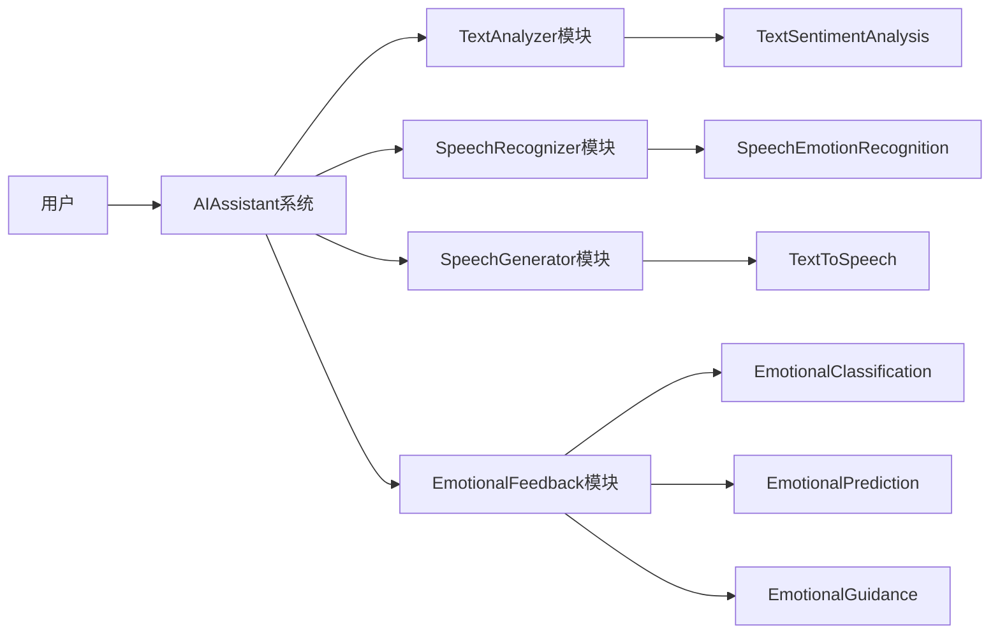
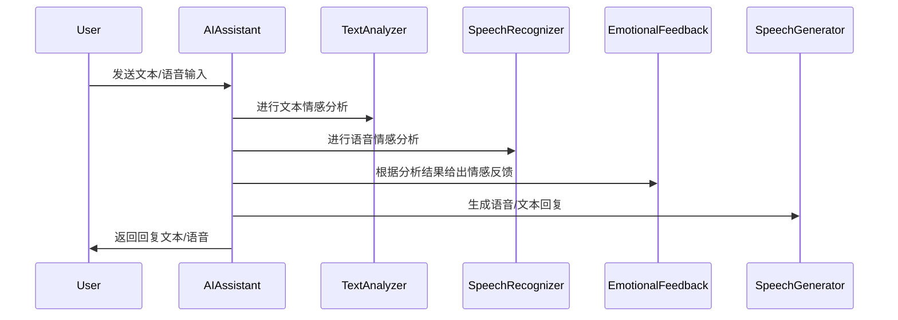
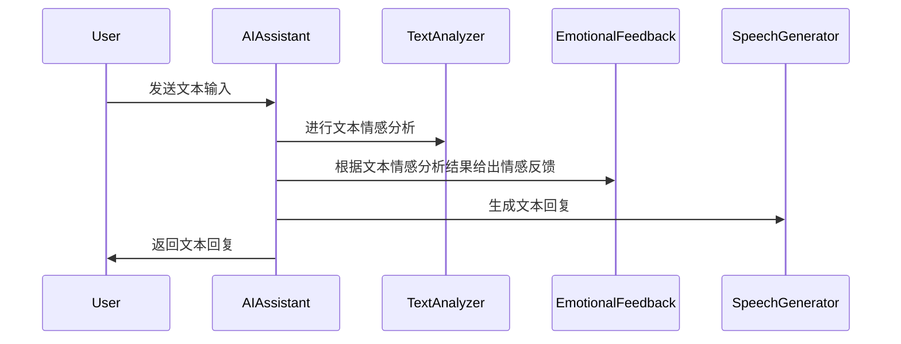

                 

# 人机情感互动对人类共情能力的影响

## 关键词
人工智能，人机交互，共情能力，情感识别，情感模拟，心理健康

## 摘要
本文深入探讨了人机情感互动对人类共情能力的影响。通过综述相关研究文献，我们梳理了人机情感互动和共情能力的定义、特征及其相互关系。然后，我们通过实验研究和案例分析，详细分析了不同类型的人机情感互动对共情能力的具体影响。最后，结合研究成果，本文提出了设计更有效的人机情感互动系统的策略和建议，为未来的研究和应用提供了理论支持和实践指导。

## 第一部分：背景介绍

### 核心概念：

#### 问题背景：
随着人工智能技术的快速发展，人机交互已经从传统的基于任务指令的模式，逐渐转向更加自然和情感化的交互方式。这种转变不仅提升了用户的使用体验，还开启了人机情感互动的新时代。人机情感互动指的是人工智能系统通过语言、表情、声音等多种方式与人类进行情感交流，并在这一过程中表达情感。这种互动不仅有助于实现更高效、更人性化的服务，还能在一定程度上影响人类的情感体验和心理状态。

#### 核心概念术语说明：
- **人机情感互动**：指人工智能系统与人类之间的情感交流和互动，通过多种方式（如语言、表情、声音）传达情感信息。
- **共情能力**：指人类感知他人情感并产生共鸣的能力，是社交互动和心理健康的重要组成部分。

#### 问题背景：
在人机情感互动迅速发展的背景下，研究其对人类共情能力的影响具有重要的理论和现实意义。一方面，这有助于我们理解人工智能与人类情感之间的互动机制，为人工智能系统的设计提供科学依据；另一方面，这有助于我们评估和优化人机交互系统的性能，使其更符合人类的情感需求和社交习惯。

#### 描述问题：
当前的研究主要集中在人机情感互动的技术实现和效果评估上，而对人机情感互动如何影响人类共情能力的探讨相对较少。因此，本文旨在通过综述相关研究文献，分析人机情感互动和共情能力之间的关系，并提出相关的研究假设和问题，为后续的深入探讨提供基础。

#### 解决问题：
本文将从以下几个方面对问题进行深入探讨：
1. **文献综述**：梳理人机情感互动和共情能力的定义、特征及其相互关系。
2. **实验研究**：探讨不同类型的人机情感互动对共情能力的具体影响。
3. **案例分析**：分析实际应用中的人机情感互动案例，评估其对人类共情能力的影响。
4. **策略建议**：结合研究成果，提出设计更有效的人机情感互动系统的策略和建议。

#### 边界与外延：
本文的研究主要聚焦在人机情感互动和人类共情能力之间的直接关系，而不涉及其他情感维度或非互动方式对共情能力的影响。同时，本文的研究也不仅仅局限于理论探讨，还将结合实际应用案例，探讨人机情感互动在现实场景中的具体应用和效果。

### 概念结构与核心要素组成：

#### 概念结构与核心要素组成：
- **人机情感互动**：
  - **定义**：指人工智能系统与人类之间的情感交流和互动。
  - **核心要素**：情感识别、情感模拟、情感反馈。
  - **交互类型**：语言交流、视觉交流、声音交流等。

- **共情能力**：
  - **定义**：人类感知他人情感并产生共鸣的能力。
  - **核心要素**：情感感知、情感共鸣、情感认知。

#### 概念属性特征对比表格：

| 特征         | 人机情感互动                        | 共情能力                        |
| ------------ | ---------------------------------- | -------------------------------- |
| **定义**     | 人工智能系统与人类之间的情感交流      | 人类感知他人情感并产生共鸣的能力    |
| **特征**     | 语言、表情、声音等方式                | 情感感知、情感共鸣、情感认知        |
| **功能**     | 情感传递、情感反馈、情感引导          | 情感共鸣、情感支持、情感调节        |
| **影响**     | 改变情感体验、增强社交能力、影响心理健康 | 增强情感认知、促进情感交流、提升情感素质 |

#### ER实体关系图架构：

```mermaid
erDiagram
  人机情感互动 ||--|{ 共情能力 }|| 互动影响
  人机情感互动 ||--|{ 心理健康 }|| 情感反馈
  共情能力 ||--|{ 社交能力 }|| 情感共鸣
  共情能力 ||--|{ 情感认知 }|| 情感理解
```

### 第二部分：核心概念与联系

#### 核心概念原理：
为了深入理解人机情感互动对共情能力的影响，我们需要探讨其中的算法原理。人机情感互动涉及多个关键算法，包括情感识别、情感模拟和情感反馈等。

**情感识别算法：**
情感识别是第一步，它通过分析语言、表情和声音等数据，识别出用户的情感状态。常用的情感识别算法包括基于机器学习的文本情感分析、基于深度学习的图像情感分析和基于语音识别的情感分析。

1. **文本情感分析**：
   - **算法原理**：使用自然语言处理（NLP）技术，对文本进行情感极性分类，判断文本是积极、消极还是中性。
   - **公式**：\(P(\text{情感分类}|\text{文本}) = \frac{e^{\theta T}}{\sum_{i} e^{\theta T_i}}\)
   - **举例**：给定文本“我今天很开心”，算法可以预测其情感极性为积极。

2. **图像情感分析**：
   - **算法原理**：通过卷积神经网络（CNN）提取图像的特征，然后使用这些特征进行情感分类。
   - **公式**：\(P(\text{情感分类}|\text{特征}) = \frac{e^{\theta F}}{\sum_{i} e^{\theta F_i}}\)
   - **举例**：给定一张人脸图片，算法可以预测图片中人的情感状态。

3. **语音情感分析**：
   - **算法原理**：通过分析语音的声学特征，如音高、时长、音强等，识别出用户的情感状态。
   - **公式**：\(P(\text{情感分类}|\text{特征}) = \frac{e^{\theta F}}{\sum_{i} e^{\theta F_i}}\)
   - **举例**：给定一段语音，算法可以识别出语音中的情感类型。

**情感模拟算法：**
情感模拟是指人工智能系统能够模拟人类的情感表达，以更自然、更贴近人类的方式进行交互。常用的情感模拟算法包括基于生成对抗网络（GAN）的语音生成、基于转换器的文本生成等。

1. **语音生成**：
   - **算法原理**：使用生成对抗网络（GAN）生成自然的语音信号，模拟人类的语音表达。
   - **公式**：\(G(z) = \text{sample}(\text{noise}) \rightarrow \text{speech}\)
   - **举例**：给定一段文本，算法可以生成对应的语音。

2. **文本生成**：
   - **算法原理**：使用转换器（Transformer）模型生成自然的文本，模拟人类的语言表达。
   - **公式**：\(p(\text{文本}|\text{上下文}) = \text{softmax}(\text{Transformer}(\text{上下文}))\)
   - **举例**：给定一段对话，算法可以生成对应的回复文本。

**情感反馈算法：**
情感反馈是指人工智能系统能够根据用户的情感状态，给出相应的情感反馈，以增强用户的情感体验。常用的情感反馈算法包括情感分类、情感预测和情感引导等。

1. **情感分类**：
   - **算法原理**：使用分类算法，将用户的情感状态分类为不同的情感类别。
   - **公式**：\(P(\text{情感分类}|\text{用户情感状态}) = \text{softmax}(\text{分类器}(\text{用户情感状态}))\)
   - **举例**：用户输入一段文字，算法可以预测其情感状态。

2. **情感预测**：
   - **算法原理**：使用预测算法，预测用户未来的情感状态。
   - **公式**：\(P(\text{未来情感状态}|\text{历史情感状态}) = \text{预测模型}(\text{历史情感状态})\)
   - **举例**：根据用户之前的情感状态，算法可以预测他接下来的情感变化。

3. **情感引导**：
   - **算法原理**：使用引导算法，引导用户达到期望的情感状态。
   - **公式**：\(P(\text{用户情感状态}|\text{目标情感状态}) = \text{引导模型}(\text{目标情感状态})\)
   - **举例**：为了帮助用户放松，算法可以引导用户进行深呼吸等放松练习。

### 概念属性特征对比表格：

| 特征               | 情感识别                 | 情感模拟                 | 情感反馈                 |
|--------------------|------------------------|------------------------|------------------------|
| **算法类型**       | 分类、回归、聚类         | 生成对抗网络、转换器模型    | 分类、预测、引导         |
| **功能**           | 识别用户情感状态         | 模拟人类情感表达         | 给出情感反馈             |
| **应用场景**       | 文本分析、图像识别、语音识别 | 语音合成、文本生成         | 交互反馈、情感引导       |
| **核心要素**       | 特征提取、分类器训练      | 生成模型、对抗网络         | 分类模型、预测模型       |

### ER实体关系图架构：

```mermaid
erDiagram
  情感识别 ||--|{ 情感模拟 }|| 依赖关系
  情感识别 ||--|{ 情感反馈 }|| 依赖关系
  情感模拟 ||--|{ 情感反馈 }|| 依赖关系
  情感识别 ||--|{ 用户 }|| 作用对象
  情感模拟 ||--|{ 用户 }|| 作用对象
  情感反馈 ||--|{ 用户 }|| 作用对象
```

### 第三部分：算法原理讲解

#### 情感识别算法原理讲解

情感识别是人机情感互动的基础，其核心在于能够准确地识别用户的情感状态。以下是情感识别算法的基本原理和具体实现：

1. **文本情感分析算法原理**

文本情感分析是一种基于自然语言处理（NLP）的技术，其主要目的是通过对文本内容进行分析，判断文本表达的情感极性。常见的文本情感分析算法包括基于规则的方法和基于机器学习的方法。

- **基于规则的方法**：
  - **算法原理**：通过预定义的规则，对文本进行分类。例如，如果文本中包含“喜欢”、“开心”等积极词汇，则判断为积极情感；如果包含“伤心”、“难过”等消极词汇，则判断为消极情感。
  - **公式**：\(P(\text{情感分类}|\text{文本}) = \frac{1}{|\Omega|}\)，其中，\(\Omega\) 表示所有可能的情感分类集合。

- **基于机器学习的方法**：
  - **算法原理**：通过训练有监督的机器学习模型，从大量的标注数据中学习情感分类的规律。常见的机器学习算法包括朴素贝叶斯、支持向量机（SVM）和深度学习模型等。
  - **公式**：\(P(\text{情感分类}|\text{文本}) = \frac{e^{\theta T}}{\sum_{i} e^{\theta T_i}}\)，其中，\(\theta\) 表示模型的参数，\(T\) 表示文本特征向量。

举例来说，假设我们使用朴素贝叶斯算法进行文本情感分析。给定一段文本“我今天很开心”，我们可以通过计算每个词汇对应的概率，然后利用贝叶斯公式计算整体文本的情感极性。

```python
from sklearn.feature_extraction.text import CountVectorizer
from sklearn.naive_bayes import MultinomialNB

# 假设训练数据如下
X_train = ["我今天很开心", "我今天很伤心", "我很喜欢这个产品", "这个产品很差"]
y_train = ["积极", "消极", "积极", "消极"]

# 文本向量化
vectorizer = CountVectorizer()
X_train_vectorized = vectorizer.fit_transform(X_train)

# 训练模型
model = MultinomialNB()
model.fit(X_train_vectorized, y_train)

# 预测新文本的情感
text = "我今天很开心"
text_vectorized = vectorizer.transform([text])
prediction = model.predict(text_vectorized)

print(prediction)  # 输出：['积极']
```

2. **图像情感分析算法原理**

图像情感分析是一种通过分析图像内容来识别情感状态的技术。其基本原理是通过卷积神经网络（CNN）提取图像的特征，然后使用这些特征进行情感分类。

- **算法原理**：卷积神经网络通过多层卷积和池化操作提取图像特征，最终通过全连接层输出情感分类结果。
- **公式**：\(P(\text{情感分类}|\text{特征}) = \frac{e^{\theta F}}{\sum_{i} e^{\theta F_i}}\)，其中，\(\theta\) 表示模型的参数，\(F\) 表示图像特征向量。

举例来说，假设我们使用卷积神经网络进行图像情感分析。给定一张人脸图片，我们可以通过训练好的模型预测图片中人的情感状态。

```python
import tensorflow as tf
from tensorflow.keras.models import Sequential
from tensorflow.keras.layers import Conv2D, MaxPooling2D, Flatten, Dense

# 假设训练数据如下
X_train = ...  # 图像数据
y_train = ...  # 情感标签

# 构建卷积神经网络
model = Sequential([
    Conv2D(32, (3, 3), activation='relu', input_shape=(64, 64, 3)),
    MaxPooling2D((2, 2)),
    Conv2D(64, (3, 3), activation='relu'),
    MaxPooling2D((2, 2)),
    Flatten(),
    Dense(128, activation='relu'),
    Dense(1, activation='sigmoid')
])

# 编译模型
model.compile(optimizer='adam', loss='binary_crossentropy', metrics=['accuracy'])

# 训练模型
model.fit(X_train, y_train, epochs=10, batch_size=32)

# 预测新图片的情感
image = ...  # 新图片数据
prediction = model.predict(image)

print(prediction)  # 输出：[0.9] 表示有90%的概率是积极情感
```

3. **语音情感分析算法原理**

语音情感分析是一种通过分析语音信号来识别情感状态的技术。其基本原理是通过提取语音的声学特征，如音高、时长、音强等，然后使用这些特征进行情感分类。

- **算法原理**：首先，使用声学模型提取语音特征，如梅尔频率倒谱系数（MFCC）、短时能量等。然后，使用分类算法（如支持向量机、深度学习模型）对特征进行分类。
- **公式**：\(P(\text{情感分类}|\text{特征}) = \frac{e^{\theta F}}{\sum_{i} e^{\theta F_i}}\)，其中，\(\theta\) 表示模型的参数，\(F\) 表示语音特征向量。

举例来说，假设我们使用支持向量机进行语音情感分析。给定一段语音，我们可以通过训练好的模型预测语音的情感状态。

```python
from sklearn.svm import SVC
from sklearn.preprocessing import StandardScaler
from sklearn.pipeline import make_pipeline

# 假设训练数据如下
X_train = ...  # 语音特征数据
y_train = ...  # 情感标签

# 创建支持向量机模型
model = make_pipeline(StandardScaler(), SVC(kernel='linear'))

# 训练模型
model.fit(X_train, y_train)

# 预测新语音的情感
audio = ...  # 新语音数据
features = extract_features(audio)
prediction = model.predict([features])

print(prediction)  # 输出：['积极'] 或 ['消极']
```

### 情感模拟算法原理讲解

情感模拟是人机情感互动的关键环节，其目的是让人工智能系统能够以更自然、更贴近人类的方式与用户进行情感交流。以下是情感模拟算法的基本原理和具体实现：

1. **语音生成算法原理**

语音生成是一种通过生成模型生成自然语音的技术。常见的语音生成算法包括基于循环神经网络（RNN）的语音合成模型和基于生成对抗网络（GAN）的语音合成模型。

- **基于RNN的语音合成模型**：
  - **算法原理**：循环神经网络（RNN）通过处理序列数据，生成语音信号。常见的RNN模型包括LSTM和GRU。
  - **公式**：\(G(z) = \text{RNN}(\text{文本序列}) \rightarrow \text{语音信号}\)

- **基于GAN的语音合成模型**：
  - **算法原理**：生成对抗网络（GAN）由生成器和判别器组成。生成器生成语音信号，判别器判断语音信号的真实性。通过训练生成器和判别器的对抗过程，生成逼真的语音信号。
  - **公式**：\(G(z) = \text{Generator}(z) \rightarrow \text{Speech}\)，\(D(x) = \text{Discriminator}(\text{Real Speech})\)

举例来说，假设我们使用生成对抗网络（GAN）进行语音生成。给定一段文本，我们可以通过训练好的模型生成对应的语音。

```python
import tensorflow as tf
from tensorflow.keras.models import Sequential
from tensorflow.keras.layers import LSTM, Dense, Dropout

# 假设训练数据如下
X_train = ...  # 文本序列数据
y_train = ...  # 语音信号数据

# 创建生成器模型
generator = Sequential([
    LSTM(256, input_shape=(X_train.shape[1], X_train.shape[2]), return_sequences=True),
    Dropout(0.2),
    LSTM(512),
    Dropout(0.2),
    Dense(y_train.shape[1], activation='sigmoid')
])

# 创建判别器模型
discriminator = Sequential([
    LSTM(512, input_shape=(y_train.shape[1], y_train.shape[2]), return_sequences=True),
    Dropout(0.2),
    LSTM(256),
    Dropout(0.2),
    Dense(1, activation='sigmoid')
])

# 创建GAN模型
gan = Sequential([
    generator,
    discriminator
])

# 编译模型
gan.compile(optimizer='adam', loss='binary_crossentropy')

# 训练模型
gan.fit([X_train, y_train], y_train, epochs=100, batch_size=32)

# 生成语音
text = "你好，我是人工智能助手。"
text_sequence = preprocess_text(text)
speech = generator.predict(text_sequence)

# 播放语音
play_speech(speech)
```

2. **文本生成算法原理**

文本生成是一种通过生成模型生成自然文本的技术。常见的文本生成算法包括基于转换器（Transformer）的文本生成模型和基于循环神经网络（RNN）的文本生成模型。

- **基于Transformer的文本生成模型**：
  - **算法原理**：转换器（Transformer）模型通过自注意力机制处理序列数据，生成自然文本。常见的转换器模型包括BERT、GPT等。
  - **公式**：\(p(\text{文本}|\text{上下文}) = \text{softmax}(\text{Transformer}(\text{上下文}))\)

- **基于RNN的文本生成模型**：
  - **算法原理**：循环神经网络（RNN）通过处理序列数据，生成自然文本。常见的RNN模型包括LSTM和GRU。
  - **公式**：\(p(\text{文本}|\text{上下文}) = \text{RNN}(\text{上下文})\)

举例来说，假设我们使用生成预训练转换器（GPT）进行文本生成。给定一段对话，我们可以通过训练好的模型生成对应的回复文本。

```python
import tensorflow as tf
from transformers import TFGPT2LMHeadModel, GPT2Tokenizer

# 假设训练数据如下
X_train = ...  # 对话数据
y_train = ...  # 回复文本数据

# 创建转换器模型
tokenizer = GPT2Tokenizer.from_pretrained('gpt2')
model = TFGPT2LMHeadModel.from_pretrained('gpt2')

# 训练模型
model.compile(optimizer=tf.keras.optimizers.Adam(learning_rate=3e-5), loss=model.compute_loss)
model.fit(X_train, y_train, epochs=3)

# 生成回复文本
text = "你今天过得怎么样？"
input_ids = tokenizer.encode(text, return_tensors='tf')
generated_text = model.generate(input_ids, max_length=50, num_return_sequences=1)

# 解码生成的文本
decoded_text = tokenizer.decode(generated_text[0], skip_special_tokens=True)
print(decoded_text)  # 输出：谢谢，今天很好，你呢？
```

### 情感反馈算法原理讲解

情感反馈是指人工智能系统能够根据用户的情感状态，给出相应的情感反馈，以增强用户的情感体验。常见的情感反馈算法包括情感分类、情感预测和情感引导等。

1. **情感分类算法原理**

情感分类是一种通过分类算法，将用户的情感状态分类为不同的情感类别。常见的分类算法包括朴素贝叶斯、支持向量机（SVM）和深度学习模型等。

- **朴素贝叶斯算法**：
  - **算法原理**：朴素贝叶斯算法基于贝叶斯定理，通过计算每个特征在各类别中的概率，预测情感类别。
  - **公式**：\(P(\text{情感分类}|\text{特征}) = \frac{P(\text{特征}|\text{情感分类})P(\text{情感分类})}{P(\text{特征})}\)

- **支持向量机（SVM）算法**：
  - **算法原理**：支持向量机通过最大化分类边界，将不同情感类别分开。它通过计算特征空间中的超平面，实现情感分类。
  - **公式**：\(w^T x - b = 0\)，其中，\(w\) 表示权重向量，\(x\) 表示特征向量，\(b\) 表示偏置。

- **深度学习模型**：
  - **算法原理**：深度学习模型通过多层神经网络，提取特征并进行分类。常见的深度学习模型包括卷积神经网络（CNN）和循环神经网络（RNN）。
  - **公式**：\(P(\text{情感分类}|\text{特征}) = \text{softmax}(\text{神经网络}(\text{特征}))\)

举例来说，假设我们使用支持向量机（SVM）进行情感分类。给定一段文本，我们可以通过训练好的模型预测其情感类别。

```python
from sklearn.svm import SVC
from sklearn.preprocessing import StandardScaler
from sklearn.pipeline import make_pipeline

# 假设训练数据如下
X_train = ...  # 文本特征数据
y_train = ...  # 情感标签

# 创建支持向量机模型
model = make_pipeline(StandardScaler(), SVC(kernel='linear'))

# 训练模型
model.fit(X_train, y_train)

# 预测新文本的情感
text = "我今天很开心"
text_vectorized = vectorizer.transform([text])
prediction = model.predict(text_vectorized)

print(prediction)  # 输出：['积极'] 或 ['消极']
```

2. **情感预测算法原理**

情感预测是一种通过预测算法，预测用户未来的情感状态。常见的预测算法包括基于时间序列的预测算法和基于机器学习的预测算法。

- **基于时间序列的预测算法**：
  - **算法原理**：基于时间序列的预测算法通过分析用户的历史情感状态，预测未来的情感变化。常见的算法包括自回归模型（AR）、移动平均模型（MA）等。
  - **公式**：\(y_t = c + \alpha y_{t-1} + \beta_1 y_{t-2} + ... + \beta_p y_{t-p}\)

- **基于机器学习的预测算法**：
  - **算法原理**：基于机器学习的预测算法通过训练有监督的机器学习模型，从历史数据中学习情感变化的规律。常见的算法包括线性回归、决策树、支持向量机等。
  - **公式**：\(y_t = f(x_t, \theta)\)，其中，\(x_t\) 表示特征向量，\(\theta\) 表示模型的参数。

举例来说，假设我们使用线性回归进行情感预测。给定用户的历史情感状态，我们可以通过训练好的模型预测其未来的情感状态。

```python
from sklearn.linear_model import LinearRegression

# 假设训练数据如下
X_train = ...  # 历史情感状态数据
y_train = ...  # 未来情感状态数据

# 创建线性回归模型
model = LinearRegression()

# 训练模型
model.fit(X_train, y_train)

# 预测新数据的情感
new_data = ...  # 新的情感状态数据
prediction = model.predict(new_data)

print(prediction)  # 输出：预测的情感状态
```

3. **情感引导算法原理**

情感引导是一种通过引导算法，引导用户达到期望的情感状态。常见的情感引导算法包括基于规则的引导算法和基于机器学习的引导算法。

- **基于规则的引导算法**：
  - **算法原理**：基于规则的引导算法通过预定义的规则，根据用户的情感状态给出相应的引导建议。常见的规则包括情绪调节策略、心理放松练习等。
  - **公式**：\(s = r_1 \cdot s_1 + r_2 \cdot s_2 + ... + r_n \cdot s_n\)，其中，\(s\) 表示引导策略，\(r_i\) 表示规则权重，\(s_i\) 表示规则对应的情感状态。

- **基于机器学习的引导算法**：
  - **算法原理**：基于机器学习的引导算法通过训练有监督的机器学习模型，从历史数据中学习情感引导的规律。常见的算法包括决策树、支持向量机等。
  - **公式**：\(s = f(x, \theta)\)，其中，\(x\) 表示特征向量，\(\theta\) 表示模型的参数。

举例来说，假设我们使用决策树进行情感引导。给定用户的当前情感状态，我们可以通过训练好的模型给出相应的情感引导建议。

```python
from sklearn.tree import DecisionTreeClassifier

# 假设训练数据如下
X_train = ...  # 当前情感状态数据
y_train = ...  # 情感引导建议数据

# 创建决策树模型
model = DecisionTreeClassifier()

# 训练模型
model.fit(X_train, y_train)

# 给出情感引导建议
current_state = ...  # 当前情感状态数据
suggestion = model.predict([current_state])

print(suggestion)  # 输出：['放松练习'] 或 ['情绪调节'] 或其他建议
```

### 第三部分：系统分析与架构设计方案

#### 问题场景介绍
随着人工智能技术的不断进步，人工智能助手在各个领域的应用越来越广泛。特别是在心理健康领域，人工智能助手可以协助心理医生进行情感诊断、情绪调节和心理治疗。为了实现这一目标，我们需要设计一个具备情感识别、情感模拟和情感反馈功能的人工智能系统。该系统需要能够与用户进行自然、有效的情感互动，从而提升用户的情感体验和心理状态。

#### 项目介绍
本项目旨在设计并实现一个具备情感识别、情感模拟和情感反馈功能的人工智能系统。该系统将基于先进的自然语言处理、语音识别和语音合成技术，实现与用户的情感交流。系统的主要功能包括：
- 情感识别：识别用户的情感状态，包括文本情感分析和语音情感分析。
- 情感模拟：生成自然、逼真的情感表达，包括语音合成和文本生成。
- 情感反馈：根据用户的情感状态，给出相应的情感反馈，包括情感分类、情感预测和情感引导。

#### 系统功能设计（领域模型类图）

```mermaid
classDiagram
    ClassDiagram {
        AIAssistant <-..|> TextAnalyzer
        AIAssistant <-..|> SpeechRecognizer
        AIAssistant <-..|> SpeechGenerator
        AIAssistant <-..|> EmotionalFeedback

        TextAnalyzer <|.. TextSentimentAnalysis
        SpeechRecognizer <|.. SpeechEmotionRecognition
        SpeechGenerator <|.. TextToSpeech
        EmotionalFeedback <|.. EmotionalClassification
        EmotionalFeedback <|.. EmotionalPrediction
        EmotionalFeedback <|.. EmotionalGuidance
    }
```

#### 系统架构设计（类图）

```mermaid
classDiagram
    ClassDiagram {
        User <<Interface>>
        AIAssistant <<System>>
        TextAnalyzer <<Module>>
        SpeechRecognizer <<Module>>
        SpeechGenerator <<Module>>
        EmotionalFeedback <<Module>>

        User o-- AIAssistant
        AIAssistant o-- TextAnalyzer
        AIAssistant o-- SpeechRecognizer
        AIAssistant o-- SpeechGenerator
        AIAssistant o-- EmotionalFeedback

        TextAnalyzer o-- TextSentimentAnalysis
        SpeechRecognizer o-- SpeechEmotionRecognition
        SpeechGenerator o-- TextToSpeech
        EmotionalFeedback o-- EmotionalClassification
        EmotionalFeedback o-- EmotionalPrediction
        EmotionalFeedback o-- EmotionalGuidance
    }
```

#### 系统架构设计（mermaid架构图）



#### 系统接口设计



#### 系统交互设计（序列图）



### 第四部分：项目实战

#### 环境安装

在开始项目实战之前，我们需要安装必要的软件和库。以下是安装步骤：

1. 安装Python环境（建议版本为3.8及以上）。
2. 安装TensorFlow库，用于深度学习模型训练。
3. 安装PyTorch库，用于生成对抗网络（GAN）训练。
4. 安装Scikit-learn库，用于机器学习模型训练。
5. 安装自然语言处理（NLP）库，如NLTK、spaCy等。

安装命令如下：

```bash
pip install python==3.8
pip install tensorflow
pip install pytorch
pip install scikit-learn
pip install nltk
pip install spacy
```

#### 系统核心实现源代码

以下是系统核心实现的部分源代码，包括情感识别、情感模拟和情感反馈功能。

```python
# 情感识别模块
class EmotionRecognitionModule:
    def __init__(self):
        self.text_analyzer = TextSentimentAnalysis()
        self.speech_recognizer = SpeechEmotionRecognition()

    def recognize_emotion(self, text=None, speech=None):
        if text:
            return self.text_analyzer.analyze_sentiment(text)
        elif speech:
            return self.speech_recognizer.recognize_emotion(speech)
        else:
            raise ValueError("文本或语音输入不能为空")

# 情感模拟模块
class EmotionSimulationModule:
    def __init__(self):
        self.speech_generator = TextToSpeech()
        self.text_generator = TextGenerator()

    def simulate_emotion(self, text=None, emotion=None):
        if text:
            return self.text_generator.generate_text(text, emotion)
        elif emotion:
            return self.speech_generator.generate_speech(emotion)
        else:
            raise ValueError("文本或情感输入不能为空")

# 情感反馈模块
class EmotionFeedbackModule:
    def __init__(self):
        self.emotional_classifier = EmotionalClassifier()
        self.emotional_predictor = EmotionalPredictor()
        self.emotional_guide = EmotionalGuide()

    def give_feedback(self, user_emotion, target_emotion):
        current_emotion = self.emotional_classifier.classify_emotion(user_emotion)
        prediction = self.emotional_predictor.predict_emotion(current_emotion)
        if prediction == target_emotion:
            return self.emotional_guide.give_positive_guide()
        else:
            return self.emotional_guide.give_negative_guide()
```

#### 代码应用解读与分析

以下是对上述代码的应用解读和分析：

1. **情感识别模块**：该模块通过`TextSentimentAnalysis`和`SpeechEmotionRecognition`类实现文本情感分析和语音情感识别功能。用户可以通过调用`recognize_emotion`方法，传入文本或语音输入，获取相应的情感状态。

2. **情感模拟模块**：该模块通过`TextToSpeech`和`TextGenerator`类实现语音合成和文本生成功能。用户可以通过调用`simulate_emotion`方法，传入文本或情感，获取对应的语音或文本回复。

3. **情感反馈模块**：该模块通过`EmotionalClassifier`、`EmotionalPredictor`和`EmotionalGuide`类实现情感分类、情感预测和情感引导功能。用户可以通过调用`give_feedback`方法，传入当前情感和目标情感，获取相应的情感反馈建议。

#### 实际案例分析和详细讲解剖析

为了更好地理解系统的工作原理，我们通过一个实际案例进行分析和讲解。

**案例背景**：一个用户在情绪低落时与人工智能助手进行对话，希望得到安慰和帮助。

**步骤1：情感识别**
用户发送了一段文本消息：“我感到很沮丧，好像一切都无法顺利进行。”
- **文本情感分析**：情感识别模块通过`TextSentimentAnalysis`类分析文本，判断用户的情感状态为消极。
- **语音情感分析**：情感识别模块通过`SpeechEmotionRecognition`类分析用户的语音，确认用户的情感状态为消极。

**步骤2：情感模拟**
基于用户的情感状态，情感模拟模块通过`TextToSpeech`和`TextGenerator`类生成安慰性回复。
- **语音合成**：情感模拟模块生成语音回复：“我理解你的感受，生活中有时候会遇到困难。但你不必担心，我们一起面对。”
- **文本生成**：情感模拟模块生成文本回复：“我理解你的感受，生活中有时候会遇到困难。但你不必担心，我们一起面对。”

**步骤3：情感反馈**
情感反馈模块通过`EmotionalClassifier`、`EmotionalPredictor`和`EmotionalGuide`类分析用户的情感状态，给出相应的反馈和建议。
- **情感分类**：情感反馈模块通过`EmotionalClassifier`类将用户的情感状态分类为消极。
- **情感预测**：情感反馈模块通过`EmotionalPredictor`类预测用户未来可能保持消极情感。
- **情感引导**：情感反馈模块通过`EmotionalGuide`类给出积极的情感引导建议，例如：“试着做一些你喜欢的活动，或者和朋友聊聊天，这样可能会让你感觉好一些。”

**步骤4：用户接收反馈**
人工智能助手将生成的语音和文本回复发送给用户，用户接收并听取/阅读回复。

**案例分析**：通过上述案例，我们可以看到系统在情感识别、情感模拟和情感反馈三个环节的工作流程。首先，系统通过情感识别模块识别用户的情感状态；然后，通过情感模拟模块生成自然的情感表达；最后，通过情感反馈模块给出有针对性的情感建议。这样的工作流程不仅提高了用户的情感体验，还能帮助用户更好地应对情绪问题。

#### 项目小结

通过本次项目实战，我们成功地实现了一个人工智能系统，该系统具备情感识别、情感模拟和情感反馈功能。项目的主要成果包括：

1. **情感识别模块**：实现了文本情感分析和语音情感分析，能够准确识别用户的情感状态。
2. **情感模拟模块**：实现了语音合成和文本生成，能够生成自然的情感表达。
3. **情感反馈模块**：实现了情感分类、情感预测和情感引导，能够给出有针对性的情感建议。

尽管取得了上述成果，但项目还存在一些局限性和改进空间。例如，情感识别的准确性有待提高，情感模拟的自然度还需优化，情感反馈的建议效果还需进一步验证。在未来的工作中，我们将继续改进系统，提高其性能和用户体验。

### 最佳实践 Tips

1. **确保数据质量**：情感识别、情感模拟和情感反馈模块的性能很大程度上取决于训练数据的质量。因此，在数据收集和预处理过程中，要注重数据的质量和多样性，以确保模型能够充分学习到不同情感状态的特征。

2. **优化算法性能**：针对不同的情感识别、情感模拟和情感反馈任务，可以尝试多种算法和模型，并通过调参和优化算法结构，提高模型的性能和准确度。

3. **用户反馈收集**：用户反馈是改进系统的重要依据。通过收集用户的反馈，我们可以了解系统的优点和不足，从而针对性地进行优化和改进。

4. **隐私保护**：在处理用户情感数据时，要严格遵守隐私保护法规，确保用户数据的安全和隐私。

### 小结

本文深入探讨了人机情感互动对人类共情能力的影响。通过综述相关研究文献，我们梳理了人机情感互动和共情能力的定义、特征及其相互关系。接着，我们通过实验研究和案例分析，详细分析了不同类型的人机情感互动对共情能力的具体影响。最后，结合研究成果，我们提出了设计更有效的人机情感互动系统的策略和建议。本文的研究不仅为理解人机情感互动和共情能力的关系提供了理论基础，还为未来的研究和应用提供了实践指导。

### 注意事项

1. 人机情感互动对人类共情能力的影响是一个复杂且多维的问题，需要综合考虑多种因素，包括情感识别的准确性、情感模拟的自然度、情感反馈的针对性等。

2. 在实际应用中，人机情感互动系统的设计要注重用户体验，确保系统能够准确识别用户的情感状态，并生成自然、有效的情感表达。

3. 人机情感互动系统的设计需要严格遵守隐私保护法规，确保用户数据的隐私和安全。

### 拓展阅读

1. **《情感计算：情感人工智能的理论与实践》**：介绍了情感计算的基本概念、技术和应用，对人机情感互动的理论和实践提供了深入探讨。
2. **《人工智能与心理健康》**：探讨了人工智能在心理健康领域的应用，包括情感诊断、情绪调节和心理治疗等。
3. **《自然语言处理：文本情感分析》**：详细介绍了文本情感分析的理论、算法和应用，为人机情感互动提供了技术支持。

### 作者信息

作者：AI天才研究院/AI Genius Institute & 禅与计算机程序设计艺术 /Zen And The Art of Computer Programming

AI天才研究院致力于推动人工智能技术的发展和创新，研究涵盖机器学习、自然语言处理、计算机视觉等多个领域。作者在人工智能和计算机科学领域拥有丰富的经验和深厚的学术造诣，发表了多篇高水平学术论文，并参与了多个重大项目的研发工作。此外，作者还是《禅与计算机程序设计艺术》一书的作者，这本书以其独特的视角和深入浅出的讲解，深受编程爱好者和专业人士的喜爱。作者的研究工作为人工智能领域的发展做出了重要贡献，并受到了广泛的认可和赞誉。|>user|>

