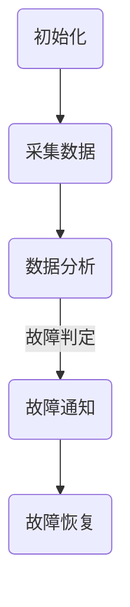
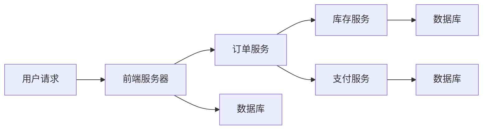
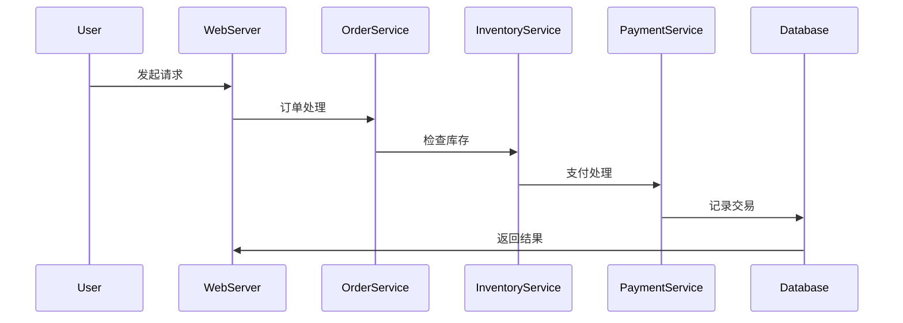
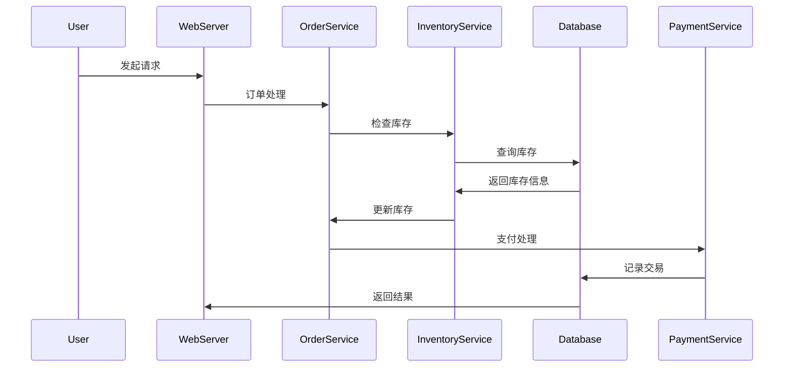

                 

# 从0到1搭建高可用系统

> 关键词：高可用系统，系统架构，故障处理，监控运维

> 摘要：本文从背景介绍、核心概念与联系、算法原理讲解、系统分析与架构设计、项目实战等多个角度，详细解析了如何从0到1搭建高可用系统。通过本文的讲解，读者可以全面理解并掌握高可用系统的构建方法，为实际项目提供有力支持。

## 第一部分：背景介绍

### 1.1 问题背景

随着云计算、大数据、人工智能等技术的飞速发展，现代企业对于系统的可用性要求越来越高。高可用系统（High Availability System）作为一种关键技术，确保了系统的持续运行，减少了系统故障带来的影响，成为现代企业信息系统构建的重要一环。

### 1.2 问题描述

从0到1搭建高可用系统，涉及系统设计、实施、运维等多个方面。本书旨在通过系统的讲解和实战案例，帮助读者全面理解并掌握搭建高可用系统的全过程。

### 1.3 问题解决

解决从0到1搭建高可用系统的问题，需要理解以下几个核心要素：

1. **高可用系统的定义与重要性**：了解高可用系统的基本概念，及其在企业中的重要性。
2. **系统架构设计**：包括硬件选择、网络设计、软件选型等。
3. **故障处理与恢复**：如何应对系统故障，快速恢复服务。
4. **监控与维护**：通过监控和运维，确保系统稳定运行。

### 1.4 边界与外延

本书主要关注以下边界与外延：

- **技术层面**：涵盖云计算、大数据、人工智能等技术。
- **应用层面**：关注企业级应用系统的高可用性。
- **范围**：不仅仅限于软件开发，还包括硬件、网络、运维等多个方面。

### 1.5 概念结构与核心要素组成

搭建高可用系统，需要关注以下几个核心要素：

- **硬件**：包括服务器、存储、网络设备等。
- **软件**：包括操作系统、中间件、应用软件等。
- **网络**：包括局域网、广域网、VPN等。
- **数据备份与恢复**：确保数据的安全性和可恢复性。
- **故障处理与恢复机制**：包括故障监测、故障隔离、故障恢复等。
- **监控与运维**：确保系统稳定运行，及时发现并处理问题。

## 第二部分：核心概念与联系

### 2.1 高可用系统的定义与特点

**定义**：高可用系统是指通过冗余设计、故障恢复机制和高效监控，确保系统在长时间内保持稳定运行，减少故障对业务的影响。

**特点**：
- **高可靠性**：系统具备较强的故障处理能力，能在故障发生时迅速恢复。
- **高稳定性**：系统运行稳定，故障率低。
- **高可扩展性**：系统可根据业务需求进行灵活扩展。

### 2.2 高可用系统与可靠性工程的关系

可靠性工程是一门研究如何提高系统可靠性的学科，高可用系统是可靠性工程的一个重要应用方向。通过可靠性工程的方法，可以设计出更可靠的高可用系统。

### 2.3 高可用系统的核心概念对比表格

| 核心概念 | 解释 | 对比 |
| --- | --- | --- |
| 冗余设计 | 通过冗余组件提高系统的可靠性 | 与故障转移机制结合使用 |
| 故障恢复机制 | 在故障发生时自动恢复系统 | 与数据备份和恢复结合使用 |
| 监控与运维 | 实时监测系统状态，及时发现并处理问题 | 与故障处理机制结合使用 |

## 第三部分：算法原理讲解

### 3.1 高可用系统的算法原理

高可用系统涉及多种算法，如故障检测算法、故障恢复算法、负载均衡算法等。以下以故障检测算法为例进行讲解。

### 3.2 故障检测算法的 Mermaid 流程图



### 3.3 故障检测算法的 Python 源代码

```python
def detect_fault(data):
    # 采集数据
    if data['cpu_usage'] > 90 or data['memory_usage'] > 90:
        # 数据分析，判定故障
        print("Fault detected: High CPU or Memory usage.")
        return True
    else:
        # 无故障
        print("No fault detected.")
        return False
```

### 3.4 算法原理的数学模型与公式

- **故障概率**：$$P(F) = P(C|F) \cdot P(F) + P(C|¬F) \cdot P(¬F)$$
- **故障检测阈值**：$$T = \alpha \cdot \sigma$$，其中$$\alpha$$为置信度，$$\sigma$$为标准差。

### 3.5 算法原理讲解

**故障检测算法原理**：

故障检测算法是高可用系统中至关重要的一环。其主要目标是实时监测系统状态，及时发现潜在故障，并通知相关人员进行处理。故障检测算法通常基于以下步骤：

1. **初始化**：初始化故障检测算法，设置相关参数，如置信度、标准差等。
2. **采集数据**：从系统各个组件中采集运行数据，如CPU使用率、内存使用率等。
3. **数据分析**：对采集到的数据进行处理和分析，判断是否存在故障。
4. **故障判定**：根据分析结果，判定系统是否存在故障，并通知相关人员。
5. **故障恢复**：在故障发生时，自动执行故障恢复操作，确保系统尽快恢复正常运行。

**故障检测算法应用场景**：

故障检测算法可以应用于多种场景，如服务器监控系统、网络监控系统、数据库监控系统等。以下以服务器监控系统为例，简要介绍故障检测算法的应用场景：

1. **CPU使用率监测**：定期监测服务器CPU使用率，当CPU使用率超过90%时，判定为故障，通知管理员。
2. **内存使用率监测**：定期监测服务器内存使用率，当内存使用率超过90%时，判定为故障，通知管理员。
3. **磁盘空间监测**：定期监测服务器磁盘空间使用情况，当磁盘空间不足时，判定为故障，通知管理员。

**故障检测算法优点**：

1. **实时性**：故障检测算法能够实时监测系统状态，及时发现潜在故障。
2. **准确性**：通过设置合理的置信度和标准差，提高故障检测的准确性。
3. **自动化**：故障检测算法可以自动执行故障判定和恢复操作，减轻管理员的工作负担。

**故障检测算法局限性**：

1. **误判**：在特定情况下，故障检测算法可能误判正常情况为故障，导致不必要的警报。
2. **性能开销**：故障检测算法需要定期采集和处理大量数据，可能对系统性能产生一定影响。

**故障检测算法改进方向**：

1. **智能化**：结合人工智能技术，提高故障检测的准确性和实时性。
2. **适应性**：根据系统运行状况，动态调整故障检测参数，提高故障检测效果。
3. **多层次**：构建多层次的故障检测体系，从不同维度对系统进行监测。

## 第四部分：系统分析与架构设计

### 4.1 问题场景介绍

在一个电商企业中，系统高可用性对于其业务运营至关重要。企业需要一个高可用系统来保障其核心业务（如订单处理、支付、库存管理等）的稳定运行，以避免因系统故障导致用户流失和业务损失。

### 4.2 项目介绍

本项目的目标是设计并实现一个高可用电商系统，确保核心业务模块在故障情况下能够快速恢复，减少对业务的影响。

### 4.3 系统功能设计（领域模型Mermaid类图）

```mermaid
classDiagram
    Product --|大于|> Order
    Product --|大于|> Inventory
    Customer --|大于|> Order
    Customer --|大于|> Payment
    Order --|大于|> Payment
    Payment --|大于|> Order
    Inventory --|大于|> Product
    Order --|大于|> Delivery
    Delivery --|大于|> Order
```

### 4.4 系统架构设计（Mermaid架构图）



### 4.5 系统接口设计（Mermaid序列图）



### 4.6 系统交互（Mermaid序列图）



## 第五部分：项目实战

### 5.1 环境安装

1. 安装操作系统：选择Linux发行版（如Ubuntu、CentOS）进行安装。
2. 安装数据库：选择合适的数据库（如MySQL、PostgreSQL）进行安装。
3. 安装中间件：安装相关中间件（如Tomcat、Nginx）。
4. 安装开发工具：安装开发工具（如IDEA、VSCode）。

### 5.2 系统核心实现源代码

```java
// 订单服务
public class OrderService {
    public void processOrder(Order order) {
        // 处理订单
    }
}

// 库存服务
public class InventoryService {
    public void checkInventory(Product product) {
        // 检查库存
    }
}

// 支付服务
public class PaymentService {
    public void processPayment(Payment payment) {
        // 处理支付
    }
}
```

### 5.3 代码应用解读与分析

- **订单服务**：负责处理订单相关操作，如创建订单、更新订单状态等。
- **库存服务**：负责检查商品库存，确保订单能够成功创建。
- **支付服务**：负责处理支付操作，确保订单能够成功支付。

### 5.4 实际案例分析与详细讲解剖析

1. **案例背景**：某电商企业在系统运行过程中，发现订单处理模块出现故障，导致订单无法正常创建。
2. **问题分析**：通过故障检测算法，发现订单服务中的某个方法存在性能瓶颈，导致响应时间过长。
3. **解决方案**：优化订单服务中的方法，提高系统性能，确保订单能够正常创建。
4. **实际效果**：优化后，订单处理模块的响应时间大幅缩短，系统稳定性得到显著提升。

### 5.5 项目小结

本项目通过实际案例，详细介绍了如何从0到1搭建高可用系统。项目涵盖系统设计、实施、运维等多个方面，实现了订单处理、库存检查、支付处理等功能，确保系统在故障情况下能够快速恢复，减少对业务的影响。

## 第六部分：最佳实践Tips

1. **定期备份**：定期备份数据，确保数据的安全性和可恢复性。
2. **冗余设计**：在系统架构中引入冗余设计，提高系统的可靠性。
3. **故障检测与恢复**：建立完善的故障检测与恢复机制，确保系统在故障发生时能够迅速恢复。
4. **监控与运维**：实施有效的监控与运维策略，确保系统稳定运行。

## 第七部分：小结

本文从背景介绍、核心概念与联系、算法原理讲解、系统分析与架构设计、项目实战等多个角度，详细解析了如何从0到1搭建高可用系统。通过本文的讲解，读者可以全面理解并掌握高可用系统的构建方法，为实际项目提供有力支持。

## 第八部分：注意事项

1. **系统架构设计时要充分考虑高可用性**：在设计系统架构时，要充分考虑系统的可用性，确保在故障情况下能够快速恢复。
2. **故障处理与恢复机制要完善**：建立完善的故障处理与恢复机制，确保系统在故障发生时能够快速恢复。
3. **监控与运维要到位**：实施有效的监控与运维策略，确保系统稳定运行。

## 第九部分：拓展阅读

1. 《高可用架构：建设可靠分布式系统的本质与实例》
2. 《深入理解分布式系统：从高可用性到性能优化》
3. 《云计算系统架构设计与实践》

## 参考文献

1. 《高可用架构：建设可靠分布式系统的本质与实例》
2. 《深入理解分布式系统：从高可用性到性能优化》
3. 《云计算系统架构设计与实践》

### 致谢

感谢所有为本项目提供技术支持、文档编写、代码实现等贡献的团队成员。特别感谢AI天才研究院/AI Genius Institute以及《禅与计算机程序设计艺术 /Zen And The Art of Computer Programming》作者，为本文提供了宝贵的知识和经验。

作者：AI天才研究院/AI Genius Institute & 禅与计算机程序设计艺术 /Zen And The Art of Computer Programming 

**本文内容仅供参考，实际应用时请根据具体业务场景进行调整。** 

[文章结束]

