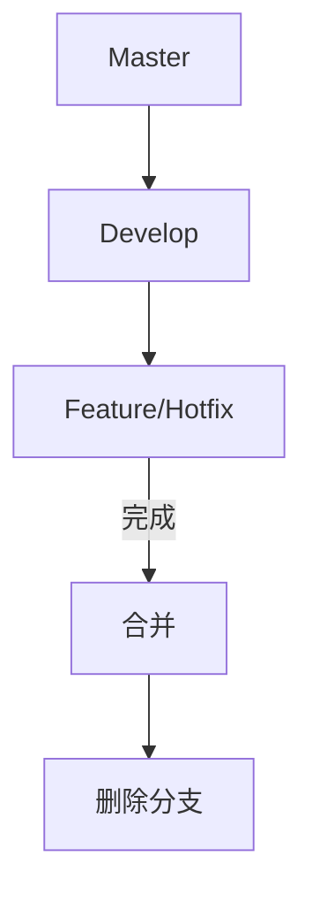
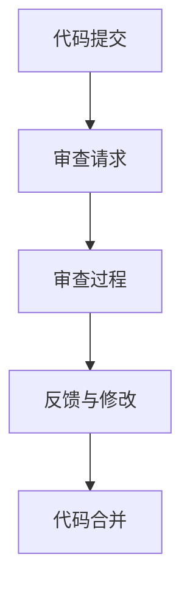
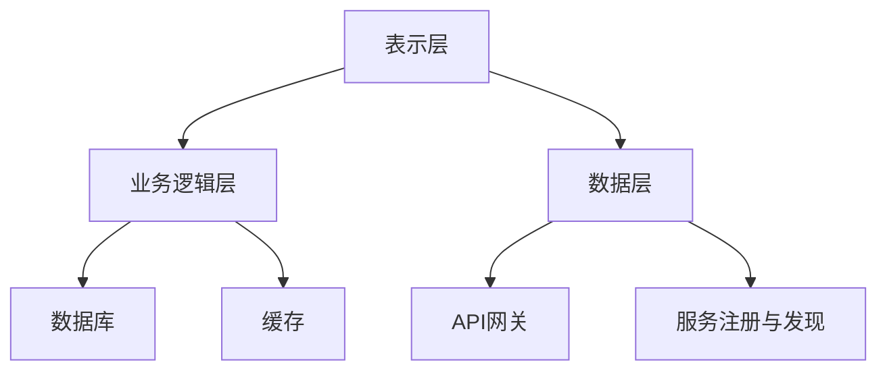
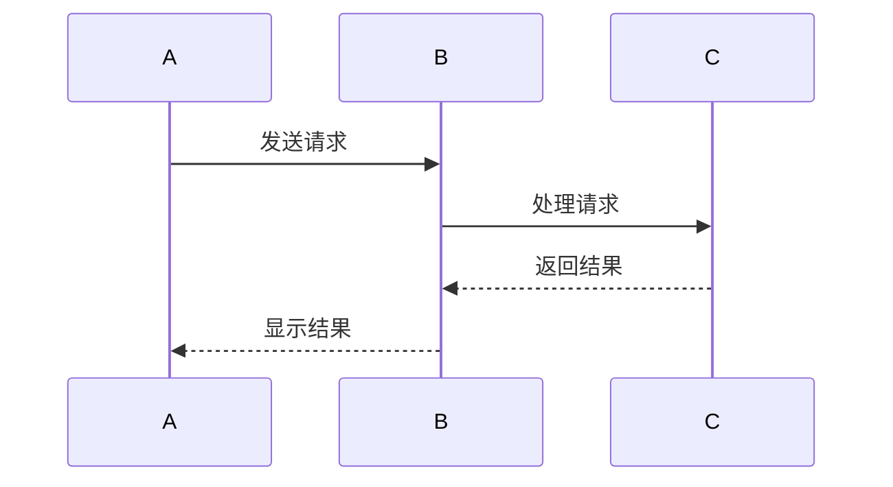
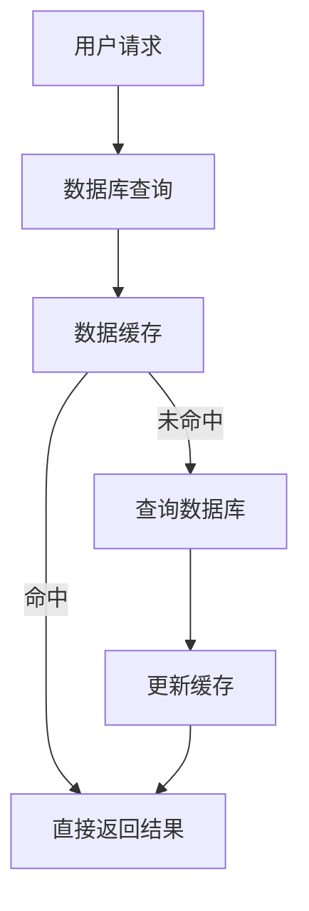
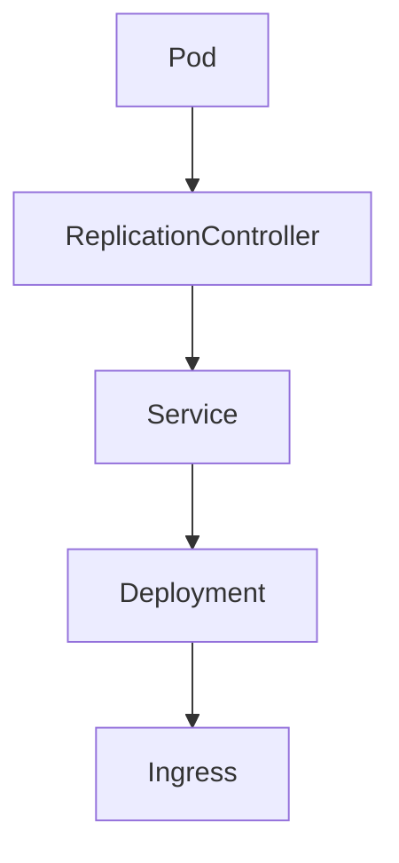
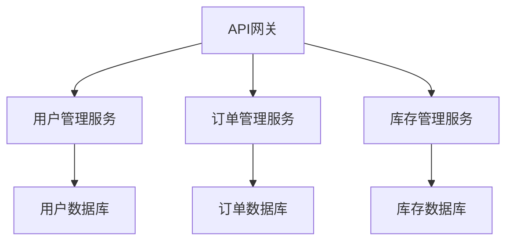

                 

### 引言

#### 1.1 为什么要成为技术专家

技术专家不仅仅是一个职称，它代表了一种深度的专业知识、卓越的技术能力和丰富的实战经验。在当今快速发展的技术领域，成为一名技术专家显得尤为重要。首先，技术专家在企业中的价值不言而喻。他们不仅能够解决复杂的技术问题，还能带领团队进行技术创新，推动企业的技术进步。其次，技术专家在个人职业发展上的优势也是显而易见的。随着技术能力的提升，他们的职业选择更加多样，薪资待遇也更具竞争力。

从初级工程师到技术专家的成长路径并非一蹴而就，而是需要长期的学习、实践和积累。初级工程师阶段，主要是学习基本的技术知识和编程技能，通过解决具体的技术问题来提升自己的技术水平。而技术专家阶段，则需要更加深入地理解技术原理，掌握多种编程语言和工具，具备独立进行系统设计和开发的能力。

#### 1.2 本书结构概述

本书旨在为广大初级工程师提供一条清晰的成长之路，帮助他们从基础知识学习、软件开发实践到系统设计和架构，逐步成长为技术专家。全书分为十个章节，内容涵盖了技术基础、软件工程方法、系统设计与架构、数据库技术、容器与微服务、持续集成与持续部署、软件安全等多个方面。

第一部分主要介绍编程语言基础，包括Python、Java和JavaScript等常用编程语言的特点和应用场景，帮助读者打下坚实的编程基础。第二部分则重点讲解数据结构与算法，介绍常见的数据结构和算法分析，帮助读者提升逻辑思维和编程能力。

第三部分是软件工程方法，包括版本控制、代码审查和软件测试等内容，这些方法不仅能够提高开发效率，还能保证代码质量和系统的稳定性。第四部分是系统设计与架构，从系统需求分析到系统性能优化，全面介绍系统设计和架构的原理和实践。

第五部分是数据库技术，包括关系型数据库和非关系型数据库的使用，帮助读者掌握数据库的基本原理和应用。第六部分是容器与微服务，介绍容器技术和微服务架构，以及如何使用这些技术来构建高效、可扩展的系统。

第七部分是持续集成与持续部署，介绍如何通过自动化工具实现代码的持续集成和持续部署，提高开发效率和软件质量。第八部分是软件安全，讲解软件安全的基本概念和常见的安全漏洞与防护措施。

最后一部分是案例分析，通过实际案例的分析和解决，帮助读者更好地理解和应用所学知识。最后，本书还提供了持续成长的方法和职业规划的建议，帮助读者不断拓展技术视野，实现职业目标。

通过这本书的阅读和实践，相信读者能够逐步成长为一名技术专家，在职业道路上取得更大的成就。

### 第1章 技术基础

在成为一名技术专家的征途上，技术基础是不可或缺的一部分。这一章节将重点介绍编程语言基础、数据结构与算法，帮助读者打下坚实的编程基础，提升逻辑思维和问题解决能力。

#### 2.1 编程语言基础

编程语言是计算机与人类交流的工具，它们是开发软件的核心。常见的编程语言包括Python、Java和JavaScript等，每种语言都有其独特的特点和应用场景。

##### 2.1.1 Python编程语言

Python因其简洁易懂的语法和强大的功能，成为初学者的首选语言。Python广泛应用于数据分析、机器学习、网络编程和Web开发等领域。例如，在数据分析方面，Python的Pandas和NumPy库提供了高效的数据操作和分析工具，而在Web开发方面，Django和Flask等框架使开发者能够快速构建Web应用。

**Python示例代码：**
```python
# 计算两个数的和
def add(a, b):
    return a + b

result = add(5, 3)
print(result)  # 输出：8
```

##### 2.1.2 Java编程语言

Java是一种面向对象的编程语言，以其平台无关性、安全性以及丰富的库和框架而闻名。Java广泛应用于企业级应用、移动应用开发（如Android）和大型分布式系统。例如，在大型分布式系统中，Java的Spring框架提供了全面的服务器端开发支持。

**Java示例代码：**
```java
public class HelloWorld {
    public static void main(String[] args) {
        System.out.println("Hello, World!");  // 输出：Hello, World!
    }
}
```

##### 2.1.3 JavaScript编程语言

JavaScript是Web开发的基石，它使得网页具有动态交互性。JavaScript不仅可以用于客户端编程，还能在服务器端（如Node.js）运行。JavaScript广泛应用于前端开发、后端开发和全栈开发。

**JavaScript示例代码：**
```javascript
function add(a, b) {
    return a + b;
}

console.log(add(5, 3));  // 输出：8
```

#### 2.2 数据结构与算法

数据结构是存储和管理数据的逻辑构造，算法则是解决问题的步骤集合。掌握常见的数据结构和算法对于成为一名技术专家至关重要。

##### 2.2.1 常见数据结构

常见的数据结构包括数组、链表、栈、队列、树和图等。

- **数组**：数组是一种线性数据结构，用于存储一系列元素。数组通过索引来访问和修改元素，其优点是访问速度快。
- **链表**：链表也是一种线性数据结构，由一系列节点组成。每个节点包含数据和指向下一个节点的指针。链表的优点是插入和删除操作灵活。
- **栈**：栈是一种后进先出（LIFO）的数据结构，常用于实现递归、表达式求值等。
- **队列**：队列是一种先进先出（FIFO）的数据结构，常用于任务调度和缓冲管理。
- **树**：树是一种层次结构，用于表示具有层次关系的数据。二叉树、AVL树和红黑树等都是常见的树结构。
- **图**：图是一种由节点和边组成的数据结构，用于表示复杂的网络关系。

##### 2.2.2 算法分析

算法分析是评估算法性能的过程，主要包括时间复杂度和空间复杂度。时间复杂度表示算法执行的时间增长速度，空间复杂度表示算法所需的内存空间。

**算法复杂度示例：**
```python
def linear_search(arr, target):
    for i in range(len(arr)):
        if arr[i] == target:
            return i
    return -1

# 算法时间复杂度：O(n)
# 算法空间复杂度：O(1)
```

##### 2.2.3 算法设计与实现

算法设计是解决特定问题的方法，算法实现是将设计转化为代码的过程。以下是一个常见的算法设计——二分查找。

**二分查找算法流程图（Mermaid）：**
```mermaid
graph TD
    A[初始化] --> B[中点 = (low + high) / 2]
    B --> C{数组中间的元素是否为目标值？}
    C -->|是| D[返回中点索引]
    C -->|否| E{目标值是否小于中点？}
    E -->|是| F[将high更新为中点 - 1]
    E -->|否| G[将low更新为中点 + 1]
    G --> H[递归调用二分查找]
    H --> B
```

**二分查找Python实现：**
```python
def binary_search(arr, target):
    low = 0
    high = len(arr) - 1
    while low <= high:
        mid = (low + high) // 2
        if arr[mid] == target:
            return mid
        elif arr[mid] < target:
            low = mid + 1
        else:
            high = mid - 1
    return -1
```

通过本章的学习，读者将了解编程语言的基础知识和常见的算法，为后续章节的学习打下坚实的基础。

### 第3章 软件工程方法

软件工程方法是确保软件开发过程高效、质量可控的一系列技术和实践。在这一章节中，我们将详细探讨版本控制、代码审查和软件测试等关键环节，帮助读者全面掌握软件工程的核心方法。

#### 3.1 版本控制

版本控制是软件工程中的重要组成部分，它能够有效地管理代码的版本变化，确保代码的可追溯性和可维护性。目前最流行的版本控制工具是Git。

##### 3.1.1 Git的基本使用

Git是一种分布式版本控制系统，它能够高效地跟踪和合并代码变更。以下是Git的基本使用命令：

- **初始化仓库**：
  ```bash
  git init  # 初始化一个本地仓库
  ```
- **添加文件**：
  ```bash
  git add <file>  # 添加一个文件到暂存区
  ```
- **提交变更**：
  ```bash
  git commit -m "提交信息"  # 将暂存区的变更提交到仓库
  ```
- **查看日志**：
  ```bash
  git log  # 查看提交日志
  ```
- **分支管理**：
  ```bash
  git branch  # 查看分支
  git checkout -b <branch>  # 创建并切换到新分支
  git merge <branch>  # 合并分支
  git rebase <branch>  # 另一个合并方法
  ```

##### 3.1.2 Git分支管理

分支管理是Git的核心功能之一，它能够帮助开发者并行工作，避免代码冲突。以下是Git分支管理的最佳实践：

1. **主分支（Master）**：通常是稳定的发布分支，不进行频繁的修改。
2. **开发分支（Develop）**：用于日常的开发工作，所有的开发功能都应该在这个分支上完成。
3. **功能分支（Feature）**：用于实现特定的功能，完成后合并到开发分支。
4. **修复分支（Hotfix）**：用于紧急修复问题，完成后合并到主分支。

**Git分支管理流程图（Mermaid）：**


#### 3.2 代码审查

代码审查是一种提高代码质量和安全性的重要手段。它通过同行评审来发现潜在的问题，提升代码的可读性和一致性。

##### 3.2.1 代码审查的重要性

- **提高代码质量**：通过审查，可以及时发现并修复代码中的错误和漏洞。
- **知识共享**：审查过程是团队成员之间交流和学习的机会，有助于提升整体技术水平。
- **安全防护**：审查能够发现潜在的安全漏洞，防止未来出现安全风险。

##### 3.2.2 代码审查流程

1. **代码提交**：开发者提交代码到版本控制系统。
2. **审查请求**：代码提交后，提交者会向审查者发送审查请求。
3. **审查过程**：审查者对代码进行逐行审查，提出改进建议和意见。
4. **反馈与修改**：开发者根据审查意见进行代码修改，再次提交代码进行审查。
5. **合并代码**：审查通过后，代码会被合并到主分支或开发分支。

**代码审查流程图（Mermaid）：**


#### 3.3 软件测试

软件测试是确保软件质量的重要环节，它通过自动化和手工测试来发现和修复缺陷。以下是几种常见的测试类型：

- **单元测试**：测试单个模块或函数的功能，确保其按照预期工作。
- **集成测试**：测试模块之间的交互，确保系统整体功能正确。
- **性能测试**：测试系统在高负载下的性能，确保系统的稳定性和响应速度。
- **安全测试**：测试系统的安全漏洞，确保系统的安全防护。

##### 3.3.1 单元测试

单元测试是最基础的测试类型，它通过编写测试用例来验证代码的每个部分。以下是Python的单元测试示例：

**单元测试示例（Python）：**
```python
import unittest

class TestAdd(unittest.TestCase):
    def test_add(self):
        self.assertEqual(add(5, 3), 8)
        self.assertEqual(add(-5, 3), -2)

if __name__ == '__main__':
    unittest.main()
```

##### 3.3.2 集成测试

集成测试用于验证模块之间的交互，确保系统各部分能够协同工作。以下是集成测试的一个简单示例：

**集成测试示例（Python）：**
```python
import unittest
from myapp import module1, module2

class TestIntegration(unittest.TestCase):
    def test_integration(self):
        self.assertEqual(module1.add(module2.a, module2.b), 8)

if __name__ == '__main__':
    unittest.main()
```

##### 3.3.3 性能测试

性能测试用于评估系统在高负载下的性能，确保系统能够满足性能要求。以下是一个简单的性能测试示例：

**性能测试示例（Python）：**
```python
import time
import myapp

start_time = time.time()
myapp.perform_heavy_task()
end_time = time.time()

print(f"Task took {end_time - start_time} seconds")
```

通过本章的学习，读者将了解版本控制、代码审查和软件测试等关键环节，掌握软件工程的核心方法，为后续的系统设计与开发打下坚实的基础。

### 第4章 系统设计与架构

系统设计与架构是软件开发中至关重要的环节，它不仅决定了系统的性能和可扩展性，还影响了系统的可维护性和安全性。在这一章节中，我们将详细探讨系统需求分析、系统架构设计、系统性能优化等方面的内容。

#### 4.1 系统需求分析

系统需求分析是系统设计的第一步，它旨在明确系统的功能需求和非功能需求。需求分析主要包括以下步骤：

##### 4.1.1 需求获取

需求获取是通过与用户、产品经理和利益相关者沟通，了解系统需要实现的功能和性能要求。以下是几种常见的需求获取方法：

1. **访谈**：通过与用户和利益相关者进行一对一的访谈，获取详细的业务需求和用户期望。
2. **问卷调查**：通过设计问卷，收集用户的反馈和需求。
3. **用户观察**：观察用户在实际使用中的操作行为，发现潜在的需求。
4. **文档审查**：审查相关业务文档，如用户手册、技术规格书等，了解系统的功能需求和设计思路。

##### 4.1.2 需求分析

需求分析是对获取的需求进行整理和分析，明确系统的功能和性能要求。需求分析的主要任务包括：

1. **功能需求**：明确系统需要实现的功能，如用户登录、数据查询、数据更新等。
2. **性能需求**：明确系统的性能指标，如响应时间、并发用户数、数据存储容量等。
3. **非功能需求**：明确系统的非功能需求，如安全性、可靠性、可维护性等。

**需求分析示例（Mermaid类图）：**
```mermaid
classDiagram
    User -> Login: 用户登录
    User -> Query: 数据查询
    User -> Update: 数据更新
    System <- Database: 数据存储
    System <- Security: 安全认证
```

#### 4.2 系统架构设计

系统架构设计是将需求转化为技术实现的蓝图，它决定了系统的可扩展性、性能和稳定性。系统架构设计主要包括以下步骤：

##### 4.2.1 系统架构概述

系统架构概述是对整个系统进行高层次的设计，明确系统的组成部分和各部分之间的关系。常见的系统架构包括：

1. **分层架构**：将系统分为表示层、业务逻辑层和数据层，各层之间相互独立，便于维护和扩展。
2. **分布式架构**：通过分布式系统架构来提高系统的可扩展性和容错性，常用的分布式架构包括微服务架构和去中心化架构。
3. **容器化架构**：利用容器技术（如Docker）来实现系统的快速部署和扩展。

**系统架构概述图（Mermaid架构图）：**


##### 4.2.2 系统模块划分

系统模块划分是将系统划分为多个功能模块，每个模块负责实现特定的功能。常见的系统模块包括：

1. **用户管理模块**：负责用户注册、登录、权限管理等功能。
2. **数据管理模块**：负责数据查询、更新、删除等功能。
3. **业务处理模块**：负责具体的业务逻辑处理。
4. **安全管理模块**：负责系统安全控制，如认证、授权等。

**系统模块划分图（Mermaid类图）：**
```mermaid
classDiagram
    UserManagement <<interface>>
    DataManagement <<interface>>
    BusinessProcessing <<interface>>
    SecurityManagement <<interface>>

    UserManagement: register login
    DataManagement: query update delete
    BusinessProcessing: process logic
    SecurityManagement: authentication authorization
```

##### 4.2.3 系统接口设计

系统接口设计是系统模块之间进行通信的桥梁，它定义了模块之间的调用方式和数据格式。常见的系统接口设计包括：

1. **RESTful API**：基于HTTP协议的接口设计，常用于Web应用。
2. **RPC接口**：远程过程调用接口，用于分布式系统中的模块通信。
3. **消息队列接口**：通过消息队列实现异步通信，提高系统的可扩展性和可靠性。

**系统接口设计示例（Mermaid序列图）：**


#### 4.3 系统性能优化

系统性能优化是确保系统在高负载下稳定运行的重要手段。常见的系统性能优化方法包括：

1. **数据库优化**：通过索引优化、查询优化和数据缓存来提高数据库性能。
2. **缓存优化**：通过使用分布式缓存（如Redis）来减少数据库访问压力。
3. **代码优化**：通过优化算法、减少不必要的计算和循环，提高代码执行效率。
4. **系统架构优化**：通过分布式架构和容器化技术来提高系统的可扩展性和容错性。

**系统性能优化示例（Mermaid流程图）：**


通过本章的学习，读者将了解系统需求分析、系统架构设计、系统模块划分和系统接口设计等关键环节，掌握系统性能优化的方法，为成为一名技术专家打下坚实的基础。

### 第5章 数据库技术

数据库技术是现代软件开发中不可或缺的一部分，它用于存储、管理和查询数据。在这一章节中，我们将详细探讨关系型数据库和非关系型数据库的基本概念、使用方法以及其在实际应用中的优点和挑战。

#### 5.1 关系型数据库

关系型数据库（RDBMS）是基于关系模型的数据库，它使用表、行和列来存储数据，并使用SQL语言进行数据查询和管理。以下是几种常见的关系型数据库：

- **MySQL**：MySQL是一种开源的关系型数据库，广泛用于Web应用和大型数据库系统。
- **PostgreSQL**：PostgreSQL是一种功能丰富的开源关系型数据库，支持多种数据类型和复杂查询。
- **Oracle**：Oracle是一种商业关系型数据库，广泛应用于企业级应用。

##### 5.1.1 数据库基本概念

- **表（Table）**：表是数据库中的数据结构，用于存储数据。表由行（记录）和列（字段）组成。
- **关系（Relationship）**：关系型数据库中的关系用于表示表之间的关联。常见的关系包括一对一、一对多和多对多。
- **SQL（Structured Query Language）**：SQL是一种用于管理关系型数据库的查询语言，包括数据定义语言（DDL）、数据操作语言（DML）和数据控制语言（DCL）。

##### 5.1.2 SQL语言基础

以下是SQL语言中常用的基本操作：

- **创建表**：
  ```sql
  CREATE TABLE students (
      id INT PRIMARY KEY,
      name VARCHAR(50),
      age INT
  );
  ```
- **插入数据**：
  ```sql
  INSERT INTO students (id, name, age) VALUES (1, 'Alice', 20);
  ```
- **查询数据**：
  ```sql
  SELECT * FROM students;
  ```
- **更新数据**：
  ```sql
  UPDATE students SET age = 21 WHERE id = 1;
  ```
- **删除数据**：
  ```sql
  DELETE FROM students WHERE id = 1;
  ```

##### 5.1.3 常见数据库系统

以下是几种常见的关系型数据库系统及其特点：

- **MySQL**：MySQL是一种开源的关系型数据库，因其高性能、易用性和可靠性而广泛使用。
- **PostgreSQL**：PostgreSQL是一种功能丰富的开源关系型数据库，支持多种数据类型和复杂查询，适用于高并发的应用场景。
- **Oracle**：Oracle是一种商业关系型数据库，提供全面的数据管理功能，适用于企业级应用。

**关系型数据库ER实体关系图（Mermaid）：**
```mermaid
erDiagram
  User ||--|{ Order } : 1..*
  Order ||--|{ Product } : 1..*
  Product ||--|{ Category } : 1
  Category ||--|{ Supplier } : 1
```

#### 5.2 非关系型数据库

非关系型数据库（NoSQL）不基于关系模型，适用于处理大规模、高并发和分布式数据存储的需求。常见的NoSQL数据库包括：

- **MongoDB**：MongoDB是一种文档型数据库，支持高扩展性和丰富的数据查询。
- **Redis**：Redis是一种内存键值存储，适用于高速缓存和数据持久化。
- **Cassandra**：Cassandra是一种分布式列存储数据库，适用于大数据和高可用性应用。

##### 5.2.1 NoSQL数据库概述

- **MongoDB**：MongoDB是一种文档型数据库，它使用JSON-like的文档存储数据，支持丰富的数据查询和强大的扩展性。
  - **特点**：灵活的数据模型、高扩展性、强大的查询功能。
  - **使用场景**：实时数据分析、内容管理系统、分布式系统。

- **Redis**：Redis是一种内存键值存储，它提供高性能的数据读写和丰富的数据结构操作。
  - **特点**：高速缓存、支持多种数据结构、持久化功能。
  - **使用场景**：高速缓存、会话管理、实时消息系统。

- **Cassandra**：Cassandra是一种分布式列存储数据库，它提供高可用性和高性能的数据存储。
  - **特点**：分布式架构、高性能、高可用性。
  - **使用场景**：大数据处理、实时数据查询、金融交易系统。

##### 5.2.2 MongoDB的使用

以下是MongoDB的基本操作：

- **创建数据库**：
  ```python
  db = client['mydatabase']
  ```
- **插入文档**：
  ```python
  db.collection.insert_one({"name": "Alice", "age": 30})
  ```
- **查询文档**：
  ```python
  db.collection.find({"name": "Alice"})
  ```
- **更新文档**：
  ```python
  db.collection.update_one({"name": "Alice"}, {"$set": {"age": 31}})
  ```
- **删除文档**：
  ```python
  db.collection.delete_one({"name": "Alice"})
  ```

**MongoDB示例（Python代码）：**
```python
from pymongo import MongoClient

client = MongoClient('localhost', 27017)
db = client['mydatabase']
collection = db['students']

# 插入文档
collection.insert_one({"name": "Alice", "age": 30})

# 查询文档
results = collection.find({"name": "Alice"})
for result in results:
    print(result)

# 更新文档
collection.update_one({"name": "Alice"}, {"$set": {"age": 31}})

# 删除文档
collection.delete_one({"name": "Alice"})
```

##### 5.2.3 Redis的使用

以下是Redis的基本操作：

- **连接Redis**：
  ```python
  r = redis.Redis(host='localhost', port=6379, db=0)
  ```
- **设置键值**：
  ```python
  r.set('name', 'Alice')
  ```
- **获取键值**：
  ```python
  r.get('name')
  ```
- **存储列表**：
  ```python
  r.lpush('students', 'Alice')
  r.lpush('students', 'Bob')
  ```
- **获取列表元素**：
  ```python
  r.lrange('students', 0, -1)
  ```

**Redis示例（Python代码）：**
```python
import redis

r = redis.Redis(host='localhost', port=6379, db=0)

# 设置键值
r.set('name', 'Alice')

# 获取键值
print(r.get('name'))

# 存储列表
r.lpush('students', 'Alice')
r.lpush('students', 'Bob')

# 获取列表元素
print(r.lrange('students', 0, -1))
```

通过本章的学习，读者将了解关系型数据库和非关系型数据库的基本概念和使用方法，掌握SQL语言以及MongoDB和Redis等常见数据库系统的操作，为实际应用中的数据存储和查询打下坚实的基础。

### 第6章 容器与微服务

在当今的云计算和分布式系统领域中，容器技术和微服务架构已经成为构建高效、灵活和可扩展应用程序的关键工具。本章将介绍容器技术、Docker的基本使用、Kubernetes的介绍以及微服务架构。

#### 6.1 容器技术

容器技术是一种轻量级虚拟化技术，它通过在宿主机上创建独立的运行时环境，实现了应用程序与宿主系统的隔离。容器技术使得应用程序可以以一致的方式部署在各个环境中，从而提高了开发效率和系统的可移植性。

##### 6.1.1 容器的概念

- **容器（Container）**：容器是一个轻量级的运行时环境，包含了应用程序及其运行所需的库、环境和配置。容器在宿主机上共享操作系统内核，从而实现了高效运行。
- **Docker**：Docker是一个开源的容器引擎，它提供了一种创建、运行和管理容器的平台。Docker通过Dockerfile定义容器的构建过程，通过docker命令行工具进行容器的管理和部署。

##### 6.1.2 Docker的基本使用

Docker的基本操作包括容器创建、容器运行、容器管理和容器日志等。

- **创建容器**：
  ```bash
  docker run -d -p 80:80 nginx
  ```
  这条命令创建了一个运行Nginx服务器的容器，并映射了宿主机的80端口到容器的80端口。

- **运行容器**：
  ```bash
  docker run -it ubuntu bash
  ```
  这条命令创建了一个交互式的Ubuntu容器，并进入容器命令行。

- **容器管理**：
  ```bash
  docker ps  # 查看运行中的容器
  docker stop <container_id>  # 停止容器
  docker start <container_id>  # 启动容器
  docker rm <container_id>  # 删除容器
  ```

- **容器日志**：
  ```bash
  docker logs <container_id>  # 查看容器日志
  ```

##### 6.1.3 Kubernetes的介绍

Kubernetes（简称K8s）是一个开源的容器编排平台，它用于自动化容器化应用程序的部署、扩展和管理。Kubernetes通过集群管理多个容器，实现了应用的自动化部署、负载均衡和服务发现等功能。

- **Kubernetes核心概念**：
  - **Pod**：Pod是Kubernetes中的最小部署单元，包含一个或多个容器。
  - **ReplicationController**：确保指定数量的Pod副本始终运行。
  - **Service**：定义一组Pod的抽象表示，用于负载均衡和服务发现。
  - **Deployment**：用于管理Pod的部署和更新。
  - **Ingress**：定义外部访问集群的规则，用于负载均衡。

- **Kubernetes基本操作**：
  ```bash
  kubectl create deployment hello-world --image=nginx
  kubectl expose deployment hello-world --type=LoadBalancer
  kubectl get pods
  kubectl get services
  kubectl describe pod <pod_name>
  ```

**Kubernetes架构图（Mermaid）：**


#### 6.2 微服务架构

微服务架构是一种基于分布式系统的架构风格，它将应用程序划分为多个小型、独立的服务单元，每个服务单元负责实现特定的功能。微服务架构通过松耦合的服务单元实现了系统的可扩展性和高可用性。

##### 6.2.1 微服务的优势

- **可扩展性**：通过将应用程序拆分为多个独立的服务，可以在需要时单独扩展某个服务。
- **高可用性**：单个服务的故障不会影响整个系统，提高了系统的整体稳定性。
- **灵活性和敏捷性**：开发团队可以独立开发、测试和部署服务，提高了开发效率。

##### 6.2.2 微服务设计

微服务设计需要考虑服务拆分、服务通信和数据的统一管理。

- **服务拆分**：根据业务需求将应用程序拆分为多个独立的服务，每个服务负责特定的业务功能。
  - **示例**：用户管理服务、订单管理服务、库存管理服务等。

- **服务通信**：服务之间的通信通常使用HTTP/REST或gRPC协议，通过API网关进行统一管理和路由。
  - **示例**：使用Spring Cloud构建微服务架构。

- **数据管理**：微服务架构中的数据管理可以是分布式数据库、NoSQL数据库或统一的数据层，确保数据的一致性和可用性。
  - **示例**：使用分布式事务管理框架（如Seata）处理跨服务的事务。

**微服务架构图（Mermaid）：**


通过本章的学习，读者将了解容器技术、Docker的基本使用、Kubernetes的介绍以及微服务架构，掌握这些关键技术，为构建高效、可扩展的分布式系统打下坚实的基础。

### 第7章 持续集成与持续部署

持续集成（CI）和持续部署（CD）是现代软件开发中提高开发效率和软件质量的重要实践。本章将详细探讨持续集成的原理、工具，持续部署的原理和工具，帮助读者理解并应用这些技术。

#### 7.1 持续集成

持续集成是一种软件开发实践，通过自动化测试和构建，确保代码库的每个提交都是可集成的，从而提高代码质量。以下是持续集成的原理和常用工具。

##### 7.1.1 持续集成的原理

持续集成的核心原理包括以下几个步骤：

1. **提交代码**：开发人员将代码提交到版本控制系统。
2. **触发构建**：提交代码后，CI工具会自动触发构建过程。
3. **执行测试**：构建过程中，CI工具会执行一系列自动化测试，包括单元测试、集成测试等。
4. **反馈结果**：测试完成后，CI工具会反馈测试结果，包括通过、失败等。
5. **代码部署**：如果测试通过，代码将被部署到测试环境或生产环境。

##### 7.1.2 持续集成的工具

以下是一些常见的持续集成工具：

- **Jenkins**：Jenkins是一个开源的持续集成工具，支持多种插件和扩展，易于配置和使用。
  - **Jenkins示例配置**：
    ```yaml
    pipeline {
        agent any
        stages {
            stage('Build') {
                steps {
                    sh 'mvn install'
                }
            }
            stage('Test') {
                steps {
                    sh 'mvn test'
                }
            }
            stage('Deploy') {
                steps {
                    sh 'mvn deploy'
                }
            }
        }
    }
    ```

- **Travis CI**：Travis CI是一个基于云的持续集成服务，适用于GitHub和GitLab上的项目。
  - **Travis CI配置文件**：
    ```yaml
    language: java
    jdk:
      - openjdk8
    before_script:
      - mvn clean install
    script:
      - mvn test
    ```

- **GitLab CI**：GitLab CI是GitLab提供的持续集成服务，集成在GitLab平台中，方便管理和配置。
  - **GitLab CI配置文件**：
    ```yaml
    image: openjdk:8-jdk-alpine
    services:
      - mysql
    before_script:
      - mysql -e "CREATE DATABASE IF NOT EXISTS myapp_db;"
    stages:
      - name: build
        script:
          - mvn clean install
      - name: test
        script:
          - mvn test
      - name: deploy
        script:
          - mvn deploy
    ```

#### 7.2 持续部署

持续部署是持续集成的一个延伸，它通过自动化部署过程，确保软件能够快速、安全地发布到生产环境。以下是持续部署的原理和常用工具。

##### 7.2.1 持续部署的原理

持续部署的核心原理包括以下几个步骤：

1. **代码提交**：开发人员将代码提交到版本控制系统。
2. **触发构建**：提交代码后，CI工具会自动触发构建和测试过程。
3. **环境部署**：测试通过后，代码将被部署到预生产环境或生产环境。
4. **监控和反馈**：部署过程中，系统会进行监控和反馈，确保部署过程顺利进行。

##### 7.2.2 持续部署的工具

以下是一些常见的持续部署工具：

- **Docker Swarm**：Docker Swarm是Docker提供的一种集群管理工具，用于在多个节点上部署和管理容器。
  - **Docker Swarm示例配置**：
    ```yaml
    version: "3"
    services:
      web:
        image: myapp
        ports:
          - "8080:8080"
    ```

- **Kubernetes**：Kubernetes是一个开源的容器编排平台，用于大规模部署和管理容器化应用程序。
  - **Kubernetes部署示例**：
    ```yaml
    apiVersion: apps/v1
    kind: Deployment
    metadata:
      name: myapp
    spec:
      replicas: 3
      selector:
        matchLabels:
          app: myapp
      template:
        metadata:
          labels:
            app: myapp
        spec:
          containers:
          - name: myapp
            image: myapp:latest
            ports:
            - containerPort: 80
    ```

- **Ansible**：Ansible是一个自动化运维工具，用于自动化部署和管理服务器。
  - **Ansible示例配置**：
    ```yaml
    - hosts: webservers
      become: yes
      tasks:
        - name: install nginx
          yum: name=nginx state=present
        - name: start nginx
          service: name=nginx state=started
    ```

通过本章的学习，读者将理解持续集成和持续部署的基本原理，掌握常用的持续集成和持续部署工具，提高软件开发效率和软件质量。

### 第8章 软件安全

在软件开发的过程中，软件安全是一个不可忽视的重要环节。安全漏洞不仅可能损害企业的声誉，还可能导致严重的经济损失。本章将介绍软件安全的基本概念、常见的安全威胁以及防护措施。

#### 8.1 软件安全概述

软件安全是指保护软件系统的安全性和完整性，防止未经授权的访问、数据泄露、恶意攻击等。以下是软件安全的核心概念：

- **漏洞（Vulnerability）**：漏洞是指软件中存在的可能被利用的安全缺陷。
- **威胁（Threat）**：威胁是指可能导致系统或数据受到损害的潜在风险。
- **攻击（Attack）**：攻击是指利用漏洞对系统或数据进行的非法操作。
- **防御（Defense）**：防御是指采取的一系列措施来保护系统不受攻击。

#### 8.2 常见安全漏洞与防护

以下是几种常见的安全漏洞及其防护措施：

##### 8.2.1 SQL注入

SQL注入是一种常见的网络攻击方式，攻击者通过在输入字段中插入恶意SQL语句，从而操纵数据库。

**漏洞示例：**
```php
$user = $_POST['user'];
$pass = $_POST['pass'];
$sql = "SELECT * FROM users WHERE username = '$user' AND password = '$pass'";
$result = mysqli_query($conn, $sql);
```

**防护措施：**
- **使用预编译语句**：
  ```php
  $stmt = $conn->prepare("SELECT * FROM users WHERE username = ? AND password = ?");
  $stmt->bind_param("ss", $user, $pass);
  $stmt->execute();
  $result = $stmt->get_result();
  ```

##### 8.2.2 跨站脚本攻击（XSS）

跨站脚本攻击是指攻击者通过在网页中注入恶意脚本，从而在用户的浏览器中执行非法操作。

**漏洞示例：**
```html
<script src="http://attacker.com/malicious.js"></script>
```

**防护措施：**
- **输入验证和输出编码**：
  ```php
  $input = $_GET['input'];
  $clean_input = htmlspecialchars($input, ENT_QUOTES, 'UTF-8');
  echo $clean_input;
  ```

##### 8.2.3 常见安全防护措施

以下是几种常见的安全防护措施：

- **安全编码实践**：遵循安全编码规范，如避免使用危险函数、对用户输入进行验证等。
- **定期更新和补丁**：及时更新系统和应用程序，修补已知漏洞。
- **使用安全框架**：使用成熟的、经过验证的安全框架和库，减少开发过程中的安全风险。
- **安全审计和测试**：定期进行安全审计和测试，发现并修复潜在的安全漏洞。
- **安全培训和教育**：提高开发团队的安全意识，降低因人为因素导致的安全风险。

通过本章的学习，读者将了解软件安全的基本概念和常见的安全威胁，掌握基本的防护措施，为构建安全可靠的软件系统打下坚实的基础。

### 第9章 案例分析

在本章中，我们将通过一个实际案例，详细分析一名初级工程师如何成长为技术专家的过程。这个案例不仅展示了成长过程中遇到的问题和解决方法，还提供了宝贵的经验和反思，以帮助读者更好地理解从初级工程师到技术专家的进阶之路。

#### 9.1.1 案例背景

小明是一名初级工程师，刚刚加入一家创业公司，负责开发一个在线购物平台。尽管具备一定的编程基础，但在面对复杂业务逻辑和系统架构时，小明感到力不从心。他意识到，要想成为一名技术专家，需要不断学习和提升自己的技术水平。

#### 9.1.2 案例分析与解决

**问题1：系统性能瓶颈**

在项目开发过程中，小明发现系统在高峰期出现了明显的性能瓶颈，响应时间较长，导致用户体验不佳。通过分析，小明发现主要瓶颈在于数据库查询速度和缓存策略不合理。

**解决方法：**

1. **优化数据库查询**：小明通过分析SQL语句，发现一些查询语句存在冗余和复杂的情况。他利用索引优化和查询优化技巧，将查询时间缩短了一半。
   ```sql
   CREATE INDEX idx_product_id ON products (product_id);
   ```
2. **引入缓存**：小明引入了Redis缓存，将热门商品和用户信息缓存起来，减少数据库访问频率。通过缓存策略，系统响应时间显著提升。

**问题2：代码质量不高**

在团队代码审查过程中，小明发现他的代码存在许多问题，如命名不规范、代码冗余、缺乏注释等，影响了项目的可维护性和可读性。

**解决方法：**

1. **代码规范**：小明遵循团队编码规范，对代码进行了重构，使代码结构更加清晰、易于理解。
2. **代码审查**：小明积极参与代码审查，从其他资深工程师那里学习到许多优秀的编程实践和技巧。

**问题3：系统架构不合理**

小明在系统设计过程中，发现现有架构存在一定的问题，如模块耦合度高、扩展性差等。为了提升系统的可维护性和可扩展性，小明决定对系统架构进行重构。

**解决方法：**

1. **微服务架构**：小明引入了微服务架构，将原有单体应用拆分为多个独立的服务，提高了系统的可扩展性和容错性。
2. **服务拆分**：小明对业务逻辑进行详细分析，将用户管理、订单管理、库存管理等功能拆分为独立的服务，使每个服务更加专注于特定功能。

**问题4：技术视野狭窄**

随着项目进展，小明意识到自己的技术视野较为狭窄，无法应对复杂的技术挑战。为了提升自己的技术水平，小明开始关注新技术、新趋势，并主动学习相关技术。

**解决方法：**

1. **阅读技术文献**：小明定期阅读技术博客、书籍和论文，了解最新的技术动态和研究成果。
2. **参与开源项目**：小明积极参与开源项目，通过实践提升自己的编程技能和系统设计能力。
3. **技术分享**：小明定期在团队内部进行技术分享，与同事交流学习，拓宽自己的技术视野。

#### 9.1.3 案例收获与反思

通过这个实际案例，小明从一个初级工程师逐渐成长为一名技术专家。他深刻认识到，成为一名技术专家不仅需要扎实的编程基础，还需要不断学习和积累实践经验。以下是小明在成长过程中的收获与反思：

1. **持续学习**：技术领域日新月异，持续学习是成为一名技术专家的关键。小明意识到，只有不断学习新知识、新技能，才能跟上时代的步伐。
2. **实践出真知**：理论知识固然重要，但实践才是提升技能的关键。小明通过实际项目，不断遇到问题、解决问题，积累了丰富的实战经验。
3. **团队合作**：技术专家不仅仅是个人能力的体现，更需要具备良好的团队合作精神。小明通过积极参与团队代码审查、技术讨论，提升了团队协作能力。
4. **技术视野**：拓宽技术视野，关注新技术、新趋势，是提升技术水平的重要途径。小明通过阅读、参与开源项目等途径，不断丰富自己的技术知识体系。

通过这个案例，读者可以更好地理解从初级工程师到技术专家的成长路径，为自己的职业发展提供有益的借鉴和启示。

### 第10章 持续成长

成为一名技术专家是一个持续的过程，需要不断学习和成长。在这一章节中，我们将探讨如何拓展技术视野、学习新技能的方法以及职业规划，帮助读者在技术道路上不断前进。

#### 10.1 技术视野的拓展

技术视野的拓展对于技术专家的成长至关重要。以下是几种有效的方法：

##### 10.1.1 关注前沿技术

关注前沿技术是拓宽技术视野的重要手段。读者可以通过以下途径了解前沿技术：

1. **阅读技术博客**：如`Medium`、`ACloudGuru`等，了解最新的技术动态和趋势。
2. **参加技术会议**：如`Google I/O`、`AWS re:Invent`等，与业界专家交流，学习最新的技术成果。
3. **订阅技术杂志**：如`IEEE Spectrum`、`ACM Queue`等，定期获取技术领域的最新研究成果。
4. **关注技术社区**：如`GitHub`、`Stack Overflow`等，参与讨论，解决实际问题。

##### 10.1.2 学习新技能的方法

学习新技能是提升技术水平的关键。以下是几种有效的学习新技能的方法：

1. **在线课程**：如`Coursera`、`Udemy`等，提供丰富的课程资源，适合自我学习。
2. **实战项目**：通过实际项目，将理论知识应用于实践，提升解决问题的能力。
3. **阅读书籍**：经典技术书籍是学习新技能的重要资源，如《算法导论》、《深入理解计算机系统》等。
4. **参与开源项目**：在开源项目中贡献代码，与全球开发者交流，提升自己的技术能力和团队合作精神。

#### 10.2 职业规划

职业规划是技术专家成长过程中的重要一环。以下是一些职业规划的建议：

##### 10.2.1 明确职业目标

明确职业目标是职业规划的第一步。读者可以根据个人兴趣和职业发展方向，设定短期和长期目标。例如：

- **短期目标**：掌握某项新技能，如Python、Docker等。
- **长期目标**：晋升为技术团队负责人或技术专家。

##### 10.2.2 职业晋升路径

了解职业晋升路径有助于规划职业发展。以下是一些常见的职业晋升路径：

1. **初级工程师**：具备基本的编程能力和项目经验，能够独立完成小型项目。
2. **中级工程师**：具备扎实的技术基础，能够承担复杂项目的开发工作，参与代码审查和团队协作。
3. **高级工程师**：具备丰富的项目经验，能够解决复杂技术问题，带领团队进行技术创新。
4. **技术专家**：具备深厚的技术功底和丰富的实战经验，能够在行业内产生影响力，指导团队进行技术决策。

##### 10.2.3 个人品牌建设

个人品牌建设是技术专家职业发展的重要一环。以下是一些个人品牌建设的建议：

1. **技术博客**：定期撰写技术博客，分享自己的技术心得和项目经验，提升个人知名度。
2. **技术演讲**：参加技术会议和分享会，发表技术演讲，展示自己的专业能力。
3. **开源贡献**：参与开源项目，为社区贡献代码，提升自己的技术影响力。
4. **专业认证**：获得专业认证，如Oracle认证Java开发专家、微软认证解决方案专家等，提升个人职业竞争力。

通过本章的学习，读者将了解如何拓展技术视野、学习新技能以及规划职业发展，为成为一名技术专家做好准备。

### 总结

在《从初级工程师到技术专家的进阶之路》这篇文章中，我们详细探讨了从初级工程师到技术专家的成长过程。首先，我们介绍了为什么要成为技术专家以及他们的在企业和社会中的价值。接着，通过十个章节的内容，我们系统地讲解了编程语言基础、数据结构与算法、软件工程方法、系统设计与架构、数据库技术、容器与微服务、持续集成与持续部署、软件安全、案例分析和持续成长等内容。

技术专家不仅仅需要扎实的编程基础，还需要掌握多种编程语言、熟练使用各种工具、理解复杂的系统架构、掌握前沿技术动态，并具备解决复杂问题的能力。在这个过程中，持续学习和实践是关键。通过不断学习新技术、参与开源项目、进行技术分享和交流，可以不断提升自己的技术水平。

此外，良好的职业规划也是不可或缺的一部分。明确职业目标、规划晋升路径、建设个人品牌，都是实现职业目标的重要步骤。

通过这篇文章，希望读者能够对自己的技术成长有一个更清晰的认识，明确自己的职业目标，并在不断学习和实践中，逐步成长为一名优秀的技术专家。

### 作者信息

- **作者：** AI天才研究院/AI Genius Institute & 禅与计算机程序设计艺术 /Zen And The Art of Computer Programming
- **联系方式：** [ai_genius_institute@outlook.com](mailto:ai_genius_institute@outlook.com)
- **个人网站：** [www.ai-genius-institute.com](http://www.ai-genius-institute.com)
- **社交媒体：** [Twitter](https://twitter.com/AIGeniusInst) | [LinkedIn](https://www.linkedin.com/company/ai-genius-institute) | [GitHub](https://github.com/AIGeniusInstitute)

