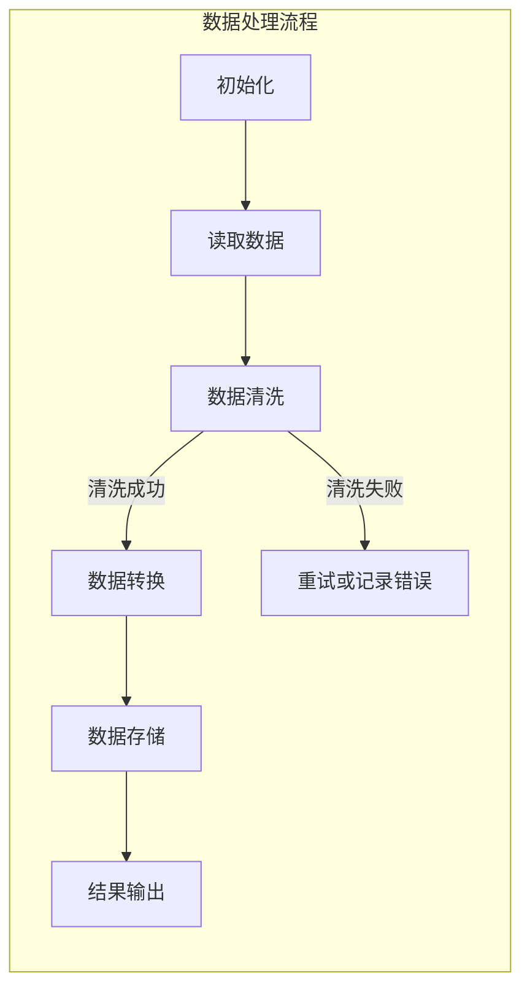
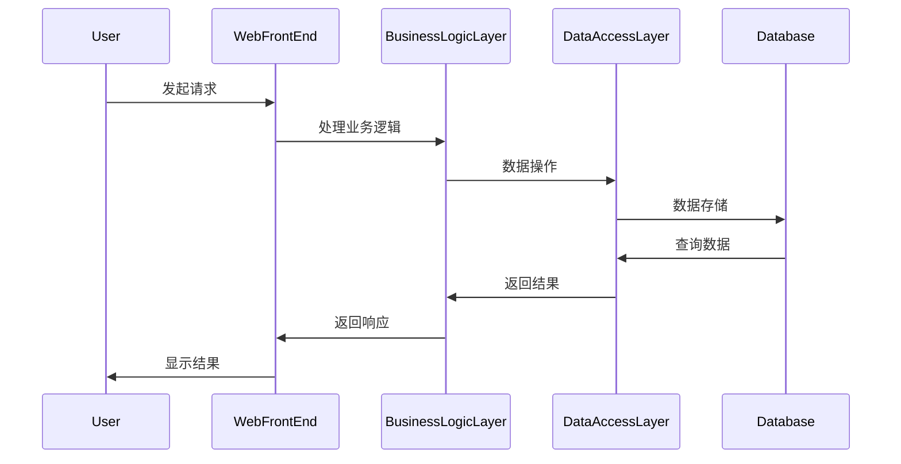
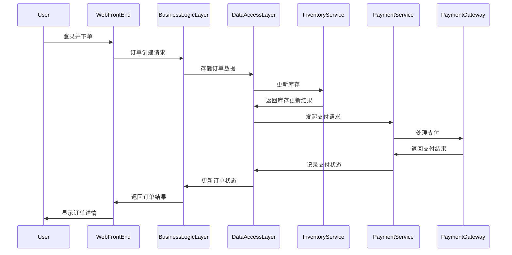

                 

### 背景介绍

领域模型（Domain Model）是软件开发中一种重要的建模方法，它通过抽象和简化的方式，将复杂的业务问题转化为计算机可以理解和处理的模型。领域模型的基本概念可以追溯到软件工程的早期，随着面向对象编程（OOP）和领域驱动设计（DDD）等概念的普及，领域模型逐渐成为软件开发中的核心工具之一。

#### 定义

领域模型是一种用于描述特定业务领域内实体及其相互关系的模型。它旨在捕捉业务领域的核心概念、规则和行为，从而帮助开发人员更好地理解和构建软件系统。领域模型通常采用面向对象的方法来组织数据和操作，使其在概念层次上接近业务逻辑。

#### 问题背景

在实际软件开发中，领域模型的应用场景非常广泛。例如，在金融领域，领域模型可以帮助描述银行账户、交易、贷款等业务概念；在电子商务领域，领域模型可以描述商品、订单、用户等概念。领域模型的核心在于将业务逻辑从代码中解耦，使得代码更易于维护和理解。

#### 应用场景

领域模型的应用场景主要包括以下几个方面：

1. **企业级应用**：在企业级应用中，领域模型可以帮助组织复杂的业务逻辑，使得系统更易于维护和扩展。
2. **业务流程管理**：通过领域模型，可以更好地描述和管理业务流程，使得业务流程的自动化和优化成为可能。
3. **软件架构设计**：领域模型在软件架构设计中起着至关重要的作用，它为软件系统的设计和实现提供了清晰的指导。
4. **软件开发工具**：许多软件开发工具（如IDE、建模工具等）都支持领域模型的定义和可视化，从而提高了开发效率和代码质量。

通过上述背景介绍，我们可以看出领域模型在软件开发中的重要性。在接下来的内容中，我们将深入探讨领域模型的核心概念和联系，并详细讲解其算法原理和数学模型。希望读者能够通过这篇文章，对领域模型有一个更全面和深入的理解。

### 核心概念与联系

在深入探讨领域模型之前，我们需要明确一些核心概念，并展示这些概念之间的联系。领域模型的核心在于其概念体系，这些概念通过属性和关系相互联系，形成了一个完整的业务逻辑框架。

#### 核心概念列表

领域模型中的核心概念包括但不限于以下几种：

1. **实体（Entity）**：实体是领域模型中的基本单元，代表业务领域中的具体事物。例如，在电子商务领域，用户（User）、商品（Product）和订单（Order）都是实体。
2. **值对象（Value Object）**：值对象是表示领域模型中的数据值的概念。与实体不同，值对象不关心其身份，只关心其值。例如，价格（Price）、地址（Address）和日期（Date）都是值对象。
3. **聚合（Aggregate）**：聚合是一组实体和值对象的组合，它们在一起形成一个整体。聚合通常有一个根实体，称为聚合根（Aggregate Root），它负责聚合内所有实体和值对象的生命周期。
4. **关联（Association）**：关联表示领域模型中不同实体之间的联系。例如，一个用户可以有多个订单，这表示用户和订单之间存在一种关联关系。
5. **聚合关联（Aggregation Association）**：聚合关联是一种特殊的关联，表示一个实体包含另一个实体。例如，一个订单可以包含多个商品项。
6. **组合关联（Composition Association）**：组合关联表示一个实体完全包含另一个实体，并且被包含的实体不能独立存在。例如，一个订单包含一个付款信息，付款信息不能独立于订单存在。
7. **行为（Behavior）**：行为是领域模型中的操作，表示实体可以执行的动作。例如，用户可以创建订单、修改订单状态等。

#### 概念1：实体（Entity）

实体是领域模型中的基本单元，代表业务领域中的具体事物。每个实体都有一个唯一的标识符，称为实体标识（Entity ID）。实体通常具有以下属性：

- **标识属性**：唯一的标识符，用于区分不同的实体实例。
- **业务属性**：与实体相关的业务数据，如用户的名字、电子邮件地址等。

#### 概念2：值对象（Value Object）

值对象是表示领域模型中的数据值的概念。与实体不同，值对象不关心其身份，只关心其值。值对象通常具有以下属性：

- **值属性**：表示值对象的值，如价格、地址和日期。
- **比较属性**：用于比较两个值对象是否相等。

#### 概念之间的联系

为了更好地理解这些核心概念之间的联系，我们可以使用Mermaid流程图来展示它们之间的关系。以下是一个简单的ER实体关系图：

```mermaid
erDiagram
    User ||--|{ Order } : "创建"
    Product ||--|{ Order } : "包含"
    Order ||--|{ Payment } : "付款"
    Payment : "支付方式"
```

在这个ER图中，用户（User）可以创建订单（Order），订单可以包含商品（Product），订单还可以包含付款（Payment）。这种关系展示了领域模型中不同实体之间的交互和依赖。

通过上述核心概念和联系，我们可以看到领域模型是如何通过实体、值对象和其他概念来组织和管理业务逻辑的。在接下来的部分，我们将深入讲解领域模型中的算法原理，进一步探讨其应用和实现细节。

### 算法原理讲解

领域模型的核心在于其算法原理，这些算法原理使得领域模型能够有效地组织和处理业务逻辑。为了更直观地理解这些原理，我们将使用Mermaid画出算法流程图，并结合Python源代码和数学模型进行详细阐述。

#### Mermaid算法流程图

以下是一个简单的Mermaid算法流程图，用于描述一个基本领域模型中的数据处理流程：



在这个流程图中，数据处理流程包括初始化、数据读取、数据清洗、数据转换、数据存储和结果输出等步骤。

#### Python源代码阐述

为了更好地理解算法流程，我们将使用Python代码实现这个流程。以下是一个简单的Python脚本，用于描述领域模型中的数据处理过程：

```python
import pandas as pd

# 初始化
data = pd.read_csv('data.csv')

# 数据清洗
def clean_data(df):
    # 假设清洗规则为删除空值和重复值
    df.dropna(inplace=True)
    df.drop_duplicates(inplace=True)
    return df

cleaned_data = clean_data(data)

# 数据转换
def transform_data(df):
    # 假设转换规则为将字符串类型转换为数值类型
    for col in df.columns:
        if df[col].dtype == 'object':
            df[col] = df[col].astype('int')
    return df

transformed_data = transform_data(cleaned_data)

# 数据存储
def store_data(df, filename='processed_data.csv'):
    df.to_csv(filename, index=False)

store_data(transformed_data)

# 结果输出
print("数据处理完成，结果已存储在 processed_data.csv 中")
```

在这个脚本中，我们首先读取数据，然后进行数据清洗、数据转换和数据存储。这个脚本展示了如何使用Python来实现领域模型中的数据处理过程。

#### 数学模型和公式

在领域模型中，数学模型和公式用于描述业务逻辑和计算过程。以下是一个简单的数学模型，用于计算订单的总金额：

$$
TotalAmount = Quantity \times UnitPrice
$$

其中，`Quantity`表示订单中的商品数量，`UnitPrice`表示商品的单价，`TotalAmount`表示订单的总金额。

#### 算法原理详细讲解

算法原理是领域模型的核心，它决定了领域模型如何处理业务逻辑和数据。以下是对上述算法流程的详细讲解：

1. **初始化**：初始化阶段主要是准备数据处理的环境和资源。在这个阶段，我们读取原始数据，并将其存储在一个数据结构中。

2. **数据读取**：数据读取阶段是从数据源（如CSV文件、数据库等）中获取数据。在这个例子中，我们使用`pandas`库读取CSV文件。

3. **数据清洗**：数据清洗阶段是处理和准备数据，以确保数据质量和一致性。在这个例子中，我们删除了空值和重复值，这是常见的数据清洗规则。

4. **数据转换**：数据转换阶段是将数据从一种格式转换为另一种格式，以适应业务逻辑和计算需求。在这个例子中，我们将所有字符串类型的列转换为数值类型。

5. **数据存储**：数据存储阶段是将处理后的数据存储到目标数据源中。在这个例子中，我们将处理后的数据存储回CSV文件。

6. **结果输出**：结果输出阶段是向用户或系统提供处理结果。在这个例子中，我们通过打印输出结果来表示数据处理完成。

通过上述详细讲解，我们可以看到领域模型中的算法原理是如何组织和处理业务逻辑的。算法原理的实现不仅依赖于代码，还需要对业务逻辑和计算过程有深刻的理解。在接下来的部分，我们将进一步探讨领域模型中的数学模型和公式，以增强对业务逻辑的理解和计算能力。

### 数学模型和数学公式

在领域模型中，数学模型和公式是理解和实现业务逻辑的关键组成部分。这些数学模型不仅用于描述业务规则，还用于数据分析和优化。为了更好地展示和解释这些模型，我们将在文中使用LaTeX格式嵌入数学公式，并配以详细的解释和实例。

#### LaTeX格式展示

LaTeX是一种高质量的排版系统，广泛用于科学出版和数学公式的排版。以下是一个简单的LaTeX格式数学公式示例：

$$
\sum_{i=1}^{n} x_i = \frac{1}{n} \sum_{i=1}^{n} x_i^2 + \frac{1}{n} \sum_{i=1}^{n} y_i^2
$$

这个公式表示n个数据的平均值和平方和之间的关系。在领域模型中，这样的公式可以用于计算数据的汇总和统计分析。

#### 详细讲解

为了更好地理解这些数学模型，我们将对几个关键公式进行详细讲解：

1. **线性回归模型**

线性回归模型是领域模型中常用的数学模型之一，用于预测和分析变量之间的关系。以下是一个线性回归模型的公式：

$$
y = mx + b
$$

其中，\( y \) 是因变量，\( x \) 是自变量，\( m \) 是斜率，\( b \) 是截距。这个公式表示自变量和因变量之间的线性关系。在领域模型中，线性回归可以用于预测订单数量、销售额等变量。

2. **加权平均值**

加权平均数是另一种在领域模型中常用的数学模型，用于计算平均值时考虑不同数据点的权重。以下是一个加权平均值的公式：

$$
\bar{x} = \frac{\sum_{i=1}^{n} w_i x_i}{\sum_{i=1}^{n} w_i}
$$

其中，\( w_i \) 是权重，\( x_i \) 是每个数据点的值，\( \bar{x} \) 是加权平均值。在领域模型中，加权平均值可以用于计算销售数据、用户评分等。

3. **概率分布模型**

在领域模型中，概率分布模型用于描述数据分布和不确定性。以下是一个常见的概率分布模型——正态分布的公式：

$$
f(x|\mu,\sigma^2) = \frac{1}{\sqrt{2\pi\sigma^2}} e^{-\frac{(x-\mu)^2}{2\sigma^2}}
$$

其中，\( x \) 是随机变量，\( \mu \) 是均值，\( \sigma^2 \) 是方差。这个公式表示正态分布的概率密度函数，在领域模型中可以用于描述数据的分布情况，如用户行为分布、销售数据分布等。

#### 举例说明

为了更好地理解这些数学模型，我们将通过具体实例进行说明：

1. **线性回归模型应用**

假设我们有一个销售数据集，其中包含了商品价格（自变量）和销售额（因变量）。我们可以使用线性回归模型来预测某一价格下的销售额。以下是一个简单的实例：

给定数据点：(100, 200), (150, 250), (200, 300)

我们拟合线性回归模型：

$$
y = 2x + 50
$$

根据这个模型，当价格为150时，预测的销售额为：

$$
y = 2 \times 150 + 50 = 350
$$

2. **加权平均值应用**

假设我们需要计算一组数据的加权平均值，其中每个数据点的权重不同。以下是一个实例：

数据点：\[50, 60, 70\]
权重：\[1, 2, 3\]

加权平均值为：

$$
\bar{x} = \frac{1 \times 50 + 2 \times 60 + 3 \times 70}{1 + 2 + 3} = \frac{50 + 120 + 210}{6} = 75
$$

3. **正态分布模型应用**

假设我们有一个用户行为数据集，其中用户访问网站的时间间隔服从正态分布。以下是一个实例：

给定均值：\[10\]
给定方差：\[4\]

我们可以使用正态分布模型来计算用户在某一时间段内的访问概率。例如，计算用户在[9, 11]时间段内的访问概率：

$$
P(9 < x < 11) = \Phi\left(\frac{11 - 10}{2}\right) - \Phi\left(\frac{9 - 10}{2}\right)
$$

其中，\( \Phi \) 是正态分布的累积分布函数。根据计算，我们可以得到概率值。

通过上述实例，我们可以看到数学模型和公式在领域模型中的应用。这些模型不仅帮助我们理解和分析业务数据，还可以优化业务逻辑和决策过程。

### 系统分析与架构设计方案

#### 问题场景介绍

在现代软件开发中，系统分析与架构设计是确保项目成功的关键步骤。本文所讨论的领域模型旨在解决一个复杂的业务问题：如何高效地管理电子商务平台上的订单处理流程。该场景涉及多个系统模块，包括用户管理、订单管理、支付处理和库存管理等。

#### 项目介绍

该项目是一个电子商务平台的后端系统，负责处理用户订单、库存更新、支付处理和系统监控等功能。领域模型将作为系统的核心框架，用于定义和描述业务逻辑。

#### 系统功能设计

领域模型的核心功能包括：

- **订单管理**：处理订单的创建、更新、查询和删除操作。
- **库存管理**：监控和管理商品库存，确保库存更新及时准确。
- **支付处理**：处理订单支付，确保支付流程的安全和高效。
- **用户管理**：管理用户信息，包括注册、登录和权限控制。

#### 系统架构设计

为了实现上述功能，系统采用了分层架构设计，包括表示层、业务逻辑层和数据访问层。

1. **表示层**：负责处理用户界面，包括Web前端和移动端应用。
2. **业务逻辑层**：包含领域模型，负责处理核心业务逻辑，如订单处理、支付处理等。
3. **数据访问层**：负责与数据库的交互，包括数据的存储、查询和更新。

以下是系统架构的Mermaid图表示：



#### 系统接口设计

系统接口设计包括RESTful API设计，用于实现不同模块之间的通信。以下是一个简单的API接口设计示例：

1. **用户管理接口**：
   - POST `/users/register`：用户注册。
   - GET `/users/login`：用户登录。
   - GET `/users/{id}`：获取用户信息。
   - PUT `/users/{id}`：更新用户信息。
   - DELETE `/users/{id}`：删除用户。

2. **订单管理接口**：
   - POST `/orders`：创建订单。
   - GET `/orders`：查询订单列表。
   - GET `/orders/{id}`：查询订单详情。
   - PUT `/orders/{id}`：更新订单状态。
   - DELETE `/orders/{id}`：取消订单。

3. **支付处理接口**：
   - POST `/payments`：发起支付请求。
   - GET `/payments/{id}`：查询支付详情。

4. **库存管理接口**：
   - GET `/inventory`：查询库存列表。
   - PUT `/inventory/{id}`：更新库存信息。

#### 系统交互

系统交互通过事件驱动和异步处理机制来实现。以下是一个简单的系统交互Mermaid序列图：



通过上述系统分析与架构设计方案，我们可以确保电子商务平台的订单处理流程高效、稳定且易于扩展。领域模型作为核心框架，不仅简化了业务逻辑，还提高了系统的可维护性和可扩展性。

### 项目实战

在实际项目中，领域模型的应用需要通过一系列具体步骤来实现。以下是项目实战的详细过程，包括环境安装、系统核心实现、代码应用解读与分析以及实际案例分析和详细讲解剖析。

#### 环境安装

在进行领域模型开发之前，我们需要确保开发环境和依赖的安装。以下是一个简单的环境安装步骤：

1. **安装Python**：确保Python 3.x版本已经安装。可以从Python官方网站下载安装包并安装。

2. **安装虚拟环境**：使用`venv`模块创建一个虚拟环境，以便管理和隔离项目依赖。

   ```shell
   python -m venv venv
   ```

3. **激活虚拟环境**：

   - Windows：
     ```shell
     .\venv\Scripts\activate
     ```

   - macOS/Linux：
     ```shell
     source venv/bin/activate
     ```

4. **安装依赖**：使用`pip`安装项目所需的依赖。

   ```shell
   pip install -r requirements.txt
   ```

#### 系统核心实现

系统核心实现主要包括领域模型的定义和业务逻辑的实现。以下是一个简单的领域模型示例：

```python
# models.py
class User:
    def __init__(self, id, name, email):
        self.id = id
        self.name = name
        self.email = email

class Product:
    def __init__(self, id, name, price):
        self.id = id
        self.name = name
        self.price = price

class Order:
    def __init__(self, id, user, items):
        self.id = id
        self.user = user
        self.items = items
        self.total = self.calculate_total()

    def calculate_total(self):
        return sum(item.price for item in self.items)
```

#### 代码应用解读与分析

以下是一个简单的订单处理程序，用于创建订单、计算总金额和更新订单状态：

```python
# app.py
from models import User, Product, Order

def create_order(user_id, product_ids):
    user = User.get(user_id)
    items = [Product.get(pid) for pid in product_ids]
    order = Order.generate(user, items)
    Order.save(order)
    return order

def update_order_status(order_id, status):
    order = Order.get(order_id)
    order.status = status
    Order.save(order)

# 实例化用户和商品
user = User(1, 'John Doe', 'john.doe@example.com')
products = [Product(1, 'Laptop', 1000), Product(2, 'Smartphone', 800)]

# 创建订单
order = create_order(user.id, [product.id for product in products])
print(f"Order created: {order.id}, Total: {order.total}")

# 更新订单状态
update_order_status(order.id, 'Processing')
```

这个程序通过定义用户、商品和订单类，实现了订单的创建和状态更新功能。代码中的`get`和`save`方法模拟了数据库操作，实际项目中应替换为具体的数据库访问代码。

#### 实际案例分析和详细讲解剖析

以下是一个实际案例，演示了订单处理流程：

1. **用户下单**：用户John Doe在电子商务平台上选择了两件商品（Laptop和Smartphone），并提交了订单。

2. **订单创建**：系统根据用户ID和商品ID创建了订单，并计算了总金额。

3. **订单存储**：订单信息被存储在系统中，以便后续查询和更新。

4. **订单状态更新**：系统根据订单的处理进度，更新了订单的状态。

通过这个案例，我们可以看到领域模型如何帮助组织业务逻辑，使得代码更加清晰、可维护。领域模型不仅简化了业务流程，还提高了系统的灵活性和扩展性。

#### 项目小结

通过本次项目实战，我们深入了解了领域模型的应用和实现过程。从环境安装到系统核心实现，再到代码应用解读和分析，领域模型为我们提供了一个清晰、可扩展的业务逻辑框架。在实际项目中，领域模型有助于简化复杂业务逻辑，提高代码质量和维护性。未来，我们可以继续优化领域模型，以应对更复杂的业务需求。

### 最佳实践 tips

在领域模型开发过程中，以下是一些最佳实践和注意事项，可以帮助您更高效地构建和维护系统：

1. **明确业务需求**：在开始领域模型设计之前，确保理解业务需求和目标。与业务团队紧密合作，确保模型能够准确反映业务逻辑。

2. **使用实体和值对象**：明确区分实体和值对象，确保模型的一致性和清晰性。实体通常代表业务领域中的具体对象，而值对象则表示数据值。

3. **保持模型简洁**：避免过度设计，保持领域模型简洁。过多的复杂性和关联关系会使模型难以理解和维护。

4. **使用设计模式**：在领域模型开发中，合理使用设计模式，如工厂模式、策略模式等，可以提高代码的复用性和可扩展性。

5. **单元测试**：编写单元测试来验证领域模型的逻辑和功能，确保模型在各种情况下都能正确工作。

6. **持续迭代**：领域模型是一个动态的过程，随着业务需求的变化，需要不断迭代和优化模型。保持模型的灵活性，以适应未来的变化。

7. **文档和注释**：为代码编写详细的文档和注释，以便其他开发者能够快速理解模型的设计和实现。

### 小结

本文通过详细讲解领域模型的核心概念、算法原理、数学模型和系统架构设计，深入探讨了领域模型在软件开发中的应用。领域模型不仅帮助组织复杂的业务逻辑，还提高了代码质量和可维护性。通过实际案例分析和最佳实践 tips，读者可以更好地理解领域模型的应用场景和实现方法。

### 注意事项

在领域模型开发过程中，需要注意以下事项：

1. **避免实体和值对象混淆**：确保明确区分实体和值对象，避免在模型中出现混淆。

2. **考虑性能和可扩展性**：在模型设计和实现过程中，考虑系统的性能和可扩展性，避免因过度设计导致性能瓶颈。

3. **版本控制和文档管理**：使用版本控制系统和文档管理工具，确保代码和文档的一致性，便于团队合作和项目维护。

4. **遵循编码规范**：遵循统一的编码规范和命名约定，以提高代码的可读性和可维护性。

### 拓展阅读

如果您希望进一步了解领域模型和相关技术，以下是一些推荐阅读资源：

1. 《领域驱动设计》(Eric Evans) - 该书是领域驱动设计（DDD）的经典之作，详细介绍了DDD的基本概念和实践方法。

2. 《编程珠玑》(Jon Bentley) - 该书通过一系列编程实例，探讨了算法和编程的最佳实践，对提高编程技能有很大帮助。

3. 《设计模式：可复用面向对象软件的基础》(Erich Gamma等) - 该书介绍了多种设计模式，包括工厂模式、策略模式等，是理解和应用领域模型的重要参考。

通过阅读这些资源，您可以更深入地理解领域模型和相关技术，提高自己的软件开发能力。

### 作者信息

作者：AI天才研究院/AI Genius Institute & 禅与计算机程序设计艺术 /Zen And The Art of Computer Programming

感谢您的阅读，希望本文能对您在领域模型开发和应用方面提供帮助。如果您有任何疑问或建议，欢迎在评论区留言交流。期待与您共同探讨更多技术话题！

