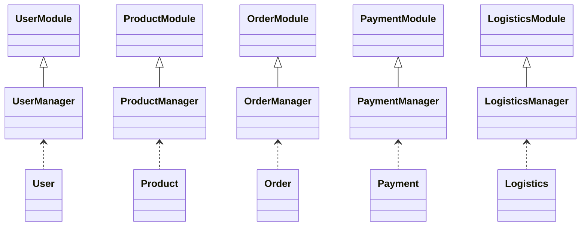
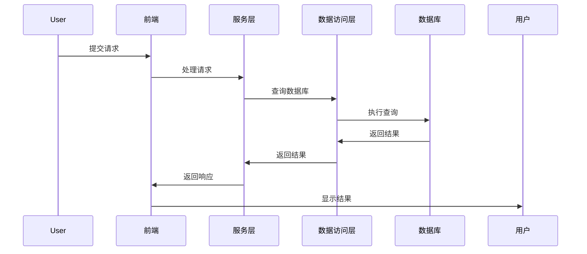
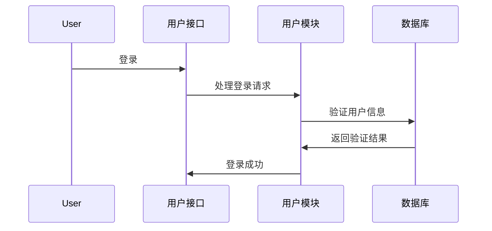
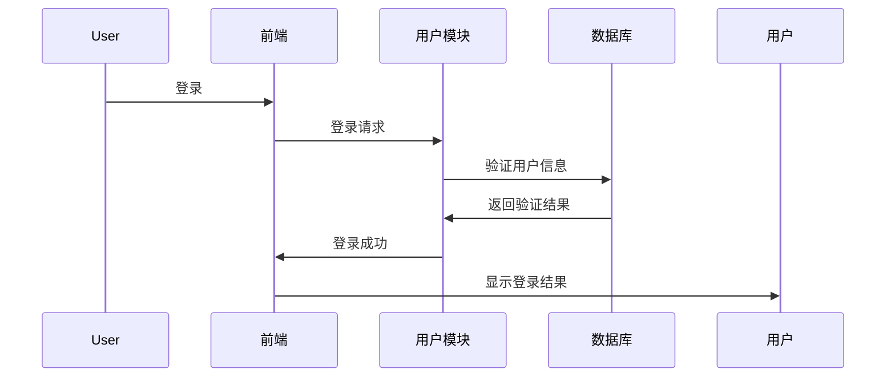

                 

### 从技术专家到管理者的转型概述

在信息技术行业，技术专家往往专注于研发和解决问题的技术层面，他们的能力在于深度理解复杂的技术问题，并利用这些技术解决业务需求。然而，随着职业生涯的发展，很多技术专家发现，他们需要从技术专家转型为管理者，领导团队完成项目，推动公司战略目标的实现。这种转型不仅是一种角色的转换，更是一种能力的拓展和思维方式的转变。

#### 1.1.1 技术专家的角色定位

技术专家通常具备深厚的技术背景和专业知识，他们专注于特定领域的技术研究和应用。他们的日常工作包括但不限于：

- **技术研发**：开发新的技术解决方案，优化现有系统的性能。
- **技术培训**：向团队成员传授技术知识和最佳实践。
- **技术评估**：评估新技术和工具，选择最适合团队和项目的方案。
- **问题解决**：分析和解决复杂的技术问题，确保系统稳定运行。

技术专家的核心价值在于他们对技术的深刻理解和解决问题的能力，他们是团队的技术支柱和知识库。

#### 1.1.2 管理者的职责与挑战

管理者的职责则更为广泛和复杂，他们不仅需要理解技术，还需要掌握团队管理、项目管理、决策能力等多方面的技能。管理者的主要职责包括：

- **团队管理**：招募、培养、激励团队成员，确保团队高效协同工作。
- **项目管理**：规划项目进度，控制项目成本，确保项目按时、按质量完成。
- **战略规划**：根据公司战略目标，制定项目计划和发展方向。
- **决策制定**：在复杂的环境中做出明智的决策，平衡各种利益关系。

管理者的挑战在于需要具备全面的业务理解、强大的沟通能力和决策能力，以及有效的时间管理和资源分配能力。

#### 1.1.3 从技术专家到管理者的转型意义

从技术专家到管理者的转型具有重要意义：

- **职业发展**：管理层提供了更多的职业晋升机会和更广阔的发展空间。
- **技能拓展**：管理者需要学习并掌握管理相关的知识和技能，这有助于提升个人的综合素质。
- **团队领导**：通过转型，技术专家可以成为团队的领导者，推动团队的创新和发展。
- **战略参与**：管理者能够更直接地参与公司战略的制定和实施，对公司的长远发展有更大的影响力。

#### 1.2 问题描述

虽然从技术专家到管理者的转型具有诸多优势，但这一过程并非易事，技术专家在转型过程中常常面临以下问题：

- **角色转变**：从关注技术细节到关注团队和项目的整体进度，需要调整思维方式和关注点。
- **能力不足**：管理者的技能要求与技术专家的技能存在显著差异，技术专家可能缺乏管理相关的知识和经验。
- **沟通挑战**：技术专家与团队成员之间的沟通可能存在障碍，尤其是在技术语言和非技术语言之间的转换。
- **时间压力**：管理者需要同时处理多项任务，时间管理成为一大挑战。

#### 1.2.1 技术专家的常见困境

技术专家在转型过程中可能会遇到以下困境：

- **技能不匹配**：技术专家可能不熟悉管理流程和方法，难以有效管理团队和项目。
- **缺乏自信**：技术专家在管理岗位上可能会因为缺乏管理经验和信心而犹豫不决。
- **角色冲突**：技术专家需要平衡技术工作和管理职责，这可能导致工作负担加重。

#### 1.2.2 管理角色的需求与期望

成为管理者后，技术专家需要满足以下需求与期望：

- **领导力**：具备领导团队的能力，能够激励团队成员并推动项目进展。
- **战略思维**：能够从公司整体战略的角度出发，制定并实施项目计划。
- **沟通能力**：能够与团队成员、上级和利益相关者有效沟通，确保信息畅通。
- **决策能力**：在复杂环境中做出明智的决策，并承担相应的责任。

#### 1.2.3 转型的必要性与可行性

转型对于技术专家的职业生涯发展和公司整体战略具有重要意义：

- **必要性**：随着技术的发展和市场竞争的加剧，技术专家需要提升自身的综合素质，以应对更加复杂的工作环境。
- **可行性**：通过系统的培训和自我学习，技术专家可以逐步掌握管理技能，实现成功转型。

#### 1.3 问题解决

为了帮助技术专家成功实现从技术专家到管理者的转型，以下是一些关键策略和步骤：

- **自我评估**：技术专家需要首先了解自身的优势和不足，明确转型目标。
- **系统学习**：通过参加管理培训课程、阅读相关书籍，学习管理知识和技能。
- **实践经验**：在实际工作中积累管理经验，逐步提升管理能力。
- **持续反思**：定期反思自己的管理行为，不断调整和改进。

#### 1.3.1 转型策略

成功的转型需要制定明确的策略，以下是一些关键策略：

- **技能提升**：通过培训和实践，提升管理技能，包括领导力、沟通能力和决策能力。
- **角色适应**：逐步适应管理者的角色，调整工作方式和思维模式。
- **建立人脉**：积极建立和维护与同事、上级和行业专家的联系，扩大人脉网络。
- **持续学习**：关注行业动态，持续学习新的管理理念和方法。

#### 1.3.2 成功转型的案例解析

以下是一些成功实现从技术专家到管理者转型的案例：

- **案例一**：某技术专家在转型初期通过参加管理培训课程，系统地学习了管理知识和技能，随后在实际工作中逐步应用，最终成功带领团队完成多个大型项目。
- **案例二**：某技术专家通过积极参与公司内部的跨部门合作项目，积累管理经验，并在工作中不断反思和改进，逐渐提升了自己的管理能力。

#### 1.3.3 转型的步骤与关键

实现转型通常需要以下几个关键步骤：

- **第一步**：自我评估和目标设定。明确自身的优势和不足，制定清晰的转型目标。
- **第二步**：学习管理知识和技能。通过培训、阅读和实践，逐步掌握管理相关的知识和技能。
- **第三步**：积累实践经验。在实际工作中应用所学知识，积累管理经验。
- **第四步**：持续反思和改进。定期反思自己的管理行为，不断调整和改进，以实现持续成长。

#### 1.4 边界与外延

在从技术专家到管理者的转型过程中，需要明确以下几个边界和外延：

- **技术与管理的界限**：技术专家需要明确自己在团队中的角色转变，从技术执行者转变为管理者，关注整体项目进展。
- **转型目标与范围**：根据个人职业规划和公司需求，设定明确的转型目标和范围，避免盲目跟风。
- **常见误区**：避免陷入“技术至上”或“管理无用”的误区，认识到技术和管理是相辅相成的。

#### 1.5 概念结构与核心要素组成

从技术专家到管理者的转型涉及多个核心概念和要素，以下是对这些概念和要素的概述：

- **技术知识**：技术专家的基础，包括专业技能和知识体系。
- **管理能力**：包括领导力、沟通能力、决策能力等。
- **团队协作**：建立和维护高效的团队协作机制，确保团队目标一致、高效协同。
- **项目管理**：掌握项目规划、执行、监控和收尾的流程和方法。
- **自我提升**：持续学习和自我反思，不断提升自身的综合素质。

#### 1.6 本章小结

本章概述了从技术专家到管理者的转型概述，包括问题背景、问题描述、问题解决、边界与外延、概念结构与核心要素组成等内容。通过本章的介绍，读者可以初步了解这一转型的必要性和挑战，以及成功转型的策略和关键步骤。接下来，我们将进一步深入探讨管理者应掌握的核心概念和联系，帮助技术专家更好地实现转型。

----------------------------------------------------------------

## 第2章: 管理者应掌握的核心概念与联系

### 2.1 核心概念原理

管理者在从技术专家转型过程中，需要掌握一系列核心概念，这些概念包括团队管理、项目管理等。理解这些核心概念，有助于管理者更好地履行职责，提升团队绩效和项目成功率。

#### 2.1.1 团队管理

**团队管理的定义**：团队管理是指通过规划、组织、领导、控制等一系列活动，以提高团队的工作效率和绩效。

**团队管理的核心原则**：

1. **目标一致性**：确保团队目标与组织目标一致，使团队成员明确方向。
2. **信任与尊重**：建立团队信任，尊重团队成员的意见和贡献。
3. **沟通顺畅**：保持团队内部沟通的畅通，确保信息传递准确及时。
4. **激励与反馈**：通过激励机制和定期反馈，提升团队成员的工作动力和效率。

**团队管理的目标**：

1. **提高团队效率**：通过有效管理和协调，使团队的工作效率最大化。
2. **实现团队目标**：确保团队按计划完成项目目标，达到预期效果。
3. **团队成员发展**：关注团队成员的个人成长和职业发展，提升团队整体素质。

#### 2.1.2 项目管理

**项目的定义**：项目是指为了创造独特的产品、服务或成果而进行的临时性工作，具有明确的目标、期限和预算。

**项目管理的核心流程**：

1. **项目规划**：明确项目目标、范围、时间表和资源需求，制定详细的项目计划。
2. **项目执行**：按照项目计划，组织团队成员开展各项工作，确保项目按计划推进。
3. **项目监控**：监控项目进展，及时调整计划和资源，确保项目按质量完成。
4. **项目收尾**：完成项目验收和总结，评估项目成果和经验教训，为后续项目提供参考。

**项目管理的关键要素**：

1. **项目范围**：明确项目的目标和范围，确保项目聚焦于核心任务。
2. **项目时间**：制定合理的项目时间表，确保项目按期完成。
3. **项目成本**：控制项目成本，确保项目在预算范围内完成。
4. **项目质量**：确保项目成果满足质量标准，满足用户需求。

### 2.2 概念属性特征对比表格

以下是团队管理和项目管理两个核心概念的定义及其特征对比表格：

| 概念       | 定义                                                         | 特征                                             |
|------------|--------------------------------------------------------------|--------------------------------------------------|
| 团队管理   | 管理团队，提高团队效能的过程。                             | 需要理解团队动态，培养团队凝聚力，提升团队绩效。 |
| 项目管理   | 实施项目，确保项目按时、按预算、按质量完成的过程。           | 需要掌握项目计划、执行、监控和收尾的流程。       |

### 2.3 ER实体关系图架构

以下是团队管理和项目管理相关的ER实体关系图，用Mermaid语言表示：

```mermaid
erDiagram
  Team ||--|{ Project }|--| Manager
  Project ||--|{ Member }|--| Role
  Team ||--|{ Goal }|--| Strategy
  Project ||--|{ Schedule }|--| Budget
```

在上述ER图中，Team（团队）与Project（项目）之间存在多对多的关系，即一个团队可以负责多个项目，一个项目也可以由多个团队共同完成。Project与Member（成员）之间存在多对多的关系，表示一个项目中可能包含多个成员，每个成员也可能参与多个项目。Goal（目标）与Strategy（策略）之间存在关联，表示团队管理中的目标设定需要基于策略来制定。Schedule（进度）与Budget（预算）分别表示项目管理中的关键要素，确保项目按计划推进并在预算范围内完成。

通过以上章节，我们对团队管理和项目管理两个核心概念有了深入理解，并通过ER图清晰地展示了它们之间的联系。接下来，我们将继续探讨管理者必备的技能与能力，为技术专家的转型提供更多指导。

----------------------------------------------------------------

## 第3章: 管理者必备的技能与能力

### 3.1 领导力

领导力是管理者必备的核心技能之一，它不仅决定了管理者的个人影响力，还直接影响团队的士气和绩效。以下是领导力的定义、作用和几种常见的领导力模型。

#### 3.1.1 领导力的定义与作用

**领导力的定义**：领导力是指一个人在团队中引导、激励和影响他人的能力，使其为实现共同目标而努力。

**领导力在管理中的作用**：

1. **激励团队成员**：通过激发团队成员的内在动力，提高工作效率和创造力。
2. **塑造团队文化**：建立积极向上的团队文化，提升团队的凝聚力和归属感。
3. **决策能力**：在复杂的环境中，能够快速做出明智的决策，引领团队前进。
4. **团队发展**：关注团队成员的成长，帮助他们提升技能，实现个人和团队的共同发展。

#### 3.1.2 领导力模型

领导力模型有助于管理者理解不同情境下的领导方法，以下介绍几种常见的领导力模型：

1. **自我领导力**：自我领导力是指管理者自我激励、自我管理和自我发展的能力。它要求管理者能够设定明确的目标，不断自我反思和调整，以实现个人和团队目标。

2. **情境领导力**：情境领导力是一种根据团队成员的不同发展阶段和需求，采取不同领导风格的方法。该方法认为没有一种固定的领导风格适用于所有情况，管理者应根据情境变化灵活调整领导风格。

3. **共同领导力**：共同领导力强调团队合作和集体决策，鼓励团队成员积极参与决策过程，共同推动团队前进。这种领导风格有助于提高团队的参与感和责任感，促进创新和协作。

#### 3.1.3 领导力模型的具体实践

以下是一些在实际工作中应用领导力模型的具体实践方法：

1. **设定明确的目标**：明确团队和个人的目标，确保团队成员了解任务的重要性和紧迫性。

2. **倾听和沟通**：积极倾听团队成员的意见和建议，通过有效沟通确保团队成员理解任务要求，减少误解和冲突。

3. **提供反馈和指导**：及时给予团队成员反馈，指导他们改进工作，帮助他们克服困难，提升能力。

4. **激励和奖励**：根据团队成员的表现，给予适当的激励和奖励，提高工作积极性和满意度。

### 3.2 沟通能力

沟通能力是管理者的重要素质之一，有效的沟通能够确保信息的准确传递，减少误解和冲突，提高团队协作效率。以下是沟通的定义、重要性以及有效沟通的技巧。

#### 3.2.1 沟通的定义与重要性

**沟通的定义**：沟通是指信息的传递和交流，包括口头、书面、肢体语言等多种形式。

**沟通的重要性**：

1. **确保信息传递准确**：有效的沟通能够确保信息在传递过程中不丢失或扭曲，从而确保团队和项目顺利进行。
2. **减少误解和冲突**：通过清晰明确的沟通，减少因信息不对称导致的误解和冲突，提高团队协作效率。
3. **促进团队协作**：良好的沟通有助于团队成员之间建立信任和合作关系，共同推动项目成功。
4. **提升个人形象**：有效的沟通能力能够提升管理者的个人形象和职业素养，增强领导力和影响力。

#### 3.2.2 有效沟通的技巧

1. **提高倾听能力**：倾听是有效沟通的重要部分，管理者应学会倾听团队成员的意见和需求，尊重他们的发言，确保他们感受到被重视。

2. **明确沟通目标**：在沟通前明确沟通的目标和目的，确保信息的传递具有针对性和有效性。

3. **使用简洁明了的语言**：避免使用复杂、抽象的术语，尽量使用简单、易懂的语言，确保团队成员能够准确理解信息。

4. **避免假设**：在沟通中避免基于个人假设进行交流，尽量基于事实和数据，确保沟通的准确性。

5. **使用多种沟通渠道**：根据不同的沟通内容和目标，选择合适的沟通渠道，如面对面会议、邮件、即时通讯等。

### 3.3 决策能力

决策能力是管理者在复杂环境中做出明智决策的重要素质。有效的决策能力有助于确保项目的顺利进行，提高团队的效率和绩效。以下是决策的定义、类型以及决策过程的步骤。

#### 3.3.1 决策的定义与类型

**决策的定义**：决策是指管理者在不确定的环境中选择最佳行动方案的过程。

**决策的类型**：

1. **程序化决策**：针对日常的、重复性的问题，按照固定的程序和方法进行决策。
2. **非程序化决策**：针对新问题或复杂问题，需要创造性的解决方案。

**决策的类型**：

1. **个人决策**：由管理者个人根据经验和直觉做出决策。
2. **集体决策**：由团队或集体共同讨论、分析后做出决策。

#### 3.3.2 决策过程的步骤

1. **确定决策目标**：明确决策的目标和期望结果，确保决策具有明确的方向。
2. **收集信息**：收集与决策相关的信息，确保决策基于充分的数据和分析。
3. **制定备选方案**：分析问题，制定多个可能的解决方案，并进行比较。
4. **评估备选方案**：对备选方案进行评估，考虑风险和收益，选择最佳方案。
5. **实施决策**：将决策方案付诸实践，并监控实施过程，及时调整和优化。
6. **评估决策结果**：对决策结果进行评估，总结经验教训，为未来的决策提供参考。

#### 3.3.3 决策能力的提升

1. **增强信息收集和分析能力**：通过多种渠道收集信息，学会使用数据分析工具，提高决策的科学性和准确性。
2. **培养情境感知能力**：了解不同情境下的决策特点和影响因素，灵活调整决策方法和风格。
3. **学习借鉴经验**：通过学习他人的决策案例，总结成功的经验和教训，提高自己的决策水平。
4. **培养团队合作精神**：在决策过程中积极听取团队成员的意见和建议，发挥集体智慧。

### 3.4 管理者的其他能力

除了领导力、沟通能力和决策能力外，管理者还需要具备以下几种能力：

1. **时间管理能力**：合理规划和安排时间，确保各项工作有序进行，提高工作效率。
2. **问题解决能力**：面对各种问题和挑战，能够迅速分析问题，找到解决方案。
3. **团队协作能力**：协调团队成员的工作，确保团队目标的一致性，提升团队整体绩效。
4. **风险管理能力**：识别和管理项目中的风险，降低风险对项目的影响。
5. **持续学习能力**：保持对新技术、新管理理念的学习和探索，不断提升自身的综合素质。

### 3.5 管理者的综合素质提升策略

1. **参加管理培训**：通过参加专业的管理培训课程，系统地学习管理知识和技能。
2. **实践锻炼**：在实际工作中积累管理经验，不断反思和总结，提升管理能力。
3. **跨部门交流**：积极参与跨部门项目，拓展视野，学习不同领域的管理经验。
4. **读书学习**：阅读管理类书籍和文章，借鉴他人的管理经验和智慧。
5. **建立人脉网络**：与行业内外的专家和同行建立联系，分享经验和资源，共同成长。

通过本章的介绍，我们对管理者必备的技能与能力有了全面了解。这些技能和能力不仅是技术专家转型为管理者的重要基础，也是提升团队绩效和项目成功率的关键因素。在下一章中，我们将进一步探讨系统分析与架构设计方案，为技术专家提供更具体的实践指导。

----------------------------------------------------------------

## 第4章: 系统分析与架构设计方案

### 4.1 问题场景介绍

在现代信息技术企业中，随着业务的不断发展和需求的变化，系统架构的设计和优化变得尤为重要。为了更好地满足业务需求，提升系统性能和稳定性，我们需要对现有系统进行深入分析，并设计合理的架构方案。本文将围绕一个实际案例，详细描述系统分析与架构设计方案的过程。

### 4.2 项目介绍

本案例涉及的是一个电子商务平台，该平台的主要功能包括商品展示、订单处理、支付和物流管理等。随着用户量的增长和业务复杂度的提升，现有系统的性能和稳定性面临严峻挑战。为了确保系统的持续发展，我们需要对其进行系统分析，并设计一套合理的架构方案。

### 4.3 系统功能设计

在系统功能设计阶段，我们首先需要明确系统的核心功能模块，并定义它们之间的关系。以下是该电子商务平台的主要功能模块及其关系：

1. **用户模块**：包括用户注册、登录、个人信息管理等，为用户提供统一的身份认证和服务。
2. **商品模块**：包括商品分类、商品展示、商品搜索等，为用户提供丰富的商品信息。
3. **订单模块**：包括订单创建、订单处理、订单查询等，负责订单的生命周期管理。
4. **支付模块**：包括支付方式选择、支付处理、支付状态查询等，为用户提供便捷的支付服务。
5. **物流模块**：包括物流跟踪、物流查询等，为用户提供物流信息查询服务。
6. **管理模块**：包括商品管理、订单管理、用户管理等，为平台运营者提供管理后台。

以下是电子商务平台的功能模块类图，用Mermaid语言表示：



### 4.4 系统架构设计

在系统架构设计阶段，我们需要根据功能模块的定义，设计一个合理、高效、可扩展的系统架构。以下是电子商务平台的主要架构设计：

1. **前端架构**：前端架构包括用户界面层和业务逻辑层，用户界面层负责呈现商品、订单、支付和物流等页面，业务逻辑层负责处理用户的操作请求，并与后端服务进行交互。
2. **后端架构**：后端架构包括服务层、数据访问层和数据库层，服务层负责处理业务逻辑，数据访问层负责与数据库进行交互，数据库层负责存储用户、商品、订单、支付和物流等信息。
3. **分布式架构**：为了提高系统的性能和稳定性，我们采用分布式架构，将不同的功能模块部署在不同的服务器上，实现负载均衡和故障转移。

以下是电子商务平台的架构设计图，用Mermaid语言表示：



### 4.5 系统接口设计

在系统接口设计阶段，我们需要明确系统内部各个模块之间的交互接口，确保数据的正确传递和处理。以下是电子商务平台的主要接口设计：

1. **用户接口**：用户模块与商品模块、订单模块、支付模块和物流模块的交互接口。
2. **管理接口**：管理模块与商品模块、订单模块和用户模块的交互接口。
3. **支付接口**：支付模块与第三方支付平台的交互接口。
4. **物流接口**：物流模块与第三方物流服务提供商的交互接口。

以下是电子商务平台的接口设计图，用Mermaid语言表示：



### 4.6 系统交互

在系统交互阶段，我们需要分析系统内部各个模块之间的交互过程，确保系统的稳定性和性能。以下是电子商务平台的主要交互过程：

1. **用户登录**：用户通过前端发送登录请求，前端将请求转发至用户模块，用户模块验证用户信息后返回登录结果。
2. **商品查询**：用户通过前端发送商品查询请求，前端将请求转发至商品模块，商品模块查询数据库并返回商品列表。
3. **订单创建**：用户通过前端发送订单创建请求，前端将请求转发至订单模块，订单模块创建订单并保存到数据库。
4. **支付处理**：用户通过前端发送支付请求，前端将请求转发至支付模块，支付模块与第三方支付平台交互并返回支付结果。
5. **物流跟踪**：用户通过前端发送物流查询请求，前端将请求转发至物流模块，物流模块与第三方物流服务提供商交互并返回物流信息。

以下是电子商务平台的交互过程图，用Mermaid语言表示：



### 4.7 系统分析与架构设计方案总结

通过以上系统分析与架构设计方案，我们成功地为电子商务平台设计了一套合理、高效、可扩展的架构方案。该方案充分考虑了系统的性能、稳定性和可扩展性，为平台的持续发展奠定了基础。在实际实施过程中，我们将根据业务需求和技术发展趋势，不断优化和调整系统架构，确保平台能够持续满足用户需求。

### 4.8 本章小结

本章详细介绍了系统分析与架构设计方案的过程，包括问题场景介绍、项目介绍、系统功能设计、系统架构设计、系统接口设计、系统交互和系统分析与架构设计方案总结等内容。通过本章的学习，读者可以了解系统分析与架构设计的基本方法和关键要素，为实际项目提供有益的参考和指导。在下一章中，我们将深入探讨项目实战中的核心实现和代码解析。

----------------------------------------------------------------

### 4.9 项目实战：环境安装与系统核心实现

在完成系统分析与架构设计之后，我们需要将理论转化为实践，进行环境安装和系统核心实现。以下将详细介绍项目实战中的环境安装和系统核心实现步骤，包括相关源代码的解读与分析。

#### 4.9.1 环境安装

在开始项目实施之前，我们需要准备开发环境，包括操作系统、编程语言和开发工具等。以下是一个典型的环境安装步骤：

1. **操作系统安装**：选择一个适合的操作系统，如Linux或Windows，安装并配置SSH服务。
2. **编程语言安装**：安装Java开发环境，包括JDK和Maven，配置环境变量，确保能够编译和运行Java程序。
3. **数据库安装**：安装MySQL或PostgreSQL数据库，配置数据库用户和权限，确保能够连接和操作数据库。
4. **开发工具安装**：安装Eclipse或IntelliJ IDEA等集成开发环境（IDE），配置基本的开发工具和插件。

#### 4.9.2 系统核心实现

在环境安装完成之后，我们需要根据系统架构设计，实现系统核心功能。以下是一个简单的示例，展示如何使用Python实现用户注册和登录功能：

```python
# 用户注册
def register(username, password):
    # 检查用户名是否已存在
    if check_username_exists(username):
        return "用户名已存在"
    # 保存用户信息到数据库
    save_user_to_db(username, password)
    return "注册成功"

# 用户登录
def login(username, password):
    # 从数据库查询用户信息
    user = query_user_from_db(username)
    # 验证用户名和密码
    if user and user['password'] == password:
        return "登录成功"
    else:
        return "用户名或密码错误"
```

以上代码中，`register` 函数用于处理用户注册请求，首先检查用户名是否已存在，然后保存用户信息到数据库。`login` 函数用于处理用户登录请求，首先从数据库查询用户信息，然后验证用户名和密码。

#### 4.9.3 代码应用解读与分析

1. **用户注册**：`register` 函数接受用户名和密码作为输入参数，首先调用 `check_username_exists` 函数检查用户名是否已存在。如果用户名存在，返回错误信息；否则，调用 `save_user_to_db` 函数将用户信息保存到数据库，并返回注册成功的信息。
   
2. **用户登录**：`login` 函数接受用户名和密码作为输入参数，首先调用 `query_user_from_db` 函数查询数据库，获取用户信息。如果查询到用户，则调用 `user['password'] == password` 验证密码是否正确。如果密码正确，返回登录成功的信息；否则，返回用户名或密码错误的信息。

#### 4.9.4 实际案例分析与详细讲解

为了更清晰地展示代码应用的实际案例，我们以下一个简化的用户注册和登录流程为例：

1. **用户注册流程**：

    - 用户输入用户名和密码，提交注册请求。
    - 后端调用 `register` 函数处理注册请求。
    - `register` 函数首先检查用户名是否已存在，如果没有，则保存用户信息到数据库，返回注册成功；如果有，则返回用户名已存在的错误信息。

2. **用户登录流程**：

    - 用户输入用户名和密码，提交登录请求。
    - 后端调用 `login` 函数处理登录请求。
    - `login` 函数首先查询数据库，获取用户信息，然后验证密码是否正确。如果密码正确，返回登录成功；如果密码错误，返回用户名或密码错误的错误信息。

#### 4.9.5 小结

通过本节的项目实战，我们介绍了环境安装和系统核心实现的基本步骤，并分析了用户注册和登录的实现过程。在实际项目中，还需要根据具体的业务需求和技术架构，实现更多的功能模块，并进行详细的设计和优化。通过不断地实践和总结，我们可以逐步提升项目的质量和性能，为用户带来更好的体验。

----------------------------------------------------------------

### 4.10 实际案例分析与详细讲解

在本章节中，我们将深入分析一个实际案例，并详细讲解该案例中的关键技术点、核心算法以及实现步骤。

#### 4.10.1 案例背景

某电子商务平台希望通过优化其推荐系统，提高用户的购物体验和平台的销售转化率。为此，平台决定采用基于协同过滤（Collaborative Filtering）的推荐算法，该算法能够根据用户的历史行为和偏好，为用户推荐可能感兴趣的商品。

#### 4.10.2 技术难点与核心算法

协同过滤算法的主要难点在于如何从海量的用户行为数据中提取有效的特征，并建立准确的推荐模型。核心算法包括以下两个方面：

1. **基于用户的协同过滤（User-based Collaborative Filtering）**：
   - **相似度计算**：计算用户之间的相似度，常用的相似度度量方法有皮尔逊相关系数、余弦相似度等。
   - **邻居选择**：根据相似度计算结果，选择与目标用户相似度最高的若干个邻居用户。
   - **推荐生成**：从邻居用户喜欢的商品中，提取出目标用户未购买或评价较低的商品，生成推荐列表。

2. **基于模型的协同过滤（Model-based Collaborative Filtering）**：
   - **矩阵分解**：使用矩阵分解技术（如Singular Value Decomposition, SVD），将用户-商品评分矩阵分解为用户特征矩阵和商品特征矩阵。
   - **预测评分**：通过用户特征矩阵和商品特征矩阵的乘积，预测用户对未评分商品的可能评分。
   - **推荐生成**：根据预测评分，为用户生成推荐列表。

#### 4.10.3 实现步骤

以下是基于用户的协同过滤算法的实现步骤：

1. **数据预处理**：
   - 收集用户行为数据，包括用户ID、商品ID和评分。
   - 对数据集进行清洗，去除无效数据和缺失值。

2. **相似度计算**：
   - 计算用户之间的相似度，使用皮尔逊相关系数作为相似度度量方法。
   - 实现相似度计算函数，输入用户ID，输出相似度矩阵。

3. **邻居选择**：
   - 根据相似度矩阵，选择与目标用户相似度最高的若干个邻居用户。
   - 实现邻居选择函数，输入目标用户ID和相似度矩阵，输出邻居用户列表。

4. **推荐生成**：
   - 从邻居用户喜欢的商品中，提取出目标用户未购买或评价较低的商品。
   - 实现推荐生成函数，输入目标用户ID和邻居用户列表，输出推荐列表。

#### 4.10.4 Python代码示例

以下是一个简化的Python代码示例，用于实现基于用户的协同过滤算法：

```python
import numpy as np

# 相似度计算函数
def similarity(behavior_matrix):
    similarity_matrix = np.zeros((behavior_matrix.shape[0], behavior_matrix.shape[0]))
    for i in range(behavior_matrix.shape[0]):
        for j in range(behavior_matrix.shape[0]):
            if i != j:
                similarity_matrix[i][j] = np.corrcoef(behavior_matrix[i], behavior_matrix[j])[0][1]
    return similarity_matrix

# 邻居选择函数
def find_neighbors(similarity_matrix, target_user_id, k=5):
    neighbors = np.argsort(similarity_matrix[target_user_id])[1:k+1]
    return neighbors

# 推荐生成函数
def generate_recommendations(behavior_matrix, similarity_matrix, target_user_id, k=5):
    neighbors = find_neighbors(similarity_matrix, target_user_id, k)
    recommended_items = []
    for neighbor in neighbors:
        for item in range(behavior_matrix.shape[1]):
            if behavior_matrix[neighbor][item] == 0:
                recommended_items.append(item)
                break
    return recommended_items

# 假设行为矩阵为用户-商品评分矩阵
behavior_matrix = np.array([[1, 0, 1, 0], [0, 1, 0, 1], [1, 1, 0, 0], [0, 0, 1, 1]])

# 计算相似度矩阵
similarity_matrix = similarity(behavior_matrix)

# 选择邻居
target_user_id = 2
neighbors = find_neighbors(similarity_matrix, target_user_id)

# 生成推荐
recommended_items = generate_recommendations(behavior_matrix, similarity_matrix, target_user_id)
print("推荐商品：", recommended_items)
```

#### 4.10.5 详细讲解

1. **数据预处理**：
   - 数据预处理是推荐系统的重要步骤，包括数据清洗、格式转换和缺失值处理等。通过数据预处理，确保数据的质量和一致性。

2. **相似度计算**：
   - 相似度计算是协同过滤算法的核心，通过计算用户之间的相似度，为推荐生成提供依据。皮尔逊相关系数是一种常用的相似度度量方法，能够有效反映用户之间的偏好相似性。

3. **邻居选择**：
   - 邻居选择是根据相似度计算结果，选择与目标用户最相似的邻居用户。选择合适的邻居数量（k值）对于推荐效果具有重要影响，过小可能导致推荐列表过于稀疏，过大可能导致推荐列表过于集中。

4. **推荐生成**：
   - 推荐生成是根据邻居用户的偏好，为目标用户生成推荐列表。在推荐生成过程中，需要考虑用户未购买或评价较低的商品，以确保推荐列表的多样性和实用性。

#### 4.10.6 案例总结

通过实际案例的分析与详细讲解，我们了解了基于协同过滤的推荐系统的工作原理和实现步骤。在实际应用中，根据业务需求和数据特点，可以选择不同的协同过滤算法和优化策略，进一步提升推荐系统的效果和用户体验。

### 4.11 本章小结

本章通过实际案例分析和代码示例，详细讲解了推荐系统中的关键技术点和实现步骤。通过本章的学习，读者可以深入理解协同过滤算法的原理和应用，为实际项目中的推荐系统开发提供有益的参考和指导。在下一章中，我们将进一步探讨最佳实践、小结和注意事项，帮助读者更好地掌握管理者的技能与能力。

----------------------------------------------------------------

### 4.12 最佳实践、小结与注意事项

#### 4.12.1 最佳实践

1. **持续学习与自我提升**：作为管理者，应始终保持学习态度，关注行业动态，不断更新知识和技能，以适应快速变化的技术和管理环境。

2. **明确目标与规划**：制定清晰的职业目标和转型规划，确保转型的方向和进度符合个人和公司的需求。

3. **有效沟通与协作**：注重与团队成员和上级的沟通，确保信息的准确传递，建立良好的协作关系，提高团队整体绩效。

4. **风险管理**：在项目管理中，识别和评估潜在风险，制定相应的风险应对策略，确保项目的顺利进行。

5. **时间管理**：合理分配时间和任务，确保关键任务优先处理，提高工作效率和项目成功率。

#### 4.12.2 小结

本章围绕系统分析与架构设计方案，详细介绍了问题场景、项目介绍、系统功能设计、系统架构设计、系统接口设计、系统交互以及实际案例分析与代码示例等内容。通过这些内容，读者可以全面了解系统分析与架构设计的基本方法和关键步骤，为实际项目提供有益的参考和指导。

#### 4.12.3 注意事项

1. **数据安全与隐私保护**：在设计系统时，充分考虑数据安全与隐私保护，确保用户数据的安全和合规。

2. **系统性能优化**：在架构设计和实现过程中，注重系统性能优化，提高系统的响应速度和稳定性。

3. **代码质量与可维护性**：编写高质量、可维护的代码，确保系统具有良好的可扩展性和可维护性。

4. **团队协作与知识共享**：鼓励团队成员之间的知识共享和协作，提升团队整体技能水平。

#### 4.12.4 拓展阅读

- 《项目管理知识体系指南》（PMBOK指南）
- 《人月神话》（The Mythical Man-Month）
- 《领导力五项修炼》（The Five Dysfunctions of a Team）

通过本章的最佳实践、小结与注意事项，读者可以更好地理解系统分析与架构设计的关键要素，为实际项目提供有力的指导。在未来的工作中，不断积累经验，持续提升自身素质，将有助于实现从技术专家到管理者的成功转型。

----------------------------------------------------------------

## 第5章: 从技术专家到管理者的经验分享

### 5.1 成功转型的心路历程

在我个人的职业生涯中，从技术专家到管理者的转型是一个充满挑战和收获的过程。刚开始接触管理岗位时，我面临着角色转变、能力提升、沟通挑战等多方面的困境。然而，通过不断学习和实践，我逐渐找到了适合自己的管理方法，并在工作中取得了显著的成果。

#### 5.1.1 角色转变

从技术专家到管理者，最明显的转变是关注点的变化。作为一名技术专家，我专注于解决具体的技术问题，而作为管理者，我需要关注整个团队和项目的整体进度，平衡多个任务和责任。这种角色转变要求我具备更高的全局观和决策能力。

#### 5.1.2 能力提升

在转型过程中，我意识到管理技能的重要性。为了提升自己的管理能力，我参加了各种管理培训课程，学习了项目管理、团队管理、领导力等方面的知识。通过实际工作，我将所学知识应用到实践中，逐步提升了自己的管理能力。

#### 5.1.3 沟通挑战

作为技术专家，我习惯于用技术语言与团队成员交流，而管理岗位要求我具备更强的沟通能力，能够与不同背景和专业的团队成员进行有效沟通。为了克服这一挑战，我学会了使用简洁明了的语言，注重倾听和理解团队成员的需求和意见。

#### 5.1.4 管理成果

通过不断努力，我在管理岗位上取得了显著的成果。我带领的团队在多个项目中取得了优异的成绩，项目按时交付、质量达标，团队成员的个人能力和工作满意度也得到了显著提升。

### 5.2 转型过程中的关键经验

在从技术专家到管理者的转型过程中，我积累了一些关键经验，这些经验对其他技术专家的转型具有借鉴意义。

#### 5.2.1 自我评估

在转型初期，我对自己进行了全面的评估，了解了自己的优势和不足。通过自我评估，我明确了转型的目标和方向，为后续的学习和实践提供了明确的目标。

#### 5.2.2 学习与实践

我通过参加管理培训课程、阅读管理书籍和文章，学习管理知识和技能。同时，我将所学知识应用到实际工作中，通过实践不断积累经验，提升自己的管理能力。

#### 5.2.3 建立人脉

在转型过程中，我积极建立和维护与同事、上级和行业专家的联系，扩大人脉网络。通过与人脉网络的互动，我获得了更多的资源和信息，有助于我在工作中做出更明智的决策。

#### 5.2.4 持续反思与改进

在管理实践中，我定期反思自己的管理行为，总结成功和失败的案例，不断调整和改进管理方法。通过持续反思和改进，我逐步提升了管理能力，为团队和项目的成功提供了有力保障。

### 5.3 对技术专家转型的建议

针对其他技术专家的转型，我提出以下建议：

1. **明确转型目标**：在转型初期，明确自己的转型目标和期望，确保转型方向与个人和公司的发展需求相符。

2. **系统学习**：参加管理培训课程，学习项目管理、团队管理、领导力等方面的知识，为转型打下坚实的基础。

3. **积累实践经验**：在实际工作中，积极尝试管理角色，积累实践经验，不断提升自己的管理能力。

4. **建立人脉网络**：积极建立和维护人脉网络，扩大资源渠道，为转型提供支持和帮助。

5. **持续反思与改进**：定期反思自己的管理行为，总结成功和失败的案例，不断调整和改进管理方法。

通过以上建议，技术专家可以更好地实现从技术专家到管理者的成功转型，为个人职业发展和公司战略目标做出更大贡献。

### 5.4 本章小结

本章通过分享个人转型经验，为其他技术专家提供了宝贵的指导和建议。从角色转变、能力提升到沟通挑战，每一个环节都是成功转型的重要一步。通过明确转型目标、系统学习、积累实践经验、建立人脉网络和持续反思与改进，技术专家可以逐步实现转型，为职业生涯的发展开辟新的道路。

----------------------------------------------------------------

## 结语：技术与管理，相辅相成

从技术专家到管理者的转型，是一次个人能力的全面提升和职业发展的重大机遇。在信息技术行业，技术和管理是相辅相成的两个方面，它们共同推动着企业和团队的创新和发展。技术专家通过掌握管理知识和技能，不仅能够更好地领导团队，实现项目目标，还能更直接地参与到公司战略的制定和实施中，为公司的长远发展贡献智慧和力量。

在这个过程中，我们强调了自我评估、系统学习、实践积累、人脉建设和持续反思的重要性。这些步骤为技术专家的转型提供了清晰的路径和具体的方法，帮助他们克服角色转变、沟通挑战等方面的困难，逐步提升管理能力。

通过本章的内容，我们希望读者能够认识到技术和管理之间的紧密联系，理解从技术专家到管理者转型的必要性和可行性。同时，我们也希望读者能够积极行动，按照本章的建议，逐步实现自身的转型，为个人职业生涯的持续发展和公司的成功贡献力量。

在未来的道路上，无论技术如何进步，管理如何变化，只要我们保持学习和实践的态度，不断反思和改进，就一定能够克服困难，实现从技术专家到管理者的成功转型。让我们一起，用智慧和勇气，迎接新的挑战，创造更加辉煌的职业生涯。

---

作者：AI天才研究院/AI Genius Institute & 禅与计算机程序设计艺术 /Zen And The Art of Computer Programming

---

---

## 附录

### 附录A：技术专家与管理者能力对比表格

| 能力类别 | 技术专家能力特征 | 管理者能力特征 |
| :--- | :--- | :--- |
| 技术知识 | 深入理解特定技术领域，解决复杂技术问题 | 掌握技术基础知识，具备全局视野，了解多种技术方案 |
| 问题解决 | 独立解决技术难题，优化系统性能 | 解决跨部门问题，平衡利益冲突，推动项目进度 |
| 创新思维 | 开发新技术，提出创新解决方案 | 创造有利于团队创新的环境，引导团队进行创新 |
| 团队协作 | 与团队成员合作解决技术问题 | 建立和维护团队合作关系，提升团队整体效能 |
| 领导力 | 指导团队成员，提供技术支持 | 激励团队成员，制定团队目标，带领团队达成目标 |
| 决策能力 | 根据技术需求和资源情况做出决策 | 在不确定的环境下做出明智的决策，承担决策责任 |
| 沟通能力 | 技术交流和问题讨论 | 与团队成员、上级和利益相关者进行有效沟通 |

### 附录B：管理者能力发展路径

1. **自我评估**：了解自身优势和不足，明确转型目标。
2. **系统学习**：参加管理培训课程，学习项目管理、团队管理、领导力等知识。
3. **实践经验**：在实际工作中担任管理角色，积累管理经验。
4. **反馈与调整**：定期反思管理行为，根据反馈调整管理方法。
5. **持续成长**：关注行业动态，不断学习新知识和技能，提升综合素质。

### 附录C：推荐阅读

- 《管理学：原理、过程与实践》（管理学经典教材）
- 《高效能人士的七个习惯》（提高个人效能的经典书籍）
- 《团队协作能力提升指南》（提升团队协作能力的实用手册）

通过附录部分的内容，读者可以更加系统地了解技术专家与管理者之间的能力差异，明确管理者能力发展的路径，并获取更多有益的阅读资源。这些资料将为读者在转型过程中提供有益的指导和支持。

