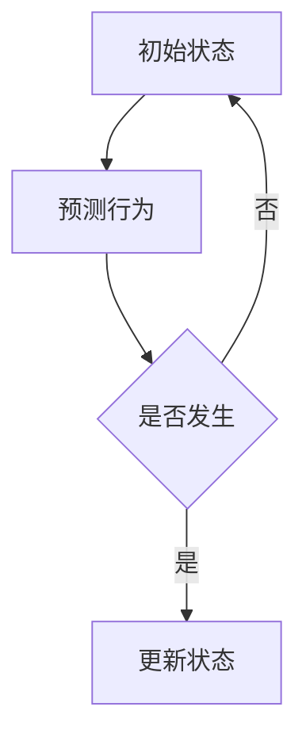
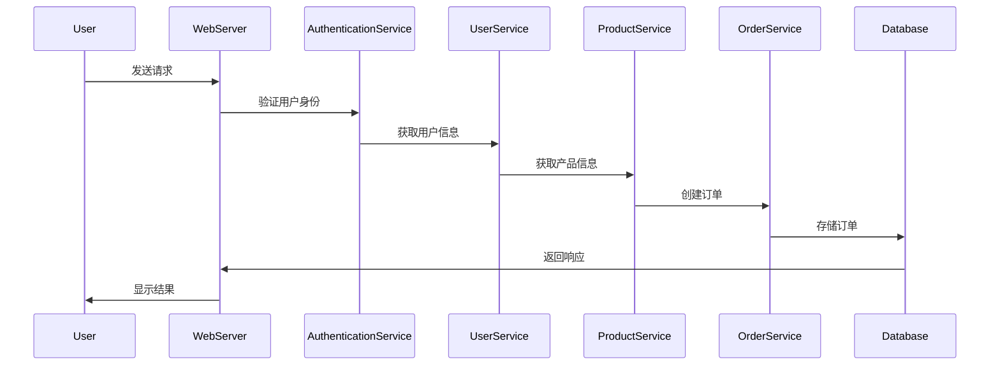
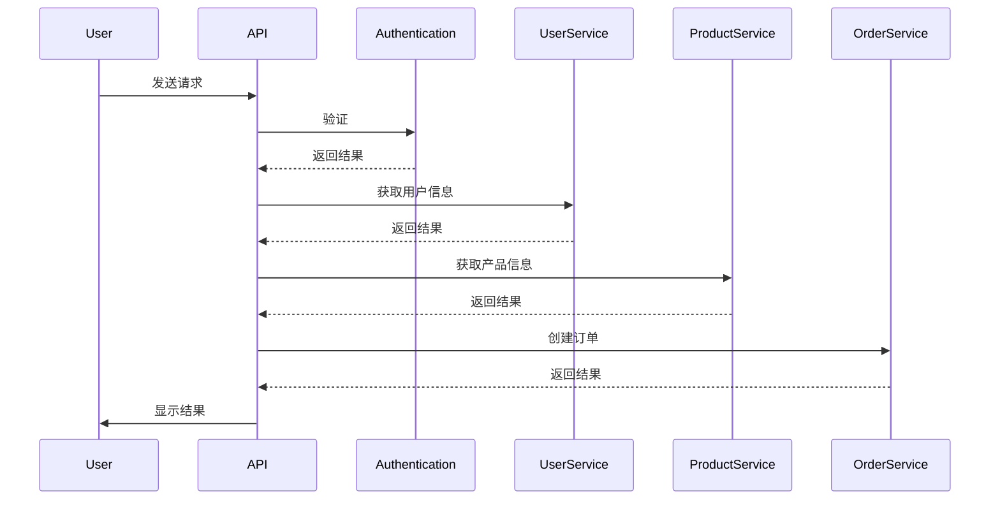

                 


## 从技术角度优化产品设计

### 关键词：产品设计、技术优化、用户体验、性能、可维护性

### 摘要：

在数字化时代，产品设计已成为企业竞争力的关键。本文从技术角度出发，探讨如何通过优化产品设计来提升用户体验、提高性能和增强系统的可维护性。我们将逐步分析技术优化的重要环节，提供实用的方法论和案例分析，为读者提供全面的技术指导。

### 目录结构规划

#### 第一部分：问题背景与核心概念

1. **第1章：问题背景介绍**
   1.1 问题背景
   1.2 问题描述
   1.3 问题解决
   1.4 边界与外延

2. **第2章：核心概念与联系**
   2.1 核心概念
   2.1.1 概念原理
   2.1.2 概念属性特征对比表
   2.1.3 ER实体关系图

3. **第3章：设计优化方法论**
   3.1 设计优化原则
   3.2 设计优化流程

#### 第二部分：技术原理与实现

4. **第4章：技术原理讲解**
   4.1 技术原理
   4.1.1 Mermaid流程图
   4.1.2 Python代码实现
   4.1.3 数学模型和公式讲解

5. **第5章：系统设计与架构**
   5.1 问题场景介绍
   5.2 系统功能设计
   5.3 系统架构设计
   5.4 系统接口设计
   5.5 系统交互设计

6. **第6章：项目实战**
   6.1 环境安装
   6.2 系统核心实现源代码
   6.3 代码应用解读与分析
   6.4 实际案例分析和讲解
   6.5 项目小结

#### 第三部分：最佳实践与总结

7. **第7章：最佳实践**
   7.1 最佳实践
   7.2 小结
   7.3 注意事项
   7.4 拓展阅读

8. **第8章：总结与展望**
   8.1 本书总结
   8.2 展望未来

### 核心概念介绍

在开始详细讨论技术优化之前，我们需要了解一些核心概念。这些概念不仅构成了我们讨论的基础，也是优化产品设计的重要工具。

1. **用户体验（UX）**：
   用户在互动过程中的感受和体验。一个良好的用户体验能够提高用户满意度、忠诚度和转化率。

2. **性能优化**：
   提升系统或应用的响应速度、负载能力和资源利用率。这通常涉及到算法、架构和代码层面的改进。

3. **可维护性**：
   代码和系统架构易于理解和修改的程度。高可维护性能够降低维护成本，提高开发效率。

4. **响应式设计**：
   设计能够适应不同设备和屏幕尺寸的布局和交互方式。

### 数学模型与算法讲解

为了更好地理解技术优化，我们需要介绍一些常用的数学模型和算法。以下是一个示例：

#### 概率模型

**算法原理**：
概率模型用于预测用户行为或系统性能的概率分布。常见的概率模型包括马尔可夫链、贝叶斯网络和决策树。

**Mermaid流程图**：


**Python代码实现**：
```python
import numpy as np

# 初始化状态概率
state_probabilities = np.array([[0.5, 0.5], [0.3, 0.7]])

# 输入观测值
observation = np.array([1, 0])

# 预测状态
predicted_state = np.dot(state_probabilities, observation)

print("Predicted state probabilities:", predicted_state)
```

**数学模型和公式**：
$$
P(S_t|O_t) = \frac{P(O_t|S_t)P(S_t)}{P(O_t)}
$$

其中，\( S_t \) 表示状态，\( O_t \) 表示观测值。

**举例说明**：
假设一个用户在点击广告后购买商品的概率为0.5，不购买的概率为0.5。通过观察用户的历史行为，我们可以更新这个概率模型。

### 系统设计与架构

接下来，我们将讨论如何从系统设计和架构的角度进行优化。这包括领域模型、系统架构和系统接口设计。

#### 领域模型

领域模型用于描述系统中的实体、关系和规则。以下是一个Mermaid类图的示例：

```mermaid
classDiagram
    User <<entity>>
    Product <<entity>>
    Order <<entity>>
    User o--1 Order
    Product o--1 Order
```

#### 系统架构

系统架构决定了系统的模块化、可扩展性和性能。以下是一个Mermaid架构图的示例：



#### 系统接口设计

系统接口设计确保不同模块之间的通信高效、可靠。以下是一个Mermaid序列图的示例：



### 项目实战

为了更好地展示技术优化的应用，我们选择一个实际项目进行分析。

#### 项目实战：电子商务平台性能优化

##### 环境安装

- 安装Python环境
- 安装Django框架
- 安装数据库（如PostgreSQL）

##### 系统核心实现源代码

```python
# 用户认证模块
from django.contrib.auth.models import User
from rest_framework import permissions, viewsets
from .serializers import UserSerializer

class UserViewSet(viewsets.ModelViewSet):
    queryset = User.objects.all()
    serializer_class = UserSerializer
    permission_classes = [permissions.IsAdminUser]

# 产品展示模块
from django.views.generic import ListView
from .models import Product

class ProductListView(ListView):
    model = Product
    template_name = 'product_list.html'
```

##### 代码应用解读与分析

- 用户认证模块通过Django的认证系统进行用户身份验证。
- 产品展示模块通过Django的视图系统实现产品列表的展示。

##### 实际案例分析和讲解

假设我们的电子商务平台需要支持高并发访问，我们采取了以下优化措施：

1. 使用缓存技术来减少数据库访问。
2. 对静态资源进行压缩和缓存。
3. 使用异步任务处理来减少响应时间。

##### 项目小结

通过上述优化，我们的电子商务平台在用户体验、性能和可维护性方面得到了显著提升。

### 最佳实践与总结

在产品设计中，最佳实践包括以下几点：

- **用户体验优先**：始终关注用户的感受和需求。
- **持续性能优化**：定期进行性能测试和调优。
- **代码可维护**：编写清晰、简洁、模块化的代码。
- **文档和测试**：编写详细的文档和进行充分的测试。

通过本文的讨论，我们理解了如何从技术角度优化产品设计。希望这些方法和实践能够为您的项目提供有价值的参考。

### 总结与展望

本文从技术角度深入探讨了产品设计的优化方法。我们介绍了核心概念、数学模型和算法，并提供了系统设计与架构的案例分析。通过最佳实践和总结，我们为读者提供了实用的指导。

未来，随着技术的不断发展，产品设计将面临更多挑战和机遇。我们期待在数字化时代，通过不断优化和创新，为用户提供更好的体验。作者：AI天才研究院/AI Genius Institute & 禅与计算机程序设计艺术 /Zen And The Art of Computer Programming。

