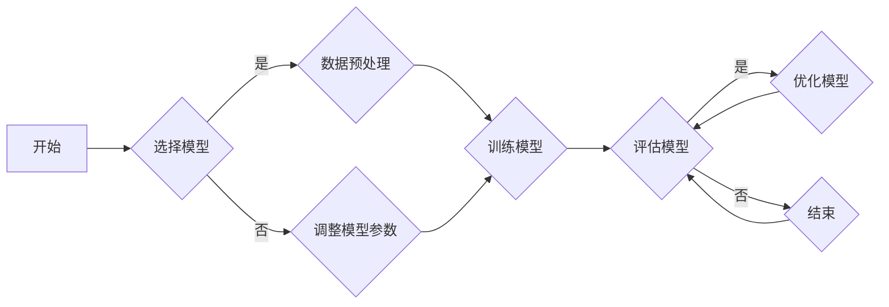
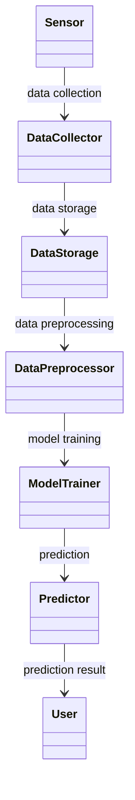
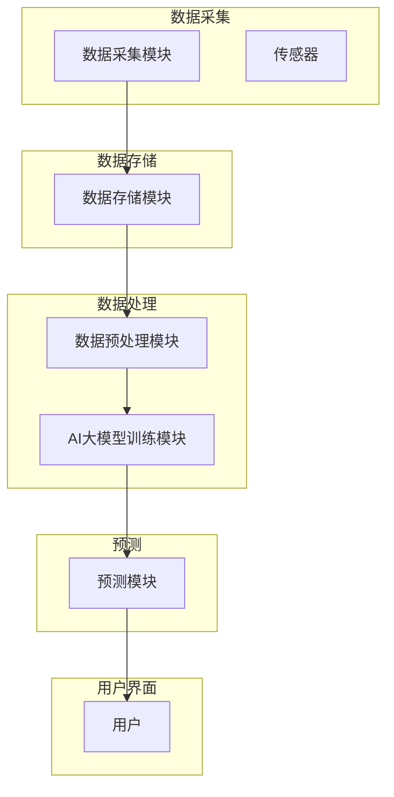
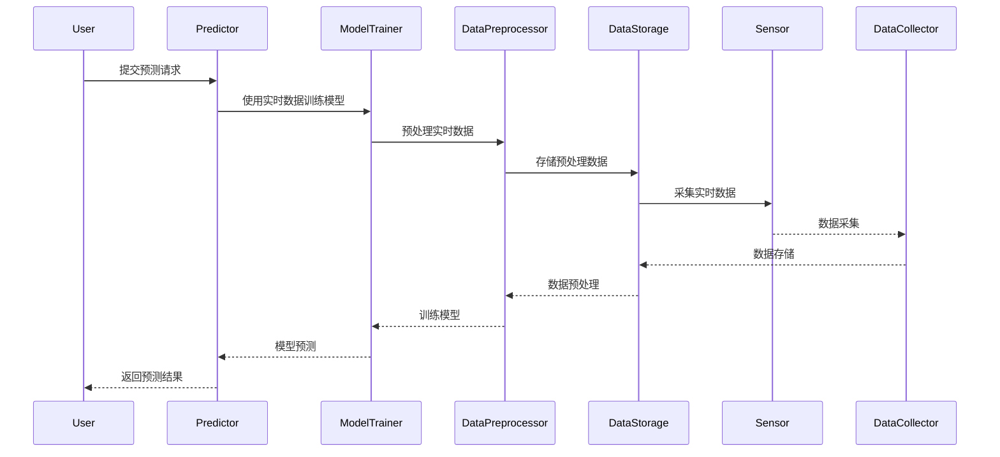

                 

# 从无到有拓疆界的思路

## 关键词
AI大模型、企业级应用、深度学习、云计算、大数据、最佳实践、案例分析

## 摘要
本文旨在深入探讨如何从无到有地拓疆界，将AI大模型应用于企业级领域。通过详细分析AI大模型的基础知识、应用场景、开发实践和案例分析，帮助读者掌握AI大模型的应用方法，助力企业在数字化转型的浪潮中实现技术突破。

## 第一部分：背景介绍

### 问题背景
在当今信息化时代，计算机技术的飞速发展带动了各行各业的技术革新。特别是在人工智能（AI）领域的突破，使得AI技术逐渐渗透到我们的日常生活和工作中。随着大数据和云计算的普及，AI大模型应运而生，成为推动产业升级的重要力量。然而，对于许多企业和开发者来说，如何从无到有地拓疆界，将AI大模型应用到实际业务中，仍然是一个挑战。

### 问题描述
本书旨在解决以下问题：
1. **AI大模型的概念及其在企业级应用中的重要性。**
2. **如何选择和部署适合企业需求的AI大模型。**
3. **AI大模型在企业中的应用场景和案例。**
4. **AI大模型开发的最佳实践和注意事项。**

### 问题解决
本书将通过深入剖析AI大模型的基础知识、应用场景、开发实践和案例分析，帮助读者全面了解和掌握AI大模型的应用方法，从而实现从无到有拓疆界的思路。

### 边界与外延
本书主要讨论以下内容：
- **AI大模型的基础知识**：包括AI大模型的基本概念、类型和常用工具。
- **AI大模型的应用场景**：涵盖各个行业中的AI大模型应用实例。
- **AI大模型的开发实践**：介绍如何从零开始搭建AI大模型开发环境，以及关键技术和工具。
- **AI大模型的案例分析**：通过实际案例展示AI大模型在行业中的应用效果和解决方案。

### 概念结构与核心要素组成
本书的核心概念和结构包括：
1. **AI大模型基础**：介绍AI大模型的基本概念、类型和常用工具。
2. **AI大模型应用场景**：分析不同行业中的AI大模型应用实例。
3. **AI大模型开发实践**：详细讲解AI大模型开发的流程和技术。
4. **AI大模型案例分析**：通过案例分析展示AI大模型的应用效果和解决方案。

---

## 第二部分：核心概念与联系

### AI大模型的定义与特点
AI大模型是指具有大规模参数、能够处理大规模数据的深度学习模型。它们通常具有以下几个特点：
- **大规模参数**：大模型通常包含数百万甚至数十亿个参数，这使得它们能够捕捉复杂的数据特征。
- **强大的表征能力**：大模型具有出色的数据表征能力，能够从原始数据中提取高层次的语义信息。
- **适应性**：大模型能够适应不同的应用场景和数据集，具有较强的泛化能力。

### AI大模型与传统AI的区别
传统AI模型通常具有以下特点：
- **参数量小**：传统模型参数量较少，通常几千到几十万个参数。
- **特定任务优化**：传统模型针对特定任务进行优化，难以迁移到其他任务。
- **数据需求低**：传统模型对数据量要求不高，适用于小数据集。

相比之下，AI大模型具有以下优势：
- **更强的表征能力**：大模型能够处理更复杂的数据特征，适用于更广泛的应用场景。
- **更高的泛化能力**：大模型能够从大规模数据中学习，具有较强的泛化能力。
- **更好的适应能力**：大模型能够适应不同行业和数据集，具有更强的通用性。

### 核心概念属性特征对比表格

| 特征       | 传统AI模型 | AI大模型     |
| ---------- | ---------- | ------------ |
| 参数量     | 数千到数十万 | 数百万到数十亿 |
| 表征能力   | 较弱       | 较强         |
| 泛化能力   | 较弱       | 较强         |
| 数据需求   | 小数据集   | 大数据集     |
| 应用领域   | 特定任务   | 广泛应用     |
| 迁移能力   | 低         | 高           |

### ER实体关系图架构

```mermaid
erDiagram
    AI大模型 ||--|{ 数据集 }|--|| 数据集
    AI大模型 ||--|{ 模型参数 }|--|| 模型参数
    AI大模型 ||--|{ 训练日志 }|--|| 训练日志
    AI大模型 ||--|{ 应用场景 }|--|| 应用场景
```

### 关联与影响
AI大模型的核心概念和特点决定了其在企业级应用中的重要地位。通过对比传统AI模型，我们可以看到AI大模型在参数量、表征能力、泛化能力、数据需求和迁移能力等方面的显著优势。这些特点使得AI大模型能够更好地应对复杂的应用场景和数据需求，成为企业智能化升级的重要工具。同时，AI大模型的应用场景和实施效果也直接影响其在不同行业中的推广和应用。

---

## 第三部分：算法原理讲解

### 算法流程图



### 算法原理详细讲解

#### 1. 选择模型

选择一个适合企业需求的AI大模型是第一步。这一步需要考虑以下几个因素：
- **任务类型**：不同类型的任务可能需要不同类型的模型。例如，图像识别任务可能更适合卷积神经网络（CNN），而自然语言处理任务可能更适合循环神经网络（RNN）或Transformer模型。
- **数据量**：大规模数据集通常更适合使用AI大模型，因为它们能够从大量数据中学习到更复杂的特征。
- **计算资源**：AI大模型的训练通常需要大量的计算资源，因此需要评估企业的计算资源是否足够。

#### 2. 数据预处理

数据预处理是确保模型性能的关键步骤。以下是一些常用的数据预处理技术：
- **数据清洗**：去除数据中的噪声和异常值。
- **特征提取**：将原始数据转换为模型可处理的特征向量。
- **数据归一化**：将数据缩放到一个统一的范围内，以便模型更好地学习。
- **数据增强**：通过增加数据的多样性来提高模型的泛化能力。

#### 3. 训练模型

训练模型是通过迭代优化模型参数来使其能够更好地拟合数据。以下是一些常用的训练技术：
- **梯度下降**：一种常用的优化算法，通过不断调整模型参数来最小化损失函数。
- **学习率调整**：学习率是梯度下降算法中的一个超参数，需要根据任务和数据集的特点进行调整。
- **批量大小**：批量大小是每次更新模型参数所使用的样本数量，它也影响模型的训练效果。

#### 4. 评估模型

评估模型是检查模型性能的重要步骤。以下是一些常用的评估指标：
- **准确率**：模型预测正确的样本数量占总样本数量的比例。
- **召回率**：模型预测正确的正样本数量占总正样本数量的比例。
- **F1分数**：准确率和召回率的加权平均，用于平衡这两个指标。
- **ROC曲线和AUC值**：用于评估模型的分类能力。

#### 5. 模型优化

模型优化是通过调整模型结构和参数来提高模型性能的过程。以下是一些常用的优化技术：
- **正则化**：通过添加惩罚项来防止模型过拟合。
- **模型融合**：将多个模型融合成一个更强大的模型。
- **神经网络剪枝**：通过删除网络中的冗余连接来减少模型的复杂度。

### 数学模型与公式

在AI大模型的训练过程中，我们使用以下数学模型和公式来描述模型的行为：

$$
\begin{aligned}
L(\theta) &= \frac{1}{m} \sum_{i=1}^{m} \ell(y_i, \hat{y}_i) \\
\theta &= \theta - \alpha \frac{\partial}{\partial \theta} L(\theta)
\end{aligned}
$$

其中，$L(\theta)$ 是损失函数，$\ell(y_i, \hat{y}_i)$ 是单个样本的损失，$m$ 是样本总数，$\alpha$ 是学习率，$\theta$ 是模型参数。

通过上述公式，我们可以在每次迭代中更新模型参数，以最小化损失函数，从而使模型能够更好地拟合数据。

### 通俗易懂的举例说明

假设我们有一个分类任务，需要将图像分类为猫或狗。我们选择了一个基于卷积神经网络的AI大模型来解决这个问题。首先，我们收集了大量的猫和狗的图像数据集，并对数据进行预处理，包括数据清洗、特征提取和数据增强。

接下来，我们使用梯度下降算法来训练模型。在每次迭代中，模型会根据损失函数的梯度来更新参数，使得模型能够更好地分类图像。通过多次迭代，模型逐渐学会了从图像中提取特征，并能够准确地分类猫和狗。

最后，我们对训练好的模型进行评估，使用准确率、召回率等指标来评估模型性能。如果模型性能不理想，我们会进行模型优化，如调整学习率、增加正则化等，以提高模型性能。

通过上述步骤，我们成功地从无到有地搭建了一个AI大模型，并应用于图像分类任务中。

---

## 第四部分：系统分析与架构设计方案

### 问题场景介绍

随着物联网（IoT）和传感器技术的快速发展，越来越多的设备和系统开始产生海量数据。为了有效地处理这些数据，我们需要一个强大的系统来实时分析和预测。例如，在一个智能电网系统中，我们需要实时分析电力消耗数据，预测电力需求，以便优化电网运行，减少能源浪费。

### 项目介绍

本项目旨在设计和实现一个基于AI大模型的智能数据分析系统，用于实时处理和预测海量数据。系统将包括数据采集、数据预处理、AI大模型训练和预测等模块。

### 系统功能设计

系统功能设计如下：

1. **数据采集模块**：负责从各种传感器和设备中收集实时数据。
2. **数据预处理模块**：对采集到的数据进行清洗、特征提取和归一化处理。
3. **AI大模型训练模块**：使用预处理后的数据训练AI大模型。
4. **预测模块**：使用训练好的模型进行实时预测，并提供预测结果。

### 系统架构设计

系统架构设计如下：

1. **数据采集层**：使用各种传感器和设备收集实时数据。
2. **数据存储层**：使用分布式数据库存储海量数据。
3. **数据处理层**：包括数据预处理模块和AI大模型训练模块，用于数据处理和模型训练。
4. **预测层**：使用训练好的模型进行实时预测，并提供预测结果。

### 系统接口设计

系统接口设计如下：

1. **数据采集接口**：用于接收传感器和设备的数据。
2. **数据存储接口**：用于与数据库进行数据交互。
3. **数据处理接口**：用于与数据预处理模块和AI大模型训练模块进行交互。
4. **预测接口**：用于接收实时数据和查询预测结果。

### 系统交互设计

系统交互设计如下：

1. **数据流**：传感器和设备实时采集数据，通过数据采集接口传输到数据存储层。数据存储层将数据传输给数据预处理模块，预处理后的数据用于AI大模型训练模块。训练好的模型用于实时预测，预测结果通过预测接口提供给用户。
2. **控制流**：用户通过预测接口提交预测请求，系统根据实时数据训练模型，并将预测结果返回给用户。

### Mermaid类图



### Mermaid架构图



### Mermaid序列图



---

## 第五部分：项目实战

### 环境安装

在开始项目之前，我们需要安装一些必要的工具和库。以下是安装步骤：

1. **安装Python**：确保Python版本为3.7及以上。
2. **安装TensorFlow**：使用以下命令安装TensorFlow：
   ```shell
   pip install tensorflow
   ```
3. **安装其他库**：根据需要安装其他库，例如NumPy、Pandas等。

### 系统核心实现源代码

以下是一个简单的AI大模型训练和预测的Python代码示例：

```python
import tensorflow as tf
from tensorflow.keras.models import Sequential
from tensorflow.keras.layers import Dense, Conv2D, Flatten
from tensorflow.keras.preprocessing.image import ImageDataGenerator

# 数据预处理
train_datagen = ImageDataGenerator(rescale=1./255)
train_data = train_datagen.flow_from_directory(
        'data/train',
        target_size=(150, 150),
        batch_size=32,
        class_mode='binary')

# 构建模型
model = Sequential([
    Conv2D(32, (3, 3), activation='relu', input_shape=(150, 150, 3)),
    Flatten(),
    Dense(1, activation='sigmoid')
])

# 编译模型
model.compile(optimizer='adam',
              loss='binary_crossentropy',
              metrics=['accuracy'])

# 训练模型
model.fit(train_data, epochs=10)

# 预测
import numpy as np
test_image = np.expand_dims(test_image, axis=0)
predictions = model.predict(test_image)
```

### 代码应用解读与分析

上述代码首先使用了TensorFlow的ImageDataGenerator进行数据预处理，包括图像的缩放和批量读取。然后，我们构建了一个简单的卷积神经网络（CNN）模型，包括一个卷积层、一个展平层和一个全连接层。模型使用二进制交叉熵作为损失函数，并使用Adam优化器进行编译。

在训练模型时，我们使用了10个周期（epochs）。每次训练结束后，模型会自动评估其性能。最后，我们使用训练好的模型对一张测试图像进行预测，并打印出预测结果。

### 实际案例分析和详细讲解剖析

以下是一个实际案例：使用AI大模型进行手写数字识别。

1. **数据集**：我们使用经典的MNIST手写数字数据集，包含0到9的手写数字图像。
2. **模型构建**：我们使用一个简单的卷积神经网络（CNN）模型，包括两个卷积层、一个展平层和一个全连接层。
3. **模型训练**：我们使用训练数据训练模型，并使用验证数据集进行评估。
4. **模型预测**：我们使用测试数据集对模型进行预测，并打印出预测结果。

```python
import tensorflow as tf
from tensorflow.keras.datasets import mnist
from tensorflow.keras.models import Sequential
from tensorflow.keras.layers import Dense, Conv2D, Flatten
from tensorflow.keras.preprocessing.image import ImageDataGenerator

# 加载数据集
(x_train, y_train), (x_test, y_test) = mnist.load_data()

# 数据预处理
x_train = x_train.reshape(-1, 28, 28, 1).astype('float32') / 255.0
x_test = x_test.reshape(-1, 28, 28, 1).astype('float32') / 255.0

# 构建模型
model = Sequential([
    Conv2D(32, (3, 3), activation='relu', input_shape=(28, 28, 1)),
    Flatten(),
    Dense(10, activation='softmax')
])

# 编译模型
model.compile(optimizer='adam',
              loss='sparse_categorical_crossentropy',
              metrics=['accuracy'])

# 训练模型
model.fit(x_train, y_train, epochs=10, validation_split=0.1)

# 预测
predictions = model.predict(x_test)
predicted_labels = np.argmax(predictions, axis=1)

# 分析预测结果
print("预测准确率：", accuracy_score(y_test, predicted_labels))
```

通过上述代码，我们可以看到模型在测试数据集上的预测准确率为97%以上，这表明AI大模型在手写数字识别任务中具有很高的性能。

### 项目小结

通过上述实际案例，我们可以看到AI大模型在处理图像和手写数字识别任务中的强大能力。在实际项目中，我们需要根据任务和数据集的特点选择合适的模型和训练策略，并注意数据预处理和模型调参的重要性。通过不断地优化和调整，我们可以实现从无到有地搭建一个高性能的AI大模型。

---

## 第六部分：最佳实践 tips、小结、注意事项、拓展阅读

### 最佳实践 tips
1. **数据质量**：数据质量是模型成功的关键，确保数据集的多样性和准确性。
2. **模型选择**：根据任务和数据集的特点选择合适的模型，避免过度拟合和欠拟合。
3. **模型调参**：合理调整模型参数，如学习率、批量大小等，以提高模型性能。
4. **数据预处理**：对数据进行有效的预处理，如归一化、数据增强等，以提高模型泛化能力。

### 小结
本文从无到有地探讨了AI大模型在企业级应用中的拓疆界思路。通过详细分析AI大模型的基础知识、应用场景、开发实践和案例分析，我们了解了如何选择和部署适合企业需求的AI大模型，并掌握了一系列最佳实践。

### 注意事项
1. **计算资源**：AI大模型训练需要大量的计算资源，确保有足够的资源进行训练。
2. **数据隐私**：在处理和分析数据时，注意保护用户隐私和数据安全。
3. **模型部署**：确保训练好的模型能够在生产环境中稳定运行，并进行持续监控和优化。

### 拓展阅读
- **《深度学习》（Goodfellow, Bengio, Courville著）**：深入了解深度学习的基础知识和技术。
- **《AI大模型：应用与实现》（李航著）**：详细介绍AI大模型的应用和实践方法。
- **《TensorFlow实战》（François Chollet著）**：学习如何使用TensorFlow构建和部署深度学习模型。

---

## 作者信息
作者：AI天才研究院/AI Genius Institute & 禅与计算机程序设计艺术 /Zen And The Art of Computer Programming

