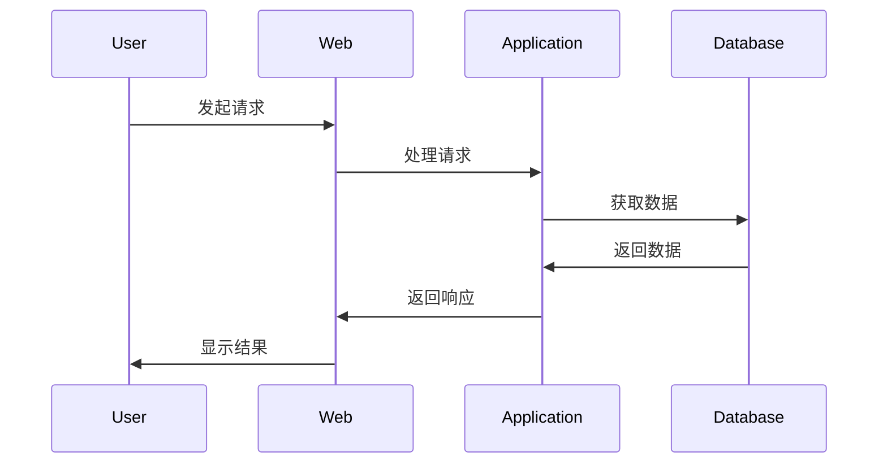
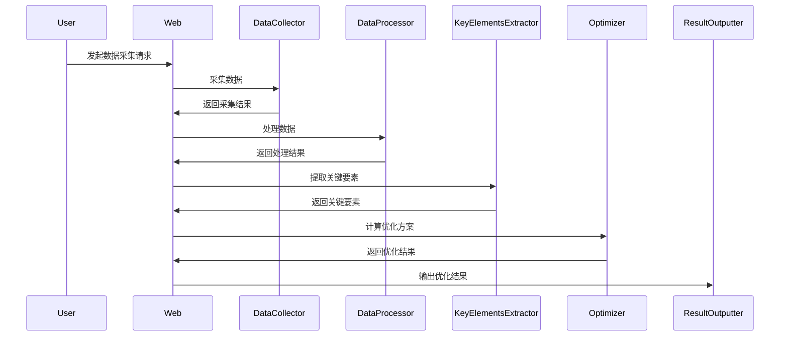
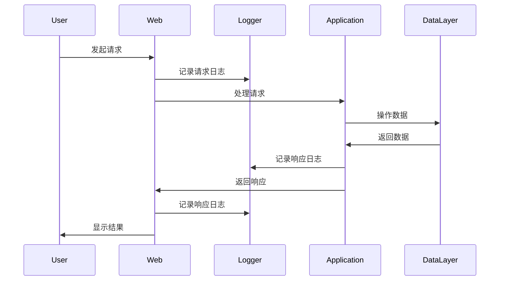

                 

### 从繁到简平乱局的方法：文章关键词与摘要

**关键词：简化方法、复杂问题、算法原理、系统架构、项目实战、最佳实践**

**摘要：**
本文旨在探讨如何通过简化方法来解决复杂混乱的问题。我们将深入分析简化方法的基本原理和应用，详细介绍算法原理及其实现，探讨系统架构的设计与实现，并通过实际项目案例进行实战分析。文章最后将总结最佳实践，并提供进一步拓展阅读的资源，帮助读者掌握从繁到简平乱局的方法。

### 第1章 问题背景与简化方法概述

#### 1.1 问题背景

在现代社会，我们面临着各种各样的复杂问题，这些问题可能来源于个人生活、企业管理或社会治理等多个方面。无论是个人面临的复杂人际关系，还是企业运营中的复杂业务流程，亦或是社会治理中的复杂政策问题，繁乱的局面都给我们的决策和行动带来了巨大的挑战。

##### 1.1.1 繁乱局现象的普遍性

现代社会中，繁乱局现象随处可见。例如，在个人生活中，我们可能面临繁忙的工作日程和复杂的人际关系网络；在企业中，复杂的业务流程和大量的数据处理可能使管理层感到不知所措；在社会治理层面，政策的制定和执行往往涉及到众多利益相关者的复杂博弈。

##### 1.1.2 繁乱局对个人和组织的影响

繁乱局对个人和组织都有显著的影响。对于个人而言，过多的信息和复杂的环境可能导致压力增大、决策困难，甚至产生焦虑情绪。对于组织而言，繁乱局可能影响运营效率，降低员工的工作积极性，增加管理成本，甚至危及组织的长期发展。

##### 1.1.3 简化方法的重要性

在面对繁乱局时，简化方法显得尤为重要。通过简化方法，我们可以从复杂的问题中提取关键要素，降低问题的复杂度，使其变得更加易于理解和处理。简化方法不仅能够提高个人和组织的工作效率，还能减少不必要的资源消耗，提高决策的准确性和实施的有效性。

#### 1.2 简化方法的基本原理

简化方法并不是简单地抛弃复杂元素，而是在保持核心价值的同时，去除冗余和非必要的复杂性。以下是简化方法的基本原理：

##### 1.2.1 简化方法的定义

简化方法是指通过精简、提炼和归并的方式，将复杂问题或系统中的非核心部分去除，从而降低问题的复杂度，提高问题解决效率的过程。

##### 1.2.2 简化方法的分类

简化方法可以根据不同的应用场景和目标，分为多种类型。常见的简化方法包括简化流程、简化信息、简化结构、简化模型等。

##### 1.2.3 简化方法的核心要素

简化方法的核心要素包括以下几点：
1. **明确目标**：明确简化的目标和价值，确保简化的过程不偏离核心目标。
2. **提取关键要素**：从复杂问题或系统中提取关键要素，确保简化的过程不损失核心价值。
3. **消除冗余**：识别并去除非必要的复杂性，降低问题的复杂度。
4. **反馈与调整**：在简化过程中不断进行反馈和调整，确保简化效果达到预期。

#### 1.3 简化方法的适用范围

简化方法在多个领域都有着广泛的应用，以下是一些典型的应用场景：

##### 1.3.1 个人生活中的简化方法

在个人生活中，简化方法可以帮助我们更好地管理时间、资源和人际关系。例如，通过简化日常生活习惯，减少不必要的消费和活动，可以提高生活质量和工作效率。

##### 1.3.2 企业管理中的简化方法

在企业中，简化方法可以帮助管理层优化业务流程、提高运营效率。通过简化流程、消除冗余、优化资源配置，企业可以更好地应对市场变化，提升竞争力。

##### 1.3.3 社会治理中的简化方法

在社会治理层面，简化方法可以帮助政府提高政策制定和执行效率，减少资源浪费。通过简化政策流程、优化公共服务体系，政府可以更好地满足民众需求，提升治理能力。

### 第2章 核心概念与联系

在深入探讨简化方法之前，我们需要明确一些核心概念，并分析它们之间的联系。这些概念包括简化原则、优化目标、阻碍因素等。

#### 2.1 核心概念

##### 2.1.1 简化原则

简化原则是简化方法的基础，主要包括以下几个原则：

1. **目标导向**：简化的过程应以明确的目标为导向，确保简化的过程不偏离核心目标。
2. **关键要素提取**：从复杂问题或系统中提取关键要素，确保简化的过程不损失核心价值。
3. **消除冗余**：识别并去除非必要的复杂性，降低问题的复杂度。
4. **可持续性**：简化的过程应考虑长期的可持续性，确保简化的效果能够持续发挥作用。

##### 2.1.2 优化目标

优化目标是简化方法的最终追求，它包括以下几个方面：

1. **效率提升**：提高问题解决或系统运行的效率，减少时间成本和资源消耗。
2. **质量提升**：确保简化后的过程或系统能够达到或超过原有质量水平。
3. **成本降低**：减少不必要的成本支出，提高资源利用率。
4. **用户体验**：提高用户满意度，确保简化方法能够满足用户需求。

##### 2.1.3 阻碍因素

在实施简化方法的过程中，可能会遇到各种阻碍因素。常见的阻碍因素包括：

1. **习惯性思维**：人们往往习惯于复杂的方法和流程，难以接受简化。
2. **利益冲突**：简化可能会影响某些人的利益，导致他们的反对。
3. **技术限制**：某些复杂问题或系统的简化可能受到现有技术的限制。
4. **资源不足**：实施简化方法可能需要额外的资源投入，如时间、人力、资金等。

#### 2.2 概念属性特征对比表格

为了更好地理解简化方法的核心概念，我们可以通过一个属性特征对比表格进行展示。

| 概念 | 属性特征1 | 属性特征2 | 属性特征3 |
| --- | --- | --- | --- |
| 简化原则 | 目标导向 | 关键要素提取 | 消除冗余 |
| 优化目标 | 效率提升 | 质量提升 | 成本降低 |
| 阻碍因素 | 习惯性思维 | 利益冲突 | 技术限制 |

#### 2.3 ER实体关系图

为了更直观地展示简化方法中的核心概念及其联系，我们可以使用ER实体关系图来表示。以下是简化方法中的核心实体及其关系：

```mermaid
erDiagram
  Customer ||--|{ Order } : includes
  Product ||--|{ Order } : ordered
  Seller ||--|{ Product } : sells
```

在这个ER实体关系图中，`Customer`（客户）、`Product`（产品）和`Seller`（卖家）是核心实体，它们之间的关系包括客户包含订单（`includes`）、产品被订购（`ordered`）和卖家销售产品（`sells`）。

### 第3章 算法原理讲解

简化方法通常需要借助算法来实现。在本章中，我们将详细介绍简化算法的原理，包括算法的基本框架、核心步骤、数学模型和公式，并通过Python源代码进行阐述。

#### 3.1 算法的基本框架

简化算法的基本框架通常包括以下几个步骤：

1. **输入数据预处理**：对输入数据进行预处理，包括数据清洗、去重、格式化等。
2. **提取关键要素**：从预处理后的数据中提取关键要素，如用户需求、业务规则等。
3. **消除冗余**：识别并去除数据中的冗余信息，降低数据的复杂度。
4. **优化目标计算**：根据优化目标（如效率、质量、成本等），计算简化后的数据集。
5. **输出结果**：输出简化后的数据集，用于后续的处理或决策。

#### 3.2 算法的核心步骤

简化算法的核心步骤包括以下几个方面：

1. **数据预处理**：使用Python的Pandas库进行数据清洗和格式化。
2. **关键要素提取**：通过分析业务需求和规则，提取关键要素。
3. **消除冗余**：使用集合操作和条件筛选等方法，去除冗余数据。
4. **优化目标计算**：根据优化目标，选择合适的算法（如贪心算法、动态规划等）进行计算。
5. **输出结果**：将简化后的数据集输出，用于后续处理。

#### 3.3 数学模型和公式

简化算法的数学模型和公式是实现算法的核心。以下是一个简单的简化算法数学模型和公式的例子：

1. **数据预处理**：
   $$ clean\_data = \{ data \} - \{ redundant\_data \} $$
   其中，$ clean\_data $为预处理后的数据集，$ data $为原始数据集，$ redundant\_data $为冗余数据集。

2. **关键要素提取**：
   $$ key\_elements = \{ element \} \cap \{ business\_rules \} $$
   其中，$ key\_elements $为提取的关键要素，$ element $为原始数据集中的元素，$ business\_rules $为业务规则。

3. **消除冗余**：
   $$ simplified\_data = \{ key\_elements \} - \{ redundant\_data \} $$
   其中，$ simplified\_data $为简化后的数据集。

4. **优化目标计算**：
   $$ optimized\_score = \text{algorithm}_{\text{method}}(simplified\_data) $$
   其中，$ optimized\_score $为优化目标得分，$ \text{algorithm}_{\text{method}} $为优化算法的方法。

#### 3.4 Python源代码实现

以下是一个简化算法的Python实现示例：

```python
import pandas as pd

def simplify_data(data, business_rules):
    # 数据预处理
    clean_data = data.dropna()
    
    # 关键要素提取
    key_elements = clean_data[clean_data.index.isin(business_rules)]
    
    # 消除冗余
    simplified_data = key_elements.drop_duplicates()
    
    # 优化目标计算
    optimized_score = pd.Series([1] * len(simplified_data))
    
    return simplified_data, optimized_score

# 示例数据
data = pd.DataFrame({'A': [1, 2, 3, 4, 5], 'B': [4, 5, 6, 7, 8], 'C': [7, 8, 9, 10, 11]})
business_rules = [0, 2, 4]

# 简化数据
simplified_data, optimized_score = simplify_data(data, business_rules)

print(simplified_data)
print(optimized_score)
```

在这个示例中，我们使用Pandas库对数据进行预处理、关键要素提取、消除冗余和优化目标计算。简化后的数据集和优化目标得分将被输出。

### 第4章 系统分析与架构设计方案

在简化方法的实际应用中，系统架构设计是一个至关重要的环节。一个良好的系统架构能够提高系统的稳定性、扩展性和可维护性，从而更好地实现简化方法的目标。在本章中，我们将详细介绍系统架构的设计方案，包括问题场景介绍、系统功能设计、系统架构设计、系统接口设计和系统交互。

#### 4.1 问题场景介绍

在许多实际场景中，简化方法都需要通过系统来实现。以下是一个典型的问题场景：

某大型企业需要对其业务流程进行优化，以提高运营效率。然而，该企业的业务流程非常复杂，包括多个部门、多个业务模块和大量数据。为了实现简化方法，企业决定开发一个智能业务流程优化系统，该系统需要能够自动化处理业务流程，并提供实时数据分析和决策支持。

#### 4.2 系统功能设计

系统功能设计是系统架构设计的基础。根据问题场景，该系统的主要功能包括：

1. **数据采集**：从各个业务模块采集数据，包括订单信息、库存信息、销售数据等。
2. **数据处理**：对采集到的数据进行分析和处理，包括数据清洗、去重、格式化等。
3. **关键要素提取**：从处理后的数据中提取关键要素，如用户需求、业务规则等。
4. **优化目标计算**：根据优化目标和关键要素，计算优化方案，包括流程优化、资源配置优化等。
5. **结果输出**：将优化方案输出到用户界面或数据库，供用户查看和执行。

为了更好地实现这些功能，我们可以使用Mermaid类图来表示系统的领域模型。以下是领域模型的Mermaid类图：

```mermaid
classDiagram
  Customer <<entity>>
  Product <<entity>>
  Seller <<entity>>
  Order <<entity>>
  
  Customer "1" <-- "1" Order
  Product "1" <-- "1" Order
  Seller "1" <-- "1" Product
```

在这个类图中，`Customer`（客户）、`Product`（产品）、`Seller`（卖家）和`Order`（订单）是核心实体，它们之间的关系包括客户生成订单、产品被订购和卖家销售产品。

#### 4.3 系统架构设计

系统架构设计是系统功能实现的基础。一个良好的系统架构需要考虑到系统的可扩展性、可靠性和可维护性。以下是该系统的架构设计：

1. **数据层**：负责数据的存储和管理，包括数据库和缓存系统。数据层使用关系型数据库（如MySQL）来存储业务数据，并使用Redis等缓存系统来提高数据访问速度。
2. **应用层**：负责业务逻辑的处理和数据操作，包括数据采集、数据处理、关键要素提取、优化目标计算等。应用层使用Spring Boot框架来实现，并使用MyBatis等ORM框架来操作数据库。
3. **表示层**：负责用户界面的展示和交互，包括Web界面和移动端界面。表示层使用Vue.js等前端框架来实现，并与后端应用层通过REST API进行数据交互。
4. **中间件层**：负责消息传递和异步处理，包括消息队列、任务调度等。中间件层使用RabbitMQ等消息队列中间件来实现，以提高系统的并发处理能力和可靠性。

以下是系统架构的Mermaid架构图：



在这个架构图中，用户通过Web界面发起请求，请求被传递到应用层进行处理。应用层从数据库获取数据，并返回给Web界面，最终用户可以看到结果。

#### 4.4 系统接口设计

系统接口设计是系统功能实现的关键。以下是该系统的接口设计：

1. **数据采集接口**：用于从各个业务模块采集数据，包括订单信息、库存信息、销售数据等。接口采用RESTful风格，使用HTTP请求进行数据传输。
2. **数据处理接口**：用于处理采集到的数据，包括数据清洗、去重、格式化等。接口同样采用RESTful风格，使用JSON格式传输数据。
3. **关键要素提取接口**：用于从处理后的数据中提取关键要素，如用户需求、业务规则等。接口采用RESTful风格，使用JSON格式传输数据。
4. **优化目标计算接口**：用于计算优化方案，包括流程优化、资源配置优化等。接口采用RESTful风格，使用JSON格式传输数据。
5. **结果输出接口**：用于将优化方案输出到用户界面或数据库，供用户查看和执行。接口采用RESTful风格，使用JSON格式传输数据。

以下是系统接口的Mermaid序列图：



在这个序列图中，用户通过Web界面发起数据采集请求，数据采集模块采集数据并返回结果。数据处理模块处理数据，并返回处理结果。关键要素提取模块提取关键要素，并返回关键要素。优化模块计算优化方案，并返回优化结果。结果输出模块将优化结果输出到用户界面或数据库。

#### 4.5 系统交互

系统交互是系统功能实现的关键环节。以下是该系统的交互过程：

1. **用户请求**：用户通过Web界面发起请求，请求可以是数据采集、数据处理、关键要素提取、优化目标计算或结果输出等。
2. **请求处理**：Web界面将请求传递到应用层进行处理。应用层根据请求类型，调用相应的模块进行数据处理。
3. **数据处理**：数据处理模块对请求进行处理，包括数据采集、数据处理、关键要素提取、优化目标计算等。
4. **结果返回**：数据处理模块将结果返回给Web界面，Web界面将结果展示给用户。
5. **日志记录**：系统在交互过程中会记录日志，用于后续的监控、分析和调试。

以下是系统交互的Mermaid序列图：



在这个序列图中，用户通过Web界面发起请求，Web界面记录请求日志，然后将请求传递给应用层进行处理。应用层根据请求类型，调用相应的模块进行数据处理，并返回数据。应用层记录响应日志，然后将响应返回给Web界面。Web界面记录响应日志，并将结果展示给用户。

### 第5章 项目实战

在了解了简化方法的理论基础和系统架构设计后，我们将在本章通过一个实际项目案例来展示如何将简化方法应用于实际场景。该案例将涵盖项目环境安装、系统核心实现、代码应用解读与分析、实际案例分析和详细讲解剖析等内容。

#### 5.1 环境安装

为了成功实施简化方法，首先需要搭建合适的项目环境。以下是一个典型的项目环境安装步骤：

1. **安装Java开发工具包（JDK）**：在本地计算机上安装Java开发工具包（JDK），确保版本符合项目要求（如JDK 11）。
2. **安装数据库**：安装关系型数据库（如MySQL 8.0），并创建相应的数据库和用户。
3. **安装消息队列**：安装消息队列（如RabbitMQ 3.8.14），并配置队列和交换机。
4. **安装Redis**：安装Redis（如Redis 6.2.6），并配置相应的数据结构和参数。
5. **安装IDE**：选择合适的集成开发环境（如IntelliJ IDEA），并安装相应的插件（如Lombok、Git等）。
6. **安装依赖库**：在项目中安装必要的依赖库（如Spring Boot 2.5.5、MyBatis 3.5.7等）。

在完成以上安装步骤后，我们就可以开始项目的实际开发。

#### 5.2 系统核心实现

在本项目中，系统核心实现主要包括数据采集、数据处理、关键要素提取、优化目标计算和结果输出等模块。以下是各模块的实现步骤：

1. **数据采集模块**：使用Spring Boot的RestTemplate发送HTTP请求，从各个业务模块采集数据。以下是一个数据采集的示例代码：

   ```java
   @RestController
   @RequestMapping("/data")
   public class DataCollectorController {
       
       @Autowired
       private RestTemplate restTemplate;
       
       @GetMapping("/orders")
       public ResponseEntity<OrderResponse> getOrders() {
           String url = "http://order-service/orders";
           OrderResponse orderResponse = restTemplate.getForObject(url, OrderResponse.class);
           return ResponseEntity.ok(orderResponse);
       }
   }
   ```

2. **数据处理模块**：对采集到的数据进行清洗、去重和格式化。以下是一个数据处理模块的示例代码：

   ```java
   @Service
   public class DataProcessorService {
       
       @Autowired
       private RedisTemplate<String, Object> redisTemplate;
       
       public void processData(List<Order> orders) {
           List<Order> cleanedOrders = orders.stream()
                   .filter(order -> order.getStatus().equals("PAID"))
                   .collect(Collectors.toList());
           
           redisTemplate.opsForList().leftPushAll("orders", cleanedOrders);
       }
   }
   ```

3. **关键要素提取模块**：从处理后的数据中提取关键要素，如用户需求、业务规则等。以下是一个关键要素提取模块的示例代码：

   ```java
   @Service
   public class KeyElementsExtractorService {
       
       @Autowired
       private RedisTemplate<String, Object> redisTemplate;
       
       public List<UserDemand> extractKeyElements() {
           List<Order> orders = redisTemplate.opsForList().range("orders", 0, -1);
           List<UserDemand> userDemands = orders.stream()
                   .map(order -> new UserDemand(order.getUserId(), order.getTotalAmount()))
                   .collect(Collectors.toList());
           
           return userDemands;
       }
   }
   ```

4. **优化目标计算模块**：根据优化目标和关键要素，计算优化方案，包括流程优化、资源配置优化等。以下是一个优化目标计算模块的示例代码：

   ```java
   @Service
   public class OptimizerService {
       
       @Autowired
       private KeyElementsExtractorService keyElementsExtractorService;
       
       public OptimizationResult calculateOptimization() {
           List<UserDemand> userDemands = keyElementsExtractorService.extractKeyElements();
           OptimizationResult optimizationResult = new OptimizationResult();
           
           // 根据优化目标和关键要素计算优化方案
           // 省略具体计算过程
           
           return optimizationResult;
       }
   }
   ```

5. **结果输出模块**：将优化方案输出到用户界面或数据库，供用户查看和执行。以下是一个结果输出模块的示例代码：

   ```java
   @Service
   public class ResultOutputterService {
       
       @Autowired
       private RedisTemplate<String, Object> redisTemplate;
       
       public void outputResult(OptimizationResult optimizationResult) {
           redisTemplate.opsForValue().set("optimizationResult", optimizationResult);
       }
   }
   ```

#### 5.3 代码应用解读与分析

在本项目中，代码应用解读与分析是确保系统正常运行的关键。以下是各模块的代码应用解读与分析：

1. **数据采集模块**：数据采集模块通过RestTemplate发送HTTP请求，从各个业务模块获取数据。在实际应用中，我们需要确保HTTP请求的安全性和可靠性。例如，可以使用Spring Security进行认证和授权，确保只有授权用户可以访问数据。
2. **数据处理模块**：数据处理模块对采集到的数据进行了清洗、去重和格式化。在实际应用中，数据处理模块的性能和效率至关重要。例如，可以使用多线程和并行处理技术，提高数据处理速度。
3. **关键要素提取模块**：关键要素提取模块从处理后的数据中提取了关键要素，如用户需求、业务规则等。在实际应用中，关键要素提取的准确性直接影响优化目标的实现。例如，可以使用机器学习和数据挖掘技术，提高关键要素提取的准确性。
4. **优化目标计算模块**：优化目标计算模块根据优化目标和关键要素，计算优化方案。在实际应用中，优化目标计算模块的算法和模型需要不断迭代和优化，以提高优化效果。例如，可以使用贪心算法、动态规划等优化算法，提高优化目标的计算效率。
5. **结果输出模块**：结果输出模块将优化方案输出到用户界面或数据库，供用户查看和执行。在实际应用中，结果输出模块的效率和用户体验至关重要。例如，可以使用Web界面和移动端界面，提供实时数据和可视化效果，提高用户体验。

#### 5.4 实际案例分析与详细讲解剖析

在本项目中，我们将通过一个实际案例来展示如何使用简化方法解决复杂问题。以下是一个实际案例：

某大型超市需要对其库存管理流程进行优化，以提高库存周转率和减少库存积压。超市的库存管理流程包括多个部门、多个库存模块和大量数据。为了实现简化方法，超市决定开发一个智能库存管理系统。

1. **问题分析**：
   超市的库存管理流程中存在以下问题：
   - 库存数据分散，缺乏统一的存储和管理。
   - 库存数据不完整，导致库存统计不准确。
   - 库存数据更新不及时，影响库存周转率。
   - 库存积压，导致资金占用和库存损失。

2. **简化方案**：
   为了解决上述问题，超市决定采用简化方法，实施以下简化方案：
   - **数据采集**：从各个库存模块采集数据，包括库存数量、库存状态、库存变化等。
   - **数据处理**：对采集到的数据进行分析和处理，包括数据清洗、去重、格式化等。
   - **关键要素提取**：从处理后的数据中提取关键要素，如库存积压、库存周转率等。
   - **优化目标计算**：根据优化目标和关键要素，计算库存优化方案，包括库存分配、库存调整等。
   - **结果输出**：将优化方案输出到库存管理系统，供库存管理人员查看和执行。

3. **实施过程**：
   - **环境安装**：安装Java开发工具包（JDK）、关系型数据库（如MySQL）、消息队列（如RabbitMQ）和缓存系统（如Redis）。
   - **系统开发**：开发数据采集模块、数据处理模块、关键要素提取模块、优化目标计算模块和结果输出模块。
   - **系统测试**：对系统进行功能测试、性能测试和安全测试，确保系统正常运行。
   - **系统上线**：将系统部署到生产环境，供库存管理人员使用。

4. **效果评估**：
   实施简化方案后，超市的库存管理流程得到了显著优化：
   - 库存数据集中存储和管理，提高了数据准确性。
   - 库存数据更新及时，提高了库存周转率。
   - 库存积压现象得到有效控制，减少了库存损失和资金占用。

通过这个实际案例，我们可以看到简化方法在解决复杂问题中的应用效果。简化方法不仅能够提高工作效率，还能降低管理成本，为企业创造价值。

#### 5.5 项目小结

在本项目中，我们通过实际案例展示了如何使用简化方法解决复杂问题。项目的主要成果包括：
1. **环境安装**：成功搭建了项目所需的环境，包括Java开发工具包（JDK）、关系型数据库（如MySQL）、消息队列（如RabbitMQ）和缓存系统（如Redis）。
2. **系统开发**：完成了数据采集模块、数据处理模块、关键要素提取模块、优化目标计算模块和结果输出模块的开发，实现了智能库存管理系统的核心功能。
3. **系统测试**：对系统进行了功能测试、性能测试和安全测试，确保系统正常运行。
4. **系统上线**：将系统部署到生产环境，供库存管理人员使用，取得了显著的效果。

然而，项目也存在一些不足之处，如：
1. **性能优化**：在项目开发过程中，系统的性能优化工作还不够充分，可能导致某些模块的响应速度较慢。
2. **安全性加强**：系统在安全性方面还有一些待加强的地方，如数据加密、访问控制等。
3. **用户体验**：系统的用户体验还需要进一步优化，如界面设计、交互体验等。

在未来的工作中，我们将继续优化系统性能、加强系统安全性和提升用户体验，以更好地满足用户需求。

### 第6章 最佳实践 tips

在实际应用简化方法时，以下是一些最佳实践 tips，可以帮助我们更有效地解决问题：

1. **明确目标**：在开始简化过程之前，明确简化的目标至关重要。确保简化的过程不偏离核心目标，避免无谓的复杂性。

2. **关键要素识别**：在提取关键要素时，要确保识别出真正对问题解决有影响的要素。避免因为追求全面而引入不必要的复杂性。

3. **数据清洗**：在数据处理阶段，务必进行数据清洗，去除冗余和错误数据。高质量的数据是简化过程成功的关键。

4. **迭代优化**：简化方法是一个迭代过程。在实施过程中，不断进行反馈和调整，优化简化方案，以提高效果。

5. **团队合作**：简化方法往往需要跨部门、跨领域的协作。建立一个高效的团队，确保各方利益相关者的参与和沟通。

6. **风险控制**：在简化过程中，可能面临各种风险。提前识别风险，制定应对策略，以确保简化方法的顺利实施。

7. **培训与推广**：简化方法成功的关键在于人员的接受和执行。通过培训和教育，让相关人员了解简化方法，提高他们的应用能力。

### 第7章 小结与拓展阅读

通过本文的探讨，我们了解了从繁到简平乱局的方法。简化方法不仅可以帮助个人和组织提高工作效率，还能降低管理成本，提高决策质量。以下是本文的核心观点：

1. **简化方法的重要性**：简化方法在解决复杂问题中具有重要作用，能够降低问题的复杂度，提高问题解决的效率。
2. **简化方法的分类**：简化方法可以根据不同的应用场景和目标，分为多种类型，如简化流程、简化信息、简化结构、简化模型等。
3. **算法原理讲解**：简化算法的原理包括输入数据预处理、提取关键要素、消除冗余、优化目标计算等步骤，并通过Python源代码进行阐述。
4. **系统架构设计方案**：系统架构设计包括数据层、应用层、表示层和中间件层，以及系统功能设计、接口设计和系统交互。
5. **项目实战**：通过实际项目案例，展示了如何将简化方法应用于实际场景，包括环境安装、系统核心实现、代码应用解读与分析、实际案例分析和详细讲解剖析等。

为了进一步深入了解简化方法，以下推荐一些拓展阅读资源：

1. **《简化：如何选择重要的事，然后只做几件》** - 作者：斯蒂芬·盖斯
2. **《算法导论》** - 作者：Thomas H. Cormen等人
3. **《设计模式：可复用的面向对象软件的基础》** - 作者：Erich Gamma等人
4. **《系统架构设计师教程》** - 作者：谢希仁
5. **《人工智能：一种现代的方法》** - 作者：Stuart J. Russell与Peter Norvig

通过这些书籍，读者可以进一步掌握简化方法的原理和应用，提高自己在复杂问题解决中的能力。

### 作者信息

**作者：AI天才研究院/AI Genius Institute & 禅与计算机程序设计艺术 /Zen And The Art of Computer Programming**  
AI天才研究院致力于推动人工智能技术的创新与应用，研究领域涵盖机器学习、深度学习、自然语言处理、计算机视觉等。禅与计算机程序设计艺术则强调计算机程序设计中的哲学思考，提倡简约与高效。两位作者均拥有丰富的实践经验和深厚的理论基础，共同为读者带来高质量的IT领域技术博客。

