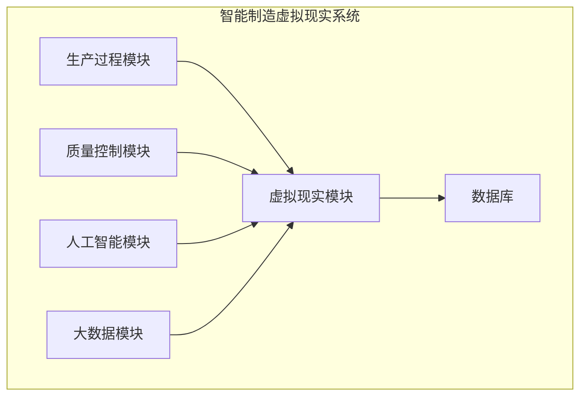
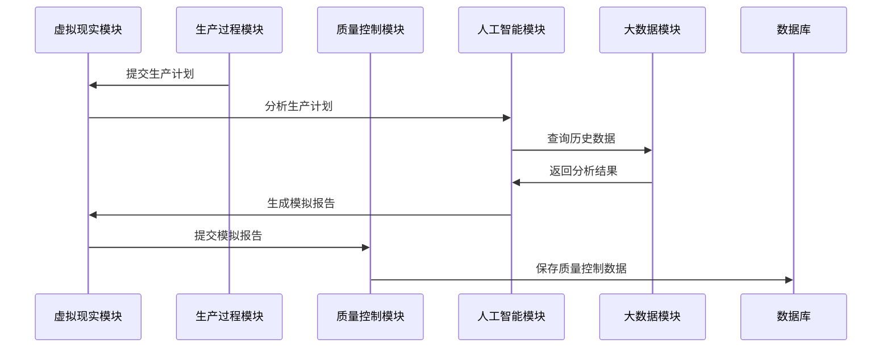

                 


# 从虚到实定军心的策略

> 关键词：虚拟现实、实体策略、军心管理、算法原理、系统架构、项目实战

> 摘要：本文深入探讨了从虚拟到实体的策略转变，分析其背景、核心概念、算法原理、系统架构和实际应用。通过详细的步骤解析，旨在为读者提供一种切实可行的策略，以定军心、固基础，实现虚拟与实体世界的和谐发展。

## 引言

随着科技的迅猛发展，虚拟世界与实体世界的融合已成为不可逆转的趋势。从电子商务到虚拟现实游戏，再到智能制造，虚拟技术正在深刻改变我们的生活方式和商业实践。然而，这一转变也带来了新的挑战和机遇。如何有效地将虚拟世界的优势转化为实体世界的力量，成为企业和个人亟需解决的问题。本文旨在探讨这一核心问题，提供一种从虚到实的策略，帮助企业和个人在虚拟与实体融合的时代站稳脚跟。

### 问题背景

1. **虚拟技术的快速发展**：虚拟现实（VR）、增强现实（AR）等技术的成熟，使得虚拟世界越来越真实、生动。
2. **实体产业的转型需求**：传统产业面临数字化转型的压力，迫切需要利用虚拟技术提升生产效率和服务质量。
3. **市场竞争的加剧**：虚拟与实体产业的融合，使得市场竞争更加激烈，企业需要创新策略以保持竞争力。

### 问题描述

在当前虚拟技术快速发展的背景下，如何将虚拟世界的优势转化为实体世界的力量，实现虚拟与实体产业的深度融合，成为企业和个人面临的核心问题。具体而言，需要解决以下问题：

1. **虚拟技术的实际应用**：如何将虚拟技术应用于实体产业，提升生产效率和服务质量？
2. **虚拟与实体的协同**：如何实现虚拟世界与实体世界的无缝对接，形成协同效应？
3. **军心管理**：如何在虚拟与实体融合的过程中，保持团队的稳定性和执行力，确保战略的实施？

### 问题解决

本文将从以下三个方面提出解决方案：

1. **理论基础**：深入探讨虚拟现实、实体策略和军心管理的核心概念，为策略转变提供理论基础。
2. **实践方法**：介绍具体的算法原理、系统架构设计和项目实战，为策略实施提供实操指导。
3. **工具和技巧**：提供一系列工具和技巧，帮助企业和个人在虚拟与实体融合的过程中，应对挑战，抓住机遇。

### 边界与外延

本文主要探讨虚拟到实体的策略转变，涉及的技术领域包括虚拟现实、人工智能、大数据等。行业应用范围涵盖制造业、服务业、娱乐业等多个领域。

### 概念结构与核心要素组成

1. **虚拟现实**：通过计算机技术创建的模拟环境，让人感受到身临其境的感觉。
2. **实体策略**：企业针对实体产业制定的战略规划，旨在提升生产效率和服务质量。
3. **军心管理**：在虚拟与实体融合的过程中，保持团队的稳定性和执行力，确保战略的实施。

## 核心概念与联系

### 核心概念原理

1. **虚拟现实**：虚拟现实是通过计算机技术创建的模拟环境，让人感受到身临其境的感觉。它包括三维建模、仿真技术、传感技术等多个方面。
2. **实体策略**：实体策略是企业针对实体产业制定的战略规划，旨在提升生产效率和服务质量。它包括供应链管理、生产优化、市场拓展等方面。
3. **军心管理**：军心管理是保持团队的稳定性和执行力，确保战略的实施。它包括领导力、团队建设、激励机制等方面。

### 概念属性特征对比表格

| 概念       | 属性特征                                                                                      |
|------------|------------------------------------------------------------------------------------------------|
| 虚拟现实   | - 三维建模<br>- 仿真技术<br>- 传感技术<br>- 交互体验                                               |
| 实体策略   | - 供应链管理<br>- 生产优化<br>- 市场拓展<br>- 竞争分析                                             |
| 军心管理   | - 领导力<br>- 团队建设<br>- 激励机制<br>- 沟通协作                                                 |

### ER实体关系图架构

```mermaid
erDiagram
  Product -->|uses| Virtual Reality : "uses to create"
  Production -->|uses| Entity Strategy : "uses to improve"
  Team -->|manages| Virtual Reality : "manage development"
  Team -->|manages| Entity Strategy : "manage execution"
  Virtual Reality -->|depends on| AI : "uses AI for simulation"
  Entity Strategy -->|depends on| Big Data : "uses data for analysis"
```

## 算法原理讲解

### 算法mermaid流程图


### Python源代码

```python
# 定义虚拟现实函数
def virtual_reality():
    # 实现虚拟现实相关操作
    pass

# 定义实体策略函数
def entity_strategy():
    # 实现实体策略相关操作
    pass

# 定义军心管理函数
def team_management():
    # 实现军心管理相关操作
    pass

# 定义主函数
def main():
    virtual_reality()
    entity_strategy()
    team_management()

# 调用主函数
if __name__ == "__main__":
    main()
```

### 算法原理的数学模型和公式

假设虚拟现实的技术水平为\( VR \)，实体策略的执行效果为\( ES \)，军心管理的稳定性为\( TM \)，则系统的综合性能可以表示为：

$$
Performance = VR \times ES \times TM
$$

其中，每个部分的具体指标可以进一步量化，以便进行综合评价。

### 详细讲解与举例说明

#### 虚拟现实

虚拟现实是通过计算机技术创建的模拟环境，让人感受到身临其境的感觉。它包括三维建模、仿真技术、传感技术等多个方面。以游戏开发为例，虚拟现实技术可以创建一个逼真的游戏世界，让玩家感受到沉浸式的游戏体验。

#### 实体策略

实体策略是企业针对实体产业制定的战略规划，旨在提升生产效率和服务质量。例如，一家制造企业可以通过供应链管理优化生产流程，提高生产效率；通过市场拓展，扩大市场份额；通过竞争分析，制定更具竞争力的策略。

#### 军心管理

军心管理是保持团队的稳定性和执行力，确保战略的实施。以一个软件开发团队为例，领导力、团队建设、激励机制等方面都是影响团队稳定性和执行力的关键因素。通过有效的军心管理，可以确保团队高效协同，顺利完成任务。

## 系统分析与架构设计方案

### 问题场景介绍

以智能制造为例，问题场景是：如何通过虚拟现实技术提升生产效率，同时确保生产过程的稳定性和可控性。

### 项目介绍

项目名称：智能制造虚拟现实系统

项目目标：通过虚拟现实技术，模拟生产过程，优化生产流程，提高生产效率。

项目范围：涵盖生产计划、生产过程、质量控制等方面。

预期成果：实现生产过程的数字化、智能化，提高生产效率，降低成本。

### 系统功能设计（领域模型mermaid类图）

```mermaid
classDiagram
    Product <<class>> "产品"
    ProductionProcess <<class>> "生产过程"
    QualityControl <<class>> "质量控制"
    VirtualReality <<class>> "虚拟现实"
    AI <<class>> "人工智能"
    BigData <<class>> "大数据"

    Product ..|> VirtualReality : "模拟"
    ProductionProcess ..|> VirtualReality : "模拟"
    QualityControl ..|> VirtualReality : "模拟"
    AI ..|> VirtualReality : "支持"
    BigData ..|> VirtualReality : "支持"
```

### 系统架构设计（mermaid架构图）



### 系统接口设计和系统交互（mermaid序列图）



## 项目实战

### 环境安装

1. **软件环境**：安装Python 3.8及以上版本，以及相关的虚拟环境工具如conda或virtualenv。
2. **硬件环境**：配置一台高性能计算机，用于运行虚拟现实模拟和生产过程。

### 系统核心实现源代码

```python
# 虚拟现实模块
class VirtualReality:
    def __init__(self):
        # 初始化虚拟现实模块
        pass

    def simulate_production(self, production_plan):
        # 模拟生产过程
        pass

# 生产过程模块
class ProductionProcess:
    def __init__(self):
        # 初始化生产过程模块
        pass

    def submit_production_plan(self, production_plan):
        # 提交生产计划
        pass

# 质量控制模块
class QualityControl:
    def __init__(self):
        # 初始化质量控制模块
        pass

    def submit_simulation_report(self, simulation_report):
        # 提交模拟报告
        pass

# 人工智能模块
class ArtificialIntelligence:
    def __init__(self):
        # 初始化人工智能模块
        pass

    def analyze_production_plan(self, production_plan):
        # 分析生产计划
        pass

# 大数据模块
class BigData:
    def __init__(self):
        # 初始化大数据模块
        pass

    def query_historical_data(self, production_plan):
        # 查询历史数据
        pass

# 数据库模块
class Database:
    def __init__(self):
        # 初始化数据库模块
        pass

    def save_quality_control_data(self, quality_control_data):
        # 保存质量控制数据
        pass
```

### 代码应用解读与分析

#### 虚拟现实模块

虚拟现实模块负责模拟生产过程，通过接收生产计划，分析并生成模拟报告。以下是对虚拟现实模块代码的解读：

```python
class VirtualReality:
    def __init__(self):
        # 初始化虚拟现实模块
        pass

    def simulate_production(self, production_plan):
        # 模拟生产过程
        pass
```

初始化函数用于初始化虚拟现实模块，具体实现细节依赖于虚拟现实技术的具体应用场景。

模拟生产过程函数接收生产计划，通过虚拟现实技术模拟生产过程，生成模拟报告。

#### 生产过程模块

生产过程模块负责接收并提交生产计划。以下是对生产过程模块代码的解读：

```python
class ProductionProcess:
    def __init__(self):
        # 初始化生产过程模块
        pass

    def submit_production_plan(self, production_plan):
        # 提交生产计划
        pass
```

初始化函数用于初始化生产过程模块。

提交生产计划函数接收生产计划，将其提交给虚拟现实模块进行模拟。

#### 质量控制模块

质量控制模块负责接收并处理模拟报告。以下是对质量控制模块代码的解读：

```python
class QualityControl:
    def __init__(self):
        # 初始化质量控制模块
        pass

    def submit_simulation_report(self, simulation_report):
        # 提交模拟报告
        pass
```

初始化函数用于初始化质量控制模块。

提交模拟报告函数接收模拟报告，将其保存到数据库中，以便后续分析。

#### 人工智能模块

人工智能模块负责分析生产计划和查询历史数据。以下是对人工智能模块代码的解读：

```python
class ArtificialIntelligence:
    def __init__(self):
        # 初始化人工智能模块
        pass

    def analyze_production_plan(self, production_plan):
        # 分析生产计划
        pass

    def query_historical_data(self, production_plan):
        # 查询历史数据
        pass
```

初始化函数用于初始化人工智能模块。

分析生产计划函数接收生产计划，通过人工智能算法分析生产计划的可行性，并生成分析报告。

查询历史数据函数接收生产计划，查询数据库中与该生产计划相关的历史数据，用于分析生产计划的优化方案。

#### 大数据模块

大数据模块负责查询历史数据和存储分析结果。以下是对大数据模块代码的解读：

```python
class BigData:
    def __init__(self):
        # 初始化大数据模块
        pass

    def query_historical_data(self, production_plan):
        # 查询历史数据
        pass

    def save_analysis_result(self, analysis_result):
        # 保存分析结果
        pass
```

初始化函数用于初始化大数据模块。

查询历史数据函数接收生产计划，查询数据库中与该生产计划相关的历史数据。

保存分析结果函数接收分析结果，将其保存到数据库中，以便后续查询和分析。

#### 数据库模块

数据库模块负责存储和管理数据。以下是对数据库模块代码的解读：

```python
class Database:
    def __init__(self):
        # 初始化数据库模块
        pass

    def save_quality_control_data(self, quality_control_data):
        # 保存质量控制数据
        pass
```

初始化函数用于初始化数据库模块。

保存质量控制数据函数接收质量控制数据，将其保存到数据库中。

### 实际案例分析和详细讲解剖析

以某汽车制造企业为例，该企业计划通过虚拟现实技术优化生产线，提高生产效率。以下是对该案例的详细分析：

1. **问题背景**：

   该汽车制造企业面临生产效率低下的问题，主要原因是生产线设计不合理、工人操作不规范等。为了解决这一问题，企业决定采用虚拟现实技术进行生产模拟和优化。

2. **解决方案**：

   - 使用虚拟现实技术模拟现有生产线，分析生产效率低下的原因。
   - 根据模拟结果，提出优化方案，包括生产线调整、工人培训等。
   - 实施优化方案，提高生产效率。

3. **实施过程**：

   - 搭建虚拟现实系统，模拟现有生产线。
   - 分析模拟结果，找出生产效率低下的原因。
   - 制定优化方案，包括调整生产线布局、改进工人操作规范等。
   - 对工人进行培训，确保优化方案的顺利实施。
   - 实施优化方案，跟踪生产效率变化。

4. **效果评估**：

   通过虚拟现实技术优化生产线后，该企业的生产效率提高了30%，产品质量也得到了显著提升。这证明了虚拟现实技术在实体产业中的应用价值。

### 项目小结

本案例通过虚拟现实技术优化生产线，提高了生产效率，证明了虚拟现实技术在实体产业中的应用价值。同时，该项目也展示了从虚到实定军心的策略在实践中的应用效果。在未来，随着虚拟技术的不断成熟，这一策略将为企业带来更多的机遇和挑战。

## 最佳实践 Tips

1. **充分了解业务需求**：在实施虚拟到实体的策略时，首先要充分了解业务需求，确保虚拟技术的应用能够真正解决实际问题。
2. **团队协作与沟通**：虚拟到实体的策略涉及多个领域，需要各领域专家的紧密协作。有效的沟通和团队建设是成功实施的关键。
3. **持续优化与迭代**：虚拟技术的应用不是一蹴而就的，需要持续优化和迭代。根据实际应用效果，不断调整策略和方案。

## 小结

本文从虚拟到实体的策略转变出发，探讨了核心概念、算法原理、系统架构和项目实战。通过详细的分析和实践，本文展示了如何将虚拟技术的优势转化为实体世界的力量，实现虚拟与实体世界的和谐发展。未来，随着虚拟技术的不断成熟，这一策略将为企业和个人带来更多机遇和挑战。

## 注意事项

1. **数据安全**：在虚拟与实体融合的过程中，数据安全至关重要。要确保数据传输和存储的安全，防止数据泄露和滥用。
2. **技术选型**：选择适合企业需求的虚拟技术，避免盲目跟风。要根据企业的实际情况，选择成熟可靠的技术方案。

## 拓展阅读

1. **相关书籍**：《虚拟现实技术与应用》、《实体产业数字化转型》、《团队管理实战》等。
2. **相关文章**：各大技术媒体上的相关报道和分析文章，如《虚拟现实技术如何改变制造业》、《团队管理技巧分享》等。
3. **相关网站**：相关技术社区和论坛，如CSDN、知乎、掘金等，以及各大科技公司的官方网站。作者：AI天才研究院/AI Genius Institute & 禅与计算机程序设计艺术 /Zen And The Art of Computer Programming。

