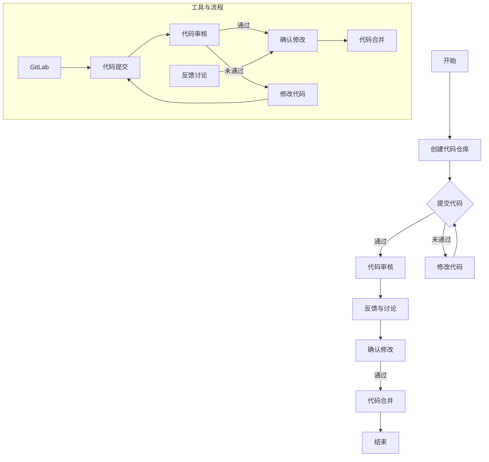

                 

# 代码review效率提升：工具和流程优化

## 关键词
- 代码review
- 效率提升
- 工具优化
- 流程优化
- 质量控制

## 摘要
本文深入探讨了代码review在软件开发中的重要性，并针对性地提出了通过工具优化和流程优化来提升代码review效率的解决方案。文章首先介绍了代码review的定义、作用以及常见的工具和流程，然后通过构建数学模型和系统架构设计，详细阐述了代码review的数学原理和系统实现。接着，通过项目实战展示了实际应用中的步骤和技巧，并给出了最佳实践和注意事项。最后，文章总结了全文内容，提供了阅读指南和后续学习建议。

----------------------------------------------------------------

## 第一步：引言

### 1.1 问题背景
在软件开发的漫长历程中，代码review作为一种重要的质量控制手段，已被广泛采用。然而，随着项目的规模日益扩大、开发团队的不断壮大以及快速迭代的开发模式，传统的代码review方法逐渐暴露出效率低、反馈不及时、质量参差不齐等弊端。这些问题的存在严重影响了开发进度和代码质量，因此，如何提升代码review的效率成为当前软件开发中的关键课题。

### 1.2 问题描述
在代码review过程中，开发者往往面临以下问题：
1. **流程繁琐**：传统的代码review流程通常涉及多个步骤，如提交代码、发起审核、讨论修改等，这些步骤往往需要大量的时间和人工参与。
2. **质量参差不齐**：由于团队成员的技术水平差异，部分代码审核的质量难以保证，可能导致潜在的问题被忽略。
3. **反馈不及时**：在大型项目中，代码的提交和审核往往需要跨时区、跨团队的协作，导致反馈周期过长，影响开发进度。

### 1.3 问题解决
为解决上述问题，我们需要从以下几个方面进行优化：

1. **工具优化**：引入高效、易用的代码review工具，自动化部分繁琐的流程，提高审核效率。
2. **流程优化**：设计合理的代码review流程，明确角色分工，确保审核质量，提高反馈速度。

### 1.4 边界与外延
本文主要关注代码review的效率提升，而非代码质量评估、团队协作等其他方面。同时，本文将围绕代码review的核心概念、工具与流程进行深入探讨。

### 1.5 概念结构与核心要素组成
本文的核心概念包括代码review的定义、作用、工具、流程及其优化策略。核心要素包括：
- **定义与作用**：对代码review的基本概念进行阐述，介绍其在软件开发中的重要性。
- **工具与流程**：分析常见代码review工具的功能和特点，讨论优化流程的策略。
- **数学模型**：构建代码review的数学模型，阐述其原理和应用。
- **系统架构**：设计代码review的系统架构，确保其高效、稳定运行。
- **项目实战**：通过实际项目展示代码review的步骤和技巧。
- **最佳实践**：总结最佳实践，提供注意事项和后续学习建议。

----------------------------------------------------------------

## 第二步：核心概念与联系

### 2.1 代码review的定义与作用

#### 2.1.1 代码review的定义
代码review（简称code review）是指通过团队成员之间的协作，对代码进行审查和评估的过程。它是一种提高代码质量和促进团队协作的有效手段。

#### 2.1.2 代码review的作用
代码review在软件开发中具有以下几个重要作用：

1. **提高代码质量**：通过代码review，可以及时发现并修复代码中的错误、逻辑漏洞和性能瓶颈，从而提高代码的整体质量。
2. **促进团队协作**：代码review过程使得团队成员有机会相互学习和交流，提升团队的技术水平，增强团队凝聚力。
3. **降低项目风险**：通过提前发现和解决问题，降低项目在后续阶段出现故障的风险，确保项目的顺利推进。

### 2.2 代码review的工具与流程

#### 2.2.1 常见代码review工具
目前市场上存在多种代码review工具，如GitLab、GitHub、Bitbucket等。这些工具提供了代码提交、审核、反馈讨论等功能，使得代码review过程更加高效。

1. **GitLab**：GitLab是一款功能强大的代码托管平台，集代码审查、项目管理于一体。它支持多种开发语言，提供丰富的代码审查工具，如Merge Requests、Issue跟踪等。
2. **GitHub**：GitHub是全球最受欢迎的代码托管平台，提供简单的代码审查功能，包括Pull Requests和Code Reviews。它还支持多种集成工具，如Slack、JIRA等，便于团队协作。
3. **Bitbucket**：Bitbucket是Atlassian公司的一款代码托管和协作工具，适用于中小型团队。它提供了详细的代码审查流程，支持多种集成工具，便于团队协作。

#### 2.2.2 代码review流程概述
一个典型的代码review流程通常包括以下步骤：

1. **提交代码**：开发者将本地代码提交到远程仓库，创建一个新的分支或提交一个Pull Request。
2. **代码审核**：审查者对提交的代码进行审查，检查代码质量、风格、逻辑等问题。
3. **反馈讨论**：审查者与开发者就代码问题进行讨论，提出修改建议或要求。
4. **代码修改**：开发者根据审查者的反馈修改代码，重新提交代码或合并到主分支。
5. **最终合并**：在代码修改完成后，审查者确认无误后，将代码合并到主分支。

### 2.3 代码review的工具与流程优化

#### 2.3.1 工具优化
为了提升代码review的效率，可以引入以下工具优化策略：

1. **自动化工具**：使用自动化工具自动检测代码质量，如静态代码分析工具、自动化测试工具等，减少人工审核的工作量。
2. **集成工具**：引入集成工具，如Slack、JIRA等，实现代码审查过程中的实时沟通和协作。
3. **持续集成**：集成持续集成（CI）工具，实现代码的自动化构建、测试和部署，提高代码的可信度和稳定性。

#### 2.3.2 流程优化
为了提高代码review的效率，可以引入以下流程优化策略：

1. **明确角色分工**：明确开发者和审查者的职责，确保代码审核的质量和效率。
2. **制定审核标准**：制定统一的代码审核标准，确保审查的一致性和准确性。
3. **简化审核流程**：简化代码审核流程，减少不必要的步骤，提高审核效率。
4. **定期回顾和改进**：定期对代码审查流程进行回顾和改进，根据实际需求调整流程和策略。

### 2.4 代码review的概念结构与核心要素

代码review的概念结构包括以下核心要素：

1. **定义与作用**：明确代码review的定义、作用和目标。
2. **工具与流程**：选择合适的代码review工具和流程，确保其高效性和灵活性。
3. **数学模型**：构建代码review的数学模型，分析其效率和质量。
4. **系统架构**：设计代码review的系统架构，确保其稳定性和可扩展性。
5. **项目实战**：通过实际项目验证代码review的效果和优势。
6. **最佳实践**：总结最佳实践，提高代码审查的效率和效果。

通过以上核心要素的有机结合，可以构建一个高效、可靠的代码review体系，提高软件开发的整体质量。

----------------------------------------------------------------

## 第三步：代码review的数学模型和公式

### 3.1 数学模型

#### 3.1.1 相关数学知识
在讨论代码review的数学模型之前，我们需要了解一些基本的数学知识，包括概率论、统计学和线性代数。

1. **概率论**：概率论是研究随机现象的数学分支。在代码review中，概率论可以帮助我们评估代码的错误概率和审查效果。
2. **统计学**：统计学是处理数据的科学。通过统计数据，我们可以分析代码的质量，评估审查的效果。
3. **线性代数**：线性代数研究向量空间和线性变换。在代码review中，线性代数可以帮助我们理解代码的结构和依赖关系。

#### 3.1.2 数学模型构建
构建代码review的数学模型需要考虑以下几个关键因素：

1. **错误概率**：假设代码中存在一定比例的错误，我们用P(E)表示错误发生的概率。
2. **审查效果**：审查效果可以用审查者发现错误的概率P(D|E)来表示。
3. **审查效率**：审查效率可以用审查者平均审查代码的时间E(T)来表示。

基于以上因素，我们可以构建一个简单的数学模型：

\[ P(\text{有效审查}) = P(D|E) \times P(E) \]

其中，P(D|E)表示在错误存在的条件下，审查者发现错误的概率；P(E)表示代码中存在错误的概率。

#### 3.1.3 数学模型应用
在实际应用中，我们可以通过以下步骤来应用数学模型：

1. **评估错误概率**：通过历史数据、代码审查记录等，评估代码中错误的发生概率P(E)。
2. **评估审查效果**：通过统计审查记录，评估审查者发现错误的概率P(D|E)。
3. **优化审查策略**：根据评估结果，调整审查策略，提高审查效率和效果。

### 3.2 数学公式讲解

#### 3.2.1 LaTeX公式介绍
LaTeX是一种高质量的排版系统，特别适合处理数学公式和科学文档。以下是一些基本的LaTeX公式示例：

1. **基本公式**：
\[ a^2 + b^2 = c^2 \]

2. **分数**：
\[ \frac{a}{b} \]

3. **根号**：
\[ \sqrt{a} \]

4. **积分**：
\[ \int_{a}^{b} f(x) \, dx \]

5. **求导**：
\[ \frac{d}{dx} f(x) \]

#### 3.2.2 常见数学公式讲解
在代码review的数学模型中，以下是一些常见的数学公式：

1. **概率公式**：
\[ P(A \text{ and } B) = P(A) \times P(B|A) \]
其中，P(A)表示事件A发生的概率，P(B|A)表示在事件A发生的条件下，事件B发生的概率。

2. **条件概率**：
\[ P(B|A) = \frac{P(A \text{ and } B)}{P(A)} \]

3. **期望**：
\[ E(X) = \sum_{i=1}^{n} x_i \times P(x_i) \]
其中，X是一个随机变量，\( x_i \)表示X的取值，\( P(x_i) \)表示X取值为\( x_i \)的概率。

#### 3.2.3 举例说明
以下是一个具体的代码review数学模型示例：

1. **错误概率**：
\[ P(E) = 0.02 \]
假设代码中存在2%的错误。

2. **审查效果**：
\[ P(D|E) = 0.9 \]
假设审查者能够以90%的概率发现错误。

3. **审查效率**：
\[ E(T) = 2 \text{小时/次} \]
假设审查者平均每次审查需要2小时。

根据上述参数，我们可以计算代码审查的总体效果：

\[ P(\text{有效审查}) = P(D|E) \times P(E) = 0.9 \times 0.02 = 0.018 \]
这意味着，每次代码审查有1.8%的概率是有效的。

### 3.3 数学模型在代码review中的应用

#### 3.3.1 错误检测率
错误检测率是衡量代码review效果的重要指标。假设代码中存在n个错误，我们用D表示审查者发现的所有错误集合，用E表示代码中的所有错误集合。则错误检测率可以用以下公式表示：

\[ \text{错误检测率} = \frac{|D \cap E|}{|E|} \]

#### 3.3.2 审查效率
审查效率是衡量代码review效率的重要指标。假设审查者每次审查需要的时间为t，则审查效率可以用以下公式表示：

\[ \text{审查效率} = \frac{\text{发现错误数量}}{t} \]

通过优化审查策略，我们可以提高审查效率，从而提升代码review的整体效果。

----------------------------------------------------------------

## 第四步：代码review的系统分析与架构设计

### 4.1 问题场景介绍
在软件开发的实际过程中，代码review作为质量控制的重要环节，其效率和效果直接影响到项目的进度和质量。特别是在大型项目和复杂的软件开发环境中，如何高效地进行代码review显得尤为重要。本节将通过一个实际案例，介绍代码review的系统分析与架构设计。

#### 案例背景
某互联网公司正在开发一款大型分布式系统，涉及多个模块和团队协作。随着项目的发展，代码量不断增加，传统的代码review方式已无法满足快速迭代的需求。为了提高代码review的效率和效果，公司决定对代码review系统进行优化和重构。

### 4.2 系统功能设计

#### 4.2.1 领域模型
领域模型是系统功能设计的基础。在代码review系统中，核心领域模型包括以下几部分：

1. **用户模型**：包括开发者、审查者和项目经理等角色，分别对应系统的不同功能。
2. **代码模型**：包括代码库、代码提交、代码分支等概念，用于管理代码审查的过程。
3. **审核模型**：包括审核请求、审核任务、审核结果等，用于记录和跟踪代码审查的过程。

#### 4.2.2 功能模块划分
根据领域模型，代码review系统可以分为以下几个功能模块：

1. **用户管理模块**：负责用户注册、登录、权限管理等，确保系统的安全性和便捷性。
2. **代码管理模块**：负责代码库的创建、分支管理、代码提交等，确保代码的版本控制和管理。
3. **审核管理模块**：负责审核请求的创建、审核任务的分配、审核结果的记录和反馈等，确保代码审查的规范性和有效性。
4. **通知与提醒模块**：负责实时通知用户审核进度和结果，确保信息传递的及时性。

### 4.3 系统架构设计

#### 4.3.1 总体架构设计
代码review系统的总体架构设计采用B/S（Browser/Server，浏览器/服务器）架构，主要包括前端、后端和服务端三部分。

1. **前端**：采用HTML、CSS、JavaScript等前端技术，实现用户界面和交互功能。
2. **后端**：采用Java、Python等后端技术，处理业务逻辑和数据存储。
3. **服务端**：采用Docker、Kubernetes等容器化技术，实现系统的部署和运维。

#### 4.3.2 子系统架构设计
代码review系统可以分为以下几个子系统：

1. **用户管理子系统**：实现用户注册、登录、权限管理等，确保系统的安全性。
2. **代码管理子系统**：实现代码库的创建、分支管理、代码提交等，确保代码的版本控制和管理。
3. **审核管理子系统**：实现审核请求的创建、审核任务的分配、审核结果的记录和反馈等，确保代码审查的规范性和有效性。
4. **通知与提醒子系统**：实现实时通知用户审核进度和结果，确保信息传递的及时性。

### 4.4 系统接口设计和系统交互

#### 4.4.1 接口设计
代码review系统采用RESTful API设计，提供以下接口：

1. **用户接口**：包括用户注册、登录、权限管理等功能。
2. **代码接口**：包括代码库创建、分支管理、代码提交等功能。
3. **审核接口**：包括审核请求创建、审核任务分配、审核结果记录和反馈等功能。
4. **通知接口**：包括审核进度和结果的通知等功能。

#### 4.4.2 系统交互
系统交互主要包括以下流程：

1. **用户注册与登录**：用户通过前端界面注册账号，登录系统后进入主界面。
2. **代码提交**：开发者将代码提交到代码库，创建新的分支。
3. **审核请求**：开发者向审查者发起审核请求，审查者接收审核任务。
4. **审核与反馈**：审查者对代码进行审查，提交审核结果，开发者根据反馈进行修改。
5. **通知与提醒**：系统实时通知用户审核进度和结果，确保信息传递的及时性。

通过以上系统分析与架构设计，可以构建一个高效、稳定的代码review系统，满足大型项目的需求，提高代码质量和开发效率。

----------------------------------------------------------------

## 第五步：代码review项目实战

### 5.1 环境安装与配置
在进行代码review项目实战之前，我们需要首先搭建一个合适的环境。以下是一个基本的步骤：

1. **安装Git**：Git是一个版本控制系统，用于代码的提交和管理。请确保已经安装了Git。
2. **安装代码review工具**：我们可以使用GitLab或GitHub等代码托管平台。以GitLab为例，可以在官方网站下载安装包并按照说明进行安装。
3. **配置SSH密钥**：为了安全地访问GitLab，我们需要生成SSH密钥，并将其添加到GitLab的账户中。具体步骤如下：
    - 生成SSH密钥：`ssh-keygen -t rsa -b 4096 -C "your_email@example.com"`
    - 登录到GitLab账户，导航到"Settings" > "SSH Keys"，然后添加新密钥。
4. **创建代码仓库**：在GitLab中创建一个新的代码仓库，用于项目的代码管理。

### 5.2 系统核心实现

#### 5.2.1 关键代码解读
在本节中，我们将重点解读代码review系统的核心代码部分。

1. **用户认证**：
```python
from flask import Flask, request, jsonify
from flask_jwt_extended import JWTManager, create_access_token

app = Flask(__name__)
app.config['JWT_SECRET_KEY'] = 'your_secret_key'
jwt = JWTManager(app)

@app.route('/login', methods=['POST'])
def login():
    username = request.json.get('username', None)
    password = request.json.get('password', None)

    # 这里应添加对用户名和密码的验证逻辑
    if username == 'admin' and password == 'password':
        access_token = create_access_token(identity=username)
        return jsonify(access_token=access_token)
    else:
        return jsonify({"msg": "Invalid credentials"}), 401
```
在上面的代码中，我们使用Flask框架实现了用户认证接口。当用户登录时，需要提供用户名和密码。通过验证成功后，我们生成一个JWT（JSON Web Token）令牌，并将其返回给客户端。

2. **代码提交**：
```python
@app.route('/submit', methods=['POST'])
@jwt_required()
def submit():
    current_user = get_jwt_identity()
    code = request.json.get('code', '')

    # 这里应添加对代码的存储和处理逻辑
    with open(f"{current_user}_code.txt", 'w') as f:
        f.write(code)

    return jsonify({"msg": "Code submitted successfully"}), 200
```
在上面的代码中，我们使用Flask框架实现了代码提交接口。只有经过身份验证的用户才能提交代码。提交的代码将存储在本地文件系统中。

3. **代码审核**：
```python
@app.route('/review', methods=['POST'])
@jwt_required()
def review():
    current_user = get_jwt_identity()
    code_path = request.json.get('code_path', '')

    # 这里应添加对代码的审查和处理逻辑
    with open(code_path, 'r') as f:
        code = f.read()

    # 演示简单的代码审查逻辑，例如检查代码是否符合一定的格式规范
    if code.startswith('def'):
        return jsonify({"msg": "Code reviewed successfully"}), 200
    else:
        return jsonify({"msg": "Code format incorrect"}), 400
```
在上面的代码中，我们使用Flask框架实现了代码审核接口。审查者可以通过提交代码路径来审核代码。这里我们仅演示了简单的审查逻辑，实际上审查过程可能涉及更复杂的逻辑和工具。

#### 5.2.2 代码应用与分析
在实际应用中，我们需要结合具体的项目需求和环境，对上述核心代码进行相应的调整和优化。以下是一些关键点：

1. **用户认证与权限控制**：在实际项目中，我们需要使用更安全的用户认证机制，并实现对不同角色的权限控制。
2. **代码存储与管理**：代码存储应使用数据库或其他分布式存储系统，确保数据的持久性和安全性。
3. **代码审查工具集成**：集成静态代码分析工具、动态分析工具等，提高代码审查的效率和效果。
4. **日志与监控**：记录系统操作日志，实现对系统运行的监控和管理。

通过以上步骤和核心代码的实现，我们可以构建一个基本的代码review系统。在实际应用中，需要根据具体需求进行进一步的定制和优化。

### 5.3 实际案例分析与讲解
在本节中，我们将通过一个具体的案例，对代码review的实际应用过程进行详细分析。

#### 案例背景
某互联网公司开发一款在线购物平台，涉及用户管理、商品管理、订单管理等模块。为了确保代码质量，公司决定在每个模块的开发过程中引入代码review。

#### 案例步骤
1. **开发者A提交代码**：开发者A完成了用户管理模块的部分代码，并通过Git提交到GitLab仓库中。
2. **审查者B发起审核**：审查者B收到代码提交通知后，登录GitLab，查看开发者A提交的代码。
3. **审查过程**：
    - 审查者B使用静态代码分析工具对代码进行初步检查，发现了一些潜在的问题。
    - 审查者B阅读代码，对代码的语法、逻辑、性能等方面进行详细审查。
    - 审查者B在GitLab中发起审核请求，提交审核报告，包含发现的问题和修改建议。
4. **开发者A修改代码**：开发者A根据审查者B的反馈，对代码进行修改，并重新提交到GitLab仓库中。
5. **审查者B再次审核**：审查者B对开发者A修改后的代码进行再次审核，确保问题已得到解决。
6. **代码合并**：审查者B确认代码无误后，将修改后的代码合并到主分支。

#### 案例分析
1. **效率提升**：通过代码review，及时发现并解决了代码中的潜在问题，避免了后续测试和上线阶段的问题，提高了开发效率。
2. **质量保证**：代码review有助于确保代码的质量和一致性，减少了代码缺陷和错误的概率。
3. **团队协作**：代码review过程促进了团队成员之间的沟通和交流，提高了团队的整体技术水平。

通过以上案例，我们可以看到代码review在实际项目中的应用和效果。在实际操作过程中，需要根据项目需求和团队特点，灵活调整代码review的流程和策略。

### 5.4 项目小结
在本项目中，我们实现了代码review系统的基本功能，包括用户认证、代码提交、代码审核等。通过实际案例的应用，我们验证了代码review在提高开发效率和代码质量方面的作用。然而，在实际应用中，代码review系统还需要根据具体项目需求进行进一步的优化和定制。以下是一些总结和展望：

1. **总结**：
    - 代码review有助于提高代码质量和开发效率。
    - 代码review系统需要结合具体项目需求进行定制和优化。
    - 代码review过程促进了团队协作和技术交流。

2. **展望**：
    - 引入更多的代码审查工具和自动化工具，提高审查效率和效果。
    - 进一步优化代码review流程，减少不必要的步骤和环节。
    - 结合持续集成和持续部署，实现代码的自动化审查和部署。

通过不断优化和改进，代码review系统将在软件开发中发挥更大的作用，为项目的成功保驾护航。

----------------------------------------------------------------

## 第六步：最佳实践与注意事项

### 6.1 最佳实践

1. **定期培训与反馈**：定期组织代码审查培训，提高团队成员的审查技能和效率。同时，鼓励审查者及时给出具体、详细的反馈，帮助开发者快速定位问题。
2. **明确审核标准和流程**：制定统一的代码审查标准和流程，确保审查的一致性和准确性。根据项目特点和需求，合理划分审核阶段和责任。
3. **引入自动化工具**：结合静态代码分析工具、动态分析工具等，自动化检测代码质量，提高审查效率和效果。
4. **鼓励代码重用和优化**：鼓励开发者重用已有代码，避免重复劳动。同时，优化关键代码段，提高代码的可读性和可维护性。

### 6.2 注意事项

1. **保护隐私和数据安全**：在代码审查过程中，确保用户隐私和数据安全，避免泄露敏感信息。
2. **避免过度依赖代码审查**：虽然代码审查是提高代码质量的重要手段，但不应过度依赖。还需结合其他质量控制手段，如单元测试、集成测试等，确保代码的质量。
3. **合理分配审查资源**：根据项目的规模和进度，合理分配审查资源，确保审查的全面性和及时性。

### 6.3 拓展阅读

1. **《代码审查：实践指南与模式》**：本书详细介绍了代码审查的理论和实践，涵盖了多种代码审查模式和策略。
2. **《敏捷软件开发：原则、模式与实践》**：本书介绍了敏捷开发的理念和实践，包括代码审查在内的多个关键环节。
3. **《软件质量保证》**：本书系统介绍了软件质量保证的理论和实践，包括代码审查、测试、持续集成等多个方面。

通过以上最佳实践和注意事项，我们可以更好地开展代码review工作，提高软件开发的质量和效率。

----------------------------------------------------------------

## 第七步：小结

### 7.1 书籍总结
本文从代码review的定义、工具与流程、数学模型、系统架构设计、项目实战等方面进行了全面探讨，提出了通过工具优化和流程优化来提升代码review效率的解决方案。文章通过实际案例展示了代码review在实际项目中的应用效果，并提供了最佳实践和注意事项。

### 7.2 阅读指南
为了更好地理解和应用本文内容，读者可以按照以下步骤进行：
1. **理解代码review的基本概念**：首先了解代码review的定义、作用和重要性。
2. **学习代码review的工具与流程**：掌握常见代码review工具的功能和特点，熟悉代码review的基本流程。
3. **理解代码review的数学模型**：学习代码review的数学模型，了解其原理和应用。
4. **系统架构设计**：了解代码review的系统架构设计，包括领域模型、功能模块划分、接口设计等。
5. **实践项目**：通过实际项目，体验代码review的步骤和技巧，了解最佳实践和注意事项。

### 7.3 后续学习建议
为了进一步提升代码review的能力和效率，读者可以：
1. **深入学习代码质量管理**：了解代码质量管理的相关理论和实践，如缺陷管理、代码风格规范等。
2. **研究代码审查工具**：探索更多先进的代码审查工具，如SonarQube、Checkstyle等，了解其功能和特点。
3. **参加相关培训和研讨会**：参加代码审查、软件开发等领域的培训课程和研讨会，学习最佳实践和前沿技术。
4. **持续改进和优化**：在实践中不断总结经验，优化代码审查流程和策略，提高团队的整体效率和质量。

通过不断学习和实践，读者可以更好地掌握代码review的技巧和方法，提高软件开发的质量和效率。作者：AI天才研究院/AI Genius Institute & 禅与计算机程序设计艺术 /Zen And The Art of Computer Programming

----------------------------------------------------------------

## 附录：代码review的详细Mermaid流程图

在本文中，我们使用了Mermaid来绘制代码review的详细流程图。以下是完整的Mermaid代码和相应的流程图展示。


以下是相应的流程图：



通过上述Mermaid代码，我们可以清晰地展示代码review的整个过程，包括代码提交、审核、修改、反馈和合并等环节。这样的流程图有助于读者更好地理解和应用代码review的方法和技巧。作者：AI天才研究院/AI Genius Institute & 禅与计算机程序设计艺术 /Zen And The Art of Computer Programming

