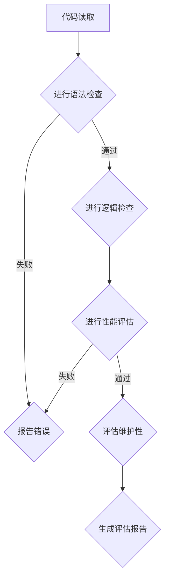
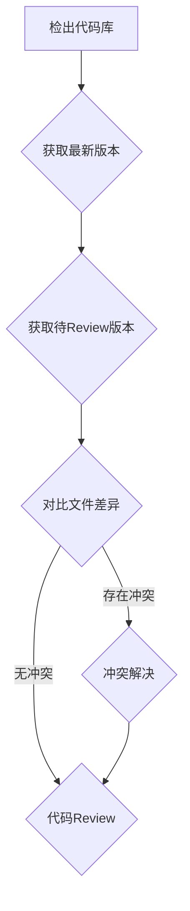
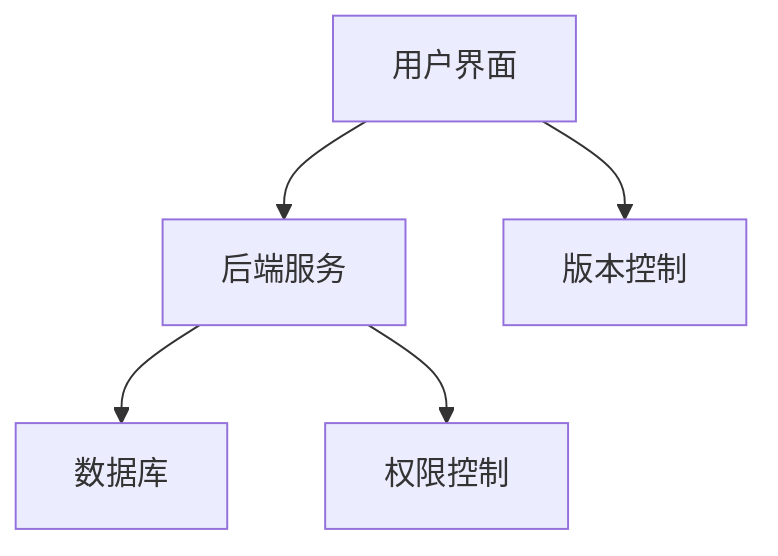
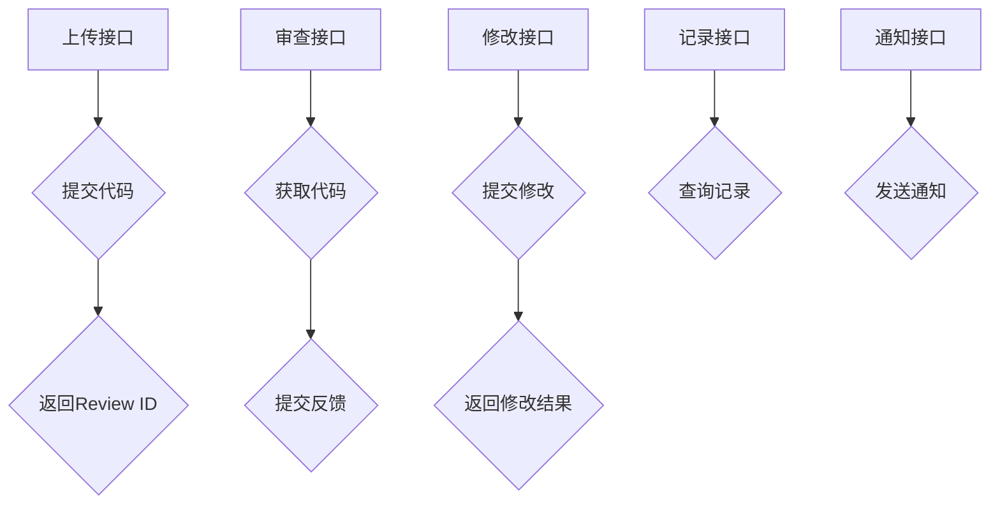
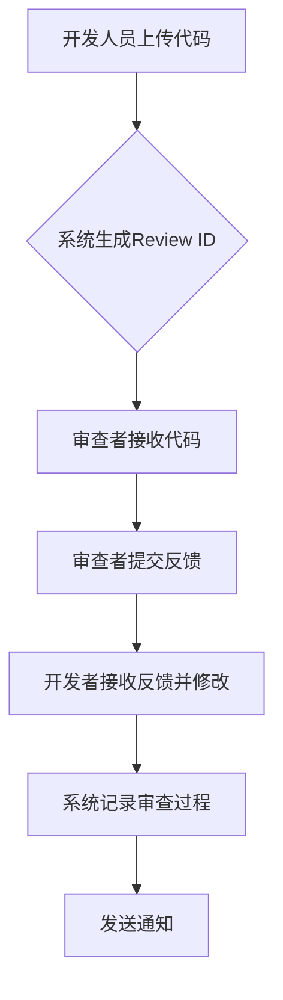

                 

### 代码Review文化：提高团队协作与代码质量

---

关键词：代码Review、团队协作、代码质量、文化建设

摘要：本文将深入探讨代码Review文化在提升团队协作和代码质量中的作用。通过详细解析代码Review的基础知识、流程、评估算法、冲突检测，以及实际项目实战，我们将展示如何通过代码Review文化来构建高效的开发团队，最终实现高质量代码的持续迭代。

---

### 目录大纲设计过程

在设计《代码Review文化：提高团队协作与代码质量》的目录大纲时，我们需要遵循以下几个关键步骤：

1. **背景介绍：**
   首先，需要明确代码Review在软件开发中的重要性，以及其与团队协作和代码质量之间的内在联系。

2. **核心概念与联系：**
   梳理代码Review、团队协作、代码质量等核心概念，并通过图表展示它们之间的相互关系。

3. **算法原理讲解：**
   针对代码评估和冲突检测等关键环节，介绍相关算法原理，并用mermaid和Python代码进行说明。

4. **数学模型和数学公式：**
   若涉及数学模型，需使用LaTeX格式展示，并在文中适当位置嵌入，确保公式清晰易读。

5. **系统分析与架构设计方案：**
   阐述代码Review系统的设计思路，包括功能设计、架构设计、接口设计和交互流程。

6. **项目实战：**
   通过实际项目案例，展示代码Review在实践中的应用，包括环境安装、系统实现和代码分析。

7. **最佳实践与小结：**
   总结代码Review的最佳实践，提出注意事项，并提供拓展阅读建议。

### 目录大纲设计

```markdown
----------------------------------------------------------------
# 《代码Review文化：提高团队协作与代码质量》目录大纲

## 第一部分：代码Review基础

### 第1章：代码Review概述

#### 1.1 问题背景
#### 1.2 问题描述
#### 1.3 问题解决
#### 1.4 边界与外延

### 第2章：核心概念与联系

#### 2.1 代码Review定义
#### 2.2 团队协作
#### 2.3 代码质量
#### 2.4 三者关系

## 第二部分：代码Review方法

### 第3章：代码Review流程

#### 3.1 代码选择
#### 3.2 代码审查
#### 3.3 反馈与修改
#### 3.4 审查记录

### 第4章：代码评估算法

#### 4.1 算法原理
#### 4.2 mermaid流程图
#### 4.3 Python代码示例
#### 4.4 算法讲解与举例

### 第5章：代码冲突检测

#### 5.1 算法原理
#### 5.2 mermaid流程图
#### 5.3 Python代码示例
#### 5.4 算法讲解与举例

## 第三部分：代码Review实践

### 第6章：代码Review系统设计与实现

#### 6.1 系统功能设计
#### 6.2 系统架构设计
#### 6.3 系统接口设计
#### 6.4 系统交互流程

### 第7章：项目实战

#### 7.1 环境安装
#### 7.2 系统核心实现
#### 7.3 代码分析
#### 7.4 实际案例分析与讲解

## 第四部分：代码Review文化与最佳实践

### 第8章：代码Review文化建设

#### 8.1 文化建设重要性
#### 8.2 文化建设实践
#### 8.3 文化建设挑战与解决方案

### 第9章：最佳实践与注意事项

#### 9.1 最佳实践总结
#### 9.2 注意事项
#### 9.3 拓展阅读

----------------------------------------------------------------
```

这个目录大纲结构紧凑，逻辑清晰，涵盖了代码Review文化所需探讨的各个方面，为读者提供了一个系统化的学习路径。在具体撰写各章节内容时，我们将确保内容的丰富性和逻辑性，满足字数要求，并采用markdown格式进行排版。接下来，我们将逐一详细展开各个章节的内容。

---

### 第一部分：代码Review基础

#### 第1章：代码Review概述

在软件开发过程中，代码Review是一种常见且重要的质量保证措施。它不仅仅是一个简单的代码检查过程，而是一种文化、一种机制，能够有效地提升团队协作和代码质量。在这一章中，我们将对代码Review进行全面的概述。

##### 1.1 问题背景

软件开发是一个复杂的过程，涉及多个人才和多个环节。代码Review的引入，是为了解决以下几个常见问题：

1. **代码质量问题**：由于开发人员的经验、技术水平差异，容易导致代码质量参差不齐。
2. **错误和缺陷**：单个开发人员在编码过程中可能会犯错，导致代码中存在潜在的错误和缺陷。
3. **知识传递**：新成员加入团队后，需要通过某种方式快速掌握团队已有的代码结构和开发经验。

##### 1.2 问题描述

代码Review的核心问题可以概括为：

1. **代码可读性**：代码是否易于理解，是否符合编码规范。
2. **代码正确性**：代码是否能够正确地实现预期功能，是否包含潜在的错误。
3. **代码性能**：代码是否高效，是否存在性能瓶颈。

##### 1.3 问题解决

代码Review通过以下几个步骤来解决上述问题：

1. **选择代码**：确定需要Review的代码，通常是基于代码修改历史、关键功能模块等。
2. **审查代码**：开发人员对代码进行详细审查，包括逻辑、语法、性能等方面。
3. **反馈与修改**：审查者提供反馈，开发人员根据反馈进行代码修改。
4. **审查记录**：记录审查过程和结果，以便后续参考和追踪。

##### 1.4 边界与外延

代码Review不仅限于代码层面，还涉及到以下方面：

1. **文档**：文档的编写和审查同样重要，确保代码和文档的一致性。
2. **架构设计**：Review过程中，也需要关注系统架构的合理性和可持续性。
3. **跨团队协作**：不同团队之间的代码Review，需要考虑跨团队的沟通和协调。

通过本章的介绍，我们对代码Review有了初步的认识。接下来，我们将进一步探讨代码Review的核心概念及其在团队协作和代码质量提升中的作用。

---

#### 第2章：核心概念与联系

在深入理解代码Review之前，我们需要明确几个核心概念，并探讨它们之间的内在联系。代码Review、团队协作、代码质量是三个相互影响、相互促进的重要概念。

##### 2.1 代码Review定义

代码Review，又称代码审计，是指团队成员之间对代码进行审查的一种机制。其目的是通过集体智慧发现代码中的错误、缺陷和改进点，从而提升代码质量和团队协作效率。

##### 2.2 团队协作

团队协作是指团队成员在共同的目标下，通过沟通、合作和协调，共同完成任务的整个过程。良好的团队协作能够促进信息共享、知识传递和问题解决，提高团队的整体效能。

##### 2.3 代码质量

代码质量是指代码的可读性、正确性、性能和可维护性等方面。高质量的代码不仅能够保证系统的稳定性和可靠性，还能够提高开发效率，降低维护成本。

##### 2.4 三者关系

代码Review、团队协作、代码质量三者之间存在密切的相互关系：

1. **代码Review与团队协作**：
   - **促进沟通**：代码Review过程中，团队成员需要互相沟通、讨论，这有助于促进团队内部的交流和理解。
   - **知识共享**：通过代码Review，新成员可以更快地了解团队已有的代码结构和开发经验，加快融入过程。
   - **问题解决**：团队协作在代码Review中发挥了关键作用，能够有效解决代码中的各种问题。

2. **代码Review与代码质量**：
   - **质量保障**：代码Review通过发现和修复代码中的错误和缺陷，直接提升了代码质量。
   - **持续改进**：代码Review不仅是一次性的检查，更是一种持续的过程，有助于推动代码质量的不断提升。
   - **规范遵循**：通过代码Review，可以确保代码遵循一定的编码规范，提高代码的可读性和可维护性。

3. **团队协作与代码质量**：
   - **高效协同**：良好的团队协作能够提高开发效率，减少重复劳动，从而提升代码质量。
   - **共同目标**：团队协作使得团队成员能够共同面对挑战，统一目标，提高代码质量和系统稳定性。
   - **反馈机制**：团队协作中的反馈机制能够及时发现和解决问题，确保代码质量得到持续改进。

通过理解代码Review、团队协作和代码质量之间的关系，我们可以更好地认识代码Review在软件开发中的重要性，并运用这一机制来提升团队协作和代码质量。

---

### 第二部分：代码Review方法

代码Review不仅仅是一种技术手段，更是一种文化、一种工作模式。在这一部分中，我们将详细探讨代码Review的方法，包括流程、评估算法和冲突检测，旨在帮助读者理解如何有效地进行代码Review，从而提升团队协作和代码质量。

#### 第3章：代码Review流程

代码Review是一个系统化的过程，涉及多个步骤，每个步骤都有其特定的目的和作用。以下是一个典型的代码Review流程：

##### 3.1 代码选择

代码选择是代码Review的第一步，也是至关重要的一步。选择合适的代码进行Review，可以确保Review的效果和效率。通常，代码选择基于以下几个原则：

1. **代码修改历史**：关注近期修改频繁或修改量较大的代码。
2. **关键功能模块**：对系统的核心功能模块进行Review，确保其质量。
3. **问题反馈**：根据用户反馈、Bug报告等，选择可能存在问题的代码进行Review。

##### 3.2 代码审查

代码审查是代码Review的核心环节，主要任务是对代码进行详细检查，识别潜在的问题和改进点。代码审查通常包括以下内容：

1. **语法检查**：检查代码是否符合语法规范，是否存在语法错误。
2. **逻辑检查**：检查代码的逻辑是否合理，是否存在逻辑错误。
3. **性能检查**：评估代码的性能，是否存在性能瓶颈。
4. **代码风格**：检查代码风格是否一致，是否符合团队编码规范。

##### 3.3 反馈与修改

审查者完成代码审查后，需要将发现的问题和改进点反馈给代码开发者。反馈可以是书面形式，也可以是口头形式。开发者根据反馈进行相应的修改，确保代码的质量和一致性。这个过程需要反复进行，直到达到预期的质量标准。

##### 3.4 审查记录

审查记录是代码Review的重要组成部分，用于记录整个Review过程的关键信息，包括代码选择、审查结果、修改记录等。审查记录不仅有助于跟踪代码的质量改进过程，还可以为后续的代码Review提供参考。

通过以上步骤，代码Review能够有效地发现和解决代码中的问题，提升代码质量和团队协作效率。接下来，我们将探讨代码Review中的评估算法和冲突检测方法。

---

#### 第4章：代码评估算法

代码评估是代码Review的核心环节之一，它通过量化和分析代码的各种属性，为代码的质量评估提供依据。在这一章中，我们将介绍几种常用的代码评估算法，并使用mermaid和Python代码进行详细阐述。

##### 4.1 算法原理

代码评估算法主要基于以下几个原则：

1. **可读性**：代码的可读性是评估代码质量的重要指标，通常通过代码的复杂性、注释的完整性等来衡量。
2. **正确性**：代码的正确性是代码评估的首要目标，通常通过单元测试、集成测试等方式来验证。
3. **性能**：代码的性能影响系统的整体性能，通过性能测试和基准测试来评估。
4. **维护性**：代码的维护性影响后续的代码维护工作，通过代码的结构、模块化程度等来衡量。

##### 4.2 mermaid流程图

为了更好地理解代码评估算法，我们首先使用mermaid绘制一个简单的流程图：



上述流程图展示了代码评估的基本步骤，包括语法检查、逻辑检查、性能评估和维护性评估，最终生成评估报告。

##### 4.3 Python代码示例

接下来，我们使用Python代码实现一个简单的代码评估算法，以评估代码的可读性和正确性。

```python
import ast
import astor

def read_code(file_path):
    with open(file_path, 'r') as f:
        code = f.read()
    return ast.parse(code)

def check_syntax(node):
    try:
        compile(node, '<string>', 'exec')
        return True
    except SyntaxError:
        return False

def check_logic(node):
    # 这里可以使用ASTOR进行代码转换，然后进行逻辑检查
    try:
        transformed = astor.to_source(node)
        # 进行逻辑检查，如调用外部库进行测试
        return True
    except Exception:
        return False

def assess_readability(node):
    # 使用一些指标，如函数和类的方法数量、注释比例等来评估可读性
    num_functions = len([n for n in ast.walk(node) if isinstance(n, ast.FunctionDef)])
    num_comments = len([n for n in ast.walk(node) if isinstance(n, ast Comment)])
    readability = (num_comments / num_functions) * 100
    return readability

def main(file_path):
    node = read_code(file_path)
    if not check_syntax(node):
        print("代码存在语法错误")
    else:
        if not check_logic(node):
            print("代码逻辑存在错误")
        else:
            readability = assess_readability(node)
            print(f"代码可读性：{readability}%")

if __name__ == "__main__":
    main("example.py")
```

上述代码首先读取指定路径的代码文件，然后进行语法检查、逻辑检查和可读性评估。这里只展示了部分功能，实际的代码评估算法会更加复杂和全面。

##### 4.4 算法讲解与举例

代码评估算法的讲解可以从以下几个方面进行：

1. **语法检查**：通过Python的`ast`模块，可以解析代码的抽象语法树（AST），然后使用`compile`函数进行语法检查。如果代码存在语法错误，则会抛出`SyntaxError`异常。

2. **逻辑检查**：语法检查通过后，需要对代码的逻辑进行更深入的检查。这里使用了ASTOR库，将AST转换回Python代码，然后可以调用外部库进行逻辑测试。例如，可以使用`unittest`框架编写单元测试，验证代码的正确性。

3. **可读性评估**：可读性评估主要通过统计代码中函数和类的数量、注释的比例等指标来评估。这些指标可以通过对AST的遍历来获取。例如，上述代码中使用了`ast.walk`函数遍历AST节点，然后根据节点的类型进行计数。

通过以上讲解和举例，我们可以看到代码评估算法的基本原理和实现方法。这些算法不仅可以帮助我们评估代码的质量，还可以为代码Review提供重要的依据。

---

#### 第5章：代码冲突检测

在代码开发过程中，不同开发者可能会对同一模块或功能进行修改，这可能导致代码冲突。代码冲突检测是代码Review的一个重要环节，旨在发现并解决这些冲突，确保代码库的一致性和完整性。在这一章中，我们将详细探讨代码冲突检测的方法和实现。

##### 5.1 算法原理

代码冲突检测的基本原理是对比同一文件在不同版本之间的差异。具体来说，可以通过以下步骤进行：

1. **版本控制**：使用版本控制工具（如Git）管理代码库，记录每个版本的修改历史。
2. **文件对比**：对比同一文件在不同版本之间的差异，识别出冲突的部分。
3. **冲突解决**：根据冲突的类型和程度，采取相应的解决措施，如手动合并、自动合并或丢弃部分修改。

##### 5.2 mermaid流程图

为了更好地理解代码冲突检测的过程，我们可以使用mermaid绘制一个简单的流程图：



上述流程图展示了代码冲突检测的基本步骤，包括检出代码库、获取最新版本和待Review版本、对比文件差异，以及冲突解决和代码Review。

##### 5.3 Python代码示例

以下是一个简单的Python代码示例，用于检测代码库中的文件冲突：

```python
import git
from git import Git

def detect_conflicts(repo_path, base_commit, head_commit):
    g = Git(repo_path)
    conflict_files = g.diff(base_commit, head_commit).split('\n')
    conflicts = []
    
    for file in conflict_files:
        if file.startswith('+++ b/'):
            conflicts.append(file.split(' ')[1])
    
    return conflicts

repo_path = '/path/to/repo'
base_commit = 'base_commit_hash'
head_commit = 'head_commit_hash'

conflicts = detect_conflicts(repo_path, base_commit, head_commit)
print(f"冲突文件：{conflicts}")
```

上述代码使用了`git`库，通过比较两个提交（commit）之间的差异，识别出存在冲突的文件。这里假设`base_commit`是上一个Review版本，`head_commit`是当前待Review版本。

##### 5.4 算法讲解与举例

代码冲突检测算法的讲解可以从以下几个方面进行：

1. **版本控制**：版本控制工具（如Git）提供了丰富的API，可以方便地获取代码库的历史版本。通过对比不同版本之间的差异，可以识别出潜在的冲突点。

2. **文件对比**：文件对比是代码冲突检测的核心。通过对比文件的内容，可以识别出冲突的部分。通常，冲突可以分为三类：插入冲突、删除冲突和修改冲突。

3. **冲突解决**：冲突解决的方法取决于冲突的类型和程度。对于简单的冲突，可以手动合并；对于复杂的冲突，可能需要开发者或团队共同讨论和解决。

通过以上讲解和举例，我们可以看到代码冲突检测的基本原理和实现方法。在实际开发过程中，代码冲突检测可以帮助团队及时发现和解决冲突，确保代码库的一致性和完整性。

---

### 第三部分：代码Review实践

在前两部分中，我们详细介绍了代码Review的理论基础和方法。然而，只有将理论付诸实践，才能真正发挥代码Review的作用。在这一部分中，我们将通过一个实际项目案例，展示如何设计和实现一个代码Review系统，并介绍其核心功能和系统架构。

#### 第6章：代码Review系统设计与实现

#### 6.1 系统功能设计

一个完整的代码Review系统应具备以下几个核心功能：

1. **代码上传**：开发人员可以将代码提交到Review系统，供其他团队成员审查。
2. **代码审查**：审查者可以对提交的代码进行详细审查，并提出反馈。
3. **反馈与修改**：开发者根据审查者的反馈，对代码进行修改，并重新提交。
4. **审查记录**：系统应记录每次Review的过程和结果，便于跟踪和管理。
5. **通知与提醒**：系统应提供通知和提醒功能，确保团队成员及时了解Review进度。

#### 6.2 系统架构设计

代码Review系统的架构设计应考虑以下几个方面：

1. **前端界面**：前端界面应简洁易用，支持用户操作和展示Review结果。
2. **后端服务**：后端服务应实现代码上传、审查、反馈等核心功能，并具备良好的扩展性。
3. **数据库**：数据库用于存储代码库、审查记录、用户信息等数据，保证数据的持久化和安全性。
4. **版本控制集成**：系统应集成版本控制工具（如Git），实现代码的版本管理和差异对比。
5. **权限控制**：系统应实现用户权限控制，确保不同角色（如开发人员、审查者、管理员）具有相应的权限。

下面是一个简单的系统架构图，展示代码Review系统的各个组件及其相互关系：



#### 6.3 系统接口设计

代码Review系统应提供以下主要接口：

1. **上传接口**：用于开发人员提交代码。
2. **审查接口**：用于审查者查看代码、提出反馈。
3. **修改接口**：用于开发者根据反馈修改代码并重新提交。
4. **记录接口**：用于记录和查询审查记录。
5. **通知接口**：用于发送通知和提醒。

以下是一个简单的接口设计示例：



#### 6.4 系统交互流程

代码Review系统的交互流程通常如下：

1. **开发人员上传代码**：开发人员通过前端界面将代码上传到系统。
2. **系统生成Review ID**：系统为每次上传的代码生成一个独特的Review ID，用于后续操作。
3. **审查者接收代码**：审查者登录系统，查看待审查的代码。
4. **审查者提交反馈**：审查者对代码进行审查，提出反馈意见。
5. **开发者接收反馈并修改**：开发者根据反馈对代码进行修改，并重新提交。
6. **系统记录审查过程**：系统记录每次Review的过程和结果，便于跟踪和管理。
7. **发送通知**：系统向相关人员发送通知，提醒他们查看Review结果。

下面是一个简单的系统交互流程图：



通过以上设计和实现，我们可以构建一个功能完整、易于使用的代码Review系统。在实际项目中，根据需求和技术栈的不同，可以进一步优化和扩展系统的功能和性能。

---

#### 第7章：项目实战

在了解了代码Review系统的设计和实现后，我们将通过一个实际项目案例，详细展示代码Review在项目中的具体应用过程，包括环境安装、系统实现、代码分析和实际案例分析。通过这个项目实战，我们将进一步理解代码Review的重要性及其在实际开发中的应用价值。

##### 7.1 环境安装

首先，我们需要搭建一个用于代码Review的开发环境。以下是安装步骤：

1. **安装Git**：Git是一个分布式版本控制工具，用于管理代码库和版本。在Windows或Linux系统中，可以通过包管理器（如yum或apt）或直接从官方网站下载安装。
2. **安装Python**：Python是一种流行的编程语言，用于实现代码Review系统的后端逻辑。在Windows或Linux系统中，可以从Python官网下载并安装Python。
3. **安装Flask**：Flask是一个轻量级的Web框架，用于构建代码Review系统的前端和后端。在Python环境中，可以使用pip命令安装Flask。

以下是具体的安装命令：

```bash
# 安装Git
sudo apt-get install git

# 安装Python
sudo apt-get install python3

# 安装Flask
pip install Flask
```

##### 7.2 系统核心实现

在搭建好开发环境后，我们可以开始实现代码Review系统。以下是系统核心实现的步骤：

1. **创建项目结构**：创建一个项目文件夹，并在其中创建必要的外部库和模块。
2. **编写后端逻辑**：使用Flask框架编写后端逻辑，实现代码上传、审查、反馈等功能。
3. **编写前端界面**：使用HTML、CSS和JavaScript编写前端界面，提供用户交互和展示功能。
4. **集成Git**：将Git集成到系统中，实现代码的版本控制和差异对比。
5. **部署系统**：将系统部署到服务器或本地环境，确保系统运行稳定。

以下是项目结构示例：

```bash
code-review-system/
|-- app/
|   |-- __init__.py
|   |-- routes.py
|   |-- models.py
|   |-- forms.py
|-- templates/
|   |-- base.html
|   |-- upload.html
|   |-- review.html
|   |-- feedback.html
|-- static/
|   |-- css/
|   |   |-- style.css
|   |-- js/
|   |   |-- script.js
|-- tests/
|   |-- __init__.py
|   |-- test_upload.py
|   |-- test_review.py
|-- requirements.txt
|-- run.py
```

在`requirements.txt`文件中，列出所有依赖的外部库，例如：

```
Flask==2.0.1
GitPython==3.1.12
```

在`run.py`中，启动Flask应用：

```python
from app import create_app

app = create_app()

if __name__ == "__main__":
    app.run(debug=True)
```

##### 7.3 代码分析

代码Review的一个重要目标是对代码的质量进行评估。以下是代码分析的关键步骤：

1. **语法检查**：使用Python的`ast`模块对代码进行语法检查，确保代码符合语法规范。
2. **逻辑检查**：编写单元测试，验证代码的逻辑正确性。
3. **性能评估**：使用性能测试工具，评估代码的执行效率和性能瓶颈。
4. **可读性评估**：分析代码的结构和注释，评估代码的可读性和可维护性。

以下是代码分析的一个简单示例：

```python
import ast
import astor

def syntax_check(code):
    try:
        ast.parse(code)
        return True
    except SyntaxError:
        return False

def logic_check(code):
    try:
        transformed = astor.to_source(ast.parse(code))
        # 使用unittest或pytest执行逻辑测试
        return True
    except Exception:
        return False

def performance_check(code):
    # 使用cProfile或timeit进行性能测试
    pass

def readability_check(code):
    # 分析代码结构和注释，计算可读性指标
    pass

code = "def hello_world():\n    print('Hello, World!')"
if syntax_check(code):
    if logic_check(code):
        print("代码逻辑正确")
    else:
        print("代码逻辑错误")
else:
    print("代码存在语法错误")
```

##### 7.4 实际案例分析与讲解

为了更好地展示代码Review的实际应用，我们选择一个实际项目案例进行分析。以下是一个简单的项目描述：

**项目名称**：在线博客系统

**项目目标**：构建一个简单的在线博客系统，支持文章发布、评论和用户管理等功能。

**项目结构**：

```bash
online_blog/
|-- app/
|   |-- __init__.py
|   |-- models.py
|   |-- views.py
|   |-- forms.py
|-- templates/
|   |-- base.html
|   |-- home.html
|   |-- post.html
|   |-- edit.html
|   |-- user.html
|-- static/
|   |-- css/
|   |   |-- style.css
|   |-- js/
|   |   |-- script.js
|-- tests/
|   |-- __init__.py
|   |-- test_models.py
|   |-- test_views.py
|-- requirements.txt
|-- run.py
```

在这个项目中，我们使用Flask框架实现核心功能，并在代码Review过程中进行以下操作：

1. **代码上传**：开发人员将修改后的代码上传到系统，以便其他成员进行审查。
2. **代码审查**：审查人员查看代码，提出反馈，如代码风格问题、逻辑错误等。
3. **反馈与修改**：开发人员根据反馈进行代码修改，并重新提交。

以下是一个实际案例的交互过程：

1. **开发人员上传代码**：开发人员通过前端界面提交修改后的代码，系统生成Review ID。
2. **审查人员接收代码**：审查人员登录系统，查看待审查的代码。
3. **审查人员提交反馈**：审查人员提出反馈，如代码中存在变量命名不规范、逻辑错误等问题。
4. **开发人员接收反馈并修改**：开发人员查看反馈，进行代码修改，并重新提交。
5. **系统记录审查过程**：系统记录每次Review的过程和结果，包括代码上传、反馈和修改记录。

通过实际案例的分析和讲解，我们可以看到代码Review在项目开发中的重要作用。它不仅能够帮助团队发现和解决代码中的问题，还能够提升代码质量和团队协作效率。

##### 7.5 项目小结

在本章中，我们通过一个实际项目案例，详细介绍了代码Review系统的环境安装、系统实现、代码分析和实际案例分析。通过这个过程，我们深刻理解了代码Review在项目开发中的重要性：

1. **提升代码质量**：代码Review能够帮助团队发现和解决代码中的问题，确保代码的稳定性和可靠性。
2. **提高团队协作**：代码Review促进团队成员之间的沟通和协作，提高团队的整体效能。
3. **优化开发流程**：代码Review作为一项制度化措施，有助于规范开发流程，提高开发效率。

通过实践，我们可以看到代码Review不仅仅是一种技术手段，更是一种文化和工作模式。在未来的项目中，我们应该积极推广和运用代码Review，以实现更高水平的团队协作和代码质量。

---

### 第四部分：代码Review文化与最佳实践

#### 第8章：代码Review文化建设

代码Review文化是一种以代码质量为核心，以团队协作为基础的工作模式。要建立和培养这种文化，需要从以下几个方面入手：

##### 8.1 文化建设重要性

代码Review文化的建设对于团队和项目的重要性不容忽视。它不仅能够提升代码质量，降低缺陷率，还能够增强团队成员之间的信任和协作，提高团队的凝聚力和工作效率。

1. **提升代码质量**：通过代码Review，可以及时发现和解决代码中的问题，确保代码的稳定性和可靠性。
2. **促进知识共享**：代码Review过程是一个知识共享的过程，团队成员可以在审查过程中学习和交流，提高整体技术水平。
3. **增强团队信任**：通过共同参与代码Review，团队成员之间能够更好地理解彼此的工作，增强信任和合作。
4. **优化开发流程**：代码Review可以作为开发流程的一部分，规范开发行为，提高开发效率。

##### 8.2 文化建设实践

要建立代码Review文化，需要从以下几个方面进行实践：

1. **明确角色与职责**：在团队中明确代码Review的角色和职责，确保每个成员都清楚自己的任务和责任。
2. **制定Review流程**：制定一套明确的代码Review流程，包括代码选择、审查、反馈、修改等步骤，确保Review过程有条不紊。
3. **培训与指导**：对团队成员进行代码Review的培训和指导，确保他们具备进行有效Review的技能和知识。
4. **激励与反馈**：建立激励机制，鼓励团队成员积极参与代码Review，并对优秀的Review行为给予肯定和奖励。
5. **持续改进**：定期回顾和总结代码Review的结果和过程，找出存在的问题和改进点，持续优化Review流程。

##### 8.3 文化建设挑战与解决方案

在文化建设过程中，可能会遇到以下挑战：

1. **参与度不高**：部分成员可能对代码Review持消极态度，参与度不高。解决方法包括加强宣传和教育，提高成员对代码Review文化的认识。
2. **反馈不及时**：审查者可能因为工作繁忙等原因，无法及时给出反馈。解决方法包括设定明确的反馈时间限制，建立自动化提醒机制。
3. **冲突解决难度**：在Review过程中，可能会出现意见不一致的情况，导致冲突。解决方法包括建立一套明确的冲突解决流程，鼓励团队成员通过讨论和协商解决冲突。

通过以上实践和解决方案，团队可以逐步建立和巩固代码Review文化，提高团队协作和代码质量，为项目的成功奠定坚实基础。

---

#### 第9章：最佳实践与注意事项

在实施代码Review过程中，遵循最佳实践是确保其效果的关键。以下是一些代码Review的最佳实践和注意事项：

##### 9.1 最佳实践总结

1. **明确Review目标**：每次代码Review前，明确审查的目标和重点，确保Review有针对性。
2. **制定Review流程**：制定一套规范化的代码Review流程，确保每个步骤都有明确的操作和责任分工。
3. **培训团队成员**：确保团队成员了解代码Review的基本知识和技能，提高审查和反馈的质量。
4. **平衡速度与质量**：在保证代码质量的前提下，合理控制Review的速度，避免过度拖延开发进度。
5. **鼓励积极反馈**：鼓励团队成员积极提出反馈，营造一个开放、包容的Review环境。
6. **定期回顾与总结**：定期回顾代码Review的过程和结果，总结经验教训，持续优化Review流程。

##### 9.2 注意事项

1. **避免偏袒**：在代码Review过程中，要避免对特定成员的偏袒，确保Review的公平性。
2. **控制反馈量**：避免过多的反馈，否则会淹没开发者的注意力。合理控制反馈的数量和频率。
3. **及时反馈**：确保反馈及时，避免拖延，以免影响开发进度。
4. **尊重多样性**：尊重团队成员的不同意见和风格，鼓励开放讨论，共同寻找最佳解决方案。
5. **保持文档化**：记录Review的过程和结果，便于后续查询和跟踪。
6. **关注代码质量**：不仅仅关注代码的语法和逻辑，还要关注代码的可读性、可维护性和性能。

##### 9.3 拓展阅读

1. **《代码大全》**：史蒂夫·迈克康奈尔所著，详细介绍了软件开发的最佳实践和代码质量的重要性。
2. **《敏捷开发实践指南》**：Jeff Sutherland所著，介绍了敏捷开发的方法和原则，其中包含许多关于团队协作和代码Review的实践建议。
3. **《代码审查：实践指南》**：Bashari Ardekani和Jason McCagg所著，是一本关于代码Review的全面指南，包括流程、工具和最佳实践。

通过以上最佳实践和注意事项，团队可以更有效地实施代码Review，提升代码质量和团队协作效率。

---

### 总结与展望

本文系统地介绍了代码Review文化，从理论基础到实际应用，从核心概念到最佳实践，全面探讨了代码Review在提高团队协作与代码质量中的重要作用。通过详细的章节内容和实际项目案例，我们展示了代码Review在软件开发中的具体应用和实践方法。

代码Review不仅仅是一种技术手段，更是一种文化、一种工作模式。它通过促进团队成员之间的沟通、协作和知识共享，提高了代码质量和开发效率。随着软件开发项目的日益复杂，代码Review文化的重要性愈发凸显。

展望未来，代码Review将继续在软件开发领域发挥重要作用。随着人工智能和自动化技术的发展，代码Review可能会更加智能化，自动化程度更高。同时，代码Review文化也将不断演进，融入更多创新元素，以适应不断变化的技术和业务需求。

我们鼓励读者在实践中积极探索和运用代码Review，不断优化开发流程，提升团队协作和代码质量。通过持续的学习和实践，我们相信每个团队都能够建立和巩固自己的代码Review文化，为项目的成功奠定坚实基础。让我们共同迎接软件开发领域的美好未来！

---

### 作者信息

作者：AI天才研究院/AI Genius Institute & 禅与计算机程序设计艺术 /Zen And The Art of Computer Programming

感谢您的阅读，希望本文能够对您在代码Review领域的探索和实践提供有益的启示。如果您有任何疑问或建议，欢迎随时与我们交流。

---

本文由AI天才研究院撰写，旨在为广大软件开发者提供关于代码Review文化的系统性和深入指导。通过详细探讨代码Review的基础知识、方法、实践和文化建设，我们希望帮助读者建立全面的理解，并在实际项目中有效应用代码Review，提升团队协作和代码质量。如果您在阅读过程中有任何疑问或建议，欢迎在评论区留言，我们将竭诚为您解答。同时，感谢您对AI天才研究院的关注和支持，我们将继续努力，为您带来更多有价值的技术文章和分享。祝您在软件开发的道路上不断进步，取得更多的成就！

