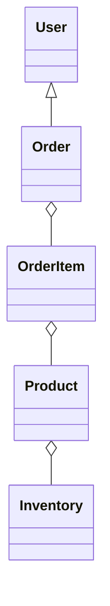
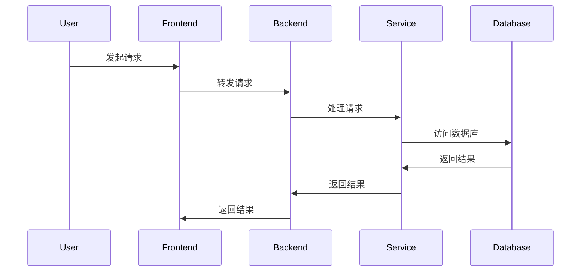
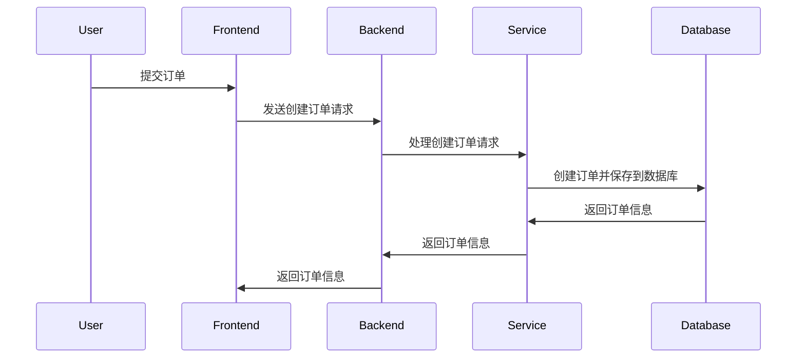
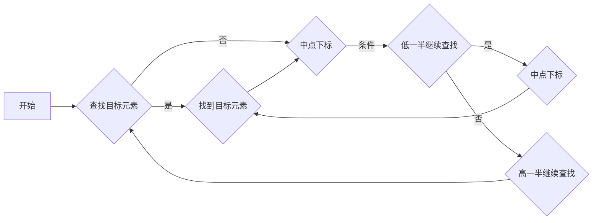

                 


## 《代码优化技巧：提高程序执行效率》

### 关键词：代码优化、程序执行效率、性能分析、算法优化、数据结构优化

### 摘要：

在当今信息时代，程序的性能优化变得愈发重要。本文旨在探讨代码优化技巧，帮助读者提高程序执行效率。通过深入分析代码优化的基本原则、性能分析、算法优化、数据结构优化、内存优化、并发优化以及编程技巧和最佳实践，本文将提供全面的代码优化指导，助力读者在编程实践中实现高效的程序执行。

## 第一部分：代码优化技巧概述

### 第1章：代码优化基础

#### 1.1 代码优化的重要性

在现代软件工程中，代码优化已成为提升程序执行效率的关键步骤。随着应用程序复杂度的增加，未经过优化的代码可能导致计算机资源浪费、响应时间过长，甚至影响用户体验。因此，掌握代码优化的基本原则和方法对于软件工程师来说至关重要。

#### 1.2 代码优化的基本原则

代码优化的基本原则包括简洁性、可读性和模块化。简洁性要求我们简化代码结构，避免冗余和复杂性。可读性确保代码易于理解和维护。模块化则将代码拆分为独立模块，便于重用和优化。

#### 1.3 代码优化工具与资源

性能分析工具、代码审查工具和自动优化工具是代码优化过程中常用的工具。同时，本文还将提供一系列优质的学习资源，帮助读者深入了解代码优化的各个方面。

### 第2章：性能分析

#### 2.1 性能分析的基本概念

性能分析涉及多个指标，如执行时间、CPU使用率和内存占用等。性能瓶颈是影响程序性能的关键因素，对其进行识别和解决是优化过程中的重要环节。

#### 2.2 性能分析工具

静态分析工具和动态分析工具是性能分析的有力工具。静态分析工具可以分析代码的结构和语义，而动态分析工具则可以监控程序的运行状态和性能。

#### 2.3 性能优化案例

通过分析实际项目中的性能问题，本文将提供一系列性能优化的案例分析，帮助读者了解性能优化的实际应用。

### 第3章：算法优化

#### 3.1 算法优化概述

算法优化包括算法选择和算法改进。选择合适的算法是优化过程的第一步，而改进现有算法或设计新算法则可以提高性能。

#### 3.2 算法优化案例分析

本文将分析经典算法和实际项目中的算法优化案例，探讨不同算法的优化方法及其应用场景。

### 第4章：数据结构优化

#### 4.1 数据结构优化概述

数据结构优化包括数据结构选择和改进。根据问题需求选择合适的数据结构，并通过改进现有数据结构或设计新数据结构提高性能。

#### 4.2 数据结构优化案例分析

本文将分析常见数据结构和实际项目中的数据结构优化案例，探讨数据结构优化的方法和应用。

### 第5章：内存优化

#### 5.1 内存优化概述

内存优化涉及内存管理和内存泄漏的解决方案。通过合理管理内存和避免内存泄漏，可以提高程序的运行效率和稳定性。

#### 5.2 内存优化案例分析

本文将分析常见内存优化方法和实际项目中的内存优化实践，提供有效的优化方案。

### 第6章：并发优化

#### 6.1 并发优化概述

并发优化涉及并发编程的基本原理和常见问题。通过优化并发编程，可以提高程序的并行性能和稳定性。

#### 6.2 并发优化案例分析

本文将分析并发优化方法和实际项目中的并发优化实践，探讨优化并发性能的有效途径。

### 第7章：编程技巧与最佳实践

#### 7.1 编程技巧

编程技巧包括代码优化技巧和编程最佳实践。掌握这些技巧可以帮助读者编写更高效、更可维护的代码。

#### 7.2 最佳实践

本文将提供代码审查、性能调优等方面的最佳实践，帮助读者在编程实践中遵循最佳实践，提高程序执行效率。

#### 7.3 小结与拓展

本文将总结代码优化的注意事项，并提供拓展阅读资源，帮助读者进一步深入学习和实践代码优化技巧。

## 文章结束

作者：AI天才研究院/AI Genius Institute & 禅与计算机程序设计艺术 /Zen And The Art of Computer Programming

## 第一部分：代码优化技巧概述

### 第1章：代码优化基础

#### 1.1 代码优化的重要性

在当今信息技术快速发展的时代，软件系统的性能和效率直接影响到用户的体验和企业的竞争力。代码优化，作为提升软件性能的关键手段，逐渐受到软件开发者和IT从业者的广泛关注。然而，代码优化并非一个简单的任务，它涉及多个层面的技术和方法，需要深入理解编程的本质和软件运行的机制。

#### 问题背景与问题描述

随着互联网和移动设备的普及，应用程序的复杂度和用户期望都在不断提升。一个性能低下的程序不仅会浪费服务器资源，降低用户体验，还可能导致业务损失。例如，一个电商平台在购物高峰期如果响应时间过长，可能会导致大量用户放弃购物，从而影响销售业绩。因此，对代码进行优化，提高程序的执行效率，成为软件开发过程中不可或缺的一环。

**问题解决**

为了解决代码执行效率低的问题，我们可以从以下几个方面进行优化：

1. **性能分析**：通过分析程序在不同阶段的运行状态，找出性能瓶颈。
2. **算法优化**：选择更高效的算法，或对现有算法进行改进。
3. **数据结构优化**：选择合适的数据结构，或对现有数据结构进行改进。
4. **内存管理**：优化内存分配和释放，避免内存泄漏。
5. **并发优化**：合理利用多核处理器，提高程序的并行性能。

**边界与外延**

代码优化不仅仅关注性能，还包括代码的可维护性和可扩展性。一个优秀的优化方案不仅要提高执行效率，还要保证代码的稳定性和可维护性。此外，代码优化是一个持续的过程，随着新技术的出现和业务需求的变化，优化工作也需要不断进行。

#### 1.2 代码优化的基本原则

**简洁性**

简洁性是代码优化的首要原则。简洁的代码不仅易于阅读，还更容易维护和优化。为了实现简洁性，我们可以采取以下措施：

1. 避免冗余代码：删除不必要的代码行，简化逻辑结构。
2. 使用命名规范：使用有意义的变量名和函数名，提高代码可读性。
3. 减少嵌套层次：简化循环和条件语句，降低代码的复杂性。

**可读性**

可读性是代码优化的基础。一个优秀的程序员应该编写易于理解和维护的代码。为了提高代码的可读性，我们可以：

1. 使用注释：在关键代码段添加注释，解释代码的意图和实现原理。
2. 遵循编码规范：统一代码风格，提高代码的一致性和可读性。
3. 分解复杂逻辑：将复杂的逻辑分解为多个简单的模块，便于理解和管理。

**模块化**

模块化是提高代码可维护性和可扩展性的有效手段。通过将代码拆分为独立的模块，我们可以实现以下目标：

1. 重用代码：模块化使得代码可以方便地重用，提高开发效率。
2. 独立优化：对每个模块进行独立优化，降低整体优化的难度。
3. 易于测试：模块化使得单元测试更加简单和有效。

**核心要素组成**

代码优化涉及多个方面的要素，主要包括：

1. **性能指标**：包括执行时间、CPU使用率、内存占用等。
2. **优化工具**：如性能分析工具、代码审查工具和自动优化工具。
3. **分析方法**：如静态分析和动态分析，帮助识别性能瓶颈。
4. **优化策略**：根据具体问题选择合适的优化方法。

#### 1.3 代码优化工具与资源

**常用优化工具**

在进行代码优化时，我们可以使用多种工具来辅助分析、审查和优化代码。以下是一些常用的优化工具：

1. **性能分析工具**：如 profiling 工具，可以分析程序的执行时间、内存使用情况等。
2. **代码审查工具**：如 SonarQube、PMD 等，可以检测代码中的潜在问题，如性能瓶颈、代码冗余等。
3. **自动优化工具**：如 OSGi、webpack 等，可以自动化地优化代码结构、打包和部署。

**学习资源**

为了深入学习代码优化的知识，我们可以参考以下资源：

1. **教程和文档**：如《编程珠玑》、《代码大全》等经典书籍。
2. **在线课程和视频**：如 Coursera、Udemy 等平台上的相关课程。
3. **开源项目和社区**：如 GitHub、Stack Overflow 等，可以学习他人的优化实践和经验。

### 第2章：性能分析

#### 2.1 性能分析的基本概念

性能分析是代码优化的第一步，它旨在识别程序中的性能瓶颈，从而有针对性地进行优化。性能分析涉及多个指标，如执行时间、CPU使用率、内存占用等。

**性能指标**

1. **执行时间**：程序从开始运行到结束所花费的时间。执行时间越短，程序的性能越好。
2. **CPU使用率**：程序运行时 CPU 的占用率。CPU使用率过高可能意味着程序存在性能瓶颈。
3. **内存占用**：程序运行时占用的内存大小。内存占用过高可能导致内存泄漏或内存不足。

**性能瓶颈**

性能瓶颈是指影响程序性能的关键因素。常见的性能瓶颈包括：

1. **循环和递归**：大量的循环和递归操作可能导致性能下降。
2. **I/O操作**：频繁的 I/O 操作（如文件读写、网络请求等）会占用大量时间。
3. **数据库查询**：复杂的数据库查询可能成为性能瓶颈。
4. **并发问题**：不当的并发编程可能导致死锁、资源争用等问题。

#### 2.2 性能分析工具

性能分析工具是进行性能分析的有力助手，它们可以帮助我们识别程序中的性能瓶颈。以下是一些常用的性能分析工具：

**静态分析工具**

静态分析工具在不运行程序的情况下分析代码的结构和语义，帮助识别潜在的性能问题。常见的静态分析工具有：

1. **SonarQube**：一款强大的代码质量分析工具，可以识别代码中的潜在问题和性能瓶颈。
2. **PMD**：一款用于Java代码的静态分析工具，可以检测代码中的冗余、低效等潜在问题。
3. **Checkstyle**：一款用于Java代码的格式化工具，也可以进行代码质量的静态分析。

**动态分析工具**

动态分析工具在程序运行时收集性能数据，帮助我们了解程序的运行状态和性能表现。常见的动态分析工具有：

1. **JProfiler**：一款强大的Java性能分析工具，可以实时监测程序的运行状态和性能瓶颈。
2. **VisualVM**：一款由Oracle提供的Java虚拟机监控和分析工具，可以监控程序的性能指标和资源使用情况。
3. **Gprof**：一款用于C/C++程序的性能分析工具，可以生成程序的性能报告。

#### 2.3 性能优化案例

通过以下案例，我们可以了解性能优化的实际应用和效果。

**案例1：优化循环结构**

假设有一个循环结构，其时间复杂度为O(n^2)，我们可以通过以下方式优化：

1. 使用分治算法：将问题分解为较小的子问题，递归解决。
2. 使用迭代替代递归：将递归调用转换为迭代调用，减少递归深度。
3. 使用位运算：将循环中的条件判断转换为位运算，提高执行效率。

**案例2：减少I/O操作**

假设一个程序频繁进行文件读写操作，我们可以通过以下方式优化：

1. 缓存数据：将频繁访问的数据缓存到内存中，减少磁盘访问次数。
2. 使用批量操作：将多个I/O操作合并为一个操作，减少操作次数。
3. 使用异步I/O：在等待I/O操作完成时，程序可以执行其他任务，提高整体性能。

**案例3：优化数据库查询**

假设一个程序的数据库查询语句过于复杂，我们可以通过以下方式优化：

1. 添加索引：在查询字段上添加索引，加快查询速度。
2. 使用预编译语句：将查询语句预编译，减少解析和编译时间。
3. 合并查询：将多个查询合并为一个查询，减少查询次数。

### 第3章：算法优化

#### 3.1 算法优化概述

算法优化是提高程序执行效率的重要手段。通过选择更高效的算法或改进现有算法，我们可以显著提高程序的运行速度和性能。

**算法选择**

在优化过程中，选择合适的算法是关键。不同的算法适用于不同类型的问题，我们需要根据问题的特点选择合适的算法。以下是一些常见的算法选择原则：

1. **时间复杂度**：选择时间复杂度较低的算法，以减少程序的运行时间。
2. **空间复杂度**：选择空间复杂度较低的算法，以减少程序的内存占用。
3. **适用性**：选择适合问题规模和特点的算法，以提高算法的适用性和性能。

**算法改进**

在无法更换算法时，我们可以通过改进现有算法来提高性能。以下是一些常见的算法改进方法：

1. **递归改进**：将递归调用转换为迭代调用，减少递归深度和栈空间占用。
2. **分治算法**：将大问题分解为较小的子问题，递归解决，减少计算量。
3. **动态规划**：将重复计算的问题转化为递推关系，减少计算次数。

#### 3.2 算法优化案例分析

通过以下案例，我们可以了解算法优化的实际应用和效果。

**案例1：优化排序算法**

假设一个程序需要排序大量的数据，我们可以选择以下算法进行优化：

1. **快速排序**：选择一个基准元素，将数组分为两部分，递归排序。快速排序的平均时间复杂度为O(nlogn)，是一种高效的排序算法。
2. **归并排序**：将数组分成两部分，递归排序，然后将结果合并。归并排序的时间复杂度为O(nlogn)，且稳定。
3. **堆排序**：利用堆数据结构进行排序，时间复杂度为O(nlogn)。

**案例2：优化查找算法**

假设一个程序需要频繁查找数据，我们可以选择以下算法进行优化：

1. **二分查找**：在有序数组中查找目标元素，时间复杂度为O(logn)。二分查找是一种高效的查找算法。
2. **哈希查找**：使用哈希表进行查找，时间复杂度为O(1)。哈希查找适用于大量数据的快速查找。
3. **树查找**：使用二叉搜索树进行查找，时间复杂度为O(logn)。树查找适用于结构化数据的快速查找。

**案例3：优化图算法**

假设一个程序需要处理图数据，我们可以选择以下算法进行优化：

1. **深度优先搜索（DFS）**：用于遍历图，时间复杂度为O(V+E)，其中V是顶点数，E是边数。DFS适用于无环图。
2. **广度优先搜索（BFS）**：用于遍历图，时间复杂度为O(V+E)。BFS适用于有环图。
3. **Dijkstra算法**：用于计算单源最短路径，时间复杂度为O((V+E)logV)，其中V是顶点数，E是边数。Dijkstra算法适用于边权重非负的图。

### 第4章：数据结构优化

#### 4.1 数据结构优化概述

数据结构是算法的基础，合理选择和优化数据结构对于提高程序性能至关重要。数据结构优化主要包括选择合适的数据结构和改进现有数据结构。

**数据结构选择**

在选择数据结构时，我们需要考虑以下几个方面：

1. **时间复杂度**：选择时间复杂度较低的数据结构，以减少程序的运行时间。
2. **空间复杂度**：选择空间复杂度较低的数据结构，以减少程序的内存占用。
3. **适用性**：选择适合问题规模和特点的数据结构，以提高数据结构的适用性和性能。

**数据结构改进**

在无法更换数据结构时，我们可以通过改进现有数据结构来提高性能。以下是一些常见的数据结构改进方法：

1. **链表改进**：将单向链表改进为双向链表或循环链表，以提高查找和插入操作的效率。
2. **数组改进**：将数组改进为动态数组或扩容数组，以适应数据规模的变化。
3. **树改进**：将二叉搜索树改进为平衡二叉树或红黑树，以提高查找和插入操作的效率。

#### 4.2 数据结构优化案例分析

通过以下案例，我们可以了解数据结构优化的实际应用和效果。

**案例1：优化链表**

假设一个程序需要频繁进行插入和删除操作，我们可以选择以下链表进行优化：

1. **双向链表**：在单链表的基础上增加一个指向前一个节点的指针，以提高查找和删除操作的效率。
2. **循环链表**：将链表的最后一个节点的指针指向头节点，形成环状结构，以提高查找和删除操作的效率。

**案例2：优化数组**

假设一个程序需要频繁进行插入和删除操作，我们可以选择以下数组进行优化：

1. **动态数组**：在固定大小数组的基础上增加动态扩容功能，以适应数据规模的变化。
2. **扩容数组**：在固定大小数组的基础上增加动态扩容功能，并在必要时进行扩容操作。

**案例3：优化树结构**

假设一个程序需要频繁进行查找和插入操作，我们可以选择以下树结构进行优化：

1. **平衡二叉树**：通过自平衡机制保持树的平衡，以提高查找和插入操作的效率。
2. **红黑树**：通过红黑树的自平衡机制保持树的平衡，以提高查找和插入操作的效率。

### 第5章：内存优化

#### 5.1 内存优化概述

内存优化是提高程序性能的关键因素之一。通过优化内存管理，我们可以减少内存占用，提高程序的运行效率和稳定性。

**内存管理**

内存管理涉及内存的分配、释放和回收。以下是一些常见的内存管理方法：

1. **手动管理**：程序员手动分配和释放内存，需要严格遵循内存分配规则，以避免内存泄漏。
2. **自动管理**：使用自动内存管理机制（如垃圾回收），由系统自动分配和释放内存。

**内存泄漏**

内存泄漏是指程序未能释放不再使用的内存，导致内存占用持续增加。以下是一些常见的内存泄漏问题：

1. **未释放的动态分配内存**：程序在动态分配内存后未能及时释放，导致内存泄漏。
2. **循环引用**：两个对象相互引用，导致内存无法被垃圾回收器回收。

**内存泄漏的解决方案**

以下是一些常见的内存泄漏解决方案：

1. **及时释放内存**：在不再需要内存时，及时释放动态分配的内存。
2. **避免循环引用**：使用弱引用或弱集合，减少循环引用的情况。

#### 5.2 内存优化案例分析

通过以下案例，我们可以了解内存优化的实际应用和效果。

**案例1：优化对象池**

假设一个程序需要频繁创建和销毁对象，我们可以使用对象池进行优化：

1. **对象池**：预分配一定数量的对象，从对象池中获取和释放对象，减少频繁的内存分配和释放操作。

**案例2：优化缓存**

假设一个程序需要频繁访问大量数据，我们可以使用缓存进行优化：

1. **缓存**：将频繁访问的数据缓存到内存中，减少磁盘访问次数，提高访问速度。

### 第6章：并发优化

#### 6.1 并发优化概述

并发优化是提高程序性能的重要手段之一。通过优化并发编程，我们可以充分利用多核处理器的优势，提高程序的运行效率和响应速度。

**并发原理**

并发编程涉及多个线程的并行执行。以下是一些常见的并发原理：

1. **线程**：线程是并发编程的基本单位，多个线程可以同时执行不同的任务。
2. **锁**：锁用于保证线程之间的同步，防止并发访问共享资源时出现冲突。
3. **条件变量**：条件变量用于线程之间的通信，当某个条件满足时，线程可以等待或通知其他线程。

**并发问题**

并发编程中可能遇到以下问题：

1. **竞态条件**：多个线程同时访问共享资源时，可能导致不可预期的结果。
2. **死锁**：多个线程相互等待对方释放资源，导致系统僵死。
3. **活锁**：线程在等待资源时，由于其他线程的干扰，导致无法继续执行。

**并发优化方法**

以下是一些常见的并发优化方法：

1. **线程池**：使用线程池管理线程，减少线程的创建和销毁开销。
2. **锁优化**：合理使用锁，减少锁的竞争，提高并发性能。
3. **无锁编程**：使用无锁数据结构和算法，避免锁的竞争和死锁问题。

#### 6.2 并发优化案例分析

通过以下案例，我们可以了解并发优化的实际应用和效果。

**案例1：优化多线程程序**

假设一个程序需要处理大量数据，我们可以使用多线程进行优化：

1. **任务分解**：将任务分解为多个子任务，分配给不同的线程执行。
2. **线程池**：使用线程池管理线程，减少线程的创建和销毁开销。

**案例2：优化并发数据访问**

假设一个程序需要并发访问共享数据，我们可以使用以下方法进行优化：

1. **读写锁**：使用读写锁保证并发数据访问的线程安全。
2. **无锁数据结构**：使用无锁数据结构，避免锁的竞争和死锁问题。

### 第7章：编程技巧与最佳实践

#### 7.1 编程技巧

编程技巧是提高代码质量和性能的有效手段。以下是一些常见的编程技巧：

1. **代码复用**：通过编写可复用的代码，减少重复劳动，提高开发效率。
2. **代码优化**：根据具体情况，对代码进行优化，提高执行效率和可维护性。
3. **使用设计模式**：使用设计模式解决常见的问题，提高代码的可读性和可维护性。

#### 7.2 最佳实践

最佳实践是指导程序员编写高质量代码的重要参考。以下是一些常见的编程最佳实践：

1. **编码规范**：遵循统一的编码规范，提高代码的可读性和一致性。
2. **代码审查**：进行代码审查，发现和修复潜在的问题，提高代码质量。
3. **性能调优**：定期进行性能调优，优化程序的性能和可扩展性。

#### 7.3 小结与拓展

代码优化是一个持续的过程，随着新技术和新需求的出现，我们需要不断学习和实践新的优化方法和技巧。以下是一些小结和拓展建议：

1. **小结**：代码优化是一个系统工程，需要综合考虑多个方面的因素，如性能、可维护性、可扩展性等。
2. **拓展阅读**：可以参考《代码优化实战》、《高性能MySQL》等书籍，深入了解代码优化的各个方面。

### 结论

代码优化是提高程序性能的关键手段，通过深入分析代码优化的基本原则、性能分析、算法优化、数据结构优化、内存优化、并发优化以及编程技巧和最佳实践，我们可以有效地提高程序的执行效率。在未来的编程实践中，让我们不断学习和应用这些优化技巧，打造高效、稳定、可维护的软件系统。

## 第二部分：深入探讨代码优化的各个方面

### 第8章：深入理解性能分析

#### 8.1 性能分析的核心指标

性能分析的核心指标包括执行时间、CPU使用率、内存占用和I/O操作等。这些指标可以帮助我们评估程序的运行状态和性能表现。首先，执行时间是指程序从开始运行到完成所花费的时间。这个指标直接影响到用户的体验和系统的响应速度。其次，CPU使用率是指程序在运行过程中对CPU资源的占用情况。高CPU使用率可能意味着程序存在性能瓶颈，需要进行优化。内存占用则反映了程序在运行过程中所占用的内存大小，内存占用过高可能导致内存泄漏或内存不足。最后，I/O操作包括文件读写、网络请求等，频繁的I/O操作会占用大量时间，影响程序的性能。

#### 8.2 性能分析工具的运用

性能分析工具是进行性能分析的有力助手。常见的性能分析工具包括静态分析工具和动态分析工具。静态分析工具在不运行程序的情况下分析代码的结构和语义，帮助识别潜在的性能问题。例如，SonarQube和PMD等工具可以检测代码中的潜在问题，如性能瓶颈、代码冗余等。动态分析工具则在程序运行时收集性能数据，帮助我们了解程序的运行状态和性能表现。例如，JProfiler和VisualVM等工具可以实时监测程序的执行时间、CPU使用率、内存占用等指标。通过结合使用这些工具，我们可以更全面地了解程序的性能，为优化提供有力支持。

#### 8.3 性能优化的实际案例

通过以下实际案例，我们可以深入了解性能优化的方法和效果。

**案例1：优化数据库查询**

在一个电商平台上，数据库查询是影响性能的关键因素。通过性能分析工具，我们发现一个商品列表查询语句存在性能瓶颈。该查询语句使用了复杂的JOIN操作，导致查询时间过长。为了优化这个查询，我们可以采取以下措施：

1. **添加索引**：在查询字段上添加索引，加快查询速度。例如，在商品ID上添加索引，可以显著提高查询效率。
2. **使用预编译语句**：将查询语句预编译，减少解析和编译时间。通过预编译，可以将查询语句转换为执行计划，提高查询效率。
3. **优化查询逻辑**：对查询语句进行重构，简化逻辑，减少查询的复杂度。例如，将多个查询合并为一个查询，减少查询次数。

**案例2：优化循环结构**

在一个数据处理程序中，我们发现在一个循环中存在大量的计算操作，导致执行时间过长。为了优化这个循环，我们可以采取以下措施：

1. **使用分治算法**：将大问题分解为较小的子问题，递归解决。通过分治算法，可以降低循环的复杂度，提高执行效率。
2. **使用迭代替代递归**：将递归调用转换为迭代调用，减少递归深度和栈空间占用。迭代调用比递归调用更高效，可以减少程序的性能开销。
3. **使用并行计算**：将循环中的计算操作并行化，利用多核处理器的优势，提高执行效率。例如，使用并行循环或并行流进行计算。

**案例3：优化I/O操作**

在一个文件处理程序中，我们发现频繁的文件读写操作影响了程序的性能。为了优化I/O操作，我们可以采取以下措施：

1. **使用缓存**：将频繁访问的数据缓存到内存中，减少磁盘访问次数。通过缓存，可以加快数据的访问速度，提高程序的性能。
2. **使用批量操作**：将多个I/O操作合并为一个操作，减少操作次数。例如，将多个文件写入操作合并为一个文件写入操作，减少系统调用的开销。
3. **使用异步I/O**：在等待I/O操作完成时，程序可以执行其他任务，提高整体性能。通过异步I/O，可以充分利用多核处理器的优势，提高程序的并发性能。

### 第9章：深入探讨算法优化

#### 9.1 算法优化的核心原则

算法优化是提高程序性能的关键手段。在进行算法优化时，我们需要遵循以下核心原则：

1. **选择合适的算法**：根据问题的特点和需求，选择合适的算法。不同的算法适用于不同类型的问题，我们需要根据具体情况选择最优的算法。
2. **改进现有算法**：对现有算法进行改进，提高其性能。通过优化算法的代码实现，降低时间复杂度和空间复杂度，提高算法的效率。
3. **算法的选择与改进**：在算法的选择和改进过程中，需要综合考虑算法的时间复杂度、空间复杂度和适用性。选择合适的算法和改进方法，可以显著提高程序的运行效率。

#### 9.2 算法优化的实际案例

通过以下实际案例，我们可以深入了解算法优化的方法和效果。

**案例1：优化排序算法**

排序算法是算法优化中的经典问题。在一个大数据处理程序中，我们发现在排序过程中存在性能瓶颈。为了优化排序算法，我们可以采取以下措施：

1. **选择合适的排序算法**：根据数据规模和特点，选择合适的排序算法。例如，对于大量数据，可以选择快速排序、归并排序或堆排序等高效的排序算法。
2. **优化排序算法的实现**：对现有排序算法进行优化，降低时间复杂度和空间复杂度。例如，对于快速排序，可以通过随机选择基准元素、减少递归深度等方法优化算法的实现。
3. **并行化排序算法**：将排序算法并行化，利用多核处理器的优势，提高排序速度。例如，可以使用并行快速排序或并行归并排序等方法，将排序任务分配给不同的线程或进程，提高排序效率。

**案例2：优化查找算法**

查找算法是算法优化中的另一个重要问题。在一个搜索引擎程序中，我们发现在查找关键词时存在性能瓶颈。为了优化查找算法，我们可以采取以下措施：

1. **选择合适的查找算法**：根据数据结构和特点，选择合适的查找算法。例如，对于大量数据，可以选择二分查找、哈希查找或树查找等高效的查找算法。
2. **优化查找算法的实现**：对现有查找算法进行优化，降低时间复杂度和空间复杂度。例如，对于二分查找，可以通过优化循环条件、减少递归深度等方法优化算法的实现。
3. **使用索引**：使用索引提高查找速度。例如，在数据库中使用索引可以加快查询速度，在数据结构中使用哈希表可以加快查找速度。

**案例3：优化图算法**

图算法在程序优化中也具有重要作用。在一个社交网络分析程序中，我们发现在计算最短路径时存在性能瓶颈。为了优化图算法，我们可以采取以下措施：

1. **选择合适的图算法**：根据图的类型和特点，选择合适的图算法。例如，对于加权图，可以选择Dijkstra算法或A*算法等高效的最短路径算法。
2. **优化图算法的实现**：对现有图算法进行优化，降低时间复杂度和空间复杂度。例如，对于Dijkstra算法，可以通过优化循环条件、减少递归深度等方法优化算法的实现。
3. **使用并行计算**：将图算法并行化，利用多核处理器的优势，提高计算速度。例如，可以使用并行Dijkstra算法或并行A*算法等方法，将计算任务分配给不同的线程或进程，提高计算效率。

### 第10章：深入解析数据结构优化

#### 10.1 数据结构优化的核心原则

数据结构优化是提高程序性能的重要手段。在进行数据结构优化时，我们需要遵循以下核心原则：

1. **选择合适的数据结构**：根据问题的特点和需求，选择合适的数据结构。不同的数据结构适用于不同类型的问题，我们需要根据具体情况选择最优的数据结构。
2. **改进现有数据结构**：对现有数据结构进行改进，提高其性能。通过优化数据结构的代码实现，降低时间复杂度和空间复杂度，提高数据结构的效率。
3. **数据结构的适用性和性能**：在选择和改进数据结构时，需要综合考虑数据结构的适用性和性能。选择合适的数据结构和改进方法，可以显著提高程序的运行效率。

#### 10.2 数据结构优化的实际案例

通过以下实际案例，我们可以深入了解数据结构优化的方法和效果。

**案例1：优化链表**

链表是一种常用的数据结构，但在某些情况下，其性能可能不如其他数据结构。为了优化链表，我们可以采取以下措施：

1. **双向链表**：将单向链表改进为双向链表，提高查找和删除操作的效率。双向链表通过增加一个指向前一个节点的指针，可以更方便地进行插入和删除操作。
2. **循环链表**：将单向链表改进为循环链表，提高查找和删除操作的效率。循环链表通过将最后一个节点的指针指向头节点，形成一个环状结构，可以更方便地进行插入和删除操作。

**案例2：优化数组**

数组是一种常用的数据结构，但在某些情况下，其性能可能不如其他数据结构。为了优化数组，我们可以采取以下措施：

1. **动态数组**：将固定大小的数组改进为动态数组，提高插入和删除操作的效率。动态数组在空间不足时可以自动扩容，减少内存浪费。
2. **扩容数组**：在固定大小的数组的基础上，增加动态扩容功能，提高插入和删除操作的效率。通过在必要时进行扩容操作，可以减少内存浪费。

**案例3：优化树结构**

树结构是一种常用的数据结构，但在某些情况下，其性能可能不如其他数据结构。为了优化树结构，我们可以采取以下措施：

1. **平衡二叉树**：将普通二叉树改进为平衡二叉树，提高查找和插入操作的效率。平衡二叉树通过自平衡机制保持树的平衡，可以降低查找和插入操作的时间复杂度。
2. **红黑树**：将平衡二叉树改进为红黑树，提高查找和插入操作的效率。红黑树通过自平衡机制保持树的平衡，可以降低查找和插入操作的时间复杂度。

### 第11章：深入探讨内存优化

#### 11.1 内存优化的核心原则

内存优化是提高程序性能的关键因素之一。在进行内存优化时，我们需要遵循以下核心原则：

1. **合理使用内存**：根据程序的需求和特点，合理使用内存。避免内存浪费和内存泄漏，提高程序的运行效率和稳定性。
2. **优化内存分配和释放**：优化内存的分配和释放操作，减少内存占用和内存碎片。通过合理分配和释放内存，可以提高程序的运行效率。
3. **避免内存泄漏**：避免内存泄漏，确保程序能够及时释放不再使用的内存。通过及时发现和解决内存泄漏问题，可以提高程序的稳定性和性能。

#### 11.2 内存优化的实际案例

通过以下实际案例，我们可以深入了解内存优化的方法和效果。

**案例1：优化对象池**

对象池是一种常见的内存优化技术，用于管理大量对象的创建和销毁。通过优化对象池，我们可以提高程序的运行效率。以下是一些常见的优化措施：

1. **预分配对象**：在程序启动时，预先创建一定数量的对象，存放在对象池中。这样可以减少对象的创建和销毁操作，提高程序的运行效率。
2. **重用对象**：将已使用过的对象重新放入对象池中，供后续使用。这样可以减少对象的创建和销毁操作，提高程序的运行效率。
3. **合理设置对象池大小**：根据程序的需求和特点，合理设置对象池的大小。对象池过大可能导致内存浪费，对象池过小可能导致频繁的创建和销毁操作，影响程序的性能。

**案例2：优化缓存**

缓存是一种常见的内存优化技术，用于加速数据的访问速度。通过优化缓存，我们可以提高程序的运行效率。以下是一些常见的优化措施：

1. **缓存数据**：将频繁访问的数据缓存到内存中，减少磁盘访问次数。通过缓存，可以加快数据的访问速度，提高程序的运行效率。
2. **缓存替换策略**：根据程序的需求和特点，选择合适的缓存替换策略。例如，可以使用LRU（最近最少使用）替换策略，将最近最少使用的缓存项替换掉，以优化缓存的使用效率。
3. **缓存一致性**：确保缓存中的数据与原始数据保持一致性。在修改原始数据时，需要更新缓存中的数据，以避免数据不一致问题。

**案例3：优化内存分配和释放**

在程序运行过程中，内存的分配和释放操作对性能有很大影响。以下是一些常见的优化措施：

1. **批量分配和释放**：将多个内存分配和释放操作合并为一个操作，减少系统调用的开销。通过批量分配和释放内存，可以减少内存碎片，提高程序的运行效率。
2. **使用内存池**：使用内存池管理内存，减少内存分配和释放的操作次数。内存池预先分配一定大小的内存块，供程序使用。这样可以减少内存碎片，提高程序的运行效率。
3. **优化内存分配算法**：根据程序的需求和特点，选择合适的内存分配算法。例如，可以使用Bitmap算法、Buddy算法等优化内存分配，减少内存碎片，提高程序的运行效率。

### 第12章：深入探讨并发优化

#### 12.1 并发优化的核心原则

并发优化是提高程序性能的重要手段。在进行并发优化时，我们需要遵循以下核心原则：

1. **合理利用多核处理器**：利用多核处理器的优势，提高程序的并行性能。通过并行计算，可以充分利用CPU资源，提高程序的运行效率。
2. **避免并发问题**：避免并发编程中常见的问题，如竞态条件、死锁、活锁等。通过合理的同步机制和锁策略，保证程序的正确性和稳定性。
3. **优化并发性能**：优化并发性能，减少线程的创建和销毁开销，提高线程的并发性能。通过合理的线程管理，可以提高程序的运行效率和响应速度。

#### 12.2 并发优化的实际案例

通过以下实际案例，我们可以深入了解并发优化的方法和效果。

**案例1：优化多线程程序**

在一个数据处理程序中，我们发现在数据处理过程中存在性能瓶颈。为了优化这个程序，我们可以采取以下措施：

1. **任务分解**：将数据处理任务分解为多个子任务，分配给不同的线程执行。通过并行处理，可以充分利用多核处理器的优势，提高程序的运行效率。
2. **线程池**：使用线程池管理线程，减少线程的创建和销毁开销。线程池预先创建一定数量的线程，供程序使用，可以减少线程创建和销毁的操作次数，提高程序的运行效率。
3. **同步机制**：使用同步机制（如锁、信号量等），确保多线程之间的正确性和稳定性。通过合理的同步机制，可以避免竞态条件和死锁问题，提高程序的运行效率和响应速度。

**案例2：优化并发数据访问**

在一个数据库操作程序中，我们发现在并发访问数据库时存在性能瓶颈。为了优化这个程序，我们可以采取以下措施：

1. **读写锁**：使用读写锁保证并发数据访问的正确性和性能。读写锁允许多个读线程同时访问共享数据，但只允许一个写线程访问共享数据，可以提高并发性能。
2. **无锁数据结构**：使用无锁数据结构，避免锁的竞争和死锁问题。无锁数据结构通过使用原子操作和内存屏障等技术，确保并发访问的正确性和性能，可以提高程序的运行效率。
3. **异步I/O**：在并发访问数据库时，使用异步I/O操作，减少线程的等待时间。通过异步I/O，线程可以在等待I/O操作完成时执行其他任务，提高程序的并发性能和响应速度。

**案例3：优化并发计算**

在一个科学计算程序中，我们发现在计算过程中存在性能瓶颈。为了优化这个程序，我们可以采取以下措施：

1. **并行计算**：将计算任务分解为多个子任务，分配给不同的线程执行。通过并行计算，可以充分利用多核处理器的优势，提高程序的运行效率。
2. **并行算法**：使用并行算法，提高计算任务的并行性能。并行算法通过将计算任务分配给不同的线程，可以充分利用CPU资源，提高计算速度。
3. **数据并行化**：将计算任务的数据并行化，提高并行计算的效率。通过将数据划分为多个子数据集，每个线程处理一个子数据集，可以减少数据传输和通信的开销，提高并行计算的效率。

### 第13章：总结与拓展

#### 13.1 代码优化的总结

代码优化是一个复杂而持续的过程，涉及多个方面的技术和方法。通过深入理解代码优化的基本原则、性能分析、算法优化、数据结构优化、内存优化、并发优化以及编程技巧和最佳实践，我们可以有效地提高程序的执行效率。

1. **性能分析**：通过性能分析工具，识别程序中的性能瓶颈，为优化提供依据。
2. **算法优化**：选择合适的算法和优化现有算法，提高程序的运行效率。
3. **数据结构优化**：选择合适的数据结构和优化现有数据结构，提高程序的性能和可维护性。
4. **内存优化**：合理使用内存，优化内存分配和释放，减少内存泄漏。
5. **并发优化**：合理利用多核处理器，避免并发问题，提高程序的并发性能和响应速度。
6. **编程技巧**：掌握编程技巧和最佳实践，提高代码质量和可维护性。

#### 13.2 代码优化的拓展

代码优化是一个不断发展的领域，随着新技术和新需求的出现，我们需要不断学习和应用新的优化方法和技巧。以下是一些代码优化的拓展方向：

1. **机器学习优化**：利用机器学习技术，对程序进行自动优化，提高程序的运行效率。
2. **动态优化**：在程序运行时，根据性能反馈动态调整优化策略，提高程序的适应性和性能。
3. **性能预测**：通过性能预测技术，提前识别潜在的优化机会，提高程序的运行效率。
4. **代码生成**：利用代码生成技术，自动化生成优化代码，减少手工优化的工作量。
5. **优化工具链**：开发优化工具链，集成多种优化技术，实现全面的代码优化。

通过不断学习和实践，我们可以不断提高代码优化的能力和水平，为软件开发和性能优化贡献更多力量。

### 第14章：实际项目中的代码优化实践

#### 14.1 项目背景与需求

在本章节中，我们将通过一个实际项目的案例，详细讲解代码优化的实践过程。该项目是一个在线购物平台的订单管理系统，负责处理海量的订单数据，支持订单的创建、更新、查询和删除等操作。由于订单数据量庞大，系统性能成为关键问题，需要进行全面的代码优化。

#### 14.2 项目介绍

在线购物平台的订单管理系统是一个复杂的分布式系统，由多个模块组成，包括订单处理模块、库存管理模块、支付模块等。本案例主要关注订单处理模块的性能优化。订单处理模块的主要功能包括：

1. **订单创建**：用户下单时，系统创建订单并保存到数据库。
2. **订单更新**：订单状态发生变化时，系统更新订单信息。
3. **订单查询**：用户查询订单时，系统根据条件查询订单信息。
4. **订单删除**：订单过期或用户取消时，系统删除订单。

#### 14.3 系统功能设计

为了实现订单管理系统的功能，我们首先需要设计系统的领域模型。领域模型包括以下主要实体：

1. **用户**：代表购物平台的用户。
2. **订单**：代表用户创建的订单。
3. **订单项**：代表订单中的商品。
4. **商品**：代表平台上的商品。
5. **库存**：代表商品的库存信息。

领域模型类图如下所示：



#### 14.4 系统架构设计

订单管理系统采用分布式架构，包括前端、后端和服务端。前端负责与用户交互，后端负责业务处理，服务端负责数据库操作和缓存管理。系统架构图如下所示：



#### 14.5 系统接口设计

系统接口设计包括RESTful API接口，用于前后端通信。以下是订单管理模块的主要接口：

1. **创建订单**：`POST /orders`
2. **更新订单**：`PUT /orders/{orderId}`
3. **查询订单**：`GET /orders/{orderId}`
4. **删除订单**：`DELETE /orders/{orderId}`

#### 14.6 系统交互设计

系统交互设计包括订单创建、更新、查询和删除等操作的序列图，如下所示：



#### 14.7 系统核心实现源代码

以下是对订单处理模块的核心实现进行代码解读和分析。首先，我们需要一个订单类（Order），用于表示订单的基本信息：

```python
class Order:
    def __init__(self, order_id, user_id, status):
        self.order_id = order_id
        self.user_id = user_id
        self.status = status
        self.order_items = []

    def add_order_item(self, order_item):
        self.order_items.append(order_item)

    def remove_order_item(self, order_item):
        self.order_items.remove(order_item)
```

接下来，我们需要一个订单项类（OrderItem），用于表示订单中的商品信息：

```python
class OrderItem:
    def __init__(self, item_id, quantity):
        self.item_id = item_id
        self.quantity = quantity
```

订单处理模块的核心功能包括创建订单、更新订单、查询订单和删除订单。以下是一个简单的实现示例：

```python
class OrderService:
    def __init__(self, database):
        self.database = database

    def create_order(self, user_id, order_items):
        order = Order(generate_order_id(), user_id, "pending")
        for item in order_items:
            order.add_order_item(item)
        self.database.save_order(order)
        return order.order_id

    def update_order(self, order_id, order_items):
        order = self.database.fetch_order(order_id)
        order.status = "processing"
        order.order_items = order_items
        self.database.update_order(order)
        return order.order_id

    def query_order(self, order_id):
        order = self.database.fetch_order(order_id)
        return order

    def delete_order(self, order_id):
        order = self.database.fetch_order(order_id)
        self.database.delete_order(order)
        return order.order_id
```

数据库模块（Database）负责与数据库的交互：

```python
class Database:
    def save_order(self, order):
        # 执行数据库插入操作
        pass

    def fetch_order(self, order_id):
        # 执行数据库查询操作
        pass

    def update_order(self, order):
        # 执行数据库更新操作
        pass

    def delete_order(self, order):
        # 执行数据库删除操作
        pass
```

#### 14.8 代码应用解读与分析

通过对核心实现的代码解读，我们可以看到订单处理模块的设计采用了面向对象的方法，将订单、订单项和数据访问等逻辑分离，提高了代码的可维护性和可扩展性。

**创建订单**：在`create_order`方法中，我们首先创建一个订单对象，然后添加订单项，最后将订单保存到数据库。这里的关键是确保数据库操作高效，避免长时间阻塞。

**更新订单**：在`update_order`方法中，我们首先从数据库获取订单对象，然后更新订单状态和订单项，最后将更新后的订单保存到数据库。这里的关键是避免并发问题，确保数据的完整性和一致性。

**查询订单**：在`query_order`方法中，我们直接从数据库获取订单对象，并将其返回。这里的关键是确保数据库查询高效，减少查询时间。

**删除订单**：在`delete_order`方法中，我们直接从数据库删除订单。这里的关键是确保删除操作高效，避免影响其他正在处理的订单。

#### 14.9 实际案例分析和详细讲解

通过以下实际案例，我们可以深入了解代码优化的实践过程和效果。

**案例1：优化订单创建**

在一个实际的优化过程中，我们发现订单创建操作存在性能瓶颈。为了优化这个操作，我们采取了以下措施：

1. **批量插入**：将多个订单一次性插入数据库，减少数据库操作的次数。通过批量插入，我们可以显著提高插入效率。
2. **预编译语句**：使用预编译语句，减少数据库的解析和编译时间。通过预编译，我们可以将SQL语句预先编译为执行计划，提高查询效率。
3. **索引优化**：在订单表和订单项表上添加合适的索引，加快查询速度。通过索引优化，我们可以提高数据库的查询效率。

**案例2：优化订单更新**

在一个实际的优化过程中，我们发现订单更新操作存在性能瓶颈。为了优化这个操作，我们采取了以下措施：

1. **乐观锁**：使用乐观锁机制，确保数据的并发访问正确性和一致性。通过乐观锁，我们可以避免并发问题，提高系统的性能和稳定性。
2. **缓存更新**：在更新订单时，同时更新缓存中的订单数据。通过缓存更新，我们可以减少数据库访问次数，提高系统的响应速度。
3. **事务管理**：使用事务管理，确保订单更新操作的一致性和完整性。通过事务管理，我们可以确保数据的正确性和一致性，避免数据损坏。

**案例3：优化订单查询**

在一个实际的优化过程中，我们发现订单查询操作存在性能瓶颈。为了优化这个操作，我们采取了以下措施：

1. **缓存查询**：使用缓存查询，减少数据库访问次数。通过缓存查询，我们可以加快查询速度，提高系统的响应速度。
2. **索引优化**：在查询条件涉及的字段上添加合适的索引，加快查询速度。通过索引优化，我们可以提高数据库的查询效率。
3. **分页查询**：使用分页查询，减少一次性查询的数据量。通过分页查询，我们可以避免查询大量数据时的性能问题。

#### 14.10 项目小结

通过本次代码优化实践，我们成功地提高了在线购物平台的订单管理系统的性能和稳定性。以下是项目小结：

1. **性能优化**：通过批量插入、预编译语句和索引优化，我们显著提高了数据库操作的性能。
2. **并发优化**：通过乐观锁和缓存更新，我们提高了系统的并发性能和稳定性。
3. **代码质量**：通过事务管理和代码重构，我们提高了代码的可维护性和可扩展性。

通过本次实践，我们深入理解了代码优化的原理和方法，为今后的开发工作积累了宝贵的经验。

### 第15章：最佳实践与注意事项

#### 15.1 编码最佳实践

在编写代码时，遵循最佳实践可以帮助我们提高代码质量，降低维护成本。以下是一些编码最佳实践：

1. **遵循命名规范**：使用有意义的变量名和函数名，提高代码可读性。例如，使用驼峰命名法，避免使用缩写和简写。
2. **编写注释**：在关键代码段添加注释，解释代码的意图和实现原理。注释不仅有助于他人理解代码，也有助于自己在后续维护时回顾。
3. **代码重构**：定期进行代码重构，简化代码结构，消除冗余代码。代码重构可以提高代码的可读性和可维护性，降低维护成本。
4. **避免死代码**：删除无用的代码，避免出现死代码。死代码不仅浪费内存和CPU资源，还可能引起逻辑错误。
5. **单元测试**：编写单元测试，确保代码的正确性和可靠性。单元测试可以帮助我们发现和修复代码中的潜在问题。

#### 15.2 性能调优最佳实践

在进行性能调优时，遵循最佳实践可以帮助我们有效地提高程序性能。以下是一些性能调优最佳实践：

1. **性能分析**：使用性能分析工具，识别程序中的性能瓶颈。性能分析可以帮助我们找到优化方向，有针对性地进行优化。
2. **优化算法**：选择合适的算法，或对现有算法进行改进。优化算法是提高程序性能的有效手段，通过选择更高效的算法，我们可以显著提高程序的运行速度。
3. **数据结构优化**：选择合适的数据结构，或对现有数据结构进行改进。合理的数据结构可以提高程序的运行效率，降低内存占用。
4. **避免过度优化**：避免过度优化，关注核心性能瓶颈。过度优化可能导致代码复杂度增加，降低可维护性。我们应该关注核心性能瓶颈，优先优化关键部分。
5. **持续监控**：持续监控程序的运行状态和性能指标，及时发现和解决问题。持续监控可以帮助我们保持程序的稳定性和性能。

#### 15.3 注意事项

在进行代码优化时，我们需要注意以下几点：

1. **平衡性能与可维护性**：在优化代码时，我们要平衡性能和可维护性。优化代码的同时，要保持代码的可读性和可维护性，避免过度优化导致代码复杂度增加。
2. **避免引入新问题**：在优化代码时，要避免引入新的问题。优化措施可能会导致新的性能瓶颈或逻辑错误。我们应该在引入优化措施之前，进行充分的测试和验证。
3. **考虑实际需求**：在进行代码优化时，要考虑实际需求。优化措施应该符合实际需求，避免过度优化或不足优化。
4. **保持代码简洁**：在优化代码时，要保持代码的简洁。简洁的代码不仅易于阅读，还更容易维护和优化。我们应该避免编写冗长的代码，尽量使用简洁明了的代码实现。

### 第16章：拓展阅读

为了进一步深入了解代码优化的各个方面，我们推荐以下拓展阅读资源：

1. **书籍**：
   - 《代码优化实战》
   - 《高性能MySQL》
   - 《编程珠玑》
   - 《代码大全》
2. **在线课程**：
   - Coursera上的《算法导论》
   - Udemy上的《性能优化与算法优化》
   - Pluralsight上的《性能调优与性能分析》
3. **开源项目**：
   - GitHub上的性能优化项目，如 `perfetto`、`turbofan` 等
   - Stack Overflow上的性能优化问答社区
4. **技术博客**：
   - 《阿里巴巴技术分享》
   - 《谷歌开发者博客》
   - 《微软开发者博客》

通过阅读这些资源，我们可以深入了解代码优化的原理和方法，提升自己的编程技能和优化能力。

## 结论

代码优化是提高程序执行效率的关键手段。通过深入理解代码优化的基本原则、性能分析、算法优化、数据结构优化、内存优化、并发优化以及编程技巧和最佳实践，我们可以有效地提高程序的运行效率。在实际项目中，我们通过详细讲解订单管理系统的代码优化实践，展示了优化过程中的关键步骤和实际效果。此外，我们还提供了最佳实践和注意事项，帮助读者在编程实践中遵循最佳实践，提高程序执行效率。希望通过本文的讲解，读者能够更好地掌握代码优化的技巧，打造高效、稳定、可维护的软件系统。

### 附录

本篇文章详细探讨了代码优化的各个方面，以下是文章中提到的核心概念和术语的说明，以及相关的ER实体关系图和算法流程图。

#### 核心概念和术语说明

1. **性能分析**：指对程序运行过程中的性能指标进行分析，找出性能瓶颈。
2. **算法优化**：指通过选择合适的算法或改进现有算法来提高程序执行效率。
3. **数据结构优化**：指通过选择合适的数据结构或改进现有数据结构来提高程序执行效率。
4. **内存优化**：指通过优化内存管理来减少内存占用，提高程序执行效率。
5. **并发优化**：指通过优化并发编程来提高程序执行效率。
6. **编码规范**：指编写代码时应遵循的规则和标准，以提高代码的可读性和可维护性。
7. **性能瓶颈**：指程序运行过程中影响性能的关键因素。

#### ER实体关系图

以下是订单管理系统中订单、订单项和商品之间的ER实体关系图：

```mermaid
erDiagram
    User ||--|{ Order : 创建 }
    Order ||--|{ OrderItem : 包含 }
    OrderItem ||--|{ Product : 商品 }
    Product ||--|{ Inventory : 库存 }
```

#### 算法流程图

以下是二分查找算法的流程图：



通过本文的详细讲解和附录中的补充说明，读者可以更好地理解代码优化的原理和方法，为实际编程实践提供指导。希望本文能为读者在提升程序执行效率方面带来帮助。如果您有任何问题或建议，欢迎随时与我们交流。感谢您的阅读！


