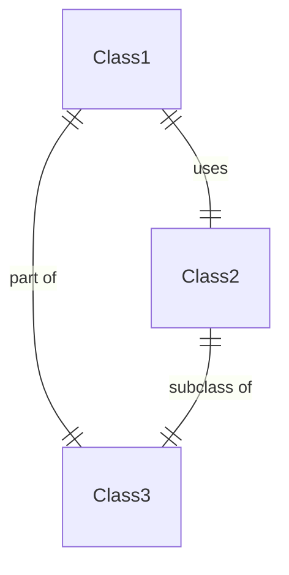
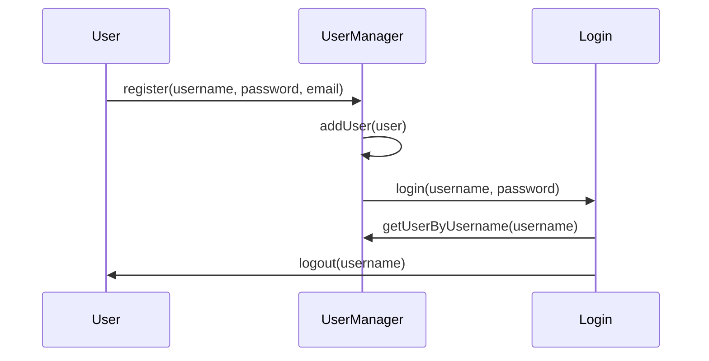
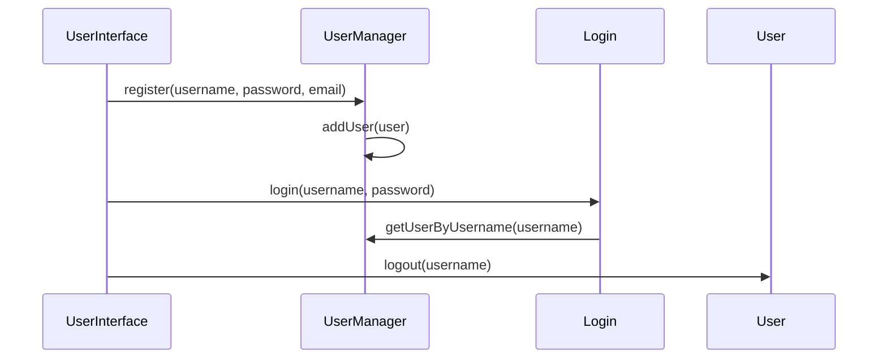
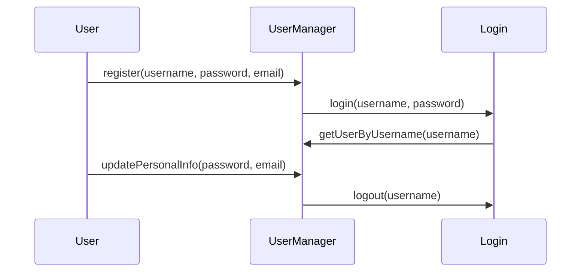

                 


### 文章标题
#### 代码可读性提升：命名、注释和结构化

### 关键词
- 代码可读性
- 命名规范
- 注释原则
- 代码结构化
- 开发实践
- 团队协作

### 摘要
本文深入探讨了提升代码可读性的重要性，并从命名、注释和结构化三个方面进行了详细分析。通过明确的命名规则、精简的注释原则和合理的代码结构，开发者能够编写出易于理解、维护和扩展的代码，从而提高开发效率和团队协作能力。

## 第一部分：背景介绍

### 1.1 问题背景
在软件开发领域，代码的可读性是一个不可忽视的关键因素。它不仅影响到个人开发者对代码的理解和维护，也直接关系到整个团队的协作效率和项目的整体质量。良好的代码可读性意味着开发者可以快速理解代码的功能和意图，从而提高开发速度和减少错误。相反，若代码可读性差，则会导致开发周期延长，错误率增加，甚至可能阻碍项目的顺利进行。

### 1.2 问题描述
代码可读性问题的表现通常包括以下几点：

1. **命名不规范**：变量、函数、类的命名不统一，缺乏明确的命名规则，使得代码难以理解。
2. **注释缺失或冗余**：代码中的注释不充分或者过于冗长，无法准确传达代码意图，增加开发者阅读和理解代码的难度。
3. **代码结构混乱**：代码缺乏良好的组织结构，逻辑混乱，导致代码难以维护和扩展。

### 1.3 问题解决
为了提升代码的可读性，我们需要从以下几个方面进行改进：

1. **命名规范**：制定并遵循统一的命名规范，使代码命名更加直观、易懂。
2. **注释原则**：确保代码注释的准确性和简洁性，避免冗余和不必要的注释。
3. **代码结构**：优化代码结构，使代码逻辑清晰、层次分明，便于维护和扩展。

### 1.4 边界与外延
- **边界**：本文主要针对通用编程语言（如Java、Python、C++等）进行讨论。
- **外延**：代码可读性的提升不仅适用于新代码的开发，也适用于对现有代码的优化。

## 第二部分：核心概念与联系

### 2.1 核心概念
#### 2.1.1 命名规范
命名规范是确保代码可读性的基础。它包括变量、函数和类的命名规则，使代码命名更具一致性、直观性和可理解性。

#### 2.1.2 注释原则
注释原则是编写清晰、准确、简洁注释的指导方针。良好的注释能够帮助开发者快速理解代码的意图和实现逻辑。

#### 2.1.3 代码结构
代码结构是指代码的组织方式和层次结构。良好的代码结构能够提高代码的可维护性和扩展性，使代码更加清晰和易于理解。

### 2.2 概念属性特征对比表格
| 概念           | 属性特征                           |
| -------------- | --------------------------------- |
| 命名规范       | 一致性、直观性、明确性           |
| 注释原则       | 准确性、简洁性、逻辑性           |
| 代码结构       | 模块化、层次分明、逻辑清晰       |

### 2.3 ER实体关系图架构


## 第三部分：算法原理讲解

### 3.1 命名规范原理
命名规范是提升代码可读性的第一步。合理的命名不仅有助于理解代码，还能提高代码的可维护性。以下是命名规范的一些关键原则：

#### 3.1.1 变量命名
- **规则**：使用小写字母和下划线，如 `user_name`。
- **原则**：命名应能直观表达变量的功能。

#### 3.1.2 函数命名
- **规则**：使用动词或动词短语，如 `load_data`。
- **原则**：命名应能准确反映函数的操作。

#### 3.1.3 类命名
- **规则**：使用大驼峰命名法，如 `UserManager`。
- **原则**：命名应能直观表达类的功能。

### 3.2 注释原则原理
注释是帮助理解代码的重要手段。良好的注释原则能够提高代码的可读性，减少开发者的阅读难度。

#### 3.2.1 注释规则
- **文档注释**：为公共类、方法、属性提供文档注释，如 Javadoc。
- **代码注释**：为复杂逻辑或关键代码提供注释。

#### 3.2.2 注释原则
- **准确性**：注释应准确表达代码意图。
- **简洁性**：注释应简洁明了，避免冗长。

### 3.3 代码结构原理
良好的代码结构是提升代码可读性的关键。合理的代码结构可以提高代码的可维护性和扩展性。

#### 3.3.1 结构规则
- **模块化**：将代码按照功能划分为模块。
- **层次分明**：代码应具有良好的层次结构。

#### 3.3.2 结构原则
- **逻辑清晰**：代码应遵循逻辑顺序。
- **可扩展性**：代码应具有良好的扩展性。

## 第四部分：数学模型和数学公式 & 详细讲解 & 举例说明

### 4.1 数学模型
假设代码可读性 \(R\) 与命名、注释和结构化 \(N, C, S\) 之间存在以下关系：

\[ R = f(N, C, S) \]

其中，\( f \) 为一个非线性函数，表示代码可读性与命名、注释和结构化之间的关系。

### 4.2 详细讲解
#### 4.2.1 命名
合理的命名规则可以提高代码的可读性。例如，使用有意义的变量名，可以避免混淆和误解。以下是一个简单的命名示例：

```python
# 错误的命名示例
a = 10
b = 20

# 正确的命名示例
user_age = 30
product_quantity = 50
```

在这个例子中，`user_age` 和 `product_quantity` 提供了明确的语义，使得代码更加易懂。

#### 4.2.2 注释
注释对于理解代码功能至关重要。以下是一个注释的示例：

```python
# 计算两个数的和
def add(a, b):
    """
    计算两个数的和。
    
    参数:
    a (int): 第一个加数。
    b (int): 第二个加数。
    
    返回:
    int: 两个数的和。
    """
    return a + b
```

在这个例子中，注释清晰地描述了函数的功能、参数和返回值，使得开发者可以快速理解代码。

#### 4.2.3 代码结构
良好的代码结构有助于提高代码的可读性。以下是一个简单的类结构示例：

```python
class UserManager:
    def __init__(self, users):
        self.users = users
    
    def add_user(self, user):
        """
        添加用户。
        
        参数:
        user (User): 用户对象。
        """
        self.users.append(user)
    
    def get_user_by_id(self, user_id):
        """
        通过用户ID获取用户。
        
        参数:
        user_id (int): 用户ID。
        
        返回:
        User: 用户对象。
        """
        for user in self.users:
            if user.id == user_id:
                return user
        return None
```

在这个例子中，类 `UserManager` 具有明确的模块划分和清晰的逻辑结构，使得开发者可以轻松理解和维护代码。

### 4.3 数学公式
在代码中，数学公式可以用于描述算法或计算逻辑。以下是一个简单的数学公式示例：

$$
f(x) = x^2 + 2x + 1
$$

### 4.4 举例说明
假设我们有一个简单的计算器程序，我们需要对它进行命名、注释和结构化改进。

#### 4.4.1 命名
```python
# 原始代码
sum = a + b

# 改进后的代码
def add(a, b):
    """
    计算两个数的和。
    
    参数:
    a (int): 第一个加数。
    b (int): 第二个加数。
    
    返回:
    int: 两个数的和。
    """
    return a + b
```

#### 4.4.2 注释
```python
# 原始代码
sum = a + b  # 计算a和b的和

# 改进后的代码
def add(a, b):
    """
    计算两个数的和。
    
    参数:
    a (int): 第一个加数。
    b (int): 第二个加数。
    
    返回:
    int: 两个数的和。
    """
    return a + b
```

#### 4.4.3 代码结构
```python
class Calculator:
    def __init__(self):
        self.a = None
        self.b = None

    def set_values(self, a, b):
        """
        设置计算器的值。
        
        参数:
        a (int): 第一个加数。
        b (int): 第二个加数。
        """
        self.a = a
        self.b = b

    def add(self):
        """
        计算两个数的和。
        
        返回:
        int: 两个数的和。
        """
        return self.a + self.b
```

通过命名、注释和结构化的改进，计算器程序的可读性得到了显著提高，使得开发者可以更加轻松地理解和使用代码。

## 第五部分：系统分析与架构设计方案

### 5.1 问题场景介绍
假设我们正在开发一个在线购物平台，需要实现一个用户管理模块。这个模块需要支持用户注册、登录、个人信息修改等功能。

### 5.2 项目介绍
本项目名为“OnlineShop”，旨在构建一个功能完整的在线购物平台。用户管理模块是整个平台的核心模块之一，负责处理与用户相关的所有操作。

### 5.3 系统功能设计（领域模型mermaid类图）
```mermaid
classDiagram
    User <<class>>
    UserManager <<class>>
    Login <<interface>>

    User : +String username
    User : +String password
    User : +String email

    UserManager : +void addUser(User user)
    UserManager : +void deleteUserByUsername(String username)
    UserManager : +User getUserByUsername(String username)
    UserManager : +void updateUser(User user)

    Login : +void login(String username, String password)
    Login : +void logout(String username)

    UserManager o--o Login
```

### 5.4 系统架构设计（mermaid架构图）


### 5.5 系统接口设计（mermaid序列图）


### 5.6 系统交互（mermaid序列图）


## 第六部分：项目实战

### 6.1 环境安装
在开始项目之前，我们需要确保安装了Python环境以及相关的依赖库。可以使用以下命令进行安装：
```
pip install Flask
pip install SQLAlchemy
```

### 6.2 系统核心实现源代码

```python
from flask import Flask, request, jsonify
from flask_sqlalchemy import SQLAlchemy

app = Flask(__name__)
app.config['SQLALCHEMY_DATABASE_URI'] = 'sqlite:///users.db'
db = SQLAlchemy(app)

class User(db.Model):
    id = db.Column(db.Integer, primary_key=True)
    username = db.Column(db.String(80), unique=True, nullable=False)
    password = db.Column(db.String(120), nullable=False)
    email = db.Column(db.String(120), unique=True, nullable=False)

    def __repr__(self):
        return '<User %r>' % self.username

@app.route('/register', methods=['POST'])
def register():
    data = request.get_json()
    username = data['username']
    password = data['password']
    email = data['email']

    new_user = User(username=username, password=password, email=email)
    db.session.add(new_user)
    db.session.commit()

    return jsonify({"message": "User registered successfully."})

@app.route('/login', methods=['POST'])
def login():
    data = request.get_json()
    username = data['username']
    password = data['password']

    user = User.query.filter_by(username=username, password=password).first()
    if user:
        return jsonify({"message": "Login successful."})
    else:
        return jsonify({"message": "Invalid credentials."})

if __name__ == '__main__':
    db.create_all()
    app.run(debug=True)
```

### 6.3 代码应用解读与分析
上述代码实现了用户注册和登录功能。首先，我们定义了`User`模型，它包含`id`、`username`、`password`和`email`字段。然后，我们创建了两个路由，分别是注册和登录。

在注册路由中，我们接收用户提交的`username`、`password`和`email`，将它们存储在数据库中。在登录路由中，我们验证用户提交的`username`和`password`是否与数据库中的记录匹配，如果匹配，则返回登录成功，否则返回登录失败。

### 6.4 实际案例分析和详细讲解剖析
假设用户名为`alice`，密码为`password123`，我们尝试注册并登录。

**注册案例：**
1. 用户提交注册请求，包含`username`、`password`和`email`字段。
2. 服务器接收请求，创建新的`User`对象，并将其添加到数据库中。
3. 服务器返回注册成功消息。

**登录案例：**
1. 用户提交登录请求，包含`username`和`password`字段。
2. 服务器查询数据库，找到匹配的用户记录。
3. 服务器返回登录成功消息。

### 6.5 项目小结
通过本次实战，我们实现了用户注册和登录功能，并分析了代码的运行流程。在实际开发中，我们还需要考虑更多的安全性和异常处理，以确保系统的稳定性和安全性。

## 第七部分：最佳实践 tips、小结、注意事项、拓展阅读等内容

### 最佳实践 tips
- **命名规范**：遵循一致且明确的命名规则，使用有意义且简洁的名称。
- **注释原则**：编写清晰、简洁且准确的注释，避免冗余和不必要的注释。
- **代码结构**：保持代码的逻辑清晰和层次分明，避免代码的混乱和复杂。

### 小结
本文从命名、注释和结构化三个方面探讨了提升代码可读性的方法。通过合理的命名、简洁的注释和良好的代码结构，开发者能够编写出易于理解、维护和扩展的代码，从而提高开发效率和团队协作能力。

### 注意事项
- 在编写代码时，始终保持命名、注释和代码结构的一致性。
- 定期对现有代码进行审查和优化，以保持良好的代码质量。
- 在团队协作中，制定并遵循统一的编码规范和最佳实践。

### 拓展阅读
- 《Effective Java》—— Joshua Bloch
- 《代码大全》—— Steve McConnell
- 《Clean Code》—— Robert C. Martin

通过以上拓展阅读，开发者可以进一步深入理解代码可读性的提升方法和最佳实践。作者：AI天才研究院/AI Genius Institute & 禅与计算机程序设计艺术 /Zen And The Art of Computer Programming。希望本文对您在提升代码可读性方面有所启发和帮助！

