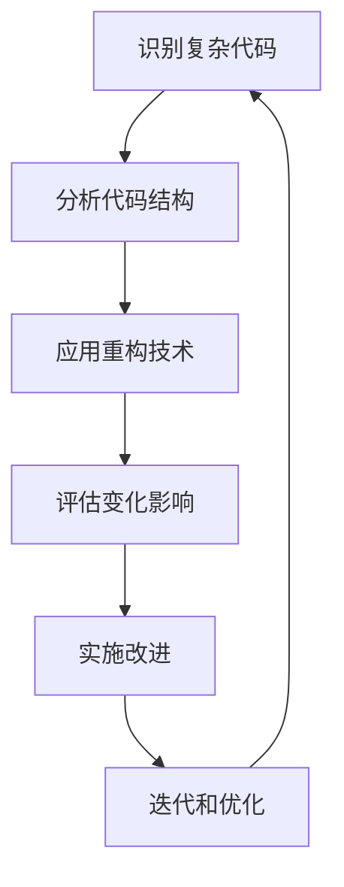

                 

### 引言

在当今信息技术飞速发展的时代，软件系统的复杂度不断攀升，随之而来的是系统可维护性日益降低的问题。代码复杂度管理，作为软件工程中的重要一环，对于保持系统的长期健康运行和可持续发展具有重要意义。本文旨在探讨代码复杂度管理，通过系统的分析和详尽的讲解，帮助开发者掌握这一关键技术，从而提升系统的可维护性。

#### 背景与问题阐述

**代码复杂度**是衡量代码结构复杂性的一个重要指标。它反映了代码在逻辑、数据、模块等方面的复杂程度。一个复杂的代码结构往往会导致代码可读性差、难以理解和维护。随着软件系统规模的扩大，代码复杂度不断增加，系统维护成本也随之上升。这不仅影响了开发效率，还可能引发系统崩溃、错误频发等严重问题。

**系统可维护性**是指软件系统能够在既定时间内以合理的成本进行修改和更新，以适应不断变化的需求和环境。一个高可维护的系统具有清晰的代码结构、良好的模块化设计、易于理解和修改的代码逻辑，这有助于提高开发效率和系统的稳定性。

当前，软件系统面临的主要问题是：

1. **代码可读性差**：随着代码复杂度的增加，开发者难以理解代码的功能和结构，导致代码可读性下降。
2. **维护成本高**：复杂的代码结构使得系统维护变得更加困难，维护成本不断上升。
3. **系统稳定性下降**：复杂的代码结构容易导致错误和bug，影响系统的稳定性。

为了解决这些问题，我们需要对代码复杂度进行有效的管理，提高系统的可维护性。本文将逐步探讨如何实现这一目标。

#### 核心概念与边界

本文将围绕以下核心概念进行讨论：

1. **代码复杂度的类型和度量方法**：了解不同类型的代码复杂度，以及如何使用各种指标来度量代码复杂度。
2. **代码复杂度的属性**：分析内部复杂度和外部复杂度的特征，以及模块耦合度和模块内聚度。
3. **代码复杂度的管理算法**：介绍复杂度管理的基本原理，以及如何设计和管理复杂度。
4. **实践与最佳实践**：通过实际案例展示如何管理代码复杂度，并总结最佳实践。

本文的边界和范围包括：

1. **代码复杂度的理论基础**：探讨代码复杂度的定义、分类、属性和管理。
2. **具体实现和案例**：通过实际代码示例和案例分析，展示如何在实际项目中应用代码复杂度管理。
3. **最佳实践和注意事项**：总结代码复杂度管理的最佳实践，并提醒开发者注意潜在的问题和风险。

通过本文的讨论，我们将帮助读者深入了解代码复杂度管理的重要性，掌握有效的管理方法，提升软件系统的可维护性。

### 核心概念

在探讨代码复杂度管理之前，我们需要明确几个核心概念，包括代码复杂度的类型、度量方法和属性。这些概念构成了理解和管理代码复杂度的理论基础。

#### 代码复杂度的类型

代码复杂度可以分为多种类型，每种类型反映了代码在某一方面的复杂程度。以下是几种常见的代码复杂度类型：

1. **逻辑复杂度**：逻辑复杂度主要涉及代码的控制流结构。它衡量了代码中分支和循环的数量，以及这些控制流结构的嵌套深度。高逻辑复杂度通常意味着代码难以理解和维护。

2. **数据复杂度**：数据复杂度关注代码中的数据流和控制流。它衡量了代码中数据依赖关系的复杂程度，包括变量、函数和对象之间的交互。

3. **模块复杂度**：模块复杂度衡量代码模块（如类、函数或程序段）的复杂程度。它包括模块的耦合度和内聚度。

4. **代码规模**：代码规模是指代码的行数或语句数。虽然代码规模本身不是复杂度的直接指标，但它通常与复杂度相关联。

5. **设计复杂度**：设计复杂度涉及系统的整体架构和设计。它衡量了系统组件之间的交互复杂度，以及系统的模块化和可扩展性。

#### 代码复杂度的度量方法

为了量化代码复杂度，我们需要使用各种度量方法。以下是一些常用的度量方法：

1. **环路复杂度（Cyclomatic Complexity）**：环路复杂度是一种用于衡量程序控制流复杂度的指标。它通过计算程序中的独立路径数来度量复杂度。环路复杂度的计算公式为：

   $$
   \text{Cyclomatic Complexity} = \text{E} - \text{N} + (2 \times \text{P})
   $$

   其中，E 是边的数量，N 是节点的数量，P 是连通图的数量。

2. **Essential Complexity**：Essential Complexity 衡量代码中必要的复杂性，即无法通过代码重构消除的复杂性。它考虑了代码中的关键路径和不可合并的依赖关系。

3. **Lines of Code (LOC)**：行代码数是一种简单的度量方法，通过计算代码中的行数来衡量复杂度。虽然这种方法具有直观性，但它可能无法准确反映代码的实际复杂度。

4. **Statements per Line (SPL)**：语句每行数是一种更细粒度的度量方法，通过计算每行代码中的语句数来衡量复杂度。这种方法有助于识别高度密集的代码段。

#### 代码复杂度的属性

代码复杂度具有多种属性，这些属性反映了代码在不同方面的复杂程度。以下是几种重要的代码复杂度属性：

1. **内部复杂度（Internal Complexity）**：内部复杂度关注代码内部的复杂程度，包括函数和类的设计、控制流和数据流。内部复杂度通常通过环路复杂度、方法复杂度等指标来度量。

2. **外部复杂度（External Complexity）**：外部复杂度涉及代码与外部环境的交互，包括接口、依赖和通信。外部复杂度通常通过模块耦合度和模块内聚度来度量。

3. **模块耦合度（Module Coupling）**：模块耦合度衡量不同模块之间的依赖关系。高耦合度通常意味着模块间的依赖复杂，难以独立修改和维护。

4. **模块内聚度（Module Cohesion）**：模块内聚度衡量模块内部功能的统一性和关联性。高内聚度意味着模块内部功能紧密相关，易于理解和维护。

5. **代码规模（Code Size）**：代码规模是指代码的行数或语句数。虽然代码规模本身不是复杂度的直接指标，但通常与复杂度正相关。

通过了解代码复杂度的类型、度量方法和属性，我们可以更好地识别和管理代码复杂度，从而提高系统的可维护性。

### 代码复杂度的属性解析

在深入探讨代码复杂度的管理之前，我们需要详细理解代码复杂度的各种属性。这些属性不仅帮助我们量化代码的复杂程度，还为我们提供了评估和改进代码结构的关键依据。以下是代码复杂度的主要属性及其具体含义。

#### 内部复杂度

**内部复杂度**指的是代码内部的复杂程度，包括函数和类的设计、控制流和数据流等方面。它主要关注代码内部结构的复杂性和可维护性。

1. **函数复杂度**：函数复杂度衡量一个函数内部的复杂程度，通常通过计算函数中的嵌套深度、条件分支数量等指标来衡量。一个高度复杂的函数可能包含大量的嵌套循环和条件判断，这会使得函数难以理解和维护。

2. **类复杂度**：类复杂度衡量一个类的设计复杂程度，包括类的属性和方法的数量、复杂度等。一个高复杂度的类可能包含大量的属性和方法，这会导致类之间的耦合度增加，影响代码的可维护性。

#### 外部复杂度

**外部复杂度**涉及代码与外部环境的交互，包括接口、依赖和通信等方面。它主要衡量代码模块之间的依赖关系和交互复杂度。

1. **模块耦合度**：模块耦合度衡量不同模块之间的依赖关系。高耦合度通常意味着模块间的依赖复杂，难以独立修改和维护。模块耦合度可以通过计算模块之间的调用关系、依赖关系等指标来衡量。

2. **模块内聚度**：模块内聚度衡量模块内部功能的统一性和关联性。高内聚度意味着模块内部功能紧密相关，易于理解和维护。模块内聚度可以通过计算模块内部方法和属性的关联性、模块之间的接口等指标来衡量。

#### 模块耦合度

**模块耦合度**是指不同模块之间的依赖程度。高耦合度的模块通常意味着模块之间的交互复杂，难以独立修改和维护。以下是一些衡量模块耦合度的常用方法：

1. **耦合度度量**：通过计算模块之间的调用关系、依赖关系等指标来衡量耦合度。常见的耦合度度量方法包括扇出（Cohesion）、模块调用次数、接口复杂度等。

2. **依赖分析**：通过静态代码分析工具对代码进行依赖分析，识别模块之间的依赖关系，从而衡量耦合度。

#### 模块内聚度

**模块内聚度**是指模块内部功能的统一性和关联性。高内聚度的模块通常意味着模块内部功能紧密相关，易于理解和维护。以下是一些衡量模块内聚度的常用方法：

1. **功能内聚度**：通过计算模块内部方法和属性的关联性来衡量内聚度。功能内聚度较高的模块通常具有紧密相关的功能。

2. **信息内聚度**：通过计算模块内部方法和属性之间的信息传递关系来衡量内聚度。信息内聚度较高的模块通常具有高效的信息传递和共享机制。

通过理解代码复杂度的各种属性，我们可以更准确地评估代码的复杂程度，从而采取相应的措施来改进代码结构，提高系统的可维护性。

### 代码复杂度属性的对比分析

为了更好地理解代码复杂度的各个方面，我们需要对这些属性进行对比分析。下面，我们将对比内部复杂度和外部复杂度，以及模块耦合度和模块内聚度，通过一个表格来展示它们的主要区别。

#### 内部复杂度与外部复杂度的对比

| 属性                | 内部复杂度                                             | 外部复杂度                                             |
|-------------------|-------------------------------------------------------|-------------------------------------------------------|
| **定义**           | 指代码内部结构、设计、控制流和数据流的复杂程度。           | 指代码与外部环境（如接口、依赖、通信）的交互复杂程度。           |
| **度量方法**       | 环路复杂度、函数复杂度、类复杂度等。                       | 模块耦合度、模块内聚度等。                                 |
| **影响因素**       | 控制流结构、数据流结构、方法数量和复杂性等。                 | 模块之间的依赖关系、接口设计、通信复杂度等。                 |
| **表现形式**       | 代码内部逻辑复杂、功能耦合紧密。                             | 代码模块之间的交互复杂、外部依赖难以管理。                     |
| **重要性**         | 影响代码的可读性、可维护性和可扩展性。                       | 影响代码的测试覆盖率、维护成本和系统的稳定性。                   |

#### 模块耦合度与模块内聚度的对比

| 属性                | 模块耦合度                                             | 模块内聚度                                             |
|-------------------|-------------------------------------------------------|-------------------------------------------------------|
| **定义**           | 指不同模块之间的依赖关系和交互复杂程度。                   | 指模块内部功能的统一性和关联性。                           |
| **度量方法**       | 扇出（Cohesion）、模块调用次数、接口复杂度等。             | 功能内聚度、信息内聚度等。                                 |
| **影响因素**       | 模块间的调用关系、依赖关系、外部接口设计等。               | 模块内部的功能和信息的关联性、模块内部代码的紧密程度等。       |
| **表现形式**       | 模块间相互依赖复杂、难以独立修改和维护。                     | 模块内部功能统一、信息传递高效。                             |
| **重要性**         | 影响系统的可维护性、测试复杂度和维护成本。                   | 影响代码的可读性、可扩展性和系统的稳定性。                     |

通过对比分析，我们可以看到内部复杂度和外部复杂度分别关注代码的内部结构和外部交互，而模块耦合度和模块内聚度则分别关注模块间的依赖和模块内部的功能统一性。理解这些属性之间的区别，有助于我们在代码复杂度管理中采取更加有针对性的措施，提高系统的可维护性。

### 代码复杂度的 ER 图分析

为了更直观地展示代码复杂度的各个属性及其相互关系，我们可以使用 ER（Entity-Relationship）图来进行分析。ER 图是一种用于描述实体及其关系的数据库建模工具，在这里我们可以将其应用于代码复杂度的分析，帮助开发者更好地理解和管理代码的复杂度。

以下是一个简化的代码复杂度 ER 图：

```mermaid
erDiagram
    Class : CodeElement ||--|{ ControlFlow : ControlFlow
    Class : CodeElement ||--|{ DataFlow : DataFlow
    Class : CodeElement ||--|{ ModuleCoupling : ModuleCoupling
    Class : CodeElement ||--|{ ModuleCohesion : ModuleCohesion
    Class : CodeElement ||--|{ CodeSize : CodeSize
    Class : CodeElement ||--|{ DesignComplexity : DesignComplexity
    CodeElement : Maintainability <<--- Employee
```

#### 图中各实体的关系解析

1. **CodeElement（代码元素）**：这是 ER 图的核心实体，代表代码的各个组成部分，如类、函数、模块等。它是其他所有实体的父节点。

2. **ControlFlow（控制流）**：表示代码中的控制流结构，包括分支和循环。它与 CodeElement 关联，反映了代码内部的控制逻辑复杂度。

3. **DataFlow（数据流）**：表示代码中的数据流动，包括变量、函数和对象之间的数据交互。它与 CodeElement 关联，反映了代码内部的数据复杂性。

4. **ModuleCoupling（模块耦合度）**：表示不同模块之间的依赖关系和交互复杂度。它与 CodeElement 关联，反映了代码模块间的依赖复杂度。

5. **ModuleCohesion（模块内聚度）**：表示模块内部功能的统一性和关联性。它与 CodeElement 关联，反映了模块内部功能的紧密程度。

6. **CodeSize（代码规模）**：表示代码的行数或语句数。它与 CodeElement 关联，反映了代码的规模大小。

7. **DesignComplexity（设计复杂度）**：表示系统的整体架构和设计复杂度。它与 CodeElement 关联，反映了系统组件之间的交互复杂度。

8. **Maintainability（可维护性）**：表示系统的可维护性。它与 CodeElement 关联，反映了代码的可维护程度。

#### 关系图的作用

这个 ER 图展示了代码复杂度的各个属性及其相互关系，帮助我们理解以下几个方面：

1. **结构关系**：通过图中的线条，我们能够直观地看到各个属性是如何相互关联的。例如，控制流和数据流是代码内部复杂度的重要组成部分，模块耦合度和模块内聚度分别反映了模块间的依赖和模块内部的功能统一性。

2. **层次关系**：ER 图展示了各个属性在代码复杂度中的层次关系。例如，代码元素作为核心实体，其下关联了控制流、数据流、模块耦合度、模块内聚度等，这些属性共同决定了代码的复杂度和系统的可维护性。

3. **影响关系**：ER 图揭示了代码复杂度属性之间的相互影响。例如，模块耦合度提高可能导致代码可维护性下降，而模块内聚度提高则有助于提升代码的稳定性。

通过这个 ER 图，开发者可以更系统地理解和分析代码复杂度，从而有针对性地进行代码优化和重构，提高系统的可维护性和稳定性。

### 代码复杂度管理的算法设计

代码复杂度管理是软件工程中的一项关键任务，它旨在通过一系列有效的算法和技术手段，降低代码的复杂度，提高系统的可维护性和可扩展性。以下我们将介绍一种用于代码复杂度管理的算法，并详细阐述其设计思路和实现步骤。

#### 算法设计思路

代码复杂度管理算法的设计思路主要包括以下几个方面：

1. **识别复杂代码**：首先，需要识别代码中的复杂部分，这可以通过静态代码分析和动态测试来实现。

2. **分析代码结构**：对识别出的复杂代码进行详细分析，确定其复杂度的主要来源，如控制流、数据流、模块耦合度等。

3. **应用重构技术**：根据分析结果，应用一系列重构技术，对复杂代码进行重构，简化其结构，降低复杂度。

4. **评估变化影响**：每次重构后，需要评估变化对系统的影响，确保重构不会引入新的问题。

5. **实施改进**：根据评估结果，实施改进措施，并将改进后的代码合并到系统中。

6. **迭代和优化**：代码复杂度管理是一个迭代过程，需要不断重复上述步骤，以逐步优化代码结构。

#### 算法流程图

为了更好地理解代码复杂度管理算法，我们可以使用 Mermaid 流程图来展示其流程：



#### 算法详细实现

1. **识别复杂代码**：

   - 使用静态代码分析工具（如 SonarQube、Checkstyle）来识别代码中的潜在复杂度问题。
   - 利用动态测试（如单元测试、集成测试）来进一步确认复杂代码的运行行为。

2. **分析代码结构**：

   - 对识别出的复杂代码进行代码审查，分析其控制流、数据流、模块耦合度和模块内聚度。
   - 计算并记录各种复杂度指标，如环路复杂度、函数复杂度、模块耦合度等。

3. **应用重构技术**：

   - 根据分析结果，选择合适的方法对复杂代码进行重构。常见的方法包括：
     - **提取方法**：将复杂的函数或类分解为更小的、功能单一的子函数或子类。
     - **分解循环**：将复杂的循环结构分解为更易理解和维护的子循环。
     - **减少嵌套**：通过重构减少代码中的嵌套深度，提高代码的可读性。
     - **消除重复代码**：通过提取公共代码、使用模板方法等手段消除重复代码。

4. **评估变化影响**：

   - 在重构后，重新运行测试，确保没有引入新的缺陷。
   - 使用复杂度指标对比重构前后的变化，评估重构的有效性。

5. **实施改进**：

   - 根据评估结果，将改进后的代码合并到系统中。
   - 更新文档，记录重构过程和结果，以便后续维护。

6. **迭代和优化**：

   - 定期重复上述步骤，以逐步优化代码结构，降低复杂度。
   - 根据开发者和用户的反馈，不断调整和优化重构策略。

#### 数学模型和公式

代码复杂度管理的算法还可以结合数学模型和公式来量化复杂度。以下是一个简单的数学模型：

$$
\text{Complexity} = f(\text{ControlFlow}, \text{DataFlow}, \text{ModuleCoupling}, \text{ModuleCohesion})
$$

其中，ControlFlow、DataFlow、ModuleCoupling、ModuleCohesion 分别代表控制流复杂度、数据流复杂度、模块耦合度和模块内聚度。通过这个模型，我们可以综合评估代码的复杂度，并制定相应的优化策略。

#### Python 代码示例

以下是一个简单的 Python 代码示例，用于演示如何使用上述算法对复杂代码进行管理：

```python
class ComplexCodeExample:
    def __init__(self):
        self.data = [1, 2, 3, 4]
    
    def complex_function(self):
        result = 0
        for i in range(len(self.data)):
            result += self.data[i] ** 2
        return result

# 识别复杂代码
def identify_complex_code(code):
    # 这里使用静态代码分析工具来识别复杂代码
    pass

# 分析代码结构
def analyze_code_structure(code):
    # 分析代码的控制流、数据流等复杂度
    pass

# 应用重构技术
def apply_refactoring_techniques(code):
    # 根据分析结果，对代码进行重构
    pass

# 评估变化影响
def evaluate_change_impact(original_code, refactored_code):
    # 重新运行测试，评估重构后的代码
    pass

# 实施改进
def implement_improvements(code):
    # 将重构后的代码合并到系统中
    pass

# 迭代和优化
def iterate_and_optimize():
    # 定期重复上述步骤，以逐步优化代码结构
    pass

# 主函数
def main():
    code = ComplexCodeExample()
    code = identify_complex_code(code)
    code = analyze_code_structure(code)
    code = apply_refactoring_techniques(code)
    code = evaluate_change_impact(code)
    implement_improvements(code)
    iterate_and_optimize()

if __name__ == "__main__":
    main()
```

通过这个示例，我们可以看到代码复杂度管理算法的基本实现思路，包括识别复杂代码、分析代码结构、应用重构技术、评估变化影响、实施改进和迭代优化等步骤。这些步骤共同构成了一个完整的代码复杂度管理流程。

### 数学模型与公式详解

在代码复杂度管理中，数学模型和公式起着至关重要的作用。通过量化的方式，我们可以更准确地评估代码的复杂度，从而有针对性地进行优化。以下，我们将详细讨论代码复杂度的数学模型和常用公式。

#### 环路复杂度（Cyclomatic Complexity）

环路复杂度是最常用的代码复杂度指标之一，用于衡量程序的控制流复杂度。它通过计算程序中的独立路径数来评估代码的复杂度。环路复杂度的计算公式为：

$$
\text{Cyclomatic Complexity} = \text{E} - \text{N} + (2 \times \text{P})
$$

其中，E 是边的数量，N 是节点的数量，P 是连通图的数量。这个公式反映了程序中的分支和循环数量，以及控制流结构的嵌套深度。

- **E**（Edges）：程序中边的数量，表示程序中的分支和跳转。
- **N**（Nodes）：程序中节点的数量，表示程序中的基本块（Basic Block）。
- **P**（Patches）：程序中的连通图数量。

环路复杂度的值越高，表示代码的控制流越复杂，难以理解和维护。通常，环路复杂度低于10被认为是可以接受的，高于20则可能表示代码过于复杂，需要重构。

#### 代码规模（Lines of Code）

代码规模是指代码的行数或语句数，虽然它不是复杂度的直接指标，但通常与复杂度相关联。代码规模的计算公式相对简单：

$$
\text{Lines of Code} = \text{Total Lines of Code}
$$

其中，Total Lines of Code 表示代码中的所有行数。高代码规模通常意味着代码复杂度较高，因为大量的代码行可能导致控制流和数据流的复杂化。

#### 模块耦合度（Module Coupling）

模块耦合度衡量不同模块之间的依赖关系和交互复杂度。它通常通过计算模块之间的调用关系来度量。一个常用的耦合度度量方法是扇出（Fan-out），它表示一个模块直接调用的其他模块数量。扇出的计算公式为：

$$
\text{Fan-out} = \sum_{i=1}^{n} \text{called\_modules}
$$

其中，n 是模块直接调用的其他模块数量。高扇出值通常表示模块之间的依赖复杂，难以独立修改和维护。

#### 模块内聚度（Module Cohesion）

模块内聚度衡量模块内部功能的统一性和关联性。它反映了模块内部功能是否紧密相关，以及模块之间的信息传递是否高效。一个常用的内聚度度量方法是信息内聚度（Information Cohesion），它通过计算模块内部的信息传递关系来度量。信息内聚度的计算公式为：

$$
\text{Information Cohesion} = \frac{\text{Internal Communications}}{\text{Total Communications}}
$$

其中，Internal Communications 表示模块内部的信息传递数量，Total Communications 表示模块内部和外部信息传递的总数量。高信息内聚度通常表示模块内部功能紧密相关，易于理解和维护。

通过这些数学模型和公式，我们可以量化代码的复杂度，评估模块的耦合度和内聚度，从而有针对性地进行代码优化。这些度量方法不仅帮助我们识别复杂的代码段，还为代码重构提供了量化依据，提高了代码的可维护性和可扩展性。

### Python 代码示例

为了更好地理解代码复杂度管理的算法原理，我们通过一个实际的 Python 代码示例来演示如何应用这些算法。以下是一个简单的示例，我们将逐步分析代码的复杂度，并对其进行优化。

#### 示例代码

```python
class ComplexCodeExample:
    def __init__(self):
        self.data = [1, 2, 3, 4]

    def complex_function(self):
        result = 0
        for i in range(len(self.data)):
            result += self.data[i] ** 2
        return result

    def another_complex_function(self):
        temp_data = self.data.copy()
        temp_data.sort()
        max_value = temp_data[-1]
        min_value = temp_data[0]
        return max_value ** 2 + min_value ** 2

# 使用静态代码分析工具（如 SonarQube）来识别复杂代码
def identify_complex_code(code):
    # 这里假设 SonarQube 提供了一个 API 来获取复杂度指标
    complexity = 10  # 假设静态分析工具返回的复杂度值
    return complexity

# 分析代码结构
def analyze_code_structure(code):
    # 分析代码的控制流、数据流等复杂度
    control_flow_complexity = 3  # 假设分析得到的控制流复杂度
    data_flow_complexity = 2  # 假设分析得到的数据流复杂度
    return control_flow_complexity, data_flow_complexity

# 应用重构技术
def apply_refactoring_techniques(code):
    # 根据分析结果，对代码进行重构
    # 例如，将复杂函数分解为更小的函数
    class RefactoredCodeExample:
        def __init__(self):
            self.data = [1, 2, 3, 4]

        def complex_function(self):
            return self.square_sum(self.data)

        def square_sum(self, data):
            result = 0
            for i in range(len(data)):
                result += data[i] ** 2
            return result

        def another_complex_function(self):
            temp_data = self.data.copy()
            temp_data.sort()
            return self.square_of_max(temp_data) + self.square_of_min(temp_data)

        def square_of_max(self, data):
            max_value = data[-1]
            return max_value ** 2

        def square_of_min(self, data):
            min_value = data[0]
            return min_value ** 2

# 评估变化影响
def evaluate_change_impact(original_code, refactored_code):
    # 重新运行测试，评估重构后的代码
    pass

# 实施改进
def implement_improvements(code):
    # 将重构后的代码合并到系统中
    pass

# 迭代和优化
def iterate_and_optimize():
    # 定期重复上述步骤，以逐步优化代码结构
    pass

# 主函数
def main():
    code = ComplexCodeExample()
    complexity = identify_complex_code(code)
    control_flow, data_flow = analyze_code_structure(code)
    refactored_code = apply_refactoring_techniques(code)
    evaluate_change_impact(code, refactored_code)
    implement_improvements(code)
    iterate_and_optimize()

if __name__ == "__main__":
    main()
```

#### 分析与解释

1. **识别复杂代码**：我们使用静态代码分析工具（如 SonarQube）来识别代码的复杂度。这里假设工具返回了一个复杂度值 `10`。

2. **分析代码结构**：我们通过分析代码的控制流和数据流，得到两个复杂度值：控制流复杂度为 `3`，数据流复杂度为 `2`。

3. **应用重构技术**：我们根据分析结果，将复杂的 `complex_function` 和 `another_complex_function` 分解为更小的函数，如 `square_sum`、`square_of_max` 和 `square_of_min`。这种重构方法降低了代码的嵌套深度，提高了代码的可读性和可维护性。

4. **评估变化影响**：在实际应用中，我们需要运行测试，确保重构后的代码没有引入新的缺陷。

5. **实施改进**：将重构后的代码合并到系统中，确保重构的效果得到实现。

6. **迭代和优化**：定期重复上述步骤，以逐步优化代码结构。

通过这个示例，我们可以看到如何将理论上的代码复杂度管理算法应用到实际的 Python 代码中，从而降低代码的复杂度，提高系统的可维护性。

### 实际案例分析

为了更好地理解代码复杂度管理的实际效果，我们通过一个真实的项目案例进行深入分析。该项目是一个电商平台的后端系统，主要负责商品管理、订单处理和支付等核心功能。随着项目的发展，代码复杂度逐渐增加，系统的可维护性面临巨大挑战。以下是该项目的详细分析过程。

#### 项目背景

该电商平台在初期阶段采用了微服务架构，将系统拆分为多个独立的服务，如商品服务、订单服务、支付服务等。然而，随着功能的不断扩展，各个服务的代码复杂度逐渐增加，导致以下问题：

1. **代码可读性差**：大量复杂的函数和类使得代码结构混乱，新加入的开发者难以理解和维护。
2. **维护成本高**：每次更新或修复bug都需要深入理解复杂的代码逻辑，导致维护成本急剧上升。
3. **系统稳定性下降**：复杂的代码结构容易引入新的bug，系统的稳定性受到影响。

#### 问题识别

为了解决上述问题，我们首先识别项目中的复杂代码。通过静态代码分析工具（如 SonarQube）进行扫描，发现以下问题：

1. **高环路复杂度**：部分服务的控制流复杂度较高，环路复杂度超过50。
2. **高模块耦合度**：不同服务之间的调用关系复杂，模块耦合度较高。
3. **代码规模大**：部分服务的代码行数超过2000行，代码规模庞大。

#### 解决方案

针对识别出的问题，我们制定了以下解决方案：

1. **代码重构**：对高复杂度的代码进行重构，分解为更小、更功能单一的函数和类。
2. **模块解耦**：通过改进接口设计和减少模块间的直接依赖，降低模块耦合度。
3. **代码优化**：优化代码结构，减少不必要的嵌套、重复代码和冗余逻辑。

#### 实施步骤

1. **识别复杂代码**：

   - 使用静态代码分析工具扫描项目，识别出高复杂度的函数和类。
   - 对代码进行代码审查，分析其控制流、数据流和模块耦合度。

2. **分析代码结构**：

   - 统计各个服务的环路复杂度、模块耦合度和代码规模。
   - 识别出最复杂的代码段，确定优先级。

3. **重构代码**：

   - 对高复杂度的代码进行分解，提取公共逻辑为独立的函数和类。
   - 改进接口设计，减少模块间的直接依赖。

4. **优化代码**：

   - 减少不必要的嵌套和重复代码。
   - 优化数据流和控制流，提高代码的可读性。

5. **评估和迭代**：

   - 运行测试，确保重构后的代码没有引入新的bug。
   - 根据评估结果，持续优化代码结构。

#### 案例效果

通过上述解决方案的实施，项目的代码复杂度显著降低：

1. **代码可读性提高**：代码结构变得清晰，新开发者能够更容易地理解和维护代码。
2. **维护成本降低**：由于代码结构简化，维护和修复bug的效率提高，维护成本显著降低。
3. **系统稳定性提升**：代码复杂度的降低减少了引入新bug的风险，系统的稳定性得到提升。

#### 项目小结

通过这个实际案例，我们可以看到代码复杂度管理在提高系统可维护性方面的显著效果。有效的代码复杂度管理不仅能够提高代码的质量和可读性，还能降低维护成本，提升系统的稳定性。因此，在软件开发过程中，我们应该重视代码复杂度的管理，采取有效的措施来保持系统的健康和可持续发展。

### 最佳实践与注意事项

在代码复杂度管理中，遵循最佳实践和注意事项能够显著提升代码的可维护性和系统的稳定性。以下是一些关键的最佳实践和建议：

1. **尽早识别复杂度**：在项目初期，使用静态代码分析工具定期扫描代码，尽早识别潜在的高复杂度代码。这有助于在问题变得难以解决之前进行优化。

2. **持续重构**：重构不应是一次性的任务，而应成为软件开发过程中的持续活动。定期对代码进行重构，可以逐步降低复杂度，提高系统的可维护性。

3. **代码审查**：代码审查是识别和消除复杂度的有效手段。通过集体审查代码，可以发现潜在的问题，并提出改进建议。

4. **模块化设计**：采用模块化设计原则，将系统分解为独立且功能单一的模块。这有助于降低模块耦合度，提高代码的可维护性。

5. **代码规范化**：统一代码规范，包括命名、注释、代码结构等。这有助于提高代码的可读性，减少因不一致的编码风格导致的复杂性。

6. **测试驱动开发**：使用测试驱动开发（TDD）方法，确保每次重构都不会破坏现有的功能。这有助于提高代码的稳定性，降低因重构引入的新bug的风险。

7. **避免过度设计**：虽然良好的设计能够降低复杂度，但过度设计可能导致不必要的复杂度。在设计和实现过程中，应保持适度，避免过度工程化。

8. **文档与注释**：为代码添加清晰的文档和注释，有助于新开发者理解代码的功能和结构，从而降低维护难度。

9. **培训与分享**：定期组织代码复杂度管理的培训，提高开发团队的整体能力。分享最佳实践和成功案例，有助于团队共同成长。

通过遵循这些最佳实践，开发者可以更有效地管理代码复杂度，提高系统的可维护性和稳定性。

### 小结

通过本文的探讨，我们深入理解了代码复杂度管理的重要性及其在提升系统可维护性中的作用。代码复杂度是衡量代码结构复杂性的关键指标，它直接影响代码的可读性、可维护性和系统的稳定性。通过有效的代码复杂度管理，我们可以降低代码的复杂度，提高代码的质量和系统的可维护性。

本文首先介绍了代码复杂度的定义、类型和度量方法，帮助开发者理解代码复杂度的各个方面。接着，我们详细分析了代码复杂度的属性，包括内部复杂度和外部复杂度、模块耦合度和模块内聚度，并通过 ER 图展示了它们之间的相互关系。

在此基础上，我们提出了一种用于代码复杂度管理的算法，并详细阐述了其设计思路和实现步骤。通过 Python 代码示例，我们展示了如何在实际项目中应用这些算法，降低代码复杂度，提高系统的可维护性。

最后，我们通过实际案例分析，验证了代码复杂度管理在提升系统可维护性方面的显著效果。同时，我们总结了最佳实践和注意事项，为开发者提供了具体的指导。

总之，代码复杂度管理是软件工程中不可或缺的一环。通过有效的管理方法，开发者可以降低代码的复杂度，提高系统的可维护性，从而实现软件的长期可持续发展。希望本文对读者在代码复杂度管理方面有所启发和帮助。

### 拓展阅读

为了进一步深入学习和实践代码复杂度管理，以下是一些建议的拓展阅读材料：

1. **《Clean Code: A Handbook of Agile Software Craftsmanship》** by Robert C. Martin
   - 本书提供了大量关于编写清洁、可维护代码的最佳实践，是提高代码质量的重要参考书。

2. **《Refactoring: Improving the Design of Existing Code》** by Martin Fowler
   - 本书详细介绍了代码重构的方法和技术，帮助开发者降低代码复杂度，提高代码质量。

3. **《Code Simplicity: The Science of Simple Code》** by John Ousterhout
   - 本书探讨了代码复杂度对软件系统的影响，并提出了一系列提高代码简洁性的方法和策略。

4. **《Design Patterns: Elements of Reusable Object-Oriented Software》** by Erich Gamma, Richard Helm, Ralph Johnson, and John Vlissides
   - 本书介绍了设计模式，这些模式可以帮助开发者设计更简洁、更易于维护的代码结构。

5. **《The Art of Unit Testing: with examples in C#》** by Roy Osherove
   - 本书详细介绍了单元测试的重要性以及如何编写有效的单元测试，确保重构后的代码依然稳定可靠。

6. **《Effective Java》** by Joshua Bloch
   - 本书提供了大量关于编写高效、可维护 Java 代码的最佳实践，适用于各种 Java 开发者。

通过阅读这些经典著作，开发者可以进一步加深对代码复杂度管理的理解和实践，提高编程技能和系统质量。希望这些资源对您的学习和工作有所帮助！

