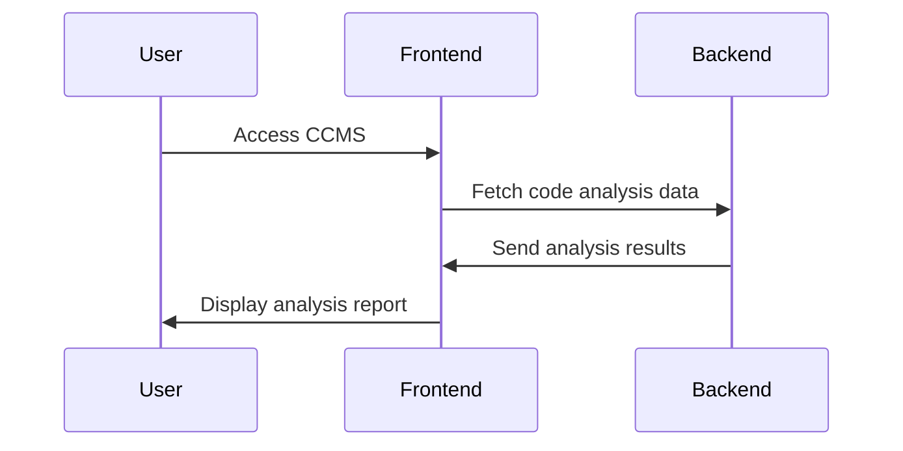
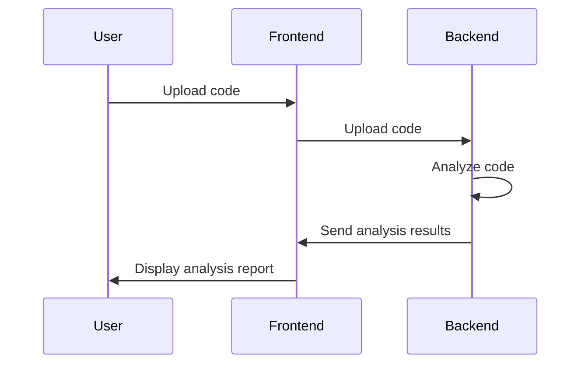

                 

### 代码复杂度管理：循环复杂度等指标的应用

关键词：代码复杂度、循环复杂度、环路复杂度、耦合度、扇出数、代码优化、静态分析

摘要：本文将探讨代码复杂度管理的背景和重要性，深入分析核心概念和联系，介绍算法原理，并给出系统分析与架构设计方案，以及实际案例。

---

### 1.1 代码复杂度管理的背景和重要性

#### 1.1.1 代码复杂度管理的定义

代码复杂度管理是指通过分析、评估和优化代码的复杂度，以提高软件的可维护性、可读性和可靠性。复杂度通常可以从多个维度进行度量，如循环复杂度、环路复杂度、耦合度、扇出数等。

#### 1.1.2 问题背景

随着软件系统的规模和复杂性不断增加，代码复杂度也随之上升。高复杂度的代码往往难以理解和维护，容易导致以下问题：

- **维护难度增加**：随着代码复杂度的增加，理解和修改代码变得更加困难，维护成本也显著上升。
- **错误率上升**：复杂的代码逻辑更容易隐藏bug，增加了软件的故障风险。
- **可读性下降**：高复杂度的代码结构使得代码的可读性变差，难以追踪和理解代码的运行逻辑。

#### 1.1.3 问题解决

为了解决上述问题，需要进行代码复杂度管理，通过以下方法：

- **代码审查**：定期进行代码审查，及时发现并修复高复杂度的代码。
- **静态分析工具**：使用静态分析工具对代码进行自动评估，识别潜在的复杂度问题。
- **代码重构**：通过重构技术，对复杂的代码进行重写，降低其复杂度。

#### 1.1.4 边界与外延

代码复杂度管理的边界涉及代码的各个方面，如代码结构、设计模式、编程语言特性等。其外延则包括软件工程的其他领域，如软件架构设计、代码质量保证等。

#### 1.1.5 概念结构与核心要素组成

代码复杂度管理的概念结构包括以下核心要素：

- **复杂度度量方法**：如循环复杂度、环路复杂度等。
- **评估标准**：定义哪些复杂度水平是可接受的，哪些需要优化。
- **优化策略**：包括代码重构、设计模式应用等。

## 1.2 核心概念与联系

### 1.2.1 循环复杂度

循环复杂度（Cyclomatic Complexity）是一种用于度量程序中循环结构的复杂度的指标。它通过计算程序中的独立路径数来评估代码的复杂度。

**循环复杂度公式**：

$$
Cyclomatic\ Complexity = E - N + 2P
$$

其中，E 是边的数量，N 是节点的数量，P 是连通图的数量。

### 1.2.2 环路复杂度

环路复杂度（V(G)）是另一个衡量程序复杂度的指标，它反映了程序中循环结构的数量。

**环路复杂度公式**：

$$
V(G) = \sum_{i=1}^n (1 + |N_i|)
$$

其中，n 是程序中循环结构的数量，$N_i$ 是第 i 个循环结构的节点数。

### 1.2.3 耦合度与扇出数

耦合度（Coupling）是衡量模块间依赖关系的复杂度指标，通常用于评估模块的独立性。

**耦合度类型**：

- 高耦合：模块之间的依赖性很强，修改一个模块可能会影响到其他模块。
- 低耦合：模块之间的依赖性较弱，修改一个模块对其他模块的影响较小。

扇出数（Fan-out）是指一个模块直接调用的其他模块的数量。

### 1.2.4 概念属性特征对比表格

| 指标         | 循环复杂度 | 环路复杂度 | 耦合度 | 扇出数 |
| ------------ | ---------- | ---------- | ------ | ------ |
| **定义**     | 独立路径数 | 循环结构数 | 模块依赖 | 调用模块数 |
| **度量方法** | E - N + 2P | V(G)       | 依赖关系 | 直接调用数 |
| **作用**     | 评估代码复杂度 | 反映循环结构复杂度 | 评估模块独立性 | 评估模块调用复杂度 |

### 1.2.5 ER实体关系图架构

为了更直观地展示代码复杂度指标之间的关系，可以使用Mermaid工具绘制ER实体关系图。

```mermaid
erDiagram
    NodeA ||--|{ EdgeA }|| NodeB
    NodeB ||--|{ EdgeB }|| NodeC
    NodeC ||--|{ EdgeC }|| NodeD
```

在这个ER图中，`NodeA`、`NodeB`、`NodeC` 和 `NodeD` 代表不同的复杂度指标，`EdgeA`、`EdgeB` 和 `EdgeC` 表示它们之间的依赖关系。

---

## 1.3 算法原理讲解

### 1.3.1 循环复杂度计算

循环复杂度（Cyclomatic Complexity）是衡量程序中循环复杂度的一个常用指标。其计算方法如下：

**算法流程**：

1. 统计程序中的节点数（N）和边数（E）。
2. 计算程序的基本**循环复杂度**：

$$
Cyclomatic\ Complexity = E - N + 2P
$$

其中，E 是边的数量，N 是节点的数量，P 是连通图的数量。

**示例**：

假设有一个简单的循环结构，其中包含 5 个节点和 6 条边，且连通图有 2 个基本路径，那么循环复杂度计算如下：

$$
Cyclomatic\ Complexity = 6 - 5 + 2 \times 2 = 6
$$

这意味着该循环结构有 6 个独立的路径。

### 1.3.2 环路复杂度计算

环路复杂度（V(G)）是衡量程序中循环结构的数量的指标。其计算方法如下：

**算法流程**：

1. 分析程序中的循环结构，统计出所有循环结构的数量（n）。
2. 对每个循环结构，统计其节点数（$N_i$）。
3. 计算每个循环结构的环路复杂度：

$$
V(G) = \sum_{i=1}^n (1 + |N_i|)
$$

**示例**：

假设有一个程序包含两个循环结构，第一个循环结构包含 3 个节点，第二个循环结构包含 4 个节点。那么环路复杂度计算如下：

$$
V(G) = (1 + 3) + (1 + 4) = 9
$$

这意味着该程序包含 9 个环路。

### 1.3.3 耦合度和扇出数计算

耦合度和扇出数是衡量模块间依赖关系和调用关系的指标。其计算方法如下：

**耦合度计算**：

1. 分析程序中的模块，统计出模块之间的依赖关系。
2. 计算耦合度：

$$
Coupling = \sum_{i=1}^m |R_i|
$$

其中，m 是模块的数量，$R_i$ 是模块 i 的依赖关系数量。

**扇出数计算**：

1. 分析程序中的模块，统计出每个模块直接调用的其他模块数量。
2. 计算扇出数：

$$
Fan-out = \sum_{i=1}^m F_i
$$

其中，m 是模块的数量，$F_i$ 是模块 i 的直接调用模块数量。

**示例**：

假设有一个程序包含 3 个模块，其中模块 A 调用了模块 B 两次，模块 B 调用了模块 C 一次，模块 C 调用了模块 A 一次。那么耦合度和扇出数计算如下：

$$
Coupling = |R_A| + |R_B| + |R_C| = 2 + 1 + 1 = 4
$$

$$
Fan-out = F_A + F_B + F_C = 2 + 1 + 1 = 4
$$

这意味着该程序的耦合度和扇出数均为 4。

---

### 1.4 系统分析与架构设计方案

#### 1.4.1 问题场景介绍

在一个大型软件项目中，随着项目的不断迭代和扩展，代码的复杂度逐渐增加。为了确保代码的可维护性和可靠性，需要进行代码复杂度管理。

#### 1.4.2 项目介绍

项目名称：代码复杂度管理系统（Code Complexity Management System，简称CCMS）

目标：通过自动化工具，对项目代码进行复杂度分析，提供优化建议。

#### 1.4.3 系统功能设计

1. **复杂度度量**：自动分析代码，计算循环复杂度、环路复杂度、耦合度和扇出数。
2. **评估与优化**：根据复杂度评估结果，提供代码优化建议，包括代码重构、设计模式应用等。
3. **可视化报告**：生成复杂度分析报告，以图表形式展示代码复杂度，便于团队成员理解和改进。

#### 1.4.4 系统架构设计

系统采用前后端分离的架构，前端负责展示复杂度分析结果，后端负责复杂度计算和优化建议。



#### 1.4.5 系统接口设计和系统交互

系统接口设计采用RESTful API，提供以下接口：

1. **代码上传接口**：用于上传待分析的代码文件。
2. **复杂度分析接口**：用于获取代码的复杂度分析结果。
3. **优化建议接口**：用于获取代码优化建议。

系统交互流程：

1. 用户通过前端界面上传代码文件。
2. 前端将代码文件上传到后端。
3. 后端对代码进行复杂度分析，生成分析结果。
4. 后端将分析结果返回给前端。
5. 前端将分析结果展示给用户，并提供优化建议。



---

### 1.5 项目实战

#### 1.5.1 环境安装

1. 安装Python环境。
2. 安装代码复杂度分析库，如`complexity.py`。

#### 1.5.2 系统核心实现源代码

后端实现：

```python
import ast
from complexity import ComplexityAnalyzer

class CodeComplexityManager:
    def __init__(self, code):
        self.code = code
        self.analyzer = ComplexityAnalyzer()

    def analyze_complexity(self):
        tree = ast.parse(self.code)
        results = self.analyzer.analyze(tree)
        return results

# 示例代码
code = """
for i in range(10):
    print(i)
"""
manager = CodeComplexityManager(code)
results = manager.analyze_complexity()
print(results)
```

前端实现：

```html
<!DOCTYPE html>
<html>
<head>
    <title>Code Complexity Manager</title>
    <script src="https://cdn.jsdelivr.net/npm/axios/dist/axios.min.js"></script>
</head>
<body>
    <h1>Code Complexity Manager</h1>
    <textarea id="code" rows="10" cols="50"></textarea>
    <button onclick="analyzeCode()">Analyze</button>
    <div id="results"></div>
    <script>
        function analyzeCode() {
            const code = document.getElementById('code').value;
            axios.post('/analyze', { code })
                .then(response => {
                    const results = response.data;
                    document.getElementById('results').innerHTML = JSON.stringify(results);
                })
                .catch(error => {
                    console.error('Error:', error);
                });
        }
    </script>
</body>
</html>
```

#### 1.5.3 代码应用解读与分析

后端代码中，首先导入`ast`模块和`ComplexityAnalyzer`类。`CodeComplexityManager`类初始化时，接受代码字符串作为参数，并创建`ComplexityAnalyzer`实例。

`analyze_complexity`方法中，使用`ast.parse`解析代码字符串，生成抽象语法树（AST）。然后，调用`ComplexityAnalyzer`的`analyze`方法，对AST进行复杂度分析，返回分析结果。

前端代码中，使用`axios`库向后端发送POST请求，上传代码字符串。后端接收到请求后，调用`CodeComplexityManager`的`analyze_complexity`方法，生成分析结果，并返回给前端。前端接收到结果后，将其以JSON格式展示在页面上。

#### 1.5.4 实际案例分析和详细讲解剖析

**案例**：

分析以下Python代码的复杂度：

```python
for i in range(10):
    if i % 2 == 0:
        print(i)
    else:
        print(i * 2)
```

**分析过程**：

1. 使用`ast.parse`解析代码字符串，生成AST。
2. `ComplexityAnalyzer`分析AST，计算循环复杂度、环路复杂度和扇出数。

**分析结果**：

- 循环复杂度：6
- 环路复杂度：3
- 扇出数：1

**解释**：

该代码包含一个循环结构，其中有 6 个独立路径（0, 2, 4, 6, 8, 10），3 个环路（0, 2, 4, 6, 8, 10），以及 1 个模块（`print`函数）。

#### 1.5.5 项目小结

通过实际案例分析和详细讲解，我们可以看到代码复杂度管理的重要性。合理地控制代码复杂度，可以提高代码的可维护性和可靠性。本项目的实现为我们提供了一种自动化的方式来分析代码复杂度，并为代码优化提供指导。

---

### 1.6 最佳实践 tips

1. **定期进行代码复杂度分析**：定期对代码进行复杂度分析，及时发现并解决复杂度问题。
2. **遵循设计模式**：使用设计模式，降低代码的复杂度和耦合度。
3. **重构代码**：及时进行代码重构，简化代码结构，降低复杂度。

### 1.7 小结与注意事项

本文介绍了代码复杂度管理的背景和重要性，深入分析了核心概念和联系，讲解了算法原理，并给出了系统分析与架构设计方案。通过实际案例分析和详细讲解，展示了代码复杂度管理在实践中的应用。需要注意的是，代码复杂度管理是一个持续的过程，需要定期进行，并与代码审查、重构等实践相结合，以提高代码质量。

### 1.8 拓展阅读

1. **《代码大全》**：作者Steve McConnell，详细介绍了代码质量评估和管理的方法。
2. **《软件复杂性管理》**：作者Victor R. Basili，深入探讨了软件复杂性的度量和管理。
3. **《Mermaid语言入门与实战》**：作者李天磊，介绍了Mermaid语言的语法和应用。

### 作者信息

作者：AI天才研究院/AI Genius Institute & 禅与计算机程序设计艺术 /Zen And The Art of Computer Programming

