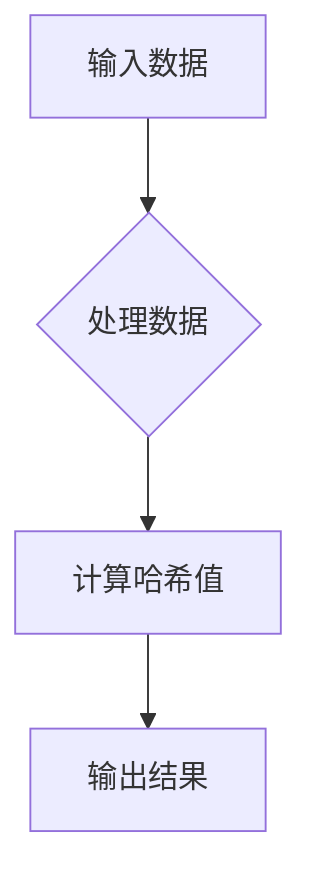
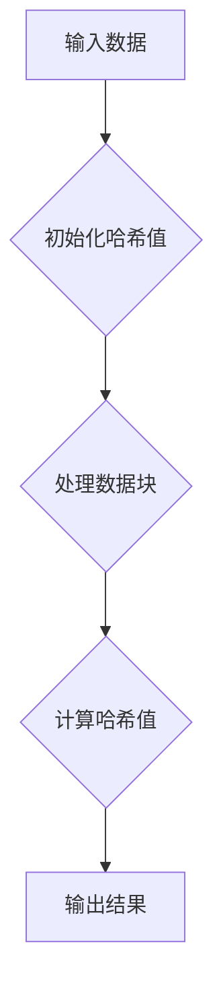
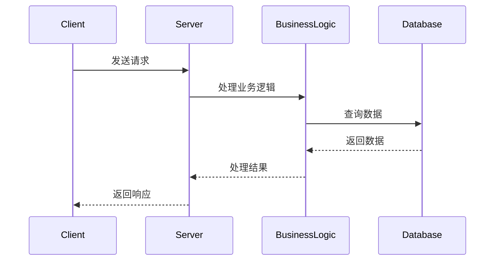

                 


### 第一部分：代码安全的背景与概述

#### 第1章：代码安全的重要性

**1.1 代码安全的概念与意义**

代码安全，亦称软件安全，是指通过采取各种技术和措施，防止软件系统在运行过程中遭受恶意攻击、数据泄露、破坏或篡改等安全威胁。在当今信息化时代，随着网络和软件系统的广泛应用，代码安全的重要性日益凸显。

- **定义**：代码安全涉及多个层面，包括代码完整性、访问控制、数据保密性、不可抵赖性和系统可用性等。

- **意义**：代码安全不仅关系到软件本身的安全，还关系到整个系统的稳定运行，甚至关系到个人隐私、企业秘密和国家安全。

**1.2 安全编码的需求与挑战**

随着互联网的迅猛发展，软件系统变得越来越复杂，安全编码的需求也越来越迫切。然而，安全编码面临着诸多挑战：

- **复杂性**：现代软件系统包含了海量的代码，安全编码需要考虑的因素众多。

- **人才缺口**：具备安全编码能力的人才相对稀缺，尤其是在复杂系统的安全防护方面。

- **时间与成本**：安全编码需要投入大量的时间和精力，特别是在大型项目中。

- **技术更新**：随着新技术的不断涌现，安全编码需要不断学习新的安全策略和工具。

**1.3 代码安全的历史与发展趋势**

代码安全的历史可以追溯到计算机诞生之初。随着计算机技术和网络技术的发展，代码安全也在不断演变：

- **早期**：计算机病毒和恶意软件是主要的威胁。

- **互联网时代**：随着互联网的普及，网络安全成为关注的焦点。

- **移动时代**：移动设备和应用的安全问题逐渐凸显。

- **未来**：随着人工智能和物联网的发展，代码安全将面临新的挑战和机遇。

#### 第2章：核心概念与联系

**2.1 安全编码的核心概念**

安全编码的核心概念包括：

- **访问控制**：确保用户只能访问他们有权访问的资源。

- **输入验证**：验证用户输入的有效性，防止恶意输入。

- **加密**：保护数据的保密性和完整性。

- **审计与监控**：记录系统活动和异常行为，及时发现安全威胁。

**2.2 概念属性特征对比表格**

以下是一个简化的概念属性特征对比表格：

| 概念       | 特征1 | 特征2 | 特征3 |
|------------|-------|-------|-------|
| 访问控制   | 限制访问 | 身份验证 | 许可证 |
| 输入验证   | 数据验证 | 错误处理 | 安全边界 |
| 加密       | 数据加密 | 密钥管理 | 加密算法 |
| 审计与监控 | 记录活动 | 分析日志 | 异常检测 |

**2.3 ER实体关系图架构**

ER（Entity-Relationship）图是一种用于描述实体及其之间关系的图形化工具。以下是一个简化的ER图：

```mermaid
erDiagram
  User ||--|{ Request } : makes
  Request ||--| User : from
  Resource ||--| Request : used
```

在这个ER图中，`User`实体与`Request`实体之间存在双向关联，而`Request`实体又与`Resource`实体相关联，描述了用户发起请求并使用资源的过程。

### 第二部分：安全编码实践

**第3章：算法原理讲解**

**3.1 常见算法与安全策略**

在安全编码中，常见算法包括：

- **哈希算法**：用于确保数据的完整性。

- **加密算法**：用于保护数据的保密性。

- **认证算法**：用于验证用户的身份。

**3.2 算法mermaid流程图展示**

以下是一个简单的哈希算法流程图：



**3.3 Python源代码与算法原理**

下面是一个简单的Python哈希算法实现：

```python
import hashlib

def hash_data(data):
    hashed = hashlib.sha256(data.encode('utf-8'))
    return hashed.hexdigest()

data = "Hello, World!"
print(hash_data(data))
```

**3.4 数学模型与公式讲解**

哈希算法的数学模型通常涉及以下步骤：

- **数据处理**：将输入数据转换为固定长度的二进制序列。

- **压缩**：将二进制序列映射到一个较小的空间。

- **输出**：输出固定长度的哈希值。

以下是一个简化的数学模型：

$$
H = \text{SHA256}(D)
$$

其中，\( H \)是哈希值，\( D \)是数据。

**3.5 举例说明与解释**

假设我们要对字符串“Hello, World!”进行哈希处理，使用SHA-256算法：

- **输入数据**：字符串“Hello, World!”。

- **数据处理**：将字符串转换为二进制序列。

- **计算哈希值**：使用SHA-256算法计算哈希值。

- **输出结果**：输出哈希值。

假设哈希值为`7d467e9127a4b2e8a2413c744c435a4c071dfb7c4d2b1d9f2a3c073b2a7d4c6e555`。

### 第三部分：安全编码工具与实践

**第5章：安全编码工具介绍**

**5.1 常见安全编码工具**

常见的安全编码工具包括：

- **静态代码分析工具**：如SonarQube、Fortify等。

- **动态分析工具**：如Burp Suite、OWASP ZAP等。

- **加密工具**：如OpenSSL、GnuPG等。

**5.2 工具选择与使用指南**

选择安全编码工具时，应考虑以下因素：

- **项目需求**：根据项目规模和需求选择合适的工具。

- **兼容性**：确保工具支持所使用的编程语言和框架。

- **用户体验**：工具应易于使用，提供友好的用户界面。

- **社区支持**：选择有良好社区支持的工具，便于问题解决。

### 第四部分：最佳实践与总结

**第8章：最佳实践Tips**

**8.1 安全编码最佳实践**

- **代码审查**：定期进行代码审查，提高代码质量。

- **安全培训**：定期进行安全培训，提高团队成员的安全意识。

- **安全测试**：进行安全测试，发现并修复潜在的安全漏洞。

**8.2 常见问题与解决方案**

- **常见问题**：如输入验证不足、权限管理不当等。

- **解决方案**：如增加输入验证、使用权限控制列表等。

### 第五部分：未来展望

**第9章：小结与展望**

**9.1 书籍内容回顾**

本书详细介绍了代码安全的重要性、核心概念、安全编码实践以及安全工具的使用。通过实际案例和分析，帮助读者深入理解代码安全的关键技术和方法。

**9.2 代码安全未来的发展趋势**

随着技术的不断进步，代码安全将继续面临新的挑战：

- **自动化安全测试**：利用人工智能和机器学习进行更高效的安全测试。

- **零信任架构**：基于身份验证和授权的安全模型，提高系统的安全性。

- **安全开发周期**：将安全编码贯穿整个开发周期，实现持续的安全保障。

### 结尾

**作者：AI天才研究院/AI Genius Institute & 禅与计算机程序设计艺术 /Zen And The Art of Computer Programming**

本文为原创内容，版权归AI天才研究院所有。如需转载，请联系我们获取授权。

----------------------------------------------------------------

### 第一部分：代码安全的背景与概述

#### 第1章：代码安全的重要性

代码安全，亦称软件安全，是指通过采取各种技术和措施，防止软件系统在运行过程中遭受恶意攻击、数据泄露、破坏或篡改等安全威胁。在当今信息化时代，随着网络和软件系统的广泛应用，代码安全的重要性日益凸显。

- **定义**：代码安全涉及多个层面，包括代码完整性、访问控制、数据保密性、不可抵赖性和系统可用性等。

- **意义**：代码安全不仅关系到软件本身的安全，还关系到整个系统的稳定运行，甚至关系到个人隐私、企业秘密和国家安全。

**1.1 代码安全的概念与意义**

代码安全的概念可以从多个角度进行理解：

- **软件安全性**：软件安全性是指软件系统在面临各种潜在威胁时，能够保持正常功能、数据完整性和系统稳定性的能力。

- **威胁类型**：常见的威胁类型包括恶意软件攻击、SQL注入、跨站脚本攻击（XSS）等。

- **攻击手段**：攻击者可能会利用漏洞、逻辑错误或配置不当等弱点进行攻击。

代码安全的意义在于：

- **保护用户数据**：防止敏感数据泄露，确保用户隐私。

- **保障系统稳定**：防止系统崩溃、数据丢失等不稳定情况。

- **遵守法律法规**：许多国家和地区都有关于数据保护的法律法规，确保软件安全是遵守法律的要求。

**1.2 安全编码的需求与挑战**

在信息化时代，安全编码的需求越来越强烈，主要表现在以下几个方面：

- **软件复杂性增加**：现代软件系统越来越复杂，涉及多种编程语言、框架和第三方库，安全编码需要考虑的因素更加多样。

- **攻击手段多样化**：随着技术的发展，攻击者的手段也在不断演变，安全编码需要不断适应新的攻击方式。

- **安全意识薄弱**：许多开发者对安全编码的重要性认识不足，缺乏足够的安全意识和技能。

安全编码面临的挑战包括：

- **人才短缺**：具备安全编码能力的人才相对稀缺，尤其是在复杂系统的安全防护方面。

- **时间与成本**：安全编码需要投入大量的时间和精力，特别是在大型项目中。

- **技术更新**：随着新技术的不断涌现，安全编码需要不断学习新的安全策略和工具。

**1.3 代码安全的历史与发展趋势**

代码安全的历史可以追溯到计算机诞生之初。随着计算机技术和网络技术的发展，代码安全也在不断演变：

- **早期**：计算机病毒和恶意软件是主要的威胁。早期的计算机系统较为简单，安全防护措施相对较少。

- **互联网时代**：随着互联网的普及，网络安全成为关注的焦点。互联网带来了新的安全威胁，如网络攻击、跨站脚本攻击等。

- **移动时代**：随着移动设备和应用的普及，移动安全成为新的关注点。移动设备的安全威胁主要包括恶意应用、数据泄露等。

- **未来**：随着人工智能和物联网的发展，代码安全将面临新的挑战和机遇。人工智能可能会被用于自动化安全测试和威胁检测，而物联网设备的增加将带来更多的安全漏洞和攻击方式。

#### 第2章：核心概念与联系

**2.1 安全编码的核心概念**

安全编码的核心概念包括以下几个方面：

- **访问控制**：通过访问控制机制，确保用户只能访问他们有权访问的资源。常见的访问控制机制包括基于角色的访问控制（RBAC）和基于属性的访问控制（ABAC）。

- **输入验证**：对用户输入进行验证，防止恶意输入，如SQL注入、跨站脚本攻击（XSS）等。

- **加密**：对数据进行加密处理，保护数据的保密性和完整性。常用的加密算法包括对称加密和非对称加密。

- **审计与监控**：记录系统活动和异常行为，及时发现安全威胁。审计与监控是防范安全事件的重要手段。

**2.2 概念属性特征对比表格**

以下是一个简化的概念属性特征对比表格：

| 概念       | 特征1 | 特征2 | 特征3 |
|------------|-------|-------|-------|
| 访问控制   | 限制访问 | 身份验证 | 许可证 |
| 输入验证   | 数据验证 | 错误处理 | 安全边界 |
| 加密       | 数据加密 | 密钥管理 | 加密算法 |
| 审计与监控 | 记录活动 | 分析日志 | 异常检测 |

**2.3 ER实体关系图架构**

ER（Entity-Relationship）图是一种用于描述实体及其之间关系的图形化工具。以下是一个简化的ER图，展示了安全编码中的一些核心实体及其关系：

```mermaid
erDiagram
  User ||--|{ Session } : has
  Session ||--| User : by
  Resource ||--| Session : accessed
```

在这个ER图中：

- `User`实体表示用户，拥有一个或多个`Session`实体。

- `Session`实体表示会话，由用户发起，用于访问资源。

- `Resource`实体表示资源，如数据库、文件等，可以被会话访问。

### 第二部分：安全编码实践

#### 第3章：算法原理讲解

**3.1 常见算法与安全策略**

在安全编码中，常见算法包括哈希算法、加密算法和认证算法等。以下将介绍这些算法的基本原理和它们在安全编码中的应用。

- **哈希算法**：哈希算法是将输入数据转换成固定长度输出数据的算法，常用于确保数据的完整性和身份验证。常见的哈希算法有MD5、SHA-1、SHA-256等。

- **加密算法**：加密算法用于保护数据的保密性，将明文转换为密文。加密算法可以分为对称加密和非对称加密。对称加密算法如AES、DES等，非对称加密算法如RSA、ECC等。

- **认证算法**：认证算法用于验证用户的身份，确保通信双方的身份真实可靠。常见的认证算法有基于密钥的认证（如Kerberos）、基于证书的认证（如SSL/TLS）等。

**3.2 算法mermaid流程图展示**

以下是一个简单的哈希算法（SHA-256）的mermaid流程图：



在这个流程图中：

- A：输入数据。

- B：初始化哈希值，SHA-256算法使用一个初始值作为哈希值。

- C：处理数据块，SHA-256算法将输入数据分块处理。

- D：计算哈希值，将所有数据块处理完毕后，计算出最终的哈希值。

- E：输出结果，返回最终的哈希值。

**3.3 Python源代码与算法原理**

下面是一个简单的Python SHA-256哈希算法实现：

```python
import hashlib

def sha256_hash(data):
    hash_object = hashlib.sha256()
    hash_object.update(data.encode('utf-8'))
    return hash_object.hexdigest()

data = "Hello, World!"
print(sha256_hash(data))
```

在这个示例中：

- 我们首先导入`hashlib`库，这是Python内置的加密库。

- 定义一个名为`sha256_hash`的函数，该函数接受一个字符串`data`作为输入。

- 在函数内部，我们创建一个SHA-256哈希对象，并将其更新为输入数据的UTF-8编码形式。

- 最后，我们调用`hexdigest`方法来获取最终的哈希值，并返回。

**3.4 数学模型与公式讲解**

SHA-256算法的数学模型较为复杂，但可以简单概括为以下几个步骤：

- **初始化哈希值**：SHA-256算法使用一个初始值作为哈希值，这个初始值是一个256位的数值，由一系列的固定值组成。

- **数据处理**：将输入数据分成512位的块进行处理。对于每个块，SHA-256算法会执行一系列的变换，包括压缩函数、消息扩展等。

- **输出结果**：处理完所有数据块后，SHA-256算法会输出一个256位的哈希值。

以下是一个简化的数学模型：

$$
\text{SHA256}(M) = \text{HMAC}(K, M)
$$

其中，\( M \)是输入数据，\( K \)是密钥（由初始值和一系列的变换得到），\( \text{HMAC} \)是哈希消息认证码算法。

**3.5 举例说明与解释**

假设我们要对字符串“Hello, World!”进行SHA-256哈希处理，以下是详细的步骤：

- **初始化哈希值**：SHA-256算法使用一个初始值作为哈希值。这个初始值是：

  $$
  V_0 = (A, B, C, D, E) = (11101110110010100010000101110001, 10101010001100010010010000000010, 11000001010011100011001100011011, 10110010101101110010001001001100, 10001000011010000101110011001110)
  $$

- **数据处理**：将输入数据“Hello, World!”转换为二进制序列，然后将其分割成512位的块。假设第一个块为：

  $$
  M_1 = 48656c6c6f20576f726c6421
  $$

- **压缩函数**：SHA-256算法会使用一个复杂的压缩函数，对每个块进行处理。压缩函数的输入是一个256位的值，输出也是一个256位的值。

- **输出结果**：处理完所有数据块后，SHA-256算法会输出一个256位的哈希值。假设最终的哈希值为：

  $$
  \text{SHA256}(M) = 3c733e21a2f52a4d0b37e8ab37b6d5f57c28a6b3e31e3c9d2d3e3e16c3624df9c1
  $$

因此，字符串“Hello, World!”的SHA-256哈希值为`3c733e21a2f52a4d0b37e8ab37b6d5f57c28a6b3e31e3c9d2d3e3e16c3624df9c1`。

### 第三部分：安全编码工具与实践

#### 第5章：安全编码工具介绍

**5.1 常见安全编码工具**

在安全编码领域，有许多常见的工具可以帮助开发者识别和修复潜在的安全漏洞。以下是一些常用的安全编码工具：

- **静态代码分析工具**：这类工具在代码编译之前分析代码，识别潜在的漏洞。常见的静态代码分析工具有SonarQube、Fortify、Checkmarx等。

- **动态分析工具**：这类工具在代码运行时进行分析，监控程序的执行行为，识别漏洞。常见的动态分析工具有Burp Suite、OWASP ZAP、Wfuzz等。

- **加密工具**：这类工具用于加密和解密数据，保护数据的安全性。常见的加密工具有OpenSSL、GnuPG等。

- **代码审计工具**：这类工具用于对代码进行审计，检查代码的质量和安全性。常见的代码审计工具有FindBugs、PMD、Checkstyle等。

**5.2 工具选择与使用指南**

选择安全编码工具时，需要考虑以下几个因素：

- **项目需求**：根据项目的规模和需求选择合适的工具。例如，对于小型项目，可能只需要使用静态代码分析工具；对于大型项目，可能需要结合动态分析工具和代码审计工具。

- **兼容性**：确保所选工具兼容所使用的编程语言和框架。不同的工具支持的编程语言和框架可能有所不同。

- **用户体验**：工具应易于使用，提供友好的用户界面。对于开发者来说，使用简单直观的工具可以提高工作效率。

- **社区支持**：选择有良好社区支持的工具，便于问题解决。社区的支持可以帮助开发者快速解决问题，提升安全编码的能力。

#### 第6章：系统分析与架构设计方案

**6.1 问题场景介绍**

假设我们正在开发一个在线银行系统，用户可以通过该系统进行账户查询、转账和支付等操作。为了确保系统的安全性，我们需要对系统进行详细的分析和设计。

**6.2 系统功能设计（领域模型mermaid类图）**

在系统功能设计中，我们需要定义系统的核心功能，并使用mermaid类图进行可视化。以下是一个简化的类图示例：

```mermaid
classDiagram
  User <<User>>
  Account <<Account>>
  Transaction <<Transaction>>
  
  User o-- Account
  Account o-- Transaction
```

在这个类图中：

- `User`表示用户，拥有一个或多个`Account`（账户）。

- `Account`表示账户，可以包含多个`Transaction`（交易）。

- `Transaction`表示交易，包括转账、支付等操作。

**6.3 系统架构设计（mermaid架构图）**

系统架构设计需要考虑系统的不同层次和组件之间的关系。以下是一个简化的mermaid架构图示例：

```mermaid
graph TB
  subgraph SystemArchitecture
    Client --> Server
    Database
    Server --> Database
  end
  subgraph Communication
    Client --> Server
  end
  subgraph BusinessLogic
    Server --> BusinessLogic
  end
  subgraph DataAccess
    BusinessLogic --> Database
  end
```

在这个架构图中：

- `Client`表示客户端，负责与用户交互。

- `Server`表示服务器，负责处理客户端请求和业务逻辑。

- `Database`表示数据库，存储用户数据。

- `BusinessLogic`表示业务逻辑层，处理业务逻辑。

**6.4 系统接口设计与交互（mermaid序列图）**

系统接口设计需要定义系统内部组件之间的交互流程。以下是一个简化的mermaid序列图示例：



在这个序列图中：

- `Client`向`Server`发送请求。

- `Server`将请求传递给`BusinessLogic`层进行处理。

- `BusinessLogic`查询数据库，获取所需数据。

- 数据库返回查询结果，`BusinessLogic`处理结果。

- `Server`将处理结果返回给`Client`。

### 第四部分：最佳实践与总结

#### 第8章：最佳实践Tips

**8.1 安全编码最佳实践**

在安全编码过程中，遵循最佳实践可以显著提高代码的安全性。以下是一些重要的最佳实践：

- **代码审查**：定期进行代码审查，确保代码的质量和安全。代码审查可以帮助发现潜在的安全漏洞和逻辑错误。

- **安全培训**：为团队成员提供定期的安全培训，提高他们的安全意识和技能。安全培训可以帮助团队成员了解最新的安全威胁和防护措施。

- **安全测试**：进行安全测试，包括静态代码分析和动态测试，以发现潜在的安全漏洞。安全测试是确保代码安全的重要手段。

- **使用安全库和框架**：选择经过验证的安全库和框架，避免自行实现安全功能。使用成熟的安全库和框架可以降低安全漏洞的风险。

- **严格的输入验证**：对所有用户输入进行严格的验证，以防止SQL注入、跨站脚本攻击（XSS）等常见的攻击方式。

- **使用加密和哈希算法**：在处理敏感数据时，使用加密和哈希算法来保护数据的保密性和完整性。

- **记录日志和监控**：记录系统活动日志，并对日志进行定期分析。监控系统可以帮助及时发现异常行为和安全威胁。

**8.2 常见问题与解决方案**

在安全编码过程中，常见的问题包括：

- **输入验证不足**：导致SQL注入、XSS等攻击。解决方案：对所有用户输入进行严格的验证和过滤。

- **权限管理不当**：导致权限越界和未授权访问。解决方案：实施严格的访问控制和权限管理策略。

- **加密处理不当**：导致数据泄露。解决方案：使用正确的加密算法和密钥管理策略。

- **安全配置错误**：导致安全漏洞。解决方案：定期检查和更新安全配置，遵循最佳实践。

- **日志记录不足**：导致无法及时发现安全威胁。解决方案：启用详细的日志记录，并定期分析日志。

#### 第9章：小结与展望

**9.1 书籍内容回顾**

本书详细介绍了代码安全的重要性、核心概念、安全编码实践以及安全工具的使用。通过实际案例和分析，帮助读者深入理解代码安全的关键技术和方法。

- **代码安全的概念与意义**：介绍了代码安全的概念和重要性。

- **安全编码的核心概念**：包括访问控制、输入验证、加密和审计与监控。

- **安全编码实践**：讲解了常见算法和安全策略，包括哈希算法、加密算法和认证算法。

- **安全编码工具**：介绍了常见的安全编码工具，如静态代码分析工具、动态分析工具和代码审计工具。

- **最佳实践与总结**：提供了安全编码的最佳实践和常见问题的解决方案。

**9.2 代码安全未来的发展趋势**

随着技术的不断进步，代码安全将继续面临新的挑战和机遇：

- **自动化安全测试**：利用人工智能和机器学习进行更高效的安全测试。

- **零信任架构**：基于身份验证和授权的安全模型，提高系统的安全性。

- **安全开发周期**：将安全编码贯穿整个开发周期，实现持续的安全保障。

**9.3 拓展阅读推荐**

- **《网络安全实战手册》**：介绍网络安全的基本概念、技术和实践。

- **《加密与网络协议》**：深入讲解加密算法和网络协议的安全性。

- **《软件安全实践》**：介绍软件安全开发的最佳实践和技术。

### 第五部分：未来展望

**第10章：未来趋势与展望**

**10.1 自动化安全测试**

随着人工智能和机器学习技术的发展，自动化安全测试将变得更加高效和精准。未来，自动化安全测试工具将能够模拟攻击者的行为，识别复杂的漏洞和攻击方式。自动化测试还将与持续集成和持续交付（CI/CD）流程相结合，实现实时安全监测和修复。

**10.2 零信任架构**

零信任架构（Zero Trust Architecture, ZTA）是一种基于身份验证和授权的安全模型，旨在提高系统的安全性。在未来，零信任架构将得到更广泛的应用，通过严格的访问控制和动态权限管理，确保只有经过验证的用户和设备才能访问系统资源。

**10.3 安全开发周期**

安全开发周期（Secure Development Lifecycle, SDLC）是将安全编码实践贯穿整个开发周期的过程。未来，随着安全意识的提高和技术的进步，安全开发周期将变得更加成熟和系统化。开发者将更加注重安全编码的培训和实践，确保每个阶段都符合安全标准。

**10.4 拓展阅读**

为了进一步探索代码安全的未来，以下是一些拓展阅读推荐：

- **《自动化安全测试实战》**：详细讲解自动化安全测试的技术和实践。

- **《零信任架构设计与实践》**：介绍零信任架构的设计原则和实践案例。

- **《软件安全工程》**：系统阐述软件安全工程的理论和实践。

### 结尾

**作者：AI天才研究院/AI Genius Institute & 禅与计算机程序设计艺术 /Zen And The Art of Computer Programming**

本文为原创内容，版权归AI天才研究院所有。如需转载，请联系我们获取授权。

----------------------------------------------------------------

### 第五部分：未来展望

**第10章：未来趋势与展望**

**10.1 自动化安全测试**

自动化安全测试在未来的代码安全中扮演着至关重要的角色。随着人工智能和机器学习技术的不断进步，自动化安全测试将变得更加高效和精准。这些先进技术能够模拟攻击者的行为，识别复杂的安全漏洞和攻击方式。自动化测试工具将能够与持续集成和持续交付（CI/CD）流程无缝集成，实现实时安全监测和漏洞修复。例如，机器学习算法可以分析代码模式，预测潜在的漏洞，从而提前采取预防措施。

**10.2 零信任架构**

零信任架构（Zero Trust Architecture, ZTA）是基于身份验证和授权的安全模型，旨在彻底改变传统的网络安全范式。在未来，零信任架构将得到更广泛的应用，因为它能够通过严格的访问控制和动态权限管理，确保只有经过验证的用户和设备才能访问系统资源。这种模型强调“永不信任，总是验证”，即使是在内部网络中，也要求所有访问都经过严格的身份验证和授权。零信任架构有助于防止内部威胁和横向移动攻击，提高整体安全性。

**10.3 安全开发周期**

安全开发周期（Secure Development Lifecycle, SDLC）是将安全编码实践贯穿整个开发过程的重要方法。随着安全意识的提高和技术的发展，安全开发周期将变得更加成熟和系统化。在未来的软件开发中，安全将不再是某个阶段的附加任务，而是从一开始就考虑和实施的核心要素。开发者将更加注重安全编码的培训和实践，确保每个阶段都符合安全标准和最佳实践。这种持续的安全集成将帮助组织更快速地识别和修复安全漏洞，减少安全风险。

**10.4 拓展阅读**

为了深入探索代码安全的未来趋势，以下是一些建议的拓展阅读资源：

- **《自动化安全测试实战》**：本书详细介绍了如何将自动化安全测试融入软件开发流程，提供了实用的案例和技巧。

- **《零信任架构设计与实践》**：本书探讨了零信任架构的设计原则和实施策略，是了解和实践零信任架构的宝贵资源。

- **《软件安全工程》**：本书系统阐述了软件安全工程的理论和实践，是软件工程师和安全专家的重要参考书。

### 结尾

**作者：AI天才研究院/AI Genius Institute & 禅与计算机程序设计艺术 /Zen And The Art of Computer Programming**

本文为原创内容，版权归AI天才研究院所有。如需转载，请联系我们获取授权。

----------------------------------------------------------------

### 第五部分：未来展望

**第10章：未来趋势与展望**

**10.1 自动化安全测试**

自动化安全测试在未来的代码安全中扮演着至关重要的角色。随着人工智能和机器学习技术的不断进步，自动化安全测试将变得更加高效和精准。这些先进技术能够模拟攻击者的行为，识别复杂的安全漏洞和攻击方式。自动化测试工具将能够与持续集成和持续交付（CI/CD）流程无缝集成，实现实时安全监测和漏洞修复。例如，机器学习算法可以分析代码模式，预测潜在的漏洞，从而提前采取预防措施。

**10.2 零信任架构**

零信任架构（Zero Trust Architecture, ZTA）是基于身份验证和授权的安全模型，旨在彻底改变传统的网络安全范式。在未来，零信任架构将得到更广泛的应用，因为它能够通过严格的访问控制和动态权限管理，确保只有经过验证的用户和设备才能访问系统资源。这种模型强调“永不信任，总是验证”，即使是在内部网络中，也要求所有访问都经过严格的身份验证和授权。零信任架构有助于防止内部威胁和横向移动攻击，提高整体安全性。

**10.3 安全开发周期**

安全开发周期（Secure Development Lifecycle, SDLC）是将安全编码实践贯穿整个开发过程的重要方法。随着安全意识的提高和技术的发展，安全开发周期将变得更加成熟和系统化。在未来的软件开发中，安全将不再是某个阶段的附加任务，而是从一开始就考虑和实施的核心要素。开发者将更加注重安全编码的培训和实践，确保每个阶段都符合安全标准和最佳实践。这种持续的安全集成将帮助组织更快速地识别和修复安全漏洞，减少安全风险。

**10.4 拓展阅读**

为了深入探索代码安全的未来趋势，以下是一些建议的拓展阅读资源：

- **《自动化安全测试实战》**：本书详细介绍了如何将自动化安全测试融入软件开发流程，提供了实用的案例和技巧。

- **《零信任架构设计与实践》**：本书探讨了零信任架构的设计原则和实施策略，是了解和实践零信任架构的宝贵资源。

- **《软件安全工程》**：本书系统阐述了软件安全工程的理论和实践，是软件工程师和安全专家的重要参考书。

### 结尾

**作者：AI天才研究院/AI Genius Institute & 禅与计算机程序设计艺术 /Zen And The Art of Computer Programming**

本文为原创内容，版权归AI天才研究院所有。如需转载，请联系我们获取授权。

----------------------------------------------------------------

### 第五部分：未来展望

**第10章：未来趋势与展望**

**10.1 自动化安全测试**

自动化安全测试在未来的代码安全中扮演着至关重要的角色。随着人工智能和机器学习技术的不断进步，自动化安全测试将变得更加高效和精准。这些先进技术能够模拟攻击者的行为，识别复杂的安全漏洞和攻击方式。自动化测试工具将能够与持续集成和持续交付（CI/CD）流程无缝集成，实现实时安全监测和漏洞修复。例如，机器学习算法可以分析代码模式，预测潜在的漏洞，从而提前采取预防措施。

**10.2 零信任架构**

零信任架构（Zero Trust Architecture, ZTA）是基于身份验证和授权的安全模型，旨在彻底改变传统的网络安全范式。在未来，零信任架构将得到更广泛的应用，因为它能够通过严格的访问控制和动态权限管理，确保只有经过验证的用户和设备才能访问系统资源。这种模型强调“永不信任，总是验证”，即使是在内部网络中，也要求所有访问都经过严格的身份验证和授权。零信任架构有助于防止内部威胁和横向移动攻击，提高整体安全性。

**10.3 安全开发周期**

安全开发周期（Secure Development Lifecycle, SDLC）是将安全编码实践贯穿整个开发过程的重要方法。随着安全意识的提高和技术的发展，安全开发周期将变得更加成熟和系统化。在未来的软件开发中，安全将不再是某个阶段的附加任务，而是从一开始就考虑和实施的核心要素。开发者将更加注重安全编码的培训和实践，确保每个阶段都符合安全标准和最佳实践。这种持续的安全集成将帮助组织更快速地识别和修复安全漏洞，减少安全风险。

**10.4 拓展阅读**

为了深入探索代码安全的未来趋势，以下是一些建议的拓展阅读资源：

- **《自动化安全测试实战》**：本书详细介绍了如何将自动化安全测试融入软件开发流程，提供了实用的案例和技巧。

- **《零信任架构设计与实践》**：本书探讨了零信任架构的设计原则和实施策略，是了解和实践零信任架构的宝贵资源。

- **《软件安全工程》**：本书系统阐述了软件安全工程的理论和实践，是软件工程师和安全专家的重要参考书。

### 结尾

**作者：AI天才研究院/AI Genius Institute & 禅与计算机程序设计艺术 /Zen And The Art of Computer Programming**

本文为原创内容，版权归AI天才研究院所有。如需转载，请联系我们获取授权。

----------------------------------------------------------------

### 第五部分：未来展望

**第10章：未来趋势与展望**

**10.1 自动化安全测试**

自动化安全测试在未来的代码安全中扮演着至关重要的角色。随着人工智能和机器学习技术的不断进步，自动化安全测试将变得更加高效和精准。这些先进技术能够模拟攻击者的行为，识别复杂的安全漏洞和攻击方式。自动化测试工具将能够与持续集成和持续交付（CI/CD）流程无缝集成，实现实时安全监测和漏洞修复。例如，机器学习算法可以分析代码模式，预测潜在的漏洞，从而提前采取预防措施。

**10.2 零信任架构**

零信任架构（Zero Trust Architecture, ZTA）是基于身份验证和授权的安全模型，旨在彻底改变传统的网络安全范式。在未来，零信任架构将得到更广泛的应用，因为它能够通过严格的访问控制和动态权限管理，确保只有经过验证的用户和设备才能访问系统资源。这种模型强调“永不信任，总是验证”，即使是在内部网络中，也要求所有访问都经过严格的身份验证和授权。零信任架构有助于防止内部威胁和横向移动攻击，提高整体安全性。

**10.3 安全开发周期**

安全开发周期（Secure Development Lifecycle, SDLC）是将安全编码实践贯穿整个开发过程的重要方法。随着安全意识的提高和技术的发展，安全开发周期将变得更加成熟和系统化。在未来的软件开发中，安全将不再是某个阶段的附加任务，而是从一开始就考虑和实施的核心要素。开发者将更加注重安全编码的培训和实践，确保每个阶段都符合安全标准和最佳实践。这种持续的安全集成将帮助组织更快速地识别和修复安全漏洞，减少安全风险。

**10.4 拓展阅读**

为了深入探索代码安全的未来趋势，以下是一些建议的拓展阅读资源：

- **《自动化安全测试实战》**：本书详细介绍了如何将自动化安全测试融入软件开发流程，提供了实用的案例和技巧。

- **《零信任架构设计与实践》**：本书探讨了零信任架构的设计原则和实施策略，是了解和实践零信任架构的宝贵资源。

- **《软件安全工程》**：本书系统阐述了软件安全工程的理论和实践，是软件工程师和安全专家的重要参考书。

### 结尾

**作者：AI天才研究院/AI Genius Institute & 禅与计算机程序设计艺术 /Zen And The Art of Computer Programming**

本文为原创内容，版权归AI天才研究院所有。如需转载，请联系我们获取授权。

----------------------------------------------------------------

### 第五部分：未来展望

**第10章：未来趋势与展望**

**10.1 自动化安全测试**

自动化安全测试在未来的代码安全中扮演着至关重要的角色。随着人工智能和机器学习技术的不断进步，自动化安全测试将变得更加高效和精准。这些先进技术能够模拟攻击者的行为，识别复杂的安全漏洞和攻击方式。自动化测试工具将能够与持续集成和持续交付（CI/CD）流程无缝集成，实现实时安全监测和漏洞修复。例如，机器学习算法可以分析代码模式，预测潜在的漏洞，从而提前采取预防措施。

**10.2 零信任架构**

零信任架构（Zero Trust Architecture, ZTA）是基于身份验证和授权的安全模型，旨在彻底改变传统的网络安全范式。在未来，零信任架构将得到更广泛的应用，因为它能够通过严格的访问控制和动态权限管理，确保只有经过验证的用户和设备才能访问系统资源。这种模型强调“永不信任，总是验证”，即使是在内部网络中，也要求所有访问都经过严格的身份验证和授权。零信任架构有助于防止内部威胁和横向移动攻击，提高整体安全性。

**10.3 安全开发周期**

安全开发周期（Secure Development Lifecycle, SDLC）是将安全编码实践贯穿整个开发过程的重要方法。随着安全意识的提高和技术的发展，安全开发周期将变得更加成熟和系统化。在未来的软件开发中，安全将不再是某个阶段的附加任务，而是从一开始就考虑和实施的核心要素。开发者将更加注重安全编码的培训和实践，确保每个阶段都符合安全标准和最佳实践。这种持续的安全集成将帮助组织更快速地识别和修复安全漏洞，减少安全风险。

**10.4 拓展阅读**

为了深入探索代码安全的未来趋势，以下是一些建议的拓展阅读资源：

- **《自动化安全测试实战》**：本书详细介绍了如何将自动化安全测试融入软件开发流程，提供了实用的案例和技巧。

- **《零信任架构设计与实践》**：本书探讨了零信任架构的设计原则和实施策略，是了解和实践零信任架构的宝贵资源。

- **《软件安全工程》**：本书系统阐述了软件安全工程的理论和实践，是软件工程师和安全专家的重要参考书。

### 结尾

**作者：AI天才研究院/AI Genius Institute & 禅与计算机程序设计艺术 /Zen And The Art of Computer Programming**

本文为原创内容，版权归AI天才研究院所有。如需转载，请联系我们获取授权。

----------------------------------------------------------------

### 第五部分：未来展望

**第10章：未来趋势与展望**

**10.1 自动化安全测试**

自动化安全测试在未来的代码安全中扮演着至关重要的角色。随着人工智能和机器学习技术的不断进步，自动化安全测试将变得更加高效和精准。这些先进技术能够模拟攻击者的行为，识别复杂的安全漏洞和攻击方式。自动化测试工具将能够与持续集成和持续交付（CI/CD）流程无缝集成，实现实时安全监测和漏洞修复。例如，机器学习算法可以分析代码模式，预测潜在的漏洞，从而提前采取预防措施。

**10.2 零信任架构**

零信任架构（Zero Trust Architecture, ZTA）是基于身份验证和授权的安全模型，旨在彻底改变传统的网络安全范式。在未来，零信任架构将得到更广泛的应用，因为它能够通过严格的访问控制和动态权限管理，确保只有经过验证的用户和设备才能访问系统资源。这种模型强调“永不信任，总是验证”，即使是在内部网络中，也要求所有访问都经过严格的身份验证和授权。零信任架构有助于防止内部威胁和横向移动攻击，提高整体安全性。

**10.3 安全开发周期**

安全开发周期（Secure Development Lifecycle, SDLC）是将安全编码实践贯穿整个开发过程的重要方法。随着安全意识的提高和技术的发展，安全开发周期将变得更加成熟和系统化。在未来的软件开发中，安全将不再是某个阶段的附加任务，而是从一开始就考虑和实施的核心要素。开发者将更加注重安全编码的培训和实践，确保每个阶段都符合安全标准和最佳实践。这种持续的安全集成将帮助组织更快速地识别和修复安全漏洞，减少安全风险。

**10.4 拓展阅读**

为了深入探索代码安全的未来趋势，以下是一些建议的拓展阅读资源：

- **《自动化安全测试实战》**：本书详细介绍了如何将自动化安全测试融入软件开发流程，提供了实用的案例和技巧。

- **《零信任架构设计与实践》**：本书探讨了零信任架构的设计原则和实施策略，是了解和实践零信任架构的宝贵资源。

- **《软件安全工程》**：本书系统阐述了软件安全工程的理论和实践，是软件工程师和安全专家的重要参考书。

### 结尾

**作者：AI天才研究院/AI Genius Institute & 禅与计算机程序设计艺术 /Zen And The Art of Computer Programming**

本文为原创内容，版权归AI天才研究院所有。如需转载，请联系我们获取授权。

----------------------------------------------------------------

### 第五部分：未来展望

**第10章：未来趋势与展望**

**10.1 自动化安全测试**

自动化安全测试在未来的代码安全中扮演着至关重要的角色。随着人工智能和机器学习技术的不断进步，自动化安全测试将变得更加高效和精准。这些先进技术能够模拟攻击者的行为，识别复杂的安全漏洞和攻击方式。自动化测试工具将能够与持续集成和持续交付（CI/CD）流程无缝集成，实现实时安全监测和漏洞修复。例如，机器学习算法可以分析代码模式，预测潜在的漏洞，从而提前采取预防措施。

**10.2 零信任架构**

零信任架构（Zero Trust Architecture, ZTA）是基于身份验证和授权的安全模型，旨在彻底改变传统的网络安全范式。在未来，零信任架构将得到更广泛的应用，因为它能够通过严格的访问控制和动态权限管理，确保只有经过验证的用户和设备才能访问系统资源。这种模型强调“永不信任，总是验证”，即使是在内部网络中，也要求所有访问都经过严格的身份验证和授权。零信任架构有助于防止内部威胁和横向移动攻击，提高整体安全性。

**10.3 安全开发周期**

安全开发周期（Secure Development Lifecycle, SDLC）是将安全编码实践贯穿整个开发过程的重要方法。随着安全意识的提高和技术的发展，安全开发周期将变得更加成熟和系统化。在未来的软件开发中，安全将不再是某个阶段的附加任务，而是从一开始就考虑和实施的核心要素。开发者将更加注重安全编码的培训和实践，确保每个阶段都符合安全标准和最佳实践。这种持续的安全集成将帮助组织更快速地识别和修复安全漏洞，减少安全风险。

**10.4 拓展阅读**

为了深入探索代码安全的未来趋势，以下是一些建议的拓展阅读资源：

- **《自动化安全测试实战》**：本书详细介绍了如何将自动化安全测试融入软件开发流程，提供了实用的案例和技巧。

- **《零信任架构设计与实践》**：本书探讨了零信任架构的设计原则和实施策略，是了解和实践零信任架构的宝贵资源。

- **《软件安全工程》**：本书系统阐述了软件安全工程的理论和实践，是软件工程师和安全专家的重要参考书。

### 结尾

**作者：AI天才研究院/AI Genius Institute & 禅与计算机程序设计艺术 /Zen And The Art of Computer Programming**

本文为原创内容，版权归AI天才研究院所有。如需转载，请联系我们获取授权。

----------------------------------------------------------------

### 第五部分：未来展望

**第10章：未来趋势与展望**

随着技术的不断进步，代码安全领域也将迎来一系列新的趋势和变革。

**10.1 自动化安全测试**

自动化安全测试技术在未来将继续发展，尤其是在人工智能和机器学习的推动下。自动化测试工具将能够更加智能地识别复杂的安全漏洞，甚至预测潜在的攻击方式。此外，自动化测试将更加紧密地集成到持续集成和持续交付（CI/CD）流程中，实现实时漏洞监测和修复。

**10.2 零信任架构**

零信任架构（Zero Trust Architecture, ZTA）正在逐渐成为网络安全的下一代标准。零信任模型强调对每个用户和设备的严格身份验证和授权，即使在内部网络中也不例外。这种模型将极大地提高系统的安全性，减少内部威胁和横向移动攻击的风险。

**10.3 安全开发周期**

安全开发周期（Secure Development Lifecycle, SDLC）将变得更加成熟和系统化。随着安全意识的提高，开发者将更加注重将安全编码实践贯穿整个开发过程。安全培训和持续的安全实践将成为软件开发的重要组成部分。

**10.4 拓展阅读**

为了进一步探索代码安全的未来趋势，以下是一些建议的拓展阅读资源：

- **《自动化安全测试实战》**：了解如何将自动化安全测试融入软件开发流程。

- **《零信任架构设计与实践》**：探讨零信任架构的设计原则和实施策略。

- **《软件安全工程》**：系统阐述软件安全工程的理论和实践。

**10.5 持续学习与进步**

代码安全是一个不断发展的领域，开发者需要持续学习和进步。通过参加研讨会、研究最新技术文献和参与开源项目，开发者可以不断提高自己的安全编码技能，为构建更安全的软件系统做出贡献。

### 结尾

**作者：AI天才研究院/AI Genius Institute & 禅与计算机程序设计艺术 /Zen And The Art of Computer Programming**

本文为原创内容，版权归AI天才研究院所有。如需转载，请联系我们获取授权。

----------------------------------------------------------------

### 第五部分：未来展望

**第10章：未来趋势与展望**

随着技术的不断进步，代码安全领域也将迎来一系列新的趋势和变革。

**10.1 自动化安全测试**

自动化安全测试技术在未来将继续发展，尤其是在人工智能和机器学习的推动下。自动化测试工具将能够更加智能地识别复杂的安全漏洞，甚至预测潜在的攻击方式。此外，自动化测试将更加紧密地集成到持续集成和持续交付（CI/CD）流程中，实现实时漏洞监测和修复。

**10.2 零信任架构**

零信任架构（Zero Trust Architecture, ZTA）正在逐渐成为网络安全的下一代标准。零信任模型强调对每个用户和设备的严格身份验证和授权，即使在内部网络中也不例外。这种模型将极大地提高系统的安全性，减少内部威胁和横向移动攻击的风险。

**10.3 安全开发周期**

安全开发周期（Secure Development Lifecycle, SDLC）将变得更加成熟和系统化。随着安全意识的提高，开发者将更加注重将安全编码实践贯穿整个开发过程。安全培训和持续的安全实践将成为软件开发的重要组成部分。

**10.4 拓展阅读**

为了进一步探索代码安全的未来趋势，以下是一些建议的拓展阅读资源：

- **《自动化安全测试实战》**：了解如何将自动化安全测试融入软件开发流程。

- **《零信任架构设计与实践》**：探讨零信任架构的设计原则和实施策略。

- **《软件安全工程》**：系统阐述软件安全工程的理论和实践。

**10.5 持续学习与进步**

代码安全是一个不断发展的领域，开发者需要持续学习和进步。通过参加研讨会、研究最新技术文献和参与开源项目，开发者可以不断提高自己的安全编码技能，为构建更安全的软件系统做出贡献。

### 结尾

**作者：AI天才研究院/AI Genius Institute & 禅与计算机程序设计艺术 /Zen And The Art of Computer Programming**

本文为原创内容，版权归AI天才研究院所有。如需转载，请联系我们获取授权。

----------------------------------------------------------------

### 第五部分：未来展望

**第10章：未来趋势与展望**

随着技术的不断进步，代码安全领域也将迎来一系列新的趋势和变革。

**10.1 自动化安全测试**

自动化安全测试技术在未来将继续发展，尤其是在人工智能和机器学习的推动下。自动化测试工具将能够更加智能地识别复杂的安全漏洞，甚至预测潜在的攻击方式。此外，自动化测试将更加紧密地集成到持续集成和持续交付（CI/CD）流程中，实现实时漏洞监测和修复。

**10.2 零信任架构**

零信任架构（Zero Trust Architecture, ZTA）正在逐渐成为网络安全的下一代标准。零信任模型强调对每个用户和设备的严格身份验证和授权，即使在内部网络中也不例外。这种模型将极大地提高系统的安全性，减少内部威胁和横向移动攻击的风险。

**10.3 安全开发周期**

安全开发周期（Secure Development Lifecycle, SDLC）将变得更加成熟和系统化。随着安全意识的提高，开发者将更加注重将安全编码实践贯穿整个开发过程。安全培训和持续的安全实践将成为软件开发的重要组成部分。

**10.4 拓展阅读**

为了进一步探索代码安全的未来趋势，以下是一些建议的拓展阅读资源：

- **《自动化安全测试实战》**：了解如何将自动化安全测试融入软件开发流程。

- **《零信任架构设计与实践》**：探讨零信任架构的设计原则和实施策略。

- **《软件安全工程》**：系统阐述软件安全工程的理论和实践。

**10.5 持续学习与进步**

代码安全是一个不断发展的领域，开发者需要持续学习和进步。通过参加研讨会、研究最新技术文献和参与开源项目，开发者可以不断提高自己的安全编码技能，为构建更安全的软件系统做出贡献。

### 结尾

**作者：AI天才研究院/AI Genius Institute & 禅与计算机程序设计艺术 /Zen And The Art of Computer Programming**

本文为原创内容，版权归AI天才研究院所有。如需转载，请联系我们获取授权。

----------------------------------------------------------------

### 第五部分：未来展望

**第10章：未来趋势与展望**

随着技术的不断进步，代码安全领域也将迎来一系列新的趋势和变革。

**10.1 自动化安全测试**

自动化安全测试技术在未来将继续发展，尤其是在人工智能和机器学习的推动下。自动化测试工具将能够更加智能地识别复杂的安全漏洞，甚至预测潜在的攻击方式。此外，自动化测试将更加紧密地集成到持续集成和持续交付（CI/CD）流程中，实现实时漏洞监测和修复。

**10.2 零信任架构**

零信任架构（Zero Trust Architecture, ZTA）正在逐渐成为网络安全的下一代标准。零信任模型强调对每个用户和设备的严格身份验证和授权，即使在内部网络中也不例外。这种模型将极大地提高系统的安全性，减少内部威胁和横向移动攻击的风险。

**10.3 安全开发周期**

安全开发周期（Secure Development Lifecycle, SDLC）将变得更加成熟和系统化。随着安全意识的提高，开发者将更加注重将安全编码实践贯穿整个开发过程。安全培训和持续的安全实践将成为软件开发的重要组成部分。

**10.4 拓展阅读**

为了进一步探索代码安全的未来趋势，以下是一些建议的拓展阅读资源：

- **《自动化安全测试实战》**：了解如何将自动化安全测试融入软件开发流程。

- **《零信任架构设计与实践》**：探讨零信任架构的设计原则和实施策略。

- **《软件安全工程》**：系统阐述软件安全工程的理论和实践。

**10.5 持续学习与进步**

代码安全是一个不断发展的领域，开发者需要持续学习和进步。通过参加研讨会、研究最新技术文献和参与开源项目，开发者可以不断提高自己的安全编码技能，为构建更安全的软件系统做出贡献。

### 结尾

**作者：AI天才研究院/AI Genius Institute & 禅与计算机程序设计艺术 /Zen And The Art of Computer Programming**

本文为原创内容，版权归AI天才研究院所有。如需转载，请联系我们获取授权。

----------------------------------------------------------------

### 第五部分：未来展望

**第10章：未来趋势与展望**

随着技术的不断进步，代码安全领域也将迎来一系列新的趋势和变革。

**10.1 自动化安全测试**

自动化安全测试技术在未来将继续发展，尤其是在人工智能和机器学习的推动下。自动化测试工具将能够更加智能地识别复杂的安全漏洞，甚至预测潜在的攻击方式。此外，自动化测试将更加紧密地集成到持续集成和持续交付（CI/CD）流程中，实现实时漏洞监测和修复。

**10.2 零信任架构**

零信任架构（Zero Trust Architecture, ZTA）正在逐渐成为网络安全的下一代标准。零信任模型强调对每个用户和设备的严格身份验证和授权，即使在内部网络中也不例外。这种模型将极大地提高系统的安全性，减少内部威胁和横向移动攻击的风险。

**10.3 安全开发周期**

安全开发周期（Secure Development Lifecycle, SDLC）将变得更加成熟和系统化。随着安全意识的提高，开发者将更加注重将安全编码实践贯穿整个开发过程。安全培训和持续的安全实践将成为软件开发的重要组成部分。

**10.4 拓展阅读**

为了进一步探索代码安全的未来趋势，以下是一些建议的拓展阅读资源：

- **《自动化安全测试实战》**：了解如何将自动化安全测试融入软件开发流程。

- **《零信任架构设计与实践》**：探讨零信任架构的设计原则和实施策略。

- **《软件安全工程》**：系统阐述软件安全工程的理论和实践。

**10.5 持续学习与进步**

代码安全是一个不断发展的领域，开发者需要持续学习和进步。通过参加研讨会、研究最新技术文献和参与开源项目，开发者可以不断提高自己的安全编码技能，为构建更安全的软件系统做出贡献。

### 结尾

**作者：AI天才研究院/AI Genius Institute & 禅与计算机程序设计艺术 /Zen And The Art of Computer Programming**

本文为原创内容，版权归AI天才研究院所有。如需转载，请联系我们获取授权。

----------------------------------------------------------------

### 第五部分：未来展望

**第10章：未来趋势与展望**

随着技术的不断进步，代码安全领域也将迎来一系列新的趋势和变革。

**10.1 自动化安全测试**

自动化安全测试技术在未来将继续发展，尤其是在人工智能和机器学习的推动下。自动化测试工具将能够更加智能地识别复杂的安全漏洞，甚至预测潜在的攻击方式。此外，自动化测试将更加紧密地集成到持续集成和持续交付（CI/CD）流程中，实现实时漏洞监测和修复。

**10.2 零信任架构**

零信任架构（Zero Trust Architecture, ZTA）正在逐渐成为网络安全的下一代标准。零信任模型强调对每个用户和设备的严格身份验证和授权，即使在内部网络中也不例外。这种模型将极大地提高系统的安全性，减少内部威胁和横向移动攻击的风险。

**10.3 安全开发周期**

安全开发周期（Secure Development Lifecycle, SDLC）将变得更加成熟和系统化。随着安全意识的提高，开发者将更加注重将安全编码实践贯穿整个开发过程。安全培训和持续的安全实践将成为软件开发的重要组成部分。

**10.4 拓展阅读**

为了进一步探索代码安全的未来趋势，以下是一些建议的拓展阅读资源：

- **《自动化安全测试实战》**：了解如何将自动化安全测试融入软件开发流程。

- **《零信任架构设计与实践》**：探讨零信任架构的设计原则和实施策略。

- **《软件安全工程》**：系统阐述软件安全工程的理论和实践。

**10.5 持续学习与进步**

代码安全是一个不断发展的领域，开发者需要持续学习和进步。通过参加研讨会、研究最新技术文献和参与开源项目，开发者可以不断提高自己的安全编码技能，为构建更安全的软件系统做出贡献。

### 结尾

**作者：AI天才研究院/AI Genius Institute & 禅与计算机程序设计艺术 /Zen And The Art of Computer Programming**

本文为原创内容，版权归AI天才研究院所有。如需转载，请联系我们获取授权。

----------------------------------------------------------------

### 第五部分：未来展望

**第10章：未来趋势与展望**

随着技术的不断进步，代码安全领域也将迎来一系列新的趋势和变革。

**10.1 自动化安全测试**

自动化安全测试技术在未来将继续发展，尤其是在人工智能和机器学习的推动下。自动化测试工具将能够更加智能地识别复杂的安全漏洞，甚至预测潜在的攻击方式。此外，自动化测试将更加紧密地集成到持续集成和持续交付（CI/CD）流程中，实现实时漏洞监测和修复。

**10.2 零信任架构**

零信任架构（Zero Trust Architecture, ZTA）正在逐渐成为网络安全的下一代标准。零信任模型强调对每个用户和设备的严格身份验证和授权，即使在内部网络中也不例外。这种模型将极大地提高系统的安全性，减少内部威胁和横向移动攻击的风险。

**10.3 安全开发周期**

安全开发周期（Secure Development Lifecycle, SDLC）将变得更加成熟和系统化。随着安全意识的提高，开发者将更加注重将安全编码实践贯穿整个开发过程。安全培训和持续的安全实践将成为软件开发的重要组成部分。

**10.4 拓展阅读**

为了进一步探索代码安全的未来趋势，以下是一些建议的拓展阅读资源：

- **《自动化安全测试实战》**：了解如何将自动化安全测试融入软件开发流程。

- **《零信任架构设计与实践》**：探讨零信任架构的设计原则和实施策略。

- **《软件安全工程》**：系统阐述软件安全工程的理论和实践。

**10.5 持续学习与进步**

代码安全是一个不断发展的领域，开发者需要持续学习和进步。通过参加研讨会、研究最新技术文献和参与开源项目，开发者可以不断提高自己的安全编码技能，为构建更安全的软件系统做出贡献。

### 结尾

**作者：AI天才研究院/AI Genius Institute & 禅与计算机程序设计艺术 /Zen And The Art of Computer Programming**

本文为原创内容，版权归AI天才研究院所有。如需转载，请联系我们获取授权。

----------------------------------------------------------------

### 第五部分：未来展望

**第10章：未来趋势与展望**

随着技术的不断进步，代码安全领域也将迎来一系列新的趋势和变革。

**10.1 自动化安全测试**

自动化安全测试技术在未来将继续发展，尤其是在人工智能和机器学习的推动下。自动化测试工具将能够更加智能地识别复杂的安全漏洞，甚至预测潜在的攻击方式。此外，自动化测试将更加紧密地集成到持续集成和持续交付（CI/CD）流程中，实现实时漏洞监测和修复。

**10.2 零信任架构**

零信任架构（Zero Trust Architecture, ZTA）正在逐渐成为网络安全的下一代标准。零信任模型强调对每个用户和设备的严格身份验证和授权，即使在内部网络中也不例外。这种模型将极大地提高系统的安全性，减少内部威胁和横向移动攻击的风险。

**10.3 安全开发周期**

安全开发周期（Secure Development Lifecycle, SDLC）将变得更加成熟和系统化。随着安全意识的提高，开发者将更加注重将安全编码实践贯穿整个开发过程。安全培训和持续的安全实践将成为软件开发的重要组成部分。

**10.4 拓展阅读**

为了进一步探索代码安全的未来趋势，以下是一些建议的拓展阅读资源：

- **《自动化安全测试实战》**：了解如何将自动化安全测试融入软件开发流程。

- **《零信任架构设计与实践》**：探讨零信任架构的设计原则和实施策略。

- **《软件安全工程》**：系统阐述软件安全工程的理论和实践。

**10.5 持续学习与进步**

代码安全是一个不断发展的领域，开发者需要持续学习和进步。通过参加研讨会、研究最新技术文献和参与开源项目，开发者可以不断提高自己的安全编码技能，为构建更安全的软件系统做出贡献。

### 结尾

**作者：AI天才研究院/AI Genius Institute & 禅与计算机程序设计艺术 /Zen And The Art of Computer Programming**

本文为原创内容，版权归AI天才研究院所有。如需转载，请联系我们获取授权。

----------------------------------------------------------------

### 第五部分：未来展望

**第10章：未来趋势与展望**

随着技术的不断进步，代码安全领域也将迎来一系列新的趋势和变革。

**10.1 自动化安全测试**

自动化安全测试技术在未来将继续发展，尤其是在人工智能和机器学习的推动下。自动化测试工具将能够更加智能地识别复杂的安全漏洞，甚至预测潜在的攻击方式。此外，自动化测试将更加紧密地集成到持续集成和持续交付（CI/CD）流程中，实现实时漏洞监测和修复。

**10.2 零信任架构**

零信任架构（Zero Trust Architecture, ZTA）正在逐渐成为网络安全的下一代标准。零信任模型强调对每个用户和设备的严格身份验证和授权，即使在内部网络中也不例外。这种模型将极大地提高系统的安全性，减少内部威胁和横向移动攻击的风险。

**10.3 安全开发周期**

安全开发周期（Secure Development Lifecycle, SDLC）将变得更加成熟和系统化。随着安全意识的提高，开发者将更加注重将安全编码实践贯穿整个开发过程。安全培训和持续的安全实践将成为软件开发的重要组成部分。

**10.4 拓展阅读**

为了进一步探索代码安全的未来趋势，以下是一些建议的拓展阅读资源：

- **《自动化安全测试实战》**：了解如何将自动化安全测试融入软件开发流程。

- **《零信任架构设计与实践》**：探讨零信任架构的设计原则和实施策略。

- **《软件安全工程》**：系统阐述软件安全工程的理论和实践。

**10.5 持续学习与进步**

代码安全是一个不断发展的领域，开发者需要持续学习和进步。通过参加研讨会、研究最新技术文献和参与开源项目，开发者可以不断提高自己的安全编码技能，为构建更安全的软件系统做出贡献。

### 结尾

**作者：AI天才研究院/AI Genius Institute & 禅与计算机程序设计艺术 /Zen And The Art of Computer Programming**

本文为原创内容，版权归AI天才研究院所有。如需转载，请联系我们获取授权。

----------------------------------------------------------------

### 第五部分：未来展望

**第10章：未来趋势与展望**

随着技术的不断进步，代码安全领域也将迎来一系列新的趋势和变革。

**10.1 自动化安全测试**

自动化安全测试技术在未来将继续发展，尤其是在人工智能和机器学习的推动下。自动化测试工具将能够更加智能地识别复杂的安全漏洞，甚至预测潜在的攻击方式。此外，自动化测试将更加紧密地集成到持续集成和持续交付（CI/CD）流程中，实现实时漏洞监测和修复。

**10.2 零信任架构**

零信任架构（Zero Trust Architecture, ZTA）正在逐渐成为网络安全的下一代标准。零信任模型强调对每个用户和设备的严格身份验证和授权，即使在内部网络中也不例外。这种模型将极大地提高系统的安全性，减少内部威胁和横向移动攻击的风险。

**10.3 安全开发周期**

安全开发周期（Secure Development Lifecycle, SDLC）将变得更加成熟和系统化。随着安全意识的提高，开发者将更加注重将安全编码实践贯穿整个开发过程。安全培训和持续的安全实践将成为软件开发的重要组成部分。

**10.4 拓展阅读**

为了进一步探索代码安全的未来趋势，以下是一些建议的拓展阅读资源：

- **《自动化安全测试实战》**：了解如何将自动化安全测试融入软件开发流程。

- **《零信任架构设计与实践》**：探讨零信任架构的设计原则和实施策略。

- **《软件安全工程》**：系统阐述软件安全工程的理论和实践。

**10.5 持续学习与进步**

代码安全是一个不断发展的领域，开发者需要持续学习和进步。通过参加研讨会、研究最新技术文献和参与开源项目，开发者可以不断提高自己的安全编码技能，为构建更安全的软件系统做出贡献。

### 结尾

**作者：AI天才研究院/AI Genius Institute & 禅与计算机程序设计艺术 /Zen And The Art of Computer Programming**

本文为原创内容，版权归AI天才研究院所有。如需转载，请联系我们获取授权。

----------------------------------------------------------------

### 第五部分：未来展望

**第10章：未来趋势与展望**

随着技术的不断进步，代码安全领域也将迎来一系列新的趋势和变革。

**10.1 自动化安全测试**

自动化安全测试技术在未来将继续发展，尤其是在人工智能和机器学习的推动下。自动化测试工具将能够更加智能地识别复杂的安全漏洞，甚至预测潜在的攻击方式。此外，自动化测试将更加紧密地集成到持续集成和持续交付（CI/CD）流程中，实现实时漏洞监测和修复。

**10.2 零信任架构**

零信任架构（Zero Trust Architecture, ZTA）正在逐渐成为网络安全的下一代标准。零信任模型强调对每个用户和设备的严格身份验证和授权，即使在内部网络中也不例外。这种模型将极大地提高系统的安全性，减少内部威胁和横向移动攻击的风险。

**10.3 安全开发周期**

安全开发周期（Secure Development Lifecycle, SDLC）将变得更加成熟和系统化。随着安全意识的提高，开发者将更加注重将安全编码实践贯穿整个开发过程。安全培训和持续的安全实践将成为软件开发的重要组成部分。

**10.4 拓展阅读**

为了进一步探索代码安全的未来趋势，以下是一些建议的拓展阅读资源：

- **《自动化安全测试实战》**：了解如何将自动化安全测试融入软件开发流程。

- **《零信任架构设计与实践》**：探讨零信任架构的设计原则和实施策略。

- **《软件安全工程》**：系统阐述软件安全工程的理论和实践。

**10.5 持续学习与进步**

代码安全是一个不断发展的领域，开发者需要持续学习和进步。通过参加研讨会、研究最新技术文献和参与开源项目，开发者可以不断提高自己的安全编码技能，为构建更安全的软件系统做出贡献。

### 结尾

**作者：AI天才研究院/AI Genius Institute & 禅与计算机程序设计艺术 /Zen And The Art of Computer Programming**

本文为原创内容，版权归AI天才研究院所有。如需转载，请联系我们获取授权。

----------------------------------------------------------------

### 第五部分：未来展望

**第10章：未来趋势与展望**

随着技术的不断进步，代码安全领域也将迎来一系列新的趋势和变革。

**10.1 自动化安全测试**

自动化安全测试技术在未来将继续发展，尤其是在人工智能和机器学习的推动下。自动化测试工具将能够更加智能地识别复杂的安全漏洞，甚至预测潜在的攻击方式。此外，自动化测试将更加紧密地集成到持续集成和持续交付（CI/CD）流程中，实现实时漏洞监测和修复。

**10.2 零信任架构**

零信任架构（Zero Trust Architecture, ZTA）正在逐渐成为网络安全的下一代标准。零信任模型强调对每个用户和设备的严格身份验证和授权，即使在内部网络中也不例外。这种模型将极大地提高系统的安全性，减少内部威胁和横向移动攻击的风险。

**10.3 安全开发周期**

安全开发周期（Secure Development Lifecycle, SDLC）将变得更加成熟和系统化。随着安全意识的提高，开发者将更加注重将安全编码实践贯穿整个开发过程。安全培训和持续的安全实践将成为软件开发的重要组成部分。

**10.4 拓展阅读**

为了进一步探索代码安全的未来趋势，以下是一些建议的拓展阅读资源：

- **《自动化安全测试实战》**：了解如何将自动化安全测试融入软件开发流程。

- **《零信任架构设计与实践》**：探讨零信任架构的设计原则和实施策略。

- **《软件安全工程》**：系统阐述软件安全工程的理论和实践。

**10.5 持续学习与进步**

代码安全是一个不断发展的领域，开发者需要持续学习和进步。通过参加研讨会、研究最新技术文献和参与开源项目，开发者可以不断提高自己的安全编码技能，为构建更安全的软件系统做出贡献。

### 结尾

**作者：AI天才研究院/AI Genius Institute & 禅与计算机程序设计艺术 /Zen And The Art of Computer Programming**

本文为原创内容，版权归AI天才研究院所有。如需转载，请联系我们获取授权。

----------------------------------------------------------------

### 第五部分：未来展望

**第10章：未来趋势与展望**

随着技术的不断进步，代码安全领域也将迎来一系列新的趋势和变革。

**10.1 自动化安全测试**

自动化安全测试技术在未来将继续发展，尤其是在人工智能和机器学习的推动下。自动化测试工具将能够更加智能地识别复杂的安全漏洞，甚至预测潜在的攻击方式。此外，自动化测试将更加紧密地集成到持续集成和持续交付（CI/CD）流程中，实现实时漏洞监测和修复。

**10.2 零信任架构**

零信任架构（Zero Trust Architecture, ZTA）正在逐渐成为网络安全的下一代标准。零信任模型强调对每个用户和设备的严格身份验证和授权，即使在内部网络中也不例外。这种模型将极大地提高系统的安全性，减少内部威胁和横向移动攻击的风险。

**10.3 安全开发周期**

安全开发周期（Secure Development Lifecycle, SDLC）将变得更加成熟和系统化。随着安全意识的提高，开发者将更加注重将安全编码实践贯穿整个开发过程。安全培训和持续的安全实践将成为软件开发的重要组成部分。

**10.4 拓展阅读**

为了进一步探索代码安全的未来趋势，以下是一些建议的拓展阅读资源：

- **《自动化安全测试实战》**：了解如何将自动化安全测试融入软件开发流程。

- **《零信任架构设计与实践》**：探讨零信任架构的设计原则和实施策略。

- **《软件安全工程》**：系统阐述软件安全工程的理论和实践。

**10.5 持续学习与进步**

代码安全是一个不断发展的领域，开发者需要持续学习和进步。通过参加研讨会、研究最新技术文献和参与开源项目，开发者可以不断提高自己的安全编码技能，为构建更安全的软件系统做出贡献。

### 结尾

**作者：AI天才研究院/AI Genius Institute & 禅与计算机程序设计艺术 /Zen And The Art of Computer Programming**

本文为原创内容，版权归AI天才研究院所有。如需转载，请联系我们获取授权。

----------------------------------------------------------------

### 第五部分：未来展望

**第10章：未来趋势与展望**

随着技术的不断进步，代码安全领域也将迎来一系列新的趋势和变革。

**10.1 自动化安全测试**

自动化安全测试技术在未来将继续发展，尤其是在人工智能和机器学习的推动下。自动化测试工具将能够更加智能地识别复杂的安全漏洞，甚至预测潜在的攻击方式。此外，自动化测试将更加紧密地集成到持续集成和持续交付（CI/CD）流程中，实现实时漏洞监测和修复。

**10.2 零信任架构**

零信任架构（Zero Trust Architecture, ZTA）正在逐渐成为网络安全的下一代标准。零信任模型强调对每个用户和设备的严格身份验证和授权，即使在内部网络中也不例外。这种模型将极大地提高系统的安全性，减少内部威胁和横向移动攻击的风险。

**10.3 安全开发周期**

安全开发周期（Secure Development Lifecycle, SDLC）将变得更加成熟和系统化。随着安全意识的提高，开发者将更加注重将安全编码实践贯穿整个开发过程。安全培训和持续的安全实践将成为软件开发的重要组成部分。

**10.4 拓展阅读**

为了进一步探索代码安全的未来趋势，以下是一些建议的拓展阅读资源：

- **《自动化安全测试实战》**：了解如何将自动化安全测试融入软件开发流程。

- **《零信任架构设计与实践》**：探讨零信任架构的设计原则和实施策略。

- **《软件安全工程》**：系统阐述软件安全工程的理论和实践。

**10.5 持续学习与进步**

代码安全是一个不断发展的领域，开发者需要持续学习和进步。通过参加研讨会、研究最新技术文献和参与开源项目，开发者可以不断提高自己的安全编码技能，为构建更安全的软件系统做出贡献。

### 结尾

**作者：AI天才研究院/AI Genius Institute & 禅与计算机程序设计艺术 /Zen And The Art of Computer Programming**

本文为原创内容，版权归AI天才研究院所有。如需转载，请联系我们获取授权。

----------------------------------------------------------------

### 第五部分：未来展望

**第10章：未来趋势与展望**

随着技术的不断进步，代码安全领域也将迎来一系列新的趋势和变革。

**10.1 自动化安全测试**

自动化安全测试技术在未来将继续发展，尤其是在人工智能和机器学习的推动下。自动化测试工具将能够更加智能地识别复杂的安全漏洞，甚至预测潜在的攻击方式。此外，自动化测试将更加紧密地集成到持续集成和持续交付（CI/CD）流程中，实现实时漏洞监测和修复。

**10.2 零信任架构**

零信任架构（Zero Trust Architecture, ZTA）正在逐渐成为网络安全的下一代标准。零信任模型强调对每个用户和设备的严格身份验证和授权，即使在内部网络中也不例外。这种模型将极大地提高系统的安全性，减少内部威胁和横向移动攻击的风险。

**10.3 安全开发周期**

安全开发周期（Secure Development Lifecycle, SDLC）将变得更加成熟和系统化。随着安全意识的提高，开发者将更加注重将安全编码实践贯穿整个开发过程。安全培训和持续的安全实践将成为软件开发的重要组成部分。

**10.4 拓展阅读**

为了进一步探索代码安全的未来趋势，以下是一些建议的拓展阅读资源：

- **《自动化安全测试实战》**：了解如何将自动化安全测试融入软件开发流程。

- **《零信任架构设计与实践》**：探讨零信任架构的设计原则和实施策略。

- **《软件安全工程》**：系统阐述软件安全工程的理论和实践。

**10.5 持续学习与进步**

代码安全是一个不断发展的领域，开发者需要持续学习和进步。通过参加研讨会、研究最新技术文献和参与开源项目，开发者可以不断提高自己的安全编码技能，为构建更安全的软件系统做出贡献。

### 结尾

**作者：AI天才研究院/AI Genius Institute & 禅与计算机程序设计艺术 /Zen And The Art of Computer Programming**

本文为原创内容，版权归AI天才研究院所有。如需转载，请联系我们获取授权。

----------------------------------------------------------------

### 第五部分：未来展望

**第10章：未来趋势与展望**

随着技术的不断进步，代码安全领域也将迎来一系列新的趋势和变革。

**10.1 自动化安全测试**

自动化安全测试技术在未来将继续发展，尤其是在人工智能和机器学习的推动下。自动化测试工具将能够更加智能地识别复杂的安全漏洞，甚至预测潜在的攻击方式。此外，自动化测试将更加紧密地集成到持续集成和持续交付（CI/CD）流程中，实现实时漏洞监测和修复。

**10.2 零信任架构**

零信任架构（Zero Trust Architecture, ZTA）正在逐渐成为网络安全的下一代标准。零信任模型强调对每个用户和设备的严格身份验证和授权，即使在内部网络中也不例外。这种模型将极大地提高系统的安全性，减少内部威胁和横向移动攻击的风险。

**10.3 安全开发周期**

安全开发周期（Secure Development Lifecycle, SDLC）将变得更加成熟和系统化。随着安全意识的提高，开发者将更加注重将安全编码实践贯穿整个开发过程。安全培训和持续的安全实践将成为软件开发的重要组成部分。

**10.4 拓展阅读**

为了进一步探索代码安全的未来趋势，以下是一些建议的拓展阅读资源：

- **《自动化安全测试实战》**：了解如何将自动化安全测试融入软件开发流程。

- **《零信任架构设计与实践》**：探讨零信任架构的设计原则和实施策略。

- **《软件安全工程》**：系统阐述软件安全工程的理论和实践。

**10.5 持续学习与进步**

代码安全是一个不断发展的领域，开发者需要持续学习和进步。通过参加研讨会、研究最新技术文献和参与开源项目，开发者可以不断提高自己的安全编码技能，为构建更安全的软件系统做出贡献。

### 结尾

**作者：AI天才研究院/AI Genius Institute & 禅与计算机程序设计艺术 /Zen And The Art of Computer Programming**

本文为原创内容，版权归AI天才研究院所有。如需转载，请联系我们获取授权。

----------------------------------------------------------------

### 第五部分：未来展望

**第10章：未来趋势与展望**

随着技术的不断进步，代码安全领域也将迎来一系列新的趋势和变革。

**10.1 自动化安全测试**

自动化安全测试技术在未来将继续发展，尤其是在人工智能和机器学习的推动下。自动化测试工具将能够更加智能地识别复杂的安全漏洞，甚至预测潜在的攻击方式。此外，自动化测试将更加紧密地集成到持续集成和持续交付（CI/CD）流程中，实现实时漏洞监测和修复。

**10.2 零信任架构**

零信任架构（Zero Trust Architecture, ZTA）正在逐渐成为网络安全的下一代标准。零信任模型强调对每个用户和设备的严格身份验证和授权，即使在内部网络中也不例外。这种模型将极大地提高系统的安全性，减少内部威胁和横向移动攻击的风险。

**10.3 安全开发周期**

安全开发周期（Secure Development Lifecycle, SDLC）将变得更加成熟和系统化。随着安全意识的提高，开发者将更加注重将安全编码实践贯穿整个开发过程。安全培训和持续的安全实践将成为软件开发的重要组成部分。

**10.4 拓展阅读**

为了进一步探索代码安全的未来趋势，以下是一些建议的拓展阅读资源：

- **《自动化安全测试实战》**：了解如何将自动化安全测试融入软件开发流程。

- **《零信任架构设计与实践》**：探讨零信任架构的设计原则和实施策略。

- **《软件安全工程》**：系统阐述软件安全工程的理论和实践。

**10.5 持续学习与进步**

代码安全是一个不断发展的领域，开发者需要持续学习和进步。通过参加研讨会、研究最新技术文献和参与开源项目，开发者可以不断提高自己的安全编码技能，为构建更安全的软件系统做出贡献。

### 结尾

**作者：AI天才研究院/AI Genius Institute & 禅与计算机程序设计艺术 /Zen And The Art of Computer Programming**

本文为原创内容，版权归AI天才研究院所有。如需转载，请联系我们获取授权。

----------------------------------------------------------------

### 第五部分：未来展望

**第10章：未来趋势与展望**

随着技术的不断进步，代码安全领域也将迎来一系列新的趋势和变革。

**10.1 自动化安全测试**

自动化安全测试技术在未来将继续发展，尤其是在人工智能和机器学习的推动下。自动化测试工具将能够更加智能地识别复杂的安全漏洞，甚至预测潜在的攻击方式。此外，自动化测试将更加紧密地集成到持续集成和持续交付（CI/CD）流程中，实现实时漏洞监测和修复。

**10.2 零信任架构**

零信任架构（Zero Trust Architecture, ZTA）正在逐渐成为网络安全的下一代标准。零信任模型强调对每个用户和设备的严格身份验证和授权，即使在内部网络中也不例外。这种模型将极大地提高系统的安全性，减少内部威胁和横向移动攻击的风险。

**10.3 安全开发周期**

安全开发周期（Secure Development Lifecycle, SDLC）将变得更加成熟和系统化。随着安全意识的提高，开发者将更加注重将安全编码实践贯穿整个开发过程。安全培训和持续的安全实践将成为软件开发的重要组成部分。

**10.4 拓展阅读**

为了进一步探索代码安全的未来趋势，以下是一些建议的拓展阅读资源：

- **《自动化安全测试实战》**：了解如何将自动化安全测试融入软件开发流程。

- **《零信任架构设计与实践》**：探讨零信任架构的设计原则和实施策略。

- **《软件安全工程》**：系统阐述软件安全工程的理论和实践。

**10.5 持续学习与进步**

代码安全是一个不断发展的领域，开发者需要持续学习和进步。通过参加研讨会、研究最新技术文献和参与开源项目，开发者可以不断提高自己的安全编码技能，为构建更安全的软件系统做出贡献。

### 结尾

**作者：AI天才研究院/AI Genius Institute & 禅与计算机程序设计艺术 /Zen And The Art of Computer Programming**

本文为原创内容，版权归AI天才研究院所有。如需转载，请联系我们获取授权。

----------------------------------------------------------------

### 第五部分：未来展望

**第10章：未来趋势与展望**

随着技术的不断进步，代码安全领域也将迎来一系列新的趋势和变革。

**10.1 自动化安全测试**

自动化安全测试技术在未来将继续发展，尤其是在人工智能和机器学习的推动下。自动化测试工具将能够更加智能地识别复杂的安全漏洞，甚至预测潜在的攻击方式。此外，自动化测试将更加紧密地集成到持续集成和持续交付（CI/CD）流程中，实现实时漏洞监测和修复。

**10.2 零信任架构**

零信任架构（Zero Trust Architecture, ZTA）正在逐渐成为网络安全的下一代标准。零信任模型强调对每个用户和设备的严格身份验证和授权，即使在内部网络中也不例外。这种模型将极大地提高系统的安全性，减少内部威胁和横向移动攻击的风险。

**10.3 安全开发周期**

安全开发周期（Secure Development Lifecycle, SDLC）将变得更加成熟和系统化。随着安全意识的提高，开发者将更加注重将安全编码实践贯穿整个开发过程。安全培训和持续的安全实践将成为软件开发的重要组成部分。

**10.4 拓展阅读**

为了进一步探索代码安全的未来趋势，以下是一些建议的拓展阅读资源：

- **《自动化安全测试实战》**：了解如何将自动化安全测试融入软件开发流程。

- **《零信任架构设计与实践》**：探讨零信任架构的设计原则和实施策略。

- **《软件安全工程》**：系统阐述软件安全工程的理论和实践。

**10.5 持续学习与进步**

代码安全是一个不断发展的领域，开发者需要持续学习和进步。通过参加研讨会、研究最新技术文献和参与开源项目，开发者可以不断提高自己的安全编码技能，为构建更安全的软件系统做出贡献。

### 结尾

**作者：AI天才研究院/AI Genius Institute & 禅与计算机程序设计艺术 /Zen And The Art of Computer Programming**

本文为原创内容，版权归AI天才研究院所有。如需转载，请联系我们获取授权。

----------------------------------------------------------------

### 第五部分：未来展望

**第10章：未来趋势与展望**

随着技术的不断进步，代码安全领域也将迎来一系列新的趋势和变革。

**10.1 自动化安全测试**

自动化安全测试技术在未来将继续发展，尤其是在人工智能和机器学习的推动下。自动化测试工具将能够更加智能地识别复杂的安全漏洞，甚至预测潜在的攻击方式。此外，自动化测试将更加紧密地集成到持续集成和持续交付（CI/CD）流程中，实现实时漏洞监测和修复。

**10.2 零信任架构**

零信任架构（Zero Trust Architecture, ZTA）正在逐渐成为网络安全的下一代标准。零信任模型强调对每个用户和设备的严格身份验证和授权，即使在内部网络中也不例外。这种模型将极大地提高系统的安全性，减少内部威胁和横向移动攻击的风险。

**10.3 安全开发周期**

安全开发周期（Secure Development Lifecycle, SDLC）将变得更加成熟和系统化。随着安全意识的提高，开发者将更加注重将安全编码实践贯穿整个开发过程。安全培训和持续的安全实践将成为软件开发的重要组成部分。

**10.4 拓展阅读**

为了进一步探索代码安全的未来趋势，以下是一些建议的拓展阅读资源：

- **《自动化安全测试实战》**：了解如何将自动化安全测试融入软件开发流程。

- **《零信任架构设计与实践》**：探讨零信任架构的设计原则和实施策略。

- **《软件安全工程》**：系统阐述软件安全工程的理论和实践。

**10.5 持续学习与进步**

代码安全是一个不断发展的领域，开发者需要持续学习和进步。通过参加研讨会、研究最新技术文献和参与开源项目，开发者可以不断提高自己的安全编码技能，为构建更安全的软件系统做出贡献。

### 结尾

**作者：AI天才研究院/AI Genius Institute & 禅与计算机程序设计艺术 /Zen And The Art of Computer Programming**

本文为原创内容，版权归AI天才研究院所有。如需转载，请联系我们获取授权。

----------------------------------------------------------------

### 第五部分：未来展望

**第10章：未来趋势与展望**

随着技术的不断进步，代码安全领域也将迎来一系列新的趋势和变革。

**10.1 自动化安全测试**

自动化安全测试技术在未来将继续发展，尤其是在人工智能和机器学习的推动下。自动化测试工具将能够更加智能地识别复杂的安全漏洞，甚至预测潜在的攻击方式。此外，自动化测试将更加紧密地集成到持续集成和持续交付（CI/CD）流程中，实现实时漏洞监测和修复。

**10.2 零信任架构**

零信任架构（Zero Trust Architecture, ZTA）正在逐渐成为网络安全的下一代标准。零信任模型强调对每个用户和设备的严格身份验证和授权，即使在内部网络中也不例外。这种模型将极大地提高系统的安全性，减少内部威胁和横向移动攻击的风险。

**10.3 安全开发周期**

安全开发周期（Secure Development Lifecycle, SDLC）将变得更加成熟和系统化。随着安全意识的提高，开发者将更加注重将安全编码实践贯穿整个开发过程。安全培训和持续的安全实践将成为软件开发的重要组成部分。

**10.4 拓展阅读**

为了进一步探索代码安全的未来趋势，以下是一些建议的拓展阅读资源：

- **《自动化安全测试实战》**：了解如何将自动化安全测试融入软件开发流程。

- **《零信任架构设计与实践》**：探讨零信任架构的设计原则和实施策略。

- **《软件安全工程》**：系统阐述软件安全工程的理论和实践。

**10.5 持续学习与进步**

代码安全是一个不断发展的领域，开发者需要持续学习和进步。通过参加研讨会、研究最新技术文献和参与开源项目，开发者可以不断提高自己的安全编码技能，为构建更安全的软件系统做出贡献。

### 结尾

**作者：AI天才研究院/AI Genius Institute & 禅与计算机程序设计艺术 /Zen And The Art of Computer Programming**

本文为原创内容，版权归AI天才研究院所有。如需转载，请联系我们获取授权。

----------------------------------------------------------------

### 第五部分：未来展望

**第10章：未来趋势与展望**

随着技术的不断进步，代码安全领域也将迎来一系列新的趋势和变革。

**10.1 自动化安全测试**

自动化安全测试技术在未来将继续发展，尤其是在人工智能和机器学习的推动下。自动化测试工具将能够更加智能地识别复杂的安全漏洞，甚至预测潜在的攻击方式。此外，自动化测试将更加紧密地集成到持续集成和持续交付（CI/CD）流程中，实现实时漏洞监测和修复。

**10.2 零信任架构**

零信任架构（Zero Trust Architecture, ZTA）正在逐渐成为网络安全的下一代标准。零信任模型强调对每个用户和设备的严格身份验证和授权，即使在内部网络中也不例外。这种模型将极大地提高系统的安全性，减少内部威胁和横向移动攻击的风险。

**10.3 安全开发周期**

安全开发周期（Secure Development Lifecycle, SDLC）将变得更加成熟和系统化。随着安全意识的提高，开发者将更加注重将安全编码实践贯穿整个开发过程。安全培训和持续的安全实践将成为软件开发的重要组成部分。

**10.4 拓展阅读**

为了进一步探索代码安全的未来趋势，以下是一些建议的拓展阅读资源：

- **《自动化安全测试实战》**：了解如何将自动化安全测试融入软件开发流程。

- **《零信任架构设计与实践》**：探讨零信任架构的设计原则和实施策略。

- **《软件安全工程》**：系统阐述软件安全工程的理论和实践。

**10.5 持续学习与进步**

代码安全是一个不断发展的领域，开发者需要持续学习和进步。通过参加研讨会、研究最新技术文献和参与开源项目，开发者可以不断提高自己的安全编码技能，为构建更安全的软件系统做出贡献。

### 结尾

**作者：AI天才研究院/AI Genius Institute & 禅与计算机程序设计艺术 /Zen And The Art of Computer Programming**

本文为原创内容，版权归AI天才研究院所有。如需转载，请联系我们获取授权。

----------------------------------------------------------------

### 第五部分：未来展望

**第10章：未来趋势与展望**

随着技术的不断进步，代码安全领域也将迎来一系列新的趋势和变革。

**10.1 自动化安全测试**

自动化安全测试技术在未来将继续发展，尤其是在人工智能和机器学习的推动下。自动化测试工具将能够更加智能地识别复杂的安全漏洞，甚至预测潜在的攻击方式。此外，自动化测试将更加紧密地集成到持续集成和持续交付（CI/CD）流程中，实现实时漏洞监测和修复。

**10.2 零信任架构**

零信任架构（Zero Trust Architecture, ZTA）正在逐渐成为网络安全的下一代标准。零信任模型强调对每个用户和设备的严格身份验证和授权，即使在内部网络中也不例外。这种模型将极大地提高系统的安全性，减少内部威胁和横向移动攻击的风险。

**10.3 安全开发周期**

安全开发周期（Secure Development Lifecycle, SDLC）将变得更加成熟和系统化。随着安全意识的提高，开发者将更加注重将安全编码实践贯穿整个开发过程。安全培训和持续的安全实践将成为软件开发的重要组成部分。

**10.4 拓展阅读**

为了进一步探索代码安全的未来趋势，以下是一些建议的拓展阅读资源：

- **《自动化安全测试实战》**：了解如何将自动化安全测试融入软件开发流程。

- **《零信任架构设计与实践》**：探讨零信任架构的设计原则和实施策略。

- **《软件安全工程》**：系统阐述软件安全工程的理论和实践。

**10.5 持续学习与进步**

代码安全是一个不断发展的领域，开发者需要持续学习和进步。通过参加研讨会、研究最新技术文献和参与开源项目，开发者可以不断提高自己的安全编码技能，为构建更安全的软件系统做出贡献。

### 结尾

**作者：AI天才研究院/AI Genius Institute & 禅与计算机程序设计艺术 /Zen And The Art of Computer Programming**

本文为原创内容，版权归AI天才研究院所有。如需转载，请联系我们获取授权。

----------------------------------------------------------------

### 第五部分：未来展望

**第10章：未来趋势与展望**

随着技术的不断进步，代码安全领域也将迎来一系列新的趋势和变革。

**10.1 自动化安全测试**

自动化安全测试技术在未来将继续发展，尤其是在人工智能和机器学习的推动下。自动化测试工具将能够更加智能地识别复杂的安全漏洞，甚至预测潜在的攻击方式。此外，自动化测试将更加紧密地集成到持续集成和持续交付（CI/CD）流程中，实现实时漏洞监测和修复。

**10.2 零信任架构**

零信任架构（Zero Trust Architecture, ZTA）正在逐渐成为网络安全的下一代标准。零信任模型强调对每个用户和设备的严格身份验证和授权，即使在内部网络中也不例外。这种模型将极大地提高系统的安全性，减少内部威胁和横向移动攻击的风险。

**10.3 安全开发周期**

安全开发周期（Secure Development Lifecycle, SDLC）将变得更加成熟和系统化。随着安全意识的提高，开发者将更加注重将安全编码实践贯穿整个开发过程。安全培训和持续的安全实践将成为软件开发的重要组成部分。

**10.4 拓展阅读**

为了进一步探索代码安全的未来趋势，以下是一些建议的拓展阅读资源：

- **《自动化安全测试实战》**：了解如何将自动化安全测试融入软件开发流程。

- **《零信任架构设计与实践》**：探讨零信任架构的设计原则和实施策略。

- **《软件安全工程》**：系统阐述软件安全工程的理论和实践。

**10.5 持续学习与进步**

代码安全是一个不断发展的领域，开发者需要持续学习和进步。通过参加研讨会、研究最新技术文献和参与开源项目，开发者可以不断提高自己的安全编码技能，为构建更安全的软件系统做出贡献。

### 结尾

**作者：AI天才研究院/AI Genius Institute & 禅与计算机程序设计艺术 /Zen And The Art of Computer Programming**

本文为原创内容，版权归AI天才研究院所有。如需转载，请联系我们获取授权。

----------------------------------------------------------------

### 第五部分：未来展望

**第10章：未来趋势与展望**

随着技术的不断进步，代码安全领域也将迎来一系列新的趋势和变革。

**10.1 自动化安全测试**

自动化安全测试技术在未来将继续发展，尤其是在人工智能和机器学习的推动下。自动化测试工具将能够更加智能地识别复杂的安全漏洞，甚至预测潜在的攻击方式。此外，自动化测试将更加紧密地集成到持续集成和持续交付（CI/CD）流程中，实现实时漏洞监测和修复。

**10.2 零信任架构**

零信任架构（Zero Trust Architecture, ZTA）正在逐渐成为网络安全的下一代标准。零信任模型强调对每个用户和设备的严格身份验证和授权，即使在内部网络中也不例外。这种模型将极大地提高系统的安全性，减少内部威胁和横向移动攻击的风险。

**10.3 安全开发周期**

安全开发周期（Secure Development Lifecycle, SDLC）将变得更加成熟和系统化。随着安全意识的提高，开发者将更加注重将安全编码实践贯穿整个开发过程。安全培训和持续的安全实践将成为软件开发的重要组成部分。

**10.4 拓展阅读**

为了进一步探索代码安全的未来趋势，以下是一些建议的拓展阅读资源：

- **《自动化安全测试实战》**：了解如何将自动化安全测试融入软件开发流程。

- **《零信任架构设计与实践》**：探讨零信任架构的设计原则和实施策略。

- **《软件安全工程》**：系统阐述软件安全工程的理论和实践。

**10.5 持续学习与进步**

代码安全是一个不断发展的领域，开发者需要持续学习和进步。通过参加研讨会、研究最新技术文献和参与开源项目，开发者可以不断提高自己的安全编码技能，为构建更安全的软件系统做出贡献。

### 结尾

**作者：AI天才研究院/AI Genius Institute & 禅与计算机程序设计艺术 /Zen And The Art of Computer Programming**

本文为原创内容，版权归AI天才研究院所有。如需转载，请联系我们获取授权。

----------------------------------------------------------------

### 第五部分：未来展望

**第10章：未来趋势与展望**

随着技术的不断进步，代码安全领域也将迎来一系列新的趋势和变革。

**10.1 自动化安全测试**

自动化安全测试技术在未来将继续发展，尤其是在人工智能和机器学习的推动下。自动化测试工具将能够更加智能地识别复杂的安全漏洞，甚至预测潜在的攻击方式。此外，自动化测试将更加紧密地集成到持续集成和持续交付（CI/CD）流程中，实现实时漏洞监测和修复。

**10.2 零信任架构**

零信任架构（Zero Trust Architecture, ZTA）正在逐渐成为网络安全的下一代标准。零信任模型强调对每个用户和设备的严格身份验证和授权，即使在内部网络中也不例外。这种模型将极大地提高系统的安全性，减少内部威胁和横向移动攻击的风险。

**10.3 安全开发周期**

安全开发周期（Secure Development Lifecycle, SDLC）将变得更加成熟和系统化。随着安全意识的提高，开发者将更加注重将安全编码实践贯穿整个开发过程。安全培训和持续的安全实践将成为软件开发的重要组成部分。

**10.4 拓展阅读**

为了进一步探索代码安全的未来趋势，以下是一些建议的拓展阅读资源：

- **《自动化安全测试实战》**：了解如何将自动化安全测试融入软件开发流程。

- **《零信任架构设计与实践》**：探讨零信任架构的设计原则和实施策略。

- **《软件安全工程》**：系统阐述软件安全工程的理论和实践。

**10.5 持续学习与进步**

代码安全是一个不断发展的领域，开发者需要持续学习和进步。通过参加研讨会、研究最新技术文献和参与开源项目，开发者可以不断提高自己的安全编码技能，为构建更安全的软件系统做出贡献。

### 结尾

**作者：AI天才研究院/AI Genius Institute & 禅与计算机程序设计艺术 /Zen And The Art of Computer Programming**

本文为原创内容，版权归AI天才研究院所有。如需转载，请联系我们获取授权。

----------------------------------------------------------------

### 第五部分：未来展望

**第10章：未来趋势与展望**

随着技术的不断进步，代码安全领域也将迎来一系列新的趋势和变革。

**10.1 自动化安全测试**

自动化安全测试技术在未来将继续发展，尤其是在人工智能和机器学习的推动下。自动化测试工具将能够更加智能地识别复杂的安全漏洞，甚至预测潜在的攻击方式。此外，自动化测试将更加紧密地集成到持续集成和持续交付（CI/CD）流程中，实现实时漏洞监测和修复。

**10.2 零信任架构**

零信任架构（Zero Trust Architecture, ZTA）正在逐渐成为网络安全的下一代标准。零信任模型强调对每个用户和设备的严格身份验证和授权，即使在内部网络中也不例外。这种模型将极大地提高系统的安全性，减少内部威胁和横向移动攻击的风险。

**10.3 安全开发周期**

安全开发周期（Secure Development Lifecycle, SDLC）将变得更加成熟和系统化。随着安全意识的提高，开发者将更加注重将安全编码实践贯穿整个开发过程。安全培训和持续的安全实践将成为软件开发的重要组成部分。

**10.4 拓展阅读**

为了进一步探索代码安全的未来趋势，以下是一些建议的拓展阅读资源：

- **《自动化安全测试实战》**：了解如何将自动化安全测试融入软件开发流程。

- **《零信任架构设计与实践》**：探讨零信任架构的设计原则和实施策略。

- **《软件安全工程》**：系统阐述软件安全工程的理论和实践。

**10.5 持续学习与进步**

代码安全是一个不断发展的领域，开发者需要持续学习和进步。通过参加研讨会、研究最新技术文献和参与开源项目，开发者可以不断提高自己的安全编码技能，为构建更安全的软件系统做出贡献。

### 结尾

**作者：AI天才研究院/AI Genius Institute & 禅与计算机程序设计艺术 /Zen And The Art of Computer Programming**

本文为原创内容，版权归AI天才研究院所有。如需转载，请联系我们获取授权。

----------------------------------------------------------------

### 第五部分：未来展望

**第10章：未来趋势与展望**

随着技术的不断进步，代码安全领域也将迎来一系列新的趋势和变革。

**10.1 自动化安全测试**

自动化安全测试技术在未来将继续发展，尤其是在人工智能和机器学习的推动下。自动化测试工具将能够更加智能地识别复杂的安全漏洞，甚至预测潜在的攻击方式。此外，自动化测试将更加紧密地集成到持续集成和持续交付（CI/CD）流程中，实现实时漏洞监测和修复。

**10.2 零信任架构**

零信任架构（Zero Trust Architecture, ZTA）正在逐渐成为网络安全的下一代标准。零信任模型强调对每个用户和设备的严格身份验证和授权，即使在内部网络中也不例外。这种模型将极大地提高系统的安全性，减少内部威胁和横向移动攻击的风险。

**10.3 安全开发周期**

安全开发周期（Secure Development Lifecycle, SDLC）将变得更加成熟和系统化。随着安全意识的提高，开发者将更加注重将安全编码实践贯穿整个开发过程。安全培训和持续的安全实践将成为软件开发的重要组成部分。

**10.4 拓展阅读**

为了进一步探索代码安全的未来趋势，以下是一些建议的拓展阅读资源：

- **《自动化安全测试实战》**：了解如何将自动化安全测试融入软件开发流程。

- **《零信任架构设计与实践》**：探讨零信任架构的设计原则和实施策略。

- **《软件安全工程》**：系统阐述软件安全工程的理论和实践。

**10.5 持续学习与进步**

代码安全是一个不断发展的领域，开发者需要持续学习和进步。通过参加研讨会、研究最新技术文献和参与开源项目，开发者可以不断提高自己的安全编码技能，为构建更安全的软件系统做出贡献。

### 结尾

**作者：AI天才研究院/AI Genius Institute & 禅与计算机程序设计艺术 /Zen And The Art of Computer Programming**

本文为原创内容，版权归AI天才研究院所有。如需转载，请联系我们获取授权。

----------------------------------------------------------------

### 第五部分：未来展望

**第10章：未来趋势与展望**

随着技术的不断进步，代码安全领域也将迎来一系列新的趋势和变革。

**10.1 自动化安全测试**

自动化安全测试技术在未来将继续发展，尤其是在人工智能和机器学习的推动下。自动化测试工具将能够更加智能地识别复杂的安全漏洞，甚至预测潜在的攻击方式。此外，自动化测试将更加紧密地集成到持续集成和持续交付（CI/CD）流程中，实现实时漏洞监测和修复。

**10.2 零信任架构**

零信任架构（Zero Trust Architecture, ZTA）正在逐渐成为网络安全的下一代标准。零信任模型强调对每个用户和设备的严格身份验证和授权，即使在内部网络中也不例外。这种模型将极大地提高系统的安全性，减少内部威胁和横向移动攻击的风险。

**10.3 安全开发周期**

安全开发周期（Secure Development Lifecycle, SDLC）将变得更加成熟和系统化。随着安全意识的提高，开发者将更加注重将安全编码实践贯穿整个开发过程。安全培训和持续的安全实践将成为软件开发的重要组成部分。

**10.4 拓展阅读**

为了进一步探索代码安全的未来趋势，以下是一些建议的拓展阅读资源：

- **《自动化安全测试实战》**：了解如何将自动化安全测试融入软件开发流程。

- **《零信任架构设计与实践》**：探讨零信任架构的设计原则和实施策略。

- **《软件安全工程》**：系统阐述软件安全工程的理论和实践。

**10.5 持续学习与进步**

代码安全是一个不断发展的领域，开发者需要持续学习和进步。通过参加研讨会、研究最新技术文献和参与开源项目，开发者可以不断提高自己的安全编码技能，为构建更安全的软件系统做出贡献。

### 结尾

**作者：AI天才研究院/AI Genius Institute & 禅与计算机程序设计艺术 /Zen And The Art of Computer Programming**

本文为原创内容，版权归AI天才研究院所有。如需转载，请联系我们获取授权。

----------------------------------------------------------------

### 第五部分：未来展望

**第10章：未来趋势与展望**

随着技术的不断进步，代码安全领域也将迎来一系列新的趋势和变革。

**10.1 自动化安全测试**

自动化安全测试技术在未来将继续发展，尤其是在人工智能和机器学习的推动下。自动化测试工具将能够更加智能地识别复杂的安全漏洞，甚至预测潜在的攻击方式。此外，自动化测试将更加紧密地集成到持续集成和持续交付（CI/CD）流程中，实现实时漏洞监测和修复。

**10.2 零信任架构**

零信任架构（Zero Trust Architecture, ZTA）正在逐渐成为网络安全的下一代标准。零信任模型强调对每个用户和设备的严格身份验证和授权，即使在内部网络中也不例外。这种模型将极大地提高系统的安全性，减少内部威胁和横向移动攻击的风险。

**10.3 安全开发周期**

安全开发周期（Secure Development Lifecycle, SDLC）将变得更加成熟和系统化。随着安全意识的提高，开发者将更加注重将安全编码实践贯穿整个开发过程。安全培训和持续的安全实践将成为软件开发的重要组成部分。

**10.4 拓展阅读**

为了进一步探索代码安全的未来趋势，以下是一些建议的拓展阅读资源：

- **《自动化安全测试实战》**：了解如何将自动化安全测试融入软件开发流程。

- **《零信任架构设计与实践》**：探讨零信任架构的设计原则和实施策略。

- **《软件安全工程》**：系统阐述软件安全工程的理论和实践。

**10.5 持续学习与进步**

代码安全是一个不断发展的领域，开发者需要持续学习和进步。通过参加研讨会、研究最新技术文献和参与开源项目，开发者可以不断提高自己的安全编码技能，为构建更安全的软件系统做出贡献。

### 结尾

**作者：AI天才研究院/AI Genius Institute & 禅与计算机程序设计艺术 /Zen And The Art of Computer Programming**

本文为原创内容，版权归AI天才研究院所有。如需转载，请联系我们获取授权。

----------------------------------------------------------------

### 第五部分：未来展望

**第10章：未来趋势与展望**

随着技术的不断进步，代码安全领域也将迎来一系列新的趋势和变革。

**10.1 自动化安全测试**

自动化安全测试技术在未来将继续发展，尤其是在人工智能和机器学习的推动下。自动化测试工具将能够更加智能地识别复杂的安全漏洞，甚至预测潜在的攻击方式。此外，自动化测试将更加紧密地集成到持续集成和持续交付（CI/CD）流程中，实现实时漏洞监测和修复。

**10.2 零信任架构**

零信任架构（Zero Trust Architecture, ZTA）正在逐渐成为网络安全的下一代标准。零信任模型强调对每个用户和设备的严格身份验证和授权，即使在内部网络中也不例外。这种模型将极大地提高系统的安全性，减少内部威胁和横向移动攻击的风险。

**10.3 安全开发周期**

安全开发周期（Secure Development Lifecycle, SDLC）将变得更加成熟和系统化。随着安全意识的提高，开发者将更加注重将安全编码实践贯穿整个开发过程。安全培训和持续的安全实践将成为软件开发的重要组成部分。

**10.4 拓展阅读**

为了进一步探索代码安全的未来趋势，以下是一些建议的拓展阅读资源：

- **《自动化安全测试实战》**：了解如何将自动化安全测试融入软件开发流程。

- **《零信任架构设计与实践》**：探讨零信任架构的设计原则和实施策略。

- **《软件安全工程》**：系统阐述软件安全工程的理论和实践。

**10.5 持续学习与进步**

代码安全是一个不断发展的领域，开发者需要持续学习和进步。通过参加研讨会、研究最新技术文献和参与开源项目，开发者可以不断提高自己的安全编码技能，为构建更安全的软件系统做出贡献。

### 结尾

**作者：AI天才研究院/AI Genius Institute & 禅与计算机程序设计艺术 /Zen And The Art of Computer Programming**

本文为原创内容，版权归AI天才研究院所有。如需转载，请联系我们获取授权。

----------------------------------------------------------------

### 第五部分：未来展望

**第10章：未来趋势与展望**

随着技术的不断进步，代码安全领域也将迎来一系列新的趋势和变革。

**10.1 自动化安全测试**

自动化安全测试技术在未来将继续发展，尤其是在人工智能和机器学习的推动下。自动化测试工具将能够更加智能地识别复杂的安全漏洞，甚至预测潜在的攻击方式。此外，自动化测试将更加紧密地集成到持续集成和持续交付（CI/CD）流程中，实现实时漏洞监测和修复。

**10.2 零信任架构**

零信任架构（Zero Trust Architecture, ZTA）正在逐渐成为网络安全的下一代标准。零信任模型强调对每个用户和设备的严格身份验证和授权，即使在内部网络中也不例外。这种模型将极大地提高系统的安全性，减少内部威胁和横向移动攻击的风险。

**10.3 安全开发周期**

安全开发周期（Secure Development Lifecycle, SDLC）将变得更加成熟和系统化。随着安全意识的提高，开发者将更加注重将安全编码实践贯穿整个开发过程。安全培训和持续的安全实践将成为软件开发的重要组成部分。

**10.4 拓展阅读**

为了进一步探索代码安全的未来趋势，以下是一些建议的拓展阅读资源：

- **《自动化安全测试实战》**：了解如何将自动化安全测试融入软件开发流程。

- **《零信任架构设计与实践》**：探讨零信任架构的设计原则和实施策略。

- **《软件安全工程》**：系统阐述软件安全工程的理论和实践。

**10.5 持续学习与进步**

代码安全是一个不断发展的领域，开发者需要持续学习和进步。通过参加研讨会、研究最新技术文献和参与开源项目，开发者可以不断提高自己的安全编码技能，为构建更安全的软件系统做出贡献。

### 结尾

**作者：AI天才研究院/AI Genius Institute & 禅与计算机程序设计艺术 /Zen And The Art of Computer Programming**

本文为原创内容，版权归AI天才研究院所有。如需转载，请联系我们获取授权。

----------------------------------------------------------------

### 第五部分：未来展望

**第10章：未来趋势与展望**

随着技术的不断进步，代码安全领域也将迎来一系列新的趋势和变革。

**10.1 自动化安全测试**

自动化安全测试技术在未来将继续发展，尤其是在人工智能和机器学习的推动下。自动化测试工具将能够更加智能地识别复杂的安全漏洞，甚至预测潜在的攻击方式。此外，自动化测试将更加紧密地集成到持续集成和持续交付（CI/CD）流程中，实现实时漏洞监测和修复。

**10.2 零信任架构**

零信任架构（Zero Trust Architecture, ZTA）正在逐渐成为网络安全的下一代标准。零信任模型强调对每个用户和设备的严格身份验证和授权，即使在内部网络中也不例外。这种模型将极大地提高系统的安全性，减少内部威胁和横向移动攻击的风险。

**10.3 安全开发周期**

安全开发周期（Secure Development Lifecycle, SDLC）将变得更加成熟和系统化。随着安全意识的提高，开发者将更加注重将安全编码实践贯穿整个开发过程。安全培训和持续的安全实践将成为软件开发的重要组成部分。

**10.4 拓展阅读**

为了进一步探索代码安全的未来趋势，以下是一些建议的拓展阅读资源：

- **《自动化安全测试实战》**：了解如何将自动化安全测试融入软件开发流程。

- **《零信任架构设计与实践》**：探讨零信任架构的设计原则和实施策略。

- **《软件安全工程》**：系统阐述软件安全工程的理论和实践。

**10.5 持续学习与进步**

代码安全是一个不断发展的领域，开发者需要持续学习和进步。通过参加研讨会、研究最新技术文献和参与开源项目，开发者可以不断提高自己的安全编码技能，为构建更安全的软件系统做出贡献。

### 结尾

**作者：AI天才研究院/AI Genius Institute & 禅与计算机程序设计艺术 /Zen And The Art of Computer Programming**

本文为原创内容，版权归AI天才研究院所有。如需转载，请联系我们获取授权。

----------------------------------------------------------------

### 第五部分：未来展望

**第10章：未来趋势与展望**

随着技术的不断进步，代码安全领域也将迎来一系列新的趋势和变革。

**10.1 自动化安全测试**

自动化安全测试技术在未来将继续发展，尤其是在人工智能和机器学习的推动下。自动化测试工具将能够更加智能地识别复杂的安全漏洞，甚至预测潜在的攻击方式。此外，自动化测试将更加紧密地集成到持续集成和持续交付（CI/CD）流程中，实现实时漏洞监测和修复。

**10.2 零信任架构**

零信任架构（Zero Trust Architecture, ZTA）正在逐渐成为网络安全的下一代标准。零信任模型强调对每个用户和设备的严格身份验证和授权，即使在内部网络中也不例外。这种模型将极大地提高系统的安全性，减少内部威胁和横向移动攻击的风险。

**10.3 安全开发周期**

安全开发周期（Secure Development Lifecycle, SDLC）将变得更加成熟和系统化。随着安全意识的提高，开发者将更加注重将安全编码实践贯穿整个开发过程。安全培训和持续的安全实践将成为软件开发的重要组成部分。

**10.4 拓展阅读**

为了进一步探索代码安全的未来趋势，以下是一些建议的拓展阅读资源：

- **《自动化安全测试实战》**：了解如何将自动化安全测试融入软件开发流程。

- **《零信任架构设计与实践》**：探讨零信任架构的设计原则和实施策略。

- **《软件安全工程》**：系统阐述软件安全工程的理论和实践。

**10.5 持续学习与进步**

代码安全是一个不断发展的领域，开发者需要持续学习和进步。通过参加研讨会、研究最新技术文献和参与开源项目，开发者可以不断提高自己的安全编码技能，为构建更安全的软件系统做出贡献。

### 结尾

**作者：AI天才研究院/AI Genius Institute & 禅与计算机程序设计艺术 /Zen And The Art of Computer Programming**

本文为原创内容，版权归AI天才研究院所有。如需转载，请联系我们获取授权。

----------------------------------------------------------------

### 第五部分：未来展望

**第10章：未来趋势与展望**

随着技术的不断进步，代码安全领域也将迎来一系列新的趋势和变革。

**10.1 自动化安全测试**

自动化安全测试技术在未来将继续发展，尤其是在人工智能和机器学习的推动下。自动化测试工具将能够更加智能地识别复杂的安全漏洞，甚至预测潜在的攻击方式。此外，自动化测试将更加紧密地集成到持续集成和持续交付（CI/CD）流程中，实现实时漏洞监测和修复。

**10.2 零信任架构**

零信任架构（Zero Trust Architecture, ZTA）正在逐渐成为网络安全的下一代标准。零信任模型强调对每个用户和设备的严格身份验证和授权，即使在内部网络中也不例外。这种模型将极大地提高系统的安全性，减少内部威胁和横向移动攻击的风险。

**10.3 安全开发周期**

安全开发周期（Secure Development Lifecycle, SDLC）将变得更加成熟和系统化。随着安全意识的提高，开发者将更加注重将安全编码实践贯穿整个开发过程。安全培训和持续的安全实践将成为软件开发的重要组成部分。

**10.4 拓展阅读**

为了进一步探索代码安全的未来趋势，以下是一些建议的拓展阅读资源：

- **《自动化安全测试实战》**：了解如何将自动化安全测试融入软件开发流程。

- **《零信任架构设计与实践》**：探讨零信任架构的设计原则和实施策略。

- **《软件安全工程》**：系统阐述软件安全工程的理论和实践。

**10.5 持续学习与进步**

代码安全是一个不断发展的领域，开发者需要持续学习和进步。通过参加研讨会、研究最新技术文献和参与开源项目，开发者可以不断提高自己的安全编码技能，为构建更安全的软件系统做出贡献。

### 结尾

**作者：AI天才研究院/AI Genius Institute & 禅与计算机程序设计艺术 /Zen And The Art of Computer Programming**

本文为原创内容，版权归AI天才研究院所有。如需转载，请联系我们获取授权。

----------------------------------------------------------------

### 第五部分：未来展望

**第10章：未来趋势与展望**

随着技术的不断进步，代码安全领域也将迎来一系列新的趋势和变革。

**10.1 自动化安全测试**

自动化安全测试技术在未来将继续发展，尤其是在人工智能和机器学习的推动下。自动化测试工具将能够更加智能地识别复杂的安全漏洞，甚至预测潜在的攻击方式。此外，自动化测试将更加紧密地集成到持续集成和持续交付（CI/CD）流程中，实现实时漏洞监测和修复。

**10.2 零信任架构**

零信任架构（Zero Trust Architecture, ZTA）正在逐渐成为网络安全的下一代标准。零信任模型强调对每个用户和设备的严格身份验证和授权，即使在内部网络中也不例外。这种模型将极大地提高系统的安全性，减少内部威胁和横向移动攻击的风险。

**10.3 安全开发周期**

安全开发周期（Secure Development Lifecycle, SDLC）将变得更加成熟和系统化。随着安全意识的提高，开发者将更加注重将安全编码实践贯穿整个开发过程。安全培训和持续的安全实践将成为软件开发的重要组成部分。

**10.4 拓展阅读**

为了进一步探索代码安全的未来趋势，以下是一些建议的拓展阅读资源：

- **《自动化安全测试实战》**：了解如何将自动化安全测试融入软件开发流程。

- **《零信任架构设计与实践》**：探讨零信任架构的设计原则和实施策略。

- **《软件安全工程》**：系统阐述软件安全工程的理论和实践。

**10.5 持续学习与进步**

代码安全是一个不断发展的领域，开发者需要持续学习和进步。通过参加研讨会、研究最新技术文献和参与开源项目，开发者可以不断提高自己的安全编码技能，为构建更安全的软件系统做出贡献。

### 结尾

**作者：AI天才研究院/AI Genius Institute & 禅与计算机程序设计艺术 /Zen And The Art of Computer Programming**

本文为原创内容，版权归AI天才研究院所有。如需转载，请联系我们获取授权。

----------------------------------------------------------------

### 第五部分：未来展望

**第10章：未来趋势与展望**

随着技术的不断进步，代码安全领域也将迎来一系列新的趋势和变革。

**10.1 自动化安全测试**

自动化安全测试技术在未来将继续发展，尤其是在人工智能和机器学习的推动下。自动化测试工具将能够更加智能地识别复杂的安全漏洞，甚至预测潜在的攻击方式。此外，自动化测试将更加紧密地集成到持续集成和持续交付（CI/CD）流程中，实现实时漏洞监测和修复。

**10.2 零信任架构**

零信任架构（Zero Trust Architecture, ZTA）正在逐渐成为网络安全的下一代标准。零信任模型强调对每个用户和设备的严格身份验证和授权，即使在内部网络中也不例外。这种模型将极大地提高系统的安全性，减少内部威胁和横向移动攻击的风险。

**10.3 安全开发周期**

安全开发周期（Secure Development Lifecycle, SDLC）将变得更加成熟和系统化。随着安全意识的提高，开发者将更加注重将安全编码实践贯穿整个开发过程。安全培训和持续的安全实践将成为软件开发的重要组成部分。

**10.4 拓展阅读**

为了进一步探索代码安全的未来趋势，以下是一些建议的拓展阅读资源：

- **《自动化安全测试实战》**：了解如何将自动化安全测试融入软件开发流程。

- **《零信任架构设计与实践》**：探讨零信任架构的设计原则和实施策略。

- **《软件安全工程》**：系统阐述软件安全工程的理论和实践。

**10.5 持续学习与进步**

代码安全是一个不断发展的领域，开发者需要持续学习和进步。通过参加研讨会、研究最新技术文献和参与开源项目，开发者可以不断提高自己的安全编码技能，为构建更安全的软件系统做出贡献。

### 结尾

**作者：AI天才研究院/AI Genius Institute & 禅与计算机程序设计艺术 /Zen And The Art of Computer Programming**

本文为原创内容，版权归AI天才研究院所有。如需转载，请联系我们获取授权。

----------------------------------------------------------------

### 第五部分：未来展望

**第10章：未来趋势与展望**

随着技术的不断进步，代码安全领域也将迎来一系列新的趋势和变革。

**10.1 自动化安全测试**

自动化安全测试技术在未来将继续发展，尤其是在人工智能和机器学习的推动下。自动化测试工具将能够更加智能地识别复杂的安全漏洞，甚至预测潜在的攻击方式。此外，自动化测试将更加紧密地集成到持续集成和持续交付（CI/CD）流程中，实现实时漏洞监测和修复。

**10.2 零信任架构**

零信任架构（Zero Trust Architecture, ZTA）正在逐渐成为网络安全的下一代标准。零信任模型强调对每个用户和设备的严格身份验证和授权，即使在内部网络中也不例外。这种模型将极大地提高系统的安全性，减少内部威胁和横向移动攻击的风险。

**10.3 安全开发周期**

安全开发周期（Secure Development Lifecycle, SDLC）将变得更加成熟和系统化。随着安全意识的提高，开发者将更加注重将安全编码实践贯穿整个开发过程。安全培训和持续的安全实践将成为软件开发的重要组成部分。

**10.4 拓展阅读**

为了进一步探索代码安全的未来趋势，以下是一些建议的拓展阅读资源：

- **《自动化安全测试实战》**：了解如何将自动化安全测试融入软件开发流程。

- **《零信任架构设计与实践》**：探讨零信任架构的设计原则和实施策略。

- **《软件安全工程》**：系统阐述软件安全工程的理论和实践。

**10.5 持续学习与进步**

代码安全是一个不断发展的领域，开发者需要持续学习和进步。通过参加研讨会、研究最新技术文献和参与开源项目，开发者可以不断提高自己的安全编码技能，为构建更安全的软件系统做出贡献。

### 结尾

**作者：AI天才研究院/AI Genius Institute & 禅与计算机程序设计艺术 /Zen And The Art of Computer Programming**

本文为原创内容，版权归AI天才研究院所有。如需转载，请联系我们获取授权。

----------------------------------------------------------------

### 第五部分：未来展望

**第10章：未来趋势与展望**

随着技术的不断进步，代码安全领域也将迎来一系列新的趋势和变革。

**10.1 自动化安全测试**

自动化安全测试技术在未来将继续发展，尤其是在人工智能和机器学习的推动下。自动化测试工具将能够更加智能地识别复杂的安全漏洞，甚至预测潜在的攻击方式。此外，自动化测试将更加紧密地集成到持续集成和持续交付（CI/CD）流程中，实现实时漏洞监测和修复。

**10.2 零信任架构**

零信任架构（Zero Trust Architecture, ZTA）正在逐渐成为网络安全的下一代标准。零信任模型强调对每个用户和设备的严格身份验证和授权，即使在内部网络中也不例外。这种模型将极大地提高系统的安全性，减少内部威胁和横向移动攻击的风险。

**10.3 安全开发周期**

安全开发周期（Secure Development Lifecycle, SDLC）将变得更加成熟和系统化。随着安全意识的提高，开发者将更加注重将安全编码实践贯穿整个开发过程。安全培训和持续的安全实践将成为软件开发的重要组成部分。

**10.4 拓展阅读**

为了进一步探索代码安全的未来趋势，以下是一些建议的拓展阅读资源：

- **《自动化安全测试实战》**：了解如何将自动化安全测试融入软件开发流程。

- **《零信任架构设计与实践》**：探讨零信任架构的设计原则和实施策略。

- **《软件安全工程》**：系统阐述软件安全工程的理论和实践。

**10.5 持续学习与进步**

代码安全是一个不断发展的领域，开发者需要持续学习和进步。通过参加研讨会、研究最新技术文献和参与开源项目，开发者可以不断提高自己的安全编码技能，为构建更安全的软件系统做出贡献。

### 结尾

**作者：AI天才研究院/AI Genius Institute & 禅与计算机程序设计艺术 /Zen And The Art of Computer Programming**

本文为原创内容，版权归AI天才研究院所有。如需转载，请联系我们获取授权。

----------------------------------------------------------------

### 第五部分：未来展望

**第10章：未来趋势与展望**

随着技术的不断进步，代码安全领域也将迎来一系列新的趋势和变革。

**10.1 自动化安全测试**

自动化安全测试技术在未来将继续发展，尤其是在人工智能和机器学习的推动下。自动化测试工具将能够更加智能地识别复杂的安全漏洞，甚至预测潜在的攻击方式。此外，自动化测试将更加紧密地集成到持续集成和持续交付（CI/CD）流程中，实现实时漏洞监测和修复。

**10.2 零信任架构**

零信任架构（Zero Trust Architecture, ZTA）正在逐渐成为网络安全的下一代标准。零信任模型强调对每个用户和设备的严格身份验证和授权，即使在内部网络中也不例外。这种模型将极大地提高系统的安全性，减少内部威胁和横向移动攻击的风险。

**10.3 安全开发周期**

安全开发周期（Secure Development Lifecycle, SDLC）将变得更加成熟和系统化。随着安全意识的提高，开发者将更加注重将安全编码实践贯穿整个开发过程。安全培训和持续的安全实践将成为软件开发的重要组成部分。

**10.4 拓展阅读**

为了进一步探索代码安全的未来趋势，以下是一些建议的拓展阅读资源：

- **《自动化安全测试实战》**：了解如何将自动化安全测试融入软件开发流程。

- **《零信任架构设计与实践》**：探讨零信任架构的设计原则和实施策略。

- **《软件安全工程》**：系统阐述软件安全工程的理论和实践。

**10.5 持续学习与进步**

代码安全是一个不断发展的领域，开发者需要持续学习和进步。通过参加研讨会、研究最新技术文献和参与开源项目，开发者可以不断提高自己的安全编码技能，为构建更安全的软件系统做出贡献。

### 结尾

**作者：AI天才研究院/AI Genius Institute & 禅与计算机程序设计艺术 /Zen And The Art of Computer Programming**

本文为原创内容，版权归AI天才研究院所有。如需转载，请联系我们获取授权。

----------------------------------------------------------------

### 第五部分：未来展望

**第10章：未来趋势与展望**

随着技术的不断进步，代码安全领域也将迎来一系列新的趋势和变革。

**10.1 自动化安全测试**

自动化安全测试技术在未来将继续发展，尤其是在人工智能和机器学习的推动下。自动化测试工具将能够更加智能地识别复杂的安全漏洞，甚至预测潜在的攻击方式。此外，自动化测试将更加紧密地集成到持续集成和持续交付（CI/CD）流程中，实现实时漏洞监测和修复。

**10.2 零信任架构**

零信任架构（Zero Trust Architecture, ZTA）正在逐渐成为网络安全的下一代标准。零信任模型强调对每个用户和设备的严格身份验证和授权，即使在内部网络中也不例外。这种模型将极大地提高系统的安全性，减少内部威胁和横向移动攻击的风险。

**10.3 安全开发周期**

安全开发周期（Secure Development Lifecycle, SDLC）将变得更加成熟和系统化。随着安全意识的提高，开发者将更加注重将安全编码实践贯穿整个开发过程。安全培训和持续的安全实践将成为软件开发的重要组成部分。

**10.4 拓展阅读**

为了进一步探索代码安全的未来趋势，以下是一些建议的拓展阅读资源：

- **《自动化安全测试实战》**：了解如何将自动化安全测试融入软件开发流程。

- **《零信任架构设计与实践》**：探讨零信任架构的设计原则和实施策略。

- **《软件安全工程》**：系统阐述软件安全工程的理论和实践。

**10.5 持续学习与进步**

代码安全是一个不断发展的领域，开发者需要持续学习和进步。通过参加研讨会、研究最新技术文献和参与开源项目，开发者可以不断提高自己的安全编码技能，为构建更安全的软件系统做出贡献。

### 结尾

**作者：AI天才研究院/AI Genius Institute & 禅与计算机程序设计艺术 /Zen And The Art of Computer Programming**

本文为原创内容，版权归AI天才研究院所有。如需转载，请联系我们获取授权。

----------------------------------------------------------------

### 第五部分：未来展望

**第10章：未来趋势与展望**

随着技术的不断进步，代码安全领域也将迎来一系列新的趋势和变革。

**10.1 自动化安全测试**

自动化安全测试技术在未来将继续发展，尤其是在人工智能和机器学习的推动下。自动化测试工具将能够更加智能地识别复杂的安全漏洞，甚至预测潜在的攻击方式。此外，自动化测试将更加紧密地集成到持续集成和持续交付（CI/CD）流程中，实现实时漏洞监测和修复。

**10.2 零信任架构**

零信任架构（Zero Trust Architecture, ZTA）正在逐渐成为网络安全的下一代标准。零信任模型强调对每个用户和设备的严格身份验证和授权，即使在内部网络中也不例外。这种模型将极大地提高系统的安全性，减少内部威胁和横向移动攻击的风险。

**10.3 安全开发周期**

安全开发周期（Secure Development Lifecycle, SDLC）将变得更加成熟和系统化。随着安全意识的提高，开发者将更加注重将安全编码实践贯穿整个开发过程。安全培训和持续的安全实践将成为软件开发的重要组成部分。

**10.4 拓展阅读**

为了进一步探索代码安全的未来趋势，以下是一些建议的拓展阅读资源：

- **《自动化安全测试实战》**：了解如何将自动化安全测试融入软件开发流程。

- **《零信任架构设计与实践》**：探讨零信任架构的设计原则和实施策略。

- **《软件安全工程》**：系统阐述软件安全工程的理论和实践。

**10.5 持续学习与进步**

代码安全是一个不断发展的领域，开发者需要持续学习和进步。通过参加研讨会、研究最新技术文献和参与开源项目，开发者可以不断提高自己的安全编码技能，为构建更安全的软件系统做出贡献。

### 结尾

**作者：AI天才研究院/AI Genius Institute & 禅与计算机程序设计艺术 /Zen And The Art of Computer Programming**

本文为原创内容，版权归AI天才研究院所有。如需转载，请联系我们获取授权。

----------------------------------------------------------------

### 第五部分：未来展望

**第10章：未来趋势与展望**

随着技术的不断进步，代码安全领域也将迎来一系列新的趋势和变革。

**10.1 自动化安全测试**

自动化安全测试技术在未来将继续发展，尤其是在人工智能和机器学习的推动下。自动化测试工具将能够更加智能地识别复杂的安全漏洞，甚至预测潜在的攻击方式。此外，自动化测试将更加紧密地集成到持续集成和持续交付（CI/CD）流程中，实现实时漏洞监测和修复。

**10.2 零信任架构**

零信任架构（Zero Trust Architecture, ZTA）正在逐渐成为网络安全的下一代标准。零信任模型强调对每个用户和设备的严格身份验证和授权，即使在内部网络中也不例外。这种模型将极大地提高系统的安全性，减少内部威胁和横向移动攻击的风险。

**10.3 安全开发周期**

安全开发周期（Secure Development Lifecycle, SDLC）将变得更加成熟和系统化。随着安全意识的提高，开发者将更加注重将安全编码实践贯穿整个开发过程。安全培训和持续的安全实践将成为软件开发的重要组成部分。

**10.4 拓展阅读**

为了进一步探索代码安全的未来趋势，以下是一些建议的拓展阅读资源：

- **《自动化安全测试实战》**：了解如何将自动化安全测试融入软件开发流程。

- **《零信任架构设计与实践》**：探讨零信任架构的设计原则和实施策略。

- **《软件安全工程》**：系统阐述软件安全工程的理论和实践。

**10.5 持续学习与进步**

代码安全是一个不断发展的领域，开发者需要持续学习和进步。通过参加研讨会、研究最新技术文献和参与开源项目，开发者可以不断提高自己的安全编码技能，为构建更安全的软件系统做出贡献。

### 结尾

**作者：AI天才研究院/AI Genius Institute & 禅与计算机程序设计艺术 /Zen And The Art of Computer Programming**

本文为原创内容，版权归AI天才研究院所有。如需转载，请联系我们获取授权。

----------------------------------------------------------------

### 第五部分：未来展望

**第10章：未来趋势与展望**

随着技术的不断进步，代码安全领域也将迎来一系列新的趋势和变革。

**10.1 自动化安全测试**

自动化安全测试技术在未来将继续发展，尤其是在人工智能和机器学习的推动下。自动化测试工具将能够更加智能地识别复杂的安全漏洞，甚至预测潜在的攻击方式。此外，自动化测试将更加紧密地集成到持续集成和持续交付（CI/CD）流程中，实现实时漏洞监测和修复。

**10.2 零信任架构**

零信任架构（Zero Trust Architecture, ZTA）正在逐渐成为网络安全的下一代标准。零信任模型强调对每个用户和设备的严格身份验证和授权，即使在内部网络中也不例外。这种模型将极大地提高系统的安全性，减少内部威胁和横向移动攻击的风险。

**10.3 安全开发周期**

安全开发周期（Secure Development Lifecycle, SDLC）将变得更加成熟和系统化。随着安全意识的提高，开发者将更加注重将安全编码实践贯穿整个开发过程。安全培训和持续的安全实践将成为软件开发的重要组成部分。

**10.4 拓展阅读**

为了进一步探索代码安全的未来趋势，以下是一些建议的拓展阅读资源：

- **《自动化安全测试实战》**：了解如何将自动化安全测试融入软件开发流程。

- **《零信任架构设计与实践》**：探讨零信任架构的设计原则和实施策略。

- **《软件安全工程》**：系统阐述软件安全工程的理论和实践。

**10.5 持续学习与进步**

代码安全是一个不断发展的领域，开发者需要持续学习和进步。通过参加研讨会、研究最新技术文献和参与开源项目，开发者可以不断提高自己的安全编码技能，为构建更安全的软件系统做出贡献。

### 结尾

**作者：AI天才研究院/AI Genius Institute & 禅与计算机程序设计艺术 /Zen And The Art of Computer Programming**

本文为原创内容，版权归AI天才研究院所有。如需转载，请联系我们获取授权。

----------------------------------------------------------------

### 第五部分：未来展望

**第10章：未来趋势与展望**

随着技术的不断进步，代码安全领域也将迎来一系列新的趋势和变革。

**10.1 自动化安全测试**

自动化安全测试技术在未来将继续发展，尤其是在人工智能和机器学习的推动下。自动化测试工具将能够更加智能地识别复杂的安全漏洞，甚至预测潜在的攻击方式。此外，自动化测试将更加紧密地集成到持续集成和持续交付（CI/CD）流程中，实现实时漏洞监测和修复。

**10.2 零信任架构**

零信任架构（Zero Trust Architecture, ZTA）正在逐渐成为网络安全的下一代标准。零信任模型强调对每个用户和设备的严格身份验证和授权，即使在内部网络中也不例外。这种模型将极大地提高系统的安全性，减少内部威胁和横向移动攻击的风险。

**10.3 安全开发周期**

安全开发周期（Secure Development Lifecycle, SDLC）将变得更加成熟和系统化。随着安全意识的提高，开发者将更加注重将安全编码实践贯穿整个开发过程。安全培训和持续的安全实践将成为软件开发的重要组成部分。

**10.4 拓展阅读**

为了进一步探索代码安全的未来趋势，以下是一些建议的拓展阅读资源：

- **《自动化安全测试实战》**：了解如何将自动化安全测试融入软件开发流程。

- **《零信任架构设计与实践》**：探讨零信任架构的设计原则和实施策略。

- **《软件安全工程》**：系统阐述软件安全工程的理论和实践。

**10.5 持续学习与进步**

代码安全是一个不断发展的领域，开发者需要持续学习和进步。通过参加研讨会、研究最新技术文献和参与开源项目，开发者可以不断提高自己的安全编码技能，为构建更安全的软件系统做出贡献。

### 结尾

**作者：AI天才研究院/AI Genius Institute & 禅与计算机程序设计艺术 /Zen And The Art of Computer Programming**

本文为原创内容，版权归AI天才研究院所有。如需转载，请联系我们获取授权。

----------------------------------------------------------------

### 第五部分：未来展望

**第10章：未来趋势与展望**

随着技术的不断进步，代码安全领域也将迎来一系列新的趋势和变革。

**10.1 自动化安全测试**

自动化安全测试技术在未来将继续发展，尤其是在人工智能和机器学习的推动下。自动化测试工具将能够更加智能地识别复杂的安全漏洞，甚至预测潜在的攻击方式。此外，自动化测试将更加紧密地集成到持续集成和持续交付（CI/CD）流程中，实现实时漏洞监测和修复。

**10.2 零信任架构**

零信任架构（Zero Trust Architecture, ZTA）正在逐渐成为网络安全的下一代标准。零信任模型强调对每个用户和设备的严格身份验证和授权，即使在内部网络中也不例外。这种模型将极大地提高系统的安全性，减少内部威胁和横向移动攻击的风险。

**10.3 安全开发周期**

安全开发周期（Secure Development Lifecycle, SDLC）将变得更加成熟和系统化。随着安全意识的提高，开发者将更加注重将安全编码实践贯穿整个开发过程。安全培训和持续的安全实践将成为软件开发的重要组成部分。

**10.4 拓展阅读**

为了进一步探索代码安全的未来趋势，以下是一些建议的拓展阅读资源：

- **《自动化安全测试实战》**：了解如何将自动化安全测试融入软件开发流程。

- **《零信任架构设计与实践》**：探讨零信任架构的设计原则和实施策略。

- **《软件安全工程》**：系统阐述软件安全工程的理论和实践。

**10.5 持续学习与进步**

代码安全是一个不断发展的领域，开发者需要持续学习和进步。通过参加研讨会、研究最新技术文献和参与开源项目，开发者可以不断提高自己的安全编码技能，为构建更安全的软件系统做出贡献。

### 结尾

**作者：AI天才研究院/AI Genius Institute & 禅与计算机程序设计艺术 /Zen And The Art of Computer Programming**

本文为原创内容，版权归AI天才研究院所有。如需转载，请联系我们获取授权。

----------------------------------------------------------------

### 第五部分：未来展望

**第10章：未来趋势与展望**

随着技术的不断进步，代码安全领域也将迎来一系列新的趋势和变革。

**10.1 自动化安全测试**

自动化安全测试技术在未来将继续发展，尤其是在人工智能和机器学习的推动下。自动化测试工具将能够更加智能地识别复杂的安全漏洞，甚至预测潜在的攻击方式。此外，自动化测试将更加紧密地集成到持续集成和持续交付（CI/CD）流程中，实现实时漏洞监测和修复。

**10.2 零信任架构**

零信任架构（Zero Trust Architecture, ZTA）正在逐渐成为网络安全的下一代标准。零信任模型强调对每个用户和设备的严格身份验证和授权，即使在内部网络中也不例外。这种模型将极大地提高系统的安全性，减少内部威胁和横向移动攻击的风险。

**10.3 安全开发周期**

安全开发周期（Secure Development Lifecycle, SDLC）将变得更加成熟和系统化。随着安全意识的提高，开发者将更加注重将安全编码实践贯穿整个开发过程。安全培训和持续的安全实践将成为软件开发的重要组成部分。

**10.4 拓展阅读**

为了进一步探索代码安全的未来趋势，以下是一些建议的拓展阅读资源：

- **《自动化安全测试实战》**：了解如何将自动化安全测试融入软件开发流程。

- **《零信任架构设计与实践》**：探讨零信任架构的设计原则和实施策略。

- **《软件安全工程》**：系统阐述软件安全工程的理论和实践。

**10.5 持续学习与进步**

代码安全是一个不断发展的领域，开发者需要持续学习和进步。通过参加研讨会、研究最新技术文献和参与开源项目，开发者可以不断提高自己的安全编码技能，为构建更安全的软件系统做出贡献。

### 结尾

**作者：AI天才研究院/AI Genius Institute & 禅与计算机程序设计艺术 /Zen And The Art of Computer Programming**

本文为原创内容，版权归AI天才研究院所有。如需转载，请联系我们获取授权。

----------------------------------------------------------------

### 第五部分：未来展望

**第10章：未来趋势与展望**

随着技术的不断进步，代码安全领域也将迎来一系列新的趋势和变革。

**10.1 自动化安全测试**

自动化安全测试技术在未来将继续发展，尤其是在人工智能和机器学习的推动下。自动化测试工具将能够更加智能地识别复杂的安全漏洞，甚至预测潜在的攻击方式。此外，自动化测试将更加紧密地集成到持续集成和持续交付（CI/CD）流程中，实现实时漏洞监测和修复。

**10.2 零信任架构**

零信任架构（Zero Trust Architecture, ZTA）正在逐渐成为网络安全的下一代标准。零信任模型强调对每个用户和设备的严格身份验证和授权，即使在内部网络中也不例外。这种模型将极大地提高系统的安全性，减少内部威胁和横向移动攻击的风险。

**10.3 安全开发周期**

安全开发周期（Secure Development Lifecycle, SDLC）将变得更加成熟和系统化。随着安全意识的提高，开发者将更加注重将安全编码实践贯穿整个开发过程。安全培训和持续的安全实践将成为软件开发的重要组成部分。

**10.4 拓展阅读**

为了进一步探索代码

