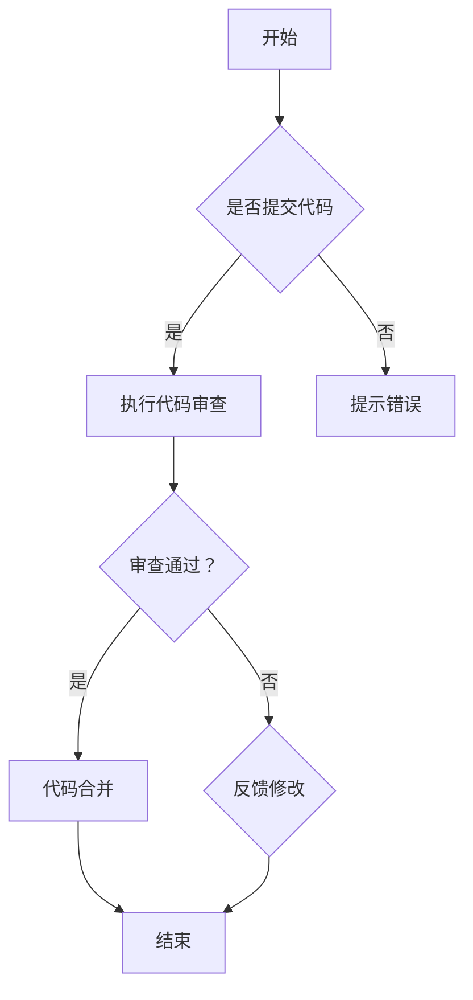

                 

### 《代码审查最佳实践：提升团队代码质量》

---

### 关键词：代码审查、团队协作、代码质量、最佳实践

### 摘要：

本文旨在深入探讨代码审查的最佳实践，旨在提升团队代码质量。我们将通过详细分析代码审查的概念、流程、工具、实践和案例分析，帮助读者理解代码审查的重要性，掌握高效的代码审查方法，并在团队中推广和实施这些实践。通过本文，读者将能够从理论到实践，全面了解代码审查的关键要素，为提升团队开发效率和软件质量奠定坚实基础。

---

## 第一部分：代码审查基础知识

### 第1章：代码审查概述

#### 1.1 代码审查的概念与目的

**概念说明：**
代码审查（Code Review）是一种软件工程实践，通过团队协作，对即将合并到代码库中的代码进行审查和评估。它不仅包括对代码本身的检查，还涉及代码的可维护性、安全性和一致性等方面。

**问题背景：**
随着软件项目的规模和复杂性不断增加，单靠个人能力难以保证代码质量。代码审查提供了一种机制，以团队协作的方式发现潜在的错误，提高代码的可读性和可靠性。

**问题描述：**
如何通过代码审查提升代码质量，同时确保审查过程高效、有序？

**问题解决：**
通过制定合理的代码审查流程、选择合适的审查工具和制定明确的审查标准，可以有效解决代码质量问题。

**边界与外延：**
代码审查不仅局限于代码本身，还包括代码的文档、注释和设计等方面。此外，代码审查可以分为形式审查和内容审查，形式审查关注代码格式和风格，内容审查关注代码逻辑和性能。

**概念结构与核心要素组成：**
- **参与者：** 提交者、审查者、评审者
- **流程：** 准备、审查、反馈、跟进
- **工具：** GitLab Code Review、GitHub Pull Requests等
- **标准：** 编码标准、代码风格指南

#### 1.2 代码审查的类型与方法

**类型：**
- **形式审查：** 关注代码格式和风格，如缩进、命名、注释等。
- **内容审查：** 关注代码逻辑、性能、安全等方面。

**方法：**
- **同行评审：** 团队成员互相审查代码。
- **拉取请求（Pull Request, PR）：** 通过代码库的拉取请求功能进行审查。
- **持续集成（CI）：** 结合自动化测试和代码审查工具。

**对比表格：**

| 方法         | 优点                                                         | 缺点                                                         |
| ------------ | ------------------------------------------------------------ | ------------------------------------------------------------ |
| 同行评审     | 提高代码质量和团队协作。                                     | 审查速度较慢，可能影响开发进度。                               |
| 拉取请求（PR） | 结合代码库功能，方便跟踪和讨论。                             | 需要团队成员熟悉使用特定代码库。                               |
| 持续集成（CI） | 自动化测试和审查，提高效率。                                 | 依赖自动化测试框架，可能无法覆盖所有问题。                     |

#### 1.3 代码审查的重要性与挑战

**重要性：**
- 提高代码质量和可维护性。
- 防止潜在的错误和漏洞。
- 促进团队协作和知识共享。

**挑战：**
- 审查效率与开发进度的平衡。
- 审查标准的不一致。
- 审查反馈的及时性和有效性。

**解决方案：**
- 制定明确的审查标准和流程。
- 选择合适的审查工具。
- 培训团队成员，提高审查技能。
- 实施反馈机制，确保及时跟进。

## 第二部分：代码审查流程

### 第2章：代码审查流程

#### 2.1 代码审查的准备

**准备工作：**
- 确定审查目标和范围。
- 选择合适的审查工具。
- 制定审查标准和流程。

**具体步骤：**
1. **提交代码：** 提交者将代码提交到代码库，并创建拉取请求（PR）。
2. **通知审查者：** 通知团队成员进行审查。
3. **审查准备：** 审查者查看代码，准备审查。

#### 2.2 代码审查的实施

**实施步骤：**
1. **代码阅读：** 审查者逐行阅读代码，检查代码格式和逻辑。
2. **讨论和反馈：** 审查者与提交者讨论代码问题，提出改进建议。
3. **修改代码：** 提交者根据审查意见修改代码。

#### 2.3 代码审查的反馈与跟进

**反馈与跟进：**
1. **审查结果：** 审查者提交审查结果，包括代码改进建议和反馈意见。
2. **反馈讨论：** 提交者与审查者讨论反馈，确定修改方案。
3. **代码合并：** 提交者根据审查结果修改代码，并合并到主分支。

## 第三部分：代码审查工具与资源

### 第3章：常用的代码审查工具

#### 3.1 GitLab Code Review

**功能特点：**
- 实时代码审查。
- 评论和讨论功能。
- 代码覆盖率和漏洞检测。

**使用步骤：**
1. 创建拉取请求（PR）。
2. 审查者查看代码。
3. 提交评论和建议。
4. 提交者修改代码。

#### 3.2 GitHub Pull Requests

**功能特点：**
- 简便的代码审查流程。
- 代码合并和分支管理。
- 评论和讨论功能。

**使用步骤：**
1. 创建拉取请求（PR）。
2. 审查者查看代码。
3. 提交评论和建议。
4. 提交者修改代码。

#### 3.3 其他流行的代码审查工具

**GitLab CI/CD：**
- 自动化代码审查和测试。
- 集成到持续集成流程。

**Phabricator：**
- 实时代码审查。
- 提供审查工具和平台。

**Gerrit：**
- 代码审查和合并工具。
- 提供版本控制和审查流程。

### 第4章：代码审查资源与文档

#### 4.1 代码审查模板

**模板内容：**
- 审查项目列表。
- 审查标准和流程。
- 审查者职责。

**使用场景：**
- 提高审查过程的规范性和效率。

#### 4.2 代码审查指南

**指南内容：**
- 审查目标和范围。
- 审查标准和流程。
- 审查工具和资源。

**使用场景：**
- 帮助团队成员了解和执行代码审查。

#### 4.3 代码风格指南

**指南内容：**
- 代码格式和命名规范。
- 注释和文档编写规范。

**使用场景：**
- 提高代码的可读性和一致性。

## 第四部分：代码审查实践

### 第5章：代码审查最佳实践

#### 5.1 提高代码可读性

**实践方法：**
- 使用清晰、简洁的变量和函数命名。
- 保持代码简洁，避免过度抽象。
- 适量使用注释，解释代码逻辑。

**案例分析：**
- 提高代码可读性，减少误解和错误。

#### 5.2 遵循编码标准

**实践方法：**
- 使用统一的编码风格。
- 遵循编程语言的最佳实践。
- 代码格式化和语法检查。

**案例分析：**
- 提高代码的可维护性和可读性。

#### 5.3 减少代码缺陷

**实践方法：**
- 使用自动化测试。
- 进行代码走查和静态分析。
- 定期进行代码审计。

**案例分析：**
- 提高代码的可靠性和稳定性。

## 第五部分：代码审查案例分析

### 第6章：代码审查案例分析

#### 6.1 成功案例

**案例背景：**
- 团队实施严格的代码审查流程。
- 遵循统一的编码标准和最佳实践。

**案例成果：**
- 代码质量和稳定性显著提高。
- 团队协作和知识共享得到加强。

#### 6.2 失败案例

**案例背景：**
- 缺乏明确的审查标准和流程。
- 审查过程过于宽松。

**案例成果：**
- 代码质量参差不齐。
- 团队成员对代码审查的重要性认识不足。

#### 6.3 案例分析

**分析内容：**
- 成功案例和失败案例的共同点和差异。
- 代码审查的最佳实践和方法。

**案例分析：**
- 如何从案例中学习并改进代码审查流程。

## 第六部分：代码审查的持续改进

### 第7章：代码审查的持续改进

#### 7.1 团队协作与反馈

**实践方法：**
- 建立有效的沟通渠道。
- 定期进行团队讨论和反馈。

**案例分析：**
- 提高审查质量和效率。

#### 7.2 代码审查流程优化

**实践方法：**
- 定期评估审查流程的有效性。
- 根据实际情况调整流程。

**案例分析：**
- 提高审查效率和团队满意度。

#### 7.3 代码质量监控

**实践方法：**
- 使用代码质量分析工具。
- 定期进行代码质量评估。

**案例分析：**
- 提高代码质量和可靠性。

## 第七部分：未来展望

### 第8章：未来展望

#### 8.1 代码审查技术的演进

**技术趋势：**
- 智能代码审查。
- 自动化审查工具的普及。

**影响：**
- 提高审查效率和准确性。

#### 8.2 代码审查的未来趋势

**趋势预测：**
- 审查工具的集成化。
- 审查流程的自动化。

**影响：**
- 简化审查流程，提高团队协作效率。

#### 8.3 代码审查在教育领域的应用

**应用方向：**
- 教育课程设计。
- 实践教学项目。

**影响：**
- 提高学生的编程能力和团队协作能力。

## 附录：代码审查资源汇总

### A.1 开源代码审查工具汇总

**工具列表：**
- GitLab Code Review
- GitHub Pull Requests
- GitLab CI/CD
- Phabricator
- Gerrit

**使用指南：**
- 介绍各工具的功能和特点。
- 提供安装和使用指南。

### A.2 代码审查书籍与文章推荐

**书籍推荐：**
- 《代码大全》
- 《软件工艺》
- 《代码审查：实践与实例》

**文章推荐：**
- 《如何进行高效的代码审查》
- 《代码审查的最佳实践》
- 《代码审查技术在持续集成中的应用》

### A.3 代码审查社区与论坛

**社区和论坛：**
- Stack Overflow
- GitHub Community
- GitLab Community

**资源指南：**
- 提供代码审查相关问题和讨论。
- 分享最佳实践和经验。

---

### 作者信息：

**作者：** AI天才研究院/AI Genius Institute & 禅与计算机程序设计艺术 /Zen And The Art of Computer Programming

---

本文深入探讨了代码审查的最佳实践，旨在提升团队代码质量。通过详细分析代码审查的概念、流程、工具、实践和案例分析，本文为读者提供了全面的代码审查指南。代码审查不仅有助于提高代码质量和团队协作，还能够预防潜在的错误和漏洞。未来，随着技术的不断演进，代码审查工具和流程将更加智能化和自动化，为软件开发带来更多便利和效率。希望本文能为您的团队提供有价值的参考和启示。

---

**附录：Mermaid 流程图与LaTeX公式示例**

**Mermaid 流程图示例：**

**LaTeX 公式示例：**

独立段落的公式：

$$
E = mc^2
$$

段落内的公式：

$1+1=2$

---

**全文结束。感谢您的阅读！**

