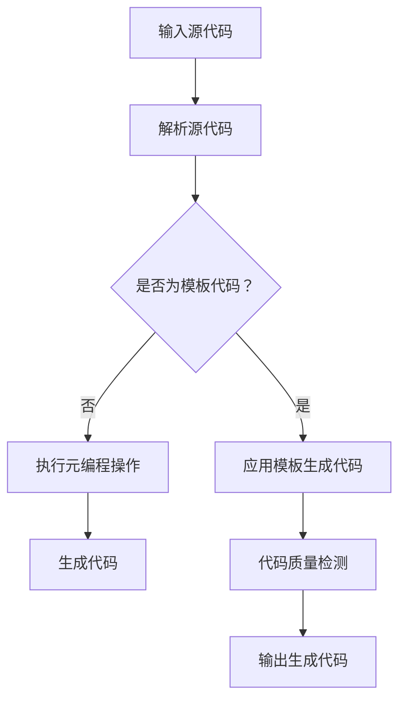
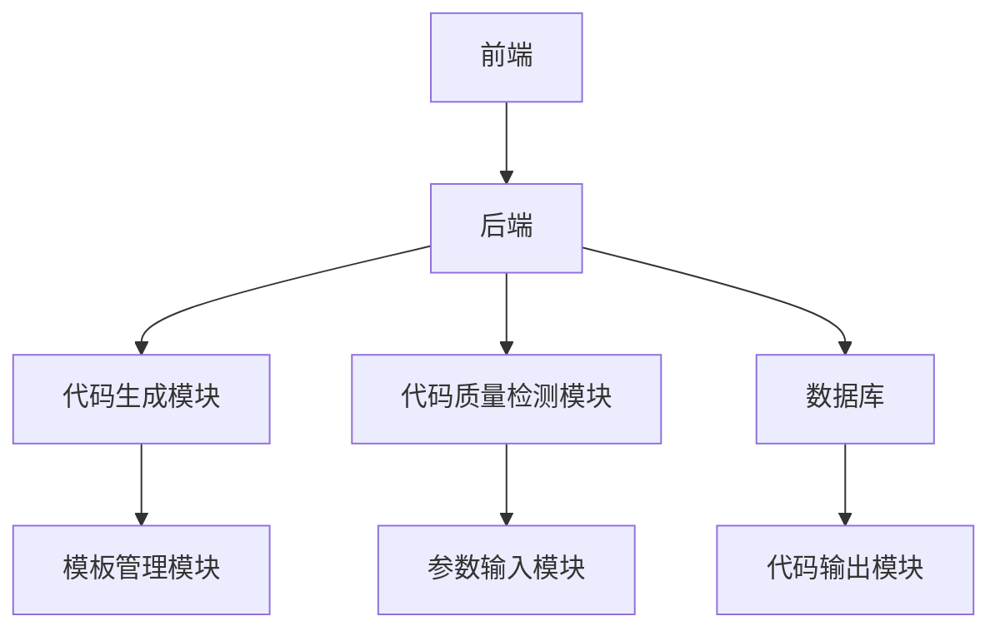
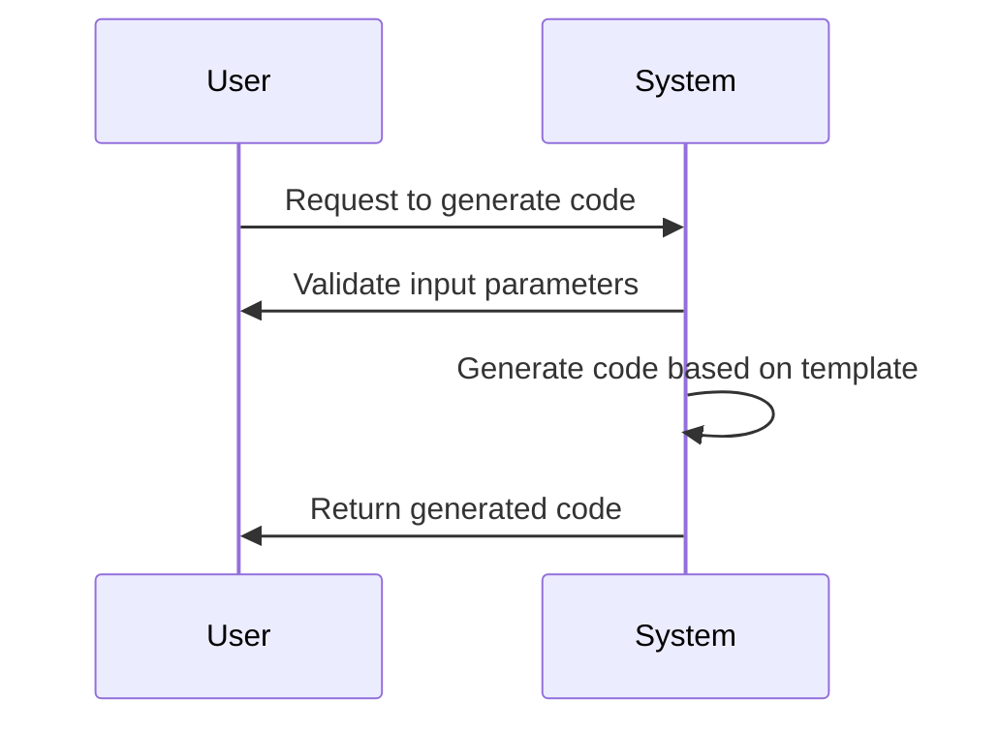
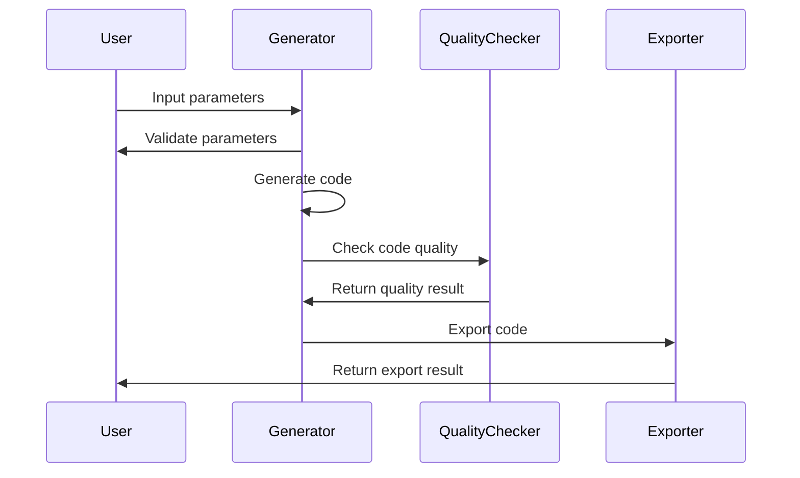

                 


### 1. 背景介绍

#### 核心概念术语说明
在讨论代码生成技术之前，我们需要明确几个核心概念：

- **代码生成（Code Generation）**：是指通过特定的算法和工具，从代码模板或抽象语法树（Abstract Syntax Tree, AST）自动生成代码的过程。
- **模板代码生成（Template-Based Code Generation）**：基于预定义的模板，通过填充变量来生成代码。
- **元编程（Meta-Programming）**：是指计算机程序能够操作其他程序，生成新的代码或修改现有代码的能力。
- **抽象语法树（Abstract Syntax Tree, AST）**：是源代码结构的抽象表示，用于编译、解释和代码生成等过程。

#### 问题背景
在软件开发过程中，代码生成技术应运而生，旨在提高开发效率和代码质量。然而，随着应用场景的不断扩大，代码生成技术也面临着一系列问题：

- **代码可维护性**：自动生成的代码可能缺乏良好的结构和注释，导致后续维护困难。
- **性能优化**：自动生成的代码可能无法达到手动编写代码的性能优化水平。
- **定制化需求**：特定项目或领域的定制化需求可能无法通过现有的代码生成工具满足。

#### 问题描述
代码生成技术旨在解决以下问题：

- **重复性工作**：自动化代码生成可以减少重复性劳动，提高开发效率。
- **代码质量**：通过代码模板和质量保证工具，可以生成高质量的代码。
- **定制化**：代码生成技术可以根据不同的需求生成特定功能的代码。

#### 问题解决
代码生成技术的解决方法包括：

- **模板库**：提供丰富的代码模板库，满足不同开发需求。
- **元编程框架**：利用元编程技术，提高代码生成过程的灵活性和定制化。
- **代码质量检测工具**：确保自动生成的代码符合质量标准。

#### 边界与外延
代码生成技术并非万能，其边界和局限性包括：

- **学习曲线**：对于初学者，代码生成技术可能带来较高的学习成本。
- **依赖性**：过度依赖代码生成工具可能导致项目对特定工具的依赖。
- **技术演进**：随着技术更新迭代，代码生成工具可能需要不断升级。

#### 概念结构与核心要素组成
代码生成技术的基本结构包括：

- **输入**：源代码模板、配置文件、用户需求等。
- **算法**：用于解析、变换和生成代码的算法。
- **输出**：自动生成的代码文件。

### 2. 核心概念与联系

#### 代码生成技术的基本概念
代码生成技术涉及多个核心概念，包括模板代码生成、元编程和抽象语法树。以下是这些概念的定义：

- **模板代码生成**：基于预定义的模板，通过填充变量来生成代码。
- **元编程**：计算机程序能够操作其他程序，生成新的代码或修改现有代码的能力。
- **抽象语法树**：是源代码结构的抽象表示，用于编译、解释和代码生成等过程。

#### 概念属性特征对比表格
为了更好地理解这些概念之间的关系，我们可以通过一个表格来对比它们的属性特征：

| 概念          | 定义                                                         | 属性特征                                           |
|---------------|--------------------------------------------------------------|----------------------------------------------------|
| 模板代码生成 | 基于预定义模板的代码生成                                     | 高度自动化、重复性劳动减少、代码质量可控           |
| 元编程        | 程序操作程序的能力，生成或修改代码                            | 高级抽象、灵活性高、代码结构复杂                   |
| 抽象语法树    | 源代码结构的抽象表示，用于编译、解释和代码生成等过程         | 易于操作、代码结构清晰、便于分析                   |

#### ER实体关系图架构
为了更直观地展示这些概念之间的关系，我们可以使用ER实体关系图来表示：

```mermaid
erDiagram
    TemplateCodeGeneration ||--|{ MetaProgramming : implements }
    MetaProgramming ||--|{ AbstractSyntaxTree : processes }
    AbstractSyntaxTree ||--|{ TemplateCodeGeneration : generates }
```

在这个ER图中，TemplateCodeGeneration（模板代码生成）实现了MetaProgramming（元编程），而MetaProgramming则处理AbstractSyntaxTree（抽象语法树），最终生成TemplateCodeGeneration。

### 3. 算法原理讲解

#### 算法mermaid流程图
为了更好地理解代码生成算法的工作原理，我们可以使用mermaid绘制一个流程图：



在这个流程图中，输入源代码首先被解析，然后判断是否为模板代码。如果是，则直接应用模板生成代码；如果不是，则执行元编程操作。最后，对生成的代码进行质量检测，并输出最终结果。

#### Python源代码展示
以下是一个简单的Python源代码示例，用于展示模板代码生成：

```python
# 模板代码
template_code = """
class {class_name}:
    def __init__(self):
        self.{attribute_name} = {attribute_value}

    def {method_name}(self):
        print("Hello, {greeting}!")
"""

# 用户输入
class_name = "User"
attribute_name = "name"
attribute_value = "Alice"
method_name = "greet"
greeting = "World"

# 应用模板生成代码
code = template_code.format(
    class_name=class_name,
    attribute_name=attribute_name,
    attribute_value=attribute_value,
    method_name=method_name,
    greeting=greeting
)

# 输出生成的代码
print(code)
```

运行上述代码将生成一个简单的Python类：

```python
class User:
    def __init__(self):
        self.name = "Alice"

    def greet(self):
        print("Hello, World!")
```

#### 算法原理的数学模型和公式
代码生成算法的原理可以通过以下数学模型和公式来解释：

$$
\text{输出代码} = f(\text{模板}, \text{变量值})
$$

其中，`f` 表示代码生成函数，`模板` 和 `变量值` 是输入参数。该函数将模板中的变量替换为具体的变量值，生成最终的代码。

#### 详细讲解和举例说明
假设我们有一个简单的模板代码：

```mermaid
class {{class_name}} {
    def {{method_name}}():
        print("Hello, {{greeting}}!")
}
```

用户可以根据不同的参数生成不同的类：

- **示例1**：

  ```python
  class_name = "Greeting"
  method_name = "say_hello"
  greeting = "World"
  ```

  生成的代码：

  ```python
  class Greeting {
      def say_hello():
          print("Hello, World!")
  }
  ```

- **示例2**：

  ```python
  class_name = "Welcome"
  method_name = "say_welcome"
  greeting = "Friend"
  ```

  生成的代码：

  ```python
  class Welcome {
      def say_welcome():
          print("Hello, Friend!")
  }
  ```

通过这种方式，代码生成技术可以灵活地生成满足不同需求的代码。

### 4. 系统分析与架构设计

#### 问题场景介绍
在软件开发中，我们经常会遇到需要生成大量相似代码的场景，如生成数据库表结构、接口文档等。这种重复性的工作不仅消耗时间，还容易引入错误。因此，引入代码生成技术可以显著提高开发效率，降低维护成本。

#### 项目介绍
为了演示代码生成技术的应用，我们选择了一个简单的项目——生成RESTful API接口代码。该项目包括以下功能：

- 生成接口定义文件（.proto文件）
- 生成API接口代码（如Java、Python等）
- 生成接口测试用例代码

#### 系统功能设计
系统功能设计包括以下模块：

- **模板管理模块**：负责管理模板代码，包括模板的创建、修改和删除。
- **参数输入模块**：接收用户输入的参数，如接口名称、参数等。
- **代码生成模块**：根据模板和输入参数生成代码。
- **代码质量检测模块**：检测生成的代码是否符合质量标准。
- **代码输出模块**：将生成的代码输出到指定的文件或目录。

以下是领域模型Mermaid类图：

```mermaid
classDiagram
    ClassA[模板管理模块] <|-- ClassB[参数输入模块]
    ClassB <|-- ClassC[代码生成模块]
    ClassC <|-- ClassD[代码质量检测模块]
    ClassD <|-- ClassE[代码输出模块]
```

#### 系统架构设计
系统架构设计如下：

- **前端**：用户通过前端界面输入参数和选择模板。
- **后端**：后端服务器处理用户请求，调用代码生成模块和代码质量检测模块。
- **数据库**：存储模板信息和用户输入参数。

以下是系统架构图：



#### 系统接口设计
系统接口设计包括以下接口：

- **/api/generate_code**：用于生成代码。
- **/api/check_code_quality**：用于检查代码质量。
- **/api/export_code**：用于输出代码到文件。

以下是系统接口设计：



#### 系统交互序列图
以下是系统交互序列图：



### 5. 项目实战

#### 环境安装
为了演示代码生成项目，我们需要安装以下环境：

- Python 3.8及以上版本
- Django 3.2
- Jinja2 2.11

安装命令如下：

```bash
pip install python3.8 django==3.2 jinja2==2.11
```

#### 系统核心实现源代码
以下是一个简单的Django项目，用于生成RESTful API接口代码：

```python
# settings.py
INSTALLED_APPS = [
    'django.contrib.admin',
    'django.contrib.auth',
    'django.contrib.contenttypes',
    'django.contrib.sessions',
    'django.contrib.messages',
    'django.contrib.staticfiles',
    'api_generator',
]

# views.py
from django.http import JsonResponse
from django.views import View
from .models import Template, Code

class CodeGeneratorView(View):
    def post(self, request, *args, **kwargs):
        data = request.POST
        template_id = data.get('template_id')
        class_name = data.get('class_name')
        method_name = data.get('method_name')
        greeting = data.get('greeting')

        template = Template.objects.get(id=template_id)
        code = template.generate_code(class_name, method_name, greeting)

        return JsonResponse({'code': code})

# models.py
from django.db import models

class Template(models.Model):
    name = models.CharField(max_length=100)
    template_code = models.TextField()

    def generate_code(self, class_name, method_name, greeting):
        return self.template_code.format(
            class_name=class_name,
            method_name=method_name,
            greeting=greeting
        )

class Code(models.Model):
    template = models.ForeignKey(Template, on_delete=models.CASCADE)
    class_name = models.CharField(max_length=100)
    method_name = models.CharField(max_length=100)
    greeting = models.CharField(max_length=100)
    generated_code = models.TextField()
```

#### 代码应用解读与分析
在这个项目中，我们使用了Django框架来构建一个简单的后端服务。用户通过POST请求提交参数，如模板ID、类名、方法名和问候语。后端服务根据这些参数生成代码，并返回给用户。

具体来说，`CodeGeneratorView` 类负责处理用户请求。首先，从请求中获取模板ID、类名、方法名和问候语。然后，从数据库中获取对应的模板，并调用 `generate_code` 方法生成代码。最后，将生成的代码作为响应返回给用户。

`Template` 和 `Code` 类分别表示模板和生成的代码。`Template` 类包含模板名称和模板代码字段，以及一个用于生成代码的 `generate_code` 方法。`Code` 类包含模板ID、类名、方法名、问候语和生成的代码字段。

#### 实际案例分析
以下是一个实际案例，演示如何使用此系统生成RESTful API接口代码：

1. 用户创建一个模板，如以下代码：

   ```python
   class Template:
       name = "GreetingTemplate"
       template_code = """
       class {class_name}:
           def {method_name}(self):
               print("Hello, {greeting}!")
       """
   ```

2. 用户提交以下请求：

   ```bash
   POST /api/generate_code
   {
       "template_id": 1,
       "class_name": "Welcome",
       "method_name": "say_hello",
       "greeting": "World"
   }
   ```

3. 后端服务生成以下代码：

   ```python
   class Welcome:
       def say_hello(self):
           print("Hello, World!")
   ```

4. 生成的代码被返回给用户，用户可以将其保存到文件或直接使用。

#### 项目小结
通过本项目的实战案例，我们展示了如何使用代码生成技术提高开发效率。用户只需定义一次模板，即可通过简单的请求生成满足特定需求的代码。这种方式不仅减少了重复性工作，还有助于提高代码质量和一致性。

### 6. 最佳实践

#### 注意事项
1. **代码可维护性**：在生成代码时，务必添加适当的注释和文档，以便后续维护。
2. **性能优化**：自动生成的代码可能无法达到手动编写代码的性能水平，因此在必要时进行手动优化。
3. **定制化需求**：对于特殊需求，可能需要定制化代码生成工具或模板，以确保生成代码满足特定要求。

#### 小结
代码生成技术是一个强大的工具，可以提高开发效率、降低维护成本。然而，正确使用和配置代码生成工具至关重要。通过遵循最佳实践，我们可以充分发挥代码生成技术的优势。

#### 拓展阅读
1. 《编程之美：代码生成技术深度剖析》
2. 《代码生成工具实战：从入门到精通》
3. 《元编程：编程的编程》

### 作者
AI天才研究院/AI Genius Institute & 禅与计算机程序设计艺术 /Zen And The Art of Computer Programming

