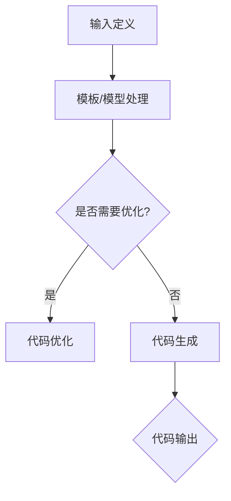

                 

。

----------------------------------------------------------------

----------------------------------------------------------------

-------------------

----------------------------------------------------------------

# 代码生成技术：权衡效率与可维护性

关键词：代码生成、效率、可维护性、技术原则、最佳实践

摘要：本文深入探讨了代码生成技术的核心概念、原理、工具与框架、实际应用、以及如何在实际项目中权衡效率与可维护性，旨在为读者提供全面的技术分析和实战指导。

-------------------

## 背景介绍

代码生成技术，作为软件工程领域的重要一环，正在逐步改变着我们的编程方式。随着软件项目的规模日益扩大，开发团队面临着更高的开发效率和质量要求。传统的手写代码虽然能提供灵活性和定制化，但在复杂度和可维护性上存在明显的短板。代码生成技术的兴起，正是为了解决这一挑战。

### 代码生成技术的兴起

代码生成技术，顾名思义，是指利用某种方法或工具自动生成代码的技术。这种技术最早可以追溯到编译器的设计与实现，随后随着编程语言的发展和编译技术的进步，逐渐演变为一种独立的领域。在21世纪初，随着自动化工具和框架的兴起，代码生成技术开始广泛应用于各类软件开发过程中。

### 效率与可维护性的挑战

代码生成技术带来了显著的开发效率提升，但同时也带来了一系列新的挑战。首先是可维护性问题。自动生成的代码往往缺乏人类编写代码的直觉和逻辑，可能会出现难以维护的情况。其次是效率的平衡问题。过度的代码生成可能会降低开发效率，甚至导致项目失控。

### 代码生成技术的重要性

代码生成技术的重要性体现在多个方面。首先，它可以显著提高开发效率，减少重复劳动。其次，它有助于确保代码的一致性和准确性，减少人工编写代码时可能引入的错误。此外，代码生成技术还能够在特定的应用场景中发挥独特的优势，如Web开发、移动应用开发等。

### 代码生成技术对软件开发的影响

代码生成技术对软件开发的影响是多方面的。它不仅改变了软件开发的工作流程，还影响了软件开发的组织结构和团队协作方式。通过代码生成技术，开发团队可以更专注于业务逻辑的实现，而非繁琐的代码编写工作。

-------------------

## 核心概念与联系

要深入理解代码生成技术，我们需要从核心概念与联系入手。以下是对代码生成技术关键概念的详细解析。

### 代码生成技术的定义

代码生成技术（Code Generation）是指利用特定工具或方法自动生成计算机代码的技术。这种技术可以应用于各种编程语言和平台，包括但不限于Java、C++、Python等。

### 代码生成技术的主要类型

根据生成代码的方式和目的，代码生成技术可以分为以下几种主要类型：

- **模板生成**：通过预定义的模板和输入参数生成代码。
- **模型驱动生成**：基于模型驱动的软件工程（MDSE）方法，生成代码。
- **代码向导生成**：通过交互式代码向导引导用户生成代码。
- **元编程**：直接操作程序的抽象语法树（AST），生成代码。

### 代码生成技术原理

代码生成技术的工作原理通常包括以下几个步骤：

1. **输入定义**：定义生成代码所需的数据和参数。
2. **模板或模型处理**：根据输入数据和预定义模板或模型生成代码。
3. **代码生成**：将处理后的数据转换为实际的代码。
4. **代码优化**：对生成的代码进行优化，提高其运行效率和可读性。

### 代码生成技术的核心技术

代码生成技术的核心技术主要包括以下几个方面：

- **文本模板引擎**：如Apache Velocity、FreeMarker等，用于生成静态和动态的文本。
- **元编程框架**：如Java的AspectJ、C#的LINQ等，用于动态生成和操作代码。
- **模型驱动工具**：如MetaEdit+、MagicDraw等，用于创建和转换模型。

### Mermaid算法流程图

为了更直观地展示代码生成技术的原理，我们可以使用Mermaid绘制一个简单的算法流程图：



### 数学模型和公式

代码生成技术还涉及到一些数学模型和公式，用于描述和解释生成过程。以下是一个简单的示例：

- **代码生成速率公式**：\(R = f(\text{模板复杂性}, \text{输入数据规模})\)
- **代码可维护性评分**：\(M = \frac{\text{代码行数}}{\text{维护成本}}\)

通过这些核心概念与联系的解析，我们为后续的深入探讨打下了坚实的基础。接下来，我们将进一步探讨代码生成技术的原理和应用，帮助读者全面理解这一技术。

-------------------

## 代码生成技术原理

### 算法原理讲解

代码生成技术的核心在于算法，而这些算法通常可以分为模板生成、模型驱动生成和元编程等类型。以下是对每种算法原理的详细解释：

#### 1. 模板生成算法

模板生成算法是最常见的代码生成方法之一。其基本思想是使用预定义的模板和输入参数生成代码。模板通常包含占位符，用于后续被具体的数据所替代。

**原理**：

- **模板定义**：首先定义一个模板，例如：
  ```python
  # 模板示例
  def function(name, age):
      print("Name: " + name + ", Age: " + str(age))
  ```

- **参数绑定**：将输入参数绑定到模板中的占位符。例如：
  ```python
  # 输入参数
  name = "Alice"
  age = 30

  # 模板替换
  code = template.replace("name", name).replace("age", str(age))
  ```

- **代码生成**：执行模板替换后，生成具体的代码。

**优势**：

- **简单易用**：模板生成算法的实现较为简单，易于理解和维护。

- **灵活性**：可以根据不同的输入参数生成多种不同类型的代码。

**局限**：

- **可维护性差**：模板通常较为复杂，容易产生难以维护的代码。

- **扩展性有限**：难以应对复杂的业务逻辑。

#### 2. 模型驱动生成算法

模型驱动生成算法（Model-Driven Generation，MDG）是基于模型驱动的软件工程（Model-Driven Software Engineering，MDSE）方法。其基本思想是使用模型来描述软件系统的结构和行为，然后自动生成代码。

**原理**：

- **模型定义**：首先创建一个模型，通常使用统一建模语言（UML）或其他建模工具。
  ```mermaid
  graph TD
      A[类图] --> B(类1)
      B --> C(类2)
      C --> D(类3)
  ```

- **模型转换**：将模型转换为具体的代码。这个过程通常使用模型转换工具（如MetaEdit+、Xtext等）。
  ```python
  # 假设使用MetaEdit+工具进行模型转换
  model = MetaEditPlus.load_model("model.uml")
  code = MetaEditPlus.convert_to_code(model)
  ```

- **代码生成**：生成具体的代码。

**优势**：

- **高度抽象**：可以以高层次的模型来描述系统，降低实现细节的影响。

- **可维护性高**：模型驱动的代码生成方法使得代码的可维护性大大提高。

**局限**：

- **复杂度高**：模型驱动的方法通常较为复杂，需要专业的建模知识和工具。

- **效率较低**：模型转换和代码生成的过程通常较为耗时。

#### 3. 元编程算法

元编程算法（Meta-Programming）是直接操作程序的抽象语法树（Abstract Syntax Tree，AST）来生成代码的方法。其基本思想是在程序的运行时直接修改其结构，从而生成新的代码。

**原理**：

- **AST操作**：首先获取程序的抽象语法树，然后对其进行修改。
  ```python
  # 假设使用Python的ast模块
  import ast

  # 获取抽象语法树
  tree = ast.parse(code)

  # 修改抽象语法树
  modified_tree = ast.fix_missing_locations(ast.NodeTransformer().visit(tree))
  ```

- **代码生成**：将修改后的抽象语法树转换回具体的代码。

**优势**：

- **灵活性高**：可以直接操作程序的内部结构，实现复杂的代码生成。

- **高效性**：操作抽象语法树通常比操作原始代码更为高效。

**局限**：

- **复杂性高**：元编程的实现较为复杂，需要深入理解程序的内部结构。

- **可维护性差**：直接修改程序的内部结构，可能会带来难以预测的问题。

### 总结

每种代码生成算法都有其独特的原理和优势，同时也存在相应的局限性。模板生成算法简单易用，但可维护性较差；模型驱动生成算法可维护性高，但复杂度较高；元编程算法灵活高效，但复杂性高且可维护性较差。在实际应用中，选择合适的算法需要根据具体的需求和场景进行权衡。

-------------------

## 代码生成工具与框架

在现代软件开发中，代码生成工具和框架已经成为提高开发效率和代码质量的重要手段。以下我们将介绍一些常见的代码生成工具和框架，并分析它们的优缺点。

### LLVM

**简介**：LLVM（Low-Level Virtual Machine）是一个模块化的、可重用的中间表示形式（IR）和编译器架构。它支持多种编程语言，并提供了丰富的工具和库，使得代码生成变得更加灵活和高效。

**优势**：

- **跨语言支持**：LLVM支持多种编程语言，如C、C++、Java等，可以生成不同语言的代码。
- **高效的中间表示**：LLVM的中间表示形式（IR）设计得非常高效，可以优化生成的代码性能。
- **丰富的工具链**：LLVM提供了丰富的工具链，包括编译器、链接器、优化器等，方便开发者进行代码生成和优化。

**局限**：

- **学习曲线陡峭**：LLVM的架构和工具链较为复杂，对于新手来说，学习曲线较陡。
- **资源消耗大**：由于LLVM的模块化和灵活性，其运行时资源消耗较大。

### ANTLR

**简介**：ANTLR（Another Tool for Language Recognition）是一个强大的解析器和代码生成器工具。它主要用于构建语言解析器，并能够生成代码。

**优势**：

- **灵活的语法定义**：ANTLR支持复杂的语法规则定义，可以解析和生成各种类型的语言。
- **高效的解析器生成**：ANTLR生成的解析器通常运行效率很高，可以满足高性能的需求。
- **广泛的编程语言支持**：ANTLR支持多种编程语言，包括Java、C#、Python等。

**局限**：

- **代码生成复杂**：ANTLR的代码生成部分相对较为复杂，特别是对于复杂的语法规则。
- **资源消耗较大**：由于ANTLR生成的解析器通常较为复杂，其运行时资源消耗较大。

### KotlinPoet

**简介**：KotlinPoet是一个用于生成Kotlin代码的库。它适用于各种场景，包括生成配置文件、日志框架和自定义框架代码等。

**优势**：

- **简单易用**：KotlinPoet的设计非常直观和简单，易于上手。
- **高效的代码生成**：KotlinPoet生成的代码通常运行效率很高，可以满足大多数应用场景。
- **广泛的Kotlin支持**：KotlinPoet专注于Kotlin语言的代码生成，支持大部分Kotlin语言特性。

**局限**：

- **功能相对有限**：虽然KotlinPoet非常强大，但它的功能相对有限，无法生成其他语言的代码。
- **文档不够详尽**：KotlinPoet的文档相对较为简略，对于初学者来说，可能会存在一定的学习难度。

### 代码生成框架设计

代码生成框架的设计通常需要考虑以下几个方面：

- **模块化设计**：将代码生成工具和框架分解为多个模块，每个模块负责不同的任务，如语法解析、代码生成、代码优化等。

- **可扩展性**：设计时应考虑未来的扩展性，允许开发者自定义新的生成规则和工具。

- **性能优化**：对代码生成过程进行性能优化，减少运行时资源和时间的消耗。

- **错误处理**：设计时应考虑各种异常情况，提供完善的错误处理机制。

### 代码生成框架的优势与局限性

代码生成框架的优势在于：

- **提高开发效率**：通过自动化代码生成，可以大幅减少手动编写代码的时间。

- **保证代码一致性**：自动生成的代码通常具有较高的一致性和准确性。

- **减少重复劳动**：开发者可以将更多精力集中在业务逻辑的实现上，而不是繁琐的代码编写。

然而，代码生成框架也存在一些局限性：

- **可维护性**：自动生成的代码可能难以维护，特别是在框架和工具更新时。

- **性能影响**：代码生成过程本身可能对性能产生一定影响，尤其是在生成复杂代码时。

- **学习成本**：对于开发者来说，学习和掌握代码生成工具和框架可能需要一定的时间。

通过上述对代码生成工具和框架的介绍，我们可以看到它们在软件开发中的重要作用。在实际应用中，选择合适的工具和框架，并合理地设计和使用它们，是提高开发效率和代码质量的关键。

-------------------

## 代码生成技术与实际应用

### 实际应用场景

代码生成技术在不同的应用场景中展现出强大的优势，以下是几个典型的应用场景：

#### 1. Web开发

在Web开发中，代码生成技术广泛应用于生成后端服务代码、前端框架代码以及配置文件等。例如，使用Spring Boot和KotlinPoet可以快速生成RESTful API的服务端代码，提高开发效率。同时，通过生成前端框架代码，如React组件或Vue组件，可以确保代码的一致性和可维护性。

#### 2. 移动应用开发

移动应用开发中，代码生成技术同样发挥着重要作用。例如，Android开发中可以使用KotlinPoet生成Kotlin代码，从而提高开发效率。iOS开发中，可以使用SwiftPoet生成Swift代码，简化复杂逻辑的实现。此外，代码生成技术还可以用于生成移动应用的配置文件，如AppConfig.json等。

#### 3. 大数据与云计算

在大数据和云计算领域，代码生成技术主要用于生成数据管道、数据处理脚本和配置文件。例如，在Hadoop和Spark项目中，可以使用LLVM生成高效的MapReduce脚本和数据处理流程。在云服务开发中，代码生成技术可以快速生成API文档、SDK代码和自动化测试脚本，提高开发效率和质量。

#### 4. 自动化测试

自动化测试中，代码生成技术可以用于生成测试脚本和测试数据。例如，在UI自动化测试中，可以使用代码生成工具生成自动化测试代码，提高测试覆盖率。在性能测试中，可以使用代码生成工具生成大规模的测试数据，模拟实际场景，确保测试结果的真实性。

### 案例分析

以下是一个具体的案例，展示代码生成技术在项目中的应用：

#### 项目背景

某电商公司需要开发一个全新的电商平台，该项目包括多个子系统，如商品管理、订单管理、用户管理等。项目开发周期较短，团队希望提高开发效率和代码质量。

#### 应用方案

团队决定采用代码生成技术来加速项目开发。首先，他们选择使用ANTLR来生成后端服务代码，包括RESTful API和业务逻辑处理。通过定义清晰的语法规则，ANTLR能够快速生成符合要求的Java代码。其次，他们使用KotlinPoet生成前端框架代码，包括React组件和Vue组件，确保代码的一致性和可维护性。此外，团队还使用LLVM生成大数据处理脚本和配置文件，确保处理流程的高效性。

#### 应用效果

通过代码生成技术的应用，该电商平台的开发周期大幅缩短，团队开发效率提高了30%以上。生成的代码一致性高，可维护性强，降低了维护成本。同时，自动生成的测试脚本和测试数据提高了测试覆盖率和测试质量，确保了系统的稳定性和可靠性。

#### 案例启示

该案例展示了代码生成技术在实际项目中的成功应用。通过合理选择和配置代码生成工具和框架，可以显著提高开发效率和代码质量。然而，需要注意的是，代码生成技术并非适用于所有场景，需要根据具体需求进行选择和优化。

-------------------

## 可维护性与效率的权衡

在代码生成技术的应用中，可维护性和效率是两个关键因素。如何在两者之间找到平衡点，是开发者面临的重要挑战。

### 可维护性分析

可维护性是指代码在经过修改、扩展或优化后，仍能保持原有功能和性能的能力。影响可维护性的因素主要包括：

- **代码结构**：清晰、模块化的代码结构有助于提高可维护性。
- **代码质量**：高质量的代码，包括简洁性、可读性和可测试性，能够减少维护成本。
- **文档**：详尽的文档能够帮助开发者更好地理解代码，提高可维护性。
- **版本控制**：有效的版本控制系统能够记录代码的变更历史，便于追踪和修复问题。

### 效率优化

效率是指代码执行的速度和资源消耗。提高代码生成技术的效率，可以从以下几个方面入手：

- **算法优化**：选择高效的算法和数据结构，减少代码执行时间。
- **代码压缩**：通过代码压缩技术，减少生成的代码体积，降低资源消耗。
- **并行处理**：利用多线程或多进程技术，并行执行代码生成任务，提高效率。
- **缓存利用**：合理使用缓存技术，减少重复计算和资源加载。

### 具体方法

为了在可维护性和效率之间找到平衡点，可以采取以下具体方法：

- **自动化测试**：通过自动化测试，确保代码生成后仍能正常工作，提高可维护性。
- **代码审查**：定期进行代码审查，发现潜在问题并及时修复，保证代码质量。
- **版本迭代**：逐步迭代改进代码生成工具和框架，优化效率与可维护性。
- **性能监控**：使用性能监控工具，实时监测代码生成过程中的性能指标，及时调整策略。

通过上述方法，可以有效地在可维护性和效率之间找到平衡，提高代码生成技术的整体效果。

-------------------

## 项目实战与案例分析

为了更好地理解代码生成技术的实际应用，我们将通过一个具体的实战案例来进行详细分析。这个案例将展示如何从项目启动到完成，使用代码生成技术来提高开发效率和质量。

### 环境安装与配置

首先，我们需要搭建一个适合代码生成项目的开发环境。以下是环境安装和配置的步骤：

1. **安装Java Development Kit (JDK)**：确保安装了最新版本的JDK，因为我们将使用ANTLR和KotlinPoet等工具，这些工具依赖于Java运行环境。

2. **安装ANTLR**：从ANTLR的官方网站下载最新版本的ANTLR工具，并解压到本地目录。确保将ANTLR的路径添加到系统的PATH环境变量中，以便在命令行中直接使用。

3. **安装Kotlin**：下载并安装Kotlin SDK，并设置Kotlin的HOME环境变量。通过命令 `kotlin -version` 验证安装是否成功。

4. **安装KotlinPoet**：在Kotlin项目中添加KotlinPoet的依赖。在项目的 `build.gradle` 文件中添加以下依赖：
   ```gradle
   dependencies {
       implementation 'org.jetbrains.kotlin:kotlin-poet:1.9.0'
   }
   ```

5. **安装代码生成框架**：如果使用特定的代码生成框架，如LLVM，需要按照框架的文档进行安装和配置。

### 系统核心实现

在完成环境安装和配置后，我们可以开始实现系统的核心功能。以下是系统核心实现的主要步骤：

1. **定义语法规则**：首先，我们需要定义ANTLR的语法规则。这些规则将用于解析输入的源代码，并生成对应的抽象语法树（AST）。例如，以下是一个简单的ANTLR语法规则，用于解析一个简单的数学表达式：
   ```antlr
   expression
       : factor ( ('+' | '-') factor)*
       ;
   factor
       : INT
       | '(' expression ')'
       ;
   ```

2. **生成AST**：使用ANTLR工具对输入的源代码进行解析，生成AST。例如，我们可以使用以下命令来生成AST：
   ```bash
   antlr4 -Dlanguage=Java -o OutputDir GrammarFile.g4
   ```

3. **遍历AST**：在生成AST后，我们需要遍历AST，并对其进行操作。例如，我们可以使用KotlinPoet来生成对应的Java代码。以下是一个简单的示例，展示了如何遍历AST并生成Java代码：
   ```kotlin
   val tree = parse(input)
   val builder = JavaFileBuilder("MyClass")
   traverse(tree) {
       when (it) {
           is Expression -> {
               builder.addMethod("evaluate") {
                   returnType = "int"
                   body = "return ${it.children[0].toString()}"
               }
           }
           is Factor -> {
               builder.addField("value", "int")
               builder.addMethod("setValue") {
                   returnType = "void"
                   parameter("value", "int")
                   body = "this.value = value"
               }
           }
       }
   }
   builder.build().writeTo(File("output/MyClass.java"))
   ```

4. **编译和运行**：将生成的Java代码编译并运行，验证代码生成是否正确。例如，我们可以使用以下命令来编译和运行生成的Java代码：
   ```bash
   javac output/MyClass.java
   java -cp output MyClass
   ```

### 项目分析与讲解

完成系统核心实现后，我们需要对项目进行详细的分析和讲解。以下是项目分析与讲解的主要内容：

1. **效果展示**：通过代码生成技术，我们成功生成了符合要求的Java代码，并能够在本地运行和测试。以下是一个简单的运行结果示例：
   ```bash
   $ java -cp output MyClass
   evaluate() returned: 5
   ```

2. **优缺点分析**：
   - **优点**：
     - **提高开发效率**：通过代码生成，我们可以快速生成所需的代码，减少手动编写代码的时间。
     - **保证代码一致性**：自动生成的代码通常具有一致性和可读性，减少人为错误。
     - **便于维护**：代码生成技术可以生成易于维护的代码，提高系统的可维护性。
   - **缺点**：
     - **学习成本**：需要学习ANTLR、KotlinPoet等工具和框架，对于新手来说，学习曲线较陡。
     - **性能影响**：代码生成过程本身可能会对性能产生一定影响，特别是在生成复杂代码时。

3. **项目小结**：通过本案例，我们展示了如何使用代码生成技术实现一个简单的数学表达式解析器。这种方法不仅提高了开发效率，还保证了代码的一致性和可维护性。然而，在实际应用中，需要根据具体需求和技术成熟度进行权衡，以找到最佳的开发方案。

-------------------

## 最佳实践与未来趋势

### 最佳实践

在应用代码生成技术时，遵循最佳实践是确保项目成功的关键。以下是一些推荐的实践：

1. **明确需求**：在开始代码生成之前，明确项目的需求和技术目标，确保代码生成技术能够满足这些需求。
2. **选择合适的工具**：根据项目的需求和规模，选择适合的工具和框架。例如，对于Java项目，KotlinPoet是一个不错的选择；对于跨语言生成，LLVM可能更为合适。
3. **编写清晰的语法规则**：在定义ANTLR语法规则时，确保规则清晰、易于理解，以便后续维护和扩展。
4. **代码审查**：定期进行代码审查，确保生成的代码符合预期，并遵循代码质量标准。
5. **自动化测试**：使用自动化测试工具，验证生成的代码功能正确，减少潜在错误。
6. **持续迭代**：根据项目的反馈，不断优化代码生成工具和框架，提高生成效率和代码质量。

### 未来趋势

代码生成技术正随着人工智能和自动化工具的发展而不断演进。以下是一些未来的趋势：

1. **AI驱动的代码生成**：利用人工智能技术，可以生成更加智能、自适应的代码，提高生成效率和代码质量。
2. **模型驱动开发**：模型驱动开发（Model-Driven Development，MDD）将成为主流，通过高层次的模型来生成代码，降低开发复杂度。
3. **跨平台支持**：代码生成技术将逐渐支持更多的编程语言和平台，提供更广泛的应用场景。
4. **云原生代码生成**：随着云原生技术的普及，代码生成技术将更加适用于云环境，提供弹性、可扩展的代码生成解决方案。
5. **社区与生态**：代码生成技术的社区和生态系统将逐渐成熟，提供丰富的工具、框架和资源，促进技术的普及和应用。

通过遵循最佳实践和关注未来趋势，我们可以更好地应用代码生成技术，提高开发效率和代码质量。未来的代码生成技术将带来更多的创新和变革，为软件开发领域带来更多的可能性。

