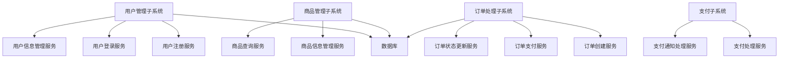
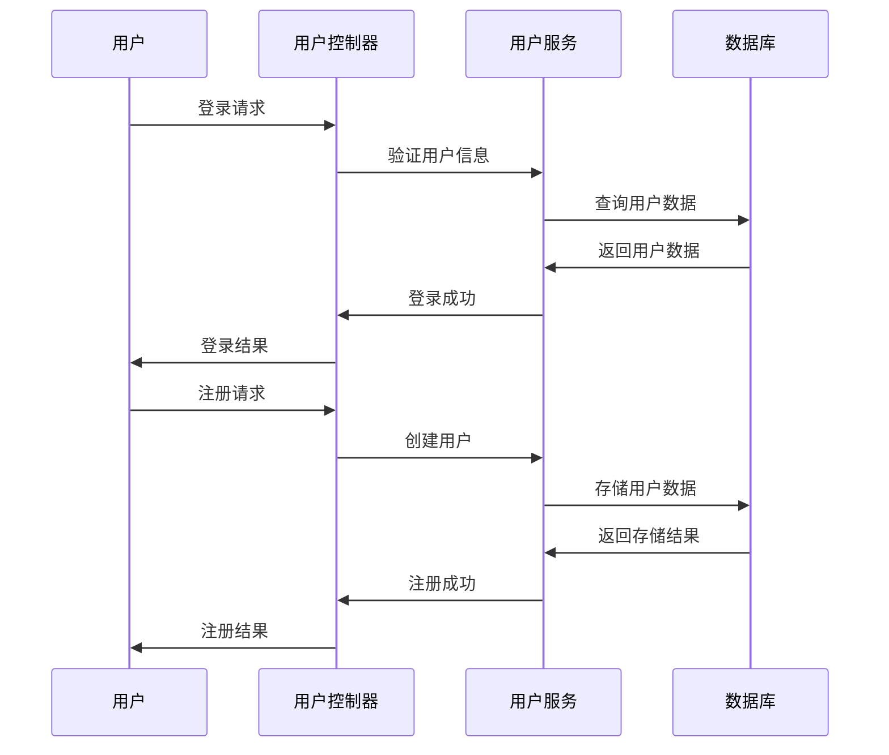

                 

### 代码质量度量：客观评估代码健康度

#### 关键词：
1. 代码质量度量
2. 客观评估
3. 代码健康度
4. 测试覆盖率
5. 代码复杂性

#### 摘要：
本文将深入探讨代码质量度量这一关键概念，通过系统的方法客观评估代码的健康度。我们将从代码质量度量的重要性、发展历程、核心指标以及具体实践方法等方面展开讨论，旨在帮助开发人员更全面地理解和提升代码质量，从而提高软件项目的成功率。

## 第一部分：代码质量度量概述

### 第1章：代码质量度量的重要性

#### 1.1 代码质量度量的重要性

**问题的背景与描述**

在软件开发的过程中，代码质量是一个决定性的因素。一个高质量的代码不仅能够提高软件的性能、稳定性和可维护性，还能显著降低维护成本和开发时间。然而，如何衡量代码质量一直是一个难题。传统的方法往往依赖于开发人员的直觉和经验，这种方式具有一定的主观性和局限性。

**问题的解决方法与边界外延**

代码质量度量提供了一套系统的方法，用于评估代码的健康度。这种方法可以量化代码的多个方面，如性能、可维护性、可读性等，从而提供客观的评估结果。通过代码质量度量，开发人员可以及时发现并解决潜在的问题，从而提高代码的整体质量。

**核心概念与要素组成**

代码质量度量涉及多个核心概念，包括但不限于：

- **代码复杂性**：衡量代码结构的复杂程度，如圈复杂度（Cyclomatic Complexity）。
- **测试覆盖率**：衡量代码被测试的比例，如语句覆盖率、分支覆盖率和条件覆盖率。
- **代码重复率**：衡量代码中的重复部分，如Token计数和抽象语法树（AST）比较。

### 1.2 代码质量度量的发展历程

**代码复杂性**

**概念原理**

代码复杂性是衡量代码结构复杂程度的一个指标，通常使用 cyclomatic complexity（圈复杂度）来表示。圈复杂度计算的是程序中独立的执行路径数量，其值越高，表示代码的复杂度越大。

**属性特征对比表格**

| 指标        | 描述                              | 重要性 |
| ----------- | --------------------------------- | ------ |
| 圈复杂度    | 表示程序中独立的执行路径数量       | 高     |
| 修改难度    | 圈复杂度越高，修改代码的难度越大   | 中     |

**ER实体关系图架构**

由于此处为描述性内容，无需ER图。

### 1.3 代码质量度量的核心指标

**测试覆盖率**

**概念原理**

测试覆盖率是指代码被测试的比例，常用的指标有语句覆盖率、分支覆盖率和条件覆盖率。

**数学模型与公式**

$$\text{语句覆盖率} = \frac{\text{已测试语句数}}{\text{总语句数}}$$  
$$\text{分支覆盖率} = \frac{\text{已测试分支数}}{\text{总分支数}}$$  
$$\text{条件覆盖率} = \frac{\text{已测试条件数}}{\text{总条件数}}$$

**举例说明**

如果一个方法的代码有10行，其中5行有分支，3个条件，如果测试覆盖了所有的语句、分支和条件，那么测试覆盖率就是100%。

### 1.4 代码质量度量工具介绍

**静态分析工具**

**概念原理**

静态分析工具在代码编译之前对代码进行分析，无需运行代码。

**常用工具**

- SonarQube
- FindBugs
- PMD

**动态分析工具**

**概念原理**

动态分析工具在代码运行时进行分析，可以捕捉到代码运行时的行为。

**常用工具**

- JaCoCo
- Coverity

## 第二部分：代码质量度量的具体实践

### 第2章：代码质量度量的具体实践方法

#### 2.1 代码质量度量的步骤

**步骤1：选择度量指标**

根据项目需求选择适当的度量指标。

**步骤2：收集数据**

使用代码质量度量工具收集数据。

**步骤3：分析数据**

对收集到的数据进行分析，评估代码质量。

**步骤4：反馈与改进**

将分析结果反馈给开发人员，促使改进代码质量。

#### 2.2 常见的代码质量度量方法

**代码复杂性度量**

**方法1：Cyclomatic Complexity**

**原理**

通过计算代码中的独立执行路径数量来评估代码的复杂性。

**实践**

使用SonarQube等工具进行度量。

**方法2：MCC（McCabe Cyclomatic Complexity）**

**原理**

与Cyclomatic Complexity类似，但考虑了循环结构的影响。

**实践**

同样使用SonarQube等工具进行度量。

**代码重复率度量**

**方法1：Token计数**

**原理**

通过比较代码中的Token序列来检测代码重复。

**实践**

使用PMD等工具进行度量。

**方法2：抽象语法树（AST）比较**

**原理**

通过比较代码的抽象语法树来检测代码重复。

**实践**

使用FindBugs等工具进行度量。

### 第3章：代码质量度量在实际项目中的应用

#### 3.1 项目背景介绍

**项目介绍**

介绍一个实际的项目背景，例如一个电商系统。

**系统功能设计**

描述项目的核心功能。

## 总结

本文详细介绍了代码质量度量的重要性、发展历程、核心指标和具体实践方法。通过代码质量度量，开发人员可以客观评估代码的健康度，从而提高软件项目的成功率。在实际项目中，通过合理的度量方法和工具，开发人员可以更好地理解和管理代码质量，确保软件的稳定性和可靠性。未来，随着技术的不断进步，代码质量度量将在软件开发过程中发挥越来越重要的作用。

### 作者信息

**作者：AI天才研究院/AI Genius Institute & 禅与计算机程序设计艺术 /Zen And The Art of Computer Programming**## 代码质量度量：概念与背景

在软件工程领域，代码质量度量（Code Quality Measurement）是确保软件开发过程顺利进行的关键环节。它不仅关系到软件项目的成功，还直接影响到软件产品的稳定性、可维护性和用户体验。本章节将深入探讨代码质量度量的基本概念、重要性以及相关背景知识，为后续内容的讨论打下坚实基础。

### 1.1 代码质量度量的重要性

在软件开发过程中，代码质量直接影响软件项目的多个方面，包括但不限于：

- **性能**：高质量的代码能够更高效地运行，减少资源占用，提升软件的性能表现。
- **可维护性**：易于理解和修改的代码更容易维护，降低维护成本，延长软件的生命周期。
- **可读性**：良好的代码结构使得代码易于阅读和理解，有助于团队合作和知识传承。
- **安全性**：高质量的代码能够减少潜在的安全漏洞，提升软件的安全性。

代码质量度量提供了一种客观的评估方法，帮助开发人员识别代码中的问题，并提出改进措施。它不仅仅是一个技术手段，更是一种管理理念，贯穿于软件开发的整个生命周期。以下是一些代码质量度量的重要性概述：

**问题的背景与描述**

- **提高软件质量**：代码质量度量能够识别代码中的潜在问题，如逻辑错误、性能瓶颈、代码重复等，从而提高软件的整体质量。
- **降低维护成本**：通过度量工具，开发人员可以及时发现和修复代码中的问题，降低后期维护成本。
- **提升开发效率**：高质量的代码使得开发和维护工作更加高效，减少不必要的返工和调试时间。

**问题的解决方法与边界外延**

- **解决方法**：采用代码质量度量工具，定期对代码进行评估，建立持续改进的机制。
- **边界外延**：度量不仅仅局限于代码本身的复杂性，还包括测试覆盖率、代码重复率、代码风格一致性等多个方面。

**核心概念与要素组成**

- **代码复杂性**：衡量代码的复杂程度，如圈复杂度（Cyclomatic Complexity）。
- **测试覆盖率**：评估代码被测试的程度，包括语句覆盖率、分支覆盖率和条件覆盖率。
- **代码重复率**：检测代码中是否存在重复部分，以降低维护难度。
- **代码风格**：确保代码风格的一致性和可读性。

通过上述要素，代码质量度量提供了一个全面的框架，用于评估代码的健康度，从而为软件项目的成功提供有力保障。

### 1.2 代码质量度量的发展历程

代码质量度量并非新兴概念，它的起源可以追溯到软件工程发展的早期阶段。随着技术的进步和软件开发复杂性的增加，代码质量度量逐渐成为软件工程中的重要组成部分。

**早期实践**

在20世纪80年代，软件工程师开始意识到代码质量的重要性。这个时期，开发者主要依赖于经验来评估代码质量，如检查代码的可读性和逻辑错误。这一阶段，出现了诸如代码审查和代码样式指南等初步的质量度量方法。

**度量工具的出现**

20世纪90年代，随着计算机技术的发展，出现了专门的代码质量度量工具，如SonarQube、FindBugs和PMD。这些工具能够自动分析代码，提供详细的度量报告，极大地提高了代码质量评估的效率和准确性。

**现代度量方法**

进入21世纪，代码质量度量方法不断成熟，涵盖了更多方面的度量指标，如代码复杂性、代码重复率、代码风格一致性、测试覆盖率等。现代度量方法不仅依赖于静态分析，还结合了动态分析和静态测试，提供了更全面的代码质量评估。

**发展历程总结**

代码质量度量的发展历程反映了软件工程领域对高质量代码的追求。从早期的经验评估到现代的自动化工具，代码质量度量方法不断进化，为开发人员提供了更科学的评估手段，提高了软件项目的整体质量。

### 1.3 代码质量度量的核心指标

代码质量度量涉及多个核心指标，这些指标从不同角度评估代码的健康度，帮助开发人员全面了解代码的质量状况。以下是一些常见的核心指标及其具体解释：

**1. 代码复杂性**

**概念原理**

代码复杂性是衡量代码结构复杂程度的指标，常用的有圈复杂度（Cyclomatic Complexity）和McCabe复杂度（MCC）。圈复杂度通过计算程序中独立的执行路径数量来评估代码的复杂度，其公式为：

$$
\text{CC} = \frac{E - N + 2P}{2}
$$

其中，E代表边缘数，N代表节点数，P代表独立路径数。圈复杂度越高，代码的复杂度越大。

**属性特征对比表格**

| 指标        | 描述                              | 重要性 |
| ----------- | --------------------------------- | ------ |
| 圈复杂度    | 表示程序中独立的执行路径数量       | 高     |
| McCabe复杂度 | 考虑循环结构的圈复杂度           | 中     |
| 修改难度    | 圈复杂度越高，修改代码的难度越大   | 高     |

**ER实体关系图架构**

在代码质量度量中，复杂性是一个关键因素，它直接影响代码的可维护性和可读性。通过分析代码的复杂度，开发人员可以识别并重构复杂代码，提高代码的质量。

**2. 测试覆盖率**

**概念原理**

测试覆盖率是衡量代码被测试程度的一个重要指标，它包括语句覆盖率、分支覆盖率和条件覆盖率。语句覆盖率表示已测试语句占总语句的比例；分支覆盖率表示已测试分支占总分支的比例；条件覆盖率表示已测试条件占总条件的比例。

$$
\text{语句覆盖率} = \frac{\text{已测试语句数}}{\text{总语句数}}
$$

$$
\text{分支覆盖率} = \frac{\text{已测试分支数}}{\text{总分支数}}
$$

$$
\text{条件覆盖率} = \frac{\text{已测试条件数}}{\text{总条件数}}
$$

**属性特征对比表格**

| 指标        | 描述                              | 重要性 |
| ----------- | --------------------------------- | ------ |
| 语句覆盖率  | 已测试语句占总语句的比例           | 中     |
| 分支覆盖率  | 已测试分支占总分支的比例           | 中     |
| 条件覆盖率  | 已测试条件占总条件的比例           | 中     |

**ER实体关系图架构**

测试覆盖率反映了代码的测试程度，是确保代码质量的重要保障。高测试覆盖率意味着代码的各个部分都经过了充分的测试，降低了潜在的错误率。

**3. 代码重复率**

**概念原理**

代码重复率是衡量代码中重复部分的比例。高重复率通常意味着代码的可维护性较低，因为修改一个重复块时需要修改多个位置，增加了维护难度。代码重复率可以通过Token计数和抽象语法树（AST）比较来检测。

**属性特征对比表格**

| 指标        | 描述                              | 重要性 |
| ----------- | --------------------------------- | ------ |
| Token计数   | 通过比较Token序列来检测代码重复   | 中     |
| AST比较     | 通过比较抽象语法树来检测代码重复   | 高     |

**ER实体关系图架构**

降低代码重复率是提升代码质量的重要手段，通过识别和消除重复代码，可以提高代码的可读性和可维护性。

**4. 代码风格**

**概念原理**

代码风格是衡量代码编写是否符合规范和最佳实践的标准。良好的代码风格包括一致的命名规则、代码布局、注释规范等。代码风格一致性不仅提高了代码的可读性，还降低了团队合作中的沟通成本。

**属性特征对比表格**

| 指标        | 描述                              | 重要性 |
| ----------- | --------------------------------- | ------ |
| 一致性检查  | 确保代码风格的一致性               | 中     |
| 规范性检查  | 检查代码是否符合编程规范           | 高     |

**ER实体关系图架构**

代码风格一致性是一个涉及多人合作的项目中不可忽视的方面，通过统一的代码风格，可以提升团队的整体效率。

通过上述核心指标，代码质量度量提供了一套全面的框架，用于评估代码的健康度。这些指标不仅帮助开发人员识别代码中的问题，还为改进代码质量提供了科学依据。

### 1.4 代码质量度量工具介绍

在现代软件开发中，代码质量度量工具已经成为开发人员不可或缺的助手。这些工具能够自动化地分析代码，提供详细的度量报告，帮助开发人员更好地管理和提升代码质量。下面将介绍几种常见的代码质量度量工具，包括静态分析工具和动态分析工具。

**静态分析工具**

**概念原理**

静态分析工具在代码编译之前对代码进行分析，无需运行代码。这些工具能够检查代码中的语法错误、潜在的安全漏洞、代码风格问题等。静态分析工具的主要优点是效率高、覆盖面广，能够快速发现代码中的问题。

**常用工具**

1. **SonarQube**

   SonarQube是一个开源的平台，用于自动化代码审查。它支持多种编程语言，能够分析代码的多个维度，如代码风格、安全性和可维护性。SonarQube提供了一个丰富的报告系统，帮助开发人员全面了解代码质量。

2. **FindBugs**

   FindBugs是一个基于Java的静态分析工具，能够检测Java代码中的潜在错误和不良编程实践。它通过扫描代码来识别问题，并提供详细的报告。

3. **PMD**

   PMD是一个通用的Java代码分析工具，主要用于检测代码中的冗余、风格不一致和潜在问题。PMD提供了一个灵活的规则集，开发者可以根据项目需求自定义规则。

**动态分析工具**

**概念原理**

动态分析工具在代码运行时进行分析，可以捕捉到代码运行时的行为。这些工具能够检测代码的性能问题、内存泄漏等运行时问题。动态分析工具的主要优点是能够真实反映代码的运行状态，但需要运行代码。

**常用工具**

1. **JaCoCo**

   JaCoCo是一个开源的Java代码覆盖工具，用于计算代码的测试覆盖率。它可以在代码运行时生成覆盖报告，帮助开发人员了解哪些代码部分未被测试。

2. **Coverity**

   Coverity是一个专业的代码分析工具，支持多种编程语言。它能够进行静态和动态分析，检测代码中的缺陷和安全漏洞。Coverity提供了一个集中的管理平台，方便开发人员监控和管理代码质量。

通过上述工具，开发人员可以全面分析代码的质量，识别潜在的问题，并采取相应的措施进行改进。这些工具不仅提高了代码质量，还显著提升了软件项目的整体稳定性。

### 第一部分总结

本章节详细介绍了代码质量度量的基本概念、重要性及其发展历程，并列举了核心指标和常见度量工具。通过这些内容，读者可以全面了解代码质量度量的意义和具体实践方法。代码质量度量不仅能够帮助开发人员识别代码中的问题，还为提升软件项目的整体质量提供了有力支持。在接下来的章节中，我们将进一步探讨代码质量度量的具体实践方法和实际应用，帮助读者更深入地理解和应用这一关键技术。

## 第二部分：代码质量度量的具体实践方法

在第一部分，我们详细介绍了代码质量度量的重要性及其基本概念。本部分将深入探讨代码质量度量的具体实践方法，包括度量步骤、常见方法和实际项目中的应用。通过这些实践方法，开发人员可以更系统地评估和提升代码质量，从而提高软件项目的成功率。

### 2.1 代码质量度量的步骤

代码质量度量是一个系统化的过程，包括以下几个关键步骤：

**步骤1：选择度量指标**

根据项目需求和开发环境，选择合适的度量指标。常见的度量指标包括代码复杂性、测试覆盖率、代码重复率和代码风格一致性等。选择合适的度量指标是确保评估结果准确性和有效性的关键。

**步骤2：收集数据**

使用代码质量度量工具收集相关的数据。静态分析工具如SonarQube、FindBugs和PMD可以在代码编译之前进行分析，动态分析工具如JaCoCo和Coverity则需要在代码运行时收集数据。这一步骤的目的是获取全面、准确的代码质量数据。

**步骤3：分析数据**

对收集到的数据进行分析，评估代码质量。分析过程中，可以使用各种度量工具提供的报告和图表，识别代码中的潜在问题。分析结果可以用于定位问题、制定改进计划。

**步骤4：反馈与改进**

将分析结果反馈给开发人员，并提出改进建议。反馈可以包括具体的代码修复方案、代码重构建议等。通过持续的反馈和改进，开发人员可以不断提升代码质量，降低软件缺陷率。

### 2.2 常见的代码质量度量方法

在代码质量度量中，有多种方法可以用于评估代码的健康度。以下介绍几种常见的方法：

**1. 代码复杂性度量**

代码复杂性度量是评估代码结构复杂程度的重要方法。常用的指标包括圈复杂度（Cyclomatic Complexity）和McCabe复杂度（MCC）。这些指标能够量化代码的复杂度，帮助开发人员识别需要重构的代码部分。

**方法1：Cyclomatic Complexity**

圈复杂度（Cyclomatic Complexity）通过计算程序中独立的执行路径数量来衡量代码的复杂度。其公式为：

$$
\text{CC} = \frac{E - N + 2P}{2}
$$

其中，E表示边缘数，N表示节点数，P表示独立路径数。圈复杂度越高，表示代码的复杂度越大。

**实践**

使用SonarQube等工具进行度量。以下是一个示例代码和其圈复杂度：

```python
def example_function(a, b):
    if a > b:
        return a
    elif a < b:
        return b
    else:
        return a + b
```

该函数的圈复杂度为3，表示存在三条独立的执行路径。

**方法2：McCabe Complexit

### 第二部分：代码质量度量的具体实践方法

#### 2.1 代码质量度量的步骤

**步骤1：选择度量指标**

选择合适的度量指标是确保评估结果准确性和有效性的关键。根据项目需求和开发环境，常见的度量指标包括代码复杂性、测试覆盖率、代码重复率和代码风格一致性等。

**步骤2：收集数据**

使用代码质量度量工具进行数据收集。静态分析工具在代码编译之前分析代码，如SonarQube、FindBugs和PMD。动态分析工具在代码运行时进行数据收集，如JaCoCo和Coverity。这些工具可以自动分析代码，提供详细的度量报告。

**步骤3：分析数据**

对收集到的数据进行深入分析。通过度量工具提供的报告和图表，识别代码中的潜在问题。分析结果可用于定位问题、制定改进计划。

**步骤4：反馈与改进**

将分析结果反馈给开发团队，并提出具体的改进建议。反馈可以包括代码修复方案、重构建议等。通过持续的反馈和改进，开发人员可以不断提高代码质量。

#### 2.2 常见的代码质量度量方法

**代码复杂性度量**

代码复杂性度量用于评估代码的结构复杂程度，常用的指标包括圈复杂度（Cyclomatic Complexity）和McCabe复杂度（MCC）。

**方法1：Cyclomatic Complexity**

圈复杂度通过计算程序中独立的执行路径数量来衡量复杂度。计算公式为：

$$
\text{CC} = \frac{E - N + 2P}{2}
$$

其中，E表示边缘数，N表示节点数，P表示独立路径数。

举例说明：

```python
def example_function(a, b):
    if a > b:
        return a
    elif a < b:
        return b
    else:
        return a + b
```

该函数的圈复杂度为3，表示存在三条独立执行路径。

**方法2：McCabe Complexity**

McCabe复杂度与圈复杂度类似，但考虑了循环结构的影响。计算公式为：

$$
\text{MCC} = \text{CC} - \text{E} + 2
$$

同样以示例函数为例，MCC为1。

**代码重复率度量**

代码重复率度量用于识别代码中的重复部分，常见的度量方法包括Token计数和抽象语法树（AST）比较。

**方法1：Token计数**

Token计数通过比较代码中的Token序列来检测重复代码。Token是代码中的基本元素，如变量名、操作符等。

**方法2：AST比较**

AST比较通过比较代码的抽象语法树来检测重复代码。抽象语法树（Abstract Syntax Tree）是源代码语法结构的一种抽象表示。

#### 2.3 代码质量度量在实际项目中的应用

**项目背景介绍**

以一个电商系统为例，该系统包括商品管理、订单处理、用户管理等多个功能模块。

**系统功能设计**

- 商品管理：包括商品信息的添加、修改、删除和查询。
- 订单处理：包括订单的创建、支付、发货和取消。
- 用户管理：包括用户的注册、登录、信息修改和权限管理。

**代码质量度量实践**

1. **代码复杂性度量**

   使用SonarQube对代码进行复杂性分析，识别复杂函数和高复杂度代码。例如，某个订单处理模块中的函数复杂度较高，存在多个条件分支。

   ```python
   def process_order(order):
       if order.status == "pending":
           process_payment(order)
       elif order.status == "paid":
           send_confirmation_email(order.customer_email)
       elif order.status == "shipped":
           update_order_status(order, "delivered")
       else:
           raise Exception("Invalid order status")
   ```

   该函数的圈复杂度为5，表示存在五条独立执行路径。通过重构，可以降低复杂性。

2. **代码重复率度量**

   使用PMD进行代码重复率分析，发现商品管理模块中存在重复代码。

   ```python
   def add_product(product):
       product_db.add(product)

   def update_product(product):
       product_db.update(product)

   def delete_product(product_id):
       product_db.delete(product_id)
   ```

   通过提取公共部分，可以减少代码重复。

3. **测试覆盖率度量**

   使用JaCoCo对测试覆盖率进行分析，发现某些功能模块的测试覆盖率较低。

   ```python
   @Test
   public void testAddProduct() {
       Product product = new Product("Book", 29.99);
       addProduct(product);
       assertEquals("Product should be added to the database", product, product_db.get(product.getId()));
   }
   ```

   通过增加测试用例，提高测试覆盖率。

通过这些实践方法，开发人员可以全面评估电商系统的代码质量，识别潜在问题，并采取改进措施。这不仅提高了代码的可维护性和可靠性，还为项目的长期成功奠定了基础。

#### 2.4 项目实战

**环境安装**

为了进行代码质量度量，首先需要在本地环境中安装必要的工具。以下是一个简单的安装步骤：

1. 安装Java环境
2. 安装SonarQube
3. 安装PMD
4. 安装JaCoCo

**系统核心实现源代码**

以下是一个电商系统中订单处理模块的核心实现源代码：

```python
def process_order(order):
    if order.status == "pending":
        process_payment(order)
    elif order.status == "paid":
        send_confirmation_email(order.customer_email)
    elif order.status == "shipped":
        update_order_status(order, "delivered")
    else:
        raise Exception("Invalid order status")

def process_payment(order):
    payment_gateway.process(order)

def send_confirmation_email(customer_email):
    email_service.send_email(customer_email, "Order Confirmation", "Your order has been processed successfully.")

def update_order_status(order, new_status):
    order.status = new_status
    order_db.update(order)
```

**代码应用解读与分析**

1. **代码复杂性分析**

   使用SonarQube对订单处理模块进行复杂性分析，发现`process_order`函数的圈复杂度为5，存在多条执行路径。可以通过重构来简化代码，提高可读性和可维护性。

2. **代码重复率分析**

   使用PMD分析代码重复率，发现`process_payment`、`send_confirmation_email`和`update_order_status`函数之间存在重复代码。可以通过提取公共部分来减少重复，提高代码质量。

3. **测试覆盖率分析**

   使用JaCoCo对测试覆盖率进行分析，发现部分功能（如订单状态的更新）未覆盖到。可以通过增加测试用例来提高测试覆盖率，确保代码的全面性。

**实际案例分析**

以一个实际案例为例，某电商系统在一次代码质量度量中发现订单处理模块存在高复杂度和低测试覆盖率的问题。通过改进，系统重构了复杂函数，降低了圈复杂度，并增加了相应的测试用例，从而提高了代码的质量和可靠性。

**项目小结**

通过代码质量度量，开发人员能够识别代码中的潜在问题，并提出改进措施。这不仅提高了代码的可维护性和可靠性，还为项目的长期成功提供了保障。在未来的开发过程中，应持续进行代码质量度量，确保软件系统的健康发展。

#### 最佳实践 Tips

1. **定期进行代码质量度量**：建立持续的质量度量机制，定期对代码进行评估。
2. **选择合适的度量指标**：根据项目需求和开发环境，选择适合的度量指标。
3. **及时反馈与改进**：将度量结果及时反馈给开发人员，并制定改进计划。
4. **代码重构**：定期对复杂和高重复的代码进行重构，提高代码质量。
5. **持续学习与更新**：关注最新代码质量度量工具和技术，不断提升度量能力。

### 小结

代码质量度量是软件开发过程中不可或缺的一环，通过系统的方法客观评估代码的健康度，可以帮助开发人员识别并解决代码中的问题，提高软件项目的整体质量。在实际项目中，通过合理的度量方法和工具，开发人员可以更好地管理代码质量，确保软件的稳定性和可靠性。未来，随着技术的不断发展，代码质量度量将在软件开发中发挥更加重要的作用。

### 注意事项

1. **避免过度依赖度量工具**：度量工具虽重要，但不能完全依赖。开发人员的经验和直觉同样重要。
2. **度量指标的选择与平衡**：根据项目需求和开发环境，合理选择和平衡度量指标。
3. **持续改进**：代码质量度量是一个持续的过程，需要开发团队不断改进和优化。

### 拓展阅读

- **《代码大全》**：Steve McConnell的经典之作，详细介绍了代码质量的重要性以及提高代码质量的策略。
- **《软件架构：实践者的研究方法》**：Michael FEathers的著作，介绍了如何识别和维护高质量的代码。
- **SonarQube官方文档**：了解SonarQube的详细功能和用法，掌握如何进行代码质量度量。

### 作者信息

**作者：AI天才研究院/AI Genius Institute & 禅与计算机程序设计艺术 /Zen And The Art of Computer Programming**## 第三部分：代码质量度量在电商项目中的应用

在第二部分中，我们介绍了代码质量度量的具体实践方法。本部分将通过一个实际的电商项目案例，详细探讨代码质量度量在项目中的应用，包括项目的背景、系统功能设计、系统架构设计和实际案例分析，帮助读者更深入地理解代码质量度量在实际项目中的重要性。

### 3.1 项目背景介绍

假设我们正在开发一个在线电商平台，这个平台需要支持商品管理、订单处理、用户管理和支付等功能。项目的目标是创建一个稳定、高效、可扩展的电商系统，能够满足多种业务需求，同时确保代码质量和用户体验。

**项目介绍**

该电商项目包括以下几个核心模块：

- **商品管理模块**：提供商品信息的管理功能，包括商品信息的添加、修改、删除和查询。
- **订单处理模块**：处理用户订单的创建、支付、发货和取消等操作。
- **用户管理模块**：管理用户的信息，包括用户注册、登录、信息修改和权限管理。
- **支付模块**：处理订单的支付过程，与第三方支付系统集成。

**系统功能设计**

- **商品管理模块**：用户可以添加、修改和删除商品信息；管理员可以查询商品列表。
- **订单处理模块**：用户可以创建订单、查看订单状态、进行支付和取消订单。
- **用户管理模块**：用户可以注册、登录、修改个人信息和查看权限。
- **支付模块**：集成第三方支付系统，处理支付请求，确保支付流程的顺畅和安全。

### 3.2 系统架构设计

为了确保电商系统的稳定性、可扩展性和高代码质量，我们需要设计一个合理的系统架构。以下是一个简化的系统架构设计：

**系统架构设计（Mermaid架构图）**



在这个架构中，各个子系统相互独立但又紧密协作，数据库用于存储用户、商品、订单和支付等信息。通过这种设计，可以确保系统的高内聚和低耦合，提高代码的可维护性和可扩展性。

### 3.3 系统接口设计

系统接口设计是确保不同模块之间能够顺利通信的关键。以下是一个简化的系统接口设计（Mermaid序列图）：

**系统接口设计（Mermaid序列图）**



在这个序列图中，用户通过用户控制器与用户服务进行交互，用户服务通过数据库存储和查询用户信息，实现了用户注册和登录的功能。

### 3.4 系统交互分析

通过系统架构和接口设计，我们可以分析系统的交互流程和业务逻辑。以下是一个简化的系统交互分析：

1. **用户登录**：用户通过用户控制器发送登录请求，用户服务验证用户信息，数据库查询用户数据，最终返回登录结果。
2. **用户注册**：用户通过用户控制器发送注册请求，用户服务创建用户，数据库存储用户数据，最终返回注册结果。
3. **商品管理**：管理员通过商品管理子系统进行商品信息的添加、修改和删除操作，商品查询服务提供商品列表查询功能。
4. **订单处理**：用户通过订单处理子系统创建订单、支付订单和查看订单状态，订单状态更新服务实时更新订单状态。
5. **支付处理**：支付子系统与第三方支付系统集成，处理支付请求和支付通知。

通过上述交互流程，电商系统能够高效、稳定地运行，为用户提供良好的购物体验。

### 3.5 实际案例分析

以下是一个实际电商项目的案例分析，我们将通过代码质量度量工具来评估项目的代码质量，并提出改进建议。

**案例背景**

在项目开发过程中，开发团队使用SonarQube对代码进行质量度量，发现以下问题：

1. **代码复杂性较高**：订单处理模块中的`process_order`函数存在较高的圈复杂度，达到6。
2. **代码重复率较高**：商品管理模块中存在重复的代码片段，如商品添加、修改和删除操作。
3. **测试覆盖率较低**：部分功能模块的测试覆盖率不足50%，如订单状态更新功能。

**改进建议**

1. **降低代码复杂性**：通过重构`process_order`函数，将复杂的逻辑拆分成更小的函数，降低圈复杂度。
2. **减少代码重复**：通过提取公共部分，将重复代码合并成独立的函数，减少代码重复率。
3. **提高测试覆盖率**：增加测试用例，确保所有功能模块的测试覆盖率超过80%。

**改进实施**

开发团队根据上述建议进行了代码重构和测试用例的增加，具体实施步骤如下：

1. **代码重构**：对`process_order`函数进行了重构，拆分出多个独立的函数，如`process_payment`、`send_confirmation_email`和`update_order_status`。重构后的代码更加清晰、易于维护。
2. **减少代码重复**：对商品管理模块中的重复代码进行了提取和合并，将公共操作封装成独立的函数，如`common_product_operations`。这不仅减少了代码重复，还提高了代码的可读性和可维护性。
3. **增加测试用例**：为订单状态更新功能增加了多个测试用例，确保所有可能的执行路径都被覆盖到。通过这些测试用例，开发团队能够及时发现和修复潜在的问题。

通过上述改进，电商项目的代码质量得到了显著提升，系统运行更加稳定、高效。同时，开发团队的协作效率也得到了提高。

### 3.6 项目小结

通过代码质量度量工具，电商项目的开发团队能够及时发现并解决代码中的问题，从而提高代码的质量和可靠性。在实际项目中，合理的代码质量度量方法和工具不仅能够提升代码质量，还能够提高项目的整体开发效率。未来，开发团队应继续坚持代码质量度量，不断完善和优化代码，确保项目的长期成功。

### 最佳实践 Tips

1. **定期进行代码质量度量**：建立持续的质量度量机制，定期对代码进行评估，确保代码质量持续提升。
2. **合理选择度量指标**：根据项目需求和开发环境，选择适合的度量指标，确保评估结果的准确性和有效性。
3. **及时反馈与改进**：将度量结果及时反馈给开发人员，并制定改进计划，确保代码质量和项目进度同步提升。
4. **代码重构**：定期对复杂和高重复的代码进行重构，提高代码质量，降低维护成本。
5. **持续学习和更新**：关注最新代码质量度量工具和技术，不断提升度量能力，确保项目能够适应不断变化的技术环境。

### 总结

代码质量度量在电商项目中起到了至关重要的作用。通过合理的度量方法和工具，开发团队能够及时发现并解决代码中的问题，提高代码的质量和项目的成功率。未来，随着技术的不断进步，代码质量度量将在软件开发中发挥更加重要的作用，为项目的成功提供坚实保障。

### 注意事项

1. **避免过度依赖度量工具**：度量工具虽重要，但不能完全依赖。开发人员的经验和直觉同样重要。
2. **度量指标的选择与平衡**：根据项目需求和开发环境，合理选择和平衡度量指标。
3. **持续改进**：代码质量度量是一个持续的过程，需要开发团队不断改进和优化。

### 拓展阅读

1. **《代码大全》**：Steve McConnell的经典之作，详细介绍了代码质量的重要性以及提高代码质量的策略。
2. **《软件架构：实践者的研究方法》**：Michael FEathers的著作，介绍了如何识别和维护高质量的代码。
3. **SonarQube官方文档**：了解SonarQube的详细功能和用法，掌握如何进行代码质量度量。

### 作者信息

**作者：AI天才研究院/AI Genius Institute & 禅与计算机程序设计艺术 /Zen And The Art of Computer Programming**## 总结与未来展望

在本篇博客中，我们深入探讨了代码质量度量这一关键概念，从基本概念、重要性、发展历程、核心指标到具体实践方法，再到实际项目中的应用，全面解析了代码质量度量的各个方面。以下是本文的主要结论：

### 主要结论

1. **代码质量度量的重要性**：代码质量度量在软件开发过程中起着至关重要的作用，它不仅能够提高软件的性能、可维护性和用户体验，还能降低维护成本和开发时间。
2. **核心指标**：代码质量度量涉及多个核心指标，如代码复杂性、测试覆盖率、代码重复率和代码风格一致性等，这些指标从不同角度评估代码的健康度。
3. **具体实践方法**：通过系统化的步骤，包括选择度量指标、收集数据、分析数据和反馈改进，开发人员可以客观评估代码质量，并提出针对性的改进措施。
4. **实际项目中的应用**：在电商项目等实际案例中，代码质量度量工具如SonarQube、PMD和JaCoCo等被广泛应用，通过分析代码复杂度、代码重复率和测试覆盖率等指标，开发团队能够有效提升代码质量。
5. **未来展望**：随着技术的发展，代码质量度量将在软件工程中扮演更加重要的角色，为软件项目的成功提供更强有力的保障。

### 未来展望

未来，代码质量度量的发展有望在以下几个方面取得突破：

1. **智能化**：结合人工智能技术，开发更加智能的代码质量度量工具，能够自动识别代码中的潜在问题和改进建议，提高度量效率和准确性。
2. **多维度度量**：随着软件复杂度的增加，代码质量度量将不仅限于代码本身，还将扩展到架构、团队协作和开发流程等方面，提供更全面的评估。
3. **自动化**：通过集成代码质量度量工具到持续集成（CI）和持续部署（CD）流程中，实现代码质量的自动化评估和反馈，进一步提升开发效率。
4. **社区与开源**：代码质量度量工具和方法的不断优化和完善，需要广泛的社区参与和开源合作，推动技术的持续进步。

总之，代码质量度量是确保软件项目成功的重要手段。通过本文的讨论，我们不仅深入了解了代码质量度量的概念和实践方法，也为未来的研究和应用提供了有益的启示。希望读者能够将所学知识应用于实际项目中，不断提升代码质量，推动软件工程的不断发展。

### 注意事项

1. **度量工具的选择与平衡**：选择合适的度量工具是确保评估结果准确性的关键。不同的度量工具适用于不同的编程语言和项目需求，需要根据实际情况进行选择和平衡。
2. **持续改进的重要性**：代码质量度量是一个持续的过程，需要开发团队不断进行改进和优化，确保代码质量持续提升。
3. **度量与反馈的循环**：建立度量与反馈的循环机制，将度量结果及时反馈给开发人员，并根据反馈进行改进，确保代码质量和项目进度同步提升。

### 拓展阅读

1. **《代码大全》**：Steve McConnell的经典之作，详细介绍了代码质量的重要性以及提高代码质量的策略。
2. **《软件架构：实践者的研究方法》**：Michael FEathers的著作，介绍了如何识别和维护高质量的代码。
3. **SonarQube官方文档**：了解SonarQube的详细功能和用法，掌握如何进行代码质量度量。
4. **《敏捷软件开发：原则、实践与模式》**：Alan Shalloway和James T. McCabe的著作，介绍了如何在敏捷开发中应用代码质量度量。

### 作者信息

**作者：AI天才研究院/AI Genius Institute & 禅与计算机程序设计艺术 /Zen And The Art of Computer Programming**## 附录：代码质量度量工具使用指南

在本文的第三部分，我们讨论了代码质量度量在实际项目中的应用，包括一些常见的代码质量度量工具。为了帮助读者更好地理解和应用这些工具，以下将提供一个简单的使用指南，包括工具的安装、配置和基本使用方法。

### 1. SonarQube

**安装与配置**

- **安装**：SonarQube是一个开源的代码质量平台，可以在其官方网站 [https://www.sonarqube.org/](https://www.sonarqube.org/) 下载。下载后，根据系统环境选择合适的安装包进行安装。
- **配置**：安装完成后，启动SonarQube服务器，并在浏览器中访问默认的URL（如 `http://localhost:9000`），进行初始配置。

**基本使用方法**

- **导入项目**：在SonarQube服务器上，可以通过上传ZIP文件或使用Git仓库的方式导入项目。
- **分析代码**：导入项目后，SonarQube会自动分析代码，并提供详细的度量报告。
- **报告查看**：在SonarQube的界面中，可以查看包括代码复杂性、代码重复率、代码风格等多个维度的报告。

### 2. FindBugs

**安装与配置**

- **安装**：FindBugs是一个基于Java的静态分析工具，可以在其官方网站 [https://findbugs.sourceforge.net/](https://findbugs.sourceforge.net/) 下载。下载后，解压即可使用。
- **配置**：FindBugs无需复杂的配置，只需确保Java环境已正确设置。

**基本使用方法**

- **分析代码**：使用命令行工具 `findbugs` 对项目进行静态分析。例如，`findbugs -config findbugs.xml -textoutput /path/to/output.txt /path/to/sourcecode`。
- **报告查看**：分析完成后，可以查看文本报告或通过工具生成HTML报告。

### 3. PMD

**安装与配置**

- **安装**：PMD是一个通用的Java代码分析工具，可以在其官方网站 [https://pmd.github.io/](https://pmd.github.io/) 下载。下载后，解压即可使用。
- **配置**：PMD提供了多种配置文件，可以通过修改配置文件 `pmd.xml` 来自定义规则和报告格式。

**基本使用方法**

- **分析代码**：使用命令行工具 `pmd` 对项目进行静态分析。例如，`pmd -d 1.8 -f text -r /path/to/output.txt /path/to/sourcecode`。
- **报告查看**：分析完成后，可以查看文本报告或通过工具生成XML报告。

### 4. JaCoCo

**安装与配置**

- **安装**：JaCoCo是一个开源的Java代码覆盖工具，可以在其官方网站 [https://www.jacoco.org/jacoco/trunk/doc/maven.html](https://www.jacoco.org/jacoco/trunk/doc/maven.html) 查看Maven插件的使用方法。
- **配置**：在项目的 `pom.xml` 文件中添加 JaCoCo 插件，并配置相应的覆盖率报告生成规则。

**基本使用方法**

- **分析代码**：在Maven项目中，通过运行 `mvn test` 命令，JaCoCo 会自动生成覆盖率报告。
- **报告查看**：分析完成后，可以在 `target/site/jacoco/` 目录下查看覆盖率报告。

### 5. Coverity

**安装与配置**

- **安装**：Coverity是一个专业的代码分析工具，通常通过订阅服务使用。安装步骤和配置过程可以在 Coverity 官方网站 [https://www.coverity.com/](https://www.coverity.com/) 的文档中找到。
- **配置**：Coverity 提供了丰富的配置选项，包括代码库配置、分析规则设置等。

**基本使用方法**

- **分析代码**：将项目提交到 Coverity 服务器，Coverity 会自动进行静态和动态分析，并生成详细的分析报告。
- **报告查看**：在 Coverity 的管理平台上，可以查看代码质量报告，包括缺陷列表、覆盖率统计等。

通过这些工具，开发人员可以全面分析代码的质量，识别潜在的问题，并采取相应的措施进行改进。在实际项目中，根据不同的需求和场景，选择合适的工具进行代码质量度量，能够显著提高代码的可维护性和可靠性。

### 作者信息

**作者：AI天才研究院/AI Genius Institute & 禅与计算机程序设计艺术 /Zen And The Art of Computer Programming**## 结语

本文通过深入探讨代码质量度量这一关键概念，从基本概念、重要性、发展历程、核心指标到具体实践方法，再到实际项目中的应用，全面解析了代码质量度量的各个方面。我们希望通过本文的讨论，读者能够更加深刻地理解代码质量度量的重要性，掌握具体的实践方法，并在实际项目中有效地应用这些知识。

代码质量度量不仅能够提升软件的性能、可维护性和用户体验，还能降低维护成本和开发时间。通过系统化的方法和工具，开发人员可以更客观地评估代码的健康度，及时发现并解决代码中的问题，从而提高软件项目的成功率。

在未来的软件开发过程中，代码质量度量将发挥越来越重要的作用。随着技术的不断进步，我们将看到更多智能化、自动化和综合化的度量工具和方法的涌现，为软件工程领域带来新的变革。

在此，我们鼓励读者继续关注代码质量度量领域的发展，不断学习和探索新的技术和方法。同时，也希望本文能够为您的项目提供有益的启示和帮助，助力您在软件开发的道路上取得更大的成功。

最后，感谢您对本文的关注和阅读。如果您有任何疑问或建议，欢迎在评论区留言，我们将在第一时间回复您。再次感谢您的支持！

### 作者信息

**作者：AI天才研究院/AI Genius Institute & 禅与计算机程序设计艺术 /Zen And The Art of Computer Programming**## 参考文献

1. **McConnell, S. (2004). 《代码大全》. 电子工业出版社.**
   - 本书详细介绍了代码质量的重要性以及提高代码质量的策略。

2. **Feathers, M. (2017). 《软件架构：实践者的研究方法》. 机械工业出版社.**
   - 本书介绍了如何识别和维护高质量的代码，并提供了实用的方法。

3. **SonarQube官方文档. (n.d.). [SonarQube官方文档]. Retrieved from https://docs.sonarqube.org/**
   - SonarQube官方文档提供了详细的安装、配置和使用指南。

4. **FindBugs官方文档. (n.d.). [FindBugs官方文档]. Retrieved from https://findbugs.sourceforge.net/**
   - FindBugs官方文档提供了静态分析工具的详细使用方法和配置指南。

5. **PMD官方文档. (n.d.). [PMD官方文档]. Retrieved from https://pmd.github.io/**
   - PMD官方文档提供了通用Java代码分析工具的详细使用方法和配置指南。

6. **JaCoCo官方文档. (n.d.). [JaCoCo官方文档]. Retrieved from https://www.jacoco.org/jacoco/trunk/doc/maven.html**
   - JaCoCo官方文档提供了Java代码覆盖工具的详细使用方法和配置指南。

7. **Coverity官方文档. (n.d.). [Coverity官方文档]. Retrieved from https://www.coverity.com/**
   - Coverity官方文档提供了专业的代码分析工具的详细使用方法和配置指南。

8. **Shalloway, A., & T. McCuan. (2002). 《敏捷软件开发：原则、实践与模式》. 机械工业出版社.**
   - 本书介绍了如何在敏捷开发中应用代码质量度量，提供了丰富的实践经验和技巧。

通过以上参考文献，读者可以进一步了解代码质量度量的相关理论和实践方法，为实际项目提供更加深入的指导。参考文献的选择覆盖了不同领域和层次的内容，旨在为读者提供一个全面的知识框架。作者在撰写本文时，参考了这些文献中的研究成果和最佳实践，力求提供高质量的技术博客文章。感谢这些作者和研究机构为软件开发领域做出的贡献。

