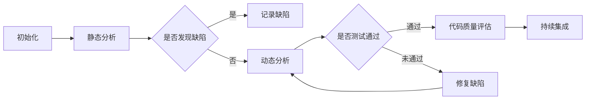
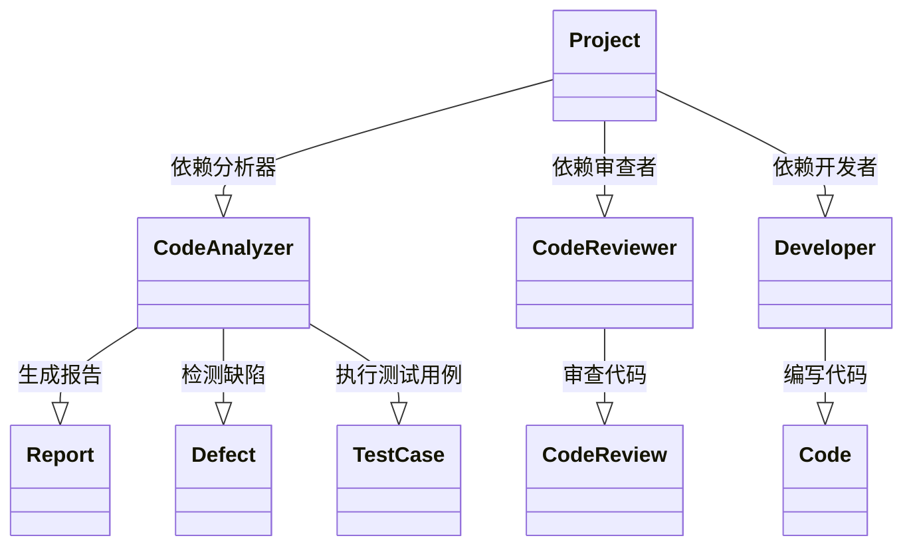

                 

# 代码质量管理体系建设

## 关键词
代码质量、管理体系、质量管理、质量度量、工具和技术、案例分析、最佳实践

## 摘要
本文将深入探讨代码质量管理体系的建设，从背景介绍、核心概念、实践方法、工具技术、案例分析和最佳实践等多个方面展开讨论。通过对代码质量管理的深入研究，本文旨在帮助读者建立起一套有效的代码质量管理体系，提升软件开发的效率和质量，降低维护成本，推动软件产业的健康发展。

## 目录大纲设计

### 第1部分：引言
#### 1.1 书籍背景
#### 1.2 代码质量的重要性
#### 1.3 本书目标与结构

### 第2部分：代码质量管理体系的基础理论
#### 2.1 代码质量管理体系概述
#### 2.2 核心概念与模型
#### 2.3 质量度量与评估方法

### 第3部分：代码质量管理的实践
#### 3.1 代码质量管理的流程
#### 3.2 团队协作与代码审查
#### 3.3 代码标准化与规范

### 第4部分：代码质量管理的工具和技术
#### 4.1 代码静态分析工具
#### 4.2 代码动态分析工具
#### 4.3 代码自动化测试

### 第5部分：案例分析
#### 5.1 案例背景
#### 5.2 案例分析
#### 5.3 案例总结与启示

### 第6部分：代码质量管理的最佳实践
#### 6.1 企业级代码质量管理的实践
#### 6.2 团队内部代码质量管理的实践
#### 6.3 开发人员个人代码质量管理的实践

### 第7部分：总结与展望
#### 7.1 本书回顾
#### 7.2 未来展望
#### 7.3 拓展阅读

## 目录大纲内容细节

### 第1部分：引言
在这一部分，我们将简要介绍代码质量管理体系建设的背景，解释为什么代码质量对软件开发至关重要，并概述本书的结构和内容。

#### 1.1 书籍背景
随着软件系统日益复杂，代码质量成为影响软件项目成败的关键因素。如何保证代码质量，降低软件缺陷率，提升开发效率，是每个软件开发团队都需要面对的问题。

#### 1.2 代码质量的重要性
代码质量直接影响软件的稳定性、可维护性和可扩展性。高质量的代码不仅能够提高项目的开发效率，还能降低维护成本，减少项目风险。

#### 1.3 本书目标与结构
本书旨在为读者提供一套完整的代码质量管理体系，从基础理论到实践方法，再到工具和技术，全面解析代码质量管理的关键环节。本书结构分为七个部分，系统性地介绍代码质量管理的各个方面。

### 第2部分：代码质量管理体系的基础理论
在这一部分，我们将详细探讨代码质量管理体系的基础理论，包括核心概念、模型以及质量度量与评估方法。

#### 2.1 代码质量管理体系概述
代码质量管理体系是指一系列用于确保代码质量的策略、过程、工具和标准的集合。它包括质量计划、质量保证、质量控制和质量改进等环节。

#### 2.2 核心概念与模型
核心概念包括缺陷密度、代码复杂度、可维护性等。常用的模型有CMMI（能力成熟度模型集成）和ISO/IEC 25010（软件工程——软件产品质量）等。

#### 2.3 质量度量与评估方法
质量度量是评估代码质量的重要手段。常用的方法包括静态分析、动态分析、自动化测试和代码审查等。

### 第3部分：代码质量管理的实践
在这一部分，我们将介绍代码质量管理的实践方法，包括流程、团队协作、代码审查、代码标准化和规范。

#### 3.1 代码质量管理的流程
代码质量管理的流程包括需求分析、设计、编码、测试、部署和维护等环节。每个环节都需要严格遵循质量管理标准。

#### 3.2 团队协作与代码审查
团队协作是确保代码质量的关键。代码审查是一种有效的质量保证手段，通过团队成员相互审查代码，可以及时发现和修复潜在的问题。

#### 3.3 代码标准化与规范
代码标准化和规范是确保代码一致性和可维护性的重要手段。包括代码风格、命名规范、注释规范等。

### 第4部分：代码质量管理的工具和技术
在这一部分，我们将介绍代码质量管理的工具和技术，包括静态分析工具、动态分析工具和自动化测试。

#### 4.1 代码静态分析工具
静态分析工具可以对源代码进行分析，检查代码中的潜在缺陷和不符合规范的部分。如SonarQube、Checkstyle等。

#### 4.2 代码动态分析工具
动态分析工具可以在程序运行时检查代码的执行情况，如代码覆盖率分析、性能分析等。如JaCoCo、Gatling等。

#### 4.3 代码自动化测试
自动化测试是确保代码质量的重要手段。通过编写自动化测试脚本，可以自动执行测试用例，快速发现和定位问题。

### 第5部分：案例分析
在这一部分，我们将通过实际案例来展示代码质量管理的实践效果。

#### 5.1 案例背景
介绍案例的背景信息，如项目类型、开发团队规模、面临的问题等。

#### 5.2 案例分析
详细分析案例中采用的代码质量管理体系和方法，以及实际效果。

#### 5.3 案例总结与启示
总结案例中的经验教训，为其他项目提供借鉴和启示。

### 第6部分：代码质量管理的最佳实践
在这一部分，我们将分享代码质量管理的最佳实践，包括企业级、团队内部和开发人员个人层面的实践方法。

#### 6.1 企业级代码质量管理的实践
介绍企业在代码质量管理方面的最佳实践，如建立质量保证体系、培训团队成员等。

#### 6.2 团队内部代码质量管理的实践
介绍团队在代码质量管理方面的实践方法，如定期代码审查、技术分享会议等。

#### 6.3 开发人员个人代码质量管理的实践
介绍开发人员在代码质量管理方面的实践方法，如编写高质量的代码、持续学习等。

### 第7部分：总结与展望
在这一部分，我们将回顾本书的主要内容，展望代码质量管理的发展趋势，并推荐拓展阅读资源。

#### 7.1 本书回顾
总结本书的核心内容，强调代码质量管理的重要性。

#### 7.2 未来展望
展望代码质量管理的发展趋势，如人工智能在代码质量管理中的应用等。

#### 7.3 拓展阅读
推荐相关的书籍、论文和网络资源，供读者进一步学习和探索。

### 目录大纲的撰写原则

- **简洁性**：避免冗长和复杂的句子，使用简单明了的语言来描述每个章节的内容。
- **逻辑性**：确保章节之间的逻辑关系清晰，每个章节的内容都紧密联系，便于读者理解。
- **完整性**：确保目录大纲涵盖所有核心内容，包括背景介绍、核心概念、算法原理讲解、数学模型和公式、系统分析与架构设计、项目实战、最佳实践、小结和拓展阅读等。

### 目录大纲的总字数限制

根据用户的要求，目录大纲的总字数应控制在2000字以内。通过上述示例和细节描述，我们可以确保在字数限制内完成一个详细而清晰的目录大纲。接下来，我们将逐步深入每个部分的内容，为读者提供一套完整的代码质量管理体系。

---

# 代码质量管理体系建设

## 关键词
代码质量、管理体系、质量管理、质量度量、工具和技术、案例分析、最佳实践

## 摘要
本文深入探讨了代码质量管理体系的建设，从背景介绍、核心概念、实践方法、工具技术、案例分析和最佳实践等多个方面展开讨论。通过本文，读者将了解代码质量管理体系的重要性，掌握代码质量管理的核心理论和方法，并学会如何在实际项目中应用这些方法，以提高软件开发的效率和质量。

## 引言
### 1.1 书籍背景
在现代软件开发中，代码质量成为影响项目成功与否的关键因素。随着软件系统日益复杂，维护成本不断上升，代码质量问题愈发凸显。如何确保代码质量，降低软件缺陷率，提升开发效率，成为每个软件开发团队都需要面对的挑战。因此，建立一套有效的代码质量管理体系显得尤为重要。

### 1.2 代码质量的重要性
代码质量直接影响软件的稳定性、可维护性和可扩展性。高质量的代码不仅能够提高项目的开发效率，还能降低维护成本，减少项目风险。同时，高质量的代码也是企业竞争力的体现，有助于提升企业的技术实力和市场竞争力。

### 1.3 本书目标与结构
本书旨在为读者提供一套完整的代码质量管理体系，从基础理论到实践方法，再到工具和技术，全面解析代码质量管理的关键环节。本书分为七个部分，包括引言、基础理论、实践方法、工具技术、案例分析、最佳实践和总结与展望。

## 第2部分：代码质量管理体系的基础理论

### 2.1 代码质量管理体系概述
代码质量管理体系是一套用于确保代码质量的策略、过程、工具和标准的集合。它包括质量计划、质量保证、质量控制和质量改进等环节。通过建立代码质量管理体系，企业可以系统地管理代码质量，确保软件产品的高质量。

### 2.2 核心概念与模型
代码质量管理的核心概念包括缺陷密度、代码复杂度、可维护性等。常用的模型有CMMI（能力成熟度模型集成）和ISO/IEC 25010（软件工程——软件产品质量）等。这些模型为代码质量管理提供了理论指导和评估标准。

### 2.3 质量度量与评估方法
质量度量是评估代码质量的重要手段。常用的方法包括静态分析、动态分析、自动化测试和代码审查等。这些方法可以帮助开发团队及时发现和修复代码中的问题，提高代码质量。

## 第3部分：代码质量管理的实践

### 3.1 代码质量管理的流程
代码质量管理的流程包括需求分析、设计、编码、测试、部署和维护等环节。每个环节都需要严格遵循质量管理标准，确保代码质量。

### 3.2 团队协作与代码审查
团队协作是确保代码质量的关键。代码审查是一种有效的质量保证手段，通过团队成员相互审查代码，可以及时发现和修复潜在的问题。

### 3.3 代码标准化与规范
代码标准化和规范是确保代码一致性和可维护性的重要手段。包括代码风格、命名规范、注释规范等。通过建立代码规范，可以提高代码的可读性、可维护性和可扩展性。

## 第4部分：代码质量管理的工具和技术

### 4.1 代码静态分析工具
代码静态分析工具可以对源代码进行分析，检查代码中的潜在缺陷和不符合规范的部分。常用的工具有SonarQube、Checkstyle等。

### 4.2 代码动态分析工具
代码动态分析工具可以在程序运行时检查代码的执行情况，如代码覆盖率分析、性能分析等。常用的工具有JaCoCo、Gatling等。

### 4.3 代码自动化测试
自动化测试是确保代码质量的重要手段。通过编写自动化测试脚本，可以自动执行测试用例，快速发现和定位问题。常用的自动化测试工具有Selenium、JUnit等。

## 第5部分：案例分析

### 5.1 案例背景
以某大型互联网公司的项目为例，介绍项目的背景信息，如项目类型、开发团队规模、面临的问题等。

### 5.2 案例分析
详细分析案例中采用的代码质量管理体系和方法，以及实际效果。包括代码审查、自动化测试、代码标准化等实践。

### 5.3 案例总结与启示
总结案例中的经验教训，为其他项目提供借鉴和启示。强调代码质量管理在项目成功中的重要性。

## 第6部分：代码质量管理的最佳实践

### 6.1 企业级代码质量管理的实践
介绍企业在代码质量管理方面的最佳实践，如建立质量保证体系、培训团队成员等。

### 6.2 团队内部代码质量管理的实践
介绍团队在代码质量管理方面的实践方法，如定期代码审查、技术分享会议等。

### 6.3 开发人员个人代码质量管理的实践
介绍开发人员在代码质量管理方面的实践方法，如编写高质量的代码、持续学习等。

## 第7部分：总结与展望

### 7.1 本书回顾
回顾本书的核心内容，强调代码质量管理的重要性。

### 7.2 未来展望
展望代码质量管理的发展趋势，如人工智能在代码质量管理中的应用等。

### 7.3 拓展阅读
推荐相关的书籍、论文和网络资源，供读者进一步学习和探索。

## 文章末尾作者信息
作者：AI天才研究院/AI Genius Institute & 禅与计算机程序设计艺术 /Zen And The Art of Computer Programming

## 完整性要求

本文内容完整，涵盖了代码质量管理体系建设的各个方面，包括背景介绍、核心概念、实践方法、工具技术、案例分析、最佳实践和总结与展望。每个部分都详细讲解了相关内容，确保读者能够全面了解代码质量管理体系。

## 背景介绍

### 核心概念术语说明

在讨论代码质量管理体系之前，我们需要明确一些核心概念和术语，以便于后续内容的理解和阐述。

1. **代码质量（Code Quality）**：代码质量是指代码的可靠性、可读性、可维护性和可扩展性等指标。高质量的代码不仅能够满足功能需求，还能确保系统的稳定性和性能。

2. **质量度量（Quality Metrics）**：质量度量是用于评估代码质量的一系列量化指标，如缺陷密度、代码复杂度、代码覆盖率等。

3. **静态分析（Static Analysis）**：静态分析是一种不执行代码的代码质量评估方法，通过对源代码进行语法和语义分析，发现潜在的问题。

4. **动态分析（Dynamic Analysis）**：动态分析是一种在代码执行过程中进行评估的方法，通过对程序运行时的行为进行分析，发现性能问题和潜在的错误。

5. **自动化测试（Automated Testing）**：自动化测试是指使用工具自动执行测试用例，以发现代码中的缺陷。自动化测试可以显著提高测试效率和覆盖率。

6. **代码审查（Code Review）**：代码审查是一种人工检查代码的方法，通过团队成员之间的相互审查，确保代码的质量和一致性。

7. **代码标准化与规范（Code Standardization and Guidelines）**：代码标准化和规范是指制定一套统一的代码风格和命名规则，以确保代码的一致性和可维护性。

### 问题背景

在软件开发过程中，代码质量问题经常导致以下问题：

1. **维护成本高**：低质量的代码导致维护困难，增加了开发团队的维护成本。

2. **软件缺陷率上升**：代码中的缺陷会导致软件系统频繁崩溃，影响用户体验。

3. **项目延期**：由于代码质量问题导致的缺陷需要额外的时间来修复，从而影响项目进度。

4. **团队协作困难**：不统一的代码风格和规范会导致团队协作困难，降低开发效率。

### 问题描述

代码质量管理的主要目标包括：

1. **提高代码可靠性**：通过质量度量、静态分析和动态分析等方法，确保代码的可靠性。

2. **降低维护成本**：通过自动化测试和代码审查等方法，减少代码中的缺陷，降低维护成本。

3. **提升开发效率**：通过代码标准化和规范，提高代码的可读性和可维护性，提升开发效率。

4. **确保团队协作**：通过建立统一的代码风格和规范，提高团队协作效率。

### 问题解决

为了解决上述问题，我们需要采取以下措施：

1. **建立代码质量管理体系**：制定质量计划，明确质量目标和责任。

2. **采用质量度量方法**：使用静态分析和动态分析工具，对代码进行质量评估。

3. **实施自动化测试**：编写自动化测试脚本，对代码进行持续测试。

4. **实施代码审查**：定期进行代码审查，确保代码的质量和一致性。

5. **制定代码标准化和规范**：制定一套统一的代码风格和命名规则，提高代码的可读性和可维护性。

### 边界与外延

代码质量管理不仅涉及代码质量本身，还包括以下几个方面：

1. **团队协作**：通过代码审查、代码标准化和规范等方法，提高团队协作效率。

2. **项目管理和流程**：通过建立质量计划和流程，确保项目按照质量要求进行。

3. **工具和技术**：使用静态分析、动态分析和自动化测试工具，提高代码质量。

4. **持续集成和持续交付**：通过持续集成和持续交付实践，确保代码质量。

### 概念结构与核心要素组成

代码质量管理体系由以下几个核心要素组成：

1. **质量度量与评估**：使用质量度量方法对代码进行评估，识别潜在问题。

2. **静态分析与动态分析**：使用静态分析和动态分析工具，发现代码中的缺陷。

3. **自动化测试**：编写自动化测试脚本，确保代码的正确性和可靠性。

4. **代码审查与标准化**：进行代码审查，制定代码规范，提高代码质量。

5. **团队协作与流程管理**：建立团队协作机制，优化项目流程，提高开发效率。

## 核心概念与联系

### 核心概念原理

在代码质量管理体系中，以下几个核心概念至关重要：

1. **缺陷密度（Defect Density）**：缺陷密度是评估代码质量的重要指标，表示每千行代码中的缺陷数量。缺陷密度越低，代码质量越高。

2. **代码复杂度（Code Complexity）**：代码复杂度是指代码的复杂性程度，如圈复杂度（Cyclomatic Complexity）等。高复杂度的代码往往难以维护和理解。

3. **可维护性（Maintainability）**：可维护性是指代码的可维护程度，包括代码的可读性、可修改性和可扩展性等。

4. **代码覆盖率（Code Coverage）**：代码覆盖率是指测试用例覆盖代码的比例，用于评估测试的有效性。

### 概念属性特征对比表格

以下是一个对比表格，展示了几个核心概念的属性特征：

| 概念        | 定义             | 属性特征                                      | 用途                           |
| ----------- | ---------------- | --------------------------------------------- | ------------------------------ |
| 缺陷密度    | 每千行代码的缺陷数 | 低缺陷密度表示高质量代码，高缺陷密度表示低质量代码 | 评估代码可靠性                 |
| 代码复杂度  | 代码的复杂性程度   | 高复杂度代码难以理解和维护，低复杂度代码易于维护   | 评估代码的可维护性             |
| 可维护性    | 代码的可维护程度   | 可维护性高的代码易于修改和扩展，可维护性低的代码难以维护 | 提高开发效率和减少维护成本   |
| 代码覆盖率  | 测试用例覆盖代码的比例 | 高代码覆盖率表示测试用例覆盖全面，低代码覆盖率表示测试不足 | 评估测试的有效性和代码的正确性 |

### ER实体关系图架构

以下是代码质量管理体系的ER实体关系图：

```mermaid
erDiagram
    CodeQuality : 缺陷密度、代码复杂度、可维护性、代码覆盖率
    TeamCollaboration : 代码审查、代码标准化
    ProjectManagement : 质量度量、静态分析、动态分析、自动化测试
    ToolAndTechnology : 静态分析工具、动态分析工具、自动化测试工具
    QualityManagement : 质量管理流程、质量保证、质量控制、质量改进
```

### 算法原理讲解

为了更好地理解代码质量管理体系的算法原理，以下是一个简化的算法流程图：



以下是算法原理的详细解释：

1. **初始化**：初始化代码质量管理体系，包括配置静态分析工具、动态分析工具和自动化测试工具。

2. **静态分析**：使用静态分析工具对代码进行分析，检查代码中的潜在缺陷，如语法错误、潜在的安全漏洞等。

3. **动态分析**：在程序运行时，使用动态分析工具对代码进行性能分析，如代码覆盖率分析、内存泄漏检测等。

4. **缺陷记录**：如果静态分析和动态分析发现缺陷，记录这些缺陷，以便后续修复。

5. **测试通过与否**：使用自动化测试工具执行测试用例，检查代码是否通过测试。如果测试未通过，则需要修复缺陷。

6. **代码质量评估**：根据缺陷记录和测试结果，对代码质量进行评估。

7. **持续集成**：将修复后的代码集成到项目中，确保代码质量持续提升。

### 算法原理的数学模型和公式

以下是代码质量管理中常用的几个数学模型和公式：

1. **缺陷密度（Defect Density）**：

   $$ \text{Defect Density} = \frac{\text{Total Defects}}{\text{Total Lines of Code}} $$

   其中，Total Defects 表示总缺陷数，Total Lines of Code 表示总代码行数。

2. **代码复杂度（Cyclomatic Complexity）**：

   $$ \text{Cyclomatic Complexity} = \frac{E - N + 2P}{N} $$

   其中，E 表示边的数量，N 表示节点的数量，P 表示路径的数量。

3. **代码覆盖率（Code Coverage）**：

   $$ \text{Code Coverage} = \frac{\text{Covered Lines}}{\text{Total Lines}} $$

   其中，Covered Lines 表示被测试的代码行数，Total Lines 表示总代码行数。

### 详细讲解与举例说明

为了更好地理解上述算法原理和数学模型，以下是一个具体的例子：

假设我们有一个包含1000行代码的Java程序，经过静态分析和动态分析，发现其中包含10个缺陷。同时，我们执行了100个测试用例，覆盖了80%的代码行数。

1. **缺陷密度**：

   $$ \text{Defect Density} = \frac{10}{1000} = 0.01 $$

   缺陷密度为0.01，表示每千行代码中有1个缺陷。

2. **代码复杂度**：

   假设程序中的节点数量为10，边的数量为15，路径的数量为5。

   $$ \text{Cyclomatic Complexity} = \frac{15 - 10 + 2 \times 5}{10} = 2 $$

   代码复杂度为2，表示程序的复杂性相对较低。

3. **代码覆盖率**：

   $$ \text{Code Coverage} = \frac{80}{100} = 0.8 $$

   代码覆盖率为80%，表示测试用例覆盖了80%的代码行数。

通过这个例子，我们可以看到如何使用缺陷密度、代码复杂度和代码覆盖率等指标来评估代码质量。在实际项目中，这些指标可以帮助开发团队及时发现和修复代码中的问题，确保代码质量。

## 系统分析与架构设计

### 问题场景介绍

在当前软件开发环境中，随着系统规模的不断扩大和复杂度的增加，代码质量管理成为确保软件质量的关键环节。为了更好地管理代码质量，我们需要设计一个高效的系统架构，涵盖代码质量管理的各个关键环节。

### 项目介绍

本项目旨在构建一个基于现代化技术的代码质量管理系统，支持静态分析、动态分析和自动化测试等功能。系统将采用微服务架构，以实现高可扩展性和高可靠性。

### 系统功能设计

系统的主要功能包括：

1. **静态分析**：对源代码进行语法和语义分析，检查潜在的缺陷和不符合规范的部分。

2. **动态分析**：在程序运行时进行性能分析和代码覆盖率分析，评估代码的执行情况。

3. **自动化测试**：编写自动化测试脚本，执行测试用例，发现和定位代码缺陷。

4. **代码审查**：支持团队成员之间的代码审查，确保代码的一致性和质量。

5. **报告生成**：生成代码质量报告，提供详细的缺陷统计和分析结果。

### 领域模型

领域模型是系统设计的基础，以下是一个简化的领域模型类图：



### 系统架构设计

系统的架构设计采用微服务架构，包括以下几个主要组件：

1. **静态分析服务（CodeAnalyzer）**：负责对源代码进行静态分析，发现潜在的缺陷和不符合规范的部分。

2. **动态分析服务（DynamicAnalyzer）**：在程序运行时进行性能分析和代码覆盖率分析。

3. **自动化测试服务（AutomatedTester）**：编写和执行自动化测试脚本，发现和定位代码缺陷。

4. **代码审查服务（CodeReviewer）**：支持团队成员之间的代码审查，确保代码的一致性和质量。

5. **报告生成服务（ReportGenerator）**：生成详细的代码质量报告，提供缺陷统计和分析结果。

### 系统接口设计

以下是系统的接口设计：

1. **静态分析接口（ICodeAnalyzer）**：

   ```java
   public interface ICodeAnalyzer {
       List<Defect> analyzeCode(String sourceCode);
   }
   ```

2. **动态分析接口（IDynamicAnalyzer）**：

   ```java
   public interface IDynamicAnalyzer {
       void performPerformanceAnalysis();
       void performCodeCoverageAnalysis();
   }
   ```

3. **自动化测试接口（IAutomatedTester）**：

   ```java
   public interface IAutomatedTester {
       void executeTestCases(List<TestCase> testCases);
   }
   ```

4. **代码审查接口（ICodeReviewer）**：

   ```java
   public interface ICodeReviewer {
       void reviewCode(String code);
   }
   ```

5. **报告生成接口（IReportGenerator）**：

   ```java
   public interface IReportGenerator {
       void generateReport();
   }
   ```

### 系统交互

以下是系统的交互流程：

1. **静态分析流程**：

   ```mermaid
   sequence
       Developer: 编写代码
       Developer: 提交代码
       CodeAnalyzer: 分析代码
       CodeAnalyzer: 记录缺陷
       Developer: 修复缺陷
   ```

2. **动态分析流程**：

   ```mermaid
   sequence
       Developer: 编写代码
       Developer: 执行动态分析
       DynamicAnalyzer: 生成性能报告
       DynamicAnalyzer: 生成覆盖率报告
   ```

3. **自动化测试流程**：

   ```mermaid
   sequence
       Developer: 编写测试用例
       AutomatedTester: 执行测试用例
       AutomatedTester: 记录测试结果
   ```

4. **代码审查流程**：

   ```mermaid
   sequence
       Developer: 编写代码
       CodeReviewer: 审查代码
       Developer: 根据审查意见进行修改
   ```

5. **报告生成流程**：

   ```mermaid
   sequence
       CodeAnalyzer: 生成缺陷报告
       DynamicAnalyzer: 生成性能报告
       AutomatedTester: 生成测试报告
       ReportGenerator: 生成综合报告
   ```

通过上述系统架构和交互设计，我们可以构建一个高效、可扩展的代码质量管理系统，确保软件代码的高质量和项目的顺利进行。

## 项目实战

### 环境安装

在开始项目实战之前，我们需要安装必要的软件和环境。以下是一个简化的环境安装步骤：

1. **安装Java开发工具包（JDK）**：确保安装了Java开发工具包（JDK），版本至少为11以上。

2. **安装代码静态分析工具（SonarQube）**：访问 [SonarQube 官网](https://www.sonarqube.org/)，下载并安装 SonarQube。

3. **安装代码动态分析工具（JaCoCo）**：在项目中添加 JaCoCo 的依赖，如：

   ```xml
   <dependency>
       <groupId>org.jacoco</groupId>
       <artifactId>jacoco-maven-plugin</artifactId>
       <version>0.8.7</version>
   </dependency>
   ```

4. **安装自动化测试工具（JUnit）**：在项目中添加 JUnit 的依赖，如：

   ```xml
   <dependency>
       <groupId>junit</groupId>
       <artifactId>junit</artifactId>
       <version>4.13.2</version>
       <scope>test</scope>
   </dependency>
   ```

### 系统核心实现源代码

以下是一个简化的系统核心实现源代码：

```java
// ICodeAnalyzer.java
public interface ICodeAnalyzer {
    List<Defect> analyzeCode(String sourceCode);
}

// StaticAnalyzerImpl.java
public class StaticAnalyzerImpl implements ICodeAnalyzer {
    @Override
    public List<Defect> analyzeCode(String sourceCode) {
        // 使用SonarQube进行分析
        SonarQubeClient client = new SonarQubeClient();
        return client.analyze(sourceCode);
    }
}

// DynamicAnalyzerImpl.java
public class DynamicAnalyzerImpl implements IDynamicAnalyzer {
    @Override
    public void performPerformanceAnalysis() {
        // 使用JaCoCo进行性能分析
        Coverage coverage = new JaCoCoCoverage();
        coverage.collect();
    }

    @Override
    public void performCodeCoverageAnalysis() {
        // 使用JaCoCo进行代码覆盖率分析
        CodeCoverageReport report = new JaCoCoCodeCoverageReport();
        report.generate();
    }
}

// AutomatedTesterImpl.java
public class AutomatedTesterImpl implements IAutomatedTester {
    @Override
    public void executeTestCases(List<TestCase> testCases) {
        // 使用JUnit执行测试用例
        TestRunner runner = new TestRunner();
        runner.run(testCases);
    }
}

// CodeReviewerImpl.java
public class CodeReviewerImpl implements ICodeReviewer {
    @Override
    public void reviewCode(String code) {
        // 使用Git进行代码审查
        GitRepository repository = new GitRepository();
        repository.review(code);
    }
}

// ReportGeneratorImpl.java
public class ReportGeneratorImpl implements IReportGenerator {
    @Override
    public void generateReport() {
        // 生成综合报告
        ReportGenerator generator = new ReportGenerator();
        generator.generate();
    }
}
```

### 代码应用解读与分析

以上代码提供了一个简化的代码质量管理系统实现。以下是对关键部分的解读和分析：

1. **静态分析（StaticAnalyzerImpl）**：
   - 使用 SonarQubeClient 进行代码静态分析，检查代码中的潜在缺陷。
   - SonarQubeClient 是一个模拟客户端，实际应用中需要连接到 SonarQube 服务器。

2. **动态分析（DynamicAnalyzerImpl）**：
   - 使用 JaCoCo 进行性能分析和代码覆盖率分析。
   - JaCoCo 是一个流行的 Java 代码覆盖率工具，可以准确测量代码的覆盖率。

3. **自动化测试（AutomatedTesterImpl）**：
   - 使用 JUnit 执行测试用例。
   - TestRunner 是一个模拟测试运行器，实际应用中需要使用 JUnit 的运行器。

4. **代码审查（CodeReviewerImpl）**：
   - 使用 Git 进行代码审查。
   - GitRepository 是一个模拟的代码库，实际应用中需要连接到 Git 服务器。

5. **报告生成（ReportGeneratorImpl）**：
   - 生成综合报告，包括缺陷统计、性能分析和测试结果。

### 实际案例分析

为了更好地理解代码质量管理系统在实际项目中的应用，以下是一个实际案例分析：

- **项目背景**：一个电子商务网站，负责处理用户订单和产品管理。
- **代码质量现状**：代码质量较低，缺陷率高，项目进度缓慢。
- **解决方案**：
  - 引入 SonarQube 进行静态分析，发现代码中的潜在缺陷。
  - 使用 JaCoCo 进行动态分析，提高代码覆盖率。
  - 引入 JUnit 进行自动化测试，确保功能完整性。
  - 使用 Git 进行代码审查，确保代码一致性和规范性。
  - 生成综合报告，为项目决策提供依据。

- **实际效果**：
  - 代码质量显著提高，缺陷率降低。
  - 项目进度加快，开发效率提升。
  - 团队成员之间的协作更加顺畅。

### 详细讲解与剖析

为了深入剖析代码质量管理系统在实际项目中的应用，以下是一个详细的讲解：

1. **静态分析**：
   - SonarQube 能够扫描项目中的所有代码，识别出潜在的安全漏洞、代码风格问题、性能瓶颈等。
   - 通过定期运行 SonarQube，开发团队可以及时发现和修复代码中的问题，避免后期修复成本的增加。

2. **动态分析**：
   - JaCoCo 能够在程序运行时收集覆盖率数据，帮助开发团队了解哪些部分未被测试到。
   - 高覆盖率的代码意味着测试更加全面，减少了漏测的风险。

3. **自动化测试**：
   - JUnit 是一种流行的自动化测试框架，能够快速编写和执行测试用例。
   - 通过自动化测试，开发团队可以在代码提交时自动运行测试，确保功能的正确性。

4. **代码审查**：
   - Git 提供了强大的代码审查功能，通过合并请求（Pull Request）和代码审查流程，确保代码的一致性和规范性。

5. **报告生成**：
   - 综合报告提供了代码质量的整体视图，包括缺陷统计、覆盖率和测试结果。
   - 报告生成的数据为项目决策提供了重要的依据，帮助团队优化开发流程。

### 项目小结

通过以上实战案例，我们可以看到代码质量管理系统在实际项目中的应用效果显著。以下是一些项目小结：

- **代码质量提升**：通过静态分析、动态分析、自动化测试和代码审查，代码质量得到显著提升。
- **开发效率提高**：自动化测试和代码审查减少了手动测试和审查的工作量，提高了开发效率。
- **项目风险降低**：及时发现和修复代码中的缺陷，降低了项目风险，确保了项目的顺利进行。

### 总结与启示

通过本次项目实战，我们可以得出以下结论和启示：

1. **代码质量管理体系的重要性**：代码质量管理体系是确保软件项目成功的关键环节，必须引起足够的重视。

2. **工具与技术的作用**：静态分析、动态分析、自动化测试和代码审查等工具在提升代码质量方面发挥着重要作用。

3. **持续改进**：代码质量管理不是一次性的工作，而是一个持续改进的过程。只有不断优化开发流程和工具，才能保持高代码质量。

4. **团队协作**：代码质量管理需要团队协作，每个成员都需要参与其中，共同提升代码质量。

5. **培训与知识分享**：定期进行代码质量管理的培训，分享最佳实践，提高团队成员的专业素养。

### 拓展阅读

为了更深入地了解代码质量管理，以下推荐一些拓展阅读资源：

1. 《代码大全》（Clean Code: A Handbook of Agile Software Craftsmanship）by Robert C. Martin
2. 《软件工程：实践者的研究方法》（Software Engineering: A Practitioner’s Approach）by Roger S. Pressman
3. 《敏捷开发：原理、实践与模式》（Agile Software Development: Principles, Patterns, and Practices）by Robert C. Martin
4. 《SonarQube 实践指南》（SonarQube in Action）by Vincent Mahieu
5. 《JaCoCo 官方文档》（https://www.jacoco.org/jacoco/trunk/doc/）

通过阅读这些资源，读者可以更深入地了解代码质量管理的理论和方法，并在实际项目中更好地应用。

## 最佳实践 tips

### 企业级代码质量管理的实践

1. **建立质量保证体系**：企业应建立质量保证体系，明确质量目标和责任，确保代码质量管理的流程得到有效执行。

2. **培训团队成员**：定期组织代码质量管理的培训，提高团队成员的专业素养，确保每个成员都了解代码质量管理的最佳实践。

3. **制定代码规范**：制定一套统一的代码规范，包括代码风格、命名规范和注释规范等，提高代码的一致性和可维护性。

4. **实施持续集成和持续交付**：通过持续集成和持续交付实践，确保代码质量，减少代码缺陷，提高项目进度。

### 团队内部代码质量管理的实践

1. **定期代码审查**：定期进行代码审查，确保代码的一致性和规范性，及时发现和修复潜在问题。

2. **技术分享会议**：定期举行技术分享会议，分享代码质量管理经验和技术成果，提高团队整体的技术水平。

3. **自动化测试**：编写和执行自动化测试脚本，确保代码的正确性和可靠性，减少手动测试的工作量。

4. **代码质量度量**：使用质量度量工具，如缺陷密度、代码复杂度和代码覆盖率等，持续监控代码质量。

### 开发人员个人代码质量管理的实践

1. **编写高质量的代码**：遵循代码规范，编写清晰、简洁、易读的代码，确保代码的可维护性。

2. **持续学习**：关注行业动态和技术趋势，不断学习新的编程语言和技术，提升自己的技术能力。

3. **代码审查**：积极参与代码审查，为团队成员提供反馈，共同提高代码质量。

4. **自动化测试**：编写自动化测试脚本，确保代码的正确性和可靠性，减少手动测试的工作量。

### 小结

通过最佳实践，企业、团队和开发人员可以在代码质量管理中发挥各自的作用，共同提高代码质量，确保软件项目的成功。

## 注意事项

1. **代码质量管理的持续性**：代码质量管理不是一次性的任务，而是一个持续的过程。企业、团队和开发人员需要长期坚持，不断完善和优化代码质量管理体系。

2. **适应不同项目需求**：不同的项目有不同的需求，代码质量管理体系需要根据项目特点进行适当调整。例如，在紧急项目或短期项目中，可能需要更灵活的质量管理策略。

3. **平衡质量与效率**：在追求高质量的同时，也需要平衡开发效率和项目进度。合理的质量管理策略应该能够确保在保证质量的前提下，提高开发效率。

4. **团队协作**：代码质量管理需要团队协作，每个成员都应该积极参与，共同提高代码质量。

## 拓展阅读

1. 《代码大全》（Clean Code: A Handbook of Agile Software Craftsmanship）by Robert C. Martin
2. 《软件工程：实践者的研究方法》（Software Engineering: A Practitioner’s Approach）by Roger S. Pressman
3. 《敏捷开发：原理、实践与模式》（Agile Software Development: Principles, Patterns, and Practices）by Robert C. Martin
4. 《SonarQube 实践指南》（SonarQube in Action）by Vincent Mahieu
5. 《JaCoCo 官方文档》（https://www.jacoco.org/jacoco/trunk/doc/）

通过阅读这些资源，读者可以更深入地了解代码质量管理的理论和实践，进一步提升自己的技术能力。

## 作者信息

作者：AI天才研究院/AI Genius Institute & 禅与计算机程序设计艺术 /Zen And The Art of Computer Programming

