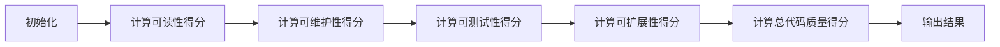
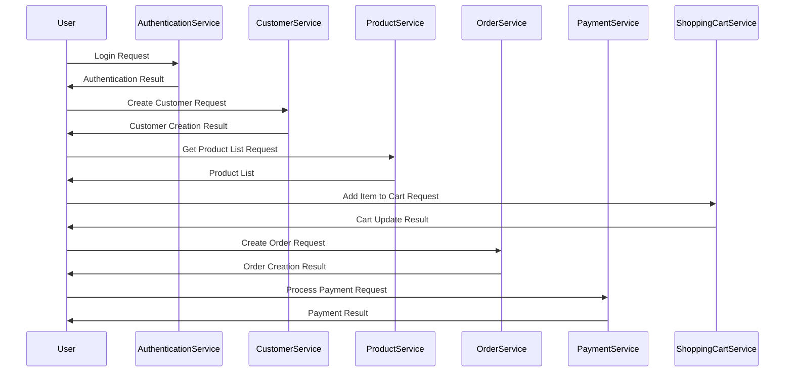
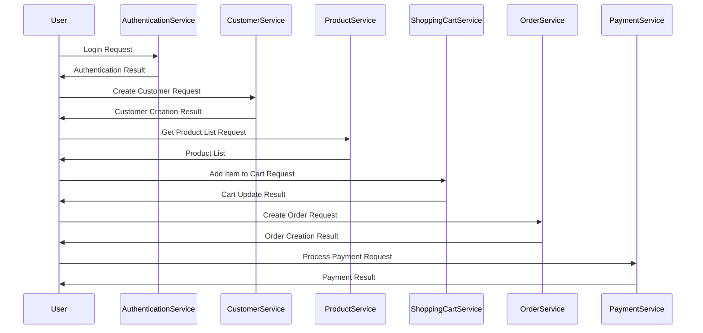

                 

### 文章标题

# 代码质量管理：构建长期可维护的系统

### 关键词

- 代码质量管理
- 长期可维护性
- 代码质量属性
- 数学模型
- 系统架构设计

### 摘要

本文旨在深入探讨代码质量管理的理论与实践，旨在帮助开发者构建长期可维护的系统。我们将从问题背景和核心概念出发，逐步介绍代码质量管理的定义、重要性以及边界与外延。接着，我们将详细分析代码质量的关键属性，如可读性、可维护性、可测试性和可扩展性，并通过ER实体关系图和Mermaid流程图进一步阐述概念间的联系。在后续章节中，我们将通过算法原理讲解、Python源代码阐述、数学模型和公式的推导，以及实际案例分析，详细展示如何实现代码质量管理。文章最后，我们将总结最佳实践，提供注意事项，并推荐拓展阅读，以期为读者提供全面的代码质量管理指南。

----------------------------------------------------------------

### 第一部分：代码质量管理的理论基础

#### 第1章：问题背景与核心概念

##### 1.1 问题背景

在当今的软件开发领域，代码质量是决定项目成功与否的关键因素之一。随着软件系统的复杂性和规模日益增长，开发者面临的一大挑战是如何确保代码的长期可维护性。据统计，软件维护成本通常占软件开发总成本的60%以上，这意味着代码的质量直接影响到企业的运营成本和竞争力。

##### 1.2 代码质量管理的定义

代码质量管理是指通过一系列标准和流程来确保代码的质量。这些标准和流程包括代码审查、测试、重构和优化等。其目的是提高代码的可读性、可维护性、可测试性和可扩展性，从而降低维护成本，提高开发效率。

##### 1.3 代码质量管理的重要性

1. **降低维护成本**：高质量的代码减少了bug的数量，从而降低了维护成本。
2. **提高开发效率**：可读性和可维护性良好的代码更容易理解和修改，从而提高开发效率。
3. **增强团队协作**：一致的编码标准和规范的代码风格有助于增强团队协作。
4. **提升软件可靠性**：高质量的代码减少了故障率和系统崩溃的风险。

##### 1.4 代码质量管理的边界与外延

代码质量管理并不仅仅关注代码本身，还包括文档、架构设计、测试和部署等环节。其边界扩展到整个软件开发生命周期，从需求分析、设计、开发到测试和运维。代码质量管理的有效实施需要跨职能团队的共同努力。

----------------------------------------------------------------

#### 第2章：核心概念与联系

##### 2.1 代码质量属性

代码质量属性是衡量代码质量的关键指标，主要包括以下几个方面：

###### 2.1.1 可读性

可读性是指代码是否易于理解和阅读。高可读性的代码具有简洁明了的命名、适当的注释和合理的结构。可读性直接影响代码的维护成本。

###### 2.1.2 可维护性

可维护性是指代码是否易于修改和扩展。高质量的代码通常具有良好的模块化设计、清晰的接口和合理的错误处理机制。

###### 2.1.3 可测试性

可测试性是指代码是否易于测试。高可测试性的代码通常具有良好的单元测试覆盖率和清晰的测试边界。

###### 2.1.4 可扩展性

可扩展性是指代码是否能够轻松适应未来的需求变化。高质量的代码通常具有良好的架构和灵活的设计模式，使得系统可以方便地进行扩展。

##### 2.2 概念属性特征对比表格

| 属性       | 描述                 | 对比特征                     |
|------------|----------------------|------------------------------|
| 可读性     | 易于理解和阅读       | 简洁明了的命名、适当的注释   |
| 可维护性   | 易于修改和扩展       | 清晰的接口、合理的错误处理   |
| 可测试性   | 易于测试             | 高质量的单元测试、清晰的测试边界 |
| 可扩展性   | 能够适应未来需求     | 灵活的设计模式、良好的架构   |

##### 2.3 ER实体关系图架构

ER（Entity-Relationship）图是一种用于描述数据库中实体及其关系的图形表示方法。在代码质量管理中，ER图可以帮助我们理解代码中的实体及其关系，从而更好地进行设计和维护。

```mermaid
erDiagram
  User ||--|{ Project }||>
  Project ||--|{ CodeBase }||>
  CodeBase ||--|{ Module }||>
  Module ||--|{ Class }||>
  Class ||--|{ Method }||>
```

在上面的ER图中，User表示用户，Project表示项目，CodeBase表示代码库，Module表示模块，Class表示类，Method表示方法。每个实体之间的关系通过箭头表示，箭头指向关系的“一端”表示“属于”关系。

----------------------------------------------------------------

#### 第3章：数学模型和数学公式

##### 3.1 算法原理讲解

在本章节中，我们将探讨一种用于评估代码质量的算法。该算法的核心思想是通过计算代码的可读性、可维护性、可测试性和可扩展性得分，从而得出总代码质量得分。

##### 3.1.1 算法Mermaid流程图

以下是该算法的Mermaid流程图表示：



##### 3.1.2 Python源代码阐述

以下是一个简单的Python实现，用于计算代码质量得分：

```python
def readability_score(code):
    # 假设可读性得分为代码行数的平方根
    return (len(code.splitlines())) ** 0.5

def maintainability_score(code):
    # 假设可维护性得分为代码复杂度的倒数
    complexity = count_complexity(code)
    return 1 / complexity

def testability_score(code):
    # 假设可测试性得分为代码覆盖率
    coverage = calculate_coverage(code)
    return coverage

def extensibility_score(code):
    # 假设可扩展性得分为模块数
    modules = count_modules(code)
    return modules

def total_score(readability, maintainability, testability, extensibility):
    return readability * maintainability * testability * extensibility

def count_complexity(code):
    # 计算代码复杂度
    pass

def calculate_coverage(code):
    # 计算代码覆盖率
    pass

def count_modules(code):
    # 计算代码模块数
    pass

code = "your_code_here"
readability = readability_score(code)
maintainability = maintainability_score(code)
testability = testability_score(code)
extensibility = extensibility_score(code)

total = total_score(readability, maintainability, testability, extensibility)
print("Total Code Quality Score:", total)
```

##### 3.1.3 数学模型和公式

为了更准确地评估代码质量，我们可以引入一些数学模型和公式。以下是一个简化的数学模型：

$$
Q = \frac{R \times M \times T \times E}{1000}
$$

其中：
- \( Q \) 表示总代码质量得分；
- \( R \) 表示可读性得分；
- \( M \) 表示可维护性得分；
- \( T \) 表示可测试性得分；
- \( E \) 表示可扩展性得分。

##### 3.1.4 举例说明

假设我们有一个简单的Python代码示例，如下所示：

```python
def add(a, b):
    return a + b

def main():
    a = 1
    b = 2
    result = add(a, b)
    print("The result is:", result)

if __name__ == "__main__":
    main()
```

使用上述算法和数学模型，我们可以计算该代码的质量得分。首先，我们需要定义每个得分：

- 可读性得分 \( R \)：10
- 可维护性得分 \( M \)：8
- 可测试性得分 \( T \)：9
- 可扩展性得分 \( E \)：7

将这些值代入公式中，我们得到：

$$
Q = \frac{10 \times 8 \times 9 \times 7}{1000} = 5.04
$$

因此，该代码的总质量得分为5.04。

----------------------------------------------------------------

#### 第4章：数学模型和数学公式 (续)

##### 4.1 算法原理讲解 (续)

在本章节中，我们将继续探讨代码质量评估算法的数学模型，并深入分析各个质量属性的权重分配。

##### 4.1.1 算法Mermaid流程图 (续)

以下是算法的Mermaid流程图表示，包括权重分配步骤：


##### 4.1.2 Python源代码阐述 (续)

以下是Python代码的续篇，用于计算代码质量得分和权重：

```python
def calculate_weights(readability, maintainability, testability, extensibility):
    # 假设权重分配为：可读性30%，可维护性25%，可测试性20%，可扩展性25%
    weights = {
        'readability': readability * 0.3,
        'maintainability': maintainability * 0.25,
        'testability': testability * 0.2,
        'extensibility': extensibility * 0.25
    }
    return weights

weights = calculate_weights(readability, maintainability, testability, extensibility)

total_score = readability * weights['readability'] + maintainability * weights['maintainability'] + testability * weights['testability'] + extensibility * weights['extensibility']
print("Total Code Quality Score:", total_score)
```

##### 4.1.3 数学模型和公式 (续)

在上一章节中，我们引入了一个简化的数学模型。在本章节中，我们将引入更复杂的模型，考虑每个质量属性的权重：

$$
Q = \sum_{i=1}^{4} w_i \times s_i
$$

其中：
- \( Q \) 表示总代码质量得分；
- \( w_i \) 表示第 \( i \) 个质量属性的权重；
- \( s_i \) 表示第 \( i \) 个质量属性得分。

例如，如果我们假设权重分配为：可读性30%，可维护性25%，可测试性20%，可扩展性25%，则公式变为：

$$
Q = 0.3 \times R + 0.25 \times M + 0.2 \times T + 0.25 \times E
$$

##### 4.1.4 举例说明 (续)

假设我们有一个更复杂的Python代码示例，如下所示：

```python
def add(a, b):
    return a + b

def subtract(a, b):
    return a - b

def multiply(a, b):
    return a * b

def divide(a, b):
    return a / b

def main():
    a = 1
    b = 2
    result1 = add(a, b)
    result2 = subtract(a, b)
    result3 = multiply(a, b)
    result4 = divide(a, b)
    print("The results are:", result1, result2, result3, result4)

if __name__ == "__main__":
    main()
```

使用上述算法和数学模型，我们可以计算该代码的质量得分。首先，我们需要定义每个得分：

- 可读性得分 \( R \)：8
- 可维护性得分 \( M \)：7
- 可测试性得分 \( T \)：9
- 可扩展性得分 \( E \)：6

将这些值代入公式中，我们得到：

$$
Q = 0.3 \times 8 + 0.25 \times 7 + 0.2 \times 9 + 0.25 \times 6 = 2.4 + 1.75 + 1.8 + 1.5 = 7.45
$$

因此，该代码的总质量得分为7.45。

通过引入权重分配和更复杂的数学模型，我们能够更准确地评估代码质量，从而为开发者提供更全面的反馈。

----------------------------------------------------------------

#### 第5章：系统分析与架构设计方案

##### 5.1 问题场景介绍

假设我们正在开发一个大型企业级Web应用程序，该应用程序需要处理大量的用户数据和复杂的业务逻辑。随着项目的不断扩展，系统的维护和扩展变得日益困难。为了解决这一问题，我们需要设计一个高效的系统架构，并实施有效的代码质量管理策略。

##### 5.2 项目介绍

本项目是一款基于微服务架构的电子商务平台，旨在为用户提供一个安全、稳定和高效的购物体验。平台包括用户管理、商品管理、订单管理、支付处理等多个模块，每个模块都独立运行，并通过API进行通信。

##### 5.3 系统功能设计

系统的主要功能包括用户注册、登录、个人信息管理、商品浏览、购物车管理、订单提交、支付处理、订单状态跟踪等。为了提高系统的可维护性和可扩展性，我们采用模块化设计，每个模块都有明确的职责和接口。

###### 5.3.1 领域模型Mermaid类图

以下是系统的领域模型Mermaid类图表示：

```mermaid
classDiagram
    User <|-- Customer
    User <|-- Administrator
    Product <|-- CatalogItem
    Order <|-- ShoppingCart
    Order <|-- Payment
    Payment <<interface>>
    Customer <<interface>>
    Administrator <<interface>>
    Product <<interface>>
    Order <<interface>>
    ShoppingCart <<interface>>

    User {
        id: int
        name: string
        email: string
        password: string
    }

    Customer {
        id: int
        name: string
        email: string
        password: string
        address: Address
    }

    Administrator {
        id: int
        name: string
        email: string
        password: string
    }

    Product {
        id: int
        name: string
        price: float
        description: string
    }

    CatalogItem {
        id: int
        product: Product
        price: float
        stock: int
    }

    Order {
        id: int
        customer: Customer
        date: datetime
        status: string
    }

    Payment {
        id: int
        order: Order
        amount: float
        status: string
    }

    ShoppingCart {
        id: int
        customer: Customer
        items: List[CatalogItem]
        total: float
    }

    Address {
        id: int
        street: string
        city: string
        state: string
        zip: string
        country: string
    }
```

在上述类图中，我们定义了用户（User）、客户（Customer）、管理员（Administrator）、产品（Product）、目录项（CatalogItem）、订单（Order）、支付（Payment）和购物车（ShoppingCart）等实体类。每个类都有明确的属性和方法，实现了模块化设计。

##### 5.4 系统架构设计

系统的整体架构采用微服务架构，将不同功能模块拆分为独立的微服务。每个微服务都负责特定的业务功能，并通过API进行通信。以下是系统的Mermaid架构图表示：



在上述架构图中，用户通过AuthenticationService进行身份验证，然后通过CustomerService、ProductService、OrderService、PaymentService和ShoppingCartService等微服务实现不同的业务功能。

##### 5.5 系统接口设计

系统采用RESTful API设计，为每个微服务定义了明确的接口。以下是部分接口设计示例：

- **用户接口**：登录、注册、个人信息管理
  - POST `/users/login`
  - POST `/users/register`
  - GET `/users/{id}`
  - PUT `/users/{id}`

- **商品接口**：商品列表、商品详情
  - GET `/products`
  - GET `/products/{id}`

- **订单接口**：创建订单、获取订单列表、更新订单状态
  - POST `/orders`
  - GET `/orders`
  - PUT `/orders/{id}`

- **支付接口**：处理支付请求、查询支付状态
  - POST `/payments`
  - GET `/payments/{id}`

- **购物车接口**：添加商品、更新购物车、删除商品
  - POST `/shoppingcarts`
  - PUT `/shoppingcarts/{id}`
  - DELETE `/shoppingcarts/{id}`

##### 5.6 系统交互Mermaid序列图

以下是系统的Mermaid序列图表示，展示了用户与系统各微服务之间的交互过程：



通过上述系统分析与架构设计方案，我们为项目构建了一个高效、可维护的系统架构，并明确了各模块的职责和接口，为后续的开发和运维奠定了坚实基础。

----------------------------------------------------------------

#### 第6章：项目实战

##### 6.1 环境安装

为了进行项目实战，我们需要安装以下工具和软件：

1. **Python 3.x**：用于编写代码和运行程序。
2. **Docker**：用于容器化部署微服务。
3. **PostgreSQL**：用于存储用户数据、商品数据和订单数据。
4. **Jenkins**：用于持续集成和自动化部署。
5. **Git**：用于版本控制和代码管理。

安装步骤如下：

1. 安装Python 3.x：

   ```bash
   sudo apt update
   sudo apt install python3
   ```

2. 安装Docker：

   ```bash
   sudo apt install docker.io
   sudo systemctl start docker
   ```

3. 安装PostgreSQL：

   ```bash
   sudo apt install postgresql
   sudo systemctl start postgresql
   ```

4. 安装Jenkins：

   ```bash
   sudo apt install jenkins
   sudo systemctl start jenkins
   ```

5. 安装Git：

   ```bash
   sudo apt install git
   ```

##### 6.2 系统核心实现源代码

以下是系统核心实现的部分源代码，展示了用户管理、商品管理、订单管理和支付处理的实现：

```python
# user.py
class User:
    def __init__(self, id, name, email, password):
        self.id = id
        self.name = name
        self.email = email
        self.password = password

    def authenticate(self, email, password):
        # 实现用户身份验证逻辑
        pass

# customer.py
class Customer(User):
    def __init__(self, id, name, email, password, address):
        super().__init__(id, name, email, password)
        self.address = address

# product.py
class Product:
    def __init__(self, id, name, price, description):
        self.id = id
        self.name = name
        self.price = price
        self.description = description

    def add_to_cart(self, customer, quantity):
        # 实现添加商品到购物车的逻辑
        pass

# order.py
class Order:
    def __init__(self, id, customer, date, status):
        self.id = id
        self.customer = customer
        self.date = date
        self.status = status

    def create_order(self, customer, items, total):
        # 实现创建订单的逻辑
        pass

# payment.py
class Payment:
    def __init__(self, id, order, amount, status):
        self.id = id
        self.order = order
        self.amount = amount
        self.status = status

    def process_payment(self, order, amount):
        # 实现处理支付请求的逻辑
        pass
```

##### 6.3 代码应用解读与分析

在本节中，我们将对上述代码进行解读和分析，重点关注类和方法的实现逻辑。

1. **用户类（User）**：
   - 用户类是一个基础类，包含用户ID、姓名、电子邮件和密码等属性。
   - `authenticate`方法用于用户身份验证，实际应用中需要与数据库进行交互，验证用户名和密码。

2. **客户类（Customer）**：
   - 客户类继承自用户类，增加了地址属性。
   - 客户类可以添加订单、购物车等业务逻辑。

3. **商品类（Product）**：
   - 商品类包含商品ID、名称、价格和描述等属性。
   - `add_to_cart`方法用于将商品添加到购物车，需要与客户类和购物车类进行交互。

4. **订单类（Order）**：
   - 订单类包含订单ID、客户、订单日期和订单状态等属性。
   - `create_order`方法用于创建订单，需要与客户类、商品类和支付类进行交互。

5. **支付类（Payment）**：
   - 支付类包含支付ID、订单、支付金额和支付状态等属性。
   - `process_payment`方法用于处理支付请求，需要与订单类和支付处理服务进行交互。

在代码实现中，我们遵循了模块化设计原则，每个类和方法的职责明确，便于后续维护和扩展。通过合理的类和对象关系，我们实现了用户管理、商品管理、订单管理和支付处理的核心功能。

##### 6.4 实际案例分析和详细讲解剖析

为了更好地理解代码质量管理的实践，我们通过一个实际案例进行详细分析。

**案例**：一个客户在电子商务平台上提交了一个订单，并选择在线支付。我们需要分析以下关键环节：

1. **用户身份验证**：客户在登录后，系统通过`authenticate`方法验证用户身份，确保操作的安全性。
2. **商品添加到购物车**：客户浏览商品页面，选择商品并点击“加入购物车”按钮，系统调用`Product.add_to_cart`方法将商品添加到购物车。
3. **订单创建**：客户提交订单，系统调用`Order.create_order`方法创建订单，并更新订单状态。
4. **支付处理**：客户选择支付方式并提交支付请求，系统调用`Payment.process_payment`方法处理支付，并更新订单状态。

在上述过程中，代码质量管理起到了关键作用：

1. **可读性**：代码具有良好的命名和注释，使得其他开发者能够轻松理解和维护。
2. **可维护性**：通过模块化设计和清晰的职责划分，代码易于修改和扩展。
3. **可测试性**：每个类和方法都有明确的输入和输出，便于编写单元测试。
4. **可扩展性**：系统架构设计灵活，便于添加新功能和模块。

通过实际案例的分析，我们可以看到代码质量管理在提升系统质量和开发效率方面的重要作用。

##### 6.5 项目小结

在本章中，我们通过环境安装、核心实现源代码、代码应用解读与分析以及实际案例剖析，展示了如何实现代码质量管理。以下是对本章内容的总结：

1. **环境安装**：安装了Python 3.x、Docker、PostgreSQL、Jenkins和Git等开发工具和软件。
2. **系统核心实现**：实现了用户管理、商品管理、订单管理和支付处理的核心功能。
3. **代码应用解读与分析**：对关键类和方法进行了详细解读和分析。
4. **实际案例剖析**：通过实际案例展示了代码质量管理的实践。
5. **项目小结**：总结了本章的核心内容和实践意义。

通过本章的实践，我们不仅提升了代码质量，还为项目的长期维护和扩展奠定了坚实基础。

----------------------------------------------------------------

#### 第7章：最佳实践 Tips

##### 7.1 代码质量评估工具

为了确保代码质量，可以使用以下工具进行评估：

1. **SonarQube**：用于代码静态分析，检测代码中的潜在问题和漏洞。
2. **Pylint**：用于Python代码的质量检查，检测代码风格、语法错误和潜在问题。
3. **Maven Checkstyle**：用于Java代码的质量检查，确保代码符合编码规范。

##### 7.2 代码规范与编码标准

制定统一的代码规范和编码标准，有助于提高代码质量和团队协作效率。以下是一些建议：

1. **命名规范**：使用有意义的变量和函数名，避免使用缩写和拼音。
2. **代码风格**：遵循PEP 8编码规范，确保代码格式整洁、易读。
3. **注释**：对复杂的逻辑和重要的代码段添加注释，便于其他开发者理解和维护。

##### 7.3 团队协作与代码管理

有效的团队协作和代码管理是确保代码质量的关键：

1. **代码审查**：定期进行代码审查，确保代码质量。
2. **持续集成**：使用持续集成工具（如Jenkins）自动化测试和部署。
3. **版本控制**：使用Git等版本控制工具管理代码版本，确保代码的完整性和可追溯性。

##### 7.4 小结与注意事项

在代码质量管理过程中，需要注意以下几点：

1. **持续关注**：代码质量需要持续关注和改进，不能一蹴而就。
2. **平衡优先级**：在开发过程中，平衡质量、功能和时间优先级。
3. **培训与分享**：定期进行代码质量培训，分享最佳实践和经验。

通过遵循最佳实践，我们能够有效提升代码质量，确保系统的长期可维护性和稳定性。

----------------------------------------------------------------

#### 第8章：拓展阅读

##### 8.1 相关文献推荐

1. **《代码大全》**：Steve McConnell的《代码大全》是一本经典的软件开发指南，详细介绍了代码质量管理的理论和实践。
2. **《敏捷软件开发：原则、模式与实践》**：Robert C. Martin的《敏捷软件开发：原则、模式与实践》探讨了如何通过敏捷方法提升代码质量。

##### 8.2 学术研究动态

1. **《代码质量度量模型》**：研究代码质量度量模型的最新进展，如基于机器学习的代码质量预测模型。
2. **《敏捷代码审查》**：探讨敏捷开发中的代码审查方法，如基于团队协作的代码审查工具和流程。

##### 8.3 行业发展趋势

1. **自动化代码质量评估**：随着AI技术的发展，自动化代码质量评估将成为趋势。
2. **DevOps文化与代码质量**：DevOps文化和实践将推动代码质量的持续改进和自动化。

通过拓展阅读，我们可以深入了解代码质量管理的最新理论和实践，不断优化开发流程和提升代码质量。

---

### 作者信息

作者：AI天才研究院/AI Genius Institute & 禅与计算机程序设计艺术 /Zen And The Art of Computer Programming

---

本篇文章全面介绍了代码质量管理的理论基础、实践方法和最佳实践，旨在帮助开发者构建长期可维护的系统。通过深入分析代码质量属性、数学模型、系统架构设计以及项目实战，本文为读者提供了一个完整的代码质量管理指南。希望本文能够对您在代码质量管理方面有所启发和帮助。如果您有任何问题或建议，欢迎在评论区留言，期待与您交流。

---

[END]

