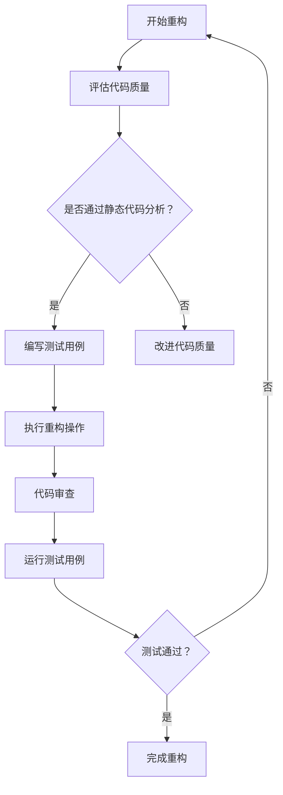

                 


### 引言
#### 代码重构的定义与重要性

**引言**

在计算机编程领域，代码重构是一项至关重要的技术实践。它不仅仅是简单的代码修改，而是一种改进代码质量和提高软件可维护性的系统性方法。那么，什么是代码重构呢？它的核心价值和意义又在哪里呢？

**定义**

代码重构（Code Refactoring）是指在不改变代码外在行为的前提下，对代码内部结构和组织进行改进的过程。这个过程通常包括重新命名变量、简化循环、提取函数、消除冗余代码、优化代码结构等。其目的是使代码更加清晰、简洁、易于理解和维护。

**重要性**

1. **提升可读性**：良好的代码结构能够提高代码的可读性，使得其他开发者更容易理解和修改代码，从而减少错误和疏漏。

2. **提高可维护性**：重构后的代码更加整洁，减少了不必要的复杂度，降低了代码出错的概率，使得维护工作更加高效和可靠。

3. **促进软件迭代**：随着软件的迭代和功能的增加，重构可以帮助保持代码的一致性和完整性，使得软件的扩展和升级变得更加容易。

4. **提升开发效率**：通过重构，开发人员可以更快地找到代码中的问题和瓶颈，进而优化性能和代码质量。

**引言小结**

总之，代码重构不仅是一种技术实践，更是一种软件开发哲学。它能够帮助开发人员保持代码的健康和活力，从而提高整个项目的开发效率和质量。在接下来的章节中，我们将深入探讨代码重构的核心概念、技巧、工具和实践，帮助读者全面了解并掌握这一重要的技术。

### 核心概念与背景

#### 代码重构的背景和动机

**背景**

随着软件项目的复杂性和规模不断增长，代码的维护和升级变得日益重要。早期的编程实践中，开发者往往关注于实现功能，而忽视了代码的内部结构和组织。这导致代码库中充斥着冗余、重复和低效的代码，使得项目的可维护性和扩展性受到严重挑战。为了应对这一挑战，代码重构应运而生。

**动机**

1. **代码质量**：重构可以帮助提升代码质量，消除潜在的错误和缺陷，减少代码的复杂度。

2. **可读性**：通过重构，代码变得更加清晰和易于理解，使得其他开发者更容易维护和扩展代码。

3. **可维护性**：重构后的代码结构更加合理，减少了修改和添加新功能时的风险。

4. **开发效率**：重构使得代码变得更加简洁和高效，减少了开发人员的认知负担，从而提高了开发效率。

**代码演变过程中的问题**

1. **冗余代码**：随着时间的推移，代码库中积累了大量的冗余代码，这些代码不仅占据了存储空间，还增加了代码的复杂度。

2. **重复代码**：相似的功能被重复实现，这不仅降低了代码的维护性，还增加了出错的可能性。

3. **代码混乱**：缺乏一致性和规范性的代码组织，使得代码库变得难以管理和理解。

4. **性能问题**：低效的代码结构可能导致性能问题，影响系统的响应速度和稳定性。

**代码重构的意义**

代码重构的意义不仅体现在解决上述问题，还体现在以下几个方面：

1. **提升代码质量**：重构可以消除代码中的冗余和重复，提高代码的简洁性和可读性，从而提升整体代码质量。

2. **增强软件可维护性**：重构后的代码结构更加合理，使得维护和升级变得更加容易和可靠。

3. **促进团队协作**：重构后的代码更加清晰和一致，有助于团队成员之间的协作和理解。

4. **提高开发效率**：重构可以帮助开发人员更快地找到问题和瓶颈，从而优化代码性能和结构。

**背景和动机小结**

总之，代码重构是软件维护和升级过程中不可或缺的一部分。它能够帮助开发团队保持代码的健康和活力，从而提高软件项目的整体质量和开发效率。在接下来的章节中，我们将进一步探讨代码重构的核心概念和方法，帮助读者深入理解和掌握这一技术。

#### 代码重构的核心概念

**重构原则**

代码重构的原则是指导重构过程的基石，确保重构过程不会改变代码的预期行为。以下是几条重要的重构原则：

1. **保持行为不变**：重构过程中，必须确保代码的功能和行为保持不变。任何修改都应仅在内部结构上进行，而不影响外部行为。

2. **逐步迭代**：重构应是一个逐步迭代的过程，每次只进行一小部分修改，并确保每次修改都是可逆的。这样可以降低风险，并使得重构过程更加可控。

3. **保持测试通过**：在整个重构过程中，应保持所有测试用例通过。这可以通过编写单元测试、集成测试和回归测试来实现。

4. **持续重构**：代码重构不应是一次性活动，而应成为软件开发过程中的持续任务。每次代码变更后，都应考虑进行重构。

**重构方法论**

重构方法论是一种系统化的方法，用于指导如何进行代码重构。以下是几种常见的重构方法论：

1. **重写原则（Rewrite Principles）**：重写原则是一种简单且直观的重构方法论，包括以下步骤：
   - 确定需要重构的代码块。
   - 分析代码块的结构和功能。
   - 编写新的代码，并确保其功能与原代码相同。
   - 替换旧代码，并删除冗余代码。

2. **代码分析（Code Analysis）**：代码分析是一种基于静态代码分析的方法，用于识别代码中的问题和改进点。常见的代码分析工具包括SonarQube、FindBugs等。

3. **逐步重构（Incremental Refactoring）**：逐步重构是一种分阶段进行重构的方法，每次只进行一小部分重构，并确保每次重构都是有效的。这种方法有助于降低风险，并提高重构的可控性。

4. **重构矩阵（Refactoring Matrix）**：重构矩阵是一种用于记录重构过程的工具，它列出了所有可能的重构操作，以及每种操作的适用情况。通过重构矩阵，开发人员可以系统化地进行重构。

**重构步骤**

1. **识别重构目标**：首先，需要识别代码库中需要重构的部分，这通常基于代码质量评估、代码审查或代码分析结果。

2. **编写测试用例**：在开始重构之前，应编写相应的测试用例，确保重构后的代码与原代码功能一致。

3. **进行重构操作**：根据重构原则和方法，对代码进行逐步重构。每次重构应确保其功能不变，并尽可能减少复杂度。

4. **运行测试用例**：每次重构后，应运行所有测试用例，确保重构后的代码仍然符合预期。

5. **记录重构过程**：记录重构过程中的每一步，包括重构目标、重构操作和测试结果。这有助于后续的代码审查和知识共享。

6. **文档更新**：更新代码文档和注释，确保它们反映重构后的代码结构和功能。

**核心概念小结**

代码重构的核心概念和方法论是软件开发中至关重要的组成部分。通过遵循重构原则和采用合适的方法论，开发人员可以有效地提高代码质量、可读性和可维护性。在接下来的章节中，我们将深入探讨具体重构技巧和工具，帮助读者在实际项目中应用这些概念和方法。

### 重构技巧

#### 代码结构优化技巧

**函数重构**

函数重构是代码重构中最常见的技巧之一。它涉及对函数进行重新设计，以提高其可读性和可维护性。以下是几种常用的函数重构方法：

1. **提取函数（Extract Function）**：将重复的代码块提取为一个独立的函数，减少冗余代码，提高代码的可读性。

2. **内联函数（Inline Function）**：将小型、简单的函数体直接替换为其调用，从而减少函数调用开销。

3. **合并函数（Merge Functions）**：将功能相似的函数合并为一个，减少函数数量，简化代码结构。

4. **改名（Rename Function）**：为函数命名提供更直观的描述，提高代码的可读性。

**类重构**

类重构旨在优化类的设计，提高代码的可重用性和可维护性。以下是一些常用的类重构方法：

1. **提取类（Extract Class）**：将职责过大的类拆分为多个较小的类，每个类负责单一职责。

2. **合并类（Merge Classes）**：将功能相似或重叠的类合并为一个，减少类数量，简化代码结构。

3. **改名（Rename Class）**：为类命名提供更直观的描述，提高代码的可读性。

4. **压缩类（Compact Class）**：将类中的冗余代码移除，压缩类的代码，提高类的可读性。

**模块重构**

模块重构涉及对模块进行重新设计，以提高代码的可重用性和可维护性。以下是一些常用的模块重构方法：

1. **提取模块（Extract Module）**：将相关的类和函数提取到一个独立的模块中，提高代码的可重用性。

2. **压缩模块（Compact Module）**：删除模块中的冗余代码，压缩模块的代码，提高模块的可读性。

3. **改名（Rename Module）**：为模块命名提供更直观的描述，提高代码的可读性。

**设计模式应用**

设计模式是解决常见软件设计问题的模板，可以极大地提高代码的可重用性和可维护性。以下是一些常用的设计模式及其在重构中的应用：

1. **工厂模式（Factory Pattern）**：用于创建对象，通过重构代码中的直接创建对象的方式，可以提高代码的可扩展性和可维护性。

2. **策略模式（Strategy Pattern）**：用于封装可变的行为，通过重构代码中的条件分支，可以提高代码的可读性和可维护性。

3. **代理模式（Proxy Pattern）**：用于控制对真实对象的访问，通过重构代码中的直接访问方式，可以提高代码的安全性和灵活性。

**重构实例**

为了更好地理解这些重构技巧，下面通过一个实际的代码示例来展示如何进行函数、类和模块的重构：

**示例：函数重构**

```python
# 原始代码
def calculate_total(items):
    total = 0
    for item in items:
        if item['discount']:
            total += item['price'] * (1 - item['discount'])
        else:
            total += item['price']
    return total

# 重构后的代码
def apply_discount(price, discount):
    return price * (1 - discount)

def calculate_total(items):
    total = 0
    for item in items:
        total += apply_discount(item['price'], item['discount'])
    return total
```

**示例：类重构**

```java
// 原始代码
class Order {
    private List<Item> items;
    private double total;

    public void calculateTotal() {
        this.total = 0;
        for (Item item : items) {
            if (item.hasDiscount()) {
                this.total += item.getPrice() * (1 - item.getDiscount());
            } else {
                this.total += item.getPrice();
            }
        }
    }
}

class Item {
    private double price;
    private double discount;

    public boolean hasDiscount() {
        return discount > 0;
    }

    public double getPrice() {
        return price;
    }

    public double getDiscount() {
        return discount;
    }
}

// 重构后的代码
class Order {
    private List<Item> items;
    private double total;

    public void calculateTotal() {
        this.total = 0;
        for (Item item : items) {
            if (item.hasDiscount()) {
                this.total += item.getPrice() * item.getDiscount();
            } else {
                this.total += item.getPrice();
            }
        }
    }
}

class DiscountableItem extends Item {
    public boolean hasDiscount() {
        return getDiscount() > 0;
    }

    public double getDiscount() {
        return super.getDiscount();
    }
}
```

**示例：模块重构**

```python
# 原始代码
class ItemStorage:
    def __init__(self):
        self.items = []

    def add_item(self, item):
        self.items.append(item)

    def calculate_total(self):
        total = 0
        for item in self.items:
            if item.has_discount():
                total += item.price * (1 - item.discount)
            else:
                total += item.price
        return total

# 重构后的代码
from item import DiscountableItem

class ItemStorage:
    def __init__(self):
        self.items = []

    def add_item(self, item):
        self.items.append(item)

    def calculate_total(self):
        return sum(item.calculate_price() for item in self.items)

class DiscountableItem(DiscountableItem):
    def calculate_price(self):
        if self.has_discount():
            return self.price * (1 - self.discount)
        else:
            return self.price
```

**重构技巧小结**

通过以上实例，我们可以看到函数、类和模块的重构如何简化代码、提高可读性和可维护性。重构技巧是代码重构过程中的关键环节，合理应用这些技巧可以帮助开发人员编写更高质量的代码。在接下来的章节中，我们将介绍代码重构工具，帮助读者更高效地进行重构。

### 重构工具

**常用重构工具介绍**

在代码重构的过程中，使用合适的工具可以大大提高效率和效果。以下是一些常用的重构工具：

1. **Visual Studio Code**：Visual Studio Code 是一款轻量级的代码编辑器，提供了丰富的插件和内置的重构功能，如代码格式化、重命名、提取函数等。

2. **Eclipse**：Eclipse 是一款强大的集成开发环境（IDE），提供了全面的代码重构工具，包括函数提取、类重构、模块压缩等。

3. **IntelliJ IDEA**：IntelliJ IDEA 是一款流行的 Java 集成开发环境，提供了高效的重构功能，如代码格式化、重命名、提取函数等，并支持多种编程语言。

4. **SonarQube**：SonarQube 是一款静态代码分析工具，可以帮助识别代码中的潜在问题和改进点，并进行重构建议。

**使用重构工具的技巧**

1. **自动化重构**：使用重构工具的自动化功能可以快速进行重构，减少手动操作的时间和错误。例如，Visual Studio Code 的“格式化文档”功能可以一键格式化代码，提高代码的一致性和可读性。

2. **代码审查**：在重构前，通过工具进行代码审查可以帮助发现潜在的问题和风险。例如，SonarQube 可以分析代码质量，提供改进建议。

3. **集成测试**：在重构过程中，应确保所有测试用例都通过。使用重构工具的集成测试功能可以确保重构后的代码仍然符合预期。

4. **持续重构**：将重构作为持续集成和持续交付的一部分，定期进行重构，保持代码库的健康和活力。

**重构工具的优势**

1. **提高开发效率**：重构工具可以自动化大部分重构操作，减少手动操作，提高开发效率。

2. **降低风险**：通过代码审查和集成测试，重构工具可以识别和预防重构过程中的潜在问题。

3. **保持代码质量**：重构工具可以帮助保持代码的一致性和可读性，提高代码的整体质量。

4. **提高团队协作**：重构工具可以提供统一的重构操作，使得团队成员之间更容易理解和协作。

**重构工具小结**

使用重构工具可以显著提高代码重构的效率和效果。通过自动化、代码审查和持续重构等功能，开发人员可以更高效地进行代码重构，保持代码库的健康和活力。在接下来的章节中，我们将通过具体的重构案例，展示如何在实际项目中应用这些工具和技巧。

### 重构案例

**案例一：大型项目的代码重构**

**案例背景**

某大型电商项目的代码库经过多年的迭代和扩展，变得非常庞大和复杂。随着业务需求的不断增加，代码的可读性和可维护性变得越来越差，导致开发效率和代码质量下降。为了解决这一问题，项目团队决定进行一次全面的代码重构。

**重构过程**

1. **评估代码质量**：首先，团队使用静态代码分析工具（如SonarQube）对代码库进行全面的质量评估，识别出代码中的潜在问题和改进点。

2. **制定重构计划**：根据评估结果，团队制定了详细的重构计划，包括重构目标、重构方法、时间安排和责任人。

3. **编写测试用例**：在开始重构之前，团队编写了全面的测试用例，确保重构后的代码与原代码功能一致。

4. **逐步重构**：团队采用逐步重构的方法，每次只针对一小部分代码进行重构，确保每次重构都是有效的。

5. **代码审查和集成测试**：每次重构后，团队进行代码审查和集成测试，确保重构后的代码仍然符合预期。

6. **文档更新**：重构过程中，团队及时更新了相关的代码文档和注释，确保它们反映重构后的代码结构和功能。

**重构成果分析**

经过一段时间的努力，代码库的质量得到了显著提升。以下是重构成果的分析：

1. **代码质量提升**：重构后的代码更加简洁、一致和易于理解，代码复杂度降低，潜在的问题和缺陷减少。

2. **开发效率提高**：重构后的代码结构更加合理，开发人员可以更快地找到问题和瓶颈，开发效率显著提高。

3. **代码可维护性增强**：重构后的代码可读性和可维护性增强，使得维护和扩展变得更加容易。

4. **团队协作改善**：重构后的代码更加清晰和一致，团队成员之间更容易理解和协作。

**案例小结**

通过这次大型项目的代码重构，团队成功地提升了代码质量、开发效率和团队协作效果。这次重构不仅解决了现有问题，还为未来的迭代和发展奠定了坚实的基础。重构过程虽然漫长和复杂，但通过合理的计划和逐步实施，最终取得了显著的成果。

**案例二：敏捷开发中的代码重构**

**案例背景**

某敏捷开发团队在项目迭代过程中，经常遇到代码质量下降、bug增多等问题。为了确保项目的稳定性和高质量，团队决定在每次迭代结束后进行代码重构。

**重构过程**

1. **迭代后评估**：在每次迭代结束后，团队对当前代码进行质量评估，识别出需要重构的部分。

2. **制定重构计划**：根据评估结果，团队制定详细的重构计划，包括重构目标、重构方法、时间安排和责任人。

3. **编写测试用例**：在开始重构之前，团队编写了相应的测试用例，确保重构后的代码与原代码功能一致。

4. **重构代码**：团队采用逐步重构的方法，每次只针对一小部分代码进行重构，确保每次重构都是有效的。

5. **代码审查和集成测试**：每次重构后，团队进行代码审查和集成测试，确保重构后的代码仍然符合预期。

6. **迭代文档更新**：重构过程中，团队及时更新了相关的迭代文档，确保它们反映重构后的代码结构和功能。

**重构成果分析**

通过在每次迭代后进行代码重构，团队在多个方面取得了显著的成果：

1. **代码质量提升**：重构后的代码更加简洁、一致和易于理解，代码复杂度降低，潜在的问题和缺陷减少。

2. **迭代周期缩短**：重构后的代码结构更加合理，开发人员可以更快地找到问题和瓶颈，使得迭代周期显著缩短。

3. **bug率降低**：重构后的代码更加稳定和可靠，bug率明显降低。

4. **团队协作改善**：重构后的代码更加清晰和一致，团队成员之间更容易理解和协作。

**案例小结**

通过在敏捷开发过程中进行定期代码重构，团队成功地提升了代码质量、开发效率和团队协作效果。这种做法不仅有助于保持代码的健康和活力，还为项目的稳定发展提供了有力支持。重构虽然需要投入一定的时间和精力，但其在长期来看是值得的。

### 最佳实践

#### 代码重构的最佳实践

**重构前的准备工作**

在进行代码重构之前，需要做好充分的准备工作，以确保重构过程的顺利进行。以下是几个关键步骤：

1. **评估代码质量**：使用静态代码分析工具对现有代码进行质量评估，识别出潜在的问题和改进点。

2. **编写详细的重构计划**：包括重构目标、重构方法、时间安排和责任人等，确保每个步骤都明确。

3. **编写测试用例**：在开始重构之前，编写详细的测试用例，确保重构后的代码与原代码功能一致。

4. **备份代码库**：在进行任何重构操作之前，备份当前代码库，以防意外情况导致的数据丢失。

**重构过程中的风险管理**

代码重构过程中存在一定的风险，需要采取相应的风险管理措施。以下是几个关键点：

1. **逐步重构**：采用逐步重构的方法，每次只对一小部分代码进行重构，确保每次重构都是有效的。

2. **代码审查**：每次重构后，进行代码审查，确保重构后的代码质量。

3. **集成测试**：在重构过程中，定期进行集成测试，确保重构后的代码仍然符合预期。

4. **持续沟通**：团队成员之间保持持续沟通，及时反馈问题，共同解决。

**重构后的维护和优化**

重构后的代码需要持续的维护和优化，以确保其长期稳定和高效。以下是几个关键步骤：

1. **更新文档**：及时更新相关文档和注释，确保它们反映重构后的代码结构和功能。

2. **代码审查**：定期进行代码审查，确保代码质量。

3. **性能优化**：对重构后的代码进行性能优化，确保其运行效率。

4. **持续重构**：将重构作为持续集成和持续交付的一部分，定期进行重构，保持代码库的健康和活力。

**注意事项**

1. **保持代码可读性**：重构过程中，务必保持代码的可读性，确保其他开发者能容易理解和修改代码。

2. **避免过度重构**：重构不是一次性的活动，但也要避免过度重构，以免影响开发进度和代码质量。

3. **遵循团队规范**：遵循团队的编码规范和重构规范，确保重构后的代码符合团队标准。

**最佳实践小结**

代码重构是一项系统性和持续性的工作，需要遵循最佳实践，确保其顺利进行和取得预期效果。通过充分的准备、有效的风险管理、持续的维护和优化，可以确保重构后的代码质量高、可维护性强，从而提高整个项目的开发效率和稳定性。

### 注意事项

在代码重构过程中，有一些常见的陷阱和挑战需要特别注意，以确保重构过程顺利进行并达到预期效果。

**1. 过度重构**：过度重构可能会导致代码库变得复杂和冗长，甚至影响项目的开发进度。因此，在进行重构时，应明确重构的目标和范围，避免无谓的改动。

**2. 忽视测试**：重构过程中，如果忽视测试，可能会导致重构后的代码出现新的缺陷。因此，每次重构后都应进行全面的测试，确保重构后的代码功能与原代码一致。

**3. 代码审查不足**：代码审查是确保重构质量的重要环节，如果审查不足，可能会导致重构后的代码仍然存在潜在问题。因此，应建立严格的代码审查流程，确保每次重构都经过仔细审查。

**4. 忽视性能优化**：在重构过程中，有时会忽视对性能的考虑。重构后的代码应进行性能测试和优化，以确保其运行效率。

**5. 缺乏文档更新**：重构过程中，应同步更新相关文档，否则其他开发者可能会误解重构后的代码结构和功能。

**6. 未经团队共识**：重构是一项团队协作的工作，如果未经团队成员的共识，可能会引发冲突和误解。因此，在进行重构之前，应与团队成员充分沟通，确保每个人都对重构计划有清晰的理解。

**7. 忽视重构工具的使用**：尽管重构工具可以大大提高重构效率，但如果使用不当，可能会导致重构失败。因此，应熟悉并充分利用重构工具，确保其正确应用。

**注意事项小结**

通过注意这些常见的陷阱和挑战，可以确保代码重构过程顺利进行，从而提高代码质量、可维护性和开发效率。在重构过程中，保持清晰的目标、严格的测试、充分的审查和团队的协作，是成功进行代码重构的关键。

### 拓展阅读

**1. 《重构：改善既有代码的设计》**（作者：Martin Fowler）
这本书是代码重构领域的经典之作，详细介绍了各种重构技巧和方法，对于初学者和有经验的开发者都有很大的帮助。

**2. 《代码整洁之道》**（作者：Robert C. Martin）
这本书重点讨论了代码整洁的重要性，提供了许多实用的代码重构技巧和实践，有助于提升代码质量。

**3. 《敏捷开发实践指南》**（作者：Jean Tabaka）
这本书介绍了敏捷开发方法，包括迭代和重构的实践，有助于理解如何在敏捷开发过程中有效进行代码重构。

**4. 《Effective Java》**（作者：Joshua Bloch）
这本书提供了许多编写高质量Java代码的最佳实践，其中也包括了代码重构的建议。

**5. 《代码大全》**（作者：Steve McConnell）
这本书详细讨论了软件开发的各个方面，包括代码重构，提供了许多关于如何编写和维护高质量代码的指导。

通过阅读这些书籍和资料，开发者可以进一步深入了解代码重构的概念、方法和实践，提升自己的编程技能和代码质量。

### 总结与展望

**全书总结**

在《代码重构不得不知》一书中，我们系统地探讨了代码重构的概念、核心原则、技巧、工具和实践。从代码重构的定义和重要性，到重构的核心概念和方法论，再到具体的重构技巧和工具使用，最后通过真实的重构案例和最佳实践，我们全面了解了代码重构的各个方面。

**重构的核心要点**

1. **保持行为不变**：在进行重构时，必须确保代码的功能和行为保持不变。
2. **逐步迭代**：重构应是一个逐步进行的过程，每次只进行一小部分修改。
3. **持续重构**：代码重构不应是一次性活动，而应成为软件开发过程中的持续任务。
4. **充分测试**：每次重构后都应运行测试用例，确保重构后的代码仍然符合预期。

**重构的价值与影响**

代码重构的价值在于提升代码质量、可读性和可维护性，从而提高开发效率。通过重构，我们可以消除冗余代码、简化代码结构、提高代码的一致性和可读性，使得代码更加健康和易于维护。

**代码重构的未来趋势与挑战**

随着软件项目的复杂性和规模不断增加，代码重构将成为软件开发过程中不可或缺的一部分。未来的趋势包括：

1. **自动化重构**：重构工具将变得更加智能和自动化，能够更高效地识别和执行重构操作。
2. **静态代码分析**：静态代码分析工具将更广泛地应用于重构过程，帮助发现潜在问题和改进点。
3. **持续集成和持续交付**：重构将更加集成到持续集成和持续交付流程中，确保代码库始终保持高质量。

然而，代码重构也面临一些挑战，如重构过程可能对开发进度产生影响、如何平衡重构与开发任务等。因此，开发者需要熟练掌握重构技巧，合理规划重构过程，确保重构带来的价值最大化。

总之，代码重构是提升软件质量的重要手段，其价值和影响在软件开发过程中日益凸显。通过深入理解和应用代码重构的核心原则和方法，开发者可以编写更高质量的代码，提高开发效率和团队协作效果。展望未来，自动化和智能化将成为重构工具的发展方向，为开发者提供更加便捷和高效的重构体验。

### 附录

**附录A：重构术语表**

- **代码重构（Code Refactoring）**：在不改变代码功能的前提下，对代码内部结构和组织进行改进的过程。
- **冗余代码（Redundant Code）**：重复或多余的代码，增加了代码的复杂度和维护成本。
- **重复代码（Duplicate Code）**：在不同地方复制的相同或相似的代码段。
- **函数重构（Function Refactoring）**：对函数进行重新设计，以提高其可读性和可维护性。
- **类重构（Class Refactoring）**：对类进行重新设计，以提高其可重用性和可维护性。
- **模块重构（Module Refactoring）**：对模块进行重新设计，以提高代码的可重用性和可维护性。
- **静态代码分析（Static Code Analysis）**：在代码执行前，对代码进行分析，以发现潜在的问题和改进点。

**附录B：重构流程图**



**附录C：重构工具推荐**

- **Visual Studio Code**：轻量级代码编辑器，提供丰富的重构插件。
- **Eclipse**：功能强大的IDE，内置丰富的重构工具。
- **IntelliJ IDEA**：流行的Java IDE，支持多种编程语言的重构功能。
- **SonarQube**：静态代码分析工具，提供重构建议和代码质量评估。

### 致谢

在本书的撰写过程中，我们得到了许多专家和开发者的帮助和支持。特别感谢AI天才研究院（AI Genius Institute）的成员们，他们提供了宝贵的意见和建议。此外，感谢所有对本书进行审阅和反馈的开发者，他们的贡献使本书更加完善。最后，感谢每一位读者，是你们的关注和支持让我们有了继续前行的动力。希望这本书能为您的编程之路带来启示和帮助。作者：AI天才研究院/AI Genius Institute & 禅与计算机程序设计艺术/Zen And The Art of Computer Programming。

