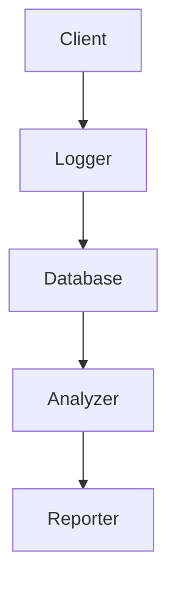
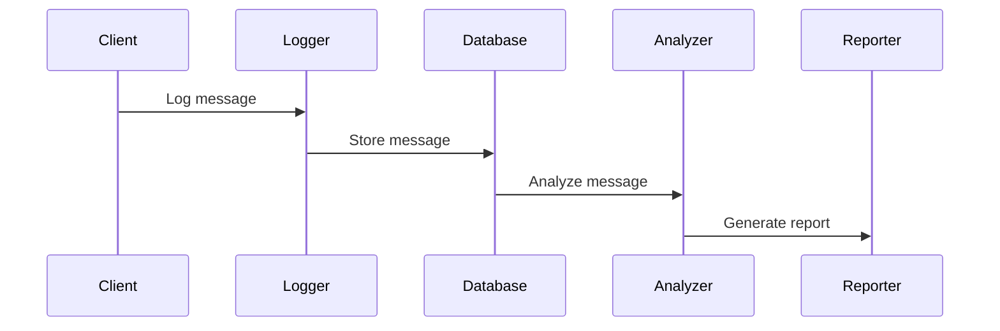

                 

# 《代码重构不得不知》

> 关键词：代码重构、方法、技巧、最佳实践

> 摘要：本文旨在深入探讨代码重构的必要性、方法、技巧和最佳实践，帮助程序员理解代码重构的核心概念，掌握重构技巧，提高代码质量，降低维护成本。

## 第一部分：代码重构概述

### 第1章：代码重构的必要性

#### 1.1 代码重构的定义

代码重构是指在不改变代码外在行为的前提下，改善其内部结构的过程。它是一种重要的软件开发实践，旨在提高代码的可读性、可维护性和可扩展性。

#### 1.2 代码重构解决的问题

- **提高代码可读性**：随着时间的推移，代码可能会变得难以理解，重构可以使得代码更易于阅读。
- **减少维护成本**：重构可以使代码结构更清晰，从而降低未来的维护成本。
- **提高代码质量**：重构有助于发现和修复潜在的缺陷，提高代码的整体质量。

#### 1.3 代码重构的基本原理

代码重构的核心原理是“不改变代码的行为”。在进行重构时，我们关注的是代码的内部结构，而不是其功能。

### 第2章：代码重构的方法与技巧

#### 2.1 重构方法的分类

- **结构重构**：涉及代码结构的改变，如提取方法、合并方法等。
- **环境重构**：涉及代码的运行环境，如优化数据库查询、缓存策略等。

#### 2.2 代码重构的技巧

- **提高代码可读性**：使用有意义的变量名、注释和文档。
- **减少维护成本**：编写简洁、模块化的代码，避免冗余和重复。

## 第二部分：核心概念与联系

### 第3章：代码重构的核心概念

代码重构的核心概念包括：
- **重构前**：原始代码的状态。
- **重构后**：重构后的代码状态。
- **重构步骤**：进行重构的具体操作。

### 第3章：代码重构的特点

- **无副作用**：重构后的代码不应影响原有功能。
- **可逆性**：重构操作应可逆，以便在需要时可以恢复到重构前的状态。

### 第3章：代码重构方法的对比

| 重构方法       | 优点             | 缺点             |
| -------------- | ---------------- | ---------------- |
| 提取方法       | 简化代码         | 可能引入额外的依赖 |
| 重新命名       | 提高可读性       | 可能需要调整其他代码 |
| 提取子函数     | 降低复杂性       | 可能增加代码行数 |
| 优化循环结构   | 提高性能         | 可能影响代码可读性 |

## 第三部分：算法原理讲解

### 第4章：代码重构的数学模型和公式

#### 4.1 代码重构的数学模型

代码重构的数学模型可以表示为：

$$\text{重构成本} = \text{重构时间} + \text{维护成本}$$

#### 4.2 代码重构的公式

$$\text{重构效率} = \frac{\text{重构后的质量}}{\text{重构成本}}$$

## 第四部分：系统分析与架构设计方案

### 第5章：代码重构的系统分析与架构设计方案

#### 5.1 代码重构的应用场景

代码重构可以应用于多种场景，如大型项目的维护、新功能的添加等。

#### 5.2 系统功能设计

使用Mermaid绘制领域模型类图，展示系统的核心功能。

#### 5.3 系统架构设计

使用Mermaid绘制系统架构图，展示系统的整体结构。

#### 5.4 系统接口设计和系统交互

使用Mermaid绘制系统接口和交互序列图，展示系统的接口设计和交互流程。

## 第五部分：项目实战

### 第6章：代码重构项目实战

#### 6.1 环境安装

介绍所需的开发环境和工具，如IDE、版本控制系统等。

#### 6.2 系统核心实现源代码

提供实际项目的核心代码，并进行解读和分析。

#### 6.3 代码应用解读与分析

分析代码的应用场景，解释重构前后的变化。

#### 6.4 实际案例分析和详细讲解

分析具体案例，详细讲解重构的过程和效果。

#### 6.5 项目小结

总结项目经验和教训，分享重构的最佳实践。

## 第六部分：最佳实践、小结、注意事项、拓展阅读

### 第7章：代码重构的最佳实践与注意事项

#### 7.1 最佳实践

提供代码重构的最佳实践建议，如定期重构、团队协作等。

#### 7.2 小结

总结本书的主要内容和收获。

#### 7.3 注意事项

提醒读者在代码重构过程中需要注意的事项。

#### 7.4 拓展阅读

推荐相关书籍和资源，以供进一步学习和研究。

作者：AI天才研究院/AI Genius Institute & 禅与计算机程序设计艺术 /Zen And The Art of Computer Programming

---

通过上述内容，我们可以构建出一篇关于代码重构的技术博客文章。接下来，我们将根据每个章节的内容进一步细化每个章节的目录，确保文章的完整性和深度。请注意，本文只是提供了一个大致的框架和内容，实际的写作过程中可能需要根据实际情况进行调整和完善。

